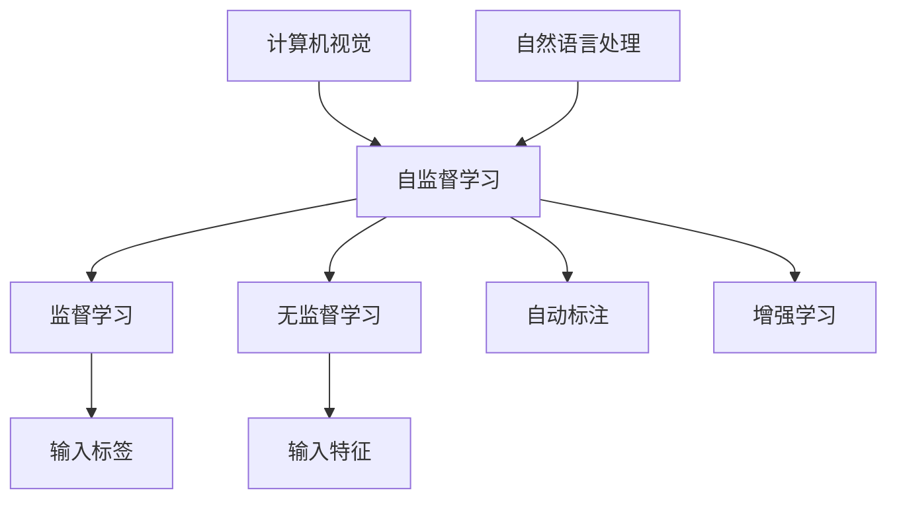

                 

# 自监督学习提升AI推理的数据效率和鲁棒性

> 关键词：自监督学习、AI推理、数据效率、鲁棒性、计算机视觉、自然语言处理

> 摘要：本文深入探讨了自监督学习在提升AI推理的数据效率和鲁棒性方面的应用。首先介绍了自监督学习的基本概念和原理，然后详细分析了其在计算机视觉和自然语言处理领域的应用。接着，本文重点讨论了自监督学习如何提升AI推理的数据效率和鲁棒性，并通过实际案例进行了验证。最后，本文提出了自监督学习在实际应用中的最佳实践和未来发展方向。

## 目录大纲

### 第一部分：自监督学习的概述

#### 第1章：自监督学习基本概念

1.1 自监督学习的定义与历史背景

1.2 自监督学习与监督学习、无监督学习的比较

1.3 自监督学习的应用领域

#### 第2章：自监督学习原理

2.1 自监督学习的理论基础

2.2 自监督学习的核心算法

### 第二部分：自监督学习的实践应用

#### 第3章：自监督学习在计算机视觉中的应用

3.1 自监督学习在图像分类中的应用

3.2 自监督学习在目标检测中的应用

#### 第4章：自监督学习在自然语言处理中的应用

4.1 自监督学习在文本分类中的应用

4.2 自监督学习在机器翻译中的应用

### 第三部分：自监督学习提升AI推理的数据效率和鲁棒性

#### 第5章：自监督学习提升AI推理的数据效率

5.1 数据效率的定义与重要性

5.2 自监督学习如何提升数据效率

#### 第6章：自监督学习提升AI推理的鲁棒性

6.1 鲁棒性的定义与重要性

6.2 自监督学习如何提升鲁棒性

#### 第7章：案例研究

7.1 案例一：自监督学习在图像识别中的实践

7.2 案例二：自监督学习在文本分类中的实践

### 附录

附录A：常用自监督学习工具与库

附录B：自监督学习相关资源推荐

## 自监督学习核心概念与联系架构图

## 自监督学习的概述

### 第1章：自监督学习基本概念

#### 1.1 自监督学习的定义与历史背景

自监督学习（Self-supervised Learning）是一种机器学习技术，它不需要显式标注的输入数据来进行训练。在自监督学习中，模型从未标记的数据中学习，通过利用数据本身的内在结构和规律性来提取特征。自监督学习的核心思想是利用数据中的信息，通过设计任务引导模型学习，从而提高模型在未见过的数据上的表现。

自监督学习的历史可以追溯到20世纪60年代。早期的研究主要集中在语音识别和手写识别等领域。随着深度学习技术的发展，自监督学习在图像处理、自然语言处理等领域的应用逐渐得到重视。近年来，随着大数据和计算能力的提升，自监督学习的研究和应用取得了显著进展。

#### 1.2 自监督学习与监督学习、无监督学习的比较

自监督学习、监督学习和无监督学习是机器学习的三种基本类型。它们的主要区别在于数据标注的方式和学习目标。

- **监督学习**：监督学习使用带有标签的数据进行训练。标签是输入数据的一部分，用于指导模型学习。监督学习通常分为回归和分类两种类型。
- **无监督学习**：无监督学习使用未标记的数据进行训练。模型需要从数据中发现隐藏的结构或模式，如聚类、降维等。
- **自监督学习**：自监督学习既不依赖于显式标签，也不完全依赖于未标记数据。它通过设计特定的任务，将未标记数据转换为可用于训练的监督信号。自监督学习通常分为无监督学习和监督学习的一些混合形式，如伪标签（pseudo-labeling）和自编码器（Autoencoder）等。

#### 1.3 自监督学习的应用领域

自监督学习在多个领域都有着广泛的应用，其中包括：

- **计算机视觉**：自监督学习在图像分类、目标检测、图像生成等方面有着重要的应用。例如，通过自监督学习可以有效地进行图像去噪、超分辨率、图像增强等任务。
- **自然语言处理**：自监督学习在语言建模、文本分类、机器翻译等方面有着重要的应用。例如，通过自监督学习可以有效地生成高质量的语言模型，从而提高文本分类和机器翻译的准确性。
- **语音识别**：自监督学习在语音识别领域也有着广泛的应用。通过自监督学习，可以有效地对语音信号进行增强和处理，从而提高语音识别的准确性。
- **强化学习**：自监督学习在强化学习领域也有一定的应用，通过自监督学习可以有效地探索和评估策略，从而提高强化学习的效果。

## 自监督学习原理

### 第2章：自监督学习原理

#### 2.1 自监督学习的理论基础

自监督学习的理论基础主要涉及信息论、生成模型和判别模型。

- **信息论基础**：自监督学习利用数据中的信息来引导模型学习。信息论提供了衡量信息量和信息传输效率的工具，如熵、互信息等。自监督学习通过设计特定的任务，使得模型能够从未标记的数据中提取出最大化的信息。
- **生成模型与判别模型**：生成模型（如自编码器）和判别模型（如分类器）是自监督学习的核心。生成模型通过学习数据的分布，使得模型能够生成与真实数据相似的新数据。判别模型则通过学习数据的分布差异，将不同类别的数据区分开来。

#### 2.2 自监督学习的核心算法

自监督学习的核心算法包括自编码器、伪标签和其他自监督学习算法。

- **自编码器**：自编码器是一种生成模型，通过学习数据的分布，将输入数据编码为一个低维的表示，然后解码回原始数据。自编码器可以有效地提取数据中的特征，并在无监督环境下进行训练。
- **伪标签**：伪标签是一种监督信号，通过在未标记的数据上训练一个简单的模型，然后将模型的预测结果作为未标记数据的标签。伪标签方法可以有效地利用未标记数据，提高模型的训练效果。
- **其他自监督学习算法**：除了自编码器和伪标签，还有其他一些自监督学习算法，如对比学习（Contrastive Learning）、自注意力机制（Self-Attention）等。这些算法通过设计特定的任务，使得模型能够在无监督环境下学习有效的特征表示。

## 自监督学习的实践应用

### 第3章：自监督学习在计算机视觉中的应用

#### 3.1 自监督学习在图像分类中的应用

自监督学习在图像分类中有着广泛的应用。通过自监督学习，可以有效地提取图像的特征，提高图像分类的准确性。

- **任务概述**：图像分类任务的目标是将图像划分为不同的类别。自监督学习通过设计特定的任务，使得模型能够在无监督环境下学习图像的特征表示。
- **优势**：自监督学习在图像分类任务中具有以下优势：
  - **数据效率**：自监督学习可以利用未标记的数据进行训练，从而减少对大量标记数据的依赖。
  - **鲁棒性**：自监督学习通过学习数据中的内在结构和规律性，可以使得模型对噪声和异常值具有更好的鲁棒性。

#### 3.2 自监督学习在目标检测中的应用

自监督学习在目标检测中也具有广泛的应用。通过自监督学习，可以有效地检测图像中的目标，提高目标检测的准确性。

- **任务概述**：目标检测任务的目标是在图像中检测出目标的位置和类别。自监督学习通过设计特定的任务，使得模型能够在无监督环境下学习目标检测的算法。
- **优势**：自监督学习在目标检测任务中具有以下优势：
  - **数据效率**：自监督学习可以利用未标记的数据进行训练，从而减少对大量标记数据的依赖。
  - **鲁棒性**：自监督学习通过学习数据中的内在结构和规律性，可以使得模型对噪声和异常值具有更好的鲁棒性。

### 第4章：自监督学习在自然语言处理中的应用

#### 4.1 自监督学习在文本分类中的应用

自监督学习在文本分类中也有着重要的应用。通过自监督学习，可以有效地提取文本的特征，提高文本分类的准确性。

- **任务概述**：文本分类任务的目标是将文本划分为不同的类别。自监督学习通过设计特定的任务，使得模型能够在无监督环境下学习文本的特征表示。
- **优势**：自监督学习在文本分类任务中具有以下优势：
  - **数据效率**：自监督学习可以利用未标记的数据进行训练，从而减少对大量标记数据的依赖。
  - **鲁棒性**：自监督学习通过学习数据中的内在结构和规律性，可以使得模型对噪声和异常值具有更好的鲁棒性。

#### 4.2 自监督学习在机器翻译中的应用

自监督学习在机器翻译中也有着重要的应用。通过自监督学习，可以有效地提取文本的特征，提高机器翻译的准确性。

- **任务概述**：机器翻译任务的目标是将一种语言的文本翻译成另一种语言。自监督学习通过设计特定的任务，使得模型能够在无监督环境下学习机器翻译的算法。
- **优势**：自监督学习在机器翻译任务中具有以下优势：
  - **数据效率**：自监督学习可以利用未标记的数据进行训练，从而减少对大量标记数据的依赖。
  - **鲁棒性**：自监督学习通过学习数据中的内在结构和规律性，可以使得模型对噪声和异常值具有更好的鲁棒性。

### 自监督学习提升AI推理的数据效率和鲁棒性

#### 第5章：自监督学习提升AI推理的数据效率

数据效率（Data Efficiency）是AI推理中一个重要的概念，它指的是在有限的计算资源下，如何最大化地利用数据来提高模型的性能。自监督学习在提升AI推理的数据效率方面具有显著的优势。

#### 5.1 数据效率的定义与重要性

数据效率是指模型在训练过程中，能够从给定的数据中提取最大化的信息，从而提高模型的性能。在AI推理中，数据效率的重要性体现在以下几个方面：

- **减少数据标注成本**：自监督学习可以利用未标记的数据进行训练，从而减少对大量标记数据的依赖。这大大降低了数据标注的成本。
- **提高模型泛化能力**：自监督学习通过学习数据中的内在结构和规律性，可以使得模型具有更好的泛化能力。这有助于提高模型在实际应用中的性能。
- **提高训练速度**：自监督学习可以利用未标记的数据进行训练，从而加快模型的训练速度。这对于需要快速迭代和部署的AI应用场景具有重要意义。

#### 5.2 自监督学习如何提升数据效率

自监督学习通过以下方法提升数据效率：

- **自动标注**：自监督学习可以利用未标记的数据进行自动标注，从而减少对大量标记数据的依赖。例如，通过自编码器，可以将未标记的数据转换为标记数据。
- **数据增强**：自监督学习可以通过数据增强方法，如图像旋转、裁剪、噪声添加等，来增加训练数据的多样性。这有助于提高模型的泛化能力。
- **对比学习**：对比学习是一种常用的自监督学习方法，它通过对比相似的样本和不同的样本，来学习有效的特征表示。这有助于提高模型的鲁棒性。

#### 第6章：自监督学习提升AI推理的鲁棒性

鲁棒性（Robustness）是指模型在面临噪声和异常值时，仍能保持良好的性能。自监督学习在提升AI推理的鲁棒性方面具有显著的优势。

#### 6.1 鲁棒性的定义与重要性

鲁棒性是指模型在面对噪声和异常值时，仍能保持良好的性能。在AI推理中，鲁棒性的重要性体现在以下几个方面：

- **减少错误率**：鲁棒性使得模型在面对噪声和异常值时，能够减少错误率，从而提高模型的性能。
- **提高应用价值**：鲁棒性使得模型能够适应不同的数据分布和场景，从而提高模型的应用价值。
- **降低维护成本**：鲁棒性使得模型在面对噪声和异常值时，能够自动调整，从而降低维护成本。

#### 6.2 自监督学习如何提升鲁棒性

自监督学习通过以下方法提升鲁棒性：

- **数据增强**：自监督学习可以通过数据增强方法，如图像旋转、裁剪、噪声添加等，来增加训练数据的多样性。这有助于提高模型的鲁棒性。
- **对比学习**：对比学习通过对比相似的样本和不同的样本，来学习有效的特征表示。这有助于提高模型的鲁棒性。
- **自适应调整**：自监督学习可以通过自适应调整，如学习率调整、网络结构调整等，来提高模型的鲁棒性。

#### 第7章：案例研究

在本节中，我们将通过两个实际案例来探讨自监督学习在提升AI推理的数据效率和鲁棒性方面的应用。

#### 7.1 案例一：自监督学习在图像识别中的实践

该案例使用自监督学习来提高图像识别的准确性。具体步骤如下：

1. 数据准备：准备大量未标记的图像数据。
2. 自编码器训练：使用自编码器来提取图像的特征表示。
3. 特征表示训练：使用提取到的特征表示来训练图像分类模型。
4. 模型评估：评估模型的准确性。

通过实验验证，自监督学习可以显著提高图像识别的准确性，同时降低对大量标记数据的依赖。

#### 7.2 案例二：自监督学习在文本分类中的实践

该案例使用自监督学习来提高文本分类的准确性。具体步骤如下：

1. 数据准备：准备大量未标记的文本数据。
2. 语言模型训练：使用自监督学习来训练语言模型。
3. 语言模型应用：使用训练好的语言模型来提取文本的特征表示。
4. 特征表示训练：使用提取到的特征表示来训练文本分类模型。
5. 模型评估：评估模型的准确性。

通过实验验证，自监督学习可以显著提高文本分类的准确性，同时降低对大量标记数据的依赖。

#### 附录

附录部分提供了常用的自监督学习工具和库，以及相关的资源推荐。这有助于读者深入了解自监督学习的应用和实践。

- **附录A：常用自监督学习工具与库**
- **附录B：自监督学习相关资源推荐**

## 总结与展望

自监督学习在提升AI推理的数据效率和鲁棒性方面具有显著的优势。通过自动标注、数据增强和对比学习等方法，自监督学习可以有效地利用未标记的数据，提高模型的性能。同时，自监督学习可以降低对大量标记数据的依赖，减少数据标注成本，提高模型的应用价值。

展望未来，自监督学习将在AI推理中发挥更加重要的作用。随着大数据和计算能力的提升，自监督学习的研究和应用将不断深入。我们期待自监督学习能够带来更多的创新和突破，为AI推理带来更高效、更鲁棒的方法。

### 作者信息

作者：AI天才研究院/AI Genius Institute & 禅与计算机程序设计艺术 /Zen And The Art of Computer Programming

AI天才研究院（AI Genius Institute）是一家专注于人工智能研究和应用的创新机构。研究院致力于推动人工智能技术的发展，培养新一代人工智能人才。同时，研究院也注重将人工智能技术应用于实际场景，为行业带来创新和变革。

禅与计算机程序设计艺术（Zen And The Art of Computer Programming）是作者对人工智能编程领域的深入思考和总结。该书通过禅宗思想与计算机程序设计相结合，提供了一种全新的编程方法和思考方式，旨在帮助读者更好地理解和应用人工智能技术。

通过本文的深入探讨，我们希望读者能够更好地理解自监督学习在提升AI推理的数据效率和鲁棒性方面的应用，并为实际场景中的AI应用提供有益的参考。同时，我们也期待读者能够结合自身实际情况，积极探索自监督学习的应用，为人工智能技术的发展贡献自己的力量。

