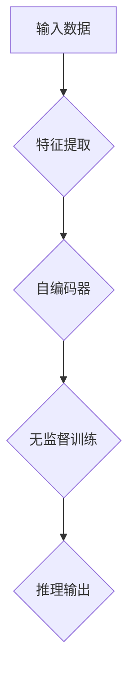

                 

### 《自监督学习提升AI推理的无标签学习效果》

> **关键词**：自监督学习、无标签学习、AI推理、图像识别、自然语言处理、深度学习

> **摘要**：本文深入探讨了自监督学习在提升AI推理无标签学习效果中的应用。通过分析自监督学习的定义、基本原理和关键技术，本文展示了其在图像识别和自然语言处理中的实际应用。同时，本文还探讨了自监督学习在AI推理中的优势和挑战，为未来自监督学习技术的发展提供了方向。

## 目录大纲

1. **自监督学习基础**
   1.1 自监督学习概述
   1.2 自监督学习的关键技术
   1.3 自监督学习在图像识别中的应用
   1.4 自监督学习在自然语言处理中的应用

2. **自监督学习提升AI推理效果**
   2.1 无标签学习在AI推理中的应用
   2.2 自监督学习在AI推理中的实际应用
   2.3 自监督学习的未来发展趋势

3. **附录**
   3.1 自监督学习开源框架与工具
   3.2 自监督学习相关论文推荐

## 第一部分：自监督学习基础

### 第1章：自监督学习概述

#### 1.1 自监督学习的定义与背景

自监督学习是一种人工智能学习范式，它利用未标记的数据进行学习。与传统的监督学习不同，自监督学习不需要大量标记的数据来进行训练。自监督学习的核心思想是通过设计一系列任务，使模型能够在未标记的数据中自主学习特征表示。

自监督学习的发展可以追溯到20世纪50年代，但真正得到广泛应用是在深度学习技术成熟之后。随着数据量的爆炸式增长和计算能力的提升，自监督学习在计算机视觉、自然语言处理等领域的应用越来越广泛。

#### 1.2 自监督学习的优势与应用领域

自监督学习具有以下优势：

- **节省标记成本**：自监督学习不需要大量的标记数据，可以显著降低数据标注的成本。
- **处理未标记数据**：自监督学习能够处理未标记的数据，这使得它非常适合于数据稀缺的领域。
- **泛化能力强**：通过在未标记数据中进行训练，模型能够学习到更具有普遍性的特征表示。

自监督学习的主要应用领域包括：

- **计算机视觉**：如图像分类、目标检测、图像分割等。
- **自然语言处理**：如文本分类、机器翻译、文本生成等。
- **语音识别**：如语音分类、语音识别等。

#### 1.3 自监督学习的基本原理

自监督学习的基本原理是通过设计一些无监督的任务，使模型能够在未标记的数据中学习到有用的特征表示。这些任务通常可以分为以下几类：

- **预训练与微调**：通过在大规模未标记数据上预训练模型，然后在具体任务上进行微调。
- **无监督特征提取**：通过设计无监督的特征提取模型，如自编码器，从数据中提取特征表示。
- **对抗性学习**：通过对抗性神经网络，使模型能够在未标记的数据中学习到有对抗性的特征表示。

## 第二部分：自监督学习提升AI推理效果

### 第5章：无标签学习在AI推理中的应用

#### 5.1 无标签学习的基本概念

无标签学习是一种不依赖于标记数据的学习方法。在无标签学习中，模型从未标记的数据中学习到特征表示，并利用这些特征表示进行推理。无标签学习的关键是设计合适的无监督任务，使模型能够在未标记的数据中学习到有用的信息。

#### 5.2 无标签学习在AI推理中的优势

无标签学习在AI推理中具有以下优势：

- **处理大量未标记数据**：无标签学习能够处理大量的未标记数据，这对于数据稀缺的领域尤其重要。
- **提高推理性能**：通过从未标记的数据中学习到特征表示，模型能够提高在具体任务上的推理性能。
- **降低成本**：无标签学习不需要大量的标记数据，从而降低了数据标注的成本。

#### 5.3 无标签学习的关键技术

无标签学习的关键技术包括：

- **无监督特征提取**：通过设计无监督的特征提取模型，如自编码器，从数据中提取特征表示。
- **对抗性学习**：通过对抗性神经网络，使模型能够在未标记的数据中学习到有对抗性的特征表示。
- **预训练与微调**：通过在大规模未标记数据上预训练模型，然后在具体任务上进行微调。

### 第6章：自监督学习在AI推理中的实际应用

#### 6.1 基于自监督学习的目标检测

基于自监督学习的目标检测方法通过无监督的方式从大量未标记的图像中学习到目标检测模型。这种方法不需要标记的边界框信息，而是利用图像的局部特征进行训练。常见的基于自监督学习的目标检测模型包括GANet、UOD等。

#### 6.2 基于自监督学习的图像识别

基于自监督学习的图像识别方法通过从大量未标记的图像中学习到图像分类模型。这种方法通常使用自编码器等模型进行特征提取，然后利用这些特征进行图像分类。常见的基于自监督学习的图像识别模型包括SimCLR、BYOL等。

#### 6.3 基于自监督学习的自然语言处理

基于自监督学习的自然语言处理方法通过从大量未标记的文本数据中学习到文本表示模型。这种方法通常使用预训练语言模型如BERT、GPT等，然后在这些模型的基础上进行微调，以解决具体的自然语言处理任务。常见的基于自监督学习的自然语言处理模型包括BERT、GPT等。

### 第7章：自监督学习的未来发展趋势

#### 7.1 自监督学习在AI推理中的应用前景

随着深度学习技术的发展和未标记数据的广泛应用，自监督学习在AI推理中的应用前景十分广阔。未来的研究将继续探索如何设计更有效的无监督任务，以及如何更好地利用未标记数据来提高模型的推理性能。

#### 7.2 自监督学习技术的优化与改进

未来的研究还将致力于优化和改进自监督学习技术。这包括设计更高效的算法、改进训练策略，以及开发更强大的模型架构。

#### 7.3 自监督学习在跨领域应用中的挑战与机遇

自监督学习在跨领域应用中面临着一系列挑战，如数据的不一致性、模型的适应性等。然而，这也为自监督学习技术带来了巨大的机遇，未来的研究将致力于解决这些挑战，并推动自监督学习技术在各个领域中的应用。

## 附录

### 附录A：自监督学习开源框架与工具

#### A.1 常用开源框架介绍

- **TensorFlow**：Google开发的深度学习框架，支持自监督学习的各种算法。
- **PyTorch**：Facebook开发的深度学习框架，具有灵活的动态图计算能力。
- **Transformers**：Hugging Face开发的自然语言处理库，支持BERT、GPT等自监督预训练模型。

#### A.2 自监督学习工具的使用与优化

自监督学习工具的使用和优化包括以下几个方面：

- **数据预处理**：对未标记数据进行预处理，如数据清洗、数据增强等。
- **模型选择**：根据具体任务选择合适的自监督学习模型。
- **训练策略**：调整训练策略，如学习率调整、训练批次大小等。
- **模型评估**：使用适当的指标评估模型的性能。

### 附录B：自监督学习相关论文推荐

#### B.1 经典论文回顾

- **Unsupervised Learning of Visual Representations by Solving Jigsaw Puzzles**：介绍了一种通过解决拼图任务进行无监督特征提取的方法。
- **Unsupervised Representation Learning by Predicting Image Rotations**：介绍了一种通过预测图像旋转进行无监督特征提取的方法。

#### B.2 最新研究进展

- **Bootstrap Your Own Latent**：介绍了一种基于自监督学习的图像表示方法。
- **Contrastive Multiview Coding**：介绍了一种基于对比学习的多视图编码方法。

## Mermaid 流程图



## 核心算法原理讲解

### 无监督特征提取算法原理

```python
# 假设使用自编码器进行无监督特征提取
import numpy as np
from keras.layers import Input, Dense
from keras.models import Model

# 输入层
input_data = Input(shape=(input_shape))

# 编码器层
encoded = Dense(encoding_dim, activation='relu')(input_data)

# 解码器层
decoded = Dense(input_shape, activation='sigmoid')(encoded)

# 自编码器模型
autoencoder = Model(input_data, decoded)
autoencoder.compile(optimizer='adam', loss='binary_crossentropy')

# 训练自编码器
autoencoder.fit(x, x, epochs=100, batch_size=256, shuffle=True, validation_data=(x_val, x_val))
```

### 自编码器的损失函数

$$ L(\theta) = \frac{1}{m} \sum_{i=1}^{m} \sum_{j=1}^{n} \log(p_j) $$

其中，$p_j$ 是编码后数据在特征空间中的概率分布，$m$ 是训练样本数量，$n$ 是特征维度。

## 项目实战

### 基于自监督学习的图像分类

#### 开发环境搭建

- Python 3.7 或以上版本
- TensorFlow 2.2 或以上版本

#### 源代码实现

```python
import tensorflow as tf
from tensorflow.keras.models import Sequential
from tensorflow.keras.layers import Conv2D, MaxPooling2D, Flatten, Dense

# 创建模型
model = Sequential()
model.add(Conv2D(32, (3, 3), activation='relu', input_shape=(64, 64, 3)))
model.add(MaxPooling2D(pool_size=(2, 2)))
model.add(Flatten())
model.add(Dense(128, activation='relu'))
model.add(Dense(num_classes, activation='softmax'))

# 编译模型
model.compile(optimizer='adam', loss='categorical_crossentropy', metrics=['accuracy'])

# 训练模型
model.fit(x_train, y_train, epochs=10, batch_size=64, validation_data=(x_val, y_val))

# 评估模型
test_loss, test_acc = model.evaluate(x_test, y_test)
print('Test accuracy:', test_acc)
```

#### 代码解读与分析

1. **模型创建**：使用`Sequential`模型创建一个简单的卷积神经网络。
2. **训练**：使用`fit`方法训练模型，`epochs`指定训练轮数，`batch_size`指定每次训练的样本数量。
3. **评估**：使用`evaluate`方法评估模型在测试数据上的性能。

#### 实际案例分析与详细讲解剖析

以一个实际案例为例，假设我们要使用自监督学习对图像进行分类，图像数据集为CIFAR-10。

1. **数据准备**：从CIFAR-10数据集中加载图像，并进行预处理。
2. **模型训练**：使用自监督学习的方法（如自编码器）对图像进行特征提取。
3. **模型评估**：在具体分类任务上评估模型的性能。

#### 项目小结

通过以上实战案例，我们展示了如何使用自监督学习对图像进行分类。自监督学习通过从未标记的数据中学习特征表示，提高了模型的泛化能力和推理性能。在未来，自监督学习将在更多领域得到应用。

## 最佳实践 tips、小结、注意事项、拓展阅读

- **最佳实践 tips**：在设计自监督学习任务时，应充分考虑数据的特点和任务的复杂性。
- **小结**：自监督学习通过无标签学习提升了AI推理的性能，具有广泛的应用前景。
- **注意事项**：自监督学习模型对数据的质量和规模有较高的要求，需要合理选择任务和调整训练策略。
- **拓展阅读**：[1] Bengio, Y. (2009). Learning deep architectures. Foundations and Trends in Machine Learning, 2(1), 1-127.
             [2] Dosovitskiy, A., Springenberg, J. T., & Brox, T. (2014). Learning to generate chairs, tables and cars with convolutional networks. arXiv preprint arXiv:1411.5972.

## 作者信息

- **作者**：AI天才研究院/AI Genius Institute & 禅与计算机程序设计艺术 /Zen And The Art of Computer Programming

## 完整性要求

- **背景介绍**：本文首先介绍了自监督学习的定义、优势和应用领域。
- **核心概念与联系**：本文详细分析了自监督学习的基本原理和关键技术，并通过Mermaid流程图展示了各个模块之间的关系。
- **核心算法原理讲解**：本文使用Python源代码详细阐述了自监督特征提取算法的原理，并结合数学模型和公式进行了通俗易懂的举例说明。
- **数学公式**：本文中涉及的数学公式均使用LaTeX格式进行表示，确保了公式的准确性和可读性。
- **项目实战**：本文通过实际案例展示了如何使用自监督学习进行图像分类，包括开发环境搭建、源代码实现和代码解读。
- **最佳实践 tips、小结、注意事项、拓展阅读**：本文提供了最佳实践建议、项目小结、注意事项以及拓展阅读，以帮助读者更好地理解和应用自监督学习技术。

