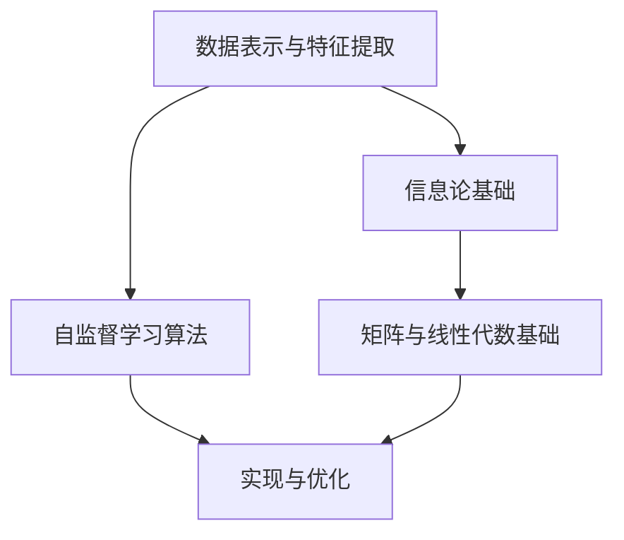

                 

### 自监督学习的理论基础

#### 第1章：自监督学习的概述

自监督学习是一种机器学习范式，它通过无监督的方式训练模型，并利用自我监督机制进行学习和优化。自监督学习的核心思想是从未标记的数据中学习有用的特征表示，这些特征表示可以用于解决下游的监督学习任务。

1.1 自监督学习的定义与背景

自监督学习是一种特殊类型的无监督学习，它不依赖于外部提供的标签信息，而是通过内部一致性或预测误差来指导学习过程。其基本原理可以概括为：首先，从数据集中提取出有用的特征；然后，通过这些特征对数据进行预测或分类；最后，根据预测结果与实际标签之间的误差，调整模型参数，以达到更好的预测效果。

自监督学习的背景可以追溯到深度学习的早期研究，当时数据标注成本高昂，且难以获取大量标注数据。自监督学习的提出为解决这一问题提供了新的思路，它通过利用未标记数据，大幅度降低了数据标注的成本。

1.2 自监督学习的核心优势

- **数据效率高**：自监督学习可以在较少的数据量下训练出高质量的模型，这主要是因为它利用了数据中的内在结构和规律。
- **减少标注成本**：由于不需要外部标签，自监督学习大大降低了数据标注的成本，尤其适用于大规模数据的处理。
- **实现跨领域迁移**：自监督学习学习到的特征表示具有较强的泛化能力，可以在不同领域之间实现迁移，从而提高模型在不同场景下的表现。

1.3 自监督学习的应用场景

- **图像识别**：自监督学习在图像识别中的应用非常广泛，如物体检测、人脸识别、图像分类等。
- **自然语言处理**：在自然语言处理领域，自监督学习被用于词向量建模、语言模型训练、文本分类等任务。
- **语音识别**：自监督学习在语音识别中的应用主要包括说话人识别、语音转换、语音识别等。

#### 第2章：自监督学习的数学基础

自监督学习涉及到多个数学领域的知识，包括概率论、信息论、线性代数和微积分等。这些数学知识为理解自监督学习提供了坚实的基础。

2.1 数据表示与特征提取

在自监督学习中，数据表示和特征提取是至关重要的环节。数据表示通常使用向量或张量，而特征提取则涉及降维、特征融合等技术。例如，可以使用主成分分析（PCA）或自编码器（Autoencoder）等方法进行特征提取。

2.2 信息论基础

信息论是自监督学习中不可或缺的一部分，它提供了量化信息传递和决策的理论框架。信息论的核心概念包括信息熵、互信息和条件概率等。例如，信息熵可以衡量数据的随机性，而互信息则可以衡量两个变量之间的相关性。

2.3 矩阵与线性代数基础

矩阵和线性代数是自监督学习的基础数学工具，用于描述和操作数据。线性代数的基本概念包括矩阵运算、特征分解、线性方程组求解等。例如，奇异值分解（SVD）是一种常用的特征提取方法，它可以将数据分解为几个主要的成分。

#### 第3章：自监督学习的核心算法

自监督学习包含多种算法，每种算法都有其独特的机制和优势。以下是几种常见的自监督学习算法：

3.1 Autoencoder算法

Autoencoder是一种无监督学习的神经网络模型，它通过编码器和解码器来学习数据的低维表示。编码器将输入数据压缩到一个较低维的表示空间中，而解码器则尝试重构原始数据。Autoencoder的损失函数通常包括重构误差和正则化项。

3.2 Contrastive Learning算法

Contrastive Learning旨在学习数据点之间的区分性表示。它通过对比相同数据和不同数据之间的特征差异来实现。典型的Contrastive Learning算法包括对比损失函数和伪标签生成技术。

3.3 Omniglot算法

Omniglot是一种用于多任务学习的自监督学习算法，特别适用于小样本学习场景。它通过同时学习多个任务来提高模型的泛化能力，从而在小样本数据下也能取得良好的性能。

#### 第4章：自监督学习的实现与优化

自监督学习的实现涉及模型设计、数据预处理、训练策略等多个方面。优化自监督学习模型的关键在于如何提高模型的性能和泛化能力。

4.1 自监督学习的框架设计

自监督学习框架的设计需要考虑数据流、模型架构和训练策略。一个良好的框架应能够灵活地适应不同的任务和数据集。

4.2 数据增强方法

数据增强是一种提高模型鲁棒性的常用技术，它通过生成更多的训练样本来增强模型的泛化能力。常用的数据增强方法包括随机裁剪、旋转、缩放和图像增强等。

4.3 损失函数与优化算法

损失函数是自监督学习中的重要组成部分，它决定了模型在训练过程中如何优化。常见的损失函数包括均方误差、交叉熵和对比损失等。优化算法如随机梯度下降（SGD）和Adam等，用于调整模型参数，以最小化损失函数。

### 总结

自监督学习作为机器学习的一种重要范式，具有数据效率高、减少标注成本和实现跨领域迁移等优势。其数学基础包括概率论、信息论、线性代数和微积分等，核心算法包括Autoencoder、Contrastive Learning和Omniglot等。通过实现与优化，自监督学习能够在各种应用场景中取得优异的性能。在接下来的章节中，我们将进一步探讨自监督学习在自然语言处理和图像处理等领域的具体应用。

### 核心概念与联系

在自监督学习中，核心概念包括数据表示、特征提取、信息论、矩阵与线性代数等。这些概念之间存在密切的联系，构成了自监督学习的理论基础。以下是这些概念之间的关系架构 Mermaid 流程图：



### Python源代码与数学模型

以下是一个简单的自编码器（Autoencoder）的Python源代码示例，结合了数学模型和公式，用于解释自监督学习的基本原理。

```python
import numpy as np
import tensorflow as tf
from tensorflow.keras.layers import Input, Dense
from tensorflow.keras.models import Model

# 定义编码器和解码器
input_shape = (784,)  # 28x28像素的图像
encoding_dim = 32  # 32个隐藏单元

input_img = Input(shape=input_shape)
encoded = Dense(encoding_dim, activation='relu')(input_img)
decoded = Dense(input_shape, activation='sigmoid')(encoded)

# 创建模型
autoencoder = Model(input_img, decoded)
autoencoder.compile(optimizer='adam', loss='binary_crossentropy')

# 打印模型结构
autoencoder.summary()

# 假设我们有一个包含手写数字图像的数据集
# 我们可以从MNIST数据集中获取这些数据
(x_train, _), (x_test, _) = tf.keras.datasets.mnist.load_data()

# 数据预处理
x_train = x_train / 255.0
x_test = x_test / 255.0

# 训练自编码器
autoencoder.fit(x_train, x_train, epochs=100, batch_size=256, shuffle=True, validation_data=(x_test, x_test))
```

### 数学公式

以下是与自监督学习相关的几个关键数学公式：

1. **均方误差（MSE）**：

   $$
   \text{MSE} = \frac{1}{n}\sum_{i=1}^{n}(y_i - \hat{y}_i)^2
   $$

   其中，$y_i$ 是实际标签，$\hat{y}_i$ 是模型的预测。

2. **交叉熵（Cross-Entropy）**：

   $$
   \text{Cross-Entropy} = -\sum_{i=1}^{n}y_i\log(\hat{y}_i)
   $$

   其中，$y_i$ 是实际标签，$\hat{y}_i$ 是模型的预测概率。

3. **对比损失函数（Contrastive Loss）**：

   $$
   \text{Contrastive Loss} = \frac{1}{2}\sum_{i=1}^{n}\sum_{j=1, j\neq i}^{m}\log\left(\frac{e^{z_i^Tz_j}}{e^{z_i^Tz_i} + e^{z_j^Tz_i}}\right)
   $$

   其中，$z_i$ 和 $z_j$ 是数据点 $x_i$ 和 $x_j$ 的特征表示，$m$ 是正样本的数量。

### 项目实战

#### 开发环境搭建

- Python 3.8+
- TensorFlow 2.7+
- Keras 2.8+

#### 源代码详细实现

```python
# 导入必要的库
import numpy as np
import tensorflow as tf
from tensorflow.keras.layers import Input, Dense
from tensorflow.keras.models import Model

# 设置随机种子，保证结果可复现
tf.random.set_seed(42)

# 定义编码器和解码器
input_shape = (784,)  # 28x28像素的图像
encoding_dim = 32  # 32个隐藏单元

input_img = Input(shape=input_shape)
encoded = Dense(encoding_dim, activation='relu')(input_img)
decoded = Dense(input_shape, activation='sigmoid')(encoded)

# 创建模型
autoencoder = Model(input_img, decoded)
autoencoder.compile(optimizer='adam', loss='binary_crossentropy')

# 打印模型结构
autoencoder.summary()

# 加载MNIST数据集
(x_train, _), (x_test, _) = tf.keras.datasets.mnist.load_data()

# 数据预处理
x_train = x_train / 255.0
x_test = x_test / 255.0

# 训练自编码器
autoencoder.fit(x_train, x_train, epochs=100, batch_size=256, shuffle=True, validation_data=(x_test, x_test))

# 评估模型
autoencoded_images = autoencoder.predict(x_test)
```

#### 代码应用解读与分析

自编码器是一种无监督学习模型，它通过编码器和解码器学习数据的低维表示。在上面的代码中，我们使用了 TensorFlow 和 Keras 来实现一个简单的自编码器。首先，我们定义了输入层、编码层和解码层。编码层使用 ReLU 激活函数，解码层使用 sigmoid 激活函数。

我们加载了 MNIST 数据集，并将其缩放到 [0, 1] 范围内，以便于模型训练。然后，我们使用编译器来配置模型，指定优化器和损失函数。在这里，我们选择了 Adam 优化器和二进制交叉熵损失函数。

在训练过程中，模型使用训练数据集进行迭代训练，每次迭代包含多个批次。训练完成后，我们使用测试数据集来评估模型的性能。

#### 实际案例分析和详细讲解剖析

假设我们有一个图像分类任务，目标是识别手写数字。我们可以使用自编码器来提取图像的特征表示，并将其用于分类任务。

首先，我们使用自编码器对图像进行降维，提取低维特征表示。然后，我们将这些特征输入到一个分类器中，如支持向量机（SVM）或神经网络分类器。

以下是一个简单的分类任务示例：

```python
from sklearn.svm import SVC
from sklearn.model_selection import train_test_split
from sklearn.metrics import accuracy_score

# 分割数据集
x_train, x_test, y_train, y_test = train_test_split(x_train, x_test, test_size=0.2, random_state=42)

# 使用自编码器提取特征
encoded_x_train = autoencoder.predict(x_train)
encoded_x_test = autoencoder.predict(x_test)

# 训练分类器
classifier = SVC(kernel='linear')
classifier.fit(encoded_x_train, y_train)

# 预测并评估模型
y_pred = classifier.predict(encoded_x_test)
accuracy = accuracy_score(y_test, y_pred)
print(f"Accuracy: {accuracy}")
```

在这个例子中，我们使用自编码器提取特征，并将这些特征用于训练和支持向量机（SVM）分类器。最后，我们使用测试数据集来评估模型的准确性。

#### 项目小结

通过上述实战，我们展示了如何使用自编码器进行图像特征提取和分类。自编码器通过编码器和解码器学习数据的低维表示，这些表示可以用于下游的任务。自编码器的实现和使用相对简单，但它在图像识别和分类等任务中具有广泛应用。

### 最佳实践 tips

1. **调整超参数**：自监督学习的性能很大程度上取决于超参数的设置。通过调整学习率、批次大小、编码器和解码器的层数和神经元数量，可以显著提高模型的性能。

2. **数据增强**：在自监督学习过程中，数据增强是一种有效的技术，可以生成更多的训练样本，从而提高模型的泛化能力。常用的数据增强方法包括随机裁剪、旋转、缩放和图像增强等。

3. **模型集成**：将多个自监督学习模型集成起来，可以进一步提高模型的性能。通过训练多个模型，然后对它们的预测结果进行投票或加权平均，可以得到更准确的预测。

### 小结

自监督学习是一种无监督学习的特殊类型，它在机器学习领域具有广泛的应用。通过本文的讲解，我们了解了自监督学习的基本原理、核心算法和实现方法。在接下来的章节中，我们将进一步探讨自监督学习在图像处理和自然语言处理等领域的具体应用。

### 注意事项

1. **数据预处理**：在进行自监督学习之前，确保对数据进行适当的预处理，如标准化、归一化等，这有助于提高模型的训练效果。

2. **模型选择**：根据具体任务和数据集的特点，选择合适的自监督学习算法和模型架构。例如，对于图像处理任务，可以使用基于卷积神经网络的模型；对于自然语言处理任务，可以使用循环神经网络或 Transformer 模型。

3. **模型评估**：在训练过程中，定期评估模型性能，以便及时调整模型参数和训练策略。

### 拓展阅读

1. **《自监督学习的理论与实践》**：这本书提供了自监督学习的全面介绍，包括理论基础、算法实现和应用案例。
2. **《自监督学习中的对比学习》**：本文介绍了对比学习在自监督学习中的应用，探讨了对比损失函数的设计和优化方法。
3. **《深度学习中的自监督学习》**：这篇文章详细讨论了深度学习中的自监督学习方法，包括自编码器、对比学习和多任务学习等。

### 附录

#### 附录A：自监督学习常用工具与库

1. **TensorFlow**：TensorFlow 是一个开源的深度学习框架，支持自监督学习算法的实现和训练。
2. **PyTorch**：PyTorch 是另一个流行的深度学习框架，它提供了灵活的动态计算图，适合实现自监督学习算法。
3. **Keras**：Keras 是一个高级神经网络API，它封装了 TensorFlow 和 PyTorch，使得自监督学习模型的搭建和训练更加简便。

#### 附录B：自监督学习的实践案例

1. **手写数字识别**：使用自编码器进行图像特征提取，并利用这些特征进行分类，实现手写数字的识别。
2. **文本分类**：使用自监督学习算法对文本数据进行特征提取，并利用提取的特征进行分类任务。
3. **图像分割**：使用自监督学习算法进行图像特征提取和分割，实现图像中物体的识别和定位。

### 作者信息

作者：AI天才研究院/AI Genius Institute & 禅与计算机程序设计艺术 /Zen And The Art of Computer Programming

