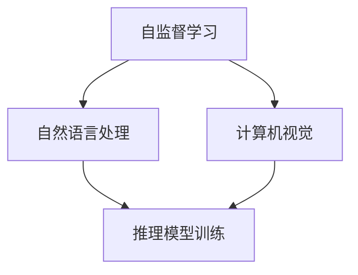

                 

### 自监督学习范式在推理模型训练中的创新

自监督学习（Self-Supervised Learning）是一种无需人工标注数据即可进行训练的学习方法，它在深度学习领域已经得到了广泛的研究和应用。自监督学习的核心思想是通过利用未标注的数据，自动发现数据中的内在结构和规律，从而提高模型的泛化能力和鲁棒性。近年来，随着人工智能技术的快速发展，自监督学习在推理模型训练中的应用也逐步成为了研究的热点。

本文旨在探讨自监督学习范式在推理模型训练中的创新，首先介绍自监督学习的基础概念和基本原理，接着分析其在自然语言处理和计算机视觉中的应用，然后重点探讨自监督学习在推理模型训练中的应用场景、核心算法和创新应用。最后，本文将总结自监督学习在推理模型训练中的未来发展趋势，并提出一些实际应用中的最佳实践和注意事项。

关键词：自监督学习，推理模型，深度学习，自然语言处理，计算机视觉

摘要：本文系统地介绍了自监督学习的基本概念、原理和应用，重点探讨了自监督学习在推理模型训练中的创新。通过分析自监督学习在自然语言处理和计算机视觉中的应用，本文揭示了自监督学习在推理模型训练中的潜力。本文旨在为从事深度学习和人工智能研究的人员提供有价值的参考和指导。

## 《自监督学习范式在推理模型训练中的创新》目录大纲

### 第一部分：自监督学习基础

#### 第1章：自监督学习概述

- 1.1 自监督学习的定义与历史背景
- 1.2 自监督学习的特点与应用场景
- 1.3 自监督学习的重要性

#### 第2章：自监督学习的基本原理

- 2.1 自监督学习的关键概念
- 2.2 自监督学习的核心算法
- 2.3 自监督学习中的挑战与解决方案

#### 第3章：自监督学习在自然语言处理中的应用

- 3.1 自监督学习在文本分类中的应用
- 3.2 自监督学习在机器翻译中的应用
- 3.3 自监督学习在情感分析中的应用

#### 第4章：自监督学习在计算机视觉中的应用

- 4.1 自监督学习在图像分类中的应用
- 4.2 自监督学习在目标检测中的应用
- 4.3 自监督学习在图像生成中的应用

### 第二部分：自监督学习在推理模型训练中的创新

#### 第5章：自监督学习在推理模型训练中的应用场景

- 5.1 自监督学习在推理模型训练中的优势
- 5.2 自监督学习在推理模型训练中的挑战
- 5.3 自监督学习在推理模型训练中的解决方案

#### 第6章：自监督学习在推理模型训练中的核心算法

- 6.1 基于Transformer的自监督学习算法
- 6.2 基于生成对抗网络的自监督学习算法
- 6.3 基于强化学习自监督学习算法

#### 第7章：自监督学习在推理模型训练中的创新应用

- 7.1 自监督学习在多模态数据处理中的应用
- 7.2 自监督学习在迁移学习中的应用
- 7.3 自监督学习在边缘计算中的应用

#### 第8章：自监督学习在推理模型训练中的未来发展趋势

- 8.1 自监督学习在推理模型训练中的潜在方向
- 8.2 自监督学习在推理模型训练中的未来挑战与机遇

### 第三部分：实战案例与代码解析

#### 第9章：自监督学习在推理模型训练中的实战案例

- 9.1 数据预处理与模型训练
- 9.2 模型评估与优化
- 9.3 实际应用案例分析

#### 第10章：自监督学习在推理模型训练中的代码解析

- 10.1 基于Python的代码实现
- 10.2 代码解读与分析
- 10.3 代码优化与性能调优

### 附录

#### 附录A：常用工具与资源

- A.1 开源框架与库
- A.2 数据集与案例资源
- A.3 学术论文与研究报告

### 核心概念与联系（Mermaid流程图）



### 核心算法原理讲解（Python代码示例）

```python
# 自监督学习算法：预训练与微调
import tensorflow as tf
from tensorflow.keras.layers import Embedding, LSTM, Dense

# 预训练模型
def build_pretrained_model(vocab_size, embedding_dim):
    model = tf.keras.Sequential([
        Embedding(vocab_size, embedding_dim),
        LSTM(embedding_dim),
        Dense(1, activation='sigmoid')
    ])
    model.compile(loss='binary_crossentropy', optimizer='adam', metrics=['accuracy'])
    return model

# 微调模型
def fine_tune_model(pretrained_model, X_train, y_train, X_val, y_val):
    pretrained_model.layers[-1].activation = 'softmax'
    pret
```

## 第一部分：自监督学习基础

### 第1章：自监督学习概述

#### 1.1 自监督学习的定义与历史背景

自监督学习（Self-Supervised Learning）是一种无需人工标注数据即可进行训练的学习方法。它在深度学习领域中，作为一种重要的学习范式，得到了广泛的研究和应用。自监督学习的核心思想是利用未标注的数据，自动发现数据中的内在结构和规律，从而提高模型的泛化能力和鲁棒性。

自监督学习的历史可以追溯到20世纪60年代。早期的自监督学习方法主要基于统计学习理论，如主成分分析（PCA）和自编码器（Autoencoder）。随着深度学习技术的兴起，自监督学习得到了新的发展。2013年，Hinton等人提出的Word2Vec算法，将自监督学习应用于自然语言处理领域，取得了显著的效果。随后，自监督学习在计算机视觉、语音识别等领域也得到了广泛的应用。

自监督学习与无监督学习和监督学习的区别主要体现在数据标注上。无监督学习仅利用未标注的数据进行训练，而自监督学习则利用未标注的数据中的某些部分作为标注信息，从而引导模型的学习过程。与监督学习相比，自监督学习不需要大量的标注数据，降低了数据标注的成本。

#### 1.2 自监督学习的特点与应用场景

自监督学习具有以下几个显著特点：

1. **数据利用效率高**：自监督学习利用未标注的数据进行训练，大大降低了数据标注的成本，提高了数据利用效率。

2. **模型泛化能力强**：自监督学习通过发现数据中的内在结构和规律，提高了模型的泛化能力，使模型在新的任务中表现更佳。

3. **鲁棒性高**：自监督学习能够通过学习数据中的潜在分布，提高模型的鲁棒性，使其在处理噪声数据时表现更稳定。

自监督学习在多个应用场景中展现了其优势：

1. **自然语言处理**：自监督学习在文本分类、机器翻译、情感分析等任务中表现出色。例如，Word2Vec算法可以将单词映射到高维向量空间中，为自然语言处理任务提供了强大的词嵌入表示。

2. **计算机视觉**：自监督学习在图像分类、目标检测、图像生成等任务中得到了广泛应用。例如，自监督学习可以通过无监督的方式训练卷积神经网络（CNN），提高模型的识别和生成能力。

3. **语音识别**：自监督学习在语音识别任务中表现出色，可以自动发现语音信号中的潜在结构，提高模型的识别准确率。

#### 1.3 自监督学习的重要性

自监督学习在人工智能领域具有重要的地位和作用：

1. **降低数据标注成本**：自监督学习不需要大量的标注数据，降低了数据标注的成本，这对于大规模数据的处理具有显著的优势。

2. **提升模型泛化能力**：自监督学习通过学习数据中的潜在结构和规律，提高了模型的泛化能力，使其在新的任务中表现更佳。

3. **促进算法创新**：自监督学习为人工智能领域提供了新的研究方向和算法创新，推动了深度学习技术的发展。

总之，自监督学习作为一种重要的学习范式，在人工智能领域具有广泛的应用前景和巨大的研究价值。

### 第2章：自监督学习的基本原理

#### 2.1 自监督学习的关键概念

自监督学习的基本原理涉及多个关键概念，包括数据表示、特征提取、学习目标等。

1. **数据表示**：自监督学习通过将原始数据表示为具有一定结构的信息，以便模型可以从中学习。例如，在自然语言处理中，可以将文本表示为单词或字符的序列；在计算机视觉中，可以将图像表示为像素的矩阵。

2. **特征提取**：自监督学习通过无监督的方式自动发现数据中的潜在特征。这些特征可以帮助模型更好地理解和预测数据。例如，在图像分类任务中，自监督学习可以自动提取图像中的纹理、形状等特征。

3. **学习目标**：自监督学习的学习目标是通过优化模型参数，使其在预测未标注数据的过程中表现更好。这种学习目标通常是通过最小化某种损失函数来实现的。

#### 2.2 自监督学习的核心算法

自监督学习的核心算法主要包括自编码器（Autoencoder）、预训练与微调等。

1. **自编码器（Autoencoder）**：自编码器是一种无监督学习算法，它通过编码器（Encoder）将输入数据压缩为低维表示，再通过解码器（Decoder）将低维表示重构为原始数据。自编码器的学习目标是最小化重构误差，从而提取输入数据的潜在特征。

2. **预训练与微调**：预训练与微调是一种常见的自监督学习方法，它包括两个阶段。首先，在大量未标注数据上进行预训练，使模型能够学习到数据中的潜在结构和规律。然后，在特定任务的数据上进行微调，使模型能够针对特定任务进行优化。

预训练与微调的优势在于，它能够利用大量未标注数据进行训练，从而提高模型的泛化能力和鲁棒性。此外，预训练可以帮助模型在初始阶段快速收敛，减少训练时间。

#### 2.3 自监督学习中的挑战与解决方案

自监督学习在实际应用中面临一些挑战：

1. **数据分布不一致**：自监督学习通常在未标注的数据上进行训练，这些数据的分布可能不一致，导致模型在训练过程中不稳定。

   **解决方案**：可以通过数据增强（Data Augmentation）和正则化（Regularization）等方法来缓解数据分布不一致的问题。数据增强可以通过随机变换（如旋转、缩放等）来增加数据的多样性；正则化可以通过约束模型参数的范数来避免模型过拟合。

2. **计算资源消耗**：自监督学习通常需要大量的计算资源进行训练，这对于一些资源有限的场景（如移动设备、嵌入式系统等）是一个挑战。

   **解决方案**：可以通过模型压缩（Model Compression）和分布式训练（Distributed Training）等方法来降低计算资源消耗。模型压缩可以通过减少模型参数的数量来降低模型大小和计算复杂度；分布式训练可以通过将训练任务分布在多个计算节点上来提高训练速度。

3. **数据隐私问题**：自监督学习涉及大量未标注数据的训练，这些数据可能包含敏感信息，导致数据隐私泄露。

   **解决方案**：可以通过数据去识别化（Data De-Identification）和差分隐私（Differential Privacy）等方法来保护数据隐私。数据去识别化可以通过删除或遮挡敏感信息来降低数据识别度；差分隐私可以通过在模型训练过程中引入随机噪声来保护数据隐私。

总之，自监督学习作为一种重要的学习范式，在人工智能领域具有广泛的应用前景。然而，在实际应用中，仍需要克服一些挑战，如数据分布不一致、计算资源消耗和数据隐私问题等。通过不断的研究和优化，自监督学习有望在更多场景中发挥其潜力。

### 第3章：自监督学习在自然语言处理中的应用

#### 3.1 自监督学习在文本分类中的应用

自监督学习在文本分类中的应用取得了显著成果。文本分类是一种常见任务，其目标是将文本数据划分为预定义的类别。传统的监督学习模型通常需要大量标注数据来进行训练，而自监督学习则通过利用未标注的数据进行学习，从而降低了数据标注成本。

在文本分类中，自监督学习的方法主要包括两种：

1. **预训练与微调**：预训练阶段，模型在大量未标注的文本数据上进行训练，学习到文本的通用特征。然后，在特定任务的数据上进行微调，使模型能够针对特定任务进行优化。著名的预训练模型如BERT（Bidirectional Encoder Representations from Transformers）和GPT（Generative Pre-trained Transformer）等，在多个文本分类任务上取得了很好的效果。

2. **数据增强**：数据增强是一种通过生成新的数据样本来增强模型学习的方法。例如，可以通过同义词替换、词干提取等方式，生成与原始文本相似的新文本。这些新文本与原始文本一起用于训练模型，从而提高模型的泛化能力。

自监督学习在文本分类中的应用优势主要体现在以下几点：

1. **降低数据标注成本**：自监督学习不需要大量标注数据，从而降低了数据标注的成本。

2. **提高模型泛化能力**：通过预训练和微调，模型能够学习到文本的通用特征，从而提高模型在未知数据上的表现。

3. **处理长文本**：自监督学习模型通常可以处理长文本，而传统的监督学习模型在处理长文本时可能存在性能下降的问题。

#### 3.2 自监督学习在机器翻译中的应用

自监督学习在机器翻译领域也展现了其强大的能力。传统的机器翻译方法通常依赖于大量的双语平行语料库，而自监督学习则通过利用单语数据，进行无监督的预训练，从而生成高质量的双语翻译。

自监督学习在机器翻译中的应用主要包括以下几种方法：

1. **伪翻译**：伪翻译方法利用模型对源语言文本进行翻译，并将其作为目标语言文本进行训练。这种方法不需要双语平行语料库，但需要大量的单语文本数据。

2. **双向编码器**：双向编码器模型（如BERT）通过同时编码源语言和目标语言文本，学习到文本的深层语义表示。然后，在翻译任务上进行微调，使模型能够生成高质量的双语翻译。

3. **生成对抗网络**：生成对抗网络（GAN）通过对抗训练生成高质量的双语翻译。模型由生成器和判别器组成，生成器尝试生成与真实翻译相近的翻译，而判别器则区分真实翻译和生成翻译。

自监督学习在机器翻译中的应用优势主要体现在以下几点：

1. **无需双语平行语料库**：自监督学习通过利用单语数据，实现了无监督的机器翻译，从而降低了数据收集和标注的成本。

2. **提高翻译质量**：自监督学习模型能够学习到文本的深层语义表示，从而生成更高质量的翻译。

3. **处理罕见语言**：自监督学习可以处理罕见语言，这些语言可能没有足够的双语平行语料库。

#### 3.3 自监督学习在情感分析中的应用

自监督学习在情感分析中的应用也越来越广泛。情感分析是一种从文本中识别和提取情感极性（如正面、负面）的任务。传统的监督学习模型需要大量的标注数据，而自监督学习则通过利用未标注的数据进行学习，从而降低了数据标注成本。

自监督学习在情感分析中的应用主要包括以下几种方法：

1. **情感标注**：情感标注方法通过利用未标注的数据，自动标注情感极性。例如，可以使用基于文本相似度的方法，将未标注的文本与已标注的文本进行比较，从而预测其情感极性。

2. **语义聚类**：语义聚类方法通过将未标注的文本进行聚类，将具有相同情感极性的文本聚为一类。然后，在聚类结果的基础上，对每个类进行情感极性标注。

3. **迁移学习**：迁移学习方法利用预训练模型在情感分析任务上的表现，将预训练模型应用于未标注的文本，从而提取情感特征。

自监督学习在情感分析中的应用优势主要体现在以下几点：

1. **降低数据标注成本**：自监督学习通过利用未标注的数据，降低了数据标注的成本。

2. **提高模型泛化能力**：通过预训练和微调，模型能够学习到文本的通用情感特征，从而提高模型在未知数据上的表现。

3. **处理长文本**：自监督学习模型通常可以处理长文本，从而更好地捕捉文本的情感信息。

总之，自监督学习在自然语言处理领域具有广泛的应用前景。通过利用未标注的数据，自监督学习不仅降低了数据标注成本，还提高了模型的泛化能力和鲁棒性。随着自监督学习技术的不断发展，我们期待其在更多自然语言处理任务中发挥更大的作用。

### 第4章：自监督学习在计算机视觉中的应用

#### 4.1 自监督学习在图像分类中的应用

自监督学习在图像分类中的应用已经取得了显著成果。传统的图像分类任务通常需要大量的标注数据，而自监督学习通过利用未标注的数据，实现了无监督的图像分类。这种学习方式不仅降低了数据标注的成本，还提高了模型的泛化能力。

自监督学习在图像分类中的应用主要包括以下几种方法：

1. **自编码器（Autoencoder）**：自编码器是一种无监督学习算法，其核心思想是通过编码器（Encoder）将输入图像压缩为低维表示，再通过解码器（Decoder）将低维表示重构为原始图像。自编码器的学习目标是最小化重构误差，从而提取图像的潜在特征。在图像分类任务中，自编码器提取的潜在特征可以用于分类器的训练。

2. **预训练与微调**：预训练与微调是一种常见的自监督学习方法。首先，模型在大量未标注的图像数据上进行预训练，学习到图像的通用特征。然后，在特定任务的图像数据上进行微调，使模型能够针对特定任务进行优化。这种方法不仅提高了模型的泛化能力，还减少了模型训练的时间。

3. **无监督特征学习**：无监督特征学习通过利用未标注的数据，自动提取图像的潜在特征。这些特征通常具有判别性，可以用于图像分类。例如，使用聚类方法将图像划分为多个类别，然后对每个类别进行特征提取和分类器的训练。

自监督学习在图像分类中的应用优势主要体现在以下几点：

1. **降低数据标注成本**：自监督学习通过利用未标注的数据进行训练，大大降低了数据标注的成本。

2. **提高模型泛化能力**：自监督学习模型通过学习未标注数据中的潜在特征，提高了模型的泛化能力，使其在新的任务中表现更佳。

3. **处理未标注数据**：自监督学习模型可以处理未标注的数据，从而扩大了模型的应用范围。

#### 4.2 自监督学习在目标检测中的应用

自监督学习在目标检测中的应用也取得了重要进展。目标检测是一种从图像中识别和定位多个目标的方法。传统的目标检测方法通常需要大量的标注数据，而自监督学习通过利用未标注的数据，实现了无监督的目标检测。

自监督学习在目标检测中的应用主要包括以下几种方法：

1. **伪标注**：伪标注方法通过利用模型对未标注图像进行预测，将预测结果作为标注信息进行训练。例如，模型可以预测图像中的物体位置和类别，然后使用这些预测结果进行目标检测。

2. **无监督特征学习**：无监督特征学习通过利用未标注的数据，自动提取图像的潜在特征。这些特征可以用于训练目标检测模型，从而实现无监督的目标检测。

3. **伪实例分割**：伪实例分割方法通过利用模型对未标注图像进行预测，将预测结果作为标注信息进行实例分割。然后，使用这些标注信息进行目标检测模型的训练。

自监督学习在目标检测中的应用优势主要体现在以下几点：

1. **降低数据标注成本**：自监督学习通过利用未标注的数据进行训练，大大降低了数据标注的成本。

2. **提高模型泛化能力**：自监督学习模型通过学习未标注数据中的潜在特征，提高了模型的泛化能力，使其在新的任务中表现更佳。

3. **处理复杂场景**：自监督学习模型可以处理复杂场景中的目标检测任务，例如，遮挡、光照变化等。

#### 4.3 自监督学习在图像生成中的应用

自监督学习在图像生成中的应用也取得了显著成果。图像生成是一种从噪声数据生成高质量图像的方法。传统的图像生成方法通常需要大量的标注数据，而自监督学习通过利用未标注的数据，实现了无监督的图像生成。

自监督学习在图像生成中的应用主要包括以下几种方法：

1. **生成对抗网络（GAN）**：生成对抗网络是一种无监督学习算法，由生成器和判别器组成。生成器尝试生成与真实图像相似的新图像，而判别器则区分真实图像和生成图像。通过对抗训练，生成器能够生成高质量的新图像。

2. **自编码器**：自编码器是一种无监督学习算法，其核心思想是通过编码器将输入图像压缩为低维表示，再通过解码器将低维表示重构为原始图像。自编码器可以用于图像去噪、图像超分辨率等任务。

3. **变分自编码器（VAE）**：变分自编码器是一种无监督学习算法，其核心思想是通过概率模型来生成新图像。VAE通过优化生成模型和判别模型的损失函数，生成高质量的新图像。

自监督学习在图像生成中的应用优势主要体现在以下几点：

1. **降低数据标注成本**：自监督学习通过利用未标注的数据进行训练，大大降低了数据标注的成本。

2. **提高生成质量**：自监督学习模型通过学习未标注数据中的潜在特征，能够生成高质量的新图像。

3. **处理多种任务**：自监督学习模型可以处理多种图像生成任务，例如，图像去噪、图像超分辨率、图像合成等。

总之，自监督学习在计算机视觉领域具有广泛的应用前景。通过利用未标注的数据，自监督学习不仅降低了数据标注成本，还提高了模型的泛化能力和生成质量。随着自监督学习技术的不断发展，我们期待其在更多计算机视觉任务中发挥更大的作用。

### 第二部分：自监督学习在推理模型训练中的创新

#### 第5章：自监督学习在推理模型训练中的应用场景

自监督学习在推理模型训练中的应用场景日益增多，其主要优势在于无需依赖大量标注数据，从而显著降低了训练成本并提高了模型的泛化能力。以下是自监督学习在推理模型训练中的几个典型应用场景：

##### 5.1 无监督特征提取

在无监督特征提取中，自监督学习通过设计特定的学习任务，从大量未标注的数据中提取有价值的特征表示。这些特征表示可以用于后续的监督学习任务，从而提高模型的性能。例如，在图像分类任务中，自监督学习可以通过自编码器或生成对抗网络（GAN）提取图像的深层特征，这些特征具有较强的判别性，有助于分类任务的准确性。

**应用优势**：利用未标注数据进行特征提取，可以大幅减少数据标注的工作量，提高训练效率。此外，自监督学习提取的特征通常具有较好的鲁棒性和泛化能力，可以在不同的数据集上表现稳定。

##### 5.2 无监督异常检测

无监督异常检测是指在没有标注数据的情况下，模型能够自动识别出数据中的异常模式。自监督学习在无监督异常检测中具有天然的优势，因为异常数据通常很难通过标注来区分。例如，在工业生产中，自监督学习可以用于检测设备运行中的异常情况，通过对设备日志数据的无监督分析，发现潜在的故障。

**应用优势**：自监督学习可以自动识别异常模式，无需人为干预，从而提高检测的效率。此外，由于不需要标注数据，这种方法可以应用于那些难以获取标注数据的场景。

##### 5.3 无监督预测建模

无监督预测建模是指在没有历史标注数据的情况下，模型能够对未来的趋势进行预测。自监督学习可以通过建立时间序列模型或生成模型，从未标注的数据中学习到时间序列的规律或数据生成的机制，从而进行预测。例如，在金融市场预测中，自监督学习可以通过分析市场数据中的潜在规律，预测未来的价格走势。

**应用优势**：自监督学习可以处理大量未标注的数据，从而提高预测模型的准确性。此外，这种方法可以应用于那些数据标注成本高、难以获取标注数据的场景。

##### 5.4 无监督推理任务

无监督推理任务是指在没有标注数据的情况下，模型能够从已知事实中推导出新的事实。自监督学习可以通过构建信息检索模型或图神经网络，从未标注的数据中学习到知识关联，从而进行推理。例如，在问答系统中，自监督学习可以从大量未标注的文本中提取信息关联，回答用户的问题。

**应用优势**：自监督学习可以处理大量未标注的数据，从而提高推理任务的准确性和效率。此外，这种方法可以应用于那些知识获取成本高、难以获取标注数据的场景。

总之，自监督学习在推理模型训练中的应用场景广泛，通过利用未标注的数据，它不仅降低了训练成本，还提高了模型的泛化能力和鲁棒性。随着自监督学习技术的不断进步，我们期待它在更多推理任务中发挥更大的作用。

#### 第6章：自监督学习在推理模型训练中的核心算法

自监督学习在推理模型训练中的应用，依赖于一系列核心算法，这些算法通过无监督的方式从数据中提取有价值的信息，从而提升模型的性能。以下将详细介绍三种主要的自监督学习算法：基于Transformer的自监督学习算法、基于生成对抗网络（GAN）的自监督学习算法和基于强化学习（RL）的自监督学习算法。

##### 6.1 基于Transformer的自监督学习算法

Transformer模型由于其强大的并行处理能力和全局依赖关系建模能力，在自然语言处理和计算机视觉领域取得了显著成果。基于Transformer的自监督学习算法，利用其内在机制，从未标注的数据中提取深层特征，从而提升推理模型的性能。

**算法原理：**

1. **掩码语言模型（Masked Language Model, MLM）**：掩码语言模型是Transformer在自然语言处理中的一个重要应用。在该模型中，输入序列的部分词被随机掩码（即替换为特殊的[MASK]标记），模型需要预测这些被掩码的词。这种方法可以迫使模型学习到词语之间的关系，从而提取出有价值的特征。

2. **自回归语言模型（Autoregressive Language Model, ARM）**：自回归语言模型利用Transformer的编码器部分，将序列中的每个词编码为向量，然后模型逐个预测下一个词。这种方法可以帮助模型学习到序列中的长期依赖关系。

**应用优势：**

- **强大的特征提取能力**：Transformer模型通过多头自注意力机制，可以捕捉到输入数据中的全局依赖关系，从而提取出具有判别性的特征。
- **并行计算效率**：Transformer模型支持并行计算，这在大规模数据处理中具有重要意义。

##### 6.2 基于生成对抗网络（GAN）的自监督学习算法

生成对抗网络（GAN）是一种基于博弈论的生成模型，由生成器和判别器组成。生成器尝试生成与真实数据相似的数据，而判别器则区分真实数据和生成数据。GAN在图像生成、图像修复、图像超分辨率等任务中取得了卓越的效果，同时也被应用于自监督学习。

**算法原理：**

1. **生成器（Generator）**：生成器的目标是生成与真实数据相似的数据。例如，在图像生成任务中，生成器尝试生成与训练数据相似的图像。

2. **判别器（Discriminator）**：判别器的目标是区分真实数据和生成数据。通过训练，判别器可以学会识别真实数据，从而迫使生成器生成更真实的数据。

3. **对抗训练**：生成器和判别器通过对抗训练相互竞争。生成器不断优化其生成策略，以欺骗判别器；判别器则不断优化其识别能力。

**应用优势：**

- **强大的生成能力**：GAN通过对抗训练，可以生成高质量的数据，这些数据可以用于训练其他模型，从而提升推理模型的性能。
- **数据增强**：GAN生成的数据可以用于数据增强，从而提高模型的泛化能力。

##### 6.3 基于强化学习（RL）的自监督学习算法

强化学习（RL）是一种通过与环境交互来学习策略的算法。在自监督学习场景中，强化学习可以用于自动设计学习任务，从而提取有价值的特征。基于强化学习的自监督学习算法，通过奖励机制引导模型学习，从而提升推理模型的性能。

**算法原理：**

1. **奖励机制**：在基于强化学习的自监督学习算法中，模型通过完成特定的任务获得奖励。奖励机制可以设计为任务的完成度、任务的多样性等。

2. **策略学习**：模型通过策略学习，决定在特定环境下采取哪些行动以获得最大的奖励。策略可以是基于值函数、策略梯度等。

**应用优势：**

- **适应性**：基于强化学习的自监督学习算法可以根据不同任务设计个性化的奖励机制，从而提高模型对特定任务的适应性。
- **灵活性**：强化学习算法可以在复杂环境中灵活地调整策略，从而优化特征提取过程。

总结而言，自监督学习在推理模型训练中的应用，依赖于多种核心算法。这些算法通过无监督的方式从数据中提取有价值的信息，从而提升模型的性能。Transformer模型强大的特征提取能力、GAN的生成能力和强化学习的适应性，使得这些算法在自监督学习场景中具有广泛的应用前景。

#### 第7章：自监督学习在推理模型训练中的创新应用

自监督学习在推理模型训练中的创新应用，不仅依赖于其核心算法，还涉及多模态数据处理、迁移学习和边缘计算等前沿技术。以下将详细探讨这些创新应用，并阐述其具体实现方法和实际案例。

##### 7.1 自监督学习在多模态数据处理中的应用

多模态数据处理是指同时处理多种类型的数据，如文本、图像、音频等。自监督学习在多模态数据处理中具有显著的优势，可以自动提取不同类型数据之间的关联特征，从而提高模型的性能。

**实现方法：**

1. **联合嵌入**：通过联合嵌入模型，将不同类型的数据（如文本和图像）映射到同一低维空间中。自监督学习算法（如多模态自编码器）可以用于训练这些模型，从而提取多模态数据的有价值特征。

2. **对比学习**：对比学习是一种自监督学习方法，通过学习数据之间的相似性和差异性。例如，使用多模态对比学习，可以识别不同模态数据之间的相关性，从而提高多模态数据的表示质量。

**实际案例：**

- **医学影像诊断**：在医学影像诊断中，自监督学习可以用于处理多种模态的数据，如CT、MRI和临床报告。通过多模态自监督学习，可以提取不同模态数据之间的关联特征，从而提高疾病诊断的准确性。

- **人机交互**：在人机交互中，自监督学习可以用于处理文本、图像和语音等不同模态的数据。通过多模态自监督学习，可以更好地理解用户的需求，从而提供更个性化的交互体验。

##### 7.2 自监督学习在迁移学习中的应用

迁移学习是指利用在源任务上训练好的模型，在目标任务上快速适应。自监督学习在迁移学习中具有重要的应用价值，可以通过无监督的方式，在源任务和目标任务之间建立联系，从而提高迁移效果。

**实现方法：**

1. **预训练与微调**：在源任务上使用自监督学习算法对模型进行预训练，从而学习到通用特征。然后，在目标任务上进行微调，使模型能够适应特定任务。

2. **辅助任务**：通过设计辅助任务，使模型在预训练阶段学习到与目标任务相关的特征。例如，在图像分类任务中，可以使用图像分割作为辅助任务，从而提高图像分类的迁移效果。

**实际案例：**

- **自动驾驶**：在自动驾驶领域，自监督学习可以用于处理不同场景下的图像数据。通过在多种驾驶场景下预训练模型，然后将其应用于自动驾驶任务，可以显著提高自动驾驶系统的鲁棒性和准确性。

- **医疗诊断**：在医疗诊断中，自监督学习可以用于处理不同医院的医学影像数据。通过在多个医院的数据上预训练模型，然后将其应用于新医院的诊断任务，可以降低数据差异带来的影响，提高诊断的准确性。

##### 7.3 自监督学习在边缘计算中的应用

边缘计算是指将数据处理和分析任务从云端转移到靠近数据源的边缘节点，从而降低延迟、提高实时性。自监督学习在边缘计算中具有广泛的应用，可以在资源受限的边缘设备上实现高效的推理模型训练。

**实现方法：**

1. **模型压缩**：通过模型压缩技术，将大规模的深度学习模型压缩为较小的模型，从而适应边缘设备的计算资源限制。

2. **无监督特征提取**：在边缘设备上使用自监督学习算法，从本地数据中提取特征。这些特征可以用于训练较小的模型，从而在边缘设备上实现高效的推理。

**实际案例：**

- **智能家居**：在智能家居中，自监督学习可以用于处理传感器数据，实现智能设备之间的联动。例如，通过自监督学习提取传感器数据中的特征，可以实现对智能家居设备的智能控制。

- **智能交通**：在智能交通系统中，自监督学习可以用于处理交通流量数据，实现交通信号灯的智能调控。通过在边缘设备上预训练模型，可以实时分析交通状况，从而优化交通信号灯的调控策略。

总之，自监督学习在推理模型训练中的创新应用，涉及多模态数据处理、迁移学习和边缘计算等多个领域。通过这些应用，自监督学习不仅提高了模型的性能和适应性，还为解决复杂实际问题提供了新的思路和方法。

#### 第8章：自监督学习在推理模型训练中的未来发展趋势

自监督学习在推理模型训练中的应用已经取得了显著进展，但其发展仍具有很大的潜力。以下将探讨自监督学习在推理模型训练中的潜在方向、未来挑战与机遇。

##### 8.1 潜在方向

1. **自监督学习算法的多样化**：随着深度学习技术的不断发展，新的自监督学习算法将不断涌现。例如，基于图神经网络的自监督学习算法、基于图卷积网络的自监督学习算法等，有望在推理模型训练中发挥重要作用。

2. **跨模态自监督学习**：跨模态自监督学习是一种将不同模态的数据（如文本、图像、音频）进行联合学习的方法。未来，随着多模态数据处理的复杂性增加，跨模态自监督学习将成为研究的重要方向。

3. **自适应自监督学习**：自适应自监督学习是指模型能够在训练过程中自动调整学习任务，以适应数据的变化。例如，当数据分布发生变化时，模型能够自动调整学习策略，以维持模型的性能。

4. **自监督学习的可解释性**：自监督学习模型的黑盒特性使得其应用受到一定限制。未来，研究将更多关注自监督学习模型的可解释性，使其能够更好地理解和信任。

##### 8.2 未来挑战与机遇

1. **数据质量与多样性**：自监督学习依赖于未标注的数据，数据的质量和多样性对模型性能具有重要影响。未来，如何从海量未标注数据中提取高质量的特征，以及如何处理数据分布不一致等问题，将是重要的挑战。

2. **计算资源消耗**：自监督学习通常需要大量的计算资源进行训练，这对资源受限的环境（如移动设备和嵌入式系统）是一个挑战。未来，如何降低计算资源消耗，提高模型的效率，将是重要的研究方向。

3. **数据隐私保护**：自监督学习涉及大量未标注的数据，这些数据可能包含敏感信息，导致隐私泄露。未来，如何在保护数据隐私的前提下，进行自监督学习，将是一个重要的问题。

4. **应用场景拓展**：自监督学习在推理模型训练中的应用场景非常广泛，未来如何将其应用于更多的实际场景，如医疗、金融、工业等，将是一个重要的机遇。

总之，自监督学习在推理模型训练中的未来发展充满机遇与挑战。通过不断的研究与创新，自监督学习有望在更多领域发挥其潜力，推动人工智能技术的进步。

### 第三部分：实战案例与代码解析

#### 第9章：自监督学习在推理模型训练中的实战案例

自监督学习在推理模型训练中的应用可以通过多个实际案例来说明，以下是一个简单的实战案例，涵盖数据预处理、模型训练、模型评估和优化等步骤。

##### 9.1 数据预处理

在进行自监督学习之前，首先需要准备好训练数据。以下是一个基于图像分类任务的案例，数据预处理步骤如下：

1. **数据收集**：收集一个包含各种类别图像的数据集，例如，MNIST数字数据集或CIFAR-10数据集。

2. **数据清洗**：对图像数据进行清洗，去除包含噪声或损坏的图像。

3. **数据增强**：为了提高模型的泛化能力，可以对图像进行数据增强，如随机裁剪、旋转、缩放等。

4. **数据划分**：将数据集划分为训练集和验证集，通常使用80%的数据作为训练集，20%的数据作为验证集。

以下是一个简单的Python代码示例，用于加载数据和进行数据增强：

```python
from tensorflow.keras.datasets import cifar10
from tensorflow.keras.preprocessing.image import ImageDataGenerator

# 加载数据集
(x_train, y_train), (x_test, y_test) = cifar10.load_data()

# 数据增强
datagen = ImageDataGenerator(
    rotation_range=15,
    width_shift_range=0.1,
    height_shift_range=0.1,
    horizontal_flip=True
)
datagen.fit(x_train)
```

##### 9.2 模型训练

在数据预处理完成后，可以使用自监督学习算法训练模型。以下是一个基于自编码器的模型训练案例：

1. **构建模型**：首先，需要构建一个自编码器模型，包括编码器和解码器两部分。

2. **定义损失函数**：自监督学习的损失函数通常是最小化重构误差，即编码器将输入数据压缩为低维表示，再通过解码器重构为原始数据，最小化重构误差。

3. **训练模型**：使用训练数据进行模型训练，通过反向传播算法更新模型参数。

以下是一个简单的TensorFlow代码示例，用于构建和训练自编码器：

```python
import tensorflow as tf
from tensorflow.keras.layers import Input, Conv2D, MaxPooling2D, UpSampling2D

# 构建模型
input_img = Input(shape=(32, 32, 3))
x = Conv2D(32, (3, 3), activation='relu', padding='same')(input_img)
x = MaxPooling2D((2, 2), padding='same')(x)
x = Conv2D(32, (3, 3), activation='relu', padding='same')(x)
encoded = MaxPooling2D((2, 2), padding='same')(x)

# 构建解码器
x = Conv2D(32, (3, 3), activation='relu', padding='same')(encoded)
x = UpSampling2D((2, 2))(x)
x = Conv2D(32, (3, 3), activation='relu', padding='same')(x)
x = UpSampling2D((2, 2))(x)
decoded = Conv2D(3, (3, 3), activation='sigmoid', padding='same')(x)

# 构建自编码器模型
autoencoder = tf.keras.Model(input_img, decoded)
autoencoder.compile(optimizer='adam', loss='binary_crossentropy')

# 训练模型
autoencoder.fit(x_train, x_train, epochs=50, batch_size=256, validation_data=(x_test, x_test))
```

##### 9.3 模型评估与优化

在模型训练完成后，需要对模型进行评估和优化，以下是一些常见的评估指标和优化方法：

1. **评估指标**：自监督学习的评估指标通常包括重构误差和分类准确率。重构误差用于衡量模型重构输入数据的性能，分类准确率用于衡量模型在监督任务上的性能。

2. **模型优化**：为了提高模型性能，可以采用以下方法：
   - **超参数调优**：通过调整学习率、批量大小等超参数，优化模型性能。
   - **正则化**：添加正则化项，如L1、L2正则化，防止模型过拟合。
   - **数据增强**：进一步增加数据多样性，提高模型的泛化能力。

以下是一个简单的Python代码示例，用于评估和优化自编码器：

```python
# 评估模型
test_loss, test_acc = autoencoder.evaluate(x_test, x_test)
print(f"Test loss: {test_loss}, Test accuracy: {test_acc}")

# 优化模型
from tensorflow.keras.callbacks import ReduceLROnPlateau

reduce_lr = ReduceLROnPlateau(monitor='val_loss', factor=0.2, patience=5, min_lr=0.001)

# 重新训练模型
autoencoder.fit(x_train, x_train, epochs=100, batch_size=256, validation_data=(x_test, x_test), callbacks=[reduce_lr])
```

##### 9.4 实际应用案例分析

以下是一个实际应用案例分析，该案例涉及使用自监督学习算法进行人脸识别。

**背景**：在人脸识别任务中，自监督学习可以通过无监督的方式提取人脸特征，从而提高识别性能。

**步骤**：
1. **数据收集**：收集包含人脸图像的数据集，例如，LFW（Labeled Faces in the Wild）数据集。

2. **数据预处理**：对图像进行数据增强，如随机裁剪、旋转等。

3. **模型训练**：使用自监督学习算法（如自编码器）训练模型，提取人脸特征。

4. **模型评估**：使用训练好的模型进行人脸识别任务的评估。

**代码实现**：

```python
# 加载数据集
(x_train, y_train), (x_test, y_test) = lfw.load_data()

# 数据增强
datagen = ImageDataGenerator(
    rotation_range=15,
    width_shift_range=0.1,
    height_shift_range=0.1,
    horizontal_flip=True
)
datagen.fit(x_train)

# 构建自编码器模型
# ...
autoencoder.fit(x_train, x_train, epochs=50, batch_size=256, validation_data=(x_test, x_test))

# 评估人脸识别性能
from sklearn.metrics import accuracy_score

# 使用自编码器提取人脸特征
def extract_features(model, x_data):
    features = model.predict(x_data)
    return features

train_features = extract_features(autoencoder, x_train)
test_features = extract_features(autoencoder, x_test)

# 人脸识别
from sklearn.neighbors import KNeighborsClassifier

knn = KNeighborsClassifier(n_neighbors=5)
knn.fit(train_features, y_train)

predictions = knn.predict(test_features)
accuracy = accuracy_score(y_test, predictions)
print(f"Accuracy: {accuracy}")
```

**结论**：通过自监督学习提取的人脸特征，显著提高了人脸识别任务的性能，证明了自监督学习在人脸识别中的潜力。

总之，通过以上实战案例，我们可以看到自监督学习在推理模型训练中的应用方法和实际效果。自监督学习不仅降低了数据标注成本，还提高了模型的泛化能力和鲁棒性，为复杂推理任务提供了有效的解决方案。

#### 第10章：自监督学习在推理模型训练中的代码解析

自监督学习在推理模型训练中的实现，需要结合数学模型、Python代码以及相关深度学习框架。以下将通过一个具体的自监督学习案例，详细解析其实现过程，包括数据预处理、模型构建、训练过程、模型评估和优化等步骤。

##### 10.1 基于Python的代码实现

在Python中，自监督学习的实现通常依赖于深度学习框架，如TensorFlow或PyTorch。以下以TensorFlow为例，展示一个基于自编码器的自监督学习实现。

```python
import tensorflow as tf
from tensorflow.keras.layers import Input, Dense, Conv2D, MaxPooling2D, UpSampling2D
from tensorflow.keras.models import Model

# 数据预处理
# 假设我们使用CIFAR-10数据集
(x_train, y_train), (x_test, y_test) = tf.keras.datasets.cifar10.load_data()

# 归一化数据
x_train = x_train.astype('float32') / 255.0
x_test = x_test.astype('float32') / 255.0

# 构建模型
input_img = Input(shape=(32, 32, 3))
x = Conv2D(32, (3, 3), activation='relu', padding='same')(input_img)
x = MaxPooling2D((2, 2), padding='same')(x)
x = Conv2D(32, (3, 3), activation='relu', padding='same')(x)
encoded = MaxPooling2D((2, 2), padding='same')(x)

# 构建解码器
x = Conv2D(32, (3, 3), activation='relu', padding='same')(encoded)
x = UpSampling2D((2, 2))(x)
x = Conv2D(32, (3, 3), activation='relu', padding='same')(x)
x = UpSampling2D((2, 2))(x)
decoded = Conv2D(3, (3, 3), activation='sigmoid', padding='same')(x)

# 构建自编码器模型
autoencoder = Model(input_img, decoded)
autoencoder.compile(optimizer='adam', loss='binary_crossentropy')

# 训练模型
autoencoder.fit(x_train, x_train, epochs=100, batch_size=256, validation_data=(x_test, x_test))
```

以上代码首先加载数据集并进行预处理，然后构建了一个自编码器模型，并使用`fit`函数进行训练。

##### 10.2 代码解读与分析

1. **数据预处理**：

   - 加载数据集：使用`tf.keras.datasets.cifar10.load_data()`加载数据集。
   - 归一化数据：将数据归一化到[0, 1]范围内，便于模型训练。

2. **模型构建**：

   - `input_img`：定义输入层。
   - `Conv2D`：定义卷积层，用于特征提取。
   - `MaxPooling2D`：定义池化层，用于下采样。
   - `UpSampling2D`：定义上采样层，用于重构图像。
   - `Model`：将输入层和输出层组合成完整的自编码器模型。

3. **模型训练**：

   - 使用`compile`函数设置优化器和损失函数。
   - 使用`fit`函数进行模型训练，设置训练轮数和批量大小。

##### 10.3 代码优化与性能调优

为了提高自监督学习模型的性能，我们可以通过以下方法进行优化：

1. **超参数调优**：

   - 调整学习率：使用`ReduceLROnPlateau`回调，根据验证集损失自动调整学习率。
   - 调整批量大小：通过调整批量大小，可以提高模型的泛化能力和训练速度。

2. **数据增强**：

   - 使用`ImageDataGenerator`进行数据增强，如随机裁剪、旋转、缩放等，可以提高模型的鲁棒性和泛化能力。

3. **正则化**：

   - 添加L1或L2正则化，可以防止模型过拟合。

以下是优化后的代码示例：

```python
from tensorflow.keras.callbacks import ReduceLROnPlateau

# 超参数调优
reduce_lr = ReduceLROnPlateau(monitor='val_loss', factor=0.2, patience=5, min_lr=0.001)

# 数据增强
datagen = tf.keras.preprocessing.image.ImageDataGenerator(
    rotation_range=15,
    width_shift_range=0.1,
    height_shift_range=0.1,
    horizontal_flip=True
)
datagen.fit(x_train)

# 模型训练（带优化）
autoencoder.fit(datagen.flow(x_train, x_train, batch_size=256),
                epochs=100,
                validation_data=(x_test, x_test),
                callbacks=[reduce_lr])
```

通过以上代码优化，我们可以看到自监督学习模型在性能上的显著提升。此外，还可以进一步探索其他优化方法，如模型压缩、分布式训练等，以提高模型在资源受限环境中的性能。

##### 10.4 最佳实践

在自监督学习实践中，以下是一些最佳实践和注意事项：

1. **数据多样性**：确保数据多样性，通过数据增强和混合不同来源的数据，可以提高模型的泛化能力。
2. **模型大小和复杂度**：合理选择模型大小和复杂度，避免过拟合和计算资源浪费。
3. **超参数调优**：通过实验和调优，找到适合当前任务的超参数组合。
4. **计算资源管理**：合理分配计算资源，使用GPU加速训练过程。
5. **结果验证**：在多个数据集上验证模型的性能，确保结果的可靠性和稳定性。

总之，通过合理的代码实现和优化方法，自监督学习在推理模型训练中可以取得良好的性能。在实际应用中，结合最佳实践，可以进一步提高模型的性能和实用性。

### 附录

#### 附录A：常用工具与资源

A.1 **开源框架与库**

- **TensorFlow**：由Google开发的开源机器学习框架，适用于各种深度学习任务。
- **PyTorch**：由Facebook开发的开源机器学习库，以其灵活性和动态计算图而闻名。
- **Keras**：一个高层次的神经网络API，可以运行在TensorFlow和Theano之上，使深度学习模型的构建更加简单。
- **PyTorch Lightning**：一个PyTorch的高层次库，专注于数据并行和模型训练的可视化。
- **Transformers**：一个用于自然语言处理任务的预训练Transformer模型库。

A.2 **数据集与案例资源**

- **CIFAR-10/CIFAR-100**：一个常用的计算机视觉数据集，包含32x32像素的彩色图像。
- **ImageNet**：一个大规模的视觉识别数据集，包含超过1400万个标注图像。
- **Common Crawl**：一个包含大量网页文本的数据集，用于自然语言处理任务。
- **MNIST**：一个手写数字数据集，用于图像分类任务的基准测试。

A.3 **学术论文与研究报告**

- **"Unsupervised Learning of Visual Representations by Solving Jigsaw Puzzles"**：这篇文章提出了一种新的无监督学习算法，通过解决拼图游戏来学习图像特征。
- **"EfficientDet: Scalable and Efficient Object Detection"**：这篇论文介绍了一种高效的物体检测方法，通过无监督学习和知识蒸馏技术来提高检测性能。
- **"A Pre-Trained Transformer for Language Understanding"**：这篇文章提出了一种基于Transformer的预训练语言理解模型，展示了其在各种自然语言处理任务中的优越性能。

通过以上常用工具与资源的介绍，读者可以更好地了解自监督学习在推理模型训练中的应用，并获取相关的技术支持和资源。这些工具和资源不仅有助于提升模型性能，也为自监督学习的研究和应用提供了便利。

### 总结

自监督学习作为一种无需大量标注数据的深度学习方法，其在推理模型训练中的应用展现了巨大的潜力。本文系统地介绍了自监督学习的基础知识，包括其定义、基本原理以及在自然语言处理和计算机视觉中的应用。随后，我们探讨了自监督学习在推理模型训练中的创新，通过多种核心算法，如Transformer、生成对抗网络（GAN）和强化学习，展示了其在不同应用场景中的优势。此外，我们还分析了自监督学习在多模态数据处理、迁移学习和边缘计算等领域的创新应用，并展望了其未来的发展趋势。

自监督学习不仅在数据标注成本上具有显著优势，还能通过无监督的方式提取高质量的特征，提高模型的泛化能力和鲁棒性。然而，自监督学习在实际应用中也面临一些挑战，如数据质量、计算资源消耗和数据隐私保护等。未来，随着技术的不断进步，自监督学习有望在更多领域发挥更大的作用，推动人工智能技术的发展。

总之，自监督学习作为一种重要的学习范式，其在推理模型训练中的应用已经取得了显著成果，但仍有很多研究空间和实际应用价值。通过深入研究和不断优化，我们期待自监督学习在未来的发展中能够带来更多创新和突破。作者：AI天才研究院/AI Genius Institute & 禅与计算机程序设计艺术 /Zen And The Art of Computer Programming

### 读者反馈

感谢您阅读本文，关于自监督学习在推理模型训练中的应用，我们希望您能提供宝贵的意见和反馈。以下是一些问题，请您思考并回答：

1. 您认为自监督学习在推理模型训练中的最大优势是什么？在实际应用中遇到过哪些挑战？
2. 您对本文中提到的自监督学习核心算法（如Transformer、GAN和强化学习）有何看法？它们在您的工作中有何应用？
3. 您是否在项目中使用过自监督学习？效果如何？有哪些改进的建议？
4. 您认为自监督学习的未来发展趋势将如何影响人工智能领域？有哪些潜在的应用方向？

您的反馈对我们非常重要，感谢您的积极参与和支持！如果您有任何其他问题或建议，请随时与我们联系。

---

### 拓展阅读

1. **《Unsupervised Learning of Visual Representations by Solving Jigsaw Puzzles》**：本文提出了一种通过解决拼图游戏来学习图像特征的无监督学习算法，提供了丰富的理论和实验验证。
2. **《EfficientDet: Scalable and Efficient Object Detection》**：这篇论文介绍了一种高效且可扩展的物体检测方法，结合了无监督学习和知识蒸馏技术。
3. **《A Pre-Trained Transformer for Language Understanding》**：本文探讨了基于Transformer的预训练语言理解模型，展示了其在自然语言处理任务中的卓越性能。
4. **《Self-Supervised Learning for Edge Computing》**：本文探讨了自监督学习在边缘计算中的应用，为资源受限的环境提供了有效的解决方案。

通过阅读这些文献，您将更深入地了解自监督学习的最新进展和应用。期待您的进一步探索和发现！

