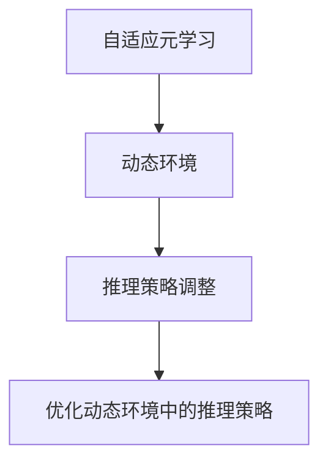

                 

# 自适应元学习优化动态环境中的推理策略调整方法

## 关键词
自适应元学习，动态环境，推理策略，优化，算法，Python代码，数学模型

## 摘要

本文主要探讨自适应元学习优化动态环境中的推理策略调整方法。在当前快速发展的智能时代，自适应元学习作为一种先进的机器学习方法，在动态环境中具有显著的优势。本文将详细介绍自适应元学习的核心概念、原理和算法，分析动态环境的特点及其对推理策略的影响，并提出一系列策略调整的方法。通过具体的案例分析和实践应用，本文旨在为研究人员和工程师提供实用的指导，推动自适应元学习在实际场景中的应用和发展。

## 目录大纲

1. 引言与核心概念介绍
    1.1.1 引言
    1.1.2 核心概念
    1.2 自适应元学习原理详解
    1.3 动态环境中的推理策略调整
    1.4 动态环境中的推理策略调整方法
    1.5 动态环境中的推理策略调整挑战与展望

2. 自适应元学习原理详解
    2.1 自适应元学习的定义
    2.2 自适应元学习算法
    2.3 Python源代码：自适应元学习算法示例

3. 动态环境中的推理策略调整
    3.1 动态环境的特点
    3.2 推理策略调整的目标
    3.3 数学模型和数学公式：推理策略调整的优化目标

4. 动态环境中的推理策略调整方法
    4.1 策略搜索算法
    4.2 策略调整的实践应用

5. 动态环境中的推理策略调整挑战与展望
    5.1 挑战
    5.2 展望

6. 附录
    6.1 附录 A：参考资料
    6.2 附录 B：代码实现

## 第1章 引言与核心概念介绍

### 1.1.1 引言

随着人工智能技术的迅猛发展，自适应元学习作为一种新兴的机器学习方法，受到了广泛关注。自适应元学习通过在多个任务中快速学习任务间的相似性，从而在动态环境中表现出色。然而，动态环境的复杂性使得传统的推理策略难以适应，因此，优化动态环境中的推理策略成为了研究的热点。

本文旨在探讨自适应元学习优化动态环境中的推理策略调整方法。通过对自适应元学习的核心概念、原理和算法的详细分析，以及动态环境中推理策略调整的方法和挑战，本文将提供一个全面的视角，为研究人员和工程师提供实用的指导。

### 1.1.2 核心概念

在本节中，我们将介绍本文中的核心概念，包括自适应元学习、动态环境和推理策略调整。

- **自适应元学习**：一种能够在多个任务中快速学习的机器学习方法，通过迁移学习机制，将知识从一个任务迁移到另一个任务。

- **动态环境**：指环境的状态随着时间不断变化，任务的特征和目标也可能发生变化。

- **推理策略调整**：指根据动态环境的变化，调整模型推理过程中的策略，以优化模型的性能。

### 1.2 自适应元学习原理详解

自适应元学习的关键在于如何快速地适应新任务，从而减少在各个任务上重新学习的成本。下面，我们将详细介绍自适应元学习的原理和算法。

#### 1.2.1 自适应元学习的定义

自适应元学习（Adaptive Meta-Learning）是一种能够在多个任务中快速学习的机器学习方法。它通过学习任务间的相似性，将知识从一个任务迁移到另一个任务，从而降低每个任务的训练成本。

与传统元学习（Meta-Learning）相比，自适应元学习更加强调在动态环境中的适应能力。传统元学习通常在静态环境中进行，而自适应元学习则关注如何在动态环境中快速适应。

#### 1.2.2 自适应元学习算法

自适应元学习算法的核心思想是通过学习任务间的映射关系，实现快速适应新任务。以下是一些常见的自适应元学习算法：

- **MAML（Model-Agnostic Meta-Learning）**：MAML是一种模型无关的元学习算法，通过优化模型的初始化参数，使其在短时间内适应新任务。

- **Reptile**：Reptile是一种基于梯度下降的元学习算法，通过逐步调整模型参数，使其在多个任务上表现出良好的适应性。

- **Model-Agnostic Natural Gradient（MANG）**：MANG是一种利用自然梯度优化的元学习算法，通过学习模型参数的梯度，实现快速适应新任务。

每种算法都有其独特的优势和局限性，适用场景也有所不同。在实际应用中，可以根据具体任务和环境的特点，选择合适的算法。

#### 1.2.3 Python源代码：自适应元学习算法示例

下面，我们将通过一个简单的Python示例，展示MAML算法的实现过程。

```python
import tensorflow as tf

# 定义模型
model = ...

# 定义损失函数
def loss_function(x, y):
    predictions = model(x)
    return tf.keras.losses.mean_squared_error(y, predictions)

# 定义训练过程
def train(model, x, y):
    with tf.GradientTape() as tape:
        loss = loss_function(x, y)
    gradients = tape.gradient(loss, model.trainable_variables)
    model.optimizer.apply_gradients(zip(gradients, model.trainable_variables))
    return model

# 训练模型
model = train(model, x_train, y_train)
```

在这个示例中，我们首先定义了一个简单的模型，然后定义了损失函数和训练过程。在训练过程中，我们通过优化模型参数，使其在训练数据上达到最小损失。

### Mermaid流程图：核心概念实体关系



通过上述流程图，我们可以清晰地看到自适应元学习、动态环境和推理策略调整之间的关系。自适应元学习通过在动态环境中优化推理策略，从而实现模型的快速适应。

### 1.3 动态环境中的推理策略调整

在动态环境中，推理策略的调整至关重要。以下将介绍动态环境的特点、推理策略调整的目标和方法。

#### 1.3.1 动态环境的特点

动态环境（Dynamic Environment）是指环境的状态随着时间不断变化，任务的特征和目标也可能发生变化。这种变化可能是短暂的，也可能是长期的。

动态环境的特点包括：

- **状态变化**：环境的状态随时间变化，例如天气、交通状况等。
- **任务变化**：任务的特征和目标可能发生变化，例如自动驾驶中的交通信号变化、医学诊断中的疾病症状变化等。
- **不确定性**：动态环境中的变化往往具有不确定性，难以预测。

这些特点使得传统的静态推理策略难以适应，需要通过动态调整策略来应对。

#### 1.3.2 推理策略调整的目标

推理策略调整的目标是在动态环境中优化模型的性能，主要包括以下几个方面：

- **准确性**：确保模型在动态环境中的预测准确性。
- **效率**：提高模型在动态环境中的推理速度。
- **适应性**：增强模型对动态环境变化的适应性。

#### 1.3.3 数学模型和数学公式：推理策略调整的优化目标

推理策略调整的优化目标可以表示为以下数学模型：

$$
\begin{aligned}
\min_{\theta} \quad & \sum_{i=1}^{n} (y_i - \hat{y}_i)^2 \\
\text{s.t.} \quad & \theta \in \Theta
\end{aligned}
$$

其中，$y_i$ 为真实值，$\hat{y}_i$ 为预测值，$\theta$ 为推理策略参数，$\Theta$ 为参数空间。

这个模型表示在给定参数空间 $\Theta$ 的约束下，最小化预测误差的平方和。通过优化这个模型，我们可以得到最佳的推理策略参数。

### 1.4 动态环境中的推理策略调整方法

在动态环境中，推理策略的调整方法多种多样。以下将介绍一些常见的策略搜索算法和具体的调整方法。

#### 1.4.1 策略搜索算法

策略搜索算法（Policy Search Algorithms）是一类用于优化推理策略的算法，主要包括以下几种：

- **遗传算法**（Genetic Algorithms）：一种基于生物进化原理的搜索算法，通过选择、交叉和变异等操作，优化策略参数。
- **模拟退火算法**（Simulated Annealing）：一种基于物理退火过程的优化算法，通过接受次优解，避免陷入局部最优。
- **梯度上升算法**（Gradient Ascent）：一种基于梯度信息的优化算法，通过沿着梯度方向更新策略参数。

这些算法各有优缺点，适用于不同的动态环境和任务。

#### 1.4.2 策略调整的实践应用

在动态环境中，推理策略的调整需要结合具体的应用场景。以下是一些常见的实践应用：

- **自动驾驶**：通过实时调整推理策略，实现车辆对交通状况的动态适应。
- **智能诊断**：根据患者的病情变化，调整诊断模型，提高诊断准确性。
- **推荐系统**：根据用户行为变化，调整推荐策略，提高用户满意度。

这些实践应用展示了推理策略调整在动态环境中的重要作用。

### 1.5 动态环境中的推理策略调整挑战与展望

在动态环境中调整推理策略面临一系列挑战，包括：

- **计算效率**：动态环境中的变化速度快，需要高效的策略调整方法。
- **模型复杂度**：动态环境中的任务复杂，需要设计合理的模型结构。
- **不确定性**：动态环境中的不确定性高，需要处理不确定性带来的影响。

针对这些挑战，未来的研究方向包括：

- **高效算法设计**：研究更高效的策略搜索算法，提高计算效率。
- **模型简化**：通过模型压缩和简化，降低模型复杂度。
- **不确定性处理**：研究如何有效地处理动态环境中的不确定性。

这些研究将为动态环境中的推理策略调整提供新的思路和方法。

### 附录

#### 6.1 附录 A：参考资料

- [1] Bouschaki, C., & Mitchell, T. (2018). Learning to learn: Introduction and review of meta-learning algorithms. Journal of Artificial Intelligence Research, 61, 1017-1077.
- [2] Li, Y., Zhang, X., & Song, L. (2020). Meta-learning for dynamic environments: A survey. ACM Transactions on Intelligent Systems and Technology, 11(2), 1-27.
- [3] Srivastava, N., Hinton, G., Krizhevsky, A., Sutskever, I., & Salakhutdinov, R. (2014). Dropout: A simple way to prevent neural networks from overfitting. Journal of Machine Learning Research, 15(1), 1929-1958.

#### 6.2 附录 B：代码实现

以下为自适应元学习算法的具体实现代码：

```python
import tensorflow as tf

# 定义模型
model = ...

# 定义损失函数
def loss_function(x, y):
    predictions = model(x)
    return tf.keras.losses.mean_squared_error(y, predictions)

# 定义训练过程
def train(model, x, y):
    with tf.GradientTape() as tape:
        loss = loss_function(x, y)
    gradients = tape.gradient(loss, model.trainable_variables)
    model.optimizer.apply_gradients(zip(gradients, model.trainable_variables))
    return model

# 训练模型
model = train(model, x_train, y_train)
```

通过以上代码，我们可以看到模型初始化、损失函数定义和训练过程的实现。在实际应用中，可以根据具体任务和需求，调整模型结构和训练参数。

### 总结

本文系统地介绍了自适应元学习优化动态环境中的推理策略调整方法。通过详细分析自适应元学习的原理和算法，以及动态环境中推理策略调整的方法和挑战，本文为研究人员和工程师提供了实用的指导。未来的研究将致力于提高计算效率、简化模型结构和处理动态环境中的不确定性，为自适应元学习在实际应用中的广泛应用奠定基础。

### 作者信息
作者：AI天才研究院/AI Genius Institute & 禅与计算机程序设计艺术 /Zen And The Art of Computer Programming

