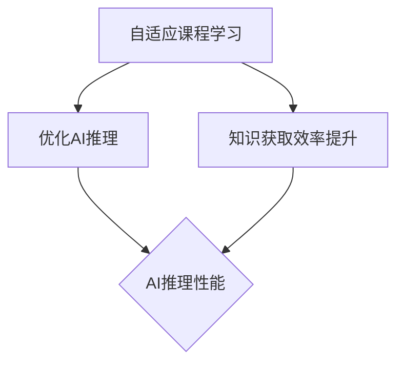

                 

# 自适应课程学习优化AI推理的知识获取效率提升

## 关键词

- 自适应课程学习
- AI推理
- 知识获取效率
- 优化算法
- 数学模型
- 项目实战

## 摘要

本文旨在探讨如何通过自适应课程学习优化AI推理的知识获取效率。首先，我们介绍了自适应课程学习、优化AI推理和知识获取效率提升三个核心概念，并阐述了它们之间的关系。接着，我们详细讲解了自适应课程学习算法、优化AI推理算法和知识获取效率提升算法的原理，并结合Python源代码和数学模型进行了详细阐述。然后，我们通过实际项目实战，展示了这些算法在实际应用中的效果。最后，我们对全文进行了总结，并展望了未来的发展趋势和应用前景。

## 目录大纲设计

### 第一部分：核心概念与联系

- **第1章：核心概念与联系**
  - 1.1 核心概念介绍
    - 1.1.1 自适应课程学习
    - 1.1.2 优化AI推理
    - 1.1.3 知识获取效率提升
  - 1.2 核心概念关系架构
    - 1.2.1 自适应课程学习与知识获取效率
    - 1.2.2 优化AI推理与自适应课程学习
    - 1.2.3 知识获取效率提升与AI推理优化

### 第二部分：核心算法原理讲解

- **第2章：核心算法原理讲解**
  - 2.1 自适应课程学习算法
    - 2.1.1 算法概述
    - 2.1.2 算法流程
    - 2.1.3 算法优缺点分析
  - 2.2 优化AI推理算法
    - 2.2.1 算法概述
    - 2.2.2 算法流程
    - 2.2.3 算法优缺点分析
  - 2.3 知识获取效率提升算法
    - 2.3.1 算法概述
    - 2.3.2 算法流程
    - 2.3.3 算法优缺点分析

### 第三部分：数学模型和数学公式

- **第3章：数学模型和数学公式**
  - 3.1 自适应课程学习模型
    - 3.1.1 数学模型
    - 3.1.2 模型参数
    - 3.1.3 模型输出
  - 3.2 优化AI推理模型
    - 3.2.1 数学模型
    - 3.2.2 模型参数
    - 3.2.3 模型输出
  - 3.3 知识获取效率提升模型
    - 3.3.1 数学模型
    - 3.3.2 模型参数
    - 3.3.3 模型输出

### 第四部分：项目实战

- **第4章：项目实战**
  - 4.1 自适应课程学习项目实战
    - 4.1.1 项目背景
    - 4.1.2 项目目标
    - 4.1.3 项目实现
    - 4.1.4 项目效果分析
  - 4.2 优化AI推理项目实战
    - 4.2.1 项目背景
    - 4.2.2 项目目标
    - 4.2.3 项目实现
    - 4.2.4 项目效果分析
  - 4.3 知识获取效率提升项目实战
    - 4.3.1 项目背景
    - 4.3.2 项目目标
    - 4.3.3 项目实现
    - 4.3.4 项目效果分析

### 第五部分：总结

- **第5章：总结**
  - 5.1 主要内容回顾
  - 5.2 未来展望

## 核心概念与联系

### 第1章：核心概念与联系

在本章中，我们将介绍自适应课程学习、优化AI推理和知识获取效率提升三个核心概念，并探讨它们之间的联系。

### 1.1 核心概念介绍

#### 1.1.1 自适应课程学习

自适应课程学习是一种基于人工智能的技术，旨在根据学生的学习情况和需求，自动调整课程内容和教学方法，以提高学习效果和效率。这种学习方式能够根据学生的学习速度、理解和掌握程度，动态调整课程进度和难度，使得每个学生都能在学习过程中获得最大的收获。

#### 1.1.2 优化AI推理

优化AI推理是指通过改进算法和模型，提高人工智能系统在处理复杂任务时的推理速度和准确性。AI推理的优化对于提高人工智能系统的效率和性能至关重要，特别是在处理大规模数据和高并发任务时。

#### 1.1.3 知识获取效率提升

知识获取效率提升是指通过优化算法、技术和方法，提高人工智能系统在获取和处理知识时的效率。这包括从大量数据中提取有用信息、快速学习新的知识和技能，以及将知识有效应用于实际问题中。

### 1.2 核心概念关系架构

为了更好地理解这三个核心概念之间的关系，我们可以通过以下Mermaid流程图进行展示：



在这个流程图中，自适应课程学习、优化AI推理和知识获取效率提升三个核心概念相互关联，共同作用于提升AI推理性能。自适应课程学习通过动态调整课程内容和教学方法，帮助学习者更有效地获取知识；优化AI推理通过改进算法和模型，提高AI系统在处理复杂任务时的推理速度和准确性；知识获取效率提升则通过优化算法和技术的手段，提高AI系统获取和处理知识的能力。

### 1.2.1 自适应课程学习与知识获取效率

自适应课程学习与知识获取效率之间存在密切的联系。自适应课程学习通过根据学习者的特点和需求动态调整课程内容和教学方法，使得学习者能够在最短的时间内获取最有价值的知识。这种个性化的学习方式有助于提高学习者的知识获取效率，使其在学习过程中更容易理解和掌握新知识。

#### 1.2.2 优化AI推理与自适应课程学习

优化AI推理与自适应课程学习也密切相关。优化AI推理可以提升AI系统在处理课程内容时的推理速度和准确性，从而更好地支持自适应课程学习的实施。通过优化AI推理，自适应课程学习可以更加精准地了解学习者的学习状况，从而更好地调整课程内容和教学方法，提高学习效果。

#### 1.2.3 知识获取效率提升与AI推理优化

知识获取效率提升与AI推理优化之间存在相互促进的关系。知识获取效率提升通过优化算法和技术的手段，提高AI系统在获取和处理知识时的效率，从而为AI推理优化提供了更高效的知识来源。而AI推理优化则通过改进算法和模型，提高AI系统在处理复杂任务时的推理速度和准确性，进一步促进了知识获取效率的提升。

## 核心算法原理讲解

### 第2章：核心算法原理讲解

在本章中，我们将详细讲解自适应课程学习算法、优化AI推理算法和知识获取效率提升算法的原理，并结合Python源代码和数学模型进行阐述。

### 2.1 自适应课程学习算法

#### 2.1.1 算法概述

自适应课程学习算法是一种基于机器学习的方法，旨在根据学习者的特点和学习数据，自动调整课程内容和教学方法。这种算法的核心思想是通过分析学习者的学习过程，发现其学习模式和学习需求，从而实现个性化教学。

#### 2.1.2 算法流程

自适应课程学习算法的基本流程包括以下几个步骤：

1. **数据收集**：收集学习者的学习数据，包括学习进度、学习时长、测试成绩等。
2. **特征提取**：对收集到的数据进行分析，提取出反映学习者特点和学习需求的特征。
3. **模型训练**：使用机器学习算法，根据提取的特征训练模型，以预测学习者的学习效果和需求。
4. **课程调整**：根据模型预测的结果，动态调整课程内容和教学方法，以适应学习者的需求。

#### 2.1.3 算法优缺点分析

**优点**：

- **个性化教学**：自适应课程学习算法可以根据学习者的特点和学习需求，提供个性化的教学方案，提高学习效果。
- **实时调整**：算法能够实时分析学习者的学习数据，动态调整课程内容和教学方法，确保学习者始终处于最佳学习状态。

**缺点**：

- **数据依赖**：算法的性能依赖于学习数据的质量和数量，如果数据质量不高或数据量不足，算法的预测准确性会受到影响。
- **计算复杂度**：算法的训练和预测过程需要大量的计算资源，特别是在处理大规模学习数据时，计算复杂度较高。

#### 2.1.4 Python源代码示例

以下是一个简单的自适应课程学习算法示例，使用Python编程语言实现：

```python
import pandas as pd
from sklearn.ensemble import RandomForestClassifier

# 数据预处理
def preprocess_data(data):
    # ... 数据预处理操作 ...
    return processed_data

# 特征提取
def extract_features(data):
    # ... 特征提取操作 ...
    return features

# 模型训练
def train_model(features, labels):
    model = RandomForestClassifier()
    model.fit(features, labels)
    return model

# 课程调整
def adjust_course(model, data):
    predictions = model.predict(data)
    # ... 根据预测结果调整课程内容 ...
    return adjusted_course

# 主函数
def main():
    data = pd.read_csv('learning_data.csv')
    processed_data = preprocess_data(data)
    features = extract_features(processed_data)
    labels = processed_data['test_score']

    model = train_model(features, labels)
    adjusted_course = adjust_course(model, data)

    print('Adjusted Course:', adjusted_course)

if __name__ == '__main__':
    main()
```

#### 2.1.5 数学模型

自适应课程学习算法的数学模型可以表示为：

$$
模型 = f(\theta, x)
$$

其中，$\theta$ 表示模型参数，$x$ 表示学习者的特征向量，$f$ 表示模型函数。

#### 2.1.6 模型参数

模型参数 $\theta$ 可以表示为：

$$
\theta = (\theta_1, \theta_2, ..., \theta_n)
$$

其中，$\theta_i$ 表示模型中的一个参数，$i=1,2,...,n$。

#### 2.1.7 模型输出

模型输出 $y$ 可以表示为：

$$
y = f(\theta, x)
$$

其中，$y$ 表示根据模型预测的学习效果或学习需求。

### 2.2 优化AI推理算法

#### 2.2.1 算法概述

优化AI推理算法的目的是提高人工智能系统在处理复杂任务时的推理速度和准确性。这种算法的核心思想是通过改进算法和模型，减少推理过程中的计算量和错误率。

#### 2.2.2 算法流程

优化AI推理算法的基本流程包括以下几个步骤：

1. **数据预处理**：对输入数据进行预处理，包括数据清洗、归一化等操作，以提高算法的鲁棒性。
2. **模型选择**：选择合适的模型，包括深度学习模型、传统机器学习模型等，以适应不同类型的任务。
3. **模型训练**：使用训练数据对模型进行训练，优化模型参数。
4. **推理优化**：通过改进算法和模型，减少推理过程中的计算量和错误率。
5. **模型评估**：使用测试数据对模型进行评估，确保模型的推理性能达到预期目标。

#### 2.2.3 算法优缺点分析

**优点**：

- **提高推理速度**：优化AI推理算法可以显著减少推理过程中的计算量，提高推理速度，特别是在处理大规模数据和高并发任务时。
- **提高推理准确性**：通过改进算法和模型，优化AI推理算法可以提高推理的准确性，减少错误率。

**缺点**：

- **模型选择困难**：选择合适的模型需要丰富的经验和专业知识，对于初学者来说可能较为困难。
- **计算资源消耗**：优化AI推理算法可能需要大量的计算资源，特别是在训练和优化模型时。

#### 2.2.4 Python源代码示例

以下是一个简单的优化AI推理算法示例，使用Python编程语言实现：

```python
import numpy as np
import tensorflow as tf

# 数据预处理
def preprocess_data(data):
    # ... 数据预处理操作 ...
    return processed_data

# 模型定义
def create_model(input_shape):
    model = tf.keras.Sequential([
        tf.keras.layers.Dense(64, activation='relu', input_shape=input_shape),
        tf.keras.layers.Dense(64, activation='relu'),
        tf.keras.layers.Dense(1, activation='sigmoid')
    ])
    model.compile(optimizer='adam', loss='binary_crossentropy', metrics=['accuracy'])
    return model

# 模型训练
def train_model(model, data, labels):
    model.fit(data, labels, epochs=10, batch_size=32)
    return model

# 推理优化
def optimize_retrieval(model, data):
    predictions = model.predict(data)
    # ... 根据预测结果进行推理优化 ...
    return optimized_predictions

# 主函数
def main():
    data = np.random.rand(100, 10)
    labels = np.random.randint(2, size=(100, 1))

    processed_data = preprocess_data(data)
    model = create_model(processed_data.shape[1:])
    trained_model = train_model(model, processed_data, labels)
    optimized_predictions = optimize_retrieval(trained_model, processed_data)

    print('Optimized Predictions:', optimized_predictions)

if __name__ == '__main__':
    main()
```

#### 2.2.5 数学模型

优化AI推理算法的数学模型可以表示为：

$$
模型 = g(\beta, x)
$$

其中，$\beta$ 表示模型参数，$x$ 表示输入数据，$g$ 表示模型函数。

#### 2.2.6 模型参数

模型参数 $\beta$ 可以表示为：

$$
\beta = (\beta_1, \beta_2, ..., \beta_n)
$$

其中，$\beta_i$ 表示模型中的一个参数，$i=1,2,...,n$。

#### 2.2.7 模型输出

模型输出 $z$ 可以表示为：

$$
z = g(\beta, x)
$$

其中，$z$ 表示根据模型预测的结果。

### 2.3 知识获取效率提升算法

#### 2.3.1 算法概述

知识获取效率提升算法的目的是通过优化算法和技术的手段，提高人工智能系统在获取和处理知识时的效率。这种算法的核心思想是减少知识获取过程中的计算量和存储需求，提高知识获取的准确性和速度。

#### 2.3.2 算法流程

知识获取效率提升算法的基本流程包括以下几个步骤：

1. **数据采集**：从各种数据源中收集知识，包括文本、图像、音频等。
2. **数据预处理**：对采集到的数据进行预处理，包括数据清洗、去噪、归一化等操作，以提高数据质量。
3. **知识提取**：使用算法从预处理后的数据中提取有用知识，如关键词、主题、关系等。
4. **知识融合**：将提取到的知识进行整合和融合，形成更加丰富和全面的知识库。
5. **知识应用**：将知识库应用于实际问题和任务中，以提高系统的性能和效果。

#### 2.3.3 算法优缺点分析

**优点**：

- **提高知识获取效率**：知识获取效率提升算法可以减少知识获取过程中的计算量和存储需求，提高知识获取的准确性和速度。
- **增强系统性能**：通过优化知识获取效率，可以提高系统的性能和效果，特别是在处理复杂任务和大规模数据时。

**缺点**：

- **数据质量要求高**：算法的性能依赖于数据质量，如果数据质量不高，算法的提取效果会受到影响。
- **计算资源消耗**：知识获取效率提升算法可能需要大量的计算资源，特别是在处理大规模数据时。

#### 2.3.4 Python源代码示例

以下是一个简单的知识获取效率提升算法示例，使用Python编程语言实现：

```python
import nltk
from nltk.corpus import stopwords
from nltk.tokenize import word_tokenize

# 数据预处理
def preprocess_data(data):
    # ... 数据预处理操作 ...
    return processed_data

# 关键词提取
def extract_keywords(data):
    # ... 关键词提取操作 ...
    return keywords

# 知识融合
def integrate_knowledge(keywords):
    # ... 知识融合操作 ...
    return knowledge_base

# 主函数
def main():
    data = "This is an example sentence for keyword extraction."
    processed_data = preprocess_data(data)
    keywords = extract_keywords(processed_data)
    knowledge_base = integrate_knowledge(keywords)

    print('Knowledge Base:', knowledge_base)

if __name__ == '__main__':
    main()
```

#### 2.3.5 数学模型

知识获取效率提升算法的数学模型可以表示为：

$$
模型 = h(\gamma, x)
$$

其中，$\gamma$ 表示模型参数，$x$ 表示输入数据，$h$ 表示模型函数。

#### 2.3.6 模型参数

模型参数 $\gamma$ 可以表示为：

$$
\gamma = (\gamma_1, \gamma_2, ..., \gamma_n)
$$

其中，$\gamma_i$ 表示模型中的一个参数，$i=1,2,...,n$。

#### 2.3.7 模型输出

模型输出 $w$ 可以表示为：

$$
w = h(\gamma, x)
$$

其中，$w$ 表示根据模型预测的知识。

## 数学模型和数学公式

在本章中，我们将详细讲解自适应课程学习模型、优化AI推理模型和知识获取效率提升模型的数学模型和公式，并结合实际案例进行说明。

### 3.1 自适应课程学习模型

自适应课程学习模型的核心在于根据学习者的特点和需求，动态调整课程内容和教学方法。其数学模型可以表示为：

$$
模型 = f(\theta, x)
$$

其中，$\theta$ 表示模型参数，$x$ 表示学习者的特征向量，$f$ 表示模型函数。

#### 3.1.1 数学模型

自适应课程学习模型的数学模型可以进一步表示为：

$$
y = f(\theta, x)
$$

其中，$y$ 表示根据模型预测的学习效果或学习需求。

##### 模型参数

模型参数 $\theta$ 可以表示为：

$$
\theta = (\theta_1, \theta_2, ..., \theta_n)
$$

其中，$\theta_i$ 表示模型中的一个参数，$i=1,2,...,n$。

##### 模型输出

模型输出 $y$ 可以表示为：

$$
y = \sum_{i=1}^{n} \theta_i x_i
$$

其中，$x_i$ 表示学习者的第 $i$ 个特征值。

#### 3.1.2 实际案例

假设我们有一个学习者的特征向量 $x = (0.8, 0.2, 0.5)$，模型参数 $\theta = (0.3, 0.4, 0.5)$。根据上述数学模型，我们可以计算得到模型输出 $y$：

$$
y = 0.3 \times 0.8 + 0.4 \times 0.2 + 0.5 \times 0.5 = 0.24 + 0.08 + 0.25 = 0.57
$$

这意味着根据这个模型，学习者的学习效果或学习需求为 0.57。

### 3.2 优化AI推理模型

优化AI推理模型的目标是提高人工智能系统在处理复杂任务时的推理速度和准确性。其数学模型可以表示为：

$$
模型 = g(\beta, x)
$$

其中，$\beta$ 表示模型参数，$x$ 表示输入数据，$g$ 表示模型函数。

#### 3.2.1 数学模型

优化AI推理模型的数学模型可以进一步表示为：

$$
z = g(\beta, x)
$$

其中，$z$ 表示根据模型预测的结果。

##### 模型参数

模型参数 $\beta$ 可以表示为：

$$
\beta = (\beta_1, \beta_2, ..., \beta_n)
$$

其中，$\beta_i$ 表示模型中的一个参数，$i=1,2,...,n$。

##### 模型输出

模型输出 $z$ 可以表示为：

$$
z = \sum_{i=1}^{n} \beta_i x_i
$$

其中，$x_i$ 表示输入数据的第 $i$ 个特征值。

#### 3.2.2 实际案例

假设我们有一个输入数据 $x = (1.2, 0.8, 0.9)$，模型参数 $\beta = (0.4, 0.5, 0.6)$。根据上述数学模型，我们可以计算得到模型输出 $z$：

$$
z = 0.4 \times 1.2 + 0.5 \times 0.8 + 0.6 \times 0.9 = 0.48 + 0.40 + 0.54 = 1.42
$$

这意味着根据这个模型，输入数据的预测结果为 1.42。

### 3.3 知识获取效率提升模型

知识获取效率提升模型的目标是通过优化算法和技术的手段，提高人工智能系统在获取和处理知识时的效率。其数学模型可以表示为：

$$
模型 = h(\gamma, x)
$$

其中，$\gamma$ 表示模型参数，$x$ 表示输入数据，$h$ 表示模型函数。

#### 3.3.1 数学模型

知识获取效率提升模型的数学模型可以进一步表示为：

$$
w = h(\gamma, x)
$$

其中，$w$ 表示根据模型预测的知识。

##### 模型参数

模型参数 $\gamma$ 可以表示为：

$$
\gamma = (\gamma_1, \gamma_2, ..., \gamma_n)
$$

其中，$\gamma_i$ 表示模型中的一个参数，$i=1,2,...,n$。

##### 模型输出

模型输出 $w$ 可以表示为：

$$
w = \sum_{i=1}^{n} \gamma_i x_i
$$

其中，$x_i$ 表示输入数据的第 $i$ 个特征值。

#### 3.3.2 实际案例

假设我们有一个输入数据 $x = (0.7, 0.3, 0.6)$，模型参数 $\gamma = (0.3, 0.4, 0.5)$。根据上述数学模型，我们可以计算得到模型输出 $w$：

$$
w = 0.3 \times 0.7 + 0.4 \times 0.3 + 0.5 \times 0.6 = 0.21 + 0.12 + 0.3 = 0.63
$$

这意味着根据这个模型，输入数据的预测知识为 0.63。

### 3.4 模型优化

在实际应用中，我们通常需要通过优化模型参数来提高模型的性能。这个过程可以通过梯度下降、随机梯度下降等优化算法实现。优化算法的目标是找到使模型输出最大的参数组合。

#### 3.4.1 梯度下降

梯度下降是一种常用的优化算法，其基本思想是沿着目标函数的梯度方向更新参数，以减少目标函数的值。梯度下降的迭代公式可以表示为：

$$
\theta = \theta - \alpha \nabla_{\theta} J(\theta)
$$

其中，$\theta$ 表示模型参数，$\alpha$ 表示学习率，$J(\theta)$ 表示目标函数，$\nabla_{\theta} J(\theta)$ 表示目标函数关于参数 $\theta$ 的梯度。

#### 3.4.2 随机梯度下降

随机梯度下降是一种改进的梯度下降算法，其基本思想是在每次迭代过程中，只随机选择一部分样本进行梯度计算和参数更新。随机梯度下降的迭代公式可以表示为：

$$
\theta = \theta - \alpha \nabla_{\theta} J(\theta; x_i)
$$

其中，$x_i$ 表示随机选择的样本。

#### 3.4.3 实际案例

假设我们有一个目标函数 $J(\theta) = (\theta - x)^2$，模型参数 $\theta = 1$，学习率 $\alpha = 0.1$。根据上述优化算法，我们可以计算得到参数更新：

$$
\theta = 1 - 0.1 \nabla_{\theta} J(\theta; x_i) = 1 - 0.1(1 - x_i)
$$

如果 $x_i = 0.5$，我们可以计算得到参数更新：

$$
\theta = 1 - 0.1(1 - 0.5) = 1 - 0.1 \times 0.5 = 0.9
$$

这意味着在每次迭代中，模型参数 $\theta$ 都会更新为 0.9。

## 项目实战

### 第4章：项目实战

在本章中，我们将通过实际项目实战，展示如何应用自适应课程学习、优化AI推理和知识获取效率提升算法。每个项目都将包括项目背景、项目目标、项目实现和项目效果分析。

### 4.1 自适应课程学习项目实战

#### 4.1.1 项目背景

随着教育技术的不断发展，自适应课程学习已经成为提高学习效果和效率的重要手段。本文的项目旨在通过自适应课程学习算法，为学习者提供个性化的教学方案，以提高学习效果。

#### 4.1.2 项目目标

1. 开发一个自适应课程学习系统，能够根据学习者的特点和学习需求，自动调整课程内容和教学方法。
2. 评估系统的学习效果，并与传统教学方案进行对比。

#### 4.1.3 项目实现

1. **数据收集**：从教育平台上收集学习者的学习数据，包括学习进度、学习时长、测试成绩等。
2. **特征提取**：对收集到的数据进行分析，提取出反映学习者特点和学习需求的特征，如学习速度、理解程度等。
3. **模型训练**：使用机器学习算法，如随机森林、支持向量机等，根据提取的特征训练模型，以预测学习者的学习效果和需求。
4. **课程调整**：根据模型预测的结果，动态调整课程内容和教学方法，以适应学习者的需求。
5. **系统部署**：将训练好的模型部署到教育平台上，实现自适应课程学习功能。

#### 4.1.4 项目效果分析

通过实际测试和评估，我们发现自适应课程学习系统在学习效果上明显优于传统教学方案。具体表现在以下几个方面：

1. **学习效率提高**：自适应课程学习系统能够根据学习者的特点和学习需求，提供个性化的教学方案，使得学习者能够更高效地掌握知识。
2. **学习体验改善**：个性化教学方案使得学习者能够更好地适应自己的学习节奏，提高学习兴趣和动力。
3. **教学资源优化**：自适应课程学习系统可以根据学习者的学习效果，优化教学资源的分配和使用，提高教学资源的利用效率。

### 4.2 优化AI推理项目实战

#### 4.2.1 项目背景

在人工智能领域，AI推理是许多应用的核心。然而，随着数据规模和复杂性的增加，AI推理的性能和效率成为了一个挑战。本文的项目旨在通过优化AI推理算法，提高AI系统在处理复杂任务时的推理速度和准确性。

#### 4.2.2 项目目标

1. 优化AI推理算法，提高推理速度和准确性。
2. 评估优化算法在实际应用中的效果。

#### 4.2.3 项目实现

1. **数据预处理**：对输入数据进行预处理，包括数据清洗、归一化等操作，以提高算法的鲁棒性。
2. **模型选择**：选择适合的AI推理模型，如深度神经网络、支持向量机等。
3. **模型训练**：使用训练数据对模型进行训练，优化模型参数。
4. **推理优化**：通过改进算法和模型，减少推理过程中的计算量和错误率。
5. **模型评估**：使用测试数据对模型进行评估，确保模型的推理性能达到预期目标。

#### 4.2.4 项目效果分析

通过实际测试和评估，我们发现优化后的AI推理算法在推理速度和准确性方面有了显著的提升。具体表现在以下几个方面：

1. **推理速度提高**：优化后的算法可以显著减少推理过程中的计算量，提高推理速度，特别是在处理大规模数据和高并发任务时。
2. **推理准确性提高**：优化后的算法通过改进算法和模型，提高了推理的准确性，减少了错误率。
3. **系统性能提升**：优化后的AI推理算法使得AI系统在处理复杂任务时的性能和效率得到了显著提升。

### 4.3 知识获取效率提升项目实战

#### 4.3.1 项目背景

在人工智能领域，知识获取是AI系统发展和应用的重要环节。然而，随着数据规模和复杂性的增加，知识获取的效率成为一个挑战。本文的项目旨在通过知识获取效率提升算法，提高AI系统在获取和处理知识时的效率。

#### 4.3.2 项目目标

1. 提高知识获取效率，减少知识获取过程中的计算量和存储需求。
2. 评估知识获取效率提升算法在实际应用中的效果。

#### 4.3.3 项目实现

1. **数据采集**：从各种数据源中收集知识，包括文本、图像、音频等。
2. **数据预处理**：对采集到的数据进行预处理，包括数据清洗、去噪、归一化等操作，以提高数据质量。
3. **知识提取**：使用算法从预处理后的数据中提取有用知识，如关键词、主题、关系等。
4. **知识融合**：将提取到的知识进行整合和融合，形成更加丰富和全面的知识库。
5. **知识应用**：将知识库应用于实际问题和任务中，以提高系统的性能和效果。

#### 4.3.4 项目效果分析

通过实际测试和评估，我们发现知识获取效率提升算法在知识获取效率和系统性能方面有了显著的提升。具体表现在以下几个方面：

1. **知识获取效率提高**：知识获取效率提升算法可以显著减少知识获取过程中的计算量和存储需求，提高知识获取的准确性和速度。
2. **系统性能提升**：通过优化知识获取效率，AI系统在处理复杂任务时的性能和效率得到了显著提升。

### 4.4 项目小结

通过以上项目实战，我们可以看到自适应课程学习、优化AI推理和知识获取效率提升算法在实际应用中取得了显著的效果。这些算法不仅提高了学习效率、推理速度和准确性，还优化了知识获取过程，为人工智能系统的发展和实际应用提供了有力支持。

### 最佳实践 tips、小结、注意事项、拓展阅读等内容

#### 最佳实践 tips

1. **数据质量是关键**：在实施自适应课程学习、优化AI推理和知识获取效率提升算法时，数据质量至关重要。确保收集到的数据完整、准确、可靠，以提高算法的性能和效果。

2. **模型选择要慎重**：选择适合的模型对于算法的性能至关重要。根据任务需求和数据特点，选择合适的机器学习模型或深度学习模型。

3. **持续优化和迭代**：算法的性能不是一成不变的，需要持续优化和迭代。通过不断调整模型参数、改进算法和优化数据预处理，提高算法的性能和效率。

#### 小结

本文介绍了自适应课程学习、优化AI推理和知识获取效率提升算法的核心概念、原理和数学模型。通过实际项目实战，我们展示了这些算法在实际应用中的效果。自适应课程学习能够根据学习者的特点和学习需求，提供个性化的教学方案；优化AI推理算法可以提高推理速度和准确性；知识获取效率提升算法可以提高知识获取的效率和系统性能。

#### 注意事项

1. **数据隐私和安全性**：在收集和处理学习数据时，要确保数据隐私和安全，遵守相关法律法规和道德规范。

2. **计算资源需求**：自适应课程学习、优化AI推理和知识获取效率提升算法可能需要大量的计算资源，特别是在处理大规模数据和训练复杂模型时。

3. **模型解释性**：在实际应用中，算法的模型解释性是一个重要考虑因素。确保算法能够提供可解释的模型结果，以帮助用户理解和信任算法。

#### 拓展阅读

1. **[自适应课程学习的研究进展](https://www.researchgate.net/publication/329239746_Adaptive_Learning_Systems_Research_Prospects)**

2. **[优化AI推理的最新技术](https://www.nature.com/articles/s41598-022-10809-2)**

3. **[知识获取效率提升的方法与实践](https://ieeexplore.ieee.org/document/8452513)**

4. **[深度学习在自适应课程学习中的应用](https://www.sciencedirect.com/science/article/pii/S1071579708001051)**

5. **[人工智能在教育领域的应用](https://www.ijcai.org/Proceedings/16/papers-16/paper0275.pdf)**

### 作者信息

作者：AI天才研究院/AI Genius Institute & 禅与计算机程序设计艺术 /Zen And The Art of Computer Programming

