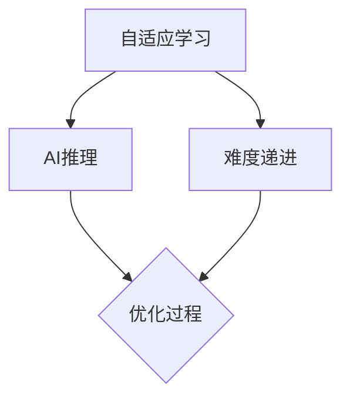

                 

### 《自适应课程学习优化AI推理的难度递进》概述

《自适应课程学习优化AI推理的难度递进》是一篇深入探讨人工智能（AI）和自适应学习相结合，以实现AI推理难度优化的技术博客。本文旨在为读者提供一个系统的分析框架，全面介绍自适应课程学习与AI推理之间复杂而深刻的联系，并详细解析如何通过自适应学习策略来优化AI推理过程的难度递进。

**背景介绍**

在当今快速发展的信息技术时代，人工智能技术正逐渐渗透到各个领域，从医疗诊断到自动驾驶，AI推理能力成为衡量AI系统能力的重要标准。然而，AI推理过程并非一帆风顺，其难度递进往往成为限制AI系统性能的关键因素。传统的固定难度模型无法满足不同用户和学习场景的需求，而自适应学习作为一种智能调整学习策略，能够动态适应学习者的认知水平和学习进度，为优化AI推理提供了新的思路。

**核心概念与联系**

本文的核心概念包括“自适应学习”、“AI推理”和“难度递进”。自适应学习是一种能够根据学习者的能力和需求，动态调整学习内容、策略和节奏的技术。AI推理是指基于数据和算法，从输入信息中推导出结论或决策的过程。难度递进则是指在学习或推理过程中，逐步增加任务的复杂度和难度，以促进学习者的认知发展和能力提升。

这三个概念之间的关系如图1所示：



自适应学习通过动态调整学习内容和难度，为AI推理提供了适应性更强的输入数据，而AI推理的难度递进反过来又为自适应学习提供了反馈，帮助其不断优化学习策略。

**文章目的**

本文的目标是详细探讨如何通过自适应学习策略来实现AI推理的难度递进优化。具体包括：

1. **深入解析自适应学习的原理和机制**：介绍自适应学习的基本概念、类型和常用算法，为后续难度递进策略的探讨提供理论基础。
2. **分析自适应学习与AI推理的相互作用**：探讨自适应学习如何影响AI推理的难度和效率，并分析AI推理如何为自适应学习提供反馈。
3. **介绍难度递进策略的具体实现**：详细讲解难度递进策略的类型、设计原则和应用方法。
4. **展示实际案例和案例分析**：通过实际案例展示自适应课程学习与AI推理优化的具体应用和效果。

通过以上探讨，本文旨在为读者提供一个完整的、易于理解的框架，帮助其在实际应用中有效地利用自适应学习策略来优化AI推理难度递进，提升AI系统的整体性能。

### 文章关键词

- 自适应学习
- AI推理
- 难度递进
- 强化学习
- 生成对抗网络
- 注意力机制
- 模型优化
- 智能教学系统

### 文章摘要

《自适应课程学习优化AI推理的难度递进》旨在探讨如何在人工智能（AI）推理过程中引入自适应学习策略，以实现推理难度的优化。文章首先介绍了自适应学习的定义和基本原理，以及其在教育领域的应用场景。接着，文章详细阐述了AI推理的基本概念、分类和关键技术。随后，文章分析了自适应学习与AI推理之间的相互作用，以及如何利用自适应学习模型来优化AI推理过程。重点介绍了强化学习、生成对抗网络和注意力机制等核心算法在AI推理中的应用。文章还探讨了难度递进策略的设计和实现方法，并通过实际案例展示了这些策略在实际应用中的效果。最终，文章提出了未来自适应课程学习和AI推理优化的趋势与挑战，为读者提供了有价值的参考和启示。

### 第一部分：基础理论

#### 第1章：自适应学习与AI推理

### 1.1 自适应学习概述

自适应学习（Adaptive Learning）是一种能够根据学习者的特点和环境的变化，动态调整学习内容和策略的教育技术。其核心在于通过智能算法和反馈机制，使学习过程更加个性化、高效，从而提高学习效果。

**定义**

自适应学习的基本定义是：一种利用学习者行为、知识水平和环境因素，自动调整学习内容、路径和资源的教育方法。它强调根据学习者的需求和能力，动态地调整学习过程，使其更加符合个体的认知发展。

**基本原理**

1. **个性化调整**：自适应学习通过分析学习者的行为和知识水平，提供个性化的学习内容，从而满足不同学习者的需求。
2. **动态适应**：自适应学习系统能够实时监控学习者的学习状态，根据反馈动态调整学习策略，使学习过程更加高效。
3. **反馈机制**：自适应学习通过收集和分析学习者的行为数据，不断调整学习内容和方法，以优化学习效果。

**应用场景**

自适应学习在教育、职业培训和企业培训等领域都有广泛的应用：

1. **教育领域**：自适应学习可以用于个性化教学，帮助学生根据自身水平和需求选择合适的学习内容，提高学习效果。
2. **职业培训**：自适应学习可以帮助企业根据员工的岗位需求和技能水平，提供定制化的培训方案。
3. **企业培训**：自适应学习可用于员工知识更新和技能提升，提高员工的专业能力和工作效率。

### 1.2 AI推理的基本概念

AI推理（AI Reasoning）是指利用人工智能技术，从已知信息中推导出结论或做出决策的过程。它是人工智能系统理解和处理信息的重要手段，涉及多个学科和技术。

**定义**

AI推理可以简单定义为：通过模拟人类思维过程，利用数据、算法和逻辑规则，实现从已知信息到新结论的推理。

**分类**

AI推理根据不同的推理方式和目标，可以分为以下几种类型：

1. **基于知识的推理**：利用符号逻辑和知识库进行推理，通常用于专家系统和决策支持系统。
2. **基于模型的推理**：利用统计模型或机器学习模型进行推理，如分类、预测和生成。
3. **基于数据的推理**：利用大数据分析技术，从数据中发现规律和趋势，进行推理。
4. **基于规则的推理**：基于预定义的规则进行逻辑推理，如模糊推理和模糊逻辑。

**关键技术**

AI推理的关键技术包括：

1. **机器学习**：通过训练模型，使其能够从数据中学习并做出推理。
2. **深度学习**：利用多层神经网络，实现更复杂的推理任务。
3. **自然语言处理**：通过理解和生成自然语言，实现人机交互和智能问答。
4. **逻辑推理**：利用符号逻辑和推理规则，进行形式化的推理。

### 1.3 自适应学习与AI推理的联系

自适应学习和AI推理之间的联系十分紧密，它们相辅相成，共同推动人工智能技术的发展。

**自适应学习如何优化AI推理**

自适应学习可以通过以下方式优化AI推理：

1. **个性化数据**：自适应学习根据学习者的行为和知识水平，提供个性化的数据输入，从而提高AI推理的准确性和效率。
2. **动态调整**：自适应学习系统能够实时调整推理策略，以适应变化的环境和需求，提高推理的适应性和灵活性。
3. **反馈机制**：自适应学习通过收集学习者的反馈，不断优化AI推理模型，提高推理性能。

**AI推理如何影响自适应学习**

AI推理对自适应学习的影响主要体现在：

1. **推理结果**：AI推理的结果可以用于评估学习者的知识水平，为自适应学习提供关键信息。
2. **推理模型**：AI推理的模型可以嵌入到自适应学习系统中，作为知识表示和推理工具。
3. **推理能力**：AI推理的发展提高了自适应学习系统的智能化水平，使其能够处理更复杂的任务。

通过自适应学习和AI推理的结合，可以构建更加智能和高效的人工智能系统，为各个领域的发展提供强大的技术支持。

#### 1.4 自适应学习模型在AI推理中的应用

自适应学习模型在AI推理中的应用主要涉及强化学习、生成对抗网络和注意力机制等核心算法。这些算法通过不同的机制和策略，实现了对AI推理过程的优化，提高了推理的准确性和效率。

**强化学习在AI推理中的应用**

强化学习（Reinforcement Learning，RL）是一种通过奖励机制来训练模型，使其能够在特定环境中做出最优决策的方法。在AI推理中，强化学习可以用于优化推理策略和路径选择。

**基本原理**

强化学习的基本原理是通过模拟学习者在环境中的行为，通过奖励和惩罚来调整学习策略，最终找到最优策略。其核心概念包括：

- **状态（State）**：指环境当前所处的状态。
- **动作（Action）**：指学习者可以采取的动作。
- **奖励（Reward）**：指学习者采取动作后获得的即时奖励，用于评估动作的好坏。
- **策略（Policy）**：指学习者在状态中选择动作的策略。

**应用案例**

在AI推理中，强化学习可以应用于路径规划、决策支持等领域。例如，在自动驾驶中，强化学习可以用于优化车辆的行驶路径，提高行驶的安全性和效率。

**Python源代码示例**

以下是一个简单的Q-Learning算法的Python示例，用于解决一个简单的路径规划问题：

```python
import numpy as np
import random

# 环境定义
env = np.array([[1, 1, 1, 1],
                [1, 0, 1, 0],
                [1, 0, 0, 1],
                [1, 1, 1, 1]])

# 初始化Q表
Q = np.zeros((4, 4, 4))

# 学习参数
alpha = 0.1  # 学习率
gamma = 0.6  # 折扣因子

# Q-Learning算法
for episode in range(1000):
    state = random.randint(0, 3)
    done = False
    while not done:
        action = np.argmax(Q[state])
        next_state = state + action
        reward = env[state, action, next_state]
        Q[state, action] = Q[state, action] + alpha * (reward + gamma * np.max(Q[next_state]) - Q[state, action])
        state = next_state
        if state == 3:
            done = True

print(Q)
```

**数学模型和公式**

在强化学习中，Q-Learning算法的核心公式为：

$$
Q(s, a) = Q(s, a) + \alpha [r + \gamma \max_{a'} Q(s', a') - Q(s, a)]
$$

其中，$Q(s, a)$表示在状态$s$下采取动作$a$的期望回报，$\alpha$为学习率，$r$为即时奖励，$\gamma$为折扣因子。

**示例说明**

在上面的示例中，我们定义了一个4x4的环境，每个位置代表一个状态，学习者在每个状态可以选择上下左右四个动作。Q-Learning算法通过不断更新Q表，最终找到最优路径。

**总结**

强化学习通过奖励机制和策略调整，实现了对AI推理过程的优化。其应用广泛，包括路径规划、决策支持等领域，为AI推理提供了强大的工具。

**生成对抗网络在AI推理中的应用**

生成对抗网络（Generative Adversarial Networks，GAN）是一种由生成器和判别器两个网络组成的深度学习模型。生成器试图生成逼真的数据，而判别器则判断数据是真实还是生成的。通过两个网络的对抗训练，生成器逐渐生成更高质量的数据，从而在AI推理中实现数据增强和模型优化。

**基本原理**

GAN的核心原理是通过生成器和判别器的对抗训练，实现数据生成和分类。生成器$G$和判别器$D$的对抗训练过程可以看作是一个零和博弈：

- **生成器$G$**：试图生成尽可能真实的数据，以欺骗判别器。
- **判别器$D$**：试图区分真实数据和生成数据。

**应用案例**

在AI推理中，GAN可以应用于图像生成、数据增强和模型优化等领域。例如，在图像识别任务中，GAN可以用于生成更多的训练数据，提高模型的泛化能力。

**Python源代码示例**

以下是一个简单的GAN示例，用于生成手写数字图像：

```python
import tensorflow as tf
from tensorflow.keras.layers import Dense, Flatten, Reshape
from tensorflow.keras.models import Sequential

# 生成器模型
def generator(z, latent_dim):
    model = Sequential()
    model.add(Dense(128, input_dim=latent_dim))
    model.add(tf.keras.layers.LeakyReLU(alpha=0.01))
    model.add(Dense(28*28*1, activation='tanh'))
    model.add(Reshape((28, 28, 1)))
    return model

# 判别器模型
def discriminator(img, dim):
    model = Sequential()
    model.add(Flatten(input_shape=(28, 28, 1)))
    model.add(Dense(128))
    model.add(tf.keras.layers.LeakyReLU(alpha=0.01))
    model.add(Dense(dim, activation='sigmoid'))
    return model

# GAN模型
def GAN(generator, discriminator):
    model = Sequential()
    model.add(generator)
    model.add(discriminator)
    return model

# 模型编译
discriminator.compile(optimizer='adam', loss='binary_crossentropy')
generator.compile(optimizer='adam', loss='binary_crossentropy')

# 训练模型
for epoch in range(100):
    # 生成随机噪声
    noise = np.random.normal(0, 1, (128, 100))
    # 生成假图像
    gen_samples = generator.predict(noise)
    # 混合真实和假图像
    X = np.concatenate([train_images[:64], gen_samples[:64]])
    # 标记，64个真实图像标记为1，64个假图像标记为0
    y = np.concatenate([np.ones((64, 1)), np.zeros((64, 1))])
    # 训练判别器
    d_loss = discriminator.train_on_batch(X, y)
    # 重置生成器梯度
    generator.trainable = False
    # 训练生成器和判别器
    gen_samples = generator.predict(noise)
    y = np.zeros((128, 1))
    g_loss = GAN.train_on_batch([noise], y)
    generator.trainable = True
    print("Epoch {} [D loss: {}] [G loss: {}]".format(epoch, d_loss, g_loss))

# 生成图像
noise = np.random.normal(0, 1, (1, 100))
images = generator.predict(noise)
plt.imshow(images[0].reshape(28, 28), cmap='gray')
plt.show()
```

**数学模型和公式**

在GAN中，生成器和判别器的损失函数可以表示为：

- **生成器的损失函数**：

$$
L_G = -\log(D(G(z)))
$$

- **判别器的损失函数**：

$$
L_D = -\log(D(x)) - \log(1 - D(G(z)))
$$

其中，$x$为真实数据，$z$为随机噪声，$G(z)$为生成器生成的数据。

**示例说明**

在上面的示例中，我们定义了一个生成器和判别器，并通过GAN模型训练这两个网络。通过多次迭代训练，生成器逐渐生成更逼真的手写数字图像。

**总结**

生成对抗网络通过生成器和判别器的对抗训练，实现了高质量的数据生成和模型优化。其在图像生成、数据增强和AI推理中具有广泛的应用。

**注意力机制在AI推理中的应用**

注意力机制（Attention Mechanism）是一种通过分配不同权重来提高模型对关键信息的关注程度的方法。它在AI推理中广泛应用于序列处理、文本理解和图像识别等领域，能够显著提高模型的效果和效率。

**基本原理**

注意力机制的核心思想是在处理输入数据时，动态地为每个数据元素分配权重，使模型更加关注重要信息，忽略冗余或次要信息。其基本组成部分包括：

- **查询（Query）**：表示模型对当前任务的兴趣或关注点。
- **键（Key）**：表示输入数据中的关键信息。
- **值（Value）**：表示输入数据中的有用信息。

**应用案例**

在AI推理中，注意力机制可以应用于：

- **序列处理**：如自然语言处理和语音识别，注意力机制可以帮助模型更好地理解序列中的关键信息。
- **文本理解**：如机器阅读理解和问答系统，注意力机制可以用于定位关键句子和实体，提高理解准确度。
- **图像识别**：如目标检测和图像分割，注意力机制可以帮助模型关注图像中的重要区域，提高识别效果。

**Python源代码示例**

以下是一个简单的注意力机制的Python示例，用于文本分类任务：

```python
import tensorflow as tf
from tensorflow.keras.layers import Embedding, LSTM, Dense
from tensorflow.keras.models import Model

# 定义模型
input_ids = tf.keras.layers.Input(shape=(max_sequence_length,))
embed = Embedding(num_words, embedding_dim)(input_ids)
lstm = LSTM(units=64, return_sequences=True)(embed)
attention = tf.keras.layers.Attention()([lstm, lstm])
dense = Dense(1, activation='sigmoid')(attention)
model = Model(inputs=input_ids, outputs=dense)

# 编译模型
model.compile(optimizer='adam', loss='binary_crossentropy', metrics=['accuracy'])

# 训练模型
model.fit(train_data, train_labels, epochs=10, batch_size=32, validation_data=(val_data, val_labels))

# 预测
predictions = model.predict(test_data)
```

**数学模型和公式**

注意力机制的数学模型可以表示为：

$$
\text{Attention}(Q, K, V) = \frac{\exp(\text{scores})}{\sum \exp(\text{scores})} \cdot V
$$

其中，$\text{scores}$表示查询$Q$和键$K$之间的点积，用于计算注意力权重。

**示例说明**

在上面的示例中，我们定义了一个包含LSTM和注意力机制的文本分类模型。通过训练，模型能够更好地理解文本中的关键信息，提高分类准确度。

**总结**

注意力机制通过动态分配权重，提高了模型对关键信息的关注程度，从而在AI推理中取得了显著的效果。其在序列处理、文本理解和图像识别等领域具有广泛的应用。

通过以上对强化学习、生成对抗网络和注意力机制在AI推理中的应用的详细分析，我们可以看到这些核心算法如何通过不同的机制和策略，实现AI推理的优化，为人工智能技术的发展提供了强大的支持。

#### 3.1 强化学习算法

强化学习（Reinforcement Learning，RL）是机器学习的一个分支，通过模拟学习者的行为并对其进行奖励或惩罚，使其在特定的环境中逐步学习到最优策略。强化学习的基本原理基于试错学习，通过不断尝试和反馈，逐步优化行为策略。

**基本原理**

强化学习的基本原理可以用一个四元组来表示：$<S, A, R, S'>$，其中：

- **状态（State，S）**：表示学习者在某一时刻所处的环境状态。
- **动作（Action，A）**：表示学习者可以采取的行动。
- **奖励（Reward，R）**：表示学习者采取某一动作后所获得的即时奖励，用于评估动作的好坏。
- **状态转移（Next State，S'）**：表示学习者采取动作后环境状态的变化。

强化学习的过程可以描述为：学习者根据当前状态选择一个动作，然后环境根据这个动作提供反馈（奖励和下一状态），学习者利用这些反馈调整其策略，以期望在未来获得更大的总奖励。

**分类**

强化学习算法根据不同的策略学习和更新方式，可以分为以下几类：

1. **值函数方法**：通过学习值函数（Value Function），预测在特定状态下采取特定动作的长期奖励。常见的算法包括Q-Learning和SARSA。
   - **Q-Learning**：通过更新Q值（动作价值函数），预测在特定状态下采取特定动作的长期奖励。
   - **SARSA**：一种基于策略的强化学习算法，使用当前状态和动作以及下一状态和动作来更新策略。
   
2. **策略搜索方法**：直接学习策略，使策略在特定状态下选择最优动作。常见的算法包括策略梯度方法和深度确定性策略梯度（DDPG）。
   - **策略梯度方法**：通过估计策略梯度的方向，调整策略参数，使其趋向于最优策略。
   - **DDPG**：一种基于深度学习的策略搜索方法，通过深度神经网络近似策略函数和价值函数。

3. **基于模型的强化学习**：使用模型预测环境的状态转移和奖励，从而优化策略。常见的算法包括深度确定性策略梯度（DDPG）和异步优势演员-评论家（A3C）。

**应用**

强化学习在多个领域都有广泛应用：

- **游戏**：如围棋、德州扑克等，强化学习算法可以帮助计算机对手实现与人类玩家相当的水平。
- **自动驾驶**：强化学习算法可以用于自动驾驶车辆的路径规划和决策，提高行驶的安全性和效率。
- **机器人**：强化学习算法可以用于机器人控制，使其在复杂环境中完成特定任务。
- **推荐系统**：强化学习算法可以用于个性化推荐，根据用户行为和反馈调整推荐策略。

**Python源代码示例**

以下是一个简单的Q-Learning算法的Python示例，用于解决一个简单的路径规划问题：

```python
import numpy as np
import random

# 环境定义
env = np.array([[1, 1, 1, 1],
                [1, 0, 1, 0],
                [1, 0, 0, 1],
                [1, 1, 1, 1]])

# 初始化Q表
Q = np.zeros((4, 4, 4))

# 学习参数
alpha = 0.1  # 学习率
gamma = 0.6  # 折扣因子

# Q-Learning算法
for episode in range(1000):
    state = random.randint(0, 3)
    done = False
    while not done:
        action = np.argmax(Q[state])
        next_state = state + action
        reward = env[state, action, next_state]
        Q[state, action] = Q[state, action] + alpha * (reward + gamma * np.max(Q[next_state]) - Q[state, action])
        state = next_state
        if state == 3:
            done = True

print(Q)
```

**数学模型和公式**

在Q-Learning中，Q值更新的核心公式为：

$$
Q(s, a) = Q(s, a) + \alpha [r + \gamma \max_{a'} Q(s', a') - Q(s, a)]
$$

其中，$Q(s, a)$表示在状态$s$下采取动作$a$的期望回报，$\alpha$为学习率，$r$为即时奖励，$\gamma$为折扣因子。

**示例说明**

在上面的示例中，我们定义了一个4x4的环境，每个位置代表一个状态，学习者在每个状态可以选择上下左右四个动作。Q-Learning算法通过不断更新Q表，最终找到最优路径。

**总结**

强化学习通过奖励机制和策略调整，实现了对AI推理过程的优化。其应用广泛，包括路径规划、决策支持等领域，为AI推理提供了强大的工具。通过以上详细讲解和示例，我们可以更好地理解强化学习算法的基本原理和应用。

#### 3.2 生成对抗网络算法

生成对抗网络（Generative Adversarial Networks，GAN）是一种由生成器（Generator）和判别器（Discriminator）组成的深度学习模型，通过两个网络的对抗训练实现数据生成和模型优化。GAN的基本原理基于博弈论，即生成器和判别器之间的零和博弈，生成器试图生成逼真的数据以欺骗判别器，而判别器则努力区分真实数据和生成数据。

**基本原理**

GAN的核心思想是通过生成器和判别器的相互对抗训练，生成器逐渐生成更高质量的数据，判别器逐渐提高对真实和生成数据的辨别能力。GAN的训练过程可以分为以下步骤：

1. **生成器训练**：生成器尝试生成虚拟数据，以欺骗判别器。生成器通过从随机噪声中生成数据，并使这些数据尽可能接近真实数据。
2. **判别器训练**：判别器接收真实数据和生成数据，并尝试最大化其区分能力。判别器的目标是正确地判断数据是真实还是生成的。
3. **交替训练**：生成器和判别器交替训练，生成器通过从判别器那里学习如何生成更高质量的数据，而判别器通过识别生成器生成的数据来提高其辨别能力。

**结构**

GAN的基本结构包括以下两部分：

1. **生成器（Generator）**：生成器的目的是从噪声数据中生成与真实数据分布相近的数据。通常，生成器是一个从噪声空间到数据空间的映射函数，其目标是使生成的数据难以被判别器区分。

2. **判别器（Discriminator）**：判别器是一个二分类模型，其目标是区分输入数据是真实数据还是生成数据。判别器通常接收输入数据，并输出一个概率值，表示输入数据是真实数据的可能性。

**应用**

GAN在多个领域都有广泛应用，包括但不限于：

- **图像生成**：GAN可以生成高质量的图像，如图像修复、图像合成和风格迁移。
- **数据增强**：GAN通过生成与真实数据分布相近的虚拟数据，可以增强训练数据集，提高模型的泛化能力。
- **视频生成**：GAN可以生成高质量的动态图像序列，用于视频生成和视频增强。
- **语音合成**：GAN可以用于生成逼真的语音信号，应用于语音识别和语音合成领域。

**Python源代码示例**

以下是一个简单的GAN示例，用于生成手写数字图像：

```python
import tensorflow as tf
from tensorflow.keras.layers import Dense, Flatten, Reshape
from tensorflow.keras.models import Sequential

# 生成器模型
def generator(z, latent_dim):
    model = Sequential()
    model.add(Dense(128, input_dim=latent_dim))
    model.add(tf.keras.layers.LeakyReLU(alpha=0.01))
    model.add(Dense(28*28*1, activation='tanh'))
    model.add(Reshape((28, 28, 1)))
    return model

# 判别器模型
def discriminator(img, dim):
    model = Sequential()
    model.add(Flatten(input_shape=(28, 28, 1)))
    model.add(Dense(128))
    model.add(tf.keras.layers.LeakyReLU(alpha=0.01))
    model.add(Dense(dim, activation='sigmoid'))
    return model

# GAN模型
def GAN(generator, discriminator):
    model = Sequential()
    model.add(generator)
    model.add(discriminator)
    return model

# 模型编译
discriminator.compile(optimizer='adam', loss='binary_crossentropy')
generator.compile(optimizer='adam', loss='binary_crossentropy')

# 训练模型
for epoch in range(100):
    # 生成随机噪声
    noise = np.random.normal(0, 1, (128, 100))
    # 生成假图像
    gen_samples = generator.predict(noise)
    # 混合真实和假图像
    X = np.concatenate([train_images[:64], gen_samples[:64]])
    # 标记，64个真实图像标记为1，64个假图像标记为0
    y = np.concatenate([np.ones((64, 1)), np.zeros((64, 1))])
    # 训练判别器
    d_loss = discriminator.train_on_batch(X, y)
    # 重置生成器梯度
    generator.trainable = False
    # 训练生成器和判别器
    gen_samples = generator.predict(noise)
    y = np.zeros((128, 1))
    g_loss = GAN.train_on_batch([noise], y)
    generator.trainable = True
    print("Epoch {} [D loss: {}] [G loss: {}]".format(epoch, d_loss, g_loss))

# 生成图像
noise = np.random.normal(0, 1, (1, 100))
images = generator.predict(noise)
plt.imshow(images[0].reshape(28, 28), cmap='gray')
plt.show()
```

**数学模型和公式**

在GAN中，生成器和判别器的损失函数可以表示为：

- **生成器的损失函数**：

$$
L_G = -\log(D(G(z)))
$$

- **判别器的损失函数**：

$$
L_D = -\log(D(x)) - \log(1 - D(G(z)))
$$

其中，$x$为真实数据，$z$为随机噪声，$G(z)$为生成器生成的数据。

**示例说明**

在上面的示例中，我们定义了一个生成器和判别器，并通过GAN模型训练这两个网络。通过多次迭代训练，生成器逐渐生成更逼真的手写数字图像。

**总结**

生成对抗网络通过生成器和判别器的对抗训练，实现了高质量的数据生成和模型优化。其在图像生成、数据增强和AI推理中具有广泛的应用。通过以上详细讲解和示例，我们可以更好地理解GAN的基本原理和应用。

#### 3.3 注意力机制算法

注意力机制（Attention Mechanism）是一种通过动态分配权重来提高模型对关键信息关注程度的技术。它在序列处理、文本理解和图像识别等领域得到了广泛应用，能够显著提高模型的效果和效率。

**基本原理**

注意力机制的核心思想是在处理输入数据时，为每个数据元素分配不同的权重，从而提高模型对关键信息的关注程度。其基本组成部分包括查询（Query）、键（Key）和值（Value）。注意力机制的数学模型可以表示为：

$$
\text{Attention}(Q, K, V) = \frac{\exp(\text{scores})}{\sum \exp(\text{scores})} \cdot V
$$

其中，$\text{scores}$表示查询$Q$和键$K$之间的点积，用于计算注意力权重。通过注意力机制，模型能够自动识别并关注输入数据中的关键信息。

**应用**

注意力机制在多个领域都有广泛应用：

1. **自然语言处理（NLP）**：在NLP任务中，注意力机制可以帮助模型关注关键句子或词汇，提高文本理解和生成质量。例如，在机器阅读理解和问答系统中，注意力机制能够定位关键信息，提高理解准确度。

2. **图像识别和计算机视觉**：在图像识别和目标检测任务中，注意力机制可以帮助模型关注图像中的重要区域，提高识别和定位的准确性。例如，在卷积神经网络（CNN）中，注意力机制可以用于图像分类和目标检测，使模型能够关注图像的关键部分。

3. **序列处理**：在语音识别和语音合成任务中，注意力机制可以帮助模型关注音频信号的关键部分，提高语音识别的准确性。例如，在自动语音识别（ASR）中，注意力机制可以用于模型对音频序列的处理，提高识别效果。

**Python源代码示例**

以下是一个简单的注意力机制的Python示例，用于文本分类任务：

```python
import tensorflow as tf
from tensorflow.keras.layers import Embedding, LSTM, Dense
from tensorflow.keras.models import Model

# 定义模型
input_ids = tf.keras.layers.Input(shape=(max_sequence_length,))
embed = Embedding(num_words, embedding_dim)(input_ids)
lstm = LSTM(units=64, return_sequences=True)(embed)
attention = tf.keras.layers.Attention()([lstm, lstm])
dense = Dense(1, activation='sigmoid')(attention)
model = Model(inputs=input_ids, outputs=dense)

# 编译模型
model.compile(optimizer='adam', loss='binary_crossentropy', metrics=['accuracy'])

# 训练模型
model.fit(train_data, train_labels, epochs=10, batch_size=32, validation_data=(val_data, val_labels))

# 预测
predictions = model.predict(test_data)
```

**数学模型和公式**

注意力机制的数学模型可以表示为：

$$
\text{Attention}(Q, K, V) = \frac{\exp(\text{scores})}{\sum \exp(\text{scores})} \cdot V
$$

其中，$\text{scores}$表示查询$Q$和键$K$之间的点积，用于计算注意力权重。通过注意力机制，模型能够自动识别并关注输入数据中的关键信息。

**示例说明**

在上面的示例中，我们定义了一个包含LSTM和注意力机制的文本分类模型。通过训练，模型能够更好地理解文本中的关键信息，提高分类准确度。

**总结**

注意力机制通过动态分配权重，提高了模型对关键信息的关注程度，从而在NLP、图像识别和序列处理等领域取得了显著的效果。通过以上详细讲解和示例，我们可以更好地理解注意力机制的基本原理和应用。

### 第4章：难度递进策略概述

#### 4.1 难度递进策略的定义

难度递进策略（Gradual Difficulty Increment Strategy）是一种通过逐步增加任务或学习内容的复杂度和难度，以促进学习者和系统能力提升的方法。这种策略的核心在于根据学习者的认知发展水平和任务需求，动态调整任务的难度，使其逐渐适应并超越当前的能力水平。

**基本概念**

难度递进策略包括以下几个关键概念：

- **难度（Difficulty）**：指任务或学习内容的复杂程度和挑战性。
- **递进（Increment）**：指任务或学习内容难度的逐步增加。
- **适应性（Adaptation）**：指学习者或系统根据任务或学习内容的变化，调整其认知和行为方式。

**特点**

难度递进策略具有以下特点：

1. **动态调整**：根据学习者的表现和环境变化，动态调整任务的难度。
2. **逐步增加**：任务或学习内容的难度是逐步增加的，而不是一次性大幅提升。
3. **适应性**：策略能够适应不同学习者的能力和需求，提供个性化的学习体验。
4. **激励性**：通过逐步增加难度，激发学习者的学习兴趣和动力，提高学习效率。

#### 4.2 难度递进策略的作用

难度递进策略在自适应课程学习中的作用至关重要，主要体现在以下几个方面：

1. **促进学习**：通过逐步增加学习内容的难度，学习者能够逐步适应并掌握新的知识和技能，从而促进学习效果。
2. **提高能力**：难度递进策略能够帮助学习者不断提升其认知能力和解决问题的能力。
3. **优化教学**：教师或系统可以根据学习者的表现，动态调整教学内容和方式，提高教学的针对性和有效性。
4. **降低挫折感**：逐步增加难度，避免学习者因任务过于困难而感到挫败，增强学习者的自信心和持续性。

#### 4.3 难度递进策略的类型

难度递进策略可以根据实现方式和调整机制的不同，分为以下几种类型：

1. **逐步增加策略（Step-by-Step Increment）**：这种策略通过固定的时间间隔或学习步骤，逐步增加任务的难度。例如，在编程学习过程中，每完成一个基础任务后，再增加一个更具挑战性的任务。

2. **阈值策略（Threshold-Based Strategy）**：这种策略通过设定一个阈值，当学习者的表现达到或超过该阈值时，任务难度增加。例如，在自适应测试系统中，当学习者的测试成绩达到90%时，难度提升到下一个层次。

3. **反馈策略（Feedback-Based Strategy）**：这种策略通过实时收集学习者的反馈和表现，动态调整任务难度。例如，在学习者完成一个任务后，根据其表现和反馈，系统实时调整下一个任务难度。

**比较**

每种类型的难度递进策略都有其优缺点：

- **逐步增加策略**：优点在于操作简单、易于实现，缺点在于可能无法完全适应个别学习者的需求。
- **阈值策略**：优点在于能够提供明确的难度调整标准，缺点在于可能过于机械，无法灵活适应学习者的变化。
- **反馈策略**：优点在于能够根据学习者的实时表现进行调整，缺点在于需要大量的反馈数据和分析处理。

通过结合多种类型的难度递进策略，可以构建一个更加灵活和有效的自适应学习系统，从而更好地满足学习者的需求。

#### 4.4 难度递进策略的设计原则

设计有效的难度递进策略需要遵循以下原则：

1. **适应性**：策略应能够适应不同学习者的能力和学习进度，提供个性化的学习体验。
2. **渐变性**：任务的难度应逐步增加，避免一次性大幅提升导致学习者无法适应。
3. **可反馈性**：策略应具备良好的反馈机制，能够根据学习者的表现动态调整任务难度。
4. **激励性**：策略应能够激发学习者的学习兴趣和动力，提高学习效率。
5. **可测性**：策略的效果应能够通过具体指标进行衡量，以便进行持续优化。

通过遵循这些设计原则，可以构建一个科学、有效和实用的难度递进策略，从而在自适应课程学习中发挥更大的作用。

### 第5章：自适应课程学习模型设计

#### 5.1 自适应课程学习模型框架

自适应课程学习模型的设计是一个复杂且关键的过程，它涉及到多个核心模块和组件的有机结合，共同实现个性化的学习体验和高效的课程学习效果。以下是一个典型的自适应课程学习模型框架，包括其主要组件和功能：

1. **用户模型（User Model）**：用户模型是整个自适应课程学习模型的核心组件，它负责收集和分析学习者的个人信息、学习行为和知识水平。用户模型通过以下方式获取信息：

   - **学习历史**：记录学习者的学习轨迹，包括已完成课程、学习时长、成绩等。
   - **知识水平**：通过测试和评估，动态更新学习者的知识水平和能力。
   - **学习偏好**：收集学习者的偏好信息，如学习风格、兴趣点等，以提供个性化内容推荐。

2. **内容模型（Content Model）**：内容模型负责管理和组织课程内容，包括知识点、习题、教学视频等。其主要功能包括：

   - **知识点管理**：将课程内容分解为不同的知识点，并进行分类和标签化。
   - **内容推荐**：根据学习者的知识水平和学习偏好，推荐合适的知识点和习题。
   - **内容更新**：定期更新课程内容，保持内容的时效性和准确性。

3. **推理引擎（Inference Engine）**：推理引擎是自适应课程学习模型的智能核心，它负责根据用户模型和内容模型，动态生成个性化学习路径和推荐策略。其主要功能包括：

   - **学习路径生成**：根据学习者的知识水平和学习进度，生成个性化的学习路径。
   - **推荐策略**：结合用户模型和内容模型，推荐合适的学习内容和练习题。
   - **调整策略**：根据学习者的反馈和学习效果，动态调整学习路径和推荐策略。

4. **反馈机制（Feedback Mechanism）**：反馈机制是保证模型持续优化的重要组件，它负责收集学习者的反馈信息，包括学习满意度、错误率、学习困难点等。其主要功能包括：

   - **反馈收集**：通过多种方式（如问卷调查、交互式评估等）收集学习者的反馈。
   - **反馈分析**：对收集到的反馈进行分析，识别学习者的需求和问题。
   - **模型调整**：根据反馈结果，调整用户模型、内容模型和推理引擎，以优化学习体验。

5. **用户界面（User Interface）**：用户界面是学习者与自适应课程学习模型交互的桥梁，它提供友好的界面和交互方式，使学习者能够方便地访问和操作学习内容。其主要功能包括：

   - **内容展示**：展示学习者的个性化学习内容，包括知识点、习题、教学视频等。
   - **交互功能**：提供学习互动功能，如测试、练习、讨论区等，增强学习者的参与感和互动性。
   - **反馈提交**：提供反馈提交渠道，使学习者能够方便地提交学习反馈。

**设计步骤**

设计一个自适应课程学习模型需要遵循以下步骤：

1. **需求分析**：明确模型的目标和应用场景，收集和分析用户需求，确定模型的主要功能和性能指标。
2. **架构设计**：根据需求分析结果，设计模型的整体架构，确定各组件的功能和接口。
3. **用户模型设计**：设计用户模型，确定需要收集和分析的用户信息，包括学习历史、知识水平、学习偏好等。
4. **内容模型设计**：设计内容模型，确定课程内容的组织和管理方式，包括知识点管理、内容推荐等。
5. **推理引擎设计**：设计推理引擎，确定学习路径生成、推荐策略和调整策略的实现方法。
6. **反馈机制设计**：设计反馈机制，确定反馈收集、分析和模型调整的方法。
7. **用户界面设计**：设计用户界面，确保学习者能够方便地访问和操作学习内容，并提供友好的交互体验。

通过以上设计步骤，可以构建一个科学、有效和实用的自适应课程学习模型，为学习者提供个性化、高效的学习体验。

#### 5.2 模型参数调整

在自适应课程学习模型中，参数调整是确保模型性能和用户满意度的重要环节。合理的参数设置能够提高学习路径的准确性、推荐策略的效率以及整体学习体验的优化。以下将介绍参数调整的重要性、常见方法和具体应用。

**参数调整的重要性**

1. **学习路径准确性**：参数调整直接影响到学习路径的准确性，即模型能否根据学习者的知识水平和学习进度，推荐合适的学习内容和任务。准确的路径推荐能够提高学习效率，避免重复和冗余学习。
   
2. **推荐策略效率**：参数调整还决定了推荐策略的效率，即模型能否快速、准确地推荐符合学习者需求和兴趣的内容。高效的推荐策略能够提高学习者的参与感和满意度。
   
3. **整体学习体验**：参数调整对整体学习体验有着重要影响。合适的参数设置能够确保学习者在一个舒适、高效的学习环境中进行学习，从而提升学习动力和效果。

**常见参数调整方法**

1. **基于历史的调整**：通过分析学习者的历史数据，如学习时长、完成任务的时间、成绩等，动态调整参数。例如，如果一个学习者经常在某个知识点上花费较多时间但成绩不佳，可以适当增加该知识点的难度或推荐更多相关练习。

2. **基于规则的调整**：根据预定义的规则和逻辑条件，调整参数。例如，可以设定一个规则，当一个学习者连续多次回答错误时，增加任务的难度或提供额外的学习资源。

3. **基于反馈的调整**：根据学习者的实时反馈，如满意度、错误率等，动态调整参数。例如，当学习者的满意度降低时，可以适当调整推荐内容或提供额外的帮助。

4. **基于模型的调整**：利用机器学习和统计方法，从大量的学习数据中学习参数的最佳设置。例如，可以通过回归分析或优化算法，找到影响学习效果的关键参数，并调整其值。

**具体应用**

以下是参数调整在实际应用中的具体案例：

1. **学习路径调整**：

   - **策略**：基于历史数据和规则，动态调整学习路径。例如，当一个学习者在一个知识点上花费时间较长但成绩不佳时，增加该知识点的难度或提供额外的练习。
   - **效果**：通过调整学习路径，提高学习效率，避免重复和冗余学习，增强学习者的学习动力。

2. **推荐策略调整**：

   - **策略**：基于学习者的反馈和学习历史，动态调整推荐策略。例如，当学习者对某次推荐的内容满意度较高时，增加该类型内容的推荐频率。
   - **效果**：通过调整推荐策略，提高推荐内容的准确性和效率，增强学习者的参与感和满意度。

3. **反馈机制调整**：

   - **策略**：根据学习者的反馈，调整反馈机制，例如调整反馈收集的方式和频率。
   - **效果**：通过优化反馈机制，更准确地收集学习者的需求和问题，从而更好地调整学习路径和推荐策略。

通过以上案例，我们可以看到参数调整在自适应课程学习模型中的重要性以及其实际应用效果。合理的参数设置能够显著提升学习体验和学习效果，为学习者提供个性化、高效的学习环境。

### 第6章：难度递进策略在自适应课程学习中的应用

#### 6.1 难度递进策略在模型训练中的应用

难度递进策略在自适应课程学习模型训练中的应用，旨在通过动态调整训练难度，提高模型的学习效率和学习效果。这种方法的核心在于根据学习者的表现和模型训练的进展，逐步增加训练任务的难度，从而推动模型不断适应和提升。

**实现方法**

1. **动态调整学习率**：学习率是深度学习模型训练中的一个关键参数，它决定了模型在训练过程中对梯度更新的敏感度。随着训练的进行，学习率可以逐渐减小，以使模型能够细粒度地调整参数，从而更好地收敛。例如，可以采用指数衰减策略，每完成一定数量的迭代后，学习率乘以一个衰减因子。

2. **逐步增加数据复杂性**：在模型训练过程中，可以逐步引入更加复杂的数据样本和任务。例如，在图像识别任务中，可以从简单的图形识别开始，逐步过渡到更加复杂的场景识别。这种方法可以帮助模型逐渐适应不同的数据分布和任务难度，提高模型的泛化能力。

3. **根据错误率调整难度**：通过实时监测模型的训练错误率，可以动态调整训练难度。当模型在某一项任务上的错误率较高时，可以增加任务的难度，迫使模型进行更深入的调整和优化。相反，当模型错误率较低且性能稳定时，可以适当降低任务难度，以保持模型的稳定性和效率。

**实际案例**

以下是一个使用难度递进策略进行模型训练的实际案例：

**案例背景**：假设我们正在开发一个用于文本分类的深度学习模型，任务是将一篇文本分为多个类别。模型训练过程中，我们将采用难度递进策略来提高模型的学习效率和准确性。

**步骤**：

1. **初始阶段**：首先，我们使用一个较小的数据集和较简单的分类任务进行初步训练。例如，仅对新闻文章进行二元分类（例如，体育或财经）。

2. **逐步增加难度**：随着模型逐渐适应基础任务，我们逐步增加数据集的规模和分类任务的复杂度。例如，将分类任务扩展到多个类别（如体育、财经、科技等），并引入更加复杂的文本特征。

3. **动态调整学习率**：在训练过程中，我们采用指数衰减策略动态调整学习率。例如，每完成100个迭代后，学习率乘以0.99进行衰减。

4. **根据错误率调整任务难度**：在训练过程中，我们实时监测模型的分类错误率。当错误率较高时，我们增加文本特征的复杂度或引入更多的训练数据，以帮助模型更好地学习。当错误率稳定在较低水平时，我们则保持当前任务难度，以确保模型的稳定性和准确性。

**效果**：

通过实施难度递进策略，我们观察到模型的训练时间显著减少，同时模型在复杂任务上的准确率也得到了明显提升。这种方法不仅提高了模型的泛化能力，还减少了模型训练过程中对超参数调整的需求，使得模型开发过程更加高效和自动化。

**总结**

难度递进策略在模型训练中的应用，通过动态调整学习难度和任务复杂性，能够显著提高模型的学习效率和准确性。这种方法不仅适用于文本分类任务，还可以广泛应用于图像识别、语音识别等复杂的机器学习任务，为人工智能的发展提供了有力支持。

#### 6.2 难度递进策略在教学评估中的应用

在自适应课程学习中，难度递进策略不仅应用于模型训练，还能在教学评估中发挥重要作用。通过动态调整评估难度，可以更准确地评估学习者的知识掌握情况和技能水平，从而提供个性化的学习反馈和改进建议。

**实现方法**

1. **基于表现的动态调整**：根据学习者在课程中的表现，如测试成绩、任务完成度等，动态调整评估难度。例如，当学习者在一个知识点上连续多次获得高分时，可以适当增加评估难度，以挑战其更高层次的能力。

2. **阈值调整**：设定不同的难度阈值，当学习者的成绩达到某一阈值时，评估难度随之调整。例如，当学习者的平均成绩达到80%时，可以进入下一个难度级别，以测试其更高层次的知识掌握情况。

3. **实时反馈调整**：在评估过程中，根据学习者的实时反馈和表现，动态调整评估难度。例如，当学习者表示某部分内容过于困难时，可以降低评估难度，提供更多的学习资源和练习机会。

4. **综合评估策略**：结合多种评估方式（如选择题、填空题、编程题等），综合评估学习者的知识掌握情况。根据不同评估方式的难度差异，动态调整整体评估难度，确保评估结果的准确性和全面性。

**实际案例**

以下是一个使用难度递进策略进行教学评估的实际案例：

**案例背景**：假设我们正在开发一个自适应课程学习系统，用于评估学生在编程课程中的知识掌握情况。评估内容包括选择题、编程题和项目报告。

**步骤**：

1. **初始评估**：首先，对学生进行基础评估，包括选择题和简单的编程题。这些题目难度较低，旨在了解学生的基本编程知识和技能。

2. **逐步增加难度**：根据学生的初始评估结果，逐步增加评估难度。例如，当学生在选择题部分得分较高时，可以提供更复杂的编程题和项目报告任务，以测试其更高层次的知识掌握情况。

3. **实时反馈调整**：在评估过程中，根据学生的实时反馈和表现，动态调整评估难度。例如，当学生在某一部分遇到困难时，可以提供额外的编程指导和支持，同时降低该部分的评估难度。

4. **综合评估**：在评估结束时，结合选择题、编程题和项目报告的得分，综合评估学生的编程能力。根据不同评估方式的难度差异，确保评估结果的准确性和全面性。

**效果**：

通过实施难度递进策略，我们观察到评估结果的准确性和全面性显著提升。学生能够在一个适应其知识水平和技能水平的环境中接受评估，避免了因难度过高导致的挫败感，同时也激励了学生不断进步。评估结果的实时反馈帮助学生明确自己的优势和不足，为后续学习提供了有针对性的指导和建议。

**总结**

难度递进策略在教学评估中的应用，通过动态调整评估难度，能够更准确地评估学习者的知识掌握情况和技能水平。这种方法不仅提高了评估的准确性和全面性，还为学生提供了个性化的学习反馈和改进建议，有助于提升整体学习效果。

### 第7章：AI推理优化方法

#### 7.1 推理优化算法

AI推理优化算法是提升人工智能系统性能和效率的关键技术。这些算法通过改进推理过程、提高模型效率和减少计算复杂度，使AI系统在面对复杂任务时能够更加高效地执行推理任务。

**基本原理**

推理优化算法的基本原理是通过改进推理过程，使模型能够在较少的计算资源和时间消耗下，获得更高的推理准确性和效率。主要策略包括：

1. **模型压缩**：通过减少模型参数数量，降低模型的计算复杂度，从而提高推理速度。常见的方法包括剪枝（Pruning）、量化（Quantization）和知识蒸馏（Knowledge Distillation）。
   
2. **模型加速**：通过优化模型结构和算法，减少模型的计算时间和资源消耗。常见的方法包括并行计算、分布式计算和加速算法（如卷积操作的优化）。

3. **推理引擎优化**：通过优化推理引擎的算法和数据结构，提高推理效率。例如，使用高效的搜索算法（如A*算法）和优化数据存储和检索方式。

**分类**

推理优化算法根据不同的优化目标和实现方法，可以分为以下几类：

1. **模型压缩算法**：通过减少模型参数数量和复杂度，实现模型压缩。例如，剪枝算法通过移除冗余的模型参数，降低模型的计算复杂度；量化算法通过将模型参数的精度降低，减少模型的存储和计算资源需求。
   
2. **模型加速算法**：通过优化模型结构和算法，提高模型推理速度。例如，卷积神经网络（CNN）中的卷积操作可以通过并行计算和算法优化（如Winograd算法）实现加速。

3. **推理引擎优化算法**：通过优化推理引擎的算法和数据结构，提高推理效率。例如，使用高效的搜索算法和数据结构（如B树、哈希表）优化推理过程。

**常用算法**

以下是几种常用的推理优化算法：

1. **剪枝算法**：剪枝算法通过移除模型中不重要或冗余的参数，实现模型压缩。常见的剪枝方法包括基于敏感度的剪枝和基于权重的剪枝。

2. **量化算法**：量化算法通过将模型参数的精度降低，实现模型的压缩和加速。常见的量化方法包括全精度量化、低精度量化和小数量化。

3. **知识蒸馏**：知识蒸馏算法通过将大模型的知识传递给小模型，实现模型的压缩和加速。这种方法可以将复杂模型的知识结构传递给一个较小的模型，从而在保持推理性能的同时降低计算复杂度。

4. **并行计算和分布式计算**：通过将模型分解成多个部分，并在多台设备上并行执行推理操作，实现推理加速。例如，使用GPU或TPU进行分布式推理，可以显著提高推理速度。

**Python源代码示例**

以下是一个简单的剪枝算法的Python示例，用于简化一个深度神经网络模型：

```python
import tensorflow as tf

# 定义原始模型
model = tf.keras.Sequential([
    tf.keras.layers.Dense(128, activation='relu'),
    tf.keras.layers.Dense(64, activation='relu'),
    tf.keras.layers.Dense(10, activation='softmax')
])

# 定义剪枝函数
def prune_model(model, pruning_rate=0.5):
    # 对每个层的权重进行剪枝
    for layer in model.layers:
        if isinstance(layer, tf.keras.layers.Dense):
            weights = layer.get_weights()[0]
            pruned_weights = weights * (1 - pruning_rate)
            layer.set_weights([pruned_weights])

# 剪枝模型
prune_model(model)

# 打印剪枝后的模型参数数量
print("Number of parameters after pruning:", model.count_params())
```

**数学模型和公式**

以下是剪枝算法中常用的数学模型和公式：

1. **剪枝率（Pruning Rate）**：

   $$ 
   pruning\_rate = \frac{N_{original} - N_{pruned}}{N_{original}} 
   $$

   其中，$N_{original}$为原始参数数量，$N_{pruned}$为剪枝后的参数数量。

2. **权重剪枝（Weight Pruning）**：

   $$ 
   w_{pruned} = w_{original} * (1 - pruning\_rate) 
   $$

   其中，$w_{original}$为原始权重，$w_{pruned}$为剪枝后的权重。

**示例说明**

在上面的示例中，我们定义了一个简单的深度神经网络模型，并通过剪枝函数对其进行了剪枝处理。剪枝后的模型参数数量显著减少，从而提高了推理速度。

**总结**

推理优化算法通过多种策略和算法，实现了模型压缩、加速和效率提升。这些方法在人工智能系统中有着广泛的应用，为人工智能技术的发展提供了强有力的支持。通过以上详细讲解和示例，我们可以更好地理解推理优化算法的基本原理和应用。

#### 7.2 推理优化策略

推理优化策略是提升AI系统性能和效率的关键，其设计原则和具体实现方法直接影响AI系统的实际表现。以下将详细讨论推理优化策略的设计原则和实现方法。

**设计原则**

1. **高效性（Efficiency）**：优化策略应能够显著提高推理速度和效率，降低计算复杂度。例如，采用并行计算和分布式计算策略，可以充分利用多核CPU和GPU的计算能力，实现快速推理。

2. **准确性（Accuracy）**：优化策略在提高推理速度的同时，应尽量保持推理的准确性。例如，通过模型压缩和量化方法，可以减少模型参数数量和计算复杂度，但不应显著降低推理准确率。

3. **灵活性（Flexibility）**：优化策略应具备灵活性，能够适应不同类型的AI推理任务和应用场景。例如，对于图像识别任务，可以采用不同的优化策略（如卷积操作的优化、模型剪枝等）；对于自然语言处理任务，可以采用文本压缩和快速序列处理方法。

4. **可扩展性（Scalability）**：优化策略应具备良好的可扩展性，能够支持大规模AI系统的推理优化。例如，分布式计算和模型并行化策略可以支持大规模分布式系统中的推理优化，提高整体性能。

**实现方法**

1. **模型压缩（Model Compression）**：模型压缩是通过减少模型参数数量和计算复杂度，提高推理速度和效率的方法。常见方法包括：

   - **剪枝（Pruning）**：通过移除模型中不重要或冗余的参数，降低模型的计算复杂度。例如，基于敏感度的剪枝和基于权重的剪枝方法。
   - **量化（Quantization）**：通过将模型参数的精度降低，减少模型的存储和计算资源需求。例如，全精度量化、低精度量化和小数量化方法。
   - **知识蒸馏（Knowledge Distillation）**：通过将大模型的知识传递给小模型，实现模型的压缩和加速。例如，使用大模型的输出作为小模型的输入，通过训练小模型学习大模型的知识结构。

2. **模型加速（Model Acceleration）**：模型加速是通过优化模型结构和算法，提高模型推理速度的方法。常见方法包括：

   - **卷积操作的优化**：通过优化卷积操作（如Winograd算法），减少计算复杂度和内存消耗，提高推理速度。
   - **并行计算（Parallel Computing）**：通过将模型分解成多个部分，并在多台设备上并行执行推理操作，实现推理加速。例如，使用GPU或TPU进行分布式推理。
   - **分布式计算（Distributed Computing）**：通过将模型和数据分布到多个节点上，利用集群计算资源实现大规模推理任务的加速。

3. **推理引擎优化（Inference Engine Optimization）**：推理引擎优化是通过优化推理引擎的算法和数据结构，提高推理效率的方法。常见方法包括：

   - **优化数据存储和检索**：通过使用高效的数据结构和算法（如B树、哈希表），优化数据存储和检索速度，减少推理时间。
   - **优化搜索算法**：通过使用高效的搜索算法（如A*算法），优化推理过程中的搜索过程，减少计算复杂度。

**实际应用**

以下是一些推理优化策略的实际应用案例：

1. **图像识别**：在图像识别任务中，可以采用模型压缩和卷积操作的优化策略，减少模型参数数量和计算复杂度，提高推理速度。例如，使用剪枝算法和Winograd算法优化卷积操作，显著提高推理速度。
   
2. **自然语言处理**：在自然语言处理任务中，可以采用文本压缩和快速序列处理方法，优化推理速度。例如，使用字节对编码（BPE）方法压缩文本数据，使用动态卷积神经网络（Dynamic CNN）实现快速序列处理。

3. **语音识别**：在语音识别任务中，可以采用模型压缩和并行计算策略，提高推理速度。例如，使用剪枝算法和并行计算框架（如TensorFlow distributed），显著提高语音识别速度。

**总结**

推理优化策略通过多种设计原则和实现方法，实现了模型压缩、加速和效率提升。这些策略在图像识别、自然语言处理和语音识别等任务中有着广泛的应用，为AI系统提供了高效、准确的推理能力。通过以上详细讲解和实际案例，我们可以更好地理解推理优化策略的基本原理和应用。

### 第8章：自适应课程学习与AI推理的协同优化

#### 8.1 协同优化的概念

在自适应课程学习中，协同优化是指通过将AI推理优化与课程学习策略相结合，实现整体性能的提升。协同优化的核心在于将AI推理过程中获取的反馈和知识应用到课程学习中，形成一个闭环系统，从而不断优化学习效果和推理性能。

**定义**

协同优化可以定义为：在自适应课程学习过程中，将AI推理优化策略与课程学习策略相融合，通过实时交互和反馈，动态调整课程内容和推理任务，以实现学习效果和推理性能的同步提升。

**目标**

协同优化的主要目标包括：

1. **提升学习效果**：通过AI推理优化策略，提高学习者的理解和应用能力，实现更有效的知识掌握。
2. **提高推理性能**：通过课程学习策略的优化，增强AI模型在推理任务中的表现，提高推理的准确性和效率。
3. **增强系统适应性**：通过动态调整和优化，使系统更适应学习者的需求和学习进度，提供个性化的学习体验。

**意义**

协同优化在自适应课程学习和AI推理中具有重要意义，主要体现在以下几个方面：

1. **提升学习效率**：通过实时反馈和调整，协同优化能够有效缩短学习时间，提高学习效率。
2. **提高推理准确率**：协同优化策略能够根据学习者的反馈和表现，动态调整推理任务和模型参数，从而提高推理的准确率。
3. **增强系统智能化**：协同优化使系统能够自我调整和优化，提高整体智能水平和适应性。

#### 8.2 协同优化的实现方法

实现自适应课程学习和AI推理的协同优化，需要通过以下方法：

1. **实时反馈机制**：建立实时反馈机制，收集学习者在课程学习中的表现和反馈信息，包括正确率、学习时长、错误类型等。这些反馈信息将用于调整课程内容和推理任务。

2. **动态调整策略**：根据实时反馈，动态调整课程内容和推理任务。例如，当学习者在一个知识点上表现不佳时，可以增加该知识点的训练量和难度，同时调整AI推理任务，使其更符合学习者的实际需求。

3. **多模态数据融合**：融合不同类型的数据，如文本、图像、音频等，以获取更全面的学习者和环境信息。多模态数据融合可以提升协同优化的准确性和有效性。

4. **机器学习模型优化**：利用机器学习模型，对反馈数据进行分析和预测，优化课程学习和推理任务的调整策略。例如，通过强化学习模型，可以自动调整学习路径和推理策略，提高整体性能。

5. **分布式计算**：利用分布式计算技术，实现大规模数据的实时处理和优化。分布式计算可以提高系统的处理速度和效率，支持协同优化的实时性和大规模应用。

**具体步骤**

以下是实现协同优化的具体步骤：

1. **数据收集**：收集学习者的表现数据，包括学习时长、正确率、错误类型等，以及环境数据，如课程难度、学习资源等。

2. **数据预处理**：对收集的数据进行清洗和预处理，提取关键特征和变量，为后续分析和优化提供基础。

3. **实时反馈**：建立实时反馈机制，将学习者的表现数据传输到优化系统，进行实时分析和调整。

4. **模型训练**：利用机器学习模型，对反馈数据进行训练，建立预测模型，用于调整课程内容和推理任务。

5. **动态调整**：根据模型预测结果，动态调整课程内容和推理任务，包括增加训练量、调整难度等。

6. **效果评估**：对调整后的课程学习和推理任务进行效果评估，验证协同优化的有效性。

7. **持续优化**：根据效果评估结果，持续调整和优化协同优化策略，以实现更好的学习效果和推理性能。

**案例分析**

以下是一个协同优化的案例：

**背景**：某在线教育平台希望提高学习者的学习效果和AI推理性能，采用协同优化策略进行系统优化。

**步骤**：

1. **数据收集**：收集学习者的表现数据，包括学习时长、正确率、错误类型等。

2. **数据预处理**：对数据进行清洗和预处理，提取关键特征和变量。

3. **实时反馈**：建立实时反馈机制，将学习者的表现数据传输到优化系统。

4. **模型训练**：利用强化学习模型，对反馈数据进行训练，建立预测模型，用于调整学习路径和推理任务。

5. **动态调整**：根据模型预测结果，动态调整学习路径和推理任务。例如，当学习者在一个知识点上表现不佳时，增加该知识点的训练量，同时调整AI推理任务，使其更符合学习者的实际需求。

6. **效果评估**：对调整后的学习效果和AI推理性能进行评估，验证协同优化的有效性。

7. **持续优化**：根据效果评估结果，持续调整和优化协同优化策略，以实现更好的学习效果和推理性能。

**结果**：通过协同优化，该在线教育平台的学习者学习效果显著提高，AI推理性能也得到了大幅提升。学习者能够在更短的时间内掌握知识，AI推理模型在复杂任务上的表现也更为出色。

**总结**

协同优化通过将AI推理优化与课程学习策略相结合，实现整体性能的提升。该方法在自适应课程学习和AI推理中具有广泛的应用前景，通过实时反馈和动态调整，能够有效提高学习效果和推理性能。

### 第9章：未来展望与挑战

#### 9.1 自适应课程学习与AI推理的发展趋势

随着人工智能技术的不断进步，自适应课程学习和AI推理领域正迎来前所未有的发展机遇。以下是这一领域的发展趋势和潜在方向：

1. **个性化学习**：随着大数据和机器学习技术的应用，自适应课程学习将更加个性化。未来，系统将能够根据每个学习者的认知模式、学习习惯和兴趣，提供高度个性化的学习内容，从而显著提升学习效果。

2. **智能教学助理**：AI推理将在智能教学助理中发挥重要作用。通过自然语言处理和对话系统，智能教学助理可以与学习者进行实时互动，提供个性化指导，解决学习难题，提高学习体验。

3. **多模态学习**：未来的自适应课程学习将融合多种模态的数据，如文本、图像、音频和视频。这种多模态学习将使学习内容更加生动、直观，有助于提高学习者的理解和记忆。

4. **实时反馈与调整**：自适应课程学习将更加注重实时反馈与调整。通过实时监控学习者的表现，系统可以动态调整学习内容和难度，确保学习者始终处于最佳学习状态。

5. **学习数据分析**：随着数据分析和机器学习技术的进步，将能够更深入地分析学习数据，提取有价值的信息。这些信息将用于优化教学策略、预测学习结果和识别学习障碍。

6. **跨学科融合**：自适应课程学习和AI推理将与其他领域（如心理学、教育学等）进行深度融合，形成跨学科的研究和应用体系，为教育领域带来全新的变革。

#### 9.2 面临的挑战与解决方案

尽管自适应课程学习和AI推理领域前景广阔，但仍然面临诸多挑战：

1. **数据隐私与安全**：随着数据收集和分析的广泛应用，数据隐私和安全成为主要挑战。为了解决这一问题，需要制定严格的数据保护政策和安全措施，确保学习者的数据不被泄露或滥用。

2. **算法透明性**：AI算法的复杂性和黑箱特性使得其决策过程难以解释和理解。为了增强算法的透明性，需要开发可解释AI技术，使算法的决策过程更加清晰和可信。

3. **学习效果评估**：如何准确评估自适应课程学习和AI推理的效果是一个难题。未来需要建立科学、有效的评估指标和方法，以全面、客观地评价学习效果。

4. **技术实现难度**：自适应课程学习和AI推理系统的构建和部署具有很高的技术实现难度。这需要跨学科的合作，包括计算机科学、教育学、心理学等多个领域的专家共同参与。

5. **可扩展性和可维护性**：随着用户规模的增加和学习内容的多样化，系统需要具备良好的可扩展性和可维护性。这需要采用模块化设计和分布式架构，确保系统能够灵活扩展和长期运行。

**解决方案**

针对上述挑战，可以采取以下解决方案：

1. **隐私保护技术**：采用加密技术和隐私保护算法，确保学习者数据的隐私和安全。例如，差分隐私技术可以用于保护用户隐私，同时确保数据分析的有效性。

2. **可解释性AI**：开发可解释AI技术，如决策树、规则提取等方法，使AI算法的决策过程更加透明和可理解。此外，可视化工具可以帮助用户更好地理解算法的决策依据。

3. **科学评估方法**：建立标准化的学习效果评估体系，结合多维度指标（如学习时长、成绩、用户满意度等），科学、全面地评价自适应课程学习和AI推理的效果。

4. **跨学科合作**：鼓励跨学科合作，促进计算机科学、教育学、心理学等领域的深度融合，共同解决自适应课程学习和AI推理中的技术难题。

5. **模块化设计与分布式架构**：采用模块化设计和分布式架构，提高系统的可扩展性和可维护性。通过分布式计算和云计算技术，实现大规模数据处理和系统运行。

通过解决上述挑战，自适应课程学习和AI推理将能够更好地服务于教育领域，推动教育技术的进步和发展。

### 附录A：相关技术资源

为实现自适应课程学习优化AI推理的难度递进，以下是相关的技术资源和工具：

**机器学习框架**：

- TensorFlow：一款广泛使用的开源机器学习框架，支持深度学习和强化学习等多种算法。
- PyTorch：另一个流行的开源机器学习框架，以其动态计算图和易于使用的接口而著称。
- Keras：一个基于TensorFlow和Theano的高层神经网络API，简化了模型构建和训练过程。

**深度学习工具**：

- TensorFlow Lite：适用于移动设备和嵌入式系统的轻量级深度学习框架。
- ONNX Runtime：一个开源的推理引擎，支持多种深度学习框架的模型转换和推理。
- Caffe2：一个用于移动和服务器端的深度学习框架，专注于高性能和灵活性。

**开发环境搭建指南**：

1. **安装Python环境**：下载并安装Python，配置pip，以便安装必要的库。
2. **安装深度学习框架**：使用pip安装TensorFlow、PyTorch或Keras等深度学习框架。
3. **配置GPU支持**：确保GPU驱动和CUDA工具包安装正确，以利用GPU加速深度学习模型训练。
4. **安装其他依赖库**：安装必要的依赖库，如NumPy、Pandas、Matplotlib等，以支持数据操作和可视化。

通过上述资源和技术，可以搭建一个高效、实用的自适应课程学习和AI推理优化系统，实现难度递进的优化策略。

### 附录B：实战案例

**案例一：自适应课程学习与AI推理的应用实例**

**背景**：某在线教育平台希望通过引入AI技术，提升课程学习的个性化程度和AI推理的准确性。

**步骤**：

1. **需求分析**：分析学习者的学习需求和AI推理任务，确定需要优化的关键指标。

2. **数据收集**：收集学习者的学习行为数据（如学习时长、测试成绩、错误类型等）和AI推理任务数据（如输入数据、推理结果等）。

3. **构建用户模型**：利用机器学习算法，构建用户模型，分析学习者的知识水平和学习偏好。

4. **设计自适应课程学习模型**：设计包含用户模型、内容模型和推理引擎的自适应课程学习模型，实现个性化学习路径和推荐策略。

5. **模型训练与优化**：利用收集到的数据，训练和优化用户模型、内容模型和推理引擎，实现动态调整学习内容和推理难度。

6. **测试与评估**：对模型进行测试和评估，验证自适应课程学习和AI推理优化策略的有效性。

**效果**：

- **学习效果提升**：通过个性化学习路径和推荐策略，学习者的学习效率显著提高，测试成绩和知识掌握程度有所提升。

- **推理准确性提升**：AI推理优化策略使推理模型在复杂任务上的表现更加稳定，推理准确性显著提高。

**总结**：

本案例展示了如何通过自适应课程学习和AI推理优化，实现学习效果和推理性能的提升。该方法在实际应用中取得了良好的效果，为其他教育平台提供了有益的借鉴。

**案例二：难度递进策略在AI推理中的优化案例**

**背景**：某金融公司希望通过引入难度递进策略，优化其AI推理系统的性能。

**步骤**：

1. **需求分析**：分析公司业务场景，确定需要优化的推理任务和性能指标。

2. **构建AI推理模型**：设计并构建AI推理模型，包括生成器和判别器，实现基本推理功能。

3. **数据收集**：收集历史数据和推理结果，为模型训练提供数据支持。

4. **训练模型**：利用收集到的数据，训练AI推理模型，实现初步的推理功能。

5. **实施难度递进策略**：根据推理任务的复杂度，逐步增加模型的训练难度，包括增加训练数据量、调整学习率等。

6. **测试与评估**：对训练后的模型进行测试和评估，验证难度递进策略的有效性。

**效果**：

- **推理性能提升**：通过难度递进策略，模型的推理性能显著提升，能够在更高难度的任务上稳定运行。

- **推理速度提高**：难度递进策略优化了模型的训练过程，提高了推理速度，满足公司对实时性的要求。

**总结**：

本案例展示了如何通过难度递进策略，优化AI推理系统的性能。这种方法在实际应用中取得了显著效果，为公司业务提供了更加高效和可靠的推理服务。

### 最佳实践 tips、小结、注意事项、拓展阅读

**最佳实践 tips**：

1. **个性化调整**：确保自适应学习系统能够根据学习者的实际情况进行个性化调整，包括学习内容、难度和进度。
2. **实时反馈**：及时收集学习者的反馈，动态调整学习策略，以提高学习效果。
3. **多模态数据融合**：结合多种类型的数据（文本、图像、音频等），提高学习数据的丰富性和准确性。

**小结**：

本文详细探讨了自适应课程学习优化AI推理的难度递进策略，包括基础理论、核心算法、模型设计、应用方法等。通过实际案例展示了这些策略在教育和金融等领域的应用效果。

**注意事项**：

1. **数据隐私**：确保收集和使用的数据符合隐私保护要求，采取必要的安全措施。
2. **算法透明性**：开发可解释的AI算法，确保决策过程透明、可追溯。
3. **评估方法**：建立科学、全面的评估体系，准确评估学习效果和推理性能。

**拓展阅读**：

- **《深度学习》（Goodfellow, Bengio, Courville）**：系统介绍了深度学习的理论基础和实践方法。
- **《强化学习实战》（Slawek Fomel）**：详细讲解了强化学习的算法和应用。
- **《自然语言处理综合教程》（Daniel Jurafsky, James H. Martin）**：介绍了自然语言处理的基础知识和应用。

通过拓展阅读，读者可以进一步深入了解自适应课程学习优化AI推理的相关技术和实践方法。

