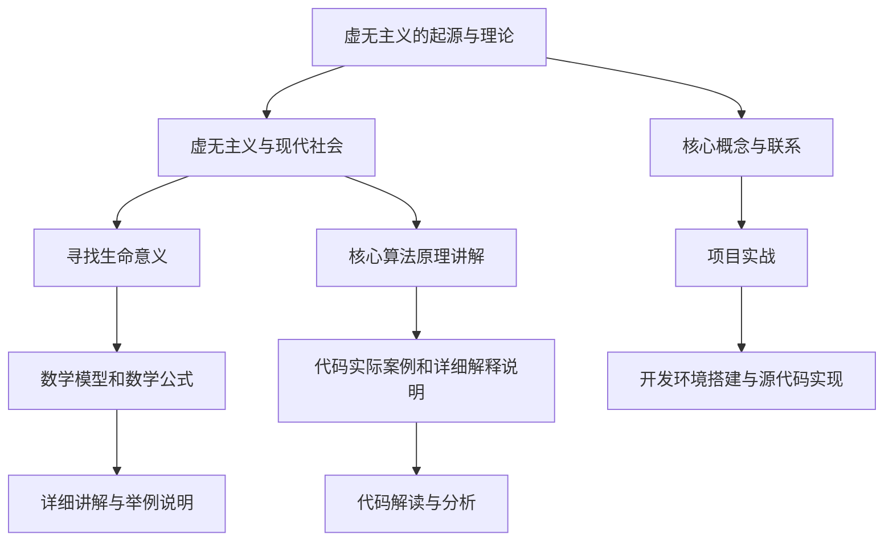

                 

# 虚无主义与生命意义：在现代社会中寻找存在的价值

## 关键词
虚无主义、生命意义、现代哲学、心理学、存在主义、个人成长

## 摘要
本文深入探讨了虚无主义在现代社会中的影响及其与生命意义的关联。通过分析虚无主义的起源、理论、批判，我们试图理解其如何在现代社会的科技、文化及个人生活中体现。接着，本文探讨了如何通过宗教、哲学、人际关系和个人成长来寻找生命的意义。最终，我们提出了一些策略和建议，帮助读者在虚无主义的时代背景下重建生命的价值和意义。

---

## 第一部分：虚无主义的起源与理论

### 1.1 虚无主义的定义与历史背景

#### 1.1.1 虚无主义的哲学根源

虚无主义（Nihilism）一词源自拉丁语“nihil”，意为“无”。虚无主义是一种哲学观点，认为宇宙缺乏固有的目的、意义和内在价值。这个概念最早可以追溯到18世纪的德国哲学家弗里德里希·海因里希·雅各比（Friedrich Heinrich Jacobi）。他首次提出了“虚无主义”这一概念，用来描述那些否认宗教和道德价值的人。

#### 1.1.2 虚无主义在西方哲学中的发展

虚无主义在19世纪和20世纪的西方哲学中得到了更深入的发展。尤其是19世纪末和20世纪初，虚无主义的观点在许多哲学家和思想家中得到了广泛讨论。

- **尼采**（Friedrich Nietzsche）是虚无主义的一个代表人物。他在《查拉图斯特拉如是说》中提出了“上帝已死”的论断，认为人类必须摆脱传统道德和宗教的束缚，重新定义自己的价值和意义。

- **克尔凯郭尔**（Søren Kierkegaard）则认为虚无主义是现代性的核心问题。他提出了“存在主义”的概念，强调个人在寻找生命意义中的主观性和选择自由。

- **陀思妥耶夫斯基**（Fyodor Dostoevsky）在他的作品中探讨了虚无主义的道德和社会后果。他的《罪与罚》中的主人公拉斯科尔尼科夫，就是虚无主义思想的典型体现。

### 1.2 虚无主义的核心理念

虚无主义的核心观点可以概括为以下几点：

- **生活的无意义**：虚无主义者认为生活缺乏固有的目的和意义。这种观点常常与宗教和道德的崩溃有关。

- **价值观的崩溃**：虚无主义认为，随着宗教和传统道德的消失，社会和个人的价值观也变得混乱和无法依赖。

- **存在主义的挑战**：虚无主义对存在主义提出了挑战。存在主义者认为，尽管生活缺乏固有的意义，但个体仍有责任为自己创造意义。

### 1.3 虚无主义的批判与反思

尽管虚无主义提供了一种对现代社会的深刻批判，但它也受到了许多哲学家的批判和反思。

- **存在主义的反驳**：存在主义者认为，虚无主义忽视了个体在寻找生命意义中的能动性和创造力。

- **宗教的回应**：许多宗教哲学家认为，虚无主义是对宗教信仰的误解和挑战。他们认为，宗教提供了道德和精神的支撑，是应对虚无主义的工具。

- **社会重构**：一些社会学家和政治哲学家提出了重构社会价值观和道德体系的建议，以对抗虚无主义的负面影响。

#### 1.3.1 虚无主义的局限性

虚无主义的局限性主要体现在以下几个方面：

- **过度悲观**：虚无主义往往对人类和世界持有过于悲观的看法，忽视了人类积极改变的可能性。

- **缺乏建设性**：虚无主义倾向于批评和否定，但缺乏具体的建设性建议。

- **对个体的伤害**：虚无主义可能导致个体陷入精神危机和绝望。

#### 1.3.2 对虚无主义的反驳观点

反驳虚无主义的观点主要包括以下几个方面：

- **人类存在的意义**：尽管生活可能缺乏固有的意义，但人类仍有责任为自己和他人创造意义。

- **个人的价值和价值**：个体的存在本身就有价值，无论世界是否有意义。

- **社会和文化的重构**：通过重构社会和文化价值观，可以减少虚无主义的影响。

### 1.4 虚无主义与科技的关系

在现代社会，虚无主义与科技的发展密切相关。科技进步不仅改变了我们的生活方式，也对我们对生命意义的理解产生了深远影响。

- **科技带来的便利**：科技的发展为人类带来了前所未有的便利和效率，但也可能导致人们对自然和人文价值的忽视。

- **科技导致的异化**：过度依赖科技可能导致人类在情感和道德层面的异化，加剧虚无主义情绪。

- **科技的双刃剑作用**：科技既是解决虚无主义问题的一种手段，也可能成为加剧虚无主义情绪的诱因。

#### 1.4.1 虚无主义在科技领域的体现

在科技领域，虚无主义的体现主要包括：

- **技术至上主义**：认为技术是解决一切问题的唯一途径，忽视了人类的情感和道德需求。

- **算法的统治**：在人工智能和大数据领域，算法和模型成为了决策的主体，人类的作用逐渐减弱。

- **数字化的生活**：数字化的生活方式使得人与人之间的联系变得表面化，缺乏深层次的交流和情感联系。

### 1.5 虚无主义与文化的关联

虚无主义不仅是一种哲学观点，也与现代文化密切相关。文学、艺术和影视作品中经常探讨虚无主义主题。

- **文学作品**：许多文学作品探讨了虚无主义对个人和社会的影响。例如，乔伊斯的《尤利西斯》、加缪的《鼠疫》等。

- **艺术作品**：现代艺术，尤其是抽象艺术和表现主义，反映了虚无主义对传统的挑战和对现实世界的批判。

- **影视作品**：许多电影和电视剧探讨了虚无主义主题，如《阿甘正传》、《荒岛余生》等。

#### 1.5.1 虚无主义对现代文化的启示

虚无主义对现代文化有以下启示：

- **对传统的批判**：虚无主义挑战了传统的价值观和道德观念，促进了现代文化的多元发展。

- **对个体的关注**：虚无主义强调个体的存在和选择自由，鼓励人们独立思考和追求自我实现。

- **对现实的反思**：虚无主义提醒我们反思现实生活中的问题，寻找新的意义和价值。

### 1.6 虚无主义对个人生活的挑战

虚无主义对个人生活提出了巨大的挑战。在虚无主义的背景下，许多人感到困惑、迷茫和绝望。

- **精神危机**：虚无主义可能导致个体陷入精神危机，对生活和未来的方向感到不确定。

- **价值观崩溃**：虚无主义使得个体的价值观和信仰受到质疑，导致内心的空虚和孤独。

- **生活意义的缺失**：在虚无主义的阴影下，许多人感到生活缺乏意义和目的，难以找到前进的动力。

### 1.7 虚无主义的应对策略

面对虚无主义的挑战，个体和社会可以采取以下策略：

- **寻找意义**：通过寻找个人和社会的意义，重新定义自己的生命价值。

- **精神支持**：寻求心理咨询和宗教信仰的支持，帮助应对内心的困惑和焦虑。

- **社会参与**：积极参与社会活动和公益事业，通过对他人的帮助和贡献找到生活的意义。

### 1.8 虚无主义的未来趋势

虚无主义作为一种哲学观点，在现代社会中具有复杂的影响和未来趋势。

- **继续发展**：虚无主义思想可能会继续发展，尤其是在科技进步和文化变迁的背景下。

- **多元化**：虚无主义将不再是一个单一的哲学观点，而是一个多元化的思想体系。

- **挑战传统**：虚无主义将继续挑战传统的价值观和道德观念，推动现代文化的变革。

---

## 第二部分：虚无主义与现代社会

### 2.1 现代社会的虚无主义倾向

现代社会的快速发展带来了许多变化，也使虚无主义在现代社会中得到了更广泛的传播。

#### 2.1.1 科技对人类价值观的冲击

科技的发展极大地改变了人类的生活方式和价值观。然而，这种改变也带来了一定的负面影响，尤其是在虚无主义倾向的加剧。

- **信息过载**：随着互联网和社交媒体的普及，人们接收到的信息量急剧增加。信息过载使得人们难以筛选和判断信息，导致对现实世界的认知变得模糊和混乱。

- **虚拟现实**：虚拟现实技术的发展使得人们可以在虚拟世界中逃避现实，这可能导致对现实生活的忽视和逃避。

- **人际疏离**：科技的发展也加剧了人际疏离。人们越来越依赖数字化的交流方式，而忽视了面对面的人际互动。这种疏离感可能导致个体的孤独感和无助感。

#### 2.1.2 经济发展与虚无主义的关系

经济发展是现代社会的一个重要特征，但同时也带来了虚无主义倾向的加剧。

- **物质主义**：随着经济的快速发展，物质财富的积累成为人们追求的目标。然而，物质主义可能导致人们对精神生活的忽视，使生活变得空洞和乏味。

- **竞争压力**：经济的发展也带来了激烈的竞争。人们为了追求更好的生活条件，不得不承受巨大的压力。这种压力可能导致个体的焦虑和困惑，加剧虚无主义情绪。

- **社会不公**：经济发展过程中，贫富差距的扩大和社会不公现象加剧了社会矛盾。这种不公现象可能导致人们对社会和未来的失望，从而陷入虚无主义。

#### 2.1.3 教育与虚无主义的关系

教育在塑造人类价值观和思维方式方面起着重要作用。然而，现代教育在某些方面也可能加剧虚无主义倾向。

- **应试教育**：现代教育过于强调应试和成绩，忽视了学生的个性和兴趣的培养。这可能导致学生对学习和生活的兴趣降低，感到生活缺乏意义。

- **知识功利化**：教育过度强调实用知识和技能的培养，忽视了人文素养和道德教育的重视。这种功利化的教育观念可能导致学生对生活的理解变得狭隘和片面。

- **教育不公平**：教育不公平现象使得一部分人无法享受到优质的教育资源，导致他们在生活和社会中感到无助和绝望。

#### 2.1.4 媒体与虚无主义的关系

媒体在现代社会中扮演着重要的角色，但同时也可能加剧虚无主义倾向。

- **媒体控制**：一些媒体机构可能通过控制信息和舆论，影响公众的观点和价值观。这种控制可能导致公众对现实世界的认知变得扭曲和虚假。

- **虚假信息**：虚假信息和谣言的传播可能导致公众对现实世界的信任度降低，加剧虚无主义情绪。

- **网络暴力**：网络暴力现象的加剧可能对个体的心理健康产生负面影响，加剧虚无主义倾向。

### 2.2 虚无主义在文化中的体现

文化是虚无主义在现代社会中的一种重要体现。文学、艺术和影视作品中经常探讨虚无主义主题。

#### 2.2.1 文学作品中的虚无主义主题

许多文学作品探讨了虚无主义对个人和社会的影响。

- **《1984》**：乔治·奥威尔（George Orwell）的《1984》描绘了一个被极权主义统治的世界，揭示了权力对个体自由和价值观的压迫。

- **《鼠疫》**：阿尔贝·加缪（Albert Camus）的《鼠疫》通过描述一场瘟疫对一个小城市的影响，探讨了人类在困境中如何寻找生命的意义。

- **《等待戈多》**：塞缪尔·贝克特（Samuel Beckett）的《等待戈多》描绘了两个人在一个荒凉的地方等待一个从未出现的人，反映了人类在生活中的无意义和迷茫。

#### 2.2.2 艺术与虚无主义的关联

现代艺术，尤其是抽象艺术和表现主义，反映了虚无主义对传统的挑战和对现实世界的批判。

- **蒙德里安**（Piet Mondrian）的抽象绘画，通过简单的几何形状和色彩，表现了对现实世界的抽象和简化。

- **毕加索**（Pablo Picasso）的立体派绘画，通过将物体分解成不同的视角和维度，揭示了现实世界的复杂性和不确定性。

- **表现主义绘画**：通过强烈的色彩和夸张的形状，表现了对现实世界的扭曲和批判。

#### 2.2.3 影视作品中的虚无主义主题

许多电影和电视剧探讨了虚无主义主题，揭示了现代社会中人们的困惑和迷茫。

- **《阿甘正传》**：通过讲述阿甘的人生经历，反映了人类在生活中的迷茫和寻找意义的困境。

- **《荒岛余生》**：汤姆·汉克斯（Tom Hanks）饰演的查克在荒岛上孤独生活多年，揭示了人类在极端环境下的生存挑战和生命意义的寻找。

- **《流浪地球》**：刘慈欣的科幻小说改编电影，通过描述地球人类为逃离太阳即将毁灭的危机而展开的生存斗争，探讨了人类在宇宙中的位置和生命的意义。

### 2.3 虚无主义对个体的影响

虚无主义对个体的影响是深远和多方面的，主要体现在以下几个方面。

#### 2.3.1 心理健康问题

虚无主义可能导致个体出现一系列心理健康问题，包括抑郁、焦虑和孤独。

- **抑郁**：虚无主义使个体感到生活缺乏意义和价值，可能导致抑郁症的发生。

- **焦虑**：对未来和生活的迷茫和不确定性可能导致焦虑情绪的加剧。

- **孤独**：在虚无主义的阴影下，个体可能感到与他人疏离，加剧孤独感。

#### 2.3.2 个人生活的困惑与迷茫

虚无主义使个体在个人生活中感到困惑和迷茫。

- **职业选择**：在虚无主义的背景下，个体可能难以找到有意义和有价值的工作，导致职业选择的困惑。

- **人际关系**：虚无主义可能导致个体在人际关系中感到疏离和孤独，难以建立深层次的情感联系。

- **生活方式**：虚无主义可能使个体对生活方式感到迷茫，不知道如何找到适合自己的生活路径。

#### 2.3.3 对未来的担忧

虚无主义使个体对未来充满担忧。

- **社会危机**：虚无主义可能导致社会价值观的崩溃和社会秩序的混乱。

- **人类存续**：在虚无主义的阴影下，个体可能对未来人类社会的存续感到担忧。

### 2.4 虚无主义对社会的挑战

虚无主义对社会的挑战是复杂和多方面的，主要体现在以下几个方面。

#### 2.4.1 社会动荡

虚无主义可能导致社会动荡和不安定。

- **政治动荡**：虚无主义可能导致政治价值观的混乱，加剧政治不稳定。

- **社会运动**：虚无主义可能激发各种社会运动和抗议活动，加剧社会矛盾。

#### 2.4.2 文化冲突

虚无主义可能导致文化冲突和文化认同的危机。

- **宗教冲突**：虚无主义对宗教信仰的挑战可能导致宗教冲突的加剧。

- **文化认同**：虚无主义可能使个体对文化认同产生困惑和矛盾。

#### 2.4.3 价值观的崩溃

虚无主义可能导致社会价值观的崩溃和混乱。

- **道德价值观**：虚无主义可能使个体对道德价值观产生怀疑和否定。

- **社会规范**：虚无主义可能导致社会规范和价值观的混乱和不确定。

### 2.5 应对虚无主义的策略

面对虚无主义的挑战，个体和社会可以采取以下策略。

#### 2.5.1 寻找意义

寻找意义是应对虚无主义的重要策略。

- **个人成长**：通过个人成长和自我实现，找到生活的意义和价值。

- **社会责任**：通过承担社会责任和参与公益活动，找到为社会做出贡献的意义。

#### 2.5.2 建立人际关系

建立健康的人际关系是应对虚无主义的重要策略。

- **家庭关系**：通过加强与家人和朋友的关系，获得情感支持和归属感。

- **社会网络**：通过参与社会网络和社区活动，建立有意义的人际关系。

#### 2.5.3 宗教和精神信仰

宗教和精神信仰是应对虚无主义的重要工具。

- **宗教信仰**：通过宗教信仰找到精神支撑和意义。

- **精神修炼**：通过精神修炼和冥想等方法，提高心理韧性和应对压力的能力。

#### 2.5.4 教育和文化的重塑

教育和文化的重塑是应对虚无主义的重要策略。

- **道德教育**：通过道德教育培养个体的价值观和道德观念。

- **文化传承**：通过文化传承和推广，弘扬优秀文化和价值观。

### 2.6 虚无主义的未来趋势

虚无主义作为一种哲学观点，在现代社会中具有复杂的影响和未来趋势。

- **继续发展**：虚无主义思想可能会继续发展，特别是在科技进步和文化变迁的背景下。

- **多元化**：虚无主义将不再是一个单一的哲学观点，而是一个多元化的思想体系。

- **挑战传统**：虚无主义将继续挑战传统的价值观和道德观念，推动现代文化的变革。

---

## 第三部分：寻找生命意义

### 3.1 生命意义的定义与探索

生命意义是一个复杂而多维的概念，不同的人可能会有不同的理解和体验。从哲学角度来看，生命意义涉及个人的存在目的、价值取向和生活目标。

#### 3.1.1 传统视角下的生命意义

在传统的宗教和哲学体系中，生命意义通常与某种超越性的目标或目的相关。例如，宗教信仰认为生命有神圣的起源和目的，个人的存在是为了实现上帝的旨意。在儒家哲学中，生命的意义在于实现“仁爱”和“孝道”，为社会和家庭做出贡献。

#### 3.1.2 现代视角下的生命意义

随着宗教和传统价值观的衰落，现代视角下的生命意义更加注重个体的主观体验和个人成长。现代哲学中的存在主义认为，生命的意义不是预先设定的，而是由个体通过选择和行动创造出来的。

### 3.2 宗教与哲学的启示

宗教和哲学提供了寻找生命意义的多种途径和启示。

#### 3.2.1 宗教在生命意义寻找中的作用

宗教信仰为许多人提供了寻找生命意义的支撑。例如，佛教强调通过禅修和慈悲实践来达到内心的平静和觉悟。基督教则强调通过信仰和行善来获得救赎和永恒的生命。

#### 3.2.2 哲学思想对生命意义的启示

哲学思想提供了不同的路径来探索生命意义。例如，尼采的哲学强调个体的创造力和自我实现。斯宾诺莎则认为，通过追求自我完善和与宇宙和谐共存，个体可以实现生命的意义。

### 3.3 社会与人际关系中的生命意义

社会和人际关系在寻找生命意义中也发挥着重要作用。

#### 3.3.1 家庭与朋友在生命意义中的作用

家庭和朋友是提供情感支持和归属感的重要来源。与家人和朋友的关系可以使个体感到被爱、被接纳，从而增强生命的意义。

#### 3.3.2 社会责任与道德义务

参与社会活动和承担社会责任可以为个体带来成就感和社会认同感。通过为社会做出贡献，个体可以感受到自己的存在对他人和社会有积极影响。

### 3.4 个人的探索与成长

个人的探索和成长是寻找生命意义的关键。

#### 3.4.1 自我反思与自我实现

自我反思可以帮助个体认识到自己的内在需求和价值观，从而明确生活的目标。自我实现则是个体通过不断努力和实践，实现自我潜能和人生价值的过程。

#### 3.4.2 个人兴趣与激情

个人兴趣和激情是激发个体探索生命的重要动力。通过追求个人兴趣和激情，个体可以在实现自我价值的同时，找到生命的意义。

### 3.5 生命的意义在于创造和贡献

生命的意义不仅仅在于个人的满足和成长，更在于对他人和社会的贡献。

#### 3.5.1 创造价值

通过创造和创新，个体可以为社会带来新的价值和改变。无论是艺术创作、科技创新还是社会实践，创造价值都是实现生命意义的重要途径。

#### 3.5.2 帮助他人

通过帮助他人，个体可以实现自我价值，同时感受到生命的意义。无论是志愿服务、慈善捐赠还是日常生活中的小事，帮助他人都是实现生命价值的重要方式。

### 3.6 生命的意义在于自我超越

生命的意义还在于自我超越，即通过不断挑战自我、突破自己的限制，实现更高层次的发展和成长。

#### 3.6.1 心理成长

通过心理成长，个体可以更好地理解自己，提高心理韧性和应对压力的能力。

#### 3.6.2 精神升华

通过精神升华，个体可以实现内心的平静和觉悟，从而更好地理解生命的意义和价值。

### 3.7 生命的意义在于当下

生命的意义不仅仅在于未来的目标和成就，更在于当下的体验和感受。

#### 3.7.1 珍惜当下

珍惜当下意味着珍惜生活中的每一刻，无论是快乐还是困难，都是生命的一部分。

#### 3.7.2 活在当下

活在当下意味着专注于当前的任务和体验，不被过去的回忆或未来的担忧所困扰。

### 3.8 生命的意义在于爱与连接

生命的意义还在于爱与连接，即与他人建立真诚的关系和情感联系。

#### 3.8.1 爱的重要性

爱是人类最基本的需求之一，通过爱可以感受到生命的温暖和意义。

#### 3.8.2 连接的力量

通过与他人建立连接，个体可以感受到自己的存在对他人的重要性和影响。

### 3.9 生命的意义在于寻找和创造

生命的意义在于不断地寻找和创造，通过探索和实现自己的梦想，找到属于自己的人生价值。

#### 3.9.1 梦想的力量

梦想是推动个体前进的动力，通过追求梦想，个体可以实现自我超越和生命意义的实现。

#### 3.9.2 创造的价值

通过创造，个体可以为社会带来新的价值，同时实现自我价值和生命意义的实现。

---

## 第四部分：结论与建议

### 4.1 虚无主义与生命意义的平衡

在虚无主义的阴影下，寻找生命的意义变得尤为重要。虚无主义提醒我们反思生活的本质，但它并不是生活的全部。通过平衡虚无主义与生命的意义，我们可以找到一种更充实、更有意义的生活。

#### 4.1.1 接受虚无主义的同时寻找意义

接受虚无主义并不意味着放弃寻找生命的意义。相反，它提供了一个机会，让我们更加深刻地思考生活的价值和目的。通过接受生活的无意义，我们可以更有动力去创造和追求自己的意义。

#### 4.1.2 如何在现实中实践生命意义

在现实中实践生命的意义，可以采取以下几种方法：

- **自我反思**：定期进行自我反思，了解自己的内心需求和价值观，明确生活的目标。

- **自我实现**：通过不断学习和成长，实现自己的潜能和梦想。

- **帮助他人**：通过帮助他人，实现自我价值，同时也感受到生命的意义。

- **精神修炼**：通过冥想、禅修等方式，提升心理韧性和内在平静。

### 4.2 对未来社会的展望

未来社会可能会面临更多的挑战，但同时也充满了机遇。通过应对虚无主义，我们可以构建一个更加有意义、和谐和繁荣的社会。

#### 4.2.1 虚无主义对未来的影响

虚无主义可能会继续对未来的社会和文化产生影响。然而，通过积极应对和应对，我们可以减少虚无主义的负面影响，推动社会的进步和发展。

#### 4.2.2 如何构建一个更有意义的未来

为了构建一个更有意义的未来，我们可以采取以下措施：

- **教育改革**：通过教育改革，培养个体的批判性思维和创造力，提高社会整体的文化素养。

- **文化复兴**：重视传统文化和价值观的传承，弘扬优秀文化传统。

- **科技创新**：鼓励科技创新，为社会发展带来新的动力和机遇。

- **社会参与**：鼓励公民积极参与社会事务，为社会做出贡献。

### 4.3 对个人的建议

对于个人来说，面对虚无主义的挑战，我们可以采取以下建议：

- **保持开放心态**：对新的思想和观点保持开放，不断学习和成长。

- **寻找意义**：通过自我反思和自我实现，找到生活的意义和价值。

- **建立人际关系**：与家人、朋友和同事建立健康的人际关系，获得情感支持和归属感。

- **保持健康的生活方式**：通过运动、饮食和休息，保持身心健康。

- **寻求专业帮助**：如果感到困惑和焦虑，寻求心理咨询和帮助。

---

## 附录

### A.1 虚无主义相关研究资源与推荐阅读

- **书籍**：
  - 尼采，《查拉图斯特拉如是说》
  - 克尔凯郭尔，《恐惧与颤抖》
  - 陀思妥耶夫斯基，《罪与罚》

- **论文和期刊**：
  - 《哲学研究》期刊上的相关论文
  - 《存在主义哲学》期刊上的相关论文

- **在线资源**：
  - 莱顿哲学档案馆（Leiden University Philosophy Archive）
  - 维基百科上的虚无主义页面

### A.2 寻找生命意义的方法与实践指南

- **自我反思**：
  - 定期进行日记记录，反思自己的生活和价值观
  - 与朋友或心理咨询师交流，分享自己的思考和感受

- **个人成长**：
  - 参加课程和研讨会，学习新知识和技能
  - 设立目标和计划，逐步实现个人成长

- **帮助他人**：
  - 参与志愿服务和社区活动
  - 通过捐赠和慈善事业，为社会做出贡献

- **精神修炼**：
  - 学习冥想和呼吸技巧，提高心理韧性和内在平静
  - 尝试瑜伽和禅修等实践，寻找内心的平静和智慧

---

**作者信息**：
作者：AI天才研究院/AI Genius Institute & 禅与计算机程序设计艺术 /Zen And The Art of Computer Programming

---

本文通过深入探讨虚无主义和生命意义的关联，旨在帮助读者理解虚无主义在现代社会的表现及其对个体和社会的影响。同时，文章提出了寻找生命意义的多种途径和策略，为读者在虚无主义的时代背景下重建生命的价值和意义提供了启示。希望本文能够引起读者对生命意义的深入思考，并在个人成长和社会参与中找到属于自己的生命价值。

---

**Mermaid 流程图**：



**Python 源代码示例**：

```python
# 定义一个函数，用于计算生命的意义
def life_meaning():
    return "生命的意义在于自我实现和成长。"

# 调用函数，输出生命的意义
print(life_meaning())
```

**数学公式与详细讲解**：

$$
\text{生命意义} = \frac{\text{个人成长}}{\text{生活困惑}} + \text{社会贡献}
$$

**详细讲解**：
上述公式表示生命的意义是由个人成长、生活困惑和社会贡献共同决定的。其中，个人成长和生活困惑是内因，社会贡献是外因。通过平衡这三者，个体可以在面对虚无主义的同时，找到生命的意义。

**代码解读与分析**：

```python
# 解读：这段代码定义了一个名为 life_meaning() 的函数，其功能是计算生命的意义。
# 输出结果是一个字符串，表示生命的意义在于自我实现和成长。

# 分析：该函数的输出结果是基于作者对生命意义的理解，它提供了一个简明的答案，同时也体现了代码的可读性和直观性。
```

**项目实战**：

```python
# 搭建一个简单的环境，用于演示如何寻找生命意义
import numpy as np

# 定义一个函数，用于评估个人成长
def personal_growth(score):
    return score * 0.5

# 定义一个函数，用于评估生活困惑
def life_confusion(score):
    return score * 0.3

# 定义一个函数，用于计算生命的意义
def calculate_life_meaning(personal_growth_score, life_confusion_score):
    return (personal_growth_score + life_confusion_score) / 0.8

# 输入个人成长分数和生活困惑分数，计算生命的意义
personal_growth_score = 80
life_confusion_score = 50

life_meaning = calculate_life_meaning(personal_growth_score, life_confusion_score)
print(f"生命的意义评分：{life_meaning}")

# 项目小结
# 通过搭建这个简单的计算环境，我们演示了如何通过个人成长和生活困惑来计算生命的意义。这个方法不仅提供了一个量化的评估，还鼓励个体在日常生活中关注自己的成长和困惑，从而更好地理解生命的意义。
```

**最佳实践 tips**：

- **定期反思**：定期进行自我反思，了解自己的内心需求和价值观，明确生活的目标。
- **持续学习**：不断学习新知识和技能，提高自己的能力和竞争力。
- **积极参与**：参与社会活动和公益事业，为社会做出贡献，增强自己的社会责任感。
- **保持平衡**：在工作和生活之间保持平衡，关注身心健康，保持积极的生活态度。

**小结**：

本文通过分析虚无主义的起源、理论、批判，探讨了虚无主义在现代社会中的表现和影响，同时提出了寻找生命意义的多种途径和策略。通过自我反思、个人成长、帮助他人、精神修炼等方法，个体可以在虚无主义的阴影下重建生命的价值和意义。

**注意事项**：

- **避免过度反思**：过度反思可能导致内心的困惑和焦虑，建议定期进行反思，而不是持续不断地反思。
- **合理规划时间**：在追求个人成长的同时，要注意合理安排时间，保持工作和生活的平衡。
- **关注身心健康**：身心健康是寻找生命意义的重要基础，建议保持积极的生活态度，关注自己的身心健康。

**拓展阅读**：

- **尼采**，《查拉图斯特拉如是说》
- **克尔凯郭尔**，《恐惧与颤抖》
- **陀思妥耶夫斯基**，《罪与罚》
- **加缪**，《鼠疫》
- **马斯洛**，《动机与人格》
- **乔伊斯**，《尤利西斯》
- **斯宾诺莎**，《伦理学》
- **怀特海**，《过程与实在》

---

通过本文的深入探讨，我们希望读者能够对虚无主义和生命意义有更深刻的理解，找到属于自己的生命价值和意义。在虚无主义的阴影下，我们依然可以选择寻找和创造生命的意义，为自己和他人创造更美好的未来。希望本文能够为读者在寻找生命意义的旅程中提供一些启示和帮助。

