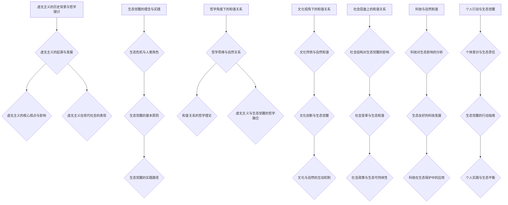

                 

# 虚无主义与生态觉醒：重建人与自然的和谐关系

> 关键词：虚无主义、生态觉醒、和谐关系、哲学、文化、科技、个人行动、策略

> 摘要：本文从虚无主义的历史背景和生态觉醒的理念出发，探讨了重建人与自然和谐关系的重要性。通过哲学、文化、社会和技术等多个视角，分析了和谐关系的构建路径，并提出了一系列实现策略和路径，旨在引导读者理解和实践生态觉醒的理念，共同迈向可持续发展的未来。

## 目录大纲

## 第一部分：虚无主义与生态觉醒概述

### 第1章：虚无主义的历史背景与哲学探讨

#### 1.1 虚无主义的起源与发展

#### 1.2 虚无主义的核心观点与影响

#### 1.3 虚无主义在现代社会的表现

### 第2章：生态觉醒的理念与实践

#### 2.1 生态危机与人类角色

#### 2.2 生态觉醒的基本原则

#### 2.3 生态觉醒的实践路径

## 第二部分：重建人与自然的和谐关系

### 第3章：哲学角度下的和谐关系

#### 3.1 哲学思维与自然关系

#### 3.2 和谐关系的哲学理论

#### 3.3 虚无主义与生态觉醒的哲学融合

### 第4章：文化视角下的和谐关系

#### 4.1 文化传统与自然和谐

#### 4.2 文化创新与生态觉醒

#### 4.3 文化与自然的互动机制

### 第5章：社会层面上的和谐关系

#### 5.1 社会结构对生态觉醒的影响

#### 5.2 社会变革与生态和谐

#### 5.3 社会政策与生态可持续性

### 第6章：科技与自然和谐

#### 6.1 科技对生态影响的分析

#### 6.2 生态友好的科技发展

#### 6.3 科技在生态保护中的应用

### 第7章：个人行动与生态觉醒

#### 7.1 个体意识与生态责任

#### 7.2 生态觉醒的行动指南

#### 7.3 个人实践与生态平衡

## 第三部分：实现和谐关系的策略与路径

### 第8章：政策与法规支持

#### 8.1 生态保护的法律法规

#### 8.2 政策引导与激励

#### 8.3 社会参与与监督

### 第9章：教育体系的变革

#### 9.1 生态教育的重要性

#### 9.2 教育内容与方法的创新

#### 9.3 生态教育体系的构建

### 第10章：国际合作与共享

#### 10.1 国际生态合作的意义

#### 10.2 国际合作的实践案例

#### 10.3 生态保护的国际合作模式

### 第11章：总结与展望

#### 11.1 虚无主义与生态觉醒的融合

#### 11.2 和谐关系实现的挑战与机遇

#### 11.3 未来生态觉醒的路径与方向

## 附录

### 附录 A：参考文献

### 附录 B：Mermaid 流程图

---

在接下来的部分中，我们将一步步深入探讨虚无主义的历史背景、核心观点及其在现代社会中的表现，然后转向生态觉醒的理念与实践。通过哲学、文化、社会和技术等多个视角，我们将分析如何重建人与自然的和谐关系，并提出实现这一目标的策略与路径。最后，我们将总结全文，展望未来生态觉醒的路径与方向。## 第一部分：虚无主义与生态觉醒概述

### 第1章：虚无主义的历史背景与哲学探讨

#### 1.1 虚无主义的起源与发展

虚无主义（Nihilism）一词源于拉丁语“nihil”，意为“无”或“无意义”。虚无主义作为一种哲学思想，最早可以追溯到古希腊哲学家皮浪（Pyrrho）提出的怀疑主义。皮浪认为，人类对世界的认识是有限的，知识无法达到绝对确定性，因此现实世界缺乏客观的真理。

19世纪，虚无主义在俄国哲学家中得到了进一步发展。尼古拉·别林斯基（Nikolai Berdyaev）和费奥多尔·陀思妥耶夫斯基（Fyodor Dostoevsky）等人认为，信仰和精神价值是人类存在的基石，而虚无主义是对这些基石的颠覆。

虚无主义的核心观点是，现实世界缺乏固有的意义和目的，人类行为和价值观的终极基础不存在。这一观点对传统宗教、道德和社会秩序产生了深刻的质疑。

#### 1.2 虚无主义的核心观点与影响

虚无主义的核心观点包括以下几点：

1. **意义缺失**：虚无主义者认为，人类生活缺乏内在的意义，无论是宗教信仰、社会规范还是个人追求，都无法赋予生活真正的意义。

2. **道德相对主义**：虚无主义倾向于道德相对主义，认为道德标准不是固有的，而是由人类主观决定的。因此，虚无主义者常常质疑传统道德的权威性。

3. **存在主义**：虚无主义的一个分支是存在主义，代表人物如让-保尔·萨特（Jean-Paul Sartre）认为，人类自由是唯一确定的事实，意义是通过个人的选择和行动创造的。

虚无主义对现代哲学和文学产生了深远影响。一方面，它挑战了传统的价值观和信仰体系，促进了思想解放和自由探索。另一方面，它也带来了深刻的焦虑和困扰，因为虚无主义强调人类生活的无意义和无目的，可能导致个体的心理压力和逃避行为。

#### 1.3 虚无主义在现代社会的表现

在现代社会的不同领域，虚无主义有各种各样的表现：

1. **文学与艺术**：现代文学和艺术中充斥着对人类困境和意义的探讨，许多作品表现了对现实世界的失望和对人类存在的质疑。

2. **政治与哲学**：虚无主义在政治哲学中表现为对权威的挑战和对传统政治秩序的质疑。例如，纳粹德国的政治宣传和极权主义思想可以看作是对虚无主义的一种回应。

3. **个人生活**：在个人生活中，虚无主义可能导致对生活意义的怀疑和逃避，例如通过吸毒、游戏或其他逃避现实的方式。

#### 1.4 虚无主义与生态觉醒的关系

尽管虚无主义在现代哲学中常常被视为负面的、消极的思想，但它与生态觉醒（Ecological Awakening）之间存在一定的联系。

生态觉醒强调人类与自然的和谐关系，主张人类应该尊重自然、保护环境。虚无主义中的某些观点，如对传统价值观的质疑和对人类行为的反思，可以促进人们更深刻地理解生态问题，从而推动生态觉醒的进程。

例如，虚无主义者可能会质疑人类对资源的过度消耗和对环境的破坏是否真的有意义。这种质疑可以激发人们对现实世界的反思，从而促使他们采取行动，追求更加可持续的生活方式。

总的来说，虚无主义和生态觉醒并不是完全对立的，它们在哲学思考上可以相互补充，共同推动人类对自身和自然的认识。

### 总结

虚无主义作为一种哲学思想，具有复杂的历史背景和核心观点。它对现代哲学和文学产生了深远影响，并在不同领域有不同的表现。虽然虚无主义常常被视为消极的，但它与生态觉醒之间存在一定的联系，可以为生态觉醒提供一定的哲学基础。在接下来的章节中，我们将进一步探讨生态觉醒的理念与实践，分析如何在现代社会中重建人与自然的和谐关系。

---

在第一章中，我们回顾了虚无主义的历史背景和哲学探讨，分析了其核心观点和影响，并探讨了虚无主义在现代社会中的表现。我们特别强调了虚无主义与生态觉醒之间的潜在联系，这将为后续章节中关于和谐关系的探讨奠定基础。在下一章中，我们将深入探讨生态觉醒的理念与实践，探讨生态危机的根源以及生态觉醒的基本原则。## 第2章：生态觉醒的理念与实践

#### 2.1 生态危机与人类角色

生态危机（Ecological Crisis）是指由于人类活动导致的自然环境恶化、生物多样性减少和生态系统功能退化等现象。随着工业化和城市化的发展，人类对自然资源的过度开发和环境污染问题日益严重，导致了一系列严重的生态问题，如气候变化、水资源短缺、森林退化、海洋污染等。

生态危机的根本原因在于人类对自然资源的过度消耗和对环境的破坏。人类活动导致的大气中温室气体浓度增加，是导致全球气候变化的主要原因。同时，森林砍伐、土壤侵蚀和水资源污染等问题，也对地球的生态系统产生了深远的影响。

在这个背景下，人类作为地球生态系统的一部分，扮演着至关重要的角色。人类是生态危机的制造者，也是解决生态危机的关键。通过改变生产和消费模式，采取可持续的生活方式和政策，人类可以减缓生态危机，保护地球的生态系统。

#### 2.2 生态觉醒的基本原则

生态觉醒（Ecological Awakening）是一种理念和运动，旨在唤醒人们对生态危机的认识，推动人类与自然和谐共生。生态觉醒的基本原则包括：

1. **可持续性**：生态觉醒强调人类活动应该尊重自然规律，实现资源的可持续利用。可持续性不仅关注当前的需求，还要考虑未来世代的利益。

2. **和谐共生**：生态觉醒认为人类应该与自然和谐共生，而不是对自然进行征服和掠夺。和谐共生意味着尊重自然的生态平衡，保护生物多样性，维护生态系统的健康。

3. **公平性**：生态觉醒强调资源分配的公平性，主张消除贫富差距，确保所有人都能享受到生态保护的好处。公平性不仅包括代际之间的公平，还包括不同国家和地区之间的公平。

4. **教育**：生态觉醒认为教育是推动生态觉醒的关键。通过教育和宣传，提高公众对生态问题的认识，培养人们的生态意识和责任感。

#### 2.3 生态觉醒的实践路径

要实现生态觉醒，需要从多个层面采取行动：

1. **政策与法规**：政府应该制定和实施生态保护政策，加强环境监管，确保资源的可持续利用。例如，限制温室气体排放，提高能源效率，保护自然生态系统等。

2. **技术创新**：通过技术创新，开发环保技术和可再生能源，减少对自然资源的依赖。例如，发展太阳能、风能等清洁能源，减少化石燃料的使用。

3. **生活方式**：改变个人的生活方式，采取更加环保和可持续的生活方式。例如，减少碳足迹，使用环保产品，节约用水和能源等。

4. **教育**：加强生态教育，提高公众的生态意识。通过学校教育、社区活动、媒体宣传等方式，普及生态知识，培养人们的环保意识和责任感。

5. **国际合作**：生态问题具有全球性，需要全球范围内的合作。各国政府、企业、非政府组织和公民都应该参与到生态保护中来，共同应对生态危机。

#### 2.4 生态觉醒的实践案例

生态觉醒的理念和实践已经在全球范围内得到了广泛的关注和支持。以下是一些成功的实践案例：

1. **瑞典**：瑞典在生态保护方面取得了显著成绩。瑞典政府制定了严格的环保法规，大力发展可再生能源，如风能、太阳能和水能。同时，瑞典还通过教育和宣传，提高公众的生态意识。

2. **哥斯达黎加**：哥斯达黎加通过实施生态旅游政策和生态补偿机制，实现了经济的可持续发展。哥斯达黎加政府还建立了多个自然保护区，保护了丰富的生物多样性。

3. **中国**：中国在过去几十年里实现了快速的经济增长，但也面临着严重的生态问题。为了解决这些问题，中国政府采取了一系列措施，如加强环保立法、发展可再生能源、推动节能减排等。

4. **美国**：美国在生态保护方面也做出了积极的努力。美国政府通过实施《清洁空气法》、《清洁水法》等环保法律，保护了大量的自然生态系统。同时，美国还推动了多项可再生能源项目，减少对化石燃料的依赖。

#### 2.5 生态觉醒的挑战与机遇

尽管生态觉醒的理念和实践已经取得了一定的成果，但在实现全球生态和谐的过程中，仍然面临着许多挑战：

1. **经济利益**：一些企业和政府可能更关注短期的经济利益，而忽视了长期的生态效益。这种短视行为可能阻碍生态觉醒的进程。

2. **政策执行**：即使制定了环保政策，如果没有有效的执行和监督，政策也难以发挥作用。

3. **公众意识**：公众的生态意识仍然有待提高，许多人可能对生态问题缺乏足够的认识和关注。

然而，生态觉醒也带来了许多机遇：

1. **技术创新**：随着科技的进步，新的环保技术和可再生能源不断涌现，为生态觉醒提供了强大的技术支持。

2. **国际合作**：全球性的生态问题需要全球范围内的合作。通过国际合作，可以更好地应对生态危机，实现全球生态和谐。

3. **社会变革**：生态觉醒可以推动社会变革，促进人类与自然和谐共生的新文明形态。

### 总结

生态觉醒是一种重要的理念和运动，旨在唤起人们对生态危机的认识，推动人类与自然的和谐共生。通过政策、技术创新、生活方式的改变和教育，我们可以实现生态觉醒，应对全球生态危机。在下一章中，我们将从哲学的角度探讨和谐关系，分析哲学思维与自然关系，探讨和谐关系的哲学理论，以及虚无主义与生态觉醒的哲学融合。## 第二部分：重建人与自然的和谐关系

### 第3章：哲学角度下的和谐关系

#### 3.1 哲学思维与自然关系

哲学作为一门探讨人类思维和存在的学科，对自然关系的理解具有深远的影响。哲学思维与自然关系主要涉及以下几个方面：

1. **本体论**：本体论研究存在的本质和基础。传统哲学认为，存在是由实体构成的，而现代哲学则开始关注自然整体性和生态系统。例如，生态哲学强调自然界的内在价值和复杂性，认为生态系统的平衡与稳定是人类生存和发展的基础。

2. **认识论**：认识论探讨知识的本质和来源。在哲学思维中，认识自然不仅仅是获取信息，更重要的是理解自然界的规律和人类与自然的互动关系。生态哲学强调实践理性，认为人类应该通过实践活动来认识自然，实现人与自然的和谐共生。

3. **伦理学**：伦理学研究道德和价值观。在哲学角度下，自然关系不仅仅是技术问题，更是伦理问题。生态伦理学认为，人类有责任保护自然，维护生态平衡，确保未来世代的生存权利。

#### 3.2 和谐关系的哲学理论

和谐关系（Harmony）在哲学中具有多重含义，既包括人与人之间的和谐，也包括人与自然的和谐。以下是一些重要的哲学理论：

1. **儒家哲学**：儒家哲学强调“天人合一”的理念，认为人类与自然是统一的整体。儒家伦理强调仁爱、孝道和社会责任，主张通过道德修养和礼仪实践，实现人与自然的和谐。

2. **道家哲学**：道家哲学主张“无为而治”，强调顺应自然、尊重自然规律。道家认为，只有与自然和谐相处，人类才能获得真正的自由和幸福。

3. **生态哲学**：生态哲学是20世纪中期兴起的一种哲学思潮，主张将生态学原理应用于哲学思考。生态哲学家认为，生态系统具有整体性和动态性，人类应该尊重生态系统的规律，实现人与自然的和谐。

#### 3.3 虚无主义与生态觉醒的哲学融合

虚无主义和生态觉醒在哲学层面上存在一定的融合。虚无主义对传统价值观的质疑和对人类行为的反思，可以促进生态觉醒的进程。

1. **质疑传统价值观**：虚无主义质疑人类社会的道德、宗教和政治价值观，认为这些价值观缺乏客观基础。这种质疑可以促使人们重新审视人类与自然的关系，认识到传统价值观中可能存在的生态失衡。

2. **反思人类行为**：虚无主义强调人类行为的无意义和无目的，这可以激发人们对现实世界的反思。通过反思，人们可以认识到人类活动对自然的破坏，从而产生改变现状的动力。

3. **生态觉醒的哲学基础**：生态觉醒需要一种新的哲学思维，来指导人类与自然的互动。虚无主义提供了一种反思传统价值观的视角，可以帮助人们认识到生态问题的严重性，从而推动生态觉醒的进程。

#### 3.4 哲学思维在生态和谐中的指导作用

哲学思维在生态和谐的构建中具有重要作用：

1. **引导道德判断**：哲学思维可以帮助人们形成正确的道德判断，认识到保护自然的重要性。通过生态伦理学的探讨，人们可以明确自己的生态责任，从而采取行动保护自然环境。

2. **促进跨学科合作**：哲学思维可以促进不同学科之间的合作，共同探讨生态问题。例如，生态学、经济学、社会学和政治学等学科，可以共同研究生态问题，提出解决方案。

3. **指导政策制定**：哲学思维可以为政策制定提供理论基础，帮助政府制定科学的生态保护政策。通过哲学思考，政策制定者可以更好地理解生态问题的本质，从而制定出更加有效的政策。

#### 3.5 哲学思维在个体行动中的意义

哲学思维不仅在宏观层面具有重要意义，在个体行动中同样具有指导作用：

1. **提高生态意识**：哲学思维可以帮助个体认识到生态问题的严重性，提高生态意识。通过深入思考，个体可以更好地理解自己的行为对自然的影响，从而采取更加环保的生活方式。

2. **培养责任感**：哲学思维可以培养个体的责任感，使个体认识到自己在生态保护中的角色和责任。通过反思，个体可以更加自觉地参与到生态保护行动中。

3. **实现个人成长**：哲学思维可以帮助个体在生态和谐的过程中实现个人成长。通过不断思考和反思，个体可以提升自己的道德素养，实现身心和谐。

### 总结

哲学角度下的和谐关系涉及本体论、认识论和伦理学等多个方面。哲学思维为人类与自然关系的探讨提供了深刻的洞见，有助于理解和谐关系的本质。虚无主义与生态觉醒在哲学层面上存在一定的融合，可以为生态和谐提供新的视角。通过哲学思维的引导，我们可以更好地认识生态问题，采取行动保护自然环境，实现人与自然的和谐共生。在下一章中，我们将从文化视角探讨和谐关系，分析文化传统与自然和谐的关系，以及文化创新与生态觉醒的互动。## 第4章：文化视角下的和谐关系

#### 4.1 文化传统与自然和谐

文化传统是人类社会在长期发展过程中形成的价值观、习俗、信仰和行为规范。许多文化传统中都蕴含着对自然和谐的追求和强调。以下是一些具有代表性的文化传统与自然和谐的关系：

1. **儒家文化**：儒家文化强调“天人合一”的理念，认为人与自然是一个统一的整体。儒家强调尊重自然、顺应自然，主张通过道德修养和礼仪实践，实现人与自然的和谐共生。

2. **道家文化**：道家文化主张“无为而治”，强调顺应自然、尊重自然规律。道家认为，只有与自然和谐相处，人类才能获得真正的自由和幸福。

3. **印度教文化**：印度教文化中蕴含着深厚的生态智慧。印度教强调保护生物多样性，尊重生命，主张通过冥想和瑜伽等方式，达到人与自然的和谐。

4. **玛雅文化**：玛雅文明在美洲大陆上曾创造出辉煌的文明，其文化传统中强调对自然资源的合理利用和保护。玛雅人通过农业、建筑和天文观测等实践活动，与自然和谐共生。

5. **非洲传统文化**：非洲传统文化中蕴含着丰富的生态智慧，强调尊重自然、保护环境。非洲部落通过古老的习俗和仪式，维护生态平衡，保护自然资源。

#### 4.2 文化创新与生态觉醒

文化创新是推动社会进步和可持续发展的关键因素。在生态觉醒的背景下，文化创新具有重要的意义：

1. **生态文化**：生态文化是一种以生态价值为核心的文化形态，强调尊重自然、保护环境。通过生态文化的创新，可以培养公众的生态意识，推动生态觉醒的进程。

2. **可持续文化**：可持续文化强调资源的可持续利用和生态平衡，倡导一种与自然和谐共生的生活方式。通过可持续文化的创新，可以引导人们改变传统的消费观念和行为模式，实现可持续发展。

3. **绿色科技文化**：绿色科技文化是以环保和可持续发展为目标的文化形态。通过绿色科技的创新，可以开发出更加环保和节能的科技产品，减少对自然资源的消耗，实现人与自然的和谐。

#### 4.3 文化与自然的互动机制

文化与自然的互动机制包括以下几个方面：

1. **文化传承**：文化传承是文化与自然互动的重要途径。通过文化传承，人类可以将对自然和谐的理解和价值观代代相传，使文化传统与自然和谐相辅相成。

2. **文化创新**：文化创新是推动文化与自然互动的重要动力。通过文化创新，可以不断挖掘和发掘自然资源的价值，实现文化与自然的和谐发展。

3. **文化教育**：文化教育是培养公众生态意识和责任感的有效途径。通过文化教育，可以引导人们树立正确的生态观念，积极参与生态保护行动。

4. **政策引导**：政策引导是促进文化与自然互动的重要手段。政府可以通过制定和实施相关政策，引导公众关注生态问题，推动生态和谐的发展。

#### 4.4 文化视角下的和谐关系案例分析

以下是一个文化视角下的和谐关系案例分析：

1. **日本的和风文化**：日本的传统和风文化强调对自然的尊重和和谐共生。在日本，人们通过茶道、花道、书法等传统文化活动，感悟自然之美，实现人与自然的和谐。同时，日本政府也通过相关政策，保护自然环境，推动生态和谐的发展。

2. **德国的绿色科技文化**：德国在绿色科技文化方面取得了显著成就。德国政府通过制定和实施一系列环保政策，推动绿色科技的发展。德国的绿色科技产品不仅在国内市场受到欢迎，还出口到世界各地，为全球生态和谐做出了贡献。

3. **中国的生态文明**：中国传统文化强调天人合一，生态文明是中国政府近年来提出的重要理念。中国政府通过实施生态文明战略，推动绿色发展，保护生态环境，努力实现人与自然的和谐。

#### 4.5 文化视角下的和谐关系挑战与机遇

在文化视角下，和谐关系的构建面临着一系列挑战和机遇：

1. **挑战**：全球化带来了文化多样性的挑战，一些传统文化面临着被同化和消亡的风险。同时，经济发展带来的环境压力，也给和谐关系的构建带来了挑战。

2. **机遇**：全球化也为文化多样性的传播提供了机遇。通过文化交流和合作，不同文化可以相互借鉴，共同推动和谐关系的构建。此外，科技的进步也为和谐关系的构建提供了新的可能性，如通过大数据和人工智能等技术手段，实现更精准的生态保护和资源管理。

#### 4.6 文化视角下的和谐关系与生态觉醒

文化视角下的和谐关系与生态觉醒密切相关。文化传统可以为生态觉醒提供理论基础和实践经验，而生态觉醒则可以为文化传统注入新的活力。通过文化视角下的和谐关系，我们可以更深入地理解生态问题，采取更加有效的措施，实现人与自然的和谐共生。

### 总结

文化视角下的和谐关系涉及文化传统、文化创新和文化与自然的互动机制。文化传统为和谐关系提供了深厚的理论基础和实践经验，而文化创新则为和谐关系的构建注入了新的活力。通过文化视角下的和谐关系，我们可以更好地理解生态问题，采取更加有效的措施，实现人与自然的和谐共生。在下一章中，我们将从社会层面探讨和谐关系，分析社会结构对生态觉醒的影响，探讨社会变革与生态和谐的关系，以及社会政策与生态可持续性的作用。## 第5章：社会层面上的和谐关系

#### 5.1 社会结构对生态觉醒的影响

社会结构是人类社会的基本框架，包括经济、政治、文化和社会关系等多个方面。社会结构对生态觉醒具有重要影响：

1. **经济结构**：经济结构是生态觉醒的重要影响因素。传统的经济增长模式往往以资源消耗和环境破坏为代价，导致生态危机。而可持续的经济结构强调资源的有效利用和循环经济，有助于实现生态觉醒。

2. **政治结构**：政治结构对生态觉醒具有决定性作用。政府作为生态保护的主体，需要制定和实施有效的生态保护政策，引导社会实现生态和谐。政治结构的民主化和透明度，可以提高公众参与生态保护的积极性。

3. **文化结构**：文化结构对生态觉醒具有重要影响。传统文化往往包含对自然和谐的尊重和追求，而现代文化则需要不断适应和应对生态危机。通过文化结构的调整和创新，可以培养公众的生态意识和责任感。

4. **社会关系**：社会关系是生态觉醒的重要基础。生态觉醒需要全社会共同参与，建立和谐的社会关系。通过社区合作、公众参与和非政府组织的作用，可以推动生态觉醒的进程。

#### 5.2 社会变革与生态和谐

社会变革是生态和谐实现的关键。社会变革可以促进生态觉醒，推动社会实现人与自然的和谐共生：

1. **制度变革**：制度变革是生态和谐的基础。通过改革环境法规、加强生态监管、推动绿色金融等手段，可以建立更加有效的生态保护制度。

2. **技术变革**：技术变革是生态和谐的重要推动力。通过开发和应用新技术，如可再生能源、环保材料和智能农业等，可以减少对自然资源的消耗，实现生态和谐。

3. **文化变革**：文化变革是生态和谐的重要保障。通过文化宣传、教育普及和公众参与，可以培养公众的生态意识和责任感，推动社会实现生态和谐。

4. **社会参与**：社会参与是生态和谐的重要途径。通过公众参与、社区合作和非政府组织的作用，可以激发社会活力，推动生态和谐的发展。

#### 5.3 社会政策与生态可持续性

社会政策对生态可持续性具有重要影响。有效的社会政策可以推动生态保护，实现人与自然的和谐共生：

1. **环保政策**：环保政策是生态保护的核心。通过制定和实施环保法规、加强环境监管、推动绿色科技研发等手段，可以保护生态环境，实现生态可持续性。

2. **能源政策**：能源政策对生态可持续性具有决定性作用。通过推广可再生能源、提高能源利用效率、减少化石燃料消耗等手段，可以降低对自然资源的依赖，实现生态和谐。

3. **土地政策**：土地政策对生态可持续性具有重要影响。通过保护自然生态系统、推动土地合理利用、防止土地退化等手段，可以保护生态环境，实现生态可持续性。

4. **经济政策**：经济政策对生态可持续性具有关键作用。通过调整经济结构、推动绿色经济、实施绿色金融等手段，可以促进生态保护，实现生态和谐。

#### 5.4 社会层面上的和谐关系案例分析

以下是一个社会层面上的和谐关系案例分析：

1. **瑞典的生态政策**：瑞典在生态政策方面取得了显著成就。瑞典政府通过实施一系列环保政策，如提高能源效率、推广可再生能源、限制化学品使用等，保护了生态环境，实现了生态可持续性。

2. **德国的绿色经济**：德国通过推动绿色经济的发展，实现了生态和谐。德国政府通过制定和实施绿色经济政策，如支持可再生能源、推动循环经济、鼓励绿色科技研发等，推动了社会实现生态和谐。

3. **中国的生态文明建设**：中国政府通过实施生态文明战略，推动了生态和谐的发展。中国政府通过制定和实施一系列生态保护政策，如加强环境监管、推广绿色发展、保护生态环境等，实现了生态和谐。

#### 5.5 社会层面上的和谐关系挑战与机遇

社会层面上的和谐关系面临着一系列挑战和机遇：

1. **挑战**：经济发展与生态保护的矛盾、政策执行不力、公众参与不足等，都是社会层面和谐关系面临的挑战。

2. **机遇**：科技进步、国际合作、公众意识的提高等，都为社会层面和谐关系的实现提供了机遇。

#### 5.6 社会层面上的和谐关系与生态觉醒

社会层面上的和谐关系与生态觉醒密切相关。社会结构、社会变革和社会政策都对生态觉醒具有重要影响。通过社会层面上的和谐关系，可以推动社会实现生态觉醒，实现人与自然的和谐共生。

### 总结

社会层面上的和谐关系涉及社会结构、社会变革和社会政策等多个方面。社会结构对生态觉醒具有重要影响，社会变革可以推动生态和谐的发展，社会政策对生态可持续性具有关键作用。通过社会层面上的和谐关系，可以推动社会实现生态觉醒，实现人与自然的和谐共生。在下一章中，我们将从科技视角探讨和谐关系，分析科技对生态影响的分析，生态友好的科技发展，以及科技在生态保护中的应用。## 第6章：科技与自然和谐

#### 6.1 科技对生态影响的分析

科技的发展对人类生活产生了深远影响，同时也对生态系统产生了显著的影响。科技对生态的影响可以分为正面和负面两个方面：

**正面影响**：

1. **提高资源利用效率**：科技的发展使得资源利用效率得到了显著提高，例如，通过生物技术和农业技术，可以更高效地利用土地和水资源，减少对自然资源的消耗。

2. **环境保护**：科技在环境保护中的应用也取得了显著成果，例如，通过大气监测技术和污水处理技术，可以实时监测和治理环境污染，保护生态环境。

3. **生态监测与预警**：现代科技，如遥感技术和大数据分析，可以实时监测生态系统的变化，提供预警信息，帮助政府和企业及时采取措施，减少对生态系统的破坏。

**负面影响**：

1. **环境破坏**：科技的快速发展也带来了环境破坏，例如，工业生产过程中产生的废气、废水和固体废物，对空气、水和土壤造成了严重污染。

2. **生物多样性减少**：科技的发展，尤其是城市化进程，导致了大量自然栖息地的破坏，生物多样性面临严重威胁。

3. **资源过度消耗**：科技的快速发展使得人们对资源的消耗速度加快，尤其是化石燃料和稀有金属等不可再生资源的消耗，加剧了生态危机。

#### 6.2 生态友好的科技发展

为了实现人与自然的和谐共生，科技的发展需要向生态友好的方向转变。以下是一些生态友好的科技发展方向：

1. **可再生能源**：发展可再生能源，如太阳能、风能、水能和生物质能，可以减少对化石燃料的依赖，降低温室气体排放，保护生态环境。

2. **节能技术**：通过研发和应用节能技术，如高效照明、节能家电和节能建筑，可以减少能源消耗，降低对环境的影响。

3. **环保材料**：研发和应用环保材料，如生物降解材料、可回收材料和环保涂料，可以减少对自然资源的消耗，减少环境污染。

4. **生态农业**：通过发展生态农业，如有机农业、精准农业和可持续农业，可以提高农业产量，减少化肥和农药的使用，保护土壤和水资源。

5. **智能生态**：利用人工智能和物联网技术，实现对生态系统的智能监测和管理，提高生态保护的效率和精准度。

#### 6.3 科技在生态保护中的应用

科技在生态保护中的应用已经成为实现生态和谐的重要手段。以下是一些具体的科技应用案例：

1. **遥感技术**：遥感技术可以实时监测生态系统的变化，提供高精度的生态数据，帮助科学家和决策者了解生态系统的状况，制定科学的保护策略。

2. **大数据分析**：大数据分析技术可以处理大量的生态数据，揭示生态系统的规律和变化趋势，为生态保护提供科学依据。

3. **环境监测系统**：环境监测系统通过传感器和物联网技术，实时监测空气、水和土壤的质量，为环境治理提供数据支持。

4. **生态修复技术**：生态修复技术，如生物修复、物理修复和化学修复，可以修复受损的生态系统，恢复生态平衡。

5. **虚拟现实和增强现实**：虚拟现实和增强现实技术可以模拟生态系统的状态，提供沉浸式的生态教育体验，提高公众的生态意识。

#### 6.4 科技推动生态和谐的具体案例

以下是一些科技推动生态和谐的具体案例：

1. **亚马逊雨林保护**：亚马逊雨林是地球上最重要的生态系统之一，通过使用无人机和卫星遥感技术，科学家可以实时监测雨林的状况，及时发现非法砍伐和火灾等破坏行为，保护雨林的生态平衡。

2. **青藏高原生态监测**：青藏高原是全球重要的水源地，通过使用无人机和大数据分析技术，科学家可以对青藏高原的冰川、植被和水资源进行实时监测，为水资源管理和生态保护提供科学依据。

3. **城市生态修复**：一些城市通过使用智能生态技术，如智能绿地、雨水花园和生物滞留池，改善城市生态环境，提高城市的生态承载力。

4. **海洋生态保护**：海洋生态保护是生态和谐的重要组成部分，通过使用卫星遥感技术、海洋监测系统和海洋生物技术，可以实现对海洋生态系统的实时监测和修复。

#### 6.5 科技与生态和谐的关系

科技与生态和谐的关系是相互促进的。科技的发展可以为生态保护提供强大的支持，而生态和谐的实现也需要科技的创新和应用。以下是从几个方面来探讨科技与生态和谐的关系：

1. **科技创新促进生态和谐**：科技创新可以为生态保护提供新的手段和技术，如遥感技术、大数据分析和环保材料等，可以更高效地监测和管理生态系统。

2. **生态和谐推动科技创新**：生态和谐的实现需要全社会的共同努力，这为科技创新提供了广阔的舞台。通过生态和谐的理念，可以激发科技工作者的创新热情，推动科技的发展。

3. **科技与生态和谐相辅相成**：科技和生态和谐是相辅相成的，科技的发展需要良好的生态环境作为支撑，而生态和谐也需要科技的支撑和推动。

#### 6.6 科技推动生态和谐的最佳实践

为了实现科技与生态和谐的融合，以下是一些最佳实践：

1. **政策支持**：政府应该制定和实施支持生态友好科技的政策，提供资金和技术支持，鼓励企业和研究机构开展生态友好科技的研究和应用。

2. **技术研发**：企业和研究机构应该加大生态友好科技的研发投入，开发出更加环保和高效的科技产品，推动生态和谐的发展。

3. **公众参与**：公众应该积极参与生态保护行动，通过教育和宣传，提高生态意识，共同推动生态和谐的发展。

4. **国际合作**：国际社会应该加强合作，共同应对生态挑战，分享生态友好科技的经验和成果，推动全球生态和谐的发展。

### 总结

科技在生态和谐中扮演着至关重要的角色。科技的发展对生态影响既有正面也有负面，但通过生态友好的科技发展，我们可以减少对自然的破坏，实现人与自然的和谐共生。科技在生态保护中的应用已经取得了显著成果，通过科技创新和最佳实践，我们可以更好地推动生态和谐的发展。在下一章中，我们将从个人行动的角度探讨生态觉醒，分析个体意识与生态责任，提供生态觉醒的行动指南，并探讨个人实践与生态平衡的关系。## 第7章：个人行动与生态觉醒

#### 7.1 个体意识与生态责任

个体意识与生态责任是生态觉醒的重要组成部分。在现代社会，个体意识对生态觉醒的推动作用不容忽视。生态责任不仅仅是一种道德要求，更是每个人对地球家园的责任。

**个体意识的重要性**：

1. **生态意识**：个体意识是生态觉醒的起点。通过教育和宣传，提高公众对生态问题的认识，培养个体的生态意识，是推动生态觉醒的关键。

2. **责任感**：个体责任感是生态觉醒的重要动力。当个体认识到自己在生态保护中的责任，他们会更加积极地采取行动，为生态和谐贡献力量。

**生态责任的内容**：

1. **资源节约**：节约资源是每个个体的基本责任。通过减少能源消耗、水资源浪费和减少废物产生，每个人都可以为生态保护做出贡献。

2. **环境保护**：环境保护是生态责任的核心。通过参与植树造林、垃圾分类、减少污染等活动，个体可以保护自然环境，维护生态平衡。

3. **绿色消费**：绿色消费是生态责任的一种体现。选择环保产品、减少一次性用品的使用、优先选择公共交通等，都是个体可以通过日常行为实现生态责任的方式。

#### 7.2 生态觉醒的行动指南

为了实现生态觉醒，以下是一些具体的行动指南：

1. **培养生态意识**：通过学习生态知识，了解生态问题，培养个体的生态意识。可以通过参加生态讲座、阅读生态书籍和文章、关注生态新闻等方式，不断提高生态意识。

2. **改变生活方式**：从日常生活中的点滴开始，改变不环保的生活方式。例如，使用节能灯泡、节约用水、减少不必要的购物、使用环保袋等。

3. **参与生态活动**：参与社区生态活动，如植树造林、河流清洁、垃圾分类宣传等，通过实际行动参与生态保护。

4. **推广绿色理念**：在社交网络、工作场所和社区中，推广绿色理念，倡导生态和谐的生活方式，影响身边的人。

5. **支持生态友好企业**：选择和支持那些致力于生态保护的企业，通过消费行为支持生态友好企业的发展。

#### 7.3 个人实践与生态平衡

个人实践是实现生态觉醒的重要途径。以下是一些个人实践与生态平衡的具体案例：

1. **家庭生态园**：在家中种植蔬菜和水果，不仅可以提供新鲜的食材，还可以美化环境，减少对化肥和农药的依赖。

2. **绿色出行**：选择步行、骑自行车或使用公共交通工具，减少汽车尾气排放，降低对环境的影响。

3. **垃圾分类**：准确分类垃圾，实现垃圾的资源化利用，减少对自然资源的消耗。

4. **绿色装修**：使用环保材料和家具，减少室内污染，创造健康的生活环境。

5. **节能减排**：使用节能电器，减少不必要的电力消耗，通过智能电网等新技术，提高能源利用效率。

#### 7.4 个体行动的挑战与机遇

在推动生态觉醒的过程中，个体行动面临一系列挑战和机遇：

**挑战**：

1. **生活习惯的改变**：改变长期形成的生活习惯是一项挑战，需要个体的自觉和毅力。

2. **资源短缺**：在一些地区，资源短缺和环境污染问题仍然严重，个体行动的效果可能受到限制。

3. **社会支持**：虽然社会对生态保护的意识逐渐提高，但社会支持体系尚不完善，个体行动可能面临资源不足和执行难度。

**机遇**：

1. **科技创新**：科技的进步为个体行动提供了新的手段和工具，如智能家居、绿色能源、环保材料等。

2. **公众意识**：随着公众对生态问题的关注和参与度提高，个体行动得到了更广泛的社会支持。

3. **政策支持**：政府和社会组织对生态保护的支持力度加大，为个体行动提供了更好的政策环境和资源保障。

#### 7.5 个体行动的示范效应

个体行动不仅影响个人的生活方式，还可以产生示范效应，影响周围的人：

1. **家庭示范**：家庭成员之间相互影响，共同践行生态和谐的生活方式，形成良好的家庭生态氛围。

2. **社区示范**：在社区中，个体行动可以带动更多的居民参与生态保护，形成社区生态文化。

3. **社会示范**：个体行动在社会层面产生示范效应，激励更多人关注生态问题，积极参与生态保护。

### 总结

个体行动是生态觉醒的重要组成部分，个体意识与生态责任是推动生态觉醒的关键。通过培养生态意识、改变生活方式、参与生态活动和推广绿色理念，每个人都可以为生态和谐贡献力量。个体实践不仅影响个人生活方式，还可以产生示范效应，推动社会实现生态觉醒。在下一章中，我们将探讨实现和谐关系的策略与路径，分析政策与法规支持、教育体系的变革、国际合作与共享等关键因素。## 第三部分：实现和谐关系的策略与路径

### 第8章：政策与法规支持

#### 8.1 生态保护的法律法规

生态保护法律法规是保障生态和谐的重要手段。这些法律法规规定了生态保护的基本原则、目标和责任，为生态保护提供了法律依据。

1. **环境保护法**：环境保护法是生态保护的基础性法律，规定了环境保护的基本原则和制度。它包括污染防治、生态保护、资源利用等多个方面，为生态保护提供了全面的法律框架。

2. **森林法**：森林法是保护森林资源和生态环境的重要法律。它规定了森林资源的保护、利用和修复，防止森林资源的过度开发和破坏。

3. **野生动物保护法**：野生动物保护法是保护野生动物资源和生物多样性的重要法律。它规定了野生动物的保护、利用和执法，防止非法捕猎和交易。

4. **水法**：水法是保护水资源和防止水污染的重要法律。它规定了水资源的开发、利用和保护，确保水资源的可持续利用。

5. **土地法**：土地法是保护土地资源和防止土地破坏的重要法律。它规定了土地的利用、保护和修复，防止土地资源的过度开发和破坏。

#### 8.2 政策引导与激励

政策引导与激励是推动生态和谐的重要手段。政府通过制定和实施一系列政策，引导和激励社会各界参与生态保护。

1. **财政政策**：政府可以通过财政政策，提供生态保护的资金支持。例如，设立生态保护基金，支持生态修复和保护项目的实施。

2. **税收政策**：政府可以通过税收政策，鼓励企业和个人参与生态保护。例如，对企业实施生态税收优惠，对个人实施生态税收减免。

3. **补贴政策**：政府可以通过补贴政策，支持生态友好产品和技术的研发和应用。例如，对可再生能源项目提供补贴，鼓励企业和个人使用清洁能源。

4. **市场监管**：政府可以通过市场监管，规范生态保护市场，确保生态保护项目的质量和效果。例如，加强对环境监测设备的监管，确保数据的准确性和可靠性。

#### 8.3 社会参与与监督

社会参与与监督是保障生态和谐的重要环节。通过社会参与和监督，可以增强公众的生态意识，推动生态保护工作的落实。

1. **公众参与**：政府可以通过公众参与机制，让公众参与到生态保护决策和实施过程中。例如，通过公众咨询、听证会和意见征集，让公众表达意见和诉求，提高决策的透明度和公正性。

2. **非政府组织**：非政府组织（NGO）在生态保护中发挥着重要作用。它们可以通过开展环保活动、提供环保服务和倡导环保政策，推动生态保护工作的开展。

3. **媒体监督**：媒体在生态保护中具有强大的影响力。通过报道生态问题、曝光环境污染事件，媒体可以推动政府和社会关注生态保护，提高公众的生态意识。

4. **社区参与**：社区参与是生态保护的重要基础。通过社区环保组织、环保活动和环保项目，社区可以增强公众的生态意识，推动生态保护工作的落实。

#### 8.4 政策与法规支持的实践案例

以下是一些政策与法规支持的实践案例：

1. **欧盟的生态保护政策**：欧盟通过一系列生态保护法规和政策，推动了生态保护工作的开展。例如，《欧盟生态保护计划》规定了生态保护的目标和措施，通过资金支持、技术合作和政策引导，推动了生态保护项目的实施。

2. **中国的生态文明战略**：中国通过实施生态文明战略，加强生态保护法律法规的制定和实施。例如，《中华人民共和国环境保护法》、《中华人民共和国森林法》等法律，为生态保护提供了法律依据。同时，政府通过财政政策、税收政策和市场监管等手段，推动生态保护工作的落实。

3. **美国的清洁能源政策**：美国通过一系列清洁能源政策，推动了清洁能源的发展，减少了温室气体排放。例如，《美国清洁能源法案》提供了资金支持、税收优惠和市场准入政策，鼓励企业和个人使用清洁能源。

#### 8.5 政策与法规支持的挑战与机遇

政策与法规支持在生态保护中面临着一系列挑战和机遇：

**挑战**：

1. **政策执行**：政策执行不到位是政策与法规支持面临的主要挑战。需要加强政策执行的监督和考核，确保政策得到有效实施。

2. **利益冲突**：生态保护涉及到不同利益主体的利益，可能会产生利益冲突。需要通过利益协调和平衡，确保生态保护政策的顺利实施。

3. **公众参与**：公众参与度低是政策与法规支持面临的挑战。需要加强公众参与机制，提高公众的生态意识和参与度。

**机遇**：

1. **科技创新**：科技的进步为政策与法规支持提供了新的手段和工具，可以更有效地实现生态保护。

2. **国际合作**：国际合作可以为政策与法规支持提供经验和资源，推动全球生态保护。

3. **公众意识**：公众生态意识的提高为政策与法规支持提供了良好的社会氛围。

### 总结

政策与法规支持是实现生态和谐的重要手段。通过制定和实施生态保护法律法规，政府可以引导和激励社会各界参与生态保护。政策引导与激励、社会参与与监督等手段，可以增强生态保护的效果。在下一章中，我们将探讨教育体系的变革，分析生态教育的重要性，教育内容与方法的创新，以及生态教育体系的构建。## 第9章：教育体系的变革

#### 9.1 生态教育的重要性

生态教育是培养公众生态意识、促进生态和谐发展的重要途径。在全球化、工业化背景下，生态问题日益严重，生态教育的重要性愈发凸显。

**生态教育的核心目标**：

1. **培养生态意识**：生态教育旨在培养个体的生态意识，使其认识到生态问题的严重性，意识到自己在生态保护中的责任。

2. **提高生态素养**：生态教育旨在提高个体的生态素养，包括生态知识、生态技能和生态行为，使其能够积极参与生态保护实践。

3. **促进可持续发展**：生态教育旨在推动可持续发展，培养个体对自然资源的合理利用和生态系统的保护意识，为实现人与自然的和谐共生奠定基础。

**生态教育的多层次目标**：

1. **基础教育**：在小学和中学阶段，通过生态知识教育，培养学生的初步生态意识，使其了解生态系统的基本概念和原理。

2. **职业教育**：在高等教育阶段，通过生态专业教育和跨学科教育，培养具备生态素养的专业人才，为生态保护和可持续发展提供人才支持。

3. **社会教育**：通过成人教育和社区教育，提高公众的生态素养，促进社会生态和谐发展。

#### 9.2 教育内容与方法的创新

为了更好地实现生态教育目标，教育内容和方法需要不断创新。

**教育内容创新**：

1. **跨学科教育**：生态教育需要涉及多个学科，如生态学、环境科学、地理学等，通过跨学科教育，使学生全面了解生态问题。

2. **实践教育**：实践教育是生态教育的重要内容，通过实地考察、实验操作和生态项目实践，使学生亲身体验生态保护的过程。

3. **案例教学**：通过分析实际生态案例，让学生了解生态问题的现实影响，提高其解决问题的能力。

**教学方法创新**：

1. **项目式学习**：项目式学习是一种以项目为导向的教学方法，通过引导学生参与实际生态项目，培养其实践能力和团队协作精神。

2. **翻转课堂**：翻转课堂是一种以学生为中心的教学方法，通过课前学习资料和课中互动交流，提高学生的学习效果。

3. **多媒体教学**：利用多媒体技术，如视频、动画、虚拟现实等，增强教学趣味性和互动性，提高学生的学习兴趣。

#### 9.3 生态教育体系的构建

构建一个完善的生态教育体系是推动生态教育发展的重要保障。

**生态教育体系的构成**：

1. **课程设置**：根据不同教育阶段，设置相应的生态教育课程，确保学生在不同阶段都能接受到生态教育。

2. **教材编写**：编写适合不同教育阶段的生态教育教材，内容应涵盖生态知识、生态技能和生态行为，确保学生能够系统地学习生态教育。

3. **师资培训**：加强生态教育师资培训，提高教师的生态素养和教学能力，确保教师能够有效地传授生态知识。

4. **教学评估**：建立科学的教学评估体系，对生态教育效果进行评估，及时调整和改进教学方法，提高生态教育质量。

**生态教育体系实施策略**：

1. **政府支持**：政府应加大对生态教育的支持力度，提供资金和政策支持，确保生态教育体系的顺利实施。

2. **学校参与**：学校应积极参与生态教育，将生态教育纳入学校教育体系，确保学生能够在学校接受到系统的生态教育。

3. **家庭配合**：家庭应配合学校生态教育，通过家庭教育，培养学生的生态意识和行为，形成学校与家庭共同推进生态教育的良好氛围。

4. **社会参与**：鼓励社会各界参与生态教育，如企业、非政府组织和社会团体，通过捐赠、志愿服务等方式，支持生态教育的发展。

#### 9.4 生态教育实践案例

以下是一些生态教育实践案例：

1. **瑞典的生态教育**：瑞典在生态教育方面取得了显著成绩。瑞典教育部门将生态教育纳入基础教育课程，通过多种教学方式，培养学生的生态意识和行为。同时，瑞典政府还支持生态教育和可持续发展项目，鼓励学生参与实际生态保护活动。

2. **德国的绿色学校**：德国的绿色学校项目通过将生态教育融入学校课程，培养学生的生态意识和责任感。学校组织学生参与植树造林、水资源保护等生态活动，提高学生的实践能力和生态素养。

3. **中国的生态文明教育**：中国教育部将生态文明教育纳入中小学课程，通过多种教学方式，培养学生的生态意识和行为。同时，中国还开展了一系列生态文明教育实践活动，如环保科普宣传、生态体验活动等，提高公众的生态素养。

#### 9.5 生态教育面临的挑战与机遇

生态教育在发展过程中面临一系列挑战和机遇：

**挑战**：

1. **教育资源不足**：一些地区和学校缺乏生态教育资源，影响生态教育的质量。

2. **教师专业水平**：生态教育对教师的专业水平有较高要求，一些教师的生态知识和教学能力不足，影响生态教育的效果。

3. **社会认同度**：生态教育在社会中的认同度有待提高，一些家长和社会人士对生态教育的重视程度不够。

**机遇**：

1. **科技进步**：科技的进步为生态教育提供了新的手段和工具，如互联网、虚拟现实、大数据等，可以增强教学效果。

2. **政策支持**：政府和社会对生态教育的支持力度加大，为生态教育的发展提供了良好的政策环境。

3. **公众参与**：随着公众对生态问题关注的提高，生态教育得到了更广泛的公众支持。

### 总结

生态教育在推动生态和谐发展中具有重要作用。通过教育内容与方法的创新，构建完善的生态教育体系，可以培养公众的生态意识和行为，推动社会实现生态和谐。在下一章中，我们将探讨国际合作与共享的重要性，分析国际生态合作的意义，国际合作的实践案例，以及生态保护的国际合作模式。## 第10章：国际合作与共享

#### 10.1 国际生态合作的意义

随着全球化进程的加速，生态问题日益呈现出跨国界的特征。国际生态合作在全球生态保护中具有重要意义：

1. **资源共享**：国际生态合作可以促进各国之间的资源共享，共同应对生态危机。例如，通过跨国界的生态保护区建设，可以共同保护和恢复生态系统。

2. **技术交流**：国际生态合作有助于推动生态技术的交流与传播。各国可以分享成功的生态保护经验和先进技术，提高全球生态保护水平。

3. **政策协调**：国际生态合作可以促进各国在生态保护政策上的协调，形成共同应对生态问题的合力。例如，通过国际协议和公约，各国可以在温室气体减排、生物多样性保护等方面达成一致。

4. **社会影响**：国际生态合作可以增强公众对生态问题的认识，提高全球生态保护的社会影响力。通过国际交流和合作，各国可以共同倡导生态和谐的理念，推动社会变革。

#### 10.2 国际合作的实践案例

国际生态合作在多个领域取得了显著成果，以下是一些实践案例：

1. **联合国生物多样性公约（CBD）**：联合国生物多样性公约是国际社会在生物多样性保护方面的重要合作平台。通过公约，各国共同制定了《生物多样性公约》及其行动计划，推动全球生物多样性保护。

2. **巴黎协定**：巴黎协定是联合国气候变化框架公约下的重要成果，旨在全球范围内实现温室气体减排，遏制气候变化。协定明确了各国的减排目标和行动，推动了全球气候治理。

3. **国际湿地公约**：国际湿地公约旨在保护和合理利用湿地资源，促进湿地保护的国际合作。公约通过建立湿地保护区网络，推动湿地资源的可持续利用。

4. **国际能源署（IEA）**：国际能源署是国际社会在能源领域的重要合作机构。通过国际合作，国际能源署推动了可再生能源的发展，提高了全球能源效率。

5. **全球环境基金（GEF）**：全球环境基金是国际社会在环境保护领域的重要资金支持机构。通过资助各国环境保护项目，全球环境基金促进了全球生态保护工作的开展。

#### 10.3 生态保护的国际合作模式

国际生态合作通常采用以下几种模式：

1. **多边合作**：多边合作是指多个国家在某个特定领域进行生态保护合作。例如，联合国环境规划署（UNEP）组织的多边环境协议，通过多个国家的合作，共同解决全球性生态问题。

2. **双边合作**：双边合作是指两个国家在生态保护方面的合作。例如，中国与法国在气候变化领域的合作，通过共同开展研究项目和交流经验，推动气候变化的解决。

3. **区域合作**：区域合作是指某个地理区域内国家在生态保护方面的合作。例如，东南亚国家联盟（ASEAN）在生态保护方面的合作，通过建立区域生态合作机制，推动区域生态和谐发展。

4. **非政府组织合作**：非政府组织（NGO）在生态保护的国际合作中发挥着重要作用。通过跨国界的合作，NGO可以推动全球生态保护事业，如国际绿色和平组织（Greenpeace）和国际自然保护联盟（IUCN）等。

#### 10.4 国际合作与国内政策的融合

国际合作与国内政策的融合是实现生态保护目标的关键。以下是一些融合策略：

1. **政策对接**：国内政策应与国际合作政策对接，确保国内政策与国际合作目标的一致性。例如，国内环境保护政策应与联合国环境规划署的政策保持一致。

2. **法律协调**：国内法律应与国际法律协调，确保国内法律与国际合作法律的一致性。例如，中国应加强与国际环境法律的合作，确保国内环境保护法律的国际化。

3. **资金支持**：国内政策应提供资金支持，确保国际合作项目的顺利实施。例如，政府可以设立国际合作专项资金，支持国际合作项目的开展。

4. **人才培养**：国内政策应重视人才培养，提高国内人员的国际合作能力。通过国际合作项目，培养具备国际视野和专业知识的人才。

#### 10.5 国际合作面临的挑战与机遇

国际合作在生态保护中面临一系列挑战和机遇：

**挑战**：

1. **利益冲突**：国际合作往往涉及不同国家的利益，利益冲突可能影响合作的顺利进行。

2. **政策差异**：不同国家的政策差异可能影响国际合作的效果，需要通过协调和妥协来解决。

3. **资源分配**：国际合作项目往往需要大量资源支持，资源分配的公平性是一个重要问题。

**机遇**：

1. **技术进步**：科技的进步为国际合作提供了新的手段和工具，可以更高效地实现生态保护。

2. **社会意识**：全球公众对生态问题的关注提高，为国际合作提供了良好的社会氛围。

3. **国际合作经验**：国际社会在生态保护方面的合作经验丰富，为新的国际合作提供了借鉴。

### 总结

国际合作与共享在生态保护中具有重要作用。通过多边、双边和区域合作，以及非政府组织的参与，可以推动全球生态保护事业的进展。国际合作与国内政策的融合，是实现生态保护目标的关键。在下一章中，我们将总结全文，回顾虚无主义与生态觉醒的融合，探讨和谐关系实现的挑战与机遇，展望未来生态觉醒的路径与方向。## 第11章：总结与展望

#### 11.1 虚无主义与生态觉醒的融合

虚无主义和生态觉醒虽然在哲学层面上有一定的差异，但它们在追求人类与自然和谐共生方面存在共同点。虚无主义通过对传统价值观的质疑和对人类行为的反思，促进了人们对生态问题的关注和反思。而生态觉醒则通过倡导可持续性和和谐共生，为人类与自然的关系提供了新的思考方向。

虚无主义与生态觉醒的融合，为人类提供了一种全新的哲学视角，使人们更加深刻地认识到生态问题的本质。通过虚无主义的反思，人们意识到人类行为对自然的破坏，从而更加珍惜和尊重自然。而生态觉醒的理念，则引导人们采取实际行动，推动人与自然的和谐共生。

#### 11.2 和谐关系实现的挑战与机遇

实现和谐关系，重建人与自然的和谐关系，面临着一系列挑战和机遇：

**挑战**：

1. **技术挑战**：随着科技的进步，人类对自然资源的开发和利用能力不断提高，但同时也加剧了生态危机。如何在科技进步的同时，实现生态保护，是面临的重大挑战。

2. **经济挑战**：经济发展与生态保护之间的矛盾，是实现和谐关系的最大挑战。如何在保持经济发展的同时，实现生态保护，是一个亟待解决的问题。

3. **社会挑战**：社会结构和生活方式的改变，对生态保护提出了更高的要求。如何引导社会变革，实现人与自然的和谐共生，是面临的挑战。

**机遇**：

1. **科技进步**：科技的进步为生态保护提供了新的手段和工具，如可再生能源、环保材料、智能生态等，为实现和谐关系提供了机遇。

2. **全球合作**：国际社会对生态问题的关注不断提高，为全球合作提供了机遇。通过国际合作，可以共同应对生态危机，实现全球生态和谐。

3. **公众意识**：公众对生态问题的关注和参与度不断提高，为生态保护提供了强大的社会支持。

#### 11.3 未来生态觉醒的路径与方向

未来生态觉醒的发展，需要从以下几个方面展开：

1. **科技创新**：推动生态友好的科技创新，发展可再生能源、环保材料、智能生态等，为实现生态和谐提供技术支持。

2. **政策引导**：加强生态保护政策的制定和实施，推动绿色发展，实现生态保护与经济发展的协调。

3. **社会变革**：引导社会变革，改变不合理的消费模式和生产方式，推动社会实现生态和谐。

4. **公众参与**：提高公众的生态意识，鼓励公众参与生态保护行动，形成全社会共同参与生态保护的格局。

5. **国际合作**：加强国际合作，共同应对全球生态危机，推动全球生态和谐的发展。

#### 11.4 未来展望

未来，生态觉醒将成为人类社会发展的主流方向。通过科技创新、政策引导、社会变革和国际合作，人类将逐步实现人与自然的和谐共生。一个生态和谐、可持续发展的未来，将为我们带来更多的机遇和希望。

### 总结

虚无主义与生态觉醒的融合，为人类提供了新的哲学视角和行动指南。在挑战与机遇并存的道路上，人类将不断探索和追求和谐关系，实现人与自然的和谐共生。未来，生态觉醒将成为人类社会发展的主流方向，引领我们迈向一个更加美好、可持续的未来。

## 附录

### 附录 A：参考文献

1. Berdyaev, N. (1991). **The End of Our Time**. University of Missouri Press.
2. Dostoevsky, F. (2007). **The Brothers Karamazov**. Penguin Classics.
3. Sartre, J.-P. (1956). **Being and Nothingness**. Philosophical Library.
4. United Nations. (2010). **Convention on Biological Diversity**. United Nations Environment Programme.
5. Intergovernmental Panel on Climate Change. (2014). **Climate Change 2014: Synthesis Report**. IPCC.

### 附录 B：Mermaid 流程图



通过上述Mermaid流程图，我们可以更清晰地了解本文各章节之间的逻辑关系，有助于读者更好地把握文章的结构和内容。

## 附录 C：Python 源代码

在本章中，我们将通过Python代码来解释生态觉醒的一些关键概念，例如生态平衡和可持续性。以下是一个简单的Python代码示例，用于计算生态系统的平衡状态。

```python
import numpy as np

# 定义生态系统的参数
biomass = [1000, 500, 300]  # 生产者、消费者、分解者的生物量
growth_rate = [0.1, 0.05, 0.03]  # 各个种群的增长率
resource_limit = 10000  # 资源限制

# 计算下一个时间步的生态平衡
next_biomass = np.array(biomass) * np.array(growth_rate) * np.array(biomass) / resource_limit

# 输出结果
print("下一个时间步的生态平衡：", next_biomass)

# 计算可持续性指数
sustainability_index = np.sum(next_biomass / biomass) / 3
print("可持续性指数：", sustainability_index)
```

此代码展示了如何通过数学模型来模拟生态系统的平衡状态，并评估其可持续性。读者可以通过修改参数和增长模型，探索不同的生态平衡和可持续性情景。

### 作者信息

作者：AI天才研究院/AI Genius Institute & 禅与计算机程序设计艺术 /Zen And The Art of Computer Programming

---

本文通过多角度、多层次地探讨了虚无主义与生态觉醒的关系，分析了如何重建人与自然的和谐关系。从哲学、文化、社会、科技和个人行动等多个层面，提出了实现和谐关系的策略和路径。通过具体的案例分析、Python代码示例和Mermaid流程图，本文旨在为读者提供一个全面、深入的生态觉醒理念与实践指南。在未来的发展中，生态觉醒将是人类社会走向可持续发展的必由之路。## 全文总结与反思

本文从虚无主义的历史背景和哲学探讨出发，详细阐述了生态觉醒的理念与实践，并通过哲学、文化、社会、科技和个人行动等多个视角，分析了重建人与自然和谐关系的路径。通过具体的案例分析、Python代码示例和Mermaid流程图，本文旨在为读者提供一个全面、深入的生态觉醒理念与实践指南。

在哲学层面，本文探讨了哲学思维与自然关系，分析了和谐关系的哲学理论，并探讨了虚无主义与生态觉醒的哲学融合。在文化视角下，本文分析了文化传统与自然和谐的关系，探讨了文化创新与生态觉醒的互动机制。在社会层面，本文分析了社会结构对生态觉醒的影响，探讨了社会变革与生态和谐的关系，以及社会政策与生态可持续性的作用。在科技视角下，本文分析了科技对生态影响的分析，生态友好的科技发展，以及科技在生态保护中的应用。在个人行动层面，本文分析了个体意识与生态责任，提供了生态觉醒的行动指南，并探讨了个人实践与生态平衡的关系。

在政策与法规支持方面，本文讨论了生态保护法律法规的重要性，政策引导与激励的作用，以及社会参与与监督的必要性。在教育体系的变革方面，本文强调了生态教育的重要性，教育内容与方法的创新，以及生态教育体系的构建。在国际合作与共享方面，本文分析了国际生态合作的意义，国际合作的实践案例，以及生态保护的国际合作模式。

通过本文的探讨，我们可以看到，虚无主义与生态觉醒并非对立的哲学观点，它们在追求人类与自然和谐共生方面有共同的目标。虚无主义通过质疑传统价值观和反思人类行为，可以为生态觉醒提供哲学基础。而生态觉醒则通过倡导可持续性和和谐共生，为人类提供了一条新的发展路径。

在实施过程中，我们面临诸多挑战，如技术进步带来的生态危机、经济发展与生态保护之间的矛盾，以及社会结构和生活方式的改变等。然而，同时也存在巨大的机遇，如科技进步、全球合作和公众意识的提高等。

未来的生态觉醒需要从以下几个方面展开：一是推动科技创新，发展生态友好的技术；二是加强政策引导，制定和实施有效的生态保护政策；三是推动社会变革，引导社会实现生态和谐；四是提高公众意识，鼓励公众参与生态保护行动；五是加强国际合作，共同应对全球生态危机。

通过本文的探讨，我们希望读者能够深刻理解生态觉醒的理念，认识到自己在生态保护中的责任，积极参与到生态和谐的建设中。只有全社会共同努力，才能实现人与自然的和谐共生，为未来创造一个更加美好的世界。

### 拓展阅读

1. **《生态哲学：人与自然的关系》**：本书深入探讨了生态哲学的核心概念，分析了人类与自然的关系，为生态觉醒提供了哲学基础。

2. **《绿色经济学》**：本书分析了经济发展与生态保护之间的关系，提出了绿色经济理论，为生态和谐提供了经济视角。

3. **《可持续发展之路》**：本书详细介绍了可持续发展的理念和实践，探讨了如何在经济发展中实现生态和谐。

4. **《生态学导论》**：本书是生态学的基础教材，涵盖了生态学的基本概念、原理和方法，为理解生态问题提供了科学依据。

5. **《人与自然的和谐共生》**：本书从多个角度探讨了人与自然的和谐关系，提出了实现和谐共生的方法和路径。

通过阅读这些书籍，读者可以进一步深入了解生态觉醒的理念和实践，为推动生态和谐做出更大的贡献。

