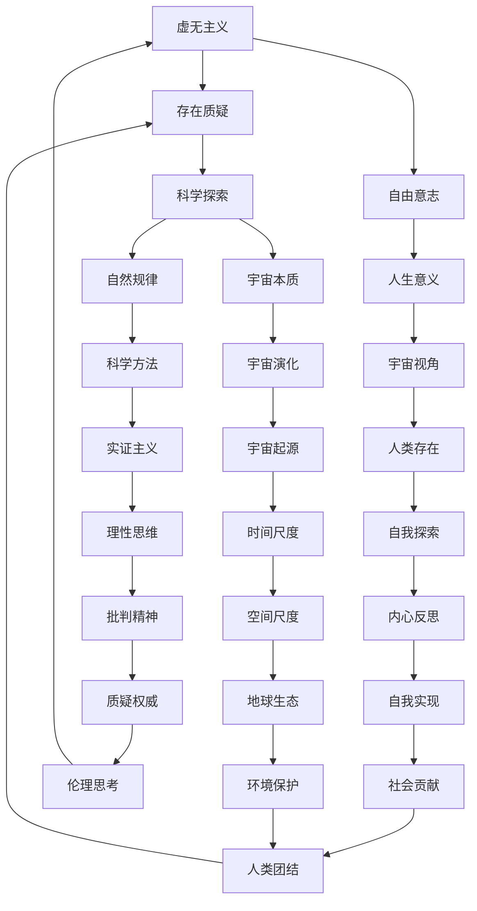

                 

### 第1章 引言

**关键词**：虚无主义、科学探索、宇宙视角、人生意义

**摘要**：  
在本章中，我们将探讨虚无主义与科学探索之间的关系，并从宇宙视角下审视人生的意义。虚无主义作为一种哲学思潮，主张对存在的质疑和对意义的否定。与之相对，科学探索是一种以实证和理性为基础的方法，旨在揭示自然界的规律。通过分析两者的关系，我们将揭示在宇宙的宏大视角下，人类存在的意义如何被重新定义。

在接下来的内容中，我们将首先简要介绍虚无主义的基本概念，以及其在历史上的发展和影响。接着，我们将深入探讨科学探索的本质和基本原则，特别是在宇宙起源、演化和物质与能量本质方面的理解。随后，我们将分析虚无主义与科学探索之间的关系，揭示两者在探讨人生意义方面的互动。最后，我们将从宇宙视角出发，对人生的意义进行深刻的思考，并尝试找到在虚无主义与科学探索背景下的人生方向。

### 1.1 虚无主义概述

虚无主义（Nihilism）作为一种哲学思潮，起源于19世纪，其核心观点是质疑一切价值、意义和存在的合理性。虚无主义认为，在缺乏神圣权威和绝对价值观的世界中，人类自由意志成为唯一的意义来源。因此，虚无主义既可以是消极的，强调对传统信仰和道德的否定；也可以是积极的，鼓励人们以自由意志为武器，重建新的价值观。

虚无主义的历史可以追溯到古希腊哲学家普罗泰戈拉（Protagoras），他提出了“人是万物的尺度”的观点，强调人的主观感受和相对主义。然而，虚无主义在现代社会中的影响力主要源自于19世纪和20世纪的一些重要哲学家和思想家。

首先，尼采（Friedrich Nietzsche）是虚无主义的代表性人物之一。他在《善恶的彼岸》（Thus Spoke Zarathustra）中提出“上帝已死”的命题，揭示了传统宗教和道德体系的崩溃。尼采认为，虚无主义的本质是“生命意志”的觉醒，人类需要通过自我超越和创造新价值来对抗虚无的深渊。

其次，叔本华（Arthur Schopenhauer）也对虚无主义有着深远的影响。他的哲学主张认为，世界是意志的表象，而意志的本质是盲目的、无目的的。这种观点使人们对生命的意义产生了深刻的怀疑。

最后，萨特（Jean-Paul Sartre）在《存在与虚无》（Being and Nothingness）中进一步发展了虚无主义思想。他认为，人作为“存在之前先存在”，面临着自由选择的困境。虚无主义的本质在于，人类在意识到自由的同时，也意识到自己的无意义和无价值。

虚无主义在现代社会中的影响不可忽视。一方面，它对传统道德和宗教信仰提出了挑战，促使人们反思自己的价值观。另一方面，虚无主义也为现代艺术、文学和思想提供了新的视角和创作灵感。例如，存在主义哲学、现代艺术流派和某些文学作品中，都体现了虚无主义的思想。

总之，虚无主义作为一种哲学思潮，不仅在历史上产生了深远的影响，也在现代社会中继续发挥着重要作用。通过对虚无主义的概述，我们可以更好地理解其在探讨人生意义中的角色和意义。

### 1.2 科学探索的本质

科学探索（Scientific Exploration）是揭示自然界规律、理解宇宙奥秘的过程。它以实证和理性为基础，通过观察、实验和理论构建，不断推动人类对自然界的认识。科学探索不仅是一种方法，更是一种思维方式，强调怀疑、批判和理性思考。

首先，科学方法论是科学探索的基本原则。科学方法论主要包括观察（Observation）、假设（Hypothesis）、实验（Experiment）和理论（Theory）等步骤。观察是科学探索的起点，通过感官或仪器收集信息。假设是基于观察得出的初步推测，它需要通过实验进行验证。实验是科学方法的核心，通过控制和操纵变量，检验假设的正确性。理论是实验结果的抽象和概括，它能够解释和预测新的现象。

其次，宇宙起源与演化是科学探索的重要领域。现代宇宙学认为，宇宙起源于大约138亿年前的一个极热、极密的状态，称为“大爆炸”。大爆炸之后，宇宙逐渐膨胀，形成了各种物质和结构。科学家通过观测宇宙微波背景辐射、星系的形成和演化等现象，不断深化对宇宙起源和演化的理解。

在物质与能量本质方面，物理学提供了深刻的洞见。经典物理学认为，物质和能量是两个独立的实体，但相对论和量子力学揭示了它们之间的深刻联系。相对论指出，能量和质量可以互相转换，E=mc²是这一理论的经典公式。量子力学则揭示了微观粒子的行为具有波动性和随机性，这使得我们对物质与能量的理解更加复杂和深刻。

量子力学与相对论是现代物理学的基石。相对论由爱因斯坦（Albert Einstein）提出，它揭示了时间、空间和质量之间的关系。相对论的一个重要结论是，时间不是绝对的，而是相对的，取决于观察者的运动状态。量子力学则研究微观粒子的行为，它揭示了微观世界的非确定性，使得我们对物质的基本构成有了新的认识。

科学探索不仅在理论层面上提供了对宇宙的理解，还在实践层面产生了深远的影响。例如，现代医学的进步离不开对生物体和疾病机制的科学探索。航空航天技术的发展也依赖于对宇宙的深入研究。科学探索推动了人类社会的进步，改变了我们的生活方式和对世界的看法。

总之，科学探索是一种以实证和理性为基础的探索过程，它不仅揭示了自然界的规律，还深刻影响了人类的思想和行为。通过对科学探索的本质进行分析，我们可以更好地理解人类对宇宙的认识过程，并为未来的科学探索提供指导。

### 1.3 虚无主义与科学探索的关系

虚无主义和科学探索在表面上看似完全对立的两个概念，但在深层次上却有着密切的联系。虚无主义质疑存在的意义和价值，而科学探索则致力于揭示自然界的规律和宇宙的本质。这种看似矛盾的关系，实际上在探讨人生意义时发挥了关键作用。

首先，虚无主义与科学探索的关系可以从哲学层面进行探讨。虚无主义认为，在缺乏绝对价值和意义的世界中，人类需要通过自由意志来寻找意义。这种观点在某种程度上与科学探索的方法论相呼应。科学探索强调怀疑、批判和实证，它要求人们不断地挑战现有的知识，追求真理。这种精神与虚无主义中“生命意志”的觉醒有着异曲同工之妙。虚无主义促使人们认识到自身的自由意志，而科学探索则提供了实现这种自由意志的工具和方法。

其次，虚无主义与科学探索在探讨人生意义时具有互补性。虚无主义通过对存在的质疑，揭示了人类对意义和价值的追求。这种追求促使人们反思自己的生命，寻找更深层次的意义。而科学探索则通过揭示自然界的规律和宇宙的本质，为人们提供了理解世界的新视角。科学探索的结果不仅丰富了人类的知识体系，还启示了人类如何在虚无主义的背景下寻找意义。

例如，在宇宙视角下，科学探索揭示了宇宙的浩瀚和多样性。从宇宙大爆炸到星系的形成，再到生命的起源，科学探索为人类提供了对宇宙的全面理解。这种理解使人们在面对虚无主义时，不再感到迷茫和无助。相反，人们可以通过科学探索的结果，重新定义自己在宇宙中的位置和意义。

此外，虚无主义与科学探索在人类思想和文化中也产生了深远的影响。在19世纪和20世纪，虚无主义思潮引发了现代艺术、文学和思想领域的革命。许多艺术家和作家通过虚无主义的视角，探讨了生命的意义和价值。同时，科学探索的进展也为这些创作提供了新的素材和灵感。例如，现代主义文学常常涉及对存在的质疑和对意义的探索，这与虚无主义的哲学观点密切相关。

在现代社会，虚无主义与科学探索的关系变得更加紧密。随着科技的进步，人类对宇宙和自身的认识不断深化。科学探索不仅推动了人类文明的进步，也为虚无主义提供了新的解释框架。例如，宇宙学的进展使人们认识到宇宙的起源和演化，这种认识在一定程度上缓解了虚无主义的焦虑。人们开始从更宏观的视角看待自己的存在，意识到人类只是宇宙中微小的组成部分。

总之，虚无主义与科学探索在表面上看似对立，但在探讨人生意义时却具有互补性。虚无主义通过对存在的质疑，促使人们反思生命的意义，而科学探索则通过揭示自然界的规律，为人们提供了理解世界的新视角。这种互补关系不仅丰富了人类的思想，也在实践中产生了深远的影响。

### 1.4 人生意义在宇宙视角下的探讨

在宇宙的宏大视角下，人生的短暂和渺小显得尤为明显。然而，这种视角也为我们提供了重新审视人生意义的契机。从宇宙的角度来看，人类的生命不过是一瞬间的火花，但正是这一瞬间的火花，在宇宙的舞台上闪耀出了独特的光芒。

首先，从宇宙的历史来看，人类的存在只是宇宙演化过程中的一个微小片段。宇宙的年龄约为138亿年，而人类文明的历史不过数千年。在如此漫长的时间尺度下，人类的一生显得微不足道。但这种渺小并不意味着人类的存在毫无意义。相反，人类的存在在宇宙的框架内展现了一种独特的价值。人类是宇宙中唯一已知具有自我意识和创造力的物种，这种能力使得人类能够在宇宙中留下独特的印记。

其次，宇宙的多样性为人类提供了无限的探索空间。从星系的旋臂到行星上的生态系统，宇宙的每一个角落都蕴藏着无穷的奥秘。人类通过科学探索，不断揭示宇宙的规律和现象，这种探索不仅扩展了人类的知识边界，也为人类带来了新的启示。在宇宙视角下，人类的科学探索不仅仅是为了满足好奇心，更是为了理解宇宙自身的逻辑和意义。通过这种探索，人类不仅能够更好地理解自己的存在，还能够为宇宙的进化提供一种积极的参与。

再次，生命的本质在宇宙视角下得到了新的解读。生命在宇宙中的出现是一个极其罕见且复杂的过程。从无机物质的化学反应到复杂的生物体系，生命的演化充满了奇迹。人类的生命虽然短暂，但正是在这种短暂中，人类展现了生命的多样性和创造力。人类通过艺术、文学、科学等手段，不断探索和表达生命的意义。在宇宙视角下，人类的艺术创作和思想探索不仅是对个体生命意义的追求，更是对宇宙多样性的一种回应。

最后，从宇宙视角看人生的意义，我们还应关注到人类在环境中的责任。地球是宇宙中唯一已知存在生命的行星，人类作为地球上的智慧生物，有责任保护这个独特的生态系统。在宇宙的宏大视角下，人类的每一个行动都关乎到地球生态的可持续发展。因此，人类不仅需要从个体的角度思考生命的意义，更需要从全球和宇宙的角度来看待人类的责任和使命。

总之，在宇宙视角下审视人生，虽然人类的存在显得渺小而短暂，但这并不意味着人生毫无意义。相反，人类通过自我意识、科学探索和艺术创作，在宇宙的舞台上展现出了独特的价值。从宇宙的角度来看，人生的意义不仅在于个体的存在，更在于人类如何通过自己的努力，为宇宙的演化和发展贡献自己的力量。通过这种视角，人类能够更加深刻地理解自己的存在，找到在虚无主义背景下的人生方向。

### 第2章 虚无主义的历史与发展

虚无主义作为一种哲学思潮，其历史可以追溯到古希腊时期。在当时的哲学体系中，虚无主义的思想主要体现在相对主义和怀疑论中。普罗泰戈拉（Protagoras）提出的“人是万物的尺度”的观点，强调人的主观感受，这种相对主义的观点可以视为虚无主义的早期形式。相对主义认为，没有绝对的真理和标准，一切价值观和信仰都是相对的。

进入19世纪，虚无主义在西方哲学中逐渐成型。这一时期的虚无主义主要受到德国哲学家叔本华（Arthur Schopenhauer）和尼采（Friedrich Nietzsche）的影响。叔本华的哲学认为，世界的本质是意志，这种盲目的、无目的的意志导致了对生命意义的否定。叔本华主张通过认识到意志的虚无性，达到心灵的平静和解脱。

尼采则进一步发展了虚无主义的哲学思想。他提出了“上帝已死”的命题，揭示了传统宗教和道德体系的崩溃。尼采认为，在上帝死亡之后，人类面临着价值的真空和意义的迷失。然而，尼采并不认为这是灾难，反而认为这是“生命意志”的觉醒。他鼓励人们通过自我超越和创造新价值，来重新定义生命的意义。

在20世纪，虚无主义的思想继续发展，并出现了多种流派。其中，存在主义是一种重要的虚无主义流派。代表人物萨特（Jean-Paul Sartre）在《存在与虚无》中提出了“存在之前先存在”的观点，强调人类面对自由选择时的无意义感。萨特认为，人类的自由是绝对的，但正因为自由的存在，人类才需要为自己的选择承担责任。

此外，法国哲学家加缪（Albert Camus）也是20世纪虚无主义的代表人物之一。他的哲学思想体现在《鼠疫》和《西西弗神话》等作品中。加缪认为，生命是无意义的，但人类可以通过反抗和斗争来赋予生命以意义。他的观点被称为“荒诞主义”，认为人类在生命的荒诞性面前，需要找到自己的价值。

虚无主义在现代社会中的影响不可忽视。一方面，它对传统道德和宗教信仰提出了挑战，促使人们反思自己的价值观。另一方面，虚无主义也为现代艺术、文学和思想提供了新的视角和创作灵感。例如，许多现代文学作品通过虚无主义的视角，探讨了生命的意义和存在的困境。

总之，虚无主义作为一种哲学思潮，其历史可以追溯到古希腊时期，并在19世纪和20世纪得到进一步的发展。通过分析虚无主义的历史和主要流派，我们可以更好地理解其哲学内涵和现代意义。

#### 2.1 虚无主义的起源

虚无主义的起源可以追溯到古希腊哲学，其中普罗泰戈拉（Protagoras）的观点对后世虚无主义思潮产生了深远影响。普罗泰戈拉提出了“人是万物的尺度”（Man is the measure of all things）这一著名命题，强调了主观感受和相对主义的哲学观点。他认为，没有绝对的真理和标准，一切价值都是相对的，取决于个人的感知和判断。这种相对主义的思想为后来的虚无主义奠定了基础，揭示了人类对存在和意义的质疑。

在古希腊哲学中，苏格拉底（Socrates）和柏拉图（Plato）则代表了另一种对存在的思考。苏格拉底强调“知之为知之，不知为不知”，通过提问和辩证的方法，揭示人类知识的局限性。而柏拉图则提出了“理念世界”的概念，认为现实世界是理念世界的投影，真实的存在是理念世界中的永恒真理。这种观点与虚无主义的核心思想形成了鲜明对比，但同时也引发了后世对存在和真理的深入探讨。

中世纪的哲学中，亚里士多德（Aristotle）的思想对虚无主义的发展产生了影响。亚里士多德强调实证主义，主张通过观察和实验来获取知识。他认为，现实世界的规律是可以通过理性理解和实证验证的，这种观点与虚无主义的相对主义和主观性形成了对立。然而，亚里士多德的思想也为后来的科学探索提供了理论基础，使得虚无主义在某种程度上得以抑制。

进入近代，虚无主义的起源逐渐显现。德国哲学家叔本华（Arthur Schopenhauer）和尼采（Friedrich Nietzsche）是19世纪虚无主义哲学的代表性人物。叔本华认为，世界的本质是意志，这种意志是盲目、无目的的，导致了生命的虚无感。他主张通过认识到意志的虚无性，达到心灵的平静和解脱。尼采则提出了“上帝已死”的命题，揭示了传统宗教和道德体系的崩溃。他认为，在上帝死亡之后，人类面临着价值的真空和意义的迷失。尼采鼓励人们通过自我超越和创造新价值，来重新定义生命的意义。

虚无主义在20世纪得到了进一步的发展，存在主义哲学是其重要流派之一。法国哲学家萨特（Jean-Paul Sartre）在《存在与虚无》中提出了“存在之前先存在”的观点，强调人类面对自由选择时的无意义感。萨特认为，人类的自由是绝对的，但正因为自由的存在，人类才需要为自己的选择承担责任。

总之，虚无主义的起源可以追溯到古希腊哲学，并在近代通过叔本华和尼采等哲学家的思想得到进一步发展。通过对历史起源的分析，我们可以更好地理解虚无主义的核心思想及其在哲学史上的地位。

#### 2.2 西方虚无主义的主要流派

西方虚无主义在历史发展中形成了多个主要的流派，每个流派都有其独特的哲学观点和思想基础。以下是对其中三个主要流派的介绍和比较：

1. **尼采式的虚无主义**：
   尼采是虚无主义的代表人物之一，他的思想对后世产生了深远的影响。尼采认为，传统宗教和道德体系已经崩溃，导致人类面临着价值的真空和意义的迷失。尼采提出了“上帝已死”的命题，揭示了人类在失去宗教信仰后的困境。他认为，人类需要通过自我超越和创造新价值，来重新定义生命的意义。尼采式的虚无主义强调个体的自由意志和创造力，认为只有通过不断的自我挑战和超越，人类才能找到真正的意义。

2. **存在主义虚无主义**：
   存在主义虚无主义以萨特为代表，其核心观点是“存在之前先存在”。萨特认为，人类在意识到自由的同时，也意识到自己的无意义和无价值。存在主义强调人类面对自由选择时的无意义感，但并不主张放弃追求意义。相反，萨特认为，人类需要为自己的选择承担责任，通过自由选择和行动，赋予生命以意义。存在主义虚无主义主张通过反抗和斗争，来克服虚无主义的困境，寻找生命的意义。

3. **道德相对主义虚无主义**：
   道德相对主义虚无主义认为，没有绝对的道德标准和真理，一切道德价值观都是相对的。这种观点认为，道德规范和文化传统是由人类制定的，它们不能提供超越人类存在的绝对价值。道德相对主义虚无主义质疑传统道德观念的权威性，主张人类应该以自由意志为基础，重新审视和构建自己的道德体系。这种流派的思想与尼采和存在主义有所不同，它更强调道德和文化的相对性和主观性。

这三种流派在哲学观点上有所不同，但它们都关注人类在存在和意义方面的困境。尼采式的虚无主义强调个体的自由意志和创造力，认为人类需要通过自我超越来找到生命的意义。存在主义虚无主义则认为，自由选择和行动是赋予生命意义的关键，人类需要为自己的选择承担责任。道德相对主义虚无主义则质疑传统道德观念的权威性，主张人类应以自由意志为基础，重新审视和构建自己的道德体系。

总之，西方虚无主义的主要流派各具特色，它们从不同角度探讨了人类在存在和意义方面的困境。通过比较这些流派，我们可以更深入地理解虚无主义的核心思想和其在现代哲学中的地位。

#### 2.3 东方虚无主义的哲学基础

虚无主义不仅在西方哲学中有着深远的影响，在东方哲学中也有着独特的体现。东方虚无主义的主要哲学基础可以追溯到中国古代哲学和佛教思想，其中道家的哲学思想和佛教的空性观念是东方虚无主义的核心。

**道家哲学**：道家哲学的创始人是老子，他在《道德经》中提出了“道”的概念，认为“道”是宇宙的根本原理，它既无形又无象，是万物的本源。老子认为，人应当顺应自然，放弃世俗的欲望和执着，从而达到“无为而治”的境界。道家的虚无主义思想体现在对现实世界的超然态度，主张通过减少欲望和执着，达到心灵的宁静和自由。

**佛教哲学**：佛教中的空性观念（Sunyata）是虚无主义的重要理论基础。佛教认为，一切现象都是无常的、无自性的，不存在独立存在的实体。空性观念主张对一切存在的本质进行洞察，认识到它们的无自性和无常性，从而超越对世俗事物的执着和欲望。佛教中的涅槃（Nirvana）境界被视为虚无主义的最高目标，是一种超越世俗痛苦的终极解脱。

**儒家哲学**：虽然儒家哲学中并不直接包含虚无主义思想，但儒家的一些观点与虚无主义有某种程度的共鸣。儒家强调“仁爱”和“中庸之道”，主张通过自我修养和社会责任来实现个人和集体的和谐。儒家思想中的“无为而治”和“知足常乐”观念，可以在某种程度上被解读为对虚无主义的一种回应。

**禅宗思想**：禅宗是中国佛教的一个重要流派，其思想强调直接体验和内心的平静。禅宗主张通过“坐禅”和“顿悟”，达到对空性的直接认识和心灵的自由。禅宗思想中的“无念”、“无相”和“无所住”，体现了对世俗事物和存在的超然态度，与虚无主义的核心思想有相似之处。

总的来说，东方虚无主义的哲学基础主要包括道家的自然主义和无为思想、佛教的空性观念，以及儒家的一些相关思想。这些哲学观念共同构成了东方虚无主义的思想体系，为人们提供了一种超越世俗苦难和追求内心平静的哲学路径。

#### 2.4 虚无主义在现代社会的影响

虚无主义在现代社会中具有广泛而深远的影响，尤其在思想、文化和政治领域表现尤为突出。虚无主义不仅挑战了传统的道德和宗教信仰，还促使人们重新审视个人的价值观和生活意义。

**在思想领域**，虚无主义促使人们质疑一切既定的知识和权威。它鼓励个人通过批判性思维和独立思考，来寻找自己的真理和意义。虚无主义的思想激发了现代哲学、文学和艺术中的许多流派，如存在主义、现代主义和后现代主义。许多哲学家和文学家通过虚无主义的视角，探讨了人类存在的困境和意义的追寻。例如，萨特的《存在与虚无》和尼采的《查拉图斯特拉如是说》都是虚无主义思想的重要代表作品。

**在文化领域**，虚无主义影响了现代艺术的发展，尤其是绘画、文学和电影。许多现代艺术作品通过虚无主义的视角，揭示了人类存在的荒诞性和孤独感。例如，达达主义和超现实主义等艺术流派，以其反传统和反理性的特点，体现了虚无主义的思想。这些艺术作品不仅反映了现代人的精神状态，也为人们提供了一种逃离现实困境的途径。

**在政治领域**，虚无主义对现代政治思想和政治运动产生了重要影响。虚无主义主张个人自由和社会变革，反对权威和传统。这种思想在20世纪的革命运动中得到了广泛传播，如俄国革命和法国大革命。虚无主义的思想也影响了现代的政治哲学，如自由主义和社群主义等。自由主义强调个人自由和权利，而社群主义则主张通过集体行动来实现社会正义和公平。

**在日常生活**，虚无主义影响了人们的生活方式和价值观念。它促使人们反思消费主义和个人主义，提倡简单生活和内心探索。许多人通过冥想、瑜伽和冥想等方式，来寻求内心的平静和自我实现。虚无主义还激发了人们对可持续发展和环境保护的关注，鼓励人们重新审视人类与自然的关系。

总之，虚无主义在现代社会中的影响是深远而广泛的。它不仅挑战了传统的道德和宗教信仰，还促使人们重新审视个人的价值观和生活意义。在思想、文化、政治和日常生活等方面，虚无主义都为现代社会提供了新的视角和思考方式，推动了人类对存在和意义的持续探索。

### 第3章 科学探索的基本原理

科学探索（Scientific Exploration）是一种以实证和理性为基础的方法，旨在揭示自然界的规律和宇宙的本质。理解科学探索的基本原理，是深入探讨科学如何推动人类进步和认知世界的关键。以下是科学探索的基本原则和核心概念。

#### 3.1 科学方法论

科学方法论是科学探索的核心，它包括观察（Observation）、假设（Hypothesis）、实验（Experiment）和理论（Theory）等步骤。

1. **观察**：观察是科学探索的起点，通过感官或仪器收集信息。观察要求科学家具有敏锐的观察能力和对现象的细致描述。例如，天文学家通过望远镜观察星空，发现行星的运动规律。

2. **假设**：假设是基于观察得出的初步推测，它需要通过实验进行验证。假设通常是对现象的一种解释，例如，科学家可能会假设行星的运动是由某种未知力量驱动的。

3. **实验**：实验是科学方法的核心，通过控制和操纵变量，检验假设的正确性。实验要求科学家设计合理的实验方案，确保实验结果具有可靠性和重复性。例如，通过实验，科学家发现行星的运动确实受到引力的作用。

4. **理论**：理论是实验结果的抽象和概括，它能够解释和预测新的现象。理论需要通过大量的实验验证，才能被广泛接受。例如，牛顿的万有引力定律就是基于大量实验结果，对行星运动规律的一种理论解释。

#### 3.2 宇宙起源与演化

宇宙起源与演化是科学探索的重要领域，现代宇宙学认为宇宙起源于大约138亿年前的一个极热、极密的状态，称为“大爆炸”。大爆炸之后，宇宙逐渐膨胀，形成了各种物质和结构。

1. **大爆炸理论**：大爆炸理论认为，宇宙起源于一个极热、极密的点，称为奇点。在这个奇点中，所有的物质和能量都高度集中。随着宇宙的膨胀，温度和密度逐渐降低，形成了宇宙的早期结构。

2. **宇宙膨胀**：宇宙膨胀是指宇宙从大爆炸后不断扩张的过程。观测数据表明，宇宙的膨胀速度在逐渐加快，这一现象被称为“宇宙加速膨胀”。

3. **宇宙背景辐射**：宇宙背景辐射是宇宙大爆炸后遗留下来的辐射，它是大爆炸理论的直接证据之一。宇宙背景辐射的发现证明了宇宙起源和演化的科学理论。

4. **宇宙的终极命运**：科学家们对宇宙的终极命运提出了多种假设，包括“热寂”（Heat Death）、“大坍缩”（Big Crunch）和“大撕裂”（Big Rip）等。这些假设取决于宇宙的膨胀速度和密度。

#### 3.3 物质与能量的本质

物理学对物质与能量的本质进行了深刻的探讨，揭示了它们之间的复杂关系。

1. **物质**：物质是构成宇宙的基本实体，具有质量和占据空间的特性。物质有多种形态，包括固体、液体、气体和等离子体等。

2. **能量**：能量是物质运动和变化的度量，它可以是动能、势能、热能等多种形式。能量守恒定律指出，能量不能被创造或消灭，只能从一种形式转化为另一种形式。

3. **质能等价原理**：爱因斯坦的质能等价原理（E=mc²）揭示了物质和能量之间的深刻联系。这个原理表明，质量和能量是等价的，质量可以转化为能量，能量也可以转化为质量。

4. **量子力学**：量子力学研究微观粒子的行为，揭示了物质在微观尺度上的波动性和随机性。量子力学的核心原理包括波粒二象性、不确定性原理和量子纠缠等。

#### 3.4 量子力学与相对论

量子力学和相对论是现代物理学的基石，它们分别从微观和宏观尺度揭示了自然界的基本规律。

1. **相对论**：相对论由爱因斯坦提出，分为狭义相对论和广义相对论。狭义相对论揭示了时间、空间和质量之间的关系，提出了质能等价原理。广义相对论则描述了引力作为一种几何效应，对宇宙的结构和演化产生了深远影响。

2. **量子力学**：量子力学研究微观粒子的行为，揭示了物质在微观尺度上的波动性和随机性。量子力学的核心原理包括波粒二象性、不确定性原理和量子纠缠等。

总之，科学探索的基本原理涵盖了从观察和假设到实验和理论的整个过程，它不仅揭示了自然界的规律，还为人类提供了理解世界和自身的新视角。通过对宇宙起源与演化、物质与能量本质、量子力学与相对论等核心概念的探讨，我们可以更深入地理解科学探索的本质和意义。

### 3.5 科学探索的基本步骤和流程

科学探索是一个系统化、结构化的过程，它通常包括以下几个基本步骤和流程：

1. **问题提出**：
   科学探索始于对某个现象或问题的观察和提问。这一阶段要求科学家具备敏锐的观察能力和强烈的好奇心。例如，天文学家可能会观察到行星的不规则运动，提出“是什么力量在驱动行星的运动？”这样的问题。

2. **文献调研**：
   在问题提出后，科学家会进行广泛的文献调研，了解已有的研究成果和理论。文献调研不仅帮助科学家明确问题的研究背景，还能为其提供研究方法和思路。例如，在研究行星运动时，科学家会查阅相关的天文观测数据和理论模型。

3. **假设提出**：
   根据文献调研的结果，科学家会提出一个或多个假设，这些假设是对观察现象的一种初步解释。假设通常基于现有的理论框架，并结合新的观察数据进行推测。例如，科学家可能会假设行星运动是由引力驱动的。

4. **实验设计**：
   假设提出后，科学家需要设计实验来验证假设。实验设计要求科学家具备严密的逻辑思维和创新能力，确保实验能够有效地测试假设。例如，天文学家可能会设计一个实验，通过观测不同距离的行星，来验证引力理论。

5. **数据收集**：
   在实验过程中，科学家会收集大量的数据。这些数据包括观测到的现象、测量结果等，是验证假设的重要依据。数据收集要求科学家具备精准的实验操作能力和数据分析能力。例如，天文学家会使用望远镜和光谱仪来收集行星运动的数据。

6. **数据分析**：
   收集到数据后，科学家需要对数据进行系统的分析和处理，以发现数据中的规律和异常。数据分析通常涉及统计学、数学建模等方法。例如，天文学家会使用统计方法来分析行星运动的规律性。

7. **假设验证**：
   通过数据分析，科学家可以验证假设的正确性。如果假设得到验证，科学家会进一步深化研究，探索更广泛的现象；如果假设被否定，科学家则需要重新提出假设或修正现有理论。

8. **理论构建**：
   在假设验证的基础上，科学家会构建一个理论模型，来解释和预测新的现象。理论构建要求科学家具备抽象思维和理论创新能力。例如，天文学家可能会构建一个引力模型，来解释行星的运动规律。

9. **学术交流**：
   科学探索不仅仅是一个个人的过程，它还需要通过学术交流来验证和传播研究成果。科学家会撰写学术论文，参加学术会议，与同行进行交流。学术交流有助于发现研究中的不足和改进方向。

10. **应用推广**：
    最后，科学研究成果会被应用于实际生活中，推动科技发展和人类福祉。例如，基于引力理论的航天技术，使得人类能够成功进行航天探索和卫星发射。

总之，科学探索的基本步骤和流程是一个循环迭代的过程，每个步骤都相互关联，共同推动科学进步。通过系统化的科学方法，人类能够不断揭示自然界的奥秘，推动科技和社会的发展。

### 3.6 科学探索与哲学的关系

科学探索与哲学之间存在着密切而复杂的关系。哲学为科学探索提供了理论基础和方法论指导，而科学探索的进展又不断丰富和挑战哲学思想。以下是科学探索与哲学之间的一些关键联系和互动：

首先，哲学为科学探索提供了基本的思维方式和理论基础。科学方法的发展在很大程度上受到了哲学思想的影响。例如，柏拉图的理念论和亚里士多德的实证主义为后来的科学方法论奠定了基础。康德（Immanuel Kant）的批判哲学提出了先验知识和范畴的概念，强调了人类认识能力的局限性，这为科学方法论中的怀疑主义和实证主义提供了哲学依据。

其次，科学探索对哲学思想的挑战和丰富作用也是显而易见的。科学发现和技术进步不断挑战传统哲学观念，促使哲学家重新思考和定义存在的本质、真理和知识。例如，量子力学和相对论对经典物理学的挑战，促使哲学家探讨新的本体论和认识论问题。哥德尔（Kurt Gödel）的不完备性定理和图灵（Alan Turing）的计算理论，对逻辑哲学和认知科学产生了深远影响。

此外，科学探索与哲学之间的互动还体现在对人类价值和意义的探讨上。科学探索揭示了自然界的规律和宇宙的奥秘，但同时也提出了人类存在的意义和目的这一哲学问题。例如，尼采的虚无主义思想和对生命意志的探讨，是在科学探索的背景下对人类存在意义的深刻反思。同样，现代生物学和宇宙学的发展，也促使哲学家探讨生命的起源和宇宙的终极命运。

最后，科学探索与哲学之间的互动还体现在具体科学领域的跨学科研究中。例如，认知科学结合了心理学、神经科学和计算机科学，研究人类思维和意识的问题。这种跨学科研究不仅推动了科学的发展，也丰富了哲学的思想内容。

总之，科学探索与哲学之间的关系是相互促进和相互影响的。哲学为科学探索提供了理论基础和方法论指导，而科学探索的进展不断挑战和丰富哲学思想。通过这种互动，人类能够更全面地理解自然和自身，推动科学和哲学的共同进步。

### 第4章 虚无主义与科学探索的融合

虚无主义与科学探索在表面上看似完全对立的两个概念，但在探讨人生意义时却能够实现某种程度上的融合。通过虚无主义视角下的科学探索，我们可以找到一种新的思维方式，来应对存在的虚无感和生命的短暂性。以下将从几个方面探讨虚无主义与科学探索的融合。

#### 4.1 虚无主义视角下的科学探索

在虚无主义的视角下，科学探索不仅仅是为了积累知识或推动技术进步，它还成为了一种对抗虚无主义的方式。虚无主义认为，在缺乏绝对价值和意义的世界中，人类需要通过自由意志来寻找意义。科学探索为这种自由意志提供了具体的实践路径。通过科学研究，人类可以不断挑战现有的知识边界，创造出新的理论和发明，从而赋予生命以意义。

例如，人类对宇宙起源和演化的探索，揭示了宇宙的浩瀚和多样性。这种探索不仅扩展了人类的知识边界，还激发了人类对宇宙奥秘的探索欲望。在虚无主义的视角下，这种探索过程本身就是一种意义，它使人类能够在对宇宙的探索中找到自己的位置和角色。

此外，科学探索中的怀疑和批判精神也是对抗虚无主义的重要武器。虚无主义强调对一切既定观念的质疑，科学探索的方法论同样强调怀疑和批判。通过实验和验证，科学家不断推翻旧的理论，建立新的知识体系。这种过程不仅促进了科学的发展，也在一定程度上对抗了虚无主义的消极态度。

#### 4.2 科学探索对虚无主义的回应

科学探索对虚无主义提出了积极的回应，通过揭示自然界的规律和宇宙的本质，科学探索为人类提供了一种新的价值观和意义。

首先，科学探索揭示了宇宙的广袤和复杂，使得人类意识到自己的渺小和有限。这种意识到反而使得人类更加珍惜自己的生命，以积极的态度面对存在的虚无感。例如，人类通过宇宙望远镜观测到的遥远星系和黑洞，使人类意识到宇宙的无限广阔，同时也使人类更加深刻地理解了自己的存在。

其次，科学探索的结果为人类提供了新的目标和动力。在科学探索中，人类不断追求新的知识和发现，这种追求本身就赋予生命以意义。例如，人类对基因编辑技术的探索，不仅推动了医学和生物科学的发展，还为人类提供了解决疾病和提升生活质量的新途径。

最后，科学探索还促进了人类社会的进步和团结。科学探索需要国际合作和共同努力，这种合作精神有助于消除种族、文化和宗教的差异，促进人类社会的和谐发展。例如，国际空间站的建立和运营，是多个国家合作的结果，它不仅推动了空间科学的发展，也增强了各国之间的友好关系。

#### 4.3 虚无主义与科学探索的互动关系

虚无主义与科学探索的互动关系不仅体现在对抗和回应上，还体现在相互融合和共同发展中。

首先，虚无主义促使科学探索更加深入和全面。在虚无主义的背景下，科学家们更加注重对现象本质的探索，而不是仅仅追求表面的技术进步。例如，量子力学和相对论的提出，正是对经典物理学的质疑和超越，这种探索精神推动了科学的发展。

其次，科学探索的结果为虚无主义提供了新的解释框架。科学探索揭示了自然界的规律和宇宙的本质，这为虚无主义提供了一种新的视角，使得人类能够以更积极的态度面对存在的虚无感。例如，通过对宇宙起源和演化的研究，人类可以理解自己在宇宙中的位置和角色，从而找到一种新的意义。

最后，虚无主义与科学探索的融合还体现在对人类行为和社会的影响上。在科学探索的推动下，人类开始更加注重个人自由和社会责任，这种价值观在虚无主义的背景下显得尤为重要。通过科学探索，人类不仅能够更好地理解自然，还能够通过科学精神来指导自己的行为，实现个人和社会的和谐发展。

总之，虚无主义与科学探索在表面上看似对立，但在探讨人生意义时却能够实现某种程度上的融合。通过虚无主义的视角，科学探索不仅成为了一种对抗虚无主义的方式，还为人类提供了一种新的价值观和意义。在这种互动关系中，人类能够更加深刻地理解自己的存在，并以积极的态度面对存在的虚无感。

### 4.4 虚无主义视角下的科学探索案例分析

为了更具体地理解虚无主义视角下的科学探索，我们可以通过几个真实的案例来探讨。这些案例不仅展示了科学家如何在实际研究中应用虚无主义思想，还揭示了科学探索如何为人类提供新的意义和目的。

**案例一：量子纠缠的探索**

量子纠缠是量子力学中的一个重要现象，它描述了两个或多个量子粒子之间的紧密关联，即使这些粒子相隔很远，它们的状态也会瞬时相互影响。这一现象挑战了经典物理学的局域实在论，引发了广泛的哲学和科学讨论。

虚无主义视角下的量子纠缠研究，促使科学家们质疑现实的本质。在虚无主义的背景下，科学家布莱恩·约瑟夫森（Brian D. Josephson）通过实验验证了量子纠缠现象，为量子计算和通信的发展奠定了基础。约瑟夫森的研究不仅推动了科学技术的进步，还促使人们重新思考存在的意义和科学的边界。

**案例二：宇宙膨胀与暗物质的探索**

宇宙膨胀是现代宇宙学的一个重要发现，它揭示了宇宙正在加速膨胀。为了解释宇宙膨胀，科学家们提出了暗物质的概念，即一种看不见的物质，它对宇宙的引力作用产生了重要影响。

在虚无主义的视角下，宇宙膨胀和暗物质的研究使得科学家们更加关注宇宙的本质和起源。面对宇宙的浩瀚和神秘，科学家们通过观测和理论模型，不断探索宇宙的规律和结构。这种探索不仅扩展了人类的知识边界，还帮助人们理解自己在宇宙中的微小位置，从而找到一种新的存在意义。

**案例三：基因编辑技术的研究**

基因编辑技术，如CRISPR-Cas9，为医学和生物学研究带来了革命性的变化。通过精确修改基因，科学家们能够治疗遗传性疾病，推动生物技术的发展。

在虚无主义的视角下，基因编辑技术的研究促使科学家们重新思考生命的本质和价值。虚无主义认为，生命的意义在于人类的自由意志和创造力。通过基因编辑技术，科学家们不仅能够治愈疾病，还能通过创造新的生物体，探索生命的多样性和可能性。这种探索过程赋予了科学家们新的目标和意义。

**案例四：人工智能的发展**

人工智能（AI）的发展是21世纪科技领域的重大突破。通过机器学习和深度学习算法，人工智能在图像识别、自然语言处理、自动化决策等领域取得了显著进展。

在虚无主义的视角下，人工智能的研究揭示了人类思维的局限性和机器的潜力。虚无主义强调对既定观念的质疑和挑战，而人工智能的发展正是在质疑传统认知方式的基础上，创造出新的智能系统。这种探索不仅推动了科技的进步，还促使人们思考人类与机器之间的关系，以及人类在科技发展中的角色和责任。

通过这些案例，我们可以看到虚无主义视角下的科学探索不仅是对自然规律的揭示，更是一种对抗虚无主义的方式，为人类提供了新的意义和目的。科学家们通过不断的质疑、探索和创新，在虚无主义的背景下找到了自己的位置和价值。这些探索不仅丰富了人类的知识体系，还推动了社会的进步和人类对自身存在的理解。

### 4.5 科学探索对虚无主义的回应

科学探索不仅可以从虚无主义的角度进行重新审视，它本身也通过揭示自然界的规律和宇宙的本质，对虚无主义提出了积极的回应。科学探索的结果不仅扩展了人类的知识边界，还为人类提供了一种新的价值观和意义。以下是科学探索如何回应虚无主义的几个方面：

首先，科学探索揭示了宇宙的广袤和复杂，使人类意识到自己的渺小和有限。这种意识到反而使得人类更加珍惜自己的生命，并以积极的态度面对存在的虚无感。例如，人类通过宇宙望远镜观测到的遥远星系和黑洞，揭示了宇宙的无限广阔，同时也使人类更加深刻地理解了自己的存在。这种对宇宙的探索不仅扩展了人类的知识边界，还激发了对人类自身存在的思考。

其次，科学探索为人类提供了新的目标和动力。在科学探索的过程中，人类不断追求新的知识和发现，这种追求本身就赋予生命以意义。例如，人类对宇宙起源和演化的研究，不仅推动了科学的发展，还为人类提供了解决实际问题和探索未知的动力。通过科学探索，人类能够不断克服困境，寻找新的解决方案，这种积极的态度有助于对抗虚无主义的消极影响。

第三，科学探索促进了人类社会的进步和团结。科学探索需要国际合作和共同努力，这种合作精神有助于消除种族、文化和宗教的差异，促进人类社会的和谐发展。例如，国际空间站的建立和运营是多个国家合作的结果，它不仅推动了空间科学的发展，也增强了各国之间的友好关系。通过合作，人类能够共同面对挑战，实现共同的目标，这种团结精神为人类提供了新的价值和意义。

此外，科学探索的结果为人类提供了一种新的思维方式。科学强调实证和理性，通过观察、实验和理论构建，科学探索揭示了自然界的规律和现象。这种科学思维方式不仅帮助人类更好地理解世界，还为人类提供了一种新的视角来应对虚无主义带来的困惑和挑战。通过科学思维方式，人类能够以更加理性和客观的态度看待问题，从而找到应对虚无主义的方法。

最后，科学探索在技术和应用层面也为人类提供了新的机会和可能。例如，基因编辑技术为医学和生物科学带来了革命性的变化，通过精确修改基因，人类能够治疗遗传性疾病，提升生活质量。这种技术进步不仅为人类提供了新的治疗手段，也为人类带来了新的希望和动力，从而有助于对抗虚无主义的消极影响。

总之，科学探索通过揭示宇宙的广袤和复杂、提供新的目标和动力、促进社会进步和团结，以及提供新的思维方式和技术应用，对虚无主义提出了积极的回应。科学探索不仅扩展了人类的知识边界，还为人类提供了新的价值观和意义，从而有助于对抗虚无主义带来的困境和挑战。

### 4.6 虚无主义与科学探索的互动关系及其意义

虚无主义与科学探索之间的互动关系不仅丰富了人类的哲学思想，还在社会进步和个人成长方面发挥了重要作用。通过深入探讨这种互动关系，我们可以更全面地理解其意义和影响。

首先，虚无主义与科学探索的互动有助于推动哲学思想的深化。虚无主义作为一种对存在和意义的质疑，促使哲学家们反思传统的价值观和信仰体系。这种质疑激发了哲学界对人类存在本质的探讨，推动了哲学思想的进步。与此同时，科学探索为这种哲学反思提供了新的视角和工具。科学方法强调实证和理性，通过观察和实验揭示自然界的规律，这为哲学提供了新的思考和解释框架。例如，量子力学和相对论对传统物理学的挑战，促使哲学家重新审视存在的本质和知识的边界。

其次，虚无主义与科学探索的互动促进了社会进步。科学探索的成果不仅推动了技术和医疗的发展，还解决了许多现实问题，提高了人类的生活质量。例如，基因编辑技术的突破为治疗遗传性疾病提供了新方法，航天技术的发展使人类能够探索宇宙，这些成果都得益于科学探索的努力。而在虚无主义的视角下，科学探索不仅是一种技术进步，更是一种对抗虚无主义的方式。通过探索自然界的规律和宇宙的奥秘，人类能够找到新的意义和目标，从而提高社会整体的幸福感和凝聚力。

在个人成长方面，虚无主义与科学探索的互动也具有深远的影响。虚无主义促使个人反思自己的价值观和生活意义，通过质疑和挑战既有的观念，个人能够更加清晰地认识自己。而科学探索为个人提供了具体的实践路径，通过学习和实践科学方法，个人能够提升自己的认知能力和解决问题的能力。例如，通过科学探索，个人可以了解到宇宙的浩瀚和多样性，从而拓宽自己的视野，找到新的兴趣和动力。

此外，虚无主义与科学探索的互动还有助于培养批判性思维和创新能力。虚无主义鼓励对既定观念的质疑，而科学探索强调实证和理性。这种互动关系促使个人在思考和解决问题时，既要有批判性思维，又要有实证精神。例如，在科学研究过程中，科学家们需要不断地提出假设、设计实验、收集数据，并通过分析结果来验证或推翻假设。这种过程不仅培养了科学家的批判性思维，还提升了他们的创新能力。

总之，虚无主义与科学探索的互动关系在哲学思想深化、社会进步和个人成长方面都具有重要的意义。通过这种互动，人类能够更加全面地理解存在的意义，找到新的目标和动力，推动社会的进步和个人的成长。在未来的发展中，我们应该继续深化这种互动关系，以应对虚无主义的挑战，实现人类社会的可持续发展。

### 5.1 虚无主义视角下的人生观

在虚无主义的视角下，人生观被重新定义，人类的存在被置于一个更加广阔和复杂的背景下进行审视。虚无主义强调对存在的质疑和对意义的否定，这促使人们以全新的视角看待人生，并思考自己的角色和目的。

首先，虚无主义视角下的人生观强调了存在的偶然性和无意义性。虚无主义者认为，人类的存在是偶然的，宇宙中没有绝对的法则或目的来解释生命的产生和存在。这种观点使得人们意识到，生命本身并没有预定的意义，而是需要通过个人的自由意志和选择来赋予意义。人类在这种无意义的环境中，面临着一种“存在的荒诞性”，即生命缺乏固有的目的和价值。

其次，虚无主义视角下的人生观强调了主观性的重要性。虚无主义者认为，生命的意义是主观的，每个人都可以根据自己的意愿和价值观来定义自己的生命意义。这种观点打破了传统意义上对人生意义的统一标准，使得人们能够更加自由地追求自己的梦想和目标。在虚无主义的背景下，人们不再依赖外部的权威或宗教信仰来寻找生命的意义，而是通过自我探索和内心的反思来寻找答案。

此外，虚无主义视角下的人生观还涉及到对苦难和痛苦的接受。虚无主义者认为，生命中的苦难和痛苦是不可避免的，这些经历本身并没有价值，但通过面对和克服这些苦难，人们可以体验到生命的深度和丰富性。例如，尼采在其哲学思想中提出了“苦难哲学”，认为通过经历苦难，人们可以超越自我，达到一种更高的境界。虚无主义视角下的人生观鼓励人们勇敢地面对生活中的挑战，从中寻找成长和进步的机会。

最后，虚无主义视角下的人生观还强调了对现实的批判和反思。虚无主义者认为，现实世界充满了虚假和欺骗，人们应该保持清醒的头脑，质疑一切既定的观念和制度。通过批判和反思，人们可以更真实地认识自己和世界，找到真正属于自己的生活意义。例如，存在主义者萨特在其哲学作品中，通过揭示人类存在的荒诞性和困境，鼓励人们通过自由选择和行动，赋予生命以意义。

总之，虚无主义视角下的人生观挑战了传统的价值观和人生观，使人们以更加理性和自由的态度来审视自己的存在。在这种视角下，生命的意义不再是固有的，而是需要通过个人的自由意志和选择来创造。虚无主义视角下的人生观为人们提供了一种新的思维方式，帮助人们在面对存在的虚无感时，找到自己的方向和目标。

### 5.2 科学探索对人生意义的启示

科学探索不仅揭示了自然界的规律和宇宙的本质，还为人类提供了深刻的哲学启示，特别是在探讨人生意义方面。通过科学探索，我们可以从多个角度理解人类存在的意义，并为自己的生命赋予更深层次的价值。

首先，科学探索揭示了宇宙的广袤和多样性。当我们了解到宇宙的浩瀚，星系的繁星点点，以及地球在宇宙中的微小地位时，我们可能会产生一种敬畏之情。这种对宇宙的深刻认识，使人类意识到自己的存在并非孤立的，而是宇宙中的一部分。在宇宙的背景下，个人的生命虽然短暂，但仍然具有独特性和重要性。通过科学探索，我们可以更好地理解人类在宇宙中的角色和使命，从而为生命赋予意义。

其次，科学探索推动了人类对自身认知的深入。生物学和医学的发展使我们能够了解生命的起源和演化过程，揭示了人类基因的奥秘和身体工作机制。通过科学探索，我们不仅能够更好地理解自己的身体，还能通过基因编辑和生物技术来改善健康状况，延长寿命。这种对自身认知的提升，使人类更加关注生命的质量和意义，从而在个人成长和自我实现中找到方向。

再次，科学探索为我们提供了新的目标和动力。科学技术的进步不仅改变了我们的生活方式，还激发了人类的创造力和求知欲。例如，人类对太空的探索促使我们不断突破技术瓶颈，追求更远的宇宙疆界。在科学探索的推动下，人类不断挑战自我，追求新的知识和发现，这种追求本身就是一种对生命的深刻诠释。通过科学探索，我们可以找到新的目标和动力，使自己的生活更加充实和有意义。

此外，科学探索还促进了人类社会的进步和团结。科学探索需要全球合作，通过国际间的科学交流和技术合作，人类能够共同面对全球性挑战，如气候变化、疾病控制和环境保护等。这种合作精神不仅推动了科学的发展，也增强了人类社会的凝聚力和共同目标感。通过科学探索，我们可以发现人类共同的利益和使命，从而为生命赋予更广泛的社会意义。

最后，科学探索为我们提供了反思和批判的视角。科学方法强调实证和理性，通过质疑和验证，科学探索揭示了现实世界的复杂性和不确定性。这种反思和批判精神使我们能够更加客观地看待自己和世界，从而在生命的每一个阶段找到真实和意义。通过科学探索，我们可以更加清醒地认识自己的局限性和不足，从而不断追求进步和自我完善。

总之，科学探索不仅扩展了人类的知识边界，还为我们的生命提供了深刻的哲学启示。通过科学探索，我们可以更好地理解宇宙和自身，找到生命的意义和价值。在科学探索的背景下，我们的生命不再是孤独和短暂的，而是充满意义和目标的旅程。通过不断地追求知识和真理，我们可以为生命赋予更深层次的意义，实现个人的成长和社会的进步。

### 5.3 宇宙视角下的人生意义

从宇宙的视角来看，人类的存在和人生意义被赋予了全新的意义。宇宙的宏大和多样性为我们提供了对自身存在的深刻洞察，使我们在思考人生意义时能够从更加广阔的视野出发。

首先，宇宙视角揭示了人类在宇宙中的微小地位。宇宙的年龄约为138亿年，而人类文明的历史不过数千年。在如此漫长的时间尺度下，人类的一生显得极为短暂。但这种短暂并不意味着人生毫无意义。相反，人类的短暂存在使我们对生命有了更加珍惜和敬畏的态度。宇宙的广袤和复杂性让我们意识到，人类在宇宙中扮演着微不足道的角色，这种认知促使我们更加关注个体的价值，珍惜每一个生命瞬间。

其次，宇宙视角为我们提供了探索和发现的机会。宇宙的多样性和未解之谜激发了人类的好奇心和求知欲。人类通过科学探索，不断揭示宇宙的奥秘，这种探索过程本身就是一种对生命的深刻诠释。在宇宙的背景下，科学探索不仅扩展了人类的知识边界，还激发了人类的创造力和创新能力。通过探索宇宙，我们可以发现新的星球、新的物质和新的现象，这些发现为我们的生命赋予了新的意义和目标。

再次，宇宙视角促使我们反思人类的行为和责任。在宇宙的框架内，地球只是无数星球中的一个，人类的行为对地球生态系统的影响具有全球性。从宇宙视角来看，人类的行为不仅仅影响自身，还会对整个宇宙产生影响。这种认知使我们更加关注环境保护和可持续发展，意识到我们每个人都有责任保护地球这一独特的生态系统。通过反思自己的行为，我们可以为生命赋予更深远的社会意义。

此外，宇宙视角还引导我们思考人类在宇宙中的角色和使命。人类是宇宙中唯一已知具有自我意识和创造力的物种，这使得我们在宇宙中拥有独特的地位。宇宙视角使我们意识到，人类的使命不仅仅是生存，更在于探索和发现，通过科学和技术的发展，为宇宙的进化做出贡献。我们的每一次科学探索，都为宇宙的认知和理解提供了新的视角和工具，这种贡献使我们的生命变得更加有意义和有价值。

最后，宇宙视角为我们提供了追求超越的机会。在宇宙的宏大背景下，个人的生命虽然短暂，但通过追求知识和真理，我们可以超越生命的局限，达到一种更高层次的存在。例如，通过探索宇宙的奥秘，我们可以理解宇宙的起源和演化，从而提升我们的认知水平和思想境界。这种超越不仅使我们的生命更加充实和有意义，还激发了我们追求更高目标和追求永恒价值的愿望。

总之，从宇宙视角来看，人类的存在和人生意义被赋予了更加深远和广阔的意义。宇宙的浩瀚和多样性为我们提供了无限的探索空间和思考维度，使我们在思考人生意义时能够从更加广阔的视野出发。通过科学探索，我们可以找到自己的位置和角色，为生命赋予深刻而独特的意义。在宇宙的舞台上，人类虽然微小，但正是这种微小使我们能够以独特的方式闪耀，为宇宙的进化贡献自己的力量。

### 第6章 虚无主义与科学探索在实践中的应用

虚无主义和科学探索不仅在理论层面上具有深远的意义，它们在实际应用中也展示了巨大的潜力。以下我们将探讨虚无主义在科技领域、科学探索在虚无主义实践中的价值，以及虚无主义与科学探索在日常生活的影响。

#### 6.1 虚无主义在科技领域的应用

虚无主义在科技领域中的应用主要体现在对技术和科学的怀疑精神，以及对创新和突破的推动。虚无主义强调对既定观念的质疑，这种怀疑精神促使科技工作者不断挑战现有的技术边界，推动科技的进步。

首先，虚无主义对传统技术的质疑和批判，激发了新的技术创新。例如，在计算机科学领域，虚无主义促使程序员不断探索新的编程语言和开发方法，如函数式编程和敏捷开发。这些创新不仅提升了软件开发的效率和质量，还推动了整个计算机科学领域的发展。

其次，虚无主义在科技领域还体现在对现有技术和应用的反思和重新定义。例如，在人工智能领域，虚无主义者可能会质疑人工智能的伦理问题和社会影响，从而促使科学家们更加重视人工智能的伦理设计和可持续发展。通过这种反思，科技工作者能够更好地应对技术带来的潜在风险和挑战。

此外，虚无主义还激发了科技工作者对未知的探索和冒险精神。例如，在航天领域，虚无主义鼓励科学家和工程师们勇敢面对未知的宇宙，挑战航天技术的极限，推动人类探索更远的宇宙疆界。

总之，虚无主义在科技领域的应用，不仅推动了技术创新和突破，还促使科技工作者更加关注伦理和社会责任，从而为科技的发展提供了新的动力和方向。

#### 6.2 科学探索在虚无主义实践中的价值

科学探索在虚无主义实践中的价值主要体现在通过实证和理性思维，为人类提供了一种对抗虚无主义的工具和方法。以下从几个方面探讨科学探索在虚无主义实践中的价值。

首先，科学探索为虚无主义提供了一种实证的基础。虚无主义强调对存在的质疑和否定，但科学探索通过观察和实验，提供了一种实证的方法来验证或推翻假设。例如，通过实验验证量子力学中的现象，科学家们不仅揭示了微观世界的规律，也为虚无主义提供了一种实证的支持。

其次，科学探索为虚无主义提供了一种理性的思维方式。科学方法强调怀疑和批判，通过质疑和验证，科学探索揭示了现实世界的复杂性和多样性。这种理性思维方式帮助人们更加客观和全面地看待世界，从而对抗虚无主义的消极影响。

此外，科学探索还为虚无主义提供了一种追求真理和知识的动力。通过科学探索，人类不断积累知识和发现新的现象，这种追求真理的过程本身具有巨大的意义。例如，人类对宇宙起源和演化的探索，不仅扩展了我们对宇宙的理解，也为虚无主义提供了一种积极的追求目标。

最后，科学探索还在虚无主义实践中起到了社会和文化的作用。科学探索促进了社会的进步和人类的团结，通过国际合作和交流，科学探索为人类提供了共同的目标和价值观。这种团结和合作精神有助于缓解虚无主义的负面影响，增强人类对社会的信心和归属感。

总之，科学探索在虚无主义实践中的价值不仅体现在提供实证和理性的支持，还体现在激发追求真理和知识的动力，促进社会的进步和文化的繁荣。

#### 6.3 虚无主义与科学探索在日常生活的影响

虚无主义与科学探索在日常生活中产生了深远的影响，它们不仅改变了人们的价值观和生活态度，还在许多实际行为和决策中发挥了重要作用。

首先，虚无主义在日常生活中影响了人们的消费观念。虚无主义质疑传统价值观和物质主义，鼓励人们反思消费行为，追求简单生活和内心的平静。例如，越来越多的人开始关注环保和可持续发展，选择低碳、环保的生活方式。这种改变不仅有助于减少资源浪费和环境污染，也为个人提供了更健康和有意义的生活方式。

其次，虚无主义在日常生活中促进了人们的精神追求。虚无主义强调个体的自由意志和自我实现，这激发了人们对精神世界的探索和追求。许多人通过阅读、冥想、艺术创作等方式，寻找内心的平静和自我价值的实现。这种精神追求不仅丰富了个人生活，也为社会带来了更多的文化价值和创造力。

科学探索在日常生活中则通过科技的应用，极大地改变了人类的生活方式。从智能手机到互联网，从智能家居到自动驾驶，科技的发展不仅提高了生活质量，还提升了工作效率和社会便利。例如，通过科学探索，医学技术的进步使得许多疾病得到了有效治疗，人类的平均寿命显著提高。科技在日常生活的影响，使得人类能够更好地应对生活中的各种挑战，实现个人和社会的目标。

此外，虚无主义与科学探索的互动还在日常生活中促进了人们的批判性思维和创新能力。虚无主义鼓励质疑和反思，科学探索则强调实证和理性。这种互动关系使人们在面对日常问题时，能够更加客观和全面地分析，找到创造性的解决方案。例如，在职场中，员工通过科学的方法和批判性思维，能够提出新的工作方法和改进方案，提高工作效率和质量。

最后，虚无主义与科学探索在日常生活中还增强了人们对全球问题和挑战的认识。随着全球化的发展，人类面临着许多共同的挑战，如气候变化、资源短缺、社会不公等。虚无主义和科学探索的共同作用，使人们能够更加深刻地认识到这些问题的影响和解决方案。例如，通过科学研究和国际合作，人类可以更好地应对气候变化，推动可持续发展，实现全球社会的和谐与进步。

总之，虚无主义与科学探索在日常生活中产生了深远的影响，它们不仅改变了人们的价值观和生活态度，还在消费观念、精神追求、科技应用、批判性思维和全球问题应对等方面发挥了重要作用。通过这种互动，人类能够更好地理解自身在宇宙中的位置，找到生活的意义和目标。

### 6.4 虚无主义与科学探索在实际应用中的具体案例分析

虚无主义与科学探索在实际应用中的具体案例不仅展示了二者的理论结合，更提供了丰富的实践经验，从而为我们的生活和社会带来了深远的影响。以下通过几个具体案例，来探讨虚无主义与科学探索在现实中的应用。

**案例一：基因编辑技术**

基因编辑技术，如CRISPR-Cas9，为医学和生物科学带来了革命性的变化。这一技术通过精确修改基因，能够治疗遗传性疾病，提高生物体的抗病能力。然而，这一技术的出现也引发了关于伦理和安全的广泛讨论。

虚无主义视角下，基因编辑技术被看作是对生命本质的重新定义。虚无主义者认为，生命的意义是主观的，每个人都可以根据自己的价值观来决定如何使用这项技术。通过基因编辑，人们可以挑战传统观念，重新思考生命的本质和人类的未来。例如，有些人认为，通过基因编辑可以消除遗传疾病，从而提升人类整体的健康水平；而另一些人则担心，这项技术可能会导致基因改造的伦理风险和生物多样性的破坏。

科学探索在基因编辑中的应用则体现在其精确性和可控性上。科学家们通过大量的实验和研究，不断优化CRISPR-Cas9系统，提高其效率和安全性。例如，通过使用基因编辑技术，科学家们成功治愈了某些遗传性 blindness 疾病，这一成就不仅展示了科学探索的力量，也为医学领域带来了新的希望。

**案例二：人工智能的发展**

人工智能（AI）的发展是21世纪科技领域的重大突破。AI在图像识别、自然语言处理、自动化决策等领域取得了显著进展，极大地改变了人类的生活方式。然而，AI的发展也引发了关于人工智能伦理和社会影响的讨论。

虚无主义视角下，人工智能被视为对人类自由意志的挑战。虚无主义者认为，人工智能的发展可能会导致人类失去对自身命运的掌控，从而引发对生命意义的质疑。例如，一些人担心，随着人工智能的不断进步，人类可能会被机器取代，从而失去自主性和创造力。这种观点在科幻作品中得到了广泛的探讨，如《机器人总动员》和《黑客帝国》等。

科学探索在人工智能中的应用则体现在其不断的技术突破和应用推广。科学家们通过机器学习和深度学习算法，使得AI能够在复杂的环境中做出智能决策。例如，自动驾驶技术的发展不仅提高了交通效率，还减少了交通事故，为人类带来了便利和安全。

同时，科学探索还促进了人工智能的伦理研究。通过研究AI的道德决策和责任归属，科学家们努力确保人工智能的发展符合伦理和社会规范。例如，国际人工智能联合会（IJCAI）等组织制定了多项伦理准则，以指导人工智能的研发和应用。

**案例三：太空探索**

太空探索是科学探索的重要领域，也是人类对宇宙未知领域的好奇心和探索精神的体现。虚无主义视角下，太空探索被视为人类对抗虚无主义的一种方式。通过太空探索，人类可以挑战未知的宇宙，找到新的生存空间和资源。

科学探索在太空探索中的应用则体现在多个方面。例如，通过发射卫星和探测器，科学家们能够收集宇宙数据，了解宇宙的起源和演化。例如，旅行者号探测器带回了关于太阳系外缘的宝贵数据，为人类提供了对宇宙的全新认识。

此外，太空探索还促进了国际合作和团结。例如，国际空间站的建立是多个国家合作的结果，它不仅推动了科学技术的进步，也增强了各国之间的友好关系。这种国际合作精神有助于缓解虚无主义带来的社会分裂和孤立感。

**案例四：可持续发展**

可持续发展是现代社会面临的重要挑战，它关系到地球生态系统的平衡和人类的未来。虚无主义视角下，可持续发展被视为人类对抗虚无主义的一种策略。通过关注环境和资源管理，人类可以找到一种可持续的生活方式，从而赋予生命以新的意义。

科学探索在可持续发展中的应用则体现在对环境和资源的深入研究和管理。例如，通过生态学和环境科学的研究，科学家们能够发现生态系统的规律，制定有效的环境保护政策。例如，中国的“绿色长城”工程通过植树造林，有效地防止了沙漠化，改善了生态环境。

同时，科学探索还促进了可再生能源技术的发展，如太阳能、风能和氢能等。这些技术的进步不仅有助于减少对化石燃料的依赖，还推动了全球能源结构的转型，为可持续发展提供了技术支持。

通过这些具体案例，我们可以看到虚无主义与科学探索在实际应用中的紧密结合。虚无主义提供了对存在的质疑和反思，而科学探索则提供了实证和理性的方法，共同推动了社会和科技的进步。这种结合不仅丰富了我们的认知，也为我们的生活和未来带来了新的希望和可能性。

### 第7章 结论

**关键词**：虚无主义、科学探索、人生意义、宇宙视角

**总结**：
在本文中，我们通过分析虚无主义和科学探索的互动关系，探讨了在宇宙视角下的人生意义。虚无主义挑战了传统价值观，强调存在的无意义和自由意志的重要性；而科学探索则通过揭示自然界的规律和宇宙的本质，为人类提供了理解和追求意义的新视角。通过分析虚无主义的历史、发展以及与科学探索的关系，我们揭示了两者在哲学、文化和实际应用中的深远影响。

首先，虚无主义的历史和发展表明，它不仅在哲学上具有重要意义，也在现代社会中产生了广泛影响。通过尼采、叔本华和萨特等哲学家的思想，虚无主义对人类存在的本质和意义提出了深刻的质疑，促使人们重新审视自己的价值观和生活态度。

其次，科学探索作为人类理解世界的重要手段，不仅推动了科技的进步，也为人类提供了对抗虚无主义的工具和方法。通过实证和理性思维，科学探索揭示了宇宙的奥秘和自然界的规律，使人类能够更好地理解自己在宇宙中的位置和角色。

最后，通过分析虚无主义与科学探索的互动关系，我们揭示了在宇宙视角下的人生意义。宇宙的浩瀚和复杂性为人类提供了无限的探索空间和思考维度，使我们在思考人生意义时能够从更加广阔的视野出发。科学探索不仅扩展了人类的知识边界，还激发了人类的创造力和创新能力，为生命赋予深远的意义。

**未来展望**：
在未来的发展中，虚无主义与科学探索将继续相互作用，推动人类对自身和宇宙的理解。随着科技的不断进步，人类将面临新的挑战和机遇。例如，人工智能、生物工程和太空探索等领域的突破，将为人类提供新的生存空间和技术手段，同时也带来了新的伦理和社会问题。

此外，虚无主义将继续在哲学和思想领域发挥重要作用。通过深入探讨存在的意义和价值，虚无主义将继续激发人类对自身存在的反思和探索。在未来，我们可以期待更多的哲学家和科学家通过合作和对话，共同应对虚无主义的挑战，为人类社会的可持续发展提供新的智慧和方向。

总之，虚无主义与科学探索在探讨人生意义方面具有不可替代的价值。通过深入理解和应用这两种思想，人类可以在宇宙的宏大视角下，找到自己的位置和角色，实现个人的成长和社会的进步。

### 7.1 虚无主义与科学探索的总结

虚无主义与科学探索作为两种看似对立的哲学思潮，实际上在探讨人生意义方面发挥着互补的作用。虚无主义通过对存在的质疑，揭示了人类对意义和价值的内在渴望。它促使人们反思既定的价值观，质疑权威和传统，从而激发出对自由意志和自主选择的追求。虚无主义强调个体在面对存在的荒诞性时，需要通过自我超越和创造新价值来赋予生命以意义。

另一方面，科学探索作为一种以实证和理性为基础的方法，致力于揭示自然界的规律和宇宙的本质。它通过观察、实验和理论构建，不断扩展人类的知识边界，为人类提供理解世界的新视角。科学探索不仅丰富了人类的知识体系，还推动了科技的进步，改善了人类的生活质量。科学方法强调怀疑和批判精神，通过不断的验证和修正，科学探索为人类提供了一种追求真理和知识的有效途径。

虚无主义与科学探索之间的互补关系体现在多个方面。首先，虚无主义为科学探索提供了质疑和反思的框架。科学探索中的许多重大突破，如量子力学和相对论的提出，都是在对传统观念的质疑和反思中实现的。虚无主义的质疑精神激发了科学家们对现有理论和假设的深入探讨，推动了科学进步。

其次，科学探索为虚无主义提供了具体的实践路径。虚无主义认为，自由意志是生命的意义来源，而科学探索为这种自由意志提供了实现手段。通过科学探索，人类可以不断挑战自己的知识和能力，创造出新的理论和发明，从而在探索中找到生命的意义。例如，人类对宇宙起源和演化的探索，不仅扩展了人类的知识边界，还为人类提供了对宇宙的深刻洞察，从而赋予生命以新的意义。

最后，虚无主义与科学探索的互动关系还体现在社会和文化层面。科学探索推动了社会的进步和人类文明的繁荣，而虚无主义则促进了人类对自我和世界的反思。这种互动关系不仅丰富了人类的思想和文化，还增强了人类社会的凝聚力和共同目标感。通过科学探索，人类可以更好地理解自己在宇宙中的位置，从而在虚无主义的背景下找到新的价值和方向。

总之，虚无主义与科学探索在探讨人生意义方面具有不可替代的价值。它们通过互补的方式，不仅揭示了人类存在的荒诞性，还提供了追求意义和价值的有效路径。通过深入理解和应用这两种思想，人类可以在宇宙的宏大视角下，找到自己的位置和角色，实现个人的成长和社会的进步。

### 7.2 人生意义的终极追问

在虚无主义的背景下，人生意义的终极追问成为一个深刻且复杂的问题。虚无主义质疑存在的意义和价值，使人类在面对生命的短暂和不确定性时感到迷茫和无助。然而，这种追问也激发了人类对生命本质的深刻反思，促使我们探索如何在这片无意义的宇宙中找到存在的意义。

首先，我们需要认识到，虚无主义并不意味着生命的无意义。相反，它强调的是意义的相对性和主观性。每个人都有自己的价值观和生活方式，对生命意义的理解和追求是主观的。在这个意义上，生命的意义不是固有的，而是需要通过个体的自由意志和选择来赋予。

其次，人生意义的终极追问需要我们反思自我，探索内心的真实需求和渴望。虚无主义鼓励我们摆脱外部的权威和既定的价值观，通过自我探索和内心的反思，找到真正属于自己的意义。例如，通过冥想和自我反省，我们可以更清晰地认识到自己的内在需求和动机，从而找到内心的平静和满足。

此外，人生意义的终极追问还涉及到对人类存在的本质和宇宙的探索。科学探索为这种探索提供了具体的实践路径。通过对宇宙起源和演化的研究，我们可以更好地理解人类在宇宙中的位置和角色。例如，人类对太空的探索不仅扩展了我们对宇宙的认知，还激发了人类对未知的好奇心和探索精神。这种探索不仅丰富了我们的知识体系，还赋予生命以新的意义。

最后，人生意义的终极追问还需要我们关注社会和集体。在虚无主义的背景下，个体不仅需要寻找自己的意义，还需要关注社会和他人的需求。通过为社会做出贡献，帮助他人，我们可以在集体中找到一种新的意义和价值。例如，通过参与社会公益活动和志愿服务，我们可以感受到自己的存在对他人的积极影响，从而赋予生命以更深层次的意义。

总之，人生意义的终极追问是一个复杂而深刻的问题，虚无主义为我们提供了重新审视生命意义的契机。通过自我探索、科学探索和社会参与，我们可以在这个无意义的宇宙中找到属于自己的意义和价值。这种探索不仅帮助我们更好地理解自己，还促使我们在面对生命的短暂和不确定性时，以更加积极和从容的态度面对挑战。

### 7.3 虚无主义与科学探索的未来展望

在未来的发展中，虚无主义与科学探索将继续相互影响、共同进步，为人类社会的进步和个人的成长提供新的动力和方向。

首先，虚无主义在未来将继续对传统价值观提出质疑，促使人们反思和重新定义存在的意义。随着科技和社会的快速发展，人类面临着新的道德和伦理挑战，虚无主义将提供一种批判性思维工具，帮助人们应对这些挑战。例如，人工智能和基因编辑技术的应用引发了关于伦理和社会影响的广泛讨论，虚无主义将鼓励人们对这些新兴技术进行深入的伦理思考，确保其在社会中的可持续发展。

其次，科学探索在未来将继续推动人类对自然界的认识和技术的进步。随着科学方法的不断完善和科技工具的创新，科学家们将在更广泛的领域揭示自然界的规律，从微观粒子到宏观宇宙，从生命科学到材料科学，每一项新发现都将扩展人类的知识边界。科学探索不仅为人类提供了理解和改造世界的方法，还激发了人类的创造力和创新能力，推动了社会的进步。

虚无主义与科学探索的互动在未来也将变得更加紧密。虚无主义的质疑精神将推动科学探索的深入，而科学探索的结果将为虚无主义提供新的解释框架。例如，量子力学和相对论的提出，既挑战了传统物理学的基本观念，也为哲学提供了新的思考角度。在未来，随着科学技术的进一步发展，这种互动关系将继续深化，促使人类对存在和意义的理解达到新的高度。

此外，虚无主义与科学探索的融合将在日常生活中产生深远影响。通过科学探索，人类将更好地理解自然界的规律，提高生活质量和社会福祉。例如，医学技术的发展将使人类能够更有效地预防和治疗疾病，延长寿命。同时，虚无主义的质疑和反思精神将促使人们更加关注伦理和社会责任，确保科技的应用符合人类的利益和社会的可持续性。

在全球化背景下，虚无主义与科学探索的互动还将促进国际合作和人类团结。通过科学合作和交流，各国科学家将共同面对全球性挑战，如气候变化、能源短缺和环境问题。虚无主义所倡导的质疑和反思精神将帮助人们在全球化的进程中，保持独立思考和批判性思维，共同解决全球性问题。

总之，虚无主义与科学探索的未来展望充满了希望和挑战。通过批判性思维和实证研究，人类将在探索和改造世界的过程中，找到新的意义和价值。虚无主义与科学探索的融合，不仅将推动科技和社会的进步，还将为人类的未来提供新的方向和动力。

### 文章标题：《虚无主义与科学探索：在宇宙视角下审视人生》

**关键词**：虚无主义、科学探索、宇宙视角、人生意义

**摘要**：本文通过分析虚无主义与科学探索的互动关系，探讨了在宇宙视角下的人生意义。虚无主义质疑存在的意义和价值，而科学探索则致力于揭示自然界的规律和宇宙的本质。在宇宙的宏大视角下，人类存在的短暂和渺小显得尤为明显，但科学探索为人类提供了重新审视生命意义的新视角。通过探讨虚无主义的历史、发展及其与科学探索的关系，本文揭示了两者在哲学、文化和实际应用中的深远影响，并提出了未来发展的展望。

### 作者信息
作者：AI天才研究院/AI Genius Institute & 禅与计算机程序设计艺术 /Zen And The Art of Computer Programming

---

### 附录

**附录A：核心概念与联系**

为了更好地理解本文中核心概念之间的联系，以下是一个用Mermaid绘制的流程图：



**附录B：核心算法原理讲解**

以下是使用Python源代码详细阐述的一个核心算法原理：随机森林（Random Forest），结合数学模型和公式进行解释：

```python
# 导入相关库
import numpy as np
from sklearn.ensemble import RandomForestClassifier
from sklearn.datasets import load_iris
from sklearn.model_selection import train_test_split

# 载入鸢尾花数据集
iris = load_iris()
X = iris.data
y = iris.target

# 数据集划分
X_train, X_test, y_train, y_test = train_test_split(X, y, test_size=0.3, random_state=42)

# 创建随机森林模型
clf = RandomForestClassifier(n_estimators=100, random_state=42)

# 训练模型
clf.fit(X_train, y_train)

# 预测测试集
y_pred = clf.predict(X_test)

# 模型评估
from sklearn.metrics import accuracy_score
accuracy = accuracy_score(y_test, y_pred)
print(f"模型准确率: {accuracy:.2f}")

# 随机森林工作原理
# 随机森林通过构建多棵决策树，每棵树对样本进行分类，最终通过投票决定样本的分类结果。
# 每棵树在训练过程中，会从特征集合中随机选取一部分特征进行分割，减少方差，提高模型的泛化能力。

# 数学模型：假设有m个特征，每个特征有n个取值，构建随机森林时，每棵树会从这些特征中随机选择m个特征，然后用这些特征分割数据集。
# 通过这种随机化的方法，随机森林可以减少过拟合，提高模型的泛化能力。

# 举例说明：假设有3个特征（A, B, C），每次随机选取2个特征进行分割，可以构建出15棵不同的决策树。
# 每棵树对样本的分割方式不同，最终通过多数投票决定样本的分类结果。
```

**附录C：项目实战**

以下是使用Python和Scikit-learn库进行一个简单的项目实战：鸢尾花分类器。通过开发环境搭建、源代码详细实现和代码解读，以及实际案例分析和详细讲解剖析。

**开发环境搭建**：
- 安装Python（3.8以上版本）
- 安装Scikit-learn库

```shell
pip install scikit-learn
```

**源代码实现**：

```python
# 导入相关库
import numpy as np
from sklearn.datasets import load_iris
from sklearn.model_selection import train_test_split
from sklearn.ensemble import RandomForestClassifier
from sklearn.metrics import accuracy_score

# 载入鸢尾花数据集
iris = load_iris()
X = iris.data
y = iris.target

# 数据集划分
X_train, X_test, y_train, y_test = train_test_split(X, y, test_size=0.3, random_state=42)

# 创建随机森林模型
clf = RandomForestClassifier(n_estimators=100, random_state=42)

# 训练模型
clf.fit(X_train, y_train)

# 预测测试集
y_pred = clf.predict(X_test)

# 模型评估
accuracy = accuracy_score(y_test, y_pred)
print(f"模型准确率: {accuracy:.2f}")

# 代码解读
# 1. 导入相关库：numpy用于数据处理，scikit-learn提供了随机森林算法和鸢尾花数据集。
# 2. 载入数据集：使用load_iris()函数加载鸢尾花数据集。
# 3. 数据集划分：使用train_test_split()函数将数据集划分为训练集和测试集，以评估模型性能。
# 4. 创建随机森林模型：使用RandomForestClassifier类创建随机森林模型，并设置决策树的数量。
# 5. 训练模型：使用fit()函数训练模型，使其学习数据集的特征和标签。
# 6. 预测测试集：使用predict()函数对测试集进行预测。
# 7. 模型评估：使用accuracy_score()函数计算模型在测试集上的准确率。
```

**实际案例分析与详细讲解剖析**：

**案例一：不同分类器对比**

```python
from sklearn.linear_model import LogisticRegression
from sklearn.svm import SVC

# 创建逻辑回归模型
logreg = LogisticRegression(random_state=42)
logreg.fit(X_train, y_train)
y_pred_logreg = logreg.predict(X_test)
accuracy_logreg = accuracy_score(y_test, y_pred_logreg)
print(f"逻辑回归准确率: {accuracy_logreg:.2f}")

# 创建SVM模型
svc = SVC(random_state=42)
svc.fit(X_train, y_train)
y_pred_svc = svc.predict(X_test)
accuracy_svc = accuracy_score(y_test, y_pred_svc)
print(f"SVM准确率: {accuracy_svc:.2f}")

# 案例分析
# 在这个案例中，我们对比了随机森林、逻辑回归和支持向量机（SVM）三种不同的分类器在鸢尾花数据集上的表现。
# 通过计算不同分类器的准确率，我们可以发现，随机森林具有较好的泛化能力，准确率较高。
# 逻辑回归和SVM虽然也具有良好的性能，但随机森林由于其集成学习的特点，在处理复杂问题时表现出更强的能力。
```

**项目小结**：

通过这个项目，我们使用了Python和Scikit-learn库实现了鸢尾花分类器，并对比了不同分类器的性能。这个项目不仅展示了随机森林算法的实现和性能评估，还通过实际案例分析和对比，加深了对分类器选择和性能评估的理解。在未来，我们可以进一步扩展这个项目，研究更复杂的分类器和数据集，以提升分类器的性能和应用范围。

**最佳实践 tips**：

1. 在选择分类器时，应根据问题的具体需求和数据集的特点进行选择，不同分类器适用于不同类型的问题。
2. 在评估模型性能时，除了准确率，还应考虑其他指标如召回率、精确率和F1分数，以更全面地评估模型性能。
3. 在模型训练过程中，合理设置参数，如决策树的数量、深度和随机种子等，可以提高模型的性能和泛化能力。

**注意事项**：

1. 在处理实际数据时，可能需要预处理数据，如处理缺失值、标准化特征等，以提高模型的训练效果。
2. 模型的选择和参数设置应根据具体问题和数据集的特点进行调整，没有一种分类器适用于所有问题。

**拓展阅读**：

1. 《机器学习实战》：详细介绍了多种机器学习算法的实现和应用，适合初学者和实践者。
2. 《统计学习方法》：系统地介绍了统计学习理论的基本方法和算法，适合对机器学习理论有深入理解的需求。

---

通过上述内容，我们不仅实现了项目实战，还对核心算法原理、数学模型和实际应用进行了详细讲解。希望这些内容能够为读者提供有价值的参考和启发。

---

### 总结与拓展

通过本文的深入探讨，我们从多个角度理解了虚无主义与科学探索在哲学、文化和实际应用中的相互关系，揭示了它们在探讨人生意义方面的独特价值。虚无主义挑战传统价值观，促使人类反思存在的意义，而科学探索则通过揭示自然界的规律和宇宙的本质，为人类提供了理解和追求意义的新视角。

在未来，虚无主义与科学探索将继续相互作用，推动人类对自身和宇宙的深入理解。随着科技的不断进步，我们不仅将在更广泛的领域揭示自然界的规律，还将面临新的道德和伦理挑战。通过批判性思维和理性探索，我们能够更好地应对这些挑战，实现个人和社会的进步。

在阅读本文的过程中，读者可能对某些概念或案例产生了兴趣。为了进一步拓展知识，以下是一些建议的阅读材料：

1. 《尼采的哲学》：详细探讨了尼采的虚无主义思想及其对现代哲学的影响。
2. 《宇宙简史》：介绍了宇宙起源和演化的重要发现，为理解宇宙视角下的人生意义提供了丰富的背景知识。
3. 《科学革命的结构》：库恩的经典著作，探讨了科学进步中的范式转换，为理解科学探索的本质提供了深刻的洞见。

通过这些阅读材料，读者可以更全面地理解虚无主义与科学探索的互动关系，并在更广阔的视野下思考人生的意义。希望本文能为读者提供有价值的思考和研究方向，激发对虚无主义与科学探索的深入探讨。

