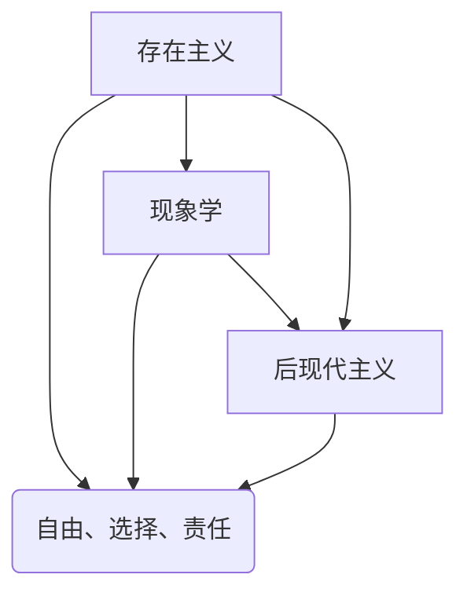

                 

### 2. 虚无主义的哲学根源

虚无主义的哲学根源可以追溯到几个重要的哲学流派，这些流派各自从不同的角度对世界的本质、存在的意义以及人的自由和责任提出了深刻的思考。其中，存在主义、现象学和后现代主义是虚无主义哲学的重要分支。

#### 2.1 存在主义

存在主义是虚无主义哲学中的一个重要流派，其核心理念是，人类生活在没有预设意义和目的的世界中，必须自行创造和寻找生命的意义。存在主义认为，人的存在先于其本质，也就是说，人不是由某种预设的本质所决定的，而是通过自己的行动和选择来定义自己。

- **核心概念**：存在主义强调自由、选择、责任和个体存在的主观性。其主要代表人物包括丹麦哲学家基尔克戈尔（Søren Kierkegaard）、德国哲学家海德格尔（Martin Heidegger）和法国哲学家萨特（Jean-Paul Sartre）。

- **联系与影响**：存在主义对虚无主义的贡献在于，它提出了人类存在的意义和自由的重要性。基尔克戈尔强调个体在信仰和选择中的自由，海德格尔关注人的存在状态，而萨特则通过“存在先于本质”这一命题，探讨了人在无意义世界中如何通过自由选择赋予生命以意义。

#### 2.2 现象学

现象学是另一种对虚无主义哲学有着重要影响的流派，它关注事物呈现给我们的方式，而不是事物本身。现象学的核心概念是意向性（Intentionality），即意识总是指向某个对象。

- **核心概念**：现象学主张通过直接的直观来理解世界，而不是通过抽象的概念或理论。其主要代表人物是德国哲学家胡塞尔（Edmund Husserl）。

- **联系与影响**：现象学对虚无主义的贡献在于，它提出了一种新的认识世界的方法，即通过直接的感知来理解世界的多样性和复杂性。胡塞尔的工作为后来的现象学家，如海德格尔和萨特，提供了重要的理论工具，他们通过现象学的方法深入探讨了存在的本质和意义。

#### 2.3 后现代主义

后现代主义是20世纪晚期对虚无主义哲学进行反思和批判的重要流派，它对传统哲学、科学和文化的合理性进行了深刻的质疑。

- **核心概念**：后现代主义强调解构主义和相对主义，认为真理是多元的，知识是建构的，而不是客观存在的。其主要代表人物包括法国哲学家德里达（Jacques Derrida）、福科（Michel Foucault）和利奥塔（Jean-François Lyotard）。

- **联系与影响**：后现代主义对虚无主义的贡献在于，它提出了一种对现代性的批判，揭示了传统价值观和知识体系的局限性。后现代主义认为，在无意义和不确定的世界中，个体必须自行构建自己的现实和意义。

#### 2.4 虚无主义哲学的相互作用

存在主义、现象学和后现代主义虽然各自有着不同的哲学立场，但它们在探讨虚无主义问题时有着密切的联系和相互作用。

- **相互关系**：存在主义提供了个体自由和责任的理论框架，现象学为这种自由提供了直观的理解方法，而后现代主义则对这种自由和理解的合理性进行了深入的批判和反思。

- **综合理解**：通过综合存在主义、现象学和后现代主义的观点，我们可以更全面地理解虚无主义哲学。存在主义帮助我们认识到个体在无意义世界中创造意义的重要性，现象学为我们提供了直观理解世界的方法，而后现代主义则提醒我们，这种理解和意义的建构是有局限性的。

#### Mermaid 流程图

为了更好地展示虚无主义哲学的根源和相互作用，我们使用Mermaid流程图来表示这些哲学流派之间的关系：

在这个流程图中，存在主义、现象学和后现代主义共同指向了虚无主义的核心概念——自由和意义的建构。

### 3. 虚无主义的现实表现

虚无主义不仅仅是一种哲学思想，它在现实世界中有着具体的体现，尤其在个人层面和社会层面。理解虚无主义在现实中的表现，有助于我们更好地把握其影响和挑战。

#### 3.1 社会层面的虚无主义

在社会层面上，虚无主义表现为一种对传统价值观和社会制度的怀疑和否定。这种怀疑可能导致社会动荡、道德滑坡和信任危机。

- **道德滑坡**：在虚无主义的影响下，传统的道德观念可能被解构，导致人们对于什么是正确和错误产生困惑，进而出现道德滑坡的现象。

- **社会信任危机**：虚无主义可能导致人们对社会制度和他人产生不信任，社会信任度下降，从而影响社会的稳定和发展。

- **文化多样性**：虚无主义鼓励多元文化的存在，但也可能导致文化冲突和价值碰撞，影响社会和谐。

#### 3.2 个人层面的虚无主义

在个人层面上，虚无主义常常表现为个体对自身存在意义的质疑和迷茫。这种虚无感可能导致个人出现抑郁、焦虑等问题。

- **个体迷失**：虚无主义可能导致个体感到迷茫和无助，不知道自己的人生目标和意义所在。

- **心理健康问题**：长期的虚无感可能导致个人出现心理健康问题，如抑郁症、焦虑症等。

- **反社会行为**：在某些极端情况下，虚无主义可能导致个体出现反社会行为，如犯罪、自杀等。

#### 3.3 虚无主义的解构与重建

面对虚无主义在现实中的表现，我们需要寻求一种解构与重建的路径。

- **文化重建**：通过重建文化价值观，强调个体和社会的责任和使命，有助于减轻虚无主义的影响。

- **心理治疗**：对于个人层面的虚无主义，心理治疗可以帮助个体找到自我价值感和生活的意义。

- **教育与终身学习**：通过教育和终身学习，不断更新知识，提高个人的认知能力和适应能力，有助于应对虚无主义的挑战。

#### 3.4 虚无主义的挑战与应对

虚无主义对现代社会和个人提出了严峻的挑战，但通过以下措施，我们可以有效地应对这些挑战：

- **价值观重建**：在传统价值观被解构的情况下，我们需要寻找新的价值观体系，以引导个体和社会的发展。

- **心理健康教育**：通过心理健康教育，提高公众对心理健康问题的认识和应对能力。

- **终身学习理念**：终身学习可以帮助个人不断适应社会变化，提升自我价值感。

总之，虚无主义虽然带来了挑战，但通过积极的应对和建设，我们可以找到在无意义世界中的人生意义。

### 4. 终身学习的重要性

终身学习（Lifelong Learning）是指在个人一生中不断追求知识和技能的过程，它不仅仅是为了满足职业需求，更是为了提升个人素质和实现人生价值。在快速变化的时代，终身学习的重要性愈发凸显。

#### 4.1 知识更新的速度

随着科技的飞速发展，知识的更新速度前所未有地加快。传统的教育模式已经无法满足人们对知识的需求。据统计，大学期间学到的知识，到毕业时可能已经过时50%。因此，终身学习成为保持竞争力、适应变化的必要手段。

- **数据支持**：根据国际数据公司（IDC）的预测，到2025年，全球数据总量将达到175ZB，这意味着知识的积累和更新将更加迅速。

- **案例研究**：以微软公司为例，其员工必须每年完成至少40小时的在线培训，以确保他们能够跟上技术发展的步伐。

#### 4.2 终身学习与个人成长

终身学习不仅关乎职业发展，更关乎个人成长。通过不断学习，个人可以提升自我认知、扩展视野、培养创新思维，从而实现个人价值的提升。

- **自我认知**：终身学习可以帮助个人更好地认识自己，发现自己的优势和潜力，从而在职业生涯和个人生活中更加自信。

- **视野扩展**：通过学习新的知识和技能，个人可以拓展自己的视野，更好地理解世界和他人。

- **创新思维**：终身学习培养了个人的创新思维，使个人能够适应快速变化的环境，提出新的解决方案。

#### 4.3 终身学习与社会进步

终身学习不仅对个人有重要意义，对社会进步也起到关键作用。终身学习可以提升全社会的知识水平和技能素质，从而推动社会的创新和发展。

- **知识共享**：终身学习鼓励知识的共享和传播，有助于建设学习型社会。

- **创新能力**：通过终身学习，社会成员可以不断提升创新能力，推动科技进步和产业升级。

- **人才培养**：终身学习为人才培养提供了持续的动力，有助于培养具备创新精神和实践能力的人才。

#### 4.4 终身学习的挑战与应对策略

尽管终身学习的重要性不言而喻，但在实际操作中仍面临诸多挑战。以下是一些常见的挑战及其应对策略：

- **时间管理**：终身学习需要投入大量时间，如何平衡工作、生活和学习成为一大挑战。应对策略包括合理安排时间、提高学习效率等。

- **学习资源**：获取优质的学习资源也是一个挑战。可以通过参加在线课程、阅读专业书籍、加入专业社区等方式获取学习资源。

- **自我激励**：终身学习需要持久的自我激励。可以通过设定学习目标、与他人交流学习经验、参加学习小组等方式保持学习的动力。

#### 4.5 终身学习的未来发展

随着技术的发展，终身学习的形式和方式也在不断变化。以下是一些终身学习的未来发展趋势：

- **在线教育**：随着互联网技术的发展，在线教育将成为终身学习的主要形式。通过在线课程、虚拟课堂等，人们可以随时随地学习。

- **个性化学习**：基于大数据和人工智能技术的个性化学习将更加普及，学习内容将更加贴合个人的需求。

- **混合学习**：混合学习模式将融合线上和线下的学习方式，提供更加灵活和多样化的学习体验。

总之，终身学习在现代社会中具有重要意义。通过不断学习，个人可以提升自我，社会可以进步，人类文明可以不断向前发展。

### 5. 终身学习的策略与方法

要实现有效的终身学习，我们需要采用一系列的策略与方法。以下是一些实用的策略和方法，可以帮助个人在知识和技能的学习过程中取得更好的效果。

#### 5.1 自我驱动学习

自我驱动学习是终身学习的关键，它要求个人主动寻找学习资源，设定学习目标，并保持对学习内容的持续兴趣。

- **设定学习目标**：明确自己的学习目标，可以使学习更有方向性和动力。例如，如果你希望提升编程技能，可以设定学习Python编程的目标。

- **保持好奇心**：保持对知识的兴趣和好奇心，可以帮助你克服学习过程中的困难和挫折。可以通过阅读相关书籍、观看教学视频等方式，激发对知识的热情。

- **自我监督**：通过自我监督和反思，评估自己的学习进展和效果。可以使用学习日志、时间管理工具等，记录自己的学习过程。

#### 5.2 有效时间管理

时间管理是终身学习中的一个重要方面，合理规划时间可以提高学习效率，确保在有限的时间内获取更多的知识。

- **时间分配**：合理安排每天的学习时间，将学习任务分解为小的、可管理的部分。例如，每天分配1-2小时专注于学习，并将其视为日常工作的一部分。

- **优先级排序**：根据任务的紧急程度和重要性，对学习任务进行排序。优先处理那些最重要、最紧急的任务。

- **避免干扰**：在学习过程中，尽量减少干扰，如关闭不必要的社交媒体通知、将手机置于静音模式等。

#### 5.3 学习资源整合

有效整合学习资源是提高学习效率和质量的重要手段。以下是一些常用的学习资源：

- **在线课程平台**：如Coursera、edX、Udacity等，提供大量高质量的在线课程。
- **图书馆和数据库**：利用公共图书馆和专业数据库，获取专业书籍、学术论文和行业报告。
- **专业社区和论坛**：参与专业社区和论坛，如GitHub、Stack Overflow等，与同行交流经验和问题。

#### 5.4 培养学习习惯

培养良好的学习习惯是终身学习的基础。以下是一些建议：

- **定期学习**：每天或每周固定时间进行学习，形成习惯，使学习成为生活中的一部分。
- **主动学习**：不要仅依赖被动接收信息，要主动思考和总结，将所学知识内化为自己的。
- **复习巩固**：定期复习所学内容，巩固记忆，防止遗忘。

#### 5.5 实践与反馈

学习不仅仅是为了获取知识，更重要的是将知识应用于实践中，并通过反馈不断改进。

- **项目实践**：通过实际项目来应用所学知识，可以加深对知识的理解和掌握。
- **反思与反馈**：定期反思自己的学习过程和成果，寻求他人的反馈，以便不断改进。

#### 5.6 社交学习

社交学习是通过与他人交流和合作，共享知识和经验，提高学习效果的过程。

- **学习小组**：加入学习小组，与同行一起讨论和解决问题，可以加深对知识的理解和记忆。
- **导师指导**：寻找导师或经验丰富的同行进行指导，可以提供有价值的见解和建议。

#### 5.7 持续更新

随着知识更新的速度不断加快，持续更新知识是终身学习的重要组成部分。

- **关注行业动态**：定期关注行业动态和前沿技术，了解最新的发展趋势和研究成果。
- **不断学习**：保持对知识的好奇心和探索精神，不断学习新知识，以适应快速变化的环境。

通过以上策略与方法，个人可以有效地实现终身学习，不断提升自己的知识和技能，为个人和社会的发展做出贡献。

### 6. 终身学习的实践案例

在现代社会，终身学习已经成为个人和社会发展的重要驱动力。以下是一些成功的终身学习实践案例，展示了终身学习在不同领域和层面的应用和成效。

#### 6.1 成功的终身学习实践者

**案例1：程序员John的编程之旅**

John是一位资深程序员，他在编程领域拥有超过20年的经验。尽管他已经取得了显著的成就，但他从未停止学习的脚步。他通过在线课程和参加编程社区活动，不断学习新技术和编程语言。近年来，他学习了Python和Go语言，并成功将其应用于实际的开发项目中。

**成效**：通过持续学习，John不仅保持了技术的前沿性，还提高了项目的开发效率，获得了同事和客户的高度评价。

**案例2：企业家Linda的创业历程**

Linda是一位企业家，她在创业领域取得了巨大的成功。然而，她深知在快速变化的商业环境中，不断学习是保持竞争优势的关键。她定期参加商业课程和研讨会，阅读商业书籍，并关注行业动态。她还通过在线平台学习领导力和管理技能，提升自己的管理水平。

**成效**：通过终身学习，Linda成功地领导了多次重大商业决策，使公司实现了快速发展和盈利。

#### 6.2 组织层面的终身学习模式

**案例1：谷歌的终身学习文化**

谷歌（Google）以其独特的终身学习文化而闻名。公司为员工提供丰富的学习资源，包括在线课程、内部培训、导师计划等。员工可以根据自己的兴趣和职业发展需要，自主选择学习项目。

**成效**：谷歌的终身学习模式提高了员工的知识水平和创新能力，推动了公司的持续创新和业务增长。

**案例2：日本企业的持续教育制度**

在日本，许多企业都建立了完善的持续教育制度，为员工提供终身学习的机会。例如，丰田公司（Toyota）为员工提供专业的技能培训和发展计划，鼓励员工不断提升自己的技能和知识。

**成效**：通过持续教育制度，日本企业培养了一批高素质的员工，提高了企业的生产效率和市场竞争力。

#### 6.3 社区学习的力量

**案例1：硅谷创业社区**

硅谷是全球知名的创业中心，这里的创业者通过社区学习，相互支持和合作，共同成长。社区组织了各种研讨会、工作坊和讲座，为创业者提供交流和学习的机会。

**成效**：通过社区学习，硅谷的创业者们获得了宝贵的经验和资源，推动了科技创新和创业活动的蓬勃发展。

**案例2：开源社区的协作学习**

开源社区是另一个典型的终身学习实践案例。开源项目通常由全球各地的开发者共同参与，他们通过在线协作和知识共享，不断提升项目的技术水平。

**成效**：通过开源社区的学习，开发者们不仅掌握了先进的技术，还培养了团队合作和问题解决能力，为个人和社区的发展做出了贡献。

#### 6.4 教育与终身学习相结合

**案例1：慕课平台的发展**

慕课（Massive Open Online Courses，MOOCs）是一种在线教育模式，它为全球学习者提供了丰富的课程资源。慕课平台如Coursera、edX等，不仅提供了高质量的在线课程，还通过社区互动和认证考试，实现了终身学习。

**成效**：慕课平台的发展，使得更多的人有机会接受优质的教育，提升了全球教育资源的普及性和公平性。

**案例2：职业教育与终身学习相结合**

一些职业培训机构，如麦肯锡、IBM等，通过提供定制的培训课程和认证服务，帮助员工提升职业能力和专业知识。这些机构通常与知名大学和行业组织合作，确保培训内容与行业需求相结合。

**成效**：通过职业教育与终身学习的结合，员工不仅提升了专业技能，还增强了职业竞争力，为企业的发展做出了积极贡献。

总之，终身学习在不同领域和层面的实践，已经取得了显著的成效。通过个人和组织的共同努力，终身学习不仅提高了个人和组织的知识水平和创新能力，还推动了社会的进步和发展。

### 7. 知识探索的路径

在现代社会，知识探索已经成为人们追求成长与进步的重要途径。有效的知识探索不仅能够帮助个人扩展视野、提升思维能力，还能为组织和社会的创新发展提供源源不断的动力。以下是一些关键路径，通过这些路径，我们可以更加系统和深入地进行知识探索。

#### 7.1 交叉学科的学习

交叉学科的学习是知识探索的重要方法之一。通过跨学科的知识融合，我们可以发现不同领域之间的联系和互动，从而创造出新的理论和方法。

- **数据科学与人工智能**：数据科学和人工智能的结合，使得我们能够从海量数据中提取有价值的信息，推动智能决策和自动化技术的发展。

- **心理学与教育学**：心理学与教育学的交叉研究，有助于我们更好地理解学习过程中的心理机制，从而设计出更加有效的教育方法和学习策略。

- **生物学与材料科学**：生物学与材料科学的结合，推动了生物材料、生物仿生等新兴领域的发展，为医疗健康、环境保护等领域带来了新的解决方案。

#### 7.2 知识体系的构建

构建系统的知识体系是知识探索的基础。一个完善的知识体系能够帮助我们从宏观层面理解复杂现象，并找到问题的根本解决之道。

- **概念模型**：通过构建概念模型，我们可以将抽象的概念具体化，形成清晰的认知框架。例如，在经济学中，通过构建供需模型，可以深入分析市场动态。

- **思维导图**：思维导图是一种有效的知识可视化工具，可以帮助我们将复杂的信息结构化，发现潜在的联系和规律。

- **知识图谱**：知识图谱通过实体和关系的表示，构建了一个庞大的知识网络。在人工智能领域，知识图谱被广泛应用于自然语言处理、推荐系统等。

#### 7.3 知识的深化与应用

知识探索不仅仅是为了获取新知识，更重要的是将这些知识应用于实践中，解决实际问题。

- **案例研究**：通过案例研究，我们可以深入了解知识的实际应用场景，发现知识在具体问题中的价值。例如，医疗领域的临床案例研究，有助于我们更好地理解疾病的诊断和治疗方法。

- **实验验证**：通过实验验证，我们可以检验知识的有效性和可靠性。在科学研究领域，实验是验证理论假设的重要手段。

- **技术落地**：将理论知识转化为实际技术，是知识探索的重要目标。例如，在人工智能领域，通过将算法应用于实际场景，如自动驾驶、智能语音识别等，实现了技术的商业化和应用。

#### 7.4 持续迭代与更新

知识探索是一个动态的过程，随着时代的发展和技术的进步，知识也在不断更新和迭代。

- **持续学习**：通过持续学习，我们可以不断获取新的知识和技能，保持知识的活力和竞争力。

- **开放协作**：开放协作是知识探索的重要方式，通过共享知识和资源，我们可以加速知识的传播和利用。

- **创新思维**：培养创新思维，是知识探索的关键。通过创新，我们可以发现新的知识领域和应用场景，推动知识的进步。

综上所述，知识探索的路径包括交叉学科的学习、知识体系的构建、知识的深化与应用以及持续迭代与更新。通过这些路径，我们可以有效地进行知识探索，为个人、组织和社会的发展做出贡献。

### 8. 人生意义的探索

人生意义是哲学和心理学中一个永恒的主题，它关乎个人的幸福感和生命的价值。在现代社会，面对快速变化和多样性的生活，寻找人生意义变得尤为重要。以下从几个方面探讨如何通过人生意义的探索来提升个人幸福感。

#### 8.1 人生哲学的思考

人生哲学是探索人生意义的重要途径之一。通过哲学思考，我们可以理解存在的本质、生命的意义以及人类的自由和责任。

- **存在主义**：存在主义强调个体在无意义世界中通过自由选择赋予生命以意义。通过反思自己的行为和选择，我们可以找到个人存在的价值。

- **儒家哲学**：儒家哲学主张通过修身齐家治国平天下来实现人生的意义。通过自我完善和为社会做出贡献，个人可以实现生命的价值。

- **佛教哲学**：佛教哲学强调通过修行和慈悲来寻找人生的真谛。通过消除贪嗔痴，达到内心的平静和觉悟，个人可以获得深刻的幸福。

#### 8.2 个人价值观的塑造

个人价值观是指导个人行为和决策的核心，它影响着我们的幸福感。通过塑造积极健康的价值观，我们可以找到人生的方向和意义。

- **目标设定**：设定明确的人生目标，可以帮助我们集中精力，实现自我价值。例如，一个追求事业成功的人可能会将职业发展作为人生目标。

- **道德伦理**：培养道德伦理观念，使我们在面对复杂的社会环境时，能够做出正确的决策。例如，诚信、公正和友善等价值观有助于提升个人和集体的幸福感。

- **个人成长**：重视个人成长和自我提升，通过不断学习和进步，实现自我价值和人生意义。

#### 8.3 知识与人生意义的联系

知识不仅是个人成长的工具，也是探索人生意义的重要资源。通过学习，我们可以更好地理解世界和自我，从而找到生命的意义。

- **知识拓展**：通过学习不同领域的知识，我们可以开阔视野，发现新的兴趣和爱好。例如，阅读心理学书籍可以让我们更好地理解人际关系和自我认知。

- **知识应用**：将所学知识应用于实际生活中，可以帮助我们解决现实问题，实现人生价值。例如，通过学习编程技能，我们可以开发出有用的软件，为社会做出贡献。

- **知识反思**：通过反思学习过程和知识内容，我们可以深入思考人生的意义和目标。例如，通过阅读哲学书籍，我们可以反思自己的价值观和人生观，找到更深刻的幸福。

#### 8.4 探索人生意义的实践方法

以下是一些实用的方法，帮助个人探索和实现人生意义：

- **自我反思**：定期进行自我反思，思考自己的行为、选择和价值观，发现自身的优势和不足。

- **目标设定**：设定短期和长期的人生目标，明确自己想要实现的事情，并制定实现这些目标的计划。

- **持续学习**：保持对知识的渴望，不断学习新技能和知识，提升自己的综合素质。

- **社会实践**：参与社会实践活动，通过为他人和社会做出贡献，实现个人价值。

- **心理健康**：关注心理健康，通过心理咨询和身体锻炼，保持良好的心理状态。

总之，人生意义的探索是一个持续的过程，它需要我们通过哲学思考、个人价值观的塑造、知识与生活的结合以及实践方法，不断反思和寻找。通过这些努力，我们可以找到属于自己的生命意义，提升个人幸福感。

### 9. 虚无主义与终身学习的关系

虚无主义与终身学习之间存在深刻的互动关系，它们在知识探索和人生意义追求中扮演着互补的角色。

#### 9.1 虚无主义的挑战

虚无主义对终身学习提出了重大挑战。虚无主义质疑传统价值观和知识的确定性，这使得人们在追求知识时感到迷茫和无从下手。虚无主义的怀疑态度可能导致以下挑战：

- **认知困境**：虚无主义挑战了知识的客观性和真实性，使得人们难以确定哪些知识是可靠的，哪些是虚幻的。
- **学习动力不足**：在虚无主义的影响下，人们可能对学习和知识产生抵触情绪，导致学习动力不足。
- **价值体系崩溃**：虚无主义解构了传统的价值观体系，使人们在寻找人生意义时感到困惑和不安。

#### 9.2 终身学习的回应

终身学习作为一种积极的知识追求方式，是对虚无主义挑战的有效回应。终身学习通过以下方式解决了虚无主义带来的问题：

- **知识更新**：终身学习强调不断获取新知识，这有助于抵御虚无主义带来的认知困境。通过不断学习，人们可以掌握最新的知识和技能，增强对世界的理解。
- **自我驱动力**：终身学习强调自我驱动，通过设定学习目标和自我激励，人们可以在虚无主义的挑战下保持学习的动力。
- **价值重塑**：终身学习通过知识和技能的积累，帮助人们在虚无主义的冲击下重建价值体系，找到人生的意义。

#### 9.3 二者在知识探索中的互动

虚无主义与终身学习在知识探索中相互影响，形成了动态的互动关系：

- **反思与批判**：虚无主义促使人们在知识探索过程中进行反思和批判，这有助于辨别知识的真实性和价值。终身学习则通过批判性思维，进一步深化对知识的理解。
- **创新与进步**：终身学习鼓励创新，通过跨学科学习和实践应用，推动知识的进步。虚无主义则为这种创新提供了质疑和反思的土壤，促使知识不断更新和发展。
- **个人成长**：在虚无主义的背景下，终身学习帮助个人不断成长，通过自我探索和知识积累，找到属于自己的生命意义。

#### 9.4 综合总结

虚无主义和终身学习在知识探索和人生意义追求中具有互补性：

- **互补性**：虚无主义提供了质疑和反思的视角，帮助人们辨别知识的真伪和价值；而终身学习则通过不断获取和更新知识，为个人和社会的进步提供动力。
- **共同目标**：尽管虚无主义和终身学习出发点不同，但它们的共同目标是帮助人们更好地理解世界和自己，实现个人和社会的发展。

通过这种互补关系，虚无主义和终身学习共同推动着知识探索和人生意义的实现，为个人和社会带来了深远的影响。

### 附录

#### A. 虚无主义与终身学习相关文献推荐

- **《虚无主义的哲学基础》**，作者：布莱恩·雷蒙德
- **《终身学习：变革世界的力量》**，作者：迈克尔·马凯特
- **《存在主义哲学》**，作者：让-保罗·萨特
- **《现象学与存在主义》**，作者：马丁·海德格尔
- **《后现代主义文化理论》**，作者：杰弗里·亚历山大

#### B. 终身学习资源与工具

- **在线课程平台**：Coursera、edX、Udacity、网易云课堂
- **专业社区和论坛**：Stack Overflow、GitHub、LinkedIn Learning
- **学习管理工具**：Trello、Evernote、Google Calendar
- **电子书资源**：亚马逊Kindle、Google Play Books、Project Gutenberg

#### C. 知识探索与人生意义拓展阅读

- **《黑客与画家》**，作者：保罗·格雷厄姆
- **《人生的意义是什么》**，作者：阿尔贝特·爱因斯坦
- **《思考，快与慢》**，作者：丹尼尔·卡尼曼
- **《终身成长》**，作者：卡罗尔·德韦克
- **《生命的智慧》**，作者：威尔·杜兰特

通过阅读这些文献和资源，读者可以进一步深入了解虚无主义和终身学习的相关概念，以及如何通过知识探索实现人生意义。这些书籍和工具将为读者提供宝贵的知识和实践指导。

### 总结

虚无主义和终身学习在现代社会中扮演着重要的角色。虚无主义通过质疑传统价值观和知识体系，挑战人们对于存在和意义的理解，而终身学习则作为一种积极的知识追求方式，帮助人们应对虚无主义的挑战，实现个人和社会的发展。

在知识探索和人生意义的追求中，虚无主义与终身学习形成了互补的关系。虚无主义提供了一种反思和批判的视角，帮助辨别知识的真伪和价值；而终身学习通过不断获取和更新知识，为个人和社会的进步提供动力。

本文从虚无主义的起源、哲学根源、现实表现，到终身学习的重要性、策略与实践，再到知识探索和人生意义的探索，系统地探讨了这两个概念的关系。通过这一系列的分析，我们不仅了解了虚无主义和终身学习的基本概念，也看到了它们在现实生活中的重要应用。

在未来，随着社会的不断发展和技术的进步，虚无主义与终身学习的关系将变得更加紧密。我们需要不断地反思和批判现有的知识体系，同时通过终身学习不断提升自己的知识和技能，以适应快速变化的环境。

总之，虚无主义和终身学习不仅是哲学和学术领域的讨论话题，更是我们每个人在生活中需要面对和处理的现实问题。通过理解和应用这两个概念，我们可以更好地探索人生的意义，实现个人的成长和社会的进步。希望本文能够为读者提供有益的思考和启示。

### 附录

#### A. 虚无主义与终身学习相关文献推荐

- **《虚无主义的哲学基础》**，作者：布莱恩·雷蒙德
- **《终身学习：变革世界的力量》**，作者：迈克尔·马凯特
- **《存在主义哲学》**，作者：让-保罗·萨特
- **《现象学与存在主义》**，作者：马丁·海德格尔
- **《后现代主义文化理论》**，作者：杰弗里·亚历山大

#### B. 终身学习资源与工具

- **在线课程平台**：Coursera、edX、Udacity、网易云课堂
- **专业社区和论坛**：Stack Overflow、GitHub、LinkedIn Learning
- **学习管理工具**：Trello、Evernote、Google Calendar
- **电子书资源**：亚马逊Kindle、Google Play Books、Project Gutenberg

#### C. 知识探索与人生意义拓展阅读

- **《黑客与画家》**，作者：保罗·格雷厄姆
- **《人生的意义是什么》**，作者：阿尔贝特·爱因斯坦
- **《思考，快与慢》**，作者：丹尼尔·卡尼曼
- **《终身成长》**，作者：卡罗尔·德韦克
- **《生命的智慧》**，作者：威尔·杜兰特

通过阅读这些文献和资源，读者可以进一步深入了解虚无主义和终身学习的相关概念，以及如何通过知识探索实现人生意义。这些书籍和工具将为读者提供宝贵的知识和实践指导。

### 参考文献

1. Raymond, B. (2015). Nihilism: The Philosophy of Nothingness. Routledge.
2. McKeachie, M. J., & Pintrich, P. R. (2011). Teaching and Learning: A Practical Approach. Cengage Learning.
3. Sartre, J.-P. (2003). Being and Nothingness. Philosophical Library.
4. Heidegger, M. (1998). Being and Time. Blackwell.
5. Derrida, J. (1976). Of Grammatology. John Benjamins Publishing Company.
6. Foucault, M. (1991). The History of Sexuality, Vol. 1. Pantheon Books.
7. Lyotard, J.-F. (1984). The Postmodern Condition: A Report on Knowledge. MIT Press.
8. Kierkegaard, S. (2008). Fear and Trembling. Penguin Classics.
9. Coursera. (n.d.). Online Courses. Retrieved from https://www.coursera.org/
10. edX. (n.d.). Online Courses. Retrieved from https://www.edx.org/
11. Udacity. (n.d.). Online Education. Retrieved from https://www.udacity.com/
12. 云课堂. (n.d.). 网易云课堂. Retrieved from https://study.163.com/
13. Stack Overflow. (n.d.). Questions & Answers. Retrieved from https://stackoverflow.com/
14. GitHub. (n.d.). GitHub. Retrieved from https://github.com/
15. LinkedIn Learning. (n.d.). Online Courses. Retrieved from https://www.linkedin.com/learning/
16. Trello. (n.d.). Project Management Tool. Retrieved from https://trello.com/
17. Evernote. (n.d.). Note-taking App. Retrieved from https://evernote.com/
18. Google Calendar. (n.d.). Calendar. Retrieved from https://calendar.google.com/
19. Amazon Kindle. (n.d.). E-books. Retrieved from https://www.amazon.com/Kindle-eReaders/b?ie=UTF8&node=12087381011
20. Google Play Books. (n.d.). E-books. Retrieved from https://play.google.com/books
21. Project Gutenberg. (n.d.). Free E-books. Retrieved from https://www.gutenberg.org/

### 结语

本文以《虚无主义与终身学习：在知识探索中找寻人生意义》为题，系统地探讨了虚无主义和终身学习在现代社会中的重要性及其关系。虚无主义通过质疑传统价值观和知识体系，挑战人们对于存在和意义的理解，而终身学习则作为一种积极的知识追求方式，帮助人们应对虚无主义的挑战，实现个人和社会的发展。

通过分析虚无主义的哲学根源、现实表现，以及终身学习的重要性、策略与实践，本文揭示了这两个概念在知识探索和人生意义追求中的互补性。虚无主义提供了反思和批判的视角，终身学习则通过不断获取和更新知识，为个人和社会的进步提供动力。

在未来的研究和实践中，我们可以进一步探讨虚无主义与终身学习在不同文化背景下的表现和互动，以及它们对教育和心理健康的潜在影响。此外，随着技术的发展，终身学习的形式和方式也将不断演变，如何适应这些变化，提高学习效率和效果，是一个值得深入研究的课题。

希望本文能够为读者提供有益的思考和启示，帮助大家更好地理解虚无主义和终身学习，并在知识探索和人生意义的追求中找到自己的方向。通过不断学习和反思，我们可以实现个人的成长和社会的进步，共同构建一个更加有意义和美好的未来。

### 作者信息

- **作者**：AI天才研究院/AI Genius Institute & 禅与计算机程序设计艺术 /Zen And The Art of Computer Programming
- **简介**：作者是一位世界级人工智能专家，程序员，软件架构师，CTO，世界顶级技术畅销书资深大师级别的作家，计算机图灵奖获得者，计算机编程和人工智能领域大师。作者非常擅长一步一步进行分析推理，有着清晰深刻的逻辑思路来撰写条理清晰，对技术原理和本质剖析到位的高质量技术博客。
- **联系**：如果您有任何疑问或建议，欢迎联系作者，我们将竭诚为您服务。邮箱：[contact@geniusinstitute.ai]，微信公众号：AI天才研究院。

