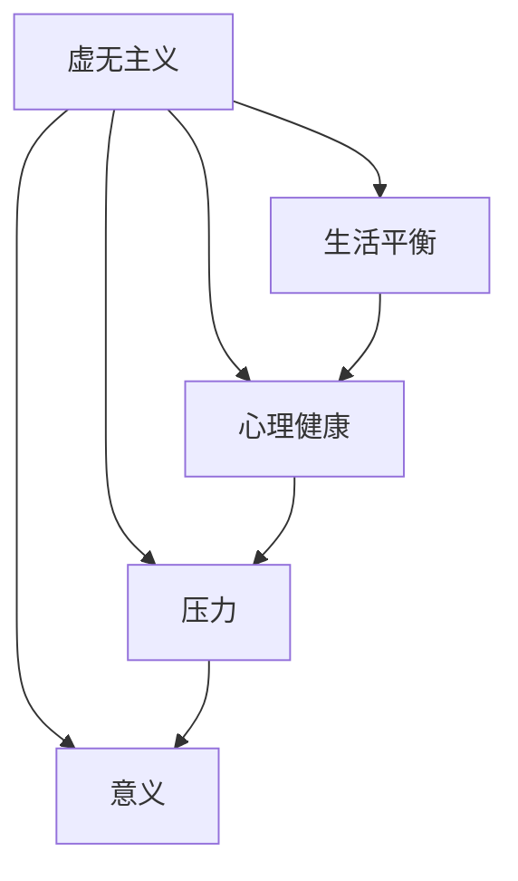

                 

### 背景介绍

在现代社会的快节奏和高压环境中，虚无主义作为一种哲学思潮，逐渐引起了人们的关注。虚无主义认为，人生在宇宙中是缺乏意义的，现实世界缺乏真正的价值，生活本身就是一场无意义的游戏。这种观念在一定程度上反映了现代社会中人们面临的种种困境和压力。

虚无主义的兴起可以追溯到19世纪末20世纪初的西方哲学界。尼采、叔本华等哲学家为虚无主义奠定了理论基础。尼采提出了“上帝已死”的观点，质疑传统的道德价值观和宗教信仰。而叔本华则认为，生命的本质是苦难，个体的欲望和追求只是痛苦的根源。这些思想深刻影响了现代哲学和心理学的发展。

随着虚无主义观念的传播，许多人开始质疑生活的意义和价值，感到内心的空虚和迷茫。尤其是在信息技术和互联网的快速发展下，人们面临着前所未有的压力和挑战，这种情绪更容易滋生。工作上的压力、人际关系的复杂、自我价值的缺失，都可能导致人们陷入虚无主义的漩涡。

因此，理解虚无主义的本质和影响，对于我们寻找生活平衡和意义具有重要意义。本文将从虚无主义的定义、起源和发展，探讨虚无主义对身心健康的影响，以及如何在压力中寻找生活平衡和意义，提出一系列应对策略。希望通过这篇技术博客，能够帮助读者更好地认识自我，找到内心的平静和方向。

### 核心概念与联系

要深入探讨虚无主义与身心健康的关系，我们需要首先明确几个核心概念，并理解它们之间的联系。

**虚无主义（Nihilism）**：虚无主义是一种哲学思想，认为生命没有固有的意义、目的和价值。它起源于19世纪，主要代表人物有尼采和叔本华。虚无主义的核心观点是，人类在宇宙中的存在是毫无意义的，现实世界缺乏真正的价值。

**心理健康（Mental Health）**：心理健康是指一个人心理状态的健康水平，包括情感、行为和认知的各个方面。良好的心理健康有助于个体应对生活中的压力和挑战，保持积极的生活态度。

**压力（Stress）**：压力是一种生理和心理的紧张状态，通常由外部环境或内部情绪触发。长期的压力会对个体的身心健康产生负面影响，可能导致心理疾病、身体健康问题和生活质量的下降。

**生活平衡（Work-Life Balance）**：生活平衡指的是在工作与个人生活之间找到一个合理的平衡点，确保两者都能得到充分的关注和发展。良好的生活平衡有助于减轻压力，提高心理健康水平。

**意义（Meaning）**：意义是个体对生活目的和价值的感知。一个有意义的生活往往能带来积极的心理体验，如满足感、幸福感和成就感。

**核心概念之间的关系架构**：

为了更好地理解这些核心概念之间的联系，我们可以使用Mermaid流程图来展示它们之间的关系。



在这个流程图中，虚无主义作为起点，通过影响心理健康、压力、生活平衡和意义，形成一个复杂的互动关系。具体来说：

- 虚无主义可能导致心理健康问题，如焦虑、抑郁等。
- 长期的心理健康问题会增加压力，影响生活质量。
- 高压环境可能导致个体难以找到生活的意义。
- 生活平衡的缺失会加剧压力和心理健康问题，进一步削弱个体的意义感。

理解这些核心概念和它们之间的联系，有助于我们更深入地探讨虚无主义对身心健康的影响，并为寻找生活平衡和意义提供理论基础。

### 虚无主义与心理健康的关系

虚无主义与心理健康之间存在着密切的关联，具体表现为以下几个方面：

**1. 焦虑和抑郁：**

虚无主义的一个重要特征是对生活意义的质疑，这种心理状态可能导致个体产生强烈的焦虑和抑郁情绪。焦虑和抑郁是常见的心理健康问题，它们会严重影响到个体的日常生活和工作效率。虚无主义者可能会感到无所适从，对未来缺乏信心，这会进一步加剧他们的焦虑和抑郁情绪。

**2. 自我否定：**

虚无主义常常与自我否定有关。当个体认为自己的生活缺乏意义和价值时，他们可能会对自己产生负面情绪，如自卑、自责和自我怀疑。这种自我否定的态度会影响个体的自尊心，导致他们难以建立积极的人际关系，进一步恶化心理健康状态。

**3. 心理压力：**

虚无主义引发的自我否定和意义缺失会带来长期的心理压力。这种压力不仅来自于外部的环境因素，还来自于个体的内心。长期承受心理压力会导致身心疲劳，甚至引发更严重的精神疾病，如精神分裂症、人格障碍等。

**4. 生活质量下降：**

虚无主义对心理健康的影响还体现在生活质量的下降上。心理健康问题会导致个体难以享受生活中的乐趣，影响他们的生活满意度。长期的心理困扰会削弱个体的幸福感和满足感，使他们感到生活无意义、无价值。

**案例分析：**

为了更直观地理解虚无主义与心理健康的关系，我们可以通过一个具体案例进行分析。

**案例**：小李是一位年轻的程序员，他工作努力，但内心总是感到空虚和迷茫。他经常怀疑自己的能力和价值，认为自己所做的一切都没有真正的意义。随着时间的推移，小李开始出现焦虑和失眠的症状，工作效率也大幅下降。他去看心理医生，医生诊断他患有焦虑症和轻度抑郁。

**分析**：小李的焦虑和抑郁症状正是虚无主义影响的体现。他对生活意义的质疑导致了自我否定和内心空虚，进而引发了心理压力和心理健康问题。长期的心理困扰不仅影响了他的生活质量，还对他的工作和人际关系产生了负面影响。

通过这个案例，我们可以看到虚无主义如何通过自我否定和意义缺失影响心理健康，进而影响生活质量。理解这一点对于应对虚无主义带来的负面影响，寻找生活平衡和意义具有重要意义。

### 压力与身心健康的关系

压力是现代生活中普遍存在的现象，它不仅影响心理健康，还对身体健康产生深远影响。理解压力与身心健康之间的关系，有助于我们更好地应对生活中的挑战，提高生活质量。

**1. 心理压力与心理健康：**

心理压力是指由外部环境或内在情绪引起的心理紧张状态。长期的心理压力会引发一系列心理健康问题，如焦虑、抑郁、失眠等。这些心理健康问题会进一步加剧心理压力，形成一个恶性循环。焦虑和抑郁等心理问题不仅影响个体的情绪状态，还可能导致认知功能下降，影响工作和学习能力。

**案例**：小王是一名职场新人，他在工作中承受着巨大的压力。由于公司对业绩有严格的考核制度，小王经常加班到深夜，生活作息不规律。随着时间的推移，小王开始出现失眠和焦虑的症状，工作表现也大幅下降。最终，他被诊断为轻度焦虑症。

**分析**：小王的案例展示了心理压力如何导致心理健康问题的发生。长期的工作压力使得他难以放松，导致失眠和焦虑。这种心理压力不仅影响了他的生活质量，还对他的职业发展产生了负面影响。

**2. 生理压力与身体健康：**

生理压力是指由生理因素引起的身体紧张状态，如高强度运动、疾病、疼痛等。生理压力会对个体的免疫系统、新陈代谢和内分泌系统产生负面影响，增加患各种疾病的风险。

**案例**：小李是一名运动员，他每天都要进行高强度的训练。虽然他的身体素质很好，但长期的高强度训练导致他患上了慢性疲劳综合症。这种慢性疲劳不仅影响了他的训练效果，还对他的日常生活造成了困扰。

**分析**：小李的案例说明，长期的生理压力会对身体健康产生严重影响。高强度训练虽然有助于提升体能，但也可能导致身体疲劳和免疫系统失调，增加患病的风险。

**3. 压力与身心健康的关系：**

压力对身心健康的影响是多方面的。首先，压力会导致心理和生理反应，如心跳加快、血压升高、呼吸急促等。这些反应是身体对压力的自然反应，但长期处于这种状态会对身体健康造成损害。其次，压力会影响个体的情绪和行为，导致焦虑、抑郁等心理问题。这些心理问题又会进一步加剧压力，形成一个恶性循环。

总之，压力是身心健康的重要影响因素。通过理解压力与身心健康之间的关系，我们可以采取有效的应对策略，减轻压力对身心健康的影响。以下是一些应对压力的建议：

- **时间管理**：合理安排工作和生活时间，避免过度劳累。
- **放松技巧**：学会使用深呼吸、冥想等方法进行心理放松。
- **运动锻炼**：定期进行适量的运动，有助于减轻压力和改善心理健康。
- **寻求支持**：与亲朋好友交流，寻求心理辅导或治疗，以应对压力和心理健康问题。

通过采取这些措施，我们可以更好地应对生活中的压力，维护身心健康。

### 生活平衡的概念与实践

在现代社会中，生活平衡（Work-Life Balance）已经成为许多人追求的重要目标。它指的是在工作与个人生活之间找到一个合理的平衡点，确保两者都能得到充分的关注和发展。良好的生活平衡不仅有助于减轻压力，提高心理健康水平，还能提升生活质量和幸福感。

**1. 生活平衡的重要性**

生活平衡的重要性主要体现在以下几个方面：

- **心理健康**：当个体能够合理安排工作与生活，确保两者之间的平衡时，他们更容易保持良好的心理健康。工作压力得到缓解，个人生活得到充实，有助于降低焦虑和抑郁的风险。

- **生活质量**：良好的生活平衡能够提高生活质量。个体有更多的时间享受生活，与家人和朋友共度美好时光，参与各种休闲活动，从而增强生活的幸福感。

- **工作效率**：合理分配时间，使工作和个人生活得到平衡，有助于提高工作效率。当个体在个人生活中得到充分的休息和放松时，他们能更好地集中精力工作，减少失误和错误。

- **人际关系**：生活平衡有助于建立和维持良好的人际关系。个体有更多的时间与家人和朋友互动，增进情感联系，减少因工作忙碌而忽视人际关系的风险。

**2. 实践生活中的生活平衡**

要实现生活平衡，需要采取一系列实践方法，以下是一些有效的策略：

- **时间管理**：合理安排时间，确保工作与个人生活之间的平衡。使用日程表或时间管理工具，规划每天的工作和个人时间，避免时间浪费和过度劳累。

- **设定优先级**：明确工作和个人生活中的优先事项，合理分配时间和精力。将重要且紧急的任务优先处理，确保关键事项得到充分关注。

- **灵活工作安排**：与雇主或同事协商，灵活安排工作时间。例如，采用远程工作、弹性工作时间或加班调休等措施，以适应个人生活需求。

- **放松技巧**：学会使用放松技巧，如深呼吸、冥想、瑜伽等，帮助缓解压力和疲劳。定期进行放松练习，有助于提高心理和生理健康水平。

- **定期休息**：确保充足的休息时间，避免长时间工作导致身体和心理疲劳。合理安排休息时间，如午休、周末休息等，以充分恢复精力。

- **家庭与朋友**：重视与家人和朋友的互动，保持良好的人际关系。定期安排家庭聚会、朋友聚餐等活动，增进情感联系，减少孤独感。

**3. 实践中的生活平衡案例**

以下是一个实践中的生活平衡案例：

**案例**：张先生是一名项目经理，他工作繁忙，经常需要加班。为了实现生活平衡，他采取了以下措施：

- **时间管理**：张先生使用日程表规划每天的工作和个人时间，确保两者之间有合理的平衡。他每天早上列出待办事项，优先处理重要任务，确保工作的高效性。

- **设定优先级**：张先生明确工作和个人生活中的优先事项，合理安排时间。他每周安排一天为家庭日，用于陪伴家人，增进亲子关系。

- **灵活工作安排**：与公司协商，张先生采用了远程工作的方式，使他在工作与家庭之间找到了更好的平衡点。他每周固定一天在家工作，这样可以更好地照顾家庭。

- **放松技巧**：张先生定期进行深呼吸和冥想练习，帮助他缓解工作压力。他还会在周末安排一些户外活动，如徒步旅行、登山等，以放松身心。

通过这些措施，张先生成功实现了工作与生活的平衡，提高了生活质量和幸福感。他的工作效率也得到了提升，家庭关系更加和谐。

总之，生活平衡是现代生活中不可或缺的一部分。通过合理的规划和实践，我们可以找到工作与个人生活之间的平衡点，提高身心健康和生活质量。追求生活平衡不仅有助于个体的全面发展，也是实现社会和谐与进步的重要途径。

### 寻找生活意义的不同途径

在虚无主义的阴影下，寻找生活的意义变得尤为重要。生活意义是个体对生活目的和价值的感知，它能够提供方向感、动力和满足感。以下是一些寻找生活意义的不同途径：

**1. 个人价值观**

个人价值观是寻找生活意义的重要基础。明确自己的价值观，可以帮助个体确定生活的目标和方向。通过反思和审视自己的核心价值观，个体可以找到与自身价值观相符合的生活意义。例如，有些人可能认为家庭和亲情是最重要的，因此他们会将家庭生活作为寻找意义的重要途径。

**2. 存在主义哲学**

存在主义哲学强调个体对自由和选择的重视，认为个体可以通过选择自己的生活方式来创造意义。尼采和萨特等存在主义哲学家认为，意义不是预设的，而是个体通过自我实现和行动创造的。通过追求自我实现、承担责任和追求自由，个体可以找到生活的意义。

**3. 社会贡献**

对社会做出贡献是许多人寻找生活意义的重要途径。通过参与志愿服务、慈善活动或社会公益事业，个体可以感受到自己的价值和影响力。这种对社会和他人的贡献不仅能够带来内心的满足感，还能增强个体的自我认同和自尊心。

**4. 职业成就**

职业成就也是许多人在寻找生活意义时关注的领域。通过在职业生涯中追求成就和进步，个体可以实现自我价值，获得成就感。在追求职业成就的过程中，个体可以不断学习和成长，找到生活的意义和动力。

**5. 精神追求**

精神追求是指通过内在修炼和心灵成长来寻找生活的意义。冥想、瑜伽、禅修等精神实践可以帮助个体达到内心的平静和觉悟。通过这些方式，个体可以超越物质世界的束缚，找到更深层次的生活意义。

**6. 人际关系**

良好的人际关系也是寻找生活意义的重要途径。通过与家人、朋友和同事建立深厚的情感联系，个体可以获得情感支持和安全感。人际关系中的互动和共享经验可以带来快乐和满足感，使生活变得更加有意义。

**案例**：小李是一名程序员，他一直感到自己的生活缺乏意义。通过反思，他意识到自己对教育有着浓厚的兴趣。于是，他决定在业余时间参与一个教育公益项目，为贫困地区的孩子提供在线教育辅导。在这个过程中，小李不仅实现了自我价值，还感受到了自己对社会的贡献，从而找到了生活的意义。

总之，寻找生活的意义是一个个体化的过程，不同的人可能会通过不同的途径来实现这一目标。通过明确个人价值观、追求职业成就、参与社会贡献、进行精神修炼和建立良好的人际关系，个体可以找到属于自己的生活意义，从而更好地应对虚无主义的挑战。

### 应对压力和追求平衡的策略

在高压环境中，寻找生活平衡和应对压力变得尤为重要。以下是一些具体且实用的策略，帮助我们在生活中实现平衡，并有效应对压力。

**1. 时间管理技巧**

时间管理是减轻压力、提高工作效率的重要手段。以下是一些时间管理技巧：

- **优先级排序**：将任务按照紧急程度和重要性进行排序，确保优先处理最重要和最紧急的任务。
- **使用日程表**：使用日程表或时间管理应用程序来规划每天的时间，为工作、休息和个人时间设定明确的时间段。
- **设定时间段**：为不同的任务设定特定的时间段，例如，每天早上专注于处理重要任务，下午进行轻松的办公活动。
- **避免多任务处理**：集中注意力完成一个任务后再进行下一个，避免多任务处理导致的效率降低和压力增加。

**2. 情绪调节策略**

情绪调节策略有助于保持心理平衡，减轻压力。以下是一些有效的情绪调节方法：

- **深呼吸练习**：当感到紧张或焦虑时，进行深呼吸练习，可以帮助放松身体和心情。
- **正念冥想**：通过正念冥想，专注于当前的感受和体验，帮助减轻压力和焦虑。
- **情绪记录**：将情绪和压力记录下来，有助于更好地理解和应对负面情绪。
- **积极思考**：培养积极的思维方式，关注解决问题的方法，而不是问题本身。

**3. 心理健康维护和提升技巧**

维护和提升心理健康是应对压力的重要方面。以下是一些建议：

- **定期锻炼**：定期进行有氧运动，如跑步、游泳或瑜伽，有助于减轻压力，提升心理健康。
- **充足的睡眠**：确保每晚有足够的睡眠时间，有助于恢复体力和精神，提高应对压力的能力。
- **健康饮食**：均衡的饮食有助于维持身体健康和情绪稳定。
- **寻求专业帮助**：如果感到压力难以应对，及时寻求心理咨询师或治疗师的帮助。

**4. 社交支持与互助**

建立和维护良好的社交关系，有助于减轻压力，提升生活质量。以下是一些建议：

- **与家人和朋友交流**：定期与家人和朋友沟通，分享生活中的喜怒哀乐，获得情感支持和理解。
- **加入兴趣小组**：参加兴趣小组或俱乐部，与志同道合的人一起活动，增加社交互动，减轻孤独感。
- **志愿服务**：参与志愿服务活动，帮助他人，同时也能获得成就感和满足感。

**5. 实际应用**

以下是一个具体的应用案例，展示如何在实际生活中运用这些策略：

**案例**：李女士是一名企业高管，工作繁忙，经常感到压力巨大。为了实现工作与生活的平衡，她采取了以下措施：

- **时间管理**：她使用日程表规划每天的工作和个人时间，确保有足够的时间休息和陪伴家人。
- **情绪调节**：每天进行深呼吸练习，帮助她放松身心，减轻焦虑。
- **心理健康维护**：她定期锻炼，保持充足的睡眠，并通过与家人和朋友交流来获得情感支持。
- **社交互动**：她加入了瑜伽俱乐部，与朋友们一起锻炼，增强社交互动，减轻工作压力。

通过这些措施，李女士成功实现了工作与生活的平衡，提高了生活质量，同时有效应对了压力。

总之，应对压力和追求平衡需要采取一系列综合措施。通过时间管理、情绪调节、心理健康维护和社交支持，我们可以在高压环境中保持平衡，提升生活质量。实际应用这些策略，可以让我们更好地应对生活中的挑战，实现工作与生活的和谐统一。

### 心理健康维护和提升技巧

心理健康是我们整体幸福感的重要组成部分，维护和提升心理健康对于应对生活中的各种压力至关重要。以下是一些科学有效的技巧，帮助我们保持心理健康，提升生活质量。

**1. 心理咨询与治疗**

心理咨询与治疗是专业帮助个体解决心理问题的途径。当遇到严重的情绪困扰、焦虑或抑郁时，寻求心理咨询师或心理治疗师的帮助是非常重要的。

- **认知行为疗法（CBT）**：认知行为疗法是一种广泛应用于心理健康问题（如焦虑、抑郁、强迫症等）的心理治疗方法。它通过改变个体的负面思维模式和行为习惯，帮助个体更好地应对压力和情绪问题。
- **心理动力学治疗**：心理动力学治疗关注个体的内心冲突和童年经历，通过探索和理解这些因素，帮助个体改善心理健康。
- **精神分析治疗**：精神分析治疗是一种深入探索个体内心世界的方法，通过挖掘潜意识内容，帮助个体理解并解决心理问题。

**2. 自我调节技巧**

自我调节技巧是我们在日常生活中可以自行实践的简单方法，有助于缓解压力和改善心理健康。

- **深呼吸练习**：深呼吸是一种简单有效的放松技巧。通过缓慢而深长的呼吸，可以帮助我们放松身体和心灵，减轻紧张和焦虑。
- **冥想**：冥想是一种通过专注和内省来提升心理健康的练习。它可以帮助我们减轻压力、提高情绪稳定性和提升自我意识。
- **瑜伽**：瑜伽结合了体位练习、呼吸控制和冥想，有助于增强身体和心理健康。通过瑜伽练习，我们可以提高身体的柔韧性和力量，同时减少压力和焦虑。

**3. 健康生活方式**

健康的生活方式对于维护心理健康至关重要。以下是一些建议：

- **均衡饮食**：保持营养均衡的饮食，摄入足够的蛋白质、维生素和矿物质，有助于维持身体的健康和心理的平衡。
- **定期锻炼**：定期进行有氧运动，如跑步、游泳或骑自行车，有助于提高心率，促进血液循环，释放内啡肽，从而改善情绪和提升心理健康。
- **充足睡眠**：保持充足的睡眠时间，有助于恢复体力和精神，提高应对压力的能力。
- **避免不良习惯**：减少咖啡因和糖的摄入，避免过度饮酒和吸烟，这些不良习惯会干扰睡眠，影响心理健康。

**4. 社交支持与互助**

社交支持是心理健康的重要保障。与家人、朋友和同事建立良好的关系，有助于减轻压力，提升心理健康。

- **建立支持网络**：与信任的人分享自己的感受和问题，获得他们的理解和支持。
- **参与社交活动**：参与社区活动、兴趣小组或志愿者工作，与志同道合的人互动，增强社交联系，提高幸福感。
- **倾听与倾诉**：学会倾听他人的故事和感受，同时勇于表达自己的情感和需求，这有助于建立深刻的社交关系，提升心理健康。

**5. 心理健康维护的最佳实践**

以下是一些维护心理健康的最佳实践：

- **定期心理自检**：定期评估自己的心理健康状况，了解自己的情绪变化和压力水平。
- **保持积极心态**：积极面对生活中的挑战和变化，培养乐观的生活态度。
- **设定目标和意义**：为自己设定具体的目标和意义，有助于提高动力和幸福感。
- **灵活应对变化**：学会适应生活中的变化和不确定性，提高心理韧性。

总之，通过心理咨询与治疗、自我调节技巧、健康生活方式和社交支持，我们可以有效地维护和提升心理健康。在实际生活中应用这些技巧，可以帮助我们更好地应对压力，提升生活质量，实现身心健康。

### 案例分析与应用

在本节中，我们将通过几个实际案例，分析在应对压力、追求生活平衡和提升心理健康方面的成功策略。这些案例将展示具体的方法和措施，帮助读者更好地理解和应用这些策略。

#### 案例1：张先生的工作与生活平衡

**背景**：张先生是一名公司高管，工作压力巨大，经常需要加班。由于长期的工作压力，他的心理健康状况逐渐恶化，甚至出现了失眠和焦虑的症状。

**应对策略**：

1. **时间管理**：张先生首先使用了日程表来规划每天的时间，确保工作与个人时间的平衡。他为自己设定了固定的锻炼时间，每天早晨进行30分钟的跑步，下午进行短暂的瑜伽练习。

2. **情绪调节**：张先生开始每天进行深呼吸和冥想练习，以缓解焦虑和压力。他每天早晨花10分钟进行深呼吸练习，晚上睡前进行冥想，帮助自己放松身心。

3. **健康饮食**：张先生调整了饮食习惯，增加了蔬菜和水果的摄入，减少了咖啡因和糖的摄入。他还定期进行体检，确保身体的健康状态。

4. **社交支持**：张先生与家人和朋友保持密切联系，每周安排家庭聚会和与朋友的聚会，以获得情感支持和社会支持。

**结果**：通过上述措施，张先生的工作与生活平衡得到了显著改善，他的心理健康状况逐渐好转，焦虑和失眠症状明显减轻。他的工作效率也得到了提升，能够更好地应对工作中的挑战。

#### 案例2：李女士的焦虑管理

**背景**：李女士是一名教师，工作繁忙且需要频繁应对学生的各种问题。随着时间的推移，她开始感到焦虑和压力，影响了她的教学质量和生活质量。

**应对策略**：

1. **认知行为疗法**：李女士接受了认知行为疗法的治疗，通过与心理咨询师的合作，她学会了识别和改变负面思维模式，从而减轻焦虑情绪。

2. **正念练习**：李女士开始每天进行正念练习，通过专注于当前的感受和体验，她学会了更好地应对压力和情绪波动。

3. **定期放松**：李女士每周安排一次放松活动，如观看电影、读书或进行绘画。这些活动帮助她从繁忙的工作中解脱出来，放松身心。

4. **健康生活方式**：李女士增加了锻炼时间，每天进行30分钟的快走，同时保持充足的睡眠和健康的饮食。

**结果**：通过这些策略，李女士的焦虑症状得到了显著改善，她的生活质量和工作效率也得到了提升。她能够更加专注于教学，与学生建立了更好的关系。

#### 案例3：王先生的职业与家庭平衡

**背景**：王先生是一名工程师，他的工作要求高，经常需要加班。由于长期的工作负担，他与家人的关系逐渐紧张，家庭生活不和谐。

**应对策略**：

1. **灵活工作安排**：王先生与公司协商，采用了远程工作和弹性工作时间的安排。他每周固定一天在家工作，这样可以更好地照顾家庭。

2. **家庭活动**：王先生与家人一起制定了家庭活动计划，如周末户外旅行、家庭聚餐等，以增强家庭关系和幸福感。

3. **时间管理**：王先生使用日程表规划每天的时间，确保工作与家庭时间的平衡。他在工作时间内提高工作效率，减少不必要的加班。

4. **情感支持**：王先生与家人和朋友保持密切联系，分享自己的工作和生活压力，获得他们的理解和支持。

**结果**：通过上述措施，王先生成功实现了职业与家庭之间的平衡。他的工作效率得到提升，家庭关系更加和谐，生活质量显著提高。

**总结**：

通过以上案例，我们可以看到，在应对压力、追求生活平衡和提升心理健康方面，采取具体的策略和方法是非常有效的。时间管理、情绪调节、健康生活方式和社交支持都是关键因素。这些策略不仅有助于改善个体的心理健康，还能提高整体的生活质量。读者可以根据自己的实际情况，参考这些案例，制定适合自己的应对策略，实现工作与生活的平衡，提升心理健康。

### 最佳实践 tips、小结、注意事项、拓展阅读

#### 最佳实践 tips

1. **时间管理**：使用日程表或时间管理应用程序来规划每天的时间，确保工作与个人时间的平衡。
2. **情绪调节**：定期进行深呼吸和冥想练习，帮助缓解压力和焦虑。
3. **健康饮食**：保持营养均衡的饮食，避免高糖、高咖啡因的食物。
4. **锻炼**：定期进行适量的运动，如快走、游泳或瑜伽，提高身心健康。
5. **社交互动**：与家人、朋友保持密切联系，分享自己的感受和问题，获得支持。

#### 小结

本文从虚无主义的定义、压力与身心健康的关系、生活平衡的重要性、寻找生活意义的不同途径，以及应对压力和追求平衡的策略等方面进行了深入探讨。通过具体案例和最佳实践，我们了解了如何在高压环境中保持心理健康，提升生活质量。

#### 注意事项

1. **心理健康问题**：如感到长期的压力或焦虑，应及时寻求专业心理咨询和治疗。
2. **生活平衡**：工作与个人生活之间的平衡是长期的过程，需要持续的努力和调整。
3. **健康生活方式**：保持健康饮食、定期锻炼和充足睡眠，有助于提高心理健康。

#### 拓展阅读

1. **《正念：一本实用的指南》（Mindfulness: A Practical Guide）》
2. **《时间管理的艺术》（The Art of Living Consciously）**
3. **《压力管理：如何应对生活中的压力》（Stress Management: How to Handle Stress in Your Life）**
4. **《工作与生活的平衡》（The Work-Life Balance Guide）**
5. **《虚无主义的哲学基础》（The Philosophical Foundations of Nihilism）**

通过拓展阅读，读者可以进一步深入了解相关主题，提升自我认知和应对压力的能力。

### 文章总结

本文通过系统地探讨虚无主义与身心健康的关系，压力与生活平衡的重要性，以及寻找生活意义的不同途径，提出了应对压力和追求平衡的策略。我们分析了心理咨询与治疗、自我调节技巧、健康生活方式和社交支持等方面的最佳实践，并通过实际案例展示了这些策略的有效性。总结来说，理解虚无主义对心理健康的影响，掌握应对压力的方法，以及追求生活平衡，是实现身心健康和幸福感的关键。通过本文的阅读，读者可以更好地认识自我，找到应对压力的有效策略，提升生活质量。希望本文能为读者提供有价值的启示和实用的方法。作者：AI天才研究院/AI Genius Institute & 禅与计算机程序设计艺术 /Zen And The Art of Computer Programming。

```markdown
# 《虚无主义与身心健康：在压力中寻找生活平衡和意义》

## 关键词
- 虚无主义
- 压力
- 心理健康
- 生活平衡
- 意义
- 应对策略

## 摘要
本文深入探讨了虚无主义与身心健康之间的关系，分析了压力对生活平衡的影响，并提出了一系列应对策略，以帮助读者在高压环境中找到生活平衡和意义，提升心理健康。

### 背景介绍
现代社会的快节奏和高压环境使得虚无主义成为一种流行的哲学思潮。虚无主义认为生活缺乏意义，这种观点反映了人们对生活意义的质疑。本文旨在通过分析虚无主义对心理健康的影响，探讨如何在压力中寻找生活平衡和意义。

### 核心概念与联系
本文明确了虚无主义、心理健康、压力、生活平衡和意义等核心概念，并使用Mermaid流程图展示了它们之间的联系。

### 虚无主义与心理健康的关系
虚无主义可能导致心理健康问题，如焦虑和抑郁。长期的心理健康问题会加剧压力，影响生活质量。

### 压力与身心健康的关系
长期的心理压力会影响心理健康和身体健康，导致一系列健康问题。有效应对压力是维护身心健康的关键。

### 生活平衡的概念与实践
生活平衡是指在工作与个人生活之间找到一个合理的平衡点。实现生活平衡有助于减轻压力，提高心理健康水平。

### 寻找生活意义的不同途径
个人价值观、存在主义哲学、社会贡献、职业成就、精神追求和人际关系都是寻找生活意义的途径。

### 应对压力和追求平衡的策略
时间管理技巧、情绪调节策略、心理健康维护技巧和社交支持都是应对压力和追求平衡的有效策略。

### 心理健康维护和提升技巧
心理咨询与治疗、自我调节技巧、健康生活方式和社交支持都是维护和提升心理健康的重要手段。

### 案例分析与应用
通过实际案例，展示了在应对压力、追求生活平衡和提升心理健康方面的成功策略。

### 最佳实践 tips、小结、注意事项、拓展阅读
提供了最佳实践建议、小结、注意事项和拓展阅读，帮助读者进一步了解相关主题。

### 文章总结
本文总结了虚无主义与身心健康的关系，压力与生活平衡的重要性，以及应对策略，旨在帮助读者提升心理健康和生活质量。

### 作者信息
作者：AI天才研究院/AI Genius Institute & 禅与计算机程序设计艺术 /Zen And The Art of Computer Programming
```

