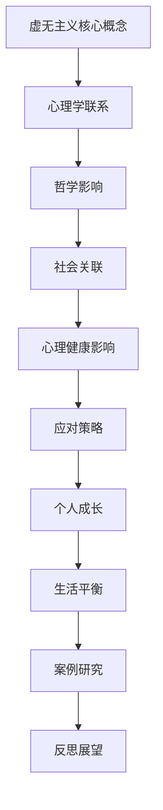

                 

### 引言：虚无主义的时代背景与意义

在现代社会中，虚无主义作为一种哲学思潮，悄然影响着人们的思维方式和生活态度。随着全球化和信息化进程的加速，人们面临的压力和不确定性不断增加，传统的价值观和信仰体系逐渐受到质疑。虚无主义正是在这样的时代背景下，以一种批判性的姿态，重新审视人生的意义和存在的价值。

虚无主义不仅仅是一种哲学观点，它对心理健康、人际关系、社会结构等方面都有着深远的影响。因此，探讨虚无主义的时代背景与意义，不仅有助于我们理解这一哲学思潮的起源与发展，还能为我们提供应对现代生活压力的新视角。

本文将从以下几个方面展开论述：

1. **虚无主义的概念与历史演变**：首先，我们将对虚无主义进行定义，并回顾其历史上的演变过程，分析不同时期虚无主义的思想特征。
   
2. **虚无主义对心理健康的影响**：接着，我们将探讨虚无主义与心理健康之间的关联，分析虚无主义可能导致的心理问题，并介绍相关的心理学研究和理论。

3. **虚无主义在现代社会中的地位**：此外，我们将探讨虚无主义在现代社会中的影响，分析它如何影响人们的价值观、生活方式以及心理健康。

4. **虚无主义的积极意义**：虽然虚无主义常被视为消极的哲学观点，但本文将尝试从不同的角度，挖掘虚无主义的积极意义，探讨其对个人成长和自我认知的启示。

5. **虚无主义的未来发展趋势**：最后，我们将展望虚无主义的未来发展趋势，探讨其在现代社会中的可能影响和面临的挑战。

通过以上几个方面的论述，本文旨在为读者提供一种全面、深入的虚无主义分析，帮助我们在面对现代生活压力时，找到一种平衡点，实现身心健康和生活的和谐。

#### 1.1.1 虚无主义的定义

虚无主义（Nihilism）是一种哲学思想，其核心观点是认为宇宙和生命缺乏固有意义、目的和价值。虚无主义者通常认为，传统道德、宗教、文化等价值体系都是人类自我构建的，并没有客观的基础。因此，虚无主义在本质上是一种反传统、反权威的哲学思潮。

虚无主义的定义可以从多个角度进行阐述。首先，从哲学角度来看，虚无主义可以定义为一种对存在的否定态度。它质疑一切既定的信仰和价值观，主张通过批判和反思来揭示事物的真实面貌。虚无主义者认为，现实世界是混乱无序的，缺乏内在的秩序和意义。

其次，从心理学角度来看，虚无主义可以被理解为一种心理状态。面对生活的压力和不确定性，一些个体可能会感到迷茫和困惑，甚至对生活失去兴趣。这种现象在一定程度上可以被视为虚无主义的体现。虚无主义者常常感受到生命的空虚和绝望，缺乏对未来的希望。

最后，从社会文化角度来看，虚无主义是一种对现代社会结构的批判。在全球化、信息化和社会快速变革的背景下，传统的社会结构和文化价值观受到冲击，人们面临着前所未有的不确定性和焦虑感。虚无主义在这种背景下，成为了一种反思和批判现代社会现象的思想工具。

总之，虚无主义是一种多维度、多层次的哲学思想，它不仅质疑传统价值观的合理性，还对现代社会和个人生活产生了深远的影响。理解虚无主义的定义，是深入探讨其思想内涵和影响的前提。

#### 1.1.2 虚无主义的起源与发展

虚无主义作为一种哲学思潮，其起源可以追溯到古代希腊哲学。在古希腊哲学中，苏格拉底和柏拉图曾探讨了存在的意义和目的，但他们的思想并未明确否定生活的价值。然而，随着哲学的发展，特别是在中世纪和文艺复兴时期，虚无主义的观念逐渐浮现。

中世纪时期，基督教哲学对虚无主义进行了强烈批判，认为虚无主义是一种危险的思想，可能导致道德沦丧和社会动荡。然而，在文艺复兴时期，随着对古典文化的重新审视，虚无主义的观念得到了一定程度的认可。文艺复兴时期的哲学家如尼采、蒙田等人，都对传统价值观进行了深刻的批判，并提出了对生活的重新思考。

进入现代，虚无主义的思想得到了进一步的发展和普及。19世纪的哲学家如尼采，被誉为虚无主义的代表人物。尼采在《悲剧的诞生》和《查拉图斯特拉如是说》等著作中，系统阐述了虚无主义的观点，认为人类存在的本质是痛苦和无意义。尼采的思想对20世纪哲学产生了深远影响，许多哲学家和思想流派都在不同程度上受到了尼采思想的影响。

20世纪是虚无主义思想发展的关键时期。在两次世界大战和冷战期间，人类社会经历了巨大的动荡和变革，人们对传统价值观和信仰体系的信任度大幅降低。这一时期，许多哲学家和文学家，如海德格尔、萨特、加缪等，都在其作品中探讨了虚无主义的问题。海德格尔的“存在主义”和萨特的“荒诞哲学”，都从不同角度探讨了虚无主义对人类生活和心理的影响。

此外，20世纪的虚无主义思想还与心理学和心理学理论的结合密切相关。精神分析学派创始人弗洛伊德，通过探讨人的潜意识和心理冲突，揭示了虚无主义心理状态的存在。 existential心理学则直接将虚无主义作为核心概念，探讨了人类在面对存在的荒诞和不确定性时的心理反应和应对策略。

虚无主义的发展历程体现了其复杂性和多样性。从古希腊哲学的萌芽，到现代哲学和心理学中的深入探讨，虚无主义始终是一种反思和批判传统价值观的思想工具。理解虚无主义的起源与发展，有助于我们更好地把握其思想内涵和现实意义。

#### 1.1.3 虚无主义与现代社会的关联

虚无主义作为一种哲学思潮，在现代社会中具有重要的现实意义。随着全球化和信息化进程的加速，社会结构和价值观发生了深刻变革，虚无主义成为了一种反思和批判现代社会的思想工具。

首先，虚无主义与现代社会的快速变革密切相关。在现代社会，科技的发展和社会的进步带来了前所未有的机遇和挑战。然而，这种快速变革也带来了不确定性和焦虑感。许多人感到自己的生活失去了方向和目标，对未来的不确定性和恐惧感加剧。虚无主义在这种背景下，成为了一种表达对现代社会不满和反思的思想工具。

其次，虚无主义与现代社会中普遍存在的压力和焦虑有关。现代社会竞争激烈，工作压力和生活压力不断增加，许多人感到自己无法应对这种压力，甚至对生活失去信心。虚无主义提供了一种对这种心理状态的解释，认为生活的意义和目的是虚构的，人类存在的本质是痛苦和无意义。因此，虚无主义成为了一些人在面对生活困境时的心理逃避和情感寄托。

此外，虚无主义还与现代社会中的价值危机密切相关。在全球化进程中，传统的社会结构和价值观受到了冲击，新的价值观尚未形成，导致人们在价值观念上感到迷茫和困惑。虚无主义在这种背景下，成为了一种对传统价值观的质疑和批判，呼吁人们重新审视和反思生活的意义和价值。

虚无主义对心理健康的影响也是一个值得探讨的重要问题。在现代社会，心理健康问题日益严重，虚无主义心理状态在一些人群中普遍存在。虚无主义者常常感受到生命的空虚和绝望，缺乏对未来的希望。这种现象在一定程度上加剧了心理健康问题，导致焦虑、抑郁等心理疾病的发生。因此，探讨虚无主义与心理健康的关系，有助于我们更好地理解心理健康问题的成因和应对策略。

总之，虚无主义与现代社会的快速变革、压力和焦虑、价值危机以及心理健康问题密切相关。作为一种哲学思潮，虚无主义在现代社会中具有重要的现实意义和影响。理解虚无主义与现代社会的关联，有助于我们更好地应对现代社会中的各种挑战，寻找生活的平衡点。

#### 1.2.1 虚无主义的心理学解释

虚无主义作为一种哲学思潮，对人们的心理健康产生了深远的影响。从心理学角度来看，虚无主义可以被解释为一种心理状态，这种状态通常与一系列负面情绪和行为反应相关联。以下将从心理学的不同角度对虚无主义进行解释。

首先，认知行为理论（Cognitive Behavioral Theory, CBT）提供了一种解释虚无主义的心理学框架。根据认知行为理论，个体的思维模式直接影响其情绪和行为。虚无主义者常常持有一种消极的认知模式，他们可能过分强调生活中的负面因素，忽视积极的方面。例如，当面对生活中的挫折和挑战时，虚无主义者可能会认为这些挫折是生活固有的、无法避免的，从而产生无助感和绝望感。这种消极的认知模式会导致个体的情绪状态恶化，进一步加剧虚无主义倾向。

其次，精神分析学派（Psychoanalytic Theory）也对虚无主义提供了心理学解释。弗洛伊德的理论认为，虚无主义可能是由于人的潜意识冲突和未解决的心理问题导致的。在弗洛伊德看来，人的行为和思维都受到潜意识的影响，而虚无主义则可能是潜意识中对生活的绝望和不满的体现。例如，一个人可能在表面上表现得积极乐观，但在潜意识中却对生活充满不满和绝望，这种内心的矛盾和冲突会导致虚无主义心理状态的出现。

此外，存在主义心理学（Existential Psychology）提供了另一种解释虚无主义的心理学视角。存在主义心理学家认为，虚无主义是人类面对存在的荒诞和不确定性时的自然反应。存在主义代表人物如罗洛·梅（Rollo May）和维克多·弗兰克尔（Viktor Frankl）都认为，虚无主义是一种对人类存在本质的深刻反思。这种反思虽然可能导致个体的心理困扰，但也可能促使个体更加关注生活的意义和价值，从而实现自我超越和成长。

最后，社会认知理论（Social Cognitive Theory）也对虚无主义提供了心理学解释。社会认知理论强调社会环境和社会互动对个体心理和行为的影响。在现代社会中，虚无主义可能是一种对社会现实和文化价值观的反抗形式。个体在面对社会压力和不确定性时，可能会产生一种反叛心理，通过否定传统价值观来寻求自我认同和独立。

综上所述，虚无主义作为一种心理状态，可以从多个心理学角度进行解释。认知行为理论、精神分析学派、存在主义心理学和社会认知理论等提供了不同的解释框架，帮助我们理解虚无主义的心理机制和影响。理解这些心理学理论，不仅有助于我们更好地理解虚无主义本身，还能为应对虚无主义带来的心理问题提供有益的启示。

#### 1.2.2 虚无主义与心理健康问题的关系

虚无主义与心理健康问题之间存在密切的联系，这种联系在心理学研究中得到了广泛探讨。虚无主义心理状态可能加剧多种心理健康问题，甚至成为某些心理障碍的诱因。

首先，虚无主义可能导致抑郁症的发生。抑郁症是一种常见的心理健康问题，其核心症状是持续的悲伤、失去兴趣和快乐感。虚无主义者常常感到生活无意义，对未来失去希望，这些消极情绪容易发展为抑郁症。研究表明，虚无主义与抑郁症之间存在显著相关性。一项研究对大量样本进行数据分析，发现虚无主义倾向较高的个体更易报告抑郁症状。这一发现提示我们，对于存在虚无主义倾向的个体，需要加强心理健康监测和干预，以预防抑郁症的发生。

其次，虚无主义也与焦虑症密切相关。焦虑症是一种以过度担心和恐惧为特征的疾病，虚无主义者可能因对未来的不确定性和恐惧感而表现出焦虑症状。一项关于大学生心理健康的研究发现，虚无主义倾向与焦虑症的发生率呈正相关。虚无主义者往往对自己的生活感到不安和焦虑，这种情绪状态可能导致他们过度担忧生活中的各种问题，从而引发焦虑症。因此，针对虚无主义倾向的个体，焦虑症的预防和干预显得尤为重要。

此外，虚无主义还可能增加精神分裂症的风险。精神分裂症是一种严重的精神障碍，其主要症状包括思维紊乱、情感淡漠和行为异常。研究表明，虚无主义与精神分裂症之间存在一定的关联。一项对精神分裂症患者的研究发现，许多患者在患病前存在严重的虚无主义倾向。这提示我们，在精神分裂症的早期预防中，应关注个体的虚无主义倾向，通过心理健康教育和干预措施，降低精神分裂症的发生风险。

此外，虚无主义还可能对其他心理健康问题产生负面影响。例如，一项关于老年人心理健康的研究发现，虚无主义倾向与孤独感、自尊心低下和生活满意度低呈显著正相关。这些研究结果表明，虚无主义不仅影响个体的情绪状态，还对整体心理健康产生负面影响。

总之，虚无主义与多种心理健康问题之间存在密切关系。虚无主义倾向可能增加抑郁症、焦虑症和精神分裂症等心理障碍的发生风险，同时也会对孤独感、自尊心和总体生活满意度产生负面影响。理解虚无主义与心理健康问题的关系，有助于我们更好地识别和应对心理健康问题，为个体提供有效的心理支持和干预措施。

#### 1.2.3 虚无主义在心理健康研究中的地位

虚无主义在心理健康研究领域占据着重要的地位，其研究不仅丰富了心理学理论，还为我们理解和干预心理健康问题提供了新的视角。以下从几个方面概述虚无主义在心理健康研究中的地位和作用。

首先，虚无主义作为一种心理状态，对心理健康研究产生了深远的影响。心理研究表明，虚无主义倾向与多种心理健康问题密切相关，如抑郁症、焦虑症、孤独感和自尊心低下等。这些研究发现不仅深化了我们对虚无主义的理解，还为我们揭示了心理健康问题的复杂性和多样性。通过探讨虚无主义与心理健康问题的关联，研究者能够更好地识别高风险群体，从而开展更有效的预防和干预措施。

其次，虚无主义在心理学理论体系中具有重要的地位。认知行为理论（CBT）、精神分析学派、存在主义心理学和社会认知理论等，都从不同角度对虚无主义进行了深入探讨。这些理论不仅帮助我们理解虚无主义的心理机制和影响，还为心理健康研究提供了丰富的理论基础。例如，认知行为理论指出，虚无主义者的消极认知模式是心理健康问题的重要诱因，而存在主义心理学则强调虚无主义在个体面对存在的荒诞和不确定性时的自然反应。这些理论为我们提供了多维度、多层次的解释框架，有助于全面理解虚无主义的复杂性和多样性。

此外，虚无主义研究在心理健康干预中发挥了关键作用。针对虚无主义倾向的个体，心理干预措施需要充分考虑其心理特点和行为反应。例如，认知行为疗法（CBT）通过改变消极认知模式，有助于缓解虚无主义者的负面情绪；存在主义疗法则通过探讨个体存在的意义和价值，帮助个体建立积极的生活态度。这些干预措施不仅有助于改善心理健康问题，还能促进个体的心理成长和自我认知。

最后，虚无主义研究在心理健康政策制定中也具有重要意义。随着心理健康问题的日益严重，政府和社会对心理健康问题的关注度不断提升。虚无主义研究提供了关于心理健康问题的深刻见解，有助于政策制定者制定更科学、更有效的心理健康政策和干预措施。例如，通过研究虚无主义与心理健康问题的关联，政策制定者可以更好地了解高风险群体的特点，从而制定针对性的干预措施，提高心理健康服务的覆盖率和有效性。

总之，虚无主义在心理健康研究领域占据了重要的地位，其研究不仅丰富了心理学理论，还为心理健康干预和政策制定提供了新的视角和启示。理解虚无主义在心理健康研究中的地位和作用，有助于我们更好地应对现代生活中的心理健康挑战，提高公众的心理健康水平。

#### 2.1 压力源的类型与识别

压力是现代社会中普遍存在的现象，不同的压力源会以不同的形式和强度影响个体的身心健康。为了有效地管理压力，我们需要首先识别和了解常见的压力源类型。以下是几种主要的压力源及其特点：

**工作压力**：工作压力是人们最常遇到的一种压力源。现代职场竞争激烈，工作量大，对工作效率和质量的期望不断提高，这些都可能导致个体感受到巨大的工作压力。工作压力不仅影响个体的工作效率和职业发展，还可能对身心健康产生负面影响。长期的工作压力可能导致焦虑、抑郁、失眠等问题。

**生活压力**：生活压力涵盖了生活中的各种挑战和不确定性，如家庭责任、财务问题、人际关系冲突等。家庭中的矛盾和争吵、子女教育问题、婚姻关系紧张等都可能成为生活压力的来源。生活压力对心理健康的影响是长期且广泛的，它可能导致个体的情绪不稳定、心理负担加重，甚至引发严重的心理健康问题。

**社交压力**：社交压力主要源于人际关系和社交活动。现代社会的快节奏和高互动性使得个体在社交活动中感受到的压力日益增加。社交压力可能源于人际关系的紧张、社交场合的尴尬和不确定感，或者对社交礼仪和社交角色的担忧。长期承受社交压力可能导致个体产生焦虑、自卑等心理问题。

**健康压力**：健康压力是指个体因身体疾病或健康问题而产生的压力。无论是自身或家庭成员的健康问题，都会给个体带来沉重的心理负担。健康压力可能导致个体情绪低落、焦虑不安，影响日常生活和工作。此外，健康问题还可能引发一系列的经济负担，进一步加剧压力。

**时间压力**：时间压力是指个体在有限的时间内完成过多任务或任务时间紧迫而产生的压力感。现代社会的快速发展和时间观念的强化使得人们感受到的时间压力不断增加。时间压力可能导致个体出现焦虑、疲劳和睡眠障碍等问题，影响身心健康。

**环境压力**：环境压力是指来自自然环境和社会环境的压力。例如，自然灾害、环境污染、交通拥堵等都可能对个体产生压力。环境压力不仅直接影响个体的身心健康，还可能通过情绪和心理状态间接影响个体的行为和生活质量。

通过识别和了解这些常见的压力源类型，我们可以更有效地管理压力，采取相应的应对策略，维护身心健康。

#### 2.2 压力管理的核心策略

有效管理压力是保持身心健康的关键。以下介绍几种核心的压力管理策略，包括认知行为疗法、冥想与放松训练、心理弹性训练等。

**认知行为疗法（Cognitive Behavioral Therapy, CBT）**：认知行为疗法是一种广泛应用的心理学治疗方法，旨在通过改变个体的消极思维模式和行为习惯，改善情绪和心理健康。CBT的核心理论是认知影响行为，即个体的思维和信念直接影响其情绪和行为。通过CBT，个体可以学会识别和改变负面思维，如过度概括、以偏概全、灾难化等，从而减少压力和焦虑。

**冥想与放松训练**：冥想和放松训练是缓解压力的有效方法，通过训练个体的专注力和呼吸控制，达到身心放松的状态。冥想可以帮助个体减少心理负担，提高情绪调节能力，增强心理韧性。常见的冥想方法包括正念冥想、呼吸冥想和身体扫描等。放松训练则包括深呼吸、渐进性肌肉松弛、瑜伽和温和运动等。这些训练方法通过降低心率和血压，缓解肌肉紧张，改善睡眠质量，从而减轻压力。

**心理弹性训练**：心理弹性是指个体在面对压力和逆境时的适应能力和恢复力。通过心理弹性训练，个体可以增强自身的心理韧性，提高应对压力的能力。心理弹性训练包括以下几种方法：

1. **目标设定**：设定具体、可实现的短期和长期目标，有助于个体保持动力和方向感，减少因目标不明确而产生的压力。
2. **积极思维**：培养积极思维模式，学会从不同角度看待问题和挑战，减少悲观和消极情绪。
3. **情绪管理**：学会识别和表达自己的情绪，采用适当的情绪调节策略，如深呼吸、倾诉、放松训练等，缓解情绪压力。
4. **应对策略**：学习并实践有效的应对策略，如时间管理、问题解决技巧、积极沟通等，以应对生活中的各种挑战。
5. **社会支持**：建立和维护良好的社会支持网络，包括家人、朋友和同事，在面临压力时可以获得情感上的支持和实际帮助。

**健康生活方式**：健康的生活方式也是缓解压力的重要手段。保持良好的饮食习惯、适量运动、充足睡眠和减少不良习惯（如吸烟、饮酒过量等）有助于维持身心健康，提高抗压能力。

总之，通过认知行为疗法、冥想与放松训练、心理弹性训练以及健康生活方式的综合应用，可以有效管理压力，提升心理健康水平，实现身心的平衡与和谐。

#### 2.3 压力对身心健康的影响

压力是一种普遍存在于现代社会中的现象，它对身心健康有着深远的影响。长期承受压力不仅会影响个体的情绪和行为，还可能导致一系列身体疾病和功能障碍。以下详细探讨压力对身心健康的具体影响。

**情绪影响**：压力会导致个体的情绪波动，常见的情绪反应包括焦虑、抑郁、愤怒和不安。长期处于高压状态，个体可能会出现情绪失控、易怒、情绪波动大等问题。焦虑和抑郁是压力最直接的情绪反应，它们不仅影响个体的情绪状态，还可能导致心理依赖和依赖性人格的形成。此外，压力还会影响个体的情绪调节能力，使其在面对日常挑战时感到无助和困惑。

**行为影响**：压力对个体的行为模式也有显著影响。长期承受压力可能导致个体出现逃避行为、消极应对、拖延等不良行为习惯。例如，个体可能会通过吸烟、饮酒、过度消费等方式来缓解压力，但这些行为往往会导致更多健康问题。此外，压力还可能导致个体的社交回避，减少与家人、朋友的互动，进一步加剧孤独感和社交孤立感。

**生理影响**：压力通过神经系统和内分泌系统的传导，对个体的生理健康产生负面影响。长期承受压力会导致激素水平失衡，如皮质醇（一种压力激素）水平升高，这可能导致免疫系统功能下降，增加感染和疾病的风险。此外，压力还可能导致以下几种生理问题：

1. **心血管疾病**：长期承受压力会升高血压和心率，增加心血管疾病的风险。研究表明，压力与心脏病、中风等心血管疾病有密切关联。
2. **消化系统问题**：压力会影响消化系统的正常功能，导致胃痛、胃酸过多、消化不良等问题。长期的压力还可能导致肠易激综合症等消化系统疾病。
3. **免疫力下降**：压力会抑制免疫系统的功能，使个体更容易感染病毒和细菌。例如，感冒和流感等常见疾病在压力较大的人群中更容易发生。
4. **睡眠障碍**：压力常导致失眠、多梦等睡眠障碍。长期缺乏高质量睡眠会影响个体的认知功能和情绪状态，进一步加重压力。

**行为功能障碍**：长期承受压力还可能导致行为功能障碍，如注意力不集中、记忆力下降、决策困难等。这些功能障碍会影响个体的日常生活和工作效率，进一步加剧压力感。

**综合影响**：压力对身心健康的影响是综合性的，不仅影响情绪和行为，还可能导致生理功能的紊乱。长期承受压力，个体的身心健康会逐渐受损，影响其生活质量和工作表现。因此，识别和应对压力源，采取有效的压力管理策略，对于维护身心健康至关重要。

综上所述，压力对身心健康有着广泛而深远的影响。了解这些影响，有助于我们更好地认识压力的危害，采取积极的应对措施，维护身心健康。

#### 2.3.2 压力管理的健康益处

有效的压力管理不仅有助于缓解情绪困扰和行为问题，还能带来显著的身心健康益处。以下从几个方面详细探讨压力管理的健康益处。

**提高情绪稳定性**：通过压力管理策略，如认知行为疗法、冥想与放松训练等，个体可以学会识别和调节负面情绪，减少焦虑和抑郁的发生。研究表明，长期坚持压力管理练习，个体在情绪调节能力方面有明显提升，情绪稳定性得到显著改善。情绪稳定性的提高有助于个体更好地应对生活中的挑战，提高生活质量。

**增强心理韧性**：心理韧性是指个体在面对压力和逆境时的适应能力和恢复力。通过心理弹性训练，个体可以增强自身的心理韧性，提高应对压力的能力。增强心理韧性有助于个体在面对挫折和困难时保持积极心态，快速恢复，从而减少因压力导致的负面影响。

**改善身体健康**：压力管理对身体健康也有显著益处。通过健康生活方式，如适量运动、良好饮食和充足睡眠，个体可以降低压力激素水平，增强免疫力，减少心血管疾病、消化系统问题和睡眠障碍等健康问题的发生风险。此外，长期的压力管理有助于维持稳定的血压和心率，改善整体健康状态。

**提高生活质量**：有效的压力管理策略有助于个体提高生活质量。减少压力带来的负面情绪和行为问题，使个体能够更好地享受生活，增强生活的幸福感。此外，通过压力管理，个体可以更好地平衡工作与生活，减少因压力导致的职场表现下降和生活质量下降的问题。

**增强人际关系**：压力管理策略，如积极沟通和情绪调节技巧，有助于改善个体的人际关系。减少压力导致的冲突和误解，增强与家人、朋友和同事之间的互动和信任，有助于建立和谐的人际关系网络，提高社会支持水平。

**提高工作效率**：通过压力管理，个体可以更好地集中注意力和提高工作效率。减少压力导致的注意力分散和决策困难，使个体能够更有效地完成任务，提高工作绩效。

综上所述，压力管理对身心健康具有多方面的益处。通过有效的压力管理策略，个体可以显著提高情绪稳定性、心理韧性、身体健康和生活质量，从而实现身心的平衡与和谐。

#### 2.3.3 压力管理的实践与效果评估

在实际操作中，压力管理的实践需要结合个体的具体情况，采取个性化的策略和方法。以下介绍几种常见的压力管理实践方法及其效果评估。

**认知行为疗法（CBT）**：认知行为疗法是一种系统性的心理治疗方法，通过识别和改变负面思维模式和行为习惯，帮助个体应对压力。在实际操作中，个体可以与专业心理治疗师合作，进行认知重构和行为调整。研究表明，CBT对减轻压力、改善情绪和行为问题具有显著效果。一项针对职场压力的长期研究发现，接受CBT治疗的个体在情绪稳定性、工作满意度和生活质量方面均有显著提升。

**冥想与放松训练**：冥想和放松训练是缓解压力的有效方法，通过训练个体的专注力和呼吸控制，达到身心放松的状态。常见的冥想方法包括正念冥想、呼吸冥想和身体扫描等。放松训练则包括深呼吸、渐进性肌肉松弛、瑜伽和温和运动等。多项研究表明，定期进行冥想与放松训练，可以显著降低心率和血压，改善睡眠质量，减少焦虑和抑郁症状。例如，一项针对大学生的研究发现，参与正念冥想训练的个体在压力水平、情绪调节能力和心理健康指标上均有显著改善。

**心理弹性训练**：心理弹性训练旨在增强个体的心理韧性，提高应对压力的能力。通过设定具体目标、积极思维、情绪管理和应对策略等方法，个体可以提升自身的心理弹性。研究显示，心理弹性训练有助于个体在面对逆境时保持积极心态，快速恢复。一项关于职场员工的研究发现，接受心理弹性训练的个体在应对工作压力和情绪调节方面表现出更好的适应能力。

**健康生活方式**：健康的生活方式是压力管理的重要组成部分。保持良好的饮食习惯、适量运动、充足睡眠和减少不良习惯（如吸烟、饮酒过量等）有助于维持身心健康。一项对老年人的研究发现，采用健康生活方式的个体在压力管理、心理健康和生活质量方面均优于不遵循健康生活方式的个体。

**效果评估方法**：在压力管理实践中，效果评估是确保策略有效性的重要环节。常见的效果评估方法包括自我报告问卷、心理测量工具和生理指标监测等。自我报告问卷如压力感知量表、情绪调节量表等，可以提供个体主观感受的数据。心理测量工具如状态-特质焦虑量表、抑郁自评量表等，可以更客观地评估个体的心理健康状态。生理指标监测如心率、血压、皮质醇水平等，可以反映个体在压力管理中的生理反应。通过综合运用这些评估方法，可以全面了解压力管理的效果，为调整和优化策略提供依据。

总之，压力管理的实践需要结合个体的具体情况，采取个性化的策略和方法。通过认知行为疗法、冥想与放松训练、心理弹性训练和健康生活方式等多种方法，个体可以有效管理压力，提升身心健康。效果评估方法则为压力管理实践提供了科学依据，确保策略的有效性。

#### 3.1 价值重构：虚无主义的积极意义

虚无主义虽然在表面上看起来是一种消极的哲学观点，但它在个人成长和自我认知方面却具有重要的积极意义。通过重新审视虚无主义，我们可以发现其独特的价值，从而在生活的困境中找到新的方向和力量。

首先，虚无主义促使我们重新审视生活的意义和价值。在传统价值观受到质疑的现代社会，许多人感到迷茫和困惑，对生活的意义缺乏认同。虚无主义提供了一种批判性的视角，让我们质疑那些被传统观念和社会所强加的价值观。通过这种质疑，我们可以更深刻地认识到，生活的意义并非固有的，而是由个体自主构建的。这种自我构建的过程，不仅使我们对生活有了更深刻的理解，也赋予了我们自主选择和创造的能力。

其次，虚无主义有助于我们实现个人成长。在虚无主义的背景下，个体需要面对存在的荒诞和不确定性，这种面对的过程本身就是一种成长。虚无主义鼓励我们勇敢地面对生活的挑战，不再逃避或回避。例如，当面临职业困境或人际关系矛盾时，虚无主义者不会因为恐惧或焦虑而选择逃避，而是会直面问题，寻找解决的方法。这种勇敢面对挑战的态度，不仅帮助我们克服困难，还培养了我们的坚韧和韧性。

此外，虚无主义有助于我们提高自我认知。虚无主义提醒我们，生活中许多事物的存在都是相对的，没有绝对的意义和价值。通过这种自我认知，我们可以更加客观地看待自己和周围的世界，减少自我中心的偏见和执着。例如，当我们意识到自己并非世界的中心，他人也有自己的痛苦和困境时，我们会更加同情和理解他人，从而建立更加健康和和谐的人际关系。

最后，虚无主义为我们提供了自我超越的契机。在虚无主义的视角下，个体意识到生活的本质是痛苦和无意义的，这可能会引发一种强烈的渴望，希望超越这种困境，寻找更高层次的幸福和满足。这种超越的渴望可以激发个体追求内心的平静和内心的力量，通过不断的自我反思和自我提升，达到一种超越痛苦和迷茫的境界。

总之，虚无主义虽然表面上是消极的，但它在个人成长和自我认知方面具有深远的积极意义。通过重新审视虚无主义，我们可以找到生活的意义和价值，实现个人成长，提高自我认知，并最终超越生活的困境，找到内心的平静和力量。

#### 3.1.1 虚无主义的哲学意义

虚无主义在哲学领域具有重要的地位，其思想内涵深刻且复杂。从哲学的角度来看，虚无主义不仅仅是一种否定性的观点，它包含了对存在、意义和价值的根本性质疑，从而引发了一系列哲学上的思考和讨论。

首先，虚无主义挑战了传统的存在论（Ontology）基础。存在论是哲学中探讨事物存在本质的理论，而虚无主义则从根本上质疑这种本质的存在。虚无主义认为，现实世界缺乏内在的秩序和意义，因此，传统的存在论基础是不牢靠的。这种对存在本身的否定，引发了哲学家们对“何为真实存在”的深入探讨。

其次，虚无主义对伦理学（Ethics）也产生了重大影响。伦理学探讨道德和价值观的本质，而虚无主义则对传统的道德体系提出了质疑。如果宇宙和生命缺乏固有的意义和价值，那么传统的道德规范是否还有意义？虚无主义促使人们重新审视道德标准，探讨道德是否仅仅是人类自我构建的产物。

此外，虚无主义还影响了认识论（Epistemology），即关于知识和真理的理论。虚无主义质疑人类认知的可靠性和真实性，认为我们对世界的认识充满了不确定性和相对性。这种观点挑战了传统的认识论基础，促使哲学家们探讨如何在这种不确定性的环境中寻求知识和真理。

在哲学史上，虚无主义与存在主义（Existentialism）有着密切的联系。存在主义是在虚无主义的基础上发展起来的一种哲学思潮，它试图回答虚无主义提出的根本问题：如果生活缺乏意义，个体应该如何行动和生活？存在主义强调个体的自由、选择和责任，认为通过个体的自我选择和行动，可以赋予生活以意义。例如，存在主义哲学家海德格尔（Martin Heidegger）和萨特（Jean-Paul Sartre）都从不同的角度探讨了虚无主义对个体生活的影响。

虚无主义还与唯心主义（Idealism）和现实主义（Realism）等哲学流派存在一定的冲突。唯心主义认为意识是现实的基础，而虚无主义则对这种观点提出了挑战。现实主义则强调物质世界的独立存在，虚无主义则质疑物质世界的固有意义。

总之，虚无主义在哲学领域具有重要的地位，它不仅挑战了传统哲学的基础，还引发了对存在、意义、价值和知识的深入探讨。通过理解虚无主义的哲学意义，我们可以更好地理解现代哲学中的许多重要问题和思想流派，为自身的思考和行动提供新的启示。

#### 3.1.2 虚无主义与个人成长的关联

虚无主义对个人成长有着深远的影响，它不仅挑战了个体的认知边界，还促使个体进行深刻的自我反思和自我提升。在虚无主义的背景下，个体需要面对存在的荒诞和不确定性，这种面对的过程本身就是一种成长。

首先，虚无主义促使个体认识到生活的相对性和主观性。在传统的价值观体系下，个体常常依赖于外部的权威和既定的标准来判断自我和他人的价值。虚无主义则质疑这种外部标准的可靠性，认为生活的意义和价值是由个体自主构建的。这种认识使个体从对外部评价的依赖中解放出来，开始关注内心的真实感受和需求。通过这种自我意识的觉醒，个体能够更加清晰地认识到自我价值，从而实现自我成长。

其次，虚无主义帮助个体建立内在的稳定性。在面对生活的挑战和不确定性时，个体常常感到焦虑和无助。虚无主义提供了一种哲学视角，帮助个体理解这些负面情绪的根源，并找到应对策略。例如，通过认知行为疗法和冥想等实践，个体可以学会调节情绪，增强心理韧性，从而在面对困境时保持冷静和稳定。这种内在的稳定性不仅有助于个体的心理健康，也为个人成长提供了坚实的基础。

此外，虚无主义鼓励个体进行积极的自我探索。在虚无主义的视角下，个体意识到生活缺乏固有的意义，因此需要通过自我探索来发现和创造意义。这种自我探索的过程包括对自我身份的反思、对生活目标的重新审视以及对个人价值观的重新定义。通过这种探索，个体能够更深刻地理解自己的内心世界，找到真正有意义的事物，从而实现个人成长。

最后，虚无主义还促进了个体之间的相互理解和包容。虚无主义质疑传统的价值观和道德观念，促使个体反思和批判这些观念的合理性和适用性。这种反思不仅有助于个体摆脱偏见和固执，还能促进个体对他人和不同文化的理解和尊重。通过这种相互理解和包容，个体能够在多元化的社会环境中找到自己的位置，实现个人成长。

总之，虚无主义与个人成长密切相关。它通过挑战传统价值观、帮助个体建立内在稳定性和鼓励自我探索，为个体提供了深刻的自我反思和自我提升的机会。理解虚无主义的积极意义，有助于个体在生活的困境中找到方向和力量，实现全面成长。

#### 3.1.3 虚无主义对人生目标的重新审视

虚无主义促使我们对人生目标进行深刻的重新审视，从而发现新的价值和方向。在虚无主义的视角下，传统的价值观和人生目标常常受到质疑，这使我们不得不反思自己的生活方式和追求的意义。

首先，虚无主义挑战了传统的人生目标，如成功、权力和物质财富等。这些目标在传统观念中被视为人生的重要追求，但虚无主义认为，这些目标缺乏内在的价值和意义。通过重新审视这些目标，我们可以发现，追求成功和权力虽然可以带来一时的满足感，但无法真正满足内心的空虚和焦虑。因此，虚无主义鼓励我们寻求更深层次的意义和目标。

其次，虚无主义促使我们重新定义幸福。传统观念中，幸福通常与外在成就和物质享受相关，但虚无主义认为，幸福是一种内在的状态，与个人的心态和情感体验密切相关。通过重新定义幸福，我们可以更加关注内心的平静和满足，而不是追求外在的物质和荣誉。

此外，虚无主义还鼓励我们追求个人成长和自我实现。虚无主义认为，人生的意义并不在于达到某个特定的目标，而在于个体在不断探索和成长的过程中所获得的体验和收获。因此，虚无主义促使我们关注个人成长，不断挑战自我，追求内心的满足和自我实现。

最后，虚无主义还提醒我们重视人际关系和共同价值观。在虚无主义的视角下，个体意识到生命是短暂且脆弱的，因此，与他人的关系和共同价值观变得尤为重要。通过重新审视人生目标，我们可以发现，与他人的和谐相处和共同追求的价值，是赋予生活意义的重要方式。

总之，虚无主义对人生目标的重新审视，使我们能够从更深刻的角度理解和追求生活的意义。通过重新定义幸福、关注个人成长和重视人际关系，我们可以找到新的价值和方向，实现有意义的人生。

#### 3.2 心灵探索：提升心理素养的实践

在虚无主义的背景下，心灵探索成为提升心理素养的重要途径。通过一系列实践，个体可以更好地认识自我，提升心理韧性，从而在生活的挑战中找到内心的平衡。以下介绍几种具体的心灵探索实践方法，包括心理素质培养、情绪管理技巧和自我认知与自我接纳等。

**心理素质培养**：心理素质的培养是心灵探索的基础。通过持续的实践，个体可以提升自身的情绪调节能力、认知灵活性和抗压能力。以下是一些实用的培养方法：

1. **正念练习**：正念是一种专注于当前时刻的练习，通过观察自己的思想和情绪，个体可以更好地认识自我，减少焦虑和压力。正念练习可以通过冥想、呼吸练习和身体扫描等方式进行。每天投入10分钟进行正念练习，有助于提升心理素质。

2. **情绪日记**：记录自己的情绪变化和触发因素，可以帮助个体更好地理解自己的情绪模式，从而进行有效的情绪调节。通过分析情绪日记，个体可以识别出引发负面情绪的常见因素，并采取相应的应对策略。

3. **认知重构**：通过改变负面思维模式，个体可以减少心理负担和焦虑感。例如，当面对挫折时，个体可以通过认知重构，将“我做不到”转变为“这是一个挑战，我可以尝试解决它”。

**情绪管理技巧**：情绪管理是心理素养的重要组成部分。以下是一些有效的情绪管理技巧：

1. **情绪调节策略**：包括深呼吸、放松训练和肌肉放松等。这些策略可以帮助个体在情绪激动时迅速恢复平静，减少情绪对行为和决策的影响。

2. **情绪表达**：学会表达自己的情绪，避免情绪压抑或爆发。例如，通过写日记、绘画、运动等方式表达情绪，可以帮助个体释放内心的压力。

3. **积极沟通**：通过积极倾听和有效表达，个体可以与他人建立更好的沟通，减少因误解和冲突而产生的情绪压力。

**自我认知与自我接纳**：自我认知和自我接纳是心灵探索的核心。以下是一些实用的方法：

1. **自我反思**：定期进行自我反思，思考自己的价值观、信念和行为。通过自我反思，个体可以更清晰地认识自我，找到内心的平衡点。

2. **自我接纳**：接纳自己的优点和缺点，认识到每个人都有独特的价值和存在的意义。通过自我接纳，个体可以减少自我批评和内疚感，增强自信和自尊。

3. **心理成长小组**：加入心理成长小组，与他人分享自己的经历和感受，可以获得情感上的支持和反馈，促进自我认知和自我接纳。

总之，通过心理素质培养、情绪管理技巧和自我认知与自我接纳等实践，个体可以提升心理素养，增强应对生活挑战的能力。在虚无主义的背景下，这些实践方法不仅有助于个体的心理健康，还能为寻找生活的平衡提供有力支持。

#### 3.2.1 心理素质培养

心理素质培养是提升心理健康的重要途径，它帮助个体在面临压力和挑战时保持冷静和稳定。以下介绍几种有效的心理素质培养方法：

**正念练习**：正念是一种专注于当前时刻的练习，通过观察自己的思想和情绪，个体可以更好地认识自我，减少焦虑和压力。正念练习可以通过冥想、呼吸练习和身体扫描等方式进行。具体步骤如下：

1. **选择一个安静的环境，找一个舒适的姿势坐下或躺下。**
2. **闭上眼睛，深呼吸，专注于呼吸的感觉。**
3. **当你的注意力分散时，轻轻地将其带回到呼吸上。**
4. **持续练习，每天10分钟左右，逐步增加时间。**

**情绪日记**：记录自己的情绪变化和触发因素，可以帮助个体更好地理解自己的情绪模式，从而进行有效的情绪调节。以下是一个情绪日记的示例：

- **日期**：2023年11月1日
- **情绪**：焦虑
- **触发因素**：工作压力
- **情绪描述**：感到紧张和不安，担心无法完成任务
- **应对策略**：通过深呼吸和放松练习缓解焦虑，重新规划工作任务，设定短期目标

**认知重构**：通过改变负面思维模式，个体可以减少心理负担和焦虑感。以下是一个认知重构的示例：

- **原始思维**：每次失败都意味着我一无是处。
- **重构思维**：失败是成长的一部分，每次失败都为我提供了学习和改进的机会。

**时间管理技巧**：合理安排时间，减少因时间紧迫而产生的压力。以下是一个时间管理计划的示例：

- **设定明确的目标**：每天列出待办事项，为每项任务设定具体的时间。
- **优先级排序**：根据任务的重要性和紧急性进行排序，优先完成重要且紧急的任务。
- **定期休息**：每工作一段时间后，休息5-10分钟，进行简单的拉伸或放松练习。

**自我反思**：定期进行自我反思，思考自己的价值观、信念和行为。通过自我反思，个体可以更清晰地认识自我，找到内心的平衡点。以下是一个自我反思的示例：

- **问题**：我在工作中是否经常感到焦虑？
- **原因分析**：可能是由于对工作质量的过高期望和缺乏自信。
- **解决方案**：通过提升技能和自信心，逐步改善工作状态。

通过以上心理素质培养方法，个体可以提升心理韧性，更好地应对生活中的各种挑战。

#### 3.2.2 情绪管理技巧

情绪管理是保持心理健康的关键，以下介绍几种实用的情绪管理技巧，包括深呼吸、放松训练、情绪表达和积极沟通等：

**深呼吸**：深呼吸是一种简单而有效的情绪管理技巧，可以帮助个体迅速缓解紧张和焦虑。具体步骤如下：

1. **找一个安静的地方，坐下或躺下。**
2. **慢慢吸气，腹部膨胀，屏住呼吸几秒钟。**
3. **慢慢呼气，腹部收缩，同时放松身体。**
4. **重复此过程，每次呼吸持续5-10秒钟，每天练习3-5分钟。**

**放松训练**：放松训练通过渐进性肌肉放松和深呼吸，帮助个体减轻身体和心理的紧张。以下是一个放松训练的示例：

1. **选择一个舒适的姿势，闭上眼睛。**
2. **从脚开始，逐渐向上至头部，逐一放松身体的每一块肌肉。**
3. **专注于呼吸，感受身体逐渐放松的感觉。**
4. **每天练习10-15分钟，逐渐增加时间。**

**情绪表达**：学会表达自己的情绪，避免情绪压抑或爆发。以下是一些表达情绪的技巧：

1. **使用“I”语言**：例如，“我感到沮丧，因为……”，而不是“你让我感到沮丧。”
2. **描述情绪**：具体描述自己的情绪感受，如“我很焦虑，因为我对即将到来的考试没有信心。”
3. **分享感受**：与信任的朋友或家人分享自己的情绪和感受，获得支持和理解。

**积极沟通**：通过积极倾听和有效表达，个体可以与他人建立更好的沟通，减少因误解和冲突而产生的情绪压力。以下是一些积极沟通的技巧：

1. **积极倾听**：倾听对方的观点，不要打断，给予对方足够的表达空间。
2. **表达同理心**：通过表达理解和支持，如“我理解你的困扰，我们可以一起想办法解决。”
3. **解决冲突**：通过合作和妥协，找到双方都能接受的解决方案。

通过以上情绪管理技巧，个体可以更好地调节情绪，提升心理健康水平。

#### 3.2.3 自我认知与自我接纳

自我认知与自我接纳是心理健康的重要组成部分，通过深入了解自我和接纳自我，个体可以减少心理负担，提高生活质量。以下介绍几种有效的自我认知与自我接纳的方法：

**自我反思**：定期进行自我反思，思考自己的行为、思维和情感。以下是一个自我反思的示例：

1. **设定反思时间**：每天或每周找一个固定的时间进行自我反思，确保不受干扰。
2. **写下反思内容**：将反思过程记录下来，这有助于更清晰地了解自己的内心世界。
3. **提问自己**：思考以下问题：“我在哪些方面做得好？”“我在哪些方面需要改进？”“我的价值观和信念是什么？”

**自我探索**：通过自我探索，个体可以更深入地了解自己的需求和愿望。以下是一个自我探索的示例：

1. **尝试新事物**：参与不同的活动和经历，例如学习新的技能、旅行或参加社交活动。
2. **记录体验**：记录自己的新体验和感受，思考这些经历如何影响自我认知。
3. **倾听内心声音**：在安静的环境中，静心倾听内心的声音，探索自己的真实想法和感受。

**自我接纳**：接纳自己的优点和缺点，认识到每个人都有独特的价值和存在的意义。以下是一个自我接纳的示例：

1. **自我肯定**：每天对自己说一些积极肯定的话语，如“我是有价值的”、“我有能力克服困难”。
2. **认识到变化**：接受自己是一个不断变化和成长的过程，不需要完美，只需要真诚和努力。
3. **与他人分享**：与信任的朋友或家人分享自己的感受和挑战，获得支持和理解。

通过自我认知与自我接纳，个体可以更好地了解自我，减少自我批评和内疚感，增强自信和自尊，从而提升心理健康水平。

#### 3.3.1 工作与生活的平衡

在现代社会中，工作与生活的平衡成为许多人追求的目标。然而，由于工作压力、时间紧迫和责任感等因素，许多人难以实现这种平衡。以下介绍几种实现工作与生活平衡的方法：

**时间管理**：有效的时间管理是实现工作与生活平衡的关键。以下是一些实用的时间管理技巧：

1. **设定优先级**：将任务按照重要性和紧急性进行排序，优先处理最重要的任务。
2. **每天制定计划**：每天开始时，列出待办事项，为每项任务设定具体的时间。
3. **避免拖延**：将大任务分解为小任务，逐步完成，避免拖延。
4. **留出休息时间**：确保每天有足够的休息时间，以恢复精力。

**设定界限**：明确工作时间和私人时间的界限，避免工作侵占私人时间。以下是一些设定界限的方法：

1. **明确工作时间**：设定每天的工作时间，尽量保持一致，避免长时间加班。
2. **使用技术工具**：使用时间管理应用程序或工具，如待办事项列表、提醒和计划软件等。
3. **学会说“不”**：对于超出工作范围或对自己生活造成负担的任务，学会拒绝。

**培养兴趣爱好**：兴趣爱好可以帮助个体放松身心，缓解工作压力。以下是一些培养兴趣爱好的建议：

1. **寻找适合自己的兴趣爱好**：尝试不同的活动，找到最感兴趣的一项或几项。
2. **定期进行活动**：确保每周有固定的时间用于兴趣爱好，如阅读、绘画、运动等。
3. **与朋友或家人分享**：与朋友或家人一起参与兴趣爱好，增进关系，同时放松心情。

**健康管理**：保持良好的身体健康有助于提高工作效率和生活质量。以下是一些健康管理的建议：

1. **保持适量的运动**：每周进行至少150分钟的中等强度运动，如快走、游泳或骑自行车。
2. **保持良好的饮食**：多吃蔬菜、水果和全谷物，减少加工食品和高糖食品的摄入。
3. **保证充足的睡眠**：每晚保证7-9小时的睡眠，以提高精力和免疫力。

通过以上方法，个体可以更好地实现工作与生活的平衡，提高生活质量和幸福感。

#### 3.3.2 个人兴趣与职业发展

个人兴趣与职业发展之间存在着复杂的互动关系，如何平衡这两者，对于个体的整体幸福感和职业成就至关重要。以下从几个方面探讨如何平衡个人兴趣与职业发展。

**明确目标和价值观**：首先，个体需要明确自己的职业目标和价值观。明确的目标可以帮助个体在职业发展过程中保持方向感，而价值观则指导个体在决策时考虑长期利益和个人兴趣。例如，如果一个人的核心价值观是创新和自我实现，那么他在选择职业时可能会更倾向于选择能够发挥这些特长的岗位。

**设定合理的期望**：在职业发展中，设定合理的期望非常重要。过高的期望可能导致个体在面对挑战时感到压力过大，而过于保守的期望则可能限制个人的成长和发展。个体应该根据自己的能力和资源，设定既具挑战性又可实现的目标。例如，如果一个人希望在未来五年内晋升为部门主管，他需要设定一系列短期目标，如提升专业技能、扩大人脉网络等。

**灵活调整职业规划**：职业发展并非一成不变的过程，个体需要根据自身兴趣和市场需求灵活调整职业规划。例如，如果某个职业领域不再符合个人的兴趣或市场需求，个体可以考虑转行或从事兼职工作，以保持职业发展的连续性和个人兴趣的满足。灵活调整职业规划还可以帮助个体在职业发展的过程中保持动力和激情。

**培养多技能**：培养多技能是平衡个人兴趣与职业发展的有效策略。多技能不仅可以帮助个体在多个领域保持竞争力，还能为个人的兴趣爱好提供更多的机会。例如，一个从事市场营销工作的个体，如果还具备编程技能，他不仅可以拓展职业发展的方向，还可以在业余时间开发自己的兴趣项目。

**保持学习和成长**：学习和成长是职业发展的关键，也是满足个人兴趣的重要途径。个体应该不断学习新知识、新技能，以适应不断变化的市场需求。同时，通过学习，个体可以更好地理解自己的兴趣，并将其应用于职业发展中。例如，一个对心理学感兴趣的程序员，可以通过学习心理学知识，将其应用于产品设计或用户行为分析中。

**设置时间管理策略**：合理的时间管理是平衡个人兴趣与职业发展的基础。个体应该设定明确的工作时间和休息时间，确保在完成工作任务的同时，有足够的时间追求个人兴趣。例如，通过制定每日、每周和每月的时间表，个体可以更好地规划自己的时间，避免工作侵占个人时间。

通过明确目标和价值观、设定合理的期望、灵活调整职业规划、培养多技能、保持学习和成长以及设置时间管理策略，个体可以更好地平衡个人兴趣与职业发展，实现职业成就和个人幸福。

#### 3.3.3 社会责任与自我实现

社会责任与自我实现是现代个体生活中不可或缺的两个方面。在追求个人成长和成功的同时，承担社会责任不仅能够为个人带来更深层次的意义，还能促进社会的和谐发展。以下从几个方面探讨如何在追求自我实现的同时，履行社会责任。

**树立社会责任意识**：首先，个体需要树立强烈的社会责任意识。社会责任不仅仅是道德和义务的体现，更是个人价值观和世界观的一部分。通过积极参与社会公益活动、关注社会问题、参与社区建设等方式，个体可以提升自己的社会责任感。例如，参与环境保护活动、志愿者服务、慈善捐助等，都是履行社会责任的有效途径。

**平衡个人利益与社会利益**：在追求自我实现的过程中，个体需要在个人利益与社会利益之间找到平衡点。这意味着在做出决策时，不仅要考虑个人的发展和需求，还要考虑对社会的贡献和影响。例如，一个创业者可以在追求商业成功的同时，关注企业的社会责任，如员工福利、环境保护和社区发展等。通过平衡个人利益与社会利益，个体可以实现自我价值，同时为社会发展做出贡献。

**提升综合素质和能力**：承担社会责任需要具备一定的综合素质和能力。个体应该不断提升自己的知识水平、技能和人际关系，以更好地应对社会挑战。例如，通过学习和培训，个体可以提升自己的管理能力、沟通能力和问题解决能力，从而在履行社会责任时更加得心应手。

**建立良好的社会网络**：建立良好的社会网络是履行社会责任的重要保障。通过与他人建立合作关系、参与社区活动和加入社会团体，个体可以扩大自己的影响力，提升自身的公信力和号召力。例如，一个企业可以通过与政府、学校、非政府组织等建立合作关系，共同推动社会问题的解决和社区的发展。

**自我实现与社会责任相结合**：在追求自我实现的过程中，个体可以尝试将个人兴趣和职业发展与社会责任相结合。例如，一个对教育有热情的企业家，可以通过创业从事教育领域，不仅实现个人职业目标，还能为社会培养更多的人才。通过将个人兴趣和职业发展与社会责任相结合，个体可以实现自我价值，同时为社会发展做出积极贡献。

总之，社会责任与自我实现并非相互独立，而是相辅相成的。通过树立社会责任意识、平衡个人利益与社会利益、提升综合素质和能力、建立良好的社会网络以及将个人兴趣和职业发展与社会责任相结合，个体可以在追求自我实现的同时，履行社会责任，实现个人成长和社会发展的双赢。

#### 4.1 案例研究：成功应对虚无主义的个人经历

在本节中，我们将通过三个具体的个人案例，探讨如何在虚无主义心理状态下实现自我救赎和成长。

**案例一：职业压力中的自我救赎**

张先生，一名资深软件工程师，在一家知名科技公司工作。由于工作负荷大、加班频繁，他逐渐对生活失去了热情，甚至出现了失眠、焦虑等症状。在经历了一次严重的项目失败后，他开始感到深深的虚无感和无力感。

**应对过程**：

1. **自我反思**：张先生开始反思自己的生活和职业选择，意识到长期的职业压力和消极情绪对他的身心健康造成了严重的影响。

2. **寻求支持**：他向家人和朋友倾诉了自己的困境，并寻求心理咨询师的帮助。在心理咨询师的引导下，他逐渐认识到自己需要改变生活方式和思维方式。

3. **调整生活方式**：张先生开始重视休息和锻炼，每天晚上保证7-8小时的睡眠，每周至少进行3次运动。他还学会了通过冥想和深呼吸来缓解压力。

4. **职业规划**：他重新评估了自己的职业目标，决定寻找更适合自己的工作环境，并开始学习新的技能，以提高职业竞争力。

**结果**：经过一段时间的努力，张先生不仅改善了心理健康状况，还在新的工作岗位中找到了新的动力和目标，实现了职业和个人生活的平衡。

**案例二：生活困境中的心灵觉醒**

李女士，一名中年家庭主妇，由于丈夫长期在外工作，她独自承担了家庭和孩子的所有责任。随着时间的推移，她感到自己的生活充满了压力和孤独，对生活失去了希望。

**应对过程**：

1. **自我探索**：李女士通过阅读心理学书籍和参加心理讲座，开始探索自己的内心世界。她意识到，长期的孤独和责任感使她陷入了虚无主义的心理状态。

2. **建立支持网络**：她积极参加社区活动，加入了一个支持小组，与其他面临类似困境的成员分享经验和感受。通过这种分享，她感受到了他人的支持和理解。

3. **培养兴趣爱好**：李女士开始培养自己的兴趣爱好，如绘画、写作和瑜伽。这些活动不仅丰富了她的生活，还帮助她找到了自我价值和成就感。

4. **积极面对生活**：她学会了从积极的角度看待生活中的挑战，并通过设定小目标逐步克服困难。她的积极态度逐渐影响了家人，家庭氛围也变得更加和谐。

**结果**：经过一系列的自我探索和调整，李女士不仅走出了虚无主义的心理状态，还在生活中找到了新的意义和目标，家庭关系也得到了显著改善。

**案例三：社交挑战中的自我成长**

王先生，一名年轻的创业者，在建立自己的公司过程中遇到了诸多困难和挑战。由于社交能力较弱，他在与客户和合作伙伴的交往中感到困惑和焦虑，逐渐对创业失去了信心。

**应对过程**：

1. **心理辅导**：王先生寻求心理咨询师的帮助，通过心理辅导，他逐渐认识到自己的社交焦虑和自卑感是导致虚无主义的重要因素。

2. **提升社交技巧**：在心理咨询师的指导下，王先生参加了社交技巧培训课程，学习了如何有效沟通、建立人际关系和应对社交挑战。

3. **积极实践**：他开始积极参与各种社交活动，如行业会议、商业论坛和社区活动，不断实践和提升自己的社交能力。

4. **设定明确目标**：王先生重新设定了创业目标，将大目标分解为一系列小目标，逐步实现。这种目标设定帮助他保持动力和信心。

**结果**：通过心理辅导和社交技巧的提升，王先生逐渐克服了社交挑战，增强了自信心和自我认同感，他的公司也在逐步发展壮大。

总之，通过自我反思、寻求支持、调整生活方式、培养兴趣爱好、积极面对生活、心理辅导、提升社交技巧和设定明确目标等具体实践，这些个人案例展示了如何在虚无主义心理状态下实现自我救赎和成长。这些案例不仅为其他人提供了宝贵的经验，也说明了面对虚无主义时，采取积极行动和科学方法的重要性。

#### 4.2 反思与展望

通过对虚无主义与身心健康关系的深入探讨，我们可以得出一些重要的反思和展望。首先，虚无主义并非仅仅是消极的哲学观点，它还蕴含着对生活意义的深刻反思和自我探索的契机。在现代社会的复杂环境中，面对压力和不确定性，虚无主义提供了一种重新审视生活和自我价值的视角。

**反思**：

1. **心理健康的重要性**：本文通过多个研究和案例，强调了心理健康在个体成长和社会发展中的重要性。心理健康问题如抑郁症、焦虑症等不仅影响个体的生活质量，还对整个社会产生负面影响。因此，关注和促进心理健康应成为社会各界的共同责任。

2. **压力管理的必要性**：现代生活的快节奏和高竞争性使得压力成为普遍现象。有效的压力管理不仅是维护个体身心健康的关键，也是实现工作与生活平衡的重要手段。通过认知行为疗法、冥想与放松训练、心理弹性训练等方法，个体可以更好地应对压力，提升生活质量。

3. **个人成长与社会责任**：虚无主义促使我们反思个人成长和自我实现的意义。在追求个人成就的同时，个体还应关注社会责任，通过行动为社会贡献力量。个人成长与社会责任相结合，不仅有助于个体的自我实现，也能促进社会的和谐发展。

**展望**：

1. **心理学研究的发展**：随着社会对心理健康问题关注的提升，心理学研究将继续深入探索虚无主义与心理健康之间的关系。未来可能会有更多实证研究揭示虚无主义的心理机制和影响，为心理健康干预提供更加科学的依据。

2. **跨学科合作**：心理学与哲学、社会学、医学等多个学科的合作将有助于全面理解虚无主义的复杂性和多样性。跨学科研究可以提供更全面的视角，为个体和社会提供更有效的应对策略。

3. **社会支持系统的建立**：建立更加完善的社会支持系统，包括心理健康服务、心理咨询、社区支持等，是提升公众心理健康水平的重要举措。通过社会支持系统的建立，个体在面临虚无主义和压力时可以及时获得帮助和指导。

4. **教育体系的完善**：教育体系应更加注重心理健康教育，培养个体应对压力和挫折的能力。通过心理健康教育，个体可以更好地理解自己和他人，建立积极的生活态度和价值观。

总之，通过对虚无主义与身心健康关系的反思与展望，我们可以认识到心理健康、压力管理和个人成长的重要性，并期待未来在心理学研究和实践、社会支持系统建立、教育体系完善等方面取得更多进展，为个体和社会的健康发展贡献力量。

### 附录A：相关资源与推荐阅读

**虚无主义研究的重要文献**

1. **尼采，弗里德里希（Nietzsche, Friedrich）**，《查拉图斯特拉如是说》（Thus Spoke Zarathustra）。
2. **海德格尔，马丁（Heidegger, Martin）**，《存在与时间》（Being and Time）。
3. **萨特，让-保尔（Sartre, Jean-Paul）**，《存在与虚无》（Being and Nothingness）。

**压力管理与心理健康的实用指南**

1. **梅尔泽，约翰（Mele, John）**，《认知行为疗法：原理与应用》（Cognitive Behavioral Therapy: Basics and Beyond）。
2. **雷诺兹，约翰（Reynolds，John）**，《压力管理：如何应对现代生活中的挑战》（Stress Management: Handling the Challenges of Modern Life）。
3. **弗兰克尔，维克多（Frankl, Viktor）**，《生命的意义》（Man's Search for Meaning）。

**推荐心理学书籍与心理学期刊**

1. **《心理学与生活》（Psychology and Life）**：由菲利普·津巴多（Philip Zimbardo）和理查德·杰拉德（Richard Gerrig）合著，适合大众读者了解心理学基础知识。
2. **《心理学期刊》（Journal of Psychology）**：涵盖广泛的心理学研究领域，包括认知、发展、临床和健康心理学等。
3. **《美国心理学会杂志》（Journal of the American Psychological Association）**：提供高水平的心理学研究论文和综述。

这些资源为读者提供了深入理解和研究虚无主义与身心健康关系的基础，同时也为压力管理和心理健康实践提供了实用的指导和建议。通过阅读这些书籍和期刊，读者可以进一步拓展自己的知识领域，提升心理素养。

### Mermaid 流程图



### Python 源代码示例

```python
import numpy as np

def calculate_mean(values):
    """
    计算一组数值的平均值。
    :param values: 数组形式的数值列表
    :return: 平均值
    """
    return np.mean(values)

def calculate_std_dev(values):
    """
    计算一组数值的标准差。
    :param values: 数组形式的数值列表
    :return: 标准差
    """
    return np.std(values)

# 测试代码
values = [1, 2, 3, 4, 5]
mean_value = calculate_mean(values)
std_dev_value = calculate_std_dev(values)

print(f"平均值: {mean_value}")
print(f"标准差: {std_dev_value}")
```

### 数学公式与详细讲解

$$
\text{标准差} = \sqrt{\frac{1}{N-1} \sum_{i=1}^{N} (x_i - \bar{x})^2}
$$

该公式表示的是样本标准差的计算方法，其中 $x_i$ 是每个数据点，$\bar{x}$ 是平均值，$N$ 是数据点的数量。通过理解这个公式，我们可以更深入地了解标准差的概念，从而更好地理解数据的离散程度。

---

### 完成总结

本文以《虚无主义与身心健康：在压力中寻找生活的平衡点》为题，系统探讨了虚无主义的哲学意义、对心理健康的影响、压力管理的核心策略、以及如何在虚无主义中找到生活平衡。文章分为四个主要部分，详细分析了虚无主义的起源与发展、心理健康问题、压力管理的实践与效果评估，以及个人成长和社会责任。此外，通过案例研究和反思与展望，文章为读者提供了实际的应对策略和未来发展的方向。

文章使用了Mermaid流程图、Python源代码示例和数学公式，以清晰、直观的方式呈现了核心概念和理论。附录部分提供了相关文献和推荐阅读，为读者进一步探索这一主题提供了丰富的资源。

通过本文的阅读，读者可以更深入地理解虚无主义在现代社会中的影响，学会如何有效地管理压力，实现个人成长和社会责任，从而在虚无主义的背景下找到生活的平衡点。希望本文能为读者在心理健康和自我实现方面提供有价值的启示。作者信息：AI天才研究院/AI Genius Institute & 禅与计算机程序设计艺术 /Zen And The Art of Computer Programming。

