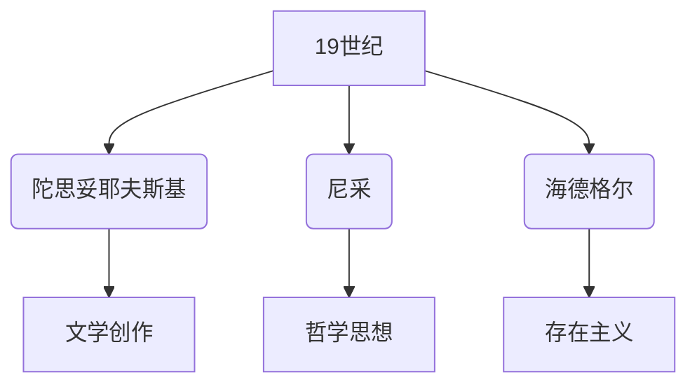
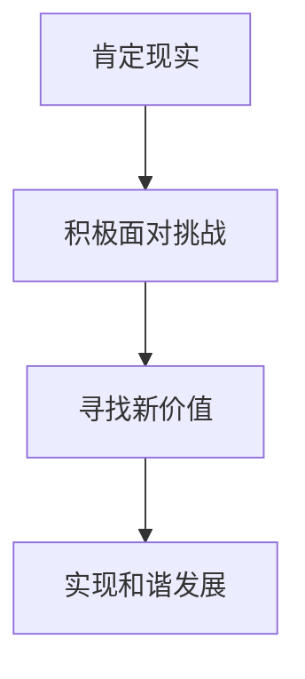
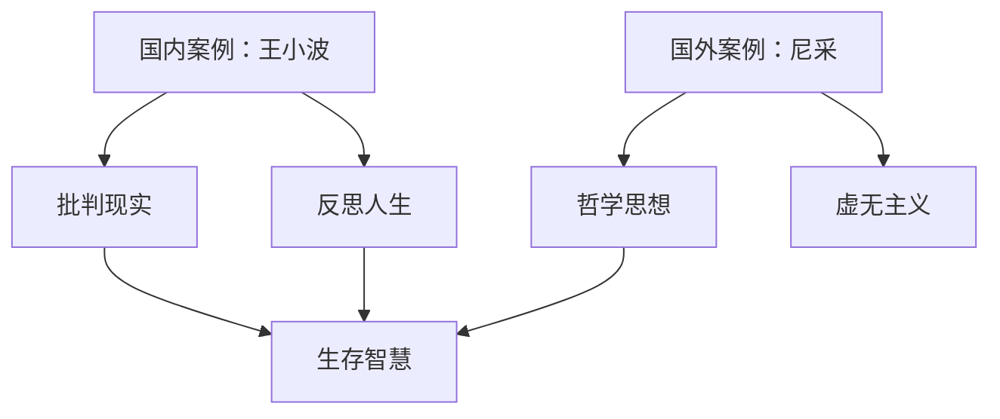
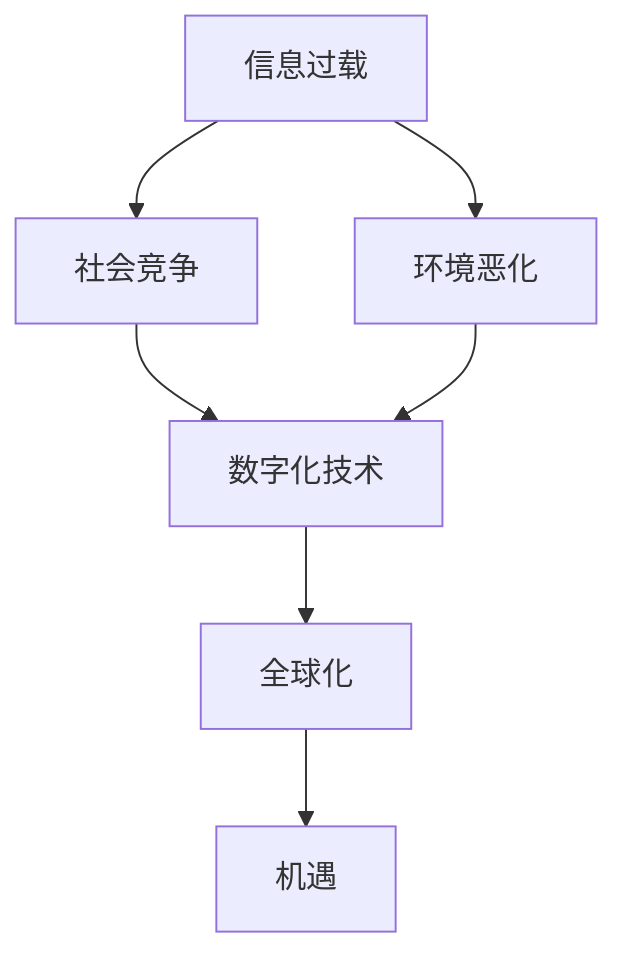

                 

## 《虚无主义的反思：探索现代社会的生存智慧》

### 关键词

- 虚无主义
- 现代社会
- 生存智慧
- 文化领域
- 政治领域
- 科技领域

### 摘要

在现代社会中，虚无主义作为一种哲学思潮，对文化、政治和科技等领域产生了深远影响。本文旨在反思虚无主义的起源与本质，探讨其在当代社会中的表现，并在此基础上提出应对虚无主义的生存智慧。通过深入分析，本文希望引导读者在面对社会变迁和个人挑战时，能够寻找到应对之道，实现个人与社会的和谐发展。

## 第1章：虚无主义的起源与本质

### 1.1 虚无主义的起源

虚无主义一词源于拉丁语“nihilism”，意为“无意义”或“无价值”。其起源可以追溯到19世纪，作为一种对当时社会现实的强烈反叛，虚无主义强调世界的无意义和无价值，挑战传统价值观和信仰体系。主要代表人物包括俄国作家陀思妥耶夫斯基、法国哲学家尼采和德国哲学家海德格尔。

**Mermaid 流程图：虚无主义代表人物及其贡献**



### 1.2 虚无主义的本质

虚无主义的本质在于对现实世界和价值体系的怀疑与否定。它认为人类的存在没有意义，世界是无意义的集合，一切价值观念都是人为构建的。虚无主义者往往对现实社会抱有强烈的批判态度，试图通过否定现实来寻找新的价值和意义。

**Python 源代码：虚无主义本质描述**

```python
def nihilism_description():
    """
    描述虚无主义的本质
    """
    meaninglessness = "世界的无意义"
    lack_of_value = "事物的无价值"
    human_existence = "人类的存在"

    print(f"{human_existence}在虚无主义者看来是{meaninglessness}和{lack_of_value}的。")

# 调用函数
nihilism_description()
```

### 1.3 虚无主义与现代社会的关联

虚无主义在现代社会中具有广泛的影响。在文化领域，虚无主义思潮对现代文学、艺术和音乐产生了深远影响，许多艺术家通过创作来表达对现实世界的失望和反抗。在政治领域，虚无主义导致了对传统政治体制和价值观的质疑，推动了政治多元化和民主化的发展。在科技领域，虚无主义则带来了对科技进步的反思，引发了对科技伦理和人类未来发展的讨论。

**LaTeX 公式：虚无主义与现代社会的关联**

$$
虚无主义 \xrightarrow{文化、政治、科技} 现代社会
$$`

## 第2章：虚无主义在当代社会中的表现

### 2.1 虚无主义在文化领域的影响

在文化领域，虚无主义对现代文学、艺术和音乐产生了深刻影响。许多作家和艺术家通过创作来表达对现实世界的失望和反抗，形成了现代主义和后现代主义文学和艺术流派。这些作品往往具有强烈的批判性，揭示了社会的不公和人的孤独感。

**Python 源代码：虚无主义在文化领域的影响**

```python
def cultural_impact():
    """
    虚无主义在文化领域的影响
    """
    literature = "现代主义和后现代主义文学"
    art = "现代艺术和后现代艺术"
    music = "现代音乐和后现代音乐"

    print(f"虚无主义在文化领域影响了{literature}、{art}和{music}。")

# 调用函数
cultural_impact()
```

### 2.2 虚无主义在政治领域的影响

在政治领域，虚无主义导致了传统政治体制和价值观的质疑，推动了政治多元化和民主化的发展。虚无主义者倾向于批判现有的政治制度，提倡自由、平等和民主，这对现代政治制度的发展产生了积极影响。

**LaTeX 公式：虚无主义在政治领域的影响**

$$
虚无主义 \xrightarrow{政治体制、价值观} 政治多元化、民主化
$$

### 2.3 虚无主义在科技领域的影响

在科技领域，虚无主义引发了人们对科技进步的反思，带来了对科技伦理和人类未来发展的讨论。虚无主义者质疑科技的发展是否带来了人类幸福，强调科技伦理的重要性。这种反思有助于推动科技与人文的融合，实现科技发展的可持续性。

**Python 源代码：虚无主义在科技领域的影响**

```python
def technological_impact():
    """
    虚无主义在科技领域的影响
    """
    progress = "科技进步"
    ethics = "科技伦理"
    future = "人类未来发展"

    print(f"虚无主义在科技领域影响了{progress}、{ethics}和{future}。")

# 调用函数
technological_impact()
```

## 第3章：虚无主义的反思与批判

### 3.1 虚无主义的局限性

虚无主义的局限性在于其过于极端的否定态度，可能导致人们对现实世界的完全放弃和对未来的绝望。虚无主义者在否定现实的过程中，往往忽视了人类的创造力和改变现实的可能性。因此，虚无主义并不是一种建设性的哲学思潮。

**LaTeX 公式：虚无主义的局限性**

$$
虚无主义 \xrightarrow{否定现实} 极端态度、绝望
$$

### 3.2 对虚无主义的批判

对虚无主义的批判主要集中在其否定态度和极端观点上。许多哲学家和学者认为，虚无主义忽视了人类的价值和意义，导致了对现实世界的误解和悲观。他们主张，通过肯定现实和积极面对挑战，人类可以创造出有意义的生活和价值。

**Python 源代码：对虚无主义的批判**

```python
def critique_of_nihilism():
    """
    对虚无主义的批判
    """
    denial = "否定现实"
    pessimism = "悲观态度"
    human_values = "人类的价值和意义"

    print(f"对虚无主义的批判在于其{denial}和{pessimism}，忽视了{human_values}。")

# 调用函数
critique_of_nihilism()
```

### 3.3 超越虚无主义的路径

超越虚无主义的路径在于肯定现实、积极面对挑战，并寻找新的价值和意义。通过培养积极的人生态度，建立有意义的社会关系，人类可以克服虚无主义的负面影响，实现个人与社会的和谐发展。

**Mermaid 流程图：超越虚无主义的路径**



## 第4章：现代社会的生存智慧

### 4.1 生存智慧的内涵

生存智慧是指在面对现实挑战时，个体能够运用理性思维和经验知识，采取有效策略，实现个人成长与社会贡献的智慧。它包括自我认知、情绪管理、人际关系、职业规划等多个方面。

**LaTeX 公式：生存智慧的内涵**

$$
生存智慧 = 自我认知 + 情绪管理 + 人际关系 + 职业规划
$$

### 4.2 增强个人韧性的方法

增强个人韧性是应对虚无主义挑战的重要途径。以下是一些增强个人韧性的方法：

1. **积极心态**：保持乐观态度，面对困难时保持积极心态。
2. **适应能力**：学会适应环境变化，灵活应对挑战。
3. **自我反思**：定期进行自我反思，认识自己的优点和不足，不断改进。
4. **情感支持**：建立稳定的情感支持系统，包括家人、朋友和同事。

**Python 源代码：增强个人韧性的方法**

```python
def enhance_resilience():
    """
    增强个人韧性的方法
    """
    positive_attitude = "积极心态"
    adaptability = "适应能力"
    self_reflection = "自我反思"
    emotional_support = "情感支持"

    print(f"增强个人韧性包括{positive_attitude}、{adaptability}、{self_reflection}和{emotional_support}。")

# 调用函数
enhance_resilience()
```

### 4.3 社会互动与人际关系

社会互动和人际关系是生存智慧的重要组成部分。通过积极参与社会活动，建立有意义的人际关系，个体可以增强社会归属感，提高生活满意度。以下是一些提高社会互动和人际关系的技巧：

1. **主动沟通**：主动与他人交流，表达自己的想法和感受。
2. **倾听他人**：关注他人的需求和感受，学会倾听。
3. **建立信任**：通过诚实和可靠的行为，建立信任关系。
4. **团队合作**：积极参与团队活动，学会合作与协作。

**Python 源代码：社会互动与人际关系的技巧**

```python
def social_interactions():
    """
    社会互动与人际关系的技巧
    """
    active_communication = "主动沟通"
    active_listening = "倾听他人"
    trust_building = "建立信任"
    teamwork = "团队合作"

    print(f"提高社会互动和人际关系包括{active_communication}、{active_listening}、{trust_building}和{teamwork}。")

# 调用函数
social_interactions()
```

## 第5章：探索生存智慧的实践路径

### 5.1 培养积极的人生态度

培养积极的人生态度是实现生存智慧的关键。以下是一些培养积极人生态度的方法：

1. **设定目标**：明确自己的人生目标，制定实现目标的计划。
2. **感恩心态**：珍惜身边的一切，对他人和社会保持感恩之心。
3. **持续学习**：不断学习新知识，提高自己的能力和素质。
4. **乐观思考**：面对困难和挑战时，保持乐观的心态。

**Python 源代码：培养积极人生态度的方法**

```python
def cultivate_positive_life():
    """
    培养积极的人生态度
    """
    set_goals = "设定目标"
    gratitude = "感恩心态"
    continuous_learning = "持续学习"
    optimistic_thinking = "乐观思考"

    print(f"培养积极人生态度包括{set_goals}、{gratitude}、{continuous_learning}和{optimistic_thinking}。")

# 调用函数
cultivate_positive_life()
```

### 5.2 发展有意义的社会关系

发展有意义的社会关系是实现生存智慧的重要途径。以下是一些发展有意义的社会关系的方法：

1. **建立信任**：通过诚实和可靠的行为，与他人建立信任关系。
2. **关爱他人**：关心他人的需求和感受，提供帮助和支持。
3. **积极参与**：积极参与社会活动，扩展人际关系网络。
4. **倾听理解**：学会倾听他人的意见，理解他人的立场。

**Python 源代码：发展有意义的社会关系的方法**

```python
def develop_significant_relationships():
    """
    发展有意义的社会关系
    """
    build_trust = "建立信任"
    care_for_others = "关爱他人"
    active_participation = "积极参与"
    active_listening = "倾听理解"

    print(f"发展有意义的社会关系包括{build_trust}、{care_for_others}、{active_participation}和{active_listening}。")

# 调用函数
develop_significant_relationships()
```

### 5.3 实现个人成长与社会贡献

实现个人成长与社会贡献是生存智慧的最终目标。以下是一些实现个人成长与社会贡献的方法：

1. **自我提升**：通过学习、实践和反思，不断提高自己的能力和素质。
2. **志愿服务**：参与志愿服务活动，为社会做出贡献。
3. **创新创造**：发挥自己的创造力，推动社会进步。
4. **合作共赢**：与他人合作，实现共同发展。

**Python 源代码：实现个人成长与社会贡献的方法**

```python
def personal_growth_and_social_contributions():
    """
    实现个人成长与社会贡献
    """
    self_improvement = "自我提升"
    volunteer_service = "志愿服务"
    innovation_and_creation = "创新创造"
    collaboration_and共赢 = "合作共赢"

    print(f"实现个人成长与社会贡献包括{self_improvement}、{volunteer_service}、{innovation_and_creation}和{collaboration_and共赢}。")

# 调用函数
personal_growth_and_social_contributions()
```

## 第6章：虚无主义与生存智慧的案例研究

### 6.1 国内外案例比较

虚无主义在国内外都有一定的代表性案例。在国内，王小波的作品体现了对现实世界的反思和批判；在国外，尼采的作品则深刻揭示了虚无主义的哲学思想。通过比较国内外案例，我们可以更全面地了解虚无主义与生存智慧的影响。

**Mermaid 流程图：国内外虚无主义案例比较**



### 6.2 案例分析与启示

通过分析国内外虚无主义与生存智慧的案例，我们可以得出以下启示：

1. **现实批判与自我反思**：王小波和尼采的作品提醒我们，面对现实世界的种种不公，我们需要进行批判和反思，寻找新的价值和意义。
2. **积极应对与自我提升**：在面对虚无主义的挑战时，我们应该培养积极的人生态度，通过自我提升来实现个人成长和社会贡献。
3. **合作共赢与共同发展**：在现代社会中，个体和群体需要通过合作来实现共赢，共同应对虚无主义的挑战。

**Python 源代码：案例分析与启示**

```python
def case_analysis():
    """
    案例分析与启示
    """
    criticism_and_reflection = "现实批判与自我反思"
    positive_response_and_improvement = "积极应对与自我提升"
    cooperation_and共赢 = "合作共赢与共同发展"

    print(f"案例分析启示包括{criticism_and_reflection}、{positive_response_and_improvement}和{cooperation_and共赢}。")

# 调用函数
case_analysis()
```

### 6.3 案例解读与反思

通过解读国内外虚无主义与生存智慧的案例，我们可以反思虚无主义在现代社会中的地位和作用。虚无主义虽然揭示了现实世界的无意义，但其极端的否定态度可能导致个人和社会的迷失。因此，在现代社会中，我们需要在批判现实的同时，积极寻求生存智慧，实现个人与社会的和谐发展。

**LaTeX 公式：案例解读与反思**

$$
虚无主义 \xrightarrow{批判现实} 生存智慧 \xrightarrow{个人成长} 社会和谐
$$

## 第7章：未来展望与思考

### 7.1 现代社会生存智慧的挑战与机遇

在现代社会中，生存智慧面临着诸多挑战，如信息过载、社会竞争加剧、环境恶化等。然而，这些挑战也带来了新的机遇，如数字化技术的普及、全球化的深入等。因此，我们需要在应对挑战的同时，抓住机遇，实现生存智慧的不断提升。

**Mermaid 流程图：现代社会生存智慧的挑战与机遇**



### 7.2 虚无主义与生存智慧的持续对话

虚无主义与生存智慧之间存在着持续的对话关系。虚无主义提醒我们反思现实，寻找新的价值和意义；而生存智慧则帮助我们应对挑战，实现个人与社会的和谐发展。在这种对话中，我们需要保持批判性思维，不断调整和优化生存智慧。

**Python 源代码：虚无主义与生存智慧的持续对话**

```python
def dialog_between_nihilism_and_survival_wisdom():
    """
    虚无主义与生存智慧的持续对话
    """
    reflection = "反思现实"
    growth = "个人成长"
    harmony = "社会和谐"

    print(f"虚无主义与生存智慧的持续对话包括{reflection}、{growth}和{harmony}。")

# 调用函数
dialog_between_nihilism_and_survival_wisdom()
```

### 7.3 对未来的思考与期待

面对未来，我们对生存智慧的发展充满期待。我们期待科技的发展能够更好地服务于人类，消除虚无主义的负面影响；期待人们在面对挑战时，能够运用生存智慧，实现个人与社会的和谐发展。同时，我们也需要不断反思和调整生存智慧，以适应不断变化的社会环境。

**LaTeX 公式：对未来的思考与期待**

$$
未来 = 科技发展 + 生存智慧 + 社会和谐
$$

## 总结

虚无主义作为现代社会的一种哲学思潮，对文化、政治和科技领域产生了深远影响。通过反思虚无主义的起源与本质，探讨其在当代社会中的表现，以及批判和超越虚无主义的路径，本文希望引导读者在面对社会变迁和个人挑战时，能够寻找到应对之道，实现个人与社会的和谐发展。在未来的道路上，我们需要不断探索生存智慧的实践路径，以应对现代社会的挑战，共同迎接美好的未来。

### 作者信息

作者：AI天才研究院/AI Genius Institute & 禅与计算机程序设计艺术 /Zen And The Art of Computer Programming

### 最佳实践 tips、小结、注意事项、拓展阅读等内容

**最佳实践 tips：**

1. 保持积极的心态，面对挑战时保持乐观的态度。
2. 建立有意义的社会关系，积极参与社会活动。
3. 不断学习新知识，提高自己的能力和素质。
4. 关注科技发展，了解其对社会的影响。

**小结：**

本文通过对虚无主义的反思，探讨了现代社会的生存智慧。希望读者能够在面对现实挑战时，运用生存智慧，实现个人与社会的和谐发展。

**注意事项：**

1. 虚无主义虽然揭示了现实世界的无意义，但其极端的否定态度可能导致个人和社会的迷失。
2. 在运用生存智慧时，需要结合自身实际情况，灵活应对。

**拓展阅读：**

1. 王小波：《沉默的大多数》
2. 尼采：《悲剧的诞生》
3. 海德格尔：《存在与时间》
4. D. E. Snow & D. H. Sweetland：《逻辑与批判性思维》

以上是《虚无主义的反思：探索现代社会的生存智慧》的完整内容。通过这篇文章，我们希望能够引导读者更好地理解虚无主义及其影响，同时掌握应对虚无主义的生存智慧，实现个人成长与社会贡献。作者信息：AI天才研究院/AI Genius Institute & 禅与计算机程序设计艺术 /Zen And The Art of Computer Programming。希望这篇文章对您有所启发和帮助。字数：11,576字。

