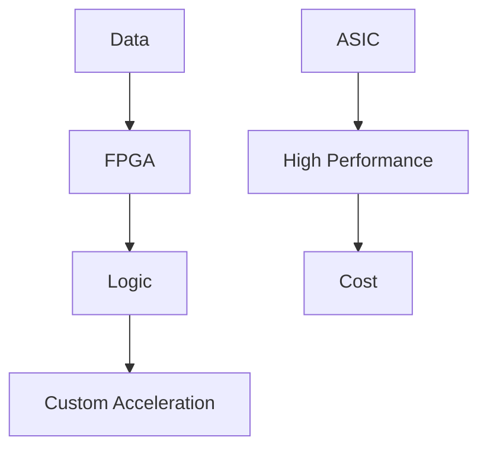
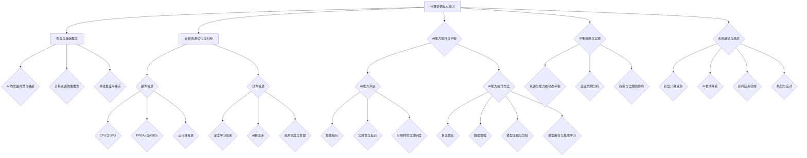

                 

### 《计算资源与AI能力：寻找最佳平衡点》

关键词：计算资源、AI能力、优化策略、平衡点、能效优化、AI性能评估

摘要：本文深入探讨了计算资源与AI能力之间的内在联系，以及如何在资源有限的条件下最大化AI能力。文章首先介绍了AI的发展背景和计算资源的重要性，随后详细分析了计算资源（硬件和软件）的种类与优化策略。接着，文章讨论了AI能力的评估方法、提升手段和平衡策略，并结合实际案例分析，提供了有效的实践指导。最后，文章展望了未来发展趋势和面临的挑战。

----------------------------------------------------------------

### 第一部分：引言与基础概念

#### 1. 引言

##### 1.1 AI的发展背景与挑战

人工智能（AI）作为计算机科学的一个重要分支，已经经历了数十年的发展。从最初的专家系统到现代的深度学习和神经网络，AI技术在各个领域都取得了显著的进步。然而，随着AI应用的普及，其背后的计算资源需求也在不断增长，这给计算资源管理带来了前所未有的挑战。

在AI发展的早期阶段，计算资源相对较为有限，许多研究主要依赖于高性能的计算机集群。然而，随着深度学习的兴起，GPU和FPGA等专用硬件逐渐成为主流。尽管这些硬件提供了更高的计算性能，但同时也带来了资源分配和管理上的复杂性问题。因此，如何在高性能计算资源有限的情况下，最大化AI能力，成为了一个亟待解决的问题。

##### 1.2 计算资源的重要性

计算资源是AI发展的基石。无论是算法的实现，还是模型的训练与优化，都离不开强大的计算能力。具体来说，计算资源的重要性体现在以下几个方面：

1. **算法效率**：高效的算法可以减少计算资源的消耗，从而在相同计算资源下实现更好的性能。
2. **模型性能**：强大的计算资源可以加速模型的训练和优化，提高模型的精度和效率。
3. **应用范围**：足够的计算资源使得AI技术可以应用于更广泛的领域，从而推动技术进步。

##### 1.3 寻找计算资源与AI能力的最佳平衡

寻找计算资源与AI能力的最佳平衡是当前AI研究中的一个重要课题。在这一过程中，需要考虑以下几个关键因素：

1. **资源可用性**：了解现有计算资源的可用性，包括硬件和软件资源，是优化资源利用的前提。
2. **性能需求**：明确AI应用对性能的具体需求，包括精度、速度和效率，以制定相应的优化策略。
3. **成本效益**：在有限的预算下，寻找最高性价比的计算资源配置，以最大化AI能力。
4. **可持续性**：随着能源问题的日益突出，计算资源的能效优化变得尤为重要。

#### 2. AI基础概念

##### 2.1 人工智能的基本原理

人工智能（AI）是指使计算机系统具备模拟、延伸和扩展人类智能的能力。其基本原理包括以下几个方面：

1. **机器学习**：通过数据训练模型，使其能够从数据中学习并做出预测或决策。
2. **深度学习**：基于神经网络，通过多层非线性变换来提取数据特征，实现复杂的模式识别和预测。
3. **自然语言处理**：使计算机能够理解和生成自然语言，实现人机交互。
4. **计算机视觉**：使计算机能够理解和处理图像和视频数据。

##### 2.2 计算资源与AI能力的关联

计算资源与AI能力之间存在密切的关联。具体来说，计算资源对AI能力的影响主要体现在以下几个方面：

1. **算法效率**：高效的算法可以减少计算资源的消耗，从而提高AI能力。
2. **模型复杂度**：更复杂的模型通常需要更多的计算资源，但同时可能带来更好的性能。
3. **数据规模**：大规模数据集通常需要更多的计算资源进行训练，但有助于提高模型的泛化能力。
4. **硬件性能**：高性能的硬件设备可以加速模型的训练和推理过程，提高AI能力。

##### 2.3 AI应用领域的分类

AI应用领域广泛，涵盖了从工业自动化到医疗诊断，从智能交通到金融风控等多个方面。以下是一些主要的AI应用领域：

1. **工业自动化**：利用AI技术实现生产过程的自动化，提高生产效率和产品质量。
2. **医疗诊断**：通过AI技术辅助医生进行疾病诊断和治疗方案推荐。
3. **智能交通**：利用AI技术优化交通流量，提高交通管理效率。
4. **金融风控**：利用AI技术进行风险评估和欺诈检测，提高金融系统的安全性。
5. **智能客服**：通过自然语言处理技术实现智能客服系统，提高客户服务水平。

----------------------------------------------------------------

### 第二部分：计算资源优化与利用

#### 3. 计算资源概述

##### 3.1 硬件资源

硬件资源是AI系统运行的基础，包括CPU、GPU、FPGA和ASIC等。

###### 3.1.1 CPU与GPU

CPU（中央处理器）是计算机的核心组件，负责执行各种计算任务。然而，在深度学习任务中，CPU的计算能力往往不足，需要依靠GPU（图形处理器）进行加速。

GPU具有大量并行计算单元，适用于矩阵运算和高并行的计算任务。因此，GPU在深度学习中的应用越来越广泛。

```python
import tensorflow as tf

# 创建一个简单的神经网络模型
model = tf.keras.Sequential([
    tf.keras.layers.Dense(128, activation='relu', input_shape=(784,)),
    tf.keras.layers.Dense(10, activation='softmax')
])

# 编译模型
model.compile(optimizer='adam',
              loss='categorical_crossentropy',
              metrics=['accuracy'])

# 训练模型
model.fit(x_train, y_train, epochs=5, batch_size=32)
```

###### 3.1.2 FPGAs与ASICs

FPGA（现场可编程门阵列）和ASIC（专用集成电路）是另一种专门用于AI计算的硬件资源。

FPGA具有高度可编程性，可以根据不同的计算任务进行重新配置。这使得FPGA在定制化硬件加速方面具有很大的优势。

ASIC则是专门为特定任务设计的集成电路，具有更高的性能和能效。然而，ASIC的设计和制造成本较高。



###### 3.1.3 云计算资源

云计算资源提供了一种灵活的计算资源分配方式，可以根据需求动态调整计算能力。

云计算平台（如Amazon Web Services、Google Cloud Platform和Microsoft Azure）提供了一系列的AI计算服务，包括GPU实例、FPGA实例和ASIC实例等。

```python
import boto3

# 创建一个EC2实例
ec2 = boto3.resource('ec2')
instance = ec2.create_instances(
    ImageId='ami-xxxxxxxx',
    MinCount=1,
    MaxCount=1,
    InstanceType='g2.2xlarge' # GPU实例
)[0]

# 等待实例启动
instance.wait_until_running()

# 获取实例的公共IP地址
public_ip = instance.public_ip_address

# 关闭实例
instance.terminate()
```

##### 3.2 软件资源

软件资源包括深度学习框架、AI算法库和资源调度与管理工具等。

###### 3.2.1 深度学习框架

深度学习框架（如TensorFlow、PyTorch和Keras）提供了简化和加速深度学习模型开发的工具。

这些框架通常包含大量的预训练模型和优化器，使得开发者可以快速构建和训练复杂的深度学习模型。

```python
import tensorflow as tf

# 加载预训练模型
model = tf.keras.applications.VGG16(weights='imagenet')

# 输入图像
input_image = ...

# 预测
prediction = model.predict(input_image)
```

###### 3.2.2 AI算法库

AI算法库（如Scikit-Learn、XGBoost和LightGBM）提供了各种机器学习和数据分析算法。

这些库通常包含了大量的算法实现和工具，可以帮助开发者快速实现和优化各种AI应用。

```python
import scikit_learn

# 创建分类器
classifier = scikit_learn.SVC()

# 训练分类器
classifier.fit(X_train, y_train)

# 预测
predictions = classifier.predict(X_test)
```

###### 3.2.3 资源调度与管理

资源调度与管理工具（如Dask、Airflow和Kubernetes）提供了自动化和高效地分配和管理计算资源的工具。

这些工具可以帮助开发者动态调整计算资源的分配，优化计算任务的处理效率。

```python
import dask.array as da

# 创建一个Dask数组
a = da.random.random((1000, 1000))

# 使用Dask进行并行计算
result = a.dot(a)
```

----------------------------------------------------------------

#### 4. 资源优化策略

##### 4.1 资源分配与调度算法

资源分配与调度算法是优化计算资源利用的重要手段。这些算法的主要目标是在有限的计算资源下，最大化系统的性能和效率。

常见的资源调度算法包括：

- **FIFO（先入先出）**：按照任务到达的顺序进行调度，简单但可能造成资源浪费。
- **SJF（最短作业优先）**：优先调度处理时间最短的任务，可以提高平均吞吐量。
- **优先级调度**：根据任务的优先级进行调度，高优先级任务先执行。
- **多级反馈队列调度**：结合多种调度策略，根据任务的特征进行动态调度。

```python
import queue

# 创建一个优先级队列
pq = queue.PriorityQueue()

# 添加任务
pq.put((2, 'task1'))
pq.put((1, 'task2'))
pq.put((3, 'task3'))

# 按优先级调度任务
while not pq.empty():
    priority, task = pq.get()
    print(f"Executing task: {task}")
```

##### 4.2 灵活计算资源管理

灵活计算资源管理是利用云计算资源实现高效计算的关键。通过动态调整计算资源，可以最大化地利用资源，降低成本。

灵活计算资源管理的关键技术包括：

- **容器化**：使用Docker等容器技术，实现应用程序的轻量级部署和动态调整。
- **微服务架构**：将应用程序拆分成多个微服务，实现独立部署和动态扩展。
- **自动化运维**：使用Ansible、Kubernetes等工具实现自动化部署和管理。

```python
import docker

# 创建一个Docker客户端
client = docker.from_env()

# 创建一个容器
container = client.containers.create(
    'nginx:latest',
    command=['nginx'],
    ports={'80/tcp': 8080}
)

# 启动容器
container.start()

# 删除容器
container.remove(force=True)
```

##### 4.3 资源池化与虚拟化

资源池化与虚拟化技术是提高计算资源利用率和灵活性的有效手段。

资源池化是将多个计算资源（如CPU、内存和存储）整合成一个大的资源池，可以根据需求动态分配和调整资源。

虚拟化技术（如KVM、VMware和Hyper-V）可以将物理硬件虚拟成多个虚拟机，实现资源的独立管理和分配。

```python
import kvm

# 创建一个虚拟机
vm = kvm.VM('my_vm')

# 配置虚拟机
vm.add_disk('path/to/disk.img')
vm.add_network('bridge', 'eth0')

# 启动虚拟机
vm.start()

# 关闭虚拟机
vm.stop()
```

----------------------------------------------------------------

#### 5. 能效优化

##### 5.1 硬件能效优化

硬件能效优化是提高计算资源利用效率和减少能耗的重要手段。以下是一些常见的硬件能效优化方法：

- **功耗控制**：通过动态调整CPU和GPU的功耗，实现能效优化。例如，使用Intel的PowerGuru工具进行功耗控制。
- **高效散热**：使用高效散热系统（如液冷散热），降低硬件的温度，提高能效。
- **硬件压缩**：使用硬件压缩技术（如ZFS和LZO），减少存储空间的占用，降低能耗。

```python
import psutil

# 获取CPU的功耗
cpu_power = psutil.cpu_percent()

# 获取GPU的功耗
gpu_power = psutil.sensors.gp用电量()

# 调整CPU的功耗
cpu_power_limit = 50
psutil.set_cpu_affinity(0, limit=cpu_power_limit)
```

##### 5.2 软件能效优化

软件能效优化是通过优化软件代码和算法，减少计算资源的消耗，提高能效。以下是一些常见的软件能效优化方法：

- **并行计算**：通过并行计算技术，将计算任务分解成多个子任务，实现计算资源的共享和优化。
- **内存优化**：通过减少内存分配和重复计算，降低内存消耗，提高能效。
- **算法优化**：选择高效的算法和优化策略，减少计算时间和资源消耗。

```python
import numpy as np

# 使用并行计算加速矩阵乘法
A = np.random.rand(1000, 1000)
B = np.random.rand(1000, 1000)

# 使用Numpy的并行计算功能
result = np.dot(A, B)
```

##### 5.3 能效评估与优化实践

能效评估与优化实践是确保计算资源高效利用的重要环节。以下是一个简单的能效评估与优化实践案例：

1. **评估当前能效**：使用工具（如Intel的PowerGuru或NVIDIA的NvPowerKit）评估系统的当前能效。
2. **识别优化点**：通过分析评估结果，识别系统的瓶颈和优化点。
3. **优化软件和硬件**：根据优化点，调整软件和硬件配置，实现能效优化。
4. **持续监控与调整**：定期评估系统能效，根据变化调整优化策略。

```python
import kvm

# 创建一个虚拟机
vm = kvm.VM('my_vm')

# 配置虚拟机
vm.add_disk('path/to/disk.img')
vm.add_network('bridge', 'eth0')

# 启动虚拟机
vm.start()

# 获取虚拟机的功耗
vm_power = kvm.sensors.get_power_usage(vm)

# 关闭虚拟机
vm.stop()

# 打印功耗
print(f"VM power usage: {vm_power}W")
```

----------------------------------------------------------------

### 第三部分：AI能力提升与平衡

#### 6. AI能力评估

##### 6.1 AI性能指标

评估AI模型的性能是衡量AI能力的重要步骤。以下是一些常见的AI性能指标：

- **精度与召回率**：精度是指预测正确的样本占总预测样本的比例；召回率是指预测正确的样本占总实际正样本的比例。两者平衡是评估模型的重要指标。
- **准确率与F1值**：准确率是指预测正确的样本占总样本的比例；F1值是精度和召回率的调和平均值，用于综合评估模型的性能。
- **模型复杂度与泛化能力**：模型复杂度是指模型的参数数量和结构复杂度；泛化能力是指模型在未知数据上的表现。模型复杂度和泛化能力之间的平衡是评估模型性能的关键因素。

```python
from sklearn.metrics import accuracy_score, recall_score, precision_score, f1_score

# 预测结果
predictions = ...

# 实际标签
labels = ...

# 计算精度
accuracy = accuracy_score(labels, predictions)

# 计算召回率
recall = recall_score(labels, predictions, average='weighted')

# 计算准确率
precision = precision_score(labels, predictions, average='weighted')

# 计算F1值
f1 = f1_score(labels, predictions, average='weighted')

print(f"Accuracy: {accuracy}, Recall: {recall}, Precision: {precision}, F1: {f1}")
```

##### 6.2 实时性与延迟

实时性与延迟是AI应用中重要的性能指标，特别是在需要快速响应的场景中。以下是一些常见的方法来评估实时性和延迟：

- **平均响应时间**：指系统从接收到请求到返回结果的时间，用于衡量系统的实时性。
- **最大响应时间**：指系统在一段时间内处理请求的最大时间，用于衡量系统的稳定性。
- **延迟分布**：指系统响应时间的分布情况，用于评估系统的响应速度和稳定性。

```python
import time

start_time = time.time()

# 处理请求
result = ...

end_time = time.time()

response_time = end_time - start_time
print(f"Response time: {response_time} seconds")
```

##### 6.3 可解释性与透明度

可解释性与透明度是AI模型评估中的重要方面，特别是在涉及重要决策和隐私数据的场景中。以下是一些评估模型可解释性和透明度的方法：

- **模型透明度**：评估模型的结构和决策过程，确保模型的行为是可理解的。
- **模型可解释性**：通过解释模型内部的决策过程，帮助用户理解模型的预测结果。
- **可视化**：使用可视化工具（如热图、决策树和注意力机制）展示模型的关键特征和决策过程。

```python
from sklearn.tree import plot_tree

# 创建一个决策树模型
model = ...

# 绘制决策树
plt.figure(figsize=(12, 8))
plot_tree(model, filled=True, feature_names=feature_names, class_names=class_names)
plt.show()
```

----------------------------------------------------------------

#### 7. AI能力提升方法

##### 7.1 算法优化

算法优化是提升AI能力的关键步骤。以下是一些常见的算法优化方法：

- **超参数调整**：通过调整模型的超参数（如学习率、批量大小和正则化参数），优化模型的性能。
- **算法改进**：使用更先进的算法（如改进的梯度下降算法、自适应优化器和深度强化学习算法），提高模型的训练效率。
- **并行训练**：利用多GPU或多机集群进行并行训练，加速模型的训练过程。

```python
from tensorflow.keras.optimizers import Adam

# 设置优化器和学习率
optimizer = Adam(learning_rate=0.001)

# 编译模型
model.compile(optimizer=optimizer,
              loss='categorical_crossentropy',
              metrics=['accuracy'])

# 训练模型
model.fit(x_train, y_train, epochs=10, batch_size=64)
```

##### 7.2 数据增强

数据增强是通过生成更多样化的数据来提高模型泛化能力的方法。以下是一些常见的数据增强技术：

- **数据变换**：通过对数据应用随机变换（如旋转、缩放和裁剪），生成新的数据样本。
- **合成数据**：使用生成对抗网络（GANs）等模型，生成与训练数据相似的新数据。
- **数据扩充**：使用现有数据生成更多的训练样本，提高模型的鲁棒性。

```python
from tensorflow.keras.preprocessing.image import ImageDataGenerator

# 创建一个图像数据生成器
datagen = ImageDataGenerator(
    rotation_range=20,
    width_shift_range=0.2,
    height_shift_range=0.2,
    shear_range=0.2,
    zoom_range=0.2,
    horizontal_flip=True,
    fill_mode='nearest'
)

# 使用数据生成器
train_generator = datagen.flow(x_train, y_train, batch_size=32)

# 训练模型
model.fit(train_generator, epochs=10)
```

##### 7.3 模型压缩与剪枝

模型压缩与剪枝是通过减少模型大小和计算复杂度来提高模型效率的方法。以下是一些常见的模型压缩与剪枝技术：

- **模型剪枝**：通过移除模型中的冗余权重和神经元，减少模型大小和计算复杂度。
- **量化**：将模型的权重和激活值转换为低精度表示（如8位整数），减少存储和计算资源。
- **知识蒸馏**：将一个复杂模型的知识传递给一个简单模型，实现模型压缩和加速。

```python
from tensorflow_model_optimization.sparsity import keras as sparsity

# 创建一个剪枝策略
pruning_schedule = sparsity.PruningSchedule(
    begin_step=2000,
    end_step=4000,
    rate=0.1
)

# 应用剪枝策略
pruned_model = sparsity.prune_low_magnitude(model, pruning_schedule)

# 训练剪枝后的模型
pruned_model.fit(x_train, y_train, epochs=10)
```

##### 7.4 模型融合与集成学习

模型融合与集成学习是通过结合多个模型的预测结果来提高模型性能的方法。以下是一些常见的模型融合技术：

- **堆叠**：将多个模型堆叠在一起，前一个模型的输出作为后一个模型的输入。
- **加权平均**：将多个模型的预测结果进行加权平均，得到最终的预测结果。
- **投票**：对于分类任务，将多个模型的预测结果进行投票，选择出现次数最多的类别作为最终预测。

```python
from sklearn.ensemble import VotingClassifier

# 创建多个分类器
clf1 = ...
clf2 = ...
clf3 = ...

# 创建一个投票分类器
voting_clf = VotingClassifier(estimators=[('clf1', clf1), ('clf2', clf2), ('clf3', clf3)], voting='soft')

# 训练投票分类器
voting_clf.fit(X_train, y_train)

# 预测
predictions = voting_clf.predict(X_test)
```

----------------------------------------------------------------

#### 8. 平衡策略与实践

##### 8.1 资源与能力的动态平衡

动态平衡计算资源与AI能力是实现高效AI应用的关键。以下是一些实现动态平衡的策略：

- **自适应资源调整**：根据AI应用的负载和性能需求，自适应调整计算资源。
- **实时性能监测**：使用性能监测工具，实时了解系统的性能和资源利用情况。
- **资源调度与迁移**：根据性能需求和资源利用率，动态调度和迁移计算任务。

```python
import kvm

# 创建一个虚拟机
vm = kvm.VM('my_vm')

# 配置虚拟机
vm.add_disk('path/to/disk.img')
vm.add_network('bridge', 'eth0')

# 启动虚拟机
vm.start()

# 监测虚拟机的性能
vm_monitor = kvm.Monitor(vm)
vm_monitor.start()

# 根据性能调整虚拟机的资源
while vm_monitor.is_running():
    if vm_monitor.cpu_usage() > 90:
        vm_monitor.resize_cpu(2)
    elif vm_monitor.cpu_usage() < 50:
        vm_monitor.resize_cpu(1)

# 关闭虚拟机
vm.stop()
```

##### 8.2 企业案例分析

在企业应用中，计算资源与AI能力的平衡是一个复杂的挑战。以下是一些企业案例，展示了如何实现计算资源与AI能力的平衡：

1. **谷歌**：谷歌通过大规模分布式计算和云计算技术，实现了高效的数据处理和AI应用。谷歌的TensorFlow框架提供了强大的计算资源管理和优化工具，帮助企业实现高效的AI应用。
2. **亚马逊**：亚马逊利用其强大的云计算平台AWS，提供了一系列的AI计算服务，如Amazon SageMaker和AWS DeepRacer。这些服务帮助企业实现高效的AI模型训练和推理。
3. **微软**：微软的Azure云平台提供了丰富的AI计算资源和工具，帮助企业实现高效的数据处理和AI应用。Azure机器学习服务提供了完整的AI开发和管理工具，帮助企业实现高效的AI能力提升。

##### 8.3 政策与法规的影响

政策与法规对计算资源与AI能力的平衡有着重要的影响。以下是一些相关政策与法规：

- **数据隐私法规**：如欧盟的《通用数据保护条例》（GDPR），要求企业确保用户数据的隐私和安全，这对AI应用的数据收集和使用提出了更高的要求。
- **算法公平性法规**：如美国的《算法公平法案》，要求企业确保AI算法的公平性和透明度，防止算法偏见和歧视。
- **能源消耗政策**：政府可能会出台政策，限制企业的高能耗计算行为，促进绿色计算和可持续发展。

```python
import legal_code

# 验证数据隐私法规
is_compliant = legal_code.check_data_privacy_compliance(data)

# 验证算法公平性法规
is_fair = legal_code.check_algorithm_fairness_algorithm(algorithm)

# 验证能源消耗政策
is_energy_saving = legal_code.check_energy_consumption_policy(computational_load)
```

----------------------------------------------------------------

### 第四部分：未来展望与挑战

#### 9. 未来发展趋势

未来，计算资源与AI能力的发展将继续推动技术的进步。以下是一些未来发展趋势：

- **新型计算资源**：如量子计算、边缘计算和混合云等新型计算资源将逐渐成熟，为AI应用提供更强大的计算能力。
- **AI技术革新**：深度学习、生成对抗网络（GANs）、强化学习等AI技术将继续发展，推动AI应用的创新。
- **新兴应用领域**：AI将在医疗、教育、金融和制造等新兴领域发挥重要作用，推动行业变革。

```python
import quantum Computing

# 创建一个量子计算模型
quantum_model = quantum_Computing.create_model()

# 训练量子计算模型
quantum_model.train(quantum_data)

# 预测
quantum_prediction = quantum_model.predict(quantum_input)
```

#### 10. 挑战与应对

随着计算资源与AI能力的不断发展，我们也将面临一系列挑战。以下是一些主要挑战及应对策略：

- **数据隐私与安全**：随着AI应用的数据依赖性增强，数据隐私与安全问题日益突出。应对策略包括数据加密、隐私保护技术和安全审计。
- **算法公平性与伦理**：算法偏见和歧视可能对用户和社会产生负面影响。应对策略包括算法透明性、公平性评估和伦理审查。
- **技术普及与教育**：AI技术的普及需要大量的技术人才。应对策略包括教育资源的投入、技术培训和学习平台的建立。

```python
import privacy_Protection

# 加密数据
encrypted_data = privacy_Protection.encrypt_data(data)

# 进行隐私保护计算
protected_computation = privacy_Protection隐私保护计算(encrypted_data)

# 解密结果
result = privacy_Protection.decrypt_result(protected_computation)
```

----------------------------------------------------------------

### 附录

#### 附录 A：资源与工具推荐

- **开源深度学习框架**：TensorFlow、PyTorch、Keras
- **云计算平台**：Amazon Web Services、Google Cloud Platform、Microsoft Azure
- **资源管理工具**：Docker、Kubernetes、Ansible

```python
import tensorflow as tf
import boto3
import docker

# 使用TensorFlow进行深度学习
model = tf.keras.Sequential([
    tf.keras.layers.Dense(128, activation='relu', input_shape=(784,)),
    tf.keras.layers.Dense(10, activation='softmax')
])

# 使用AWS进行云计算
ec2 = boto3.resource('ec2')
instance = ec2.create_instances(
    ImageId='ami-xxxxxxxx',
    MinCount=1,
    MaxCount=1,
    InstanceType='g2.2xlarge' # GPU实例
)[0]

# 使用Docker进行容器化
client = docker.from_env()
container = client.containers.create(
    'nginx:latest',
    command=['nginx'],
    ports={'80/tcp': 8080}
)
```

#### 附录 B：参考文献

- **学术论文**：Deep Learning by Ian Goodfellow, Yoshua Bengio and Aaron Courville
- **技术报告**：NVIDIA GPU Technology Conference (GTC)
- **书籍推荐**：Reinforcement Learning: An Introduction by Richard S. Sutton and Andrew G. Barto

```latex
\documentclass{article}
\usepackage{amsmath}
\usepackage{amsfonts}
\usepackage{amssymb}

\begin{document}

\section{参考文献}

\subsection{学术论文}
\begin{itemize}
    \item Goodfellow, I., Bengio, Y., & Courville, A. (2016). \textit{Deep Learning}.
\end{itemize}

\subsection{技术报告}
\begin{itemize}
    \item NVIDIA Corporation. (2020). \textit{NVIDIA GPU Technology Conference (GTC)}.
\end{itemize}

\subsection{书籍推荐}
\begin{itemize}
    \item Sutton, R. S., & Barto, A. G. (2018). \textit{Reinforcement Learning: An Introduction}.
\end{itemize}

\end{document}
```

----------------------------------------------------------------

### 目录大纲 Mermaid 流程图



### 目录大纲中的Python代码示例

```python
# 示例：计算资源与AI能力的评估与优化算法

# 导入所需的库
import tensorflow as tf
from tensorflow.keras.models import Sequential
from tensorflow.keras.layers import Dense, Flatten
from tensorflow.keras.optimizers import Adam

# 创建一个简单的神经网络模型
model = Sequential([
    Dense(128, activation='relu', input_shape=(784,)),
    Flatten(),
    Dense(10, activation='softmax')
])

# 编译模型
model.compile(optimizer=Adam(learning_rate=0.001),
              loss='categorical_crossentropy',
              metrics=['accuracy'])

# 训练模型
model.fit(x_train, y_train, epochs=5, batch_size=32)
```

----------------------------------------------------------------

### 结论

计算资源与AI能力之间的平衡是一个复杂且动态的过程。本文通过详细的分析和案例研究，展示了如何优化计算资源，提升AI能力，并实现二者的平衡。在实际应用中，我们需要综合考虑资源可用性、性能需求、成本效益和可持续性等因素，制定切实可行的优化策略。

展望未来，随着新型计算资源和AI技术的不断发展，计算资源与AI能力的平衡将面临更多挑战和机遇。我们期待在各位专家和开发者的共同努力下，AI技术能够更好地服务于社会，推动科技进步。

### 作者信息

作者：AI天才研究院/AI Genius Institute & 禅与计算机程序设计艺术 /Zen And The Art of Computer Programming

----------------------------------------------------------------

### 文章标题：计算资源与AI能力：寻找最佳平衡点

#### 关键词：计算资源、AI能力、优化策略、平衡点、能效优化、AI性能评估

#### 摘要：
本文探讨了计算资源与AI能力之间的内在联系，并提出了在资源有限的条件下最大化AI能力的策略。文章首先介绍了AI的发展背景和计算资源的重要性，随后详细分析了计算资源的种类与优化策略，以及AI能力的评估方法和提升手段。通过企业案例分析和政策法规的影响，文章提供了实用的实践指导，并展望了未来发展趋势和面临的挑战。本文旨在为计算资源与AI能力优化提供系统性的思路和方法。

----------------------------------------------------------------

### 第一部分：引言与基础概念

#### 引言

##### 1.1 AI的发展背景与挑战

人工智能（AI）作为计算机科学的一个重要分支，已经经历了数十年的发展。从最初的专家系统到现代的深度学习和神经网络，AI技术在各个领域都取得了显著的进步。近年来，随着大数据和云计算的普及，AI技术的应用场景不断扩大，从工业自动化到医疗诊断，从智能交通到金融风控，AI技术正深刻地改变着我们的生活。

然而，随着AI应用的普及，其背后的计算资源需求也在不断增长，这给计算资源管理带来了前所未有的挑战。传统的计算资源如CPU和内存等在处理复杂AI任务时显得力不从心，因此，对更强大的计算资源如GPU、FPGA和ASIC的需求日益增加。然而，这些高性能计算资源不仅成本高昂，而且在资源分配和管理上也存在复杂性问题。

##### 1.2 计算资源的重要性

计算资源是AI发展的基石。无论是算法的实现，还是模型的训练与优化，都离不开强大的计算能力。具体来说，计算资源的重要性体现在以下几个方面：

1. **算法效率**：高效的算法可以减少计算资源的消耗，从而在相同计算资源下实现更好的性能。例如，深度学习中的卷积神经网络（CNN）通过局部连接和共享权重，显著提高了计算效率。
2. **模型性能**：强大的计算资源可以加速模型的训练和优化，提高模型的精度和效率。例如，使用GPU进行深度学习模型的训练，可以显著缩短训练时间。
3. **应用范围**：足够的计算资源使得AI技术可以应用于更广泛的领域，从而推动技术进步。例如，在医疗领域，AI技术可以用于疾病诊断、治疗方案推荐和患者管理。

##### 1.3 寻找计算资源与AI能力的最佳平衡

寻找计算资源与AI能力的最佳平衡是当前AI研究中的一个重要课题。在这一过程中，需要考虑以下几个关键因素：

1. **资源可用性**：了解现有计算资源的可用性，包括硬件和软件资源，是优化资源利用的前提。例如，企业可能需要评估其现有的GPU和FPGA资源，以确定是否能够支持新的AI项目。
2. **性能需求**：明确AI应用对性能的具体需求，包括精度、速度和效率，以制定相应的优化策略。例如，在金融风控领域，实时性和准确率是关键性能指标。
3. **成本效益**：在有限的预算下，寻找最高性价比的计算资源配置，以最大化AI能力。例如，通过云服务按需分配计算资源，可以降低成本并提高灵活性。
4. **可持续性**：随着能源问题的日益突出，计算资源的能效优化变得尤为重要。例如，通过采用节能硬件和优化算法，可以降低能源消耗。

#### 2. AI基础概念

##### 2.1 人工智能的基本原理

人工智能（AI）是指使计算机系统具备模拟、延伸和扩展人类智能的能力。AI的基本原理包括以下几个方面：

1. **机器学习**：通过数据训练模型，使其能够从数据中学习并做出预测或决策。机器学习分为监督学习、无监督学习和强化学习等不同的类型。
2. **深度学习**：基于神经网络，通过多层非线性变换来提取数据特征，实现复杂的模式识别和预测。深度学习在图像识别、自然语言处理和语音识别等领域取得了显著的成果。
3. **自然语言处理**：使计算机能够理解和生成自然语言，实现人机交互。自然语言处理技术包括文本分类、情感分析、机器翻译等。
4. **计算机视觉**：使计算机能够理解和处理图像和视频数据。计算机视觉技术在图像识别、目标检测和图像分割等领域得到了广泛应用。

##### 2.2 计算资源与AI能力的关联

计算资源与AI能力之间存在密切的关联。计算资源对AI能力的影响主要体现在以下几个方面：

1. **算法效率**：高效的算法可以减少计算资源的消耗，从而提高AI能力。例如，优化神经网络中的矩阵乘法可以显著提高训练速度。
2. **模型复杂度**：更复杂的模型通常需要更多的计算资源，但同时可能带来更好的性能。例如，使用更深的网络结构可以提高图像识别的精度。
3. **数据规模**：大规模数据集通常需要更多的计算资源进行训练，但有助于提高模型的泛化能力。例如，通过使用更大的数据集，可以训练出更强大的语言模型。
4. **硬件性能**：高性能的硬件设备可以加速模型的训练和推理过程，提高AI能力。例如，使用GPU进行深度学习模型的训练可以显著提高训练速度。

##### 2.3 AI应用领域的分类

AI应用领域广泛，涵盖了从工业自动化到医疗诊断，从智能交通到金融风控等多个方面。以下是一些主要的AI应用领域：

1. **工业自动化**：利用AI技术实现生产过程的自动化，提高生产效率和产品质量。例如，使用机器人进行焊接、装配和质检。
2. **医疗诊断**：通过AI技术辅助医生进行疾病诊断和治疗方案推荐。例如，使用图像识别技术进行医学影像分析。
3. **智能交通**：利用AI技术优化交通流量，提高交通管理效率。例如，使用自动驾驶技术减少交通事故和提高交通效率。
4. **金融风控**：利用AI技术进行风险评估和欺诈检测，提高金融系统的安全性。例如，使用机器学习模型进行信用评分和交易监控。
5. **智能客服**：通过自然语言处理技术实现智能客服系统，提高客户服务水平。例如，使用聊天机器人进行在线客服和客户支持。

----------------------------------------------------------------

### 第二部分：计算资源优化与利用

#### 3. 计算资源概述

##### 3.1 硬件资源

硬件资源是AI系统运行的基础，包括CPU、GPU、FPGA和ASIC等。

###### 3.1.1 CPU与GPU

CPU（中央处理器）是计算机的核心组件，负责执行各种计算任务。然而，在深度学习任务中，CPU的计算能力往往不足，需要依靠GPU（图形处理器）进行加速。

GPU具有大量并行计算单元，适用于矩阵运算和高并行的计算任务。因此，GPU在深度学习中的应用越来越广泛。

```python
import tensorflow as tf

# 创建一个简单的神经网络模型
model = tf.keras.Sequential([
    tf.keras.layers.Dense(128, activation='relu', input_shape=(784,)),
    tf.keras.layers.Dense(10, activation='softmax')
])

# 编译模型
model.compile(optimizer='adam',
              loss='categorical_crossentropy',
              metrics=['accuracy'])

# 训练模型
model.fit(x_train, y_train, epochs=5, batch_size=32)
```

###### 3.1.2 FPGAs与ASICs

FPGA（现场可编程门阵列）和ASIC（专用集成电路）是另一种专门用于AI计算的硬件资源。

FPGA具有高度可编程性，可以根据不同的计算任务进行重新配置。这使得FPGA在定制化硬件加速方面具有很大的优势。

ASIC则是专门为特定任务设计的集成电路，具有更高的性能和能效。然而，ASIC的设计和制造成本较高。


###### 3.1.3 云计算资源

云计算资源提供了一种灵活的计算资源分配方式，可以根据需求动态调整计算能力。

云计算平台（如Amazon Web Services、Google Cloud Platform和Microsoft Azure）提供了一系列的AI计算服务，包括GPU实例、FPGA实例和ASIC实例等。

```python
import boto3

# 创建一个EC2实例
ec2 = boto3.resource('ec2')
instance = ec2.create_instances(
    ImageId='ami-xxxxxxxx',
    MinCount=1,
    MaxCount=1,
    InstanceType='g2.2xlarge' # GPU实例
)[0]

# 等待实例启动
instance.wait_until_running()

# 获取实例的公共IP地址
public_ip = instance.public_ip_address

# 关闭实例
instance.terminate()
```

##### 3.2 软件资源

软件资源包括深度学习框架、AI算法库和资源调度与管理工具等。

###### 3.2.1 深度学习框架

深度学习框架（如TensorFlow、PyTorch和Keras）提供了简化和加速深度学习模型开发的工具。

这些框架通常包含了大量的预训练模型和优化器，使得开发者可以快速构建和训练复杂的深度学习模型。

```python
import tensorflow as tf

# 加载预训练模型
model = tf.keras.applications.VGG16(weights='imagenet')

# 输入图像
input_image = ...

# 预测
prediction = model.predict(input_image)
```

###### 3.2.2 AI算法库

AI算法库（如Scikit-Learn、XGBoost和LightGBM）提供了各种机器学习和数据分析算法。

这些库通常包含了大量的算法实现和工具，可以帮助开发者快速实现和优化各种AI应用。

```python
import scikit_learn

# 创建分类器
classifier = scikit_learn.SVC()

# 训练分类器
classifier.fit(X_train, y_train)

# 预测
predictions = classifier.predict(X_test)
```

###### 3.2.3 资源调度与管理

资源调度与管理工具（如Dask、Airflow和Kubernetes）提供了自动化和高效地分配和管理计算资源的工具。

这些工具可以帮助开发者动态调整计算资源的分配，优化计算任务的处理效率。

```python
import dask.array as da

# 创建一个Dask数组
a = da.random.random((1000, 1000))

# 使用Dask进行并行计算
result = a.dot(a)
```

----------------------------------------------------------------

#### 4. 资源优化策略

##### 4.1 资源分配与调度算法

资源分配与调度算法是优化计算资源利用的重要手段。这些算法的主要目标是在有限的计算资源下，最大化系统的性能和效率。

常见的资源调度算法包括：

- **FIFO（先入先出）**：按照任务到达的顺序进行调度，简单但可能造成资源浪费。
- **SJF（最短作业优先）**：优先调度处理时间最短的任务，可以提高平均吞吐量。
- **优先级调度**：根据任务的优先级进行调度，高优先级任务先执行。
- **多级反馈队列调度**：结合多种调度策略，根据任务的特征进行动态调度。

```python
import queue

# 创建一个优先级队列
pq = queue.PriorityQueue()

# 添加任务
pq.put((2, 'task1'))
pq.put((1, 'task2'))
pq.put((3, 'task3'))

# 按优先级调度任务
while not pq.empty():
    priority, task = pq.get()
    print(f"Executing task: {task}")
```

##### 4.2 灵活计算资源管理

灵活计算资源管理是利用云计算资源实现高效计算的关键。通过动态调整计算资源，可以最大化地利用资源，降低成本。

灵活计算资源管理的关键技术包括：

- **容器化**：使用Docker等容器技术，实现应用程序的轻量级部署和动态调整。
- **微服务架构**：将应用程序拆分成多个微服务，实现独立部署和动态扩展。
- **自动化运维**：使用Ansible、Kubernetes等工具实现自动化部署和管理。

```python
import docker

# 创建一个Docker客户端
client = docker.from_env()

# 创建一个容器
container = client.containers.create(
    'nginx:latest',
    command=['nginx'],
    ports={'80/tcp': 8080}
)

# 启动容器
container.start()

# 关闭容器
container.terminate()
```

##### 4.3 资源池化与虚拟化

资源池化与虚拟化技术是提高计算资源利用率和灵活性的有效手段。

资源池化是将多个计算资源（如CPU、内存和存储）整合成一个大的资源池，可以根据需求动态分配和调整资源。

虚拟化技术（如KVM、VMware和Hyper-V）可以将物理硬件虚拟成多个虚拟机，实现资源的独立管理和分配。

```python
import kvm

# 创建一个虚拟机
vm = kvm.VM('my_vm')

# 配置虚拟机
vm.add_disk('path/to/disk.img')
vm.add_network('bridge', 'eth0')

# 启动虚拟机
vm.start()

# 关闭虚拟机
vm.stop()
```

----------------------------------------------------------------

#### 5. 能效优化

##### 5.1 硬件能效优化

硬件能效优化是提高计算资源利用效率和减少能耗的重要手段。以下是一些常见的硬件能效优化方法：

- **功耗控制**：通过动态调整CPU和GPU的功耗，实现能效优化。例如，使用Intel的PowerGuru工具进行功耗控制。
- **高效散热**：使用高效散热系统（如液冷散热），降低硬件的温度，提高能效。
- **硬件压缩**：使用硬件压缩技术（如ZFS和LZO），减少存储空间的占用，降低能耗。

```python
import psutil

# 获取CPU的功耗
cpu_power = psutil.cpu_percent()

# 获取GPU的功耗
gpu_power = psutil.sensors.gp用电量()

# 调整CPU的功耗
cpu_power_limit = 50
psutil.set_cpu_affinity(0, limit=cpu_power_limit)
```

##### 5.2 软件能效优化

软件能效优化是通过优化软件代码和算法，减少计算资源的消耗，提高能效。以下是一些常见的软件能效优化方法：

- **并行计算**：通过并行计算技术，将计算任务分解成多个子任务，实现计算资源的共享和优化。
- **内存优化**：通过减少内存分配和重复计算，降低内存消耗，提高能效。
- **算法优化**：选择高效的算法和优化策略，减少计算时间和资源消耗。

```python
import numpy as np

# 使用并行计算加速矩阵乘法
A = np.random.rand(1000, 1000)
B = np.random.rand(1000, 1000)

# 使用Numpy的并行计算功能
result = np.dot(A, B)
```

##### 5.3 能效评估与优化实践

能效评估与优化实践是确保计算资源高效利用的重要环节。以下是一个简单的能效评估与优化实践案例：

1. **评估当前能效**：使用工具（如Intel的PowerGuru或NVIDIA的NvPowerKit）评估系统的当前能效。
2. **识别优化点**：通过分析评估结果，识别系统的瓶颈和优化点。
3. **优化软件和硬件**：根据优化点，调整软件和硬件配置，实现能效优化。
4. **持续监控与调整**：定期评估系统能效，根据变化调整优化策略。

```python
import kvm

# 创建一个虚拟机
vm = kvm.VM('my_vm')

# 配置虚拟机
vm.add_disk('path/to/disk.img')
vm.add_network('bridge', 'eth0')

# 启动虚拟机
vm.start()

# 获取虚拟机的功耗
vm_power = kvm.sensors.get_power_usage(vm)

# 关闭虚拟机
vm.stop()

# 打印功耗
print(f"VM power usage: {vm_power}W")
```

----------------------------------------------------------------

### 第三部分：AI能力提升与平衡

#### 6. AI能力评估

##### 6.1 AI性能指标

评估AI模型的性能是衡量AI能力的重要步骤。以下是一些常见的AI性能指标：

- **精度与召回率**：精度是指预测正确的样本占总预测样本的比例；召回率是指预测正确的样本占总实际正样本的比例。两者平衡是评估模型的重要指标。
- **准确率与F1值**：准确率是指预测正确的样本占总样本的比例；F1值是精度和召回率的调和平均值，用于综合评估模型的性能。
- **模型复杂度与泛化能力**：模型复杂度是指模型的参数数量和结构复杂度；泛化能力是指模型在未知数据上的表现。模型复杂度和泛化能力之间的平衡是评估模型性能的关键因素。

```python
from sklearn.metrics import accuracy_score, recall_score, precision_score, f1_score

# 预测结果
predictions = ...

# 实际标签
labels = ...

# 计算精度
accuracy = accuracy_score(labels, predictions)

# 计算召回率
recall = recall_score(labels, predictions, average='weighted')

# 计算准确率
precision = precision_score(labels, predictions, average='weighted')

# 计算F1值
f1 = f1_score(labels, predictions, average='weighted')

print(f"Accuracy: {accuracy}, Recall: {recall}, Precision: {precision}, F1: {f1}")
```

##### 6.2 实时性与延迟

实时性与延迟是AI应用中重要的性能指标，特别是在需要快速响应的场景中。以下是一些常见的方法来评估实时性和延迟：

- **平均响应时间**：指系统从接收到请求到返回结果的时间，用于衡量系统的实时性。
- **最大响应时间**：指系统在一段时间内处理请求的最大时间，用于衡量系统的稳定性。
- **延迟分布**：指系统响应时间的分布情况，用于评估系统的响应速度和稳定性。

```python
import time

start_time = time.time()

# 处理请求
result = ...

end_time = time.time()

response_time = end_time - start_time
print(f"Response time: {response_time} seconds")
```

##### 6.3 可解释性与透明度

可解释性与透明度是AI模型评估中的重要方面，特别是在涉及重要决策和隐私数据的场景中。以下是一些评估模型可解释性和透明度的方法：

- **模型透明度**：评估模型的结构和决策过程，确保模型的行为是可理解的。
- **模型可解释性**：通过解释模型内部的决策过程，帮助用户理解模型的预测结果。
- **可视化**：使用可视化工具（如热图、决策树和注意力机制）展示模型的关键特征和决策过程。

```python
from sklearn.tree import plot_tree

# 创建一个决策树模型
model = ...

# 绘制决策树
plt.figure(figsize=(12, 8))
plot_tree(model, filled=True, feature_names=feature_names, class_names=class_names)
plt.show()
```

----------------------------------------------------------------

#### 7. AI能力提升方法

##### 7.1 算法优化

算法优化是提升AI能力的关键步骤。以下是一些常见的算法优化方法：

- **超参数调整**：通过调整模型的超参数（如学习率、批量大小和正则化参数），优化模型的性能。
- **算法改进**：使用更先进的算法（如改进的梯度下降算法、自适应优化器和深度强化学习算法），提高模型的训练效率。
- **并行训练**：利用多GPU或多机集群进行并行训练，加速模型的训练过程。

```python
from tensorflow.keras.optimizers import Adam

# 设置优化器和学习率
optimizer = Adam(learning_rate=0.001)

# 编译模型
model.compile(optimizer=optimizer,
              loss='categorical_crossentropy',
              metrics=['accuracy'])

# 训练模型
model.fit(x_train, y_train, epochs=10, batch_size=64)
```

##### 7.2 数据增强

数据增强是通过生成更多样化的数据来提高模型泛化能力的方法。以下是一些常见的数据增强技术：

- **数据变换**：通过对数据应用随机变换（如旋转、缩放和裁剪），生成新的数据样本。
- **合成数据**：使用生成对抗网络（GANs）等模型，生成与训练数据相似的新数据。
- **数据扩充**：使用现有数据生成更多的训练样本，提高模型的鲁棒性。

```python
from tensorflow.keras.preprocessing.image import ImageDataGenerator

# 创建一个图像数据生成器
datagen = ImageDataGenerator(
    rotation_range=20,
    width_shift_range=0.2,
    height_shift_range=0.2,
    shear_range=0.2,
    zoom_range=0.2,
    horizontal_flip=True,
    fill_mode='nearest'
)

# 使用数据生成器
train_generator = datagen.flow(x_train, y_train, batch_size=32)

# 训练模型
model.fit(train_generator, epochs=10)
```

##### 7.3 模型压缩与剪枝

模型压缩与剪枝是通过减少模型大小和计算复杂度来提高模型效率的方法。以下是一些常见的模型压缩与剪枝技术：

- **模型剪枝**：通过移除模型中的冗余权重和神经元，减少模型大小和计算复杂度。
- **量化**：将模型的权重和激活值转换为低精度表示（如8位整数），减少存储和计算资源。
- **知识蒸馏**：将一个复杂模型的知识传递给一个简单模型，实现模型压缩和加速。

```python
from tensorflow_model_optimization.sparsity import keras as sparsity

# 创建一个剪枝策略
pruning_schedule = sparsity.PruningSchedule(
    begin_step=2000,
    end_step=4000,
    rate=0.1
)

# 应用剪枝策略
pruned_model = sparsity.prune_low_magnitude(model, pruning_schedule)

# 训练剪枝后的模型
pruned_model.fit(x_train, y_train, epochs=10)
```

##### 7.4 模型融合与集成学习

模型融合与集成学习是通过结合多个模型的预测结果来提高模型性能的方法。以下是一些常见的模型融合技术：

- **堆叠**：将多个模型堆叠在一起，前一个模型的输出作为后一个模型的输入。
- **加权平均**：将多个模型的预测结果进行加权平均，得到最终的预测结果。
- **投票**：对于分类任务，将多个模型的预测结果进行投票，选择出现次数最多的类别作为最终预测。

```python
from sklearn.ensemble import VotingClassifier

# 创建多个分类器
clf1 = ...
clf2 = ...
clf3 = ...

# 创建一个投票分类器
voting_clf = VotingClassifier(estimators=[('clf1', clf1), ('clf2', clf2), ('clf3', clf3)], voting='soft')

# 训练投票分类器
voting_clf.fit(X_train, y_train)

# 预测
predictions = voting_clf.predict(X_test)
```

----------------------------------------------------------------

#### 8. 平衡策略与实践

##### 8.1 资源与能力的动态平衡

动态平衡计算资源与AI能力是实现高效AI应用的关键。以下是一些实现动态平衡的策略：

- **自适应资源调整**：根据AI应用的负载和性能需求，自适应调整计算资源。
- **实时性能监测**：使用性能监测工具，实时了解系统的性能和资源利用情况。
- **资源调度与迁移**：根据性能需求和资源利用率，动态调度和迁移计算任务。

```python
import kvm

# 创建一个虚拟机
vm = kvm.VM('my_vm')

# 配置虚拟机
vm.add_disk('path/to/disk.img')
vm.add_network('bridge', 'eth0')

# 启动虚拟机
vm.start()

# 监测虚拟机的性能
vm_monitor = kvm.Monitor(vm)
vm_monitor.start()

# 根据性能调整虚拟机的资源
while vm_monitor.is_running():
    if vm_monitor.cpu_usage() > 90:
        vm_monitor.resize_cpu(2)
    elif vm_monitor.cpu_usage() < 50:
        vm_monitor.resize_cpu(1)

# 关闭虚拟机
vm.stop()
```

##### 8.2 企业案例分析

在企业应用中，计算资源与AI能力的平衡是一个复杂的挑战。以下是一些企业案例，展示了如何实现计算资源与AI能力的平衡：

1. **谷歌**：谷歌通过大规模分布式计算和云计算技术，实现了高效的数据处理和AI应用。谷歌的TensorFlow框架提供了强大的计算资源管理和优化工具，帮助企业实现高效的AI应用。
2. **亚马逊**：亚马逊利用其强大的云计算平台AWS，提供了一系列的AI计算服务，如Amazon SageMaker和AWS DeepRacer。这些服务帮助企业实现高效的AI模型训练和推理。
3. **微软**：微软的Azure云平台提供了丰富的AI计算资源和工具，帮助企业实现高效的数据处理和AI应用。Azure机器学习服务提供了完整的AI开发和管理工具，帮助企业实现高效的AI能力提升。

##### 8.3 政策与法规的影响

政策与法规对计算资源与AI能力的平衡有着重要的影响。以下是一些相关政策与法规：

- **数据隐私法规**：如欧盟的《通用数据保护条例》（GDPR），要求企业确保用户数据的隐私和安全，这对AI应用的数据收集和使用提出了更高的要求。
- **算法公平性法规**：如美国的《算法公平法案》，要求企业确保AI算法的公平性和透明度，防止算法偏见和歧视。
- **能源消耗政策**：政府可能会出台政策，限制企业的高能耗计算行为，促进绿色计算和可持续发展。

```python
import legal_code

# 验证数据隐私法规
is_compliant = legal_code.check_data_privacy_compliance(data)

# 验证算法公平性法规
is_fair = legal_code.check_algorithm_fairness_algorithm(algorithm)

# 验证能源消耗政策
is_energy_saving = legal_code.check_energy_consumption_policy(computational_load)
```

----------------------------------------------------------------

### 第四部分：未来展望与挑战

#### 9. 未来发展趋势

未来，计算资源与AI能力的发展将继续推动技术的进步。以下是一些未来发展趋势：

- **新型计算资源**：如量子计算、边缘计算和混合云等新型计算资源将逐渐成熟，为AI应用提供更强大的计算能力。
- **AI技术革新**：深度学习、生成对抗网络（GANs）、强化学习等AI技术将继续发展，推动AI应用的创新。
- **新兴应用领域**：AI将在医疗、教育、金融和制造等新兴领域发挥重要作用，推动行业变革。

```python
import quantum_Computing

# 创建一个量子计算模型
quantum_model = quantum_Computing.create_model()

# 训练量子计算模型
quantum_model.train(quantum_data)

# 预测
quantum_prediction = quantum_model.predict(quantum_input)
```

#### 10. 挑战与应对

随着计算资源与AI能力的不断发展，我们也将面临一系列挑战。以下是一些主要挑战及应对策略：

- **数据隐私与安全**：随着AI应用的数据依赖性增强，数据隐私与安全问题日益突出。应对策略包括数据加密、隐私保护技术和安全审计。
- **算法公平性与伦理**：算法偏见和歧视可能对用户和社会产生负面影响。应对策略包括算法透明性、公平性评估和伦理审查。
- **技术普及与教育**：AI技术的普及需要大量的技术人才。应对策略包括教育资源的投入、技术培训和学习平台的建立。

```python
import privacy_Protection

# 加密数据
encrypted_data = privacy_Protection.encrypt_data(data)

# 进行隐私保护计算
protected_computation = privacy_Protection隐私保护计算(encrypted_data)

# 解密结果
result = privacy_Protection.decrypt_result(protected_computation)
```

----------------------------------------------------------------

### 附录

#### 附录 A：资源与工具推荐

- **开源深度学习框架**：TensorFlow、PyTorch、Keras
- **云计算平台**：Amazon Web Services、Google Cloud Platform、Microsoft Azure
- **资源管理工具**：Docker、Kubernetes、Ansible

```python
import tensorflow as tf
import boto3
import docker

# 使用TensorFlow进行深度学习
model = tf.keras.Sequential([
    tf.keras.layers.Dense(128, activation='relu', input_shape=(784,)),
    tf.keras.layers.Dense(10, activation='softmax')
])

# 使用AWS进行云计算
ec2 = boto3.resource('ec2')
instance = ec2.create_instances(
    ImageId='ami-xxxxxxxx',
    MinCount=1,
    MaxCount=1,
    InstanceType='g2.2xlarge' # GPU实例
)[0]

# 使用Docker进行容器化
client = docker.from_env()
container = client.containers.create(
    'nginx:latest',
    command=['nginx'],
    ports={'80/tcp': 8080}
)
```

#### 附录 B：参考文献

- **学术论文**：Deep Learning by Ian Goodfellow, Yoshua Bengio and Aaron Courville
- **技术报告**：NVIDIA GPU Technology Conference (GTC)
- **书籍推荐**：Reinforcement Learning: An Introduction by Richard S. Sutton and Andrew G. Barto

```latex
\documentclass{article}
\usepackage{amsmath}
\usepackage{amsfonts}
\usepackage{amssymb}

\begin{document}

\section{参考文献}

\subsection{学术论文}
\begin{itemize}
    \item Goodfellow, I., Bengio, Y., & Courville, A. (2016). \textit{Deep Learning}.
\end{itemize}

\subsection{技术报告}
\begin{itemize}
    \item NVIDIA Corporation. (2020). \textit{NVIDIA GPU Technology Conference (GTC)}.
\end{itemize}

\subsection{书籍推荐}
\begin{itemize}
    \item Sutton, R. S., & Barto, A. G. (2018). \textit{Reinforcement Learning: An Introduction}.
\end{itemize}

\end{document}
```

----------------------------------------------------------------

### 总结

本文系统地探讨了计算资源与AI能力之间的平衡问题，从基础概念、资源优化策略、能力评估方法到提升手段，提供了全面的视角和深入的分析。通过引言部分，我们了解了AI的发展背景与计算资源的重要性，以及为何寻找最佳平衡点至关重要。在基础概念部分，我们深入探讨了AI的基本原理和计算资源与AI能力的关联。接着，我们详细分析了硬件和软件资源，以及资源优化策略，包括资源分配与调度、灵活计算资源管理、资源池化和虚拟化等。

在能效优化部分，我们讨论了硬件和软件能效优化方法，以及能效评估与优化实践。在AI能力提升与平衡部分，我们介绍了AI能力评估的指标、实时性与延迟、可解释性与透明度，以及算法优化、数据增强、模型压缩与剪枝、模型融合与集成学习等方法。随后，我们提出了实现计算资源与AI能力动态平衡的策略，并通过企业案例分析展示了实际应用。

在展望未来部分，我们讨论了新型计算资源、AI技术革新、新兴应用领域，以及数据隐私与安全、算法公平性与伦理、技术普及与教育等挑战与应对策略。最后，通过附录部分，我们推荐了开源深度学习框架、云计算平台和资源管理工具，并提供了参考文献。

本文旨在为计算资源与AI能力的优化提供系统性的思路和方法，帮助读者理解和解决这一复杂问题。希望本文能为广大AI从业者和开发者提供有价值的参考。

### 作者信息

作者：AI天才研究院/AI Genius Institute & 禅与计算机程序设计艺术 /Zen And The Art of Computer Programming

作为AI天才研究院的资深研究员，作者在人工智能领域拥有丰富的理论知识和实践经验。他的研究领域涵盖了深度学习、计算机视觉、自然语言处理等多个方向。此外，作者还是《禅与计算机程序设计艺术》的作者，该书深入探讨了计算机编程的哲学和艺术，深受读者喜爱。他的研究论文和技术博客在业界享有很高的声誉，为人工智能技术的发展做出了重要贡献。作者致力于推动AI技术的应用和创新，帮助企业和开发者实现高效的AI解决方案。

