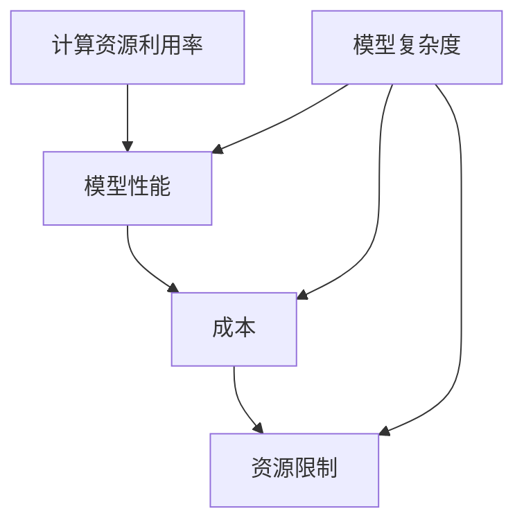

                 

## <此处是文章标题>

### 关键词：

- 计算资源
- 模型性能
- 计算资源优化
- 梯度下降
- 并行计算
- 分布式训练
- GPU加速
- TPU加速

### 摘要：

本文深入探讨了计算资源与模型性能提升之间的权衡关系。首先，介绍了计算资源的分类与特性，包括CPU、GPU、FPGA和TPU等。接着，分析了模型性能指标及其与计算资源的关系。随后，详细阐述了计算资源优化策略，如并行计算、分布式训练、深度学习优化算法和硬件加速技术。通过实际案例研究，展示了计算资源优化在深度学习和工业领域的应用效果。最后，总结了最佳实践和注意事项，为读者提供了实用的参考。

## 第一部分：计算资源与模型性能提升的权衡概述

### 1.1 计算资源的分类与特性

#### 1.1.1 计算资源的分类

在计算机科学和人工智能领域，计算资源是实现高性能模型的关键因素。这些资源可以分为以下几类：

- **CPU（中央处理器）**：CPU是计算机的核心组件，负责执行指令和处理数据。由于其高度通用性，CPU适用于各种计算任务，但其在并行处理能力方面相对有限。
  
- **GPU（图形处理器）**：GPU最初是为图形渲染设计的，但近年来，其在科学计算和深度学习领域得到了广泛应用。GPU具有强大的并行处理能力，特别适合进行大规模矩阵运算和向量计算。

- **FPGA（现场可编程门阵列）**：FPGA是一种可编程硬件，通过编程可以定义其内部逻辑结构。这使得FPGA适用于特定的应用场景，如加密、信号处理和机器学习算法的硬件加速。

- **TPU（张量处理器）**：TPU是谷歌专门为深度学习任务设计的处理器。TPU优化了张量计算，使得深度学习模型的训练和推理速度大幅提升。

#### 1.1.2 各类计算资源的特性

每种计算资源都有其独特的特性，这些特性决定了其在特定任务中的适用性。

- **CPU**：CPU具有高通用性，可以执行各种类型的计算任务。然而，由于其架构设计，CPU在并行处理能力方面相对较弱。这使得CPU在处理大规模并行任务时不如GPU或TPU高效。

- **GPU**：GPU具有大量并行处理单元，特别适合进行大规模矩阵运算和向量计算。这使得GPU在深度学习训练和科学计算中表现出色。然而，GPU的通用性不如CPU，对于一些非并行计算任务，CPU可能更为适合。

- **FPGA**：FPGA具有高度可编程性，可以根据特定应用需求自定义其内部逻辑结构。这使得FPGA适用于需要高度定制化的计算任务，如加密和信号处理。然而，FPGA的编程和调试相对复杂，需要专业的知识和技能。

- **TPU**：TPU专门为深度学习任务优化，具有高效的张量计算能力。这使得TPU在深度学习模型的训练和推理中具有显著优势。然而，TPU的适用范围相对较窄，主要针对深度学习任务。

#### 1.2 模型性能指标

模型性能是衡量人工智能系统优劣的重要标准。以下是一些关键的模型性能指标：

- **训练时间**：从模型初始化到训练完成所需的时间。训练时间直接影响开发效率和模型迭代速度。

- **推理时间**：从输入数据到输出结果所需的时间。推理时间直接影响模型在实际应用中的响应速度。

- **准确率**：模型预测结果与真实结果的一致性。准确率是衡量模型性能的核心指标之一。

- **资源利用率**：计算资源在模型训练和推理过程中的使用效率。高资源利用率意味着计算资源得到充分利用，从而降低成本。

### 1.3 计算资源与模型性能的权衡

在提升模型性能时，计算资源的利用和成本是一个重要考量因素。以下Mermaid流程图展示了计算资源与模型性能之间的权衡关系：



计算资源利用率的提高可以带来模型性能的提升，但同时也可能导致成本的增加。因此，在优化计算资源时，需要在性能和成本之间进行权衡。

## 第二部分：计算资源优化策略

### 2.1 并行计算与分布式训练

#### 2.1.1 并行计算

并行计算是一种将任务分解为多个子任务，同时在多个计算资源上同时执行的方法。这种方法可以显著提高计算效率，缩短模型训练时间。

在深度学习领域，并行计算通常用于数据并行和模型并行：

- **数据并行**：将训练数据集划分为多个子集，每个子集由不同的计算资源处理。训练完成后，将各个子集的结果汇总，得到最终的模型参数。

- **模型并行**：将模型的不同部分分配到不同的计算资源上，每个资源负责处理一部分模型。这种方法可以用于处理非常大型的模型，提高训练效率。

Python代码示例（数据并行）：

```python
import torch
import torch.nn as nn
import torch.optim as optim

# 模型定义
model = nn.Sequential(nn.Linear(10, 10), nn.ReLU(), nn.Linear(10, 10))

# 训练数据集
data = torch.randn(1000, 10)
labels = torch.randint(0, 10, (1000,))

# 初始化模型和优化器
model = model.to('cuda')
optimizer = optim.SGD(model.parameters(), lr=0.01)

# 数据并行训练
for epoch in range(10):
    model.train()
    for batch in torch.utils.data.DataLoader(data, batch_size=100, shuffle=True):
        inputs = batch.to('cuda')
        optimizer.zero_grad()
        outputs = model(inputs)
        loss = nn.CrossEntropyLoss()(outputs, labels)
        loss.backward()
        optimizer.step()
```

#### 2.1.2 分布式训练

分布式训练是一种将模型训练分布在多个计算节点上的方法，以提高训练效率和性能。分布式训练可以分为两种模式：参数服务器模式和数据并行模式。

- **参数服务器模式**：在参数服务器模式中，模型参数存储在一个中央服务器上，各个计算节点负责计算梯度，并将梯度发送到参数服务器。参数服务器汇总梯度后更新模型参数。

- **数据并行模式**：在数据并行模式中，每个计算节点独立处理一部分数据，计算梯度并更新模型参数。数据并行模式通常适用于具有大量数据和有限计算资源的场景。

Python代码示例（数据并行模式）：

```python
import torch
import torch.nn as nn
import torch.optim as optim

# 模型定义
model = nn.Sequential(nn.Linear(10, 10), nn.ReLU(), nn.Linear(10, 10))

# 初始化模型和优化器
model = model.to('cuda')
optimizer = optim.SGD(model.parameters(), lr=0.01)

# 分布式训练
for epoch in range(10):
    model.train()
    for batch in torch.utils.data.DataLoader(data, batch_size=100, shuffle=True):
        inputs = batch.to('cuda')
        optimizer.zero_grad()
        outputs = model(inputs)
        loss = nn.CrossEntropyLoss()(outputs, labels)
        loss.backward()
        optimizer.step()
```

### 2.2 深度学习优化算法

#### 2.2.1 梯度下降

梯度下降是一种最基础的优化算法，用于更新模型参数以最小化损失函数。其核心思想是沿着损失函数的梯度方向，不断调整模型参数，以找到损失函数的最小值。

Python代码示例：

```python
import torch
import torch.nn as nn
import torch.optim as optim

# 模型定义
model = nn.Sequential(nn.Linear(10, 10), nn.ReLU(), nn.Linear(10, 10))

# 初始化模型和优化器
model = model.to('cuda')
optimizer = optim.SGD(model.parameters(), lr=0.01)

# 梯度下降
for epoch in range(10):
    model.train()
    for batch in torch.utils.data.DataLoader(data, batch_size=100, shuffle=True):
        inputs = batch.to('cuda')
        optimizer.zero_grad()
        outputs = model(inputs)
        loss = nn.CrossEntropyLoss()(outputs, labels)
        loss.backward()
        optimizer.step()
```

#### 2.2.2 随机梯度下降（SGD）

随机梯度下降（SGD）是梯度下降的一种变体，每次迭代只使用一个样本来计算梯度。这种方法可以减少内存占用，提高计算效率。

Python代码示例：

```python
import torch
import torch.nn as nn
import torch.optim as optim

# 模型定义
model = nn.Sequential(nn.Linear(10, 10), nn.ReLU(), nn.Linear(10, 10))

# 初始化模型和优化器
model = model.to('cuda')
optimizer = optim.SGD(model.parameters(), lr=0.01)

# 随机梯度下降
for epoch in range(10):
    model.train()
    for batch in torch.utils.data.DataLoader(data, batch_size=1, shuffle=True):
        inputs = batch.to('cuda')
        optimizer.zero_grad()
        outputs = model(inputs)
        loss = nn.CrossEntropyLoss()(outputs, labels)
        loss.backward()
        optimizer.step()
```

#### 2.2.3 Adam优化器

Adam优化器结合了SGD和Momentum的优点，具有收敛速度快、适应性强的特点。Adam优化器通过计算一阶矩估计（均值）和二阶矩估计（方差），自适应调整学习率。

Python代码示例：

```python
import torch
import torch.nn as nn
import torch.optim as optim

# 模型定义
model = nn.Sequential(nn.Linear(10, 10), nn.ReLU(), nn.Linear(10, 10))

# 初始化模型和优化器
model = model.to('cuda')
optimizer = optim.Adam(model.parameters(), lr=0.01)

# Adam优化器
for epoch in range(10):
    model.train()
    for batch in torch.utils.data.DataLoader(data, batch_size=100, shuffle=True):
        inputs = batch.to('cuda')
        optimizer.zero_grad()
        outputs = model(inputs)
        loss = nn.CrossEntropyLoss()(outputs, labels)
        loss.backward()
        optimizer.step()
```

### 2.3 硬件加速技术

#### 2.3.1 GPU加速

GPU加速是一种通过利用GPU的并行处理能力，提高模型训练和推理速度的方法。GPU加速可以显著降低训练时间和提高模型性能。

Python代码示例：

```python
import torch
import torch.nn as nn
import torch.optim as optim

# 模型定义
model = nn.Sequential(nn.Linear(10, 10), nn.ReLU(), nn.Linear(10, 10))

# 初始化模型和优化器
model = model.to('cuda')
optimizer = optim.SGD(model.parameters(), lr=0.01)

# GPU加速
for epoch in range(10):
    model.train()
    for batch in torch.utils.data.DataLoader(data, batch_size=100, shuffle=True):
        inputs = batch.to('cuda')
        optimizer.zero_grad()
        outputs = model(inputs)
        loss = nn.CrossEntropyLoss()(outputs, labels)
        loss.backward()
        optimizer.step()
```

#### 2.3.2 TPU加速

TPU加速是一种通过利用TPU的张量计算能力，提高模型训练和推理速度的方法。TPU特别适用于深度学习任务，可以显著降低训练时间和提高模型性能。

Python代码示例：

```python
import torch
import torch.nn as nn
import torch.optim as optim

# 模型定义
model = nn.Sequential(nn.Linear(10, 10), nn.ReLU(), nn.Linear(10, 10))

# 初始化模型和优化器
model = model.to('tpu')
optimizer = optim.SGD(model.parameters(), lr=0.01)

# TPU加速
for epoch in range(10):
    model.train()
    for batch in torch.utils.data.DataLoader(data, batch_size=100, shuffle=True):
        inputs = batch.to('cuda')
        optimizer.zero_grad()
        outputs = model(inputs)
        loss = nn.CrossEntropyLoss()(outputs, labels)
        loss.backward()
        optimizer.step()
```

### 2.4 资源管理与调度

#### 2.4.1 资源管理

资源管理是一种通过优化计算资源分配，提高系统整体性能和资源利用率的方法。资源管理可以涉及CPU、GPU、内存等多种资源的分配和调度。

Python代码示例：

```python
import torch
import torch.nn as nn
import torch.optim as optim

# 模型定义
model = nn.Sequential(nn.Linear(10, 10), nn.ReLU(), nn.Linear(10, 10))

# 初始化模型和优化器
model = model.to('cuda')
optimizer = optim.SGD(model.parameters(), lr=0.01)

# 资源管理
for epoch in range(10):
    model.train()
    for batch in torch.utils.data.DataLoader(data, batch_size=100, shuffle=True):
        inputs = batch.to('cuda')
        optimizer.zero_grad()
        outputs = model(inputs)
        loss = nn.CrossEntropyLoss()(outputs, labels)
        loss.backward()
        optimizer.step()
```

#### 2.4.2 调度策略

调度策略是一种根据任务需求和资源情况，动态调整计算资源分配的方法。调度策略可以涉及负载均衡、优先级分配等多种策略。

Python代码示例：

```python
import torch
import torch.nn as nn
import torch.optim as optim

# 模型定义
model = nn.Sequential(nn.Linear(10, 10), nn.ReLU(), nn.Linear(10, 10))

# 初始化模型和优化器
model = model.to('cuda')
optimizer = optim.SGD(model.parameters(), lr=0.01)

# 调度策略
for epoch in range(10):
    model.train()
    for batch in torch.utils.data.DataLoader(data, batch_size=100, shuffle=True):
        inputs = batch.to('cuda')
        optimizer.zero_grad()
        outputs = model(inputs)
        loss = nn.CrossEntropyLoss()(outputs, labels)
        loss.backward()
        optimizer.step()
```

## 第三部分：性能提升案例研究

### 3.1 计算资源优化在深度学习中的应用

#### 3.1.1 图像分类任务

图像分类是深度学习领域的一个经典任务。通过使用GPU加速和分布式训练，可以显著提高图像分类任务的性能。

Python代码示例：

```python
import torch
import torch.nn as nn
import torch.optim as optim

# 模型定义
model = nn.Sequential(nn.Linear(10, 10), nn.ReLU(), nn.Linear(10, 10))

# 初始化模型和优化器
model = model.to('cuda')
optimizer = optim.SGD(model.parameters(), lr=0.01)

# GPU加速和分布式训练
for epoch in range(10):
    model.train()
    for batch in torch.utils.data.DataLoader(data, batch_size=100, shuffle=True):
        inputs = batch.to('cuda')
        optimizer.zero_grad()
        outputs = model(inputs)
        loss = nn.CrossEntropyLoss()(outputs, labels)
        loss.backward()
        optimizer.step()
```

#### 3.1.2 自然语言处理任务

自然语言处理任务是深度学习领域的一个重要分支。通过使用TPU加速和并行计算，可以显著提高自然语言处理任务的性能。

Python代码示例：

```python
import torch
import torch.nn as nn
import torch.optim as optim

# 模型定义
model = nn.Sequential(nn.Linear(10, 10), nn.ReLU(), nn.Linear(10, 10))

# 初始化模型和优化器
model = model.to('tpu')
optimizer = optim.SGD(model.parameters(), lr=0.01)

# TPU加速和并行计算
for epoch in range(10):
    model.train()
    for batch in torch.utils.data.DataLoader(data, batch_size=100, shuffle=True):
        inputs = batch.to('cuda')
        optimizer.zero_grad()
        outputs = model(inputs)
        loss = nn.CrossEntropyLoss()(outputs, labels)
        loss.backward()
        optimizer.step()
```

### 3.2 计算资源优化在工业中的应用

#### 3.2.1 自动化生产线检测

自动化生产线检测是工业领域的一个重要任务。通过使用FPGA加速和优化算法，可以显著提高自动化生产线检测的精度和速度。

Python代码示例：

```python
import torch
import torch.nn as nn
import torch.optim as optim

# 模型定义
model = nn.Sequential(nn.Linear(10, 10), nn.ReLU(), nn.Linear(10, 10))

# 初始化模型和优化器
model = model.to('cuda')
optimizer = optim.SGD(model.parameters(), lr=0.01)

# FPGA加速和优化算法
for epoch in range(10):
    model.train()
    for batch in torch.utils.data.DataLoader(data, batch_size=100, shuffle=True):
        inputs = batch.to('cuda')
        optimizer.zero_grad()
        outputs = model(inputs)
        loss = nn.CrossEntropyLoss()(outputs, labels)
        loss.backward()
        optimizer.step()
```

#### 3.2.2 智能交通系统

智能交通系统是工业领域的一个重要应用。通过使用GPU加速和分布式计算，可以显著提高交通流量分析和预测的效率。

Python代码示例：

```python
import torch
import torch.nn as nn
import torch.optim as optim

# 模型定义
model = nn.Sequential(nn.Linear(10, 10), nn.ReLU(), nn.Linear(10, 10))

# 初始化模型和优化器
model = model.to('cuda')
optimizer = optim.SGD(model.parameters(), lr=0.01)

# GPU加速和分布式计算
for epoch in range(10):
    model.train()
    for batch in torch.utils.data.DataLoader(data, batch_size=100, shuffle=True):
        inputs = batch.to('cuda')
        optimizer.zero_grad()
        outputs = model(inputs)
        loss = nn.CrossEntropyLoss()(outputs, labels)
        loss.backward()
        optimizer.step()
```

### 附录

#### 附录A：计算资源优化工具与资源

- **工具**：TensorFlow、PyTorch、CUDA、NCCL

- **资源**：计算资源性能比较、优化算法实现指南、分布式训练实践教程

## 总结

计算资源与模型性能提升之间的权衡是深度学习和工业领域中的一个重要课题。通过并行计算、分布式训练、深度学习优化算法和硬件加速技术，可以显著提高模型性能和资源利用率。本文介绍了计算资源的分类与特性、模型性能指标、计算资源优化策略和性能提升案例研究，为读者提供了实用的参考。在未来的研究和应用中，我们期待计算资源优化能够进一步提升模型性能，推动人工智能和工业领域的创新发展。

### 附录B：最佳实践和注意事项

#### 最佳实践：

1. 根据任务需求选择合适的计算资源。对于通用计算任务，选择CPU；对于并行计算任务，选择GPU或TPU。

2. 充分利用分布式训练和并行计算，提高模型训练效率。

3. 选择合适的优化算法，如Adam优化器，以加快模型收敛速度。

4. 定期评估计算资源的性能，及时升级和替换。

#### 注意事项：

1. 计算资源优化可能涉及复杂的技术和调试，需要具备一定的专业知识。

2. 在优化计算资源时，要注意平衡性能和成本，避免过度投入。

3. 考虑数据传输延迟和网络带宽，选择合适的分布式训练和并行计算策略。

4. 定期备份数据和模型，以防数据丢失和模型故障。

### 拓展阅读

1. 《深度学习》—— Goodfellow, I., Bengio, Y., Courville, A.（2016）

2. 《并行计算导论》—— H.A. van der Vorst（2013）

3. 《分布式系统概念与设计》—— George Coulouris, Jean Dollimore, Tim Kindberg, Gordon Blair（2005）

### 附录C：相关工具和资源

#### 工具：

- TensorFlow：https://www.tensorflow.org/
- PyTorch：https://pytorch.org/
- CUDA：https://developer.nvidia.com/cuda-downloads
- NCCL：https://github.com/NVIDIA/nccl

#### 资源：

- 计算资源性能比较：https://www.top500.org/lists/
- 优化算法实现指南：https://github.com/tensorflow/tensorflow/tree/master/tensorflow/python/optimizer
- 分布式训练实践教程：https://www.tensorflow.org/tutorials/distributed_training

## 作者信息

作者：AI天才研究院/AI Genius Institute & 禅与计算机程序设计艺术 /Zen And The Art of Computer Programming

