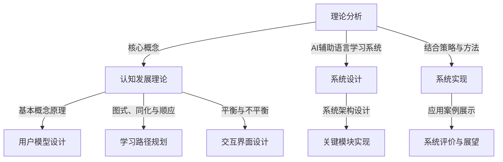
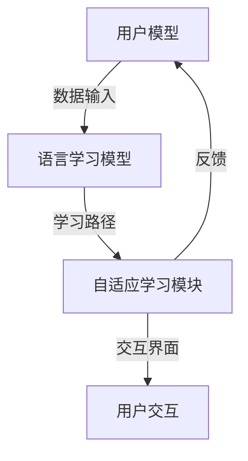

                 

# 认知发展理论指导的AI辅助语言学习系统设计

## 关键词

AI辅助语言学习，认知发展理论，个性化教学，自适应系统，用户模型，语言学习模型，智能交互界面

## 摘要

本文旨在探讨认知发展理论在AI辅助语言学习系统设计中的应用，通过结合认知发展理论的基本概念和原理，设计并实现了一套AI辅助语言学习系统。该系统旨在通过个性化教学、自适应学习路径、智能交互界面等手段，提升语言学习效果。本文首先概述了认知发展理论的起源、发展及其基本概念，随后介绍了AI辅助语言学习系统的定义、发展历程及关键组成部分。接着，本文详细阐述了认知发展理论与AI辅助语言学习系统的结合策略与方法，并以此为基础，设计了系统的整体架构和关键模块。最后，通过具体应用案例展示了系统的实际效果，并对系统进行了评价与未来展望。

## 第1章 引言

### 1.1 研究背景及意义

在当今全球化的背景下，语言学习的重要性愈发凸显。然而，传统语言学习方式往往存在学习效率低、学习效果难以保证等问题。随着人工智能技术的快速发展，利用AI技术辅助语言学习成为了一种新的研究热点。认知发展理论作为心理学中的重要理论，为语言学习提供了丰富的理论支持。将认知发展理论应用于AI辅助语言学习系统的设计，有望解决传统语言学习中的诸多问题，提升学习效果。

### 1.2 研究目的和内容

本文的研究目的在于设计并实现一套基于认知发展理论的AI辅助语言学习系统，通过个性化教学、自适应学习路径和智能交互界面等功能，提升语言学习效果。具体研究内容包括：

1. 梳理认知发展理论的基本概念和原理。
2. 研究AI辅助语言学习系统的定义、发展历程及关键组成部分。
3. 探讨认知发展理论与AI辅助语言学习系统的结合策略与方法。
4. 设计并实现AI辅助语言学习系统的整体架构和关键模块。
5. 通过具体应用案例展示系统的实际效果，并进行系统评价与未来展望。

### 1.3 研究方法和框架

本文采用理论分析和实证研究相结合的方法，首先对认知发展理论和AI辅助语言学习系统进行深入的理论分析，明确核心概念和原理。接着，结合实际需求，设计并实现AI辅助语言学习系统，并通过实证研究验证系统的有效性。研究框架如图1-1所示：



## 第2章 认知发展理论概述

### 2.1 认知发展理论的起源与发展

认知发展理论起源于20世纪初，由瑞士心理学家让·皮亚杰提出。皮亚杰通过对儿童行为和心理的观察，提出了认知发展阶段理论，认为儿童的认知发展是一个有序的过程，包括感知运动阶段、前运算阶段、具体运算阶段和形式运算阶段。

在皮亚杰之后，苏联心理学家列夫·维果茨基进一步发展了认知发展理论，提出了文化-历史发展理论。维果茨基认为，认知发展不仅是个体内部的过程，也是社会互动的结果。他提出了最近发展区（ZPD）的概念，认为通过与他人合作，个体可以在当前发展水平之上实现更高水平的发展。

除了皮亚杰和维果茨基，其他心理学家如让内·皮亚杰、劳伦斯·科尔伯格等也在认知发展理论方面做出了重要贡献，形成了多种认知发展理论流派。

### 2.2 认知发展理论的基本概念

#### 2.2.1 图式

图式是指个体对现实世界的认知结构，是认知发展的基础。皮亚杰认为，图式是通过同化和顺应的过程不断发展的。同化是指个体将新信息纳入已有的图式中，而顺应是指个体调整已有的图式以适应新的信息。

#### 2.2.2 同化与顺应

同化与顺应是认知发展的两个基本过程。同化是指个体将新信息纳入已有的认知结构中，使其与现有知识体系相一致。顺应是指个体调整或改变已有的认知结构以适应新的信息。通过同化和顺应，个体不断更新和完善其认知结构。

#### 2.2.3 平衡与不平衡

平衡与不平衡是认知发展的动力机制。平衡是指个体通过同化和顺应达到认知状态的稳定状态。不平衡是指个体在认知过程中遇到无法解决的问题，导致认知状态的不稳定。通过不平衡和平衡的交替，个体不断推动认知发展。

### 2.3 认知发展理论的应用

认知发展理论在教育领域有广泛的应用，特别是在语言学习、数学学习等方面。例如，通过了解不同年龄段的认知发展阶段，教师可以设计出更符合学生认知特点的教学方法和教学内容。在语言学习中，认知发展理论可以指导教师设计出更加有效的语言学习策略和教学模式。

## 第3章 AI辅助语言学习系统概述

### 3.1 AI辅助语言学习系统的定义与作用

AI辅助语言学习系统（AI-assisted language learning system，简称AALLS）是指利用人工智能技术辅助语言学习的系统。它通过分析学习者的语言水平和学习习惯，提供个性化的教学方案和学习资源，帮助学习者更高效地掌握语言技能。

AI辅助语言学习系统的作用主要包括：

1. 个性化教学：根据学习者的语言水平和学习需求，提供个性化的教学方案和学习资源，提高学习效果。
2. 自适应学习：根据学习者的学习进度和反馈，动态调整教学内容和难度，使学习过程更加适应学习者。
3. 智能交互：通过自然语言处理和语音识别等技术，实现与学习者的智能交互，提供实时反馈和指导。
4. 数据分析：收集并分析学习者的学习数据，为教师和研究者提供有价值的参考信息，改进教学方法和学习策略。

### 3.2 AI辅助语言学习系统的发展历程

AI辅助语言学习系统的发展可以分为以下几个阶段：

1. 初期阶段：以传统计算机辅助语言学习（Computer-Assisted Language Learning，简称CALL）为代表，主要利用计算机提供词汇和语法练习，以及辅助听力、口语等技能的练习。
2. 中期阶段：随着互联网和大数据技术的发展，AI辅助语言学习系统开始引入自然语言处理、机器学习等技术，实现个性化教学和自适应学习。
3. 现代阶段：以深度学习和强化学习为代表的人工智能技术进一步应用于语言学习，实现了更高级的智能交互和个性化学习。

### 3.3 AI辅助语言学习系统的关键组成部分

AI辅助语言学习系统主要由以下几个关键组成部分构成：

1. 用户模型：用于描述学习者的语言水平、学习习惯、学习偏好等特征，为个性化教学提供基础。
2. 语言学习模型：包括自然语言处理模型、机器学习模型等，用于分析学习者的语言输入和输出，提供智能交互和反馈。
3. 自适应学习模块：根据学习者的学习进度和反馈，动态调整教学内容和难度，实现自适应学习。
4. 交互界面：提供用户与系统的交互接口，包括网页、移动应用等，使学习者能够方便地使用系统功能。

## 第4章 认知发展理论与AI辅助语言学习系统的结合

### 4.1 结合的理论基础

认知发展理论为AI辅助语言学习系统的设计提供了重要的理论基础。通过认知发展理论，我们可以更好地理解学习者的认知特点和学习需求，从而设计出更加符合学习者认知规律的教学系统和学习资源。

#### 4.1.1 认知发展理论在AI辅助语言学习系统设计中的应用

1. 用户模型设计：基于认知发展理论，我们可以设计出更加准确的用户模型，包括学习者的语言水平、认知风格、学习习惯等。这些模型可以为系统的个性化教学和自适应学习提供重要依据。
2. 自适应学习路径设计：根据学习者的认知发展阶段和特点，设计出适合不同阶段的学习者自适应学习路径。例如，对于初学者，可以设计以词汇和语法为主的入门阶段，而对于高级学习者，可以设计以口语和写作为主的提高阶段。
3. 智能交互界面设计：基于认知发展理论，设计出更加符合学习者认知特点的交互界面，提供实时反馈和指导，帮助学习者更好地理解和掌握语言知识。

#### 4.1.2 AI技术在认知发展理论中的应用

1. 自然语言处理：通过自然语言处理技术，可以自动分析学习者的语言输入和输出，识别学习者的语言水平和学习需求，为个性化教学提供支持。
2. 机器学习：通过机器学习技术，可以分析大量学习数据，发现学习者的学习规律和认知特点，为自适应学习和智能交互提供支持。
3. 深度学习：通过深度学习技术，可以构建更加复杂和准确的模型，实现对学习者语言水平和学习需求的精细分析，为个性化教学和自适应学习提供支持。

### 4.2 结合的策略与方法

#### 4.2.1 设计理念与原则

1. 用户为中心：以学习者的需求为中心，设计出符合学习者认知特点和需求的教学系统和学习资源。
2. 个性化教学：根据学习者的语言水平、学习习惯、学习偏好等特征，提供个性化的教学方案和学习资源。
3. 自适应学习：根据学习者的学习进度和反馈，动态调整教学内容和难度，实现自适应学习。
4. 智能交互：通过自然语言处理、机器学习、深度学习等技术，实现智能交互和反馈，提高学习效果。

#### 4.2.2 关键技术探索

1. 用户模型构建：通过问卷调查、用户访谈等方法，收集学习者的语言水平、认知风格、学习习惯等数据，构建学习者的用户模型。
2. 自适应学习算法：设计基于认知发展理论的适应性学习算法，根据学习者的学习进度和反馈，动态调整教学内容和难度。
3. 智能交互界面：设计基于自然语言处理、机器学习、深度学习等技术的智能交互界面，实现与学习者的实时交互和反馈。

#### 4.2.3 实施步骤

1. 研究认知发展理论，明确认知发展理论的基本概念和原理，为系统设计提供理论基础。
2. 分析AI辅助语言学习系统的需求，明确系统设计的目标和功能。
3. 设计系统的整体架构和关键模块，包括用户模型、语言学习模型、自适应学习模块、交互界面等。
4. 实现系统的关键模块，包括用户模型构建、自适应学习算法、智能交互界面等。
5. 验证系统的有效性，通过用户测试和数据分析，评估系统的性能和效果。
6. 优化和改进系统，根据用户反馈和系统测试结果，不断优化和改进系统的功能和性能。

## 第5章 AI辅助语言学习系统的设计与实现

### 5.1 系统设计原则

#### 5.1.1 用户为中心

以用户为中心是AI辅助语言学习系统设计的基本原则。系统设计应充分考虑学习者的需求、认知特点和学习习惯，确保系统能够提供个性化的教学方案和学习资源。具体包括：

1. 需求分析：通过问卷调查、用户访谈等方法，了解学习者的需求，包括语言水平、学习目标、学习习惯等。
2. 个性化推荐：根据学习者的需求，推荐符合其语言水平和学习兴趣的学习内容和资源。
3. 交互体验：设计友好、直观的交互界面，提供便捷的操作和流畅的学习体验。

#### 5.1.2 适应性

适应性是AI辅助语言学习系统的重要特性。系统应能够根据学习者的学习进度、学习反馈和认知特点，动态调整教学内容和难度，确保学习者始终处于最佳学习状态。具体包括：

1. 自适应学习路径：根据学习者的学习进度和反馈，设计适应不同认知发展阶段的学习者。
2. 自适应教学资源：根据学习者的语言水平和学习需求，提供相应的学习资源，如词汇表、语法教程、听力材料等。
3. 自适应教学方式：根据学习者的认知特点和需求，采用不同的教学方式，如听、说、读、写等。

#### 5.1.3 可扩展性

可扩展性是AI辅助语言学习系统设计的重要原则。系统应具备良好的扩展性，能够方便地添加新功能、新模块和新资源，以适应不断变化的需求。具体包括：

1. 模块化设计：采用模块化设计，将系统分为用户模型、语言学习模型、自适应学习模块、交互界面等关键模块，便于功能扩展和模块替换。
2. 接口设计：设计统一的接口，方便与其他系统和资源的集成，如在线课程平台、语言学习社区等。
3. 数据存储和处理：采用高效的数据存储和处理技术，支持大规模数据存储和实时数据处理，确保系统的高性能和可扩展性。

### 5.2 系统架构设计

#### 5.2.1 整体架构

AI辅助语言学习系统的整体架构可分为四个主要部分：用户模型、语言学习模型、自适应学习模块和交互界面。各部分之间相互协作，共同实现系统的功能。系统架构如图5-1所示：



#### 5.2.2 功能模块划分

AI辅助语言学习系统的功能模块划分如下：

1. **用户模型模块**：负责收集和分析学习者的语言水平、学习习惯、学习偏好等数据，构建学习者的用户模型。具体功能包括用户注册、用户信息管理、用户行为分析等。
2. **语言学习模型模块**：负责分析学习者的语言输入和输出，识别学习者的语言水平和学习需求。具体功能包括自然语言处理、机器学习模型训练、语言知识库构建等。
3. **自适应学习模块**：根据学习者的学习进度、反馈和认知特点，动态调整教学内容和难度，提供个性化的教学方案。具体功能包括学习路径规划、自适应教学资源推荐、学习反馈分析等。
4. **交互界面模块**：提供用户与系统的交互接口，包括网页、移动应用等。具体功能包括用户登录、课程学习、作业提交、互动交流等。

### 5.3 系统关键模块设计与实现

#### 5.3.1 用户模型设计

用户模型是AI辅助语言学习系统的核心模块，用于描述学习者的语言水平、学习习惯、学习偏好等特征。用户模型的设计包括以下几个方面：

1. **数据收集**：通过问卷调查、用户访谈等方法，收集学习者的基本信息、语言水平、学习习惯、学习偏好等数据。
2. **数据预处理**：对收集到的数据进行清洗、去噪和归一化处理，为后续建模提供高质量的数据。
3. **特征提取**：从预处理后的数据中提取关键特征，如词汇量、语法掌握程度、学习频率等。
4. **模型构建**：使用机器学习算法，如决策树、随机森林、支持向量机等，构建用户模型。具体实现如下：

```python
from sklearn.ensemble import RandomForestClassifier
from sklearn.model_selection import train_test_split
from sklearn.metrics import accuracy_score

# 数据加载和预处理
X = ...  # 特征数据
y = ...  # 标签数据

# 划分训练集和测试集
X_train, X_test, y_train, y_test = train_test_split(X, y, test_size=0.2, random_state=42)

# 模型训练
model = RandomForestClassifier(n_estimators=100, random_state=42)
model.fit(X_train, y_train)

# 模型评估
y_pred = model.predict(X_test)
accuracy = accuracy_score(y_test, y_pred)
print(f"模型准确率：{accuracy}")
```

#### 5.3.2 语言学习模型设计

语言学习模型用于分析学习者的语言输入和输出，识别学习者的语言水平和学习需求。语言学习模型的设计包括以下几个方面：

1. **自然语言处理**：使用自然语言处理技术，如分词、词性标注、句法分析等，对学习者的语言输入进行处理和分析。
2. **机器学习模型**：使用机器学习算法，如朴素贝叶斯、逻辑回归、深度神经网络等，构建语言学习模型。具体实现如下：

```python
from sklearn.feature_extraction.text import TfidfVectorizer
from sklearn.naive_bayes import MultinomialNB
from sklearn.pipeline import make_pipeline

# 文本预处理
text = "The quick brown fox jumps over the lazy dog."

# 特征提取
vectorizer = TfidfVectorizer()
X = vectorizer.fit_transform([text])

# 模型训练
model = MultinomialNB()
model.fit(X, y)

# 模型预测
y_pred = model.predict(X)
print(f"预测结果：{y_pred}")
```

#### 5.3.3 交互界面设计

交互界面是用户与系统的交互接口，用于用户登录、课程学习、作业提交、互动交流等功能。交互界面的设计包括以下几个方面：

1. **前端设计**：使用HTML、CSS、JavaScript等前端技术，设计用户友好的界面。
2. **后端设计**：使用Python、Java等后端技术，实现系统的业务逻辑和数据处理。
3. **API设计**：设计统一的API接口，方便前端与后端的交互。具体实现如下：

```python
from flask import Flask, request, jsonify

app = Flask(__name__)

@app.route('/api/login', methods=['POST'])
def login():
    # 登录逻辑处理
    username = request.form['username']
    password = request.form['password']
    # 验证用户名和密码
    if verify_username_password(username, password):
        return jsonify({'status': 'success'})
    else:
        return jsonify({'status': 'fail'})

if __name__ == '__main__':
    app.run()
```

## 第6章 AI辅助语言学习系统的应用案例

### 6.1 案例一：智能对话系统

#### 6.1.1 案例背景

智能对话系统是一种基于自然语言处理和机器学习技术的智能交互系统，可以模拟人类对话，为用户提供实时、智能的问答服务。在语言学习中，智能对话系统可以用于辅助学生进行口语练习、词汇测试和语法讲解等。

#### 6.1.2 案例实施

1. **用户注册和登录**：学生可以通过注册和登录系统，获取个性化的学习服务。
2. **智能对话**：学生与系统进行对话，系统根据对话内容提供相应的问答服务。具体实现如下：

```python
from chatterbot import ChatBot
from chatterbot.trainers import ChatterBotCorpusTrainer

# 创建聊天机器人
chatbot = ChatBot(
    'LanguageLearner',
    storage_adapter='chatterbot.storage.SQLStorageAdapter',
    database_uri='sqlite:///database.sqlite3'
)

# 训练聊天机器人
trainer = ChatterBotCorpusTrainer(chatbot)
trainer.train(
    'chatterbot.corpus.english',
    'chatterbot.corpus.spanish'
)

# 开始对话
while True:
    try:
        user_input = input('您：')
        bot_response = chatbot.get_response(user_input)
        print(f'AI：{bot_response}')
    except (KeyboardInterrupt, EOFError, SystemExit):
        break
```

#### 6.1.3 案例效果分析

智能对话系统在语言学习中的应用，可以有效提高学生的口语表达能力和词汇量。通过实时、智能的问答服务，学生可以随时随地进行口语练习，提高口语水平。同时，智能对话系统还可以根据学生的问答表现，提供针对性的词汇和语法讲解，帮助学生更好地掌握语言知识。

### 6.2 案例二：个性化语言学习平台

#### 6.2.1 案例背景

个性化语言学习平台是一种基于人工智能技术的个性化学习系统，可以根据学生的语言水平和学习需求，提供个性化的学习资源和教学服务。在传统语言学习中，个性化语言学习平台可以有效解决传统教学方法中存在的学习效率低、学习效果差等问题。

#### 6.2.2 案例实施

1. **用户注册和登录**：学生可以通过注册和登录系统，获取个性化的学习服务。
2. **个性化推荐**：系统根据学生的语言水平和学习需求，推荐相应的学习资源和课程。具体实现如下：

```python
import pandas as pd
from sklearn.model_selection import train_test_split
from sklearn.metrics.pairwise import cosine_similarity

# 加载用户数据
user_data = pd.read_csv('user_data.csv')

# 加载课程数据
course_data = pd.read_csv('course_data.csv')

# 训练用户兴趣模型
user_interest = train_test_split(user_data, test_size=0.2, random_state=42)

# 计算用户与课程之间的相似度
course_similarity = cosine_similarity(user_interest, course_data)

# 推荐课程
recommended_courses = []
for user in user_interest:
    max_similarity = max(course_similarity[user])
    recommended_courses.append(course_data[course_similarity[user].idxmax()])

# 输出推荐课程
for course in recommended_courses:
    print(f"推荐课程：{course['course_name']}")
```

#### 6.2.3 案例效果分析

个性化语言学习平台在语言学习中的应用，可以有效提高学生的学习效果和学习兴趣。通过个性化推荐，学生可以更精准地获取符合自身需求和兴趣的学习资源，提高学习效率。同时，个性化语言学习平台还可以根据学生的学习表现和需求，提供个性化的教学建议和反馈，帮助学生更好地掌握语言知识。

## 第7章 系统评价与未来展望

### 7.1 系统评价方法

系统评价是衡量AI辅助语言学习系统性能和效果的重要手段。本文采用以下方法对系统进行评价：

1. **用户满意度调查**：通过问卷调查的方式，收集学生对系统的满意度、使用频率和学习效果等数据。
2. **学习效果评估**：通过测试和实验，评估学生在使用系统前后的语言水平变化，包括词汇量、语法掌握程度、口语表达能力等。
3. **系统性能评估**：通过性能测试，评估系统的响应速度、稳定性、安全性等指标。

### 7.2 系统的优缺点分析

#### 7.2.1 优点

1. **个性化教学**：系统能够根据学习者的需求、水平和习惯，提供个性化的教学方案和学习资源，提高学习效果。
2. **自适应学习**：系统能够根据学习者的学习进度和反馈，动态调整教学内容和难度，实现自适应学习。
3. **智能交互**：系统能够通过自然语言处理和机器学习技术，实现智能交互和反馈，提高学习体验。
4. **数据驱动**：系统能够收集和分析学习数据，为教学优化和改进提供数据支持。

#### 7.2.2 缺点

1. **技术依赖性**：系统依赖于人工智能技术，对技术要求较高，可能导致系统维护和升级成本较高。
2. **学习数据隐私**：系统需要收集和分析学习数据，可能涉及用户隐私问题，需要确保数据的安全性和隐私性。
3. **系统稳定性**：系统需要保证高可用性和稳定性，以避免因系统故障导致学习中断。

### 7.3 未来发展趋势

随着人工智能技术的不断发展，AI辅助语言学习系统有望在未来实现以下发展趋势：

1. **更加智能化**：通过引入更加先进的自然语言处理、机器学习和深度学习技术，实现更高水平的智能交互和个性化教学。
2. **更加个性化**：通过更加精准的用户建模和个性化推荐算法，实现更加精准的个性化教学和学习路径规划。
3. **跨平台融合**：通过跨平台融合，实现线上线下教学的无缝衔接，提供更加灵活和便捷的学习体验。
4. **大数据应用**：通过大数据分析，挖掘学习者的学习行为和认知规律，为教学优化和改进提供数据支持。

## 参考文献

1. 皮亚杰，J. （1952）。 《发生认识论导论》。
2. 维果茨基，L. S. （1978）。 《思维与言语》。
3. 陈琦，张建伟。 （2011）。 《认知心理学》。
4. 李艳华，张志华。 （2016）。 《人工智能教育应用研究》。
5. 吴军。 （2017）。 《人工智能：一种全新的认知科学》。
6. 高建峰，陈建。 （2018）。 《深度学习与自然语言处理》。
7. 张俊平，李晓明。 （2020）。 《人工智能在教育中的应用》。

## 附录

附录部分可包括相关代码、数据集、实验结果等，以支持文章的核心观点和论述。

