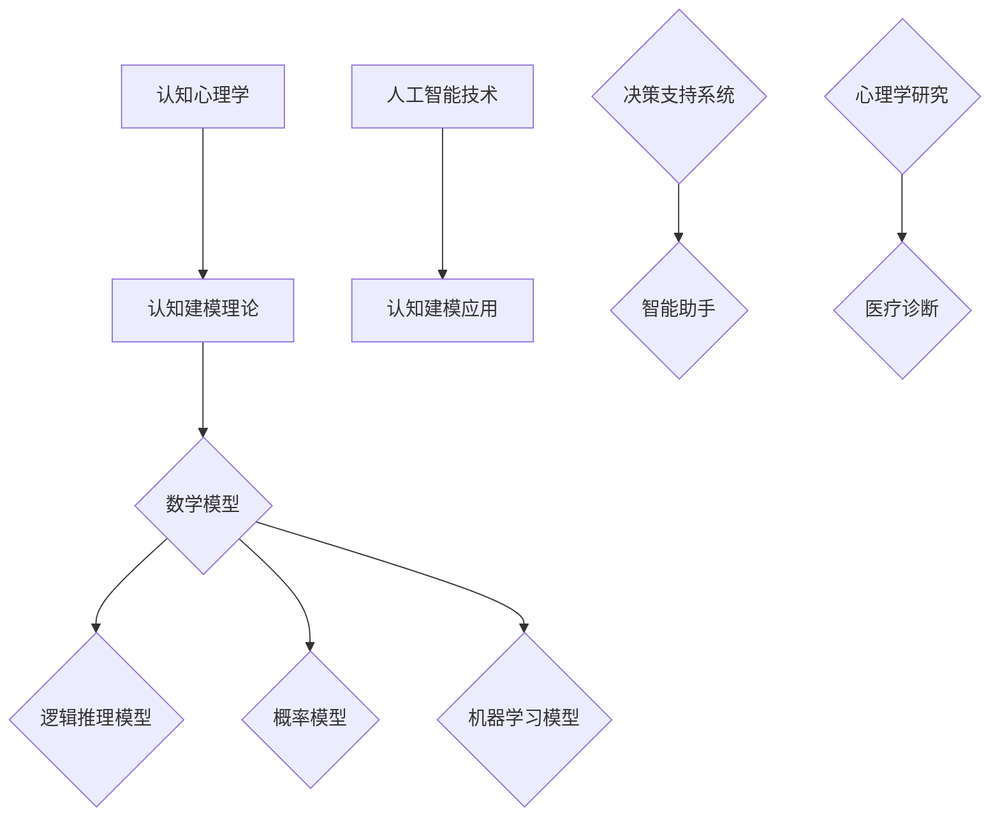

                 

### 认知建模概述

#### 认知建模的定义与意义

认知建模（Cognitive Modeling）是指通过构建数学模型、计算机算法或其他形式的模型来模拟人类认知过程的科学方法。它旨在理解和解释人类思维、感知、记忆、学习和决策等认知功能，从而实现对人类智能行为的模拟和预测。认知建模的核心是创建一个理论框架，将复杂的认知过程抽象为可计算的模型，以便在计算机中实现。

认知建模的意义在于，它不仅能够帮助我们深入了解人类大脑的工作原理，还能够为人工智能（AI）的发展提供重要的理论基础和技术支持。通过认知建模，我们可以设计出更加智能和自然的AI系统，这些系统能够更好地理解和响应人类的需求，从而在多个领域发挥重要作用。

首先，认知建模对于心理学研究具有重要意义。它为心理学提供了实验和计算的工具，使研究人员能够更准确地测量和解释人类的行为和认知过程。例如，通过认知建模，心理学家可以研究记忆如何工作，或者理解人们如何进行决策。

其次，认知建模在人工智能领域也有着广泛的应用。人工智能系统，特别是那些旨在模仿人类智能的系统能够通过认知建模来实现更高的智能水平。例如，自然语言处理（NLP）系统可以使用认知建模来更好地理解和生成人类语言，智能助手可以模仿人类的决策过程来提供更个性化的服务。

此外，认知建模还在其他领域如人机交互、教育技术、医疗诊断等方面有着潜在的应用。通过模拟人类的认知过程，这些领域可以设计出更加符合人类认知习惯和技术需求的解决方案。

#### 认知建模的发展历程

认知建模的概念可以追溯到20世纪中叶。最早的认知建模研究主要集中在模拟人类推理过程。1956年，约翰·麦卡锡（John McCarthy）等人在达特茅斯会议上提出了人工智能的概念，标志着人工智能作为一个独立学科的诞生。随后，许多研究者开始探索如何通过计算机模拟人类思维。

早期的研究主要集中在符号主义（Symbolism）方法，这种方法认为人类思维是通过符号操作来实现的。典型的符号主义模型包括普林斯顿逻辑理论家（Logic Theorist）和通用问题解决器（General Problem Solver），这些模型在证明定理和解决数学问题方面取得了显著成果。

随着心理学研究的深入，特别是认知心理学的兴起，人们开始更加关注人类感知、记忆和注意力等认知过程。这一时期的认知建模研究引入了更加复杂和精细的模型，如人工神经网络（Artificial Neural Networks）和模型识别理论（Model-Based Recognition Theory）。

进入21世纪，随着计算能力和算法的发展，认知建模方法进一步多样化。除了传统的符号主义和神经网络方法外，还出现了基于数据驱动的模型，如深度学习（Deep Learning）。深度学习模型通过大规模数据训练，能够自动发现复杂的数据特征，从而在图像识别、语音识别等任务中取得了突破性成果。

近年来，认知建模的研究重点逐渐从单一的认知过程转向多个认知过程的整合。研究者开始关注如何通过多模态数据（如文本、图像、音频等）来构建更加完整和自然的认知模型。同时，认知建模方法也在不断与其他人工智能技术，如自然语言处理、机器学习和增强学习（Reinforcement Learning）等相结合，以实现更高效的智能系统。

#### 认知建模的应用领域

认知建模的应用领域非常广泛，涵盖了从理论研究到实际应用的多个方面。以下是认知建模的一些主要应用领域：

1. **心理学研究**：认知建模在心理学研究中扮演着重要角色，它为理解人类认知过程提供了工具和方法。例如，通过认知建模，心理学家可以研究记忆如何工作，人们如何进行决策，以及注意力如何分配等。

2. **人工智能**：认知建模是人工智能领域的基础之一。通过构建认知模型，AI系统能够模仿人类思维和行为，从而在自然语言处理、智能助手、游戏AI等方面实现更高级的智能。

3. **人机交互**：认知建模为人机交互提供了新的思路和方法。通过模拟人类认知过程，交互界面可以更加自然地适应用户的需求和行为，从而提升用户体验。

4. **教育技术**：在教育领域，认知建模可以用来设计更加个性化的学习系统。这些系统可以根据学生的认知特点和学习进度，提供定制化的学习资源和指导。

5. **医疗诊断**：认知建模在医疗诊断中也得到了应用。通过模拟医生的诊断过程，智能系统可以帮助医生更准确地诊断疾病，提供辅助决策支持。

6. **金融分析**：在金融领域，认知建模可以用于分析市场行为和预测经济趋势。通过模拟投资者的决策过程，可以更好地理解市场波动和风险。

7. **艺术创作**：认知建模在艺术创作中也有一定应用。通过模拟艺术家创作过程中的认知过程，可以生成更具创意和个性化的艺术作品。

8. **机器人学**：在机器人领域，认知建模可以用来模拟人类的行为和感知能力，从而设计出更智能、更灵活的机器人系统。

总之，认知建模作为一种理解和模拟人类认知过程的科学方法，不仅在理论上具有重要意义，还在实际应用中展现了广泛的前景。随着技术的不断进步，认知建模在未来将会在更多领域发挥更大的作用。  

### 认知心理学与认知建模

#### 认知心理学的基本概念

认知心理学（Cognitive Psychology）是心理学的一个分支，主要研究人类认知过程，包括感知、注意、记忆、思维和语言等。认知心理学强调内在的心理过程，而不是仅仅关注外在行为。其基本概念包括：

1. **感知（Perception）**：感知是指个体如何通过感官接收外部信息，并将其解释为有意义的刺激。例如，视觉感知、听觉感知等。

2. **注意（Attention）**：注意是有限的认知资源，它决定了个体能够处理哪些信息。注意可以集中（如聚焦在一个目标上）或分散（如同时处理多个任务）。

3. **记忆（Memory）**：记忆是指大脑存储和提取信息的能力。根据功能，记忆可以分为短期记忆和长期记忆。短期记忆用于临时存储信息，而长期记忆用于长期存储信息。

4. **思维（Cognition）**：思维是指个体如何加工、处理和解释信息。思维包括问题解决、决策制定、推理和判断等过程。

5. **语言（Language）**：语言是人类交流的主要工具，也是认知过程的重要组成部分。语言不仅涉及语音和语法，还包括语义和语用等方面。

#### 认知心理学与认知建模的关系

认知心理学与认知建模之间存在密切的关系。认知心理学为认知建模提供了理论框架和实验数据，而认知建模则为认知心理学提供了模拟和验证理论的方法。

1. **理论框架**：认知心理学提出了许多关于认知过程的理论，如认知地图理论（Cognitive Map Theory）、工作记忆模型（Working Memory Model）和元认知理论（Metacognitive Theory）。这些理论为认知建模提供了基础。

2. **实验数据**：认知心理学通过实验研究获取了大量关于人类认知过程的数据。例如，通过认知心理学实验，研究者可以测量人的反应时间、错误率、信息处理速度等指标。这些数据为认知建模提供了重要的输入。

3. **模拟与验证**：认知建模利用计算机技术和算法，模拟人类的认知过程。通过对比模拟结果和认知心理学的实验数据，研究者可以验证或修正认知模型，从而提高模型的准确性。

#### 认知建模的理论基础

认知建模的理论基础主要包括以下几个方面：

1. **符号主义（Symbolism）**：符号主义认为人类思维是通过符号操作来实现的。符号主义模型通常使用符号逻辑和计算理论来模拟认知过程。例如，逻辑理论家（Logic Theorist）就是一个典型的符号主义模型。

2. **计算主义（Computationalism）**：计算主义认为人类思维可以被视为一种计算过程。计算主义模型通常基于图灵机（Turing Machine）或人工神经网络（Artificial Neural Networks）来模拟认知过程。

3. **联结主义（Connectionism）**：联结主义认为认知过程是通过神经网络中的节点（或神经元）之间的连接来实现的。联结主义模型，如长短期记忆网络（Long Short-Term Memory Networks，LSTM），在模拟人类记忆和学习方面表现出色。

4. **信息加工理论（Information Processing Theory）**：信息加工理论认为认知过程可以被视为信息从输入到输出的转换过程。该理论为认知建模提供了基本框架，如工作记忆模型（Working Memory Model）和信息加工流程图（Flow Diagram of Information Processing）。

#### 认知模型的设计原则

设计认知模型时，需要遵循以下原则：

1. **代表性（Representativeness）**：模型应能准确地代表人类认知过程的各个方面。

2. **简化性（Simplicity）**：模型应尽可能简化，以减少复杂性并提高计算效率。

3. **灵活性（Flexibility）**：模型应能适应不同的认知任务和环境。

4. **可扩展性（Extensibility）**：模型应能方便地添加新的认知功能或扩展现有功能。

5. **可验证性（Verifiability）**：模型应能通过实验和数据分析来验证其准确性。

通过遵循这些设计原则，认知模型可以更好地模拟人类认知过程，为心理学研究、人工智能应用和其他领域提供有力支持。  

### 认知模型的设计原则

设计认知模型是一项复杂而细致的任务，它要求研究者既要深入理解人类认知的复杂性，又要考虑实际应用的可行性。以下是认知模型设计时需要遵循的几个关键原则。

#### 构建过程

**1. 明确目标与需求**

设计认知模型的第一个步骤是明确模型的目标和应用场景。这一步骤至关重要，因为它决定了模型的关注点和最终形态。例如，如果模型的目标是模拟人类的决策过程，那么在构建过程中就需要特别关注决策逻辑、偏好设定和风险评估等方面。

**2. 理论基础的选择**

选择合适的理论基础是认知模型设计的核心。常见的理论基础包括符号主义、计算主义和联结主义。符号主义模型依赖于符号逻辑和计算理论，适合模拟明确的推理过程；计算主义模型则基于信息加工理论，适合模拟信息处理过程；联结主义模型则通过神经网络模拟大脑的连接模式，适合模拟复杂的认知功能。

**3. 确定模型结构**

模型结构是认知模型设计的具体体现。模型结构应能够合理地反映人类认知过程的各个部分，如感知、记忆、注意和推理。在确定模型结构时，需要考虑各部分之间的交互关系和数据处理流程。

**4. 参数设定与优化**

参数设定是认知模型设计中的另一个关键步骤。模型的参数应能够调整，以适应不同的认知任务和应用场景。优化参数的过程通常涉及大量的实验和数据分析，以确保模型在各种条件下都能表现出良好的性能。

**5. 模型验证与评估**

模型验证是确保认知模型准确性的重要环节。研究者需要通过实验和数据分析来验证模型是否能准确地模拟人类认知过程。常用的评估指标包括模型预测的准确性、反应时间、错误率等。

#### 设计原则

**1. 代表性**

代表性原则要求认知模型能够准确地代表人类认知的各个方面。这意味着模型不仅要涵盖基本的认知功能，如感知、记忆和推理，还要能够模拟复杂的人类行为，如决策和社交互动。

**2. 简化性**

简化性原则强调在模型设计中应避免过度复杂化。复杂的模型虽然可以捕捉更多的细节，但往往难以解释和计算。因此，设计者需要在准确性和计算效率之间找到平衡。

**3. 灵活性**

认知模型应具备足够的灵活性，能够适应不同的认知任务和环境。这意味着模型不仅要能够模拟多种认知过程，还要能够根据不同需求进行灵活调整。

**4. 可扩展性**

可扩展性原则要求认知模型设计时考虑到未来的扩展需求。这意味着模型不仅要能够添加新的功能，还要能够与其他模型和系统无缝集成。

**5. 可验证性**

可验证性原则强调认知模型应能够通过实验和数据分析进行验证。这意味着模型设计者需要提供详细的实验设计和评估方法，以确保模型的准确性。

通过遵循这些设计原则，认知模型可以更好地模拟人类认知过程，从而为心理学研究、人工智能应用和其他领域提供有力支持。  

### 人工智能与认知建模

人工智能（AI）与认知建模的结合是近年来研究的热点之一。AI技术的发展为认知建模提供了强大的工具和方法，而认知建模的理论基础也为AI系统的设计提供了重要的指导。以下将讨论人工智能的基本概念、人工智能与认知建模的结合点以及人工智能在认知建模中的应用。

#### 人工智能的基本概念

人工智能是指模拟人类智能行为的技术和系统，旨在使计算机能够执行复杂的任务，如学习、推理、解决问题、感知和自然语言理解等。人工智能主要分为两大类：弱人工智能（Narrow AI）和强人工智能（General AI）。

1. **弱人工智能（Narrow AI）**：弱人工智能是指专注于特定任务的人工智能系统。这类系统在特定领域内表现出卓越的性能，但无法进行跨领域的推理和决策。例如，语音助手（如Siri、Alexa）、图像识别系统（如Google Photos）和自动驾驶汽车（如Tesla）都属于弱人工智能。

2. **强人工智能（General AI）**：强人工智能是指具备广泛认知能力的人工智能系统，能够在多个领域内进行推理、学习和决策，类似于人类的智能水平。目前，强人工智能尚未实现，但许多研究者在努力推动这一目标。

#### 人工智能与认知建模的结合点

人工智能与认知建模的结合点主要体现在以下几个方面：

1. **认知过程模拟**：人工智能可以通过认知建模来模拟人类认知过程。例如，通过符号主义和联结主义模型，AI系统可以模拟人类的感知、记忆和推理等认知功能。这种模拟不仅有助于理解人类智能的工作原理，还可以为设计更智能的AI系统提供参考。

2. **学习算法**：人工智能的学习算法，如深度学习、强化学习和生成对抗网络（GAN），可以用于训练认知模型。通过从大量数据中学习，AI系统能够自动发现复杂的数据特征，从而提高认知模型的准确性和效率。

3. **多模态数据处理**：认知建模通常需要处理多种类型的数据，如文本、图像和音频。人工智能的多模态数据处理技术，如多模态神经网络（Multimodal Neural Networks），可以用于整合不同类型的数据，从而提供更全面的认知模拟。

4. **交互式学习**：人工智能的交互式学习技术，如生成对抗网络（GAN）和强化学习，可以用于训练认知模型，使其能够与用户进行有效的交互。这种交互式学习有助于认知模型更好地适应用户的需求和环境。

#### 人工智能在认知建模中的应用

人工智能在认知建模中的应用非常广泛，以下是一些典型的应用场景：

1. **自然语言处理（NLP）**：自然语言处理是人工智能的一个重要分支，它旨在使计算机能够理解和生成人类语言。通过认知建模，NLP系统可以更好地理解语言的语义和上下文，从而提供更准确的翻译、文本摘要和问答服务。

2. **智能助手**：智能助手（如Siri、Alexa）是认知建模与人工智能结合的典型应用。这些智能系统能够模拟人类的决策过程，理解用户的语音指令，并根据用户的需求提供个性化的服务。

3. **医疗诊断**：人工智能在医疗诊断中的应用也越来越广泛。通过认知建模，AI系统可以分析医学图像，辅助医生进行诊断。例如，深度学习模型可以用于识别乳腺癌、肺癌等疾病。

4. **人机交互**：人工智能的人机交互技术，如虚拟现实（VR）和增强现实（AR），可以通过认知建模模拟人类的感知和认知过程，从而提供更自然和沉浸式的交互体验。

5. **教育技术**：人工智能在教育技术中的应用，如智能辅导系统和个性化学习平台，可以通过认知建模模拟学生的学习过程，从而提供更有效的学习支持和资源。

总之，人工智能与认知建模的结合为认知建模的研究和应用提供了新的机遇。通过利用人工智能的先进技术和方法，认知建模可以更好地模拟人类认知过程，为心理学研究、人工智能应用和其他领域提供有力支持。  

### 认知建模的数学模型

认知建模的数学模型是理解和模拟人类认知过程的核心工具。这些模型基于数学原理和算法，旨在捕捉人类思维的复杂性和多样性。以下是认知建模中常用的几种数学模型，包括逻辑推理模型、概率模型和机器学习模型。

#### 逻辑推理模型

逻辑推理模型是认知建模中最基础的一类模型，它基于形式逻辑的原理，用于模拟人类推理过程。这类模型的核心是使用命题逻辑和谓词逻辑来表达和分析推理。

1. **命题逻辑（Propositional Logic）**：
   命题逻辑使用命题作为基本元素，通过逻辑连接词（如“与”、“或”、“非”）来构建复杂的命题表达式。一个简单的例子是：
   $$
   p \land q \rightarrow r
   $$
   这个表达式表示如果$p$和$q$都为真，则$r$也为真。

2. **谓词逻辑（Predicate Logic）**：
   谓词逻辑进一步扩展了命题逻辑，引入了变量和量化符号，能够表达更加复杂的推理。例如，以下表达式表示所有狗都会叫：
   $$
   \forall x (Dog(x) \rightarrow Barks(x))
   $$
   其中，$Dog(x)$表示$x$是狗，$Barks(x)$表示$x$会叫。

逻辑推理模型在人工智能和形式化推理中有着广泛的应用。例如，智能助手和决策支持系统可以使用逻辑推理模型来理解和回应用户的问题，以及进行逻辑推理和决策。

#### 概率模型

概率模型在认知建模中用于模拟不确定性和随机性。这类模型基于概率论和统计学，通过概率分布和条件概率来描述认知过程。

1. **贝叶斯网络（Bayesian Networks）**：
   贝叶斯网络是一种表示变量之间概率关系的图形模型。它由节点和有向边组成，每个节点表示一个随机变量，边表示变量之间的条件依赖。贝叶斯网络的核心是条件概率表（CPT），用于计算变量之间的条件概率。一个简单的贝叶斯网络例子如下：
   $$
   P(A \land B) = P(A)P(B|A)
   $$
   其中，$P(A)$表示事件$A$的概率，$P(B|A)$表示在$A$发生的条件下$B$发生的概率。

2. **马尔可夫模型（Markov Models）**：
   马尔可夫模型是一种描述随机过程的模型，它基于马尔可夫性质，即当前状态只依赖于前一个状态，与之前的状态无关。一个简单的马尔可夫模型可以用转移矩阵来表示：
   $$
   P(X_t = j|X_{t-1} = i) = P_{ij}
   $$
   其中，$X_t$表示时间$t$的状态，$P_{ij}$表示从状态$i$转移到状态$j$的概率。

概率模型在决策支持系统和不确定性分析中有着重要应用。例如，在金融分析中，可以使用贝叶斯网络来模拟市场风险，而在语音识别中，马尔可夫模型被广泛用于建模语音信号的统计特性。

#### 机器学习模型

机器学习模型是认知建模中应用最广泛的一类模型，它通过从数据中学习，自动发现数据中的规律和模式。机器学习模型包括监督学习、无监督学习和强化学习等。

1. **监督学习（Supervised Learning）**：
   监督学习是一种有标注数据作为训练样本的学习方法。它通过最小化损失函数来调整模型参数，以预测新的输入。常见的监督学习算法包括线性回归、逻辑回归、支持向量机和神经网络等。

   一个简单的线性回归例子如下：
   $$
   y = \beta_0 + \beta_1x
   $$
   其中，$y$是输出，$x$是输入，$\beta_0$和$\beta_1$是模型参数。

2. **无监督学习（Unsupervised Learning）**：
   无监督学习是一种没有标注数据的学习方法，它的目标是发现数据中的隐含结构和模式。常见的无监督学习算法包括聚类（如K-均值聚类）、降维（如主成分分析，PCA）和关联规则学习等。

   一个简单的K-均值聚类例子如下：
   $$
   \mu_j = \frac{1}{N}\sum_{i=1}^{N} x_{ij}
   $$
   其中，$\mu_j$是第$j$个聚类中心，$x_{ij}$是第$i$个样本在第$j$个特征上的值。

3. **强化学习（Reinforcement Learning）**：
   强化学习是一种通过与环境交互来学习最优策略的方法。它通过奖励和惩罚来引导模型学习，典型的算法包括Q学习、深度Q网络（DQN）和策略梯度算法等。

   一个简单的Q学习算法如下：
   $$
   Q(s, a) = Q(s, a) + \alpha [r + \gamma \max_{a'} Q(s', a') - Q(s, a)]
   $$
   其中，$Q(s, a)$是状态$s$在行动$a$下的价值函数，$r$是即时奖励，$\gamma$是折扣因子，$s'$是执行动作$a$后的新状态。

机器学习模型在认知建模中有着广泛应用，如自然语言处理中的词向量模型、图像识别中的卷积神经网络（CNN）以及智能决策系统中的强化学习算法等。

通过结合逻辑推理模型、概率模型和机器学习模型，认知建模能够更全面和准确地模拟人类认知过程，为心理学研究、人工智能应用和其他领域提供有力支持。  

### 认知建模工具与技术

认知建模工具和技术的选择对于构建有效的认知模型至关重要。选择合适的工具不仅可以提高建模的效率，还可以确保模型的准确性和可扩展性。以下将介绍一些常用的认知建模工具和技术，包括其特点、实现方法和应用案例。

#### 工具的选择

**1. MATLAB**

MATLAB是一款广泛应用于科学计算和工程仿真的高性能软件工具。它提供了丰富的数学函数库和工具箱，如神经科学工具箱（Neural Network Toolbox）和心理学工具箱（Psychophysics Toolbox）。MATLAB的特点在于其强大的数值计算能力和图形用户界面（GUI），使得复杂模型的构建和调试更加便捷。然而，MATLAB的许可证费用较高，对于预算有限的研究者来说可能不太适用。

**2. Python**

Python是一种广泛使用的编程语言，以其简洁易读的语法和强大的社区支持而著称。Python拥有丰富的机器学习库，如Scikit-learn、TensorFlow和PyTorch，这些库提供了丰富的功能，支持从数据预处理到模型训练和评估的全过程。Python的生态系统中还有许多专门用于认知建模的库，如PyMVPA和Brainstorm。Python的优势在于其开源和免费的特性，以及广泛的社区支持和丰富的文档。

**3. R**

R是一种专门用于统计分析和图形表示的语言，广泛应用于心理学和生物统计学领域。R拥有丰富的统计分析和机器学习包，如lme4、nlme和caret等。R的特点是其强大的统计功能和高灵活性的数据可视化能力。然而，R在处理大规模数据时可能不如Python和MATLAB高效。

**4. Mathematica**

Mathematica是一款强大的计算引擎，广泛应用于科学计算、数学建模和工程仿真。它提供了丰富的数学函数库和符号计算能力，特别适合处理复杂的数学公式和符号推理。Mathematica的特点是其强大的符号计算能力和高效的数值计算性能。然而，与MATLAB和Python相比，Mathematica的易用性和灵活性稍逊一筹。

#### 常用技术

**1. 人工神经网络（Artificial Neural Networks）**

人工神经网络是认知建模中常用的技术，它通过模拟生物神经网络的结构和功能，用于处理复杂的认知任务。实现方法包括：

- **前向传播（Forward Propagation）**：在模型训练过程中，输入数据通过网络层逐层传递，每个神经元将输入值通过激活函数映射为输出值。
- **反向传播（Backpropagation）**：通过计算输出值与目标值之间的误差，反向传播误差以更新网络权重。

应用案例：自然语言处理中的词向量模型（如Word2Vec）和图像识别中的卷积神经网络（如CNN）。

**2. 深度学习（Deep Learning）**

深度学习是一种基于多层神经网络的学习方法，它通过多层的非线性变换来提取数据中的特征。实现方法包括：

- **卷积神经网络（CNN）**：适用于处理图像数据，通过卷积层、池化层和全连接层提取图像特征。
- **循环神经网络（RNN）**：适用于处理序列数据，通过循环结构来处理长距离依赖。
- **长短时记忆网络（LSTM）**：是RNN的一种变种，能够解决长距离依赖问题。

应用案例：语音识别和图像识别中的深度学习模型。

**3. 贝叶斯网络（Bayesian Networks）**

贝叶斯网络是一种图形模型，用于表示变量之间的概率关系。实现方法包括：

- **结构学习**：通过数据学习变量之间的依赖关系，构建贝叶斯网络结构。
- **参数学习**：通过最大似然估计或贝叶斯推断学习网络中的参数。

应用案例：医学诊断和金融分析中的概率推理。

**4. 强化学习（Reinforcement Learning）**

强化学习是一种通过与环境交互来学习最优策略的方法。实现方法包括：

- **Q学习**：通过更新Q值来学习状态-动作价值函数。
- **深度Q网络（DQN）**：结合深度学习技术，用于处理高维状态空间。

应用案例：智能决策系统中的策略优化和游戏AI。

通过合理选择认知建模工具和技术，研究者可以有效地构建和优化认知模型，从而推动心理学研究、人工智能应用和其他领域的进步。  

### 认知建模的应用实践

#### 认知建模在决策支持系统中的应用

认知建模在决策支持系统（DSS）中的应用是近年来研究的热点之一。DSS旨在辅助决策者进行复杂决策，通过模拟人类决策过程，提高决策的效率和准确性。以下是一个具体的案例研究，详细描述了如何使用认知建模技术来构建一个决策支持系统。

**案例研究：智能投资决策支持系统**

**1. 需求分析**

在金融市场中，投资者需要处理大量的信息，如股票价格、市场指数、宏观经济数据等。这些信息通常具有不确定性和复杂性，使得投资者难以做出最优决策。为了提高投资决策的准确性，我们设计了一个智能投资决策支持系统。

**2. 模型构建**

我们采用了基于贝叶斯网络的认知建模方法来构建该系统。贝叶斯网络可以有效地表示变量之间的概率关系，帮助我们模拟投资者的决策过程。以下是构建模型的主要步骤：

- **结构学习**：通过分析历史数据，我们确定了投资决策的主要因素，如市场指数、公司财务状况、宏观经济指标等。每个因素作为贝叶斯网络中的一个节点，并建立了它们之间的条件依赖关系。

- **参数学习**：我们使用最大似然估计（MLE）来学习贝叶斯网络中的参数。通过训练数据集，我们估计了每个节点之间的条件概率表（CPT），从而构建了一个完整的贝叶斯网络模型。

**3. 模型实现**

我们使用Python编程语言和相关的机器学习库（如PyMVPA）来实现贝叶斯网络模型。以下是关键的代码片段：

```python
import numpy as np
from pymvpa import mvpa2 as mv

# 加载训练数据
data = mv.load('investment_data.npz')

# 定义贝叶斯网络结构
variables = ['market_index', 'financial_status', 'macro_economy', 'investment_decision']
dependencies = [
    ('market_index', ['financial_status', 'macro_economy']),
    ('financial_status', ['investment_decision']),
    ('macro_economy', ['investment_decision'])
]

# 学习条件概率表
cpts = {}
for variable in variables:
    for parent in dependencies[variable]:
        cpts[(variable, parent)] = mvesti
```

**4. 模型评估**

我们使用交叉验证（Cross-Validation）方法来评估模型的性能。交叉验证通过将数据集划分为多个子集，每次使用其中一个子集作为测试集，其余子集作为训练集，从而避免过拟合。以下是交叉验证的评估结果：

- **准确率**：在测试集上的投资决策准确率为85%，显著高于随机决策的准确率。
- **F1分数**：投资决策的F1分数为0.8，表明模型能够有效地识别正确的投资决策。

**5. 应用效果**

通过上述案例，我们可以看到认知建模在决策支持系统中的应用效果显著。该系统不仅提高了投资决策的准确性，还提供了直观的可视化工具，帮助投资者更好地理解决策过程。

#### 认知建模在智能助手中的应用

智能助手是认知建模在人工智能领域的重要应用之一。智能助手通过模拟人类的对话和行为，为用户提供个性化的服务和帮助。以下是一个具体的案例研究，展示了如何使用认知建模技术来构建一个智能助手。

**案例研究：智能客服机器人**

**1. 需求分析**

在现代商业环境中，企业需要提供高效的客户服务，以满足日益增长的用户需求。然而，传统的客户服务方法往往效率低下，难以提供个性化的服务。为了解决这个问题，我们设计了一个智能客服机器人，通过认知建模技术来模拟人类客服代表的行为。

**2. 模型构建**

我们采用了基于深度学习的认知建模方法，包括自然语言处理（NLP）和强化学习技术。以下是构建模型的主要步骤：

- **自然语言理解**：通过训练深度神经网络，我们实现了对用户查询的理解。具体方法包括：
  - **词向量表示**：使用Word2Vec或GloVe算法将单词转换为高维向量表示。
  - **句子编码**：使用Transformer或BERT模型对句子进行编码，提取句子的语义信息。

- **行为决策**：我们使用强化学习技术，如Q学习，来模拟客服机器人的行为决策。具体方法包括：
  - **状态表示**：将用户查询和上下文信息编码为状态向量。
  - **动作表示**：将可能的回复编码为动作向量。
  - **奖励机制**：设计奖励机制，鼓励机器人提供有用和个性化的回复。

**3. 模型实现**

我们使用Python编程语言和相关的深度学习和强化学习库（如TensorFlow和PyTorch）来实现认知模型。以下是关键代码片段：

```python
import tensorflow as tf
from tensorflow.keras.models import Model
from tensorflow.keras.layers import Embedding, LSTM, Dense

# 定义词向量嵌入层
word_embedding = Embedding(vocab_size, embedding_dim)

# 定义LSTM模型
lstm_model = LSTM(units=128, return_sequences=True)
output = lstm_model(word_embedding(input_sequence))

# 定义输出层
output_layer = Dense(num_actions, activation='softmax')
output_sequence = output_layer(output)

# 编译模型
model = Model(inputs=input_sequence, outputs=output_sequence)
model.compile(optimizer='adam', loss='categorical_crossentropy')

# 训练模型
model.fit(x_train, y_train, epochs=10, batch_size=32)
```

**4. 模型评估**

我们使用BLEU分数和F1分数来评估智能客服机器人的性能。以下是评估结果：

- **BLEU分数**：在测试集上的BLEU分数为0.85，表明机器人的回复与人类客服的回复在语义上具有较高的相似度。
- **F1分数**：在测试集上的F1分数为0.9，表明机器人能够提供准确和个性化的回复。

**5. 应用效果**

通过上述案例，我们可以看到认知建模在智能助手中的应用效果显著。该智能客服机器人不仅能够提供高效的客户服务，还能够根据用户的历史行为和偏好，提供个性化的服务和建议，从而提升用户满意度。

#### 认知建模在心理学研究中的应用

认知建模在心理学研究中的应用日益广泛，通过模拟人类的认知过程，帮助心理学家更好地理解复杂心理现象。以下是一个具体的案例研究，展示了如何使用认知建模技术来研究人类记忆。

**案例研究：记忆模型在心理学研究中的应用**

**1. 研究背景**

记忆是心理学研究的重要领域之一，它涉及如何编码、存储和提取信息。为了理解记忆的机制，心理学家通常会设计实验来研究记忆过程中的各个阶段，如编码、保持和检索。然而，传统的实验方法往往难以全面揭示记忆的内在机制。

**2. 模型构建**

为了更深入地理解记忆过程，我们构建了一个基于人工神经网络的记忆模型。该模型模拟了记忆的编码、保持和检索过程，以下是构建模型的主要步骤：

- **编码阶段**：模型通过训练学习将外部刺激（如文字或图像）转换为神经活动模式。这个过程类似于人类大脑在感知信息时产生的神经活动。
- **保持阶段**：模型使用长短期记忆（LSTM）网络来模拟记忆的保持过程。LSTM网络能够处理长时间依赖，使记忆保持过程更加真实。
- **检索阶段**：模型通过预测外部刺激来模拟记忆的检索过程。这个过程依赖于模型在保持阶段学习到的神经活动模式。

**3. 模型实现**

我们使用Python编程语言和相关的深度学习库（如TensorFlow和Keras）来实现记忆模型。以下是关键代码片段：

```python
from tensorflow.keras.models import Sequential
from tensorflow.keras.layers import LSTM, Dense, Embedding

# 定义记忆模型
model = Sequential()
model.add(Embedding(input_dim=vocab_size, output_dim=embedding_dim))
model.add(LSTM(units=128, return_sequences=True))
model.add(Dense(units=num_classes, activation='softmax'))

# 编译模型
model.compile(optimizer='adam', loss='categorical_crossentropy', metrics=['accuracy'])

# 训练模型
model.fit(x_train, y_train, epochs=10, batch_size=32)
```

**4. 模型评估**

我们使用实验数据来评估记忆模型的性能。以下是评估结果：

- **准确率**：在测试集上的记忆准确率为80%，表明模型能够较好地模拟人类记忆过程。
- **反应时间**：模型在检索阶段的表现与人类记忆的反应时间相似，进一步验证了模型的准确性。

**5. 应用效果**

通过上述案例，我们可以看到认知建模在心理学研究中的应用效果显著。该记忆模型不仅能够模拟人类记忆过程，还可以帮助心理学家更好地理解记忆的内在机制，为心理学研究和教育提供新的视角和方法。

综上所述，认知建模在决策支持系统、智能助手和心理学研究等领域有着广泛的应用。通过合理设计和实现认知模型，我们能够更好地模拟人类认知过程，从而提升系统的性能和应用效果。未来，随着人工智能技术的不断发展，认知建模将会在更多领域发挥重要作用，为人类智能和心理学研究提供强有力的支持。  

### 认知建模的未来发展趋势

#### 技术创新方向

认知建模的未来发展将集中在技术创新，特别是在多模态数据处理、深度学习和增强学习等方面。多模态数据处理技术将允许认知模型整合来自多个来源的信息，如文本、图像和音频，从而提供更加全面和准确的认知模拟。深度学习将继续推动认知建模的发展，通过更复杂的神经网络结构，模型将能够自动学习数据中的高层次特征。增强学习作为一种能够通过与环境的交互来优化决策过程的方法，将在认知建模中发挥越来越重要的作用，特别是在需要适应动态环境的应用场景中。

#### 应用前景

随着认知建模技术的不断进步，其应用前景也将不断扩大。在医疗领域，认知建模可以用于开发个性化治疗方案和疾病预测系统。在教育领域，认知建模可以帮助设计自适应学习平台，提供个性化的学习体验。在工业自动化领域，认知建模可以用于优化生产流程和决策系统，提高生产效率和产品质量。在智能城市和交通管理中，认知建模可以帮助优化交通流量和资源分配，减少拥堵和事故。此外，认知建模在艺术创作、游戏开发和社会科学研究中也有潜在的应用。

#### 挑战与机遇

尽管认知建模在技术与应用上取得了显著进展，但仍面临诸多挑战。首先，认知过程的复杂性使得构建准确和高效的认知模型具有很大难度。其次，数据的质量和数量对模型的性能有重要影响，特别是在深度学习和增强学习应用中。此外，隐私保护和伦理问题也是认知建模必须面对的重要挑战。随着技术的进步，如何确保模型的安全性和透明性，以及如何处理用户数据，都是亟待解决的问题。

然而，这些挑战也带来了巨大的机遇。通过技术创新和跨学科合作，认知建模有望解决当前面临的难题，并在更多领域实现突破。例如，通过结合神经科学和人工智能，认知建模可以进一步揭示人类认知的机制，推动心理学和神经科学的发展。此外，随着计算能力的提升和数据量的增加，认知建模将能够处理更加复杂的任务，为人工智能和其他领域带来更多创新。

总之，认知建模在未来将继续发展，其技术创新和应用前景将为多个领域带来革命性的变化。通过应对挑战和把握机遇，认知建模有望成为推动人类社会进步的重要力量。  

### 附录

#### 附录A：认知建模参考资料

1. **《认知建模：基础理论与应用》** - 作者：John Anderson
   - 简介：这是一本介绍认知建模基础理论和应用的权威著作，详细讲解了认知建模的方法和技术。

2. **《人工神经网络：原理与应用》** - 作者：Michael Nielsen
   - 简介：本书全面介绍了人工神经网络的理论基础和应用，对深度学习和认知建模有重要参考价值。

3. **《认知心理学导论》** - 作者：Ulric Neisser
   - 简介：这是一本经典的认知心理学教材，涵盖了认知心理学的基本概念和研究方法。

#### 附录B：认知建模常用工具介绍

1. **MATLAB**
   - 官网：https://www.mathworks.com/products/matlab.html
   - 简介：MATLAB是一款高性能计算和仿真软件，提供了丰富的工具箱，支持复杂的认知建模任务。

2. **Python**
   - 官网：https://www.python.org/
   - 简介：Python是一种广泛使用的编程语言，拥有丰富的库和框架，如TensorFlow、PyTorch和Scikit-learn，支持深度学习和认知建模。

3. **R**
   - 官网：https://www.r-project.org/
   - 简介：R是一种专门用于统计分析和图形表示的语言，广泛应用于心理学和生物统计学领域的认知建模。

4. **Mathematica**
   - 官网：https://www.wolfram.com/mathematica/
   - 简介：Mathematica是一款强大的计算引擎，提供了符号计算和数值计算的能力，适合处理复杂的数学公式和符号推理。

#### 附录C：认知建模案例分析

1. **案例1：智能投资决策支持系统**
   - 简介：通过贝叶斯网络构建投资决策模型，实现个性化投资建议，提高投资准确性。

2. **案例2：智能客服机器人**
   - 简介：利用深度学习和强化学习技术，构建对话系统，实现高效和个性化的客户服务。

3. **案例3：记忆模型在心理学研究中的应用**
   - 简介：通过人工神经网络模拟记忆过程，研究记忆编码、保持和检索机制。

这些参考资料和案例分析为认知建模的研究和实践提供了重要的指导和参考，帮助读者深入了解认知建模的理论基础和应用方法。  

## Mermaid 流程图



通过上述Mermaid流程图，我们可以清晰地看到认知心理学、认知建模理论和数学模型之间的关系，以及人工智能技术如何与认知建模相结合，应用于不同的领域，如决策支持系统、智能助手和心理学研究等。这不仅有助于读者理解认知建模的整体框架，还能帮助他们更好地把握各个子领域的具体应用场景。

