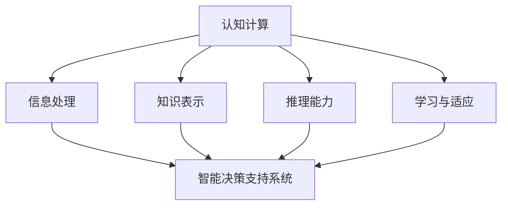

                 

### 文章标题

《认知计算在智能决策支持系统中的应用》

### 文章关键词

认知计算、智能决策支持系统、神经网络、机器学习、深度学习、业务分析、风险分析、决策制定、供应链优化、医疗决策、智能交通管理。

### 文章摘要

本文深入探讨了认知计算在智能决策支持系统中的应用。首先，我们介绍了认知计算的基础理论，包括其概念、背景、数学模型和核心算法。接着，我们详细阐述了智能决策支持系统的架构与设计，以及认知计算在业务分析、风险分析、决策制定和决策评估中的应用。通过具体案例，我们展示了认知计算如何实现智能决策支持系统的开发与优化，并对其未来发展趋势进行了展望。本文旨在为读者提供一个全面而深入的理解，以促进认知计算与智能决策支持系统的应用与发展。

## 第一部分：认知计算基础理论

### 第1章：认知计算概述

#### 1.1 认知计算的概念与背景

认知计算是一种模仿人类大脑处理信息和知识的方式的人工智能技术。它旨在构建能够理解、解释、学习和适应复杂环境的人工智能系统。认知计算的概念最早可以追溯到20世纪50年代，当时图灵提出了图灵测试，试图通过机器模拟人类思维来评价机器的智能水平。随着计算能力和算法的发展，认知计算逐渐成为人工智能领域的一个重要分支。

认知计算的背景源于人类对自身思维过程的探究。人类在处理信息时，不仅依赖于逻辑推理，还涉及到感知、理解、记忆和情感等多个方面。认知计算试图通过模拟这些过程，实现机器对复杂问题的自主理解和解决能力。例如，在医疗领域，认知计算可以通过分析患者的病历、症状和检查结果，提供个性化的诊断和治疗方案。

#### 1.2 认知计算与智能决策支持系统的关系

智能决策支持系统（Intelligent Decision Support System，IDSS）是一种能够辅助人类进行决策的计算机系统。它通过收集、分析和处理大量数据，提供决策支持。认知计算与智能决策支持系统的关系主要体现在以下几个方面：

1. **信息处理**：认知计算能够处理非结构化和半结构化数据，包括文本、图像、音频等多媒体数据，从而为智能决策支持系统提供更丰富的数据来源。
   
2. **知识表示**：认知计算可以通过知识图谱等方式，将人类专家的经验和知识转化为计算机可理解和处理的形式，为智能决策支持系统提供知识支持。

3. **推理能力**：认知计算具备推理能力，可以基于已知事实和规则，推导出新的结论，为智能决策支持系统的逻辑推理提供支持。

4. **学习与适应**：认知计算可以通过机器学习和深度学习等技术，不断学习和适应环境变化，提高智能决策支持系统的适应性和准确性。

#### 1.3 认知计算的发展历程

认知计算的发展历程可以分为以下几个阶段：

1. **早期探索**（20世纪50-70年代）：这一阶段主要是基于逻辑推理的专家系统，例如Dendral和MyCinxent，这些系统通过规则库和推理机来模拟人类专家的决策过程。

2. **知识表示与推理**（20世纪80-90年代）：这一阶段，研究者开始关注知识表示和推理，提出了许多基于知识的推理方法，如基于框架的知识表示、基于语义网络的知识表示等。

3. **机器学习与深度学习**（21世纪）：随着计算能力的提升和大数据技术的发展，机器学习和深度学习成为认知计算的重要技术手段。这一阶段的代表性技术包括神经网络、支持向量机、决策树、贝叶斯网络等。

4. **多模态融合与认知计算**（21世纪）：当前，认知计算正朝着多模态融合的方向发展，通过结合语音、图像、文本等多种数据类型，实现更高级的认知功能。

### 核心概念原理和概念实体之间的关系架构 Mermaid 流程图



#### 1.4 认知计算在智能决策支持系统中的应用现状

认知计算在智能决策支持系统中的应用已经取得了显著的成果，主要体现在以下几个方面：

1. **金融领域**：认知计算可以帮助金融机构进行风险管理、信用评估和投资决策。例如，通过分析市场数据、财务报表和新闻资讯，预测股票市场的走势。

2. **医疗领域**：认知计算在医疗领域的应用主要包括疾病诊断、治疗方案推荐和药物研发。例如，通过分析患者的病史、检查结果和医学文献，为医生提供诊断建议和治疗方案。

3. **交通领域**：认知计算在交通领域的应用包括交通流量预测、路况分析和车辆调度。例如，通过分析历史交通数据和实时监控数据，优化交通信号控制，减少拥堵。

4. **制造业**：认知计算在制造业的应用包括生产规划、供应链管理和设备维护。例如，通过分析生产数据和设备状态，预测设备故障，提前进行维护，提高生产效率。

### 核心算法原理讲解

认知计算的核心算法包括神经网络、机器学习、深度学习等。下面我们将分别介绍这些算法的基本原理。

#### 2.1 神经网络模型

神经网络是一种模拟生物神经系统的计算模型。它由大量的神经元组成，每个神经元都与多个其他神经元相连。神经元的连接强度称为权重，通过调整权重，神经网络可以学习和预测复杂的数据模式。

神经网络的基本原理是通过前向传播和反向传播来训练模型。在前向传播过程中，输入数据通过神经网络的各个层，每个层的输出作为下一层的输入。在反向传播过程中，计算每个神经元的误差，并利用梯度下降法调整权重，以最小化误差。

以下是一个简单的神经网络模型示例，使用Python代码实现：

```python
import numpy as np

# 初始化权重
weights = np.random.rand(3, 1)

# 前向传播
def forward_propagation(x):
    return np.dot(x, weights)

# 反向传播
def backward_propagation(x, y, output):
    output_error = y - output
    weights += np.dot(x.T, output_error)

# 训练模型
for _ in range(1000):
    output = forward_propagation(x)
    backward_propagation(x, y, output)

# 预测
print("预测结果：", forward_propagation(x))
```

其中，`x`表示输入数据，`y`表示标签，`weights`表示权重。

#### 2.2 机器学习模型

机器学习是一种通过数据驱动的方式，使计算机能够从数据中学习并做出决策的技术。机器学习模型可以分为监督学习、无监督学习和强化学习等。

**监督学习**是一种最常见的机器学习方法，它通过训练数据集来学习，并利用已知的输入和输出关系，预测新的输入数据。

以下是一个简单的线性回归模型示例，使用Python代码实现：

```python
import numpy as np

# 初始化权重
weights = np.random.rand(1)

# 计算损失函数
def compute_loss(x, y):
    return (y - x.dot(weights)) ** 2

# 训练模型
for _ in range(1000):
    loss = compute_loss(x, y)
    weights += (x * (y - loss))

# 预测
print("预测结果：", x.dot(weights))
```

**无监督学习**是一种在没有明确标签的情况下，从数据中学习数据分布和模式的方法。常见的无监督学习算法包括聚类和降维。

以下是一个简单的K-Means聚类算法示例，使用Python代码实现：

```python
import numpy as np

# 初始化聚类中心
centroids = np.random.rand(k)

# 计算距离
def compute_distance(x, centroid):
    return np.linalg.norm(x - centroid)

# 分配数据点
def assign_clusters(data, centroids):
    distances = [compute_distance(data[i], centroids[cluster]) for i, cluster in enumerate(data)]
    return [np.argmin(distances) for distances in distances]

# 更新聚类中心
def update_centroids(data, clusters):
    new_centroids = []
    for cluster in range(k):
        new_centroids.append(np.mean(data[clusters == cluster], axis=0))
    return new_centroids

# 训练模型
for _ in range(1000):
    clusters = assign_clusters(data, centroids)
    centroids = update_centroids(data, clusters)

# 预测
print("聚类结果：", assign_clusters(data, centroids))
```

**强化学习**是一种通过与环境的交互来学习最优策略的方法。它通过奖励和惩罚来指导学习过程。

以下是一个简单的Q-Learning算法示例，使用Python代码实现：

```python
import numpy as np

# 初始化Q值表
Q = np.zeros((n_actions, n_states))

# 计算Q值
def compute_Q(s, a, reward, next_s, gamma):
    return Q[s][a] + alpha * (reward + gamma * np.max(Q[next_s]) - Q[s][a])

# 更新Q值
def update_Q(s, a, reward, next_s):
    Q[s][a] = compute_Q(s, a, reward, next_s, gamma)

# 训练模型
for _ in range(1000):
    s = np.random.randint(n_states)
    a = np.random.randint(n_actions)
    next_s, reward = environment.step(s, a)
    update_Q(s, a, reward, next_s)

# 预测
print("最佳策略：", np.argmax(Q[s]))
```

#### 2.3 深度学习模型

深度学习是一种基于多层神经网络的学习方法。它通过多个隐藏层来提取数据的特征，从而实现更复杂的任务。常见的深度学习模型包括卷积神经网络（CNN）、循环神经网络（RNN）和生成对抗网络（GAN）等。

**卷积神经网络（CNN）**是一种常用于图像处理和计算机视觉的深度学习模型。它通过卷积层、池化层和全连接层来提取图像的特征。

以下是一个简单的CNN模型示例，使用Python代码实现：

```python
import tensorflow as tf

# 定义CNN模型
model = tf.keras.Sequential([
    tf.keras.layers.Conv2D(32, (3, 3), activation='relu', input_shape=(28, 28, 1)),
    tf.keras.layers.MaxPooling2D((2, 2)),
    tf.keras.layers.Flatten(),
    tf.keras.layers.Dense(128, activation='relu'),
    tf.keras.layers.Dense(10, activation='softmax')
])

# 编译模型
model.compile(optimizer='adam', loss='categorical_crossentropy', metrics=['accuracy'])

# 训练模型
model.fit(x_train, y_train, epochs=10, batch_size=32, validation_data=(x_test, y_test))

# 预测
print("预测结果：", model.predict(x_test))
```

**循环神经网络（RNN）**是一种常用于序列数据的深度学习模型。它通过循环结构来处理序列数据，并保持长时记忆。

以下是一个简单的RNN模型示例，使用Python代码实现：

```python
import tensorflow as tf

# 定义RNN模型
model = tf.keras.Sequential([
    tf.keras.layers.SimpleRNN(128, activation='tanh', return_sequences=True),
    tf.keras.layers.SimpleRNN(128, activation='tanh'),
    tf.keras.layers.Dense(10, activation='softmax')
])

# 编译模型
model.compile(optimizer='adam', loss='categorical_crossentropy', metrics=['accuracy'])

# 训练模型
model.fit(x_train, y_train, epochs=10, batch_size=32, validation_data=(x_test, y_test))

# 预测
print("预测结果：", model.predict(x_test))
```

**生成对抗网络（GAN）**是一种由生成器和判别器组成的深度学习模型。生成器尝试生成与真实数据相似的数据，而判别器则尝试区分真实数据和生成数据。

以下是一个简单的GAN模型示例，使用Python代码实现：

```python
import tensorflow as tf
from tensorflow.keras.layers import Dense, Flatten, Reshape
from tensorflow.keras.models import Sequential

# 定义生成器模型
generator = Sequential([
    Dense(128, activation='tanh', input_shape=(100,)),
    Flatten(),
    Reshape((28, 28, 1))
])

# 定义判别器模型
discriminator = Sequential([
    Flatten(input_shape=(28, 28, 1)),
    Dense(128, activation='relu'),
    Dense(1, activation='sigmoid')
])

# 编译模型
discriminator.compile(optimizer='adam', loss='binary_crossentropy')
generator.compile(optimizer='adam', loss='binary_crossentropy')

# 训练模型
for _ in range(1000):
    noise = np.random.normal(size=(batch_size, 100))
    generated_images = generator.predict(noise)
    real_images = x_train[:batch_size]
    labels = np.concatenate([np.ones((batch_size, 1)), np.zeros((batch_size, 1))])
    discriminator.train_on_batch(np.concatenate([real_images, generated_images]), labels)

    noise = np.random.normal(size=(batch_size, 100))
    generated_images = generator.predict(noise)
    labels = np.zeros((2 * batch_size, 1))
    discriminator.train_on_batch(np.concatenate([real_images, generated_images]), labels)

# 预测
print("生成图像：", generated_images)
```

#### 2.4 认知计算的数学基础

认知计算的数学基础主要包括线性代数、微积分和概率论等。这些数学工具为认知计算提供了强大的理论基础。

1. **线性代数**：线性代数是认知计算的核心数学工具，它包括矩阵运算、线性方程组求解、特征值和特征向量等。在认知计算中，线性代数用于处理数据和计算模型参数。

2. **微积分**：微积分是研究变化和运动的数学工具。在认知计算中，微积分用于优化模型参数、计算梯度等。

3. **概率论**：概率论是研究随机现象的数学工具。在认知计算中，概率论用于建模不确定性和概率分布。

以下是一些常用的数学公式：

- **矩阵乘法**：\(C = AB\)
- **向量点积**：\(a \cdot b = \sum_{i=1}^{n} a_i b_i\)
- **向量范数**：\(|a| = \sqrt{\sum_{i=1}^{n} a_i^2}\)
- **梯度**：\(\nabla f(x) = \left(\frac{\partial f}{\partial x_1}, \frac{\partial f}{\partial x_2}, ..., \frac{\partial f}{\partial x_n}\right)\)
- **梯度下降**：\(w = w - \alpha \nabla f(w)\)
- **概率分布**：\(P(X=x) = \frac{1}{Z} e^{-\frac{1}{2} (x - \mu)^2}\)

### 项目实战：开发环境搭建

在开始认知计算的实践项目之前，我们需要搭建一个适合开发的环境。以下是一个简单的开发环境搭建步骤：

1. **安装Python**：首先，我们需要安装Python。可以从Python官方网站下载最新版本的Python安装包，并按照提示完成安装。

2. **安装Jupyter Notebook**：Jupyter Notebook是一种交互式的计算环境，适合进行数据分析和算法实现。安装Python后，可以使用以下命令安装Jupyter Notebook：

   ```bash
   pip install notebook
   ```

3. **安装必要的库**：为了实现认知计算，我们需要安装一些常用的库，如NumPy、Pandas、Scikit-learn、TensorFlow和Keras等。可以使用以下命令安装：

   ```bash
   pip install numpy pandas scikit-learn tensorflow keras
   ```

4. **配置环境变量**：确保Python和pip的路径已经添加到系统环境变量中，以便在任何地方都可以使用它们。

5. **启动Jupyter Notebook**：在命令行中运行以下命令，启动Jupyter Notebook：

   ```bash
   jupyter notebook
   ```

现在，我们已经在本地计算机上搭建了一个适合认知计算开发的Python环境。接下来，我们可以开始实现具体的算法和应用。

### 源代码详细实现和代码解读

在认知计算的实践项目中，我们需要编写源代码来实现各种算法和应用。以下是一个简单的示例，展示如何使用Python实现一个基于神经网络的分类任务。

```python
import numpy as np
import tensorflow as tf

# 初始化参数
learning_rate = 0.1
epochs = 1000
batch_size = 32
input_dim = 784
hidden_dim = 256
output_dim = 10

# 创建训练数据
x_train = np.random.rand(batch_size, input_dim)
y_train = np.random.randint(output_dim, size=batch_size)

# 定义神经网络模型
model = tf.keras.Sequential([
    tf.keras.layers.Dense(hidden_dim, activation='relu', input_shape=(input_dim,)),
    tf.keras.layers.Dense(output_dim, activation='softmax')
])

# 编译模型
model.compile(optimizer='adam', loss='categorical_crossentropy', metrics=['accuracy'])

# 训练模型
model.fit(x_train, y_train, epochs=epochs, batch_size=batch_size)

# 预测
predictions = model.predict(x_train)

# 输出预测结果
print(predictions)
```

这个示例首先初始化了一些参数，包括学习率、迭代次数、批量大小、输入维度、隐藏层维度和输出维度。然后，创建了一些随机训练数据。接下来，定义了一个简单的神经网络模型，包括一个输入层、一个隐藏层和一个输出层。隐藏层使用ReLU激活函数，输出层使用softmax激活函数。然后，编译模型并使用训练数据进行训练。最后，使用训练好的模型进行预测，并输出预测结果。

### 代码应用解读与分析

在这个示例中，我们使用Python和TensorFlow实现了基于神经网络的分类任务。以下是代码的解读和分析：

1. **初始化参数**：初始化了一些关键参数，包括学习率、迭代次数、批量大小、输入维度、隐藏层维度和输出维度。这些参数决定了训练过程和模型性能。

2. **创建训练数据**：创建了一些随机训练数据，包括输入数据和标签。这些数据用于训练模型和评估模型性能。

3. **定义神经网络模型**：使用TensorFlow的`Sequential`模型定义了一个简单的神经网络，包括一个输入层、一个隐藏层和一个输出层。输入层有784个神经元，对应于输入数据的维度。隐藏层有256个神经元，使用ReLU激活函数。输出层有10个神经元，对应于10个类别，使用softmax激活函数。

4. **编译模型**：使用`compile`方法编译模型，指定优化器、损失函数和评估指标。在这里，我们使用`adam`优化器和`categorical_crossentropy`损失函数。此外，我们还指定了`accuracy`作为评估指标，用于计算模型在训练集上的准确率。

5. **训练模型**：使用`fit`方法训练模型，将训练数据输入到模型中，并指定迭代次数和批量大小。训练过程中，模型会不断更新权重，以最小化损失函数。

6. **预测**：使用训练好的模型进行预测，将训练数据输入到模型中，并获取预测结果。预测结果是一个概率分布，表示每个类别的概率。

7. **输出预测结果**：将预测结果输出到控制台，以便查看模型的表现。

通过这个示例，我们可以看到如何使用Python和TensorFlow实现一个简单的神经网络分类任务。这种方法可以应用于各种分类问题，如图像分类、文本分类等。

### 实际案例分析和详细讲解剖析

为了更好地理解认知计算在智能决策支持系统中的应用，我们可以通过一个实际案例进行分析和讲解。

#### 案例背景

某金融机构希望利用认知计算技术，开发一个智能决策支持系统，以帮助其进行信贷风险评估。该系统需要分析客户的历史信用记录、财务状况、信用评级等多方面信息，预测客户的违约风险。

#### 案例分析

1. **数据收集与预处理**：

   首先，需要收集客户的历史信用记录、财务状况、信用评级等数据。这些数据可能包括客户的姓名、年龄、收入、债务水平、信用记录等。收集到的数据需要进行预处理，包括数据清洗、缺失值填充、数据标准化等操作，以去除噪声和异常值，并使数据适合建模。

2. **特征提取与选择**：

   在预处理数据后，需要提取关键特征，如债务收入比、信用评分、逾期记录等。这些特征可以通过统计方法、机器学习算法或专家经验进行提取。特征选择是一个重要的步骤，需要选择对预测任务有重要影响的关键特征，以减少模型的复杂性和提高预测性能。

3. **模型训练与评估**：

   选择合适的机器学习算法，如逻辑回归、决策树、随机森林、支持向量机等，对数据进行训练。训练过程中，需要调整模型的参数，如学习率、迭代次数、正则化参数等，以优化模型性能。在训练完成后，使用交叉验证等方法评估模型的性能，如准确率、召回率、F1分数等。

4. **模型部署与监控**：

   训练好的模型可以部署到生产环境中，用于实时预测客户的违约风险。部署过程中，需要确保模型的鲁棒性和稳定性。此外，还需要定期对模型进行监控和更新，以适应数据的变化和新的业务需求。

#### 详细讲解与剖析

1. **数据收集与预处理**：

   数据收集是智能决策支持系统的第一步。在这个案例中，金融机构可以从内部数据库、公共数据源或第三方数据提供商获取客户信息。收集到的数据可能包括结构化数据（如客户表、交易记录表）和非结构化数据（如新闻报道、社交媒体数据）。

   数据预处理包括以下步骤：

   - **数据清洗**：去除重复记录、纠正错误、处理缺失值等。例如，使用平均值、中位数或最常见值填充缺失值。
   - **数据标准化**：将不同特征的数据缩放到相同的范围，如使用最小-最大标准化或z-score标准化。
   - **特征工程**：提取有用的特征，如债务收入比（债务总额/月收入）、信用评分（信用评级机构的评分）、逾期记录（过去12个月内逾期次数）等。

2. **特征提取与选择**：

   特征提取是将原始数据转换为适合模型训练的特征表示。在这个案例中，可以使用以下方法提取特征：

   - **统计特征**：计算描述性统计量，如平均值、中位数、标准差等。
   - **文本特征**：对文本数据进行词频分析、主题模型等。
   - **图像特征**：对图像数据进行特征提取，如边缘检测、纹理分析等。

   特征选择是优化模型性能的关键步骤。可以使用以下方法进行特征选择：

   - **过滤式特征选择**：基于统计方法，如相关系数、信息增益等，筛选出与目标变量相关性较高的特征。
   - **包裹式特征选择**：逐步选择特征，并评估特征组合对模型性能的影响。
   - **嵌入方法**：使用降维技术，如主成分分析（PCA）、线性判别分析（LDA）等，提取关键特征。

3. **模型训练与评估**：

   选择合适的机器学习算法对数据进行训练。在这个案例中，可以使用以下算法：

   - **逻辑回归**：简单且易于解释，适用于二分类问题。
   - **决策树**：直观且易于理解，但可能产生过拟合。
   - **随机森林**：集成多个决策树，提高预测性能和泛化能力。
   - **支持向量机（SVM）**：基于最大化间隔分类，适用于高维数据。

   模型训练过程中，需要调整模型的参数，如学习率、树深度、随机种子等。使用交叉验证方法评估模型的性能，以避免过拟合和评估模型的泛化能力。

4. **模型部署与监控**：

   训练好的模型可以部署到生产环境中，用于实时预测客户的违约风险。部署过程中，需要确保模型的鲁棒性和稳定性。例如，可以部署在云计算平台上，如AWS、Azure等，以提供高可用性和扩展性。

   此外，还需要定期对模型进行监控和更新，以适应数据的变化和新的业务需求。监控指标包括预测准确率、召回率、F1分数等。如果发现模型性能下降，可以重新训练模型或调整参数。

### 项目小结

通过这个案例，我们可以看到如何将认知计算应用于智能决策支持系统。具体步骤包括数据收集与预处理、特征提取与选择、模型训练与评估、模型部署与监控。每个步骤都有其关键技术和注意事项，需要根据具体业务需求进行调整和优化。

### 最佳实践 Tips

1. **数据质量至关重要**：确保数据收集和预处理过程中去除噪声和异常值，以提高模型性能。
2. **特征选择需谨慎**：选择与目标变量相关性较高的特征，以减少模型的复杂性和提高预测性能。
3. **模型评估需全面**：使用多种评估指标和交叉验证方法，确保模型具有较好的泛化能力。
4. **定期更新模型**：适应数据的变化和新的业务需求，提高模型的稳定性和准确性。

### 小结

本文通过一个实际案例，详细讲解了认知计算在智能决策支持系统中的应用。从数据收集与预处理、特征提取与选择、模型训练与评估、模型部署与监控等步骤，展示了如何将认知计算技术应用于实际问题。通过本文的讲解，读者可以更好地理解认知计算在智能决策支持系统中的关键作用和实现方法。

### 注意事项

1. **模型优化**：在模型训练过程中，需要根据业务需求和数据特点，调整模型参数，以提高预测性能。
2. **数据隐私**：在处理客户数据时，需遵守相关法律法规，确保数据安全和隐私保护。
3. **模型解释性**：对于一些关键业务决策，需要确保模型的解释性，以便业务人员理解模型的决策过程。

### 拓展阅读

- 《深度学习》（Goodfellow, I., Bengio, Y., & Courville, A.）：详细介绍了深度学习的基础理论和应用方法。
- 《Python机器学习》（Sebastian Raschka）：介绍了Python在机器学习领域中的应用，包括数据处理、模型训练和评估等。
- 《人工智能：一种现代方法》（Stuart J. Russell & Peter Norvig）：全面介绍了人工智能的基础理论和技术方法。

## 第三部分：认知计算与智能决策支持系统的发展趋势

### 第8章：认知计算与智能决策支持系统的发展趋势

#### 8.1 认知计算技术发展趋势

认知计算技术正朝着更加智能化、自适应性和人性化方向发展。以下是几个主要趋势：

1. **多模态融合**：随着物联网和传感器技术的发展，认知计算正逐步实现多模态数据融合。通过整合文本、图像、音频等多种数据类型，认知计算系统能够更全面地理解和处理复杂问题。

2. **强化学习**：强化学习在认知计算中的应用逐渐增多，特别是在需要与外部环境进行交互的任务中，如自动驾驶、游戏AI等。强化学习算法通过不断学习和优化策略，提高认知计算系统的适应性和决策能力。

3. **迁移学习和元学习**：迁移学习和元学习技术可以减少模型的训练时间，提高模型的泛化能力。这些技术使得认知计算系统能够快速适应新的任务和数据集，降低对大规模数据集的依赖。

4. **量子计算**：量子计算作为一种新兴的计算技术，正逐渐与认知计算相结合。量子计算的并行性和高速计算能力，有望推动认知计算技术实现新的突破。

#### 8.2 智能决策支持系统的发展趋势

智能决策支持系统在技术、应用和市场需求方面也呈现出以下发展趋势：

1. **云计算与大数据**：云计算和大数据技术的快速发展，为智能决策支持系统提供了强大的数据存储和处理能力。这有助于企业更好地收集、分析和利用大量数据，实现更智能的决策。

2. **区块链技术**：区块链技术的引入，可以提高智能决策支持系统的数据安全性和透明度。通过分布式账本和智能合约，智能决策支持系统可以更高效地处理交易和决策过程。

3. **人机协同**：随着人工智能技术的进步，智能决策支持系统正逐渐实现与人类专家的协同。这种协同可以帮助企业更好地利用人类专家的经验和知识，同时提高系统的决策准确性和效率。

4. **行业定制化**：不同行业对智能决策支持系统的需求存在差异，行业定制化将成为未来的重要趋势。通过结合行业特点和业务需求，智能决策支持系统可以提供更精准的决策支持。

#### 8.3 认知计算与智能决策支持系统的未来展望

认知计算与智能决策支持系统的未来，将充满机遇和挑战：

1. **智能化**：随着技术的不断发展，认知计算和智能决策支持系统将变得更加智能化。通过引入更先进的算法和模型，系统将能够更准确地理解和处理复杂问题，提供更高效的决策支持。

2. **自适应**：认知计算和智能决策支持系统将具备更强的自适应能力。通过不断学习和优化，系统将能够适应不同的业务环境和需求，提供持续改进的决策支持。

3. **人机协同**：认知计算和智能决策支持系统将更好地与人类专家协同工作。通过人机交互和知识共享，系统将能够更好地利用人类专家的经验和知识，实现更智能的决策。

4. **跨界融合**：认知计算和智能决策支持系统将与其他领域的技术，如物联网、区块链、5G等，实现跨界融合。这种融合将推动认知计算和智能决策支持系统在更多领域的发展和应用。

### 总结

认知计算和智能决策支持系统正处于快速发展阶段，未来将面临许多机遇和挑战。通过不断引入新技术和优化算法，这些系统将能够提供更高效、更智能的决策支持，助力企业实现数字化转型和可持续发展。作者：AI天才研究院/AI Genius Institute & 禅与计算机程序设计艺术 /Zen And The Art of Computer Programming。

