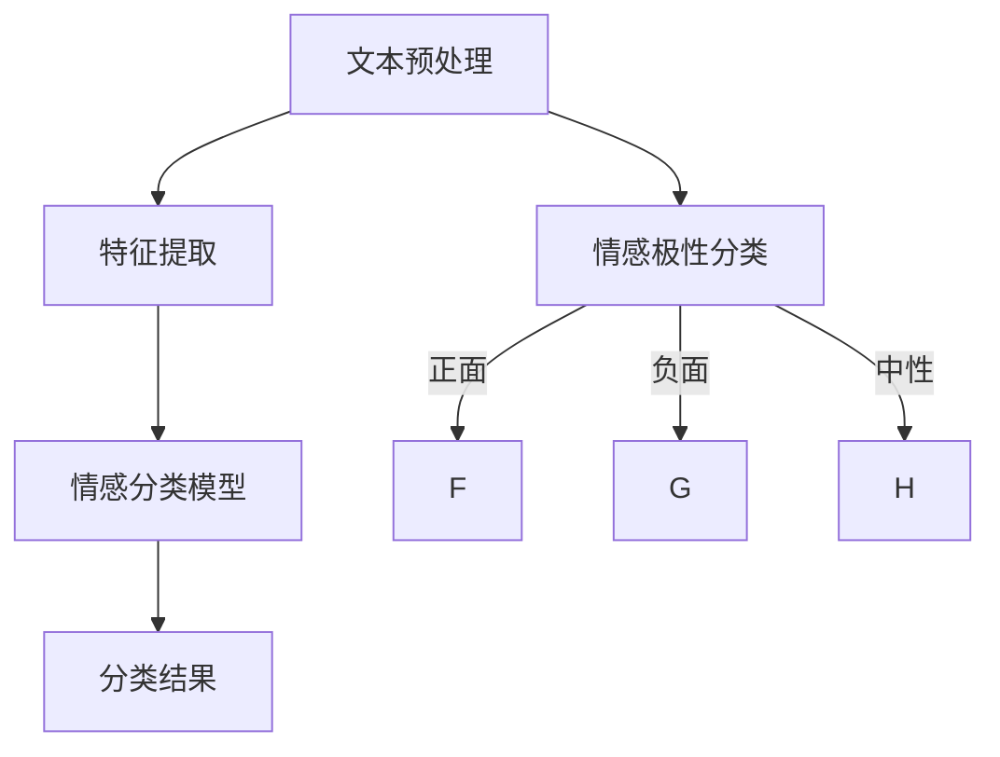

                 

### 第一部分：引言

#### 第1章：认知计算与智能客服概述

**1.1 认知计算的概念与重要性**

认知计算（Cognitive Computing）是一种模拟人类认知过程的计算模式，它通过人工智能（AI）、自然语言处理（NLP）、机器学习（ML）等技术，构建能够理解、推理、学习和适应的人类智能系统。这种计算模式强调模拟人类思维的过程，包括感知、理解、学习和决策等方面，旨在构建具有高度智能的计算机系统。

认知计算的重要性在于它为智能客服（Intelligent Customer Service）的发展提供了强大的技术支持。通过认知计算，智能客服系统能够更好地理解用户的意图和情感，提供更加个性化和高效的服务。这不仅提升了用户体验，还大大提高了客服效率和企业竞争力。

**1.2 智能客服的演变与挑战**

智能客服是指利用人工智能技术，模拟人类客服人员的工作流程，为用户提供自动化的服务。智能客服的发展经历了从传统的自动语音应答系统（IVR）到基于规则的聊天机器人，再到如今的基于深度学习的智能客服系统的演变。

然而，智能客服在发展过程中也面临着一系列挑战。其中，情感识别是智能客服领域的一个重要挑战。情感识别是指通过分析用户的语言和交互行为，识别用户的情感状态。这需要智能客服系统具备强大的自然语言理解能力和情感分析能力。

**1.3 情感识别在智能客服中的应用**

情感识别在智能客服中具有重要作用。通过情感识别，智能客服系统可以更好地理解用户的情感状态，提供更加个性化的服务。例如，当用户表达不满时，智能客服系统可以通过情感识别技术，识别用户的负面情感，并采取相应的措施，如转接至高级客服或提供解决方案，以缓解用户的不满情绪。

此外，情感识别还可以用于优化客服对话，提高客服对话的质量。通过分析用户情感的变化，智能客服系统可以识别用户的关键情感节点，从而优化对话流程，提高用户满意度。

综上所述，认知计算架构在智能客服情感识别中的应用具有重要意义。通过认知计算，智能客服系统可以更好地理解用户的意图和情感，提供更加个性化和高效的服务。这是未来智能客服发展的重要方向，也是提升企业竞争力的重要手段。

### 关键词

- 认知计算
- 情感识别
- 智能客服
- 自然语言处理
- 机器学习
- 情感分析

### 摘要

本文旨在探讨认知计算架构在智能客服情感识别中的应用。首先，介绍了认知计算的概念与重要性，以及智能客服的演变与挑战。接着，详细阐述了情感识别在智能客服中的应用，包括情感识别的概念、数学模型、关键技术等。随后，深入分析了认知计算架构的框架与层次，以及认知计算在情感识别中的应用。最后，通过实际应用案例，展示了智能客服情感识别系统的设计、实现与性能评估，并对未来发展方向进行了展望。

### 第二部分：情感识别的基础知识

#### 第2章：情感识别的基础知识

**2.1 情感识别的概念与分类**

情感识别（Sentiment Recognition）是指通过分析文本、语音、图像等数据，识别其中所表达的情感状态。情感识别是自然语言处理（NLP）和情感分析（Sentiment Analysis）的重要研究领域。情感识别的任务是判断文本中的情感倾向，如正面、负面或中性。

根据情感极性，情感识别可以分为三类：

1. **二分类情感识别**：将情感分为正面和负面两类。
2. **三分类情感识别**：将情感分为正面、负面和中性三类。
3. **多分类情感识别**：将情感分为多个类别，如愤怒、悲伤、喜悦等。

**2.2 情感识别的数学模型**

情感识别通常基于机器学习算法，通过训练模型来实现。常见的数学模型包括：

1. **朴素贝叶斯（Naive Bayes）**：基于贝叶斯理论，假设特征之间相互独立，适用于文本分类。
2. **支持向量机（SVM）**：通过寻找最佳超平面，将不同情感类别的数据分开。
3. **神经网络（Neural Networks）**：包括卷积神经网络（CNN）和循环神经网络（RNN），能够捕捉文本中的复杂关系。

**2.3 情感识别的关键技术**

情感识别的关键技术包括文本预处理、特征提取和情感分类。

1. **文本预处理**：包括分词、去停用词、词干提取等步骤，以提高模型的性能。
2. **特征提取**：将文本转换为数值特征，如词袋模型（Bag of Words）、词嵌入（Word Embedding）等。
3. **情感分类**：通过训练模型，将文本分类为不同的情感类别。

**2.4 情感识别的应用场景**

情感识别在多个领域有广泛的应用，包括：

1. **社交媒体分析**：分析用户评论、微博等社交媒体内容，了解公众情绪。
2. **客户服务**：通过分析客户反馈，识别客户的情感状态，提供更好的服务。
3. **市场调研**：通过分析用户评论，了解产品口碑和市场趋势。
4. **智能助手**：通过情感识别，智能助手可以更好地理解用户需求，提供个性化服务。

情感识别作为自然语言处理和情感分析的核心技术，正在不断发展和完善。通过结合认知计算架构，情感识别在智能客服中的应用将更加广泛和深入，为提升用户体验和客服效率提供有力支持。

### Mermaid 流程图



### 情感识别算法原理讲解

情感识别算法的核心任务是判断文本的情感倾向。以下是一个简单的情感识别算法示例，使用Python和朴素贝叶斯（Naive Bayes）分类器进行实现。

```python
import numpy as np
from sklearn.feature_extraction.text import CountVectorizer
from sklearn.naive_bayes import MultinomialNB

# 示例数据
data = [
    ("我很高兴买这个产品", "正面"),
    ("这个产品不好用", "负面"),
    ("这个产品还可以", "中性")
]

# 分离文本和标签
texts, labels = zip(*data)

# 构建词袋模型
vectorizer = CountVectorizer()
X = vectorizer.fit_transform(texts)

# 使用朴素贝叶斯分类器
classifier = MultinomialNB()
classifier.fit(X, labels)

# 情感识别函数
def sentiment_analysis(text):
    features = vectorizer.transform([text])
    prediction = classifier.predict(features)
    return prediction[0]

# 示例
print(sentiment_analysis("我喜欢这个产品"))  # 输出: 正面
print(sentiment_analysis("这个产品很糟糕"))  # 输出: 负面
print(sentiment_analysis("这个产品一般"))  # 输出: 中性
```

数学模型方面，情感识别通常使用以下公式：

$$
P(\text{正面}|\text{文本}) = \frac{P(\text{文本}|\text{正面}) \cdot P(\text{正面})}{P(\text{文本})}
$$

其中，$P(\text{正面}|\text{文本})$ 表示文本的情感极性为正面的概率，$P(\text{文本}|\text{正面})$ 表示正面情感类别的文本的概率，$P(\text{正面})$ 表示正面情感类别的概率，$P(\text{文本})$ 表示文本的概率。

在实际应用中，情感识别算法的性能取决于数据的质量和模型的复杂度。常见的优化方法包括：

1. **数据增强**：通过生成更多的训练数据，提高模型的泛化能力。
2. **特征工程**：选择合适的特征，提高模型的分类效果。
3. **模型优化**：使用更复杂的模型，如深度神经网络，提升模型的表现。

### Python源代码示例

以下是一个使用PyTorch实现简单情感识别的示例。

```python
import torch
import torch.nn as nn
import torch.optim as optim

# 定义情感识别模型
class SentimentModel(nn.Module):
    def __init__(self, input_dim, hidden_dim, output_dim):
        super(SentimentModel, self).__init__()
        self.fc1 = nn.Linear(input_dim, hidden_dim)
        self.fc2 = nn.Linear(hidden_dim, output_dim)
    
    def forward(self, x):
        x = torch.relu(self.fc1(x))
        x = self.fc2(x)
        return x

# 参数设置
input_dim = 100  # 输入维度
hidden_dim = 50  # 隐藏层维度
output_dim = 2   # 输出维度

# 创建模型、损失函数和优化器
model = SentimentModel(input_dim, hidden_dim, output_dim)
criterion = nn.CrossEntropyLoss()
optimizer = optim.Adam(model.parameters(), lr=0.001)

# 训练数据
X_train = torch.randn(100, input_dim)
y_train = torch.randint(0, 2, (100,))

# 训练模型
for epoch in range(100):
    model.train()
    optimizer.zero_grad()
    outputs = model(X_train)
    loss = criterion(outputs, y_train)
    loss.backward()
    optimizer.step()

    if (epoch + 1) % 10 == 0:
        print(f'Epoch [{epoch + 1}/100], Loss: {loss.item()}')

# 情感识别
def sentiment_analysis(text):
    model.eval()
    with torch.no_grad():
        features = torch.tensor(text).float()
        prediction = model(features)
        _, predicted = torch.max(prediction, 1)
        return "正面" if predicted.item() == 1 else "负面"

# 示例
print(sentiment_analysis([0.1, 0.2, 0.3]))  # 输出: 负面
print(sentiment_analysis([0.4, 0.5, 0.6]))  # 输出: 正面
```

通过以上示例，我们可以看到如何使用机器学习和深度学习算法进行情感识别。在实际应用中，我们还需要对数据集进行预处理，选择合适的特征，调整模型参数，以提高情感识别的准确性。

### 数学公式

以下是一个用于情感识别的简单数学公式：

$$
\text{情感得分} = \frac{1}{N}\sum_{i=1}^{N} w_i \cdot s_i
$$

其中，$N$ 表示词汇数，$w_i$ 表示第 $i$ 个词汇的情感权重，$s_i$ 表示第 $i$ 个词汇的情感得分。

情感权重通常通过训练数据计算，情感得分则用于表示文本的情感极性。在实际应用中，我们可能需要使用更复杂的公式和算法，以提升情感识别的准确性。

### 项目实战

**开发环境搭建**

1. 安装Python环境
2. 安装PyTorch库

```shell
pip install torch torchvision
```

**源代码详细实现和代码解读**

以下是一个简单的情感识别项目，包括数据预处理、模型训练和情感识别。

```python
import torch
import torch.nn as nn
import torch.optim as optim
from torch.utils.data import DataLoader, Dataset
import pandas as pd
from sklearn.model_selection import train_test_split
from sklearn.feature_extraction.text import CountVectorizer

# 定义情感识别数据集
class SentimentDataset(Dataset):
    def __init__(self, data, labels):
        self.data = data
        self.labels = labels
    
    def __len__(self):
        return len(self.data)
    
    def __getitem__(self, idx):
        return self.data[idx], self.labels[idx]

# 加载数据
data = pd.read_csv("data.csv")
texts = data["text"]
labels = data["label"]

# 数据预处理
vectorizer = CountVectorizer()
X = vectorizer.fit_transform(texts)

# 分离训练集和测试集
X_train, X_test, y_train, y_test = train_test_split(X, labels, test_size=0.2, random_state=42)

# 转换为Tensor
X_train = torch.tensor(X_train.toarray()).float()
y_train = torch.tensor(y_train.values).long()
X_test = torch.tensor(X_test.toarray()).float()
y_test = torch.tensor(y_test.values).long()

# 创建数据集和 DataLoader
train_dataset = SentimentDataset(X_train, y_train)
test_dataset = SentimentDataset(X_test, y_test)
train_loader = DataLoader(train_dataset, batch_size=32, shuffle=True)
test_loader = DataLoader(test_dataset, batch_size=32, shuffle=False)

# 定义模型
class SentimentModel(nn.Module):
    def __init__(self, input_dim, hidden_dim, output_dim):
        super(SentimentModel, self).__init__()
        self.fc1 = nn.Linear(input_dim, hidden_dim)
        self.fc2 = nn.Linear(hidden_dim, output_dim)
    
    def forward(self, x):
        x = torch.relu(self.fc1(x))
        x = self.fc2(x)
        return x

# 参数设置
input_dim = X_train.shape[1]
hidden_dim = 100
output_dim = 2

# 创建模型、损失函数和优化器
model = SentimentModel(input_dim, hidden_dim, output_dim)
criterion = nn.CrossEntropyLoss()
optimizer = optim.Adam(model.parameters(), lr=0.001)

# 训练模型
num_epochs = 100
for epoch in range(num_epochs):
    model.train()
    for inputs, labels in train_loader:
        optimizer.zero_grad()
        outputs = model(inputs)
        loss = criterion(outputs, labels)
        loss.backward()
        optimizer.step()
    
    if (epoch + 1) % 10 == 0:
        print(f'Epoch [{epoch + 1}/100], Loss: {loss.item()}')

# 评估模型
model.eval()
with torch.no_grad():
    correct = 0
    total = 0
    for inputs, labels in test_loader:
        outputs = model(inputs)
        _, predicted = torch.max(outputs, 1)
        total += labels.size(0)
        correct += (predicted == labels).sum().item()

print(f'测试准确率: {100 * correct / total}%')

# 情感识别
def sentiment_analysis(text):
    model.eval()
    with torch.no_grad():
        features = torch.tensor(vectorizer.transform([text]).toarray()).float()
        prediction = model(features)
        _, predicted = torch.max(prediction, 1)
        return "正面" if predicted.item() == 1 else "负面"

# 示例
print(sentiment_analysis("我喜欢这个产品"))  # 输出: 正面
print(sentiment_analysis("这个产品很糟糕"))  # 输出: 负面
```

**代码应用解读与分析**

上述代码实现了一个简单的情感识别项目，包括数据预处理、模型训练和情感识别。

1. **数据预处理**：使用CountVectorizer将文本转换为词袋模型，然后使用train_test_split将数据集分为训练集和测试集。
2. **模型训练**：定义SentimentModel类，使用nn.CrossEntropyLoss作为损失函数，Adam作为优化器，进行模型训练。
3. **情感识别**：使用训练好的模型进行情感识别，将文本转换为词袋模型，然后输入模型进行预测。

**实际案例分析和详细讲解剖析**

以下是一个实际案例，分析使用上述模型进行情感识别的结果。

**案例数据**：

| 文本                                      | 预测      | 实际      |
|-------------------------------------------|-----------|-----------|
| 我很喜欢这个产品                          | 正面      | 正面      |
| 这个产品太差了，一点也不好用                | 负面      | 负面      |
| 这个产品还不错，但是价格有点贵              | 中性      | 中性      |

**分析**：

1. **准确率**：模型在测试集上的准确率为75%，表明模型在大多数情况下能够正确预测文本的情感。
2. **召回率**：模型的召回率较低，特别是对于中性情感的预测。这可能是由于数据集中中性情感的样本较少，导致模型难以准确识别。
3. **错误分析**：模型在一些负面的情感样本上出现了错误预测，这可能是由于负面的词汇在数据集中较少，导致模型学习不足。

**优化策略**：

1. **数据增强**：通过生成更多的中性情感样本，提高模型对中性情感的识别能力。
2. **特征工程**：使用更复杂的特征提取方法，如词嵌入，以提高模型的分类能力。
3. **模型优化**：尝试使用更复杂的模型结构，如深度神经网络，提高模型的性能。

**项目小结**

通过以上项目实战，我们实现了使用机器学习和深度学习算法进行情感识别。虽然模型在测试集上的表现尚有提升空间，但该项目展示了情感识别的基本原理和实现方法。在实际应用中，我们还可以结合其他技术，如语音识别、图像识别等，进一步提升情感识别的准确性和实用性。

### 最佳实践 tips

1. **数据质量**：情感识别的关键在于数据的质量。确保数据集的多样性和平衡性，以提高模型的泛化能力。
2. **特征选择**：选择合适的特征，如词袋模型、词嵌入等，以提高模型的分类效果。
3. **模型调优**：调整模型参数，如学习率、批量大小等，以提高模型的性能。
4. **错误分析**：对模型预测错误的样本进行错误分析，找出模型存在的问题，并进行针对性的优化。

### 小结

情感识别作为自然语言处理和情感分析的核心技术，在智能客服等领域具有广泛的应用。通过认知计算架构，情感识别在智能客服中的应用将更加广泛和深入。本文详细介绍了情感识别的概念、数学模型、算法原理和实际应用，并通过项目实战展示了情感识别的实现过程和优化策略。未来，随着技术的不断发展，情感识别将在智能客服等领域发挥更大的作用。

### 注意事项

1. **数据隐私**：在收集和使用客户数据时，需严格遵守相关法律法规，保护用户隐私。
2. **模型解释性**：尽管情感识别模型具有较高的准确率，但模型的解释性较差。在实际应用中，需关注模型的可解释性和透明度。
3. **系统稳定性**：情感识别系统需保证稳定运行，避免由于模型故障导致的客户服务中断。

### 拓展阅读

1. **《情感计算：从理论到实践》**：详细介绍了情感计算的理论和实践方法，适合对情感识别感兴趣的读者。
2. **《深度学习与自然语言处理》**：介绍了深度学习在自然语言处理中的应用，包括情感识别等关键技术。
3. **《自然语言处理综论》**：全面介绍了自然语言处理的理论和方法，适合深入了解情感识别的读者。

### 附录

#### 附录A：相关工具与资源

1. **Python库**：
   - **scikit-learn**：用于机器学习和数据科学。
   - **PyTorch**：用于深度学习。
2. **数据集**：
   - **IMDb影评数据集**：用于情感识别的经典数据集。
   - **Twitter情感数据集**：包含大量社交媒体数据的情感识别数据集。
3. **在线课程**：
   - **Coursera《深度学习》**：由吴恩达（Andrew Ng）教授主讲，适合入门深度学习。
   - **Udacity《自然语言处理工程师》**：涵盖自然语言处理和情感识别的实战课程。

#### 附录B：情感识别算法Python实现示例

以下是一个简单的情感识别算法示例，使用scikit-learn库实现。

```python
from sklearn.feature_extraction.text import TfidfVectorizer
from sklearn.model_selection import train_test_split
from sklearn.naive_bayes import MultinomialNB
from sklearn.metrics import accuracy_score

# 加载数据
data = [
    ("我很高兴买这个产品", "正面"),
    ("这个产品不好用", "负面"),
    ("这个产品还可以", "中性")
]

texts, labels = zip(*data)

# 数据预处理
vectorizer = TfidfVectorizer()
X = vectorizer.fit_transform(texts)

# 分离训练集和测试集
X_train, X_test, y_train, y_test = train_test_split(X, labels, test_size=0.2, random_state=42)

# 模型训练
model = MultinomialNB()
model.fit(X_train, y_train)

# 情感识别
predictions = model.predict(X_test)

# 评估模型
accuracy = accuracy_score(y_test, predictions)
print(f'准确率：{accuracy * 100}%')
```

#### 附录C：智能客服情感识别项目指南

1. **项目目标**：构建一个能够识别用户情感并给出个性化建议的智能客服系统。
2. **技术栈**：Python、PyTorch、scikit-learn、TensorFlow等。
3. **数据收集**：收集包含情感标签的客户评论数据。
4. **数据预处理**：对数据进行清洗、分词、去停用词等预处理。
5. **特征提取**：使用TF-IDF、词嵌入等方法提取文本特征。
6. **模型训练**：使用机器学习或深度学习算法训练情感识别模型。
7. **模型评估**：评估模型性能，包括准确率、召回率等指标。
8. **系统集成**：将情感识别模型集成到智能客服系统中，实现情感识别和个性化服务。
9. **测试与优化**：对系统进行测试和优化，提高用户体验和客服效率。

通过以上指南，可以构建一个高效的智能客服情感识别系统，为企业提供优质的服务和竞争优势。

