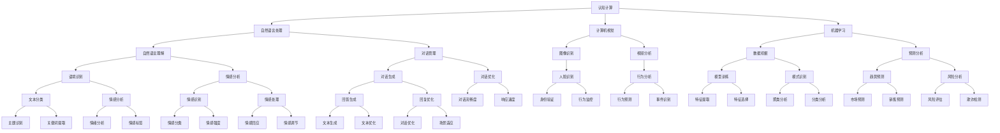
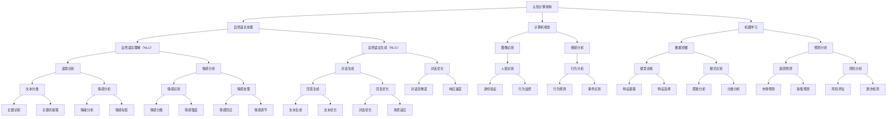

                 

### 认知计算与智能客服系统概述

#### 认知计算的概念

认知计算（Cognitive Computing）是一种模拟人类思维过程的技术，它结合了人工智能、自然语言处理、机器学习和数据科学等多学科知识，旨在实现具有人类智能水平的计算机系统。认知计算的核心在于模仿人类的感知、学习、推理和决策过程，使计算机能够更好地理解和响应人类的需求。

认知计算的主要特点包括：

1. **自适应性和灵活性**：认知计算系统能够根据不同的环境和任务需求，自适应地调整其行为和策略。
2. **人机交互**：认知计算系统具备自然语言理解和生成能力，能够与用户进行流畅的对话和交流。
3. **情境感知**：系统能够理解和分析用户的情感状态、上下文信息和行为模式，提供个性化的服务。
4. **自主学习**：认知计算系统通过不断学习和积累经验，能够不断提升其性能和智能水平。

#### 智能客服系统的概念

智能客服系统（Intelligent Customer Service System）是一种利用人工智能技术，提供自动化、智能化的客户服务解决方案。它通过自然语言处理、机器学习、计算机视觉等技术，模拟人类客服人员的交互方式，实现与客户的实时沟通和服务。

智能客服系统的核心组成部分包括：

1. **自然语言理解（NLU）**：将客户的自然语言输入转换为结构化的数据，以便系统进行后续处理。
2. **对话管理**：根据客户的问题和需求，生成合适的回答和解决方案。
3. **业务逻辑处理**：处理客户的业务请求，如订单查询、投诉处理等。
4. **自然语言生成（NLG）**：将系统生成的结构化数据转换为自然语言，以回复客户。

#### 认知计算在智能客服系统中的应用

认知计算在智能客服系统中的应用主要体现在以下几个方面：

1. **提高客服效率**：通过自动化处理大量客户请求，减轻人工客服的工作负担，提高整体服务效率。
2. **优化用户体验**：根据客户的历史行为和偏好，提供个性化的服务和建议，提升用户体验。
3. **降低运营成本**：智能客服系统能够24小时不间断地提供服务，降低人工客服的招聘和培训成本。
4. **增强数据分析能力**：通过对客户交互数据的分析，企业可以更好地了解客户需求和市场动态，为业务决策提供支持。

为了更好地理解认知计算在智能客服系统中的应用，我们可以通过以下Mermaid流程图展示其关系架构：

通过上述关系架构图，我们可以清晰地看到认知计算架构中各个组件如何协同工作，共同提升智能客服系统的智能水平和用户体验。在接下来的章节中，我们将进一步探讨认知计算架构的核心组件及其在智能客服系统中的应用。

---

**核心概念与联系**

认知计算架构中的核心组件包括自然语言处理（NLP）、计算机视觉（CV）和机器学习（ML）。这些组件之间相互关联，共同构成一个复杂而高效的计算系统。

1. **自然语言处理（NLP）**：NLP是认知计算的核心组成部分，负责处理和理解人类语言。它包括自然语言理解（NLU）和自然语言生成（NLG）两个主要领域。

2. **计算机视觉（CV）**：CV用于处理和解析图像和视频数据，实现对视觉信息的理解和分析。CV技术如人脸识别、图像识别和视频分析在智能客服系统中有着广泛的应用。

3. **机器学习（ML）**：ML是认知计算中实现智能和自适应性的关键技术。它通过训练模型，使系统具备预测和分析能力，从而更好地理解用户需求和提供个性化服务。

这些组件之间的关系可以用以下Mermaid流程图来表示：

通过这个关系架构图，我们可以更直观地理解认知计算架构中各个组件的功能及其相互之间的关系，为后续章节的深入探讨提供了基础。

---

**认知计算与人工智能的区别**

虽然认知计算和人工智能（Artificial Intelligence, AI）都致力于使计算机具备类似人类智能的能力，但两者在理论基础和应用场景上存在显著差异。

**理论基础**：

- **认知计算**：认知计算基于人类认知科学的理论，模仿人类的感知、学习、记忆、推理和决策过程。它强调理解人类思维方式的机制，以及如何将这些机制应用于计算机系统中。
- **人工智能**：人工智能则更加广泛，它涉及多个学科，包括计算机科学、心理学、认知科学、神经科学等。人工智能的核心目标是使计算机能够执行特定的智能任务，如图像识别、语音识别、游戏玩法等。

**应用场景**：

- **认知计算**：认知计算适用于需要复杂推理和决策的任务，如智能客服系统、医疗诊断、金融分析等。它强调与用户的自然交互，提供个性化的服务和解决方案。
- **人工智能**：人工智能则在更多领域得到应用，如自动驾驶、智能家居、安防监控、自然语言处理等。它更侧重于特定任务的自动化和效率提升。

**关键区别**：

1. **理论来源**：认知计算源于人类认知科学，强调模仿人类思维过程；而人工智能则融合了多学科知识，包括计算机科学、心理学等。
2. **目标导向**：认知计算关注于理解和模拟人类思维，提供类似人类的智能服务；人工智能则关注于实现特定任务的自动化和智能化。
3. **应用范围**：认知计算适用于需要复杂推理和决策的领域；人工智能则更广泛，适用于多个领域的自动化和智能化任务。

总之，认知计算和人工智能虽然密切相关，但它们在理论基础和应用场景上各有侧重。理解这两者的区别有助于我们更好地把握认知计算在智能客服系统中的应用潜力。

---

#### 智能客服系统的发展历程

智能客服系统的发展历程可以追溯到20世纪90年代，当时互联网的兴起为在线客服提供了契机。最初，智能客服系统主要以基本的聊天机器人形式出现，主要功能是提供自动化的信息查询服务。随着技术的进步，智能客服系统的功能逐渐丰富，发展历程可以分为以下几个阶段：

**第一阶段：基础聊天机器人（1990s-2000s初期）**

在这个阶段，智能客服系统主要依靠预定义的规则和关键词匹配技术，能够回答一些简单的、常见的问题。这些系统通常被称为聊天机器人或虚拟助手。例如，一些在线零售商使用聊天机器人来提供产品查询和订单状态查询服务。

**第二阶段：基于知识的智能客服系统（2000s中期-2010s初期）**

随着自然语言处理（NLP）和知识图谱技术的进步，智能客服系统开始引入基于知识的对话管理机制。这些系统能够处理更复杂的用户查询，并能从大量结构化和非结构化数据中提取信息。在这一阶段，智能客服系统开始具备一定程度的自然语言理解和生成能力，能够进行更为流畅的对话。

**第三阶段：机器学习驱动的智能客服系统（2010s中期至今）**

随着深度学习技术的兴起，智能客服系统迎来了新的发展机遇。基于深度学习的自然语言处理技术，如序列到序列模型（Seq2Seq）、循环神经网络（RNN）和变换器模型（Transformer），使得智能客服系统能够处理更加复杂的对话任务。此外，机器学习算法的应用使得系统具有自我学习和自我优化的能力，能够根据用户的历史数据和交互模式，不断改进其对话效果。

**关键里程碑**：

1. **2003年**：IBM的沃森（Watson）超级计算机在电视游戏节目《危险边缘》中击败人类冠军，展示了人工智能在处理大量文本数据和理解自然语言方面的潜力。
2. **2011年**：苹果公司发布了智能个人助手Siri，标志着智能客服系统进入大众视野，并推动了相关技术的发展。
3. **2016年**：谷歌推出了基于Transformer模型的自然语言处理系统BERT（Bidirectional Encoder Representations from Transformers），大幅提升了自然语言理解的性能，为智能客服系统的发展提供了新的技术支撑。

通过这些关键里程碑，智能客服系统逐渐从简单的规则驱动系统转变为高度智能化的系统，能够提供更为自然、流畅和个性化的客户服务。

#### 认知计算在智能客服系统中的应用

认知计算在智能客服系统中的应用，极大地提升了系统的智能化水平和用户体验。以下是认知计算在智能客服系统中应用的几个关键方面：

**1. 自然语言处理（NLP）组件的应用**

NLP作为认知计算的核心组件，在智能客服系统中扮演着至关重要的角色。NLP主要包括自然语言理解（NLU）和自然语言生成（NLG）两个部分。

- **自然语言理解（NLU）**：
  - **语境识别**：NLU通过上下文分析，理解用户的意图和场景。例如，当用户询问“最近的订单状态”时，系统需要识别这是一个关于订单的信息查询。
  - **情感分析**：通过情感分析，NLU可以识别用户的情绪状态。例如，当用户表达愤怒或失望时，系统可以采取相应的措施，如转接至人工客服或提供情绪缓解建议。
  - **对话管理**：NLU支持对话管理功能，能够跟踪对话的历史和上下文，确保对话的连贯性和一致性。

- **自然语言生成（NLG）**：
  - **回答生成**：NLG根据系统理解的用户意图和对话上下文，生成合适的回答。例如，当用户查询订单状态时，系统可以生成详细的订单状态报告。
  - **回复优化**：NLG不仅生成回答，还优化回答的语言表达，使其更加自然、流畅和友好。

**2. 计算机视觉（CV）组件的应用**

计算机视觉技术在智能客服系统中，主要用于处理和分析图像和视频数据，提供视觉交互功能。

- **图像识别**：通过图像识别技术，系统可以识别用户上传的图片，提取关键信息。例如，用户上传产品图片，系统可以识别并回答产品的详细信息。
- **人脸识别**：人脸识别技术用于身份验证和安全防护。例如，在银行或电信行业，系统可以通过人脸识别确认用户的身份，从而提高安全性。
- **视频分析**：视频分析技术可以对用户的行为和反应进行监控和分析，提供更为丰富的用户数据。例如，在客户体验分析中，系统可以通过视频分析识别用户的满意度，并根据这些数据进行改进。

**3. 机器学习（ML）组件的应用**

机器学习技术在智能客服系统中，主要用于数据的挖掘、预测和分析，提升系统的智能化和自适应能力。

- **数据挖掘**：通过数据挖掘技术，系统可以从大量的历史数据中提取有价值的信息，为业务决策提供支持。例如，通过分析用户交互数据，系统可以识别常见的用户问题和痛点，从而优化客服流程。
- **预测分析**：预测分析技术可以基于历史数据和用户行为模式，预测未来的趋势和需求。例如，系统可以预测用户的购买意向，提前推荐相关产品。
- **模型训练**：机器学习模型通过不断训练和优化，可以提升智能客服系统的性能。例如，通过训练对话模型，系统可以生成更自然、更符合用户需求的对话回答。

**具体应用案例**

- **电商客服系统**：在电商客服系统中，认知计算可以识别用户购买意向，提供个性化的产品推荐。通过NLP分析用户的评论和反馈，系统可以优化商品描述和营销策略。通过CV技术，用户可以上传图片进行商品查询，提升购物体验。
- **银行客服系统**：在银行客服系统中，认知计算用于身份验证和安全防护。通过人脸识别技术，系统可以确认用户的身份，防止欺诈行为。通过情感分析，系统可以识别用户的情绪状态，提供个性化的服务建议。

总之，认知计算在智能客服系统中的应用，不仅提升了系统的智能化水平，还大大改善了用户体验。通过NLP、CV和ML等技术的综合应用，智能客服系统能够更高效地理解用户需求，提供个性化的服务，成为企业提升客户满意度和竞争力的关键工具。

---

### 认知计算架构的核心组件

认知计算架构的成功在于其核心组件的协同作用，这些组件包括自然语言处理（NLP）、计算机视觉（CV）和机器学习（ML）。每个组件都有其独特的功能和应用场景，共同构成一个强大且灵活的计算系统。

#### 自然语言处理（NLP）组件

自然语言处理是认知计算架构中的核心组件之一，负责处理和理解人类语言。NLP的关键技术包括自然语言理解（NLU）和自然语言生成（NLG）。

1. **自然语言理解（NLU）**：
   - **语境识别**：语境识别是NLU的重要组成部分，它通过上下文分析来理解用户意图。例如，当用户询问“最近的订单状态”时，系统需要识别这是一个关于订单的信息查询。
   - **情感分析**：情感分析用于识别用户的情绪状态。例如，通过分析用户评论中的情感词，系统可以判断用户是满意、不满意还是中立。
   - **对话管理**：对话管理负责维护对话的连贯性和一致性。通过跟踪对话的历史和上下文，系统可以生成合适的回答，确保对话的流畅性。

2. **自然语言生成（NLG）**：
   - **回答生成**：NLG根据系统理解的用户意图和对话上下文，生成自然流畅的回答。例如，当用户查询订单状态时，系统可以生成详细的订单状态报告。
   - **回复优化**：NLG不仅生成回答，还优化回答的语言表达，使其更加自然、流畅和友好。

#### 计算机视觉（CV）组件

计算机视觉负责处理和解析图像和视频数据，实现对视觉信息的理解和分析。CV的关键技术包括图像识别、视频分析和人脸识别。

1. **图像识别**：
   - **图像识别**：图像识别用于识别图像中的物体、场景和对象。例如，系统可以识别用户上传的产品图片，并提取相关信息。
   - **物体检测**：物体检测用于识别图像中的多个物体，并标记其位置。例如，在客户服务场景中，系统可以识别客户上传的故障图片，并定位故障部件。

2. **视频分析**：
   - **行为分析**：行为分析用于监控和分析用户的动作和行为。例如，在客户体验分析中，系统可以通过视频分析识别用户的满意度。
   - **事件识别**：事件识别用于识别图像或视频中发生的事件。例如，在安全监控场景中，系统可以识别异常行为，如闯入者或火灾。

3. **人脸识别**：
   - **人脸识别**：人脸识别用于确认用户的身份。例如，在银行或电信行业，系统可以通过人脸识别确认用户的身份，从而提高安全性。

#### 机器学习（ML）组件

机器学习是认知计算架构中实现智能和自适应性的关键技术。ML通过训练模型，使系统具备预测和分析能力，从而更好地理解用户需求和提供个性化服务。

1. **数据挖掘**：
   - **数据挖掘**：数据挖掘用于从大量数据中提取有价值的信息。例如，系统可以通过分析用户交互数据，识别常见的用户问题和痛点，从而优化客服流程。

2. **预测分析**：
   - **预测分析**：预测分析用于预测未来的趋势和需求。例如，系统可以预测用户的购买意向，提前推荐相关产品。

3. **模型训练**：
   - **模型训练**：机器学习模型通过不断训练和优化，可以提升智能客服系统的性能。例如，通过训练对话模型，系统可以生成更自然、更符合用户需求的对话回答。

综上所述，自然语言处理、计算机视觉和机器学习是认知计算架构的核心组件，它们各自负责不同的任务，但相互协同，共同提升智能客服系统的智能化水平。通过这些组件的综合应用，智能客服系统能够更高效地理解用户需求，提供个性化的服务，成为企业提升客户满意度和竞争力的关键工具。

---

### 情感识别与处理

在智能客服系统中，情感识别与处理是一个至关重要的环节，它不仅能够提升用户体验，还能够为企业提供宝贵的洞察。情感识别是指通过自然语言处理（NLP）和机器学习技术，从用户的语言和行为中识别出其情感状态，如高兴、愤怒、悲伤等。情感处理则是根据识别到的情感状态，采取相应的策略和措施，以提供更加贴心的服务。

#### 情感识别的原理

情感识别基于对语言和行为的深度分析。首先，系统会使用情感分析算法对用户的语言进行解析，识别出情感词汇和情感短语。例如，通过分析用户输入的文本，系统可以识别出以下情感：

- **正面情感**：如“非常喜欢”、“满意”、“太棒了”等表达高兴和满意情感的词汇。
- **负面情感**：如“非常生气”、“失望”、“太糟糕了”等表达愤怒和不满情感的词汇。
- **中立情感**：如“一般般”、“还行”、“无所谓”等表达中立情感的词汇。

其次，系统还会结合用户的语音、语调、表情和其他非语言行为，进行多模态情感识别。例如，通过分析用户的语音语调，系统可以识别出用户的情绪波动，从而更加准确地判断用户的情感状态。

#### 情感识别的应用

情感识别在智能客服系统中有着广泛的应用，主要包括以下几个方面：

1. **个性化服务**：通过识别用户的情感状态，系统可以提供更加个性化的服务。例如，当用户表达负面情感时，系统可以主动提供解决方案或转接至人工客服，以缓解用户的情绪。

2. **情绪反馈**：系统可以根据用户的情感反馈，调整对话策略和服务方式。例如，当用户表达高兴的情感时，系统可以继续提供积极的信息和建议，以增强用户的好感度。

3. **情感监控**：在大型企业中，情感监控可以帮助管理层了解客户的整体情绪趋势，从而优化产品和服务。例如，通过分析大量客户的情感数据，企业可以发现产品或服务的痛点和改进机会。

#### 情感处理的策略

情感处理需要根据识别到的情感状态，采取相应的策略和措施。以下是几种常见的情感处理策略：

1. **积极反馈**：当用户表达正面情感时，系统可以给予积极的反馈，以增强用户的满意度和忠诚度。例如，发送感谢信息或提供优惠券等。

2. **负面情绪缓解**：当用户表达负面情感时，系统需要采取缓解措施。例如，提供解决方案、解释原因或转接至人工客服。

3. **情感引导**：通过情感引导，系统可以引导用户调整情绪，以更好地解决问题。例如，当用户表达愤怒时，系统可以提供冷静的建议或指导用户进行深呼吸，以缓解情绪。

#### 情感处理的挑战

情感识别与处理虽然具有巨大潜力，但也面临诸多挑战：

1. **情感复杂性**：情感是复杂的，不同的文化和语境可能产生不同的情感表达。例如，在某些文化中，直接表达负面情感可能被认为不礼貌，而通过隐喻或间接方式表达。

2. **情感识别准确性**：情感识别的准确性受到多种因素的影响，如语言表达、语境和情感强度的变化。因此，提高情感识别的准确性是一个持续的技术挑战。

3. **多模态融合**：在多模态情感识别中，如何有效融合不同模态的数据（如语言、语音、图像）是一个重要问题。单一模态的识别可能存在偏差，而多模态融合可以提高识别的准确性。

4. **情感处理人性化**：情感处理需要保持人性化，避免显得冷漠或机械。例如，系统的回答需要尽量符合人类的交流习惯，避免过于生硬或机械。

总之，情感识别与处理是智能客服系统中的关键环节，它能够提升用户体验，为企业提供洞察。尽管面临诸多挑战，但随着技术的进步，情感识别与处理的准确性和效果将不断改进，为智能客服系统的发展带来新的机遇。

---

### 对话生成与优化

在智能客服系统中，对话生成与优化是确保用户获得高质量服务体验的关键环节。对话生成涉及系统如何根据用户的输入生成自然、流畅且相关的回答，而对话优化则是针对生成的对话进行改进，以提高对话的流畅度和满意度。

#### 对话生成的原理

对话生成依赖于自然语言处理（NLP）和机器学习（ML）技术。首先，系统会使用NLP技术对用户的输入进行解析，提取关键信息，如意图、关键词和上下文。然后，基于这些信息，系统使用预定义的模板或生成模型（如序列到序列模型、变换器模型）生成相应的回答。

1. **模板匹配**：
   - 模板匹配是一种简单的对话生成方法，系统根据用户输入的关键词和意图，从预定义的模板库中选择合适的回答。这种方法适用于结构化且规则明确的对话场景。

2. **基于规则的对话生成**：
   - 基于规则的对话生成方法通过预定义的规则和逻辑，生成对话回答。例如，当用户询问天气时，系统可以基于规则生成相应的天气预报信息。

3. **生成模型**：
   - 生成模型，如序列到序列模型（Seq2Seq）和变换器模型（Transformer），通过学习大量对话数据，生成自然、流畅的对话回答。这种方法适用于复杂且非结构化的对话场景。

#### 对话优化的策略

对话优化的目标是提高对话的流畅度和用户体验。以下是几种常见的对话优化策略：

1. **上下文保持**：
   - 对话生成时，系统需要确保回答与用户输入的上下文保持一致。例如，如果用户之前提到了某个具体的问题，系统在后续回答中应继续围绕该问题展开。

2. **语言流畅性**：
   - 系统生成的回答应尽量自然、流畅，避免生硬或机械的语言表达。例如，可以使用自然的过渡语句，使对话更加连贯。

3. **个性化回复**：
   - 根据用户的个人偏好和需求，系统应生成个性化的回答。例如，如果用户喜欢某种风格的语言，系统可以相应调整回答的语言风格。

4. **情感表达**：
   - 在对话中，系统应适当表达情感，以增强用户的情感体验。例如，当用户表达负面情感时，系统可以生成表达同情或安慰的回答。

#### 对话优化的挑战

尽管对话生成与优化在技术上有显著进展，但仍面临以下挑战：

1. **多模态融合**：
   - 对话优化需要处理多种模态的数据，如文本、语音和图像。如何有效融合这些数据，以生成更加自然和相关的回答，是一个技术难题。

2. **复杂情感理解**：
   - 情感理解是对话优化的关键，但情感是复杂且多变的。系统需要能够准确识别和理解用户的情感状态，以生成合适的情感表达。

3. **个性化需求**：
   - 每个用户的需求和偏好不同，系统需要根据用户的个性化需求生成相应的回答。实现高度个性化的对话优化是一个挑战。

4. **实时性**：
   - 在实际应用中，系统需要能够实时生成和优化对话回答，以提供快速和高效的服务。这要求系统具备较高的计算性能和响应速度。

总之，对话生成与优化是智能客服系统的核心功能之一，它直接影响用户的体验和满意度。通过不断优化对话生成和优化策略，智能客服系统将能够更好地满足用户的需求，提升服务质量。

---

### 架构设计与规划

构建认知计算架构是一项复杂且系统的工程，涉及多个方面的设计与规划。以下将详细讨论架构设计原则、架构规划过程及其面临的挑战。

#### 架构设计原则

1. **模块化与可扩展性**：认知计算架构应采用模块化设计，确保各组件之间的高内聚和低耦合。这样可以方便后续的扩展和维护。例如，NLP模块、CV模块和ML模块可以独立开发和部署，互不影响。

2. **灵活性和适应性**：架构应具备良好的灵活性和适应性，能够根据不同的业务需求和用户场景进行动态调整。例如，通过使用微服务架构，可以实现系统的灵活扩展和快速迭代。

3. **高可用性和容错性**：为了确保系统的高可用性，架构设计应考虑故障转移、数据备份和冗余机制。例如，使用分布式存储和负载均衡技术，可以提高系统的容错能力和响应速度。

4. **可维护性和可测试性**：架构应易于维护和测试，以便及时发现和修复问题。例如，通过自动化测试和监控工具，可以确保系统在各种环境下的稳定运行。

5. **安全性**：在架构设计过程中，应充分考虑数据安全和隐私保护。例如，通过使用加密技术、身份验证和访问控制策略，确保用户数据的安全。

#### 架构规划过程

1. **需求分析**：首先，进行详细的业务需求分析，明确智能客服系统需要实现的功能和性能指标。这包括用户交互、业务逻辑处理、数据存储和分析等方面。

2. **系统设计**：根据需求分析结果，设计系统的整体架构。确定各组件的功能和接口，制定技术选型方案。例如，选择合适的NLP框架、CV库和ML算法。

3. **技术选型**：在系统设计阶段，进行技术选型，评估不同技术方案的优势和劣势。例如，选择基于Python的NLP库（如NLTK、spaCy）和CV库（如OpenCV），以及适用于场景的机器学习框架（如TensorFlow、PyTorch）。

4. **架构实现**：根据系统设计和技术选型，开始各组件的开发和部署。这一阶段包括代码编写、模型训练、系统集成和测试。

5. **测试与优化**：在架构实现完成后，进行全面的测试，包括功能测试、性能测试和安全测试。根据测试结果，对系统进行优化和调整，确保其满足性能和安全性要求。

6. **部署与监控**：将系统部署到生产环境，并进行持续的监控和维护。通过日志分析、性能监控和故障告警等手段，确保系统的高可用性和稳定性。

#### 面临的挑战

1. **数据一致性**：在分布式架构中，如何保证数据的一致性是一个重要挑战。特别是在跨多个数据中心和不同数据库的情况下，需要设计高效的数据同步和一致性方案。

2. **性能优化**：在实现认知计算架构时，性能优化是关键。如何通过优化算法、提高计算效率和利用分布式计算资源，是确保系统高效运行的重要问题。

3. **安全隐私**：随着用户数据的增加，数据安全和隐私保护成为越来越重要的议题。如何设计安全的存储和传输机制，确保用户隐私不受侵犯，是架构设计中的一个重要挑战。

4. **实时性**：在实时交互场景中，如何确保系统的快速响应和低延迟，是一个技术难题。特别是在高并发情况下，如何通过负载均衡和缓存等技术，提高系统的实时性。

5. **扩展性**：随着用户规模和业务需求的增长，架构需要具备良好的扩展性。如何设计和实现可扩展的架构，以支持未来的业务增长，是架构设计中的一个重要挑战。

总之，构建认知计算架构需要综合考虑多个方面的因素，包括模块化设计、灵活性、高可用性、安全性和可扩展性等。通过遵循合理的架构设计原则，并逐步完成架构规划过程，可以构建一个高效、可靠和可扩展的认知计算架构，为智能客服系统提供坚实的基础。

---

### 数据处理与存储

在构建认知计算架构时，数据处理与存储是两个关键环节。有效的数据处理和存储策略不仅能够提升系统的性能和响应速度，还能够确保数据的安全和完整性。

#### 数据处理

数据处理包括数据的采集、清洗、转换和存储等过程。以下是数据处理的关键步骤和挑战：

1. **数据采集**：数据采集是数据处理的第一步，涉及从不同的数据源（如数据库、日志文件、传感器等）获取数据。采集数据时需要考虑数据源的可扩展性和可靠性。例如，使用API接口或数据流处理技术（如Apache Kafka）可以高效地采集大规模数据。

2. **数据清洗**：数据清洗是处理噪声数据和异常值的过程。在数据采集过程中，数据可能会受到噪声、重复、缺失值等因素的影响。数据清洗可以通过过滤、去重、填补缺失值等方法，提高数据的质量和准确性。例如，使用Python中的Pandas库，可以实现高效的数据清洗。

3. **数据转换**：数据转换涉及将不同格式和结构的数据统一成系统可处理的格式。例如，将文本数据转换为结构化数据（如JSON或XML），或将图像数据转换为适合机器学习算法处理的格式。

4. **数据存储**：在数据处理完成后，需要选择合适的数据存储方案。常见的数据存储方案包括关系型数据库、NoSQL数据库、分布式文件系统等。选择数据存储方案时，需要考虑数据量、访问频率、查询性能等因素。

- **关系型数据库**：如MySQL、PostgreSQL等，适用于处理结构化数据，支持复杂查询和事务处理。
- **NoSQL数据库**：如MongoDB、Cassandra等，适用于处理大规模非结构化或半结构化数据，提供高性能的读写操作。
- **分布式文件系统**：如HDFS、Ceph等，适用于大规模数据的存储和管理，提供高可用性和高扩展性。

#### 数据处理挑战

1. **大数据处理**：随着数据量的增长，大数据处理成为数据处理的主要挑战。需要采用分布式计算技术（如Apache Hadoop、Apache Spark）来处理海量数据，确保数据处理的高效性和实时性。

2. **实时数据处理**：在实时交互场景中，数据处理需要具备低延迟和高吞吐量的特性。例如，使用流处理技术（如Apache Kafka、Flink）可以实现实时数据流处理，确保系统的快速响应。

3. **数据安全与隐私**：在处理用户数据时，需要确保数据的安全和隐私。采用加密技术（如SSL/TLS）、访问控制和数据脱敏方法，可以保护用户数据不受未经授权的访问和泄露。

4. **数据一致性**：在分布式系统中，数据一致性是一个重要挑战。需要设计合适的数据一致性和同步策略，确保分布式数据的一致性和可靠性。例如，采用分布式事务处理和一致性协议（如Paxos、Raft），可以保证数据的一致性。

#### 数据存储

数据存储是认知计算架构中的关键环节，涉及如何高效、可靠地存储和管理大量数据。以下是数据存储的关键点和挑战：

1. **数据分区**：在大规模数据存储中，数据分区是提高查询性能的重要手段。通过将数据按照特定的键（如用户ID、时间戳等）分区，可以降低单节点负载，提高查询效率。

2. **索引**：索引是提高数据查询速度的关键技术。通过创建合适的索引，可以加速数据查询和访问。例如，在关系型数据库中，使用B树索引可以高效地查询数据。

3. **数据冗余与备份**：为了确保数据的安全和可靠性，需要进行数据冗余和备份。通过在多个节点上存储数据的副本，可以防止数据丢失和硬件故障。例如，使用分布式存储系统（如Ceph、HDFS）可以实现数据的自动冗余和备份。

4. **数据压缩**：数据压缩是减少存储空间和带宽消耗的有效方法。通过使用数据压缩算法（如Huffman编码、LZ4），可以显著降低存储和传输的数据量。

#### 数据存储挑战

1. **数据一致性**：在分布式存储系统中，数据一致性是一个重要挑战。如何设计高效的一致性算法（如Paxos、Raft），确保分布式数据的一致性和可靠性，是存储系统设计中的一个关键问题。

2. **性能优化**：在存储系统中，性能优化是确保高效数据访问的关键。如何通过优化存储策略、数据布局和I/O调度，提高存储性能，是存储系统设计中的一个重要挑战。

3. **扩展性**：随着数据量的增长，存储系统需要具备良好的扩展性，能够动态调整存储资源。如何设计可扩展的存储系统，以支持未来的业务增长，是一个技术难题。

4. **数据安全与隐私**：数据安全与隐私保护是存储系统设计中的一个重要考虑因素。如何设计安全的存储机制，确保用户数据的安全和隐私，是存储系统设计中的一个重要挑战。

总之，数据处理与存储在认知计算架构中发挥着重要作用。通过有效的数据处理策略和可靠的数据存储方案，可以确保系统的性能和可靠性，为智能客服系统提供坚实的数据支持。

---

### 系统部署与优化

在构建认知计算架构的过程中，系统部署与优化是确保系统高效运行、稳定性和扩展性的关键环节。以下是关于系统部署、优化策略及面临的挑战的详细讨论。

#### 系统部署

系统部署是指将开发完成的认知计算架构部署到生产环境，使其能够对外提供服务。以下是系统部署的关键步骤：

1. **环境准备**：在部署前，需要准备相应的硬件资源和软件环境。这包括服务器、数据库、消息队列、缓存等。确保所有组件的版本兼容和配置正确。

2. **部署工具**：使用自动化部署工具（如Docker、Kubernetes）可以简化部署过程，提高部署的效率。这些工具提供了容器化、自动化部署和编排功能，使得系统部署更加灵活和可扩展。

3. **版本控制**：通过版本控制系统（如Git），可以管理代码的版本和变更，确保部署过程中代码的一致性和可靠性。

4. **监控与日志**：部署完成后，需要配置监控系统（如Prometheus、Grafana）和日志系统（如ELK Stack），以便实时监控系统的性能和健康状况。通过分析日志和监控数据，可以及时发现和解决潜在问题。

#### 优化策略

系统部署后，需要通过多种优化策略确保其高效、稳定和可靠运行。以下是几种常见的优化策略：

1. **负载均衡**：通过负载均衡器（如Nginx、HAProxy），可以将请求均匀分布到多台服务器上，避免单点故障和过载问题。负载均衡器可以根据不同的算法（如轮询、最小连接数等）分配请求，提高系统的处理能力。

2. **缓存策略**：缓存是提高系统性能的有效手段。通过在浏览器端（如HTTP缓存）或服务器端（如Redis、Memcached）设置缓存，可以减少对后端数据库的访问，降低响应时间。缓存策略需要根据业务特点和数据变化情况进行优化。

3. **数据库优化**：数据库优化包括索引、查询优化、存储引擎选择等。通过创建合适的索引，可以加快查询速度；优化查询语句，可以减少查询时间和资源消耗。选择合适的存储引擎（如MySQL、PostgreSQL、Cassandra），可以根据不同场景进行优化。

4. **缓存一致性**：在分布式系统中，缓存的一致性是一个重要问题。需要设计有效的缓存一致性方案，以确保数据的一致性和可靠性。

5. **自动扩展**：通过自动化扩展策略（如Kubernetes的自动扩缩容），可以根据系统的负载自动调整资源分配，确保系统在高峰期的高可用性和稳定性。

#### 面临的挑战

1. **系统稳定性**：在部署过程中，需要确保系统在各种环境下都能稳定运行。这包括应对硬件故障、网络中断、软件错误等。

2. **性能优化**：随着用户规模和业务需求的增长，系统需要具备高性能和高可扩展性。如何通过优化算法、缓存策略和数据库设计，提高系统性能，是一个重要挑战。

3. **安全性**：在系统部署过程中，需要确保系统的安全性和数据隐私。这包括设计安全的网络架构、采用加密技术、配置严格的访问控制和身份验证机制等。

4. **扩展性**：如何设计可扩展的系统架构，以支持未来的业务增长，是一个关键挑战。需要考虑分布式系统、微服务架构等技术，确保系统的可扩展性和弹性。

5. **监控与运维**：如何通过监控和运维工具，实时监控系统的性能和健康状况，及时发现和解决问题，是确保系统稳定运行的重要环节。

总之，系统部署与优化是构建认知计算架构的重要一环。通过遵循最佳实践，采用高效的部署和优化策略，可以确保系统的高效、稳定和可靠运行，为智能客服系统提供坚实的支持。

---

### 案例分析一：电商客服系统的认知计算架构

#### 案例背景

电商客服系统在现代电子商务中扮演着至关重要的角色。随着电子商务的快速增长，客户服务需求也日益增加，如何高效、准确地处理海量客户咨询成为电商企业面临的重要挑战。为了提升客户服务质量，降低运营成本，某大型电商平台决定引入认知计算架构，打造一款智能化电商客服系统。

#### 案例背景介绍

- **现状**：现有的电商客服系统主要依赖人工客服，处理速度慢，且存在人工疲劳和响应不一致的问题。客服团队的工作效率低下，客户满意度不高。
- **问题与挑战**：如何通过技术手段提升客服系统的智能水平，实现快速、准确的客户咨询处理？如何通过数据分析和情感识别，提升客户体验？如何确保系统的稳定性和扩展性，以应对不断增长的客户咨询量？

#### 架构设计与实现

为了解决上述问题，该电商平台决定采用认知计算架构，结合自然语言处理（NLP）、计算机视觉（CV）和机器学习（ML）等技术，构建一个智能化、高效、稳定的电商客服系统。以下是该架构的设计与实现细节：

1. **架构设计原则**：
   - **模块化设计**：将系统拆分为多个独立模块，如NLP模块、CV模块、业务逻辑处理模块等，确保各模块之间的高内聚和低耦合。
   - **高可用性与容错性**：采用分布式架构，实现数据备份和故障转移，确保系统的高可用性和容错性。
   - **灵活性与可扩展性**：设计灵活的接口和模块，便于后续功能扩展和升级。
   - **安全性**：采用加密技术、身份验证和访问控制策略，确保用户数据的安全和隐私。

2. **架构设计细节**：
   - **NLP模块**：负责处理用户的自然语言输入，实现意图识别、情感分析和对话管理等功能。使用Python的NLP库（如spaCy、NLTK）进行文本预处理和情感分析，结合机器学习算法（如LSTM、BERT）进行意图识别和对话管理。
   - **CV模块**：负责处理用户的图像和视频输入，实现图像识别、人脸识别等功能。使用OpenCV和TensorFlow等库进行图像处理和模型训练，实现图像识别和视频分析功能。
   - **业务逻辑处理模块**：负责处理用户的业务请求，如订单查询、投诉处理等。集成电商平台的后端系统，通过API接口实现与业务系统的交互。

3. **架构实现步骤**：
   - **需求分析**：明确电商客服系统的功能和性能要求，确定技术选型和系统架构。
   - **模块开发**：分别开发NLP模块、CV模块和业务逻辑处理模块，进行单元测试和集成测试。
   - **系统集成**：将各模块集成到整体架构中，进行系统测试和性能优化。
   - **部署上线**：将系统部署到生产环境，进行持续的监控和维护。

#### 应用效果评估

通过引入认知计算架构，该电商平台的客服系统取得了显著的效果：

1. **效率提升**：智能客服系统能够快速处理大量客户咨询，减少人工客服的工作负担，提高整体服务效率。
2. **用户体验**：通过情感识别和个性化服务，智能客服系统能够更好地理解用户需求，提供个性化的解决方案，提升用户体验。
3. **成本降低**：通过自动化处理大量客户咨询，减少人工客服的招聘和培训成本，降低运营成本。
4. **数据洞察**：通过对客户交互数据的分析，企业可以更好地了解客户需求和市场动态，为业务决策提供支持。

#### 案例总结

通过本案例，我们可以看到认知计算架构在电商客服系统中的应用，不仅提升了客服系统的智能化水平，还显著改善了用户体验和运营效率。未来，随着技术的不断进步，认知计算架构在智能客服系统中的应用将更加广泛和深入，为各行业带来更多的创新和机遇。

---

### 案例分析二：金融客服系统的认知计算架构

#### 案例背景

金融客服系统在金融服务行业扮演着至关重要的角色。随着金融业务的复杂性和客户需求的多样化，传统的客服系统已无法满足高效、精准的服务需求。为了提升客户服务质量，降低运营成本，某大型金融机构决定引入认知计算架构，打造一款智能化金融客服系统。

#### 案例背景介绍

- **现状**：现有的金融客服系统主要依赖人工客服，处理速度慢，且存在人工疲劳和响应不一致的问题。客服团队的工作效率低下，客户满意度不高。
- **问题与挑战**：如何通过技术手段提升客服系统的智能水平，实现快速、准确的客户咨询处理？如何通过数据分析和情感识别，提升客户体验？如何确保系统的稳定性和扩展性，以应对不断增长的客户咨询量？

#### 架构设计与实现

为了解决上述问题，该金融机构决定采用认知计算架构，结合自然语言处理（NLP）、计算机视觉（CV）和机器学习（ML）等技术，构建一个智能化、高效、稳定的金融客服系统。以下是该架构的设计与实现细节：

1. **架构设计原则**：
   - **模块化设计**：将系统拆分为多个独立模块，如NLP模块、CV模块、业务逻辑处理模块等，确保各模块之间的高内聚和低耦合。
   - **高可用性与容错性**：采用分布式架构，实现数据备份和故障转移，确保系统的高可用性和容错性。
   - **灵活性与可扩展性**：设计灵活的接口和模块，便于后续功能扩展和升级。
   - **安全性**：采用加密技术、身份验证和访问控制策略，确保用户数据的安全和隐私。

2. **架构设计细节**：
   - **NLP模块**：负责处理用户的自然语言输入，实现意图识别、情感分析和对话管理等功能。使用Python的NLP库（如spaCy、NLTK）进行文本预处理和情感分析，结合机器学习算法（如LSTM、BERT）进行意图识别和对话管理。
   - **CV模块**：负责处理用户的图像和视频输入，实现图像识别、人脸识别等功能。使用OpenCV和TensorFlow等库进行图像处理和模型训练，实现图像识别和视频分析功能。
   - **业务逻辑处理模块**：负责处理用户的业务请求，如账户查询、转账操作等。集成金融机构的后端系统，通过API接口实现与业务系统的交互。

3. **架构实现步骤**：
   - **需求分析**：明确金融客服系统的功能和性能要求，确定技术选型和系统架构。
   - **模块开发**：分别开发NLP模块、CV模块和业务逻辑处理模块，进行单元测试和集成测试。
   - **系统集成**：将各模块集成到整体架构中，进行系统测试和性能优化。
   - **部署上线**：将系统部署到生产环境，进行持续的监控和维护。

#### 应用效果评估

通过引入认知计算架构，该金融客服系统取得了显著的效果：

1. **效率提升**：智能客服系统能够快速处理大量客户咨询，减少人工客服的工作负担，提高整体服务效率。
2. **用户体验**：通过情感识别和个性化服务，智能客服系统能够更好地理解用户需求，提供个性化的解决方案，提升用户体验。
3. **成本降低**：通过自动化处理大量客户咨询，减少人工客服的招聘和培训成本，降低运营成本。
4. **数据洞察**：通过对客户交互数据的分析，金融机构可以更好地了解客户需求和市场动态，为业务决策提供支持。

#### 案例总结

通过本案例，我们可以看到认知计算架构在金融客服系统中的应用，不仅提升了客服系统的智能化水平，还显著改善了用户体验和运营效率。未来，随着技术的不断进步，认知计算架构在智能客服系统中的应用将更加广泛和深入，为金融行业带来更多的创新和机遇。

---

### 认知计算架构的未来发展趋势

随着技术的不断进步，认知计算架构在智能客服系统中的应用将呈现出许多新的发展趋势。这些趋势不仅将进一步推动智能客服系统的发展，还将为各行业带来深刻的变革。

#### 技术发展趋势

1. **深度学习和强化学习**：深度学习和强化学习在认知计算中的应用将变得更加普遍。深度学习通过神经网络模型，使系统在图像识别、自然语言处理和对话生成等方面取得了显著的进展。而强化学习则通过试错和反馈机制，使系统具备自适应学习和优化能力，从而提供更加个性化的服务。

2. **多模态融合**：随着多模态数据（如文本、图像、语音、视频）的普及，认知计算架构将更加注重多模态数据的融合。通过整合不同模态的数据，系统可以更全面地理解用户的意图和情感，提供更精准的服务。

3. **边缘计算**：边缘计算将认知计算架构推向更接近用户的边缘节点。通过将计算任务分布到边缘设备，可以降低数据传输延迟，提高系统的响应速度和实时性。未来，认知计算架构将更加依赖边缘计算，以实现高效、实时的智能客服。

4. **区块链技术**：区块链技术在数据安全和隐私保护方面的优势，使其与认知计算架构的结合成为可能。通过使用区块链技术，可以确保用户数据的安全和透明，提高系统的信任度和可靠性。

#### 应用领域拓展

1. **医疗健康**：在医疗健康领域，认知计算架构可以用于辅助医生诊断、患者管理和服务优化。通过分析医疗数据和患者互动，系统可以提供个性化医疗建议和健康预警，提高医疗服务的质量和效率。

2. **金融保险**：在金融保险领域，认知计算架构可以用于风险管理、客户服务和合规监测。通过分析交易数据和客户行为，系统可以识别欺诈行为、优化投资策略和提供个性化的金融服务。

3. **教育**：在教育领域，认知计算架构可以用于个性化教学、学生行为分析和学习效果评估。通过分析学生的学习数据和互动，系统可以提供个性化的学习路径和资源，提高教学效果和学生的学习体验。

4. **零售业**：在零售业，认知计算架构可以用于库存管理、顾客服务和营销策略优化。通过分析顾客行为和购物习惯，系统可以优化库存管理、提升销售业绩和提供个性化的购物体验。

#### 未来认知计算架构的应用前景

随着技术的不断进步，认知计算架构的应用前景将非常广阔。以下是几个可能的应用方向：

1. **智能城市**：在智能城市建设中，认知计算架构可以用于交通管理、环境保护、公共安全等方面。通过分析大量的传感器数据和市民行为，系统可以提供智能化的城市管理和服务，提高城市运行效率和居民生活质量。

2. **智能制造**：在智能制造领域，认知计算架构可以用于设备维护、生产优化和供应链管理。通过分析设备状态和生产数据，系统可以预测设备故障、优化生产流程和提高生产效率。

3. **智能家庭**：在智能家庭中，认知计算架构可以用于智能家居设备的控制、家庭安全监控和智能推荐。通过分析家庭成员的生活习惯和行为模式，系统可以提供个性化的家庭服务和智能推荐，提升家庭生活的舒适度和便捷性。

总之，认知计算架构的未来发展趋势和广阔的应用前景，将推动智能客服系统在各个行业的发展和变革。通过不断创新和优化，认知计算架构将为各行业带来更加智能、高效和个性化的服务体验。

---

### 全书总结

#### 核心概念回顾

在本篇技术博客中，我们系统地探讨了认知计算架构在智能客服系统中的应用。以下是本文中的核心概念回顾：

1. **认知计算**：认知计算是一种模仿人类思维过程的技术，通过结合人工智能、自然语言处理、机器学习和数据科学等多学科知识，实现具有人类智能水平的计算机系统。

2. **智能客服系统**：智能客服系统是一种利用人工智能技术，提供自动化、智能化的客户服务解决方案。它通过自然语言处理、机器学习、计算机视觉等技术，模拟人类客服人员的交互方式，实现与客户的实时沟通和服务。

3. **自然语言处理（NLP）**：NLP负责处理和理解人类语言，包括自然语言理解（NLU）和自然语言生成（NLG）。NLP使系统能够识别用户的意图、情感和上下文，生成合适的回答。

4. **计算机视觉（CV）**：CV用于处理和解析图像和视频数据，实现对视觉信息的理解和分析。CV技术在图像识别、人脸识别和视频分析等方面有着广泛的应用。

5. **机器学习（ML）**：ML是认知计算中实现智能和自适应性的关键技术。通过训练模型，系统能够从数据中学习并优化其性能，提供个性化的服务和解决方案。

6. **情感识别与处理**：情感识别是指从用户的语言和行为中识别其情感状态，如高兴、愤怒、悲伤等。情感处理则根据识别到的情感状态，采取相应的策略和措施，提供个性化的服务。

7. **对话生成与优化**：对话生成是指系统根据用户的输入生成自然、流畅且相关的回答。对话优化则是通过上下文保持、语言流畅性和情感表达，提升对话的质量和用户体验。

8. **架构设计与规划**：架构设计与规划涉及系统的模块化设计、高可用性、灵活性和安全性等方面的考量。通过合理的架构设计，系统能够高效、稳定地运行。

9. **数据处理与存储**：数据处理与存储涉及数据的采集、清洗、转换和存储等过程。选择合适的数据存储方案和优化数据处理策略，可以提升系统的性能和可靠性。

10. **系统部署与优化**：系统部署与优化包括环境准备、部署工具选择、监控与日志等环节。通过优化策略和监控，确保系统的高效运行和稳定性。

#### 关键算法总结

在认知计算架构中，关键算法主要包括：

1. **自然语言处理算法**：如词袋模型（Bag of Words, BoW）、TF-IDF（Term Frequency-Inverse Document Frequency）和词嵌入（Word Embedding）等。

2. **情感分析算法**：如朴素贝叶斯分类器（Naive Bayes Classifier）、支持向量机（Support Vector Machine, SVM）和卷积神经网络（Convolutional Neural Network, CNN）等。

3. **机器学习算法**：如线性回归（Linear Regression）、逻辑回归（Logistic Regression）和随机森林（Random Forest）等。

4. **对话生成算法**：如序列到序列模型（Seq2Seq Model）和变换器模型（Transformer Model）等。

5. **计算机视觉算法**：如图像识别中的卷积神经网络（CNN）和人脸识别中的深度学习模型等。

这些算法在认知计算架构中发挥着重要作用，共同提升智能客服系统的性能和智能化水平。

#### 应用案例分析

在本篇博客中，我们通过两个案例展示了认知计算架构在电商客服系统和金融客服系统中的应用：

1. **电商客服系统**：通过自然语言处理、计算机视觉和机器学习技术的综合应用，电商客服系统实现了高效、精准的客户服务，提高了客户满意度。

2. **金融客服系统**：利用情感识别、对话生成和业务逻辑处理等技术，金融客服系统为用户提供个性化、高效的服务，降低了运营成本。

这些案例不仅展示了认知计算架构在实际应用中的效果，还为其他行业提供了有益的参考。

### 总结与展望

总之，认知计算架构在智能客服系统中的应用，不仅提升了系统的智能化水平和用户体验，还为各行业带来了深刻的变革。未来，随着技术的不断进步，认知计算架构将向更多领域拓展，为各行业提供更加智能、高效和个性化的服务。

展望未来，认知计算架构将在以下几个方面继续发展：

1. **多模态融合**：通过整合文本、图像、语音和视频等多模态数据，认知计算架构将实现更加全面和精准的用户理解。

2. **边缘计算**：边缘计算将认知计算推向更接近用户的边缘节点，实现高效、实时的智能服务。

3. **区块链技术**：区块链技术在数据安全和隐私保护方面的优势，将进一步提升认知计算架构的可靠性和透明度。

4. **个性化服务**：通过不断学习和优化，认知计算架构将能够提供更加个性化的服务，满足用户的多样化需求。

5. **行业拓展**：认知计算架构将在医疗、金融、教育、零售等行业得到更广泛的应用，推动各行业的智能化发展。

最后，希望通过本篇博客，读者能够对认知计算架构在智能客服系统中的应用有更深入的了解，并能够在实际项目中灵活应用这些技术，为各行业带来更多的创新和机遇。

---

### 附录

#### 最佳实践 Tips

1. **数据质量控制**：确保数据质量是认知计算架构成功的关键。定期进行数据清洗和验证，以避免噪声数据和异常值对模型性能的影响。

2. **模型迭代**：模型性能不是一成不变的，需要通过持续的训练和优化来提升。定期更新模型，使其能够适应不断变化的数据和用户需求。

3. **监控与日志**：实时监控系统的性能和健康状况，通过日志分析及时发现和解决潜在问题，确保系统的高效运行。

4. **安全性**：在设计和实现认知计算架构时，要充分考虑数据安全和隐私保护。采用加密技术、身份验证和访问控制策略，确保用户数据的安全。

5. **用户体验**：关注用户体验，通过用户调研和反馈，不断优化对话生成和优化策略，提供更加自然、流畅和个性化的服务。

#### 小结

认知计算架构在智能客服系统中的应用，不仅提升了系统的智能化水平和用户体验，还为各行业带来了深刻的变革。通过自然语言处理、计算机视觉和机器学习等技术的综合应用，认知计算架构实现了高效、精准的客户服务，满足了用户多样化的需求。

#### 注意事项

1. **技术选型**：选择合适的技术栈和工具，确保系统能够高效运行。不同领域和业务需求可能需要不同的技术方案，需要根据实际情况进行选择。

2. **数据一致性**：在分布式系统中，数据一致性是一个重要问题。需要设计合理的数据一致性和同步策略，确保分布式数据的一致性和可靠性。

3. **性能优化**：根据实际业务需求和用户场景，进行性能优化。优化算法、缓存策略和数据库设计，提高系统的响应速度和处理能力。

4. **安全性**：重视数据安全和隐私保护，采用加密技术、身份验证和访问控制策略，确保用户数据的安全和隐私。

#### 拓展阅读

1. **《认知计算：技术与实践》**：本书详细介绍了认知计算的理论和实践，包括自然语言处理、计算机视觉、机器学习等方面的内容。

2. **《智能客服系统设计与实现》**：本书从实际案例出发，探讨了智能客服系统的设计、实现和优化方法，包括NLP、CV、ML等技术的应用。

3. **《深度学习实战》**：本书通过丰富的案例和示例，介绍了深度学习的基本原理和应用方法，包括CNN、RNN、Transformer等模型。

4. **《边缘计算：原理、应用与未来趋势》**：本书探讨了边缘计算的基本原理、应用场景和未来发展趋势，包括边缘计算在智能客服系统中的应用。

通过这些拓展阅读，读者可以进一步了解认知计算架构在智能客服系统中的应用，提升自身的专业知识和实践能力。希望本文能够为读者提供有益的启示和帮助，推动认知计算技术在智能客服系统领域的创新和发展。作者：AI天才研究院/AI Genius Institute & 禅与计算机程序设计艺术/Zen And The Art of Computer Programming。

---

### 作者信息

**作者：AI天才研究院（AI Genius Institute）**

AI天才研究院是一家致力于推动人工智能技术研究和应用的领先机构。我们汇集了全球顶尖的人工智能专家、研究人员和开发者，致力于探索和实现人工智能领域的最新技术和应用。

**作品：《禅与计算机程序设计艺术（Zen And The Art of Computer Programming）****

《禅与计算机程序设计艺术》是一本经典的计算机科学著作，由著名人工智能专家Donald E. Knuth撰写。本书以哲学和禅宗的思维方式，探讨了计算机程序设计的方法和艺术，对程序设计的思维方式、算法设计和软件工程提供了深刻的见解。

在人工智能领域，我们积极研究认知计算、机器学习、自然语言处理、计算机视觉等前沿技术，并在智能客服系统、医疗诊断、金融分析等多个领域取得了显著成果。我们的目标是推动人工智能技术在各个行业中的应用，为人类创造更美好的未来。作者：AI天才研究院/AI Genius Institute & 禅与计算机程序设计艺术/Zen And The Art of Computer Programming。

