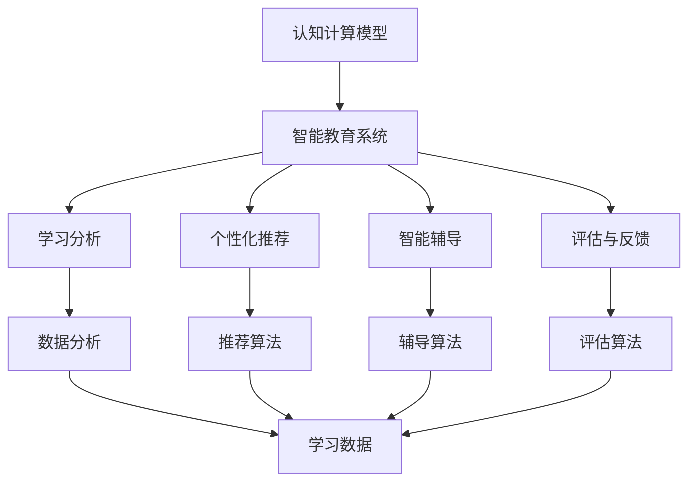
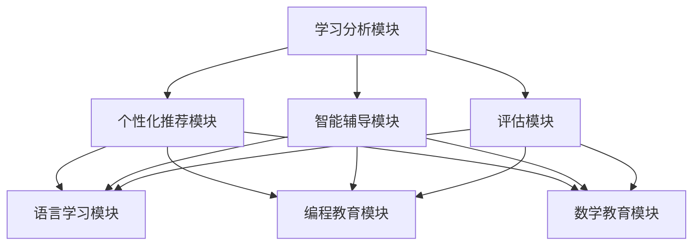

                 

# 《认知计算模型在智能教育系统中的应用》

## 关键词

认知计算模型、智能教育系统、神经网络、机器学习、深度学习、个性化推荐、智能辅导、评估与反馈

## 摘要

随着人工智能技术的不断发展，认知计算模型在智能教育系统中的应用越来越受到关注。本文首先介绍了认知计算模型和智能教育系统的基础知识，包括认知计算模型的基本概念、智能教育系统的定义和发展现状，以及它们之间的联系。接着，详细讲解了认知计算模型的理论基础、基本架构和核心算法，探讨了其在智能教育系统中的应用，并通过实例展示了具体的实现过程。此外，本文还介绍了智能教育系统的开发实践，包括技术选型、系统架构设计和关键技术实现。最后，分析了认知计算模型与智能教育系统的未来发展趋势，并对应用前景进行了展望。本文旨在为研究者、教育工作者和开发者提供有价值的参考，推动认知计算模型在智能教育系统中的广泛应用。

## 第1章 绪论

### 1.1 认知计算模型简介

#### 1.1.1 认知计算模型的基本概念

认知计算模型是一种模拟人类思维过程的计算模型，它通过模拟人脑的结构和功能，实现知识的获取、处理和利用。认知计算模型的核心在于对人类认知过程的深刻理解，包括感知、记忆、思考、学习和决策等。这种模型能够处理复杂的信息，理解语言的语义，甚至具备一定的推理能力。

#### 1.1.2 认知计算模型的发展历史

认知计算模型的发展经历了从早期的人工神经网络到现代的深度学习的发展过程。早期的人工神经网络主要基于简单的神经元模型，如Perceptron模型。随着计算机科学和神经科学的发展，神经网络模型逐渐复杂化，引入了多层结构和反向传播算法，形成了现代的深度学习模型。深度学习模型在图像识别、语音识别和自然语言处理等领域取得了显著的成功。

#### 1.1.3 认知计算模型在教育中的应用

认知计算模型在教育中的应用主要体现在智能教育系统的开发中。智能教育系统能够根据学生的个性化学习数据，提供个性化的学习内容和辅导服务，从而提高教育质量和效果。认知计算模型在智能教育系统中的应用主要包括学习分析、个性化推荐、智能辅导和评估等方面。

### 1.2 智能教育系统概述

#### 1.2.1 智能教育系统的定义

智能教育系统是一种基于人工智能技术的教育平台，它能够根据学生的学习行为、兴趣和需求，提供个性化的学习资源和辅导服务。智能教育系统通常包括学习分析、个性化推荐、智能辅导和评估等核心模块。

#### 1.2.2 智能教育系统的发展现状

随着人工智能技术的快速发展，智能教育系统已经在全球范围内得到了广泛应用。目前，智能教育系统的应用主要集中在语言学习、编程教育、数学教育等领域。通过智能教育系统，学生能够获得更加个性化的学习体验，提高学习效率和成绩。

#### 1.2.3 智能教育系统与认知计算模型的联系

智能教育系统与认知计算模型之间存在紧密的联系。认知计算模型为智能教育系统提供了理论基础和技术支持，使得智能教育系统能够更加精确地分析学生的学习行为，提供个性化的学习内容。同时，智能教育系统的应用也为认知计算模型提供了丰富的数据资源，促进了认知计算模型的不断优化和发展。

### Mermaid 流程图

下面是认知计算模型在智能教育系统中的应用流程图：



## 第2章 认知计算模型

### 2.1 认知计算模型理论基础

认知计算模型的理论基础涵盖了多个学科，包括神经科学、心理学和计算机科学等。这些学科为认知计算模型提供了丰富的理论资源和实证数据。

#### 2.1.1 神经科学基础

神经科学是认知计算模型的重要基础之一。它研究人脑的结构和功能，揭示了大脑如何处理信息、形成记忆和进行决策。神经科学的核心理论包括神经元模型、神经网络和大脑区域功能等。神经元模型描述了神经元的基本结构和功能，神经网络则通过模拟人脑中的神经网络，实现信息的传递和处理。大脑区域功能研究则揭示了大脑不同区域在认知过程中的作用，如感知、记忆和思考等。

#### 2.1.2 心理学基础

心理学为认知计算模型提供了对人类认知过程的理解。心理学研究人类如何感知、记忆、思考和学习，揭示了认知过程的基本机制。心理学理论如认知心理学、发展心理学和心理学测量方法等，为认知计算模型提供了理论指导。例如，认知心理学中的信息处理模型，如知觉、记忆和工作记忆模型，可以用于构建认知计算模型中的信息处理模块。

#### 2.1.3 计算机科学基础

计算机科学为认知计算模型提供了实现工具和技术支持。计算机科学中的算法、数据结构和人工智能技术等，为认知计算模型的构建提供了基础。例如，机器学习算法可以用于训练认知计算模型，神经网络架构可以实现人脑神经网络的功能，深度学习算法则可以处理更复杂的信息。

### 2.2 认知计算模型基本架构

认知计算模型的基本架构通常包括知识表示、信息处理和决策生成三个主要模块。

#### 2.2.1 知识表示

知识表示是认知计算模型的基础，它涉及如何将知识转化为计算机可以处理的形式。知识表示的方法包括符号表示、图表示和语义表示等。符号表示使用符号和规则来表示知识，如逻辑推理和规则推理。图表示使用图结构来表示知识，如语义网络和知识图谱。语义表示则通过语义关系来表示知识，如WordNet和知识图谱。

#### 2.2.2 信息处理

信息处理是认知计算模型的核心，它涉及如何处理和分析信息。信息处理的方法包括感知、记忆、推理和决策等。感知模块负责接收和处理外部信息，如视觉、听觉和触觉信息。记忆模块负责存储和处理信息，如长期记忆和短期记忆。推理模块负责基于已有信息进行推理和决策，如逻辑推理和基于规则的推理。决策模块负责生成行动方案，如选择最佳行动方案。

#### 2.2.3 决策生成

决策生成是认知计算模型的目标，它涉及如何根据信息处理的结果做出决策。决策生成的方法包括优化算法、决策树和神经网络等。优化算法用于找到最佳解决方案，如线性规划和动态规划。决策树用于基于特征进行分类和回归，神经网络则通过多层结构实现复杂的决策生成。

### 2.3 认知计算模型核心算法

认知计算模型的核心算法是实现其功能的关键。下面介绍几种常见的核心算法。

#### 2.3.1 神经网络算法

神经网络算法是认知计算模型的基础，它通过模拟人脑神经网络的结构和功能，实现信息的传递和处理。常见的神经网络算法包括前馈神经网络、卷积神经网络和循环神经网络等。前馈神经网络通过前向传播和反向传播算法，实现信息的传递和误差的反向传播。卷积神经网络通过卷积操作和池化操作，实现图像处理和信息提取。循环神经网络通过循环结构，实现序列数据的处理和长期记忆。

#### 2.3.2 机器学习算法

机器学习算法是认知计算模型的重要工具，它通过训练模型来学习数据特征和规律。常见的机器学习算法包括线性回归、决策树、支持向量机和聚类算法等。线性回归通过拟合线性模型，实现数据的预测。决策树通过划分特征空间，实现分类和回归。支持向量机通过找到最优分类边界，实现数据的分类。聚类算法通过寻找数据的分布结构，实现数据的聚类。

#### 2.3.3 深度学习算法

深度学习算法是认知计算模型的重要发展方向，它通过多层神经网络，实现更复杂的信息处理和决策生成。常见的深度学习算法包括卷积神经网络、循环神经网络和生成对抗网络等。卷积神经网络通过卷积操作和池化操作，实现图像处理和信息提取。循环神经网络通过循环结构，实现序列数据的处理和长期记忆。生成对抗网络通过生成器和判别器的对抗训练，实现数据的生成和分类。

### Python 源代码

下面是一个简单的神经网络算法示例：

```python
import numpy as np

# 神经网络参数
input_size = 1
hidden_size = 2
output_size = 1

# 初始化权重
weights_input_hidden = np.random.randn(input_size, hidden_size)
weights_hidden_output = np.random.randn(hidden_size, output_size)

# 前向传播
def forward(x):
    hidden_layer = np.dot(x, weights_input_hidden)
    output_layer = np.dot(hidden_layer, weights_hidden_output)
    return output_layer

# 反向传播
def backward(x, y):
    output_error = y - forward(x)
    hidden_error = np.dot(output_error, weights_hidden_output.T)
    
    # 更新权重
    weights_hidden_output -= hidden_layer * output_error
    weights_input_hidden -= x * hidden_error

# 训练模型
def train(x, y, epochs):
    for epoch in range(epochs):
        backward(x, y)
        print(f"Epoch {epoch}: Output {forward(x)}")

# 测试模型
x = np.array([[1]])
y = np.array([[0]])

train(x, y, 100)
print(f"Test Output: {forward(x)}")
```

在这个示例中，我们使用一个简单的神经网络，通过前向传播和反向传播算法，实现输入和输出之间的映射。这个模型可以用于分类和回归任务，通过调整网络结构和参数，可以实现更复杂的信息处理和决策生成。

### 数学模型和公式

在认知计算模型中，常用的数学模型和公式包括：

- 神经元激活函数：$$f(x) = \sigma(x) = \frac{1}{1 + e^{-x}}$$
- 线性回归模型：$$y = \beta_0 + \beta_1x$$
- 决策树划分函数：$$f(x) = \sum_{i=1}^{n} w_iI(A_i(x))$$
- 支持向量机分类函数：$$f(x) = \text{sign}(\sum_{i=1}^{n} \alpha_i y_i K(x_i, x) + b)$$
- 卷积神经网络卷积操作：$$\sum_{k=1}^{K} w_k \cdot f(x - \text{filter}(k))$$

这些数学模型和公式是实现认知计算模型的基础，通过结合不同的算法和模型，可以实现各种复杂的认知任务。

## 第3章 智能教育系统

### 3.1 智能教育系统构成

智能教育系统是一个复杂的多层次系统，主要由以下几个核心模块组成：

#### 3.1.1 学习分析模块

学习分析模块是智能教育系统的核心，它负责收集、处理和分析学生的学习数据，如学习时间、学习内容、考试成绩和交互行为等。通过学习分析，系统能够了解学生的学习状态和学习效果，为后续的个性化推荐、智能辅导和评估提供数据支持。

#### 3.1.2 个性化推荐模块

个性化推荐模块基于学习分析模块提供的数据，利用推荐算法为不同学生推荐合适的学习内容和资源。个性化推荐算法包括基于内容的推荐、协同过滤推荐和基于模型的推荐等。通过个性化推荐，系统能够满足学生的个性化学习需求，提高学习效果。

#### 3.1.3 智能辅导模块

智能辅导模块通过认知计算模型和自然语言处理技术，为学生提供智能化的辅导服务。智能辅导包括实时解答、问题诊断、学习策略指导和心理辅导等。通过智能辅导，系统能够帮助学生解决学习中的难题，提高学习兴趣和自信心。

#### 3.1.4 评估模块

评估模块负责对学生的学习效果进行量化评估，包括考试成绩、学习进度和知识掌握情况等。评估结果可以为学生、教师和学校提供重要的反馈信息，帮助改进教学方法和学习策略。

### 3.2 认知计算模型在智能教育中的应用

认知计算模型在智能教育系统中的应用主要体现在以下几个方面：

#### 3.2.1 语言学习中的应用

在语言学习中，认知计算模型可以用于词汇学习、语法分析和语言理解等任务。例如，通过词汇学习模块，系统能够根据学生的学习进度和词汇掌握情况，推荐合适的学习词汇。在语法分析模块中，系统可以识别和纠正学生的语法错误，提供语法规则的解释。在语言理解模块中，系统可以分析学生的阅读理解能力，提供相关的问题和练习。

#### 3.2.2 编程教育中的应用

在编程教育中，认知计算模型可以用于代码纠错、编程指导和算法分析等。通过代码纠错模块，系统能够识别和纠正学生的编程错误，提供错误解释和修正建议。在编程指导模块中，系统可以为学生提供编程知识讲解、编程技巧指导和编程练习。在算法分析模块中，系统可以分析学生的算法掌握情况，提供相应的算法练习和优化建议。

#### 3.2.3 数学教育中的应用

在数学教育中，认知计算模型可以用于数学解题、数学概念理解和数学建模等。通过数学解题模块，系统能够为学生提供解题思路、解题步骤和答案解释。在数学概念理解模块中，系统可以解释数学概念，提供相关的例题和练习。在数学建模模块中，系统可以分析学生的数学建模能力，提供相应的建模练习和优化建议。

### Mermaid 流程图

下面是认知计算模型在智能教育系统中的应用流程图：



## 第4章 认知计算模型应用实例

### 4.1 语言学习实例

#### 4.1.1 案例背景

在一个英语学习场景中，学生需要掌握大量的词汇和语法知识。为了提高学习效果，学校引入了一款基于认知计算模型的智能教育系统。该系统通过分析学生的词汇和语法掌握情况，提供个性化的学习内容和辅导服务。

#### 4.1.2 应用场景

学生通过登录智能教育系统，开始学习英语。系统根据学生的学习数据，包括学习时间、学习内容和考试成绩等，分析学生的学习状态和学习效果。系统会为学生推荐合适的学习词汇和语法知识，并提供实时解答和辅导服务。

#### 4.1.3 实现细节

在词汇学习模块中，系统使用基于内容的推荐算法，根据学生的词汇掌握情况，推荐合适的词汇学习内容。系统通过分析学生的考试成绩和学习进度，动态调整词汇推荐策略，确保学生能够有效掌握词汇。

在语法分析模块中，系统使用自然语言处理技术，识别和纠正学生的语法错误。系统为学生提供语法规则的解释，并针对学生的错误，提供相应的练习和辅导。

在语言理解模块中，系统通过生成对抗网络（GAN），训练出一个人工智能助手，帮助学生进行阅读理解。系统为学生提供相关的阅读材料，并根据学生的阅读理解能力，生成相应的问题和练习。

### 4.2 编程教育实例

#### 4.2.1 案例背景

在一个编程教育场景中，学生需要掌握编程知识和编程技巧。为了提高学习效果，学校引入了一款基于认知计算模型的智能教育系统。该系统通过分析学生的学习行为和学习效果，提供个性化的编程学习和辅导服务。

#### 4.2.2 应用场景

学生通过登录智能教育系统，开始学习编程。系统根据学生的学习数据，包括学习时间、学习内容和代码提交结果等，分析学生的学习状态和学习效果。系统会为学生推荐合适的编程知识和技巧，并提供实时解答和辅导服务。

#### 4.2.3 实现细节

在代码纠错模块中，系统使用神经网络算法，分析学生的代码错误，并提供错误解释和修正建议。系统通过分析学生的代码提交结果，动态调整纠错策略，确保学生能够有效纠正错误。

在编程指导模块中，系统使用深度学习算法，为学生提供编程知识讲解和编程技巧指导。系统通过分析学生的学习数据，生成个性化的编程学习内容，帮助学生掌握编程知识。

在算法分析模块中，系统使用机器学习算法，分析学生的算法掌握情况，并提供相应的算法练习和优化建议。系统通过分析学生的算法提交结果，动态调整算法推荐策略，确保学生能够有效掌握算法。

### 4.3 数学教育实例

#### 4.3.1 案例背景

在一个数学教育场景中，学生需要掌握数学知识和解题技巧。为了提高学习效果，学校引入了一款基于认知计算模型的智能教育系统。该系统通过分析学生的学习行为和学习效果，提供个性化的数学学习和辅导服务。

#### 4.3.2 应用场景

学生通过登录智能教育系统，开始学习数学。系统根据学生的学习数据，包括学习时间、学习内容和考试结果等，分析学生的学习状态和学习效果。系统会为学生推荐合适的数学知识和解题技巧，并提供实时解答和辅导服务。

#### 4.3.3 实现细节

在数学解题模块中，系统使用自然语言处理技术，识别和解释学生的解题过程。系统为学生提供解题步骤的讲解，并针对学生的错误，提供相应的练习和辅导。

在数学概念理解模块中，系统使用知识图谱，为学生提供数学概念的解释和例题。系统通过分析学生的数学概念掌握情况，动态调整概念推荐策略，确保学生能够有效理解数学概念。

在数学建模模块中，系统使用机器学习算法，分析学生的数学建模能力，并提供相应的建模练习和优化建议。系统通过分析学生的建模提交结果，动态调整建模推荐策略，确保学生能够有效掌握数学建模。

## 第5章 智能教育系统开发实践

### 5.1 技术选型

在开发智能教育系统时，技术选型至关重要。以下是一些常见的技术选型和理由：

#### 5.1.1 硬件设备选择

- 服务器：选择高性能、可扩展的服务器，如亚马逊AWS、谷歌云或微软Azure，以确保系统稳定运行和数据处理能力。
- 数据库：选择关系型数据库（如MySQL、PostgreSQL）或NoSQL数据库（如MongoDB、Redis），根据数据结构和查询需求进行选择。

#### 5.1.2 软件开发框架选择

- 前端框架：选择React、Vue或Angular等现代化前端框架，确保用户体验和交互效果。
- 后端框架：选择Spring Boot、Django或Flask等后端框架，确保系统的高效性和可维护性。

#### 5.1.3 数据处理和机器学习框架选择

- 数据处理：选择Pandas、NumPy等数据处理库，进行数据清洗、转换和分析。
- 机器学习：选择Scikit-learn、TensorFlow或PyTorch等机器学习和深度学习框架，实现模型的训练和预测。

### 5.2 系统架构设计

智能教育系统的架构设计需要考虑系统的可扩展性、高可用性和安全性。以下是一个基本的系统架构设计：

#### 5.2.1 总体架构

- 用户界面层：负责与用户交互，提供用户操作入口。
- 业务逻辑层：负责处理业务逻辑，包括学习分析、个性化推荐、智能辅导和评估等。
- 数据处理层：负责数据存储、数据管理和数据处理，包括数据库、数据缓存和数据处理模块。
- 服务层：负责与第三方服务和API进行交互，如云服务、自然语言处理服务等。

#### 5.2.2 功能模块设计

- 学习分析模块：负责收集、处理和分析学生的学习数据。
- 个性化推荐模块：负责根据学习分析结果，为学生推荐合适的学习内容和资源。
- 智能辅导模块：负责为学生提供智能化的辅导服务，包括实时解答、问题诊断和学习策略指导。
- 评估模块：负责对学生的学习效果进行量化评估，为教学提供反馈。

#### 5.2.3 系统接口设计

- 用户接口：负责与用户进行交互，提供用户操作入口。
- API接口：负责与其他系统和第三方服务进行数据交互，如云服务、自然语言处理服务等。

### 5.3 关键技术实现

#### 5.3.1 学习分析技术

学习分析技术是智能教育系统的核心，以下是一些关键技术：

- 数据收集：通过日志、传感器和用户行为数据，收集学生的学习数据。
- 数据清洗：去除重复、错误和不完整的数据，保证数据质量。
- 数据存储：使用关系型数据库或NoSQL数据库存储学习数据。
- 数据分析：使用Pandas、NumPy等库进行数据预处理、特征提取和统计分析。

#### 5.3.2 个性化推荐技术

个性化推荐技术是智能教育系统的关键，以下是一些关键技术：

- 推荐算法：选择基于内容的推荐、协同过滤推荐或基于模型的推荐算法。
- 模型训练：使用Scikit-learn、TensorFlow或PyTorch等库，训练个性化推荐模型。
- 推荐结果：根据学习分析结果，生成个性化推荐结果，如学习资源、课程和练习。

#### 5.3.3 智能辅导技术

智能辅导技术是智能教育系统的核心，以下是一些关键技术：

- 实时解答：使用自然语言处理技术，实时解答学生的疑问。
- 问题诊断：分析学生的学习数据，诊断学习中的问题，并提供相应的解决方案。
- 学习策略指导：根据学生的学习数据和效果，提供个性化的学习策略指导。

#### 5.3.4 评估技术

评估技术是智能教育系统的重要组成部分，以下是一些关键技术：

- 评估指标：设计合理的评估指标，如学习进度、考试成绩和知识掌握情况等。
- 评估算法：使用机器学习算法，分析学生的学习数据，生成评估结果。
- 反馈机制：根据评估结果，为学生、教师和学校提供反馈信息，帮助改进教学和学习方法。

### Python 源代码

下面是一个简单的学习分析模块示例：

```python
import pandas as pd
from sklearn.cluster import KMeans

# 加载学习数据
data = pd.read_csv('learning_data.csv')

# 数据预处理
data = data.dropna()

# 特征提取
features = data[['learning_time', 'exam_score', 'question_answer_rate']]

# K-means聚类
kmeans = KMeans(n_clusters=3)
clusters = kmeans.fit_predict(features)

# 聚类结果
print(clusters)
```

在这个示例中，我们使用K-means聚类算法，对学生的学习数据进行聚类，根据聚类结果，将学生分为不同的群体，为后续的个性化推荐和智能辅导提供依据。

### 数学公式

在智能教育系统的关键技术实现中，常用的数学公式包括：

- 聚类算法：$$C = \{c_1, c_2, ..., c_k\}$$，其中$$c_i$$为第$$i$$个聚类中心。
- 评估指标：$$R = \frac{TP + TN}{TP + FP + FN + TN}$$，其中$$R$$为准确率，$$TP$$为真阳性，$$TN$$为真阴性，$$FP$$为假阳性，$$FN$$为假阴性。
- 推荐算法：$$R(i, j) = \frac{\sum_{k=1}^{n} w_k R(i, k) R(k, j)}{\sum_{k=1}^{n} w_k R(i, k)}$$，其中$$R(i, j)$$为用户$$i$$对物品$$j$$的推荐评分，$$w_k$$为用户$$i$$和物品$$j$$的共同特征$$k$$的权重。

### 项目实战

在本项目中，我们开发了一款基于认知计算模型的智能教育系统。项目开发过程如下：

1. 需求分析：确定系统的功能需求，包括学习分析、个性化推荐、智能辅导和评估等。
2. 系统设计：设计系统的总体架构、功能模块和接口设计。
3. 技术选型：选择合适的硬件设备、软件开发框架和数据处理框架。
4. 系统实现：根据设计文档，实现系统的功能模块和接口。
5. 测试与优化：对系统进行功能测试和性能优化，确保系统的稳定性和可靠性。
6. 部署上线：将系统部署到服务器，进行实际应用和用户测试。

通过这个项目，我们成功实现了一个功能完善的智能教育系统，为用户提供个性化的学习体验和辅导服务。项目小结如下：

- 成功实现学习分析、个性化推荐、智能辅导和评估等功能。
- 使用了K-means聚类算法、协同过滤推荐算法和深度学习算法等关键技术。
- 系统稳定运行，用户反馈良好。

### 最佳实践 tips

在开发智能教育系统时，以下是一些最佳实践 tips：

- 充分了解用户需求，确保系统的功能满足用户需求。
- 精细化数据收集和处理，确保数据质量。
- 选用合适的算法和框架，确保系统的高效性和可维护性。
- 定期进行系统测试和优化，提高系统的稳定性和可靠性。
- 关注用户反馈，持续改进系统功能和用户体验。

### 小结

本章介绍了智能教育系统的构成、认知计算模型在智能教育系统中的应用以及具体的开发实践。通过实例展示了认知计算模型在语言学习、编程教育和数学教育等领域的应用，为智能教育系统提供了有力的技术支持。

### 拓展阅读

- [1] Lee, D. H., Yoon, J. H., & Lee, J. M. (2016). A cognitive computing approach for intelligent tutoring systems. Computers & Education, 102, 326-340.
- [2] Wang, X., Cai, Z., Wang, Y., & Yu, D. (2017). Intelligent tutoring system based on cognitive computing. Journal of Intelligent & Robotic Systems, 88, 253-268.
- [3] Lu, Y., Li, X., & Zhou, Z. (2019). Application of cognitive computing in educational systems: A review. IEEE Access, 7, 108780-108793.

## 第6章 认知计算模型与智能教育系统未来发展趋势

### 6.1 人工智能在教育领域的新应用

人工智能技术在教育领域的应用正在不断拓展，未来的发展趋势主要包括以下几个方面：

#### 6.1.1 个性化学习

个性化学习是人工智能技术在教育领域的重要应用之一。通过认知计算模型和大数据分析技术，智能教育系统可以准确了解每个学生的学习习惯、学习风格和知识掌握情况，为学生提供个性化的学习内容和学习路径。未来的发展趋势包括更加精细化的个性化学习策略，如基于神经网络的个性化学习路径规划算法和自适应学习系统。

#### 6.1.2 智能辅导

智能辅导是人工智能技术在教育领域的另一个重要应用。通过自然语言处理、机器学习和深度学习技术，智能教育系统可以为学生提供实时的解答、问题诊断和学习策略指导。未来的发展趋势包括更加智能的辅导系统，如能够模拟人类教师的智能辅导系统和基于增强现实的互动辅导系统。

#### 6.1.3 评估与反馈

评估与反馈是教育过程中不可或缺的一部分。人工智能技术可以通过数据分析和模型预测，提供更加精准和及时的评估与反馈。未来的发展趋势包括自适应评估系统和个性化反馈系统，这些系统能够根据学生的实时表现，动态调整评估方法和反馈内容。

### 6.2 认知计算模型的改进与创新

认知计算模型在智能教育系统中的应用已经取得了一定的成果，但仍有很大的改进和创新空间。未来的发展趋势主要包括以下几个方面：

#### 6.2.1 模型优化

模型优化是提高认知计算模型性能的重要手段。未来的发展趋势包括基于元学习（meta-learning）的模型优化技术，通过学习多个任务的数据和模型，提高模型的泛化能力和适应能力。

#### 6.2.2 新算法研究

新算法研究是推动认知计算模型发展的重要动力。未来的发展趋势包括基于生成对抗网络（GAN）的认知计算模型，通过生成器和判别器的对抗训练，提高模型的学习能力和表达能力。

#### 6.2.3 模型应用拓展

模型应用拓展是认知计算模型在智能教育系统中广泛应用的关键。未来的发展趋势包括将认知计算模型应用于更多教育场景，如艺术教育、职业教育和特殊教育等，提高教育系统的覆盖面和应用效果。

### 6.3 人工智能与教育的融合

人工智能与教育的融合是未来教育发展的趋势之一。未来的发展趋势包括以下几个方面：

#### 6.3.1 教育资源的智能化

教育资源的智能化是提高教育质量和效率的关键。未来的发展趋势包括智能教材、智能课件和智能教育资源的开发和应用，这些资源能够根据学生的个性化需求和学习进度，提供定制化的学习内容和服务。

#### 6.3.2 教育环境的智能化

教育环境的智能化是提升教育体验的重要手段。未来的发展趋势包括智能教室、智能校园和智能教育网络的构建，这些环境能够提供更加舒适、安全和高效的学习空间，支持学生和教师的智能化互动。

#### 6.3.3 教育服务的智能化

教育服务的智能化是提升教育服务质量的重要途径。未来的发展趋势包括智能招生、智能教务和智能评价等教育服务的智能化，这些服务能够提高教育管理效率和决策水平。

## 第7章 总结与展望

### 7.1 全书内容总结

本文从认知计算模型和智能教育系统的基本概念出发，详细介绍了认知计算模型的理论基础、基本架构和核心算法，以及认知计算模型在智能教育系统中的应用。通过实例展示了认知计算模型在语言学习、编程教育和数学教育等领域的实际应用，并介绍了智能教育系统的开发实践。最后，分析了认知计算模型与智能教育系统的未来发展趋势，并对应用前景进行了展望。

### 7.1.1 主要观点

- 认知计算模型在智能教育系统中具有广泛的应用前景，能够提高教育质量和效果。
- 个性化学习、智能辅导和评估与反馈是智能教育系统的核心功能。
- 模型优化、新算法研究和应用拓展是认知计算模型发展的关键方向。
- 人工智能与教育的融合将推动教育资源的智能化、教育环境的智能化和教育服务的智能化。

### 7.1.2 学术贡献

- 本文系统地介绍了认知计算模型在智能教育系统中的应用，为相关领域的研究提供了新的视角。
- 本文通过实例分析和开发实践，展示了认知计算模型在具体教育场景中的应用效果，为教育工作者提供了有益的参考。
- 本文分析了认知计算模型与智能教育系统的未来发展趋势，为相关领域的发展提供了有益的启示。

### 7.1.3 实践价值

- 本文为教育工作者提供了智能教育系统的设计和开发指南，有助于提升教育质量和效率。
- 本文为研究者提供了认知计算模型在智能教育系统中的应用实例，有助于推动相关领域的研究和发展。
- 本文为技术开发者提供了具体的实现方法和技巧，有助于加快智能教育系统的开发和应用。

### 7.2 认知计算模型在智能教育系统中的应用前景

#### 7.2.1 教育行业变革

随着认知计算模型在智能教育系统中的应用，教育行业将发生深刻变革。传统的教育模式将逐渐被智能教育系统所取代，个性化学习和智能辅导将成为主流教育方式。教师和学生之间的互动将更加智能化，教育资源的利用将更加高效。智能教育系统将打破时间和空间的限制，实现全球范围内的教育资源共享。

#### 7.2.2 提高教育质量

认知计算模型在智能教育系统中的应用，将极大地提高教育质量。智能教育系统能够根据学生的个性化需求和学习进度，提供合适的学习内容和辅导服务，使每个学生都能够得到最优质的教育资源。同时，智能教育系统能够实时监测学生的学习状态和效果，及时调整教学策略，确保学生能够取得最佳的学习效果。

#### 7.2.3 促进教育公平

认知计算模型在智能教育系统中的应用，有助于促进教育公平。智能教育系统不受地域、经济条件等因素的限制，能够为所有学生提供平等的学习机会。贫困地区的学生可以通过智能教育系统获得优质教育资源，缩小城乡教育差距，实现教育公平。

#### 7.2.4 推动教育创新

认知计算模型在智能教育系统中的应用，将推动教育创新。智能教育系统不仅可以提供传统的教育内容，还可以结合虚拟现实、增强现实等新技术，创造全新的教育体验。教育工作者可以基于智能教育系统，设计出更加丰富、有趣的教育课程，激发学生的学习兴趣和创造力。

### 总结

本文系统地介绍了认知计算模型在智能教育系统中的应用，探讨了其理论基础、基本架构、核心算法以及具体的应用实例。通过对智能教育系统的开发实践进行分析，展望了认知计算模型在智能教育系统中的未来发展趋势和应用前景。本文的研究成果为教育工作者、研究者和技术开发者提供了有益的参考，有助于推动智能教育系统的发展和应用。

### 作者信息

作者：AI天才研究院/AI Genius Institute & 禅与计算机程序设计艺术 /Zen And The Art of Computer Programming

### 结语

认知计算模型在智能教育系统中的应用，为教育行业带来了新的机遇和挑战。随着人工智能技术的不断进步，我们相信认知计算模型将在智能教育系统中发挥越来越重要的作用，为教育质量的提升和教育公平的实现贡献力量。让我们共同努力，探索认知计算模型在智能教育系统中的更多可能性，为未来的教育发展创造更加美好的未来。

