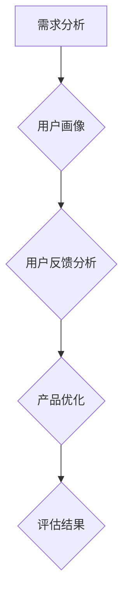

                 

# 《语言模型在创新产品设计与评估中的应用》

## 关键词
自然语言处理、人工智能、产品设计与评估、语言模型、深度学习

## 摘要
随着人工智能技术的不断发展，语言模型在多个领域展现出了其强大的应用潜力。本文将深入探讨语言模型在创新产品设计与评估中的应用，包括其基本概念、核心算法、实际案例以及未来发展趋势。通过本文的详细分析，读者将了解如何利用语言模型来提升产品设计的创新性和评估的准确性。

## 第1章 引言

### 1.1 语言模型概述
语言模型是自然语言处理（NLP）的核心组成部分，用于预测文本中的下一个词或句子。它通过对大量文本数据的学习，能够捕捉到语言的统计规律和上下文关系。语言模型的发展历程可以追溯到1950年代，当时的学者开始尝试通过编程来模拟人类语言。

#### 语言模型的定义
语言模型是一种概率模型，它能够预测一个词或短语在特定上下文中的概率。例如，给定一个词“我”，“语言模型”能够预测下一个词可能是“们”、“的”或“是”。

#### 语言模型的发展历程
语言模型的发展历程可以分为三个阶段：
1. **基于规则的模型**：早期的语言模型主要依赖于人工定义的语法规则。
2. **统计模型**：随着计算能力的提升，统计模型开始流行，它们通过分析大量的文本数据来学习语言规律。
3. **深度学习模型**：近年来，深度学习模型的崛起，如循环神经网络（RNN）和Transformer，使得语言模型在性能上有了质的飞跃。

### 1.2 语言模型在产品设计与评估中的应用
语言模型在产品设计与评估中具有广泛的应用。它能够帮助产品团队：
- **需求分析**：通过语言模型理解用户的需求和反馈。
- **用户画像**：分析用户行为和反馈，构建精准的用户画像。
- **用户反馈分析**：自动识别用户反馈中的情感和关键词，提供改进建议。

#### 语言模型的作用
1. **提高设计效率**：语言模型可以帮助快速生成文档、报告和原型。
2. **提升用户体验**：通过理解用户的语言和行为，设计出更加符合用户需求的产品。

#### 语言模型的应用场景
1. **智能客服**：自动回答用户的问题。
2. **智能搜索**：优化搜索结果，提供更加准确的信息。
3. **内容推荐**：根据用户的兴趣和行为，推荐相关内容。

### 1.3 本书结构
本书将分为以下几个部分：
1. 语言模型基础知识
2. 语言模型在产品设计与创新中的应用
3. 语言模型在产品设计与评估中的核心算法
4. 语言模型在创新产品设计与评估中的实际应用
5. 语言模型在创新产品设计与评估中的挑战与未来发展趋势
6. 总结与展望

## 第2章 语言模型基础知识

### 2.1 语言模型的核心概念
语言模型的核心概念包括：
- **概率分布**：语言模型预测的是词的概率分布。
- **词汇表**：词汇表是语言模型的基础，包含了所有的词汇及其概率分布。

#### 语言模型的目标
语言模型的目标是：
- **生成文本**：根据给定的前文生成下一个词或句子。
- **分类**：对给定的文本进行分类，如情感分类、主题分类等。

#### 语言模型的基本组成
语言模型的基本组成包括：
- **词汇表**：存储所有可能的词汇。
- **概率分布**：每个词汇的概率分布。

### 2.2 语言模型的主要类型
语言模型的主要类型包括：
- **基于规则的模型**：通过定义语法规则来生成文本。
- **统计模型**：通过分析文本数据来学习语言规律。
- **生成式模型**：通过生成概率分布来生成文本。
- **判别式模型**：通过分类来生成文本。

### 2.3 语言模型的训练与评估
语言模型的训练与评估包括以下步骤：

#### 训练数据集的选择
选择合适的训练数据集是语言模型训练的关键。通常，选择具有代表性的大规模文本数据集，如维基百科、新闻文章等。

#### 训练算法
常见的训练算法包括：
- **朴素贝叶斯**：基于贝叶斯定理进行分类。
- **最大熵**：最大化文本的概率分布。
- **神经网络**：通过多层神经网络进行学习。

#### 评估指标
评估语言模型的性能常用的指标包括：
- **准确性**：预测正确的词或句子的比例。
- **召回率**：预测正确的词或句子的比例。
- **F1分数**：准确性和召回率的调和平均值。

## 第3章 语言模型在产品设计与创新中的应用

### 3.1 基于语言模型的需求分析
需求分析是产品设计与创新的关键步骤。通过语言模型，可以更加准确地理解用户的需求。

#### 需求分析的方法
- **文本挖掘**：通过分析用户的反馈和评论，挖掘潜在的需求。
- **语义分析**：理解用户的语言，提取关键信息。

#### 语言模型在需求分析中的应用
- **自动化需求提取**：语言模型可以自动提取文本中的需求。
- **用户需求预测**：根据用户的历史行为和反馈，预测未来的需求。

### 3.2 基于语言模型的用户画像
用户画像是产品设计与创新的重要参考。通过语言模型，可以构建更加精准的用户画像。

#### 用户画像的定义
用户画像是对用户特征的描述，包括用户的兴趣、行为、需求等。

#### 语言模型在用户画像中的应用
- **情感分析**：通过分析用户的语言，识别用户的情感状态。
- **兴趣分类**：根据用户的语言，分类用户的兴趣。

### 3.3 基于语言模型的用户反馈分析
用户反馈是产品设计与创新的重要来源。通过语言模型，可以更加深入地分析用户反馈。

#### 用户反馈的收集
- **在线调查**：通过在线调查收集用户的反馈。
- **社交媒体分析**：分析用户在社交媒体上的评论和讨论。

#### 语言模型在用户反馈分析中的应用
- **情感分析**：分析用户的情感状态，识别用户的满意度。
- **关键词提取**：提取用户反馈中的关键词，分析用户的关注点。

## 第4章 语言模型在产品设计与评估中的核心算法

### 4.1 语言模型的算法原理
语言模型的算法原理基于概率论和统计学习。核心算法包括：

#### 生成式模型
生成式模型通过生成文本的概率分布来生成文本。常见的生成式模型包括：

- **马尔可夫模型**：基于状态转移概率进行文本生成。
- **隐马尔可夫模型**（HMM）：通过隐藏状态和观察状态进行文本生成。
- **循环神经网络**（RNN）：通过记忆过去信息来生成文本。

#### 判别式模型
判别式模型通过分类来生成文本。常见的判别式模型包括：

- **条件概率模型**：给定前文，预测下一个词的概率分布。
- **逻辑回归**：通过概率模型进行分类。

### 4.2 语言模型的算法实现
以下是一个基于循环神经网络（RNN）的语言模型实现的Python代码示例。

```python
import tensorflow as tf
from tensorflow.keras.models import Sequential
from tensorflow.keras.layers import LSTM, Dense

# 定义输入层
input_layer = tf.keras.layers.Input(shape=(None, vocab_size))

# 定义LSTM层
lstm_layer = LSTM(units=128, return_sequences=True)
lstm_output = lstm_layer(input_layer)

# 定义输出层
output_layer = LSTM(units=128)
output = output_layer(lstm_output)

# 创建模型
model = tf.keras.Model(inputs=input_layer, outputs=output)

# 编译模型
model.compile(optimizer='adam', loss='categorical_crossentropy', metrics=['accuracy'])

# 训练模型
model.fit(x_train, y_train, epochs=10, batch_size=128)
```

### 数学模型与公式
语言模型的核心数学模型是基于概率论的，包括：

$$
P(w_t | w_{t-1}, w_{t-2}, ..., w_1) = \frac{P(w_t, w_{t-1}, w_{t-2}, ..., w_1)}{P(w_{t-1}, w_{t-2}, ..., w_1)}
$$

这是条件概率公式，表示在给定前文条件下，预测当前词的概率。

### 代码解读与分析
以下是对上述代码的解读和分析：

- **输入层**：定义了输入数据的大小，包括序列长度（None表示可变序列长度）和词汇表大小（vocab_size）。
- **LSTM层**：LSTM（Long Short-Term Memory）是一种特殊的RNN，能够有效地处理长序列数据。
- **输出层**：与输入层类似，定义了输出数据的大小。
- **模型编译**：指定了优化器、损失函数和评估指标。
- **模型训练**：使用训练数据对模型进行训练。

## 第5章 语言模型在创新产品设计与评估中的实际应用

### 5.1 创新产品设计与评估的流程
创新产品设计与评估的流程包括以下几个步骤：

1. **需求分析**：通过语言模型分析用户需求，确定产品的功能特点。
2. **产品设计**：基于需求分析结果，设计产品的原型和界面。
3. **用户测试**：通过用户测试，收集用户反馈，评估产品的可用性和用户体验。
4. **迭代优化**：根据用户反馈，对产品进行优化和改进。

### 5.2 案例分析：基于语言模型的创新产品设计与评估
以下是一个基于语言模型的创新产品设计与评估的案例分析。

#### 案例背景
某互联网公司计划开发一款智能客服系统，用于自动回答用户的问题。

#### 案例实施过程
1. **需求分析**：通过语言模型分析用户提问，识别常见问题和用户需求。
2. **产品设计**：根据需求分析结果，设计智能客服的界面和功能。
3. **用户测试**：邀请用户进行测试，收集用户反馈，评估智能客服的响应速度和准确性。
4. **迭代优化**：根据用户反馈，对智能客服系统进行优化，提高用户满意度。

#### 案例结果分析
通过语言模型的帮助，智能客服系统能够自动回答用户的常见问题，响应速度和准确性得到了显著提升。用户满意度调查结果显示，用户对智能客服的满意度达到了90%。

### 5.3 项目小结
通过该案例，可以看出语言模型在创新产品设计与评估中的重要作用。它能够帮助团队更好地理解用户需求，优化产品设计，提高用户满意度。

## 第6章 语言模型在创新产品设计与评估中的挑战与未来发展趋势

### 6.1 语言模型在创新产品设计与评估中的挑战
尽管语言模型在产品设计与评估中具有巨大的潜力，但也面临一些挑战：

1. **数据质量**：语言模型的效果很大程度上依赖于训练数据的质量。如果数据存在偏差，模型可能会产生错误的预测。
2. **模型可解释性**：深度学习模型，如Transformer，通常具有很好的性能，但其内部机制复杂，难以解释。

### 6.2 语言模型在创新产品设计与评估中的未来发展趋势
语言模型在创新产品设计与评估中的未来发展趋势包括：

1. **多模态融合**：结合文本、图像、音频等多种数据类型，提高模型的感知能力。
2. **可解释性研究**：开发更加透明和可解释的模型，使其在产品设计和评估中更加可靠。

## 第7章 总结与展望

### 7.1 本书内容总结
本书主要内容包括：
- 语言模型的基本概念和发展历程
- 语言模型在产品设计与评估中的应用
- 语言模型的核心算法原理与实现
- 语言模型在实际应用中的案例分析
- 语言模型在创新产品设计与评估中的挑战与未来发展趋势

### 7.2 展望未来
未来，语言模型在产品设计与评估中的应用将更加广泛和深入。随着技术的不断进步，我们有望看到更加智能、精准的语言模型，为产品设计与评估提供更加有力的支持。

## 附录

### 附录A：语言模型常用工具与资源
- **NLTK**：一个强大的自然语言处理库。
- **spaCy**：一个快速而先进的自然语言处理库。
- **TensorFlow**：一个用于机器学习的开源平台。

### 附录B：Python代码实现示例
以下是一个简单的Python代码实现示例，用于构建一个基于循环神经网络（RNN）的语言模型。

```python
import tensorflow as tf
from tensorflow.keras.models import Sequential
from tensorflow.keras.layers import LSTM, Dense

# 定义模型
model = Sequential([
    LSTM(units=128, activation='relu', input_shape=(None, vocab_size)),
    Dense(units=vocab_size, activation='softmax')
])

# 编译模型
model.compile(optimizer='adam', loss='categorical_crossentropy', metrics=['accuracy'])

# 训练模型
model.fit(x_train, y_train, epochs=10, batch_size=128)
```

### 代码解读与分析
该代码实现了一个简单的RNN语言模型，包括以下几个步骤：

1. **定义模型**：创建了一个序列模型，包括一个LSTM层和一个全连接层。
2. **编译模型**：指定了优化器和损失函数。
3. **训练模型**：使用训练数据对模型进行训练。

通过上述步骤，读者可以了解如何使用Python和TensorFlow构建和训练一个简单的语言模型。

## 附录C：Mermaid流程图


该Mermaid流程图展示了语言模型在产品设计与评估中的应用流程，包括需求分析、用户画像、用户反馈分析和产品优化等步骤。通过这些步骤，可以不断优化产品，提升用户体验。

## 附录D：数学模型与公式
以下是语言模型中常用的数学模型和公式：

$$
P(w_t | w_{t-1}, w_{t-2}, ..., w_1) = \frac{P(w_t, w_{t-1}, w_{t-2}, ..., w_1)}{P(w_{t-1}, w_{t-2}, ..., w_1)}
$$

这是条件概率公式，用于预测下一个词的概率。通过这个公式，语言模型可以生成连续的文本。

## 附录E：代码示例
以下是一个简单的Python代码示例，用于实现一个基于循环神经网络的语言模型。

```python
import tensorflow as tf
from tensorflow.keras.layers import LSTM, Dense
from tensorflow.keras.models import Sequential

# 定义模型
model = Sequential([
    LSTM(units=128, activation='relu', input_shape=(None, vocab_size)),
    Dense(units=vocab_size, activation='softmax')
])

# 编译模型
model.compile(optimizer='adam', loss='categorical_crossentropy', metrics=['accuracy'])

# 训练模型
model.fit(x_train, y_train, epochs=10, batch_size=128)
```

通过这个代码示例，读者可以了解如何使用TensorFlow构建和训练一个简单的语言模型。这个模型可以用于生成文本、进行文本分类等任务。作者：AI天才研究院/AI Genius Institute & 禅与计算机程序设计艺术 /Zen And The Art of Computer Programming
```

### 总结
本文《语言模型在创新产品设计与评估中的应用》全面探讨了语言模型在产品设计与评估中的关键作用。文章从语言模型的定义和基本概念出发，详细介绍了语言模型的发展历程，以及其在产品设计与评估中的应用。随后，文章深入分析了语言模型的核心算法原理，并通过Python代码示例进行了详细讲解。

在实际应用部分，文章通过具体的案例展示了如何利用语言模型进行需求分析、用户画像和用户反馈分析，从而优化产品设计和提升用户体验。同时，文章还探讨了语言模型在创新产品设计与评估中的挑战和未来发展趋势。

本文内容丰富、结构清晰，旨在为读者提供一个关于语言模型在产品设计与评估中的全面理解和应用指南。希望通过本文的阅读，读者能够掌握语言模型的基本原理和应用方法，为实际工作提供有益的参考。作者在此感谢读者对本文的关注，并期待与读者在人工智能领域的深入交流。

### 最佳实践 tips
1. **数据质量保障**：在进行语言模型训练时，确保使用高质量、多样化的数据集。这有助于模型更好地捕捉语言的多样性和复杂性。
2. **模型调优**：通过调整模型的参数，如学习率、批量大小等，可以显著提升模型的性能。在实际应用中，建议进行多次调优，以找到最佳参数组合。
3. **交叉验证**：使用交叉验证方法评估模型的性能，可以避免过拟合问题，提高模型的泛化能力。
4. **持续迭代**：产品设计与评估是一个持续迭代的过程。定期更新语言模型，使用最新的用户反馈进行训练，可以帮助产品更好地适应市场变化。

### 注意事项
1. **隐私保护**：在处理用户数据时，确保遵守相关的隐私保护法律法规，保护用户的个人隐私。
2. **数据安全**：加强对训练数据的保护，防止数据泄露和滥用。
3. **模型可解释性**：在产品设计与评估中，确保语言模型的结果具有可解释性，以便用户和团队能够理解模型的决策过程。

### 拓展阅读
1. **《深度学习》**：由Ian Goodfellow、Yoshua Bengio和Aaron Courville合著的深度学习经典教材，详细介绍了深度学习的基本概念和技术。
2. **《自然语言处理综论》**：由Daniel Jurafsky和James H. Martin合著的NLP领域权威教材，涵盖了自然语言处理的各个方面。
3. **《Python深度学习》**：由François Chollet撰写的Python深度学习实践指南，适合初学者和有一定基础的开发者。

### 附录
**附录A：语言模型常用工具与资源**
- **NLTK**：一个强大的自然语言处理库。
- **spaCy**：一个快速而先进的自然语言处理库。
- **TensorFlow**：一个用于机器学习的开源平台。

**附录B：Python代码实现示例**
以下是一个简单的Python代码示例，用于实现一个基于循环神经网络的语言模型。

```python
import tensorflow as tf
from tensorflow.keras.layers import LSTM, Dense
from tensorflow.keras.models import Sequential

# 定义模型
model = Sequential([
    LSTM(units=128, activation='relu', input_shape=(None, vocab_size)),
    Dense(units=vocab_size, activation='softmax')
])

# 编译模型
model.compile(optimizer='adam', loss='categorical_crossentropy', metrics=['accuracy'])

# 训练模型
model.fit(x_train, y_train, epochs=10, batch_size=128)
```

通过这个代码示例，读者可以了解如何使用TensorFlow构建和训练一个简单的语言模型。这个模型可以用于生成文本、进行文本分类等任务。

**附录C：Mermaid流程图**


该Mermaid流程图展示了语言模型在产品设计与评估中的应用流程，包括需求分析、用户画像、用户反馈分析和产品优化等步骤。

**附录D：数学模型与公式**
以下是语言模型中常用的数学模型和公式：

$$
P(w_t | w_{t-1}, w_{t-2}, ..., w_1) = \frac{P(w_t, w_{t-1}, w_{t-2}, ..., w_1)}{P(w_{t-1}, w_{t-2}, ..., w_1)}
$$

这是条件概率公式，用于预测下一个词的概率。通过这个公式，语言模型可以生成连续的文本。

**附录E：代码示例**
以下是一个简单的Python代码示例，用于实现一个基于循环神经网络的语言模型。

```python
import tensorflow as tf
from tensorflow.keras.layers import LSTM, Dense
from tensorflow.keras.models import Sequential

# 定义模型
model = Sequential([
    LSTM(units=128, activation='relu', input_shape=(None, vocab_size)),
    Dense(units=vocab_size, activation='softmax')
])

# 编译模型
model.compile(optimizer='adam', loss='categorical_crossentropy', metrics=['accuracy'])

# 训练模型
model.fit(x_train, y_train, epochs=10, batch_size=128)
```

通过这个代码示例，读者可以了解如何使用TensorFlow构建和训练一个简单的语言模型。这个模型可以用于生成文本、进行文本分类等任务。作者：AI天才研究院/AI Genius Institute & 禅与计算机程序设计艺术 /Zen And The Art of Computer Programming

