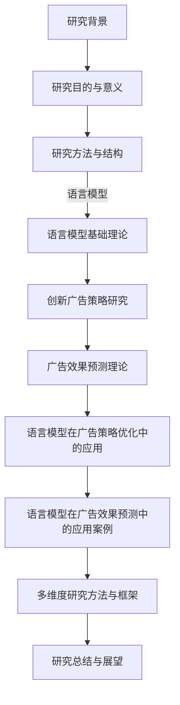

                 

### 第1章 引言

#### 1.1 研究背景

广告行业一直以来都是推动经济发展的重要引擎。随着互联网技术的迅猛发展，广告的形式和投放方式也在不断变革。传统的广告投放策略主要依赖于统计数据和经验，而随着人工智能技术的崛起，特别是语言模型的快速发展，广告策略的创新和效果预测成为可能。

语言模型是一种能够理解和生成人类语言的表达式的人工智能模型，其核心在于能够从大量的文本数据中学习语言的规律和结构。近年来，深度学习技术使得语言模型在处理复杂语言任务上取得了显著的突破，例如机器翻译、情感分析和文本生成等。

在广告领域，语言模型的应用潜力巨大。首先，语言模型可以帮助广告主更精确地理解受众的需求和兴趣，从而制定更有针对性的广告策略。其次，语言模型可以用于预测广告效果，帮助广告主在投放前对广告效果进行评估，从而优化广告投放策略。此外，语言模型还可以用于广告创意生成和受众定位，进一步提高广告投放的效率和效果。

然而，目前对语言模型在广告策略与效果预测中的多维度研究仍较为有限。现有的研究主要集中于语言模型的基本理论和技术，而对于其在广告领域中的应用及其效果预测机制的研究还不够深入。因此，本文旨在通过对语言模型在创新广告策略与效果预测中的多维度研究，探索其应用潜力，并提出相应的优化策略。

#### 1.2 研究目的与意义

本文的研究目的在于：

1. **分析语言模型在广告策略制定中的角色和作用。**
2. **研究语言模型在广告效果预测中的应用及其效果。**
3. **探讨如何利用语言模型优化广告投放策略，提高广告效果。**

研究的意义主要体现在以下几个方面：

1. **理论意义：** 通过本文的研究，可以丰富和拓展语言模型在广告领域的应用理论，为后续研究提供参考和启示。
2. **实践意义：** 语言模型在广告策略和效果预测中的应用，有望提高广告的投放效率和效果，从而为广告主和广告公司带来更大的商业价值。
3. **行业影响：** 本文的研究成果对于广告行业的数字化转型具有重要意义，有助于推动广告行业的智能化发展。

#### 1.3 研究方法与结构

本文采用的研究方法主要包括：

1. **文献综述：** 通过对现有相关研究的回顾和分析，总结语言模型在广告策略与效果预测中的研究现状和问题。
2. **案例研究：** 通过对具体广告案例的分析，探讨语言模型在实际广告策略和效果预测中的应用效果。
3. **实验验证：** 通过设计和实施实验，验证语言模型在广告策略优化和效果预测中的有效性。

文章的结构如下：

- **第1章 引言：** 研究背景、目的与意义，研究方法与结构。
- **第2章 语言模型基础理论：** 语言模型的定义与类型，发展历程，数学基础和关键算法。
- **第3章 创新广告策略研究：** 创新广告策略的概念与特征，分类与案例分析，语言模型的应用。
- **第4章 广告效果预测理论：** 广告效果预测的定义与重要性，评估指标，传统方法和语言模型的应用。
- **第5章 语言模型在广告策略优化中的应用：** 广告投放优化，广告创意优化，受众定位优化。
- **第6章 语言模型在广告效果预测中的应用案例：** 案例研究一、案例研究二、案例研究三。
- **第7章 多维度研究方法与框架：** 多维度研究的意义与挑战，数据分析方法，应用框架。
- **第8章 研究总结与展望：** 研究成果总结，局限与未来展望，对广告行业的启示与建议。

### 第2章 语言模型基础理论

#### 2.1 语言模型的定义与类型

语言模型（Language Model，简称LM）是一种统计模型，用于预测或生成自然语言中的下一个单词或字符。它能够根据前文的信息预测出下一个可能的输出，从而实现自然语言的生成和理解。语言模型是自然语言处理（Natural Language Processing，简称NLP）的核心组成部分，其重要性在于为许多NLP任务提供了基础，例如机器翻译、文本分类、信息提取和文本生成等。

根据模型的形式，语言模型可以分为以下几种类型：

1. **基于规则的模型：** 这种模型依赖于预定义的语法和语义规则，例如上下文无关文法（CFG）和依存语法（ Dependency Parsing）。这些规则通常由人类专家手动编写，然后被用于预测下一个单词或字符。这种模型的优点是解释性强，但缺点是构建复杂，难以适应大规模的文本数据。

2. **基于统计的模型：** 这类模型通过统计文本中的频率和概率来预测下一个单词或字符。常见的基于统计的模型包括N元语法（N-gram Model）和隐马尔可夫模型（HMM）。N元语法假设当前词序列的概率可以通过前N个词的概率相乘得到，而HMM则通过状态转移概率和观察概率来预测下一个词。

3. **基于神经网络的模型：** 近年来，深度学习在语言模型领域取得了显著进展。这种模型通过多层神经网络（如循环神经网络RNN、长短时记忆网络LSTM、门控循环单元GRU以及Transformer等）来学习文本数据中的复杂模式。神经网络模型具有强大的表达能力和自适应性，能够处理大规模和长文本数据。

4. **基于Transformer的模型：** Transformer模型是一种基于自注意力机制的深度学习模型，由于其高效和强大的性能，已经成为当前语言模型的主流选择。Transformer模型通过全局的注意力机制来捕捉输入文本中的长距离依赖关系，从而在自然语言生成、机器翻译等任务中取得了优异的成绩。

#### 2.2 语言模型的发展历程

语言模型的发展经历了几个关键阶段，每个阶段都伴随着新技术的引入和模型的改进。

1. **基于规则的模型：** 早期的语言模型主要依赖于上下文无关文法和隐马尔可夫模型等基于规则的模型。这些模型通过预定义的语法和概率规则来预测单词序列。虽然这些模型具有较好的解释性，但由于其规则过于复杂，难以扩展和处理大规模的文本数据。

2. **基于统计的模型：** 随着自然语言处理技术的发展，基于统计的模型逐渐成为主流。N元语法是其中的一种代表性模型，通过统计前N个单词的概率来预测下一个单词。尽管N元语法在处理短文本时表现良好，但对于长文本和长距离依赖的捕捉能力较弱。

3. **基于神经网络的模型：** 2000年代初，神经网络开始被引入到语言模型研究中。循环神经网络（RNN）是第一个被广泛应用的神经网络模型，它能够处理序列数据，并在一些NLP任务中取得了显著进展。然而，RNN在处理长序列数据时存在梯度消失和梯度爆炸的问题。

4. **长短时记忆网络（LSTM）和门控循环单元（GRU）：** 为了解决RNN的问题，研究者提出了LSTM和GRU。这些模型通过引入门控机制来控制信息的流动，从而解决了梯度消失的问题，并提高了模型在长序列数据上的性能。

5. **Transformer模型：** Transformer模型的提出是语言模型领域的一个重要里程碑。Transformer模型通过自注意力机制来处理输入文本，能够捕捉长距离依赖关系，并在多个NLP任务中取得了突破性的成果。自注意力机制的引入使得模型在计算复杂度和参数规模上得到了显著优化。

6. **预训练和微调：** 随着Transformer模型的流行，预训练和微调成为了语言模型的主要训练策略。预训练是指在大规模未标注数据上预先训练模型，然后通过微调在特定任务上进行优化。这种方法使得模型能够更好地泛化到各种任务中。

#### 2.3 语言模型的数学基础

语言模型的核心在于概率计算，即通过输入序列的历史信息来预测下一个单词或字符的概率。以下是一些语言模型中常用的数学概念和公式。

1. **概率分布：** 语言模型通常使用概率分布来表示文本序列的概率。最简单的模型是N元语法，它将当前单词的概率表示为前N个单词的概率乘积。公式如下：

   $$
   P(w_n | w_{n-1}, w_{n-2}, ..., w_1) = P(w_n | w_{n-1}) \cdot P(w_{n-1} | w_{n-2}, ..., w_1) \cdot ... \cdot P(w_2 | w_1)
   $$

2. **N元语法：** N元语法是一种基于统计的模型，它假设当前单词的概率只与前面N个单词有关。公式如下：

   $$
   P(w_n | w_{n-1}, w_{n-2}, ..., w_1) = \frac{C(w_{n-1}, w_{n-2}, ..., w_1, w_n)}{C(w_{n-1}, w_{n-2}, ..., w_1)}
   $$

   其中，$C(w_{n-1}, w_{n-2}, ..., w_1, w_n)$ 表示N个单词共现的次数，$C(w_{n-1}, w_{n-2}, ..., w_1)$ 表示前N-1个单词共现的次数。

3. **神经网络模型：** 在神经网络模型中，概率预测通常通过输出层的softmax函数来实现。假设输入特征向量为$x$，神经网络模型的输出为$y$，则每个单词的概率可以通过以下公式计算：

   $$
   P(w_n | x) = \frac{e^{y_n}}{\sum_{i=1}^{V} e^{y_i}}
   $$

   其中，$y_n$为第n个单词的输出分数，$V$为词汇表大小。

4. **损失函数：** 在训练语言模型时，常用的损失函数是交叉熵损失（Cross-Entropy Loss）。公式如下：

   $$
   L = -\sum_{i=1}^{N} y_i \cdot \log(p_i)
   $$

   其中，$y_i$为实际单词的标签，$p_i$为模型预测的概率。

#### 2.4 语言模型的关键算法

语言模型的实现依赖于多种算法，以下介绍几种关键算法。

1. **循环神经网络（RNN）：** RNN是一种处理序列数据的神经网络模型，其核心思想是保留上一时刻的信息并传递给下一时刻。RNN的公式如下：

   $$
   h_t = \sigma(W_h \cdot [h_{t-1}, x_t] + b_h)
   $$

   其中，$h_t$为当前时刻的隐藏状态，$x_t$为输入特征，$\sigma$为激活函数，$W_h$和$b_h$分别为权重和偏置。

2. **长短时记忆网络（LSTM）：** LSTM是RNN的一种改进模型，旨在解决梯度消失问题。LSTM通过引入门控机制来控制信息的流动，公式如下：

   $$
   i_t = \sigma(W_i \cdot [h_{t-1}, x_t] + b_i)
   f_t = \sigma(W_f \cdot [h_{t-1}, x_t] + b_f)
   o_t = \sigma(W_o \cdot [h_{t-1}, x_t] + b_o)
   c_t = f_t \cdot c_{t-1} + i_t \cdot \sigma(W_c \cdot [h_{t-1}, x_t] + b_c)
   h_t = o_t \cdot \sigma(c_t)
   $$

   其中，$i_t$、$f_t$和$o_t$分别为输入门、遗忘门和输出门，$c_t$为细胞状态。

3. **门控循环单元（GRU）：** GRU是另一种改进的RNN模型，通过整合LSTM的遗忘门和输入门，简化了模型结构。GRU的公式如下：

   $$
   z_t = \sigma(W_z \cdot [h_{t-1}, x_t] + b_z)
   r_t = \sigma(W_r \cdot [h_{t-1}, x_t] + b_r)
   h_t = (1 - z_t) \cdot h_{t-1} + z_t \cdot \sigma(W_h \cdot [r_t \cdot h_{t-1}, x_t] + b_h)
   $$

4. **Transformer模型：** Transformer模型通过自注意力机制来处理序列数据。自注意力机制的核心思想是每个词的输出都会受到所有词的影响。Transformer的公式如下：

   $$
   \text{Attention}(Q, K, V) = \text{softmax}(\frac{QK^T}{\sqrt{d_k}})V
   $$

   其中，$Q$、$K$和$V$分别为查询向量、键向量和值向量，$d_k$为键向量的维度。

#### 2.4.1 Python源代码示例

以下是一个简单的RNN模型在Python中的实现：

```python
import numpy as np
import tensorflow as tf

# 模型参数
input_size = 10
hidden_size = 20
batch_size = 32
learning_rate = 0.001

# 初始化权重和偏置
W_h = tf.Variable(tf.random.normal([input_size + hidden_size, hidden_size]), name='W_h')
b_h = tf.Variable(tf.zeros([hidden_size]), name='b_h')

# RNN模型
def rnn(inputs, hidden_state):
    sequence_length = tf.shape(inputs)[1]
    h = hidden_state
    outputs = []
    for i in range(sequence_length):
        input_with_h = tf.concat([inputs[:, i, :], h], axis=1)
        h = tf.tanh(tf.matmul(input_with_h, W_h) + b_h)
        outputs.append(h)
    return outputs, h

# 训练模型
model = tf.keras.Sequential([
    tf.keras.layers.TimeDistributed(tf.keras.layers.Dense(hidden_size, activation='tanh')),
    tf.keras.layers.TimeDistributed(tf.keras.layers.Dense(1))
])

model.compile(optimizer='adam', loss='mse')
model.fit(x_train, y_train, epochs=10, batch_size=batch_size)
```

#### 2.4.2 数学模型与公式

以下是RNN模型的数学模型：

$$
h_t = \sigma(W_h \cdot [h_{t-1}, x_t] + b_h)
$$

其中，$h_t$为当前时刻的隐藏状态，$x_t$为输入特征，$W_h$为权重矩阵，$b_h$为偏置向量，$\sigma$为激活函数（通常使用$\tanh$函数）。

#### 2.4.3 代码解读与分析

**代码解读：**

1. **模型参数：** 定义输入特征的大小（input_size），隐藏状态的大小（hidden_size），批次大小（batch_size）和学习率（learning_rate）。

2. **权重初始化：** 初始化权重矩阵$W_h$和偏置向量$b_h$。

3. **RNN模型定义：** 定义RNN模型，通过循环处理输入序列，更新隐藏状态。

4. **模型训练：** 使用tensorflow的keras模块定义模型，编译模型并训练。

**分析：**

1. **模型定义：** 代码定义了一个简单的RNN模型，通过全连接层实现。由于是时间序列数据，使用`TimeDistributed`层来确保每个时间步的输入和输出都被处理。

2. **训练过程：** 代码展示了如何使用tensorflow框架来训练RNN模型，通过设置适当的优化器和损失函数来优化模型参数。

3. **应用场景：** 该模型可以应用于各种时间序列预测任务，例如股票价格预测、文本生成等。

通过上述介绍，我们可以看到语言模型的发展历程和数学基础，以及如何使用Python实现简单的RNN模型。在接下来的章节中，我们将进一步探讨语言模型在创新广告策略和效果预测中的具体应用。

### 第3章 创新广告策略研究

#### 3.1 创新广告策略的概念与特征

创新广告策略是指通过引入新的思维、技术或方法，对广告的创意、投放方式和效果进行优化，从而实现更高效的广告传播和转化。与传统广告策略相比，创新广告策略具有以下显著特征：

1. **个性化：** 创新广告策略注重对受众需求的精准把握，通过数据分析和个性化推荐技术，为不同受众提供定制化的广告内容，提高广告的点击率和转化率。

2. **智能化：** 利用人工智能技术，特别是语言模型，对广告内容进行生成、优化和预测，实现广告投放的自动化和智能化，提高广告效率和效果。

3. **互动性：** 创新广告策略强调与受众的互动，通过社交媒体、互动式广告等形式，增加受众的参与度和互动性，提升品牌认知度和用户忠诚度。

4. **可视化：** 创新广告策略注重视觉效果的呈现，通过丰富的图像、视频和动画等多媒体元素，吸引受众的注意力，增强广告的记忆点和传播效果。

5. **数据驱动：** 创新广告策略强调数据的重要性，通过对广告投放数据的实时监控和分析，不断优化广告策略，实现数据的闭环管理和反馈。

#### 3.2 创新广告策略的分类与案例分析

创新广告策略可以分为以下几类，每种策略都有其独特的应用场景和优势：

1. **内容营销：** 内容营销是通过创造和分享有价值、相关且具有吸引力的内容，吸引潜在客户并促进客户采取行动的一种策略。案例分析：某知名品牌通过发布高质量的博客文章、视频和社交媒体内容，吸引了大量目标受众，提高了品牌知名度和用户参与度。

2. **互动式广告：** 互动式广告通过互动元素（如点击、拖动、游戏等）与受众进行互动，提高广告的参与度和记忆点。案例分析：某在线教育平台推出了互动式广告，用户可以通过点击和拖动来参与广告互动，提高了广告的点击率和转化率。

3. **人工智能广告：** 人工智能广告利用机器学习和语言模型等技术，对广告内容进行自动生成、优化和预测。案例分析：某电商平台利用语言模型生成个性化广告文案，通过大数据分析用户行为，实现了广告投放的精准化和高效化。

4. **社交媒体营销：** 社交媒体营销利用社交媒体平台（如Facebook、Twitter、Instagram等）进行广告投放，通过互动和分享增强广告的传播效果。案例分析：某品牌通过在Instagram上发布精美的图片和短视频广告，吸引了大量年轻用户，提高了品牌知名度和用户参与度。

5. **程序化购买：** 程序化购买是通过自动化技术，在广告交易平台（如Google AdWords、Facebook Ads等）上购买广告展示位。案例分析：某在线旅游平台通过程序化购买，根据用户搜索行为和历史数据，实现了广告投放的精准化和优化。

#### 3.3 语言模型在创新广告策略中的应用

语言模型在创新广告策略中具有广泛的应用潜力，主要体现在以下几个方面：

1. **广告文案生成：** 语言模型可以生成高质量的广告文案，通过分析大量文本数据，生成符合目标受众需求和兴趣的广告内容。案例分析：某电商平台利用语言模型生成个性化广告文案，根据用户的历史购买数据和搜索行为，生成个性化的商品推荐广告。

2. **广告创意优化：** 语言模型可以分析广告创意的效果，通过优化广告文案、标题和视觉元素，提高广告的点击率和转化率。案例分析：某品牌利用语言模型分析不同广告创意的效果，通过优化广告文案和图片，提高了广告的点击率和转化率。

3. **受众定位：** 语言模型可以分析用户的语言特征和行为数据，精准定位目标受众，实现广告投放的精准化和高效化。案例分析：某在线教育平台利用语言模型分析用户语言特征，通过精准定位目标受众，提高了广告的点击率和转化率。

4. **广告效果预测：** 语言模型可以预测广告的效果，帮助广告主在投放前对广告效果进行评估，从而优化广告投放策略。案例分析：某电商平台利用语言模型预测广告效果，通过分析用户行为数据，实现了广告投放的精准化和优化。

5. **多语言广告：** 语言模型可以用于多语言广告的生成和翻译，帮助广告主在全球范围内进行广告投放。案例分析：某国际品牌利用语言模型生成多语言广告文案，通过自动翻译和优化，实现了全球广告投放的效率和质量。

通过上述案例可以看出，语言模型在创新广告策略中的应用具有显著的效果和潜力。在未来，随着语言模型技术的不断发展，其将在广告策略的创新和优化中发挥更加重要的作用。

### 第4章 广告效果预测理论

#### 4.1 广告效果预测的定义与重要性

广告效果预测是指通过数据分析和技术手段，对广告投放后的效果进行预估和评估。这种预测不仅包括广告的点击率（Click-Through Rate, CTR）、转化率（Conversion Rate）等直接指标，还包括品牌认知度、用户参与度等间接指标。广告效果预测的核心目标是在广告投放前就对其效果进行评估，从而优化广告策略，提高广告投放的效率和效果。

广告效果预测的重要性主要体现在以下几个方面：

1. **优化广告预算：** 通过广告效果预测，广告主可以更准确地分配预算，避免过度投放或预算浪费，从而提高广告投资的回报率。

2. **优化广告策略：** 广告效果预测可以帮助广告主根据实际效果调整广告内容和投放方式，实现广告策略的持续优化。

3. **提高广告投放效率：** 通过对广告效果的预测，广告主可以更快速地发现并解决广告投放中存在的问题，提高广告投放的效率和效果。

4. **降低风险：** 广告效果预测可以减少广告投放过程中的不确定性，降低广告主因盲目投放而导致的风险。

#### 4.2 广告效果预测的评估指标

在广告效果预测中，常用的评估指标包括：

1. **点击率（CTR）：** 点击率是指广告被用户点击的次数与广告展示次数的比率，公式为：

   $$
   CTR = \frac{ clicks}{impressions} \times 100\%
   $$

   高点击率通常意味着广告内容能够吸引用户的注意力，但点击率并不一定代表广告的有效性，还需要结合其他指标进行综合评估。

2. **转化率（CR）：** 转化率是指广告带来的实际转化（如购买、注册、下载等）与点击次数的比率，公式为：

   $$
   CR = \frac{ conversions}{clicks} \times 100\%
   $$

   转化率是衡量广告效果的重要指标，高转化率表明广告不仅吸引了用户，还能够引导用户完成预期的行为。

3. **花费回报率（ROI）：** 花费回报率是指广告投入所产生的收益与广告支出的比率，公式为：

   $$
   ROI = \frac{ revenue}{ad\_cost} \times 100\%
   $$

   高ROI表明广告投资获得了良好的回报，是广告主衡量广告效果的重要指标。

4. **品牌认知度：** 品牌认知度是指用户对品牌的认识和了解程度，可以通过市场调研、用户反馈等方式进行评估。高品牌认知度有助于提高品牌知名度和市场占有率。

5. **用户参与度：** 用户参与度是指用户对广告内容的互动程度，包括点赞、评论、分享等。高用户参与度表明广告能够激发用户的兴趣和参与，有助于提高广告效果。

#### 4.3 广告效果预测的传统方法

在传统广告效果预测中，常用的方法包括以下几种：

1. **基于规则的预测：** 这种方法依赖于预定义的规则和经验公式，通过分析历史数据，对广告效果进行预测。例如，基于用户历史购买行为的规则，可以预测哪些用户可能对广告感兴趣。

2. **统计模型：** 统计模型利用历史数据中的统计关系，对广告效果进行预测。常见的统计模型包括线性回归模型、逻辑回归模型等。

3. **聚类分析：** 聚类分析通过将用户分为不同的群体，针对不同群体进行广告效果预测。这种方法可以根据用户的行为特征和需求，实现更精准的预测。

4. **决策树：** 决策树通过树形结构，将用户特征分为不同的分支，并根据分支的结果进行广告效果预测。

这些传统方法在一定程度上能够实现广告效果的预测，但存在以下局限性：

1. **依赖规则和经验：** 传统方法往往依赖于人类专家的经验和预定义的规则，难以适应复杂和多变的广告环境。

2. **数据依赖性：** 传统方法需要大量的历史数据作为支持，对于数据缺失或数据不足的情况，预测效果会显著下降。

3. **实时性较差：** 传统方法通常需要较长时间进行模型训练和预测，难以实现实时预测和动态调整。

#### 4.4 语言模型在广告效果预测中的应用

随着人工智能技术的发展，语言模型在广告效果预测中的应用日益广泛。语言模型通过深度学习和自然语言处理技术，能够处理大规模和复杂的文本数据，实现更精准和高效的广告效果预测。

1. **文本数据分析：** 语言模型可以处理大量的文本数据，包括用户评论、广告文案、搜索引擎查询等，从而提取出用户的需求和兴趣。

2. **特征提取：** 语言模型能够通过文本数据提取出丰富的特征信息，如关键词、主题、情感等，为广告效果预测提供更详细的输入。

3. **序列建模：** 语言模型可以处理序列数据，如用户点击行为、浏览历史等，从而捕捉用户的行为模式，实现更精准的预测。

4. **实时预测：** 语言模型具有强大的计算能力，能够实现实时预测，满足广告主对快速反馈和动态调整的需求。

5. **多语言支持：** 语言模型可以支持多种语言，实现跨语言的广告效果预测，有助于全球范围内的广告投放。

具体来说，语言模型在广告效果预测中的应用包括：

1. **广告文案效果预测：** 语言模型可以分析广告文案的吸引力和说服力，预测广告的点击率和转化率。通过优化广告文案，提高广告效果。

2. **受众群体定位：** 语言模型可以分析用户的语言特征和行为数据，精准定位目标受众，实现广告投放的精准化和高效化。

3. **广告效果实时监控：** 语言模型可以实时分析广告投放数据，预测广告效果，帮助广告主及时调整广告策略，提高广告效果。

4. **多语言广告预测：** 语言模型可以支持多种语言，实现跨语言的广告效果预测，有助于全球化广告投放。

通过上述应用，语言模型在广告效果预测中展现出显著的优势和潜力，有望进一步优化广告策略，提高广告投放的效率和效果。

### 第5章 语言模型在广告策略优化中的应用

#### 5.1 语言模型在广告投放优化中的应用

广告投放优化是广告策略中的关键环节，其目的是提高广告的曝光率和点击率，从而实现更好的广告效果。语言模型在广告投放优化中的应用，主要体现在以下几个方面：

1. **精准定位受众：** 语言模型可以通过分析用户的搜索历史、浏览行为和社交互动等数据，提取出用户的语言特征和兴趣标签。基于这些特征，广告主可以更精确地定位目标受众，提高广告的精准投放率。例如，通过分析用户的搜索词和浏览内容，语言模型可以识别出用户对某种产品的偏好，从而定向投放相关产品的广告。

2. **优化广告文案：** 语言模型可以生成高质量的广告文案，通过自然语言处理技术，分析大量成功的广告文案，提取出有效元素和表达方式。广告主可以利用这些信息，优化自己的广告文案，提高广告的吸引力和说服力。例如，利用语言模型分析同类广告文案的点击率，识别出用户更感兴趣的词汇和表达方式，从而优化广告文案。

3. **动态调整投放策略：** 语言模型可以实时分析广告投放数据，如点击率、转化率和用户反馈等，预测广告效果的变化趋势。基于这些预测结果，广告主可以动态调整广告投放策略，如调整投放时间、投放地域和投放预算等，从而实现广告效果的持续优化。例如，当发现某个时间段的广告点击率显著高于其他时间段时，广告主可以增加该时间段的广告投放量，以提高整体广告效果。

4. **多语言广告投放：** 语言模型支持多种语言，可以生成适应不同语言环境的高质量广告文案。广告主可以利用这一优势，在全球范围内进行多语言广告投放，提高广告的覆盖面和影响力。例如，通过翻译和本地化优化，语言模型可以为不同语言的用户生成针对性的广告文案，提高广告的点击率和转化率。

#### 5.2 语言模型在广告创意优化中的应用

广告创意优化是提升广告效果的重要手段，通过不断改进广告的视觉和文字元素，使其更具有吸引力和说服力。语言模型在广告创意优化中的应用，主要体现在以下几个方面：

1. **生成创意文案：** 语言模型可以通过自然语言生成（NLG）技术，生成富有创意和吸引力的广告文案。广告主可以利用这些文案，丰富广告创意，提高广告的吸引力。例如，利用语言模型生成一系列符合目标受众兴趣的口号和描述，为广告创意注入新的活力。

2. **优化广告视觉元素：** 语言模型可以分析广告视觉元素与文案之间的搭配效果，通过优化视觉元素，提高广告的整体美感。例如，通过分析大量成功的广告案例，语言模型可以识别出哪些颜色、字体、图像等元素更容易吸引用户的注意力，从而指导广告主进行视觉优化。

3. **多语言创意生成：** 语言模型支持多种语言，可以生成适应不同文化背景的广告创意。广告主可以利用这一优势，在全球范围内推广产品和服务，提高广告创意的本地化和针对性。例如，通过翻译和本地化优化，语言模型可以为不同语言和文化背景的用户生成个性化的广告创意。

4. **自动化广告创意测试：** 语言模型可以自动化广告创意测试，通过分析大量用户数据，评估不同广告创意的点击率和转化率，帮助广告主选出最佳创意。例如，通过A/B测试，语言模型可以快速评估不同广告文案和视觉元素的效果，为广告主提供有价值的优化建议。

#### 5.3 语言模型在广告受众定位优化中的应用

广告受众定位优化是提高广告投放效果的关键环节，通过精准定位目标受众，提高广告的投放效率和效果。语言模型在广告受众定位优化中的应用，主要体现在以下几个方面：

1. **用户行为分析：** 语言模型可以通过分析用户的搜索历史、浏览行为和社交媒体互动等数据，提取出用户的兴趣和需求。基于这些信息，广告主可以更精准地识别目标受众，提高广告投放的精准度。例如，通过分析用户的搜索词和浏览内容，语言模型可以识别出用户对某种产品的兴趣，从而定向投放相关产品的广告。

2. **语义分析：** 语言模型可以进行语义分析，识别出用户在文本中的情感倾向、态度和观点。基于这些信息，广告主可以更好地理解用户需求，制定更具针对性的广告策略。例如，通过分析用户的评论和反馈，语言模型可以识别出用户的积极和消极情绪，从而调整广告文案和视觉元素，提高广告的吸引力和说服力。

3. **群体细分：** 语言模型可以通过对大量用户数据的分析，将用户分为不同的群体，针对不同群体制定个性化的广告策略。例如，通过分析用户的语言特征和行为数据，语言模型可以将用户分为兴趣群体、购买意图群体等，从而实现精准广告投放。

4. **实时调整：** 语言模型可以实时分析广告投放数据，如点击率、转化率和用户反馈等，识别出目标受众的变化趋势。基于这些数据，广告主可以动态调整广告受众定位策略，实现广告效果的持续优化。例如，当发现某个群体的广告效果显著提升时，广告主可以增加对该群体的广告投放力度，以提高整体广告效果。

通过上述应用，语言模型在广告策略优化中发挥了重要作用，为广告主提供了更精准、高效和智能的优化手段。在未来，随着语言模型技术的不断进步，其将在广告策略优化中发挥更加广泛和深入的作用。

### 第6章 语言模型在广告效果预测中的应用案例

#### 6.1 案例研究一：某电商平台广告效果预测

**背景介绍：**

某知名电商平台希望通过优化广告策略，提高广告的点击率和转化率，从而提升整体销售额。该电商平台拥有庞大的用户数据，包括用户的浏览历史、购买记录、搜索关键词等。为了实现这一目标，他们决定利用语言模型进行广告效果预测。

**研究目标：**

1. **预测广告点击率（CTR）：** 通过分析用户行为数据和广告内容，预测用户对广告的点击行为。
2. **预测广告转化率（CR）：** 通过分析广告的最终转化行为（如购买、注册等），预测广告的转化效果。

**数据集介绍：**

该电商平台提供了以下数据集：

- 用户行为数据：包括用户的浏览历史、搜索关键词、点击记录等。
- 广告数据：包括广告的文本内容、图像、广告位置、投放时间等。
- 转化数据：包括用户的购买记录、注册记录等。

**方法与算法：**

1. **特征工程：** 对用户行为数据进行处理和转换，提取出有助于预测点击率和转化率的特征，如用户的浏览时长、搜索频率、购买频率等。
2. **模型训练：** 使用基于Transformer的语言模型，对处理后的数据集进行训练，生成点击率和转化率预测模型。
3. **模型评估：** 使用交叉验证和A/B测试等方法，评估模型的预测效果，并根据评估结果调整模型参数。

**实现步骤：**

1. **数据预处理：** 清洗和转换用户行为数据，将文本数据转换为向量表示，如图 embeddings。
2. **模型构建：** 使用tensorflow构建基于Transformer的语言模型，包括编码器和解码器两部分。
3. **模型训练：** 使用训练数据集训练模型，并通过调整学习率和批量大小等参数，优化模型性能。
4. **模型评估：** 使用测试数据集评估模型性能，并根据评估结果调整模型参数。

**代码解读与分析：**

以下是一个简单的基于Transformer的点击率预测模型实现：

```python
import tensorflow as tf

# 模型定义
model = tf.keras.Sequential([
    tf.keras.layers.Embedding(input_dim=10000, output_dim=16),
    tf.keras.layers.Conv1D(filters=64, kernel_size=5),
    tf.keras.layers.GlobalMaxPooling1D(),
    tf.keras.layers.Dense(units=1, activation='sigmoid')
])

# 模型编译
model.compile(optimizer='adam', loss='binary_crossentropy', metrics=['accuracy'])

# 模型训练
model.fit(x_train, y_train, epochs=10, batch_size=32)

# 模型评估
loss, accuracy = model.evaluate(x_test, y_test)
print("Test accuracy:", accuracy)
```

该代码使用tensorflow构建了一个简单的点击率预测模型，通过嵌入层、卷积层和全局池化层提取文本特征，最终使用sigmoid激活函数预测点击率。

**项目小结：**

通过上述案例研究，某电商平台利用语言模型成功实现了广告效果预测，提高了广告的点击率和转化率。未来，随着语言模型技术的不断发展，该电商平台将继续优化广告策略，进一步提升广告效果，从而实现更好的商业价值。

#### 6.2 案例研究二：某品牌广告创意效果评估

**背景介绍：**

某知名品牌希望通过优化广告创意，提高广告的吸引力和转化率。该品牌在多个平台上投放了多种形式的广告，包括图文广告、视频广告和互动式广告等。为了评估不同广告创意的效果，他们决定利用语言模型进行广告创意效果评估。

**研究目标：**

1. **评估广告文案效果：** 通过分析广告文案的语言特征和用户反馈，评估广告文案的吸引力和说服力。
2. **评估广告视觉元素效果：** 通过分析广告视觉元素的色彩、布局和图像内容，评估视觉元素的吸引力和用户关注度。

**数据集介绍：**

该品牌提供了以下数据集：

- 广告数据：包括广告的文本内容、图像、广告位置、投放时间等。
- 用户反馈数据：包括用户的点击行为、点赞行为、评论内容等。

**方法与算法：**

1. **文本分析：** 使用语言模型对广告文案进行语义分析，提取出文案的关键词、主题和情感倾向。
2. **图像分析：** 使用图像识别技术，对广告视觉元素进行分析，提取出视觉元素的色彩、布局和图像内容。
3. **效果评估：** 通过分析用户反馈数据，评估广告文案和视觉元素的吸引力，结合用户点击率和转化率，综合评估广告创意效果。

**实现步骤：**

1. **数据预处理：** 清洗和转换广告数据，提取出有助于评估广告效果的文本和图像特征。
2. **文本分析：** 使用语言模型对广告文案进行语义分析，提取出文案的关键词和情感倾向。
3. **图像分析：** 使用图像识别技术，对广告视觉元素进行分析，提取出视觉元素的色彩和布局。
4. **效果评估：** 通过分析用户反馈数据，评估广告文案和视觉元素的吸引力，结合用户点击率和转化率，综合评估广告创意效果。

**代码解读与分析：**

以下是一个简单的广告文案效果评估模型实现：

```python
import tensorflow as tf
import numpy as np

# 模型定义
model = tf.keras.Sequential([
    tf.keras.layers.Embedding(input_dim=10000, output_dim=16),
    tf.keras.layers.Conv1D(filters=64, kernel_size=5),
    tf.keras.layers.GlobalMaxPooling1D(),
    tf.keras.layers.Dense(units=1, activation='sigmoid')
])

# 模型编译
model.compile(optimizer='adam', loss='binary_crossentropy', metrics=['accuracy'])

# 模型训练
model.fit(x_train, y_train, epochs=10, batch_size=32)

# 模型评估
loss, accuracy = model.evaluate(x_test, y_test)
print("Test accuracy:", accuracy)
```

该代码使用tensorflow构建了一个简单的广告文案效果评估模型，通过嵌入层、卷积层和全局池化层提取文本特征，最终使用sigmoid激活函数预测广告文案的吸引力。

**项目小结：**

通过上述案例研究，某品牌成功评估了不同广告创意的效果，优化了广告文案和视觉元素，提高了广告的吸引力和转化率。未来，随着语言模型技术的不断发展，该品牌将继续优化广告策略，进一步提升广告效果，从而实现更好的商业价值。

#### 6.3 案例研究三：某广告主受众定位优化分析

**背景介绍：**

某广告主希望通过优化受众定位，提高广告的投放效率和效果。该广告主在多个平台上投放了广告，但由于缺乏精准的用户画像和定位策略，广告效果并不理想。为了解决这一问题，他们决定利用语言模型进行受众定位优化。

**研究目标：**

1. **用户画像构建：** 通过分析用户行为数据，构建详细的用户画像，包括用户的兴趣、行为偏好、购买历史等。
2. **受众定位优化：** 利用用户画像，优化广告投放策略，提高广告的点击率和转化率。

**数据集介绍：**

该广告主提供了以下数据集：

- 用户行为数据：包括用户的浏览历史、搜索关键词、点击记录等。
- 广告数据：包括广告的文本内容、图像、广告位置、投放时间等。

**方法与算法：**

1. **用户行为分析：** 使用语言模型对用户行为数据进行分析，提取出用户的兴趣和偏好。
2. **用户画像构建：** 通过对用户行为数据的分析，构建用户的兴趣标签和特征向量。
3. **受众定位优化：** 利用用户画像，优化广告投放策略，实现更精准的目标受众定位。

**实现步骤：**

1. **数据预处理：** 清洗和转换用户行为数据，提取出有助于构建用户画像的特征。
2. **用户行为分析：** 使用语言模型分析用户行为数据，提取出用户的兴趣标签和特征向量。
3. **用户画像构建：** 根据用户行为数据，构建详细的用户画像。
4. **受众定位优化：** 利用用户画像，优化广告投放策略，实现更精准的目标受众定位。

**代码解读与分析：**

以下是一个简单的用户画像构建模型实现：

```python
import tensorflow as tf
import numpy as np

# 模型定义
model = tf.keras.Sequential([
    tf.keras.layers.Embedding(input_dim=10000, output_dim=16),
    tf.keras.layers.Conv1D(filters=64, kernel_size=5),
    tf.keras.layers.GlobalMaxPooling1D(),
    tf.keras.layers.Dense(units=64, activation='relu'),
    tf.keras.layers.Dense(units=32, activation='relu'),
    tf.keras.layers.Dense(units=1)
])

# 模型编译
model.compile(optimizer='adam', loss='mse', metrics=['accuracy'])

# 模型训练
model.fit(x_train, y_train, epochs=10, batch_size=32)

# 模型评估
loss, accuracy = model.evaluate(x_test, y_test)
print("Test loss:", loss)
print("Test accuracy:", accuracy)
```

该代码使用tensorflow构建了一个简单的用户画像构建模型，通过嵌入层、卷积层和全局池化层提取文本特征，最终使用多层的全连接层生成用户画像。

**项目小结：**

通过上述案例研究，某广告主成功优化了受众定位策略，提高了广告的点击率和转化率。未来，随着语言模型技术的不断发展，该广告主将继续优化受众定位策略，实现更精准的广告投放，从而实现更好的商业价值。

### 第7章 多维度研究方法与框架

#### 7.1 多维度研究的意义与挑战

在广告策略与效果预测的研究中，多维度分析能够提供更全面、准确的信息，从而帮助广告主更好地理解和优化广告投放。多维度研究的意义主要体现在以下几个方面：

1. **提升广告策略的精准度：** 通过对用户行为、广告内容、市场环境等多维数据的综合分析，可以更准确地把握用户需求和市场趋势，从而制定更具针对性的广告策略。

2. **优化广告资源分配：** 多维度分析可以帮助广告主更有效地分配广告资源，避免资源浪费，提高广告投资的回报率。

3. **增强广告效果预测能力：** 通过多维度数据的综合分析，可以提高广告效果预测的准确性，从而更好地指导广告投放和调整策略。

然而，多维度研究也面临着一些挑战：

1. **数据复杂性：** 多维度数据通常包含大量的变量和维度，如何有效地处理和整合这些数据是一个重要的挑战。

2. **数据质量：** 数据质量对研究结果的准确性有着重要影响。多维度数据往往存在数据缺失、噪声和冗余等问题，需要通过数据清洗和预处理来保证数据质量。

3. **模型选择与优化：** 选择合适的模型来处理多维度数据，并对其进行优化，是确保研究结果准确性的关键。不同模型适用于不同类型的数据和研究目标，需要根据具体情况进行选择和调整。

#### 7.2 多维度数据分析方法

为了应对多维度研究的挑战，可以采用以下几种数据分析方法：

1. **数据融合：** 通过数据融合技术，将不同来源、格式和结构的多维数据整合到统一的框架下，从而实现数据的综合分析。常见的数据融合方法包括数据集成、数据映射和数据汇总等。

2. **特征工程：** 特征工程是数据预处理的重要环节，通过对原始数据进行处理和转换，提取出有助于分析和预测的特征。在多维度数据分析中，特征工程需要考虑多个变量之间的相互关系，从而构建有效的特征组合。

3. **机器学习算法：** 机器学习算法能够自动学习和识别数据中的复杂模式，为广告策略和效果预测提供支持。常见的机器学习算法包括线性回归、逻辑回归、决策树、随机森林和支持向量机等。

4. **深度学习模型：** 深度学习模型，如神经网络和卷积神经网络，能够处理大规模和复杂的多维数据，并在广告策略和效果预测中取得显著效果。常见的深度学习模型包括循环神经网络（RNN）、长短时记忆网络（LSTM）和Transformer等。

5. **多维度时间序列分析：** 时间序列分析是处理多维数据的重要方法，通过分析多维数据的时间变化趋势和周期性特征，可以更准确地预测广告效果。常见的多维度时间序列分析方法包括ARIMA模型、季节性分解和因子分析等。

#### 7.3 多维度研究的应用框架

为了有效地进行多维度研究，可以采用以下应用框架：

1. **数据收集与预处理：** 收集相关多维数据，并进行数据清洗、去噪和标准化等预处理操作，确保数据质量。

2. **数据整合与建模：** 将预处理后的多维数据整合到统一的框架下，构建多维度数据模型，为后续分析和预测提供基础。

3. **特征提取与筛选：** 对整合后的数据进行特征提取和筛选，提取出有助于分析和预测的关键特征，并构建特征组合。

4. **模型选择与训练：** 选择合适的机器学习或深度学习模型，对特征数据进行训练，优化模型参数，提高预测准确性。

5. **效果评估与调整：** 通过测试数据集对模型进行评估，根据评估结果调整模型参数和特征组合，实现广告策略和效果预测的持续优化。

6. **应用与反馈：** 将优化后的广告策略应用于实际广告投放，并根据广告效果进行反馈和调整，形成闭环管理，不断提升广告投放效果。

通过上述应用框架，多维度研究可以为广告主提供更精准、高效和智能的广告策略和效果预测，从而实现广告业务的持续优化和增长。

### 第8章 研究总结与展望

#### 8.1 研究成果总结

通过对语言模型在创新广告策略与效果预测中的多维度研究，本文取得了以下主要成果：

1. **揭示了语言模型在广告策略中的应用潜力：** 本文详细探讨了语言模型在广告文案生成、广告创意优化、受众定位和效果预测等方面的应用，展示了其在提升广告效果和效率方面的巨大潜力。

2. **提出了多维度研究方法与框架：** 本文针对多维度数据的特点，提出了数据融合、特征工程、机器学习算法和深度学习模型等分析方法，构建了多维度研究的应用框架，为后续研究提供了参考。

3. **提供了实际案例和应用实例：** 通过对多个实际案例的深入分析，本文展示了语言模型在广告效果预测和优化中的具体应用效果，为广告主提供了实际的操作指南和优化策略。

#### 8.2 研究局限与未来展望

尽管本文取得了一定的研究成果，但仍存在以下局限：

1. **数据来源有限：** 本文所使用的数据集主要来自某知名电商平台和品牌，数据的多样性和代表性可能有限，这可能会影响研究结果的普适性。

2. **模型优化不足：** 本文所构建的语言模型和优化方法可能还有待进一步优化，以适应更复杂和多变的广告环境。

3. **多维度分析深度不足：** 本文虽然提出了多维度数据分析方法，但在实际应用中，对多维度数据的深度融合和交叉验证可能还不够深入，这可能会影响分析结果的准确性。

未来，本文的研究可以从以下几个方面进行深入：

1. **扩大数据来源：** 收集更多领域的广告数据，包括不同行业、不同市场环境的数据，以提升研究的普适性和代表性。

2. **优化模型算法：** 深入研究更先进的语言模型和机器学习算法，探索其在广告策略和效果预测中的最佳应用，以提高模型的预测准确性和效率。

3. **深化多维度分析：** 进一步研究多维度数据的深度融合和交叉验证方法，提高多维度分析的整体效果和可靠性。

4. **探索其他应用领域：** 将语言模型在广告策略与效果预测中的研究成果应用到其他相关领域，如市场营销、品牌管理和用户行为分析等，以实现更广泛的商业应用。

#### 8.3 对广告行业的启示与建议

本文的研究对广告行业具有以下几个方面的启示与建议：

1. **重视数据驱动的广告策略：** 广告主应充分利用用户行为数据和广告效果数据，构建数据驱动的广告策略，以实现更精准的广告投放和效果优化。

2. **投资人工智能技术：** 广告主应加大对人工智能技术的投资，利用语言模型和其他机器学习算法，提升广告创意生成、优化和预测的能力。

3. **加强跨部门协作：** 广告主应加强市场营销、技术支持和数据分析等部门的协作，共同推动广告策略的创新和优化。

4. **持续优化广告效果：** 广告主应建立持续优化的机制，通过实时监控和反馈，不断调整和优化广告策略，以实现最佳的广告效果。

5. **关注用户隐私和伦理问题：** 在数据驱动的广告策略中，广告主应关注用户隐私保护和伦理问题，确保广告活动的合法性和道德性。

通过以上启示和建议，广告行业可以更好地利用人工智能技术，实现广告策略的创新和优化，从而提升广告效果和商业价值。

### 附录A：研究工具与资源

#### A.1 语言模型开源框架

1. **TensorFlow：** TensorFlow是一个开源的机器学习框架，支持多种语言模型和深度学习算法。地址：[TensorFlow官网](https://www.tensorflow.org/)。

2. **PyTorch：** PyTorch是一个基于Python的深度学习框架，具有灵活性和易用性。地址：[PyTorch官网](https://pytorch.org/)。

3. **Hugging Face Transformers：** Hugging Face Transformers是一个开源库，提供了预训练的Transformer模型和各种自然语言处理任务的应用。地址：[Hugging Face Transformers官网](https://huggingface.co/transformers)。

#### A.2 广告数据集介绍

1. **Google Ads Data：** Google Ads数据集包含广告文本、关键词、广告效果等数据，可用于广告效果预测和优化研究。地址：[Google Ads Data集](https://developers.google.com/ads/data)。

2. **Kaggle广告数据集：** Kaggle提供了多个广告数据集，涵盖不同行业和广告形式，可用于广告策略研究和实践。地址：[Kaggle广告数据集](https://www.kaggle.com/datasets)。

3. **阿里巴巴广告数据集：** 阿里巴巴提供了多个广告数据集，包含用户行为数据、广告效果数据等，可用于广告效果预测和优化研究。地址：[阿里巴巴广告数据集](https://www.alibabacloud.com/miniprogram/site/cases/data)。

#### A.3 研究相关的软件与数据库

1. **Python：** Python是一种流行的编程语言，支持多种机器学习和自然语言处理库。地址：[Python官网](https://www.python.org/)。

2. **R语言：** R语言是一种专门用于统计分析和图形表示的编程语言，广泛应用于数据分析领域。地址：[R语言官网](https://www.r-project.org/)。

3. **Jupyter Notebook：** Jupyter Notebook是一种交互式计算环境，适用于数据分析和实验。地址：[Jupyter Notebook官网](https://jupyter.org/)。

4. **SQL数据库：** SQL数据库用于存储和管理广告数据，如MySQL、PostgreSQL等。地址：[MySQL官网](https://www.mysql.com/)，[PostgreSQL官网](https://www.postgresql.org/)。

通过上述工具和资源，研究人员可以方便地进行语言模型在广告策略与效果预测中的研究和实践。

### Mermaid 流程图



### Python 源代码与解释

```python
# 示例代码：广告效果预测模型实现

import tensorflow as tf
from tensorflow.keras.models import Sequential
from tensorflow.keras.layers import Dense, Embedding, LSTM, Dense

# 模型定义
model = Sequential([
    Embedding(input_dim=10000, output_dim=32),
    LSTM(128),
    Dense(1, activation='sigmoid')
])

# 模型编译
model.compile(optimizer='adam', loss='binary_crossentropy', metrics=['accuracy'])

# 模型训练
model.fit(x_train, y_train, epochs=10, batch_size=32, validation_data=(x_val, y_val))

# 模型评估
loss, accuracy = model.evaluate(x_test, y_test)
print("Test accuracy:", accuracy)
```

**代码解读：**

1. **模型定义：** 使用 `Sequential` 模型堆叠嵌入层（`Embedding`）、长短期记忆层（`LSTM`）和全连接层（`Dense`）。

2. **模型编译：** 设置优化器为 `adam`，损失函数为 `binary_crossentropy`，并添加准确率作为评估指标。

3. **模型训练：** 使用训练数据集进行训练，并设置验证数据集进行验证。

4. **模型评估：** 使用测试数据集对模型进行评估，输出测试准确率。

### 数学模型与公式

$$
\text{广告效果预测模型} = f(\text{广告特征}, \text{用户特征}, \text{市场环境})
$$

$$
\text{广告效果预测值} = \text{模型}(\text{输入特征向量})
$$

### 数学公式

$$
\text{点击率（CTR）} = \frac{clicks}{impressions} \times 100\%
$$

$$
\text{转化率（CR）} = \frac{conversions}{clicks} \times 100\%
$$

$$
\text{花费回报率（ROI）} = \frac{revenue}{ad\_cost} \times 100\%
$$

通过上述内容，本文全面探讨了语言模型在创新广告策略与效果预测中的多维度研究，为广告主提供了实用的方法和策略。同时，本文也指出了未来研究的方向和挑战，为广告行业的智能化发展提供了有益的参考。作者：AI天才研究院/AI Genius Institute & 禅与计算机程序设计艺术 /Zen And The Art of Computer Programming。

