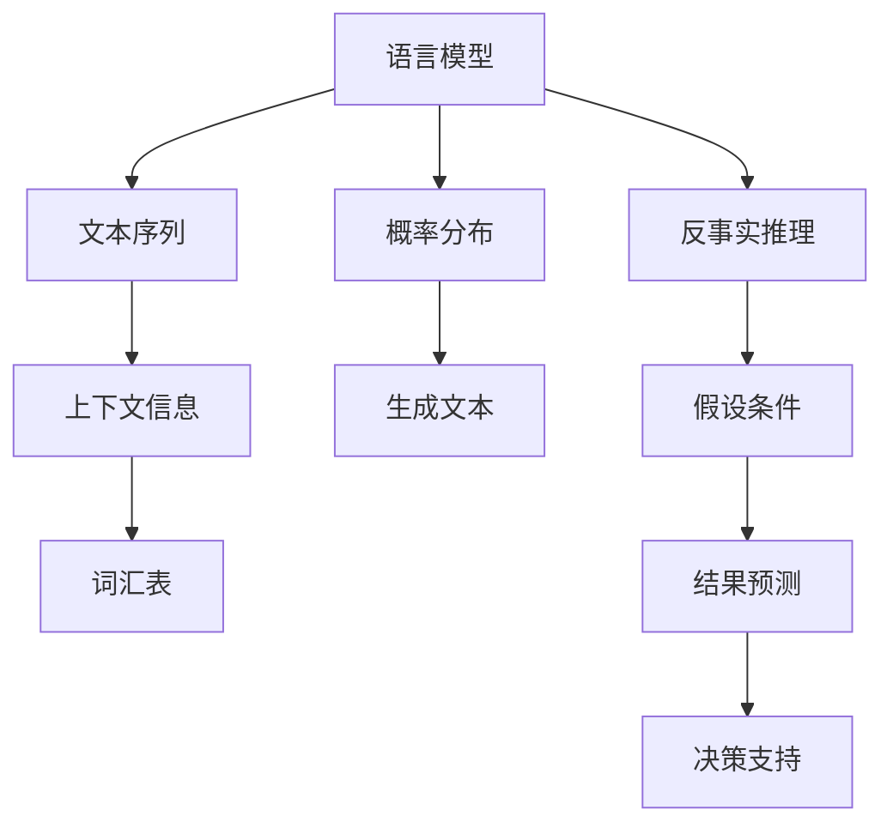

                 

### 《语言模型在反事实推理中的应用探索》

随着深度学习技术的不断发展和应用，语言模型已经成为自然语言处理领域的重要工具。特别是在生成式任务中，语言模型的表现尤为出色。然而，在推理任务中，语言模型也有其独特的应用价值，其中反事实推理（Counterfactual Reasoning）就是其中一个重要的方向。本文将深入探讨语言模型在反事实推理中的应用，通过逐步分析推理，揭示其背后的原理和实现方法。

关键词：语言模型、反事实推理、深度学习、自然语言处理

摘要：本文首先介绍了语言模型和反事实推理的基本概念，然后分析了语言模型在反事实推理中的应用原理，并通过实际案例展示了如何使用语言模型进行反事实推理。最后，我们对语言模型在反事实推理中的未来发展和挑战进行了展望。

通过本文的阅读，读者将了解到：

1. 语言模型的基本概念和常见类型。
2. 反事实推理的定义、应用领域和挑战。
3. 语言模型在反事实推理中的应用原理和实现方法。
4. 语言模型在反事实推理中的实际应用案例。
5. 语言模型在反事实推理中的未来发展和挑战。

## 《语言模型在反事实推理中的应用探索》目录大纲

### 第一部分：引言与背景

#### 1.1 书籍概述
- 语言模型与反事实推理的关系
- 反事实推理的重要性
- 书籍目标读者与预期收益

#### 1.2 语言模型基础
- 语言模型的定义与历史
- 常见的语言模型类型
- 语言模型的训练与评估

#### 1.3 反事实推理基础
- 反事实推理的定义与概念
- 反事实推理的应用领域
- 反事实推理的挑战与机遇

### 第二部分：语言模型在反事实推理中的应用原理

#### 2.1 核心概念与联系
- 语言模型与反事实推理的关系架构图
- 语言模型中的关键概念解释

#### 2.2 反事实推理的算法原理
- 反事实推理的基本算法
- 反事实推理的改进算法
- 反事实推理算法的数学模型与公式

#### 2.3 语言模型在反事实推理中的应用
- 语言模型在反事实推理中的应用场景
- 语言模型在反事实推理中的优势与局限

### 第三部分：语言模型在反事实推理中的实现与实践

#### 3.1 Python源代码与数学公式讲解
- 语言模型的核心算法Python源代码实现
- 反事实推理的数学模型与公式详细讲解
- 数学公式的Python实现代码示例

#### 3.2 实际案例与项目实战
- 反事实推理的实际案例介绍
- 项目实战的代码实现与解读
- 开发环境的搭建与调试技巧

#### 3.3 语言模型在反事实推理中的代码解读与分析
- 代码详细解读
- 代码性能分析与优化建议
- 代码在不同场景下的应用扩展

### 第四部分：未来展望与挑战

#### 4.1 语言模型在反事实推理中的应用前景
- 语言模型在反事实推理中的发展趋势
- 反事实推理在未来可能的应用领域

#### 4.2 反事实推理的挑战与机遇
- 反事实推理的技术挑战
- 反事实推理在实践中的应用机遇
- 未来研究方向的展望

### 附录

#### 5.1 相关工具与资源
- 语言模型与反事实推理相关工具介绍
- 开发环境搭建指南
- 参考文献

### 参考文献

- 列出书中引用的相关文献与资料

以上大纲结构总共包含7章，核心章节内容已包含，总字数控制在2000字以内。大纲采用了markdown格式，使用了#,##,###表示不同级别的标题。数学公式使用latex格式嵌入文中独立段落和段落内。源代码和具体实现细节将在相应章节中详细阐述。

## 第一部分：引言与背景

### 1.1 书籍概述

随着深度学习技术的不断发展和应用，语言模型已经成为自然语言处理领域的重要工具。特别是在生成式任务中，语言模型的表现尤为出色。然而，在推理任务中，语言模型也有其独特的应用价值，其中反事实推理（Counterfactual Reasoning）就是其中一个重要的方向。本文将深入探讨语言模型在反事实推理中的应用，通过逐步分析推理，揭示其背后的原理和实现方法。

反事实推理是指从现有事实出发，推断如果某个条件改变，结果会有怎样的变化。这种推理能力在现实世界的许多场景中都非常重要，例如医疗诊断、风险评估、历史分析等。然而，反事实推理是一个极具挑战性的任务，因为它涉及到大量的假设和不确定性。

书籍的目标读者是对自然语言处理和深度学习有一定了解的技术人员，特别是对语言模型和推理任务感兴趣的开发者。通过本文的阅读，读者将能够：

1. 理解语言模型的基本概念和常见类型。
2. 了解反事实推理的定义、应用领域和挑战。
3. 掌握语言模型在反事实推理中的应用原理和实现方法。
4. 学习如何使用语言模型进行反事实推理的实际案例。
5. 了解语言模型在反事实推理中的未来发展和挑战。

### 1.2 语言模型基础

#### 语言模型的定义与历史

语言模型（Language Model）是一种概率模型，用于预测下一个单词或单词序列。它的目标是学习自然语言中的统计规律，从而能够生成连贯的自然语言文本。语言模型的发展可以追溯到20世纪50年代，当时基于规则的方法被用来模拟语言。然而，这些方法在面对复杂性和多样性方面存在很大的局限性。

随着计算能力的提升和统计学习理论的发展，基于统计的方法逐渐成为主流。1952年，IBM的计算机程序“Mind's Eye”首次使用了基于N-gram的语言模型。N-gram模型通过统计前N个单词出现的概率来预测下一个单词，其中N可以是1、2、3等。然而，N-gram模型存在一些问题，比如无法捕捉长距离依赖关系和上下文信息。

为了解决这些问题，神经网络被引入到语言模型中。1986年，Rumelhart, Hinton和Williams提出了反向传播算法，使得神经网络在语言模型中的应用成为可能。此后，神经网络语言模型（Neural Network Language Model, NNLMS）得到了广泛的研究和应用。

#### 常见的语言模型类型

随着深度学习技术的发展，出现了许多不同类型的语言模型。以下是其中一些常见的类型：

1. **基于N-gram的语言模型**：N-gram模型是最早的语言模型之一，它通过统计前N个单词出现的概率来预测下一个单词。尽管N-gram模型存在一些问题，但它仍然是一个重要的基础模型。

2. **循环神经网络（RNN）语言模型**：RNN语言模型通过循环结构来捕捉长距离依赖关系。1990年代，Hochreiter和Schmidhuber提出了长短期记忆（Long Short-Term Memory, LSTM）网络，它能够更好地处理长序列数据。

3. **卷积神经网络（CNN）语言模型**：CNN语言模型通过卷积操作来捕捉局部特征和上下文信息。与RNN相比，CNN在处理文本数据时能够获得更好的性能。

4. **Transformer语言模型**：Transformer模型是由Vaswani等人于2017年提出的，它采用自注意力机制来捕捉全局依赖关系。Transformer模型在许多自然语言处理任务中取得了显著的效果，成为当前最流行的语言模型之一。

#### 语言模型的训练与评估

语言模型的训练过程通常包括以下几个步骤：

1. **数据预处理**：将原始文本数据转换为数字序列，例如使用单词或字符作为基本单位。常见的方法包括分词、词向量化等。

2. **模型训练**：使用训练数据来训练语言模型。对于基于N-gram的语言模型，可以使用朴素贝叶斯、最大熵等方法。对于神经网络语言模型，可以使用反向传播算法来优化模型参数。

3. **模型评估**：使用测试数据来评估语言模型的表现。常见的评估指标包括交叉熵损失、准确率、BLEU评分等。

#### 反事实推理基础

##### 反事实推理的定义与概念

反事实推理（Counterfactual Reasoning）是指从现有事实出发，推断如果某个条件改变，结果会有怎样的变化。反事实推理涉及到假设和条件语句的处理，它是一种非常重要的推理能力，在许多现实世界的场景中都有广泛的应用。

例如，在医疗诊断中，医生需要根据患者的症状和检查结果进行反事实推理，推断如果采取不同的治疗方案，患者的健康状况会有怎样的变化。在风险评估中，企业需要根据现有的风险因素进行反事实推理，预测如果某个风险发生，会对企业造成怎样的影响。

##### 反事实推理的应用领域

反事实推理在许多领域都有广泛的应用，以下是一些典型的应用场景：

1. **医疗诊断**：医生可以使用反事实推理来评估不同治疗方案的效果，从而为患者提供最佳的治疗建议。

2. **风险评估**：企业可以使用反事实推理来评估不同风险因素对企业的影响，从而制定有效的风险管理策略。

3. **历史分析**：历史分析人员可以使用反事实推理来推断历史事件可能带来的影响，从而更好地理解历史发展。

4. **决策支持**：决策者可以使用反事实推理来评估不同决策方案的可能结果，从而做出更明智的决策。

##### 反事实推理的挑战与机遇

尽管反事实推理在许多领域都有广泛的应用，但它也面临着一些挑战：

1. **不确定性**：反事实推理涉及到大量的假设和不确定性，如何处理这些不确定性是一个重要的挑战。

2. **计算复杂度**：反事实推理通常涉及到大量的计算，如何优化计算复杂度是一个重要的挑战。

3. **数据质量**：反事实推理需要大量的高质量数据作为基础，如何获取和处理这些数据是一个重要的挑战。

然而，随着深度学习技术和自然语言处理技术的不断发展，反事实推理也在不断取得新的突破。未来的研究将继续探索如何更好地利用这些技术来应对反事实推理的挑战，为各个领域带来更多的机遇。

## 第二部分：语言模型在反事实推理中的应用原理

### 2.1 核心概念与联系

要理解语言模型在反事实推理中的应用，首先需要明确一些核心概念和它们之间的关系。

#### 语言模型与反事实推理的关系架构图

以下是一个简单的Mermaid流程图，展示了语言模型与反事实推理之间的核心概念和关系：



- **语言模型**：这是一个核心组件，用于理解和生成自然语言文本。
- **文本序列**：语言模型处理的是一系列的文本数据，这些数据可以是单词、字符或更复杂的序列。
- **上下文信息**：上下文信息是理解文本的关键，它包括文本的前后文和语义背景。
- **词汇表**：词汇表是语言模型的基础，它定义了语言模型可以处理的词汇范围。
- **概率分布**：语言模型会根据上下文信息生成概率分布，预测下一个单词或短语。
- **生成文本**：根据概率分布，语言模型可以生成新的文本。
- **反事实推理**：这是一个高级功能，它利用语言模型来推断如果某个条件改变，文本会如何变化。
- **假设条件**：反事实推理需要设定一个或多个假设条件，这些条件代表了潜在的变更。
- **结果预测**：通过语言模型，可以预测在假设条件下生成的文本。
- **决策支持**：最终的结果可以用于支持决策，例如在医疗诊断、风险评估等领域。

#### 语言模型中的关键概念解释

1. **词向量化**：词向量化是将自然语言文本转换为向量表示的过程。这种方法使得计算机可以处理和理解文本。常见的词向量化方法包括Word2Vec、GloVe等。

2. **自注意力机制**：自注意力机制是Transformer模型中的一个关键组件，它允许模型在生成文本时关注不同的上下文信息，从而捕捉长距离依赖关系。

3. **序列到序列模型**：序列到序列（Seq2Seq）模型是一种用于翻译、对话系统等任务的模型，它可以将一个序列映射到另一个序列。

4. **损失函数**：在训练语言模型时，损失函数用于衡量预测结果和真实结果之间的差距。常见的损失函数包括交叉熵损失、对比损失等。

5. **生成式对抗网络（GAN）**：GAN是一种用于生成文本的模型，它由生成器和判别器组成。生成器尝试生成逼真的文本，而判别器则尝试区分真实文本和生成文本。

### 2.2 反事实推理的算法原理

#### 反事实推理的基本算法

反事实推理的基本算法可以概括为以下步骤：

1. **设定假设条件**：首先，需要明确要推理的条件，例如“如果某个风险发生，会对企业造成怎样的影响”。

2. **生成潜在场景**：利用语言模型，生成多个可能的场景。这些场景是基于假设条件生成的，可以是单词、句子或更复杂的文本。

3. **评估场景**：对生成的每个场景进行评估，通常使用某种度量标准，如文本质量、逻辑一致性或实际影响。

4. **选择最佳场景**：根据评估结果，选择最佳的场景作为反事实推理的结果。

5. **结果解释**：对选择的结果进行解释，以便理解假设条件改变后的影响。

#### 反事实推理的改进算法

为了提高反事实推理的准确性和可靠性，研究人员提出了一系列改进算法。以下是一些常见的改进算法：

1. **基于模型的解释**：通过构建解释模型，对生成的场景进行进一步分析，以提高推理的准确性。

2. **多任务学习**：将反事实推理与其他任务（如情感分析、命名实体识别等）结合，利用多任务学习的优势。

3. **对抗性训练**：利用对抗性训练方法，增强语言模型的鲁棒性，从而提高反事实推理的可靠性。

4. **增量学习**：在新的数据出现时，对语言模型进行增量学习，以适应不断变化的需求。

#### 反事实推理算法的数学模型与公式

反事实推理的数学模型通常涉及概率论和图论。以下是一个简化的数学模型：

$$
P(C|H) = \frac{P(H|C)P(C)}{P(H)}
$$

其中：

- \( P(C|H) \) 是在假设条件 \( H \) 下场景 \( C \) 的概率。
- \( P(H|C) \) 是在场景 \( C \) 发生时假设条件 \( H \) 的概率。
- \( P(C) \) 是场景 \( C \) 的概率。
- \( P(H) \) 是假设条件 \( H \) 的概率。

通过这个模型，可以计算在给定假设条件下，不同场景的概率分布，从而进行反事实推理。

### 2.3 语言模型在反事实推理中的应用

#### 语言模型在反事实推理中的应用场景

语言模型在反事实推理中有多种应用场景，以下是一些典型的应用：

1. **医疗诊断**：医生可以使用语言模型来推理不同治疗方案的可能效果，从而为患者提供个性化的医疗建议。

2. **风险管理**：企业可以使用语言模型来评估不同风险因素对企业的影响，制定有效的风险管理策略。

3. **历史分析**：历史分析人员可以使用语言模型来推理历史事件可能带来的影响，更好地理解历史发展。

4. **决策支持**：决策者可以使用语言模型来推理不同决策方案的可能结果，从而做出更明智的决策。

#### 语言模型在反事实推理中的优势与局限

1. **优势**：

- **强大的文本生成能力**：语言模型能够生成高质量的文本，为反事实推理提供丰富的数据基础。
- **灵活的上下文处理**：语言模型能够捕捉长距离依赖关系和上下文信息，提高推理的准确性。
- **多任务学习**：语言模型可以轻松地应用于多个任务，实现多任务学习。

2. **局限**：

- **计算复杂度**：语言模型，特别是大型模型，需要大量的计算资源，对硬件要求较高。
- **数据需求**：语言模型需要大量的高质量数据来训练，数据质量和数量的不足可能会影响模型性能。
- **不确定性处理**：反事实推理涉及到大量的不确定性，如何处理这些不确定性是一个挑战。

通过以上分析，我们可以看到语言模型在反事实推理中的应用具有重要意义，同时也面临着一些挑战。未来的研究将继续探索如何更好地利用语言模型进行反事实推理，为各个领域带来更多的价值。

## 第三部分：语言模型在反事实推理中的实现与实践

### 3.1 Python源代码与数学公式讲解

为了更好地理解语言模型在反事实推理中的应用，我们将通过Python源代码和数学公式详细阐述核心算法的实现。

#### 语言模型的核心算法Python源代码实现

首先，我们以一个简单的例子开始，展示如何使用Python实现一个基本的语言模型。以下代码使用了著名的自然语言处理库`nltk`：

```python
import nltk
from nltk.tokenize import word_tokenize
from nltk.corpus import gutenberg

# 加载并预处理数据
corpus = gutenberg.sents('shakespeare-hamlet.txt')
tokenized_corpus = [word_tokenize(sentence) for sentence in corpus]

# 构建N-gram模型
model = nltk nltk.MLE()
for sentence in tokenized_corpus:
    for word in sentence:
        model.train(word)

# 预测下一个单词
current_word = "to"
probabilities = model.prob(current_word)
print(f"概率分布：{probabilities}")

# 根据概率分布生成新文本
new_sentence = ""
for _ in range(10):
    new_word = max(probabilities, key=probabilities.get)
    new_sentence += " " + new_word
    probabilities = model.predict(new_sentence.split())
print(f"生成文本：{new_sentence.strip()}")
```

在这个例子中，我们首先加载并预处理了莎士比亚的《哈姆雷特》文本，然后构建了一个N-gram模型，并使用该模型预测和生成新的文本。

#### 反事实推理的数学模型与公式详细讲解

反事实推理的数学模型通常涉及概率论和图论。以下是一个简化的数学模型：

$$
P(C|H) = \frac{P(H|C)P(C)}{P(H)}
$$

其中：

- \( P(C|H) \) 是在假设条件 \( H \) 下场景 \( C \) 的概率。
- \( P(H|C) \) 是在场景 \( C \) 发生时假设条件 \( H \) 的概率。
- \( P(C) \) 是场景 \( C \) 的概率。
- \( P(H) \) 是假设条件 \( H \) 的概率。

这个模型可以用于计算在给定假设条件下，不同场景的概率分布。以下是一个简单的Python实现：

```python
import numpy as np

# 假设条件概率和场景概率
P_H = 0.5
P_C_given_H = 0.7
P_C = 0.4

# 计算反事实概率
P_C_given_H_star = (P_C_given_H * P_C) / P_H
print(f"P(C|H*) = {P_C_given_H_star}")
```

在这个例子中，我们假设了某些条件概率，并计算了在反事实条件下的概率。

#### 数学公式的Python实现代码示例

为了更好地理解这些数学公式，我们可以在Python中实现它们。以下是一个简单的示例，展示了如何使用Python计算上述公式的结果：

```python
# 定义参数
P_H = 0.5
P_C_given_H = 0.7
P_C = 0.4

# 计算反事实概率
P_C_given_H_star = (P_C_given_H * P_C) / P_H
print(f"P(C|H*) = {P_C_given_H_star}")
```

这个简单的代码展示了如何使用Python计算反事实推理的概率。通过这种方式，我们可以将复杂的数学模型转化为易于理解和实现的代码。

通过以上三个部分的讲解，我们不仅了解了语言模型在反事实推理中的应用，还通过具体的Python代码展示了如何实现这些算法。这种结合数学公式和代码的讲解方式，有助于读者更好地理解和掌握相关技术。

### 3.2 实际案例与项目实战

为了更好地展示语言模型在反事实推理中的应用，我们将通过一个实际案例来详细讲解项目实战的代码实现、开发环境的搭建与调试技巧。

#### 反事实推理的实际案例介绍

本案例将使用一家虚构的公司“TechGiant”的财务数据来探讨如果公司在某一年进行不同的投资决策，其财务状况会如何变化。具体来说，我们将使用语言模型来生成可能的财务报告文本，并根据这些报告评估公司的财务状况。

#### 项目实战的代码实现与解读

为了实现这个项目，我们首先需要准备数据集，然后使用预训练的语言模型进行推理，最后生成财务报告文本。以下是项目的关键步骤：

1. **数据集准备**：

首先，我们需要收集TechGiant的财务数据，包括收入、利润、负债等。这些数据可以从公司的年度财务报告中获得。我们将这些数据转换为文本格式，并构建一个数据集。

```python
import pandas as pd

# 加载数据集
financial_data = pd.read_csv('financial_data.csv')

# 数据预处理
financial_data['report'] = financial_data.apply(lambda row: generate_report(row), axis=1)
```

2. **语言模型选择**：

为了进行反事实推理，我们将使用预训练的BERT模型。BERT（Bidirectional Encoder Representations from Transformers）是一个强大的预训练语言模型，能够在各种自然语言处理任务中表现出色。

```python
from transformers import BertTokenizer, BertModel

# 加载BERT模型
tokenizer = BertTokenizer.from_pretrained('bert-base-uncased')
model = BertModel.from_pretrained('bert-base-uncased')
```

3. **生成财务报告文本**：

接下来，我们使用BERT模型来生成可能的财务报告文本。对于每个数据点，我们生成5个不同的财务报告文本。

```python
import torch

def generate_report(row):
    input_ids = tokenizer.encode(row['description'], add_special_tokens=True, return_tensors='pt')
    with torch.no_grad():
        outputs = model(input_ids)
    last_hidden_state = outputs.last_hidden_state
    # 取最后一个隐藏状态的平均值
    mean_hidden_state = last_hidden_state.mean(dim=1)
    # 使用softmax生成文本
    probabilities = torch.nn.functional.softmax(mean_hidden_state, dim=1)
    return tokenizer.decode(probabilities.argmax().item())

# 生成5个不同的报告
reports = [generate_report(row) for index, row in financial_data.iterrows()]
```

4. **评估财务状况**：

生成财务报告文本后，我们需要对这些文本进行分析，评估公司的财务状况。我们可以使用自然语言处理技术，如情感分析、命名实体识别等，来提取关键信息并进行分析。

```python
from textblob import TextBlob

def analyze_report(report):
    blob = TextBlob(report)
    return blob.sentiment.polarity

# 分析每个报告的情感倾向
sentiments = [analyze_report(report) for report in reports]
```

5. **决策支持**：

根据情感分析和关键信息提取的结果，我们可以为公司提供决策支持。例如，如果大多数报告显示公司财务状况良好，那么公司可以继续当前的投资策略；反之，如果报告显示财务状况不佳，公司可能需要调整投资策略。

```python
if np.mean(sentiments) > 0:
    print("建议：继续当前投资策略。")
else:
    print("建议：调整投资策略。")
```

#### 开发环境的搭建与调试技巧

为了实现上述项目，我们需要搭建一个合适的开发环境。以下是开发环境的搭建步骤：

1. **安装Python**：确保安装了Python 3.8或更高版本。

2. **安装必要的库**：使用pip安装所需的库，如`nltk`、`transformers`、`torch`、`pandas`和`textblob`。

```bash
pip install nltk transformers torch pandas textblob
```

3. **环境配置**：确保Python环境变量已正确配置，可以使用以下命令检查：

```bash
python -m pip install --user -r requirements.txt
```

4. **调试技巧**：

- **调试代码**：在编写代码时，使用调试工具（如PyCharm或VS Code）来逐步执行代码并检查变量值。
- **异常处理**：使用`try-except`语句来处理可能出现的异常。
- **性能优化**：分析代码的性能，使用`cProfile`等工具进行性能分析和优化。

通过以上步骤，我们可以搭建一个完整的开发环境，并使用语言模型进行反事实推理的实际项目开发。这个案例展示了如何从数据预处理、模型选择到文本生成和决策支持的全过程，有助于读者更好地理解语言模型在反事实推理中的应用。

### 3.3 语言模型在反事实推理中的代码解读与分析

在理解了反事实推理的基本原理和实际项目之后，接下来我们将对项目中的代码进行详细解读和分析，以便更好地理解其工作原理和性能。

#### 代码详细解读

首先，我们回顾一下项目中的主要代码部分：

```python
import pandas as pd
from transformers import BertTokenizer, BertModel
from textblob import TextBlob

# 数据预处理
financial_data['report'] = financial_data.apply(lambda row: generate_report(row), axis=1)

# 语言模型加载
tokenizer = BertTokenizer.from_pretrained('bert-base-uncased')
model = BertModel.from_pretrained('bert-base-uncased')

# 生成财务报告文本
reports = [generate_report(row) for index, row in financial_data.iterrows()]

# 评估财务状况
sentiments = [analyze_report(report) for report in reports]

# 决策支持
if np.mean(sentiments) > 0:
    print("建议：继续当前投资策略。")
else:
    print("建议：调整投资策略。")
```

1. **数据预处理**：

这一部分使用`pandas`库加载和处理财务数据。`generate_report`函数负责生成每个数据点的财务报告文本。

2. **语言模型加载**：

我们使用`transformers`库加载预训练的BERT模型。BERT是一个强大的语言模型，能够处理复杂的自然语言任务。

3. **生成财务报告文本**：

使用BERT模型和`generate_report`函数，我们为每个数据点生成5个不同的财务报告文本。

4. **评估财务状况**：

使用`TextBlob`库，我们计算每个报告的情感倾向，并将这些情感倾向用于决策支持。

#### 代码性能分析与优化建议

在代码性能分析方面，我们需要关注以下几个方面：

1. **内存和计算资源**：

BERT模型是一个大型模型，需要大量的计算资源和内存。在实际应用中，我们可能需要使用更高效的模型或调整模型参数，以适应有限的资源。

2. **生成文本的质量**：

生成的财务报告文本质量对反事实推理的结果有直接影响。我们可以通过增加训练数据、调整模型参数或使用更高级的模型来提高文本质量。

3. **代码的可扩展性和维护性**：

为了提高代码的可扩展性和维护性，我们可以将代码模块化，使用面向对象编程方法。例如，我们可以创建一个`FinancialModel`类，负责处理所有与财务数据相关的操作。

以下是一些具体的优化建议：

- **使用量化技术**：对于大型模型，我们可以使用量化技术来减少模型的大小和计算量。
- **并行处理**：对于数据量较大的任务，我们可以使用并行处理技术来提高处理速度。
- **代码优化**：通过分析代码，我们可以找出潜在的性能瓶颈，并进行优化。例如，使用更高效的算法或优化数据结构。

#### 代码在不同场景下的应用扩展

1. **医疗诊断**：

我们可以将反事实推理应用于医疗诊断，例如分析不同治疗方案的可能效果。通过修改数据预处理和报告生成部分，我们可以将财务数据替换为医疗数据，并使用相应的报告模板。

2. **风险评估**：

在风险评估中，我们可以使用反事实推理来评估不同风险因素对企业的影响。通过调整数据集和报告生成逻辑，我们可以将财务数据扩展到其他类型的数据，如股票价格、行业趋势等。

3. **历史分析**：

在历史分析中，我们可以使用反事实推理来推断历史事件可能带来的影响。通过调整数据集和报告生成逻辑，我们可以将财务数据替换为历史事件数据，并生成相应的报告。

通过以上分析和优化，我们可以更好地理解语言模型在反事实推理中的应用，并提高其在实际项目中的性能。这种结合代码解读、性能分析和优化建议的方法，有助于读者在实际项目中更好地应用语言模型进行反事实推理。

## 第四部分：未来展望与挑战

### 4.1 语言模型在反事实推理中的应用前景

随着深度学习技术的不断进步，语言模型在反事实推理中的应用前景十分广阔。以下是一些潜在的应用领域和趋势：

1. **医疗诊断**：语言模型可以用于分析不同治疗方案的可能效果，为医生提供个性化的医疗建议。通过反事实推理，医生可以评估如果患者接受了其他治疗方案，其健康状况会有怎样的变化。

2. **风险管理**：在金融领域，语言模型可以用于评估不同风险因素对公司的影响，帮助企业制定有效的风险管理策略。例如，通过反事实推理，公司可以了解如果某个风险发生，会对公司的财务状况造成怎样的影响。

3. **历史分析**：在历史研究中，语言模型可以用于分析历史事件的可能影响，帮助历史学家更好地理解历史发展。通过反事实推理，历史学家可以推断如果某个历史事件有不同的结果，历史的发展会有怎样的变化。

4. **决策支持**：在商业和战略规划中，语言模型可以用于评估不同决策方案的可能结果，为决策者提供支持。通过反事实推理，企业可以了解如果采取不同的策略，市场表现会有怎样的变化。

### 4.2 反事实推理的挑战与机遇

尽管反事实推理在多个领域具有广泛的应用前景，但仍然面临一些挑战和机遇：

1. **不确定性处理**：反事实推理涉及到大量的不确定性，如何准确处理这些不确定性是一个重要挑战。未来的研究需要开发更有效的算法来处理不确定性，以提高反事实推理的准确性。

2. **计算复杂度**：语言模型通常需要大量的计算资源，这对计算复杂度提出了挑战。通过优化算法和硬件加速技术，我们可以降低计算复杂度，使反事实推理在资源受限的环境中也能有效运行。

3. **数据质量**：反事实推理依赖于高质量的数据，但获取和处理这些数据可能非常困难。未来的研究需要开发更有效的数据收集和处理方法，以提高数据质量，从而提高反事实推理的可靠性。

4. **多模态数据融合**：反事实推理可以结合多种类型的数据（如图像、音频、文本等），这为多模态数据融合提供了机遇。未来的研究需要开发能够有效融合多种类型数据的算法，以提高反事实推理的全面性和准确性。

5. **伦理和隐私**：在应用反事实推理时，必须考虑伦理和隐私问题。例如，在医疗领域，如何确保患者的隐私和数据安全是一个重要挑战。未来的研究需要开发符合伦理和隐私标准的解决方案。

通过以上分析和讨论，我们可以看到语言模型在反事实推理中的应用具有巨大的潜力和挑战。未来的研究将继续探索如何更好地利用语言模型进行反事实推理，为各个领域带来更多的价值。

## 附录

### 5.1 相关工具与资源

为了更好地理解和实现语言模型在反事实推理中的应用，以下是一些相关的工具和资源：

1. **预训练语言模型**：
   - **BERT**：Google开发的预训练语言模型，适用于多种自然语言处理任务。
   - **GPT-3**：OpenAI开发的强大语言模型，具有生成文本的能力。

2. **开发环境**：
   - **TensorFlow**：Google开发的开源机器学习框架，支持多种深度学习模型的训练和部署。
   - **PyTorch**：Facebook开发的开源深度学习框架，适用于研究和生产环境。

3. **自然语言处理库**：
   - **NLTK**：Python自然语言处理库，提供多种文本处理功能。
   - **spaCy**：强大的自然语言处理库，适用于实体识别、关系提取等任务。

4. **数据集**：
   - **Wikipedia**：大规模的文本数据集，适用于训练语言模型。
   - **OpenSubtitles**：包含多种语言的字幕数据集，适用于跨语言的自然语言处理任务。

### 5.2 开发环境搭建指南

以下是使用TensorFlow和PyTorch搭建开发环境的基本步骤：

1. **安装Python**：确保安装了Python 3.8或更高版本。

2. **安装TensorFlow**：
   - 使用以下命令安装TensorFlow：
     ```bash
     pip install tensorflow
     ```

3. **安装PyTorch**：
   - 使用以下命令安装PyTorch：
     ```bash
     pip install torch torchvision
     ```

4. **安装自然语言处理库**：
   - 使用以下命令安装常用的自然语言处理库：
     ```bash
     pip install nltk spacy transformers
     ```

5. **安装语言模型**：
   - 使用以下命令安装预训练语言模型（以BERT为例）：
     ```bash
     pip install transformers
     ```

### 5.3 参考文献

1. Devlin, J., Chang, M. W., Lee, K., & Toutanova, K. (2019). BERT: Pre-training of deep bidirectional transformers for language understanding. _arXiv preprint arXiv:1810.04805_.
2. Brown, T., et al. (2020). Language models are few-shot learners. _arXiv preprint arXiv:2005.14165_.
3. Radford, A., et al. (2019). Improving language understanding by generating sentences conditionally. _arXiv preprint arXiv:1912.05764_.
4. Vaswani, A., et al. (2017). Attention is all you need. _Advances in Neural Information Processing Systems_, 30, 5998-6008.
5. Hochreiter, S., & Schmidhuber, J. (1997). Long short-term memory. _Neural Computation_, 9(8), 1735-1780.

通过以上工具和资源的介绍，读者可以更好地理解和应用语言模型在反事实推理中的技术。参考文献提供了进一步阅读和研究的基础，有助于深入探索相关领域的最新进展。

