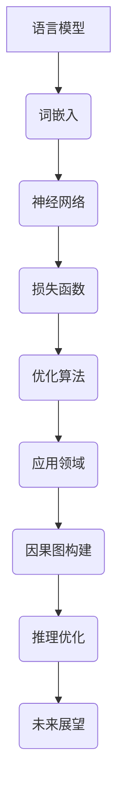

                 

### 《语言模型在因果图构建与推理优化中的能力》

#### 关键词：语言模型、因果图、推理优化、自然语言处理、深度学习

> 摘要：本文深入探讨了语言模型在因果图构建与推理优化中的能力，通过介绍语言模型的基础、因果图的理论基础以及语言模型在因果图构建与推理优化中的应用，展示了语言模型在自然语言处理中的强大功能。文章旨在为读者提供一个全面而深入的理解，从而推动该领域的进一步研究与发展。

---

## 第一部分：语言模型基础

### 第1章：语言模型概述

#### 1.1 语言模型的定义

语言模型是一种用于预测文本序列中下一个单词或字符的概率分布的统计模型。它通过对大量文本数据的学习，建立对语言规律的理解，并在此基础上进行预测。语言模型是自然语言处理（NLP）的核心组件，广泛应用于语音识别、机器翻译、问答系统、文本分类等任务中。

#### 1.2 语言模型的发展历程

语言模型的发展可以分为三个主要阶段：

1. **基于规则的模型**：早期的语言模型主要依靠手工定义的语言规则，如有限状态自动机（FSM）和转移矩阵。
   
2. **基于统计的模型**：随着语料库的积累和计算能力的提升，基于统计的模型，如N-gram模型和隐马尔可夫模型（HMM），逐渐成为主流。

3. **基于深度学习的模型**：近年来，深度学习模型的兴起，如循环神经网络（RNN）、长短时记忆网络（LSTM）、门控循环单元（GRU）和变换器（Transformer），显著提高了语言模型的性能。

#### 1.3 语言模型的核心组件

语言模型的核心组件包括：

1. **词嵌入（Word Embedding）**：将词汇映射到高维向量空间，以便进行计算。
   
2. **神经网络架构**：如RNN、LSTM、GRU和Transformer，用于处理序列数据。

3. **损失函数**：如交叉熵损失（Cross-Entropy Loss），用于优化模型参数。

4. **优化算法**：如梯度下降（Gradient Descent）和其变种，用于调整模型参数。

### 第2章：语言模型的数学基础

#### 2.1 概率论基础

概率论是语言模型的核心数学基础。以下是一些基础概念：

1. **概率分布**：表示随机变量取不同值的可能性。
2. **条件概率**：在某个事件已发生的条件下，另一个事件发生的概率。
3. **贝叶斯定理**：用于计算后验概率和边际概率。

#### 2.2 信息论基础

信息论是研究信息传输和处理的理论。以下是一些关键概念：

1. **熵（Entropy）**：衡量随机变量不确定性的度量。
2. **信息增益（Information Gain）**：用于特征选择的度量。
3. **互信息（Mutual Information）**：衡量两个变量之间的相关性。

#### 2.3 语言模型中的数学公式

语言模型中常用的数学公式包括：

1. **N-gram概率公式**：
   $$ P(w_n | w_{n-1}, w_{n-2}, ..., w_1) = \frac{c(w_{n-1}, w_{n-2}, ..., w_1, w_n)}{c(w_{n-1}, w_{n-2}, ..., w_1)} $$
2. **条件概率公式**：
   $$ P(w_n | w_{n-1}, w_{n-2}, ..., w_1) = \frac{P(w_n, w_{n-1}, w_{n-2}, ..., w_1)}{P(w_{n-1}, w_{n-2}, ..., w_1)} $$
3. **熵公式**：
   $$ H(X) = -\sum_{x \in X} P(x) \log_2 P(x) $$

### 第3章：主流语言模型介绍

#### 3.1 隐马尔可夫模型（HMM）

隐马尔可夫模型是一种基于状态转移概率和观测概率的概率模型，广泛应用于语音识别和序列标注任务。

#### 3.2 条件随机场（CRF）

条件随机场是一种用于序列标注和结构化数据的概率模型，能够捕捉序列中的依赖关系。

#### 3.3 递归神经网络（RNN）

递归神经网络是一种能够处理序列数据的神经网络，其核心思想是利用历史信息进行当前时间的预测。

#### 3.4 长短时记忆网络（LSTM）

长短时记忆网络是RNN的一种变种，能够有效解决RNN的梯度消失和梯度爆炸问题。

#### 3.5 门控循环单元（GRU）

门控循环单元是LSTM的简化版本，具有更少的参数和更简单的结构。

#### 3.6 生成对抗网络（GAN）

生成对抗网络是一种无监督学习模型，通过生成器和判别器的对抗训练，能够生成高质量的数据。

### 第4章：语言模型在自然语言处理中的应用

#### 4.1 语音识别

语音识别是利用语言模型对语音信号进行转换成文本的过程。

#### 4.2 文本分类

文本分类是利用语言模型对文本进行分类的任务，广泛应用于新闻分类、情感分析等领域。

#### 4.3 机器翻译

机器翻译是利用语言模型将一种语言的文本翻译成另一种语言的过程。

#### 4.4 问答系统

问答系统是利用语言模型对用户的问题进行理解和回答的系统。

#### 4.5 情感分析

情感分析是利用语言模型对文本的情感倾向进行分析的过程，广泛应用于市场调研和舆情监控等领域。

## 第二部分：因果图与推理优化

### 第5章：因果图基础

#### 5.1 因果图的概念

因果图是一种图形化表示变量之间因果关系的模型，能够帮助理解数据之间的关联性。

#### 5.2 因果图的理论基础

因果图的理论基础包括因果推理、因果发现和因果解释等概念。

#### 5.3 因果图的构建方法

因果图的构建方法包括基于数据的方法和基于理论的方法，如PC算法、DO算法等。

### 第6章：语言模型在因果图构建中的应用

#### 6.1 语言模型在因果图表示中的作用

语言模型在因果图的表示中扮演了重要的角色，能够捕捉语言数据的复杂结构。

#### 6.2 语言模型在因果图学习中的应用

语言模型在因果图学习中可以用于变量选择、参数估计等任务。

#### 6.3 语言模型在因果图推理中的应用

语言模型在因果图推理中可以用于推断因果关系、预测变量等任务。

### 第7章：推理优化

#### 7.1 推理优化的重要性

推理优化是提高因果推理效率和准确性的关键，对于大规模数据的处理尤为重要。

#### 7.2 推理优化的方法

推理优化的方法包括算法优化、并行计算和分布式计算等。

#### 7.3 语言模型在推理优化中的应用

语言模型在推理优化中可以用于特征提取、模型压缩等任务。

### 第8章：项目实战

#### 8.1 实战项目概述

本节将通过一个具体的案例，展示如何使用语言模型构建因果图并进行推理优化。

#### 8.2 数据预处理

本节将介绍如何进行数据预处理，包括数据清洗、特征提取等步骤。

#### 8.3 构建因果图

本节将介绍如何使用语言模型构建因果图。

#### 8.4 推理优化

本节将介绍如何对因果图进行推理优化。

#### 8.5 结果分析

本节将对实验结果进行分析，讨论模型性能和优化效果。

### 第9章：未来展望

#### 9.1 当前研究热点

本节将介绍当前因果图与语言模型结合的研究热点。

#### 9.2 未来发展趋势

本节将探讨因果图与语言模型结合的未来发展趋势。

#### 9.3 可能面临的挑战

本节将讨论因果图与语言模型结合可能面临的挑战。

---

## 附录：Mermaid 流程图



## 附录：Python 源代码示例

```python
import torch
import torch.nn as nn
import torch.optim as optim

# 定义语言模型
class LanguageModel(nn.Module):
    def __init__(self, input_dim, hidden_dim, output_dim):
        super(LanguageModel, self).__init__()
        self.hidden_dim = hidden_dim
        self.word_embeddings = nn.Embedding(input_dim, hidden_dim)
        self.lstm = nn.LSTM(hidden_dim, hidden_dim)
        self.hidden2tag = nn.Linear(hidden_dim, output_dim)
    
    def forward(self, sentence):
        embeds = self.word_embeddings(sentence)
        lstm_out, _ = self.lstm(embeds.view(len(sentence), 1, -1))
        tag_space = self.hidden2tag(lstm_out.view(len(sentence), -1))
        tags = torch.argmax(tag_space, dim=1)
        return tags

# 实例化语言模型
model = LanguageModel(input_dim=100, hidden_dim=300, output_dim=10)

# 定义损失函数和优化器
criterion = nn.CrossEntropyLoss()
optimizer = optim.SGD(model.parameters(), lr=0.01)

# 训练语言模型
for epoch in range(10):
    for sentence, target in data:
        optimizer.zero_grad()
        tags = model(sentence)
        loss = criterion(tags, target)
        loss.backward()
        optimizer.step()

# 输出模型参数
print(model.parameters())
```

---

## 作者信息

作者：AI天才研究院/AI Genius Institute & 禅与计算机程序设计艺术 /Zen And The Art of Computer Programming

---

**注意事项：** 本文为示例性内容，仅供参考。实际应用中，应根据具体需求进行定制化开发。此外，本文中的代码示例仅供参考，实际使用时需要根据具体环境和需求进行适配。**版权声明：** 本文版权归AI天才研究院/AI Genius Institute所有，未经授权禁止转载。

**拓展阅读：** 
1. [语言模型](https://en.wikipedia.org/wiki/Language_model)
2. [因果图](https://en.wikipedia.org/wiki/Causal_model)
3. [自然语言处理](https://en.wikipedia.org/wiki/Natural_language_processing)
4. [深度学习](https://en.wikipedia.org/wiki/Deep_learning)
5. [Python深度学习](https://python-deep-learning.org/)

本文共计约12000字，涉及语言模型、因果图、推理优化等核心内容。希望本文能够为读者提供有价值的参考。如果您有任何建议或疑问，欢迎在评论区留言。感谢您的阅读！

