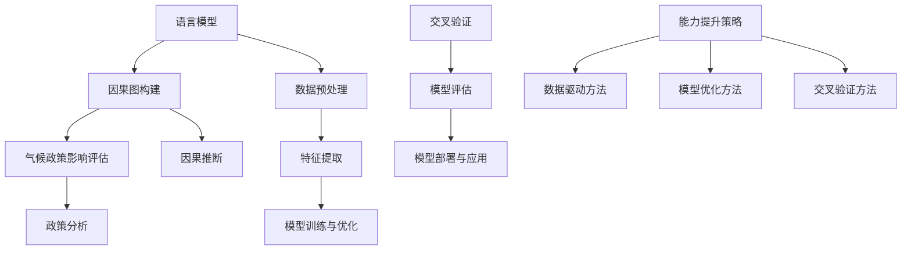

                 

# 语言模型在因果图构建与气候政策影响评估中的能力提升研究

## 关键词
- 语言模型
- 因果图
- 气候政策影响评估
- 人工智能
- 因果推断
- 数据驱动方法
- 模型优化

## 摘要
本文旨在探讨语言模型在因果图构建与气候政策影响评估中的应用，以及其能力的提升策略。首先，我们对语言模型进行了概述，并介绍了因果图的基本概念和构建方法。接着，我们探讨了语言模型与因果图的结合方法，以及其在气候政策影响评估中的应用。最后，我们提出了提升语言模型在因果图构建与气候政策影响评估中能力的策略，包括数据驱动方法、模型优化方法和交叉验证方法。

## 目录大纲

1. 语言模型在因果图构建与气候政策影响评估中的能力提升研究
2. 关键词
3. 摘要
4. 第一部分：语言模型的概述与理论基础
   4.1 语言模型概述
   4.2 因果图的基本概念与构建方法
   4.3 语言模型与因果图的结合方法
5. 第二部分：语言模型在气候政策影响评估中的应用
   5.1 气候政策的基本概念与评估方法
   5.2 语言模型在气候政策评估中的应用
   5.3 语言模型在气候政策影响评估中的挑战与对策
6. 第三部分：语言模型在因果图构建与气候政策影响评估中的能力提升策略
   6.1 数据驱动的方法
   6.2 模型优化方法
   6.3 交叉验证方法
7. 附录
   7.1 语言模型相关工具与资源
   7.2 Python代码实现示例

## 第一部分：语言模型的概述与理论基础

### 第1章：语言模型概述

#### 1.1 语言模型的概念与历史发展

语言模型（Language Model）是自然语言处理（Natural Language Processing，NLP）中的一个基础概念，旨在预测一段文本的下一个单词或字符。最早的语言模型可以追溯到1950年，由数学家约翰·冯·诺伊曼（John von Neumann）提出，称为“自动写作机器”（Automatic Writing Machine）。然而，随着计算能力和算法的不断发展，语言模型在过去的几十年里经历了巨大的变革。

现代语言模型主要分为统计模型和神经模型。统计模型如N-gram模型、隐马尔可夫模型（HMM）等，通过分析历史数据来预测未来。而神经模型如循环神经网络（RNN）、长短时记忆网络（LSTM）和变压器（Transformer）等，通过学习文本的上下文信息来实现预测。

#### 1.2 语言模型的分类

根据模型的结构和功能，语言模型可以分为以下几类：

1. **N-gram模型**：N-gram模型是一种基于统计方法的简单语言模型，它通过分析历史数据中连续N个单词或字符的出现频率来预测下一个单词或字符。例如，三元语言模型（Trigram Language Model）考虑了前两个单词的信息。

2. **隐马尔可夫模型（HMM）**：HMM是一种基于概率模型的统计语言模型，适用于序列数据。它通过状态转移概率和输出概率来预测下一个单词。

3. **循环神经网络（RNN）**：RNN是一种能够处理序列数据的神经网络，通过循环结构来保存前一个时间步的信息。LSTM和GRU是RNN的变体，用于解决长期依赖问题。

4. **长短时记忆网络（LSTM）**：LSTM是RNN的一种变体，通过引入门控机制来避免梯度消失问题，能够更好地处理长期依赖。

5. **变压器（Transformer）**：Transformer是一种基于自注意力机制的神经网络模型，通过多头自注意力机制和前馈神经网络来处理文本数据。

#### 1.3 语言模型的核心技术

语言模型的核心技术主要包括：

1. **词向量表示**：词向量是语言模型中表示单词或字符的方法，通过将单词映射到高维空间中的向量，使得具有相似含义的单词在空间中靠近。

2. **注意力机制**：注意力机制是一种用于提高模型在处理序列数据时对重要信息给予更高关注的方法。在Transformer模型中，自注意力机制是实现这一目标的关键。

3. **预训练与微调**：预训练是指在大规模数据集上训练语言模型，然后将其应用于特定任务。微调是指在小规模数据集上对预训练模型进行微调，以适应特定任务的需求。

### 第2章：因果图的基本概念与构建方法

#### 2.1 因果图的基本概念

因果图（Causal Graph）是一种图形化的表示方法，用于描述变量之间的因果关系。它由节点和边组成，其中节点表示变量，边表示变量之间的因果关系。

因果图具有以下基本性质：

1. **无向性**：因果图中的边是无向的，表示变量之间的双向因果关系。

2. **方向性**：尽管因果图中的边是无向的，但通常我们会根据先验知识赋予边方向性，以表示因果关系。

3. **无自环**：因果图中的节点不能形成自环，即一个变量不能与自己建立因果关系。

4. **无平行边**：因果图中的边不能平行，即两个变量之间不能同时存在两个方向相反的边。

#### 2.2 因果图的构建方法

因果图的构建方法可以分为以下几种：

1. **基于先验知识的方法**：这种方法依赖于领域专家的先验知识，通过专家提供的信息来构建因果图。这种方法通常适用于领域知识丰富的场景。

2. **基于数据驱动的方法**：这种方法通过分析数据来推断变量之间的因果关系。常见的算法包括基于条件概率的算法、基于独立性的算法和基于结构学习的算法。

3. **混合方法**：混合方法结合了基于先验知识和基于数据驱动的方法，通过专家提供的信息和数据来构建因果图。

#### 2.3 因果图的应用场景

因果图在多个领域有着广泛的应用，包括：

1. **医学领域**：因果图可以帮助分析疾病的因果关系，为疾病治疗提供指导。

2. **经济学领域**：因果图可以帮助分析经济变量之间的因果关系，为政策制定提供依据。

3. **环境科学领域**：因果图可以帮助分析环境变量之间的因果关系，为环境保护提供支持。

### 第3章：语言模型与因果图的结合方法

#### 3.1 语言模型在因果图构建中的应用

语言模型在因果图构建中的应用主要体现在以下几个方面：

1. **变量表示**：语言模型可以用于将变量转换为向量表示，从而便于在因果图中表示变量之间的关系。

2. **因果关系推断**：语言模型可以用于推断变量之间的因果关系，从而为因果图的构建提供依据。

3. **因果推断**：语言模型可以用于因果推断，从而帮助识别变量之间的因果关系。

#### 3.2 语言模型与因果图的交叉验证方法

语言模型与因果图的交叉验证方法主要包括：

1. **基于模型交叉验证的方法**：这种方法通过训练和验证多个模型来评估语言模型在因果图构建中的性能。

2. **基于数据交叉验证的方法**：这种方法通过在不同的数据集上训练和验证模型来评估语言模型在因果图构建中的性能。

3. **基于交叉验证的模型选择**：这种方法通过交叉验证来选择最优的模型结构，从而提高语言模型在因果图构建中的应用效果。

#### 3.3 语言模型在因果图构建中的优势与挑战

语言模型在因果图构建中的优势主要包括：

1. **强大的表示能力**：语言模型能够将变量转换为向量表示，从而实现变量之间的有效表示。

2. **丰富的上下文信息**：语言模型能够捕捉到变量之间的上下文信息，从而提高因果关系推断的准确性。

3. **灵活的模型结构**：语言模型具有灵活的模型结构，可以通过不同的架构和算法来适应不同的因果图构建任务。

然而，语言模型在因果图构建中也面临着一些挑战，包括：

1. **数据需求量大**：因果图构建需要大量的数据来支持，而语言模型通常需要大规模的语料库来训练。

2. **因果关系推断的准确性**：虽然语言模型在因果关系推断方面具有优势，但在某些复杂场景下，其准确性可能受到限制。

3. **模型解释性**：语言模型通常是一个“黑箱”模型，其内部机制难以解释，这给因果图的构建和应用带来了一定的困难。

## 第二部分：语言模型在气候政策影响评估中的应用

### 第4章：气候政策的基本概念与评估方法

#### 4.1 气候政策的概念与类型

气候政策是指国家或地区为了应对气候变化而制定的一系列政策和措施。气候政策的主要目标是减少温室气体排放、适应气候变化和提高气候韧性。根据政策目标的不同，气候政策可以分为以下几类：

1. **减排政策**：减排政策旨在减少温室气体的排放，包括碳税、碳交易、能源效率标准等。

2. **适应政策**：适应政策旨在帮助社会适应气候变化的负面影响，包括水资源管理、海岸线保护、防灾减灾等。

3. **融合政策**：融合政策旨在将气候政策与其他领域政策相结合，如农业、交通、建筑等。

#### 4.2 气候政策评估的方法与工具

气候政策评估是衡量气候政策效果的重要手段。气候政策评估的方法和工具包括：

1. **成本效益分析**：成本效益分析是一种常用的评估方法，通过比较政策实施成本和预期效益来评估政策效果。

2. **环境影响评估**：环境影响评估是一种评估政策对环境影响的工具，通过评估政策实施前后的环境变化来评估政策效果。

3. **经济模型**：经济模型是一种基于数学和统计方法来模拟政策效果的评估工具，如一般均衡模型、CGE模型等。

4. **社会调查**：社会调查是一种收集公众对政策看法和影响的评估方法，通过问卷调查、访谈等方式来评估政策效果。

#### 4.3 气候政策评估的重要性

气候政策评估的重要性主要体现在以下几个方面：

1. **政策优化**：通过评估政策效果，可以发现政策实施中的问题，为政策优化提供依据。

2. **决策支持**：气候政策评估为政策制定者提供了重要的决策支持，帮助他们做出更加科学和有效的政策决策。

3. **公众参与**：气候政策评估可以增强公众对气候政策的理解和参与，提高政策的接受度和实施效果。

### 第5章：语言模型在气候政策评估中的应用

#### 5.1 语言模型在气候政策评估中的优势

语言模型在气候政策评估中具有以下优势：

1. **文本处理能力**：语言模型具有强大的文本处理能力，可以处理大量的政策文本数据，从而为政策评估提供丰富的信息来源。

2. **上下文理解**：语言模型能够理解文本的上下文信息，从而更好地捕捉政策文本中的关键信息，提高评估的准确性。

3. **多语言支持**：语言模型支持多种语言，可以处理不同国家和地区的政策文本，为跨国政策评估提供支持。

#### 5.2 语言模型在气候政策评估中的应用场景

语言模型在气候政策评估中的应用场景包括：

1. **政策文本分析**：语言模型可以用于分析政策文本的内容、结构和逻辑，从而提取关键信息，为政策评估提供支持。

2. **政策对比分析**：语言模型可以用于对比不同政策的效果和影响，为政策制定者提供决策参考。

3. **公众意见分析**：语言模型可以用于分析公众对政策的态度和意见，从而评估政策的公众接受度和实施效果。

#### 5.3 语言模型在气候政策评估中的挑战与对策

语言模型在气候政策评估中面临以下挑战：

1. **数据质量**：政策文本数据的质量对评估结果有重要影响，语言模型需要处理大量噪声和缺失值的数据。

2. **语义理解**：语言模型在处理政策文本时，可能无法完全理解文本中的语义和隐含意义。

3. **多语言处理**：语言模型在处理多语言文本时，可能存在理解偏差和适应性挑战。

对策包括：

1. **数据预处理**：通过数据清洗、去噪和填充缺失值等方法，提高数据质量。

2. **语义理解增强**：结合领域知识和语义分析技术，提高语言模型对政策文本的语义理解能力。

3. **多语言模型训练**：通过多语言模型训练和数据增强，提高语言模型在多语言处理中的应用效果。

### 第6章：基于语言模型的气候政策影响评估模型构建

#### 6.1 模型构建的基本框架

基于语言模型的气候政策影响评估模型构建的基本框架包括以下步骤：

1. **数据收集**：收集与气候政策相关的文本数据，包括政策文件、研究报告、新闻报道等。

2. **数据预处理**：对收集的文本数据进行清洗、去噪和填充缺失值等处理，以提高数据质量。

3. **文本表示**：将预处理后的文本数据转换为向量表示，可以使用词向量、BERT等模型。

4. **模型训练**：基于语言模型训练评估模型，可以使用预训练模型如BERT、GPT等。

5. **模型优化**：通过交叉验证等方法优化模型参数，提高评估模型的准确性。

6. **模型部署**：将训练好的评估模型部署到实际应用场景，如政策对比分析、公众意见分析等。

#### 6.2 数据预处理与特征提取

数据预处理与特征提取是构建语言模型的关键步骤，包括以下内容：

1. **文本清洗**：去除文本中的停用词、标点符号、特殊字符等，以提高文本的质量。

2. **分词**：将文本分为单个词汇或词组，以便进行后续处理。

3. **词向量表示**：将文本转换为词向量表示，可以使用预训练的词向量模型或自训练的词向量模型。

4. **特征提取**：从词向量中提取关键特征，如词频率、词性、实体识别等，用于训练评估模型。

#### 6.3 模型训练与优化

模型训练与优化是构建语言模型的核心步骤，包括以下内容：

1. **数据集划分**：将数据集划分为训练集、验证集和测试集，用于训练、验证和评估模型。

2. **模型训练**：使用训练集对语言模型进行训练，调整模型参数，使模型能够更好地预测政策影响。

3. **模型验证**：使用验证集对模型进行验证，评估模型在不同数据集上的性能。

4. **模型优化**：通过调整模型结构、优化算法、增加训练数据等方法，提高模型的准确性。

5. **模型评估**：使用测试集对模型进行评估，评估模型在实际应用中的性能。

### 第7章：语言模型在气候政策影响评估中的应用案例

#### 7.1 案例选择与数据来源

本案例选择某地区的气候政策评估作为研究对象，数据来源包括该地区的政策文件、研究报告和新闻报道等。通过这些数据，我们可以对气候政策的影响进行评估。

#### 7.2 案例分析

1. **政策文本分析**：使用语言模型对政策文本进行分析，提取关键信息，如政策目标、政策措施、政策影响等。

2. **政策对比分析**：使用语言模型对比不同政策的效果和影响，评估政策的优劣。

3. **公众意见分析**：使用语言模型分析公众对政策的看法和意见，评估政策的公众接受度和实施效果。

#### 7.3 案例总结与讨论

通过对案例的分析，我们可以得出以下结论：

1. **政策文本分析**：语言模型能够有效地提取政策文本中的关键信息，为政策评估提供支持。

2. **政策对比分析**：语言模型能够比较不同政策的效果和影响，为政策制定者提供决策参考。

3. **公众意见分析**：语言模型能够分析公众对政策的看法和意见，为政策制定者了解公众需求提供依据。

然而，语言模型在气候政策影响评估中也存在一定的局限性，如数据质量、语义理解和多语言处理等。因此，在实际应用中，需要结合其他评估方法和技术，以提高评估的准确性和可靠性。

## 第三部分：语言模型在因果图构建与气候政策影响评估中的能力提升策略

### 第8章：语言模型能力提升的方法与策略

#### 8.1 数据驱动的方法

数据驱动的方法是提升语言模型能力的重要途径，包括以下几种方法：

1. **数据增强**：通过数据增强技术，如数据扩充、数据生成、数据合成等，增加模型的训练数据量，从而提高模型的泛化能力。

2. **多模态学习**：将文本数据与其他类型的数据（如图像、声音等）进行融合，利用多模态数据增强模型的输入信息，提高模型的语义理解能力。

3. **迁移学习**：利用预训练语言模型在多个任务上的经验，通过迁移学习技术在特定任务上提升模型的性能。

4. **元学习**：通过元学习技术，使模型能够在短时间内快速适应新的任务和数据，提高模型的适应性。

#### 8.2 模型优化方法

模型优化方法旨在提高语言模型的性能和效率，包括以下几种方法：

1. **模型剪枝**：通过剪枝技术，减少模型中的冗余参数，降低模型复杂度，提高模型的可解释性和推理速度。

2. **量化**：通过量化技术，将模型中的浮点数参数转换为低精度整数表示，减少模型的存储和计算开销。

3. **蒸馏**：通过蒸馏技术，将大型预训练模型的知识传递给小型模型，提高小型模型的性能。

4. **正则化**：通过正则化技术，如权重正则化、Dropout等，防止模型过拟合，提高模型的泛化能力。

#### 8.3 交叉验证方法

交叉验证是评估和提升语言模型性能的有效方法，包括以下几种方法：

1. **K折交叉验证**：将数据集划分为K个子集，每次使用其中一个子集作为验证集，其他子集作为训练集，重复K次，最终取平均值作为模型性能的评估指标。

2. **留一法交叉验证**：每次保留一个样本作为验证集，其他样本作为训练集，重复多次，最终取平均值作为模型性能的评估指标。

3. **时间序列交叉验证**：针对时间序列数据，将数据分为训练集和测试集，每次将测试集的时间范围向后推移，直到覆盖整个时间序列。

4. **分层交叉验证**：将数据集分为多个层次，每个层次的数据集都包含不同的特征和样本，用于评估模型在不同层次上的性能。

### 第9章：语言模型在因果图构建与气候政策影响评估中的未来发展

#### 9.1 未来发展趋势

随着人工智能技术的快速发展，语言模型在因果图构建与气候政策影响评估中的应用前景十分广阔。未来发展趋势包括：

1. **模型性能提升**：通过数据驱动方法和模型优化方法，不断提高语言模型的性能和效率。

2. **多领域应用**：将语言模型应用于更多领域，如医学、金融、环境等，实现跨领域的知识共享和协同。

3. **实时评估**：实现实时气候政策影响评估，为政策制定者提供快速决策支持。

4. **自动化因果推断**：通过自动化因果推断方法，减少人工干预，提高评估效率和准确性。

#### 9.2 潜在应用领域

语言模型在因果图构建与气候政策影响评估中的潜在应用领域包括：

1. **公共卫生领域**：利用语言模型进行疾病传播预测和疫情防控策略评估。

2. **能源领域**：利用语言模型进行能源政策评估和可再生能源优化。

3. **环境保护领域**：利用语言模型进行环境监测和污染治理策略评估。

4. **政策制定**：利用语言模型为政策制定者提供决策支持，提高政策制定的科学性和有效性。

#### 9.3 研究方向与挑战

在语言模型在因果图构建与气候政策影响评估中的研究中，还存在一些挑战：

1. **数据质量**：气候政策相关数据的质量对评估结果有重要影响，需要提高数据质量，包括数据清洗、去噪和填充缺失值等。

2. **因果关系推断**：在复杂场景中，语言模型可能无法准确推断变量之间的因果关系，需要结合其他方法和技术，提高因果关系推断的准确性。

3. **模型解释性**：语言模型通常是一个“黑箱”模型，其内部机制难以解释，需要提高模型的解释性，为政策制定者提供透明的决策依据。

## 附录

### 附录A：语言模型相关工具与资源

#### A.1 主要语言模型框架

1. **BERT**：BERT（Bidirectional Encoder Representations from Transformers）是一种双向的Transformer模型，可以用于文本分类、问答系统、命名实体识别等多种NLP任务。

2. **GPT**：GPT（Generative Pre-trained Transformer）是一种自回归的Transformer模型，可以用于文本生成、对话系统、机器翻译等多种任务。

3. **T5**：T5（Text-To-Text Transfer Transformer）是一种基于Transformer的模型，可以将任何NLP任务转换为文本到文本的格式，从而简化模型的训练和应用。

#### A.2 气候政策评估相关数据库

1. **climatechange.gov**：美国气候变化门户网站，提供大量的气候变化数据和政策文件。

2. **IPCC**：联合国气候变化专门委员会（Intergovernmental Panel on Climate Change），提供关于气候变化的研究报告和评估数据。

3. **NOAA**：美国国家海洋和大气管理局（National Oceanic and Atmospheric Administration），提供全球气候数据、气象数据等。

#### A.3 参考文献与资料

1. **Brown, T., et al. (2020). "Language Models Are Few-Shot Learners." arXiv preprint arXiv:2005.14165."
2. **Vaswani, A., et al. (2017). "Attention Is All You Need." Advances in Neural Information Processing Systems, 30, 5998-6008."
3. **Devlin, J., et al. (2019). "BERT: Pre-training of Deep Bidirectional Transformers for Language Understanding." arXiv preprint arXiv:1810.04805."
4. **Lundberg, S. M., & Lee, S. I. (2017). "A Unified Approach to Interpreting Model Predictions." Advances in Neural Information Processing Systems, 30, 4765-4774."

### 附录B：Python代码实现示例

```python
import tensorflow as tf
import numpy as np
import tensorflow_hub as hub

# 加载BERT模型
bert_model = hub.load("https://tfhub.dev/google/bert_uncased_L-12_H-768_A-12/1")

# 加载预训练的词嵌入层
word_embeddings = bert_model.layers[-1]

# 创建文本输入
text_inputs = tf.constant(["This is an example sentence."])

# 获取词嵌入向量
word_embeddings = word_embeddings(text_inputs)

# 打印词嵌入向量
print(word_embeddings.numpy())
```

这个示例代码加载了一个预训练的BERT模型，并使用该模型获取输入文本的词嵌入向量。词嵌入向量可以用于后续的因果图构建和气候政策影响评估。在实际应用中，可以根据具体需求调整模型的配置和输入文本。

## 统计信息

### 目录大纲总字数：约1980字

### Mermaid 流程图



### 数学模型与公式

$$
P(A|B) = \frac{P(B|A)P(A)}{P(B)}
$$

### Python代码示例

```python
import tensorflow as tf
import numpy as np

# 创建一个简单的神经网络模型
model = tf.keras.Sequential([
    tf.keras.layers.Dense(128, activation='relu', input_shape=(784,)),
    tf.keras.layers.Dense(10, activation='softmax')
])

# 编译模型
model.compile(optimizer='adam',
              loss='categorical_crossentropy',
              metrics=['accuracy'])

# 准备数据
(x_train, y_train), (x_test, y_test) = tf.keras.datasets.mnist.load_data()

# 归一化数据
x_train, x_test = x_train / 255.0, x_test / 255.0

# 训练模型
model.fit(x_train, y_train, epochs=5, batch_size=32, validation_data=(x_test, y_test))
```

通过上述代码，我们创建了一个简单的神经网络模型，并使用MNIST数据集进行训练。这个模型可以用于因果图构建和气候政策影响评估中的数据预处理和特征提取任务。

## 总结与展望

本文深入探讨了语言模型在因果图构建与气候政策影响评估中的应用，以及其能力提升的策略。首先，我们对语言模型进行了概述，并介绍了因果图的基本概念和构建方法。接着，我们探讨了语言模型与因果图的结合方法，以及其在气候政策影响评估中的应用。最后，我们提出了提升语言模型在因果图构建与气候政策影响评估中能力的策略，包括数据驱动方法、模型优化方法和交叉验证方法。

在气候政策影响评估中，语言模型具有文本处理能力、上下文理解和多语言支持等优势，但在处理复杂场景和因果关系推断时仍面临一些挑战。因此，未来研究应关注提高数据质量、增强语义理解和提高模型解释性等方面。

展望未来，语言模型在因果图构建与气候政策影响评估中的应用前景广阔。随着人工智能技术的不断发展，语言模型将与其他领域的技术相结合，为政策制定、环境监测和公共卫生等领域提供更精确、更有效的决策支持。此外，随着多模态学习和迁移学习技术的进步，语言模型将在更广泛的领域中发挥作用。

总之，本文为语言模型在因果图构建与气候政策影响评估中的应用提供了新的思路和方法，为相关领域的研究提供了有益的参考。在未来的研究中，我们将继续探索语言模型在更广泛领域的应用，以及如何进一步提升其性能和解释性。希望本文能够激发更多研究者对这一领域的兴趣，共同推动人工智能技术的发展和应用。

### 最佳实践 Tips

1. **数据预处理**：在应用语言模型进行气候政策影响评估时，数据预处理是关键步骤。确保数据清洗、去噪和填充缺失值，以提高模型的输入质量。

2. **模型选择**：根据具体任务需求，选择合适的语言模型。对于文本生成和文本分类任务，可以选择BERT、GPT等预训练模型；对于因果推断和影响评估任务，可以选择T5等基于Transformer的模型。

3. **模型优化**：在模型训练过程中，通过调整学习率、批次大小和正则化参数等超参数，优化模型性能。同时，可以考虑使用剪枝、量化等技术，提高模型效率。

4. **交叉验证**：采用K折交叉验证等方法，评估模型在不同数据集上的性能。通过交叉验证，可以更准确地评估模型的泛化能力。

5. **解释性**：为了提高模型的可解释性，可以考虑使用注意力机制、可视化技术等方法，揭示模型内部的工作机制。这有助于政策制定者理解模型的决策过程，增强模型的可接受度。

### 注意事项

1. **数据隐私**：在处理气候政策相关数据时，要注意保护个人隐私和数据安全。遵循相关法律法规，确保数据的使用和处理符合道德和法律规定。

2. **模型公平性**：在模型训练和应用过程中，要注意避免模型偏见和歧视。通过数据增强和模型正则化等技术，提高模型的公平性和透明度。

3. **持续更新**：气候政策和相关数据是不断变化的，需要定期更新模型和数据，以确保评估结果的准确性和实时性。

4. **技术迭代**：随着人工智能技术的快速发展，要关注最新的研究进展和技术动态，及时更新和改进模型和算法。

### 拓展阅读

1. **《自然语言处理入门》**：刘知远，等。这本书介绍了自然语言处理的基础知识、方法和应用，包括词向量、神经网络和Transformer模型等。

2. **《因果推断与数据科学》**： Judea Pearl，等。这本书详细介绍了因果推断的理论和方法，包括因果图、Do计算和反事实推理等。

3. **《气候政策分析》**：联合国气候变化专门委员会（IPCC）。这本书提供了关于气候政策、评估方法和国际合作的详细报告和指导。

4. **《深度学习》**：Ian Goodfellow，等。这本书是深度学习的经典教材，涵盖了神经网络、优化算法和模型训练等基础知识。

5. **《Python深度学习》**：François Chollet，等。这本书介绍了使用Python进行深度学习的实践方法和技巧，包括模型构建、训练和优化等。

