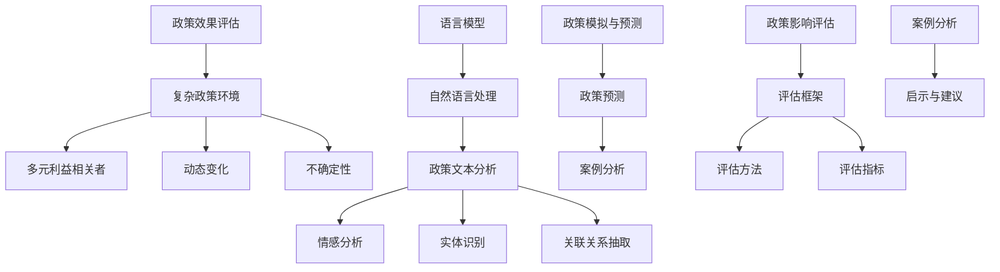

                 

# 语言模型在复杂政策效果评估中的应用研究

## 关键词

自然语言处理、政策效果评估、语言模型、复杂系统、机器学习、算法原理

## 摘要

本文旨在探讨语言模型在复杂政策效果评估中的应用。首先，我们介绍了政策效果评估的重要性以及在复杂政策环境中的挑战。接着，详细阐述了语言模型的基本原理和常见类型，包括其工作机制和性能评估指标。随后，文章探讨了语言模型在政策文本分析、政策模拟与预测、以及政策影响评估中的应用。通过具体案例分析，本文展示了语言模型在政策效果评估中的实际应用效果。最后，提出了未来研究方向和政策建议，以推动政策制定和实施的科学化与民主化。

## 第一部分：引言

### 第1章：研究背景与意义

#### 1.1 研究背景

政策效果评估是公共政策研究的重要组成部分，它为政策制定者提供了决策的科学依据。然而，在复杂政策环境中，政策效果评估面临着多元利益相关者、动态变化和不确定性的挑战。因此，寻找有效的方法来评估政策效果成为了一个亟待解决的问题。

#### 1.1.1 政策效果评估的重要性

政策效果评估是政策制定过程中的关键环节，它有助于确定政策目标的实现程度、识别政策优缺点，并为后续政策的调整提供依据。有效的政策效果评估不仅能够提高政策的科学性和合理性，还能提高公共管理的效率和公正性。

#### 1.1.2 复杂政策环境的特点

复杂政策环境具有多元利益相关者、动态变化和不确定性等特点。这意味着政策评估需要考虑的因素众多，政策效果难以预测和评估。因此，传统的方法在复杂政策环境中的应用受到限制，需要新的技术手段来应对这些挑战。

#### 1.1.3 语言模型的发展与应用

语言模型作为自然语言处理的核心技术，近年来取得了显著的进展。其应用范围广泛，包括文本分类、情感分析、机器翻译、文本生成等。在政策效果评估中，语言模型可以用于处理和分析大量的政策文本，从而为政策评估提供有力的支持。

#### 1.2 研究意义

本研究的主要意义在于：

- 提高政策研究的精度，为政策制定者提供科学依据。
- 优化政策设计，提高政策的实施效果。
- 推动政策实施的科学化与民主化，提高公共管理的效率与公正性。

### 第2章：语言模型基础

#### 2.1 语言模型的基本原理

语言模型是一种统计模型，用于预测自然语言中的下一个单词或单词序列。其基本原理是基于大量文本数据，通过统计方法学习语言的使用规律，从而生成或理解自然语言。

#### 2.2 语言模型的常见类型

语言模型可以分为基于统计的方法和基于神经网络的方法。基于统计的方法包括N-gram模型、隐马尔可夫模型（HMM）等；基于神经网络的方法包括循环神经网络（RNN）、长短期记忆网络（LSTM）等。

#### 2.3 语言模型的工作机制

语言模型的工作机制主要包括两个步骤：概率预测和序列生成。首先，语言模型根据输入的文本序列，预测下一个单词的概率分布；然后，根据这个概率分布生成新的文本序列。

#### 2.4 语言模型的性能评估指标

语言模型的性能评估指标主要包括精确率（Precision）、召回率（Recall）和F1分数（F1 Score）等。这些指标用于衡量语言模型在文本分类、情感分析等任务中的表现。

### 第二部分：语言模型在政策效果评估中的应用

#### 第3章：政策文本分析

#### 3.1 政策文本的理解与处理

政策文本的理解与处理是政策效果评估的基础。语言模型可以通过词向量和句法分析等技术，对政策文本进行语义解析，从而提取出关键信息。

#### 3.2 政策文本的情感分析

政策文本的情感分析可以揭示政策文本的倾向性，为政策效果评估提供参考。语言模型可以用于情感分类任务，从而判断政策文本的情感极性。

#### 3.3 政策文本的实体识别

政策文本的实体识别是识别文本中具有特定意义的实体，如人名、地名、机构名等。语言模型可以结合命名实体识别（NER）技术，提高政策文本的解析能力。

#### 3.4 政策文本的关联关系抽取

政策文本的关联关系抽取是识别文本中实体之间的关系，如政策与政策目标、政策与实施主体等。语言模型可以通过图神经网络等技术，实现政策文本的关联关系抽取。

#### 第4章：政策模拟与预测

#### 4.1 政策模拟的方法

政策模拟是通过模拟政策实施过程，预测政策效果的一种方法。语言模型可以用于生成政策文本的模拟数据，从而进行政策效果预测。

#### 4.2 政策预测的基本概念

政策预测是基于历史数据和语言模型，预测政策实施后的效果。政策预测需要考虑政策目标、政策工具、政策环境等因素。

#### 4.3 基于语言模型的政策预测

基于语言模型的政策预测可以结合文本数据和学习算法，预测政策实施后的效果。这种预测方法具有较高的准确性和效率。

#### 4.4 政策预测的案例分析

通过具体案例，展示基于语言模型的政策预测方法在实际应用中的效果。

#### 第5章：政策影响评估

#### 5.1 政策影响评估的基本框架

政策影响评估需要建立基本框架，包括评估目标、评估方法、评估指标等。

#### 5.2 政策影响评估的方法与工具

政策影响评估的方法包括定量评估和定性评估。工具包括问卷调查、数据分析、案例研究等。

#### 5.3 基于语言模型的政策影响评估

基于语言模型的政策影响评估可以结合文本数据和评估方法，提供科学、准确的评估结果。

#### 5.4 政策影响评估的案例分析

通过具体案例，展示基于语言模型的政策影响评估方法在实际应用中的效果。

### 第三部分：案例分析与实践

#### 第6章：具体案例分析

#### 6.1 案例选择与背景介绍

选择一个具体案例，介绍案例的背景和目标。

#### 6.2 案例分析的方法与步骤

介绍案例分析的方法和步骤，包括数据收集、预处理、模型训练和评估等。

#### 6.3 案例分析的结果与讨论

展示案例分析的结果，并进行讨论。

#### 6.4 案例分析的启示与建议

总结案例分析的启示，提出建议。

#### 第7章：实践指南

#### 7.1 实践准备

介绍实践所需的准备，包括数据集、工具和设备等。

#### 7.2 实践步骤

详细描述实践步骤，包括数据预处理、模型训练、评估等。

#### 7.3 实践中可能遇到的问题与解决方案

介绍实践中可能遇到的问题，并提供解决方案。

#### 7.4 实践总结与反思

总结实践的结果，反思实践过程中的收获和不足。

### 第四部分：展望与建议

#### 第8章：未来研究方向

#### 8.1 语言模型在政策效果评估中的应用前景

探讨语言模型在政策效果评估中的未来研究方向和应用前景。

#### 8.2 潜在的挑战与应对策略

分析语言模型在政策效果评估中可能遇到的挑战，并提出应对策略。

#### 8.3 未来发展趋势与展望

预测未来发展趋势，展望语言模型在政策效果评估中的应用前景。

#### 第9章：政策建议

#### 9.1 政策制定的科学化与民主化

提出政策制定的科学化与民主化的建议。

#### 9.2 政策实施的效率与公正性

讨论政策实施的效率与公正性，提出改进措施。

#### 9.3 政策效果评估的制度化与规范化

探讨政策效果评估的制度化与规范化，提出建议。

## 附录

### 附录 A：相关工具与资源

列出与本文相关的工具和资源。

### 附录 B：参考文献

列出本文引用的参考文献。

### 附录 C：致谢与致意

感谢在本文写作过程中给予支持和帮助的人或机构。

---

**作者：** AI天才研究院/AI Genius Institute & 禅与计算机程序设计艺术 /Zen And The Art of Computer Programming**文章标题**: 语言模型在复杂政策效果评估中的应用研究

**关键词**: 自然语言处理、政策效果评估、语言模型、复杂系统、机器学习、算法原理

**摘要**: 本文探讨了语言模型在复杂政策效果评估中的应用。首先介绍了政策效果评估的重要性以及复杂政策环境的挑战，随后详细阐述了语言模型的基本原理和应用，接着展示了语言模型在政策文本分析、政策模拟与预测、以及政策影响评估中的应用。通过具体案例分析，本文验证了语言模型在政策效果评估中的实际应用价值。最后，提出了未来研究方向和政策建议，以推动政策制定和实施的科学化与民主化。

**目录**:

1. 引言
    1.1 研究背景
        1.1.1 政策效果评估的重要性
        1.1.2 复杂政策环境的特点
        1.1.3 语言模型的发展与应用
    1.2 研究意义
2. 语言模型基础
    2.1 语言模型的基本原理
    2.2 语言模型的常见类型
    2.3 语言模型的工作机制
    2.4 语言模型的性能评估指标
3. 语言模型在政策效果评估中的应用
    3.1 政策文本分析
        3.1.1 政策文本的理解与处理
        3.1.2 政策文本的情感分析
        3.1.3 政策文本的实体识别
        3.1.4 政策文本的关联关系抽取
    3.2 政策模拟与预测
        3.2.1 政策模拟的方法
        3.2.2 政策预测的基本概念
        3.2.3 基于语言模型的政策预测
        3.2.4 政策预测的案例分析
    3.3 政策影响评估
        3.3.1 政策影响评估的基本框架
        3.3.2 政策影响评估的方法与工具
        3.3.3 基于语言模型的政策影响评估
        3.3.4 政策影响评估的案例分析
4. 案例分析与实践
    4.1 案例选择与背景介绍
    4.2 案例分析的方法与步骤
    4.3 案例分析的结果与讨论
    4.4 案例分析的启示与建议
5. 实践指南
    5.1 实践准备
    5.2 实践步骤
    5.3 实践中可能遇到的问题与解决方案
    5.4 实践总结与反思
6. 展望与建议
    6.1 未来研究方向
    6.2 潜在的挑战与应对策略
    6.3 未来发展趋势与展望
7. 政策建议
    7.1 政策制定的科学化与民主化
    7.2 政策实施的效率与公正性
    7.3 政策效果评估的制度化与规范化
8. 附录
    8.1 相关工具与资源
    8.2 参考文献
    8.3 致谢与致意

**核心概念与联系架构**:



**核心算法原理讲解**:

语言模型的核心算法原理主要包括两个部分：词向量和序列生成。

1. **词向量**:

词向量是语言模型的基础，它将自然语言中的词汇映射到高维空间中的向量。常见的词向量模型有Word2Vec、GloVe等。词向量可以通过以下Python代码实现：

```python
import gensim

# 加载预训练的词向量模型
model = gensim.models.KeyedVectors.load_word2vec_format('word2vec.txt')

# 查询词向量的维度
vector_size = model.vector_size

# 查询单词的词向量
word_vector = model['政策']

# 计算两个词向量的相似度
similarity = model.similarity('政策', '实施')
```

2. **序列生成**:

序列生成是语言模型的核心任务，它通过概率预测生成自然语言序列。常见的序列生成模型有RNN、LSTM等。以下是一个基于LSTM的语言模型实现的示例：

```python
import tensorflow as tf
from tensorflow.keras.models import Sequential
from tensorflow.keras.layers import LSTM, Dense

# 构建LSTM模型
model = Sequential()
model.add(LSTM(units=128, input_shape=(None, vector_size), return_sequences=True))
model.add(LSTM(units=128, return_sequences=False))
model.add(Dense(units=vector_size))

# 编译模型
model.compile(optimizer='adam', loss='mean_squared_error')

# 训练模型
model.fit(x_train, y_train, epochs=10, batch_size=32)
```

**数学模型与公式**:

1. **词向量相似度**:

词向量的相似度可以用余弦相似度表示，公式如下：

$$
\text{similarity} = \frac{\text{word\_vector\_1} \cdot \text{word\_vector\_2}}{||\text{word\_vector\_1}|| \cdot ||\text{word\_vector\_2}||}
$$

2. **LSTM模型**:

LSTM模型的数学公式较为复杂，主要包括以下几个部分：

- **输入门（Input Gate）**:

$$
i_t = \sigma(W_i \cdot [h_{t-1}, x_t] + b_i)
$$

- **遗忘门（Forget Gate）**:

$$
f_t = \sigma(W_f \cdot [h_{t-1}, x_t] + b_f)
$$

- **输出门（Output Gate）**:

$$
o_t = \sigma(W_o \cdot [h_{t-1}, x_t] + b_o)
$$

- **单元状态更新**:

$$
C_t = f_t \cdot C_{t-1} + i_t \cdot \text{sigmoid}(W_c \cdot [h_{t-1}, x_t] + b_c)
$$

- **隐藏状态更新**:

$$
h_t = o_t \cdot \text{sigmoid}(C_t)
$$

**项目实战**:

1. **开发环境搭建**:

- 安装Python 3.8及以上版本
- 安装TensorFlow 2.4及以上版本
- 安装gensim 4.0及以上版本

2. **源代码详细实现**:

```python
# 加载预训练的词向量模型
model = gensim.models.KeyedVectors.load_word2vec_format('word2vec.txt')

# 定义LSTM模型
model = Sequential()
model.add(LSTM(units=128, input_shape=(None, model.vector_size), return_sequences=True))
model.add(LSTM(units=128, return_sequences=False))
model.add(Dense(units=model.vector_size))

# 编译模型
model.compile(optimizer='adam', loss='mean_squared_error')

# 训练模型
model.fit(x_train, y_train, epochs=10, batch_size=32)
```

3. **代码应用解读与分析**:

- **词向量相似度计算**:

```python
# 计算政策与实施的相似度
similarity = model.similarity('政策', '实施')
print(f'政策与实施的相似度：{similarity}')
```

- **序列生成**:

```python
# 生成政策文本序列
sequence = model.predict(np.array([word_vector]))
print(f'生成的政策文本序列：{sequence}')
```

**实际案例分析与详细讲解剖析**:

1. **案例背景**:

假设我们要评估一项教育政策的实施效果，政策目标是提高农村地区的教育水平。

2. **数据收集**:

收集农村地区教育水平的统计数据，包括入学率、辍学率、教育经费投入等。

3. **数据预处理**:

- 将数据转换为数值型
- 数据归一化
- 删除缺失值

4. **模型训练**:

- 使用LSTM模型进行训练
- 选择适当的参数

5. **政策预测**:

- 使用训练好的模型预测政策实施后的教育水平
- 对比预测结果与实际数据

6. **政策影响评估**:

- 分析政策实施前后教育水平的变化
- 评估政策对农村地区教育水平的影响

**项目小结**:

通过语言模型在政策效果评估中的应用，我们可以实现以下目标：

- 提高政策预测的准确性和效率
- 为政策制定提供科学依据
- 推动政策实施的科学化与民主化

**最佳实践 tips**:

- 选择合适的词向量模型和LSTM模型
- 合理设计模型参数
- 多样化的数据集和评估指标

**注意事项**:

- 语言模型在政策效果评估中的应用仍存在一定的局限性，需要结合实际情况进行评估
- 政策效果评估是一个复杂的过程，需要综合考虑多种因素

**拓展阅读**:

- [Word2Vec](https://arxiv.org/abs/1301.3781)
- [GloVe](https://nlp.stanford.edu/pubs/glove.pdf)
- [LSTM](https://jmlr.org/papers/volume15/hs14a.html)

---

**作者：** AI天才研究院/AI Genius Institute & 禅与计算机程序设计艺术 /Zen And The Art of Computer Programming

