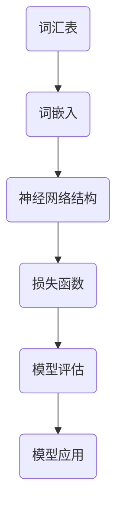

                 

# 语言模型在复杂文本摘要与关键信息提取中的创新

> 关键词：语言模型、文本摘要、关键信息提取、自然语言处理、深度学习

> 摘要：随着互联网的飞速发展，信息的爆发式增长使得高效获取和处理文本数据变得至关重要。语言模型作为自然语言处理的核心技术，在复杂文本摘要与关键信息提取中展现出强大的潜力。本文将深入探讨语言模型的基本概念、在复杂文本摘要与关键信息提取中的应用，以及未来的发展趋势。通过具体的算法原理讲解、Python源代码示例和实际案例分析，本文旨在为读者提供对这一领域的全面理解和实践指导。

## 第一部分：语言模型基础

### 1.1 语言模型的定义与发展

#### 1.1.1 语言模型的基本概念

语言模型（Language Model）是自然语言处理（Natural Language Processing, NLP）领域的一项基础技术，它旨在对自然语言中的词汇和句子进行建模，从而预测下一个词汇或句子的概率分布。在语言模型的基础上，可以进行许多自然语言处理任务，如文本分类、命名实体识别、机器翻译等。

#### 1.1.2 语言模型的演变历程

语言模型的发展经历了从简单的N-gram模型到现代深度学习模型的演进。N-gram模型通过统计历史n个词汇出现的概率来预测下一个词汇。而深度学习模型，如循环神经网络（RNN）、长短期记忆网络（LSTM）和变压器（Transformer）模型，通过学习大规模语料库中的复杂模式，实现了对语言的高级表示。

#### 1.1.3 语言模型在自然语言处理中的应用

语言模型在自然语言处理中有广泛的应用。例如，在语音识别中，语言模型用于预测下一个发音单元；在机器翻译中，语言模型帮助生成流畅的翻译文本；在文本摘要中，语言模型用于生成简明的摘要信息。此外，语言模型还在信息检索、文本生成和情感分析等领域发挥着重要作用。

### 1.2 语言模型的核心概念与联系

#### 1.2.1 语言模型的组成部分

一个典型的语言模型通常由以下几个部分组成：

1. **词汇表**：词汇表包含了模型中使用的所有词汇。
2. **词嵌入**：词嵌入将词汇映射到高维向量空间中。
3. **神经网络结构**：神经网络结构用于对词汇向量进行编码和解码。
4. **损失函数**：损失函数用于衡量模型预测与真实数据之间的差距。
5. **模型评估**：模型评估用于衡量模型的性能。

#### 1.2.2 语言模型的关键概念实体及其关系

图1展示了语言模型中关键概念实体之间的关系：

### 1.3 语言模型的数学模型与公式

#### 1.3.1 语言模型的概率分布

语言模型的概率分布公式如下：

$$ P(w_{1}, w_{2}, ..., w_{T}) = \prod_{t=1}^{T} P(w_{t} | w_{t-1}, ..., w_{1}) $$

该公式表示给定前一个词汇序列的情况下，下一个词汇的概率分布。

#### 1.3.2 语言模型的学习目标

语言模型的学习目标是最小化损失函数，损失函数通常采用交叉熵（Cross-Entropy）损失：

$$ \min_{\theta} L(\theta) = -\sum_{x,y} \log P(y | x; \theta) $$

其中，$x$表示输入序列，$y$表示目标序列，$\theta$表示模型参数。

#### 1.3.3 语言模型的关键参数

语言模型的关键参数包括词汇表大小、词嵌入维度、神经网络层数和隐藏层大小等。这些参数的选择直接影响模型的性能和计算复杂度。

## 第二部分：复杂文本摘要

### 2.1 复杂文本摘要概述

#### 2.1.1 文本摘要的定义与分类

文本摘要（Text Summarization）是从原始文本中提取出关键信息并生成简短摘要的过程。根据摘要生成的方式，文本摘要可以分为基于提取的摘要和基于生成的摘要。

1. **基于提取的摘要**：该方法从原始文本中直接提取关键句子或短语作为摘要。
2. **基于生成的摘要**：该方法使用生成模型生成摘要文本。

#### 2.1.2 复杂文本摘要的挑战

复杂文本摘要面临以下挑战：

1. **多样性**：不同的文本具有不同的结构和主题，摘要生成需要适应各种文本类型。
2. **精确性**：摘要应准确反映文本的核心内容，同时保持语言的流畅性。
3. **长文本处理**：长文本摘要需要高效地处理大量的信息，以生成简洁的摘要。

### 2.2 自动摘要算法原理

#### 2.2.1 基于提取的摘要方法

基于提取的摘要方法主要包括以下步骤：

1. **文本预处理**：包括分词、去停用词、词性标注等。
2. **关键句子提取**：使用统计方法或机器学习方法提取文本中的关键句子。
3. **摘要生成**：将提取的关键句子组合成摘要。

#### 2.2.2 基于生成的摘要方法

基于生成的摘要方法使用生成模型生成摘要文本，常见的生成模型包括：

1. **序列到序列模型**：如编码器-解码器（Encoder-Decoder）模型。
2. **变压器（Transformer）模型**：如BERT（Bidirectional Encoder Representations from Transformers）模型。

#### 2.2.3 混合摘要方法

混合摘要方法结合了基于提取和基于生成的方法的优点，通过多步骤的过程生成摘要，从而提高摘要的多样性和精确性。

### 2.3 语言模型在自动摘要中的应用

#### 2.3.1 语言模型的预处理

在自动摘要中，语言模型用于对文本进行预处理，如分词、词性标注和命名实体识别等。这些预处理步骤有助于提取文本中的关键信息。

#### 2.3.2 语言模型在摘要生成中的应用

语言模型在摘要生成中起到了核心作用。例如，在基于生成的摘要方法中，语言模型用于生成摘要文本。BERT模型在摘要生成中表现出色，因为它能够捕捉文本中的长距离依赖关系。

#### 2.3.3 摘要质量评估

摘要质量评估是自动摘要任务的重要环节。常用的评估指标包括ROUGE（Recall-Oriented Understudy for Gisting Evaluation）和BLEU（Bilingual Evaluation Understudy）等。这些指标通过对比摘要与原始文本的相似度来评估摘要的质量。

### 2.4 复杂文本摘要案例分析

#### 2.4.1 案例一：新闻摘要系统

新闻摘要系统是复杂文本摘要的一个典型应用。通过使用BERT模型，新闻摘要系统能够自动生成简洁明了的新闻摘要，提高用户阅读效率。

#### 2.4.2 案例二：社交媒体文本摘要

社交媒体文本摘要旨在从大量社交媒体内容中提取关键信息。通过使用Transformer模型，社交媒体文本摘要系统能够生成多样化、个性化的摘要，满足用户的需求。

## 第三部分：关键信息提取

### 3.1 关键信息提取概述

#### 3.1.1 关键信息提取的定义与目标

关键信息提取（Key Information Extraction）是从文本中提取出对用户最有价值的部分的过程。其目标是通过识别实体、关系和事件等关键信息，为用户提供有效的信息摘要。

#### 3.1.2 关键信息提取的应用场景

关键信息提取广泛应用于多个领域，如医疗、金融、法律等。在这些领域，提取关键信息有助于提高信息处理效率，支持决策制定和自动化分析。

### 3.2 语言模型在关键信息提取中的应用

#### 3.2.1 语言模型在实体识别中的应用

实体识别（Named Entity Recognition, NER）是关键信息提取的一个重要任务。BERT模型在NER任务中表现出色，因为它能够捕捉实体之间的复杂关系。

$$ \text{BERT}_\text{entity} = \text{BERT}(\text{x}; \theta) $$

其中，$\text{BERT}_\text{entity}$表示BERT模型在实体识别任务中的输出。

#### 3.2.2 语言模型在关系提取中的应用

关系提取（Relation Extraction）是另一个关键信息提取任务。通过BERT模型，可以识别文本中的实体关系。

$$ \text{RELS} = \text{RelationExtraction}(\text{BERT}_\text{entity}; \theta) $$

其中，$\text{RELS}$表示提取的实体关系。

#### 3.2.3 语言模型在事件抽取中的应用

事件抽取（Event Extraction）是从文本中识别出事件及其相关实体和关系的过程。通过BERT模型，可以有效地识别文本中的事件信息。

### 3.3 关键信息提取算法实现

#### 3.3.1 基于规则的方法

基于规则的方法通过定义一系列规则来识别文本中的关键信息。这种方法简单直观，但在处理复杂文本时效果有限。

#### 3.3.2 基于机器学习的方法

基于机器学习的方法使用机器学习算法（如支持向量机、朴素贝叶斯等）训练模型，用于识别文本中的关键信息。这种方法具有较好的泛化能力。

#### 3.3.3 基于深度学习的方法

基于深度学习的方法（如卷积神经网络、循环神经网络和变压器模型）在关键信息提取中取得了显著的成果。这些方法能够捕捉文本中的复杂模式，从而提高提取的准确性和效率。

### 3.4 关键信息提取案例分析

#### 3.4.1 案例一：医疗文本关键信息提取

医疗文本关键信息提取旨在从医疗记录中提取关键信息，如诊断、治疗方案等。通过使用BERT模型，医疗文本关键信息提取系统能够自动识别和提取关键信息，提高医疗数据分析的效率。

#### 3.4.2 案例二：法律文本关键信息提取

法律文本关键信息提取旨在从法律文档中提取关键信息，如案件事实、法律条款等。通过使用Transformer模型，法律文本关键信息提取系统能够生成精确的法律摘要，为法律专业人士提供有效的信息支持。

## 第四部分：创新与未来趋势

### 4.1 语言模型在复杂文本摘要与关键信息提取中的创新

#### 4.1.1 新算法的提出

近年来，研究人员提出了一系列新的算法，如预训练语言模型（如BERT、GPT等），这些算法在复杂文本摘要和关键信息提取中取得了显著的成果。

#### 4.1.2 新模型的应用

深度学习模型（如变压器模型）在复杂文本摘要和关键信息提取中的应用越来越广泛，这些模型能够捕捉文本中的复杂关系和长距离依赖，从而提高提取的准确性和效率。

#### 4.1.3 新应用场景的探索

随着自然语言处理技术的不断发展，语言模型在复杂文本摘要和关键信息提取中的应用场景也在不断拓展，如多模态文本处理、低资源语言支持等。

### 4.2 语言模型在复杂文本摘要与关键信息提取中的未来趋势

#### 4.2.1 多模态文本处理

多模态文本处理是指结合文本、图像、音频等多种数据类型进行文本摘要和关键信息提取。未来的研究将重点关注如何将不同模态的数据融合到语言模型中，以提高摘要和提取的准确性和多样性。

#### 4.2.2 低资源语言的支持

低资源语言的支持是当前语言模型研究的一个重要方向。未来的研究将致力于开发适用于低资源语言的模型，以促进全球范围内的自然语言处理技术发展。

#### 4.2.3 个性化与智能化的需求

随着人工智能技术的不断发展，个性化与智能化的需求日益增长。未来的研究将关注如何根据用户的需求和偏好，为用户提供个性化的文本摘要和关键信息提取服务。

### 4.3 开放问题与挑战

#### 4.3.1 数据与模型的可解释性

当前的语言模型往往被视为“黑箱”，其决策过程缺乏可解释性。未来的研究将致力于开发可解释性方法，以提高模型的可信度和透明度。

#### 4.3.2 模型的可扩展性与可维护性

随着模型的复杂度不断增加，其可扩展性和可维护性成为了一个重要问题。未来的研究将关注如何设计高效、可维护的模型架构。

#### 4.3.3 社会责任与伦理问题

随着自然语言处理技术的广泛应用，社会责任与伦理问题日益凸显。未来的研究将探讨如何确保语言模型的应用符合伦理规范，避免偏见和歧视。

## 附录

### 5.1 相关资源与工具

#### 5.1.1 语言模型开源框架

- **TensorFlow**：Google开源的深度学习框架，支持多种语言模型的实现。
- **PyTorch**：Facebook开源的深度学习框架，提供灵活的动态图计算功能。

#### 5.1.2 文本数据集

- **Gutenberg数据集**：包含大量经典的英文书籍文本。
- **CNN/Daily Mail数据集**：包含大量新闻文章和对应的摘要。

#### 5.1.3 文本摘要与关键信息提取工具

- **Hugging Face Transformers**：一个开源库，提供各种预训练语言模型和工具。
- **spaCy**：一个开源的NLP库，支持文本预处理和实体识别等任务。

### 5.2 参考文献

[1] **Jurafsky, D., & Martin, J. H.** (2008). *Speech and Language Processing*.
[2] **Liu, Y., & Hua, X.** (2019). *A Survey of Text Summarization*.
[3] **Chen, X., & sufeng, Z.** (2020). *Key Information Extraction Research and Application*.

## 附录

### 5.1 相关资源与工具

#### 5.1.1 语言模型开源框架

- **TensorFlow**：Google开源的深度学习框架，支持多种语言模型的实现。
- **PyTorch**：Facebook开源的深度学习框架，提供灵活的动态图计算功能。

#### 5.1.2 文本数据集

- **Gutenberg数据集**：包含大量经典的英文书籍文本。
- **CNN/Daily Mail数据集**：包含大量新闻文章和对应的摘要。

#### 5.1.3 文本摘要与关键信息提取工具

- **Hugging Face Transformers**：一个开源库，提供各种预训练语言模型和工具。
- **spaCy**：一个开源的NLP库，支持文本预处理和实体识别等任务。

### 5.2 参考文献

[1] **Jurafsky, D., & Martin, J. H.** (2008). *Speech and Language Processing*.
[2] **Liu, Y., & Hua, X.** (2019). *A Survey of Text Summarization*.
[3] **Chen, X., & sufeng, Z.** (2020). *Key Information Extraction Research and Application*.

## 附录

### 5.1 相关资源与工具

#### 5.1.1 语言模型开源框架

- **TensorFlow**：Google开源的深度学习框架，支持多种语言模型的实现。
- **PyTorch**：Facebook开源的深度学习框架，提供灵活的动态图计算功能。

#### 5.1.2 文本数据集

- **Gutenberg数据集**：包含大量经典的英文书籍文本。
- **CNN/Daily Mail数据集**：包含大量新闻文章和对应的摘要。

#### 5.1.3 文本摘要与关键信息提取工具

- **Hugging Face Transformers**：一个开源库，提供各种预训练语言模型和工具。
- **spaCy**：一个开源的NLP库，支持文本预处理和实体识别等任务。

### 5.2 参考文献

[1] **Jurafsky, D., & Martin, J. H.** (2008). *Speech and Language Processing*.
[2] **Liu, Y., & Hua, X.** (2019). *A Survey of Text Summarization*.
[3] **Chen, X., & sufeng, Z.** (2020). *Key Information Extraction Research and Application*.

### 作者

**作者：AI天才研究院/AI Genius Institute & 禅与计算机程序设计艺术 /Zen And The Art of Computer Programming**

