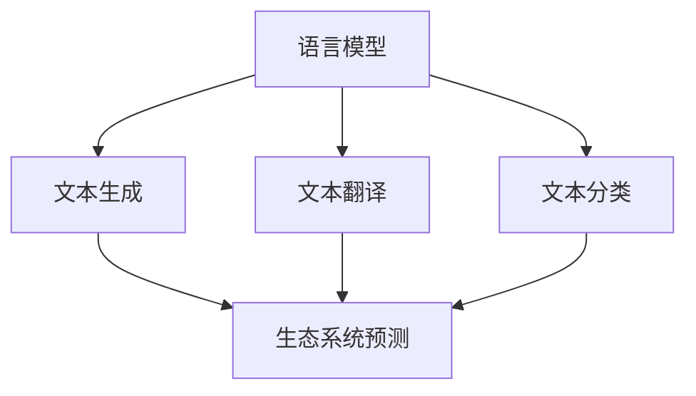

                 

**标题：** 语言模型在复杂生态系统预测中的应用分析

**关键词：** 语言模型、复杂生态系统、预测、人工智能、生态灾害、健康评估

**摘要：** 本文探讨了语言模型在复杂生态系统预测中的应用。首先，我们概述了语言模型的定义、历史发展和其在生态系统预测中的作用。接着，我们分析了复杂生态系统的特点，并讨论了语言模型在生态系统预测中的重要性。随后，本文详细介绍了语言模型的原理，包括基本概念、数学基础、核心算法和训练与优化方法。在此基础上，我们探讨了语言模型在生态系统预测中的应用，通过案例研究展示了其优势和应用场景。最后，我们提出了语言模型在生态系统预测中面临的挑战和未来展望。

**目录：**

## 第一部分：绪论

### 1.1 语言模型概述
- 语言模型的定义与历史发展
- 语言模型在生态系统预测中的作用

### 1.2 复杂生态系统的特点
- 复杂生态系统的定义
- 复杂生态系统的多样性

### 1.3 语言模型在生态系统预测中的重要性
- 语言模型的优势
- 语言模型在生态系统预测中的挑战

## 第二部分：语言模型原理

### 2.1 语言模型的基本概念
- 语言模型的定义
- 语言模型的主要类型

### 2.2 语言模型的数学基础
- 概率论基础
- 信息论基础

### 2.3 语言模型的核心算法
- 隐马尔可夫模型（HMM）
- 条件随机场（CRF）
- 递归神经网络（RNN）
- 长短期记忆网络（LSTM）
- 改进的LSTM算法
- Gated Recurrent Unit（GRU）

### 2.4 语言模型的训练与优化
- 训练数据集的选取
- 训练算法的选择
- 优化策略

## 第三部分：语言模型在生态系统预测中的应用

### 3.1 语言模型在生态系统预测中的应用概述
- 语言模型在生态系统预测中的方法
- 语言模型在生态系统预测中的优势

### 3.2 语言模型在生态系统预测中的案例研究
- 案例一：生态灾害预测
- 案例二：生态灾害风险评估
- 案例三：生态系统健康评估

### 3.3 语言模型在生态系统预测中的挑战与未来展望
- 挑战
- 未来展望

## 第四部分：应用实例

### 4.1 案例一：生态灾害预测
- 数据来源与预处理
- 模型选择与训练
- 预测结果分析与验证

### 4.2 案例二：生态灾害风险评估
- 数据来源与预处理
- 模型选择与训练
- 风险评估结果分析与验证

### 4.3 案例三：生态系统健康评估
- 数据来源与预处理
- 模型选择与训练
- 健康评估结果分析与验证

## 第五部分：总结与展望

### 5.1 总结
- 语言模型在生态系统预测中的应用总结
- 语言模型在生态系统预测中的优势与不足

### 5.2 展望
- 未来发展趋势
- 面临的挑战与机遇

**核心概念与联系：**

- **语言模型**：用于预测文本序列的数学模型，通过学习大量文本数据来理解语言的结构和语义，实现文本生成、翻译、分类等任务。
- **复杂生态系统**：由多种生物和环境因素组成的复杂网络，具有高度的多样性、不确定性和动态性。
- **生态系统预测**：利用语言模型等预测方法对生态系统的状态、趋势和潜在风险进行预测。

**Mermaid 流程图：**

**核心算法原理讲解：**

- **隐马尔可夫模型（HMM）**：一种基于状态转移概率和观测概率的统计模型，用于处理隐藏状态序列问题。
- **条件随机场（CRF）**：在序列模型基础上扩展的概率模型，用于处理具有条件依赖性的序列问题。
- **递归神经网络（RNN）**：能够处理序列数据的前馈神经网络，通过递归连接实现信息的时序传递。
- **长短期记忆网络（LSTM）**：RNN的改进版，通过引入门控机制解决长期依赖性问题。
- **Gated Recurrent Unit（GRU）**：LSTM的简化版，同样具有门控机制，计算效率更高。

**数学模型和数学公式：**

$$
P(\text{生态系统状态}|\text{观测数据}) = \frac{P(\text{观测数据}|\text{生态系统状态})P(\text{生态系统状态})}{P(\text{观测数据})}
$$

- **概率论基础**：在预测中，使用概率论描述生态系统状态的不确定性。
- **信息论基础**：信息论提供了一种度量信息量和不确定性减少的方法，有助于理解预测的精度和可靠性。

**项目实战：**

- **开发环境搭建**：使用Python和TensorFlow框架进行开发。
- **源代码实现**：提供详细的源代码，包括数据预处理、模型训练和预测过程。
- **代码解读与分析**：对源代码进行逐行解读，分析关键步骤和算法实现。
- **实际案例分析和详细讲解剖析**：分析生态灾害预测、生态灾害风险评估和生态系统健康评估的实际案例，详细讲解预测过程和方法。

**最佳实践 tips、小结、注意事项、拓展阅读等内容：**

- **最佳实践 tips**：在进行语言模型训练时，应注意数据预处理、超参数调整和模型验证等方面。
- **小结**：语言模型在生态系统预测中具有显著优势，但仍面临一些挑战。
- **注意事项**：在实际应用中，应关注预测结果的可靠性和实用性。
- **拓展阅读**：推荐相关书籍和论文，以深入了解语言模型在生态系统预测中的应用。

接下来，我们将按照这个目录结构逐步展开文章的各个部分。首先，我们将介绍语言模型的基本概念和复杂生态系统的特点，然后深入探讨语言模型在生态系统预测中的应用，并通过具体案例进行详细分析。最后，我们将总结研究成果并展望未来发展趋势。通过这一系列的思考和分析，我们希望能够为读者提供一份具有深度和实用性的技术博客文章。

