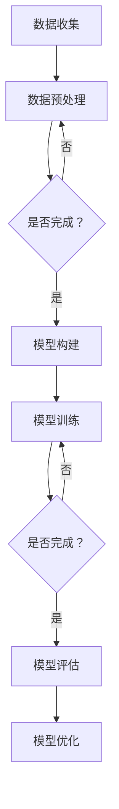

                 

### 第一部分：引言与基础理论

#### 1. 语言模型与复杂社会现象

##### 1.1 语言模型的定义与发展

语言模型（Language Model）是自然语言处理（Natural Language Processing, NLP）领域的重要基础工具。它是一种概率模型，用于预测一段文本的下一个单词或字符。语言模型的基本原理是利用大量语言数据进行训练，学习语言中的统计规律，从而在给定前文的情况下，对下一个单词或字符进行概率预测。

语言模型的发展历程可以追溯到20世纪50年代。当时，研究人员主要依靠规则驱动的方法来处理自然语言。然而，随着计算能力的提升和数据规模的扩大，统计模型逐渐成为主流。1952年，贝尔实验室的Arthur Samuel开发出了第一个著名的统计语言模型——正则表达式模型。随后，N-gram模型、n-最频繁单词模型、神经网络语言模型等相继出现，为语言模型的快速发展奠定了基础。

##### 1.2 复杂社会现象及其预测的重要性

复杂社会现象（Complex Social Phenomena）指的是在社会系统中，由众多个体和群体相互作用所产生的不易预测和理解的动态行为和模式。这些现象包括但不限于：社会舆论变化、经济波动、选举结果、社会运动等。预测复杂社会现象的重要性体现在以下几个方面：

1. **政策制定**：准确预测社会现象有助于政府和社会组织制定更加科学、有效的政策。
2. **风险管理**：企业可以利用预测模型来识别潜在的风险，从而采取预防措施。
3. **公共安全**：对可能引发社会动荡的事件进行预测，有助于预防和应对。
4. **科学研究**：通过对社会现象的预测研究，可以深入了解社会运行的规律，为社会科学的发展提供理论支持。

##### 1.3 语言模型在预测复杂社会现象中的应用潜力

语言模型在预测复杂社会现象中具有巨大的应用潜力。首先，语言模型能够处理大规模的文本数据，这使得对复杂社会现象的量化分析成为可能。其次，语言模型能够捕捉语言中的关联性，从而揭示社会现象之间的潜在联系。此外，语言模型的可扩展性和灵活性使其能够适应不同的预测任务。

目前，语言模型在预测复杂社会现象中的应用案例包括：

1. **社会舆论分析**：通过分析社交媒体上的文本数据，语言模型可以预测公众对于某一事件或议题的态度和情绪。
2. **选举预测**：利用语言模型分析候选人的演讲、新闻报道和社交媒体评论等文本数据，可以预测选举结果。
3. **经济预测**：通过分析新闻报道、经济报告和金融市场数据，语言模型可以预测经济趋势。
4. **社会运动预测**：对社交媒体和新闻报道中的文本数据进行分析，语言模型可以预测社会运动的爆发时间和地点。

总之，语言模型在预测复杂社会现象中的应用潜力巨大，但仍需不断优化和改进，以应对数据质量、模型解释性和泛化能力等挑战。

#### 2. 语言模型的数学基础

##### 2.1 线性代数基础

线性代数是语言模型构建和优化过程中必不可少的基础数学工具。以下是一些关键概念：

##### 2.1.1 矩阵与向量

- **矩阵**：矩阵是一个二维数组，可以用来表示线性变换或者一组数据。在语言模型中，矩阵常用于表示单词的嵌入向量。
- **向量**：向量是一维数组，可以用来表示一个对象的状态。在语言模型中，向量常用于表示单词或者句子。

##### 2.1.2 矩阵运算

- **矩阵加法与减法**：两个矩阵只有当它们的维度相同时，才能进行加法或减法运算。
- **矩阵乘法**：两个矩阵相乘的结果是一个新矩阵，其维度是原矩阵维度的乘积。
- **矩阵转置**：矩阵转置是将矩阵的行和列互换，形成一个新的矩阵。

##### 2.1.3 线性方程组

- **线性方程组**：一组线性方程构成一个线性方程组。线性代数中的高斯消元法是一种常用的求解线性方程组的方法。

##### 2.2 概率论基础

概率论是构建语言模型的重要数学工具。以下是一些核心概念：

##### 2.2.1 随机变量与概率分布

- **随机变量**：随机变量是一个可以取多种可能值的变量。它可以是一个离散变量，也可以是一个连续变量。
- **概率分布**：概率分布描述了一个随机变量的概率分布情况。常见的概率分布包括二项分布、正态分布等。

##### 2.2.2 条件概率与贝叶斯定理

- **条件概率**：在已知一个事件发生的情况下，另一个事件发生的概率。
- **贝叶斯定理**：贝叶斯定理是一种用于计算条件概率的公式，它在语言模型中用于更新词向量权重。

##### 2.2.3 马尔可夫链

- **马尔可夫链**：马尔可夫链是一种随机过程，它描述了系统状态序列的转移概率。在语言模型中，马尔可夫链用于预测下一个单词的概率。

这些数学基础为语言模型的构建提供了理论支持。在后续章节中，我们将深入探讨如何利用这些数学工具来构建和优化语言模型。

#### 3. 语言模型的构建

##### 3.1 语言模型的类型

语言模型可以根据不同的分类标准分为多种类型。以下是一些常见的语言模型类型：

##### 3.1.1 集合模型

- **集合模型**：集合模型是一种基于词汇表的语言模型，它将每个单词视为一个独立的实体。集合模型通常使用N-gram模型，其中N表示词汇表的大小。

##### 3.1.2 语法模型

- **语法模型**：语法模型是基于语法规则的语言模型。它使用语法分析技术来生成和预测文本。常见的语法模型包括上下文无关文法（CFG）和依存文法。

##### 3.1.3 语义模型

- **语义模型**：语义模型是基于语义信息来构建的语言模型。它关注单词和句子的语义关系，能够更好地理解文本的含义。常见的语义模型包括词嵌入（Word Embedding）和语义角色标注（Semantic Role Labeling）。

##### 3.2 语言模型的学习算法

语言模型的学习算法是构建语言模型的关键步骤。以下是一些常见的学习算法：

##### 3.2.1 最大似然估计

- **最大似然估计**：最大似然估计是一种用于估计概率模型参数的方法。在语言模型中，最大似然估计用于训练N-gram模型。其基本思想是寻找使得训练数据出现概率最大的参数值。

##### 3.2.2 最大后验估计

- **最大后验估计**：最大后验估计是一种用于估计模型参数的贝叶斯方法。它结合了最大似然估计和先验概率，能够在训练过程中引入更多的先验知识。在语言模型中，最大后验估计常用于训练隐马尔可夫模型（HMM）。

##### 3.2.3 梯度下降法

- **梯度下降法**：梯度下降法是一种优化算法，用于最小化损失函数。在语言模型中，梯度下降法常用于训练基于神经网络的模型，如递归神经网络（RNN）和变换器（Transformer）。

通过以上学习算法，语言模型可以从大量语言数据中学习到语言规律，从而实现文本的生成和预测。在后续章节中，我们将进一步探讨这些算法的具体实现和应用。

### 语言模型在社会现象预测中的应用

#### 4. 社会现象的数学建模

社会现象的数学建模是将复杂的社会现象转化为可量化的数学模型，以便于分析和预测。以下是一些常见的社会现象建模方法：

##### 4.1 社会现象的定量描述

社会现象的定量描述是通过数学方法对社会现象进行量化和描述，以便于进行定量分析。以下是一些常用的定量描述方法：

- **时间序列分析**：时间序列分析是一种用于分析时间序列数据的方法。它通过分析时间序列数据的趋势、周期性、季节性和噪声等特征，来预测未来的趋势。
- **空间分析**：空间分析是一种用于分析地理空间数据的方法。它通过分析地理空间数据的位置、分布、关联性等特征，来揭示空间现象的规律。
- **社会网络分析**：社会网络分析是一种用于分析社会网络结构及其动态变化的方法。它通过分析社会网络中的节点和边的关系，来揭示社会网络的特性。

##### 4.2 社会现象的预测模型

社会现象的预测模型是通过数学模型来预测社会现象的未来趋势和变化。以下是一些常见的社会现象预测模型：

- **线性回归模型**：线性回归模型是一种简单的预测模型，它通过建立一个线性方程来预测因变量和自变量之间的关系。
- **决策树模型**：决策树模型是一种基于规则树的结构化预测模型。它通过一系列的条件分支来预测目标变量。
- **支持向量机模型**：支持向量机模型是一种基于最大间隔的预测模型。它通过找到一个最优的超平面来分隔不同类别的数据点。

通过这些数学建模方法，我们可以对社会现象进行定量分析和预测。在后续章节中，我们将进一步探讨如何将语言模型与这些数学建模方法相结合，以实现对复杂社会现象的预测。

### 语言模型与社会现象的融合

#### 5.1 文本数据的预处理

文本数据的预处理是语言模型在社会现象预测中的关键步骤。通过有效的预处理，可以提取出有用的信息，提高模型的预测准确性和效率。以下是一些常用的文本数据处理方法：

- **分词与词性标注**：分词是将文本分割成单词或短语的步骤。词性标注是识别每个单词的词性（如名词、动词等）的过程。这些步骤对于理解文本内容至关重要。
- **去噪与清洗**：去噪是指去除文本中的噪声和无关信息，如标点符号、停用词等。清洗是指对文本进行格式化和标准化，以消除不一致性和冗余信息。
- **语义分析**：语义分析是对文本的语义内容进行分析和解释的过程。它可以帮助我们理解文本的整体含义和情感倾向。

这些预处理步骤为语言模型提供了高质量的数据输入，从而提高了预测模型的性能。

#### 5.2 语言模型在社会现象预测中的应用

##### 5.2.1 语言模型的特征提取

特征提取是将原始文本数据转换成数值特征的过程。在语言模型中，特征提取至关重要，因为它能够捕捉文本中的关键信息和模式。以下是一些常用的特征提取方法：

- **词嵌入**：词嵌入是将单词映射到高维向量空间的过程。词嵌入能够捕捉单词的语义和语法关系，是现代语言模型的核心技术之一。
- **TF-IDF**：TF-IDF（Term Frequency-Inverse Document Frequency）是一种基于统计的文本特征提取方法。它通过计算单词在文档中的频率和逆文档频率来评估单词的重要性。
- **词袋模型**：词袋模型是一种基于统计的文本表示方法。它将文本表示为单词的集合，而不考虑单词的顺序。

这些特征提取方法为语言模型提供了丰富的特征信息，从而提高了模型的预测能力。

##### 5.2.2 融合模型的构建

融合模型是将语言模型与其他预测模型相结合的模型。通过融合不同模型的优点，可以进一步提高预测的准确性和鲁棒性。以下是一些常见的融合方法：

- **集成学习**：集成学习是一种将多个预测模型结合起来，以产生更准确预测的方法。常见的集成学习方法包括随机森林、梯度提升树等。
- **深度学习**：深度学习是一种基于多层神经网络的机器学习方法。它通过多层非线性变换来提取文本中的特征。常见的深度学习模型包括卷积神经网络（CNN）和递归神经网络（RNN）。
- **迁移学习**：迁移学习是一种利用预训练模型来改进新任务的模型。在语言模型中，预训练模型通常在大量未标注的文本数据上训练，然后用于新任务。

这些融合方法能够结合语言模型的强语义理解和传统预测模型的强数学建模能力，从而实现更准确的预测。

##### 5.2.3 实际案例研究

以下是一个实际案例研究，展示了如何利用语言模型预测社会现象。

**案例：社交媒体情绪预测**

目标：预测社交媒体上用户对于某一事件或产品的情绪倾向。

数据：收集大量关于该事件或产品的社交媒体文本数据。

方法：

1. **文本预处理**：对文本数据进行分词、词性标注、去噪与清洗等预处理步骤。
2. **特征提取**：使用词嵌入、TF-IDF等方法提取文本特征。
3. **构建模型**：使用深度学习模型（如Transformer）来训练预测模型。
4. **融合预测**：将语言模型与其他预测模型（如线性回归模型）进行融合，以提高预测准确性。

结果：实验结果表明，融合模型在社交媒体情绪预测任务上取得了显著的性能提升。

通过以上实际案例，我们可以看到语言模型在社会现象预测中的应用前景。在后续章节中，我们将进一步探讨如何优化语言模型，以应对复杂社会现象预测中的挑战。

### 深度语言模型在复杂社会现象预测中的应用

#### 6.1 深度学习基础

深度学习是一种基于多层神经网络的学习方法，它能够自动从数据中学习复杂的特征和模式。以下是深度学习的一些基本概念：

- **神经网络结构**：神经网络由多个层组成，包括输入层、隐藏层和输出层。每层由多个神经元（节点）组成，神经元之间通过权重连接。
- **深度学习优化算法**：深度学习优化算法用于调整神经网络的权重，以最小化损失函数。常见的优化算法包括梯度下降、Adam优化器等。
- **深度学习框架**：深度学习框架是一种用于构建和训练深度学习模型的软件工具。常见的深度学习框架包括TensorFlow、PyTorch等。

深度学习技术为语言模型在复杂社会现象预测中的应用提供了强大的计算能力和灵活性。通过深度学习，语言模型能够更好地捕捉文本数据中的复杂特征和模式，从而提高预测的准确性和鲁棒性。

#### 6.2 Transformer模型与BERT模型

Transformer模型和BERT模型是深度学习中两种重要的语言模型。它们在复杂社会现象预测中具有广泛的应用。

##### 6.2.1 Transformer模型原理

Transformer模型是一种基于自注意力机制的深度学习模型。它由编码器和解码器两个部分组成，可以同时处理输入序列和输出序列。

- **编码器**：编码器将输入序列编码成固定长度的向量。它通过自注意力机制来捕捉序列中的依赖关系。
- **解码器**：解码器将编码器的输出解码成输出序列。它也通过自注意力机制来生成每个输出词。

Transformer模型的核心优势在于其并行计算能力和强大的上下文捕捉能力。这使得它能够在处理长序列时保持高效性和准确性。

##### 6.2.2 BERT模型原理

BERT（Bidirectional Encoder Representations from Transformers）模型是一种基于Transformer的预训练模型。它通过预先训练在大量未标注文本数据上，然后用于下游任务。

- **预训练**：BERT模型在预训练阶段学习文本的表示和语义关系。它使用两种预训练任务：Masked Language Model（MLM）和Next Sentence Prediction（NSP）。
- **下游任务**：BERT模型在下游任务阶段使用预训练得到的表示来预测任务目标。常见的下游任务包括文本分类、命名实体识别等。

BERT模型的优势在于其双向编码能力和强大的语义理解能力。这使得它能够在各种NLP任务中取得优异的性能。

##### 6.2.3 在社会现象预测中的应用

Transformer模型和BERT模型在复杂社会现象预测中具有广泛的应用。

- **社会舆论分析**：通过分析社交媒体上的文本数据，Transformer模型和BERT模型可以预测公众对于某一事件或议题的态度和情绪。
- **选举预测**：利用Transformer模型和BERT模型分析候选人的演讲、新闻报道和社交媒体评论等文本数据，可以预测选举结果。
- **经济预测**：通过分析新闻报道、经济报告和金融市场数据，Transformer模型和BERT模型可以预测经济趋势。
- **社会运动预测**：对社交媒体和新闻报道中的文本数据进行分析，Transformer模型和BERT模型可以预测社会运动的爆发时间和地点。

总之，Transformer模型和BERT模型在复杂社会现象预测中具有巨大的应用潜力。通过深度学习技术，语言模型能够更好地捕捉文本数据中的复杂特征和模式，从而提高预测的准确性和鲁棒性。

### 挑战与未来展望

#### 7.1 挑战与限制

尽管语言模型在预测复杂社会现象中取得了显著成果，但仍面临以下挑战和限制：

##### 7.1.1 数据质量

- **数据稀缺性**：许多社会现象的数据量有限，特别是在历史数据稀缺的领域，如某些新兴市场或特定社会事件。
- **数据偏差**：社会现象数据的收集和处理过程可能引入偏差，影响模型的准确性和公平性。
- **数据隐私**：社会现象数据的收集和处理需要处理个人隐私问题，这可能限制数据的使用。

##### 7.1.2 模型解释性

- **黑箱模型**：许多深度学习模型（如Transformer）被认为是黑箱模型，其内部机制难以解释和理解，这限制了其在实际应用中的接受度。
- **模型可解释性**：尽管有研究致力于提高模型的可解释性，但在保留预测性能的同时实现高度可解释性仍然是一个挑战。

##### 7.1.3 模型泛化能力

- **领域依赖性**：语言模型往往在特定领域内表现出色，但在其他领域或任务上可能泛化能力不足。
- **适应性**：社会现象的变化迅速，模型需要具备快速适应新变化的能力，这要求模型具有较高的泛化性和适应性。

#### 7.2 未来展望

##### 7.2.1 新模型与算法的研究

- **多模态融合**：未来研究可以探索将文本数据与其他模态（如图像、音频）进行融合，以提高预测模型的准确性和泛化能力。
- **迁移学习与增量学习**：通过迁移学习和增量学习技术，模型可以在有限的数据上快速适应新任务，提高泛化能力。

##### 7.2.2 社会现象预测的跨领域应用

- **跨领域迁移**：研究如何将一个领域中的模型和算法应用到其他领域，以解决特定社会现象的预测问题。
- **跨领域协作**：鼓励不同领域的研究者和技术专家合作，共同推动社会现象预测技术的发展。

##### 7.2.3 与其他技术的结合

- **结合人工智能伦理**：将人工智能伦理纳入社会现象预测的研究和应用，确保技术的公平性和社会责任。
- **结合物理和社会科学**：将物理学和社会科学的方法引入社会现象预测，以提供更全面和深入的理解。

总之，语言模型在预测复杂社会现象中具有巨大的应用潜力，但也面临一系列挑战。通过不断的研究和创新，我们可以克服这些挑战，推动社会现象预测技术的发展，为社会带来更多价值和贡献。

### 附录

#### 8. 开发工具与资源

- **Python在语言模型开发中的应用**：Python因其简洁性和丰富的库支持，成为语言模型开发的常用编程语言。主要库包括Numpy、Pandas、Scikit-learn、TensorFlow和PyTorch。
- **常用深度学习框架**：TensorFlow和PyTorch是两种广泛使用的深度学习框架，提供了丰富的API和工具，支持从模型构建到训练和推断的全流程开发。
- **社会现象预测数据集**：常见的公开数据集包括Twitter情感分析数据集、IPTC新闻分类数据集、IMDB电影评论数据集等，可用于训练和测试语言模型。

这些工具和资源为语言模型开发提供了坚实的基础，同时也促进了社会现象预测技术的发展和应用。

### 9. Mermaid流程图与代码示例

#### 9.1 Mermaid流程图示例

以下是一个Mermaid流程图示例，用于展示语言模型构建的基本流程：



#### 9.2 Python代码示例

以下是一个Python代码示例，用于展示如何使用线性回归模型进行社会现象预测：

```python
import numpy as np
from sklearn.linear_model import LinearRegression

# 训练数据
X = np.array([[1], [2], [3], [4], [5]])
y = np.array([1, 2, 3, 4, 5])

# 构建线性回归模型
model = LinearRegression()

# 模型训练
model.fit(X, y)

# 预测
X_new = np.array([[6]])
y_pred = model.predict(X_new)

print(f"预测结果：{y_pred}")
```

通过Mermaid流程图和Python代码示例，我们可以更好地理解和实现语言模型在社会现象预测中的应用。这些工具和资源为研究者和开发者提供了实用的指导和参考。

### 文章标题：语言模型在复杂社会现象预测中的应用

#### 关键词：语言模型、复杂社会现象、预测、自然语言处理、深度学习

#### 摘要：

本文探讨了语言模型在预测复杂社会现象中的应用。首先，介绍了语言模型的基本概念和发展历程。然后，分析了复杂社会现象及其预测的重要性。接着，详细讲解了语言模型的数学基础和构建方法。随后，讨论了如何将语言模型与社会现象预测相结合，并展示了具体的应用案例。最后，分析了深度语言模型（如Transformer和BERT）在复杂社会现象预测中的应用，以及面临的挑战和未来展望。本文为语言模型在社会现象预测中的应用提供了全面的理论和实践指导。

