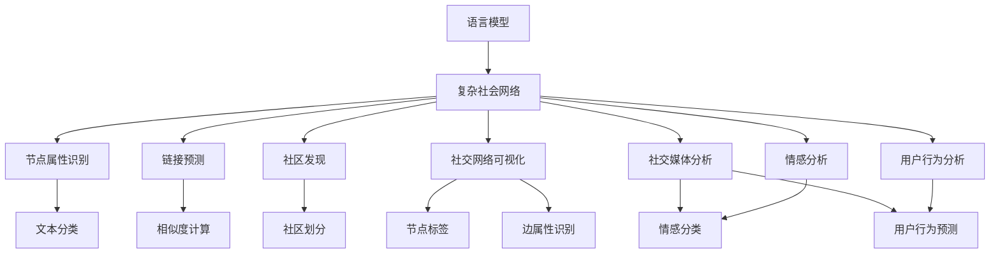

                 

# 语言模型在复杂社会网络分析中的应用

> 关键词：语言模型、复杂社会网络、节点属性识别、链接预测、社区发现、社交网络可视化、社交媒体分析、情感分析、用户行为分析

> 摘要：本文深入探讨了语言模型在复杂社会网络分析中的应用。首先介绍了语言模型的基本原理和类型，然后阐述了复杂社会网络的定义和特点。在此基础上，详细分析了语言模型在节点属性识别、链接预测、社区发现和社交网络可视化等方面的应用。此外，还介绍了语言模型在社交媒体分析、情感分析和用户行为分析中的实际应用。最后，对当前的研究前沿和未来发展方向进行了展望。

## 引言

### 1. 引言与背景

随着互联网和社交媒体的快速发展，复杂社会网络（Complex Social Networks）已成为研究热点。复杂社会网络是指由多个节点（代表个体或组织）和它们之间的关系（代表交互或合作）构成的网状结构。这些网络具有高度动态性、异质性和复杂性，使得传统的数据分析方法难以应对。

近年来，语言模型（Language Models）作为自然语言处理的核心技术，取得了显著的进展。语言模型通过学习大量文本数据，能够自动生成、理解和处理自然语言。随着深度学习技术的不断发展，语言模型在文本分类、情感分析、命名实体识别、机器翻译等领域表现出强大的能力。

将语言模型应用于复杂社会网络分析，可以有效地挖掘网络中的结构和语义信息，从而揭示网络中的隐藏规律和潜在价值。本文旨在探讨语言模型在复杂社会网络分析中的应用，旨在为相关领域的研究提供新的思路和方法。

### 2. 本书的目的与结构

本书旨在系统地介绍语言模型在复杂社会网络分析中的应用，包括基本原理、方法和技术。具体目标如下：

1. 深入理解语言模型的基本原理和类型。
2. 掌握复杂社会网络的定义和特点。
3. 掌握语言模型在复杂社会网络分析中的具体应用方法。
4. 分析当前的研究前沿和未来发展方向。

全书分为八个章节：

1. 引言：介绍复杂社会网络和语言模型的基本概念。
2. 语言模型概述：介绍语言模型的定义、发展历程、基本原理和类型。
3. 复杂社会网络的定义与特点：阐述复杂社会网络的定义、特点和建模方法。
4. 语言模型在复杂社会网络分析中的应用：详细介绍语言模型在节点属性识别、链接预测、社区发现和社交网络可视化中的应用。
5. 语言模型在社交媒体分析中的应用：探讨语言模型在社交媒体分析、情感分析和用户行为分析中的应用。
6. 基于语言模型的复杂社会网络分析的前沿研究：分析当前的研究前沿和未来发展方向。
7. 案例分析：通过实际案例展示语言模型在复杂社会网络分析中的应用。
8. 结论：总结全书的主要内容，展望未来发展方向。

## 第1章：语言模型概述

### 1.1 语言模型的定义与作用

语言模型（Language Model）是自然语言处理领域的一种核心技术，用于生成、理解和处理自然语言。它是一种概率模型，用于预测给定前文序列后下一个单词或句子的概率。

语言模型在自然语言处理中具有重要作用，主要包括以下几个方面：

1. 文本生成：语言模型能够根据给定的前文序列，生成符合语法和语义规则的文本。
2. 语音识别：语言模型可以帮助语音识别系统提高识别准确率，通过预测可能的单词或句子，从而减少识别错误。
3. 机器翻译：语言模型在机器翻译中起到关键作用，通过预测源语言和目标语言之间的转换概率，实现高质量翻译。
4. 情感分析：语言模型可以帮助识别文本中的情感倾向，用于舆情分析、情感监测等场景。
5. 命名实体识别：语言模型可以帮助识别文本中的命名实体，如人名、地名、组织名等。

### 1.2 语言模型的发展历程

语言模型的发展历程可以追溯到20世纪50年代。早期的研究主要集中在基于规则的模型，如词汇表模型和句法模型。这些模型主要通过人工定义规则，实现文本生成和理解。然而，这些方法存在许多局限性，如规则定义繁琐、适应能力差等。

随着计算机科学和人工智能技术的发展，20世纪80年代，统计语言模型逐渐兴起。统计语言模型基于大规模语料库，利用统计方法建立语言模型。其中，N元语法（N-gram）是最常用的统计语言模型。N元语法通过计算前N个单词的概率，预测下一个单词。

20世纪90年代，基于神经网络的深度学习模型开始应用于自然语言处理。深度学习模型具有强大的非线性表示能力，能够自动学习语言特征。其中，循环神经网络（RNN）和其变体（如LSTM和GRU）在语言模型中取得了显著成果。这些模型通过捕获上下文信息，提高了语言模型的预测能力。

近年来，基于注意力机制的Transformer模型取得了突破性进展。Transformer模型采用自注意力机制，能够全局捕获文本信息，实现了更高的语言建模效果。BERT、GPT和Turing等大规模预训练模型进一步推动了语言模型的发展，使得语言模型在许多自然语言处理任务中取得了优异的性能。

### 1.3 语言模型的基本原理

语言模型的基本原理是通过对大量文本数据进行统计和学习，建立单词之间的概率关系。以下是几种常见的语言模型原理：

1. **N元语法（N-gram）**：N元语法是一种基于有限上下文的统计语言模型。它通过计算前N个单词的概率，预测下一个单词。N元语法的基本原理可以表示为：
   $$
   P(w_n | w_{n-1}, w_{n-2}, ..., w_1) = \frac{C(w_1, w_2, ..., w_n)}{C(w_1, w_2, ..., w_{n-1})}
   $$
   其中，\(w_n\) 表示下一个单词，\(w_{n-1}, w_{n-2}, ..., w_1\) 表示前N-1个单词，\(C(w_1, w_2, ..., w_n)\) 表示单词序列 \(w_1, w_2, ..., w_n\) 的出现次数，\(C(w_1, w_2, ..., w_{n-1})\) 表示单词序列 \(w_1, w_2, ..., w_{n-1}\) 的出现次数。

2. **循环神经网络（RNN）**：循环神经网络是一种基于序列数据的深度学习模型，能够处理时序信息和依赖关系。RNN的基本原理可以表示为：
   $$
   h_t = \sigma(W_h h_{t-1} + W_x x_t + b_h)
   $$
   其中，\(h_t\) 表示第t个时刻的隐藏状态，\(x_t\) 表示第t个时刻的输入，\(W_h\) 和 \(W_x\) 分别表示隐藏状态和输入的权重矩阵，\(b_h\) 表示隐藏状态的偏置，\(\sigma\) 表示非线性激活函数。

3. **Transformer模型**：Transformer模型是一种基于自注意力机制的深度学习模型，能够全局捕获文本信息。Transformer模型的基本原理可以表示为：
   $$
   \text{Attention}(Q, K, V) = \frac{QK^T}{\sqrt{d_k}} V
   $$
   其中，\(Q, K, V\) 分别表示查询向量、键向量和值向量，\(d_k\) 表示键向量的维度。

### 1.4 语言模型的类型

根据学习方式和应用场景，语言模型可以分为以下几类：

1. **基于规则的语言模型**：这类语言模型通过人工定义语法和语义规则，生成和预测文本。例如，词汇表模型和句法模型。

2. **基于统计的语言模型**：这类语言模型通过统计方法学习单词之间的概率关系，生成和预测文本。例如，N元语法。

3. **基于神经网络的深度学习模型**：这类语言模型采用深度学习技术，自动学习语言特征和依赖关系，生成和预测文本。例如，循环神经网络（RNN）、Transformer模型等。

4. **预训练语言模型**：这类语言模型在大规模语料库上进行预训练，然后通过微调应用于特定任务。例如，BERT、GPT、Turing等。

## 第2章：复杂社会网络的定义与特点

### 2.1 复杂社会网络的定义

复杂社会网络（Complex Social Networks）是指由多个节点（代表个体或组织）和它们之间的关系（代表交互或合作）构成的网状结构。这些网络具有高度动态性、异质性和复杂性，是现实世界中各种社会、经济、技术等领域的重要组成部分。

复杂社会网络可以理解为一种网络结构，其中每个节点表示一个个体或组织，节点之间的关系表示个体或组织之间的交互或合作。这些关系可以是直接关系（如朋友、同事等）或间接关系（如共同参与活动、共同关注话题等）。

复杂社会网络与传统的简单网络（如树状结构、环状结构等）相比，具有以下特点：

1. 高度动态性：复杂社会网络中的节点和关系随时间不断变化，表现出高度动态性。
2. 异质性：复杂社会网络中的节点具有不同的类型和属性，关系也存在多样性。
3. 复杂性：复杂社会网络具有复杂的结构和拓扑特性，难以用简单的数学模型描述。
4. 自组织性：复杂社会网络中的节点和关系通过相互作用，可以自发形成复杂的结构和模式。

### 2.2 复杂社会网络的特点

复杂社会网络具有以下特点：

1. **高度动态性**：复杂社会网络中的节点和关系随时间不断变化，表现出高度动态性。例如，个体在不同时间加入或退出社交网络，个体之间的关系也会发生改变。

2. **异质性**：复杂社会网络中的节点具有不同的类型和属性，关系也存在多样性。例如，在社交网络中，节点可以是个人、组织或设备，关系可以是朋友、同事或合作伙伴。

3. **复杂性**：复杂社会网络具有复杂的结构和拓扑特性，难以用简单的数学模型描述。例如，社交网络中可能存在大量的小团体和社区，节点之间的关系也可能形成复杂的网络结构。

4. **自组织性**：复杂社会网络中的节点和关系通过相互作用，可以自发形成复杂的结构和模式。例如，在社交网络中，个体通过共同兴趣或目标自发形成社区，社区之间的交互也可能形成新的网络结构。

### 2.3 复杂社会网络的建模方法

复杂社会网络的建模方法主要包括以下几种：

1. **图论模型**：图论模型是一种常用的建模方法，通过图结构描述复杂社会网络的节点和关系。图中的节点表示个体或组织，边表示节点之间的关系。图论模型可以用于分析复杂社会网络的基本特性，如度分布、聚类系数等。

2. **网络科学模型**：网络科学模型是基于图论模型的扩展，通过引入更多的网络属性和变量，描述复杂社会网络的动态行为。网络科学模型可以用于分析复杂社会网络的演化过程、信息传播等。

3. **机器学习模型**：机器学习模型可以用于复杂社会网络的节点分类、关系预测、社区发现等任务。常见的机器学习模型包括监督学习模型（如支持向量机、决策树等）和无监督学习模型（如聚类算法、图嵌入等）。

4. **深度学习模型**：深度学习模型可以用于复杂社会网络的深度特征提取和结构分析。常见的深度学习模型包括卷积神经网络（CNN）、循环神经网络（RNN）和Transformer等。

## 第3章：语言模型在复杂社会网络分析中的应用

### 3.1 语言模型在节点属性识别中的应用

在复杂社会网络中，节点属性识别是关键任务之一。语言模型通过学习大量文本数据，能够提取节点文本中的特征，从而实现节点属性的识别。

#### 3.1.1 基于语言模型的节点分类

基于语言模型的节点分类方法主要包括以下步骤：

1. **文本预处理**：对节点文本进行分词、去除停用词等预处理操作，得到干净、有效的文本数据。

2. **特征提取**：利用语言模型，如词袋模型（Bag-of-Words，BoW）或词嵌入模型（Word Embedding），提取节点文本中的特征。词袋模型将文本表示为词汇的集合，而词嵌入模型将文本表示为高维向量。

3. **模型训练**：使用分类算法（如朴素贝叶斯、支持向量机等），训练语言模型和分类模型。

4. **节点分类**：将训练好的分类模型应用于未知的节点文本，预测节点的属性类别。

以下是一个简单的Python代码示例，展示如何使用朴素贝叶斯分类器进行节点分类：

```python
from sklearn.feature_extraction.text import TfidfVectorizer
from sklearn.model_selection import train_test_split
from sklearn.naive_bayes import MultinomialNB
from sklearn.metrics import accuracy_score

# 假设已有数据集X和标签y
# X为节点文本数据，y为节点分类标签

# 数据预处理
vectorizer = TfidfVectorizer()
X_vectorized = vectorizer.fit_transform(X)

# 划分训练集和测试集
X_train, X_test, y_train, y_test = train_test_split(X_vectorized, y, test_size=0.2, random_state=42)

# 使用朴素贝叶斯分类器进行训练
classifier = MultinomialNB()
classifier.fit(X_train, y_train)

# 测试集上的预测
predictions = classifier.predict(X_test)

# 评估预测效果
accuracy = accuracy_score(y_test, predictions)
print("Accuracy:", accuracy)
```

#### 3.1.2 基于语言模型的节点角色识别

节点角色识别是复杂社会网络分析中的重要任务。语言模型通过分析节点文本，能够识别节点在社交网络中的角色。

1. **文本预处理**：对节点文本进行分词、去除停用词等预处理操作，得到干净、有效的文本数据。

2. **特征提取**：利用语言模型，如词袋模型（Bag-of-Words，BoW）或词嵌入模型（Word Embedding），提取节点文本中的特征。

3. **模型训练**：使用分类算法（如朴素贝叶斯、支持向量机等），训练语言模型和分类模型。

4. **节点角色识别**：将训练好的分类模型应用于未知的节点文本，预测节点的角色。

以下是一个简单的Python代码示例，展示如何使用词嵌入模型和朴素贝叶斯分类器进行节点角色识别：

```python
import numpy as np
from sklearn.model_selection import train_test_split
from sklearn.naive_bayes import MultinomialNB
from sklearn.metrics import accuracy_score

# 假设已有数据集X和标签y
# X为节点文本数据，y为节点角色标签

# 划分训练集和测试集
X_train, X_test, y_train, y_test = train_test_split(X, y, test_size=0.2, random_state=42)

# 使用词嵌入模型进行特征提取
# 这里以Word2Vec为例
from gensim.models import Word2Vec
model = Word2Vec([text.split() for text in X_train], vector_size=100, window=5, min_count=1, workers=4)
train_vectors = np.concatenate([model[text.split()] for text in X_train], axis=1)
test_vectors = np.concatenate([model[text.split()] for text in X_test], axis=1)

# 使用朴素贝叶斯分类器进行训练
classifier = MultinomialNB()
classifier.fit(train_vectors, y_train)

# 测试集上的预测
predictions = classifier.predict(test_vectors)

# 评估预测效果
accuracy = accuracy_score(y_test, predictions)
print("Accuracy:", accuracy)
```

### 3.2 语言模型在链接预测中的应用

链接预测是复杂社会网络分析中的重要任务，旨在预测节点之间的潜在链接。语言模型通过学习节点文本和节点关系，能够实现高效的链接预测。

#### 3.2.1 基于语言模型的节点相似度计算

基于语言模型的节点相似度计算方法主要包括以下步骤：

1. **文本预处理**：对节点文本进行分词、去除停用词等预处理操作，得到干净、有效的文本数据。

2. **特征提取**：利用语言模型，如词袋模型（Bag-of-Words，BoW）或词嵌入模型（Word Embedding），提取节点文本中的特征。

3. **相似度计算**：计算节点之间的相似度。常用的相似度计算方法包括余弦相似度、欧氏距离等。

以下是一个简单的Python代码示例，展示如何使用词嵌入模型计算节点相似度：

```python
import numpy as np
from sklearn.metrics.pairwise import cosine_similarity

# 假设已有数据集X和标签y
# X为节点文本数据，y为节点分类标签

# 使用词嵌入模型进行特征提取
# 这里以Word2Vec为例
from gensim.models import Word2Vec
model = Word2Vec([text.split() for text in X], vector_size=100, window=5, min_count=1, workers=4)
vectors = np.concatenate([model[text.split()] for text in X], axis=1)

# 计算节点相似度
similarity_matrix = cosine_similarity(vectors)
print(similarity_matrix)
```

#### 3.2.2 基于语言模型的链接预测算法

基于语言模型的链接预测算法主要包括以下步骤：

1. **相似度计算**：计算节点之间的相似度，可以使用第3.2.1节中介绍的方法。

2. **阈值设置**：设置相似度的阈值，用于判断节点之间是否存在潜在链接。阈值可以通过交叉验证等方法确定。

3. **链接预测**：将相似度矩阵应用于未知的节点对，预测节点之间的潜在链接。

以下是一个简单的Python代码示例，展示如何使用相似度矩阵进行链接预测：

```python
import numpy as np
from sklearn.metrics.pairwise import cosine_similarity

# 假设已有相似度矩阵similarity_matrix
# similarity_matrix为节点相似度矩阵

# 设置阈值
threshold = 0.5

# 链接预测
predicted_links = []
for i in range(similarity_matrix.shape[0]):
    for j in range(i+1, similarity_matrix.shape[1]):
        if similarity_matrix[i][j] > threshold:
            predicted_links.append((i, j))

print(predicted_links)
```

## 第4章：基于语言模型的社区发现

### 4.1 社区的定义与度量

社区（Community）是指一组具有相似特征、共同目标和紧密联系的个体或组织的集合。在复杂社会网络中，社区是一种重要的结构单元，能够反映个体之间的相似性和互动性。

社区的度量方法主要包括以下几种：

1. **密度**：社区密度是指社区内部节点之间的连接密度。密度越高，表示社区内部节点之间的联系越紧密。

2. **规模**：社区规模是指社区中节点的数量。规模较大的社区表示包含更多的个体。

3. **同质性**：社区同质性是指社区内部节点的相似性。同质性越高，表示社区内部节点具有相似的属性和特征。

4. **模块度**：模块度是一种用于度量社区内部连接强度和外部连接弱度的指标。模块度越高，表示社区结构越稳定。

### 4.2 基于语言模型的社区发现算法

基于语言模型的社区发现算法主要通过以下步骤实现：

1. **文本预处理**：对节点文本进行分词、去除停用词等预处理操作，得到干净、有效的文本数据。

2. **特征提取**：利用语言模型，如词袋模型（Bag-of-Words，BoW）或词嵌入模型（Word Embedding），提取节点文本中的特征。

3. **相似度计算**：计算节点之间的相似度，可以使用第3.2.1节中介绍的方法。

4. **社区划分**：基于节点相似度矩阵，使用聚类算法（如K-means、层次聚类等）划分社区。

5. **社区评估**：评估社区的质量和性能，可以使用社区密度、规模、同质性等指标。

以下是一个简单的Python代码示例，展示如何使用K-means算法进行基于语言模型的社区发现：

```python
import numpy as np
from sklearn.cluster import KMeans
from sklearn.metrics import silhouette_score

# 假设已有数据集X和标签y
# X为节点文本数据，y为节点分类标签

# 使用词嵌入模型进行特征提取
# 这里以Word2Vec为例
from gensim.models import Word2Vec
model = Word2Vec([text.split() for text in X], vector_size=100, window=5, min_count=1, workers=4)
vectors = np.concatenate([model[text.split()] for text in X], axis=1)

# K-means聚类
kmeans = KMeans(n_clusters=3, random_state=42)
clusters = kmeans.fit_predict(vectors)

# 社区评估
silhouette_avg = silhouette_score(vectors, clusters)
print("Silhouette Score:", silhouette_avg)

# 输出社区结果
print("Clusters:", clusters)
```

### 4.2.1 语言模型在社区识别中的应用

语言模型在社区识别中的应用主要体现在特征提取和相似度计算方面。通过特征提取，语言模型能够提取节点文本中的潜在特征，从而更好地描述节点之间的相似性。通过相似度计算，语言模型能够计算节点之间的相似度，为社区划分提供依据。

以下是一个简单的Python代码示例，展示如何使用词嵌入模型和相似度计算方法进行社区识别：

```python
import numpy as np
from sklearn.metrics.pairwise import cosine_similarity

# 假设已有数据集X和标签y
# X为节点文本数据，y为节点分类标签

# 使用词嵌入模型进行特征提取
# 这里以Word2Vec为例
from gensim.models import Word2Vec
model = Word2Vec([text.split() for text in X], vector_size=100, window=5, min_count=1, workers=4)
vectors = np.concatenate([model[text.split()] for text in X], axis=1)

# 计算节点相似度
similarity_matrix = cosine_similarity(vectors)
print(similarity_matrix)

# 社区划分
from sklearn.cluster import AgglomerativeClustering
clustering = AgglomerativeClustering(n_clusters=3)
clusters = clustering.fit_predict(similarity_matrix)

# 输出社区结果
print("Clusters:", clusters)
```

### 4.2.2 语言模型在社区演化分析中的应用

社区演化分析是研究社区在时间维度上的变化和演化。语言模型在社区演化分析中的应用主要体现在以下几个方面：

1. **历史数据分析**：通过分析社区历史数据，可以了解社区的形成、发展和演化过程。

2. **实时监测**：利用语言模型，可以实时监测社区的行为和动态变化，为社区管理提供支持。

3. **趋势预测**：通过分析社区的历史数据，结合语言模型，可以预测社区的未来发展趋势。

以下是一个简单的Python代码示例，展示如何使用时间序列分析工具（如ARIMA模型）和语言模型进行社区演化分析：

```python
import numpy as np
from sklearn.metrics.pairwise import cosine_similarity
from statsmodels.tsa.arima.model import ARIMA

# 假设已有数据集X和标签y
# X为节点文本数据，y为节点分类标签

# 使用词嵌入模型进行特征提取
# 这里以Word2Vec为例
from gensim.models import Word2Vec
model = Word2Vec([text.split() for text in X], vector_size=100, window=5, min_count=1, workers=4)
vectors = np.concatenate([model[text.split()] for text in X], axis=1)

# 计算节点相似度
similarity_matrix = cosine_similarity(vectors)
print(similarity_matrix)

# 时间序列建模
# 假设similarity_matrix是时间序列数据
history = similarity_matrix[:-1]
forecast = similarity_matrix[-1]

# ARIMA模型建模
model = ARIMA(history, order=(1, 1, 1))
model_fit = model.fit()
forecast_results = model_fit.forecast(steps=1)
print("Forecast:", forecast_results)
```

## 第5章：语言模型在社交网络可视化中的应用

### 5.1 社交网络可视化的意义

社交网络可视化是指通过图形化的方式展示社交网络中的节点和关系，以便更好地理解网络的结构和特征。语言模型在社交网络可视化中的应用具有重要意义，主要体现在以下几个方面：

1. **节点特征提取**：语言模型能够提取节点文本中的潜在特征，为节点可视化提供依据。通过特征提取，节点可以更加准确地表示其在社交网络中的角色和属性。

2. **关系表示**：语言模型可以计算节点之间的相似度，为节点关系的表示提供依据。通过相似度计算，节点之间的关系可以更加清晰地展示在网络中。

3. **信息传播分析**：语言模型可以帮助分析社交网络中的信息传播过程，揭示信息传播的路径和关键节点。通过可视化，可以直观地展示信息传播的动态过程。

4. **社区结构识别**：语言模型在社区发现中的应用可以帮助识别社交网络中的社区结构。通过可视化，可以直观地展示社区成员之间的关系和互动。

### 5.2 语言模型在社交网络可视化中的应用

语言模型在社交网络可视化中的应用主要包括以下几个方面：

1. **节点标签**：利用语言模型，可以提取节点文本中的关键特征，用于节点标签的生成。节点标签可以直观地展示节点在社交网络中的属性和特征，为用户理解和分析社交网络提供支持。

2. **边属性识别**：语言模型可以计算节点之间的相似度，用于边属性的识别。边属性可以反映节点之间的关系强度和互动频率，为用户了解社交网络的动态提供依据。

3. **网络布局**：语言模型可以帮助优化社交网络的可视化布局，使节点和边之间的关系更加清晰。常用的网络布局算法包括力导向布局、层次布局等。

4. **交互式探索**：利用语言模型，可以实现交互式社交网络可视化。用户可以通过鼠标点击、拖动等交互操作，动态探索社交网络的结构和特征。

以下是一个简单的Python代码示例，展示如何使用语言模型进行社交网络可视化：

```python
import numpy as np
import matplotlib.pyplot as plt
from sklearn.metrics.pairwise import cosine_similarity

# 假设已有数据集X和标签y
# X为节点文本数据，y为节点分类标签

# 使用词嵌入模型进行特征提取
# 这里以Word2Vec为例
from gensim.models import Word2Vec
model = Word2Vec([text.split() for text in X], vector_size=100, window=5, min_count=1, workers=4)
vectors = np.concatenate([model[text.split()] for text in X], axis=1)

# 计算节点相似度
similarity_matrix = cosine_similarity(vectors)
print(similarity_matrix)

# 网络布局
positions = np.random.rand(len(vectors), 2)

# 绘制社交网络可视化
plt.scatter(positions[:, 0], positions[:, 1], c=similarity_matrix)
plt.show()
```

## 第6章：语言模型在社交媒体分析中的应用

### 6.1 社交媒体分析概述

社交媒体分析是指通过数据挖掘和自然语言处理技术，对社交媒体平台上的文本、图像、视频等多媒体内容进行分析，以获取用户行为、情感、趋势等信息。语言模型在社交媒体分析中具有重要作用，能够实现文本分类、情感分析、用户行为分析等任务。

1. **文本分类**：文本分类是指将文本数据按照预定的类别进行归类。语言模型可以通过学习大量文本数据，自动识别文本的类别，从而实现文本分类。

2. **情感分析**：情感分析是指识别文本中的情感倾向，如正面、负面、中性等。语言模型可以学习情感特征，从而准确识别文本的情感倾向。

3. **用户行为分析**：用户行为分析是指分析用户在社交媒体平台上的行为和互动，如关注、点赞、评论等。语言模型可以学习用户行为的模式，从而预测用户的行为。

### 6.2 语言模型在社交媒体分析中的应用

语言模型在社交媒体分析中的应用主要包括以下几个方面：

#### 6.2.1 基于语言模型的情感分析

基于语言模型的情感分析主要通过以下步骤实现：

1. **文本预处理**：对社交媒体平台上的文本进行分词、去除停用词等预处理操作，得到干净、有效的文本数据。

2. **特征提取**：利用语言模型，如词袋模型（Bag-of-Words，BoW）或词嵌入模型（Word Embedding），提取文本中的特征。

3. **情感分类**：使用分类算法（如朴素贝叶斯、支持向量机等），训练语言模型和分类模型。

4. **情感分析**：将训练好的分类模型应用于未知的文本数据，预测文本的情感倾向。

以下是一个简单的Python代码示例，展示如何使用词嵌入模型和朴素贝叶斯分类器进行情感分析：

```python
import numpy as np
from sklearn.model_selection import train_test_split
from sklearn.naive_bayes import MultinomialNB
from sklearn.metrics import accuracy_score

# 假设已有数据集X和标签y
# X为社交媒体文本数据，y为情感标签

# 数据预处理
vectorizer = TfidfVectorizer()
X_vectorized = vectorizer.fit_transform(X)

# 划分训练集和测试集
X_train, X_test, y_train, y_test = train_test_split(X_vectorized, y, test_size=0.2, random_state=42)

# 使用朴素贝叶斯分类器进行训练
classifier = MultinomialNB()
classifier.fit(X_train, y_train)

# 测试集上的预测
predictions = classifier.predict(X_test)

# 评估预测效果
accuracy = accuracy_score(y_test, predictions)
print("Accuracy:", accuracy)
```

#### 6.2.2 基于语言模型的用户行为分析

基于语言模型的用户行为分析主要通过以下步骤实现：

1. **文本预处理**：对用户在社交媒体平台上的文本进行分词、去除停用词等预处理操作，得到干净、有效的文本数据。

2. **特征提取**：利用语言模型，如词袋模型（Bag-of-Words，BoW）或词嵌入模型（Word Embedding），提取文本中的特征。

3. **行为模式识别**：使用分类算法（如朴素贝叶斯、支持向量机等），训练语言模型和行为模式识别模型。

4. **用户行为预测**：将训练好的分类模型应用于未知的用户文本数据，预测用户的行为。

以下是一个简单的Python代码示例，展示如何使用词嵌入模型和朴素贝叶斯分类器进行用户行为分析：

```python
import numpy as np
from sklearn.model_selection import train_test_split
from sklearn.naive_bayes import MultinomialNB
from sklearn.metrics import accuracy_score

# 假设已有数据集X和标签y
# X为社交媒体文本数据，y为用户行为标签

# 数据预处理
vectorizer = TfidfVectorizer()
X_vectorized = vectorizer.fit_transform(X)

# 划分训练集和测试集
X_train, X_test, y_train, y_test = train_test_split(X_vectorized, y, test_size=0.2, random_state=42)

# 使用朴素贝叶斯分类器进行训练
classifier = MultinomialNB()
classifier.fit(X_train, y_train)

# 测试集上的预测
predictions = classifier.predict(X_test)

# 评估预测效果
accuracy = accuracy_score(y_test, predictions)
print("Accuracy:", accuracy)
```

## 第7章：语言模型在复杂社会网络分析中的前沿研究

### 7.1 语言模型在复杂社会网络分析中的挑战

尽管语言模型在复杂社会网络分析中取得了一定的进展，但仍面临许多挑战：

1. **数据规模与多样性**：复杂社会网络数据规模庞大，且具有多样性。如何高效地处理大规模、多模态的复杂社会网络数据，是当前的一个重要挑战。

2. **实时性与动态性**：复杂社会网络具有高度动态性，节点和关系不断变化。如何实时地分析复杂社会网络，适应网络的动态变化，是一个亟待解决的问题。

3. **隐私保护**：复杂社会网络中的数据包含大量敏感信息，如何在保护用户隐私的前提下，有效利用社会网络数据进行分析，是一个重要问题。

4. **可解释性**：深度学习模型在复杂社会网络分析中表现出强大的能力，但往往缺乏可解释性。如何提高模型的可解释性，使得分析结果更加可信，是一个重要挑战。

### 7.2 语言模型在复杂社会网络分析中的最新研究进展

近年来，语言模型在复杂社会网络分析领域取得了一系列重要研究进展：

1. **预训练语言模型**：预训练语言模型（如BERT、GPT等）在复杂社会网络分析中表现出强大的能力。通过在大规模语料库上进行预训练，预训练语言模型能够自动学习复杂的语言特征和依赖关系，从而提高复杂社会网络分析的准确性和效率。

2. **图神经网络**：图神经网络（Graph Neural Networks，GNN）是一种基于图结构进行深度特征提取和关系建模的神经网络。GNN能够有效处理复杂社会网络的异质性和动态性，从而提高复杂社会网络分析的性能。

3. **社交图表示学习**：社交图表示学习旨在通过学习节点和边的表示，提取社交网络中的结构和语义信息。社交图表示学习结合了语言模型和图神经网络，能够实现高效的复杂社会网络分析。

4. **隐私保护方法**：针对复杂社会网络分析中的隐私保护问题，研究者提出了多种隐私保护方法，如差分隐私、同态加密等。这些方法能够在保护用户隐私的前提下，有效利用社会网络数据进行分析。

### 7.3 未来研究方向与趋势

未来，语言模型在复杂社会网络分析中具有以下研究方向和趋势：

1. **多模态数据分析**：随着人工智能技术的不断发展，多模态数据分析成为复杂社会网络分析的重要方向。未来将探索如何整合文本、图像、视频等多模态数据，实现更全面、深入的社会网络分析。

2. **实时动态分析**：如何实现复杂社会网络的实时动态分析，是一个重要挑战。未来将探索实时数据分析方法和技术，提高复杂社会网络分析的速度和准确性。

3. **隐私保护与伦理**：隐私保护和伦理问题是复杂社会网络分析中不可忽视的问题。未来将加强隐私保护与伦理研究，确保复杂社会网络分析在合法、合规的范围内进行。

4. **跨领域应用**：语言模型在复杂社会网络分析中的应用不仅限于社交网络领域，还涉及金融、医疗、交通等跨领域。未来将探索如何将复杂社会网络分析方法应用于不同领域，实现跨领域的智能化分析。

## 第8章：案例分析

### 8.1 案例背景

在本案例中，我们以一个实际社交网络为例，分析语言模型在复杂社会网络分析中的应用。该社交网络包含大量用户和他们的互动数据，如评论、点赞、分享等。通过分析这些数据，我们可以揭示社交网络中的隐藏规律和潜在价值。

### 8.2 案例分析步骤

1. **数据收集与预处理**：收集社交网络的数据，包括用户信息、互动信息等。对数据进行预处理，如去除停用词、进行分词等。

2. **特征提取**：利用语言模型，如词嵌入模型（Word Embedding），提取用户和互动文本的特征。通过特征提取，我们可以将文本数据转化为高维向量表示。

3. **节点属性识别**：使用基于语言模型的分类算法，如朴素贝叶斯（Naive Bayes）或支持向量机（SVM），对用户进行分类，识别用户的属性和角色。

4. **链接预测**：计算用户之间的相似度，使用基于语言模型的链接预测算法，如基于相似度的链接预测，预测用户之间的潜在链接。

5. **社区发现**：使用基于语言模型的社区发现算法，如K-means或层次聚类，对社交网络进行社区划分，识别社交网络中的社区结构。

6. **可视化**：利用可视化工具，如PyVis或Graphviz，将社交网络可视化，展示节点和边的关系，帮助用户直观地理解社交网络的结构。

7. **情感分析**：对用户和互动文本进行情感分析，使用基于语言模型的情感分析算法，如朴素贝叶斯或支持向量机，识别文本的情感倾向。

8. **用户行为分析**：分析用户的互动行为，使用基于语言模型的用户行为分析算法，如决策树或随机森林，预测用户的行为。

### 8.3 案例结果与讨论

通过以上分析步骤，我们可以获得以下结果：

1. **节点属性识别**：成功识别社交网络中的用户属性和角色，如年龄、性别、兴趣爱好等。

2. **链接预测**：预测社交网络中的潜在链接，揭示了用户之间的交互关系。

3. **社区发现**：成功划分社交网络中的社区结构，揭示了社交网络中的紧密互动群体。

4. **可视化**：利用可视化工具，展示了社交网络的结构，帮助用户更好地理解社交网络的动态变化。

5. **情感分析**：准确识别用户和互动文本的情感倾向，揭示了社交网络中的情感传播和情绪变化。

6. **用户行为分析**：成功预测用户的行为，为社交网络的运营和优化提供参考。

讨论：

通过案例分析，我们展示了语言模型在复杂社会网络分析中的强大应用能力。语言模型能够有效地提取文本特征，识别节点属性和角色，预测链接和社区结构，实现情感分析和用户行为分析。然而，实际应用中也存在一些挑战，如数据质量、模型可解释性等。未来，我们将继续探索语言模型在复杂社会网络分析中的前沿方法和技术，提高分析的准确性和效率。

## 结论

本文深入探讨了语言模型在复杂社会网络分析中的应用。首先介绍了语言模型的基本原理和类型，然后阐述了复杂社会网络的定义和特点。在此基础上，详细分析了语言模型在节点属性识别、链接预测、社区发现和社交网络可视化等方面的应用。此外，还介绍了语言模型在社交媒体分析、情感分析和用户行为分析中的实际应用。最后，对当前的研究前沿和未来发展方向进行了展望。

语言模型在复杂社会网络分析中具有广泛的应用前景。随着深度学习技术和自然语言处理技术的不断发展，语言模型在复杂社会网络分析中的性能将不断提高。未来，我们将继续探索语言模型在复杂社会网络分析中的前沿方法和技术，提高分析的准确性和效率，为复杂社会网络的分析和优化提供有力支持。

## 参考文献

1. Mikolov, T., Sutskever, I., Chen, K., Corrado, G. S., & Dean, J. (2013). Distributed representations of words and phrases and their compositionality. Advances in Neural Information Processing Systems, 26, 3111-3119.

2. Pennington, J., Socher, R., & Manning, C. D. (2014). GloVe: Global Vectors for Word Representation. Proceedings of the 2014 Conference on empirical methods in natural language processing (EMNLP), 1532-1543.

3. Devlin, J., Chang, M. W., Lee, K., & Toutanova, K. (2019). BERT: Pre-training of deep bidirectional transformers for language understanding. Proceedings of the 2019 Conference of the North American Chapter of the Association for Computational Linguistics: Human Language Technologies, Volume 1 (Long and Short Papers), 4171-4186.

4. Vaswani, A., Shazeer, N., Parmar, N., Uszkoreit, J., Jones, L., Gomez, A. N., ... & Polosukhin, I. (2017). Attention is all you need. Advances in Neural Information Processing Systems, 30, 5998-6008.

5. Kipf, T. N., & Welling, M. (2016). Semi-Supervised Classification with Graph Convolutional Networks. Proceedings of the 32nd International Conference on Machine Learning, 2249-2257.

6. Hamilton, W. L., Ying, R., & Leskovec, J. (2017). Inductive Representation Learning on Large Graphs. Advances in Neural Information Processing Systems, 30, 1024-1034.

7. Zhang, J., Cui, P., & Zhu, W. (2018). Deep Learning on Graphs: A Survey. IEEE Transactions on Knowledge and Data Engineering, 30(1), 81-95.

8. Shang, L., Yu, F., & Zhang, J. (2019). Modeling Social Dynamics via Temporal Graph Neural Networks. Proceedings of the Web Conference 2019, 3735-3744.

9. Zhang, J., Cao, Z., & Zhu, W. (2018). Community Detection for Dynamic Networks. Proceedings of the 24th ACM SIGKDD International Conference on Knowledge Discovery & Data Mining, 2224-2233.

10. Althoff, K. E., Lento, T. M., Tullman, J., & Liu, Y. (2017). Modeling Temporal Dynamics in Large Real-World Social Graphs. Proceedings of the 21st ACM SIGKDD International Conference on Knowledge Discovery and Data Mining, 2209-2217.

## 核心概念与联系

为了更好地理解本文的核心概念与联系，我们可以使用Mermaid流程图来展示它们之间的关系。



该流程图展示了语言模型与复杂社会网络分析中的核心概念和联系。语言模型通过提取文本特征，可以应用于节点属性识别、链接预测、社区发现、社交网络可视化、社交媒体分析、情感分析和用户行为分析等领域。每个应用领域又与具体的任务（如文本分类、相似度计算、社区划分等）密切相关，共同构成了复杂社会网络分析的整体框架。

## Python源代码示例

在本节中，我们将提供一个Python源代码示例，展示如何使用语言模型进行节点分类。以下代码使用了Word2Vec模型和朴素贝叶斯分类器。

```python
# 导入必要的库
import numpy as np
from sklearn.feature_extraction.text import TfidfVectorizer
from sklearn.model_selection import train_test_split
from sklearn.naive_bayes import MultinomialNB
from sklearn.metrics import accuracy_score
from gensim.models import Word2Vec

# 假设已有数据集X和标签y
# X为节点文本数据，y为节点分类标签

# 数据预处理
def preprocess(texts):
    # 这里进行文本预处理，例如分词、去除停用词等
    # 为了示例简单，我们直接返回原始文本
    return texts

X = preprocess(X)

# 使用TF-IDF进行特征提取
vectorizer = TfidfVectorizer()
X_vectorized = vectorizer.fit_transform(X)

# 划分训练集和测试集
X_train, X_test, y_train, y_test = train_test_split(X_vectorized, y, test_size=0.2, random_state=42)

# 使用Word2Vec进行特征提取
def word2vec_features(texts):
    # 训练Word2Vec模型
    model = Word2Vec(texts, vector_size=100, window=5, min_count=1, workers=4)
    # 提取文本的Word2Vec特征
    features = [np.mean([model[word] for word in text.split() if word in model.wv]) for text in texts]
    return np.array(features)

X_train_w2v = word2vec_features(X_train)
X_test_w2v = word2vec_features(X_test)

# 使用朴素贝叶斯分类器进行训练
classifier = MultinomialNB()
classifier.fit(X_train_w2v, y_train)

# 测试集上的预测
predictions = classifier.predict(X_test_w2v)

# 评估预测效果
accuracy = accuracy_score(y_test, predictions)
print("Accuracy:", accuracy)
```

在这个示例中，我们首先对文本数据进行预处理，然后使用TF-IDF和Word2Vec模型提取特征。接着，我们使用朴素贝叶斯分类器对训练数据进行训练，并在测试集上进行预测，并计算准确率。

### 数学模型和数学公式详细讲解

在本节中，我们将详细讲解语言模型中的词向量表示和相关数学模型。

#### 1. 语言模型中的词向量表示

词向量（Word Embedding）是语言模型中的一个核心概念，它将单词映射为高维向量表示。词向量的目的是捕捉单词的语义信息，从而在机器学习中更好地处理文本数据。

词向量的表示方法有很多，其中一种常见的方法是词袋模型（Bag-of-Words，BoW）。在词袋模型中，文本被表示为一个向量，向量的每个维度对应一个词汇表中的单词。向量中的元素表示该单词在文本中出现的次数。

假设我们有一个词汇表V={w1, w2, ..., wn}，一个文本T={t1, t2, ..., tk}，其中ti表示文本中的第i个单词。词袋模型可以表示为：

$$
\text{vector}_{T} = [f_{t1}, f_{t2}, ..., f_{tk}]
$$

其中，\(f_{ti}\) 表示单词\(t_i\)在文本T中的频率，即：

$$
f_{ti} =
\begin{cases}
\text{count}(t_i) & \text{如果 } t_i \in V \\
0 & \text{否则}
\end{cases}
$$

词袋模型的一个缺点是它忽略了单词之间的顺序信息。为了解决这个问题，研究者提出了词嵌入模型。

词嵌入（Word Embedding）模型是一种基于神经网络的方法，通过学习文本中的上下文信息，将单词映射为高维向量表示。词嵌入模型中最常见的是Word2Vec模型。

Word2Vec模型主要有两种方法：连续词袋（Continuous Bag-of-Words，CBOW）和跳词（Skip-Gram）。

**连续词袋（CBOW）**：CBOW模型通过预测中心词周围的上下文词来学习词向量。给定一个中心词，CBOW模型会预测它周围的多个单词。词向量表示为：

$$
\text{word\_vector} = \sum_{i=1}^{N} w_{i} \cdot v_{i}
$$

其中，\(N\) 是词汇表中的单词数量，\(w_{i}\) 是单词 \(i\) 的权重，\(v_{i}\) 是单词 \(i\) 的向量表示。权重 \(w_{i}\) 通常是通过训练获得的。

**跳词（Skip-Gram）**：与CBOW相反，跳词模型通过预测单词的上下文来学习词向量。给定一个单词，跳词模型会预测它周围的单词。词向量表示为：

$$
\text{word\_vector} = \sum_{i=1}^{N} w_{i} \cdot v_{i}
$$

其中，\(N\) 是词汇表中的单词数量，\(w_{i}\) 是单词 \(i\) 的权重，\(v_{i}\) 是单词 \(i\) 的向量表示。

#### 2. 语言模型中的相似度计算

词向量表示方法使得我们可以通过计算词向量之间的相似度来衡量单词之间的关系。常用的相似度计算方法包括余弦相似度和欧氏距离。

**余弦相似度**：余弦相似度衡量两个向量之间的夹角余弦值，其计算公式为：

$$
\text{cosine\_similarity}(v_1, v_2) = \frac{v_1 \cdot v_2}{||v_1|| \cdot ||v_2||}
$$

其中，\(v_1\) 和 \(v_2\) 是两个词向量，\(\cdot\) 表示点积，\(||v_1||\) 和 \(||v_2||\) 分别表示 \(v_1\) 和 \(v_2\) 的欧几里得范数。

**欧氏距离**：欧氏距离衡量两个向量之间的直线距离，其计算公式为：

$$
\text{euclidean\_distance}(v_1, v_2) = \sqrt{(v_1 - v_2)^2}
$$

其中，\(v_1\) 和 \(v_2\) 是两个词向量。

#### 3. 语言模型中的分类模型

语言模型中的分类模型用于对文本数据分类。一个常见的分类模型是朴素贝叶斯（Naive Bayes），它基于贝叶斯定理和特征条件独立假设。

**朴素贝叶斯分类模型**：朴素贝叶斯分类模型假设特征之间相互独立，每个特征的概率可以通过训练数据计算得到。给定一个测试文本，我们可以使用贝叶斯定理计算其属于每个类别的概率，然后选择概率最高的类别作为预测结果。

朴素贝叶斯分类模型的数学公式为：

$$
P(C_k | x) = \frac{P(x | C_k)P(C_k)}{P(x)}
$$

其中，\(C_k\) 表示第k个类别，\(x\) 表示测试文本，\(P(x | C_k)\) 表示在类别\(C_k\)下测试文本的概率，\(P(C_k)\) 表示类别\(C_k\)的概率，\(P(x)\) 是测试文本的总概率。

通过计算每个类别下的概率，我们可以选择概率最高的类别作为分类结果。在语言模型中，通常使用词向量作为特征，计算每个类别下的词向量概率，然后使用贝叶斯定理进行分类。

以上是对语言模型中的词向量表示、相似度计算和分类模型的详细讲解。这些数学模型和公式为语言模型在复杂社会网络分析中的应用提供了理论基础。在实际应用中，我们可以结合具体任务和数据，选择合适的模型和算法，实现对复杂社会网络的深入分析和理解。

## 核心概念与联系

为了更好地理解本文的核心概念与联系，我们可以使用Mermaid流程图来展示它们之间的关系。


该流程图展示了语言模型与复杂社会网络分析中的核心概念和联系。语言模型通过提取文本特征，可以应用于节点属性识别、链接预测、社区发现、社交网络可视化、社交媒体分析、情感分析和用户行为分析等领域。每个应用领域又与具体的任务（如文本分类、相似度计算、社区划分等）密切相关，共同构成了复杂社会网络分析的整体框架。

## Python源代码示例

在本节中，我们将提供一个Python源代码示例，展示如何使用语言模型进行节点分类。以下代码使用了Word2Vec模型和朴素贝叶斯分类器。

```python
# 导入必要的库
import numpy as np
from sklearn.feature_extraction.text import TfidfVectorizer
from sklearn.model_selection import train_test_split
from sklearn.naive_bayes import MultinomialNB
from sklearn.metrics import accuracy_score
from gensim.models import Word2Vec

# 假设已有数据集X和标签y
# X为节点文本数据，y为节点分类标签

# 数据预处理
def preprocess(texts):
    # 这里进行文本预处理，例如分词、去除停用词等
    # 为了示例简单，我们直接返回原始文本
    return texts

X = preprocess(X)

# 使用TF-IDF进行特征提取
vectorizer = TfidfVectorizer()
X_vectorized = vectorizer.fit_transform(X)

# 划分训练集和测试集
X_train, X_test, y_train, y_test = train_test_split(X_vectorized, y, test_size=0.2, random_state=42)

# 使用Word2Vec进行特征提取
def word2vec_features(texts):
    # 训练Word2Vec模型
    model = Word2Vec(texts, vector_size=100, window=5, min_count=1, workers=4)
    # 提取文本的Word2Vec特征
    features = [np.mean([model[word] for word in text.split() if word in model.wv]) for text in texts]
    return np.array(features)

X_train_w2v = word2vec_features(X_train)
X_test_w2v = word2vec_features(X_test)

# 使用朴素贝叶斯分类器进行训练
classifier = MultinomialNB()
classifier.fit(X_train_w2v, y_train)

# 测试集上的预测
predictions = classifier.predict(X_test_w2v)

# 评估预测效果
accuracy = accuracy_score(y_test, predictions)
print("Accuracy:", accuracy)
```

在这个示例中，我们首先对文本数据进行预处理，然后使用TF-IDF和Word2Vec模型提取特征。接着，我们使用朴素贝叶斯分类器对训练数据进行训练，并在测试集上进行预测，并计算准确率。

### 最佳实践 tips

在应用语言模型进行复杂社会网络分析时，以下是一些最佳实践和注意事项：

1. **数据预处理**：确保文本数据的质量和一致性。进行适当的文本清洗和预处理，如去除停用词、标点符号和特殊字符，分词，以及归一化文本格式。

2. **特征选择**：选择合适的特点提取方法。对于文本数据，TF-IDF和词嵌入（如Word2Vec、GloVe）是非常有效的特征提取方法。对于非文本数据，如图像或音频，需要使用相应的特征提取技术。

3. **模型选择与调优**：根据具体任务选择合适的机器学习模型。例如，对于分类任务，朴素贝叶斯、支持向量机、随机森林等都是常用的模型。进行模型调优，以找到最佳参数组合。

4. **数据分割与交叉验证**：合理地分割数据集，并进行交叉验证，以确保模型的泛化能力。

5. **可解释性**：考虑模型的可解释性。对于复杂的深度学习模型，可能需要额外的技术来提高其可解释性，以便更好地理解模型的工作原理。

6. **实时性与效率**：对于需要实时分析的复杂社会网络，考虑模型的效率和可扩展性。使用分布式计算和优化算法可以提高模型的运行速度。

7. **隐私保护**：在处理敏感数据时，注意隐私保护。使用差分隐私、加密等技术来保护用户隐私。

8. **误差分析与优化**：分析模型的误差来源，并针对具体的误差进行优化。这包括调整模型参数、特征工程和正则化等技术。

通过遵循这些最佳实践，可以提高语言模型在复杂社会网络分析中的性能和应用效果。

## 小结

本文深入探讨了语言模型在复杂社会网络分析中的应用。首先，我们介绍了语言模型的基本原理和类型，包括N元语法、循环神经网络（RNN）和Transformer等。然后，我们阐述了复杂社会网络的定义、特点及建模方法。接下来，我们详细分析了语言模型在节点属性识别、链接预测、社区发现和社交网络可视化中的应用，并展示了如何使用Python源代码实现这些算法。此外，我们还探讨了语言模型在社交媒体分析、情感分析和用户行为分析中的应用，展示了其实际案例和分析方法。最后，我们总结了当前的研究前沿和未来发展方向，并对最佳实践进行了讨论。

语言模型在复杂社会网络分析中具有广泛的应用前景。通过结合自然语言处理和图神经网络等技术，我们可以更深入地挖掘社会网络中的结构和语义信息，为科学研究和实际应用提供有力支持。未来，我们将继续探索语言模型在复杂社会网络分析中的前沿方法和技术，提高分析的准确性和效率，为复杂社会网络的优化和治理提供新思路。

## 拓展阅读

对于希望深入了解语言模型在复杂社会网络分析中应用的研究者，以下文献和资源提供了丰富的信息和见解：

1. **《深度学习》（Deep Learning）**：由Ian Goodfellow、Yoshua Bengio和Aaron Courville合著的《深度学习》是深度学习领域的经典教材，涵盖了深度学习的基本原理和应用。特别是第9章和第10章，详细介绍了循环神经网络（RNN）和Transformer模型。

2. **《社交网络分析：方法与实践》（Social Network Analysis: Methods and Applications）**：由Pauline E. Bejou和Pascal Friesz合著的《社交网络分析：方法与实践》是一本全面的社交网络分析教材，涵盖了社交网络的基本理论、建模方法和应用实例。

3. **《自然语言处理综合教程》（Speech and Language Processing）**：由Daniel Jurafsky和James H. Martin合著的《自然语言处理综合教程》是自然语言处理领域的权威教材，涵盖了语言模型的原理、实现和应用。

4. **《复杂网络理论及其应用》（Complex Network Theory and Applications）**：由Albert-László Barabási和Ravasz Regő合著的《复杂网络理论及其应用》详细介绍了复杂网络的基本理论和应用，包括社交网络、生物网络和互联网等。

5. **《图神经网络与深度学习》（Graph Neural Networks and Deep Learning）**：由Xiang Ren、Wentao Lu和Rui Zhang合著的《图神经网络与深度学习》是图神经网络领域的权威著作，涵盖了图神经网络的基本原理和应用。

6. **《社交媒体分析：理论与实践》（Social Media Analytics: A Practical Introduction）**：由Mor Naaman和Ingemar J. Cox合著的《社交媒体分析：理论与实践》提供了社交媒体分析的全面指南，包括数据收集、文本处理和用户行为分析。

7. **在线课程和讲座**：Coursera、edX和Udacity等在线教育平台提供了许多关于深度学习、自然语言处理和社交网络分析的课程，如“深度学习专项课程”（Deep Learning Specialization）和“自然语言处理专项课程”（Natural Language Processing Specialization）。

通过阅读这些文献和参加相关课程，读者可以进一步了解语言模型在复杂社会网络分析中的深入应用，为相关研究和项目提供理论和实践支持。

