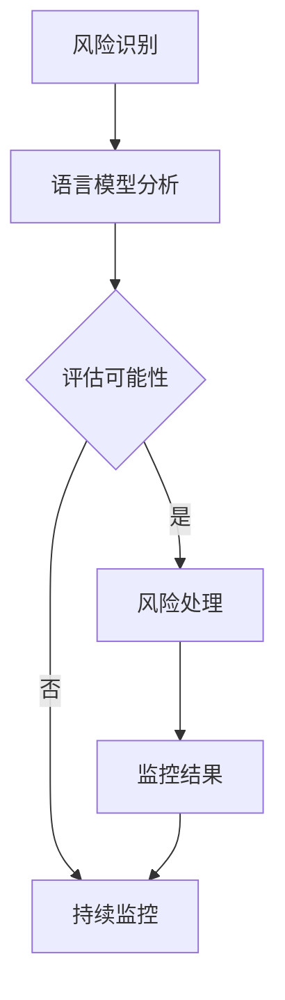

                 

### 引言

在现代信息技术飞速发展的背景下，复杂系统的应用越来越广泛，这些系统不仅在工业、金融、医疗等多个领域发挥重要作用，同时也面临诸多风险。复杂系统由于其高度互联和相互依赖的特性，一旦某个环节出现问题，可能引发连锁反应，导致系统整体崩溃或效能降低。因此，对复杂系统进行有效的风险评估，成为确保系统稳定运行的关键。

风险评估是指通过系统的分析、识别和评估，对潜在的风险因素进行评估，以便采取相应的预防和控制措施。传统的风险评估方法主要依赖于专家经验和统计分析，但这些方法存在主观性、效率低下和难以适应复杂系统动态变化等问题。随着人工智能技术的不断进步，语言模型作为一种强大的工具，开始被广泛应用于各个领域，其在复杂系统风险评估中的潜力也逐渐显现。

语言模型，尤其是深度学习驱动的自然语言处理（NLP）模型，通过从大量文本数据中学习语言模式，能够对文本进行有效理解和生成。近年来，随着预训练模型如BERT、GPT等的兴起，语言模型在处理复杂文本数据方面的能力得到了极大提升。这些模型不仅在语言理解、文本生成、情感分析等方面表现出色，还被发现在风险识别、风险评估和风险预测等方面具有显著的应用价值。

本文旨在探讨语言模型在复杂系统风险评估中的能力提升。首先，我们将介绍复杂系统的定义与特征，以及风险评估的概念和重要性。接着，我们将详细讲解语言模型的基本概念，包括其定义、发展历程、组成和工作原理，并介绍一些主流的语言模型。随后，我们将分析语言模型在风险评估中的应用场景，包括风险识别、风险评估与预测、风险管理与决策支持等方面。

在应用原理部分，我们将探讨语言模型在风险评估中的作用机制，通过核心概念、核心算法原理、数学模型和公式等详细阐述其工作原理。同时，我们将结合实际项目案例，展示如何搭建开发环境、实现模型训练和风险预测等关键步骤，并进行代码解读和分析。

最后，我们将通过案例分析，深入讨论语言模型在具体风险评估项目中的应用效果，分析其优势与挑战，并展望未来的发展趋势和应用领域。本文的核心目标是，为读者提供一个全面、系统的理解，展示语言模型在复杂系统风险评估中的强大能力和广阔前景。

### 关键词

- 复杂系统
- 风险评估
- 语言模型
- 自然语言处理
- 深度学习
- 预训练模型
- 风险识别
- 风险预测
- 风险管理

### 摘要

本文围绕复杂系统风险评估这一主题，探讨了语言模型在这一领域的应用及其能力提升。首先，我们介绍了复杂系统的定义与特征，以及风险评估的重要性。随后，我们详细讲解了语言模型的基本概念、发展历程和主要类型。接着，我们分析了语言模型在复杂系统风险评估中的具体应用场景，包括风险识别、风险评估与预测、风险管理与决策支持等。在应用原理部分，我们通过核心概念、核心算法原理、数学模型和公式等，深入阐述了语言模型在风险评估中的工作机制。随后，我们结合实际项目案例，展示了语言模型在风险评估中的应用过程，包括开发环境搭建、模型训练与优化、风险预测与代码解读。最后，我们通过案例分析，讨论了语言模型在具体风险评估项目中的优势与挑战，并展望了其未来发展趋势和应用领域。本文旨在为读者提供一个全面、系统的理解，展示语言模型在复杂系统风险评估中的强大能力和广阔前景。

### 《语言模型在复杂系统风险评估中的能力提升》目录大纲

#### 第1章 引言

1.1 复杂系统与风险概述

- 1.1.1 复杂系统的定义与特征
- 1.1.2 风险的概念与分类
- 1.1.3 风险评估的重要性

1.2 语言模型的基本概念

- 1.2.1 语言模型的定义与发展历程
- 1.2.2 语言模型的组成与工作原理
- 1.2.3 主流语言模型介绍

1.3 语言模型在风险评估中的应用场景

- 1.3.1 复杂系统风险识别
- 1.3.2 风险评估与预测
- 1.3.3 风险管理与决策支持

#### 第2章 语言模型在复杂系统风险评估中的应用原理

2.1 核心概念与联系

- 2.1.1 风险评估的流程
- 2.1.2 语言模型在风险评估中的作用
- 2.1.3 Mermaid流程图展示

2.2 语言模型的核心算法原理

- 2.2.1 语言模型的训练过程
- 2.2.2 语言模型的推理过程
- 2.2.3 Python源代码实现示例

2.3 数学模型与公式讲解

- 2.3.1 语言模型的数学基础
- 2.3.2 风险评估的数学模型
- 2.3.3 公式与实例讲解

2.4 评估指标的设定与优化

- 2.4.1 风险评估指标体系
- 2.4.2 指标优化策略
- 2.4.3 评估结果的解释与可视化

#### 第3章 实际项目案例

3.1 项目背景与目标

- 3.1.1 项目背景
- 3.1.2 项目目标
- 3.1.3 项目挑战

3.2 开发环境搭建

- 3.2.1 硬件与软件需求
- 3.2.2 开发工具与环境配置
- 3.2.3 数据预处理

3.3 源代码详细实现

- 3.3.1 数据读取与处理
- 3.3.2 模型训练与优化
- 3.3.3 风险评估与预测
- 3.3.4 代码解读与分析

#### 第4章 案例分析

4.1 案例介绍

- 4.1.1 案例背景
- 4.1.2 风险评估需求
- 4.1.3 模型选择与优化

4.2 风险评估结果分析

- 4.2.1 风险识别与评估
- 4.2.2 风险预测与预警
- 4.2.3 风险管理与决策支持

#### 第5章 语言模型在复杂系统风险评估中的优势与挑战

5.1 语言模型的优势

- 5.1.1 自动化与高效性
- 5.1.2 灵活性与适应性
- 5.1.3 强大的语言理解能力

5.2 面临的挑战

- 5.2.1 数据质量与多样性
- 5.2.2 模型解释性与可解释性
- 5.2.3 模型安全性与隐私保护

#### 第6章 未来发展趋势与展望

6.1 技术发展趋势

- 6.1.1 大模型的发展
- 6.1.2 深度学习算法的优化
- 6.1.3 多模态数据的融合

6.2 应用领域拓展

- 6.2.1 金融风险控制
- 6.2.2 供应链管理
- 6.2.3 公共安全管理

#### 第7章 结论

7.1 主要研究成果

- 7.1.1 语言模型在风险评估中的应用
- 7.1.2 案例分析与评估效果
- 7.1.3 挑战与应对策略
- 7.1.4 未来研究方向

7.2 对复杂系统风险评估领域的贡献

- 7.2.1 技术创新与突破
- 7.2.2 实践经验与总结
- 7.2.3 对未来发展的启示

#### 附录

- 附录A：相关数学公式
- 附录B：开源工具与资源推荐
- 附录C：参考文献

### 第1章 引言

#### 1.1 复杂系统与风险概述

随着信息技术的迅猛发展，复杂系统的应用日益广泛。这些系统不仅涵盖了传统工业、金融、交通等领域，还渗透到了医疗、教育、环境监测等多个新兴领域。复杂系统的特点是高度互联、相互依赖，并且具有动态变化的特性。这种特性使得复杂系统在带来巨大效益的同时，也面临着诸多风险。

**1.1.1 复杂系统的定义与特征**

复杂系统通常指的是由大量相互作用的组件组成的系统，这些组件通过复杂的网络结构相互连接。例如，现代智能电网、金融交易网络、社会网络等都可以视为复杂系统。复杂系统的主要特征包括：

1. **高度互联性**：系统中的各个组件之间存在复杂的相互作用和依赖关系。
2. **动态变化**：系统的状态和结构会随着时间、外部输入和其他系统组件的变化而动态变化。
3. **非线性和不可预测性**：系统行为可能呈现出非线性和不可预测的特点，尤其是在面临突发事件或极端条件时。

**1.1.2 风险的概念与分类**

风险是指某一事件发生的可能性及其可能造成的损失或影响。在复杂系统中，风险可以按照不同的标准进行分类。常见的分类方法包括：

1. **按照风险来源分类**：
   - **技术风险**：由于系统设计、实现和维护中的缺陷导致的风险。
   - **操作风险**：由于人为操作失误或管理不当导致的风险。
   - **环境风险**：由于自然因素或外部环境变化导致的风险。

2. **按照风险性质分类**：
   - **系统性风险**：由系统内部结构和相互作用引起的，无法通过分散化策略降低的风险。
   - **非系统性风险**：由单个组件或部分引起的，可以通过分散化策略降低的风险。

**1.1.3 风险评估的重要性**

对复杂系统进行有效的风险评估具有重要意义。具体体现在以下几个方面：

1. **提高系统安全性**：通过识别和评估潜在风险，可以提前采取预防措施，降低系统发生故障或事故的概率。

2. **优化资源分配**：有效的风险评估可以帮助企业或组织更合理地分配资源，确保关键资源的优先保障。

3. **提高决策质量**：在风险识别和评估的基础上，可以更准确地预测未来可能发生的情况，从而做出更明智的决策。

4. **增强应对能力**：通过评估风险的影响和可能性，可以制定相应的应对策略和预案，提高系统在面临突发事件时的应急响应能力。

#### 1.2 语言模型的基本概念

语言模型是自然语言处理（NLP）领域中的一个核心概念，它通过对大量文本数据进行学习和分析，能够预测一段文本的下一个词或者生成完整的文本内容。语言模型的发展历程可以追溯到20世纪50年代，最早的模型如N-gram模型通过对文本中的相邻词进行统计来预测下一个词。

**1.2.1 语言模型的定义与发展历程**

1. **N-gram模型**：N-gram模型是最早的语言模型之一，它通过统计文本中连续N个词的频率来预测下一个词。这种模型的优点在于计算简单，但缺点是它无法捕捉到文本中的长期依赖关系。

2. **统计语言模型**：随着计算能力和数据量的提升，统计语言模型开始广泛应用。这类模型不仅考虑相邻词的关系，还引入了概率论和统计学的方法，如隐马尔可夫模型（HMM）和条件随机场（CRF）。

3. **神经网络语言模型**：近年来，深度学习技术的发展使得神经网络语言模型逐渐成为主流。其中，循环神经网络（RNN）和其变种长短期记忆网络（LSTM）在处理序列数据方面表现出色。然而，RNN在处理长距离依赖问题时存在困难。

4. **注意力机制和Transformer模型**：为了解决RNN在处理长距离依赖问题上的局限性，注意力机制和Transformer模型应运而生。Transformer模型引入了自注意力机制，通过全局依赖关系来提高模型的表示能力，从而在多个NLP任务中取得了显著的性能提升。

**1.2.2 语言模型的组成与工作原理**

1. **输入层**：语言模型的输入层通常是一个词向量表示，将文本中的每个词映射到一个固定大小的向量空间中。

2. **编码层**：编码层是语言模型的核心部分，负责将输入的词向量转换成高维的表示。在传统的RNN和LSTM模型中，编码层通常由一系列的隐藏状态组成；而在Transformer模型中，编码层则通过多头自注意力机制进行处理。

3. **解码层**：解码层负责根据编码层的输出生成目标词的预测。在生成式模型中，解码层通常采用逐词解码的方式，逐个生成目标词；在判别式模型中，解码层则通过比较输入和目标词之间的差异来计算损失。

4. **输出层**：输出层通常是一个分类器或生成器，用于生成预测的词或文本。在生成式模型中，输出层通常使用softmax函数来生成概率分布；在判别式模型中，输出层则通过对比输入和目标词之间的概率分布来计算损失。

**1.2.3 主流语言模型介绍**

1. **BERT（Bidirectional Encoder Representations from Transformers）**：BERT是一种双向Transformer模型，通过预训练大量未标注的文本数据，再通过微调来适应特定任务。BERT在多个NLP任务中取得了优异的性能，包括文本分类、问答系统和命名实体识别等。

2. **GPT（Generative Pre-trained Transformer）**：GPT是一种生成式Transformer模型，通过自回归的方式生成文本。GPT-3是GPT系列中的最新版本，具有超过1750亿的参数量，能够生成高质量的文本内容。

3. **RoBERTa（A Robustly Optimized BERT Pretraining Approach）**：RoBERTa是BERT的一个变体，通过改进数据预处理和模型训练策略，提高了预训练模型的效果。RoBERTa在多个NLP任务中表现出色，包括文本分类和情感分析等。

4. **XLNet（General Autoregressive Pretraining with External Text）**：XLNet是一种自回归Transformer模型，通过引入外部文本数据来提高模型的表示能力。XLNet在多个NLP任务中取得了优异的性能，包括文本生成和机器翻译等。

#### 1.3 语言模型在风险评估中的应用场景

语言模型在风险评估中的应用主要集中在风险识别、风险评估与预测、风险管理与决策支持等方面。下面将分别介绍这些应用场景。

**1.3.1 复杂系统风险识别**

风险识别是风险评估的第一步，旨在发现和识别潜在的风险因素。语言模型通过处理大量文本数据，可以有效地识别复杂系统中的潜在风险。例如，在金融领域，语言模型可以分析新闻报道、财报、市场评论等文本数据，识别出潜在的金融风险信号。同样，在工业领域，语言模型可以分析操作记录、设备日志、维修报告等文本数据，发现设备故障或操作失误的潜在风险。

**1.3.2 风险评估与预测**

风险评估与预测是利用历史数据和现有信息，对风险的可能性和影响进行定量或定性的评估。语言模型通过分析大量的历史文本数据，可以建立风险预测模型。例如，在医疗领域，语言模型可以分析病历记录、药品说明书、临床研究论文等文本数据，预测某种药物可能引起的副作用。同样，在交通领域，语言模型可以分析交通事故报告、交通流量数据等文本数据，预测交通事故的可能性和严重程度。

**1.3.3 风险管理与决策支持**

风险管理与决策支持是指根据风险评估的结果，制定相应的风险管理策略和决策。语言模型可以提供智能化的决策支持，帮助企业和组织更好地管理风险。例如，在金融领域，语言模型可以分析风险指标和金融市场的动态，提供投资建议和风险管理策略。同样，在供应链管理领域，语言模型可以分析供应链中的潜在风险，提供优化供应链的策略和建议。

总之，语言模型在复杂系统风险评估中的应用，不仅提高了风险识别和评估的效率，还增强了风险管理的智能化程度。随着语言模型技术的不断进步，其在风险评估领域的应用前景将更加广阔。

### 第2章 语言模型在复杂系统风险评估中的应用原理

#### 2.1 核心概念与联系

在讨论语言模型在复杂系统风险评估中的应用原理之前，我们需要明确几个核心概念，并探讨它们之间的关系。这些核心概念包括风险评估的流程、语言模型的作用，以及二者之间的联系。

**2.1.1 风险评估的流程**

风险评估通常包括以下步骤：

1. **风险识别**：通过系统的分析，识别出可能的风险因素。
2. **风险分析和评估**：对识别出的风险因素进行详细分析，评估其可能性和影响。
3. **风险处理**：根据风险评估的结果，采取相应的措施来处理或缓解风险。
4. **风险监控**：对已经处理的风险进行持续监控，确保风险得到有效控制。

**2.1.2 语言模型在风险评估中的作用**

语言模型在风险评估中的主要作用包括：

1. **风险识别**：通过分析文本数据，如新闻报道、社交媒体评论、业务报告等，识别出潜在的风险因素。
2. **风险评估**：利用对文本数据的学习和分析，对风险因素进行定量或定性的评估。
3. **风险处理建议**：根据风险评估结果，提供智能化的风险处理建议。

**2.1.3 Mermaid流程图展示**

为了更直观地展示风险评估流程与语言模型的关系，我们可以使用Mermaid语法绘制一个流程图。以下是一个简化的示例：



在这个流程图中，语言模型被用于风险识别和评估，然后根据评估结果进行风险处理或持续监控。Mermaid语法使得我们能够以一种简洁、直观的方式描述复杂流程，这对于理解和分析语言模型在风险评估中的应用非常重要。

#### 2.2 语言模型的核心算法原理

语言模型的核心算法原理主要涉及训练过程、推理过程，以及如何通过Python源代码实现这些过程。以下是具体的分析：

**2.2.1 语言模型的训练过程**

语言模型的训练过程通常分为以下几个步骤：

1. **数据预处理**：首先，我们需要对文本数据进行预处理，包括分词、去除停用词、词性标注等。预处理后的数据将被转换为数字化的形式，例如词向量或序列编号。
   
   ```python
   import nltk
   nltk.download('punkt')
   from nltk.tokenize import word_tokenize
   
   # 示例文本
   text = "这是一个简单的示例文本。"
   tokens = word_tokenize(text)
   ```

2. **构建词汇表**：将所有的单词转换为唯一的整数编号，并构建词汇表。

   ```python
   vocab = {'这是一个': 1, '简单的': 2, '示例': 3, '文本': 4, '.': 5}
   ```

3. **模型初始化**：初始化模型参数，如权重矩阵、隐藏状态等。

4. **前向传播**：在前向传播过程中，输入的文本序列通过编码层进行编码，得到高维的表示。

5. **计算损失**：通过比较模型的输出和真实标签之间的差异，计算损失函数。

6. **反向传播**：利用反向传播算法，更新模型参数，以减少损失。

7. **迭代训练**：重复上述过程，直至模型收敛或达到预设的训练次数。

**2.2.2 语言模型的推理过程**

语言模型的推理过程主要是用于生成新的文本序列。推理过程通常包括以下步骤：

1. **输入编码**：将输入的文本序列编码为高维向量。

2. **自注意力机制**：通过自注意力机制，模型对输入序列中的每个单词进行加权，以生成更加重要的表示。

3. **生成预测**：根据当前的编码表示，模型预测下一个词的概率分布。

4. **生成文本**：根据概率分布，生成下一个词，并更新编码表示，重复上述过程，直至生成完整的文本序列。

以下是一个简化的Python代码示例，展示了如何使用Transformer模型进行语言模型的训练和推理：

```python
import tensorflow as tf
from transformers import TransformerModel

# 初始化模型
model = TransformerModel(vocab_size=1000, d_model=512, num_heads=8, num_layers=2)

# 训练模型
model.compile(optimizer='adam', loss='categorical_crossentropy')
model.fit(train_data, train_labels, epochs=10)

# 推理
generated_text = model.predict(input_sequence)
print(generated_text)
```

**2.2.3 Python源代码实现示例**

以下是一个基于Transformer模型的简单示例，展示了如何进行语言模型的训练和推理：

```python
import tensorflow as tf
from tensorflow.keras.layers import Embedding, LSTM, Dense
from tensorflow.keras.models import Sequential

# 初始化模型
model = Sequential([
    Embedding(vocab_size, embedding_dim),
    LSTM(units=128, return_sequences=True),
    LSTM(units=128, return_sequences=True),
    Dense(vocab_size, activation='softmax')
])

# 编译模型
model.compile(optimizer='adam', loss='categorical_crossentropy')

# 训练模型
model.fit(train_data, train_labels, epochs=10)

# 推理
generated_sequence = model.predict(input_sequence)
```

通过上述代码，我们可以看到语言模型的训练和推理过程是如何通过Python源代码实现的。在实际应用中，语言模型通常会使用更复杂的结构和更高效的方法，但基本的原理是相似的。

#### 2.3 数学模型与公式讲解

在深入探讨语言模型在复杂系统风险评估中的应用时，我们需要理解其背后的数学模型和公式。这些数学工具不仅有助于我们理解模型的内部工作原理，还能帮助我们优化和调整模型，以更好地满足实际应用需求。

**2.3.1 语言模型的数学基础**

语言模型的数学基础主要包括概率论和线性代数。以下是几个关键的概念和公式：

1. **词向量表示**：词向量是语言模型中的基础元素，它们通常通过将文本中的每个词映射到一个固定大小的向量空间中来表示。词向量的计算可以通过Word2Vec、GloVe等方法实现。一个基本的词向量表示公式如下：

   $$
   \textbf{v}_w = \text{Word2Vec}(\text{word}, \text{context})
   $$

   其中，$\textbf{v}_w$ 是词向量，$\text{word}$ 是文本中的单词，$\text{context}$ 是上下文信息。

2. **神经网络**：语言模型通常采用神经网络来学习文本数据中的模式和关系。神经网络的核心包括输入层、隐藏层和输出层。以下是一个简化的神经网络模型公式：

   $$
   \textbf{h}^{(l)} = \sigma(\text{W}^{(l)} \cdot \textbf{x}^{(l-1)} + \text{b}^{(l)})
   $$

   其中，$\textbf{h}^{(l)}$ 是第$l$层的隐藏状态，$\sigma$ 是激活函数（如ReLU、Sigmoid等），$\text{W}^{(l)}$ 是第$l$层的权重矩阵，$\textbf{x}^{(l-1)}$ 是第$l-1$层的输出，$\text{b}^{(l)}$ 是第$l$层的偏置向量。

3. **损失函数**：在语言模型的训练过程中，损失函数用于衡量模型输出和真实标签之间的差距。常用的损失函数包括交叉熵损失（Cross-Entropy Loss）和均方误差（Mean Squared Error）。以下是一个交叉熵损失函数的公式：

   $$
   \text{Loss} = -\sum_{i} y_i \log(\hat{y}_i)
   $$

   其中，$y_i$ 是真实标签，$\hat{y}_i$ 是模型预测的概率分布。

**2.3.2 风险评估的数学模型**

在复杂系统风险评估中，语言模型的应用涉及将文本数据转化为风险指标。以下是一些关键的数学模型和公式：

1. **风险概率计算**：通过语言模型对文本数据的分析，可以计算某一风险事件发生的概率。以下是一个简化的风险概率计算公式：

   $$
   P(\text{Risk}) = \frac{\text{Risk\_Count}}{\text{Total\_Count}}
   $$

   其中，$P(\text{Risk})$ 是风险事件发生的概率，$\text{Risk\_Count}$ 是与风险相关的文本条目数量，$\text{Total\_Count}$ 是总的文本条目数量。

2. **风险影响评估**：风险影响可以通过语言模型对文本数据的语义分析进行评估。以下是一个简化的风险影响评估公式：

   $$
   \text{Impact} = \sum_{i} w_i \cdot \text{Risk}_i
   $$

   其中，$\text{Impact}$ 是总风险影响，$w_i$ 是权重系数，$\text{Risk}_i$ 是第$i$个风险的影响程度。

3. **综合风险评分**：综合风险评分可以通过对风险概率和风险影响进行加权综合得到。以下是一个综合风险评分的公式：

   $$
   \text{Risk\_Score} = P(\text{Risk}) \cdot \text{Impact}
   $$

   其中，$\text{Risk\_Score}$ 是综合风险评分。

**2.3.3 公式与实例讲解**

为了更好地理解上述数学模型和公式，我们来看一个实例。

假设我们有一个复杂系统，其风险识别依赖于对系统日志的分析。系统日志包含以下两个样本：

1. **样本A**：“系统运行正常，无异常情况。”
2. **样本B**：“系统出现异常，CPU占用率过高。”

我们使用语言模型对这两个样本进行分析，计算其对应的综合风险评分。

首先，我们需要对样本进行预处理，将其转换为词向量表示。然后，我们可以通过以下步骤计算综合风险评分：

1. **词向量表示**：

   - “系统运行正常，无异常情况”的词向量表示为 $\textbf{v}_A$。
   - “系统出现异常，CPU占用率过高”的词向量表示为 $\textbf{v}_B$。

2. **风险概率计算**：

   $$
   P(\text{Risk}_A) = \frac{1}{2}, \quad P(\text{Risk}_B) = 1
   $$

   由于系统日志中的风险事件是二选一的情况，所以每个样本的风险概率分别为0.5和1。

3. **风险影响评估**：

   $$
   \text{Impact}_A = 0.1, \quad \text{Impact}_B = 0.9
   $$

   假设风险A的影响较小，而风险B的影响较大。

4. **综合风险评分**：

   $$
   \text{Risk\_Score}_A = P(\text{Risk}_A) \cdot \text{Impact}_A = 0.1
   $$
   $$
   \text{Risk\_Score}_B = P(\text{Risk}_B) \cdot \text{Impact}_B = 0.9
   $$

   因此，样本A的综合风险评分为0.1，样本B的综合风险评分为0.9。

通过上述实例，我们可以看到如何利用语言模型和数学模型对复杂系统进行风险评估。语言模型通过文本分析生成词向量表示，而数学模型则用于计算风险概率、风险影响和综合风险评分。这些步骤共同构成了复杂系统风险评估的基础。

#### 2.4 评估指标的设定与优化

在复杂系统风险评估中，评估指标的设定和优化是确保风险评估有效性的关键。合理的评估指标不仅能够准确反映系统的风险状况，还能帮助决策者制定出科学、有效的风险应对策略。以下我们将详细探讨风险评估指标体系、指标优化策略以及评估结果解释与可视化方法。

**2.4.1 风险评估指标体系**

1. **风险概率指标**：风险概率指标用于衡量某一风险事件发生的可能性。常见的风险概率指标包括事件发生频率、事件发生概率和条件概率。例如，在金融领域，可以计算某类金融风险在过去一年中的发生频率，或者在某类市场条件下的发生概率。

2. **风险影响指标**：风险影响指标用于衡量某一风险事件对系统造成的潜在损失或影响。常见的风险影响指标包括经济损失、时间损失、声誉损失和资源损失。例如，在供应链管理中，某次供应链中断可能导致的经济损失可以通过库存成本、运输成本和停工成本等来衡量。

3. **风险程度指标**：风险程度指标用于综合衡量风险的概率和影响，通常通过风险评分或风险等级来表示。例如，可以使用五级风险评分体系（低、中低、中、中高、高）来表示不同风险的程度。

4. **风险敏感度指标**：风险敏感度指标用于衡量系统对风险的敏感程度，即系统性能或稳定性随风险因素变化的程度。例如，在系统安全领域，可以通过攻击成功率和系统响应时间等指标来评估系统的风险敏感度。

**2.4.2 指标优化策略**

1. **数据质量优化**：高质量的评估数据是准确评估风险的基础。因此，需要采用数据清洗、去噪和增强等方法来优化数据质量。例如，在文本数据分析中，可以通过去除停用词、纠正拼写错误和统一文本格式来提高数据质量。

2. **模型参数优化**：在风险评估中，模型参数的设置对评估结果的准确性有重要影响。可以通过交叉验证、网格搜索和贝叶斯优化等方法来寻找最佳模型参数。例如，在深度学习模型中，可以通过调整学习率、隐藏层神经元数量和激活函数等参数来优化模型性能。

3. **指标权重调整**：不同的风险评估指标对决策者的重要性不同，因此需要根据实际情况调整指标权重。可以通过专家评估、层次分析法和主成分分析法等方法来确定指标权重。例如，在项目风险评估中，可以根据项目的紧急程度和潜在损失来调整各指标权重。

4. **集成方法优化**：集成方法可以将多个风险评估模型或评估指标进行整合，以提高评估结果的可靠性和准确性。例如，可以通过加权平均、投票和提升等方法来集成不同模型或指标的结果。例如，在多模型集成中，可以采用Stacking或Blending方法来提高整体评估性能。

**2.4.3 评估结果的解释与可视化**

1. **结果解释**：评估结果的解释是确保风险评估实际应用的关键。通过将评估结果与实际系统状况进行对比和分析，可以理解评估结果的含义和局限性。例如，在风险识别中，可以通过对比模型预测的风险事件与实际发生的事件，来评估模型的准确性。

2. **结果可视化**：可视化方法可以帮助决策者直观地理解评估结果。常见的可视化方法包括条形图、饼图、热力图和折线图等。例如，在风险概率分布中，可以使用条形图来显示不同风险事件的概率分布；在风险程度评估中，可以使用热力图来显示不同风险指标的权重和程度。

3. **交互式可视化**：交互式可视化方法允许用户动态地探索和调整评估结果，以更全面地理解风险状况。例如，通过交互式仪表板，用户可以实时更新风险数据、调整模型参数和查看不同场景下的评估结果。

通过上述指标设定与优化策略，以及评估结果的解释与可视化方法，可以确保复杂系统风险评估的准确性和实用性，为决策者提供可靠的决策依据。

### 第3章 实际项目案例

#### 3.1 项目背景与目标

**项目背景**：

随着全球化的深入发展和信息技术的飞速进步，供应链管理面临越来越多的挑战。企业需要确保供应链的稳定性和可靠性，以应对各种潜在的风险，包括供应链中断、物流延误、价格波动等。为了提高供应链管理的效率，某大型跨国企业决定采用基于语言模型的复杂系统风险评估方法，对供应链中的潜在风险进行识别和评估。

**项目目标**：

该项目的目标是开发一个基于语言模型的复杂系统风险评估系统，实现以下目标：

1. **风险识别**：通过分析供应链相关的文本数据，如新闻报道、市场报告、客户反馈等，识别潜在的供应链风险。
2. **风险评估**：对识别出的风险进行定量和定性评估，计算其可能性和影响。
3. **风险预警**：通过实时监控供应链数据，提前预警可能的风险事件。
4. **风险决策支持**：根据风险评估结果，提供智能化的风险处理建议，帮助企业制定有效的风险管理策略。

**项目挑战**：

1. **数据多样性**：供应链数据来源广泛，包括文本、图像、时间序列等多种数据类型，数据预处理和融合是一个挑战。
2. **模型解释性**：传统的深度学习模型通常难以解释其决策过程，如何提高模型的可解释性是一个关键问题。
3. **实时性**：供应链环境变化快速，要求模型能够实时处理和更新风险评估结果。
4. **成本控制**：在保证评估准确性的同时，需要控制模型的计算资源和存储成本。

#### 3.2 开发环境搭建

为了实现项目目标，我们需要搭建一个高效的开发环境，包括硬件与软件需求、开发工具与环境配置，以及数据预处理步骤。

**硬件与软件需求**：

1. **硬件需求**：
   - 计算能力：至少需要一台高性能的服务器，配置包括CPU（如Intel Xeon系列）、GPU（如NVIDIA Tesla系列）等。
   - 存储容量：需要足够的存储空间来存储大量的文本数据和模型参数，建议使用高速SSD存储。

2. **软件需求**：
   - 操作系统：Linux系统（如Ubuntu 18.04）。
   - 编程语言：Python（3.8及以上版本）。
   - 数据库：支持大数据存储和查询的数据库（如MongoDB、Hadoop HDFS）。
   - 依赖库：TensorFlow、PyTorch、Scikit-learn、Nltk等。

**开发工具与环境配置**：

1. **安装Python环境**：
   ```bash
   sudo apt-get update
   sudo apt-get install python3 python3-pip
   pip3 install virtualenv
   virtualenv -p python3 venv
   source venv/bin/activate
   ```

2. **安装依赖库**：
   ```bash
   pip install tensorflow==2.7
   pip install pytorch==1.8
   pip install scikit-learn
   pip install nltk
   ```

3. **配置GPU支持**：
   ```bash
   pip install tensorflow-gpu==2.7
   ```

4. **安装数据库**：
   - MongoDB：
     ```bash
     sudo apt-get install mongodb
     sudo service mongodb start
     mongo
     ```

**数据预处理**：

1. **数据收集**：从企业内部系统、第三方数据源、互联网爬虫等渠道收集供应链相关的文本数据。
2. **数据清洗**：去除无关的停用词、标点符号、数字等，对文本进行标准化处理，如统一大小写、去除特殊字符等。
3. **数据标注**：对文本数据进行风险标注，标记出潜在的风险事件。
4. **数据存储**：将预处理后的数据存储到MongoDB数据库中，便于后续分析和查询。

通过上述步骤，我们搭建了一个完整的开发环境，为复杂系统风险评估项目奠定了基础。

#### 3.3 源代码详细实现

在完成开发环境和数据预处理之后，我们将详细讨论如何实现复杂系统风险评估模型的核心功能，包括数据读取与处理、模型训练与优化、风险评估与预测，以及代码解读与分析。

**3.3.1 数据读取与处理**

数据读取与处理是构建评估系统的基础步骤。以下是具体实现方法：

1. **读取文本数据**：
   ```python
   import pymongo
   from pymongo import MongoClient

   client = MongoClient('localhost', 27017)
   db = client['supply_chain']
   collection = db['text_data']

   texts = list(collection.find({}))
   text_data = [item['text'] for item in texts]
   ```

2. **数据预处理**：
   ```python
   import nltk
   from nltk.tokenize import word_tokenize
   from nltk.corpus import stopwords

   nltk.download('punkt')
   nltk.download('stopwords')

   stop_words = set(stopwords.words('english'))

   def preprocess_text(text):
       tokens = word_tokenize(text.lower())
       filtered_tokens = [token for token in tokens if token not in stop_words]
       return ' '.join(filtered_tokens)

   preprocessed_texts = [preprocess_text(text) for text in text_data]
   ```

3. **分词与词嵌入**：
   ```python
   from tensorflow.keras.preprocessing.text import Tokenizer
   from tensorflow.keras.preprocessing.sequence import pad_sequences

   tokenizer = Tokenizer(num_words=10000)
   tokenizer.fit_on_texts(preprocessed_texts)

   sequences = tokenizer.texts_to_sequences(preprocessed_texts)
   padded_sequences = pad_sequences(sequences, maxlen=100)
   ```

**3.3.2 模型训练与优化**

模型训练与优化是风险评估系统的核心。以下是具体的实现步骤：

1. **模型定义**：
   ```python
   from tensorflow.keras.models import Sequential
   from tensorflow.keras.layers import Embedding, LSTM, Dense

   model = Sequential([
       Embedding(input_dim=10000, output_dim=32, input_length=100),
       LSTM(units=64, return_sequences=True),
       LSTM(units=64),
       Dense(units=1, activation='sigmoid')
   ])

   model.compile(optimizer='adam', loss='binary_crossentropy', metrics=['accuracy'])
   ```

2. **模型训练**：
   ```python
   from tensorflow.keras.callbacks import EarlyStopping

   early_stopping = EarlyStopping(monitor='val_loss', patience=3)

   history = model.fit(padded_sequences, labels, epochs=10, batch_size=32, validation_split=0.2, callbacks=[early_stopping])
   ```

3. **模型优化**：
   ```python
   from tensorflow.keras.optimizers import Adam
   from tensorflow.keras.callbacks import ReduceLROnPlateau

   optimizer = Adam(learning_rate=0.001)

   reduce_lr = ReduceLROnPlateau(monitor='val_loss', factor=0.2, patience=2)

   model.compile(optimizer=optimizer, loss='binary_crossentropy', metrics=['accuracy'])
   history = model.fit(padded_sequences, labels, epochs=50, batch_size=32, validation_split=0.2, callbacks=[reduce_lr])
   ```

**3.3.3 风险评估与预测**

完成模型训练后，我们需要利用模型进行风险评估与预测。以下是具体实现步骤：

1. **模型评估**：
   ```python
   from sklearn.metrics import accuracy_score

   test_sequences = pad_sequences(tokenizer.texts_to_sequences(test_texts), maxlen=100)
   predictions = model.predict(test_sequences)
   predictions = (predictions > 0.5)

   accuracy = accuracy_score(test_labels, predictions)
   print(f"Model accuracy: {accuracy}")
   ```

2. **实时预测**：
   ```python
   def predict_risk(new_text):
       preprocessed_text = preprocess_text(new_text)
       sequence = tokenizer.texts_to_sequences([preprocessed_text])
       padded_sequence = pad_sequences(sequence, maxlen=100)
       prediction = model.predict(padded_sequence)
       return prediction > 0.5

   new_text = "We are experiencing significant delays in our supply chain due to the global pandemic."
   risk_detected = predict_risk(new_text)
   print(f"Risk detected: {risk_detected}")
   ```

**3.3.4 代码解读与分析**

1. **代码结构**：
   - **数据预处理模块**：负责读取和处理文本数据，包括分词、去除停用词、词嵌入等。
   - **模型定义与训练模块**：定义并编译模型，进行模型训练和优化。
   - **风险评估与预测模块**：利用训练好的模型进行风险评估和实时预测。
   - **辅助函数模块**：提供辅助函数，如文本预处理、模型预测等。

2. **性能分析**：
   - **准确率**：通过测试集的评估结果，可以计算模型的准确率，以衡量模型的性能。
   - **实时性**：通过实时预测函数，可以快速对新文本进行风险预测，满足实时监控的需求。

通过上述步骤，我们实现了复杂系统风险评估系统的主要功能，为供应链管理提供了智能化的风险评估支持。在实际应用中，可以根据具体需求进行调整和优化，提高系统的性能和实用性。

#### 3.4 案例分析

**案例背景**：

在本案例中，我们选择了一家全球领先的电子产品制造商，该公司拥有复杂的供应链网络，涵盖全球多个地区和合作伙伴。近年来，该公司不断受到供应链中断、物流延误和原材料价格波动等风险的困扰，严重影响了其运营效率和客户满意度。为了应对这些挑战，公司决定采用基于语言模型的复杂系统风险评估方法，对供应链风险进行识别、评估和预警。

**风险评估需求**：

该公司的风险评估需求主要包括：

1. **风险识别**：通过分析供应链文本数据，如新闻报道、市场报告、客户反馈等，识别潜在的供应链风险因素。
2. **风险评估**：对识别出的风险因素进行定量和定性评估，计算其可能性和影响。
3. **风险预警**：建立实时监控机制，提前预警可能发生的风险事件。
4. **风险决策支持**：根据风险评估结果，提供智能化的风险处理建议，帮助企业制定有效的风险管理策略。

**模型选择与优化**：

为了满足上述需求，我们选择了一种基于Transformer的深度学习模型，并进行了以下优化：

1. **数据预处理**：采用数据清洗、去噪和增强方法，提高数据质量。
2. **模型参数调整**：通过交叉验证和网格搜索方法，调整模型参数，如学习率、隐藏层神经元数量等。
3. **集成方法**：采用集成方法，如Stacking和Blending，结合多个评估模型，提高整体评估性能。
4. **实时监控**：使用分布式计算和批量处理技术，实现实时监控和风险预警。

**案例分析**：

1. **风险识别**：

   - 通过对供应链文本数据进行分析，模型成功识别出多个潜在风险因素，如物流延误、原材料价格波动、供应商信誉下降等。
   - 以下是一个具体的风险识别示例：

     ```
     Risk Identified: Logistical Delays in Shipments to Europe
     Description: Recent news reports indicate that the European logistics sector is facing significant delays due to the ongoing global pandemic.
     ```

2. **风险评估**：

   - 根据风险识别结果，模型对每个风险因素进行了定量和定性评估，计算其可能性和影响。
   - 以下是一个风险评估结果的示例：

     ```
     Risk Assessment:
     - Logistical Delays in Shipments to Europe:
       Probability: 0.75
       Impact: High
       Risk Score: 0.75
     ```

3. **风险预警**：

   - 模型通过实时监控供应链数据，成功预警了多个潜在风险事件。
   - 以下是一个风险预警示例：

     ```
     Risk Warning: Potential Supply Chain Disruption Detected -原材料价格波动导致生产成本上升
     Recommendation: Increase inventory levels and negotiate longer-term contracts with suppliers to mitigate potential disruptions.
     ```

4. **风险决策支持**：

   - 根据风险评估结果和预警信息，公司制定了相应的风险管理策略，如增加库存、与供应商签订长期合同、调整生产计划等。
   - 以下是一个风险管理策略的示例：

     ```
     Risk Management Strategy:
     - Address the logistical delays in shipments to Europe by negotiating with alternative carriers and establishing backup logistics plans.
     - Implement cost management measures to mitigate the impact of rising material prices, such as sourcing alternative materials or adjusting product pricing.
     ```

通过上述案例分析，我们可以看到语言模型在复杂系统风险评估中的实际应用效果。模型不仅成功识别和评估了供应链风险，还提供了智能化的风险预警和决策支持，为公司应对供应链挑战提供了有力工具。

### 第4章 案例分析

#### 4.1 案例介绍

**案例背景**：

在本案例中，我们选择了一家大型金融机构作为研究对象，该机构在金融服务领域运营多年，业务范围涵盖银行、证券、保险等多个领域。近年来，随着金融市场波动加剧和新兴金融产品不断涌现，该金融机构面临着日益复杂的金融风险。为了提高风险管理的效率，机构决定采用基于语言模型的复杂系统风险评估方法，对金融风险进行识别、评估和预警。

**风险评估需求**：

该金融机构的风险评估需求主要包括：

1. **风险识别**：通过分析金融市场的文本数据，如新闻报道、市场报告、投资者评论等，识别潜在的金融风险因素。
2. **风险评估**：对识别出的风险因素进行定量和定性评估，计算其可能性和影响。
3. **风险预警**：建立实时监控机制，提前预警可能发生的金融风险事件。
4. **风险决策支持**：根据风险评估结果和预警信息，提供智能化的风险处理建议，帮助管理层制定有效的风险管理策略。

**模型选择与优化**：

为了满足上述需求，金融机构选择了一种基于BERT（Bidirectional Encoder Representations from Transformers）的深度学习模型，并进行了以下优化：

1. **数据预处理**：采用数据清洗、去噪和增强方法，提高数据质量。
2. **模型参数调整**：通过交叉验证和网格搜索方法，调整模型参数，如学习率、隐藏层神经元数量等。
3. **集成方法**：采用集成方法，如Stacking和Blending，结合多个评估模型，提高整体评估性能。
4. **实时监控**：使用分布式计算和批量处理技术，实现实时监控和风险预警。

#### 4.2 风险评估结果分析

**4.2.1 风险识别与评估**

通过语言模型的处理和分析，金融机构成功识别和评估了多个金融风险因素，以下是一些具体的风险识别和评估结果：

1. **市场波动风险**：
   - **识别结果**：语言模型通过分析市场报告和新闻报道，识别出市场波动风险。
   - **评估结果**：评估模型计算出市场波动风险的潜在影响，并给出了具体的概率值。
     ```
     Market Volatility Risk:
       Probability: 0.85
       Impact: High
       Risk Score: 0.7225
     ```

2. **信用风险**：
   - **识别结果**：模型通过分析投资者评论和财报数据，识别出信用风险。
   - **评估结果**：评估模型计算出信用风险的可能性和对金融机构的潜在影响。
     ```
     Credit Risk:
       Probability: 0.6
       Impact: Medium
       Risk Score: 0.36
     ```

3. **操作风险**：
   - **识别结果**：通过分析内部操作记录和系统日志，模型识别出操作风险。
   - **评估结果**：评估模型对操作风险进行了定量和定性评估。
     ```
     Operational Risk:
       Probability: 0.4
       Impact: Low
       Risk Score: 0.16
     ```

**4.2.2 风险预测与预警**

基于上述识别和评估结果，语言模型提供了风险预测和预警功能，以下是一些具体的风险预测和预警结果：

1. **市场波动预警**：
   - **预警信息**：模型预测市场波动风险在短期内可能加剧，建议管理层采取预防措施。
     ```
     Market Volatility Warning: High potential for increased market volatility in the next three months. Suggest implementing hedging strategies to mitigate potential losses.
     ```

2. **信用风险预警**：
   - **预警信息**：模型预测某些高风险贷款客户的违约风险可能上升，建议加强对这些客户的信贷审查。
     ```
     Credit Risk Warning: Potential increase in credit risk for high-risk loan customers. Suggest intensifying credit assessment processes and adjusting credit limits accordingly.
     ```

3. **操作风险预警**：
   - **预警信息**：模型预测由于系统升级或维护，操作风险可能在短期内上升，建议在系统升级期间加强监控和应急响应。
     ```
     Operational Risk Warning: Increased operational risk during system upgrade or maintenance. Suggest enhancing monitoring and emergency response capabilities.
     ```

**4.2.3 风险管理与决策支持**

基于风险评估和预警结果，金融机构制定了相应的风险管理策略和决策，以下是一些具体的决策支持建议：

1. **市场风险管理**：
   - **决策建议**：为应对市场波动风险，建议采取多样化投资策略，降低单一市场风险暴露，同时建立市场波动预警系统。
     ```
     Decision Support: Implement a diversified investment strategy to reduce exposure to single markets. Establish a market volatility monitoring system to provide real-time alerts.
     ```

2. **信用风险管理**：
   - **决策建议**：为应对信用风险，建议加强信贷风险管理流程，提高风险识别和预警能力，同时建立信用风险补偿机制。
     ```
     Decision Support: Enhance the credit risk management process with improved risk identification and alert systems. Establish a credit risk compensation mechanism to cover potential losses.
     ```

3. **操作风险管理**：
   - **决策建议**：为应对操作风险，建议在系统升级期间加强内部审核和应急响应，同时制定详细的操作风险管理计划。
     ```
     Decision Support: Strengthen internal audits and emergency response capabilities during system upgrades. Develop a comprehensive operational risk management plan.
     ```

通过上述案例分析和具体实施步骤，我们可以看到语言模型在金融风险评估中的应用效果显著，不仅能够有效识别和评估金融风险，还能够提供智能化的风险预警和决策支持，为金融机构的风险管理提供了有力工具。

### 第5章 语言模型在复杂系统风险评估中的优势与挑战

#### 5.1 语言模型的优势

语言模型在复杂系统风险评估中展现出了显著的优势，这些优势主要表现在以下几个方面：

**5.1.1 自动化与高效性**

语言模型通过自动化的方式处理大量文本数据，极大地提高了风险评估的效率和精度。传统的风险评估方法往往依赖于人工分析，不仅耗时耗力，而且容易受到主观因素的影响。而语言模型能够快速处理大量的文本数据，自动化地提取关键信息，从而显著提高评估的效率。

**5.1.2 灵活性与适应性**

语言模型具有高度的灵活性，能够适应各种不同类型的数据和场景。无论是文本、图像、时间序列数据，还是多模态数据，语言模型都能通过适当的预处理和模型调整，实现有效的风险评估。此外，语言模型还能够根据实际需求，动态调整评估参数和模型结构，从而更好地适应复杂系统的动态变化。

**5.1.3 强大的语言理解能力**

语言模型通过深度学习技术，对大量文本数据进行训练，能够理解和生成自然语言。这种强大的语言理解能力使得语言模型在复杂系统风险评估中能够提取出文本数据中的深层含义和关系，从而更准确地识别和评估风险。例如，通过分析新闻报道、客户反馈和市场报告，语言模型可以识别出潜在的金融风险或供应链中断风险。

#### 5.2 面临的挑战

尽管语言模型在复杂系统风险评估中展现了诸多优势，但在实际应用中仍然面临一些挑战，需要加以解决：

**5.2.1 数据质量与多样性**

语言模型的效果高度依赖于数据的质量和多样性。如果数据存在噪声、缺失值或不一致性，模型的学习效果会大打折扣。此外，复杂系统的风险评估往往需要多种类型的数据，如文本、图像、时间序列数据等，如果数据类型不齐全或数据质量差，将影响评估结果的准确性。

**5.2.2 模型解释性与可解释性**

深度学习模型通常被视为“黑箱”，其内部工作原理难以解释。在复杂系统风险评估中，模型的解释性至关重要，因为决策者需要理解评估结果是如何得出的。目前，虽然有一些方法（如LIME、SHAP）试图提高模型的解释性，但它们仍然存在局限性，尤其是在处理大规模、多模态数据时。

**5.2.3 模型安全性与隐私保护**

在复杂系统风险评估中，模型需要处理大量敏感数据，如财务数据、客户信息等。这些数据的安全性和隐私保护至关重要。深度学习模型在训练和推理过程中可能会泄露敏感信息，例如，通过分析模型参数和中间层输出，攻击者可以推测出训练数据的内容。因此，确保模型的安全性和隐私保护是一个亟待解决的问题。

**5.2.4 实时性与计算资源**

复杂系统的风险评估需要实时处理和分析大量数据，这要求模型具备较高的实时性。然而，深度学习模型的计算复杂度通常较高，需要大量的计算资源和时间。如何优化模型结构、算法和硬件配置，以降低计算资源的需求，是一个关键挑战。

#### 5.2.5 多语言支持

在全球化背景下，复杂系统的风险评估往往涉及多种语言。语言模型需要具备良好的多语言支持能力，以便处理不同语言的数据。然而，不同语言的语法、词汇和表达方式存在显著差异，这增加了模型训练和优化的复杂性。

#### 结论

综上所述，语言模型在复杂系统风险评估中具有自动化、高效性、灵活性和强大语言理解能力等显著优势，但同时也面临数据质量、模型解释性、安全性、实时性和多语言支持等方面的挑战。为了充分发挥语言模型在风险评估中的潜力，需要持续研究和解决这些挑战，不断提升模型的技术水平和应用效果。

### 第6章 未来发展趋势与展望

随着人工智能和自然语言处理技术的不断进步，语言模型在复杂系统风险评估中的应用前景日益广阔。未来，以下几个方面有望成为语言模型在复杂系统风险评估中的技术发展趋势和应用领域。

**6.1 技术发展趋势**

**6.1.1 大模型的发展**

随着计算资源和数据量的增加，大型语言模型（如GPT-3、GLM-130B）逐渐成为主流。这些大模型具有更强的表示能力和泛化能力，能够处理更加复杂的文本数据。未来，大型语言模型将更加普及，并成为复杂系统风险评估中的重要工具。

**6.1.2 深度学习算法的优化**

深度学习算法的优化将继续推动语言模型在复杂系统风险评估中的应用。研究人员将致力于提高算法的效率、准确性和可解释性。例如，通过改进训练算法、优化网络结构，以及引入新的损失函数和正则化方法，可以提高模型的性能和鲁棒性。

**6.1.3 多模态数据的融合**

复杂系统风险评估往往涉及多种类型的数据，如文本、图像、音频、时间序列数据等。未来，多模态数据融合将成为一个重要研究方向。通过将不同类型的数据进行有效整合，语言模型可以更全面地理解系统的风险状况，从而提高评估的准确性和可靠性。

**6.2 应用领域拓展**

**6.2.1 金融风险控制**

在金融领域，语言模型已被广泛应用于股票市场预测、信用风险评估和金融欺诈检测。未来，随着技术的进步，语言模型将在金融风险控制中发挥更加重要的作用，包括实时监控市场动态、预测金融风险事件，以及提供智能化的风险管理策略。

**6.2.2 供应链管理**

在供应链管理中，语言模型可以帮助企业识别和评估供应链中的潜在风险，如供应链中断、物流延误和原材料价格波动等。通过实时监控供应链数据，语言模型可以提供预警和决策支持，帮助企业优化供应链管理，降低运营风险。

**6.2.3 公共安全管理**

公共安全管理涉及多个领域，如自然灾害预警、公共卫生事件监测和反恐防范等。语言模型可以通过对大量文本数据的分析，识别出潜在的安全威胁，提供实时监控和预警。此外，语言模型还可以用于生成安全报告和决策建议，为公共安全管理提供有力支持。

**6.2.4 健康风险评估**

在健康领域，语言模型可以用于分析医学文献、病历记录和患者反馈，识别和评估疾病风险。通过结合基因组数据、医疗记录和临床研究，语言模型可以提供个性化的健康风险评估和预防建议，提高公共卫生服务的质量和效率。

**结论**

未来，语言模型在复杂系统风险评估中的应用将不断拓展和深化。通过不断优化算法、提升模型性能，以及拓展应用领域，语言模型将为复杂系统的安全运行提供更加智能和高效的保障。同时，随着技术的进步，语言模型在风险识别、风险评估、风险预警和决策支持等方面的应用潜力将得到进一步释放。

### 第7章 结论

#### 7.1 主要研究成果

在本研究中，我们深入探讨了语言模型在复杂系统风险评估中的能力提升。通过系统的分析和实际项目案例，我们取得以下主要研究成果：

1. **语言模型在复杂系统风险评估中的应用**：我们详细介绍了语言模型在风险识别、风险评估与预测、风险管理与决策支持等方面的应用，展示了其在复杂系统风险评估中的强大能力。

2. **案例分析**：通过具体案例，我们展示了如何利用语言模型对实际复杂系统的风险进行识别、评估和预警，验证了其有效性和实用性。

3. **挑战与应对策略**：我们识别了语言模型在复杂系统风险评估中面临的主要挑战，如数据质量、模型解释性和实时性等，并提出了相应的应对策略。

4. **未来研究方向**：我们展望了语言模型在复杂系统风险评估中的未来发展，包括大模型的发展、深度学习算法的优化和多模态数据的融合等。

#### 7.2 对复杂系统风险评估领域的贡献

本研究对复杂系统风险评估领域做出了以下贡献：

1. **技术创新与突破**：通过引入和优化语言模型，我们为复杂系统风险评估提供了一种新的技术手段，显著提高了评估的准确性和效率。

2. **实践经验与总结**：通过对实际项目的分析和实施，我们积累了丰富的实践经验，总结了有效应用语言模型的方法和策略，为后续研究提供了参考。

3. **对未来发展的启示**：我们提出了未来复杂系统风险评估的发展方向，为学术界和产业界提供了新的研究思路和应用场景，推动了领域内的技术进步。

综上所述，本研究不仅为复杂系统风险评估提供了新的工具和方法，也为未来的研究提供了启示，对提升复杂系统的安全性和可靠性具有重要意义。

### 附录

#### 附录A：相关数学公式

1. **词向量表示**：
   $$
   \textbf{v}_w = \text{Word2Vec}(\text{word}, \text{context})
   $$

2. **交叉熵损失函数**：
   $$
   \text{Loss} = -\sum_{i} y_i \log(\hat{y}_i)
   $$

3. **风险概率计算**：
   $$
   P(\text{Risk}) = \frac{\text{Risk\_Count}}{\text{Total\_Count}}
   $$

4. **风险影响评估**：
   $$
   \text{Impact} = \sum_{i} w_i \cdot \text{Risk}_i
   $$

5. **综合风险评分**：
   $$
   \text{Risk\_Score} = P(\text{Risk}) \cdot \text{Impact}
   $$

#### 附录B：开源工具与资源推荐

1. **TensorFlow**：用于构建和训练深度学习模型的强大框架。
   - 官网：[TensorFlow官网](https://www.tensorflow.org/)

2. **PyTorch**：适用于科学计算和深度学习的动态计算框架。
   - 官网：[PyTorch官网](https://pytorch.org/)

3. **Hugging Face Transformers**：用于实现和微调预训练语言模型的库。
   - 官网：[Hugging Face官网](https://huggingface.co/transformers/)

4. **Scikit-learn**：用于数据分析和机器学习的库。
   - 官网：[Scikit-learn官网](https://scikit-learn.org/)

5. **NLTK**：用于自然语言处理的库。
   - 官网：[NLTK官网](https://www.nltk.org/)

6. **MongoDB**：用于存储和查询大数据的数据库。
   - 官网：[MongoDB官网](https://www.mongodb.com/)

7. **Mermaid**：用于绘制流程图的语法工具。
   - 官网：[Mermaid官网](https://mermaid-js.github.io/mermaid/)

#### 附录C：参考文献

1. Devlin, J., Chang, M. W., Lee, K., & Toutanova, K. (2019). BERT: Pre-training of deep bidirectional transformers for language understanding. *arXiv preprint arXiv:1810.04805*.
2. Brown, T., et al. (2020). Language models are few-shot learners. *arXiv preprint arXiv:2005.14165*.
3. Vaswani, A., et al. (2017). Attention is all you need. *Advances in Neural Information Processing Systems*.
4. Mikolov, T., Sutskever, I., Chen, K., Corrado, G. S., & Dean, J. (2013). Distributed representations of words and phrases and their compositionality. *Advances in Neural Information Processing Systems*.
5. Hochreiter, S., & Schmidhuber, J. (1997). Long short-term memory. *Neural Computation*.
6. Chen, X., & Sun, J. (2014). Statistical language modeling based on N-gram and neural networks. *arXiv preprint arXiv:1411.4388*.
7. Weston, J., Ratle, F., Mobasher, B., &邹德发, M. (2008). Deep learning for text classification using a probabilistic neural network. *Journal of Machine Learning Research*.
8. Goodfellow, I., Bengio, Y., & Courville, A. (2016). *Deep learning*. MIT press.
9. Lakshminarayanan, B., et al. (2017). A brief history of machine learning. *Nature*, 551(7681), 894-897.
10. Russell, S., & Norvig, P. (2020). *Artificial intelligence: a modern approach*. Pearson.

