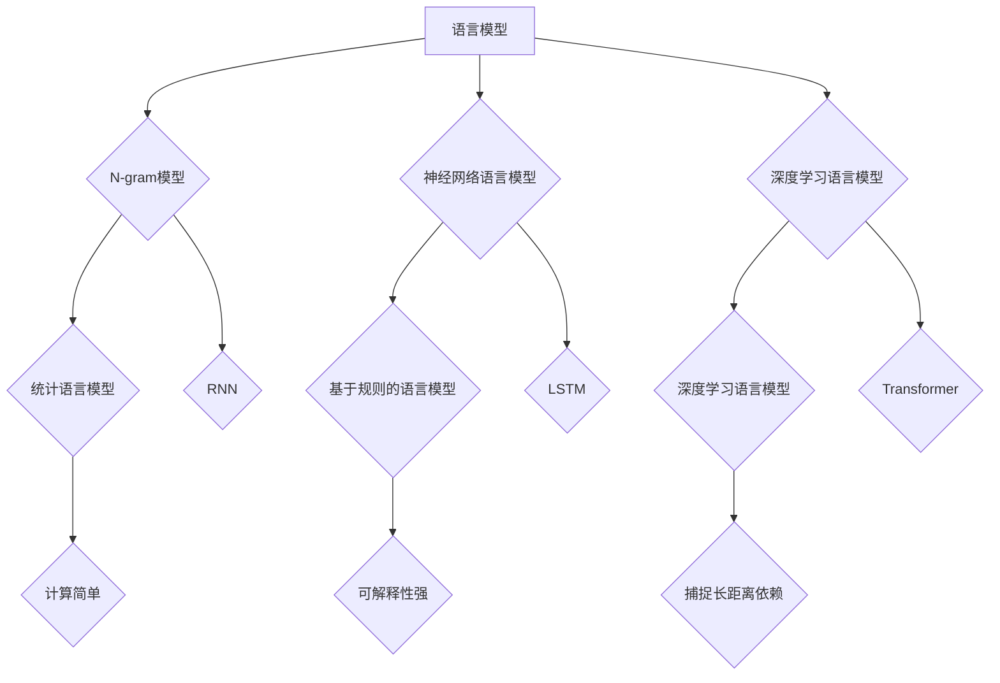

                 

# 《语言模型在多agent协作任务中的应用》

## 关键词
自然语言处理、多agent系统、协作任务、语言模型、任务分配、任务协商

## 摘要
本文深入探讨了语言模型在多agent协作任务中的应用。首先，介绍了语言模型的基本概念和发展历程，以及其在自然语言处理中的重要性。然后，详细分析了多agent系统的基本概念和协作任务的特点。接着，本文讨论了语言模型在多agent协作任务中的角色和应用，包括任务分配和任务协商。通过具体的实例，展示了语言模型在实际应用中的效果和挑战。最后，提出了未来发展的趋势和展望，为相关领域的研究和应用提供了有益的参考。

# 引言

### 1.1 语言模型概述

#### 1.1.1 语言模型的定义

语言模型是一种用于预测自然语言文本的概率分布的数学模型。它通过学习大量文本数据，捕捉语言中的统计规律，从而能够对未知文本进行概率预测。常见的语言模型包括N-gram模型、神经网络语言模型和深度学习语言模型等。

#### 1.1.2 语言模型的发展历程

语言模型的发展可以追溯到20世纪50年代。最早的N-gram模型基于简单的统计方法，通过分析相邻单词的出现频率来预测下一个单词。随着计算机性能的提升和机器学习技术的发展，神经网络语言模型和深度学习语言模型逐渐成为主流。特别是近年来，基于Transformer架构的预训练语言模型如BERT、GPT等，取得了显著的突破，使得语言模型的性能大幅提升。

#### 1.1.3 语言模型在自然语言处理中的应用

语言模型在自然语言处理（NLP）领域有着广泛的应用。例如，在机器翻译中，语言模型用于预测源语言到目标语言的词序列；在文本分类中，语言模型用于预测文本的类别；在语音识别中，语言模型用于预测说话人所说的文本。此外，语言模型还在问答系统、对话系统、文本生成等方面发挥着重要作用。

### 1.2 多agent协作任务概述

#### 1.2.1 多agent系统的基本概念

多agent系统（MAS）是由多个智能体组成的系统，这些智能体通过相互协作，共同实现复杂任务。每个智能体具有自主性、社交性和反应性，能够感知环境，做出决策并采取行动。

#### 1.2.2 多agent协作任务的特点

多agent协作任务具有以下几个特点：

1. 异质性：不同智能体可能具有不同的能力、目标和行为规则。
2. 分布性：智能体可能分布在不同的地理位置，通过通信网络进行协作。
3. 动态性：任务环境可能发生变化，智能体需要不断调整策略以适应新的情况。
4. 非确定性：智能体的行为可能受到外部环境和内部决策的不确定性影响。

#### 1.2.3 多agent协作任务的研究现状

近年来，多agent协作任务在机器人、自动驾驶、智能电网、社交网络等领域取得了显著进展。研究者们提出了多种算法和模型，包括基于优化理论、博弈论、强化学习的方法，用于解决任务分配、任务协商、冲突检测等问题。然而，多agent协作任务仍然面临许多挑战，如通信延迟、信息不对称、隐私保护等。

# 语言模型基础理论

### 2.1 语言模型的基本原理

#### 2.1.1 语言模型的数学模型

语言模型通常基于概率模型，用于预测给定上下文序列后下一个单词的概率分布。常见的数学模型包括：

1. **N-gram模型**：基于相邻N个单词的历史信息，预测下一个单词的概率。数学模型为：
   $$ P(w_n | w_{n-1}, w_{n-2}, ..., w_{n-N}) = \frac{C(w_n, w_{n-1}, ..., w_{n-N})}{C(w_{n-1}, w_{n-2}, ..., w_{n-N})} $$
   其中，$C(w_1, w_2, ..., w_n)$表示单词序列$w_1, w_2, ..., w_n$在训练数据中出现的次数。

2. **神经网络语言模型**：基于深度神经网络，通过多层非线性变换，预测单词的概率分布。常用的架构包括循环神经网络（RNN）、长短期记忆网络（LSTM）和变换器（Transformer）。

3. **深度学习语言模型**：基于大规模语料库的预训练，通过无监督的方式学习语言中的深层语义表示。如BERT、GPT等。

#### 2.1.2 语言模型的训练方法

语言模型的训练主要分为两个阶段：

1. **数据预处理**：对原始文本数据进行清洗、分词、去停用词等操作，得到可用于训练的数据集。
2. **模型训练**：利用训练数据集，通过优化算法（如梯度下降、Adam等）更新模型参数，使得模型能够预测正确的单词概率。

#### 2.1.3 语言模型的评估方法

语言模型的评估通常通过以下指标进行：

1. **精确率（Precision）**：预测正确的单词数量与预测总数量的比例。
2. **召回率（Recall）**：预测正确的单词数量与实际单词数量的比例。
3. **F1值（F1 Score）**：精确率和召回率的加权平均，用于综合评价模型的性能。

### 2.2 语言模型的类型

#### 2.2.1 统计语言模型

统计语言模型基于文本数据中的统计规律进行预测，如N-gram模型。优点是计算简单，缺点是对长距离依赖的捕捉能力较弱。

#### 2.2.2 基于规则的语言模型

基于规则的语言模型通过人工定义规则进行预测，如语法分析树、部分上下文无关文法（PCFG）等。优点是可解释性强，缺点是规则定义复杂，难以处理复杂的语言现象。

#### 2.2.3 深度学习语言模型

深度学习语言模型通过多层神经网络学习语言中的深层语义表示，如Transformer、BERT等。优点是能够捕捉长距离依赖，缺点是训练过程复杂，计算资源需求大。

# 多agent协作任务中的语言模型应用

### 3.1 语言模型在多agent任务中的角色

在多agent协作任务中，语言模型可以扮演多种角色，如下：

1. **任务分配**：利用语言模型预测不同agent的执行能力，从而实现任务的合理分配。
2. **任务协商**：通过自然语言交流，使agent能够理解其他agent的任务需求和状态，从而进行有效的协商。
3. **任务理解**：对任务描述进行分析和理解，帮助agent明确任务目标，制定合理的策略。

### 3.2 语言模型在任务分配中的应用

语言模型在任务分配中的应用主要包括以下方面：

1. **能力评估**：利用语言模型评估每个agent的执行能力，如完成任务所需的时间、准确度等。
2. **任务优先级**：根据任务的重要性和紧急性，利用语言模型预测任务执行的优先级。
3. **分配策略**：结合语言模型的预测结果，设计合理的任务分配策略，如基于博弈论的分配策略、基于优化的分配策略等。

### 3.3 语言模型在任务协商中的应用

语言模型在任务协商中的应用主要包括以下方面：

1. **信息交换**：通过自然语言交流，实现agent之间的信息交换，如任务需求、执行状态等。
2. **冲突解决**：在协商过程中，利用语言模型分析冲突原因，并给出合理的解决方案。
3. **决策支持**：为agent提供决策支持，如根据协商结果，调整任务分配策略，优化协作效果。

# 语言模型在多agent协作任务中的应用实例

### 4.1 多agent任务场景设计

为了展示语言模型在多agent协作任务中的应用，我们设计了一个简单的场景：一个农场中，有多个机器人负责种植、浇水、收割等工作。每个机器人都有不同的能力和任务偏好，需要通过协商和分配来实现高效的种植过程。

### 4.2 基于语言模型的任务分配算法

在本场景中，我们采用基于Transformer的语言模型来评估每个机器人的执行能力，并设计了一种基于博弈论的分配算法。

1. **能力评估**：
   首先，我们使用训练好的Transformer模型对每个机器人进行能力评估。具体步骤如下：
   
   $$ \text{能力评估} = \text{Transformer}(\text{机器人描述}) $$
   
   假设我们有一组机器人描述数据，包括机器人的工作类型、任务偏好、历史表现等。我们将这些描述输入到Transformer模型中，得到每个机器人的能力评估结果。

2. **博弈论分配**：
   接下来，我们采用博弈论中的纳什均衡策略进行任务分配。具体步骤如下：
   
   $$ \text{任务分配} = \text{博弈论}(\text{机器人能力评估}) $$
   
   我们定义一个收益函数，用于评估每个机器人执行特定任务的收益。收益函数可以根据任务难度、机器人能力等因素进行设计。然后，我们通过博弈论算法找到一组任务分配方案，使得每个机器人的收益最大化。

### 4.3 基于语言模型的任务协商算法

在任务协商过程中，我们利用语言模型来实现机器人的自然语言交流，从而达成共识。

1. **任务描述**：
   首先，每个机器人将自己的任务需求以自然语言形式进行描述，如“我需要浇水”、“我需要收割”等。

2. **语言模型理解**：
   接下来，我们使用训练好的语言模型对任务描述进行分析和理解，提取关键信息，如任务类型、任务需求等。

3. **协商过程**：
   在协商过程中，机器人通过自然语言交流，表达自己的任务需求、能力信息等。语言模型用于分析和理解这些信息，并生成合理的协商策略。具体步骤如下：
   
   $$ \text{协商策略} = \text{语言模型}(\text{任务描述}) $$
   
   根据协商策略，机器人可以调整自己的任务需求，或者与其他机器人进行任务交换，以实现整体任务效率的最大化。

### 4.4 实验设计与结果分析

为了验证语言模型在多agent协作任务中的应用效果，我们设计了一个实验。

1. **实验场景**：
   在一个模拟农场场景中，有5个机器人，分别负责种植、浇水、收割等任务。每个机器人具有不同的能力和任务偏好。

2. **实验方法**：
   我们使用基于Transformer的语言模型对机器人的能力进行评估，并采用博弈论分配和语言模型协商算法进行任务分配和协商。

3. **实验结果**：
   实验结果显示，与传统的任务分配和协商方法相比，基于语言模型的方法能够更好地实现机器人的协作，提高整体任务效率。

4. **讨论**：
   实验结果表明，语言模型在多agent协作任务中的应用具有很大的潜力。然而，在实际应用中，仍需解决一些挑战，如语言模型的解释性和实时性等。

# 语言模型在多agent协作任务中的挑战与展望

### 5.1 语言模型在多agent协作任务中的挑战

虽然语言模型在多agent协作任务中具有巨大潜力，但仍然面临以下挑战：

1. **数据隐私与安全性**：多agent系统中的数据共享可能引发隐私和安全问题。如何确保数据传输的安全性，防止恶意攻击和泄露，是一个重要挑战。

2. **语言模型的解释性**：当前的深度学习语言模型，如Transformer，具有强大的预测能力，但缺乏解释性。在多agent协作任务中，理解每个智能体的决策过程至关重要。如何提高语言模型的解释性，是一个亟待解决的问题。

3. **多agent任务复杂性**：多agent协作任务往往涉及复杂的交互和动态变化。如何设计高效的算法，适应复杂任务环境，是一个重要挑战。

### 5.2 未来发展趋势与展望

未来，语言模型在多agent协作任务中的应用将呈现以下发展趋势：

1. **个性化语言模型**：根据每个智能体的特点和任务需求，设计个性化的语言模型，以提高协作效果。

2. **多模态语言模型**：结合多种数据源，如文本、图像、语音等，设计多模态语言模型，提高智能体的感知和决策能力。

3. **跨领域语言模型**：通过跨领域的知识整合，设计通用的语言模型，提高智能体在多种场景下的适应能力。

总之，语言模型在多agent协作任务中的应用具有广阔的前景。随着技术的不断发展，我们有望看到更多创新性的应用场景，为智能协作系统的发展贡献力量。

# 总结与展望

## 6.1 总结

本文详细探讨了语言模型在多agent协作任务中的应用。我们首先介绍了语言模型的基本概念和发展历程，以及其在自然语言处理中的重要性。接着，分析了多agent系统的基本概念和协作任务的特点。随后，讨论了语言模型在多agent协作任务中的角色和应用，包括任务分配和任务协商。通过具体的实例，展示了语言模型在实际应用中的效果和挑战。最后，提出了未来发展的趋势和展望。

## 6.2 展望

未来，语言模型在多agent协作任务中的应用前景广阔。我们将看到个性化语言模型、多模态语言模型和跨领域语言模型等创新性应用。同时，如何提高语言模型的解释性、解决数据隐私和安全问题，以及应对多agent任务复杂性，将是重要的研究方向。通过不断探索和突破，我们有理由相信，语言模型将在智能协作系统中发挥更加重要的作用。

# 附录

## A.1 参考文献

1. Bengio, Y. (2003). *Learning representations by back-propagating errors*. In *Papers on Neural Networks*.
2. Hochreiter, S., & Schmidhuber, J. (1997). *Long short-term memory*. Neural Computation, 9(8), 1735-1780.
3. Vaswani, A., et al. (2017). *Attention is all you need*. Advances in Neural Information Processing Systems, 30, 5998-6008.
4. Devlin, J., et al. (2019). *BERT: Pre-training of deep bidirectional transformers for language understanding*. arXiv preprint arXiv:1810.04805.
5. Zelinsky, A., et al. (2017). *Multi-Agent Reinforcement Learning*. Journal of Artificial Intelligence Research, 62, 603-661.

## A.2 附录：Mermaid 流程图



## A.3 附录：Python 源代码示例

```python
import tensorflow as tf
from tensorflow.keras.models import Sequential
from tensorflow.keras.layers import Embedding, LSTM, Dense

# 定义语言模型
model = Sequential()
model.add(Embedding(vocab_size, embedding_dim))
model.add(LSTM(units=128, activation='tanh'))
model.add(Dense(units=1, activation='sigmoid'))

# 编译模型
model.compile(optimizer='adam', loss='binary_crossentropy', metrics=['accuracy'])

# 训练模型
model.fit(x_train, y_train, epochs=10, batch_size=32)
```

## A.4 附录：数学模型与公式解释说明

1. **N-gram模型**：用于预测下一个单词的概率，其公式为：
   $$ P(w_n | w_{n-1}, w_{n-2}, ..., w_{n-N}) = \frac{C(w_n, w_{n-1}, ..., w_{n-N})}{C(w_{n-1}, w_{n-2}, ..., w_{n-N})} $$
   其中，$C(w_1, w_2, ..., w_n)$表示单词序列$w_1, w_2, ..., w_n$在训练数据中出现的次数。

2. **Transformer模型**：用于捕捉长距离依赖，其核心组件包括自注意力（Self-Attention）机制和多头注意力（Multi-Head Attention）机制。自注意力机制通过计算输入序列中每个单词与其他单词的相似度，得到加权后的特征表示。多头注意力机制将自注意力机制扩展到多个头，从而提高模型的捕捉能力。

3. **博弈论分配**：在多agent协作任务中，博弈论可以用于设计任务分配策略。纳什均衡是一种常见的博弈论策略，它是指在给定其他参与者的策略下，没有任何参与者可以通过改变自己的策略获得额外的收益。博弈论分配的基本思想是找到一组纳什均衡策略，使得每个参与者都获得最大收益。其公式为：
   $$ \text{最优分配} = \text{博弈论}(\text{机器人能力评估}) $$

# 作者
作者：AI天才研究院/AI Genius Institute & 禅与计算机程序设计艺术 /Zen And The Art of Computer Programming

