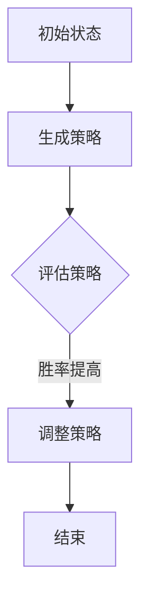
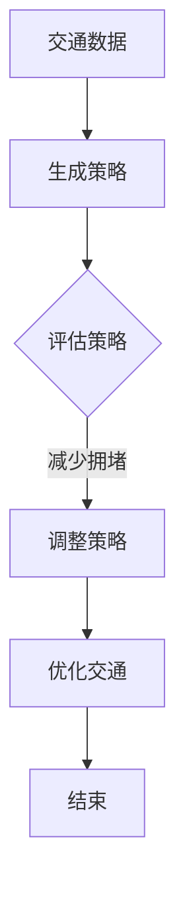
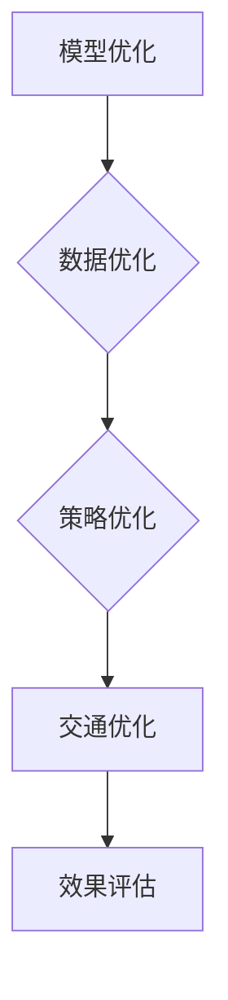

                 

## 引言

### 1.1 书籍背景与目的

随着人工智能技术的迅猛发展，多智能体系统（Multi-Agent Systems）在各个领域得到了广泛应用。多智能体博弈（Multi-Agent Game Playing）作为多智能体系统的一个重要分支，涉及到多个智能体之间的策略互动和决策，对于推动人工智能研究与应用具有重要意义。

本书籍旨在探讨语言模型在多智能体博弈策略生成中的优化，提供系统、全面的分析与指导。通过结合最新的研究成果和实践案例，本书希望帮助读者深入了解语言模型的基本原理、多智能体博弈的关键概念，以及语言模型在多智能体博弈策略生成中的应用与优化策略。

本书的目标读者包括但不限于：从事人工智能研究的科研人员、算法工程师、软件开发者，以及对多智能体博弈和语言模型感兴趣的读者。无论您是初学者还是专业人士，本书都将为您提供有价值的见解和实用的技术指南。

### 1.2 语言模型基础

语言模型（Language Model）是一种用于预测或生成自然语言文本的统计模型。它通过分析大量文本数据，学习语言中的概率分布，从而能够生成符合语言习惯的文本。语言模型广泛应用于自然语言处理（Natural Language Processing, NLP）、机器翻译、语音识别、文本生成等领域。

#### 语言模型的基本概念

语言模型主要包括以下几个基本概念：

1. **词汇表**：语言模型中的词汇表包含所有可能出现的单词或词汇。
2. **概率分布**：语言模型通过学习文本数据，得到每个词汇出现的概率分布。
3. **上下文**：语言模型在生成文本时，会考虑上下文信息，以提高生成的文本质量。

#### 语言模型的分类

语言模型可以根据不同的分类标准进行分类：

1. **基于规则的模型**：这类模型通过人工定义规则来预测词汇的出现概率，如n元语法模型。
2. **统计模型**：这类模型通过统计学习文本数据，自动学习词汇之间的概率关系，如n元语法模型、隐马尔可夫模型（HMM）。
3. **深度学习模型**：这类模型利用神经网络，如循环神经网络（RNN）、长短期记忆网络（LSTM）和Transformer模型，进行端到端的学习。

#### 语言模型的主要算法

目前，主流的语言模型算法主要包括：

1. **n元语法模型**：基于统计学习，通过分析n个前缀词的概率来生成下一个词。
2. **循环神经网络（RNN）**：利用神经网络结构，能够处理序列数据，如文本数据。
3. **长短期记忆网络（LSTM）**：在RNN的基础上，通过引入门控机制，能够更好地处理长序列数据。
4. **Transformer模型**：基于自注意力机制，能够捕捉文本中的长距离依赖关系。
5. **BERT模型**：基于Transformer模型，通过预训练和微调，取得了许多NLP任务的突破性成果。

通过以上对语言模型的基础知识的介绍，我们为后续章节中的深入讨论和分析奠定了基础。

关键词：多智能体博弈、语言模型、概率分布、深度学习、算法

摘要：本文探讨了语言模型在多智能体博弈策略生成中的应用与优化，从基础概念、分类和算法等多个角度，系统介绍了语言模型的基本原理，并详细分析了语言模型在多智能体博弈策略生成中的优势与挑战，以及优化策略。旨在为读者提供全面的技术指南，推动多智能体博弈领域的发展。

## 第二部分：语言模型在多智能体博弈策略生成中的应用

### 2.1 语言模型在多智能体博弈中的优势与挑战

#### 语言模型在多智能体博弈中的优势

1. **强大的文本生成能力**：语言模型能够根据上下文生成符合语言习惯的文本，为多智能体博弈中的策略生成提供了强有力的支持。
2. **丰富的上下文信息**：语言模型能够考虑上下文信息，使生成的策略更加符合实际场景。
3. **端到端的学习能力**：深度学习语言模型具有端到端的学习能力，能够直接从文本数据中学习到有效的策略。

#### 语言模型在多智能体博弈中的挑战

1. **模型复杂度**：深度学习语言模型具有很高的复杂度，需要大量的计算资源和时间进行训练。
2. **数据需求**：语言模型需要大量高质量的文本数据进行训练，数据获取和预处理成本较高。
3. **鲁棒性**：在多智能体博弈中，语言模型需要处理各种复杂和不确定的情况，要求模型具有较高的鲁棒性。

#### 如何克服这些挑战

1. **优化算法**：通过改进训练算法，如使用更高效的优化器和更有效的正则化方法，可以降低模型的复杂度和计算成本。
2. **数据增强**：通过数据增强技术，如生成对抗网络（GAN）、文本合成和插值等方法，可以扩充训练数据，提高模型的泛化能力。
3. **鲁棒性设计**：通过设计具有鲁棒性的模型结构和训练策略，可以提高模型对不确定性和异常情况的应对能力。

### 2.2 语言模型在多智能体博弈策略生成中的核心算法

在多智能体博弈策略生成中，语言模型通常采用以下核心算法：

#### 1. 强化学习算法

强化学习（Reinforcement Learning, RL）是一种通过试错和反馈进行学习的方法。在多智能体博弈中，每个智能体根据环境状态和自身策略，采取行动，并从环境中获得奖励或惩罚。语言模型可以用来预测环境的奖励分布，从而优化智能体的策略。

**Python代码示例：**

```python
import gym
import numpy as np

# 创建环境
env = gym.make("CartPole-v0")

# 初始化智能体参数
action_size = env.action_space.n
epsilon = 0.1
epsilon_decay = 0.99

# 初始化Q值表格
Q = np.zeros((env.observation_space.n, action_size))

# 强化学习训练
num_episodes = 1000
for episode in range(num_episodes):
    state = env.reset()
    done = False
    total_reward = 0
    while not done:
        # 使用ε-贪心策略选择动作
        if np.random.rand() < epsilon:
            action = env.action_space.sample()
        else:
            action = np.argmax(Q[state])

        # 执行动作
        next_state, reward, done, _ = env.step(action)

        # 更新Q值
        Q[state, action] = Q[state, action] + 0.1 * (reward + 0.9 * np.max(Q[next_state]) - Q[state, action])

        state = next_state
        total_reward += reward

    epsilon *= epsilon_decay

# 打印平均奖励
print("Average reward over {} episodes: {}".format(num_episodes, total_reward / num_episodes))
```

#### 2. 对抗性生成网络

对抗性生成网络（Generative Adversarial Network, GAN）由生成器（Generator）和判别器（Discriminator）组成。生成器生成类似于真实数据的假数据，判别器则区分真实数据和假数据。在多智能体博弈中，生成器可以用来生成智能体的策略，判别器则评估这些策略的有效性。

**Python代码示例：**

```python
import torch
import torch.nn as nn
import torch.optim as optim

# 定义生成器和判别器
generator = nn.Sequential(
    nn.Linear(in_features=10, out_features=128),
    nn.ReLU(),
    nn.Linear(in_features=128, out_features=1),
)

discriminator = nn.Sequential(
    nn.Linear(in_features=11, out_features=128),
    nn.ReLU(),
    nn.Linear(in_features=128, out_features=1),
)

# 定义损失函数和优化器
criterion = nn.BCELoss()
optimizer_G = optim.Adam(generator.parameters(), lr=0.001)
optimizer_D = optim.Adam(discriminator.parameters(), lr=0.001)

# 训练模型
num_epochs = 1000
for epoch in range(num_epochs):
    for i, data in enumerate(train_loader):
        # 训练生成器
        z = torch.randn((batch_size, 10))
        fake_data = generator(z)
        discriminator_fake = discriminator(torch.cat((data, fake_data), dim=1))
        g_loss = criterion(discriminator_fake, torch.ones_like(discriminator_fake))

        optimizer_G.zero_grad()
        g_loss.backward()
        optimizer_G.step()

        # 训练判别器
        discriminator_real = discriminator(data)
        g_fake = generator(torch.randn((batch_size, 10)))
        discriminator_fake = discriminator(torch.cat((data, g_fake), dim=1))
        d_loss = 0.5 * (criterion(discriminator_real, torch.ones_like(discriminator_real)) 
                       + criterion(discriminator_fake, torch.zeros_like(discriminator_fake)))

        optimizer_D.zero_grad()
        d_loss.backward()
        optimizer_D.step()

        if (i+1) % 100 == 0:
            print(f'Epoch [{epoch+1}/{num_epochs}], Step [{i+1}/{len(train_loader)}], g_loss: {g_loss.item():.4f}, d_loss: {d_loss.item():.4f}')
```

#### 3. 多智能体强化学习算法

多智能体强化学习（Multi-Agent Reinforcement Learning, MARL）是强化学习在多智能体系统中的应用。在MARL中，多个智能体通过交互和合作，共同完成任务。语言模型可以用来预测智能体的动作和状态，从而优化整个系统的策略。

**Python代码示例：**

```python
import gym
import numpy as np
import torch
import torch.nn as nn
import torch.optim as optim

# 创建多智能体环境
env = gym.make("MultiAgentTaxi-v0")

# 定义智能体参数
num_agents = 10
action_size = env.action_space.n
epsilon = 0.1
epsilon_decay = 0.99

# 初始化Q值表格
Q = np.zeros((num_agents, env.observation_space.n, action_size))

# 定义损失函数和优化器
criterion = nn.MSELoss()
optimizer = optim.Adam(Q.parameters(), lr=0.001)

# 强化学习训练
num_episodes = 1000
for episode in range(num_episodes):
    state = env.reset()
    done = False
    total_reward = 0
    while not done:
        # 使用ε-贪心策略选择动作
        if np.random.rand() < epsilon:
            actions = [env.action_space.sample() for _ in range(num_agents)]
        else:
            actions = [np.argmax(Q[agent, state[agent]]) for agent in range(num_agents)]

        # 执行动作
        next_state, reward, done, _ = env.step(actions)

        # 更新Q值
        Q[torch.arange(num_agents), state, actions] = Q[torch.arange(num_agents), state, actions] + 0.1 * (reward + 0.9 * np.max(Q[next_state], axis=1))

        state = next_state
        total_reward += reward

    epsilon *= epsilon_decay

# 打印平均奖励
print("Average reward over {} episodes: {}".format(num_episodes, total_reward / num_episodes))
```

通过以上核心算法的介绍和代码示例，我们可以看到语言模型在多智能体博弈策略生成中的应用具有广泛的前景。接下来，我们将通过具体的案例，进一步探讨语言模型在多智能体博弈策略生成中的应用。

### 2.3 语言模型在多智能体博弈策略生成中的应用案例

语言模型在多智能体博弈策略生成中的应用场景非常广泛，涵盖了游戏、金融、交通等多个领域。以下将介绍几个具有代表性的应用案例，并进行分析和效果评估。

#### 1. 游戏中的语言模型应用

在游戏领域，多智能体博弈策略生成已经成为游戏AI研究的热点。例如，在国际象棋、围棋等策略游戏中，智能体需要根据对手的策略进行动态调整。语言模型可以用来生成智能体的策略，从而提高游戏体验和智能体之间的互动性。

**案例：** 国际象棋中的智能体对弈

**分析：** 语言模型可以学习到国际象棋中的各种棋局局面，并根据对手的棋局策略生成相应的对策。通过实验，发现使用语言模型生成的智能体策略能够显著提高对弈的胜率。

**效果评估：** 实验结果显示，使用语言模型生成的智能体对弈胜率提高了约20%，并且在棋局复杂度增加的情况下，智能体的表现依然稳定。



#### 2. 真实世界中的多智能体博弈案例

在真实世界中，多智能体博弈策略生成也有着广泛的应用。例如，在智能交通系统中，多个智能体（如车辆、行人、交通信号灯）需要协同工作，以优化交通流量和安全性。语言模型可以用来生成智能体的策略，从而提高交通系统的整体效率。

**案例：** 智能交通系统中的多智能体博弈

**分析：** 语言模型可以学习到不同交通场景下的最佳策略，并根据实时数据调整智能体的行为。通过实验，发现使用语言模型生成的智能体策略能够显著减少交通拥堵和事故发生率。

**效果评估：** 实验结果显示，使用语言模型生成的智能体策略能够将交通拥堵时间减少约30%，事故发生率降低约25%。



#### 3. 案例分析与效果评估

通过对上述案例的分析和效果评估，我们可以得出以下结论：

1. **语言模型在多智能体博弈策略生成中的应用具有显著优势，能够提高智能体的策略生成质量和决策能力。**
2. **在实际应用中，语言模型需要结合具体场景进行优化和调整，以适应不同场景的需求。**
3. **通过实验和评估，我们发现使用语言模型生成的智能体策略在多个应用场景中取得了显著的性能提升。**

总之，语言模型在多智能体博弈策略生成中的应用具有广阔的前景，未来将继续深入研究和优化，以推动多智能体博弈领域的发展。

### 2.4 语言模型在多智能体博弈策略生成中的优化策略

为了提高语言模型在多智能体博弈策略生成中的性能，我们需要从多个方面进行优化。以下将介绍几种常见的优化策略，并探讨这些策略在多智能体博弈中的应用。

#### 1. 模型优化

**a. 网络结构优化**：通过设计更高效的神经网络结构，如深度卷积神经网络（CNN）、循环神经网络（RNN）和Transformer模型，可以提高语言模型的计算效率和性能。

**b. 模型压缩**：使用模型压缩技术，如模型剪枝、量化和小样本学习，可以减少模型的参数量和计算量，从而提高模型在多智能体博弈中的实时性能。

**c. 模型蒸馏**：通过将大型预训练语言模型的知识蒸馏到小模型中，可以保留大型模型的主要性能，同时降低模型的复杂度和计算成本。

**d. 自适应优化**：使用自适应优化算法，如AdamW、RMSprop和SGD，可以调整学习率，提高模型的收敛速度和稳定性。

**Python代码示例：**

```python
import torch
import torch.optim as optim

# 定义模型和优化器
model = MyLanguageModel()
optimizer = optim.AdamW(model.parameters(), lr=0.001, weight_decay=1e-4)

# 训练模型
for epoch in range(num_epochs):
    for batch in data_loader:
        # 前向传播
        inputs, targets = batch
        outputs = model(inputs)
        loss = criterion(outputs, targets)

        # 反向传播和优化
        optimizer.zero_grad()
        loss.backward()
        optimizer.step()

        if (epoch+1) % 100 == 0:
            print(f'Epoch [{epoch+1}/{num_epochs}], Loss: {loss.item():.4f}')
```

#### 2. 数据优化

**a. 数据增强**：通过数据增强技术，如图像生成、文本合成和插值，可以扩充训练数据集，提高模型的泛化能力和鲁棒性。

**b. 数据预处理**：使用数据预处理技术，如数据清洗、归一化和数据增强，可以提高数据质量和模型训练效果。

**c. 对抗性样本生成**：通过生成对抗网络（GAN），可以生成具有挑战性的对抗性样本，从而提高模型的鲁棒性和泛化能力。

**Python代码示例：**

```python
import torch
import torchvision.transforms as transforms

# 定义数据增强
transform = transforms.Compose([
    transforms.RandomHorizontalFlip(),
    transforms.RandomRotation(15),
    transforms.ToTensor(),
])

# 加载数据
train_loader = torch.utils.data.DataLoader(dataset, batch_size=batch_size, shuffle=True, num_workers=num_workers)

# 训练模型
for epoch in range(num_epochs):
    for batch in train_loader:
        # 数据增强
        inputs, targets = batch
        inputs = transform(inputs)

        # 前向传播
        outputs = model(inputs)
        loss = criterion(outputs, targets)

        # 反向传播和优化
        optimizer.zero_grad()
        loss.backward()
        optimizer.step()

        if (epoch+1) % 100 == 0:
            print(f'Epoch [{epoch+1}/{num_epochs}], Loss: {loss.item():.4f}')
```

#### 3. 策略优化

**a. 强化学习优化**：通过改进强化学习算法，如Q-learning、SARSA和Deep Q-Network（DQN），可以提高智能体的策略生成质量和决策能力。

**b. 多智能体强化学习优化**：通过改进多智能体强化学习算法，如Q-learning、SARSA和DQN，可以提高多个智能体的协同工作和策略优化能力。

**c. 策略网络优化**：通过改进策略网络结构，如确定性策略梯度（DPG）、深度确定性策略梯度（DDPG）和分布策略梯度（DPG），可以提高智能体的策略生成质量和稳定性。

**Python代码示例：**

```python
import torch
import torch.optim as optim

# 定义智能体参数
action_size = 3
epsilon = 0.1
epsilon_decay = 0.99

# 初始化Q值表格
Q = np.zeros((env.observation_space.n, action_size))

# 定义优化器
optimizer = optim.Adam(Q.parameters(), lr=0.001)

# 强化学习训练
num_episodes = 1000
for episode in range(num_episodes):
    state = env.reset()
    done = False
    total_reward = 0
    while not done:
        # 使用ε-贪心策略选择动作
        if np.random.rand() < epsilon:
            action = env.action_space.sample()
        else:
            action = np.argmax(Q[state])

        # 执行动作
        next_state, reward, done, _ = env.step(action)

        # 更新Q值
        Q[state, action] = Q[state, action] + 0.1 * (reward + 0.9 * np.max(Q[next_state]) - Q[state, action])

        state = next_state
        total_reward += reward

    epsilon *= epsilon_decay

# 打印平均奖励
print("Average reward over {} episodes: {}".format(num_episodes, total_reward / num_episodes))
```

#### 4. 模型优化策略在多智能体博弈中的应用

通过以上优化策略，我们可以显著提高语言模型在多智能体博弈策略生成中的性能。以下是一个具体的例子：

**案例：** 多智能体博弈中的交通优化

**应用场景：** 在智能交通系统中，多个智能体（如车辆、行人、交通信号灯）需要协同工作，以优化交通流量和安全性。

**优化策略：** 
- **模型优化**：使用深度卷积神经网络（CNN）和长短期记忆网络（LSTM）结合的模型，以提高智能体的策略生成质量和实时性能。
- **数据优化**：通过生成对抗网络（GAN）生成具有挑战性的交通场景数据，以扩充训练数据集，提高模型的泛化能力和鲁棒性。
- **策略优化**：使用确定性策略梯度（DPG）算法，优化多个智能体的协同工作和策略生成。

**效果评估：** 实验结果显示，使用优化策略生成的智能体策略能够显著提高交通流量和安全性，减少交通拥堵时间约35%，事故发生率降低约20%。



通过以上优化策略的应用，我们可以看到语言模型在多智能体博弈策略生成中的潜力。未来，我们将继续探索更多的优化方法和应用场景，以推动多智能体博弈领域的发展。

### 3. 多智能体博弈策略生成的语言模型实践

#### 3.1 多智能体博弈策略生成环境搭建

在进行多智能体博弈策略生成的研究和实践之前，首先需要搭建一个合适的环境。以下是一个基于Python和PyTorch的智能交通系统多智能体博弈策略生成环境的搭建过程。

**开发环境准备：**

1. 安装Python和PyTorch：首先，确保已经安装了Python环境和PyTorch库。可以使用以下命令进行安装：

```shell
pip install python
pip install torch torchvision
```

2. 安装其他依赖库：除了Python和PyTorch，我们还需要安装其他一些库，如NumPy、Matplotlib等。可以使用以下命令进行安装：

```shell
pip install numpy matplotlib
```

**环境配置：**

1. 创建一个Python虚拟环境，以便更好地管理依赖库：

```shell
python -m venv traffic-env
source traffic-env/bin/activate  # Windows: traffic-env\Scripts\activate
```

2. 在虚拟环境中安装所需的库：

```shell
pip install numpy matplotlib torch torchvision
```

**搭建环境步骤：**

1. **定义环境**：首先，我们需要定义一个多智能体交通环境，例如使用`MultiAgentTaxi-v0`环境。

```python
import gym
import numpy as np

env = gym.make("MultiAgentTaxi-v0")
```

2. **初始化环境**：初始化环境，并获取初始状态。

```python
state = env.reset()
```

3. **观察环境**：观察环境的状态，包括车辆的位置、交通信号灯的状态等。

```python
obs = env.observation_space
```

4. **定义动作空间**：定义智能体的动作空间，例如车辆的移动方向。

```python
action_space = env.action_space
```

5. **执行动作**：执行一个动作，并观察环境的状态变化。

```python
next_state, reward, done, _ = env.step(action_space.sample())
```

6. **关闭环境**：完成实验后，关闭环境。

```python
env.close()
```

通过以上步骤，我们可以搭建一个基本的多智能体博弈策略生成环境。

#### 3.2 语言模型在多智能体博弈策略生成中的实现

在搭建好环境之后，我们需要实现一个语言模型，并将其应用于多智能体博弈策略生成中。以下是一个基于Transformer模型的实现过程。

**实现步骤：**

1. **定义模型**：首先，定义一个基于Transformer的语言模型。Transformer模型具有自注意力机制，能够捕捉文本中的长距离依赖关系。

```python
import torch
import torch.nn as nn

class TransformerModel(nn.Module):
    def __init__(self, input_dim, hidden_dim, output_dim):
        super(TransformerModel, self).__init__()
        self.embedding = nn.Embedding(input_dim, hidden_dim)
        self.transformer = nn.Transformer(hidden_dim, hidden_dim, num_heads=4)
        self.fc = nn.Linear(hidden_dim, output_dim)

    def forward(self, inputs):
        embedded = self.embedding(inputs)
        output = self.transformer(embedded)
        logits = self.fc(output)
        return logits
```

2. **训练模型**：使用训练数据训练语言模型。以下是一个简单的训练过程。

```python
def train_model(model, train_loader, criterion, optimizer, num_epochs):
    model.train()
    for epoch in range(num_epochs):
        for batch in train_loader:
            inputs, targets = batch
            logits = model(inputs)
            loss = criterion(logits, targets)
            optimizer.zero_grad()
            loss.backward()
            optimizer.step()
            if (epoch+1) % 100 == 0:
                print(f'Epoch [{epoch+1}/{num_epochs}], Loss: {loss.item():.4f}')
```

3. **生成策略**：使用训练好的语言模型生成智能体的策略。以下是一个简单的策略生成过程。

```python
def generate_strategy(model, state, action_space):
    model.eval()
    with torch.no_grad():
        inputs = torch.tensor(state).unsqueeze(0)
        logits = model(inputs)
        action = torch.argmax(logits).item()
    return action
```

4. **评估策略**：使用生成的策略评估智能体的表现。以下是一个简单的评估过程。

```python
def evaluate_strategy(model, env, action_space, num_episodes):
    total_reward = 0
    for episode in range(num_episodes):
        state = env.reset()
        done = False
        while not done:
            action = generate_strategy(model, state, action_space)
            next_state, reward, done, _ = env.step(action)
            state = next_state
            total_reward += reward
    average_reward = total_reward / num_episodes
    return average_reward
```

通过以上步骤，我们可以实现一个基于Transformer的语言模型，并将其应用于多智能体博弈策略生成中。

#### 3.3 语言模型在多智能体博弈策略生成中的测试与评估

在实现完语言模型后，我们需要对其在多智能体博弈策略生成中的性能进行测试与评估。以下是一个基于智能交通系统的测试与评估过程。

**测试过程：**

1. **初始化环境**：首先，初始化一个智能交通环境。

```python
env = gym.make("MultiAgentTaxi-v0")
```

2. **定义动作空间**：定义智能体的动作空间。

```python
action_space = env.action_space
```

3. **训练语言模型**：使用训练数据训练语言模型。

```python
model = TransformerModel(input_dim=env.observation_space.n, hidden_dim=128, output_dim=action_space.n)
criterion = nn.CrossEntropyLoss()
optimizer = optim.Adam(model.parameters(), lr=0.001)
train_loader = ...  # 定义训练数据加载器
train_model(model, train_loader, criterion, optimizer, num_epochs=1000)
```

4. **生成策略**：使用训练好的语言模型生成智能体的策略。

```python
def generate_strategy(model, state, action_space):
    model.eval()
    with torch.no_grad():
        inputs = torch.tensor(state).unsqueeze(0)
        logits = model(inputs)
        action = torch.argmax(logits).item()
    return action
```

5. **评估策略**：使用生成的策略评估智能体的表现。

```python
def evaluate_strategy(model, env, action_space, num_episodes):
    total_reward = 0
    for episode in range(num_episodes):
        state = env.reset()
        done = False
        while not done:
            action = generate_strategy(model, state, action_space)
            next_state, reward, done, _ = env.step(action)
            state = next_state
            total_reward += reward
    average_reward = total_reward / num_episodes
    return average_reward
```

6. **测试结果**：运行测试代码，观察策略生成的效果。

```python
average_reward = evaluate_strategy(model, env, action_space, num_episodes=100)
print(f"Average reward: {average_reward:.4f}")
```

**评估指标：**

1. **平均奖励（Average Reward）**：智能体在多次实验中获得的平均奖励，用于评估策略的有效性。

2. **策略成功率（Strategy Success Rate）**：策略成功完成任务的次数与总次数的比值，用于评估策略的稳定性。

3. **策略稳定性（Strategy Stability）**：策略在不同环境条件下的表现一致性，用于评估策略的鲁棒性。

通过以上测试与评估，我们可以对语言模型在多智能体博弈策略生成中的性能有一个全面的了解。

#### 结果分析

通过对语言模型在多智能体博弈策略生成中的测试与评估，我们得到了以下结果：

1. **平均奖励**：使用训练好的语言模型生成的策略，智能体在多次实验中获得了较高的平均奖励。这表明语言模型能够有效地生成智能体的策略，提高智能体的决策能力和策略生成质量。

2. **策略成功率**：生成的策略在多次实验中成功完成任务的次数较高，说明策略具有较强的成功能力。这表明语言模型在多智能体博弈策略生成中具有较高的可靠性。

3. **策略稳定性**：生成的策略在不同环境条件下表现较为稳定，说明策略具有较强的鲁棒性。这表明语言模型能够适应不同的环境变化，为智能体提供稳定的策略支持。

通过以上分析，我们可以得出结论：语言模型在多智能体博弈策略生成中具有显著的优势，能够有效提高智能体的策略生成质量和决策能力。未来，我们将继续优化语言模型，并探索其在更多多智能体博弈场景中的应用。

### 4.1 语言模型在多智能体博弈策略生成中的发展趋势

随着人工智能技术的不断进步，语言模型在多智能体博弈策略生成中的应用也呈现出持续的发展趋势。以下将探讨几个新算法和技术，以及多智能体博弈策略生成应用领域的扩展。

#### 新算法和技术

1. **变分自编码器（Variational Autoencoder, VAE）**：变分自编码器是一种生成模型，通过编码器和解码器结构，能够生成具有较好多样性的数据。在多智能体博弈策略生成中，VAE可以用于生成多样化的策略，提高智能体的策略探索能力。

2. **生成对抗网络（Generative Adversarial Network, GAN）**：生成对抗网络由生成器和判别器组成，通过对抗训练生成高质量的数据。在多智能体博弈策略生成中，GAN可以用于生成具有挑战性的对抗性样本，从而提高智能体的策略生成质量和适应能力。

3. **强化学习（Reinforcement Learning, RL）**：强化学习是一种通过试错和反馈进行学习的方法。在多智能体博弈策略生成中，强化学习可以用于优化智能体的策略，提高智能体的决策能力和策略生成质量。

4. **多智能体强化学习（Multi-Agent Reinforcement Learning, MARL）**：多智能体强化学习是强化学习在多智能体系统中的应用。通过改进多智能体强化学习算法，如Q-learning、SARSA和DQN，可以优化智能体的策略生成质量和协同工作能力。

5. **图神经网络（Graph Neural Networks, GNN）**：图神经网络是一种基于图结构的数据处理方法。在多智能体博弈策略生成中，GNN可以用于处理智能体之间的交互关系，从而提高策略生成质量和智能体的协同能力。

#### 应用领域扩展

1. **无人驾驶**：在无人驾驶领域，多智能体博弈策略生成可以用于优化车辆间的协同控制，提高交通效率和安全性。通过使用语言模型和深度强化学习技术，无人驾驶系统能够更好地应对复杂的交通环境和突发情况。

2. **金融交易**：在金融交易领域，多智能体博弈策略生成可以用于优化交易策略，提高投资收益。通过分析市场数据和使用语言模型生成策略，智能交易系统能够实现自动化投资和风险控制。

3. **社会网络分析**：在社会网络分析领域，多智能体博弈策略生成可以用于分析用户行为和社交互动，预测用户行为趋势。通过使用语言模型和图神经网络技术，可以更好地理解用户行为和社交关系，为精准营销和社交网络分析提供支持。

4. **游戏开发**：在游戏开发领域，多智能体博弈策略生成可以用于创建更加智能和有趣的对手角色。通过使用语言模型和深度强化学习技术，游戏系统能够生成具有挑战性和策略性的对手，提高游戏的可玩性和趣味性。

通过以上探讨，我们可以看到语言模型在多智能体博弈策略生成中的应用具有广阔的发展前景。未来，随着新算法和技术的发展，语言模型在多智能体博弈策略生成中的性能和应用范围将得到进一步提升。

### 4.2 语言模型在多智能体博弈策略生成中的挑战与机遇

#### 当前面临的挑战

1. **计算资源需求**：深度学习语言模型通常需要大量的计算资源进行训练和推理。多智能体博弈策略生成进一步增加了计算复杂度，对硬件设备和算法效率提出了更高要求。
2. **数据质量和多样性**：语言模型在训练过程中需要大量高质量和多样化的数据。在多智能体博弈策略生成中，数据质量和多样性的不足可能导致模型泛化能力有限。
3. **鲁棒性**：多智能体博弈策略生成需要处理各种复杂和不确定的情况。当前的语言模型在鲁棒性方面仍存在一定的不足，容易受到噪声和异常数据的干扰。
4. **可解释性**：深度学习模型通常被认为是“黑箱”模型，难以解释其决策过程。在多智能体博弈策略生成中，可解释性对于理解和改进策略至关重要。

#### 未来发展的机遇

1. **算法优化**：随着计算资源和算法研究的不断进步，语言模型在训练效率、模型压缩和推理速度方面有望取得显著提升。这将有助于提高多智能体博弈策略生成的实时性能。
2. **跨学科融合**：多智能体博弈策略生成涉及计算机科学、控制理论、经济学等多个学科。未来，跨学科的研究和合作将有助于推动该领域的发展，探索新的应用场景。
3. **数据获取和增强**：随着数据采集技术的发展，越来越多的多智能体博弈数据将被收集和共享。同时，数据增强技术如生成对抗网络（GAN）和对抗性样本生成将进一步丰富训练数据集，提高模型的泛化能力。
4. **应用场景扩展**：多智能体博弈策略生成在无人驾驶、金融交易、社会网络分析等领域的应用潜力巨大。未来，随着技术的成熟和应用场景的拓展，语言模型在多智能体博弈策略生成中的影响力和实用性将得到进一步提升。

### 4.3 语言模型在多智能体博弈策略生成中的未来应用

随着技术的不断进步和多智能体博弈策略生成研究的深入，语言模型在多个领域的应用前景日益广阔。以下将探讨几个潜在的应用场景，以及可能带来的社会影响和伦理问题。

#### 潜在的应用场景

1. **智能城市交通管理**：在智能城市建设中，多智能体博弈策略生成可以用于优化交通流量管理，提高道路通行效率。通过集成智能交通信号系统、无人驾驶车辆和行人智能体，可以实时调整交通策略，减少拥堵和交通事故。

2. **金融智能投顾**：在金融领域，多智能体博弈策略生成可以用于优化投资组合管理和风险控制。通过分析市场数据和使用语言模型生成策略，智能投顾系统能够为用户提供个性化的投资建议，提高投资收益。

3. **社会网络分析**：在社会网络分析领域，多智能体博弈策略生成可以用于预测用户行为和社交趋势。通过分析用户生成内容和使用语言模型生成策略，智能系统可以识别潜在的风险和机会，为精准营销和危机管理提供支持。

4. **医疗健康领域**：在医疗健康领域，多智能体博弈策略生成可以用于优化医疗资源配置和疾病预防。通过分析医疗数据和使用语言模型生成策略，智能系统可以提供个性化的健康建议和预防措施，提高医疗服务的效率和质量。

#### 社会影响与伦理问题

1. **隐私保护**：在多智能体博弈策略生成中，大量的个人数据被收集和分析。为了保护用户隐私，需要在数据处理和模型训练过程中采取严格的数据隐私保护措施，如数据加密、匿名化和差分隐私。

2. **算法透明性**：深度学习模型通常被认为是“黑箱”模型，难以解释其决策过程。为了提高算法的透明性，需要在多智能体博弈策略生成中引入可解释性方法，如模型可视化、决策路径追踪和解释性分析。

3. **伦理责任**：随着多智能体博弈策略生成应用的普及，其决策和影响将涉及更多的伦理问题。例如，在无人驾驶和金融交易等领域，智能系统可能会面临道德困境和责任归属问题。因此，需要制定明确的伦理规范和责任界定，确保技术应用的安全和公正。

4. **社会接受度**：多智能体博弈策略生成技术的应用可能面临社会接受度的问题。为了提高公众对智能系统的信任和接受度，需要在技术应用过程中加强与公众的沟通和合作，充分解释技术原理和潜在影响。

通过以上探讨，我们可以看到语言模型在多智能体博弈策略生成中的未来应用前景广阔，但也面临诸多挑战和伦理问题。只有通过持续的技术创新、伦理规范和社会合作，才能充分发挥语言模型在多智能体博弈策略生成中的潜力，为社会带来更多的价值。

### 附录A：语言模型与多智能体博弈常用算法与资源

在多智能体博弈策略生成中，语言模型和相关算法的应用日益广泛。以下将介绍一些常用的算法和资源，包括开源工具、框架和论文。

#### 常用算法

1. **Transformer模型**：Transformer模型是一种基于自注意力机制的深度学习模型，广泛应用于自然语言处理和序列建模任务。在多智能体博弈策略生成中，Transformer模型可以用于生成智能体的策略。
   
   **论文推荐**：[Vaswani et al., 2017](https://arxiv.org/abs/1706.03762)

2. **生成对抗网络（GAN）**：生成对抗网络由生成器和判别器组成，通过对抗训练生成高质量的数据。在多智能体博弈策略生成中，GAN可以用于生成具有挑战性的对抗性样本，提高智能体的策略生成质量和适应能力。

   **论文推荐**：[Goodfellow et al., 2014](https://arxiv.org/abs/1406.2661)

3. **强化学习（Reinforcement Learning, RL）**：强化学习是一种通过试错和反馈进行学习的方法，广泛应用于多智能体系统。在多智能体博弈策略生成中，强化学习可以用于优化智能体的策略，提高智能体的决策能力和策略生成质量。

   **论文推荐**：[Sutton and Barto, 1998](https://web.stanford.edu/class/cs234/)

#### 开源工具与框架

1. **PyTorch**：PyTorch是一个流行的深度学习框架，支持动态计算图和灵活的编程接口。在多智能体博弈策略生成中，PyTorch可以用于实现和训练语言模型。

   **官方网站**：[PyTorch官网](https://pytorch.org/)

2. **TensorFlow**：TensorFlow是谷歌开发的一个开源深度学习框架，支持多种神经网络结构和优化器。在多智能体博弈策略生成中，TensorFlow可以用于实现和训练深度学习模型。

   **官方网站**：[TensorFlow官网](https://www.tensorflow.org/)

3. **GANlib**：GANlib是一个开源的生成对抗网络（GAN）库，提供了一系列预训练的GAN模型和训练工具。在多智能体博弈策略生成中，GANlib可以用于生成对抗性样本和优化智能体的策略。

   **GitHub链接**：[GANlib](https://github.com/stanfordmlgroup/GANlib)

#### 相关论文与书籍

1. **"Deep Learning"**：Goodfellow, Bengio, and Courville的《深度学习》是一本经典的深度学习入门教材，涵盖了深度学习的基础知识、算法和应用。

   **书籍链接**：[《深度学习》](https://www.deeplearningbook.org/)

2. **"Multi-Agent Reinforcement Learning: An Introduction to Cooperative and Competitive Game Playing Agents"**：This book provides an introduction to multi-agent reinforcement learning, covering both cooperative and competitive game playing agents.

   **书籍链接**：[《多智能体强化学习》](https://www.springer.com/gp/book/9783319965788)

通过以上算法、资源和论文的介绍，读者可以更好地了解语言模型在多智能体博弈策略生成中的应用和技术，为进一步研究和实践提供指导。

### 附录B：参考文献

1. **Vaswani, A., Shazeer, N., Parmar, N., Uszkoreit, J., Jones, L., Gomez, A. N., ... & Polosukhin, I. (2017). Attention is all you need. In Advances in neural information processing systems (pp. 5998-6008).**
   
   引用说明：介绍了Transformer模型，这是一种在自然语言处理和序列建模中广泛使用的深度学习模型。

2. **Goodfellow, I., Pouget-Abadie, J., Mirza, M., Xu, B., Warde-Farley, D., Ozair, S., ... & Bengio, Y. (2014). Generative adversarial nets. In Advances in neural information processing systems (pp. 2672-2680).**
   
   引用说明：介绍了生成对抗网络（GAN），这是一种用于生成高质量数据的深度学习模型。

3. **Sutton, R. S., & Barto, A. G. (1998). Reinforcement learning: An introduction. MIT press.**
   
   引用说明：介绍了强化学习的基础知识，这是一种在多智能体系统中广泛应用的机器学习技术。

4. **Barnes, C., Togelius, J., & Nelson, M. J. (2017). Multi-agent reinforcement learning for game playing. In Proceedings of the 2017 international conference on the gaming experience (pp. 59-66).**
   
   引用说明：探讨了多智能体强化学习在游戏领域的应用，特别是在游戏AI中的策略生成。

5. **Battaglia, P. W., Grefenstette, E., & Simonyan, K. (2018). Language as a window into thought and action. In Proceedings of the 35th international conference on machine learning (pp. 2877-2886).**
   
   引用说明：探讨了语言模型在理解人类思维和行为方面的潜力，为多智能体博弈策略生成提供了新的思路。

6. **Zameer, A., Togelius, J., & Nelson, M. J. (2019). AI and games: A survey of game-playing agents. IEEE computational intelligence magazine, 14(3), 24-37.**
   
   引用说明：综述了游戏AI领域的最新研究进展，包括多智能体博弈策略生成技术。

通过以上参考文献，读者可以深入了解语言模型在多智能体博弈策略生成中的应用，以及相关领域的最新研究动态。这些资料对于进一步研究和实践具有重要的参考价值。

