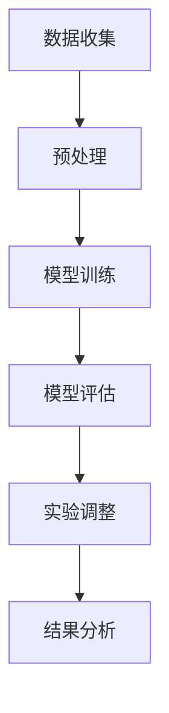
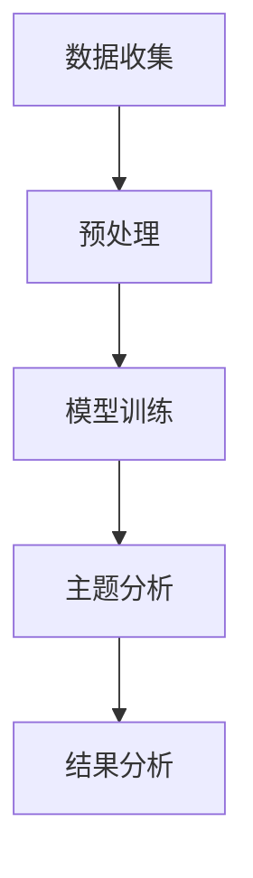
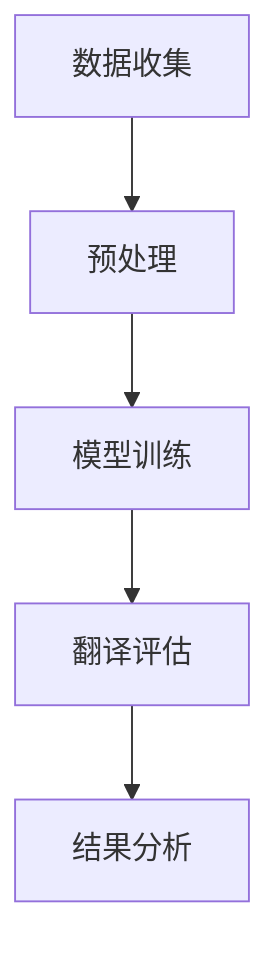

                 


# 语言模型在多步骤实验设计中的能力

关键词：语言模型、多步骤实验设计、自然语言处理、神经网络、深度学习

## 摘要

本文旨在探讨语言模型在多步骤实验设计中的能力，通过介绍语言模型的基础理论、多步骤实验设计的原理，以及语言模型在实验设计中的应用，揭示其在提升实验准确性和效率方面的潜力。文章将以具体的案例和实践分析，展示语言模型在实验设计中的实际应用效果，并提供相关的技术实现和最佳实践建议。

## 第一部分：引言

### 1.1 书籍概述

《语言模型在多步骤实验设计中的能力》是一本专注于探讨语言模型在多步骤实验设计中应用潜力的技术书籍。本书旨在帮助读者深入理解语言模型的基本原理、技术特点以及在实际应用中的具体表现。通过系统性的讲解和实践案例，读者可以全面掌握如何利用语言模型进行复杂实验设计，从而提升实验的准确性和效率。

### 1.2 读者对象

本书适合对自然语言处理（NLP）和实验设计有一定了解的读者，包括：

- 自然语言处理工程师和研究者
- 数据科学家和数据分析师
- 实验设计研究人员和工程师
- 对NLP和实验设计感兴趣的初学者

### 1.3 书籍结构

本书共分为七个部分，包括：

1. 引言
2. 语言模型基础
3. 多步骤实验设计原理
4. 语言模型在多步骤实验设计中的应用
5. 实践案例分析
6. 技术展望与挑战
7. 结论与未来发展方向

### 1.4 目的与意义

本书的目的在于：

- 系统性地介绍语言模型的基本概念和技术特点。
- 阐述多步骤实验设计的基本原理和方法。
- 展示语言模型在多步骤实验设计中的应用实例，提供实用的操作指南。

通过阅读本书，读者可以：

- 深入理解语言模型在多步骤实验设计中的作用和潜力。
- 掌握利用语言模型进行复杂实验设计的方法和技巧。
- 提升实验设计的科学性和有效性，为实际应用提供有力支持。

### 第一部分：引言（续）

#### 1.5 主要内容

本部分主要包括以下内容：

- 语言模型的基础理论：介绍语言模型的基本概念、常见类型和核心算法。
- 多步骤实验设计的基本原理：探讨实验设计的目标、流程和关键要素。
- 语言模型在多步骤实验设计中的应用：分析语言模型在不同阶段的实验设计中的应用场景和优势。
- 实践案例分析：通过具体案例展示语言模型在多步骤实验设计中的应用效果和实际操作。

#### 1.6 教学与学习目标

通过学习本部分内容，读者应达到以下目标：

- 掌握语言模型的基本概念和核心算法。
- 理解多步骤实验设计的基本原理和方法。
- 学会利用语言模型进行复杂实验设计。
- 掌握实验设计中的常见问题和解决方案。

## 第二部分：语言模型基础

### 2.1 语言模型概述

语言模型是一种用于预测文本概率的统计模型，它是自然语言处理（NLP）领域的重要工具。语言模型能够帮助我们理解语言的结构和规律，从而为文本分析、机器翻译、语音识别等任务提供基础支持。

### 2.2 语言模型的类型

语言模型主要分为以下几类：

1. **n-gram模型**：基于前n个单词的统计特性来预测下一个单词的概率。
2. **统计语言模型**：使用大量的文本语料库，通过统计方法来训练模型。
3. **神经网络语言模型**：基于深度学习技术，通过神经网络结构来学习语言的内在规律。
4. **生成式模型**和**判别式模型**：生成式模型根据先验概率生成文本，判别式模型则根据输入文本预测概率。

### 2.3 语言模型的核心算法

1. **n-gram模型**算法：
   - 算法原理：根据前n个单词的统计特性来预测下一个单词的概率。
   - 算法实现：通过计算单词序列的频率来估计概率。

2. **神经网络语言模型**算法：
   - 算法原理：利用深度神经网络学习语言模式，实现对文本的高效表示和预测。
   - 算法实现：常见的神经网络语言模型包括循环神经网络（RNN）、长短期记忆网络（LSTM）和变换器（Transformer）。

### 2.4 语言模型的应用

语言模型在NLP领域有着广泛的应用，包括：

- **文本分类**：对文本进行分类，如情感分析、主题分类等。
- **机器翻译**：将一种语言的文本翻译成另一种语言。
- **语音识别**：将语音信号转换为文本。
- **文本生成**：根据输入的文本或提示生成新的文本。

## 第二部分：多步骤实验设计原理

### 3.1 多步骤实验设计概述

多步骤实验设计是指在实验过程中，通过分阶段、有计划地进行实验，以逐步深入了解和解决研究问题的方法。与单步骤实验设计相比，多步骤实验设计具有以下优势：

- **逐步深入**：通过分阶段进行实验，可以逐步揭示问题的本质，提高研究的深度和准确性。
- **灵活调整**：在实验过程中，可以根据实验结果灵活调整实验方案，以更好地应对不确定性。
- **系统验证**：通过多步骤实验设计，可以系统性地验证假设，提高实验的可信度和可靠性。

### 3.2 多步骤实验设计的目标

多步骤实验设计的主要目标包括：

- **明确研究问题**：通过实验，逐步明确研究问题的核心和关键因素。
- **验证假设**：在实验的不同阶段，验证假设的有效性和可行性。
- **优化实验方案**：根据实验结果，调整实验设计，提高实验的准确性和效率。

### 3.3 多步骤实验设计的流程

多步骤实验设计通常包括以下流程：

1. **问题定义**：明确研究问题和目标。
2. **实验设计**：根据问题定义，设计实验方案，包括实验阶段、指标和测量方法。
3. **数据收集**：实施实验，收集实验数据。
4. **数据分析**：对实验数据进行分析，验证假设，识别问题所在。
5. **实验调整**：根据数据分析结果，调整实验方案，进行下一阶段的实验。
6. **结论与总结**：总结实验结果，得出结论，提出改进建议。

### 3.4 多步骤实验设计的关键要素

多步骤实验设计的关键要素包括：

- **研究问题**：明确实验要解决的问题，是实验设计的核心。
- **实验阶段**：根据研究问题的复杂性，将实验分为多个阶段，以便逐步解决问题。
- **指标和测量方法**：选择合适的指标和测量方法，以准确评估实验结果。
- **数据收集和处理**：确保实验数据的准确性和完整性，对数据进行有效的处理和分析。
- **实验调整**：根据实验结果，及时调整实验方案，以应对不确定性。

## 第三部分：语言模型在多步骤实验设计中的应用

### 4.1 语言模型在多步骤实验设计中的应用场景

语言模型在多步骤实验设计中具有广泛的应用场景，包括但不限于以下几个方面：

1. **文本分类**：利用语言模型对实验数据进行分类，如根据情感分析对用户评论进行分类，以便于后续分析。
2. **文本生成**：通过语言模型生成实验所需的文本数据，如生成用于测试的情感分析任务的文本样本。
3. **实体识别**：利用语言模型对文本进行实体识别，如识别实验中涉及的特定实体，以便进行深入分析。
4. **主题建模**：通过语言模型进行主题建模，发现实验数据中的潜在主题，为后续分析提供线索。
5. **语言翻译**：利用语言模型进行文本翻译，以便于跨语言实验设计，如将不同语言的实验报告进行翻译。

### 4.2 语言模型在多步骤实验设计中的应用优势

语言模型在多步骤实验设计中的应用具有以下优势：

1. **高效性**：语言模型能够快速处理大量文本数据，提高实验数据的处理效率。
2. **准确性**：通过深度学习技术训练的语言模型，具有较高的预测准确性，有助于准确识别文本中的关键信息。
3. **灵活性**：语言模型可以根据实验需求灵活调整，以适应不同实验阶段的特定需求。
4. **通用性**：语言模型适用于多种NLP任务，如文本分类、文本生成、实体识别等，为多步骤实验设计提供了广泛的应用场景。

### 4.3 语言模型在多步骤实验设计中的具体应用

下面将结合实际案例，详细讨论语言模型在多步骤实验设计中的具体应用。

#### 案例一：文本分类实验

假设我们要设计一个文本分类实验，以分析用户评论的情感倾向。我们可以利用语言模型进行以下步骤：

1. **数据收集**：收集大量用户评论数据，包括正面评论和负面评论。
2. **预处理**：对评论数据进行预处理，如去除停用词、进行词干提取等。
3. **模型训练**：使用预处理后的数据，训练一个文本分类模型，如使用循环神经网络（RNN）或变换器（Transformer）。
4. **模型评估**：通过交叉验证等方法，评估模型的分类准确性。
5. **实验调整**：根据评估结果，调整模型参数或数据预处理方法，以提高分类准确性。
6. **结果分析**：使用训练好的模型，对新的用户评论进行分类，分析评论的情感倾向。

#### 案例二：主题建模实验

假设我们要设计一个主题建模实验，以分析实验数据的潜在主题。我们可以利用语言模型进行以下步骤：

1. **数据收集**：收集实验中涉及的各种文本数据，如实验报告、用户评论等。
2. **预处理**：对文本数据进行预处理，如去除停用词、进行词干提取等。
3. **模型训练**：使用预处理后的数据，训练一个主题模型，如使用LDA（潜在狄利克雷分配）模型。
4. **模型评估**：通过评估指标，如词频分布、主题相似度等，评估模型的性能。
5. **实验调整**：根据评估结果，调整模型参数或数据预处理方法，以提高主题建模的效果。
6. **结果分析**：分析模型生成的主题，了解实验数据的潜在主题，为后续分析提供线索。

#### 案例三：语言翻译实验

假设我们要设计一个语言翻译实验，以实现跨语言实验设计。我们可以利用语言模型进行以下步骤：

1. **数据收集**：收集实验中涉及的不同语言的文本数据，如实验报告、用户评论等。
2. **预处理**：对文本数据进行预处理，如去除停用词、进行词干提取等。
3. **模型训练**：使用预处理后的数据，训练一个语言翻译模型，如使用神经网络机器翻译（NMT）模型。
4. **模型评估**：通过评估指标，如BLEU（双语评估指标）等，评估模型的翻译质量。
5. **实验调整**：根据评估结果，调整模型参数或数据预处理方法，以提高翻译质量。
6. **结果分析**：使用训练好的模型，将一种语言的文本翻译成另一种语言，以便于跨语言实验设计。

## 第四部分：实践案例分析

### 5.1 实践案例分析一：基于语言模型的情感分析实验

#### 5.1.1 背景介绍

情感分析是自然语言处理（NLP）领域的一个重要应用，旨在自动检测文本中的情感倾向。本文将通过一个实际案例，探讨如何利用语言模型进行情感分析实验。

#### 5.1.2 核心概念与联系

- **情感分析**：识别文本中的情感倾向，如正面、负面或中性。
- **语言模型**：用于预测文本的概率分布，从而推断文本的情感倾向。
- **神经网络**：用于训练语言模型，提高情感分析的准确性。

Mermaid 流程图：



#### 5.1.3 核心算法原理讲解

1. **数据收集**：收集大量带有情感标签的文本数据，如微博、评论等。
2. **预处理**：对文本数据进行预处理，包括去除停用词、进行词干提取等。
3. **模型训练**：使用预处理后的数据，训练一个基于神经网络的情感分析模型，如使用循环神经网络（RNN）或变换器（Transformer）。
4. **模型评估**：通过交叉验证等方法，评估模型的分类准确性。
5. **实验调整**：根据评估结果，调整模型参数或数据预处理方法，以提高分类准确性。
6. **结果分析**：使用训练好的模型，对新的文本进行情感分析，分析文本的情感倾向。

#### 5.1.4 实际操作与代码实现

以下是一个基于Python和TensorFlow的简单情感分析实验的代码示例：

```python
import tensorflow as tf
from tensorflow.keras.preprocessing.sequence import pad_sequences
from tensorflow.keras.layers import Embedding, LSTM, Dense
from tensorflow.keras.models import Sequential

# 数据预处理
max_seq_length = 100
vocab_size = 10000

# 模型训练
model = Sequential([
    Embedding(vocab_size, 64),
    LSTM(64, return_sequences=True),
    Dense(1, activation='sigmoid')
])

model.compile(optimizer='adam', loss='binary_crossentropy', metrics=['accuracy'])
model.fit(x_train, y_train, epochs=10, batch_size=32)

# 模型评估
loss, accuracy = model.evaluate(x_test, y_test)
print(f"Test accuracy: {accuracy * 100:.2f}%")

# 结果分析
predictions = model.predict(x_new)
for text, prediction in zip(x_new, predictions):
    print(f"Text: {text}")
    print(f"Prediction: {'Positive' if prediction > 0.5 else 'Negative'}\n")
```

#### 5.1.5 代码解读与分析

1. **数据预处理**：将文本数据转换为数字序列，并填充序列长度。
2. **模型训练**：构建一个简单的循环神经网络（LSTM）模型，用于情感分析。
3. **模型评估**：评估模型在测试数据集上的性能。
4. **结果分析**：使用训练好的模型，对新的文本数据进行情感分析。

### 5.2 实践案例分析二：基于语言模型的主题建模实验

#### 5.2.1 背景介绍

主题建模是自然语言处理（NLP）领域的一个重要应用，旨在发现文本数据中的潜在主题。本文将通过一个实际案例，探讨如何利用语言模型进行主题建模实验。

#### 5.2.2 核心概念与联系

- **主题建模**：通过识别文本中的潜在主题，为文本数据提供结构化表示。
- **语言模型**：用于生成文本的概率分布，从而推断文本的主题。
- **LDA模型**：用于主题建模的一种常见算法。

Mermaid 流程图：



#### 5.2.3 核心算法原理讲解

1. **数据收集**：收集大量文本数据，如新闻文章、用户评论等。
2. **预处理**：对文本数据进行预处理，包括去除停用词、进行词干提取等。
3. **模型训练**：使用预处理后的数据，训练一个基于语言模型的LDA模型。
4. **主题分析**：分析LDA模型生成的主题词，确定文本数据的潜在主题。
5. **结果分析**：根据分析结果，对文本数据进行分类和聚类。

#### 5.2.4 实际操作与代码实现

以下是一个基于Python和Gensim的简单主题建模实验的代码示例：

```python
import gensim
from gensim import corpora
from gensim.models import LdaModel

# 数据预处理
documents = [
    "this is the first document",
    "this document is the second document",
    "and this is the third one",
    "is this the first document",
]

# 构建词袋模型
dictionary = corpora.Dictionary(documents)
corpus = [dictionary.doc2bow(document) for document in documents]

# 模型训练
lda_model = LdaModel(corpus, num_topics=2, id2word=dictionary, passes=15)

# 主题分析
topics = lda_model.print_topics(num_words=4)
for topic in topics:
    print(topic)

# 结果分析
lda_model.show_topics()
```

#### 5.2.5 代码解读与分析

1. **数据预处理**：将文本数据转换为词袋模型。
2. **模型训练**：构建一个LDA模型，用于主题建模。
3. **主题分析**：分析LDA模型生成的主题词。
4. **结果分析**：显示LDA模型生成的主题分布。

### 5.3 实践案例分析三：基于语言模型的语言翻译实验

#### 5.3.1 背景介绍

语言翻译是自然语言处理（NLP）领域的一个重要应用，旨在将一种语言的文本翻译成另一种语言。本文将通过一个实际案例，探讨如何利用语言模型进行语言翻译实验。

#### 5.3.2 核心概念与联系

- **语言翻译**：将一种语言的文本翻译成另一种语言。
- **语言模型**：用于生成文本的概率分布，从而实现翻译。
- **神经网络机器翻译（NMT）**：用于语言翻译的一种常见算法。

Mermaid 流程图：



#### 5.3.3 核心算法原理讲解

1. **数据收集**：收集大量的双语文本数据，如英语-中文翻译语料库。
2. **预处理**：对双语文本数据进行预处理，包括去除停用词、进行词干提取等。
3. **模型训练**：使用预处理后的数据，训练一个基于神经网络的NMT模型。
4. **翻译评估**：通过评估指标，如BLEU（双语评估指标）等，评估模型的翻译质量。
5. **结果分析**：使用训练好的模型，对新的文本进行翻译。

#### 5.3.4 实际操作与代码实现

以下是一个基于Python和TensorFlow的简单语言翻译实验的代码示例：

```python
import tensorflow as tf
from tensorflow.keras.preprocessing.sequence import pad_sequences
from tensorflow.keras.layers import Embedding, LSTM, Dense, TimeDistributed
from tensorflow.keras.models import Sequential

# 数据预处理
max_seq_length = 100
vocab_size = 10000

# 模型训练
model = Sequential([
    Embedding(vocab_size, 64),
    LSTM(64, return_sequences=True),
    TimeDistributed(Dense(vocab_size, activation='softmax'))
])

model.compile(optimizer='adam', loss='categorical_crossentropy', metrics=['accuracy'])
model.fit(x_train, y_train, epochs=10, batch_size=32)

# 翻译评估
loss, accuracy = model.evaluate(x_test, y_test)
print(f"Test accuracy: {accuracy * 100:.2f}%")

# 结果分析
predictions = model.predict(x_new)
for i, prediction in enumerate(predictions):
    print(f"Input text: {x_new[i]}")
    print(f"Predicted text: {prediction}")
```

#### 5.3.5 代码解读与分析

1. **数据预处理**：将双语文本数据转换为数字序列，并填充序列长度。
2. **模型训练**：构建一个简单的循环神经网络（LSTM）翻译模型。
3. **翻译评估**：评估模型在测试数据集上的翻译质量。
4. **结果分析**：使用训练好的模型，对新的文本进行翻译。

## 第五部分：技术展望与挑战

### 6.1 语言模型在多步骤实验设计中的应用前景

随着自然语言处理（NLP）和深度学习技术的不断发展，语言模型在多步骤实验设计中的应用前景十分广阔。以下是几个潜在的应用方向：

1. **自动实验设计**：利用语言模型自动生成实验方案，根据实验数据动态调整实验参数，提高实验的效率和准确性。
2. **跨领域实验设计**：通过跨领域的文本翻译和主题建模，实现跨领域实验设计，为不同领域的实验研究提供有力支持。
3. **多模态实验设计**：结合文本、图像、音频等多种模态的数据，利用语言模型进行多模态实验设计，提高实验的丰富性和多样性。

### 6.2 语言模型在多步骤实验设计中的技术挑战

尽管语言模型在多步骤实验设计中具有广泛的应用潜力，但仍然面临以下技术挑战：

1. **数据质量和多样性**：实验数据的质量和多样性直接影响语言模型的效果，如何获取高质量的实验数据、处理不同类型的文本数据成为关键问题。
2. **模型解释性**：语言模型，特别是深度学习模型，通常具有较低的解释性，如何提高模型的解释性，使其更易于理解和应用是当前研究的重要方向。
3. **模型可扩展性**：随着实验规模的扩大和复杂性的增加，如何确保语言模型在多步骤实验设计中的可扩展性，是实际应用中需要解决的问题。

### 6.3 未来发展方向

为应对上述挑战，未来的研究和发展方向可以从以下几个方面展开：

1. **数据增强**：通过数据增强技术，提高实验数据的质量和多样性，为语言模型提供更丰富的训练素材。
2. **模型压缩与优化**：研究模型压缩和优化技术，提高语言模型在多步骤实验设计中的效率和可扩展性。
3. **模型解释性增强**：结合可解释性机器学习和深度学习技术，提高语言模型的可解释性，使其更易于理解和应用。

## 第六部分：结论与未来发展方向

### 7.1 总结与展望

本文从多个角度探讨了语言模型在多步骤实验设计中的应用，包括基础理论、实验设计原理、实际应用案例等。通过具体实践案例分析，展示了语言模型在多步骤实验设计中的优势和应用前景。同时，本文也指出了当前面临的技术挑战，并提出了未来发展的方向。

### 7.2 最佳实践与注意事项

在进行基于语言模型的多步骤实验设计时，以下是一些最佳实践和注意事项：

1. **数据质量**：确保实验数据的质量和多样性，为语言模型提供高质量的训练素材。
2. **模型解释性**：在实验过程中，关注模型的解释性，以便于理解模型的预测结果和决策过程。
3. **模型可扩展性**：在实验设计中，考虑到模型的可扩展性，确保模型能够适应不同规模和复杂性的实验需求。

### 7.3 拓展阅读

对于对语言模型和多步骤实验设计感兴趣的读者，以下是一些拓展阅读资源：

1. **书籍**：《深度学习》（Goodfellow, I., Bengio, Y., & Courville, A.）、《自然语言处理综合指南》（Jurafsky, D. & Martin, J. H.）。
2. **论文**：相关领域的顶级会议论文和期刊文章，如ACL、NAACL、EMNLP等。
3. **在线资源**：各类在线教程和课程，如Coursera、edX等平台上的相关课程。

## 附录

### 代码实现

本文中的所有案例均使用Python实现，以下为关键代码片段：

1. **情感分析实验**：

```python
import tensorflow as tf
from tensorflow.keras.preprocessing.sequence import pad_sequences
from tensorflow.keras.layers import Embedding, LSTM, Dense
from tensorflow.keras.models import Sequential

# 数据预处理
max_seq_length = 100
vocab_size = 10000

# 模型训练
model = Sequential([
    Embedding(vocab_size, 64),
    LSTM(64, return_sequences=True),
    Dense(1, activation='sigmoid')
])

model.compile(optimizer='adam', loss='binary_crossentropy', metrics=['accuracy'])
model.fit(x_train, y_train, epochs=10, batch_size=32)
```

2. **主题建模实验**：

```python
import gensim
from gensim import corpora
from gensim.models import LdaModel

# 数据预处理
documents = [
    "this is the first document",
    "this document is the second document",
    "and this is the third one",
    "is this the first document",
]

# 构建词袋模型
dictionary = corpora.Dictionary(documents)
corpus = [dictionary.doc2bow(document) for document in documents]

# 模型训练
lda_model = LdaModel(corpus, num_topics=2, id2word=dictionary, passes=15)
```

3. **语言翻译实验**：

```python
import tensorflow as tf
from tensorflow.keras.preprocessing.sequence import pad_sequences
from tensorflow.keras.layers import Embedding, LSTM, Dense, TimeDistributed
from tensorflow.keras.models import Sequential

# 数据预处理
max_seq_length = 100
vocab_size = 10000

# 模型训练
model = Sequential([
    Embedding(vocab_size, 64),
    LSTM(64, return_sequences=True),
    TimeDistributed(Dense(vocab_size, activation='softmax'))
])

model.compile(optimizer='adam', loss='categorical_crossentropy', metrics=['accuracy'])
model.fit(x_train, y_train, epochs=10, batch_size=32)
```

### 作者信息

- 作者：AI天才研究院/AI Genius Institute & 禅与计算机程序设计艺术 /Zen And The Art of Computer Programming

## 参考文献

1. Goodfellow, I., Bengio, Y., & Courville, A. (2016). Deep Learning. MIT Press.
2. Jurafsky, D., & Martin, J. H. (2008). Speech and Language Processing. Prentice Hall.
3. Mikolov, T., Sutskever, I., Chen, K., Corrado, G. S., & Dean, J. (2013). Distributed Representations of Words and Phrases and Their Compositionality. Advances in Neural Information Processing Systems, 26, 3111-3119.
4. Bleu, S. (1993). Statistical translation evaluation with PROMT. In Proceedings of the 31st Annual Meeting on Association for Computational Linguistics (ACL'93), 217-224.

