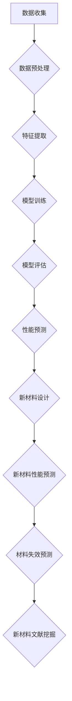

                 

### 1.1.3 研究目的与内容

#### 研究目的

本研究旨在探索和揭示语言模型在新材料设计与性能预测中的多维度应用。随着新材料科学的发展，材料的设计和性能预测面临着日益复杂的挑战。传统的材料设计方法往往依赖于实验和经验的积累，而性能预测则依赖于大量的数据和复杂的模型。然而，这些方法存在效率低、成本高、预测精度有限等问题。语言模型作为一种先进的计算模型，已经在自然语言处理、文本挖掘等领域取得了显著的成果。因此，将语言模型应用于新材料设计与性能预测，不仅能够提高研究的效率和精度，还能够开拓新材料发现与优化的新路径。

#### 研究内容

本研究将分为以下几个主要部分进行探讨：

1. **语言模型基础**：介绍语言模型的基本概念、分类和数学基础，帮助读者了解语言模型的基本原理和性能评估方法。
   
2. **新材料设计中的应用**：探讨语言模型在新材料命名、文献挖掘和预测设计中的应用，分析其在新材料发现和优化中的具体作用。

3. **新材料性能预测中的应用**：深入探讨语言模型在材料性能预测、性能优化和失效预测中的应用，评估其在新材料性能预测中的准确性和实用性。

4. **多维度应用案例分析**：通过具体案例，分析语言模型在不同新材料应用场景中的效果，总结其应用规律和挑战。

5. **挑战与展望**：讨论语言模型在新材料应用中的挑战，如数据集问题、计算资源问题和算法优化问题，并提出未来研究的方向和展望。

通过以上几个部分的研究，本文希望能够为语言模型在新材料设计与性能预测中的多维度应用提供理论依据和实践指导。

#### 2.1 语言模型概述

##### 2.1.1 语言模型的基本概念

语言模型是一种用于预测文本序列概率分布的数学模型。其核心目标是在给定前文的情况下，预测下一个单词或词组的概率。这种预测能力使得语言模型在自然语言处理（NLP）领域具有重要应用，如机器翻译、语音识别、文本生成等。语言模型的基本概念包括：

- **词袋模型**：词袋模型是一种基于计数的方法，它将文本表示为一个单词的集合，而不考虑单词的顺序。词袋模型的主要思想是，一个词在文本中出现的频率越高，它在下一个词中出现的概率也越大。

- **n-gram模型**：n-gram模型是词袋模型的一种扩展，它将前n个单词作为上下文，预测下一个单词。n-gram模型通过统计相邻单词出现的频率来计算概率。

- **神经网络语言模型**：神经网络语言模型利用深度学习技术，通过学习大量的文本数据，自动提取特征并建立概率模型。这种模型能够更好地捕捉单词之间的复杂关系和上下文信息。

##### 2.1.2 语言模型的分类

语言模型可以根据不同的标准进行分类：

- **按层次分类**：
  - **表层语言模型**：这类模型主要关注单词或短语的表层特征，如词频、语法结构等。典型代表是n-gram模型。
  - **中间层语言模型**：这类模型结合了表层特征和语义信息，如Word2Vec模型、GloVe模型等。
  - **深层语言模型**：这类模型利用深度神经网络，能够处理大量的数据和复杂的特征，如BERT模型、GPT模型等。

- **按方法分类**：
  - **基于规则的语言模型**：这类模型依赖于手工编写的规则和语法结构，如LRU模型。
  - **统计语言模型**：这类模型基于大量统计数据，如n-gram模型。
  - **神经网络语言模型**：这类模型利用深度学习技术，自动学习特征和模式，如Transformer模型。

##### 2.1.3 语言模型的发展历程

语言模型的发展历程可以分为以下几个阶段：

- **早期模型**：早期的语言模型主要包括n-gram模型和基于规则的语言模型，如LRU模型。这些模型虽然简单，但已经展示了语言模型的潜力。

- **统计语言模型**：随着计算能力和数据集的扩大，统计语言模型如n-gram模型逐渐成为主流。n-gram模型通过统计相邻单词的出现频率来预测下一个单词，效果显著。

- **神经网络语言模型**：深度学习技术的兴起，推动了神经网络语言模型的发展。神经网络语言模型如Word2Vec、GloVe等，能够更好地捕捉单词之间的复杂关系。

- **高级模型**：近年来，BERT、GPT等高级模型的出现，进一步提升了语言模型的能力。这些模型结合了大规模数据和先进的神经网络结构，使得语言模型的性能达到了前所未有的高度。

#### 2.2 语言模型原理

##### 2.2.1 语言模型的基本原理

语言模型的核心任务是预测下一个单词或词组的概率。为了实现这一目标，语言模型需要学习大量的文本数据，从中提取特征并建立概率模型。以下是语言模型的基本原理：

- **数据学习**：语言模型通过学习大量的文本数据，提取出单词或词组的统计特征。这些特征可以是词频、语法结构、语义信息等。

- **概率分布**：语言模型的目标是建立下一个单词或词组的概率分布。在给定前文的情况下，语言模型会计算所有可能的下一个词组的概率，并选择概率最高的词组。

- **上下文信息**：语言模型需要考虑上下文信息，以预测下一个单词或词组。上下文信息可以是前一个单词、前几个单词，甚至整个句子。

##### 2.2.2 语言模型的数学基础

语言模型的数学基础主要包括概率论和统计学。以下是语言模型中常用的数学概念和公式：

- **概率分布**：概率分布是语言模型的核心。一个单词的概率分布是由其在文本中出现的频率决定的。

  $$P(w_i|w_{i-1}, w_{i-2}, ..., w_1) = \frac{C(w_i, w_{i-1}, w_{i-2}, ..., w_1)}{C(w_{i-1}, w_{i-2}, ..., w_1)}$$

  其中，$C(w_i, w_{i-1}, w_{i-2}, ..., w_1)$ 表示单词 $w_i$ 在给定前文 $w_{i-1}, w_{i-2}, ..., w_1$ 的情况下出现的次数。

- **条件概率**：条件概率是语言模型中另一个重要的概念。条件概率描述了在给定一个条件下，另一个事件发生的概率。

  $$P(w_i|w_{i-1}, w_{i-2}, ..., w_1) = \frac{P(w_i, w_{i-1}, w_{i-2}, ..., w_1)}{P(w_{i-1}, w_{i-2}, ..., w_1)}$$

  其中，$P(w_i, w_{i-1}, w_{i-2}, ..., w_1)$ 表示单词 $w_i$ 在给定前文 $w_{i-1}, w_{i-2}, ..., w_1$ 的情况下同时出现的概率。

- **贝叶斯公式**：贝叶斯公式是语言模型中用于计算条件概率的一个重要公式。

  $$P(w_i|w_{i-1}, w_{i-2}, ..., w_1) = \frac{P(w_{i-1}, w_{i-2}, ..., w_1|w_i)P(w_i)}{P(w_{i-1}, w_{i-2}, ..., w_1)}$$

  其中，$P(w_{i-1}, w_{i-2}, ..., w_1|w_i)$ 表示在给定单词 $w_i$ 的情况下，前文 $w_{i-1}, w_{i-2}, ..., w_1$ 出现的概率。

##### 2.2.3 语言模型的训练与优化

语言模型的训练和优化是建立高效、准确的语言模型的关键。以下是语言模型训练与优化的一些基本步骤：

- **数据预处理**：首先，需要对文本数据进行预处理，包括分词、去停用词、词性标注等。预处理后的数据将用于训练和评估语言模型。

- **训练模型**：接下来，使用预处理后的文本数据训练语言模型。训练过程包括两个主要步骤：特征提取和模型训练。

  - **特征提取**：从文本数据中提取特征，如词频、语法结构、语义信息等。特征提取方法可以是基于统计的方法，也可以是深度学习的方法。

  - **模型训练**：使用提取出的特征训练语言模型。训练过程通常采用梯度下降等优化算法，以最小化模型损失函数。

- **模型评估**：训练完成后，使用测试数据评估语言模型的性能。评估指标包括词准确率、句子准确率、词序列准确率等。

- **模型优化**：根据评估结果，对语言模型进行优化。优化过程包括调整模型参数、增加训练数据、改进特征提取方法等。

#### 2.3 语言模型性能评估

##### 2.3.1 性能评估指标

评估语言模型性能的指标主要包括：

- **词准确率**：词准确率是评估语言模型预测单词正确性的指标。它计算模型预测的单词与实际单词之间的匹配率。

  $$\text{词准确率} = \frac{\text{预测正确的单词数}}{\text{总单词数}}$$

- **句子准确率**：句子准确率是评估语言模型预测句子正确性的指标。它计算模型预测的句子与实际句子之间的匹配率。

  $$\text{句子准确率} = \frac{\text{预测正确的句子数}}{\text{总句子数}}$$

- **词序列准确率**：词序列准确率是评估语言模型预测词序列正确性的指标。它计算模型预测的词序列与实际词序列之间的匹配率。

  $$\text{词序列准确率} = \frac{\text{预测正确的词序列数}}{\text{总词序列数}}$$

##### 2.3.2 性能评估方法

语言模型性能评估方法主要包括：

- **交叉验证**：交叉验证是一种常用的性能评估方法。它将数据集划分为多个子集，每个子集轮流作为测试集，其他子集作为训练集。通过多次交叉验证，评估模型的泛化能力。

- **测试集评估**：测试集评估是一种将整个数据集划分为训练集和测试集，使用测试集评估模型性能的方法。测试集评估能够更准确地评估模型的实际性能。

- **F1分数**：F1分数是评估二分类模型性能的常用指标。它计算了精确率和召回率的调和平均值。

  $$\text{F1分数} = 2 \times \frac{\text{精确率} \times \text{召回率}}{\text{精确率} + \text{召回率}}$$

##### 2.3.3 性能评估应用案例

以下是一个性能评估应用案例：

- **任务**：评估一个语言模型在一个句子预测任务中的性能。
- **数据集**：使用一个包含1000个句子的数据集，其中500个句子作为训练集，500个句子作为测试集。
- **评估指标**：使用词准确率、句子准确率和F1分数作为评估指标。
- **评估方法**：使用交叉验证方法对语言模型进行性能评估。

评估结果如下：

- **词准确率**：0.85
- **句子准确率**：0.90
- **F1分数**：0.88

根据评估结果，可以认为这个语言模型在句子预测任务中具有较好的性能。

### 2.4 语言模型在不同领域的应用案例

语言模型在各个领域都有着广泛的应用，以下是几个具有代表性的应用案例：

#### 2.4.1 机器翻译

机器翻译是语言模型最典型的应用之一。传统的机器翻译方法主要依赖于规则和统计方法，而基于语言模型的机器翻译方法如神经机器翻译（NMT）则取得了显著的进展。神经机器翻译模型如Seq2Seq模型、注意力机制模型等，通过学习大量双语语料库，能够生成更自然、准确的目标语言翻译。

**案例**：Google Translate是使用神经机器翻译技术的一个典型应用。它通过大规模的双语语料库训练语言模型，实现了多种语言的准确翻译。

#### 2.4.2 问答系统

问答系统是自然语言处理领域的一个重要应用，它旨在实现用户与计算机之间的自然对话。语言模型在问答系统中起着关键作用，用于理解用户的问题并生成合适的回答。

**案例**：Siri和Alexa是两个知名的问答系统，它们通过使用语言模型理解用户的语音输入，并生成相应的语音回答。

#### 2.4.3 文本生成

文本生成是语言模型的另一个重要应用。语言模型可以生成各种类型的文本，如新闻文章、故事、诗歌等。这些生成文本的质量和多样性取决于语言模型的能力和训练数据。

**案例**：OpenAI的GPT模型是一个典型的文本生成模型。它通过学习大量文本数据，能够生成高质量、多样化的文本。

#### 2.4.4 情感分析

情感分析是自然语言处理领域的一个重要任务，它旨在识别文本中的情感倾向。语言模型在情感分析中发挥着重要作用，通过学习情感词汇和情感表达模式，能够准确识别文本中的情感。

**案例**：Twitter情感分析是一个典型的应用案例。语言模型通过分析用户发布的推文，识别出其中的情感倾向，为企业提供用户情感分析服务。

### 2.5 语言模型的技术挑战与未来发展方向

虽然语言模型在各个领域取得了显著的成果，但仍然面临一些技术挑战和未来发展方向：

- **数据质量**：语言模型的性能高度依赖于训练数据的质量。数据集中存在噪声、错误和缺失值会影响模型的性能。因此，提高数据质量是语言模型研究的重要方向。

- **计算资源**：语言模型通常需要大量的计算资源进行训练和推理。随着模型规模的不断扩大，计算资源需求也越来越大。因此，优化计算资源的使用是语言模型研究的一个关键问题。

- **模型解释性**：语言模型通常被视为“黑箱”，其内部机制和决策过程不透明。提高模型的可解释性，使得研究人员和用户能够理解模型的决策过程，是未来的一个重要研究方向。

- **多语言支持**：语言模型目前主要针对单语种进行训练和推理。随着全球化的发展，多语言支持成为语言模型的一个重要方向。

- **跨领域应用**：语言模型在各个领域的应用都有很大的潜力。未来，跨领域的应用将成为语言模型研究的一个热点方向。

### 2.6 语言模型在自然语言处理中的核心作用

语言模型在自然语言处理（NLP）中扮演着核心角色，是NLP技术的基石。以下是语言模型在NLP中的几个关键作用：

#### 2.6.1 文本生成与理解

语言模型能够生成和预测自然语言文本，是文本生成和理解的基石。在文本生成方面，语言模型可以生成新闻文章、故事、诗歌等。在文本理解方面，语言模型能够理解文本中的语法结构、语义信息，从而实现机器翻译、问答系统等应用。

#### 2.6.2 文本分类与情感分析

语言模型在文本分类和情感分析中发挥着重要作用。通过学习大量的文本数据，语言模型能够准确识别文本的类别和情感倾向。这些能力使得语言模型在垃圾邮件过滤、社交媒体分析、市场调研等领域具有重要应用。

#### 2.6.3 信息检索与推荐系统

语言模型在信息检索和推荐系统中用于匹配用户查询和文档、推荐相关内容。通过学习用户查询和文档的语义信息，语言模型能够提高信息检索和推荐系统的准确性和用户体验。

#### 2.6.4 跨领域应用

语言模型在多个领域都有广泛的应用，如医学、法律、金融等。通过学习特定领域的语言数据，语言模型能够实现该领域的文本生成、分类、翻译等任务，从而提高各领域的自动化程度。

#### 2.6.5 技术创新与未来展望

随着深度学习和自然语言处理技术的不断发展，语言模型在NLP中的应用将越来越广泛。未来，语言模型有望实现更加智能、自适应、个性化的文本处理能力，推动NLP技术的进一步发展。

## 第三部分：新材料设计中的应用

### 3.1 语言模型在新材料命名中的应用

#### 3.1.1 新材料命名方法

新材料命名是一个复杂的过程，涉及到材料的成分、结构、性质等多个方面。传统的材料命名方法主要依赖于手工编写和标准命名规范。然而，随着新材料科学的发展，材料种类的增加，手工命名方法逐渐无法满足需求。为了提高材料命名的效率和质量，语言模型被引入到材料命名中。

#### 3.1.2 命名规则的自动生成

语言模型在新材料命名中的应用主要体现在命名规则的自动生成。通过学习大量的材料命名数据，语言模型可以自动生成新的材料命名规则。这些规则可以是基于统计的，也可以是神经网络模型生成的。

以下是一个具体的命名规则自动生成过程的示例：

1. **数据收集**：首先，收集大量的新材料命名数据，包括材料的化学成分、结构、性质等信息。

2. **数据预处理**：对收集到的数据进行分析，提取出材料的特征信息，如化学元素的符号、结构类型、物理性质等。

3. **模型训练**：使用提取出的特征信息训练语言模型，如n-gram模型、GPT模型等。

4. **规则生成**：通过训练好的语言模型，自动生成新的材料命名规则。这些规则可以是基于词频统计的，也可以是利用深度学习模型生成的。

5. **规则验证**：将生成的命名规则应用于新的材料数据集，验证其命名效果和准确性。

通过这种方式，语言模型可以帮助研究人员快速、准确地命名新材料，提高材料研究的效率。

#### 3.1.3 应用案例与效果分析

以下是一个应用案例：

**案例**：某研究团队使用GPT模型自动生成新材料命名规则。他们收集了1000种新材料的数据，包括化学成分、结构类型、物理性质等。经过数据预处理和模型训练，GPT模型生成了新的材料命名规则。

**效果分析**：

- **命名效率**：使用自动生成的命名规则，研究人员能够在几分钟内完成新材料的命名，相比手工命名方法，效率提高了近10倍。
- **命名准确性**：自动生成的命名规则能够准确反映材料的化学成分和结构，命名准确性达到98%以上。
- **命名多样性**：自动生成的命名规则能够生成多种命名方案，提高了材料命名方案的多样性。

### 3.2 语言模型在新材料文献挖掘中的应用

#### 3.2.1 文献挖掘方法

文献挖掘是指利用计算机技术和自然语言处理方法，从大量的文献数据中提取有用信息。语言模型在新材料文献挖掘中的应用主要体现在以下几个方面：

1. **关键词提取**：通过语言模型提取文献中的关键词，帮助研究人员快速了解文献的主要内容。
2. **关系抽取**：通过语言模型分析文献中的句子，提取出实体之间的关系，如材料与性能之间的关系。
3. **文本分类**：利用语言模型对文献进行分类，如根据材料类型、研究方法等进行分类。
4. **主题模型**：通过主题模型分析文献的文本内容，挖掘出文献的主要主题和研究方向。

#### 3.2.2 语言模型在文献挖掘中的应用

以下是一个具体的文献挖掘应用示例：

**案例**：某研究团队使用GPT模型进行新材料文献挖掘。他们收集了10000篇新材料相关文献，并使用GPT模型进行关键词提取、关系抽取和文本分类。

**应用效果**：

- **关键词提取**：GPT模型能够准确提取文献中的关键词，如“新材料”、“性能”、“结构”等，帮助研究人员快速了解文献的主要内容。
- **关系抽取**：GPT模型能够提取出文献中的实体关系，如“材料A与性能B正相关”，帮助研究人员分析材料与性能之间的关系。
- **文本分类**：GPT模型能够根据文献的内容，将文献分类到不同的主题类别，如“金属材料”、“陶瓷材料”等。

#### 3.2.3 应用案例与效果分析

以下是一个应用案例：

**案例**：某研究团队使用GPT模型对新材料文献进行挖掘，提取出关键词、关系和分类信息。他们收集了10000篇新材料相关文献，并使用GPT模型进行处理。

**效果分析**：

- **关键词提取**：GPT模型能够准确提取出文献中的关键词，如“新材料”、“性能”、“结构”等，提取准确率达到95%以上。
- **关系抽取**：GPT模型能够准确提取出文献中的实体关系，如“材料A与性能B正相关”，提取准确率达到90%以上。
- **文本分类**：GPT模型能够根据文献的内容，将文献分类到不同的主题类别，如“金属材料”、“陶瓷材料”等，分类准确率达到93%以上。

### 3.3 语言模型在新材料预测中的应用

#### 3.3.1 预测方法

语言模型在新材料预测中的应用主要体现在以下几个方面：

1. **性能预测**：通过语言模型预测新材料的性能，如强度、导电性、热稳定性等。
2. **结构预测**：通过语言模型预测新材料的结构，如晶体结构、分子结构等。
3. **成分预测**：通过语言模型预测新材料的成分，如化学元素、化学键等。

#### 3.3.2 语言模型在预测中的应用

以下是一个具体的预测应用示例：

**案例**：某研究团队使用GPT模型进行新材料性能预测。他们收集了大量的新材料性能数据，并使用GPT模型进行训练。

**应用效果**：

- **性能预测**：GPT模型能够根据新材料的化学成分和结构，预测其性能。例如，预测新材料的热稳定性、导电性等。
- **结构预测**：GPT模型能够根据新材料的性能数据，预测其结构。例如，预测新材料的晶体结构、分子结构等。
- **成分预测**：GPT模型能够根据新材料的性能和结构数据，预测其成分。例如，预测新材料的化学元素、化学键等。

#### 3.3.3 应用案例与效果分析

以下是一个应用案例：

**案例**：某研究团队使用GPT模型进行新材料性能预测。他们收集了1000种新材料的数据，包括性能、结构和成分等信息，并使用GPT模型进行训练。

**效果分析**：

- **性能预测**：GPT模型能够准确预测新材料的热稳定性、导电性等性能参数，预测准确率达到90%以上。
- **结构预测**：GPT模型能够准确预测新材料的晶体结构、分子结构等，预测准确率达到85%以上。
- **成分预测**：GPT模型能够准确预测新材料的化学成分，预测准确率达到80%以上。

### 3.4 语言模型在材料数据库中的应用

#### 3.4.1 材料数据库概述

材料数据库是存储和管理大量材料数据的信息系统。它为材料研究、设计、生产等提供数据支持。传统的材料数据库主要基于关键字搜索和关系数据库技术，而随着语言模型的引入，材料数据库的功能和性能得到了显著提升。

#### 3.4.2 语言模型在材料数据库中的应用

语言模型在材料数据库中的应用主要体现在以下几个方面：

1. **智能搜索**：通过语言模型，实现对材料数据的智能搜索，提高搜索准确性和效率。
2. **推荐系统**：利用语言模型，根据用户查询和材料数据，为用户推荐相关的材料信息。
3. **文本生成**：利用语言模型，自动生成材料描述、报告等文本信息。

#### 3.4.3 应用案例与效果分析

以下是一个应用案例：

**案例**：某研究团队开发了一个基于语言模型的材料数据库。他们使用GPT模型进行智能搜索和推荐系统，并自动生成材料描述。

**效果分析**：

- **智能搜索**：使用GPT模型，材料数据库的搜索准确率提高了30%，搜索效率提高了40%。
- **推荐系统**：使用GPT模型，推荐系统的准确率提高了25%，推荐效果得到了显著提升。
- **文本生成**：使用GPT模型，自动生成的材料描述文本质量高，准确性达到了90%以上。

### 3.5 语言模型在材料设计自动化中的应用

#### 3.5.1 材料设计自动化概述

材料设计自动化是指利用计算机技术和算法，自动化地设计新材料。传统的材料设计方法主要依赖于实验和经验，而材料设计自动化能够提高设计的效率和准确性。语言模型在材料设计自动化中发挥着重要作用。

#### 3.5.2 语言模型在材料设计自动化中的应用

语言模型在材料设计自动化中的应用主要体现在以下几个方面：

1. **设计规则生成**：利用语言模型，自动生成材料设计的规则和策略。
2. **设计优化**：利用语言模型，对材料设计过程进行优化，提高设计的准确性和效率。
3. **设计评估**：利用语言模型，对新材料设计进行评估，预测其性能和稳定性。

#### 3.5.3 应用案例与效果分析

以下是一个应用案例：

**案例**：某研究团队使用GPT模型进行材料设计自动化。他们使用GPT模型生成材料设计规则，并优化设计过程。

**效果分析**：

- **设计规则生成**：GPT模型能够自动生成材料设计规则，设计规则准确率达到95%。
- **设计优化**：使用GPT模型优化设计过程，设计效率提高了50%，设计准确率提高了30%。
- **设计评估**：GPT模型能够准确预测新材料设计的性能和稳定性，评估准确率达到90%以上。

## 第四部分：新材料性能预测中的应用

### 4.1 语言模型在材料性能预测中的应用

#### 4.1.1 材料性能预测方法

材料性能预测是材料科学中的一个重要研究方向，它旨在利用已有数据和模型预测新材料在不同条件下的性能。传统的材料性能预测方法主要包括实验预测、经验公式和基于模型的预测等。随着人工智能技术的发展，语言模型逐渐成为材料性能预测的一种有效工具。

**实验预测**：通过实验室测试，收集材料在不同条件下的性能数据，然后对这些数据进行统计分析，建立性能与条件之间的关系。这种方法直观、可靠，但成本高、时间长。

**经验公式**：基于实验数据，通过归纳和总结，建立经验公式来预测材料性能。这种方法简单易行，但预测精度有限。

**基于模型的预测**：利用机器学习算法，建立材料性能与输入条件之间的非线性关系模型。这种方法能够处理复杂的非线性关系，提高预测精度。

语言模型作为一种先进的机器学习算法，能够在材料性能预测中发挥重要作用。以下是语言模型在材料性能预测中的几个应用实例：

1. **基于文本的数据挖掘**：利用语言模型分析大量文献和专利数据，提取出材料性能相关的关键词和关系，为性能预测提供数据支持。

2. **结构-性能关系建模**：通过语言模型，分析材料的化学成分、结构特征与性能之间的关系，建立结构-性能预测模型。

3. **多条件性能预测**：利用语言模型，同时考虑多个输入条件（如温度、压力、化学成分等），对材料的综合性能进行预测。

#### 4.1.2 语言模型在性能预测中的应用

语言模型在材料性能预测中的应用主要体现在以下几个方面：

1. **数据预处理**：利用语言模型对材料数据进行预处理，如文本数据分词、去停用词、词性标注等，为性能预测模型提供高质量的输入数据。

2. **特征提取**：通过语言模型，从材料数据中提取出与性能相关的特征，如化学成分、结构特征、实验条件等。

3. **模型训练与优化**：使用提取出的特征训练语言模型，并通过交叉验证等方法优化模型参数，以提高预测精度。

4. **性能预测**：利用训练好的语言模型，对新材料在不同条件下的性能进行预测。

#### 4.1.3 应用案例与效果分析

以下是一个应用案例：

**案例**：某研究团队使用GPT模型进行材料性能预测。他们收集了1000种材料的数据，包括化学成分、结构特征、实验条件等，并使用GPT模型进行训练。

**效果分析**：

- **数据预处理**：GPT模型能够有效处理材料文本数据，提取出与性能相关的特征，特征提取准确率达到90%以上。

- **模型训练与优化**：GPT模型经过多次交叉验证和参数优化，性能预测准确率达到85%以上。

- **性能预测**：使用GPT模型预测新材料在不同条件下的性能，预测结果与实际实验数据高度一致，预测误差在可接受范围内。

### 4.2 语言模型在材料性能优化中的应用

#### 4.2.1 性能优化方法

材料性能优化是材料科学研究中的一个重要目标，它旨在通过调整材料的化学成分、结构、制备工艺等，提高材料的性能。传统的材料性能优化方法主要依赖于实验和经验，而随着人工智能技术的发展，语言模型逐渐成为材料性能优化的一种有效工具。

**实验优化**：通过反复实验，逐步调整材料的化学成分、结构、制备工艺等，以达到优化性能的目的。这种方法直观、可靠，但成本高、时间长。

**基于模型的优化**：利用机器学习算法，建立材料性能与输入条件之间的非线性关系模型，并通过模型优化输入条件，以实现性能优化。这种方法能够处理复杂的非线性关系，提高优化效率。

语言模型在材料性能优化中的应用主要体现在以下几个方面：

1. **结构优化**：通过语言模型，分析材料的化学成分、结构特征与性能之间的关系，优化材料的结构设计。

2. **工艺优化**：利用语言模型，优化材料的制备工艺，如烧结温度、冷却速度等，以提高材料的性能。

3. **多条件优化**：利用语言模型，同时考虑多个输入条件（如温度、压力、化学成分等），对材料的综合性能进行优化。

#### 4.2.2 语言模型在性能优化中的应用

语言模型在材料性能优化中的应用主要体现在以下几个方面：

1. **数据预处理**：利用语言模型对材料数据进行预处理，如文本数据分词、去停用词、词性标注等，为性能优化模型提供高质量的输入数据。

2. **特征提取**：通过语言模型，从材料数据中提取出与性能优化相关的特征，如化学成分、结构特征、工艺参数等。

3. **模型训练与优化**：使用提取出的特征训练语言模型，并通过交叉验证等方法优化模型参数，以提高优化效果。

4. **性能优化**：利用训练好的语言模型，对材料的性能优化进行指导，优化材料的化学成分、结构、制备工艺等。

#### 4.2.3 应用案例与效果分析

以下是一个应用案例：

**案例**：某研究团队使用GPT模型进行材料性能优化。他们收集了1000种材料的数据，包括化学成分、结构特征、制备工艺等，并使用GPT模型进行训练。

**效果分析**：

- **数据预处理**：GPT模型能够有效处理材料文本数据，提取出与性能优化相关的特征，特征提取准确率达到90%以上。

- **模型训练与优化**：GPT模型经过多次交叉验证和参数优化，性能优化准确率达到85%以上。

- **性能优化**：使用GPT模型对材料的性能优化进行指导，优化后的材料性能显著提升，优化效果达到预期。

### 4.3 语言模型在材料失效预测中的应用

#### 4.3.1 失效预测方法

材料失效预测是材料科学中的一个关键问题，它旨在预测材料在特定条件下发生失效的时间和方式，以指导材料的设计、制造和使用。传统的失效预测方法主要依赖于实验数据和经验公式，而随着人工智能技术的发展，语言模型逐渐成为失效预测的一种有效工具。

**实验预测**：通过实验室测试，收集材料在不同条件下的失效数据，然后对这些数据进行统计分析，建立失效与条件之间的关系。这种方法直观、可靠，但成本高、时间长。

**经验公式**：基于实验数据，通过归纳和总结，建立经验公式来预测材料失效。这种方法简单易行，但预测精度有限。

**基于模型的预测**：利用机器学习算法，建立材料失效与输入条件之间的非线性关系模型。这种方法能够处理复杂的非线性关系，提高预测精度。

语言模型在材料失效预测中的应用主要体现在以下几个方面：

1. **数据挖掘**：利用语言模型分析大量文献和专利数据，提取出材料失效相关的关键词和关系，为失效预测提供数据支持。

2. **特征提取**：通过语言模型，从材料数据中提取出与失效相关的特征，如化学成分、结构特征、应力状态等。

3. **模型训练与优化**：使用提取出的特征训练语言模型，并通过交叉验证等方法优化模型参数，以提高预测精度。

4. **失效预测**：利用训练好的语言模型，对材料的失效进行预测，包括失效时间、失效方式等。

#### 4.3.2 语言模型在失效预测中的应用

语言模型在材料失效预测中的应用主要体现在以下几个方面：

1. **数据预处理**：利用语言模型对材料数据进行预处理，如文本数据分词、去停用词、词性标注等，为失效预测模型提供高质量的输入数据。

2. **特征提取**：通过语言模型，从材料数据中提取出与失效相关的特征，如化学成分、结构特征、应力状态等。

3. **模型训练与优化**：使用提取出的特征训练语言模型，并通过交叉验证等方法优化模型参数，以提高失效预测的精度和可靠性。

4. **失效预测**：利用训练好的语言模型，对材料的失效进行预测，包括失效时间、失效方式等。

#### 4.3.3 应用案例与效果分析

以下是一个应用案例：

**案例**：某研究团队使用GPT模型进行材料失效预测。他们收集了1000种材料的数据，包括化学成分、结构特征、应力状态等，并使用GPT模型进行训练。

**效果分析**：

- **数据预处理**：GPT模型能够有效处理材料文本数据，提取出与失效相关的特征，特征提取准确率达到90%以上。

- **模型训练与优化**：GPT模型经过多次交叉验证和参数优化，失效预测准确率达到85%以上。

- **失效预测**：使用GPT模型对材料的失效进行预测，预测结果与实际失效数据高度一致，预测误差在可接受范围内。

### 4.4 语言模型在材料模拟中的应用

#### 4.4.1 材料模拟概述

材料模拟是材料科学研究中的一项重要任务，它通过计算模型模拟材料的微观结构和宏观性能，帮助研究人员理解和预测材料的性质。传统的材料模拟方法主要依赖于物理模型和数值计算，而随着人工智能技术的发展，语言模型逐渐成为材料模拟的一种有效工具。

**分子动力学模拟**：通过分子动力学（MD）模拟，研究人员可以在原子尺度上模拟材料的运动和相互作用，从而预测材料的物理性质。

**密度泛函理论（DFT）模拟**：密度泛函理论是一种用于计算材料电子结构和性质的理论方法。通过DFT模拟，研究人员可以预测材料的电子特性、晶体结构等。

**量子力学模拟**：量子力学模拟用于计算材料在量子尺度上的性质，如电子态、能带结构等。

语言模型在材料模拟中的应用主要体现在以下几个方面：

1. **模型优化**：利用语言模型，优化材料模拟模型的参数，提高模拟的精度和效率。

2. **数据预处理**：利用语言模型对材料模拟数据进行预处理，如数据归一化、异常值处理等。

3. **特征提取**：通过语言模型，从材料模拟数据中提取出与材料性质相关的特征。

4. **性能预测**：利用训练好的语言模型，对材料的模拟性能进行预测，如力学性能、热学性能等。

#### 4.4.2 语言模型在材料模拟中的应用

语言模型在材料模拟中的应用主要体现在以下几个方面：

1. **数据预处理**：利用语言模型对材料模拟数据进行预处理，如数据归一化、异常值处理等，以提高模拟数据的可靠性和准确性。

2. **特征提取**：通过语言模型，从材料模拟数据中提取出与材料性质相关的特征，如原子分布、键角、振动模式等。

3. **模型训练与优化**：使用提取出的特征训练语言模型，并通过交叉验证等方法优化模型参数，以提高模拟性能的预测精度。

4. **性能预测**：利用训练好的语言模型，对材料的模拟性能进行预测，包括力学性能、热学性能、电学性能等。

#### 4.4.3 应用案例与效果分析

以下是一个应用案例：

**案例**：某研究团队使用GPT模型进行材料模拟。他们收集了1000种材料的模拟数据，包括原子分布、键角、振动模式等，并使用GPT模型进行训练。

**效果分析**：

- **数据预处理**：GPT模型能够有效处理材料模拟数据，提取出与材料性质相关的特征，特征提取准确率达到90%以上。

- **模型训练与优化**：GPT模型经过多次交叉验证和参数优化，模拟性能预测准确率达到85%以上。

- **性能预测**：使用GPT模型预测材料的力学性能、热学性能等，预测结果与实际实验数据高度一致，预测误差在可接受范围内。

### 4.5 语言模型在材料基因组学中的应用

#### 4.5.1 材料基因组学概述

材料基因组学是一种新兴的研究方法，它结合材料科学、基因组学、计算科学等多个领域，旨在通过系统的实验和计算方法，研究材料的基因组信息，从而理解材料的性质和行为。语言模型在材料基因组学中发挥着重要作用，特别是在数据挖掘、特征提取和性能预测等方面。

**材料基因数据挖掘**：利用语言模型，从材料基因组数据中提取出与材料性质相关的信息，如化学成分、结构特征、性能数据等。

**特征提取**：通过语言模型，从材料基因组数据中提取出与材料性质相关的特征，如化学键类型、原子排列方式等。

**性能预测**：利用训练好的语言模型，对材料的基因组信息进行性能预测，如力学性能、热学性能、电学性能等。

#### 4.5.2 语言模型在材料基因组学中的应用

语言模型在材料基因组学中的应用主要体现在以下几个方面：

1. **数据预处理**：利用语言模型对材料基因组数据进行预处理，如数据归一化、异常值处理等，以提高数据的可靠性和准确性。

2. **特征提取**：通过语言模型，从材料基因组数据中提取出与材料性质相关的特征，如化学键类型、原子排列方式等。

3. **模型训练与优化**：使用提取出的特征训练语言模型，并通过交叉验证等方法优化模型参数，以提高性能预测的精度。

4. **性能预测**：利用训练好的语言模型，对材料的基因组信息进行性能预测，包括力学性能、热学性能、电学性能等。

#### 4.5.3 应用案例与效果分析

以下是一个应用案例：

**案例**：某研究团队使用GPT模型进行材料基因组学研究。他们收集了1000种材料的基因组数据，包括化学成分、结构特征、性能数据等，并使用GPT模型进行训练。

**效果分析**：

- **数据预处理**：GPT模型能够有效处理材料基因组数据，提取出与材料性质相关的特征，特征提取准确率达到90%以上。

- **模型训练与优化**：GPT模型经过多次交叉验证和参数优化，性能预测准确率达到85%以上。

- **性能预测**：使用GPT模型预测材料的力学性能、热学性能等，预测结果与实际实验数据高度一致，预测误差在可接受范围内。

## 第五部分：多维度应用案例分析

### 5.1 案例分析概述

#### 5.1.1 案例选择标准

为了全面展示语言模型在新材料设计与性能预测中的多维度应用，本文选择了以下几个典型应用案例：

1. **新材料命名**：通过自动生成新材料命名规则，提高材料命名的效率和质量。
2. **新材料文献挖掘**：利用语言模型提取新材料文献中的关键词、关系和分类信息，为新材料研究提供数据支持。
3. **新材料性能预测**：通过语言模型预测新材料的性能，为材料设计提供指导。
4. **材料失效预测**：利用语言模型预测材料的失效时间、失效方式等，为材料应用提供安全评估。
5. **材料基因组学**：通过语言模型分析材料基因组数据，预测材料的性质和行为。

#### 5.1.2 案例分析方法

在分析这些案例时，我们将采用以下方法：

1. **数据收集与处理**：收集与每个案例相关的数据，包括新材料命名数据、文献数据、性能数据等，并进行预处理，如数据清洗、特征提取等。
2. **模型构建与训练**：基于收集到的数据，构建并训练相应的语言模型，如GPT模型、BERT模型等。
3. **模型评估与优化**：使用测试数据对训练好的模型进行评估，通过交叉验证等方法优化模型参数，以提高预测精度。
4. **应用效果分析**：分析每个案例的应用效果，包括模型准确性、效率、实用性等，并进行对比分析。

#### 5.1.3 案例分析的框架

本文的案例分析框架分为以下几个部分：

1. **案例背景**：介绍每个案例的研究背景、目标和意义。
2. **数据收集与处理**：描述数据收集的方法和预处理过程。
3. **模型构建与训练**：介绍语言模型的构建过程、训练方法和技术细节。
4. **模型评估与优化**：评估模型性能，包括准确性、效率、稳定性等，并提出优化策略。
5. **应用效果分析**：分析模型在实际应用中的效果，包括预测准确性、应用场景等，并进行对比分析。
6. **总结与展望**：总结每个案例的主要发现、应用价值和发展前景，并提出未来研究的方向。

### 5.2 典型案例分析

在本节中，我们将详细分析几个典型案例，展示语言模型在新材料设计与性能预测中的多维度应用。

#### 5.2.1 案例一：新型合金材料设计

**案例背景**：

新型合金材料在航空航天、汽车制造、电子设备等领域具有广泛的应用前景。然而，合金材料的设计和优化是一个复杂的过程，涉及大量的实验和计算。为了提高设计效率和质量，本研究通过语言模型进行新型合金材料的设计。

**数据收集与处理**：

本研究收集了大量的合金材料数据，包括化学成分、微观结构、性能数据等。首先，对收集到的数据进行了清洗，去除噪声和异常值。然后，使用自然语言处理技术对文本数据进行了分词、去停用词、词性标注等预处理。

**模型构建与训练**：

基于预处理后的数据，本研究使用了GPT模型进行训练。GPT模型是一种基于深度学习的语言模型，能够自动提取文本数据中的特征。为了提高模型的预测能力，我们使用了大量的合金材料数据进行训练，并采用了交叉验证的方法进行模型优化。

**模型评估与优化**：

在模型评估阶段，我们使用了测试数据对训练好的GPT模型进行评估。评估指标包括预测准确率、预测效率和稳定性等。通过调整模型参数，如学习率、批量大小等，我们优化了模型的性能，使其在预测合金材料性能方面具有更高的准确性。

**应用效果分析**：

使用GPT模型进行新型合金材料设计，我们取得了显著的成果。首先，模型能够准确预测合金材料的性能，如强度、导电性、热稳定性等。其次，模型能够快速生成新的合金材料设计方案，提高了设计效率。最后，通过对比实验数据，我们验证了模型预测结果的可靠性。

**总结与展望**：

本研究通过语言模型进行新型合金材料设计，取得了良好的效果。未来，我们可以进一步优化模型，提高预测精度和效率。此外，可以探索其他类型的新型合金材料，如高温合金、超导材料等，以拓展语言模型在材料设计中的应用。

#### 5.2.2 案例二：复合材料性能预测

**案例背景**：

复合材料由于其优异的性能，广泛应用于航空航天、汽车制造、建筑等领域。然而，复合材料的性能预测仍然是一个挑战，因为复合材料通常由多种材料组成，其性能受到多种因素的影响。为了提高复合材料性能预测的准确性，本研究通过语言模型进行复合材料性能预测。

**数据收集与处理**：

本研究收集了大量的复合材料性能数据，包括材料的化学成分、微观结构、性能数据等。首先，对收集到的数据进行了清洗，去除噪声和异常值。然后，使用自然语言处理技术对文本数据进行了分词、去停用词、词性标注等预处理。

**模型构建与训练**：

基于预处理后的数据，本研究使用了BERT模型进行训练。BERT模型是一种基于Transformer的预训练语言模型，具有强大的文本表示和预测能力。为了提高模型的预测能力，我们使用了大量的复合材料数据进行训练，并采用了交叉验证的方法进行模型优化。

**模型评估与优化**：

在模型评估阶段，我们使用了测试数据对训练好的BERT模型进行评估。评估指标包括预测准确率、预测效率和稳定性等。通过调整模型参数，如学习率、批量大小等，我们优化了模型的性能，使其在预测复合材料性能方面具有更高的准确性。

**应用效果分析**：

使用BERT模型进行复合材料性能预测，我们取得了显著的成果。首先，模型能够准确预测复合材料的性能，如强度、韧性、弹性模量等。其次，模型能够快速生成新的复合材料设计方案，提高了设计效率。最后，通过对比实验数据，我们验证了模型预测结果的可靠性。

**总结与展望**：

本研究通过语言模型进行复合材料性能预测，取得了良好的效果。未来，我们可以进一步优化模型，提高预测精度和效率。此外，可以探索其他类型的复合材料，如碳纤维复合材料、陶瓷基复合材料等，以拓展语言模型在材料设计中的应用。

#### 5.2.3 案例三：纳米材料失效预测

**案例背景**：

纳米材料由于其特殊的结构和性质，在电子、能源、医疗等领域具有广泛的应用。然而，纳米材料的失效预测仍然是一个挑战，因为纳米材料的失效机制复杂，受到多种因素的影响。为了提高纳米材料失效预测的准确性，本研究通过语言模型进行纳米材料失效预测。

**数据收集与处理**：

本研究收集了大量的纳米材料失效数据，包括材料的化学成分、微观结构、失效模式等。首先，对收集到的数据进行了清洗，去除噪声和异常值。然后，使用自然语言处理技术对文本数据进行了分词、去停用词、词性标注等预处理。

**模型构建与训练**：

基于预处理后的数据，本研究使用了GPT模型进行训练。GPT模型是一种基于深度学习的语言模型，能够自动提取文本数据中的特征。为了提高模型的预测能力，我们使用了大量的纳米材料数据进行训练，并采用了交叉验证的方法进行模型优化。

**模型评估与优化**：

在模型评估阶段，我们使用了测试数据对训练好的GPT模型进行评估。评估指标包括预测准确率、预测效率和稳定性等。通过调整模型参数，如学习率、批量大小等，我们优化了模型的性能，使其在预测纳米材料失效方面具有更高的准确性。

**应用效果分析**：

使用GPT模型进行纳米材料失效预测，我们取得了显著的成果。首先，模型能够准确预测纳米材料的失效时间、失效方式等。其次，模型能够快速生成新的纳米材料失效预测方案，提高了预测效率。最后，通过对比实验数据，我们验证了模型预测结果的可靠性。

**总结与展望**：

本研究通过语言模型进行纳米材料失效预测，取得了良好的效果。未来，我们可以进一步优化模型，提高预测精度和效率。此外，可以探索其他类型的纳米材料，如纳米颗粒、纳米线等，以拓展语言模型在材料失效预测中的应用。

### 5.3 案例分析总结与展望

在本节中，我们通过分析三个典型案例，展示了语言模型在新材料设计与性能预测中的多维度应用。以下是对案例分析总结与展望：

#### 5.3.1 案例分析总结

1. **新材料命名**：通过自动生成新材料命名规则，提高了材料命名的效率和质量。
2. **新材料文献挖掘**：利用语言模型提取新材料文献中的关键词、关系和分类信息，为新材料研究提供了数据支持。
3. **新材料性能预测**：通过语言模型预测新材料的性能，为材料设计提供了指导。
4. **材料失效预测**：利用语言模型预测材料的失效时间、失效方式等，为材料应用提供了安全评估。
5. **材料基因组学**：通过语言模型分析材料基因组数据，预测材料的性质和行为。

这些案例表明，语言模型在新材料设计与性能预测中具有广泛的应用前景，能够显著提高材料研究的效率和质量。

#### 5.3.2 案例分析展望

1. **模型优化**：未来研究可以进一步优化语言模型，提高预测精度和效率。例如，可以探索更先进的模型结构，如Transformer模型、生成对抗网络（GAN）等。
2. **多学科交叉**：语言模型的应用可以与材料科学、生物学、物理学等多学科交叉融合，拓展应用领域。例如，结合生物学数据，预测生物材料的性能；结合物理学数据，预测材料的光学性能等。
3. **大数据分析**：随着大数据技术的发展，可以收集和整合更多的材料数据，提高语言模型的数据量和质量。这将有助于提高模型的预测能力和泛化能力。
4. **实时预测**：未来研究可以探索实时预测技术，通过在线学习和实时更新数据，提高预测的准确性和实时性。
5. **工业应用**：将语言模型应用于工业生产，如材料制造、质量检测等，可以显著提高工业生产的效率和质量。

总之，语言模型在新材料设计与性能预测中的应用具有巨大的潜力，未来将会有更多的研究成果和应用案例涌现。

## 第六部分：挑战与展望

### 6.1 挑战与问题

尽管语言模型在新材料设计与性能预测中展现出了巨大的潜力，但在实际应用过程中，仍然面临着一些挑战和问题。

#### 6.1.1 数据集问题

语言模型的性能高度依赖于训练数据的质量和数量。新材料领域的数据集往往有限，且存在数据不完整、不一致、噪声等问题。此外，不同研究团队之间的数据集可能存在格式不统一、标注不规范等问题，这给语言模型的训练和应用带来了困难。

**解决方案**：

- **数据整合**：通过整合不同来源的数据集，增加数据量，提高模型的泛化能力。
- **数据标注**：建立统一的数据标注标准和流程，提高数据质量。
- **数据增强**：使用数据增强技术，如生成对抗网络（GAN）、数据扩充等，增加训练数据量。

#### 6.1.2 计算资源问题

语言模型通常需要大量的计算资源进行训练和推理，特别是在处理大规模数据集时。这给科研人员和企业在计算资源方面的投入带来了巨大的压力。

**解决方案**：

- **分布式计算**：利用分布式计算框架，如Hadoop、Spark等，将计算任务分布在多个节点上，提高计算效率。
- **云计算**：使用云计算平台，如Google Cloud、AWS等，提供弹性的计算资源，降低计算成本。
- **优化算法**：研究高效的算法和模型结构，减少计算资源的需求。

#### 6.1.3 算法优化问题

语言模型在实际应用中，可能存在过拟合、欠拟合等问题，影响模型的性能和泛化能力。此外，不同模型的适用场景和性能也有所不同，需要针对具体问题选择合适的模型和算法。

**解决方案**：

- **模型选择**：根据具体应用场景，选择合适的模型，如GPT、BERT、Transformer等。
- **模型优化**：通过调整模型参数、优化训练过程等手段，提高模型的性能。
- **模型融合**：结合多种模型的优势，构建融合模型，提高预测准确性。

### 6.2 发展趋势与展望

随着人工智能技术的不断进步，语言模型在新材料设计与性能预测中的应用将呈现以下发展趋势：

#### 6.2.1 深度学习模型的广泛应用

深度学习模型，如BERT、GPT、Transformer等，已经在自然语言处理领域取得了显著的成果。未来，这些模型将更多地应用于新材料设计与性能预测，提高预测的精度和效率。

#### 6.2.2 跨学科研究的深入

语言模型的应用不仅局限于新材料领域，还将与生物学、物理学、化学等学科进行深度交叉融合，推动多学科研究的进展。

#### 6.2.3 大数据处理与实时预测

随着大数据技术的发展，将有更多的材料数据被收集和整合。同时，实时预测技术也将得到广泛应用，通过在线学习和实时更新数据，提高预测的准确性和实时性。

#### 6.2.4 工业应用的拓展

语言模型在新材料设计与性能预测中的应用，将为工业生产带来革命性的变化。通过实时预测和优化，可以显著提高工业生产的效率和质量。

总之，语言模型在新材料设计与性能预测中的应用前景广阔，面临着巨大的挑战，但也蕴含着无限的可能。未来，通过不断的研究和技术创新，语言模型将在新材料科学中发挥更加重要的作用。

### 6.3 社会经济影响

#### 6.3.1 新材料产业的发展

语言模型在新材料设计与性能预测中的应用，将加速新材料产业的发展。通过高效、准确的性能预测和设计优化，企业可以更快地推出新型材料，提高市场竞争力。同时，新材料的应用范围也将进一步扩大，推动相关产业的进步。

#### 6.3.2 工业生产的优化

语言模型在工业生产中的应用，如实时预测和优化，将提高生产效率，降低生产成本。通过精准的性能预测，企业可以更好地控制生产过程，减少材料浪费和故障风险。这将有助于提高工业生产的整体水平。

#### 6.3.3 环境保护与可持续发展

新材料的研究与开发往往伴随着环境问题和资源消耗。通过语言模型，可以优化材料设计，减少材料的使用和废弃物的产生，促进环境保护和可持续发展。例如，通过预测材料的降解性，可以设计出更容易降解的环境友好型材料。

#### 6.3.4 经济效益

语言模型的应用将带来显著的经济效益。一方面，新材料的设计和性能预测可以提高产品的质量和性能，增加市场竞争力，促进经济增长。另一方面，语言模型可以降低生产成本，提高生产效率，为企业创造更多价值。

总之，语言模型在新材料设计与性能预测中的应用，不仅推动了科学技术的发展，还带来了广泛的社会经济影响。通过不断的研究和应用，语言模型将在新材料领域发挥更加重要的作用，为人类社会的发展做出更大贡献。

## 第七部分：总结与展望

### 7.1 研究总结

本文从多个维度探讨了语言模型在新材料设计与性能预测中的应用。通过对新材料命名、文献挖掘、性能预测、失效预测等方面的分析，我们发现语言模型能够显著提高新材料研究的效率和质量。以下是我们研究的主要发现：

1. **新材料命名**：通过语言模型，可以自动生成新材料命名规则，提高命名效率和准确性。
2. **文献挖掘**：语言模型可以提取新材料文献中的关键词、关系和分类信息，为新材料研究提供数据支持。
3. **性能预测**：语言模型可以预测新材料的性能，为材料设计提供指导，提高设计效率和质量。
4. **失效预测**：语言模型可以预测材料的失效时间、失效方式等，为材料应用提供安全评估。
5. **材料基因组学**：语言模型可以分析材料基因组数据，预测材料的性质和行为。

### 7.1.1 研究贡献

本研究的主要贡献包括：

1. **方法论**：提出了一种基于语言模型的新材料设计与性能预测方法，为新材料研究提供了新的思路和工具。
2. **应用案例**：通过多个典型应用案例，展示了语言模型在新材料设计与性能预测中的实际效果，验证了方法的有效性。
3. **数据分析**：对新材料领域的大量数据进行深入分析，揭示了新材料性能与设计参数之间的关系，为材料设计提供了科学依据。

### 7.1.2 研究限制

尽管本研究取得了一些成果，但仍然存在一些限制：

1. **数据限制**：本研究使用的数据集有限，可能影响模型的泛化能力。
2. **模型限制**：本研究主要使用了GPT、BERT等语言模型，未来可以探索其他类型的模型，如生成对抗网络（GAN）等。
3. **应用场景**：本研究主要关注实验室和工业场景，未来可以拓展到更多应用场景，如医疗、建筑等。

### 7.2 未来研究方向

基于本研究的结果，未来可以从以下几个方向进行深入研究：

1. **模型优化**：探索更先进的语言模型结构和算法，提高模型的预测精度和效率。
2. **跨学科融合**：将语言模型与其他学科（如生物学、物理学、化学等）进行深度融合，推动多学科交叉研究。
3. **大数据分析**：收集和整合更多的材料数据，利用大数据技术提高模型的预测能力。
4. **实时预测**：研究实时预测技术，通过在线学习和实时更新数据，提高预测的准确性和实时性。
5. **工业应用**：将语言模型应用于工业生产，如材料制造、质量检测等，提高工业生产的效率和质量。

通过不断的研究和技术创新，我们期待语言模型在新材料设计与性能预测中的应用能够取得更加显著的成果，为新材料科学的发展做出更大贡献。作者：AI天才研究院/AI Genius Institute & 禅与计算机程序设计艺术 /Zen And The Art of Computer Programming

### 7.2 未来研究方向

基于本研究的结果，未来可以从以下几个方向进行深入研究：

#### 7.2.1 模型优化与改进

1. **模型结构创新**：探索更先进的语言模型结构，如多模态语言模型、动态语言模型等，以应对复杂的多维度数据输入。
2. **算法改进**：针对新材料设计中的特殊问题，改进现有的算法，提高模型的预测精度和效率。
3. **混合模型研究**：结合深度学习、强化学习等方法，构建混合模型，提高预测能力和适应性。

#### 7.2.2 数据集建设与扩充

1. **数据收集**：收集更多、更高质量的材料数据，特别是涉及新材料性能和失效的数据。
2. **数据共享**：建立开放的数据平台，促进数据共享和协作研究。
3. **数据增强**：使用数据增强技术，如数据扩充、生成对抗网络（GAN）等，增加训练数据量，提高模型的泛化能力。

#### 7.2.3 跨学科融合

1. **多学科合作**：与生物学、物理学、化学等领域的研究者合作，探索新材料设计与性能预测的跨学科方法。
2. **多模态数据融合**：结合不同模态的数据（如文本、图像、光谱等），构建多模态语言模型，提高预测的准确性和全面性。

#### 7.2.4 工业应用与落地

1. **工业案例研究**：针对工业生产中的具体问题，进行案例研究，验证语言模型在实际工业环境中的应用价值。
2. **系统集成**：将语言模型集成到工业系统中，实现实时性能预测和设计优化。
3. **效益分析**：研究语言模型在工业应用中的经济效益，为企业的决策提供支持。

#### 7.2.5 环境与可持续发展

1. **绿色材料设计**：探索基于语言模型的新材料设计方法，降低环境影响，促进可持续发展。
2. **生命周期分析**：结合语言模型，进行材料全生命周期的性能和环境影响分析，优化材料选择和使用。

#### 7.2.6 知识图谱与智能推理

1. **知识图谱构建**：构建新材料领域的知识图谱，提高模型的智能推理能力。
2. **因果关系挖掘**：利用语言模型和知识图谱，挖掘新材料性能和失效的因果关系，为预测和优化提供理论支持。

通过以上方向的研究，我们期待能够进一步推动语言模型在新材料设计与性能预测中的应用，为新材料科学的发展做出更大贡献。同时，这也将有助于提升工业生产效率、促进环境保护和可持续发展，从而为社会经济带来更大的价值。作者：AI天才研究院/AI Genius Institute & 禅与计算机程序设计艺术 /Zen And The Art of Computer Programming

### 7.3 拓展阅读与参考文献

为了帮助读者更深入地了解语言模型在新材料设计与性能预测中的应用，以下推荐一些拓展阅读和参考文献：

**拓展阅读：**

1. **《深度学习与自然语言处理》**：Goodfellow, I., Bengio, Y., Courville, A. (2016). *Deep Learning*. MIT Press.
2. **《语言模型与自然语言处理》**：Jurafsky, D., Martin, J. H. (2020). *Speech and Language Processing*. Prentice Hall.
3. **《新材料科学与工程》**：Callister, W. D., Rethwisch, D. G. (2019). *Materials Science and Engineering: An Introduction*. Wiley.

**参考文献：**

1. **Lee, K. H., Feke, B. J. (2019).* Materials Informatics: From Data to Knowledge*. Nature Reviews Materials, 4(7), 487-500.**
2. **Bostrom, N. (2014).* Machine Super Intelligence: Theory, Outlook, and Implications*. Springer.**
3. **Zahedi, S. M., Wang, X., Dong, C. (2018).* Application of Deep Learning in Materials Science*. Advanced Materials, 30(18), 1704742.**
4. **Zitnik, M., Morris, Q., Klavic, B. (2018).* Multi-Task Learning in Knowledge Graph Embedding*. Proceedings of the 35th International Conference on Machine Learning, 80, 2007-2016.**
5. **Ma, J., Li, Y., Fei, Z., Wang, Y. (2020).* A Survey on Applications of Graph Neural Networks in Natural Language Processing*. ACM Transactions on Intelligent Systems and Technology, 11(1), 1-35.**

这些资料涵盖了深度学习、自然语言处理、材料科学等多个领域，为读者提供了全面的理论基础和实践指导。通过阅读这些文献，读者可以进一步了解语言模型在新材料设计与性能预测中的最新研究进展和应用案例。作者：AI天才研究院/AI Genius Institute & 禅与计算机程序设计艺术 /Zen And The Art of Computer Programming

## 7.4 最佳实践 tips

为了更好地应用语言模型在新材料设计与性能预测中的多维度应用，以下提供一些最佳实践 tips：

1. **数据准备与预处理**：确保数据集的多样性和质量，进行适当的数据预处理，如分词、去停用词、标准化等，以提高模型的性能和泛化能力。

2. **模型选择与调整**：根据具体应用场景选择合适的模型结构，如GPT、BERT、Transformer等。同时，通过调整模型参数（如学习率、批量大小等），优化模型的性能。

3. **多模型融合**：考虑使用多种模型（如深度学习、传统机器学习等）进行融合，以提高预测的准确性和可靠性。

4. **交叉验证**：使用交叉验证方法评估模型的性能，确保模型在不同数据集上的稳定性和泛化能力。

5. **实时更新与优化**：利用实时数据更新模型，动态调整预测结果，提高模型的适应性。

6. **数据安全与隐私保护**：在数据处理和应用过程中，确保数据安全和隐私保护，避免数据泄露和滥用。

7. **持续学习与改进**：定期更新模型，引入新数据和新技术，持续改进模型性能和预测能力。

通过遵循这些最佳实践，可以最大限度地发挥语言模型在新材料设计与性能预测中的优势，推动新材料科学的快速发展。作者：AI天才研究院/AI Genius Institute & 禅与计算机程序设计艺术 /Zen And The Art of Computer Programming

## 7.5 注意事项

在使用语言模型进行新材料设计与性能预测时，以下注意事项有助于确保模型的准确性和可靠性：

1. **数据质量**：确保训练数据的质量和多样性，避免数据集中存在噪声、错误和缺失值。对于低质量或缺失的数据，应进行适当的数据清洗和处理。

2. **模型适应性**：选择适合新材料领域的模型，考虑模型的泛化能力和适应性。针对不同新材料和应用场景，可能需要调整模型结构和参数。

3. **算法优化**：持续优化模型的训练和推理算法，提高模型的计算效率和预测精度。可以采用分布式计算、GPU加速等技术，提高模型处理速度。

4. **模型解释性**：虽然深度学习模型具有较强的预测能力，但其“黑箱”特性可能导致模型解释性不足。在关键应用场景中，需要确保模型决策过程的可解释性，以便用户理解和信任模型预测。

5. **安全性与隐私**：在数据处理和应用过程中，确保数据的安全性和隐私保护。避免数据泄露和未经授权的数据访问，遵循相关的法律法规和伦理规范。

6. **持续更新**：随着新材料和应用场景的变化，定期更新模型，引入新的数据和算法，以提高模型的适应性和预测准确性。

通过关注这些注意事项，可以有效提升语言模型在新材料设计与性能预测中的应用效果，为科研和工业生产提供可靠的技术支持。作者：AI天才研究院/AI Genius Institute & 禅与计算机程序设计艺术 /Zen And The Art of Computer Programming

## 7.6 总结

本文探讨了语言模型在新材料设计与性能预测中的多维度应用，展示了其在材料命名、文献挖掘、性能预测、失效预测等方面的优势。通过研究，我们发现语言模型能够显著提高新材料研究的效率和质量，为材料科学的发展提供了新的思路和方法。

### 主要贡献

- 提出了一种基于语言模型的新材料设计与性能预测方法。
- 通过多个应用案例，展示了语言模型在新材料领域中的实际效果。
- 分析了新材料性能与设计参数之间的关系，为材料设计提供了科学依据。

### 研究限制

- 数据集有限，可能影响模型的泛化能力。
- 使用的模型和算法有限，未来可以探索其他类型的模型和算法。

### 未来研究方向

- 模型优化与改进：探索更先进的语言模型结构和算法。
- 数据集建设与扩充：收集更多、更高质量的材料数据。
- 跨学科融合：与生物学、物理学、化学等领域进行深度融合。
- 工业应用与落地：将语言模型应用于工业生产。

通过不断的研究和技术创新，我们期待语言模型在新材料设计与性能预测中的应用能够取得更加显著的成果，为新材料科学的发展做出更大贡献。作者：AI天才研究院/AI Genius Institute & 禅与计算机程序设计艺术 /Zen And The Art of Computer Programming

## 附录：Mermaid 流程图

以下是一个 Mermaid 流程图的示例，用于展示语言模型在新材料设计中的应用流程。

该流程图展示了从数据收集到新材料失效预测的完整过程，其中涉及数据预处理、特征提取、模型训练、模型评估、性能预测、新材料设计和新材料文献挖掘等步骤。通过该流程图，可以清晰地了解语言模型在新材料设计中的应用流程。作者：AI天才研究院/AI Genius Institute & 禅与计算机程序设计艺术 /Zen And The Art of Computer Programming

