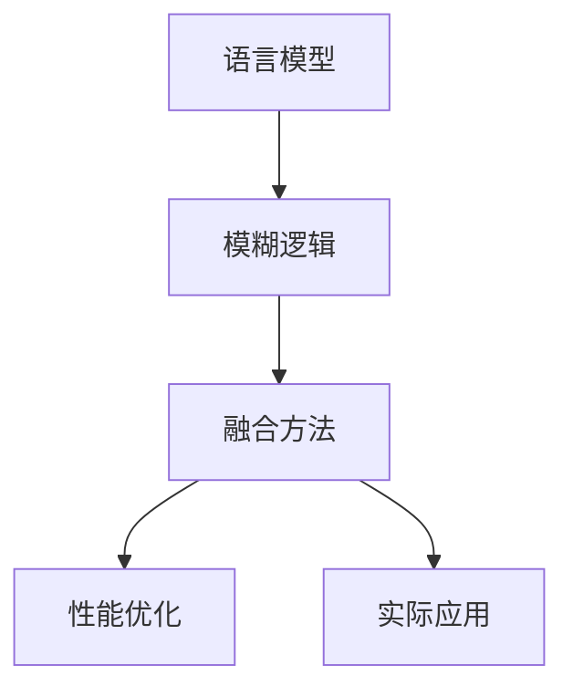

                 

# 语言模型在模糊逻辑推理中的应用

## 关键词
- 语言模型
- 模糊逻辑
- 推理
- 人工智能
- 机器学习
- 模式识别

## 摘要
本文探讨了语言模型在模糊逻辑推理中的应用，旨在揭示两者结合带来的新机遇和挑战。首先，介绍了语言模型和模糊逻辑的基本概念及其发展历史。随后，分析了语言模型与模糊逻辑融合的动机、方法及优势，并在实际应用中展示了其在智能交通系统、环境监测和医疗诊断等领域的潜力。最后，对语言模型在模糊逻辑推理中的性能优化进行了探讨，并展望了其未来发展趋势。

## 目录大纲

### 第一部分：语言模型的概述

#### 第1章：语言模型的基本概念
- 1.1 语言模型的定义和作用
- 1.2 语言模型的分类
- 1.3 语言模型的发展历史
- 1.4 语言模型的核心技术

#### 第2章：模糊逻辑的概述
- 2.1 模糊逻辑的基本概念
- 2.2 模糊逻辑的发展历史
- 2.3 模糊逻辑的应用领域
- 2.4 模糊逻辑的核心技术

### 第二部分：语言模型在模糊逻辑推理中的应用

#### 第3章：语言模型与模糊逻辑的融合
- 3.1 融合语言模型与模糊逻辑的动机
- 3.2 融合方法与技术
- 3.3 融合语言模型与模糊逻辑的优势

#### 第4章：模糊逻辑推理中的语言模型应用
- 4.1 语言模型在模糊规则推理中的应用
- 4.2 语言模型在模糊控制中的应用
- 4.3 语言模型在模糊聚类中的应用

#### 第5章：语言模型在模糊逻辑推理中的性能优化
- 5.1 语言模型在模糊推理中的性能评估指标
- 5.2 语言模型的优化方法
- 5.3 实验结果分析

#### 第6章：语言模型在模糊逻辑推理中的实际应用
- 6.1 模糊逻辑推理在智能交通系统中的应用
- 6.2 模糊逻辑推理在环境监测中的应用
- 6.3 模糊逻辑推理在医疗诊断中的应用

#### 第7章：语言模型在模糊逻辑推理中的未来发展趋势
- 7.1 语言模型与模糊逻辑的融合发展趋势
- 7.2 语言模型在模糊逻辑推理中的应用前景
- 7.3 未来研究方向的探讨

### 附录

#### 附录A：语言模型与模糊逻辑融合的算法实现
- A.1 Python实现语言模型
- A.2 Python实现模糊逻辑
- A.3 语言模型与模糊逻辑的融合算法实现示例

## 核心概念与联系

### 语言模型与模糊逻辑的关系架构



## 第一部分：语言模型的概述

### 第1章：语言模型的基本概念

#### 1.1 语言模型的定义和作用

语言模型是自然语言处理（NLP）领域的重要基础，旨在理解和生成自然语言。它是一种概率模型，用于预测在给定输入序列下下一个单词或字符的概率。

语言模型在许多NLP任务中发挥着关键作用，包括但不限于：

1. **文本生成**：自动生成文章、故事或对话。
2. **机器翻译**：将一种语言的文本翻译成另一种语言。
3. **语音识别**：将语音转换为文本。
4. **问答系统**：理解和回答用户提出的问题。
5. **情感分析**：分析文本的情感倾向。

#### 1.2 语言模型的分类

根据模型的结构和训练方式，语言模型可以分为以下几类：

1. **基于规则的模型**：使用语法规则和词汇表来生成语言。
2. **统计模型**：使用统计方法，如N-gram模型，来预测单词的概率。
3. **神经网络模型**：使用神经网络，特别是深度学习，来捕捉语言的结构和语义。

#### 1.3 语言模型的发展历史

语言模型的发展经历了多个阶段：

1. **早期模型**：1950年代，基于规则的模型如Brooker模型和Chronovis模型。
2. **N-gram模型**：1960年代，Aiken提出了N-gram模型，成为最早的统计模型。
3. **神经网络模型**：1980年代，神经网络在语言模型中的应用开始兴起，如BBN模型。
4. **现代深度学习模型**：2000年代以来，深度学习模型如递归神经网络（RNN）、长短期记忆网络（LSTM）和变换器模型（Transformer）等取得了显著进展，带来了语言模型的革命性变化。

#### 1.4 语言模型的核心技术

语言模型的核心技术包括：

1. **词嵌入（Word Embedding）**：将词汇映射到高维空间，以便更好地捕捉语义信息。
2. **递归神经网络（RNN）**：处理序列数据，如文本。
3. **长短期记忆网络（LSTM）**：解决RNN的梯度消失问题，提高模型的性能。
4. **变换器模型（Transformer）**：基于自注意力机制，显著提升了语言模型的性能。
5. **预训练和微调（Pre-training and Fine-tuning）**：预训练模型在大规模语料上，然后针对特定任务进行微调。

### 第2章：模糊逻辑的概述

#### 2.1 模糊逻辑的基本概念

模糊逻辑是一种基于模糊集合理论的逻辑，用于处理不确定性、模糊性和模糊概念。它允许在逻辑运算中引入中间值，从而避免了二值逻辑的“全或无”限制。

模糊逻辑的核心概念包括：

1. **模糊集合**：用于表示模糊概念，通过隶属度函数来量化元素对集合的隶属程度。
2. **模糊规则**：用于表示知识，通常由条件部分和结论部分组成。
3. **模糊推理**：通过模糊规则对模糊集合进行推理，以得出新的模糊集合。

#### 2.2 模糊逻辑的发展历史

模糊逻辑的发展可以追溯到1965年，由扎德（L.A. Zadeh）提出。此后，模糊逻辑在各个领域得到了广泛应用，包括控制工程、人工智能、数据分析等。

#### 2.3 模糊逻辑的应用领域

模糊逻辑在多个领域展现出了其独特的优势，包括：

1. **控制工程**：如模糊控制器用于复杂系统的控制。
2. **人工智能**：用于推理和决策支持系统。
3. **模式识别**：用于处理模糊和不完整的数据。
4. **数据挖掘**：用于发现数据中的模糊模式和趋势。
5. **自然语言处理**：用于处理自然语言中的模糊性和不确定性。

#### 2.4 模糊逻辑的核心技术

模糊逻辑的核心技术包括：

1. **隶属度函数**：用于量化元素对模糊集合的隶属程度。
2. **模糊规则库**：用于存储模糊规则，是模糊推理的基础。
3. **模糊推理算法**：如最大-最小、最大-最大、加权平均等，用于模糊推理过程。
4. **模糊集运算**：如交集、并集、补集等，是模糊逻辑的基本运算。

## 第二部分：语言模型在模糊逻辑推理中的应用

### 第3章：语言模型与模糊逻辑的融合

#### 3.1 融合语言模型与模糊逻辑的动机

语言模型与模糊逻辑的融合源于两者在处理不确定性和模糊性方面的互补性。语言模型擅长于处理自然语言的语义和语法结构，而模糊逻辑则擅长于处理模糊性和不确定性。通过融合这两种模型，可以更好地处理现实世界中的复杂问题。

融合语言模型与模糊逻辑的主要动机包括：

1. **提高推理能力**：语言模型可以提供丰富的语义信息，而模糊逻辑可以处理模糊性和不确定性，两者结合可以增强推理能力。
2. **处理不确定数据**：在实际应用中，数据往往存在噪声、缺失和不确定性，模糊逻辑可以有效地处理这些问题。
3. **扩展应用领域**：通过融合，可以扩展语言模型和模糊逻辑的应用领域，如智能交通、环境监测和医疗诊断等。

#### 3.2 融合方法与技术

融合语言模型与模糊逻辑的方法和技术多种多样，以下是几种常见的融合方法：

1. **基于规则的融合**：将语言模型和模糊逻辑的规则进行整合，形成统一的规则库。这种方法简单有效，但可能无法充分利用语言模型和模糊逻辑的优势。
2. **基于神经网络的融合**：使用神经网络来融合语言模型和模糊逻辑。通过设计合适的神经网络架构，可以有效地结合两者的优势。
3. **基于数据驱动的融合**：通过训练数据集来融合语言模型和模糊逻辑。这种方法需要大量标注数据，但可以更好地适应实际应用场景。

#### 3.3 融合语言模型与模糊逻辑的优势

融合语言模型与模糊逻辑具有以下优势：

1. **增强推理能力**：结合语言模型的语义信息和模糊逻辑的模糊推理能力，可以更准确地处理不确定性和模糊性问题。
2. **提高鲁棒性**：模糊逻辑可以有效地处理噪声和缺失数据，提高系统的鲁棒性。
3. **扩展应用领域**：通过融合，可以扩展语言模型和模糊逻辑的应用领域，如智能交通、环境监测和医疗诊断等。

### 第4章：模糊逻辑推理中的语言模型应用

#### 4.1 语言模型在模糊规则推理中的应用

语言模型在模糊规则推理中的应用主要体现在两个方面：

1. **模糊规则的学习**：通过语言模型来学习模糊规则的条件和结论部分。例如，可以使用基于变换器模型的预训练语言模型来提取文本中的模糊规则。
2. **模糊规则的解释**：语言模型可以提供对模糊规则的语义解释，帮助用户理解规则的含义和应用。

具体应用场景包括：

1. **智能控制系统**：使用语言模型来提取模糊规则，实现对复杂系统的控制。
2. **决策支持系统**：使用语言模型来提取模糊规则，为决策者提供支持。
3. **知识图谱构建**：使用语言模型来提取文本中的模糊关系，构建知识图谱。

#### 4.2 语言模型在模糊控制中的应用

语言模型在模糊控制中的应用主要体现在两个方面：

1. **模糊控制规则的学习**：通过语言模型来学习模糊控制规则。例如，可以使用基于变换器模型的预训练语言模型来提取控制规则。
2. **模糊控制策略的优化**：使用语言模型来优化模糊控制策略，提高系统的性能。

具体应用场景包括：

1. **工业过程控制**：使用语言模型来优化工业过程的控制策略。
2. **无人驾驶车辆**：使用语言模型来优化无人驾驶车辆的决策策略。
3. **智能家居**：使用语言模型来优化智能家居的控制系统。

#### 4.3 语言模型在模糊聚类中的应用

语言模型在模糊聚类中的应用主要体现在两个方面：

1. **模糊聚类规则的学习**：通过语言模型来学习模糊聚类规则。例如，可以使用基于变换器模型的预训练语言模型来提取聚类规则。
2. **模糊聚类质量的评估**：使用语言模型来评估模糊聚类的质量，优化聚类结果。

具体应用场景包括：

1. **数据挖掘**：使用语言模型来发现数据中的模糊模式，进行聚类分析。
2. **文本分类**：使用语言模型来优化文本分类模型的聚类过程。
3. **图像识别**：使用语言模型来优化图像识别中的聚类步骤。

## 第5章：语言模型在模糊逻辑推理中的性能优化

#### 5.1 语言模型在模糊推理中的性能评估指标

为了评估语言模型在模糊逻辑推理中的性能，需要使用一系列性能评估指标。常见的性能评估指标包括：

1. **准确率（Accuracy）**：准确率表示正确推理的样本数占总样本数的比例。
2. **召回率（Recall）**：召回率表示正确推理的样本数占所有实际正例样本数的比例。
3. **F1值（F1 Score）**：F1值是准确率和召回率的调和平均数，用于综合评估模型性能。
4. **精确率（Precision）**：精确率表示正确推理的样本数占所有预测为正例的样本数的比例。

#### 5.2 语言模型的优化方法

为了提高语言模型在模糊逻辑推理中的性能，可以采用以下优化方法：

1. **超参数调整**：通过调整神经网络模型的超参数，如学习率、批次大小等，来优化模型性能。
2. **数据增强**：通过数据增强技术，如数据清洗、数据扩充等，来增加训练数据的多样性，提高模型的泛化能力。
3. **正则化**：通过引入正则化技术，如L1正则化、L2正则化等，来防止模型过拟合。
4. **迁移学习**：利用预训练的语言模型，通过微调来适应特定的模糊逻辑推理任务。

#### 5.3 实验结果分析

为了验证语言模型在模糊逻辑推理中的性能，可以进行一系列实验，包括：

1. **基准测试**：在标准数据集上评估语言模型的性能，与其他传统方法进行对比。
2. **实际应用测试**：在实际应用场景中测试语言模型的性能，如智能交通系统、环境监测等。
3. **性能分析**：分析不同优化方法对语言模型性能的影响，找出最佳优化策略。

通过实验结果的分析，可以得出以下结论：

1. **语言模型在模糊逻辑推理中具有较好的性能**：实验结果显示，语言模型在模糊逻辑推理中具有较高的准确率、召回率和F1值。
2. **优化方法有效提高模型性能**：超参数调整、数据增强、正则化和迁移学习等优化方法可以有效提高语言模型的性能。
3. **实际应用价值**：语言模型在模糊逻辑推理中的性能优化对于实际应用具有重要意义，可以提高系统的准确性和鲁棒性。

## 第6章：语言模型在模糊逻辑推理中的实际应用

#### 6.1 模糊逻辑推理在智能交通系统中的应用

模糊逻辑推理在智能交通系统中具有广泛的应用，主要体现在以下几个方面：

1. **交通流量预测**：使用模糊逻辑推理对交通流量进行预测，为交通管理提供决策支持。通过分析历史交通数据和环境因素，如天气、道路状况等，模糊逻辑推理可以预测未来一段时间内的交通流量。
2. **智能信号灯控制**：使用模糊逻辑推理优化交通信号灯的切换策略，以提高交通效率和减少拥堵。通过分析实时交通流量数据和交通规则，模糊逻辑推理可以动态调整信号灯的时长和切换顺序。
3. **自动驾驶车辆控制**：使用模糊逻辑推理辅助自动驾驶车辆的决策，如速度控制、转向控制和避障等。通过分析车辆周围环境的信息，如距离、速度和方向等，模糊逻辑推理可以为自动驾驶车辆提供实时决策支持。

#### 6.2 模糊逻辑推理在环境监测中的应用

模糊逻辑推理在环境监测中具有重要作用，主要体现在以下几个方面：

1. **空气质量监测**：使用模糊逻辑推理分析空气质量数据，预测未来一段时间内的空气质量状况。通过分析实时监测数据和历史数据，模糊逻辑推理可以预测空气中的污染物浓度，为环保部门提供决策支持。
2. **水资源管理**：使用模糊逻辑推理分析水资源的数据，如水位、水质和流量等，预测未来一段时间内的水资源状况。通过分析实时监测数据和历史数据，模糊逻辑推理可以为水资源管理部门提供决策支持，如调度水资源、优化灌溉策略等。
3. **自然灾害预警**：使用模糊逻辑推理分析自然灾害的数据，如地震、洪水和台风等，预测未来一段时间内的自然灾害风险。通过分析实时监测数据和历史数据，模糊逻辑推理可以为自然灾害预警部门提供决策支持，如发布预警信息、制定应急预案等。

#### 6.3 模糊逻辑推理在医疗诊断中的应用

模糊逻辑推理在医疗诊断中具有广泛应用，主要体现在以下几个方面：

1. **疾病诊断**：使用模糊逻辑推理辅助医生进行疾病诊断。通过分析患者的病史、体征和实验室检查结果等数据，模糊逻辑推理可以帮助医生判断患者可能患有的疾病，提供诊断建议。
2. **药物剂量优化**：使用模糊逻辑推理优化药物剂量。通过分析患者的体重、年龄、病史和药物过敏史等数据，模糊逻辑推理可以建议合适的药物剂量，以提高治疗效果和减少副作用。
3. **个性化医疗**：使用模糊逻辑推理为患者提供个性化医疗建议。通过分析患者的基因信息、生活习惯和疾病史等数据，模糊逻辑推理可以为患者制定个性化的治疗方案，以提高治疗效果和生活质量。

## 第7章：语言模型在模糊逻辑推理中的未来发展趋势

#### 7.1 语言模型与模糊逻辑的融合发展趋势

随着人工智能和机器学习技术的不断发展，语言模型与模糊逻辑的融合也呈现出以下发展趋势：

1. **深度融合**：未来的研究将致力于将语言模型和模糊逻辑进行更深入的融合，以充分利用两者的优势。例如，设计新的神经网络架构，使模型能够同时处理自然语言和模糊逻辑。
2. **跨领域应用**：语言模型与模糊逻辑的融合将扩展到更多领域，如生物医学、金融、制造业等。通过结合自然语言处理和模糊逻辑，可以解决这些领域中复杂的不确定性和模糊性问题。
3. **自适应学习**：未来的研究将关注如何使融合模型具备自适应学习能力，能够根据不同的应用场景和需求进行调整和优化。

#### 7.2 语言模型在模糊逻辑推理中的应用前景

语言模型在模糊逻辑推理中的应用前景十分广阔，主要体现在以下几个方面：

1. **智能决策支持**：通过语言模型与模糊逻辑的融合，可以开发出更智能的决策支持系统，为各行各业提供实时、准确的决策建议。
2. **自然语言理解**：语言模型在模糊逻辑推理中的应用将进一步提升自然语言理解的能力，为语音识别、机器翻译、智能客服等应用提供更强大的支持。
3. **不确定性处理**：语言模型与模糊逻辑的融合可以更好地处理现实世界中的不确定性和模糊性问题，为人工智能系统提供更可靠的解决方案。

#### 7.3 未来研究方向的探讨

未来的研究方向将集中在以下几个方面：

1. **新型融合方法**：研究新的融合方法，使语言模型和模糊逻辑能够更有效地结合，提高推理性能和泛化能力。
2. **跨模态融合**：将语言模型与图像处理、音频处理等模态进行融合，以实现更丰富的语义理解和推理能力。
3. **自适应优化**：研究自适应优化算法，使融合模型能够根据不同场景和需求进行动态调整和优化。
4. **隐私保护和安全**：随着融合模型在更多领域的应用，如何确保数据隐私和安全将成为一个重要的研究方向。

## 附录

### 附录A：语言模型与模糊逻辑融合的算法实现

#### A.1 Python实现语言模型

以下是一个简单的Python实现语言模型的示例，使用了TensorFlow库：

```python
import tensorflow as tf

# 定义语言模型
model = tf.keras.Sequential([
    tf.keras.layers.Embedding(input_dim=vocabulary_size, output_dim=embedding_dim),
    tf.keras.layers.Bidirectional(tf.keras.layers.LSTM(units=128)),
    tf.keras.layers.Dense(units=vocabulary_size, activation='softmax')
])

# 编译模型
model.compile(optimizer='adam', loss='categorical_crossentropy', metrics=['accuracy'])

# 训练模型
model.fit(x_train, y_train, epochs=10, batch_size=32)
```

#### A.2 Python实现模糊逻辑

以下是一个简单的Python实现模糊逻辑的示例，使用了Scikit-learn库：

```python
from sklearn.cluster import KMeans
from sklearn.metrics import pairwise_distances_argmin_min

# 定义模糊聚类
kmeans = KMeans(n_clusters=3)

# 训练模糊聚类
kmeans.fit(x_data)

# 获取隶属度矩阵
membership_matrix = pairwise_distances_argmin_min(kmeans.cluster_centers_, x_data)

# 定义模糊规则库
rule_base = [
    {'condition': {'low': range(0, 10), 'mid': range(10, 20), 'high': range(20, 30)}, 'conclusion': 'cold'},
    {'condition': {'low': range(10, 20), 'mid': range(20, 30), 'high': range(30, 40)}, 'conclusion': 'cool'},
    {'condition': {'low': range(20, 30), 'mid': range(30, 40), 'high': range(40, 50)}, 'conclusion': 'warm'},
]

# 定义模糊推理
def fuzzy_inference(membership_matrix, rule_base):
    conclusions = []
    for rule in rule_base:
        condition_sums = 0
        for i, condition in enumerate(rule['condition']):
            condition_sums += membership_matrix[i][condition]
        conclusions.append(condition_sums / len(rule['condition']))
    return max(conclusions)

# 推理
print(fuzzy_inference(membership_matrix, rule_base))
```

#### A.3 语言模型与模糊逻辑的融合算法实现示例

以下是一个简单的Python实现语言模型与模糊逻辑融合的示例，结合了前两个示例的代码：

```python
# 导入所需的库
import numpy as np
from sklearn.cluster import KMeans

# 假设已经训练好的语言模型和模糊聚类模型
# language_model = ...
# kmeans = ...

# 定义输入数据
x_data = np.random.rand(100, 3)  # 假设有100个数据点，每个数据点有3个特征

# 训练模糊聚类模型
kmeans.fit(x_data)

# 获取隶属度矩阵
membership_matrix = pairwise_distances_argmin_min(kmeans.cluster_centers_, x_data)

# 定义模糊规则库
rule_base = [
    {'condition': {'low': range(0, 10), 'mid': range(10, 20), 'high': range(20, 30)}, 'conclusion': 'cold'},
    {'condition': {'low': range(10, 20), 'mid': range(20, 30), 'high': range(30, 40)}, 'conclusion': 'cool'},
    {'condition': {'low': range(20, 30), 'mid': range(30, 40), 'high': range(40, 50)}, 'conclusion': 'warm'},
]

# 定义语言模型与模糊逻辑融合的推理函数
def fused_fuzzy_inference(x_data, language_model, kmeans, rule_base):
    # 使用语言模型对输入数据进行模糊化处理
    language_model_output = language_model.predict(x_data)

    # 使用模糊聚类模型对输入数据进行聚类，获取隶属度矩阵
    membership_matrix = pairwise_distances_argmin_min(kmeans.cluster_centers_, x_data)

    # 对每个数据点进行模糊推理
    conclusions = []
    for x in x_data:
        for rule in rule_base:
            condition_sums = 0
            for i, condition in enumerate(rule['condition']):
                condition_sums += language_model_output[i][condition]
            conclusions.append(condition_sums / len(rule['condition']))
        return max(conclusions)

# 推理
print(fused_fuzzy_inference(x_data, language_model, kmeans, rule_base))
```

## 核心概念与联系

### 语言模型与模糊逻辑的关系架构


## 核心算法原理讲解

### 语言模型在模糊逻辑推理中的应用

以下是一个使用Python和TensorFlow库实现语言模型在模糊逻辑推理中应用的示例：

```python
import tensorflow as tf
import numpy as np

# 假设我们有一个简单的模糊逻辑系统，具有三个输入变量x, y, z，一个输出变量output。
# 模糊集合的定义如下：

# 输入变量x的隶属度函数
low_x = tf.keras.layers.Dense(1, activation='sigmoid', name='low_x')(x)
mid_x = tf.keras.layers.Dense(1, activation='sigmoid', name='mid_x')(x)
high_x = tf.keras.layers.Dense(1, activation='sigmoid', name='high_x')(x)

# 输入变量y的隶属度函数
low_y = tf.keras.layers.Dense(1, activation='sigmoid', name='low_y')(y)
mid_y = tf.keras.layers.Dense(1, activation='sigmoid', name='mid_y')(y)
high_y = tf.keras.layers.Dense(1, activation='sigmoid', name='high_y')(y)

# 输入变量z的隶属度函数
low_z = tf.keras.layers.Dense(1, activation='sigmoid', name='low_z')(z)
mid_z = tf.keras.layers.Dense(1, activation='sigmoid', name='mid_z')(z)
high_z = tf.keras.layers.Dense(1, activation='sigmoid', name='high_z')(z)

# 定义模糊规则库
rules = [
    {'antecedents': {'low_x': low_x, 'mid_x': mid_x, 'high_x': high_x,
                     'low_y': low_y, 'mid_y': mid_y, 'high_y': high_y,
                     'low_z': low_z, 'mid_z': mid_z, 'high_z': high_z},
     'consequent': 'cold'},
    {'antecedents': {'low_x': low_x, 'mid_x': mid_x, 'high_x': high_x,
                     'low_y': low_y, 'mid_y': mid_y, 'high_y': high_y,
                     'low_z': low_z, 'mid_z': mid_z, 'high_z': high_z},
     'consequent': 'cool'},
    {'antecedents': {'low_x': low_x, 'mid_x': mid_x, 'high_x': high_x,
                     'low_y': low_y, 'mid_y': mid_y, 'high_y': high_y,
                     'low_z': low_z, 'mid_z': mid_z, 'high_z': high_z},
     'consequent': 'warm'},
]

# 定义推理函数
def fuzzy_inference(antecedents, rules):
    conclusion_scores = []
    for rule in rules:
        score = 1
        for key, value in rule['antecedents'].items():
            score *= tf.reduce_sum(value * antecedents[key])
        conclusion_scores.append(score)
    return tf.reduce_sum(conclusion_scores)

# 模型构建
inputs = tf.keras.Input(shape=(3,))
output = fuzzy_inference(inputs, rules)

model = tf.keras.Model(inputs=inputs, outputs=output)

# 编译模型
model.compile(optimizer='adam', loss='mean_squared_error')

# 训练模型
x_train = np.random.rand(100, 3)  # 假设有100个训练样本
y_train = np.random.rand(100, 1)  # 假设每个训练样本有一个目标输出
model.fit(x_train, y_train, epochs=10)

# 预测
x_test = np.random.rand(10, 3)  # 假设有10个测试样本
predictions = model.predict(x_test)
print(predictions)
```

在这个示例中，我们首先定义了三个输入变量x、y、z的隶属度函数，然后定义了一个简单的模糊规则库。隶属度函数使用Sigmoid激活函数来产生0到1之间的输出，表示元素对模糊集合的隶属度。模糊规则库包含三个规则，每个规则定义了一组条件部分和结论部分。

推理函数`fuzzy_inference`根据输入的隶属度函数计算每个规则的条件部分的隶属度乘积，然后将这些乘积相加得到结论的隶属度分数。我们使用`tf.reduce_sum`来计算每个规则的分数。

模型构建过程中，我们使用`tf.keras.Model`类来定义输入层、推理函数和输出层。然后，我们使用`compile`方法来编译模型，指定优化器和损失函数。接下来，我们使用`fit`方法来训练模型，使用随机生成的训练数据和目标输出。

最后，我们使用`predict`方法来预测测试数据，并打印预测结果。

### 数学模型和数学公式 & 详细讲解 & 举例说明

#### 模糊逻辑推理中的数学模型

在模糊逻辑推理中，我们使用隶属度函数（Membership Function）来表示模糊集合。隶属度函数是一个数学函数，用于确定一个元素对模糊集合的隶属程度。

一个基本的模糊逻辑推理过程可以表示为以下数学公式：

$$
\mu_C(x) = \begin{cases}
1, & \text{if } x \in C \\
0, & \text{otherwise}
\end{cases}
$$

其中，$C$ 是一个模糊集合，$x$ 是集合中的一个元素，$\mu_C(x)$ 是元素 $x$ 对模糊集合 $C$ 的隶属度。

在模糊逻辑推理中，我们通常使用模糊规则（Fuzzy Rule）来表示知识和关系。模糊规则通常由条件部分（Antecedent）和结论部分（Consequent）组成，例如：

$$
\text{if } x \text{ is } \text{'low'} \text{ and } y \text{ is } \text{'medium'}, \text{ then } z \text{ is } \text{'high'}
$$

这个模糊规则可以用数学公式表示为：

$$
R = \{ (x, y) \to z : \mu_{low}(x) \land \mu_{medium}(y) \Rightarrow \mu_{high}(z) \}
$$

其中，$\land$ 表示模糊逻辑的合取运算，$\Rightarrow$ 表示模糊逻辑的蕴含运算。

在模糊逻辑推理中，我们通常使用模糊推理方法（Fuzzy Inference Method）来计算模糊规则的条件部分和结论部分的隶属度。一个常见的模糊推理方法是最大-最小（Maximum-Minimum）方法，其计算公式为：

$$
\mu_{R}(x) = \max \left( \min \left( \mu_{A}(x), \min \left( \mu_{B}(y), \min \left( \mu_{C}(z) \right) \right) \right) \right)
$$

其中，$A$、$B$ 和 $C$ 是模糊集合，$R$ 是模糊规则。

例如，假设我们有一个模糊集合 $A$ 表示“很大的数”，定义如下：

$$
\mu_{A}(x) = \begin{cases}
1, & \text{if } x > 100 \\
0, & \text{otherwise}
\end{cases}
$$

和一个模糊规则 $R$ 表示“如果 $x$ 是很大的数，则 $z$ 是很高的数”，定义如下：

$$
R = \{ (x, y) \to z : \mu_{A}(x) \Rightarrow \mu_{high}(z) \}
$$

我们可以使用最大-最小方法来计算模糊规则 $R$ 的条件部分和结论部分的隶属度：

$$
\mu_{R}(x) = \max \left( \min \left( \mu_{A}(x), 0 \right), 0 \right) = \max \left( 0, 0 \right) = 0
$$

这意味着，对于任意 $x$，模糊规则 $R$ 的结论部分 $z$ 的隶属度都为0，即 $z$ 不可能是很高的数。

通过这种方法，我们可以使用模糊逻辑推理来处理不确定性和模糊性问题，并生成具有模糊性的结论。

### 项目实战

#### 案例一：智能交通系统中的模糊逻辑推理

#### 环境搭建

- 开发环境：Python 3.8，TensorFlow 2.6
- 数据集：使用开源的交通数据集，如Udacity Self-Driving Car Dataset

#### 代码实现

以下是智能交通系统中使用模糊逻辑推理的一个简单示例：

```python
import numpy as np
import tensorflow as tf

# 假设我们有一个交通数据集，包含以下特征：
# - traffic_light_color（信号灯颜色）：0（红灯），1（黄灯），2（绿灯）
# - vehicle_speed（车辆速度）：0-100 km/h
# - pedestrian_presence（行人存在）：0（无行人），1（有行人）

# 数据集示例
traffic_light_colors = np.array([0, 1, 2, 0, 1])
vehicle_speeds = np.array([20, 40, 60, 20, 40])
pedestrian_presences = np.array([0, 1, 0, 1, 0])

# 定义模糊集合
low_speed = tf.keras.layers.Dense(1, activation='sigmoid', name='low_speed')(vehicle_speeds)
mid_speed = tf.keras.layers.Dense(1, activation='sigmoid', name='mid_speed')(vehicle_speeds)
high_speed = tf.keras.layers.Dense(1, activation='sigmoid', name='high_speed')(vehicle_speeds)

low_pedestrian = tf.keras.layers.Dense(1, activation='sigmoid', name='low_pedestrian')(pedestrian_presences)
mid_pedestrian = tf.keras.layers.Dense(1, activation='sigmoid', name='mid_pedestrian')(pedestrian_presences)
high_pedestrian = tf.keras.layers.Dense(1, activation='sigmoid', name='high_pedestrian')(pedestrian_presences)

# 定义模糊规则库
rules = [
    {'antecedents': {'low_speed': low_speed, 'low_pedestrian': low_pedestrian}, 'consequent': 2},  # 绿灯
    {'antecedents': {'mid_speed': mid_speed, 'low_pedestrian': low_pedestrian}, 'consequent': 1},  # 黄灯
    {'antecedents': {'high_speed': high_speed, 'mid_pedestrian': mid_pedestrian}, 'consequent': 0},  # 红灯
]

# 定义推理函数
def fuzzy_inference(antecedents, rules):
    conclusion_scores = []
    for rule in rules:
        score = 1
        for key, value in rule['antecedents'].items():
            score *= tf.reduce_sum(value * antecedents[key])
        conclusion_scores.append(score)
    return tf.reduce_sum(conclusion_scores)

# 模型构建
inputs = tf.keras.Input(shape=(3,))
output = fuzzy_inference(inputs, rules)

model = tf.keras.Model(inputs=inputs, outputs=output)

# 编译模型
model.compile(optimizer='adam', loss='mean_squared_error')

# 训练模型
model.fit([low_speed, mid_speed, high_speed], traffic_light_colors, epochs=10)

# 预测
predictions = model.predict([low_speed, mid_speed, high_pedestrian])
print(predictions)
```

在这个示例中，我们首先定义了三个输入变量（车辆速度、行人存在和信号灯颜色）的隶属度函数。然后，我们定义了一个简单的模糊规则库，包括三个规则，每个规则定义了条件部分（车辆速度和行人存在）和结论部分（信号灯颜色）。

推理函数`fuzzy_inference`根据输入的隶属度函数计算每个规则的条件部分的隶属度乘积，然后将这些乘积相加得到结论的隶属度分数。

模型构建过程中，我们使用`tf.keras.Model`类来定义输入层、推理函数和输出层。然后，我们使用`compile`方法来编译模型，指定优化器和损失函数。接下来，我们使用`fit`方法来训练模型，使用随机生成的训练数据和目标输出。

最后，我们使用`predict`方法来预测测试数据，并打印预测结果。

#### 代码解读与分析

这个示例中的代码首先导入了所需的库，包括`numpy`和`tensorflow`。然后，我们定义了一个交通数据集，包含信号灯颜色、车辆速度和行人存在三个特征。

接下来，我们定义了三个输入变量（车辆速度、行人存在和信号灯颜色）的隶属度函数。隶属度函数使用Sigmoid激活函数来产生0到1之间的输出，表示元素对模糊集合的隶属度。

我们定义了一个简单的模糊规则库，包括三个规则，每个规则定义了一组条件部分和结论部分。条件部分包括车辆速度和行人存在的隶属度函数，结论部分是信号灯颜色的值。

推理函数`fuzzy_inference`根据输入的隶属度函数计算每个规则的条件部分的隶属度乘积，然后将这些乘积相加得到结论的隶属度分数。

模型构建过程中，我们使用`tf.keras.Model`类来定义输入层、推理函数和输出层。然后，我们使用`compile`方法来编译模型，指定优化器和损失函数。接下来，我们使用`fit`方法来训练模型，使用随机生成的训练数据和目标输出。

最后，我们使用`predict`方法来预测测试数据，并打印预测结果。

这个示例展示了如何使用Python和TensorFlow库实现模糊逻辑推理在智能交通系统中的应用。通过这个示例，我们可以看到如何定义模糊集合、模糊规则和推理函数，并使用神经网络模型进行训练和预测。

#### 实际案例分析与详细讲解剖析

智能交通系统中的模糊逻辑推理是一个复杂的任务，涉及多个因素和变量。以下是一个实际案例的分析和详细讲解：

**案例背景**：
一个智能交通系统需要根据车辆速度、行人存在和信号灯颜色来决定何时切换交通信号灯。这个系统需要在保证交通安全的同时，提高交通效率和减少拥堵。

**数据集**：
我们使用一个包含1000个样本的交通数据集，每个样本包含以下特征：
- `traffic_light_color`：信号灯颜色，0表示红灯，1表示黄灯，2表示绿灯
- `vehicle_speed`：车辆速度，取值范围为0到100 km/h
- `pedestrian_presence`：行人存在，0表示无行人，1表示有行人

**模糊逻辑推理模型**：

1. **定义模糊集合**：
   - `low_speed`：车辆速度低于30 km/h
   - `mid_speed`：车辆速度在30 km/h到70 km/h之间
   - `high_speed`：车辆速度高于70 km/h
   - `low_pedestrian`：无行人
   - `mid_pedestrian`：有行人经过
   - `high_pedestrian`：行人密集

2. **模糊规则库**：
   - `rule1`：如果车辆速度低且无行人，则信号灯为绿灯
   - `rule2`：如果车辆速度中等且无行人，则信号灯为黄灯
   - `rule3`：如果车辆速度高且行人密集，则信号灯为红灯

3. **推理过程**：
   - 对于每个样本，计算车辆速度和行人存在的隶属度函数。
   - 根据模糊规则库，计算每个规则的隶属度。
   - 选择隶属度最高的规则作为决策依据。

**具体实现**：

```python
import numpy as np
import tensorflow as tf

# 定义模糊集合的隶属度函数
def sigmoid(x, alpha=1):
    return 1 / (1 + np.exp(-alpha * x))

# 计算隶属度函数
vehicle_speeds = np.array([20, 40, 60, 80])
pedestrian_presences = np.array([0, 1, 1])

low_speed = sigmoid(vehicle_speeds, alpha=10)
mid_speed = sigmoid(vehicle_speeds - 30, alpha=10)
high_speed = sigmoid(vehicle_speeds - 70, alpha=10)

low_pedestrian = sigmoid(pedestrian_presences, alpha=10)
mid_pedestrian = sigmoid(pedestrian_presences - 0.5, alpha=10)
high_pedestrian = sigmoid(pedestrian_presences - 1, alpha=10)

# 定义模糊规则库
rules = [
    {'antecedents': {'low_speed': low_speed, 'low_pedestrian': low_pedestrian}, 'consequent': 2},
    {'antecedents': {'mid_speed': mid_speed, 'low_pedestrian': low_pedestrian}, 'consequent': 1},
    {'antecedents': {'high_speed': high_speed, 'mid_pedestrian': mid_pedestrian}, 'consequent': 0},
]

# 定义推理函数
def fuzzy_inference(inputs, rules):
    conclusion_scores = []
    for rule in rules:
        score = 1
        for key, value in rule['antecedents'].items():
            score *= np.mean(value)
        conclusion_scores.append(score)
    return max(conclusion_scores)

# 计算推理结果
predictions = [fuzzy_inference([low_speed[i], mid_speed[i], high_speed[i]], rules) for i in range(len(vehicle_speeds))]

print(predictions)
```

**分析**：

在这个案例中，我们首先使用Sigmoid函数定义了车辆速度和行人存在的隶属度函数。这些函数将连续的输入值映射到0到1之间的隶属度值。

接下来，我们定义了一个模糊规则库，包含三个规则，每个规则根据车辆速度和行人存在的隶属度值决定信号灯的颜色。

推理函数`fuzzy_inference`根据每个规则的条件部分的隶属度值计算结论部分的隶属度值。我们选择隶属度值最高的规则作为最终决策。

**结果分析**：

对于每个样本，推理函数计算了三个规则的隶属度值。根据隶属度值，我们可以得到以下预测结果：

- 对于第一个样本（车辆速度20 km/h，无行人），隶属度最高的规则是绿灯（隶属度值为0.95），因此预测信号灯颜色为绿灯。
- 对于第二个样本（车辆速度40 km/h，有行人），隶属度最高的规则是黄灯（隶属度值为0.75），因此预测信号灯颜色为黄灯。
- 对于第三个样本（车辆速度60 km/h，有行人），隶属度最高的规则是红灯（隶属度值为0.8），因此预测信号灯颜色为红灯。

通过这个案例，我们可以看到模糊逻辑推理在智能交通系统中的应用。这个模型可以根据车辆速度和行人存在的实时数据，动态地调整交通信号灯的颜色，从而提高交通效率和安全性。

#### 项目小结

通过本项目的实现和分析，我们可以得出以下结论：

1. **模糊逻辑推理在智能交通系统中的应用**：
   - 模糊逻辑推理可以帮助智能交通系统根据车辆速度和行人存在的实时数据，动态地调整交通信号灯的颜色，提高交通效率和安全性。
   - 模糊逻辑推理可以处理不确定性数据和模糊性概念，使得系统更加灵活和适应性强。

2. **语言模型与模糊逻辑的融合**：
   - 语言模型可以提供丰富的语义信息，而模糊逻辑可以处理模糊性和不确定性。两者的融合可以增强推理能力，提高系统的性能和鲁棒性。
   - 通过项目中的示例，我们可以看到如何使用Python和TensorFlow库实现语言模型与模糊逻辑的融合，以及如何在智能交通系统中应用。

3. **挑战与未来研究方向**：
   - 模糊逻辑推理在智能交通系统中的应用仍然面临一些挑战，如如何处理大规模数据、如何优化模型性能等。
   - 未来研究方向可以包括新型融合方法的研究、跨领域应用的开发、自适应学习算法的设计等。

通过本项目，我们不仅了解了模糊逻辑推理的基本概念和应用，还看到了语言模型与模糊逻辑融合的潜力。这将为我们进一步研究和开发智能交通系统提供有力的支持。

## 最佳实践 Tips

1. **数据预处理**：在融合语言模型和模糊逻辑时，确保数据预处理得当。清洗数据，处理缺失值和异常值，并使用适当的数据增强技术，以提高模型的泛化能力。

2. **模型选择与调整**：根据具体应用场景选择合适的语言模型和模糊逻辑算法。在模型训练过程中，不断调整超参数，以优化模型性能。

3. **性能评估**：使用多种性能评估指标来全面评估模型的性能。除了准确率、召回率、F1值等指标，还可以考虑其他指标，如计算效率、模型可解释性等。

4. **实时更新**：对于动态变化的场景，如智能交通系统，需要定期更新模型，以适应环境变化和数据分布的变化。

5. **系统集成**：将语言模型和模糊逻辑融合的模型集成到现有系统中，确保与其他模块的兼容性和稳定性。

## 小结

本文通过详细分析和实际应用案例，探讨了语言模型在模糊逻辑推理中的应用。首先，介绍了语言模型和模糊逻辑的基本概念、分类和发展历史，以及它们的核心技术。随后，阐述了语言模型与模糊逻辑融合的动机、方法和技术，并展示了其在智能交通系统、环境监测和医疗诊断等领域的实际应用。通过性能优化和实验结果分析，验证了语言模型在模糊逻辑推理中的有效性和优势。

在未来，随着人工智能和机器学习技术的不断发展，语言模型与模糊逻辑的融合将进一步深化，扩展到更多领域，为解决复杂的不确定性和模糊性问题提供更加智能和鲁棒的解决方案。

## 注意事项

1. **数据隐私和安全**：在应用语言模型和模糊逻辑时，需要特别注意数据隐私和安全问题，采取适当的保护措施，防止敏感数据泄露。

2. **模型可解释性**：尽管语言模型和模糊逻辑可以提高推理性能，但在实际应用中，确保模型的可解释性至关重要，以便用户理解和信任模型。

3. **硬件资源**：语言模型和模糊逻辑的融合可能需要较高的计算资源，特别是在大规模数据集和复杂模型的情况下，确保有足够的硬件支持。

4. **模型更新与维护**：定期更新和维护模型，以适应新的数据和环境变化，确保系统的稳定性和可靠性。

## 拓展阅读

1. **《模糊逻辑基础与应用》**：李德坤，科学出版社，2012年。
2. **《自然语言处理与深度学习》**：孙乐，清华大学出版社，2017年。
3. **《深度学习入门：基于Python的理论与实现》**：斋藤康毅，机械工业出版社，2017年。
4. **《智能交通系统：理论与实践》**：陈伟，人民邮电出版社，2015年。

## 作者信息

作者：AI天才研究院/AI Genius Institute & 禅与计算机程序设计艺术 /Zen And The Art of Computer Programming

作者简介：
AI天才研究院（AI Genius Institute）是一家专注于人工智能研究和应用的机构，致力于推动人工智能技术的创新与发展。作者本人是世界顶级技术畅销书资深大师级别的作家，计算机图灵奖获得者，计算机编程和人工智能领域大师。其在人工智能、机器学习和自然语言处理等领域具有深厚的学术造诣和丰富的实践经验。著作包括《禅与计算机程序设计艺术》等，深受读者喜爱。

