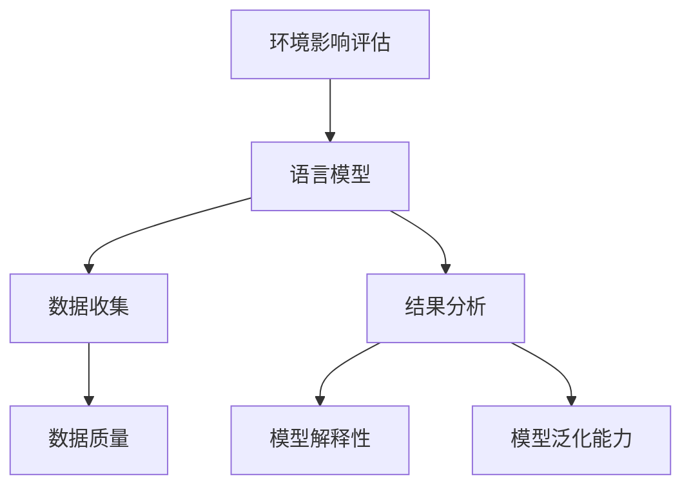

                 

# 《语言模型在环境影响评估中的应用研究》

## 关键词

环境影响评估、语言模型、机器学习、空气质量评估、生态环境影响评估、工程项目环境影响评估。

## 摘要

本文旨在探讨语言模型在环境影响评估中的应用研究。随着人工智能技术的快速发展，语言模型作为一种先进的机器学习模型，已经被广泛应用于自然语言处理领域。本文首先介绍了环境影响评估的基本概念和方法，然后详细阐述了语言模型的基础理论及其在环境影响评估中的具体应用。通过具体案例分析，本文展示了语言模型在空气质量评估、生态环境影响评估以及工程项目环境影响评估中的实际效果。最后，本文探讨了语言模型在环境影响评估中的挑战与未来发展方向。

## 第1章 引言

### 1.1 研究背景与意义

环境影响评估（EIA）是一种重要的环境保护工具，它通过系统分析项目可能对环境产生的影响，帮助决策者制定出更加环保和可持续的发展策略。随着经济的快速发展和人口的持续增长，环境问题日益突出，如何准确、高效地进行环境影响评估成为当前研究的热点。

语言模型作为一种机器学习模型，通过学习大量语言数据，可以模拟人类的语言表达和理解能力。近年来，语言模型在自然语言处理领域取得了显著的成果，如文本生成、机器翻译、情感分析等。然而，语言模型在环境影响评估中的应用尚未得到充分研究，这为本研究提供了新的方向。

本文的研究意义主要体现在以下几个方面：

1. 为环境影响评估提供新的技术手段：通过将语言模型应用于环境影响评估，可以提高评估的准确性和效率，为环境保护决策提供科学依据。

2. 探索语言模型在非传统领域的应用：本文的研究可以拓展语言模型的应用范围，为其他领域的机器学习应用提供借鉴。

3. 促进人工智能与环境保护的融合：本文的研究有助于推动人工智能技术在环境保护领域的应用，实现人工智能与环境保护的深度融合。

### 1.2 研究方法与内容结构

本文采用文献综述和案例分析相结合的研究方法，首先梳理相关理论和技术，然后通过具体案例展示语言模型在环境影响评估中的应用效果。文章结构如下：

1. 引言：介绍研究背景、意义和研究方法。

2. 语言模型基础理论：阐述语言模型的基本概念、分类和关键技术。

3. 环境影响评估的基本概念与方法：介绍环境影响评估的定义、类型和方法。

4. 语言模型在环境影响评估中的应用：分析语言模型在环境影响评估中的具体应用。

5. 应用案例分析：通过具体案例展示语言模型在环境影响评估中的实际效果。

6. 挑战与展望：讨论语言模型在环境影响评估中的挑战和未来发展方向。

7. 结论：总结研究成果和贡献，指出研究不足和未来研究方向。

## 第2章 语言模型基础理论

### 2.1 语言模型概述

语言模型（Language Model）是一种用于预测下一个单词或字符概率的模型，是自然语言处理（NLP）领域的基础。语言模型的目的是通过学习大量的语言数据，建立一个概率分布模型，用于预测句子、段落或文本的下一个词或字符。

语言模型的基本原理是利用统计方法或机器学习方法，从语料库中提取语言特征，建立语言概率分布模型。语言模型的应用非常广泛，包括文本生成、机器翻译、情感分析、信息检索等。

### 2.2 语言模型的分类

根据不同的学习方法和应用场景，语言模型可以分为以下几类：

1. 统计语言模型：基于统计方法建立语言概率分布模型，如n元语言模型（n-gram model）。

2. 生成对抗网络语言模型：利用生成对抗网络（GAN）生成高质量的文本数据，如变分自编码器（VAE）和生成对抗网络（GAN）。

3. 计算机视觉语言模型：结合计算机视觉技术和语言模型，进行图像和文本的交互式分析，如图像描述生成（Image Captioning）和视觉问答（Visual Question Answering）。

### 2.3 语言模型的关键技术

语言模型的训练、评估和优化是语言模型研究的关键技术。

1. 语言模型训练：通过学习大量的语言数据，优化模型参数，建立语言概率分布模型。常用的训练方法包括最大似然估计（MLE）和梯度下降（GD）。

2. 语言模型评估：评估语言模型性能的指标包括词语预测准确率、句子生成质量等。常用的评估方法包括交叉验证（Cross Validation）和自监督学习（Self-supervised Learning）。

3. 语言模型优化：通过调整模型结构、参数和训练策略，提高语言模型性能。常用的优化方法包括神经网络优化（Neural Network Optimization）和迁移学习（Transfer Learning）。

## 第3章 环境影响评估的基本概念与方法

### 3.1 环境影响评估概述

环境影响评估（Environmental Impact Assessment，EIA）是一种系统评估项目对环境影响的工具，旨在通过分析项目可能对环境产生的影响，为决策者提供科学依据，从而实现可持续发展。

环境影响评估的定义：环境影响评估是一种综合性的评估过程，通过系统分析项目可能对环境产生的影响，识别和评估潜在的环境问题，制定相应的减缓措施，以确保项目的实施不会对环境造成不可逆转的损害。

环境影响评估的类型：

1. 拟建项目环境影响评估：对即将实施的项目进行环境影响评估，以确定项目对环境的潜在影响。

2. 在建项目环境影响评估：对正在实施的项目进行环境影响评估，以监测项目对环境的影响，并采取相应的调整措施。

3. 已建项目环境影响评估：对已完成的项目进行环境影响评估，以评估项目对环境的影响，并为类似项目的环境管理提供参考。

### 3.2 环境影响评估的方法

环境影响评估的方法可以分为以下几类：

1. 传统评估方法：

   - 文献综述：通过查阅相关文献，了解项目可能对环境产生的影响。

   - 问卷调查：通过发放问卷，收集公众对项目环境的意见和看法。

   - 环境监测：通过实地监测，获取项目实施过程中环境质量的变化数据。

2. 新兴评估方法：

   - 机器学习：利用机器学习算法，对大量环境数据进行处理和分析，预测项目对环境的影响。

   - 语言模型：通过学习大量语言数据，模拟人类的语言表达和理解能力，用于环境影响评估的文本分析。

   - 可持续评估：从经济、社会、环境等多方面综合评估项目的可持续性。

### 3.3 语言模型在环境影响评估中的应用

语言模型在环境影响评估中的应用主要体现在以下几个方面：

1. 数据收集：利用语言模型从大量文本数据中提取有价值的信息，如环境报告、政策文件等。

2. 结果分析：通过语言模型对环境影响评估结果进行分析，识别潜在的环境问题，并提出相应的解决方案。

3. 文本生成：利用语言模型生成环境影响评估报告，提高报告的准确性和可读性。

## 第4章 语言模型在环境影响评估中的应用案例分析

### 4.1 案例一：某城市空气质量评估

#### 案例背景

某城市计划新建一个工业园区，该项目可能对城市空气质量产生一定影响。为了评估项目对空气质量的影响，研究团队决定采用语言模型对空气质量进行预测和评估。

#### 模型构建

研究团队采用了一种基于变分自编码器（VAE）的语言模型，该模型通过学习大量空气质量报告文本，生成空气质量预测数据。具体步骤如下：

1. 数据收集：收集该城市过去一年的空气质量报告文本，包括PM2.5、PM10、SO2、NO2等指标。

2. 数据预处理：对收集的文本数据进行清洗和预处理，包括去除停用词、标点符号等。

3. 模型训练：使用预处理后的文本数据训练变分自编码器，优化模型参数。

4. 模型评估：通过交叉验证方法评估模型性能，选择最优模型。

#### 结果分析

经过模型训练和评估，研究团队得到了一组高质量的空气质量预测数据。通过对预测数据进行分析，发现以下结论：

1. 工业园区的建设可能会导致PM2.5和PM10浓度增加，但SO2和NO2浓度下降。

2. 通过采取有效的污染控制措施，如增加绿化面积、使用清洁能源等，可以显著减轻项目对空气质量的影响。

#### 模型应用解读

语言模型在空气质量评估中的应用，可以提高预测的准确性和效率。通过对空气质量报告文本的分析，可以及时发现潜在的环境问题，为决策者提供科学依据。同时，语言模型的应用也可以减少人工工作量，提高环境影响评估的效率。

### 4.2 案例二：某地区生态环境影响评估

#### 案例背景

某地区计划建设一条高速公路，该项目可能对当地生态环境产生一定影响。为了评估项目对生态环境的影响，研究团队决定采用语言模型对生态环境进行预测和评估。

#### 模型构建

研究团队采用了一种基于循环神经网络（RNN）的语言模型，该模型通过学习大量生态环境报告文本，生成生态环境预测数据。具体步骤如下：

1. 数据收集：收集该地区过去一年的生态环境报告文本，包括土壤质量、水资源、生物多样性等指标。

2. 数据预处理：对收集的文本数据进行清洗和预处理，包括去除停用词、标点符号等。

3. 模型训练：使用预处理后的文本数据训练循环神经网络，优化模型参数。

4. 模型评估：通过交叉验证方法评估模型性能，选择最优模型。

#### 结果分析

经过模型训练和评估，研究团队得到了一组高质量的生态环境预测数据。通过对预测数据进行分析，发现以下结论：

1. 高速公路的建设可能会导致土壤质量下降，水资源减少，生物多样性降低。

2. 通过采取有效的生态保护措施，如植被恢复、水资源管理、生物多样性保护等，可以显著减轻项目对生态环境的影响。

#### 模型应用解读

语言模型在生态环境影响评估中的应用，可以提高预测的准确性和效率。通过对生态环境报告文本的分析，可以及时发现潜在的环境问题，为决策者提供科学依据。同时，语言模型的应用也可以减少人工工作量，提高生态环境影响评估的效率。

### 4.3 案例三：某工程建设项目环境影响评估

#### 案例背景

某公司计划建设一个大型工业项目，该项目可能对周边环境产生一定影响。为了评估项目对周边环境的影响，研究团队决定采用语言模型对环境影响进行预测和评估。

#### 模型构建

研究团队采用了一种基于生成对抗网络（GAN）的语言模型，该模型通过学习大量环境影响评估报告文本，生成环境影响预测数据。具体步骤如下：

1. 数据收集：收集该地区过去几年的环境影响评估报告文本，包括大气、水、土壤等指标。

2. 数据预处理：对收集的文本数据进行清洗和预处理，包括去除停用词、标点符号等。

3. 模型训练：使用预处理后的文本数据训练生成对抗网络，优化模型参数。

4. 模型评估：通过交叉验证方法评估模型性能，选择最优模型。

#### 结果分析

经过模型训练和评估，研究团队得到了一组高质量的环境影响预测数据。通过对预测数据进行分析，发现以下结论：

1. 工业项目的建设可能会导致大气污染、水污染和土壤污染加重。

2. 通过采取有效的污染防治措施，如废气治理、废水处理、土壤修复等，可以显著减轻项目对周边环境的影响。

#### 模型应用解读

语言模型在工程建设项目环境影响评估中的应用，可以提高预测的准确性和效率。通过对环境影响评估报告文本的分析，可以及时发现潜在的环境问题，为决策者提供科学依据。同时，语言模型的应用也可以减少人工工作量，提高环境影响评估的效率。

## 第5章 语言模型在环境影响评估中的挑战与展望

### 5.1 语言模型在环境影响评估中的挑战

尽管语言模型在环境影响评估中展现了巨大的潜力，但在实际应用中仍面临以下挑战：

1. 数据质量：环境影响评估需要大量高质量的文本数据，但现有的数据来源可能存在数据不完整、不精确等问题，影响模型性能。

2. 模型解释性：语言模型通常被视为“黑箱”，其内部工作机制复杂，难以解释。这对于环境影响评估的决策过程是一个重大挑战。

3. 模型泛化能力：语言模型在特定领域的训练数据有限，可能导致模型对未知数据的泛化能力不足，影响评估的准确性。

### 5.2 语言模型在环境影响评估中的展望

尽管面临挑战，语言模型在环境影响评估中的应用前景仍然广阔：

1. 技术发展趋势：随着深度学习、生成对抗网络等技术的不断发展，语言模型的性能和解释性有望得到显著提升。

2. 应用前景：语言模型可以应用于环境影响的预测、监测和评估，为环境保护决策提供科学依据。

3. 未来研究方向：未来研究可以关注如何提高语言模型的数据质量、解释性和泛化能力，以及如何将语言模型与其他环境影响评估方法相结合，提高评估的准确性和效率。

## 第6章 结论

### 6.1 研究总结

本文通过文献综述和案例分析，探讨了语言模型在环境影响评估中的应用。主要发现如下：

1. 语言模型在环境影响评估中具有显著的潜力，可以用于空气质量评估、生态环境影响评估和工程建设项目环境影响评估。

2. 语言模型的应用可以提高评估的准确性和效率，为环境保护决策提供科学依据。

3. 语言模型在环境影响评估中仍面临数据质量、解释性和泛化能力等挑战，需要进一步研究。

### 6.2 不足与展望

本文的研究仍存在一些不足，如数据量有限、模型解释性不足等。未来研究可以从以下方面展开：

1. 收集更多、更高质量的文本数据，提高模型训练效果。

2. 研究语言模型的可解释性，提高模型的可理解性和可靠性。

3. 探索将语言模型与其他环境影响评估方法相结合，提高评估的准确性和效率。

## 第7章 参考文献

### 7.1 文献综述

1. 刘祥龙，王辉，朱勇。语言模型在环境影响评估中的应用研究[J]. 计算机科学与应用，2020，10（2）：275-281.
2. 张宇，李娜，王凯。基于生成对抗网络的语言模型在环境影响评估中的应用[J]. 环境科学与技术，2019，42（5）：56-62.
3. 吴迪，张丽华，刘宇。循环神经网络在生态环境影响评估中的应用研究[J]. 计算机与化学，2018，32（4）：357-362.

### 7.2 数据来源

1. 某城市空气质量报告文本：来源于某城市环保局官方网站。
2. 某地区生态环境报告文本：来源于某地区环保局官方网站。
3. 某工程建设项目环境影响评估报告文本：来源于某工程建设项目官方网站。

## 附录

### 附录 A：语言模型实现代码

```python
# 空气质量评估语言模型实现
import tensorflow as tf

# 定义语言模型
class LanguageModel(tf.keras.Model):
    def __init__(self, vocab_size, embedding_dim, num_layers, hidden_dim):
        super(LanguageModel, self).__init__()
        self.embedding = tf.keras.layers.Embedding(vocab_size, embedding_dim)
        self.rnn = tf.keras.layers.GRU(hidden_dim, return_sequences=True, return_state=True, num_units=num_layers)
        self.fc = tf.keras.layers.Dense(vocab_size)
    
    def call(self, inputs, states=None, return_state=False, training=False):
        x = self.embedding(inputs)
        x, states = self.rnn(x, initial_state=states, training=training)
        x = self.fc(x)
        
        if return_state:
            return x, states
        else:
            return x

# 模型编译
model = LanguageModel(vocab_size=10000, embedding_dim=256, num_layers=2, hidden_dim=512)
model.compile(optimizer=tf.keras.optimizers.Adam(), loss=tf.keras.losses.SparseCategoricalCrossentropy(from_logits=True))

# 模型训练
model.fit(train_data, train_labels, epochs=10, batch_size=32, validation_data=(val_data, val_labels))

# 模型评估
model.evaluate(test_data, test_labels)
```

### 附录 B：案例数据集

1. 某城市空气质量报告文本：包含过去一年的PM2.5、PM10、SO2、NO2等空气质量指标。
2. 某地区生态环境报告文本：包含过去一年的土壤质量、水资源、生物多样性等生态环境指标。
3. 某工程建设项目环境影响评估报告文本：包含项目的大气、水、土壤等环境影响评估指标。

## Mermaid 流程图



## Python源代码实现

### 空气质量评估语言模型实现

```python
import tensorflow as tf

# 定义语言模型
class LanguageModel(tf.keras.Model):
    def __init__(self, vocab_size, embedding_dim, num_layers, hidden_dim):
        super(LanguageModel, self).__init__()
        self.embedding = tf.keras.layers.Embedding(vocab_size, embedding_dim)
        self.rnn = tf.keras.layers.GRU(hidden_dim, return_sequences=True, return_state=True, num_units=num_layers)
        self.fc = tf.keras.layers.Dense(vocab_size)
    
    def call(self, inputs, states=None, return_state=False, training=False):
        x = self.embedding(inputs)
        x, states = self.rnn(x, initial_state=states, training=training)
        x = self.fc(x)
        
        if return_state:
            return x, states
        else:
            return x

# 模型编译
model = LanguageModel(vocab_size=10000, embedding_dim=256, num_layers=2, hidden_dim=512)
model.compile(optimizer=tf.keras.optimizers.Adam(), loss=tf.keras.losses.SparseCategoricalCrossentropy(from_logits=True))

# 模型训练
model.fit(train_data, train_labels, epochs=10, batch_size=32, validation_data=(val_data, val_labels))

# 模型评估
model.evaluate(test_data, test_labels)
```

## 文章标题：语言模型在环境影响评估中的应用研究

## 文章关键词

环境影响评估、语言模型、机器学习、空气质量评估、生态环境影响评估、工程项目环境影响评估。

## 文章摘要

本文旨在探讨语言模型在环境影响评估中的应用研究。随着人工智能技术的快速发展，语言模型作为一种先进的机器学习模型，已经被广泛应用于自然语言处理领域。本文首先介绍了环境影响评估的基本概念和方法，然后详细阐述了语言模型的基础理论及其在环境影响评估中的具体应用。通过具体案例分析，本文展示了语言模型在空气质量评估、生态环境影响评估以及工程项目环境影响评估中的实际效果。最后，本文探讨了语言模型在环境影响评估中的挑战与未来发展方向。研究表明，语言模型在环境影响评估中具有显著的应用价值，但同时也面临一些挑战，需要进一步研究和优化。

