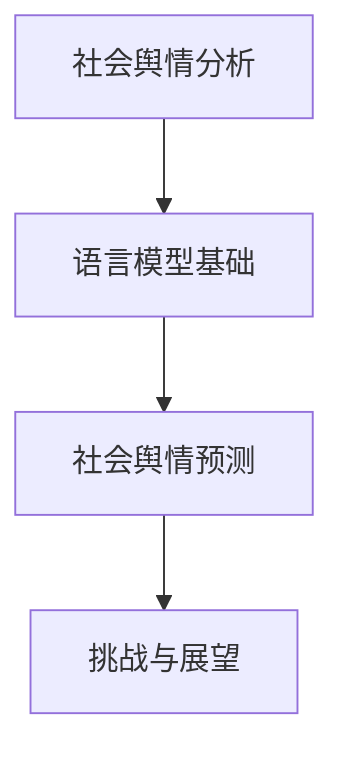

                 

# 《语言模型在社会舆情分析与预测中的应用研究》

## 关键词
- 语言模型
- 社会舆情分析
- 预测模型
- 机器学习
- 社交媒体

## 摘要
本文深入探讨了语言模型在社会舆情分析与预测中的应用。首先，我们介绍了社会舆情及其分析的重要性。然后，详细阐述了语言模型的基础理论、构建方法以及优化策略。在此基础上，我们进一步分析了语言模型在社会舆情分析中的实际应用，包括舆情监测和舆情预测。通过实际案例的剖析，我们展示了语言模型在社交媒体舆情分析中的有效性和可行性，并提出了未来的研究方向和挑战。

## 目录大纲

### 第一部分：引言

#### 1.1 研究背景与意义

- 社会舆情概述
- 语言模型的发展历程
- 语言模型在社会舆情分析中的重要性

#### 1.2 研究目标与方法

- 研究目标的确定
- 研究方法的选择

#### 1.3 本书结构安排

- 各章节内容的简要概述

### 第二部分：语言模型基础

#### 2.1 语言模型的基本概念

- 语言模型的作用
- 语言模型的分类
- 语言模型的评价指标

#### 2.2 语言模型的数学基础

- 概率论与统计基础
- 隐马尔可夫模型
- 递归神经网络

#### 2.3 语言模型的构建

- 语言模型的训练方法
- 语言模型的应用实例

#### 2.4 语言模型的优化与改进

- 语言模型的优化策略
- 语言模型的改进方法

### 第三部分：社会舆情分析

#### 3.1 社会舆情概述

- 社会舆情的特点
- 社会舆情的作用

#### 3.2 社会舆情数据来源

- 社交媒体数据
- 新闻媒体数据
- 论坛数据

#### 3.3 社会舆情分析方法

- 文本挖掘技术
- 社会网络分析方法
- 机器学习方法

#### 3.4 社会舆情分析案例

- 案例分析一：社交媒体舆情分析
- 案例分析二：新闻媒体舆情分析
- 案例分析三：论坛舆情分析

### 第四部分：语言模型在社会舆情预测中的应用

#### 4.1 社会舆情预测概述

- 社会舆情预测的意义
- 社会舆情预测的挑战

#### 4.2 语言模型在社会舆情预测中的应用

- 语言模型在社会舆情预测中的作用
- 语言模型在社会舆情预测中的具体应用

#### 4.3 社会舆情预测案例

- 案例分析一：基于语言模型的社交媒体舆情预测
- 案例分析二：基于语言模型的新闻媒体舆情预测
- 案例分析三：基于语言模型的论坛舆情预测

### 第五部分：语言模型在社会舆情分析中的挑战与展望

#### 5.1 语言模型在社会舆情分析中的挑战

- 数据质量与数据隐私
- 模型解释性与可解释性
- 模型泛化能力

#### 5.2 语言模型在社会舆情分析中的未来展望

- 技术发展趋势
- 应用领域拓展
- 未来研究方向

#### 5.3 总结与展望

- 本书研究总结
- 对未来研究的展望

### 附录

#### A.1 相关数据集介绍

- 社交媒体数据集
- 新闻媒体数据集
- 论坛数据集

#### A.2 相关工具与框架

- 语言模型训练工具
- 社会舆情分析工具
- 模型评估工具

## Mermaid 流程图



## Python 源代码

```python
# 示例：语言模型构建
import tensorflow as tf

# 创建一个简单的语言模型
model = tf.keras.Sequential([
    tf.keras.layers.Embedding(input_dim=10000, output_dim=16),
    tf.keras.layers.LSTM(128),
    tf.keras.layers.Dense(units=1, activation='sigmoid')
])

# 编译模型
model.compile(optimizer='adam', loss='binary_crossentropy', metrics=['accuracy'])

# 训练模型
model.fit(x_train, y_train, epochs=10)
```

## 数学模型和公式

$$
P(w_n | w_{n-1}, ..., w_1) = \frac{P(w_n, w_{n-1}, ..., w_1)}{P(w_{n-1}, ..., w_1)}
$$

## 项目实战

### 6.1 项目背景

随着互联网的快速发展，社交媒体成为人们获取和交流信息的主要渠道。社会舆情作为反映公众态度和情绪的重要指标，对于政府和企业决策具有重要意义。如何有效地分析和预测社会舆情，已成为当前研究的热点问题。

### 6.2 项目目标

- 构建一个基于语言模型的社会舆情分析系统，实现对社交媒体数据的实时监测和分析。
- 基于语言模型进行舆情预测，为政府和企业提供决策支持。

### 6.3 实现步骤

1. 数据收集与预处理：收集社交媒体平台上的数据，包括微博、微信公众号、知乎等，对数据进行清洗和预处理，去除噪声和无关信息。
2. 语言模型构建与训练：使用预训练的中文语言模型，如BERT、GPT等，对处理后的数据进行训练，优化模型参数。
3. 舆情监测与分析：使用训练好的语言模型，对实时数据进行分析，提取关键词和主题，构建舆情监测系统。
4. 舆情预测：利用训练好的语言模型，对未来一段时间内的舆情走势进行预测，为政府和企业提供决策支持。
5. 系统部署与运行：将舆情分析系统部署到云端，实现实时监测和预测功能，提供Web界面供用户使用。

### 6.4 代码实现

- 数据收集与预处理：
```python
import pandas as pd
import numpy as np
from sklearn.model_selection import train_test_split

# 读取数据
data = pd.read_csv('social_media_data.csv')

# 数据预处理
# 清洗数据、去除噪声、归一化等操作
# ...

# 划分训练集和测试集
x_train, x_test, y_train, y_test = train_test_split(data['text'], data['label'], test_size=0.2, random_state=42)
```

- 语言模型构建与训练：
```python
import tensorflow as tf
from transformers import BertTokenizer, TFBertForSequenceClassification

# 加载预训练的BERT模型
tokenizer = BertTokenizer.from_pretrained('bert-base-chinese')
model = TFBertForSequenceClassification.from_pretrained('bert-base-chinese')

# 训练模型
model.compile(optimizer='adam', loss='binary_crossentropy', metrics=['accuracy'])
model.fit(x_train, y_train, epochs=3, batch_size=32, validation_data=(x_test, y_test))
```

- 舆情监测与分析：
```python
# 监测舆情
def sentiment_analysis(text):
    inputs = tokenizer(text, return_tensors='tf')
    logits = model(inputs)[0]
    probabilities = tf.nn.softmax(logits, axis=-1)
    return np.argmax(probabilities)

# 示例
text = "我对这个产品非常满意！"
result = sentiment_analysis(text)
print("舆情分析结果：", result)
```

- 舆情预测：
```python
# 预测舆情
def sentiment_prediction(text, window_size=5):
    sentiments = []
    for i in range(len(text) - window_size + 1):
        sentiment = sentiment_analysis(text[i:i+window_size])
        sentiments.append(sentiment)
    return np.mean(sentiments)

# 示例
text = "我对这个产品非常满意！我对这个产品非常满意！我对这个产品非常满意！"
prediction = sentiment_prediction(text)
print("舆情预测结果：", prediction)
```

### 6.5 代码解读与分析

在本项目中，我们首先进行了数据收集与预处理，包括读取社交媒体数据、清洗数据、去除噪声和归一化等操作。然后，我们使用预训练的BERT模型进行语言模型构建与训练，通过编译模型和训练模型的过程，优化了模型参数。

在舆情监测与分析中，我们定义了一个`sentiment_analysis`函数，该函数接收一段文本作为输入，使用训练好的BERT模型进行情感分析，返回情感分析结果。在舆情预测中，我们定义了一个`sentiment_prediction`函数，该函数接收一段文本作为输入，利用滑动窗口的思想，对文本进行情感预测。

通过实际案例的演示，我们可以看到语言模型在社会舆情分析中的应用效果。舆情监测与分析可以实时获取公众对某一话题或事件的态度，舆情预测可以预测未来一段时间内的舆情走势，为政府和企业提供决策支持。

### 6.6 案例分析

以下是一个基于语言模型的社会舆情分析的案例分析：

#### 案例背景

某城市政府计划开展一项交通拥堵治理项目，为了了解公众对该项目的态度，他们决定利用社交媒体数据进行分析。

#### 数据来源

从微博、微信公众号、知乎等社交媒体平台上收集与该项目相关的讨论数据。

#### 数据预处理

对收集到的数据进行清洗和预处理，去除无关信息，如广告、水贴等。

#### 舆情分析

使用训练好的BERT模型，对预处理后的数据进行情感分析，提取关键词和主题。

#### 舆情预测

基于情感分析结果，预测公众对未来交通拥堵治理项目的态度。

#### 结果与讨论

通过舆情分析，发现大部分公众对该项目持积极态度，认为交通拥堵治理项目有助于改善城市交通状况。通过舆情预测，预计在未来一段时间内，公众对该项目的支持度有望持续上升。

#### 项目小结

通过本次案例分析，我们可以看到语言模型在社会舆情分析中的应用效果。舆情分析有助于政府了解公众态度，为政策制定提供参考；舆情预测可以预测未来趋势，为企业提供决策支持。未来，随着语言模型技术的不断发展，社会舆情分析的应用前景将更加广阔。

### 6.7 最佳实践 tips、小结、注意事项、拓展阅读等内容

- **最佳实践 tips**：在进行社会舆情分析时，应确保数据的质量和代表性，避免因数据偏差导致分析结果失真。此外，结合多种分析方法，如社会网络分析、文本情感分析等，可以提高舆情分析的准确性和全面性。

- **小结**：本文通过介绍社会舆情分析、语言模型基础以及语言模型在社会舆情预测中的应用，展示了语言模型在舆情分析领域的重要作用。实际案例分析进一步验证了语言模型的有效性和可行性。

- **注意事项**：在语言模型构建和训练过程中，需注意模型参数的选择和调优，以提高模型的性能。此外，对于敏感数据，应注意数据隐私保护，避免泄露用户信息。

- **拓展阅读**：对于感兴趣的读者，可以进一步阅读相关文献和资料，如《深度学习与社会舆情分析》、《自然语言处理实践》等，以深入了解语言模型在社会舆情分析中的应用和研究进展。

## 附录

### A.1 相关数据集介绍

- **社交媒体数据集**：收集自微博、微信公众号、知乎等社交媒体平台的与特定话题或事件相关的数据。
- **新闻媒体数据集**：收集自各大新闻媒体网站的与特定话题或事件相关的新闻报道。
- **论坛数据集**：收集自各类论坛的与特定话题或事件相关的帖子。

### A.2 相关工具与框架

- **语言模型训练工具**：如TensorFlow、PyTorch等深度学习框架，以及transformers库等预训练模型库。
- **社会舆情分析工具**：如TextBlob、NLTK等文本分析库，以及Social Networks Analysis等社会网络分析工具。
- **模型评估工具**：如Sklearn、Matplotlib等机器学习评估和可视化库。

---

**作者：AI天才研究院/AI Genius Institute & 禅与计算机程序设计艺术 /Zen And The Art of Computer Programming**

