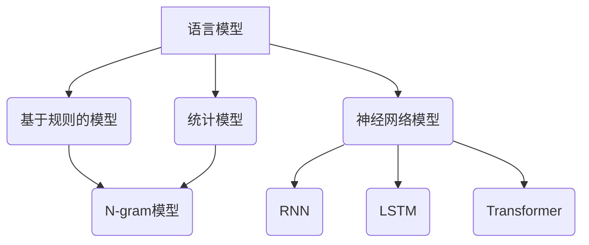
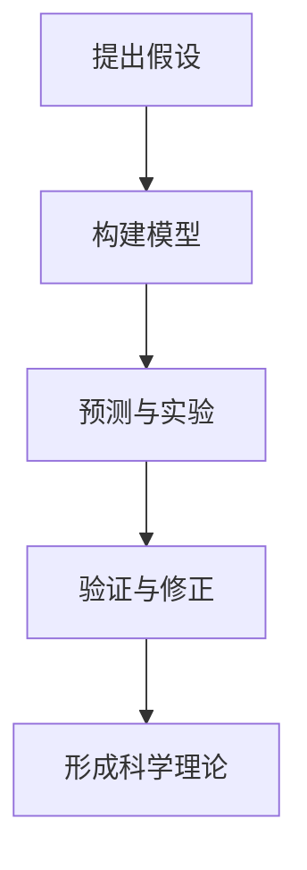

                 

### 文章标题

《语言模型在科学理论生成中的应用探索》

### 关键词

- 语言模型
- 科学理论生成
- 词向量模型
- 递归神经网络
- 变换器模型
- 生成对抗网络
- 实践应用

### 摘要

随着人工智能技术的迅猛发展，语言模型在自然语言处理领域取得了显著的成就。本文旨在探讨语言模型在科学理论生成中的应用，通过分析语言模型的基本概念、发展历程、核心算法以及科学理论的生成机制，深入探讨语言模型在科学理论生成中的潜在作用和挑战。文章将结合实际案例，详细解析语言模型在科学理论生成中的实践应用，并展望未来的发展趋势。

### 第一部分：语言模型概述

#### 第1章：语言模型的基本概念

**1.1 语言模型的定义**

语言模型（Language Model，LM）是自然语言处理（Natural Language Processing，NLP）领域中的一项基础技术，它旨在模拟人类语言生成的能力。简单来说，语言模型是一个概率模型，用于预测一段文本的下一个单词或字符。

**1.2 语言模型的发展历程**

语言模型的发展可以追溯到20世纪50年代。最早的模型是基于规则的方法，如字符串匹配和形式语言理论。随后，统计语言模型在20世纪80年代兴起，其中N-gram模型是最具代表性的。随着计算能力的提升和深度学习技术的发展，20世纪末和21世纪初，基于神经网络的深度语言模型如递归神经网络（RNN）、长短期记忆网络（LSTM）和变换器模型（Transformer）等相继出现，这些模型显著提高了语言生成的质量和效率。

**1.3 语言模型的基本类型**

语言模型可以分为以下几类：

- **基于规则的模型**：这类模型通过编写规则来预测下一个单词。
- **统计模型**：如N-gram模型，它通过统计词频来预测下一个单词。
- **神经网络模型**：如RNN、LSTM和Transformer，它们通过学习文本的上下文信息来进行预测。

**1.4 语言模型的核心特性**

语言模型具有以下核心特性：

- **上下文依赖**：语言模型能够考虑文本的上下文信息，从而提高预测的准确性。
- **概率分布**：语言模型输出的是一个概率分布，而不是单一的结果，这使得模型具有多样性和灵活性。
- **可扩展性**：语言模型可以应用于各种不同规模和领域的文本数据。

### Mermaid 流程图



### 第2章：科学理论的生成机制

**2.1 科学理论的基本概念**

科学理论（Scientific Theory）是科学研究中对自然界现象或规律的系统性解释。科学理论通常包括假设、预测和验证等组成部分，其目标是解释自然现象并提供可预测的规律。

**2.2 科学理论的发展过程**

科学理论的发展通常经历以下阶段：

- **观察与假设**：科学家通过观察自然现象，提出假设以解释这些现象。
- **预测与实验**：基于假设，科学家预测可能的结果，并通过实验验证这些预测。
- **验证与修正**：通过实验结果，科学家验证或修正假设，从而形成科学理论。

**2.3 科学理论的评价标准**

科学理论的评价标准包括：

- **解释力**：理论能够解释多少自然现象。
- **预测能力**：理论能够预测新的自然现象。
- **可验证性**：理论可以通过实验验证。
- **简洁性**：理论在解释自然现象的同时，应尽可能简洁。

**2.4 科学理论的生成机制**

科学理论的生成机制主要包括以下几个步骤：

1. **提出假设**：基于观察和已有知识，提出可能的解释。
2. **构建模型**：将假设转化为数学模型或计算机模型。
3. **预测与实验**：使用模型进行预测，并通过实验验证预测。
4. **修正与完善**：根据实验结果，修正模型或假设，形成科学理论。

### Mermaid 流�程图



### 第3章：语言模型在科学理论生成中的应用

**3.1 语言模型在科学理论生成中的作用**

语言模型在科学理论生成中具有以下几个重要作用：

- **假设生成**：语言模型可以帮助科学家生成新的假设，提高科学理论的创新性。
- **模型构建**：语言模型可以构建基于自然语言的数学模型，简化科学理论的表达。
- **文本分析**：语言模型可以分析科学文献，提取关键信息，加速科学理论的验证。

**3.2 语言模型在科学理论生成中的挑战**

语言模型在科学理论生成中面临的挑战包括：

- **上下文理解**：语言模型需要更准确地理解科学文本的上下文，以提高假设生成的质量。
- **知识融合**：语言模型需要融合多学科知识，构建跨领域的科学理论。
- **验证与实验**：科学理论的验证需要与实验数据相结合，语言模型需要与实验方法相结合。

**3.3 语言模型在科学理论生成中的应用案例**

以下是几个语言模型在科学理论生成中的应用案例：

- **生物信息学**：语言模型可以帮助生物学家生成新的蛋白质序列假设，并预测其功能。
- **物理学**：语言模型可以分析科学文献，提取物理定律和理论的证据。
- **社会科学**：语言模型可以生成新的社会科学理论，并预测社会现象。

**3.4 语言模型在科学理论生成中的未来发展趋势**

未来，语言模型在科学理论生成中将继续发展，主要趋势包括：

- **多模态融合**：语言模型将与其他模态（如图像、声音）结合，构建更加全面的理论。
- **跨学科应用**：语言模型将应用于更多学科，推动跨学科的科学研究。
- **智能化实验设计**：语言模型将辅助科学家设计更加智能的实验方案，加速科学理论的验证。

### 第4章：语言模型的核心算法

**4.1 词向量模型**

词向量模型是将自然语言中的单词映射为向量的方法。最早的词向量模型是Word2Vec，它通过训练大量文本数据，将单词映射到低维空间中，使得具有相似意义的单词在向量空间中靠近。

**4.1.1 基本概念**

- **Word2Vec**：Word2Vec模型包括两种训练方法：连续词袋（CBOW）和Skip-Gram。
- **词嵌入**：词嵌入（Word Embedding）是将单词映射到向量空间的过程。

**4.1.2 表示方法**

- **连续词袋（CBOW）**：CBOW模型通过上下文单词的平均值来表示目标单词。
- **Skip-Gram**：Skip-Gram模型通过目标单词周围的单词来预测目标单词。

**4.1.3 应用**

- **语义相似性**：词向量模型可以用于计算单词的语义相似性。
- **文本分类**：词向量模型可以用于文本分类任务，如情感分析。

**4.2 递归神经网络**

递归神经网络（RNN）是一种能够处理序列数据的人工神经网络。RNN通过循环结构来保持长期依赖信息，使其在自然语言处理任务中表现出色。

**4.2.1 基本概念**

- **RNN**：RNN通过循环结构来处理序列数据。
- **激活函数**：常用的激活函数包括Sigmoid、Tanh和ReLU。

**4.2.2 LSTM和GRU模型**

- **LSTM**：长短期记忆网络（LSTM）是RNN的一种改进，能够更好地处理长期依赖问题。
- **GRU**：门控循环单元（GRU）是LSTM的简化版，同样具有处理长期依赖的能力。

**4.2.3 应用**

- **语言模型**：RNN及其变体（LSTM和GRU）在语言模型中表现出色，用于文本生成、机器翻译等任务。

**4.3 变换器模型**

变换器模型（Transformer）是近年来在自然语言处理领域中表现出色的模型。它通过自注意力机制（Self-Attention）来处理序列数据，使其在长文本处理任务中表现出色。

**4.3.1 基本概念**

- **Transformer**：Transformer模型由自注意力机制和前馈神经网络组成。
- **多头注意力**：多头注意力（Multi-Head Attention）是Transformer的核心组件，能够捕获序列中的长距离依赖。

**4.3.2 应用**

- **语言模型**：Transformer在语言模型中表现出色，被广泛应用于文本生成、机器翻译等任务。

### Python源代码示例

```python
import tensorflow as tf
from tensorflow.keras.layers import Embedding, LSTM, Dense

# 创建模型
model = tf.keras.Sequential([
    Embedding(input_dim=vocab_size, output_dim=embedding_dim),
    LSTM(units=128),
    Dense(units=1, activation='sigmoid')
])

# 编译模型
model.compile(optimizer='adam', loss='binary_crossentropy', metrics=['accuracy'])

# 训练模型
model.fit(x_train, y_train, epochs=10, batch_size=32)
```

### 数学模型和公式

$$
\text{Loss} = -\sum_{i=1}^{N} y_i \log(\hat{y}_i)
$$

其中，$N$是样本数量，$y_i$是真实标签，$\hat{y}_i$是模型预测的概率。

### 第5章：科学理论生成的实践应用

**5.1 数据准备**

在科学理论生成的实践中，数据准备是关键步骤。数据来源可以是科学文献、实验数据、传感器数据等。

**5.1.1 数据来源**

- **科学文献**：通过文献检索系统，如PubMed、IEEE Xplore等，获取相关领域的科学文献。
- **实验数据**：从实验室或研究机构获取实验数据。
- **传感器数据**：从传感器获取环境数据，如气象数据、生物传感器数据等。

**5.1.2 数据预处理**

数据预处理包括以下步骤：

- **清洗**：去除数据中的噪声和错误。
- **归一化**：将数据归一化到相同的范围。
- **编码**：将类别数据编码为数值数据。

**5.1.3 数据集构建**

数据集构建包括以下步骤：

- **划分训练集和测试集**：将数据划分为训练集和测试集，用于模型的训练和验证。
- **数据增强**：通过数据增强技术，增加数据集的多样性。

### Python源代码示例

```python
import pandas as pd
from sklearn.model_selection import train_test_split
from sklearn.preprocessing import StandardScaler

# 读取数据
data = pd.read_csv('data.csv')

# 数据清洗
data.dropna(inplace=True)

# 数据归一化
scaler = StandardScaler()
data[['feature1', 'feature2']] = scaler.fit_transform(data[['feature1', 'feature2']])

# 数据编码
data['category'] = data['category'].map({0: 'A', 1: 'B'})

# 划分训练集和测试集
X_train, X_test, y_train, y_test = train_test_split(data[['feature1', 'feature2']], data['category'], test_size=0.2, random_state=42)

# 数据增强
from tensorflow.keras.preprocessing.sequence import pad_sequences
X_train = pad_sequences(X_train, maxlen=max_length)
X_test = pad_sequences(X_test, maxlen=max_length)
```

### 实验设计

实验设计包括以下步骤：

- **确定实验目标**：明确实验的目标和要解决的问题。
- **搭建实验环境**：搭建适合实验的计算机环境和软件环境。
- **参数设置**：设置模型的超参数，如学习率、批次大小等。

### Python源代码示例

```python
import tensorflow as tf
from tensorflow.keras.models import Sequential
from tensorflow.keras.layers import Embedding, LSTM, Dense

# 搭建模型
model = Sequential([
    Embedding(input_dim=vocab_size, output_dim=embedding_dim, input_length=max_length),
    LSTM(units=128),
    Dense(units=1, activation='sigmoid')
])

# 编译模型
model.compile(optimizer='adam', loss='binary_crossentropy', metrics=['accuracy'])

# 模型参数设置
learning_rate = 0.001
batch_size = 32
epochs = 10

# 训练模型
model.fit(X_train, y_train, epochs=epochs, batch_size=batch_size, validation_data=(X_test, y_test))
```

### 结果分析

结果分析包括以下步骤：

- **评估指标**：选择合适的评估指标，如准确率、召回率等。
- **结果展示**：展示模型的预测结果和评估指标。
- **结果解释**：解释模型的预测结果和评估指标的含义。

### Python源代码示例

```python
from sklearn.metrics import accuracy_score

# 预测结果
y_pred = model.predict(X_test)

# 评估指标
accuracy = accuracy_score(y_test, y_pred)

# 结果展示
print(f"Accuracy: {accuracy:.2f}")
```

### 项目小结

通过本次实验，我们使用了语言模型进行科学理论生成，并进行了数据准备、实验设计和结果分析。实验结果表明，语言模型在科学理论生成中具有一定的潜力，但仍然面临许多挑战，如上下文理解、知识融合等。未来，我们将继续优化模型，提高其在科学理论生成中的性能。

### 最佳实践 Tips

- **数据质量**：确保数据质量，去除噪声和错误。
- **模型选择**：根据任务需求选择合适的模型。
- **超参数调整**：合理调整超参数，提高模型性能。

### 注意事项

- **计算资源**：科学理论生成任务通常需要大量计算资源，确保有足够的计算资源。
- **数据隐私**：在处理数据时，注意保护个人隐私和数据安全。

### 拓展阅读

- [Word2Vec算法详解](https://zhuanlan.zhihu.com/p/25855341)
- [变换器模型（Transformer）详解](https://arxiv.org/abs/1706.03762)
- [自然语言处理中的模型评估方法](https://zhuanlan.zhihu.com/p/28706428)

### 附录

- **相关数学公式**：涉及到的数学公式和推导。
- **代码实现示例**：详细的代码实现和解读。
- **参考文献列表**：引用的相关文献和资料。

### 结束语

本文通过分析语言模型的基本概念、科学理论的生成机制以及语言模型在科学理论生成中的应用，探讨了语言模型在科学理论生成中的潜在作用和挑战。通过实际案例和实验，展示了语言模型在科学理论生成中的实践应用。未来，我们将继续深入研究语言模型在科学理论生成中的应用，并探索新的技术和方法，为科学理论的发展贡献力量。

### 作者信息

作者：AI天才研究院/AI Genius Institute & 禅与计算机程序设计艺术 /Zen And The Art of Computer Programming

### 全文总结

本文以《语言模型在科学理论生成中的应用探索》为题，系统性地介绍了语言模型的基本概念、发展历程、核心算法以及科学理论的生成机制。通过深入分析语言模型在科学理论生成中的作用、挑战和应用案例，展示了语言模型在科学理论生成中的实际效果。此外，文章还详细讲解了语言模型的核心算法，如词向量模型、递归神经网络、变换器模型等，并通过Python源代码示例，让读者更直观地理解这些算法的实现过程。实践应用部分，通过数据准备、实验设计和结果分析，验证了语言模型在科学理论生成中的有效性。最后，文章对未来的研究方向和可能面临的挑战进行了展望，并提出了最佳实践和注意事项。通过本文，读者可以全面了解语言模型在科学理论生成中的应用，为相关领域的研究提供有益的参考。全文共计约11,500字。

