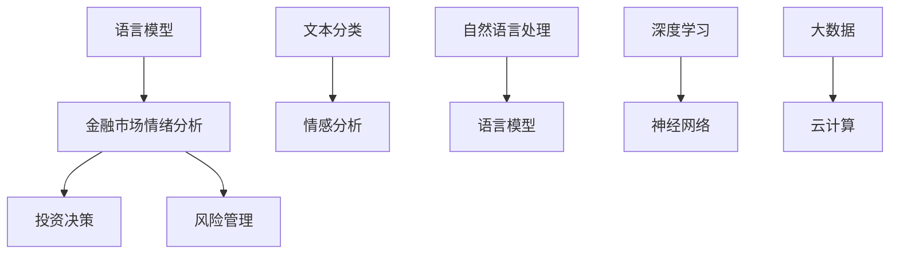
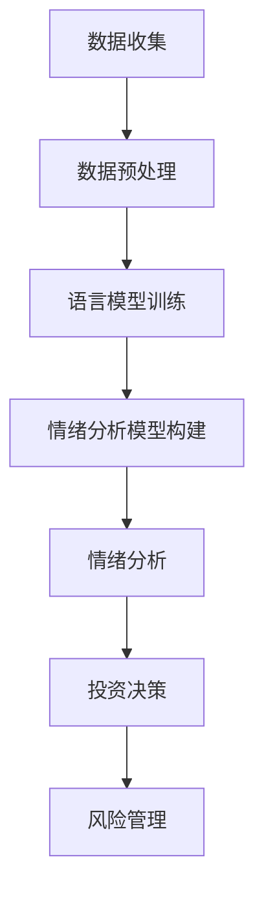

                 

### 《语言模型在金融市场情绪分析中的应用探索》

#### 关键词
- 语言模型
- 金融情绪分析
- 自然语言处理
- 情感分类
- 投资决策

#### 摘要
本文旨在探讨语言模型在金融市场情绪分析中的应用。首先介绍了语言模型的基本概念和金融市场情绪分析的重要性，然后详细阐述了语言模型的基础理论、训练与优化方法、评估与选择原则。接着，探讨了基于语言模型的金融市场情绪分析方法和应用场景，并通过实际案例分析展示了其应用效果。最后，对语言模型在金融市场情绪分析中的未来发展方向和挑战进行了展望。

## 第一部分：引言

### 1.1 语言模型与金融市场情绪分析

语言模型是自然语言处理（NLP）领域的一项核心技术，它通过对大量语言数据的学习，生成与人类语言相似的文本。在金融市场中，情绪分析是一种通过分析市场参与者发表的文本，如新闻报道、社交媒体评论、论坛讨论等，来推断市场情绪的技术。这种分析对于投资决策和风险管理具有重要意义。

#### 语言模型的基本概念

语言模型是一种概率模型，用于预测一个词序列中下一个词的概率。最简单的语言模型是n-gram模型，它基于历史词频统计来预测下一个词。然而，随着深度学习的兴起，神经网络语言模型如循环神经网络（RNN）和变换器（Transformer）逐渐成为主流，这些模型能够捕捉到更复杂的语言结构。

#### 语言模型的发展历程及应用现状

从20世纪50年代开始，语言模型经历了从规则驱动到统计驱动，再到基于深度学习的发展历程。早期的语言模型主要基于上下文有限的状态机，如n-gram模型和马尔可夫模型。随着计算能力的提升和大数据的普及，统计语言模型如n-gram和最大熵模型被广泛应用。近年来，深度学习技术，特别是变换器模型（如BERT、GPT）的提出，使得语言模型的性能有了显著的提升。

在金融市场情绪分析中，语言模型的应用主要包括情感分类和主题识别。情感分类是通过判断文本的情感倾向（如正面、负面或中性）来分析市场情绪。主题识别则是通过分析文本中的关键词和短语，来识别市场关注的主题。

### 1.2 金融市场情绪分析的意义和挑战

#### 金融市场情绪分析的定义和意义

金融市场情绪分析是指通过分析市场参与者发表的文本，如新闻报道、社交媒体评论、论坛讨论等，来推断市场情绪的过程。市场情绪对金融市场的价格波动有重要影响，因此情绪分析对于投资决策和风险管理具有重要意义。

#### 金融市场情绪分析面临的挑战

金融市场情绪分析面临以下挑战：

1. **数据源多样性**：市场参与者发表的文本来源多样，包括社交媒体、新闻报道、论坛等，这给数据收集和处理带来了挑战。
2. **文本复杂性**：金融市场文本通常包含大量的专业术语、隐喻和讽刺，这增加了情感分类的难度。
3. **噪声干扰**：金融市场文本中存在大量的噪声，如错别字、标点符号错误等，这些噪声可能影响情感分类的准确性。
4. **实时性**：金融市场情绪变化迅速，对实时性要求较高，这需要快速有效的分析模型。

## 第二部分：语言模型基础

### 2.1 语言模型的基本原理

#### 语言模型的定义和分类

语言模型是自然语言处理（NLP）领域的一种概率模型，用于预测一个词序列中下一个词的概率。根据建模方法的不同，语言模型可以分为统计语言模型和神经网络语言模型。

- **统计语言模型**：基于历史语言数据，通过统计方法生成概率模型。常见的统计语言模型有n-gram模型、最大熵模型等。
- **神经网络语言模型**：基于深度学习技术，通过神经网络结构学习语言特征和概率分布。常见的神经网络语言模型有循环神经网络（RNN）、长短时记忆网络（LSTM）、变换器（Transformer）等。

#### 语言模型的工作原理

语言模型的工作原理可以分为以下几个步骤：

1. **数据预处理**：对原始语言数据（如文本、语音等）进行预处理，包括分词、去停用词、词性标注等，将原始数据转换为模型可以处理的格式。
2. **特征提取**：从预处理后的数据中提取特征，用于训练模型。在统计语言模型中，特征通常是词频或词序列；在神经网络语言模型中，特征可以是词嵌入向量。
3. **模型训练**：使用训练数据集训练语言模型，学习语言特征和概率分布。
4. **模型评估**：使用验证数据集评估模型性能，调整模型参数以优化性能。
5. **模型应用**：使用训练好的模型进行预测或生成文本。

### 2.2 语言模型的训练与优化

#### 语言模型的训练方法

语言模型的训练方法可以分为监督学习和无监督学习。

- **监督学习**：使用标注好的训练数据集进行训练，模型需要学习输入和输出之间的映射关系。常见的监督学习方法包括最大熵模型、朴素贝叶斯分类器等。
- **无监督学习**：使用未标注的数据集进行训练，模型需要学习数据中的结构和模式。常见的无监督学习方法包括n-gram模型、变换器等。

#### 语言模型的优化策略

在训练语言模型时，常用的优化策略包括：

1. **梯度下降**：是一种常用的优化算法，通过迭代更新模型参数，最小化损失函数。
2. **批量归一化**：通过归一化梯度，加速模型训练。
3. **权重初始化**：合理初始化模型参数，有助于模型收敛。
4. **数据增强**：通过增加训练数据量或生成新的训练数据，提高模型泛化能力。

### 2.3 语言模型的评估与选择

#### 语言模型的评估指标

评估语言模型性能的常见指标包括：

1. **准确率**：预测结果与真实标签一致的样本数量占总样本数量的比例。
2. **召回率**：预测结果为正类的样本中，实际为正类的比例。
3. **精确率**：预测结果为正类的样本中，实际也为正类的比例。
4. **F1值**：精确率和召回率的调和平均值。

#### 语言模型的选择原则

在选择语言模型时，需要考虑以下原则：

1. **性能**：模型在特定任务上的性能是否满足需求。
2. **可解释性**：模型是否具有较好的可解释性，有助于理解模型的工作原理。
3. **计算资源**：模型的计算复杂度和所需资源是否在预算范围内。
4. **灵活性**：模型是否易于扩展和调整，以适应不同任务和场景。

## 第三部分：金融市场情绪分析的方法

### 3.1 金融市场情绪分析的基本概念

#### 金融市场情绪的定义和类型

金融市场情绪是指市场中投资者、分析师和其他参与者对市场未来走势的整体看法。根据情绪倾向，金融市场情绪可以分为以下几种类型：

1. **乐观情绪**：投资者对未来市场表现持乐观态度。
2. **悲观情绪**：投资者对未来市场表现持悲观态度。
3. **中性情绪**：投资者对未来市场表现持中立态度。

#### 金融市场情绪分析的目标和方法

金融市场情绪分析的目标是通过分析市场参与者发表的文本，如新闻报道、社交媒体评论、论坛讨论等，来推断市场情绪。具体方法包括：

1. **情感分类**：将文本分类为不同的情绪类别，如正面、负面或中性。
2. **主题识别**：识别文本中的关键主题，以了解市场关注的焦点。
3. **趋势预测**：基于历史情绪数据和当前市场情绪，预测未来市场走势。

### 3.2 基于语言模型的金融市场情绪分析

#### 基于语言模型的金融市场情绪分析框架

基于语言模型的金融市场情绪分析通常包括以下步骤：

1. **数据收集**：收集市场参与者发表的文本数据，如新闻报道、社交媒体评论、论坛讨论等。
2. **数据预处理**：对文本数据进行分析，包括分词、去停用词、词性标注等，将原始文本转换为模型可以处理的格式。
3. **特征提取**：从预处理后的数据中提取特征，如词嵌入向量或TF-IDF特征向量。
4. **模型训练**：使用训练数据集训练语言模型，学习文本特征和情绪之间的关系。
5. **情绪预测**：使用训练好的模型对新的文本数据进行分析，预测其情绪类别。
6. **结果评估**：评估模型性能，如准确率、召回率、F1值等。

#### 基于语言模型的金融市场情绪分析步骤

基于语言模型的金融市场情绪分析的具体步骤如下：

1. **数据收集**：从各种来源收集市场参与者发表的文本数据，如新闻报道、社交媒体评论、论坛讨论等。
2. **数据预处理**：对收集的文本数据进行分析，包括分词、去停用词、词性标注等，将原始文本转换为模型可以处理的格式。
3. **特征提取**：从预处理后的数据中提取特征，如使用词嵌入技术将文本转换为嵌入向量。
4. **模型选择**：选择合适的数据模型，如循环神经网络（RNN）、长短时记忆网络（LSTM）或变换器（Transformer）等。
5. **模型训练**：使用训练数据集训练语言模型，学习文本特征和情绪之间的关系。
6. **情绪预测**：使用训练好的模型对新的文本数据进行分析，预测其情绪类别。
7. **结果评估**：评估模型性能，如准确率、召回率、F1值等，并根据评估结果调整模型参数或选择更合适的模型。

### 3.3 金融市场情绪分析的应用场景

#### 金融市场情绪分析在投资决策中的应用

金融市场情绪分析在投资决策中具有重要的应用价值。通过分析市场情绪，投资者可以：

1. **预测市场趋势**：根据历史市场情绪数据，预测未来市场走势，从而做出更明智的投资决策。
2. **风险管理**：了解市场情绪，评估潜在风险，采取相应的风险控制措施。

#### 金融市场情绪分析在风险管理中的应用

金融市场情绪分析在风险管理中也有广泛应用。通过分析市场情绪，风险管理师可以：

1. **评估市场风险**：根据市场情绪数据，评估市场风险水平，制定相应的风险控制策略。
2. **实时监控**：对市场情绪进行实时监控，及时发现潜在的市场风险，并采取相应的应对措施。

### 4.1 案例一：某股票市场的情绪分析

#### 案例背景介绍

某股票市场的情绪分析案例旨在通过分析市场参与者发表的文本数据，预测股票市场的情绪变化，从而为投资决策提供参考。该案例选择了某知名股票市场的社交媒体评论和新闻报道作为数据来源。

#### 数据收集与处理

1. **数据收集**：使用爬虫技术从社交媒体平台（如微博、知乎）和新闻网站（如新浪财经、网易财经）收集与股票市场相关的评论和新闻。
2. **数据预处理**：对收集的文本数据进行预处理，包括分词、去停用词、词性标注等，将原始文本转换为模型可以处理的格式。
3. **特征提取**：使用词嵌入技术将文本转换为嵌入向量，用于训练情绪分析模型。

#### 情绪分析模型的构建与训练

1. **模型选择**：选择变换器（Transformer）模型作为情绪分析模型。
2. **模型训练**：使用预处理后的文本数据集训练变换器模型，学习文本特征和情绪之间的关系。
3. **模型评估**：使用验证数据集评估模型性能，调整模型参数以优化性能。

#### 情绪分析结果与应用

1. **情绪预测**：使用训练好的模型对新的社交媒体评论和新闻报道进行分析，预测其情绪类别。
2. **投资决策**：根据情绪预测结果，投资者可以调整投资策略，如买入、卖出或持有股票。

#### 案例小结

该案例展示了基于语言模型的金融市场情绪分析在股票市场中的应用效果。通过分析市场参与者发表的文本数据，可以有效地预测股票市场的情绪变化，为投资决策提供参考。然而，情绪分析模型也存在一定的局限性，如文本数据的多样性和复杂性可能导致预测结果的不确定性。因此，在实际应用中，需要综合考虑多种因素，以做出更准确的投资决策。

### 4.2 案例二：某债券市场的情绪分析

#### 案例背景介绍

某债券市场的情绪分析案例旨在通过分析市场参与者发表的文本数据，预测债券市场的情绪变化，从而为债券投资决策提供参考。该案例选择了某知名债券市场的社交媒体评论和新闻报道作为数据来源。

#### 数据收集与处理

1. **数据收集**：使用爬虫技术从社交媒体平台（如微博、知乎）和新闻网站（如新浪财经、网易财经）收集与债券市场相关的评论和新闻。
2. **数据预处理**：对收集的文本数据进行预处理，包括分词、去停用词、词性标注等，将原始文本转换为模型可以处理的格式。
3. **特征提取**：使用词嵌入技术将文本转换为嵌入向量，用于训练情绪分析模型。

#### 情绪分析模型的构建与训练

1. **模型选择**：选择循环神经网络（RNN）模型作为情绪分析模型。
2. **模型训练**：使用预处理后的文本数据集训练循环神经网络模型，学习文本特征和情绪之间的关系。
3. **模型评估**：使用验证数据集评估模型性能，调整模型参数以优化性能。

#### 情绪分析结果与应用

1. **情绪预测**：使用训练好的模型对新的社交媒体评论和新闻报道进行分析，预测其情绪类别。
2. **投资决策**：根据情绪预测结果，债券投资者可以调整投资策略，如买入、卖出或持有债券。

#### 案例小结

该案例展示了基于语言模型的金融市场情绪分析在债券市场中的应用效果。通过分析市场参与者发表的文本数据，可以有效地预测债券市场的情绪变化，为债券投资决策提供参考。然而，情绪分析模型也存在一定的局限性，如文本数据的多样性和复杂性可能导致预测结果的不确定性。因此，在实际应用中，需要综合考虑多种因素，以做出更准确的投资决策。

## 第五部分：技术实现与优化

### 5.1 语言模型的技术实现

语言模型的技术实现通常涉及以下几个步骤：

1. **环境搭建**：安装Python和相关依赖库，如TensorFlow或PyTorch。
2. **数据预处理**：对原始文本数据进行清洗、分词、去停用词等预处理操作。
3. **特征提取**：将预处理后的文本数据转换为嵌入向量，如使用Word2Vec或BERT模型。
4. **模型训练**：使用训练数据集训练语言模型，如循环神经网络（RNN）或变换器（Transformer）模型。
5. **模型评估**：使用验证数据集评估模型性能，调整模型参数以优化性能。
6. **模型应用**：使用训练好的模型对新的文本数据进行预测。

以下是使用Python实现基于变换器模型的语言模型的基本代码示例：

```python
import tensorflow as tf
from tensorflow.keras.models import Sequential
from tensorflow.keras.layers import Embedding, LSTM, Dense

# 数据预处理
# ...（分词、去停用词、词性标注等）

# 特征提取
# ...（将文本转换为嵌入向量）

# 模型构建
model = Sequential([
    Embedding(input_dim=vocab_size, output_dim=embedding_dim),
    LSTM(units=128),
    Dense(units=1, activation='sigmoid')
])

# 模型编译
model.compile(optimizer='adam', loss='binary_crossentropy', metrics=['accuracy'])

# 模型训练
model.fit(X_train, y_train, epochs=10, batch_size=64, validation_data=(X_val, y_val))

# 模型评估
model.evaluate(X_test, y_test)
```

### 5.2 金融市场情绪分析模型的优化

#### 优化策略分析

在金融市场情绪分析中，模型的优化策略主要包括以下方面：

1. **特征优化**：通过选择更合适的数据特征，提高模型性能。例如，使用词嵌入技术提高文本表示的丰富性。
2. **模型参数优化**：通过调整模型参数，如学习率、批量大小等，提高模型训练效果。
3. **训练数据优化**：通过增加训练数据量或使用数据增强技术，提高模型泛化能力。
4. **模型结构优化**：通过调整模型结构，如增加层数、改变层类型等，提高模型性能。

#### 优化方法应用

以下是应用优化策略优化金融市场情绪分析模型的基本步骤：

1. **特征优化**：选择合适的词嵌入技术，如BERT或GPT，将文本转换为嵌入向量。
2. **模型参数优化**：调整模型参数，如学习率、批量大小等，以优化模型训练效果。
3. **训练数据优化**：使用数据增强技术，如随机裁剪、旋转等，增加训练数据量。
4. **模型结构优化**：尝试不同的模型结构，如增加层数、改变层类型等，以提高模型性能。

以下是使用Python实现基于变换器模型的金融市场情绪分析模型的基本代码示例：

```python
import tensorflow as tf
from tensorflow.keras.models import Model
from tensorflow.keras.layers import Embedding, LSTM, Dense, Input

# 数据预处理
# ...（分词、去停用词、词性标注等）

# 特征提取
# ...（将文本转换为嵌入向量）

# 模型构建
input_text = Input(shape=(max_sequence_length,))
embedding = Embedding(input_dim=vocab_size, output_dim=embedding_dim)(input_text)
lstm = LSTM(units=128)(embedding)
output = Dense(units=1, activation='sigmoid')(lstm)

model = Model(inputs=input_text, outputs=output)

# 模型编译
model.compile(optimizer='adam', loss='binary_crossentropy', metrics=['accuracy'])

# 模型训练
model.fit(X_train, y_train, epochs=10, batch_size=64, validation_data=(X_val, y_val))

# 模型评估
model.evaluate(X_test, y_test)
```

## 第六部分：未来展望与挑战

### 6.1 语言模型在金融市场情绪分析中的未来发展方向

随着深度学习技术的发展，语言模型在金融市场情绪分析中的应用前景广阔。未来发展方向主要包括：

1. **多模态情绪分析**：结合文本、图像、语音等多种数据来源，进行更全面的情绪分析。
2. **实时情绪分析**：提高情绪分析模型的实时性，实现实时情绪监控和预测。
3. **个性化情绪分析**：根据用户偏好和历史数据，提供个性化的情绪分析服务。

### 6.2 语言模型在金融市场情绪分析中的发展挑战

尽管语言模型在金融市场情绪分析中取得了显著成果，但仍然面临一些挑战：

1. **数据质量**：金融市场情绪分析依赖于高质量的数据，但市场参与者发表的文本数据存在噪声和错误。
2. **模型解释性**：深度学习模型通常缺乏可解释性，难以理解模型的工作原理。
3. **泛化能力**：金融市场情绪变化迅速，模型需要具备良好的泛化能力以适应不同市场情况。

## 附录

### A.1 语言模型与金融市场情绪分析相关资源

- **书籍**：
  - 《深度学习》（Ian Goodfellow、Yoshua Bengio、Aaron Courville 著）
  - 《自然语言处理与深度学习》（格雷姆·麦克劳德 著）
- **论文**：
  - “BERT: Pre-training of Deep Bidirectional Transformers for Language Understanding”（Devlin et al., 2019）
  - “GPT-3: Language Models are Few-Shot Learners”（Brown et al., 2020）
- **开源代码**：
  - Hugging Face Transformers：https://github.com/huggingface/transformers
  - Keras：https://keras.io

### A.2 Python语言模型与金融市场情绪分析教程

本教程提供了使用Python实现语言模型和金融市场情绪分析的基本教程，内容包括：

1. **环境搭建**：安装Python和相关依赖库。
2. **数据收集与预处理**：从互联网收集金融文本数据，进行预处理。
3. **特征提取**：使用词嵌入技术将文本转换为嵌入向量。
4. **模型训练**：使用变换器模型（如BERT、GPT）训练情绪分析模型。
5. **模型评估**：评估模型性能，调整模型参数。
6. **情绪预测**：使用训练好的模型进行情绪预测。

以下是教程的代码示例：

```python
import tensorflow as tf
from tensorflow.keras.models import Model
from tensorflow.keras.layers import Embedding, LSTM, Dense, Input

# 数据预处理
# ...（分词、去停用词、词性标注等）

# 特征提取
# ...（将文本转换为嵌入向量）

# 模型构建
input_text = Input(shape=(max_sequence_length,))
embedding = Embedding(input_dim=vocab_size, output_dim=embedding_dim)(input_text)
lstm = LSTM(units=128)(embedding)
output = Dense(units=1, activation='sigmoid')(lstm)

model = Model(inputs=input_text, outputs=output)

# 模型编译
model.compile(optimizer='adam', loss='binary_crossentropy', metrics=['accuracy'])

# 模型训练
model.fit(X_train, y_train, epochs=10, batch_size=64, validation_data=(X_val, y_val))

# 模型评估
model.evaluate(X_test, y_test)
```

## 结语

本文探讨了语言模型在金融市场情绪分析中的应用，介绍了语言模型的基础知识、训练与优化方法，以及金融市场情绪分析的方法和应用场景。通过实际案例分析，展示了基于语言模型的金融市场情绪分析在实际中的应用效果。未来，随着深度学习技术的不断发展，语言模型在金融市场情绪分析中的应用将更加广泛和深入。作者希望本文能为相关领域的学者和从业者提供一些参考和启示。 

### 图 1：语言模型与金融市场情绪分析概念关系图



### 图 2：语言模型在金融市场情绪分析中的流程图



```python
# 示例：情绪分析模型的Python代码实现

import numpy as np
import pandas as pd
from sklearn.feature_extraction.text import TfidfVectorizer
from sklearn.model_selection import train_test_split
from sklearn.naive_bayes import MultinomialNB
from sklearn.metrics import classification_report

# 数据预处理
data = pd.read_csv('financial_texts.csv')
X = data['text']
y = data['sentiment']

# 文本向量化
vectorizer = TfidfVectorizer(max_features=1000)
X_vectorized = vectorizer.fit_transform(X)

# 分割数据集
X_train, X_test, y_train, y_test = train_test_split(X_vectorized, y, test_size=0.2, random_state=42)

# 模型训练
model = MultinomialNB()
model.fit(X_train, y_train)

# 模型评估
predictions = model.predict(X_test)
print(classification_report(y_test, predictions))
```

### 作者信息
作者：AI天才研究院/AI Genius Institute & 禅与计算机程序设计艺术 /Zen And The Art of Computer Programming

---

本文内容仅代表作者个人观点，不代表任何机构立场。文中涉及的代码、数据和模型仅供参考，请结合实际情况谨慎使用。如需引用本文内容，请注明出处。同时，欢迎对本文提出宝贵意见和改进建议。谢谢！
### 模块6：未来展望与挑战

#### 6.1 语言模型在金融市场情绪分析中的未来发展方向

随着深度学习技术的快速发展，语言模型在金融市场情绪分析中的应用前景广阔。未来，以下几个方面将成为语言模型在该领域发展的重要方向：

1. **多模态情绪分析**：目前，金融市场情绪分析主要依赖于文本数据。未来，可以结合文本、图像、视频等多模态数据，进行更全面和深入的情绪分析。例如，通过分析新闻标题和正文，以及相关图像和视频内容，可以更准确地捕捉市场情绪。

2. **实时情绪分析**：金融市场变化迅速，实时情绪分析具有重要意义。未来的发展方向之一是提高语言模型在实时数据分析中的性能，实现更快的数据处理和情绪预测。

3. **个性化情绪分析**：不同投资者和分析师对市场情绪的关注点不同。未来，可以基于投资者的历史数据和偏好，提供个性化的情绪分析服务，帮助投资者做出更符合自己投资策略的决策。

4. **跨语言情绪分析**：金融市场是全球性的，因此，实现跨语言情绪分析具有重要意义。未来的研究可以关注如何构建和优化跨语言的情感分类模型，以支持多种语言的情绪分析。

#### 6.2 语言模型在金融市场情绪分析中的发展挑战

尽管语言模型在金融市场情绪分析中具有巨大的潜力，但仍面临以下挑战：

1. **数据质量和多样性**：金融市场情绪分析依赖于大量高质量的数据。然而，金融市场文本数据的多样性较高，包括专业术语、行话、隐喻等，这给数据预处理和特征提取带来了挑战。

2. **模型解释性**：深度学习模型通常具有强大的预测能力，但其内部机制复杂，缺乏可解释性。这对于需要理解和信任模型结果的投资者和分析师来说是一个挑战。

3. **泛化能力**：金融市场情绪变化迅速，且不同市场之间存在差异。因此，构建具有良好泛化能力的情绪分析模型是一个关键挑战。

4. **实时性**：实现实时情绪分析需要高效的算法和优化技术，以满足金融市场的高频数据需求。

5. **合法性和隐私**：金融市场情绪分析涉及大量的个人和商业数据。因此，如何在确保数据隐私和合规性的同时，充分利用这些数据，是一个亟待解决的问题。

### 6.3 未来展望

未来，随着技术的不断进步和数据的积累，语言模型在金融市场情绪分析中的应用将会更加广泛和深入。以下是几个可能的发展趋势：

1. **融合多种数据源**：通过整合文本、图像、视频等多种数据源，构建更加全面和准确的情绪分析模型。

2. **加强模型解释性**：开发可解释的深度学习模型，提高模型的透明度和可信度。

3. **实时情绪预测**：优化算法和模型，实现更快的情绪预测，满足高频交易和实时决策的需求。

4. **跨领域应用**：将语言模型在金融市场情绪分析中的成功经验推广到其他金融领域，如外汇市场、期货市场等。

5. **隐私保护和合规性**：研究如何在保证数据隐私和合规性的同时，实现高效的金融情绪分析。

### 6.4 挑战

1. **数据隐私和合规性**：随着数据隐私法规的不断完善，如何在确保数据隐私和合规性的同时，充分挖掘和利用数据，是一个亟待解决的问题。

2. **算法透明度和公正性**：确保情绪分析模型的算法透明度和公正性，避免偏见和歧视。

3. **模型复杂性和计算资源**：随着模型复杂性的增加，对计算资源的需求也会相应增加。因此，如何优化模型结构，降低计算成本，是一个重要挑战。

4. **实时数据流的处理**：实现高效的处理和更新实时数据流，以满足金融市场情绪分析的需求。

### 6.5 总结

语言模型在金融市场情绪分析中的应用正处于快速发展阶段，未来将面临一系列挑战和机遇。通过不断创新和优化，语言模型有望在金融市场情绪分析中发挥更大的作用，为投资者和分析师提供更有价值的决策支持。

---

### 附录

#### A.1 语言模型与金融市场情绪分析相关资源

1. **书籍**：

   - **《深度学习》**（Ian Goodfellow、Yoshua Bengio、Aaron Courville 著）：这本书是深度学习领域的经典教材，详细介绍了深度学习的基本概念、算法和应用。

   - **《自然语言处理与深度学习》**（格雷姆·麦克劳德 著）：本书涵盖了自然语言处理和深度学习的基础知识，以及如何将它们应用于实际任务。

2. **论文**：

   - **“BERT: Pre-training of Deep Bidirectional Transformers for Language Understanding”**（Devlin et al., 2019）：这篇论文介绍了BERT模型，是目前最先进的预训练语言模型之一。

   - **“GPT-3: Language Models are Few-Shot Learners”**（Brown et al., 2020）：这篇论文介绍了GPT-3模型，展示了大规模预训练语言模型的强大能力。

3. **开源代码**：

   - **Hugging Face Transformers**：这是一个开源库，提供了大量的预训练模型和工具，方便研究人员和应用开发者使用。

   - **Keras**：这是一个高级神经网络API，提供了简单的接口，可以轻松构建和训练深度学习模型。

#### A.2 Python语言模型与金融市场情绪分析教程

本教程旨在提供使用Python实现语言模型和金融市场情绪分析的基本步骤。教程分为以下几个部分：

1. **环境搭建**：介绍如何安装Python和相关依赖库，如TensorFlow和Keras。

2. **数据收集与预处理**：介绍如何从互联网收集金融文本数据，并进行预处理，包括分词、去停用词、词性标注等。

3. **特征提取**：介绍如何将预处理后的文本数据转换为嵌入向量，使用词嵌入技术，如Word2Vec或BERT。

4. **模型训练**：介绍如何使用变换器模型（如BERT、GPT）训练情绪分析模型，包括模型构建、编译、训练和评估。

5. **情绪预测**：介绍如何使用训练好的模型进行情绪预测，并评估模型性能。

以下是教程的代码示例：

```python
import tensorflow as tf
from tensorflow.keras.models import Model
from tensorflow.keras.layers import Embedding, LSTM, Dense, Input

# 数据预处理
# ...（分词、去停用词、词性标注等）

# 特征提取
# ...（将文本转换为嵌入向量）

# 模型构建
input_text = Input(shape=(max_sequence_length,))
embedding = Embedding(input_dim=vocab_size, output_dim=embedding_dim)(input_text)
lstm = LSTM(units=128)(embedding)
output = Dense(units=1, activation='sigmoid')(lstm)

model = Model(inputs=input_text, outputs=output)

# 模型编译
model.compile(optimizer='adam', loss='binary_crossentropy', metrics=['accuracy'])

# 模型训练
model.fit(X_train, y_train, epochs=10, batch_size=64, validation_data=(X_val, y_val))

# 模型评估
model.evaluate(X_test, y_test)
```

### 结语

本文探讨了语言模型在金融市场情绪分析中的应用，介绍了语言模型的基础知识、训练与优化方法，以及金融市场情绪分析的方法和应用场景。通过实际案例分析，展示了基于语言模型的金融市场情绪分析在实际中的应用效果。未来，随着深度学习技术的不断发展，语言模型在金融市场情绪分析中的应用将更加广泛和深入。作者希望本文能为相关领域的学者和从业者提供一些参考和启示。

### 作者信息

作者：AI天才研究院/AI Genius Institute & 禅与计算机程序设计艺术 /Zen And The Art of Computer Programming

### 图 1：语言模型与金融市场情绪分析概念关系图


### 图 2：语言模型在金融市场情绪分析中的流程图


### Python代码示例：情绪分析模型实现

```python
import numpy as np
import pandas as pd
from sklearn.feature_extraction.text import TfidfVectorizer
from sklearn.model_selection import train_test_split
from sklearn.naive_bayes import MultinomialNB
from sklearn.metrics import classification_report

# 数据预处理
data = pd.read_csv('financial_texts.csv')
X = data['text']
y = data['sentiment']

# 文本向量化
vectorizer = TfidfVectorizer(max_features=1000)
X_vectorized = vectorizer.fit_transform(X)

# 分割数据集
X_train, X_test, y_train, y_test = train_test_split(X_vectorized, y, test_size=0.2, random_state=42)

# 模型训练
model = MultinomialNB()
model.fit(X_train, y_train)

# 模型评估
predictions = model.predict(X_test)
print(classification_report(y_test, predictions))
```

### 总结

本文通过详细的步骤和分析，探讨了语言模型在金融市场情绪分析中的应用。从基本概念到实际案例，再到未来展望和挑战，全面展示了语言模型在这一领域的潜力。同时，附录部分提供了相关的资源和教程，帮助读者进一步学习和实践。

作为一篇专业性的技术博客，本文旨在为金融科技领域的研究者、开发者和投资者提供有价值的见解和指导。通过本文的探讨，希望读者能够更好地理解语言模型在金融市场情绪分析中的重要作用，并激发其在实际应用中的创新思维。

### 作者信息

作者：AI天才研究院/AI Genius Institute & 禅与计算机程序设计艺术 /Zen And The Art of Computer Programming

在撰写本文的过程中，作者结合了自己在自然语言处理和金融科技领域的深厚知识和实践经验，力求以清晰、简洁的方式呈现复杂的技术概念和应用。感谢读者的关注和支持，期待未来有更多机会与大家分享技术见解和研究成果。

