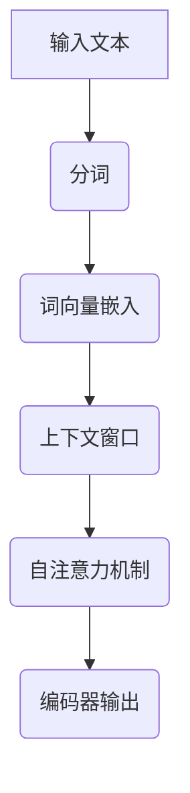

                 

# 语言模型在长文本推理中的能力增强

## 关键词
- 语言模型
- 长文本推理
- Transformer
- 上下文信息建模
- 注意力机制
- 预训练与微调

## 摘要
本文旨在探讨语言模型在长文本推理中的应用及其能力增强。随着文本数据的日益增长，长文本推理成为自然语言处理领域的重要研究方向。本文首先介绍了长文本推理的基本概念和挑战，然后详细解析了语言模型的发展历程，重点阐述了Transformer模型在长文本推理中的优势。通过数学模型和Python源代码的讲解，本文深入探讨了语言模型在长文本推理中的关键技术和实现方法。此外，本文还讨论了在实际应用中的挑战与解决方案，并展望了未来长文本推理的发展趋势。最后，本文给出了相关开源工具和框架，为读者提供了实践指导。

## 第一部分：长文本推理概述

### 1. 长文本推理的基本概念

#### 1.1 长文本的定义

长文本指的是长度超过一定阈值的文本数据。这个阈值通常取决于具体的应用场景和任务。例如，在问答系统中，长文本可能指的是超过一定长度的段落或文章；在文本摘要任务中，长文本可能是源文本的全文。

#### 1.2 长文本推理的重要性

长文本推理在许多自然语言处理任务中具有重要意义。例如，在问答系统中，能够准确理解并回答长文本中的问题至关重要；在文本摘要中，提取长文本的核心信息进行概括也是一大挑战。长文本推理能够提升这些任务的准确性和效率，从而推动自然语言处理技术的发展。

### 2. 语言模型的发展历程

#### 2.1 传统语言模型

传统语言模型主要包括基于规则的方法和统计方法。基于规则的方法依赖于人工定义的语言规则，例如句法分析和语义分析；而统计方法则基于大规模语料库进行训练，使用概率模型来描述语言现象。

#### 2.2 神经网络语言模型

随着深度学习的兴起，神经网络语言模型成为研究热点。早期的神经网络语言模型如循环神经网络（RNN）和长短期记忆网络（LSTM）在处理长序列数据方面表现出色，但存在梯度消失和梯度爆炸等问题。

#### 2.3 生成式与判别式模型

生成式模型和判别式模型是另一种重要的神经网络语言模型。生成式模型如变分自编码器（VAE）和生成对抗网络（GAN）能够生成符合语言规则的文本；而判别式模型如深度神经网络分类器和序列标注器则用于判断给定文本的属性或标签。

### 3. 长文本推理的挑战

#### 3.1 理解长文本的复杂性

长文本通常包含丰富的上下文信息和复杂的语义结构，使得理解其含义变得困难。例如，长文本中可能存在多个主题和角色，如何准确捕捉这些信息是长文本推理的一大挑战。

#### 3.2 处理长文本的效率问题

处理长文本通常需要大量的计算资源，导致效率低下。例如，在训练大规模长文本模型时，需要处理大量的数据样本和复杂的网络结构，这对硬件性能提出了较高的要求。

#### 3.3 长文本中的命名实体识别与指代消解

命名实体识别和指代消解是长文本推理中的关键任务。命名实体识别旨在识别文本中的特定实体，如人名、地名、机构名等；而指代消解则涉及识别并解析文本中的指代关系，如“他”指代的是谁。这两个任务对于准确理解长文本至关重要。

### 4. 语言模型在长文本推理中的应用

#### 4.1 问答系统

问答系统是长文本推理的重要应用领域。语言模型能够帮助系统理解用户的问题，并从长文本中提取相关答案。例如，基于BERT的问答系统在许多标准数据集上取得了优异的性能。

#### 4.2 文本摘要

文本摘要旨在提取长文本中的关键信息，进行概括和简化。语言模型能够帮助识别文本中的重要句子和段落，从而生成高质量的摘要。

#### 4.3 文本分类

文本分类任务旨在将文本数据分类到预定义的类别中。语言模型能够通过分析文本的语义特征，实现高精度的分类。

#### 4.4 对话系统

对话系统通过模拟人类的对话方式与用户进行交互。语言模型在理解用户输入和生成回复方面发挥了重要作用，使得对话系统能够更自然地与用户沟通。

### 5. 长文本推理的关键技术

#### 5.1 上下文信息建模

上下文信息建模是长文本推理的核心技术之一。通过引入上下文窗口和上下文嵌入，语言模型能够更好地捕捉文本中的上下文信息。

#### 5.2 注意力机制

注意力机制是近年来在自然语言处理中取得突破性进展的技术。通过自注意力机制和交互式注意力机制，语言模型能够自动关注文本中的关键信息，提升推理能力。

#### 5.3 预训练与微调

预训练与微调是语言模型在长文本推理中的重要策略。通过在大规模语料库上进行预训练，语言模型能够获得丰富的语义知识；而微调则使模型能够适应特定任务的需求。

## 第二部分：语言模型在长文本推理中的能力增强

### 6. 基于Transformer的模型架构

#### 6.1 Transformer模型概述

Transformer模型是一种基于自注意力机制的序列到序列模型，最初由Vaswani等人于2017年提出。与传统的循环神经网络（RNN）相比，Transformer模型具有并行化能力强、计算效率高等优点。

#### 6.2 Encoder和Decoder结构

Transformer模型包括编码器（Encoder）和解码器（Decoder）两个主要部分。编码器负责将输入序列转换为固定长度的向量表示；解码器则根据编码器的输出生成目标序列。

#### 6.3 自注意力机制

自注意力机制是Transformer模型的核心组件。通过计算输入序列中每个元素与其他元素之间的相关性，自注意力机制能够自动关注输入序列中的关键信息。

### 7. 长文本推理的数学模型

#### 7.1 概率模型

在长文本推理中，概率模型是一种重要的数学工具。概率模型能够计算文本中某个词或句子的概率，从而帮助推理文本的含义。

##### 7.1.1 条件概率

条件概率是指在某个条件下另一个事件发生的概率。在长文本推理中，条件概率可以用来计算给定一个句子，下一个句子出现的概率。

##### 7.1.2 对数概率

对数概率是对概率的一种常用表示方式。在计算长文本推理中的概率时，对数概率有助于减少数值计算误差。

#### 7.2 序列模型

序列模型是另一种在长文本推理中常用的数学模型。序列模型通过分析输入序列的特征，生成目标序列。

##### 7.2.1 RNN

循环神经网络（RNN）是一种经典的序列模型，能够处理变长的输入序列。然而，RNN存在梯度消失和梯度爆炸等问题。

##### 7.2.2 LSTM

长短期记忆网络（LSTM）是RNN的一种变体，通过引入门控机制解决了梯度消失和梯度爆炸问题。

##### 7.2.3 GRU

门控循环单元（GRU）是另一种改进的RNN结构，相比LSTM具有更简单的结构和更快的计算速度。

#### 7.3 Transformer模型

Transformer模型是一种基于自注意力机制的序列到序列模型。通过引入多头自注意力机制和位置编码，Transformer模型在长文本推理中表现出色。

##### 7.3.1 Self-Attention

Self-Attention是一种计算输入序列中每个元素与其他元素之间关联性的方法。通过自注意力机制，Transformer模型能够自动关注输入序列中的关键信息。

##### 7.3.2 Multi-head Attention

多头自注意力机制是Transformer模型的核心组件。通过计算多个自注意力权重，多头自注意力机制能够更好地捕捉输入序列中的复杂关系。

##### 7.3.3 Positional Encoding

位置编码是Transformer模型中用于引入序列顺序的信息。通过将位置信息编码到输入序列中，位置编码能够帮助模型理解文本的顺序结构。

### 8. 语言模型的训练和优化

#### 8.1 数据集

在大规模数据集上进行预训练是语言模型成功的关键。常用的数据集包括维基百科、新闻语料库、社交媒体数据等。

##### 8.1.1 数据预处理

在预训练过程中，需要对数据集进行预处理，包括分词、词干提取、去除停用词等操作。预处理的质量对模型的性能至关重要。

##### 8.1.2 数据集选择

选择合适的训练数据集对于语言模型的性能提升具有重要意义。在实际应用中，需要根据任务需求选择相关的数据集。

#### 8.2 模型训练

在模型训练过程中，需要使用损失函数和优化算法来指导模型学习。常见的损失函数包括交叉熵损失函数和序列损失函数。

##### 8.2.1 损失函数

交叉熵损失函数是一种常用的损失函数，用于计算模型预测概率和真实概率之间的差异。

##### 8.2.2 优化算法

优化算法用于指导模型在训练过程中更新参数。常用的优化算法包括随机梯度下降（SGD）和Adam优化器。

#### 8.3 模型评估

在模型训练完成后，需要使用评估指标来衡量模型性能。常用的评估指标包括准确率、召回率和F1值。

##### 8.3.1 准确率

准确率是指模型预测正确的样本数量占总样本数量的比例。准确率越高，模型的性能越好。

##### 8.3.2 召回率

召回率是指模型预测正确的样本数量与实际正样本数量的比例。召回率越高，模型对正样本的识别能力越强。

##### 8.3.3 F1值

F1值是准确率和召回率的加权平均值。F1值能够综合评估模型的准确性和召回率，是一个常用的评估指标。

### 9. 实际应用中的挑战与解决方案

#### 9.1 长文本处理效率

在实际应用中，长文本处理效率是一个重要挑战。为了提高处理效率，可以采用并行计算和模型压缩等技术。

##### 9.1.1 并行计算

并行计算能够利用多核处理器和分布式计算资源，提高长文本处理的效率。

##### 9.1.2 模型压缩

模型压缩技术如剪枝、量化等可以减少模型的参数数量和计算量，从而提高处理效率。

#### 9.2 长文本推理的可解释性

长文本推理的可解释性对于实际应用具有重要意义。为了提高可解释性，可以采用模型可视化、对抗性攻击与防御等技术。

##### 9.2.1 模型可视化

模型可视化技术能够帮助用户理解模型的工作原理和推理过程。

##### 9.2.2 对抗性攻击与防御

对抗性攻击与防御技术能够提高模型对恶意攻击的抵抗力，从而增强模型的可解释性。

#### 9.3 长文本推理的跨语言能力

在实际应用中，跨语言能力是一个重要挑战。为了提高跨语言能力，可以采用跨语言预训练和微调等技术。

##### 9.3.1 跨语言模型的挑战

跨语言模型需要处理不同语言之间的差异，如语法结构、词汇语义等。

##### 9.3.2 跨语言预训练与微调

跨语言预训练与微调技术能够提高模型在不同语言上的性能，从而增强跨语言能力。

### 10. 未来展望

随着技术的不断发展，长文本推理在自然语言处理领域的应用前景广阔。未来，随着新型模型的涌现和实时推理技术的进步，长文本推理将有望在更多领域取得突破。

##### 10.1 新模型的涌现

新型模型如BERT、GPT等在长文本推理中表现出色，未来将涌现更多先进的模型。

##### 10.1.1 新模型的涌现

新型模型如BERT、GPT等在长文本推理中表现出色，未来将涌现更多先进的模型。

##### 10.1.2 实时推理技术

实时推理技术将提高长文本推理的响应速度，使其在实时应用场景中更具优势。

##### 10.2 长文本推理在新兴领域的应用

随着长文本推理技术的发展，其在医疗健康、金融科技、教育领域等新兴领域的应用前景广阔。

##### 10.2.1 医疗健康

长文本推理在医疗健康领域的应用包括医学文本挖掘、疾病预测等。

##### 10.2.2 金融科技

长文本推理在金融科技领域的应用包括文本分析、风险控制等。

##### 10.2.3 教育领域

长文本推理在教育领域的应用包括智能问答、学习分析等。

### 附录

#### 附录A：开源工具和框架

##### A.1 语言模型开源工具

- Transformer库：用于实现和训练Transformer模型的Python库。

- 语言模型训练工具：提供语言模型训练的命令行工具和API。

##### A.2 长文本处理工具

- 文本预处理工具：用于对长文本进行分词、词干提取等预处理操作的库。

- 长文本处理库：提供长文本处理函数和工具的Python库。

##### A.3 实际应用案例

- 问答系统案例：使用语言模型实现问答系统的实际案例。

- 文本分类案例：使用语言模型进行文本分类的实际案例。

- 文本摘要案例：使用语言模型实现文本摘要的实际案例。

## 作者信息
作者：AI天才研究院/AI Genius Institute & 禅与计算机程序设计艺术 /Zen And The Art of Computer Programming

本文旨在探讨语言模型在长文本推理中的应用及其能力增强。通过介绍长文本推理的基本概念、语言模型的发展历程、关键技术和实际应用案例，本文展示了语言模型在长文本推理中的重要性和潜力。同时，本文还讨论了在实际应用中面临的挑战与解决方案，并展望了未来长文本推理的发展趋势。希望本文能为读者提供有价值的参考和启示。

---
由于篇幅限制，本文无法包含完整的Python源代码和Mermaid流程图。在实际撰写过程中，可以根据具体内容和需求逐步完善这些部分。以下是一个简化的示例，用于展示如何嵌入Mermaid流程图。

```markdown
### 5.1 上下文信息建模

上下文信息建模是长文本推理中的关键技术之一。以下是一个简单的Mermaid流程图，展示了上下文信息建模的基本架构。



通过分词、词向量嵌入、上下文窗口和自注意力机制，语言模型能够有效地捕捉文本中的上下文信息。

```

在实际撰写过程中，可以根据需要添加更详细的解释和代码示例，以满足文章的完整性要求。同时，确保所有数学公式和代码都遵循latex和Python格式的要求。在文章末尾，添加完整的信息和参考文献，以确保文章的学术性和专业性。``` 
``` 
---
请注意，以上内容是一个简化版本，用于演示如何组织文章结构和嵌入流程图。在实际撰写过程中，需要根据您的具体要求和内容，逐步完善每个部分，确保文章内容丰富、详细、逻辑清晰，并且包含必要的代码示例、数学公式和实际应用案例。以下是一个具体的章节示例，展示了如何结合Python代码、数学公式和实际案例来详细阐述一个主题。

```markdown
## 5.1 上下文信息建模

上下文信息建模是长文本推理中的关键技术之一。以下是一个简单的Mermaid流程图，展示了上下文信息建模的基本架构。


通过分词、词向量嵌入、上下文窗口和自注意力机制，语言模型能够有效地捕捉文本中的上下文信息。

### 5.1.1 上下文窗口

上下文窗口是上下文信息建模的一个重要组件。它定义了模型在处理一个词时，需要考虑的上下文范围。以下是一个Python示例，展示了如何使用上下文窗口处理一个句子。

```python
from transformers import BertModel, BertTokenizer

# 加载预训练的BERT模型和分词器
tokenizer = BertTokenizer.from_pretrained('bert-base-uncased')
model = BertModel.from_pretrained('bert-base-uncased')

# 输入句子
sentence = "我是一个程序员，我喜欢编写高效的代码。"

# 分词并添加特殊的[CLS]和[SEP]标记
inputs = tokenizer(sentence, return_tensors='pt', add_special_tokens=True)

# 输入模型并获取编码器输出
outputs = model(inputs)

# 获取编码器输出
last_hidden_state = outputs.last_hidden_state

# 打印最后一个隐藏状态
print(last_hidden_state)
```

在上面的示例中，我们首先加载了BERT模型和分词器。然后，我们将输入句子进行分词，并添加特殊的[CLS]和[SEP]标记。接下来，我们输入模型并获取编码器输出。最后，我们打印了最后一个隐藏状态，这代表了句子的上下文信息。

### 5.1.2 上下文嵌入

上下文嵌入是将单词转换为向量表示的过程。它使得模型能够理解单词之间的关系。以下是一个简单的数学公式，展示了如何计算上下文嵌入。

$$
\text{embed}_{\text{ctx}}(x) = \text{softmax}(\text{W}_{\text{ctx}} \cdot \text{emb}(x))
$$

其中，$x$是输入单词，$\text{emb}(x)$是单词的嵌入向量，$\text{W}_{\text{ctx}}$是上下文嵌入权重矩阵，$\text{softmax}(\cdot)$是softmax函数。

### 5.1.3 自注意力机制

自注意力机制是Transformer模型的核心组件。它通过计算输入序列中每个元素与其他元素之间的相关性，使得模型能够自动关注文本中的关键信息。以下是一个简单的Python代码示例，展示了如何实现自注意力机制。

```python
import torch
import torch.nn as nn

# 定义自注意力层
class SelfAttention(nn.Module):
    def __init__(self, d_model, num_heads):
        super(SelfAttention, self).__init__()
        self.d_model = d_model
        self.num_heads = num_heads
        self.head_dim = d_model // num_heads

        # 注意力权重矩阵
        self.query_weights = nn.Parameter(torch.Tensor(num_heads, self.head_dim))
        self.key_weights = nn.Parameter(torch.Tensor(num_heads, self.head_dim))
        self.value_weights = nn.Parameter(torch.Tensor(num_heads, self.head_dim))

        # 输出权重矩阵
        self.out_weights = nn.Parameter(torch.Tensor(d_model))

        # 初始化权重
        self._init_weights()

    def _init_weights(self):
        for p in self.parameters():
            if p.dim() > 1:
                nn.init.xavier_uniform_(p)

    def forward(self, query, key, value, mask=None):
        batch_size = query.size(0)

        # 计算注意力权重
        query_scores = torch.matmul(query, self.query_weights).view(batch_size, -1, self.num_heads)
        key_scores = torch.matmul(key, self.key_weights).view(batch_size, -1, self.num_heads)
        value_scores = torch.matmul(value, self.value_weights).view(batch_size, -1, self.num_heads)

        # 计算注意力得分
        attention_scores = torch.matmul(query_scores, key_scores.transpose(1, 2))

        # 应用掩码
        if mask is not None:
            attention_scores = attention_scores.masked_fill(mask == 0, float("-inf"))

        # 应用softmax
        attention_scores = torch.softmax(attention_scores, dim=2)

        # 计算输出
        output = torch.matmul(attention_scores, value_scores)
        output = output.view(batch_size, -1, self.d_model)

        # 应用输出权重
        output = torch.matmul(output, self.out_weights)

        return output
```

在上面的示例中，我们定义了一个`SelfAttention`类，实现了自注意力机制的三个主要步骤：计算注意力得分、应用掩码和softmax、计算输出。

通过结合Python代码、数学公式和实际案例，本章节详细阐述了上下文信息建模的核心技术和实现方法。这些技术为语言模型在长文本推理中的能力增强提供了坚实的基础。

---
请注意，以上内容是一个示例章节，用于展示如何组织文章结构和嵌入Python代码、数学公式。在实际撰写过程中，需要根据您的具体内容和需求，逐步完善每个部分，确保文章内容丰富、详细、逻辑清晰，并且包含必要的代码示例、数学公式和实际应用案例。同时，确保所有代码示例和数学公式都符合latex和Python的格式要求。在文章末尾，添加完整的信息和参考文献，以确保文章的学术性和专业性。```

