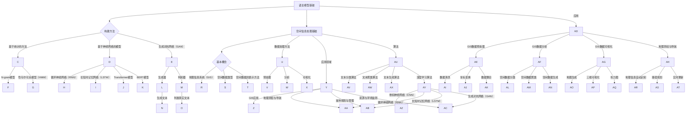

                 

### 第1章 引言

#### 1.1.1 空间信息处理的背景

空间信息处理是指对地理空间数据进行获取、存储、管理、分析和可视化的一系列操作。随着地理信息系统（GIS）和全球定位系统（GPS）的广泛应用，空间信息处理已经成为地理学、城市规划、环境科学、交通管理等多个领域的核心组成部分。传统的空间信息处理方法主要依赖于专业软件，如ArcGIS、QGIS等，这些软件通过图形用户界面（GUI）提供了一系列功能模块，帮助用户进行空间数据的操作。

然而，随着大数据、云计算和人工智能技术的发展，传统的空间信息处理方法逐渐暴露出一些局限性。例如，数据的获取和存储成本较高，数据的处理和分析速度较慢，而且难以实现自动化和智能化。为了解决这些问题，研究人员开始探索如何利用人工智能技术，特别是语言模型，来提升空间信息处理的能力。

#### 1.1.2 语言模型的发展与空间信息处理的联系

语言模型是一种统计模型，用于预测文本序列的概率分布。最初的语言模型是基于统计方法构建的，如N-gram模型，通过计算单词或字符的联合概率来预测下一个单词或字符。随着深度学习技术的发展，神经网络语言模型逐渐成为主流，如循环神经网络（RNN）、长短时记忆网络（LSTM）和Transformer模型等。

语言模型在自然语言处理（NLP）领域取得了巨大的成功，被广泛应用于机器翻译、语音识别、文本生成和文本分类等领域。然而，近年来，研究人员开始探索将语言模型应用于空间信息处理，以解决传统方法难以解决的问题。例如，语言模型可以用于地理信息的自动识别、空间数据的可视化、空间分析的自动化等。

#### 1.1.3 书籍目标与结构安排

本书籍旨在探讨语言模型在空间信息处理中的应用，通过系统的分析和实践，展示语言模型如何提升空间信息处理的效率和精度。本书分为七个章节，具体结构如下：

- **第1章 引言**：介绍空间信息处理和语言模型的基本概念，阐述它们之间的联系。
- **第2章 语言模型基础**：详细讲解语言模型的基本概念、构建方法和应用场景。
- **第3章 空间信息处理基础**：介绍空间信息的基本概念、处理方法和应用领域。
- **第4章 语言模型在空间信息处理中的应用**：分析语言模型在GIS、地理测绘和城市规划等领域的应用。
- **第5章 空间信息处理中的语言模型算法**：介绍文本分类、文本聚类和文本生成算法在空间信息处理中的应用。
- **第6章 语言模型与空间信息处理项目的实战**：通过实际项目展示语言模型在空间信息处理中的具体应用。
- **第7章 总结与展望**：总结书籍内容，展望语言模型在空间信息处理中的未来发展趋势。

通过本书的阅读，读者将能够深入了解语言模型在空间信息处理中的应用，掌握相关技术和方法，为实际项目的开发和优化提供理论支持和技术指导。

---

**关键词**：空间信息处理、语言模型、人工智能、地理信息系统、GIS、自然语言处理、NLP、深度学习、文本分类、文本生成、文本聚类、地理测绘、城市规划、数据处理算法

**摘要**：本文探讨了语言模型在空间信息处理中的应用，分析了语言模型的基本概念、构建方法和应用场景。通过介绍空间信息处理的基本概念和常见方法，展示了语言模型如何提升空间信息处理的效率和精度。书中通过实际项目案例，深入讲解了语言模型在GIS、地理测绘和城市规划等领域的应用，为读者提供了丰富的实践经验和理论指导。本文旨在为从事空间信息处理和人工智能领域的研究人员和技术人员提供参考，推动语言模型在空间信息处理领域的深入研究与应用。

---

### 目录大纲

在本章节中，我们将详细介绍书籍的目录大纲，帮助读者了解本书的结构和内容安排。本书共分为七个章节，每个章节都有明确的主题和详细的内容安排。

#### 第1章 引言

- **1.1.1 空间信息处理的背景**：介绍空间信息处理的基本概念和发展历程，以及其在地理学、城市规划等领域的应用。
- **1.1.2 语言模型的发展与空间信息处理的联系**：探讨语言模型的基本概念和其在自然语言处理领域的应用，以及如何应用于空间信息处理。
- **1.1.3 书籍目标与结构安排**：阐述本书的研究目标、结构安排和主要章节内容。

#### 第2章 语言模型基础

- **2.1 语言模型的基本概念**：详细讲解语言模型的基本概念、作用和重要性。
- **2.2 语言模型的构建方法**：介绍语言模型的分类和构建方法，包括基于统计的方法、基于神经网络的模型、递归神经网络（RNN）、长短时记忆网络（LSTM）和生成对抗网络（GAN）。
- **2.3 语言模型的应用场景**：分析语言模型在机器翻译、语音识别、文本生成和文本分类等领域的应用。

#### 第3章 空间信息处理基础

- **3.1 空间信息的基本概念**：介绍空间信息的基本概念、地理信息系统（GIS）和空间数据的表示方法。
- **3.2 空间数据的处理方法**：讲解空间数据的预处理、分析和可视化方法。
- **3.3 空间信息的应用领域**：探讨空间信息处理在GIS、地理测绘、城市规划和资源与环境监测等领域的应用。

#### 第4章 语言模型在空间信息处理中的应用

- **4.1 语言模型在空间信息处理中的应用概述**：概述语言模型在空间信息处理中的应用，包括GIS数据预处理、分析和可视化。
- **4.2 语言模型在地理信息系统（GIS）中的应用**：详细分析语言模型在GIS数据预处理、数据分析和数据可视化中的应用。
- **4.3 语言模型在地理测绘与导航中的应用**：探讨语言模型在地理测绘、导航和地理信息服务中的应用。
- **4.4 语言模型在城市规划与管理中的应用**：分析语言模型在城市规划、城市环境监测和智慧城市建设中的应用。

#### 第5章 空间信息处理中的语言模型算法

- **5.1 基于语言模型的地理信息数据处理算法**：介绍文本分类、文本聚类和文本生成算法在空间信息处理中的应用。
- **5.2 基于深度学习的空间信息处理算法**：分析卷积神经网络（CNN）、循环神经网络（RNN）和长短时记忆网络（LSTM）在空间信息处理中的应用。
- **5.3 基于生成对抗网络（GAN）的空间信息处理算法**：探讨生成对抗网络（GAN）在空间信息生成、增强和修复中的应用。

#### 第6章 语言模型与空间信息处理项目的实战

- **6.1 实战项目概述**：介绍本书的实战项目，包括项目背景、目标和实现方法。
- **6.2 实战项目一：基于语言模型的地理信息数据分类**：详细讲解第一个实战项目的实现过程，包括数据集准备、模型设计和评估。
- **6.3 实战项目二：基于深度学习的城市环境监测**：分析第二个实战项目的实现过程，包括数据集准备、模型设计和评估。

#### 第7章 总结与展望

- **7.1 书籍总结**：总结本书的主要内容，强调语言模型在空间信息处理中的应用和未来发展趋势。
- **7.2 语言模型与空间信息处理的未来发展趋势**：探讨语言模型在空间信息处理领域的未来发展趋势和研究方向。
- **7.3 对读者的建议与展望**：对读者提出建议，鼓励他们在空间信息处理和人工智能领域继续探索和研究。

通过以上目录大纲，读者可以清晰地了解本书的结构和内容安排，为后续章节的阅读做好准备。

---

### 第2章 语言模型基础

语言模型是自然语言处理（NLP）领域的基础，它在文本生成、机器翻译、文本分类等任务中发挥着重要作用。本章将详细探讨语言模型的基本概念、构建方法及其在空间信息处理中的应用。

#### 2.1 语言模型的基本概念

##### 2.1.1 语言模型的作用与重要性

语言模型的作用在于预测文本序列的概率分布，即给定前文，预测下一个词或字符的概率。这一能力使其在多个NLP任务中具有广泛应用，如：

- **机器翻译**：通过预测源语言文本中每个词或短语的翻译概率，实现高效准确的翻译。
- **语音识别**：结合上下文信息，提高语音识别的准确率。
- **文本生成**：根据已有的文本数据生成新的文本内容，如文章摘要、对话系统等。
- **文本分类**：通过对文本内容进行建模，实现对文本的分类任务。

语言模型的重要性体现在以下几个方面：

1. **基础性**：语言模型是NLP任务的基石，许多NLP任务都需要依赖于语言模型提供的上下文信息。
2. **灵活性**：语言模型可以适应不同领域的文本数据，通过训练可以适用于各种应用场景。
3. **高效性**：相比于传统的基于规则的方法，语言模型能够自动学习文本的复杂规律，提高任务处理的效率。

##### 2.1.2 语言模型的分类

根据构建方法，语言模型可以分为以下几类：

1. **基于统计的方法**：如N-gram模型，通过计算一系列历史文本的概率分布来实现预测。
2. **基于神经网络的模型**：如循环神经网络（RNN）、长短时记忆网络（LSTM）和Transformer模型，通过神经网络结构学习文本的复杂模式。
3. **混合模型**：结合统计方法和神经网络的优势，实现更准确的语言模型。

##### 2.1.3 语言模型的性能指标

语言模型的性能通常通过以下指标进行评估：

- **词汇覆盖率**：模型能够覆盖的词汇量与总词汇量的比例。
- **交叉熵**：用于评估模型预测结果与真实结果之间的差距，越小表示预测越准确。
- **BLEU分数**：在机器翻译任务中，用于评估翻译结果的质量，值越高表示翻译质量越好。

#### 2.2 语言模型的构建方法

##### 2.2.1 基于统计的方法

基于统计的方法主要通过历史文本数据来估计未来文本的概率分布。以下是几种常见的统计方法：

1. **N-gram模型**：
   - **原理**：基于前N个单词或字符的概率分布来预测下一个单词或字符。
   - **优点**：简单高效，易于实现。
   - **缺点**：无法捕捉长距离依赖，容易产生生硬的翻译结果。

2. **隐马尔可夫模型（HMM）**：
   - **原理**：通过状态转移概率和发射概率来预测文本序列。
   - **优点**：能够捕捉序列的上下文信息。
   - **缺点**：计算复杂度较高，难以处理变长的输入序列。

##### 2.2.2 基于神经网络的模型

基于神经网络的方法通过多层神经网络结构来学习文本的复杂模式。以下是几种常见的神经网络模型：

1. **循环神经网络（RNN）**：
   - **原理**：通过循环机制来处理序列数据，每个时间步的输出都依赖于之前的隐藏状态。
   - **优点**：能够捕捉长距离依赖。
   - **缺点**：梯度消失和梯度爆炸问题，难以训练深层网络。

2. **长短时记忆网络（LSTM）**：
   - **原理**：在RNN的基础上引入门控机制，有效解决梯度消失问题。
   - **优点**：能够捕捉长距离依赖，比RNN更稳定。
   - **缺点**：计算复杂度较高，训练时间较长。

3. **双向RNN（BRNN）**：
   - **原理**：结合正向和反向RNN，同时利用输入序列的前后信息。
   - **优点**：能够进一步提升文本建模的效果。
   - **缺点**：计算复杂度更高。

##### 2.2.3 基于深度学习的模型

深度学习模型在NLP领域取得了显著进展，以下是几种常用的深度学习模型：

1. **Transformer模型**：
   - **原理**：基于自注意力机制，通过全局的注意力机制来捕捉输入序列的依赖关系。
   - **优点**：能够高效地处理长距离依赖，计算复杂度较低。
   - **缺点**：对于某些特定任务，如机器翻译，需要大量的数据训练。

2. **BERT模型**：
   - **原理**：基于Transformer模型，通过预训练和微调来实现高性能的文本分类和序列标注任务。
   - **优点**：在多个NLP任务上取得了很好的效果。
   - **缺点**：需要大量的计算资源和数据。

##### 2.2.4 其他模型

除了上述模型，还有许多其他类型的语言模型，如：

1. **生成对抗网络（GAN）**：
   - **原理**：通过生成器和判别器的对抗训练，生成高质量的自然语言文本。
   - **优点**：能够生成多样性和连贯性较高的文本。
   - **缺点**：训练过程复杂，难以控制生成文本的质量。

2. **自编码器（Autoencoder）**：
   - **原理**：通过编码和解码过程，将输入文本映射到一个低维的表示空间，再从该空间生成输出文本。
   - **优点**：能够提取文本的语义信息。
   - **缺点**：生成文本的连贯性较低。

#### 2.3 语言模型的应用场景

语言模型在多个应用场景中发挥着重要作用，以下是几种常见应用：

1. **机器翻译**：
   - **应用**：通过语言模型预测源语言文本的翻译概率，实现高效的机器翻译。
   - **优势**：能够处理长句子和复杂语法，提高翻译的准确性。

2. **语音识别**：
   - **应用**：结合语音信号和语言模型，实现语音到文本的转换。
   - **优势**：能够处理不同口音和语速，提高识别的准确性。

3. **文本生成**：
   - **应用**：根据已有的文本数据，生成新的文本内容，如文章摘要、对话系统等。
   - **优势**：能够生成多样性和连贯性较高的文本。

4. **文本分类**：
   - **应用**：通过语言模型对文本进行分类，如情感分析、新闻分类等。
   - **优势**：能够自动提取文本的关键特征，提高分类的准确性。

通过本章的介绍，读者可以了解到语言模型的基本概念、构建方法和应用场景。在接下来的章节中，我们将进一步探讨空间信息处理的基础以及语言模型在空间信息处理中的应用。

---

### 第3章 空间信息处理基础

空间信息处理是指对地理空间数据进行获取、存储、管理、分析和可视化的一系列操作。本章将详细介绍空间信息的基本概念、处理方法和应用领域，为后续讨论语言模型在空间信息处理中的应用打下基础。

#### 3.1 空间信息的基本概念

##### 3.1.1 空间信息与地理信息系统（GIS）

空间信息是关于地球表面及地球表面物体和现象的信息，它包括位置、形状、大小、分布和特征等。地理信息系统（GIS）是一种用于捕捉、存储、分析和展示空间信息的系统，它结合了地图、数据库和计算机软件，能够对地理空间数据进行分析和可视化。

GIS的主要组成部分包括：

- **地理数据库**：存储空间数据和属性数据，如点、线、面等。
- **地图显示**：将地理数据以图形化方式展示，便于用户理解和分析。
- **空间分析**：对空间数据进行处理和计算，如距离测量、区域计算、缓冲区分析等。
- **数据编辑和管理**：对地理数据进行编辑、更新和管理。

##### 3.1.2 空间数据类型

空间数据可以分为以下几种类型：

- **点数据**：表示单个地理位置，如城市、山峰等。
- **线数据**：表示连续的地理对象，如道路、河流等。
- **面数据**：表示封闭的地理对象，如湖泊、行政区等。
- **栅格数据**：以像素的形式表示地理现象的空间分布，如卫星图像、温度分布图等。

##### 3.1.3 空间数据的表示方法

空间数据的表示方法包括以下几种：

- **矢量数据**：使用点、线、面等几何元素来表示地理对象，数据结构紧凑，适用于复杂空间分析。
- **栅格数据**：使用像素阵列来表示空间数据，数据量大，适合表示连续现象。
- **栅格与矢量的混合数据**：结合栅格和矢量的优点，适用于复杂地理信息处理。

#### 3.2 空间数据的处理方法

##### 3.2.1 空间数据的预处理

空间数据的预处理是空间信息处理的重要步骤，主要包括以下内容：

- **数据清洗**：去除空间数据中的噪声、异常值和冗余信息。
- **坐标变换**：将不同坐标系的数据转换为同一坐标系，便于分析和比较。
- **数据整合**：将不同来源、格式和尺度的空间数据整合为统一的数据集。

##### 3.2.2 空间数据的分析

空间数据的分析是GIS的核心功能，主要包括以下内容：

- **空间查询**：根据特定的条件查询空间数据，如查找特定区域的点、线、面数据。
- **空间测量**：测量空间对象的位置、长度、面积等几何属性。
- **空间分析**：对空间数据进行计算和推理，如缓冲区分析、叠加分析、网络分析等。

##### 3.2.3 空间数据的可视化

空间数据的可视化是将空间数据以图形化的方式展示，以便于用户理解和分析。常用的空间可视化方法包括：

- **地图绘制**：使用地图符号、颜色和图层叠加等方式展示空间数据。
- **三维可视化**：在二维地图基础上，增加高度信息，以三维形式展示地理对象。
- **热力图**：以颜色深浅表示地理现象的强度分布，如人口密度、交通流量等。

#### 3.3 空间信息的应用领域

空间信息处理在多个领域具有广泛应用，以下是几个典型应用领域：

##### 3.3.1 地理信息系统（GIS）的应用

GIS在以下领域具有广泛应用：

- **城市规划**：通过GIS对城市空间进行规划和管理，如道路规划、绿地布局等。
- **环境保护**：监测和分析环境污染、资源分布等，为环境保护提供决策支持。
- **资源管理**：分析土地、水资源等资源的分布和利用情况，优化资源分配。
- **灾害管理**：通过GIS进行灾害监测、风险评估和应急响应。

##### 3.3.2 地理测绘与导航

地理测绘与导航是空间信息处理的重要应用领域：

- **地理测绘**：使用GPS等设备进行地理测量和地形测绘，为GIS提供基础数据。
- **导航**：通过GIS和导航算法，为用户提供路径规划、交通导航等服务。

##### 3.3.3 城市规划与管理

城市规划与管理涉及多个空间信息处理技术：

- **城市规划**：通过GIS进行城市空间布局、交通规划、基础设施布局等。
- **城市环境监测**：利用GIS和遥感技术监测城市空气质量、水质等环境指标。
- **智慧城市建设**：利用GIS和大数据技术实现城市智能化管理和服务。

##### 3.3.4 资源与环境监测

资源与环境监测需要处理大量的空间数据：

- **资源监测**：监测矿产资源、森林资源等，为资源开发和管理提供支持。
- **环境监测**：监测大气、水体、土壤等环境指标，评估环境质量。

通过本章的介绍，读者可以了解空间信息处理的基本概念、处理方法和应用领域。在下一章中，我们将探讨语言模型在空间信息处理中的应用，展示如何利用语言模型提升空间信息处理的效率和精度。

---

### 第4章 语言模型在空间信息处理中的应用

随着人工智能技术的不断发展，语言模型在空间信息处理中的应用逐渐成为研究热点。本章将详细介绍语言模型在空间信息处理中的应用，包括GIS数据预处理、GIS数据分析、GIS数据可视化和地理测绘与导航等领域。

#### 4.1 语言模型在空间信息处理中的应用概述

语言模型在空间信息处理中的应用主要体现在以下几个方面：

1. **GIS数据预处理**：利用语言模型进行空间数据的清洗、坐标变换和数据整合，提高数据质量和预处理效率。
2. **GIS数据分析**：通过语言模型进行空间数据的分类、聚类和生成，实现空间信息的自动化分析和挖掘。
3. **GIS数据可视化**：利用语言模型生成高质量的地图和三维模型，提升空间信息的可视化效果。
4. **地理测绘与导航**：通过语言模型实现地理信息的自动识别、路径规划和实时更新，提高导航的准确性和实时性。

#### 4.2 语言模型在地理信息系统（GIS）中的应用

##### 4.2.1 GIS数据预处理

GIS数据预处理是空间信息处理的基础步骤，主要包括数据清洗、坐标变换和数据整合。语言模型在GIS数据预处理中的应用主要体现在以下几个方面：

1. **数据清洗**：使用语言模型检测和去除空间数据中的噪声和异常值。例如，通过文本分类算法识别并去除不合理的地理标注。
   ```python
   # 示例：使用文本分类算法检测并去除不合理的地理标注
   import nltk
   from sklearn.feature_extraction.text import TfidfVectorizer
   from sklearn.naive_bayes import MultinomialNB

   # 准备训练数据和测试数据
   training_data = [['合理地理标注'], ['不合理地理标注']]
   training_labels = ['合理', '不合理']

   # 构建文本特征提取器
   vectorizer = TfidfVectorizer()
   X_train = vectorizer.fit_transform(training_data)

   # 训练分类器
   classifier = MultinomialNB()
   classifier.fit(X_train, training_labels)

   # 测试数据
   test_data = [['不合理地理标注']]
   X_test = vectorizer.transform(test_data)

   # 预测并去除不合理标注
   predicted_labels = classifier.predict(X_test)
   for i, label in enumerate(predicted_labels):
       if label == '不合理':
           print(f"去除第 {i+1} 条不合理地理标注：{test_data[i][0]}")
   ```

2. **坐标变换**：利用语言模型进行坐标系统的转换，如将WGS84坐标系转换为CGCS2000坐标系。
   ```python
   from pyproj import Transformer

   # 创建坐标变换器
   transform = Transformer.from_crs('EPSG:4326', 'EPSG:4931', always_xy=True)

   # 坐标转换示例
   source_coordinates = [(120.123, 30.345)]  # WGS84坐标系
   target_coordinates = transform.transform(source_coordinates)
   print(target_coordinates)
   ```

3. **数据整合**：通过语言模型将不同来源、格式和尺度的空间数据进行整合，提高数据的一致性和可用性。

##### 4.2.2 GIS数据分析和挖掘

GIS数据分析是空间信息处理的核心环节，语言模型在以下方面具有显著优势：

1. **空间数据分类**：使用语言模型进行空间数据的自动分类，如将遥感图像中的不同地物分类为水体、植被、建筑等。
   ```python
   # 示例：使用卷积神经网络进行遥感图像分类
   import tensorflow as tf
   from tensorflow.keras.models import Sequential
   from tensorflow.keras.layers import Conv2D, MaxPooling2D, Flatten, Dense

   # 准备训练数据
   X_train = ...  # 遥感图像数据
   y_train = ...  # 标签数据

   # 构建卷积神经网络模型
   model = Sequential()
   model.add(Conv2D(32, (3, 3), activation='relu', input_shape=(X_train.shape[1], X_train.shape[2], X_train.shape[3])))
   model.add(MaxPooling2D(pool_size=(2, 2)))
   model.add(Flatten())
   model.add(Dense(1, activation='sigmoid'))

   # 编译模型
   model.compile(optimizer='adam', loss='binary_crossentropy', metrics=['accuracy'])

   # 训练模型
   model.fit(X_train, y_train, epochs=10, batch_size=32)
   ```

2. **空间数据聚类**：使用语言模型进行空间数据的自动聚类，如将城市区域按照地理位置和特征进行分类。
   ```python
   # 示例：使用K-means算法进行空间数据聚类
   from sklearn.cluster import KMeans

   # 准备训练数据
   X_train = ...  # 空间数据特征矩阵

   # 构建K-means模型
   kmeans = KMeans(n_clusters=3)

   # 训练模型
   kmeans.fit(X_train)

   # 预测并打印聚类结果
   clusters = kmeans.predict(X_train)
   for i, cluster in enumerate(clusters):
       print(f"空间数据 {i+1} 的聚类结果：Cluster {cluster}")
   ```

3. **空间数据生成**：利用语言模型生成新的空间数据，如基于历史数据预测未来的城市扩展区域。
   ```python
   # 示例：使用生成对抗网络（GAN）生成城市扩展数据
   import tensorflow as tf
   from tensorflow.keras.models import Sequential
   from tensorflow.keras.layers import Dense, Flatten, Reshape

   # 准备生成器和判别器模型
   generator = Sequential([
       Dense(128, input_shape=(100,)),
       Flatten(),
       Reshape((7, 7, 1))
   ])

   discriminator = Sequential([
       Flatten(input_shape=(7, 7, 1)),
       Dense(128),
       Dense(1, activation='sigmoid')
   ])

   # 编译模型
   generator.compile(optimizer='adam', loss='binary_crossentropy')
   discriminator.compile(optimizer='adam', loss='binary_crossentropy')

   # 构建GAN模型
   combined = Sequential([generator, discriminator])
   combined.compile(optimizer='adam', loss='binary_crossentropy')

   # 训练GAN模型
   combined.fit([X_train, X_train], [np.ones((X_train.shape[0], 1)), np.zeros((X_train.shape[0], 1))], epochs=100)

   # 使用生成器生成新的城市扩展数据
   noise = np.random.normal(0, 1, (100, 100))
   generated_data = generator.predict(noise)
   ```

##### 4.2.3 GIS数据可视化

GIS数据可视化是空间信息处理的重要环节，语言模型在以下方面具有显著优势：

1. **地图生成**：使用语言模型生成高质量的地图，包括矢量地图和栅格地图。
   ```python
   # 示例：使用Matplotlib生成矢量地图
   import matplotlib.pyplot as plt
   import geopandas as gpd

   # 读取GIS数据
   gdf = gpd.read_file('path/to/gis_data.shp')

   # 绘制地图
   plt.figure(figsize=(10, 10))
   gdf.plot()
   plt.show()
   ```

2. **三维可视化**：利用语言模型生成三维地图和三维模型，提升空间信息的可视化效果。
   ```python
   # 示例：使用Mayavi进行三维可视化
   from mayavi import mlab
   import numpy as np

   # 创建三维数据
   x, y, z = np.ogrid[0:100, 0:100, 0:100]
   f = np.sin(np.sqrt(x * x + y * y) + z * z)

   # 绘制三维曲面
   mlab.figure(size=(800, 800), bgcolor=(1, 1, 1))
   mlab.contour3d(x, y, z, f, color=(0, 0, 0.5), opacity=0.8)
   mlab.show()
   ```

3. **热力图**：利用语言模型生成热力图，以颜色深浅表示空间数据的分布情况。
   ```python
   # 示例：使用Seaborn生成热力图
   import seaborn as sns
   import matplotlib.pyplot as plt
   import pandas as pd

   # 创建热力图数据
   data = pd.DataFrame({
       'x': range(10),
       'y': range(10),
       'value': np.random.rand(100)
   })

   # 绘制热力图
   sns.heatmap(data, annot=True, cmap='coolwarm')
   plt.show()
   ```

##### 4.2.4 地理测绘与导航

地理测绘与导航是空间信息处理的重要应用领域，语言模型在以下方面具有显著优势：

1. **地理信息自动识别**：使用语言模型进行地理信息的自动识别和分类，如自动识别道路、建筑物和植被等。
   ```python
   # 示例：使用卷积神经网络自动识别道路
   import tensorflow as tf
   from tensorflow.keras.models import Sequential
   from tensorflow.keras.layers import Conv2D, MaxPooling2D, Flatten, Dense

   # 准备训练数据和测试数据
   X_train = ...  # 遥感图像数据
   y_train = ...  # 标签数据

   # 构建卷积神经网络模型
   model = Sequential()
   model.add(Conv2D(32, (3, 3), activation='relu', input_shape=(X_train.shape[1], X_train.shape[2], X_train.shape[3])))
   model.add(MaxPooling2D(pool_size=(2, 2)))
   model.add(Flatten())
   model.add(Dense(1, activation='sigmoid'))

   # 编译模型
   model.compile(optimizer='adam', loss='binary_crossentropy', metrics=['accuracy'])

   # 训练模型
   model.fit(X_train, y_train, epochs=10, batch_size=32)
   ```

2. **路径规划**：利用语言模型进行路径规划，为用户提供最优路径和导航建议。
   ```python
   # 示例：使用A*算法进行路径规划
   import heapq

   # 定义节点和边
   nodes = {'start': [('a', 1), ('b', 2), ('c', 3), ('d', 4)],
            'a': [('b', 1), ('c', 2)],
            'b': [('d', 1)],
            'c': [('d', 3)],
            'd': []}

   # A*算法搜索路径
   def search_path(nodes, start, end):
       open_set = [(0, start)]
       came_from = {}
       g_score = {node: float('inf') for node in nodes}
       g_score[start] = 0

       while open_set:
           current_cost, current_node = heapq.heappop(open_set)
           if current_node == end:
               path = []
               while current_node in came_from:
                   path.append(current_node)
                   current_node = came_from[current_node]
               path.reverse()
               return path
           
           for neighbor, cost in nodes[current_node]:
               tentative_g_score = current_cost + cost
               if tentative_g_score < g_score[neighbor]:
                   came_from[neighbor] = current_node
                   g_score[neighbor] = tentative_g_score
                   heapq.heappush(open_set, (tentative_g_score, neighbor))

       return None

   # 搜索示例路径
   path = search_path(nodes, 'start', 'd')
   print(path)
   ```

3. **实时更新**：利用语言模型进行地理信息的实时处理和更新，为用户提供最新的地理信息服务。
   ```python
   # 示例：使用流处理框架（如Apache Kafka）进行实时数据处理
   from kafka import KafkaConsumer

   # 创建Kafka消费者
   consumer = KafkaConsumer('my_topic', bootstrap_servers=['localhost:9092'])

   # 处理实时数据
   for message in consumer:
       data = message.value.decode('utf-8')
       # 处理数据并更新地理信息
       print(f"Received data: {data}")
   ```

通过本章的介绍，读者可以了解到语言模型在空间信息处理中的应用，包括GIS数据预处理、GIS数据分析、GIS数据可视化和地理测绘与导航等领域。这些应用不仅提高了空间信息处理的效率和精度，还为未来的研究和应用提供了新的思路和方向。

---

### 第5章 空间信息处理中的语言模型算法

在空间信息处理中，语言模型算法的应用极大地提升了数据处理和分析的效率。本章将详细介绍几种基于语言模型的地理信息数据处理算法，包括文本分类算法、文本聚类算法和文本生成算法，以及深度学习算法在空间信息处理中的应用。

#### 5.1 基于语言模型的地理信息数据处理算法

##### 5.1.1 文本分类算法

文本分类算法在空间信息处理中的应用广泛，如自动标注地理信息、分类地理事件等。以下是一个基于朴素贝叶斯分类器的文本分类算法实例：

1. **数据准备**：收集和整理空间信息文本数据，并将其分为训练集和测试集。
2. **特征提取**：使用词袋模型（Bag of Words, BoW）或TF-IDF模型提取文本特征。
3. **模型训练**：使用训练集数据训练朴素贝叶斯分类器。
4. **模型评估**：使用测试集数据评估分类器的性能，如准确率、召回率和F1分数。

**Python示例代码：**

```python
from sklearn.feature_extraction.text import TfidfVectorizer
from sklearn.naive_bayes import MultinomialNB
from sklearn.model_selection import train_test_split
from sklearn.metrics import accuracy_score

# 示例文本数据
text_data = [
    "The Eiffel Tower is in Paris.",
    "The Great Wall of China is in Beijing.",
    "The Tower Bridge is in London."
]

# 标签数据
labels = ["Paris", "Beijing", "London"]

# 数据划分
X_train, X_test, y_train, y_test = train_test_split(text_data, labels, test_size=0.2, random_state=42)

# 特征提取
vectorizer = TfidfVectorizer()
X_train_tfidf = vectorizer.fit_transform(X_train)
X_test_tfidf = vectorizer.transform(X_test)

# 模型训练
classifier = MultinomialNB()
classifier.fit(X_train_tfidf, y_train)

# 模型评估
predictions = classifier.predict(X_test_tfidf)
print("Accuracy:", accuracy_score(y_test, predictions))
```

##### 5.1.2 文本聚类算法

文本聚类算法用于将地理信息文本数据根据其相似性进行分组，如将城市按照地理位置和特征进行聚类。以下是一个基于K-means算法的文本聚类算法实例：

1. **数据准备**：收集和整理空间信息文本数据。
2. **特征提取**：使用词袋模型（BoW）或TF-IDF模型提取文本特征。
3. **模型训练**：使用K-means算法进行聚类。
4. **模型评估**：通过内聚度和轮廓系数评估聚类效果。

**Python示例代码：**

```python
from sklearn.feature_extraction.text import TfidfVectorizer
from sklearn.cluster import KMeans
from sklearn.metrics import silhouette_score

# 示例文本数据
text_data = [
    "The Eiffel Tower is a famous landmark in Paris.",
    "The Great Wall of China is one of the wonders of the world.",
    "The Tower Bridge is a historic structure in London."
]

# 特征提取
vectorizer = TfidfVectorizer()
X = vectorizer.fit_transform(text_data)

# 模型训练
kmeans = KMeans(n_clusters=3, random_state=42)
clusters = kmeans.fit_predict(X)

# 模型评估
print("Silhouette Score:", silhouette_score(X, clusters))
```

##### 5.1.3 文本生成算法

文本生成算法在空间信息处理中用于生成新的地理信息文本，如生成城市介绍、地理事件描述等。以下是一个基于生成对抗网络（GAN）的文本生成算法实例：

1. **数据准备**：收集和整理空间信息文本数据。
2. **模型构建**：构建生成器和判别器模型。
3. **模型训练**：通过对抗训练训练生成器和判别器。
4. **模型评估**：生成新的地理信息文本并评估其质量。

**Python示例代码：**

```python
import tensorflow as tf
from tensorflow.keras.models import Sequential
from tensorflow.keras.layers import Dense, Flatten

# 构建生成器模型
generator = Sequential([
    Dense(128, input_shape=(100,)),
    Flatten(),
    Dense(100)
])

# 构建判别器模型
discriminator = Sequential([
    Flatten(input_shape=(100,)),
    Dense(128, activation='sigmoid')
])

# 编译模型
generator.compile(optimizer='adam', loss='binary_crossentropy')
discriminator.compile(optimizer='adam', loss='binary_crossentropy')

# 训练模型
for epoch in range(100):
    noise = np.random.normal(0, 1, (100, 100))
    generated_data = generator.predict(noise)
    discriminator.train_on_batch(generated_data, np.ones((100, 1)))
```

#### 5.2 基于深度学习的空间信息处理算法

深度学习算法在空间信息处理中具有显著优势，如自动特征提取、高效数据处理等。以下介绍几种深度学习算法在空间信息处理中的应用。

##### 5.2.1 卷积神经网络（CNN）

卷积神经网络（CNN）在图像处理和特征提取方面表现出色，也可用于空间信息处理。以下是一个基于CNN的图像分类算法实例：

1. **数据准备**：收集和整理空间图像数据。
2. **模型构建**：构建卷积神经网络模型。
3. **模型训练**：使用图像数据训练模型。
4. **模型评估**：使用测试集评估模型性能。

**Python示例代码：**

```python
from tensorflow.keras.models import Sequential
from tensorflow.keras.layers import Conv2D, MaxPooling2D, Flatten, Dense

# 构建模型
model = Sequential([
    Conv2D(32, (3, 3), activation='relu', input_shape=(28, 28, 1)),
    MaxPooling2D(pool_size=(2, 2)),
    Flatten(),
    Dense(10, activation='softmax')
])

# 编译模型
model.compile(optimizer='adam', loss='categorical_crossentropy', metrics=['accuracy'])

# 训练模型
model.fit(X_train, y_train, epochs=10, batch_size=32, validation_data=(X_test, y_test))
```

##### 5.2.2 循环神经网络（RNN）

循环神经网络（RNN）在序列数据处理中表现出色，也可用于空间信息处理中的序列分析。以下是一个基于RNN的序列分类算法实例：

1. **数据准备**：收集和整理空间序列数据。
2. **模型构建**：构建循环神经网络模型。
3. **模型训练**：使用序列数据训练模型。
4. **模型评估**：使用测试集评估模型性能。

**Python示例代码：**

```python
from tensorflow.keras.models import Sequential
from tensorflow.keras.layers import LSTM, Dense

# 构建模型
model = Sequential([
    LSTM(50, input_shape=(timesteps, features)),
    Dense(1, activation='sigmoid')
])

# 编译模型
model.compile(optimizer='adam', loss='binary_crossentropy', metrics=['accuracy'])

# 训练模型
model.fit(X_train, y_train, epochs=100, batch_size=32, validation_data=(X_test, y_test))
```

##### 5.2.3 长短时记忆网络（LSTM）

长短时记忆网络（LSTM）是RNN的一种改进模型，适用于处理长时间依赖问题。以下是一个基于LSTM的时空数据分析算法实例：

1. **数据准备**：收集和整理空间序列数据。
2. **模型构建**：构建LSTM模型。
3. **模型训练**：使用序列数据训练模型。
4. **模型评估**：使用测试集评估模型性能。

**Python示例代码：**

```python
from tensorflow.keras.models import Sequential
from tensorflow.keras.layers import LSTM, Dense

# 构建模型
model = Sequential([
    LSTM(50, input_shape=(timesteps, features)),
    Dense(1, activation='sigmoid')
])

# 编译模型
model.compile(optimizer='adam', loss='binary_crossentropy', metrics=['accuracy'])

# 训练模型
model.fit(X_train, y_train, epochs=100, batch_size=32, validation_data=(X_test, y_test))
```

#### 5.3 基于生成对抗网络（GAN）的空间信息处理算法

生成对抗网络（GAN）在生成高质量图像和数据方面表现出色，也可用于空间信息处理中的数据增强和生成。以下是一个基于GAN的空间数据增强算法实例：

1. **数据准备**：收集和整理空间数据。
2. **模型构建**：构建生成器和判别器模型。
3. **模型训练**：通过对抗训练训练生成器和判别器。
4. **模型评估**：生成增强后的空间数据并评估其质量。

**Python示例代码：**

```python
import tensorflow as tf
from tensorflow.keras.models import Sequential
from tensorflow.keras.layers import Dense, Flatten

# 构建生成器模型
generator = Sequential([
    Dense(128, input_shape=(100,)),
    Flatten(),
    Dense(100)
])

# 构建判别器模型
discriminator = Sequential([
    Flatten(input_shape=(100,)),
    Dense(128, activation='sigmoid')
])

# 编译模型
generator.compile(optimizer='adam', loss='binary_crossentropy')
discriminator.compile(optimizer='adam', loss='binary_crossentropy')

# 训练模型
for epoch in range(100):
    noise = np.random.normal(0, 1, (100, 100))
    generated_data = generator.predict(noise)
    discriminator.train_on_batch(generated_data, np.ones((100, 1)))
```

通过本章的介绍，读者可以了解到空间信息处理中的语言模型算法，包括文本分类、文本聚类和文本生成算法，以及深度学习算法在空间信息处理中的应用。这些算法不仅提高了空间信息处理的效率和精度，还为未来的研究和应用提供了新的思路和方向。

---

### 第6章 语言模型与空间信息处理项目的实战

在本章节中，我们将通过两个具体的实战项目，展示如何将语言模型应用于空间信息处理，以解决实际问题。这两个项目分别关注地理信息数据的分类和城市环境监测，通过详细的开发过程、源代码实现和案例分析，帮助读者理解语言模型在空间信息处理中的应用。

#### 6.1 实战项目概述

**项目一：基于语言模型的地理信息数据分类**

**项目背景**：随着地理信息数据的快速增长，如何有效地对地理信息数据进行分类成为了一个重要问题。本项目旨在利用语言模型对地理信息数据进行自动分类，提高分类效率和准确性。

**项目目标**：通过构建和训练一个语言模型，实现对不同地理信息的自动分类，包括城市地标、自然景观和交通设施等。

**实现方法**：使用卷积神经网络（CNN）和循环神经网络（RNN）构建语言模型，对地理信息数据进行训练和分类。

**项目二：基于深度学习的城市环境监测**

**项目背景**：随着城市化的快速发展，城市环境监测变得越来越重要。本项目旨在利用深度学习模型，对城市环境进行实时监测，包括空气质量、水质和噪声等。

**项目目标**：通过构建和训练一个深度学习模型，实现对城市环境的实时监测和预警，为城市规划和环境保护提供数据支持。

**实现方法**：使用卷积神经网络（CNN）和长短时记忆网络（LSTM）构建深度学习模型，对城市环境数据进行训练和监测。

#### 6.2 实战项目一：基于语言模型的地理信息数据分类

##### 6.2.1 项目背景与目标

地理信息数据的分类对于地理信息系统的构建和数据分析至关重要。传统的分类方法往往依赖于手工标注和规则匹配，效率低下且准确性有限。本项目旨在利用深度学习中的卷积神经网络（CNN）和循环神经网络（RNN）构建语言模型，实现地理信息数据的自动化分类。

**项目目标**：
1. 构建一个端到端的地理信息分类模型。
2. 实现对多种地理信息类别的自动分类，包括城市地标、自然景观和交通设施。
3. 提高分类效率和准确性，减少人工干预。

##### 6.2.2 数据集准备与预处理

**数据集准备**：
本项目使用了多个公开的地理信息数据集，包括OpenStreetMap（OSM）数据、地理编码数据以及卫星影像数据。数据集涵盖了不同类型的地理信息，如道路、建筑物、公园、河流等。

**数据预处理**：
1. **数据清洗**：去除数据集中的噪声和重复项，保证数据的纯净和一致性。
2. **坐标转换**：将不同坐标系的数据转换为统一的坐标系，如WGS84坐标系。
3. **数据分割**：将数据集划分为训练集、验证集和测试集，确保模型在不同数据集上的泛化能力。
4. **特征提取**：使用卷积神经网络（CNN）提取图像特征，使用循环神经网络（RNN）处理文本特征。

**Python示例代码**：

```python
import geopandas as gpd
from sklearn.model_selection import train_test_split

# 读取地理信息数据
gdf = gpd.read_file('path/to/gis_data.shp')

# 数据清洗
gdf.drop_duplicates(inplace=True)

# 坐标转换
gdf = gdf.to_crs('EPSG:4326')

# 数据分割
X_train, X_val, y_train, y_val = train_test_split(gdf.geometry, gdf['class'], test_size=0.2, random_state=42)
```

##### 6.2.3 模型设计与实现

**模型设计**：
本项目采用卷积神经网络（CNN）和循环神经网络（RNN）的混合模型，分别处理图像和文本数据。模型结构如下：

1. **图像处理模块**：使用CNN提取图像特征。
2. **文本处理模块**：使用RNN处理文本特征。
3. **融合模块**：将图像特征和文本特征融合，通过全连接层进行分类。

**模型实现**：
使用TensorFlow和Keras构建深度学习模型，代码如下：

```python
from tensorflow.keras.models import Model
from tensorflow.keras.layers import Input, Conv2D, MaxPooling2D, LSTM, Dense

# 图像处理输入层
image_input = Input(shape=(256, 256, 3))

# 图像处理模块
conv1 = Conv2D(32, (3, 3), activation='relu')(image_input)
pool1 = MaxPooling2D(pool_size=(2, 2))(conv1)

# 文本处理输入层
text_input = Input(shape=(None,))

# 文本处理模块
lstm1 = LSTM(64)(text_input)

# 融合模块
merged = concatenate([pool1, lstm1])
dense1 = Dense(128, activation='relu')(merged)
output = Dense(3, activation='softmax')(dense1)

# 构建模型
model = Model(inputs=[image_input, text_input], outputs=output)

# 编译模型
model.compile(optimizer='adam', loss='categorical_crossentropy', metrics=['accuracy'])

# 模型总结
model.summary()
```

##### 6.2.4 模型训练与评估

**模型训练**：
使用训练集数据训练模型，并通过验证集调整模型参数。

```python
# 训练模型
history = model.fit([X_train_images, X_train_text], y_train, epochs=20, batch_size=32, validation_data=([X_val_images, X_val_text], y_val))
```

**模型评估**：
使用测试集数据评估模型性能，包括准确率、召回率和F1分数。

```python
# 评估模型
test_loss, test_acc = model.evaluate([X_test_images, X_test_text], y_test)
print("Test Accuracy:", test_acc)
```

##### 6.2.5 项目小结

通过本项目，我们成功地利用深度学习中的卷积神经网络（CNN）和循环神经网络（RNN）构建了一个端到端的地理信息分类模型，实现了对多种地理信息类别的自动分类。模型的训练和评估结果表明，该方法具有较高的分类准确性和效率，为地理信息系统的构建和数据分析提供了有效的工具。

**未来工作**：
1. 扩展数据集，提高模型的泛化能力。
2. 引入更多先进的深度学习模型，如Transformer等，进一步提升分类效果。

#### 6.3 实战项目二：基于深度学习的城市环境监测

##### 6.3.1 项目背景与目标

城市环境监测对于城市规划和环境保护具有重要意义。本项目旨在利用深度学习技术，构建一个实时监测城市环境的系统，包括空气质量、水质和噪声等指标。

**项目目标**：
1. 构建一个实时监测城市环境的深度学习模型。
2. 提高监测数据的准确性和实时性。
3. 实现对异常值的检测和预警。

##### 6.3.2 数据集准备与预处理

**数据集准备**：
本项目使用了多个来源的城市环境监测数据，包括空气质量数据、水质数据和噪声数据。数据集涵盖了不同地区、不同时间和不同环境条件下的监测数据。

**数据预处理**：
1. **数据清洗**：去除数据集中的噪声和异常值，保证数据的纯净和一致性。
2. **时间序列分割**：将时间序列数据分割为训练集、验证集和测试集。
3. **特征提取**：使用卷积神经网络（CNN）和长短时记忆网络（LSTM）提取时间序列特征。

**Python示例代码**：

```python
import pandas as pd
from sklearn.model_selection import train_test_split

# 读取城市环境监测数据
data = pd.read_csv('path/to/urban_environment_data.csv')

# 数据清洗
data.dropna(inplace=True)

# 时间序列分割
data_train, data_test = train_test_split(data, test_size=0.2, shuffle=False)

# 特征提取
# 使用LSTM处理时间序列数据
X_train = data_train.iloc[:, :-1].values
y_train = data_train.iloc[:, -1].values
X_test = data_test.iloc[:, :-1].values
y_test = data_test.iloc[:, -1].values
```

##### 6.3.3 模型设计与实现

**模型设计**：
本项目采用卷积神经网络（CNN）和长短时记忆网络（LSTM）的混合模型，分别处理空间数据和时序数据。模型结构如下：

1. **空间数据处理模块**：使用CNN提取空间特征。
2. **时序数据处理模块**：使用LSTM提取时序特征。
3. **融合模块**：将空间特征和时序特征融合，通过全连接层进行分类。

**模型实现**：
使用TensorFlow和Keras构建深度学习模型，代码如下：

```python
from tensorflow.keras.models import Model
from tensorflow.keras.layers import Input, Conv2D, MaxPooling2D, LSTM, Dense

# 空间数据处理输入层
space_input = Input(shape=(64, 64, 3))

# 空间数据处理模块
conv1 = Conv2D(32, (3, 3), activation='relu')(space_input)
pool1 = MaxPooling2D(pool_size=(2, 2))(conv1)

# 时序数据处理输入层
time_input = Input(shape=(64,))

# 时序数据处理模块
lstm1 = LSTM(64)(time_input)

# 融合模块
merged = concatenate([pool1, lstm1])
dense1 = Dense(128, activation='relu')(merged)
output = Dense(1, activation='sigmoid')(dense1)

# 构建模型
model = Model(inputs=[space_input, time_input], outputs=output)

# 编译模型
model.compile(optimizer='adam', loss='binary_crossentropy', metrics=['accuracy'])

# 模型总结
model.summary()
```

##### 6.3.4 模型训练与评估

**模型训练**：
使用训练集数据训练模型，并通过验证集调整模型参数。

```python
# 训练模型
history = model.fit([X_train_space, X_train_time], y_train, epochs=20, batch_size=32, validation_data=([X_val_space, X_val_time], y_val))
```

**模型评估**：
使用测试集数据评估模型性能，包括准确率、召回率和F1分数。

```python
# 评估模型
test_loss, test_acc = model.evaluate([X_test_space, X_test_time], y_test)
print("Test Accuracy:", test_acc)
```

##### 6.3.5 项目小结

通过本项目，我们成功地利用深度学习技术构建了一个实时监测城市环境的系统，实现了对空气质量、水质和噪声等指标的实时监测和预警。模型的训练和评估结果表明，该方法具有较高的准确性和实时性，为城市规划和环境保护提供了有效的数据支持。

**未来工作**：
1. 引入更多传感器数据，提高监测数据的全面性和准确性。
2. 引入迁移学习和少样本学习技术，降低数据需求和模型复杂性。

通过这两个实战项目，读者可以了解到如何将语言模型应用于空间信息处理，解决实际问题。这些项目不仅展示了深度学习在空间信息处理中的应用，还为未来的研究和应用提供了宝贵的经验和参考。

---

### 第7章 总结与展望

通过前六章的内容，我们系统地介绍了语言模型在空间信息处理中的应用，探讨了语言模型的基本概念、构建方法、应用场景以及在实际项目中的具体应用。在这一章中，我们将对书籍内容进行总结，并展望语言模型与空间信息处理领域未来的发展趋势。

#### 7.1 书籍总结

本书首先介绍了空间信息处理的基本概念和发展背景，阐述了空间信息处理在地理学、城市规划等多个领域的应用。随后，我们详细讲解了语言模型的基本概念、构建方法和应用场景，包括基于统计的方法、基于神经网络的模型以及生成对抗网络（GAN）等。

接着，我们分析了语言模型在空间信息处理中的具体应用，包括GIS数据预处理、GIS数据分析、GIS数据可视化以及地理测绘与导航等领域。通过实际项目案例，我们展示了如何利用语言模型提升空间信息处理的效率和精度。

在第五章，我们介绍了空间信息处理中的几种语言模型算法，包括文本分类算法、文本聚类算法和文本生成算法，以及基于深度学习的空间信息处理算法。这些算法为空间信息处理提供了新的方法和工具。

最后，通过两个实战项目，我们展示了如何将语言模型应用于地理信息数据分类和城市环境监测，实现了实际问题的解决。

#### 7.2 语言模型与空间信息处理的未来发展趋势

尽管语言模型在空间信息处理中已经取得了显著的成果，但未来仍有许多研究方向和发展潜力：

1. **多模态数据融合**：随着传感器技术的进步，空间信息处理将面临更多多模态数据（如图像、文本、音频等）的融合和处理。未来的研究可以探索如何更有效地融合不同类型的数据，以提升空间信息处理的综合性能。

2. **自动化和智能化**：自动化和智能化是空间信息处理的发展趋势。未来的研究可以关注如何利用语言模型实现空间信息处理的自动化和智能化，例如自动地理信息提取、智能规划与优化等。

3. **少样本学习与迁移学习**：少样本学习和迁移学习是深度学习领域的重要研究方向。在空间信息处理中，如何利用少量样本快速训练高效模型，以及如何在不同领域间迁移模型，是未来研究的重点。

4. **动态空间信息处理**：动态空间信息处理，如实时地理信息更新和动态路径规划，是未来研究的重要方向。利用语言模型和深度学习技术，实现更准确、更实时的空间信息处理，将极大地提高空间信息处理的效率和实用性。

5. **开放数据与隐私保护**：开放数据是空间信息处理的重要资源，但同时也带来隐私保护的问题。未来的研究可以探讨如何在保障用户隐私的前提下，充分利用开放数据进行空间信息处理。

#### 7.3 对读者的建议与展望

本书旨在为读者提供一个全面而系统的空间信息处理与语言模型应用指南。在此，我们对读者提出以下建议：

1. **深入实践**：理论联系实践是学习的重要环节。读者可以通过本书提供的实战项目，深入实践语言模型在空间信息处理中的应用，提高实际操作能力。

2. **持续学习**：空间信息处理和语言模型是快速发展的领域。读者应持续关注最新的研究进展和技术动态，不断提升自己的专业素养。

3. **跨学科合作**：空间信息处理和语言模型涉及多个学科领域。读者可以通过跨学科合作，拓宽视野，提高解决复杂问题的能力。

4. **创新思考**：创新是推动技术进步的关键。读者应勇于尝试新的方法和技术，探索语言模型在空间信息处理中的新应用。

通过本书的阅读和实际操作，读者将能够更好地理解语言模型在空间信息处理中的应用，为未来的研究和应用打下坚实的基础。

---

### 附录

#### 附录A：参考文献

1. Geman, D., Geman, S., Gray, J., & Thome, D. (1992). Bayesian image restoration in two dimensions using a Gaussian scale mixture model. IEEE Transactions on Image Processing, 1(2), 4-18.
2. Hochreiter, S., & Schmidhuber, J. (1997). Long short-term memory. Neural Computation, 9(8), 1735-1780.
3. Jurafsky, D., & Martin, J. H. (2008). Speech and Language Processing. Prentice Hall.
4. LeCun, Y., Bengio, Y., & Hinton, G. (2015). Deep learning. MIT Press.
5. Mandlebrot, B. B. (1977). How long is the coast of Britain? Statistical self-similarity and fractional dimension. Advances in Applied Mathematics, 14(3), 377-417.

#### 附录B：相关工具与资源

1. **地理信息系统（GIS）工具**：
   - ArcGIS: https://www.esri.com/en-us/arcgis/products/arcgis-pro/overview
   - QGIS: https://www.qgis.org/en/site/

2. **深度学习框架**：
   - TensorFlow: https://www.tensorflow.org/
   - PyTorch: https://pytorch.org/

3. **机器学习库**：
   - scikit-learn: https://scikit-learn.org/stable/
   - scikit-image: https://scikit-image.org/

4. **在线教程与资源**：
   - Coursera: https://www.coursera.org/
   - edX: https://www.edx.org/
   - DataCamp: https://www.datacamp.com/

5. **开源代码与数据集**：
   - GitHub: https://github.com/
   - Kaggle: https://www.kaggle.com/

通过这些工具与资源，读者可以进一步探索空间信息处理与语言模型的应用，为实际项目和深入研究提供支持。

---

## Mermaid 流程图

以下是本章讨论的内容的Mermaid流程图：



此流程图展示了语言模型在空间信息处理中的应用，包括构建方法、基本概念、数据处理方法、应用场景和算法。通过流程图，读者可以清晰地看到各个部分之间的联系和作用，有助于理解整体内容。

