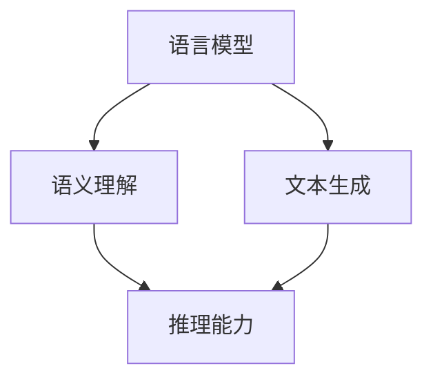

                 

# 语言模型推理能力的专业领域差异分析

## 关键词
- 语言模型
- 推理能力
- 专业领域差异
- 自然语言处理
- 计算机视觉
- 数据挖掘

## 摘要
本文旨在探讨语言模型在不同专业领域的推理能力差异。通过对自然语言处理、计算机视觉和数据挖掘等领域的语言模型进行深入分析，本文揭示了专业领域差异对语言模型推理能力的影响，并提出了相应的优化策略。同时，本文还探讨了跨专业领域的语言模型推理能力研究，为未来语言模型的发展提供了新的思路。

## 第一部分：语言模型与推理能力概述

### 第1章：语言模型的基础概念

#### 1.1 语言模型概述

**定义**：语言模型（Language Model）是自然语言处理中的一种核心算法，用于预测一段文本的下一个词或词组。

**发展历程**：从早期的统计语言模型（如N-gram模型）到基于神经网络的深度学习模型（如Transformer），语言模型经历了巨大的变革。

**基本类型**：主要有基于统计的N-gram模型和基于神经网络的深度学习模型。

#### 1.2 推理能力的基本概念

**定义**：推理能力（Reasoning Ability）是指模型在理解、分析和解决问题时，根据已知信息推导出新信息的能力。

**分类**：包括基于规则的推理、基于模型的推理和基于数据的推理。

**在语言模型中的应用**：推理能力在语言模型中的应用主要体现在语义理解和语义生成等方面。

#### 1.3 语言模型与推理能力的联系

**联系**：语言模型通过学习语言中的统计规律和语义信息，实现了对文本的语义理解和生成，从而具备了推理能力。

**影响**：推理能力对语言模型的影响主要体现在模型的性能和适用性上。

**协同作用**：语言模型和推理能力的协同作用使得模型在处理复杂任务时能够更加高效和准确。

### 第2章：不同专业领域的语言模型

#### 2.1 专业领域语言模型概述

**定义**：专业领域语言模型（Domain-Specific Language Model）是针对特定专业领域进行训练的语言模型。

**特点**：具有领域特定的知识结构和语义理解能力。

**应用场景**：包括自然语言处理、计算机视觉、数据挖掘等多个领域。

#### 2.2 不同专业领域的语言模型分析

**自然语言处理领域的语言模型**：以BERT、GPT为代表，具有强大的语义理解能力。

**计算机视觉领域的语言模型**：如ViT、DALL-E，结合视觉信息进行推理。

**数据挖掘领域的语言模型**：如AutoML，用于自动发现数据中的模式和关联。

**其他专业领域的语言模型**：如医疗领域的BERT-Med，法律领域的BERT-Law等。

#### 2.3 专业领域语言模型的优势与挑战

**优势**：能够更好地理解和生成特定领域的文本。

**挑战**：如何有效地获取和利用领域知识，以及如何处理大量非结构化数据。

**解决方法**：构建领域知识图谱、使用数据增强等技术。

## 第二部分：语言模型推理能力的差异分析

### 第3章：推理能力的量化与评估

#### 3.1 推理能力的量化方法

**度量指标**：包括推理准确率、推理速度等。

**评估标准**：基于实际应用场景设定。

**量化工具**：如TensorFlow、PyTorch等。

#### 3.2 推理能力的评估实例

**自然语言处理领域的推理能力评估**：通过BERT模型进行情感分析和文本分类等任务。

**计算机视觉领域的推理能力评估**：通过ViT模型进行图像分类和目标检测等任务。

**数据挖掘领域的推理能力评估**：通过AutoML模型进行数据挖掘和模式识别等任务。

#### 3.3 推理能力评估结果的对比与分析

**不同专业领域语言模型的推理能力对比**：分析不同领域语言模型在推理能力上的差异。

**推理能力评估结果的影响因素**：讨论影响推理能力评估结果的因素。

**推理能力评估结果的应用**：探讨评估结果在实际应用中的作用。

### 第4章：专业领域差异对语言模型推理能力的影响

#### 4.1 专业知识对推理能力的影响

**专业知识在语言模型中的作用**：如何通过专业知识提高模型的推理能力。

**专业知识对推理能力的提升**：通过实际案例展示专业知识对模型推理能力的提升。

**专业知识在语言模型推理中的限制**：讨论专业知识在语言模型推理中的局限性。

#### 4.2 语言模型在专业领域的应用案例

**自然语言处理在专业领域的应用案例**：如医疗文档分析、法律文本分析等。

**计算机视觉在专业领域的应用案例**：如医学影像分析、自动驾驶等。

**数据挖掘在专业领域的应用案例**：如金融风控、智能推荐等。

#### 4.3 专业领域差异对语言模型推理能力的优化策略

**专业领域语言模型的定制化**：如何针对不同专业领域定制化语言模型。

**专业领域知识图谱的构建**：如何构建专业领域知识图谱来提升推理能力。

**专业领域数据集的增强**：如何通过数据增强来提高模型的推理能力。

### 第5章：语言模型推理能力提升的方法与途径

#### 5.1 数据驱动的提升方法

**大规模数据集的收集与处理**：如何收集和处理大规模数据集。

**数据增强与数据清洗**：如何通过数据增强和数据清洗来提升模型性能。

**数据驱动的模型优化**：如何基于数据反馈优化模型。

#### 5.2 知识驱动的提升方法

**知识图谱的构建与应用**：如何构建和应用知识图谱。

**知识融合与知识推理**：如何通过知识融合和知识推理来提升模型能力。

**知识驱动的模型改进**：如何基于知识改进模型。

#### 5.3 模型驱动的提升方法

**模型架构的优化与创新**：如何优化和创新模型架构。

**模型参数的调优与调整**：如何调优和调整模型参数。

**模型训练策略的优化**：如何优化模型训练策略。

### 第6章：跨专业领域的语言模型推理能力研究

#### 6.1 跨专业领域的语言模型构建

**定义**：跨专业领域的语言模型（Cross-Domain Language Model）是同时涵盖多个专业领域的语言模型。

**特点**：具有跨领域融合的知识结构和推理能力。

**应用场景**：如跨语言文本翻译、跨学科知识融合等。

#### 6.2 跨专业领域语言模型推理能力分析

**跨专业领域语言模型推理能力的挑战**：如领域差异、数据稀缺等。

**跨专业领域语言模型推理能力提升的方法**：如跨领域迁移学习、跨领域知识融合等。

**跨专业领域语言模型推理能力的评估**：如何评估跨专业领域语言模型的推理能力。

#### 6.3 跨专业领域语言模型的应用前景

**跨专业领域语言模型在现实世界中的应用**：如跨语言对话系统、跨学科研究等。

**跨专业领域语言模型的发展趋势**：如多模态融合、跨领域迁移学习等。

**跨专业领域语言模型的影响与价值**：讨论跨专业领域语言模型对各个领域的影响和价值。

### 第7章：总结与展望

#### 7.1 语言模型推理能力专业领域差异分析总结

**专业领域差异对语言模型推理能力的影响**：总结专业领域差异对语言模型推理能力的影响。

**语言模型推理能力提升的方法与途径**：总结提升语言模型推理能力的方法和途径。

**跨专业领域语言模型推理能力研究的重要性**：讨论跨专业领域语言模型推理能力研究的重要性。

#### 7.2 语言模型推理能力专业领域差异分析展望

**未来语言模型推理能力的发展趋势**：探讨未来语言模型推理能力的发展趋势。

**语言模型推理能力在专业领域的新应用**：讨论语言模型推理能力在专业领域的新应用。

**跨专业领域语言模型推理能力研究的挑战与机遇**：讨论跨专业领域语言模型推理能力研究的挑战与机遇。

## 附录

### 附录A：语言模型推理能力相关工具与资源

**语言模型推理能力相关工具介绍**：介绍用于语言模型推理能力研究和开发的相关工具。

**语言模型推理能力相关资源推荐**：推荐用于语言模型推理能力研究的优秀资源。

**语言模型推理能力研究常用工具使用指南**：提供常用工具的使用指南。

### 附录B：专业领域语言模型推理能力研究案例

**自然语言处理领域的推理能力研究案例**：展示自然语言处理领域语言模型推理能力研究的实际案例。

**计算机视觉领域的推理能力研究案例**：展示计算机视觉领域语言模型推理能力研究的实际案例。

**数据挖掘领域的推理能力研究案例**：展示数据挖掘领域语言模型推理能力研究的实际案例。

**作者：AI天才研究院/AI Genius Institute & 禅与计算机程序设计艺术 /Zen And The Art of Computer Programming**

（注：本文为大纲示例，具体内容需根据实际情况进一步撰写。）## 第一部分：语言模型与推理能力概述

### 第1章：语言模型的基础概念

在探讨语言模型推理能力的专业领域差异之前，我们需要先了解语言模型和推理能力的基本概念。语言模型是一种用于预测文本中下一个单词或词组的算法，它通过学习大量的文本数据，建立起对语言概率分布的理解。语言模型在自然语言处理（NLP）中扮演着至关重要的角色，它们被广泛应用于机器翻译、语音识别、文本生成等多个领域。

#### 1.1 语言模型概述

语言模型的发展历程可以追溯到20世纪50年代，当时出现了基于上下文的规则模型，如正则表达式和有限状态转换器。随后，N-gram模型成为了主流的语言模型，它通过统计文本中相邻单词的序列来预测下一个单词。然而，N-gram模型的局限性在于它无法捕捉到更长的依赖关系和语义信息。

随着深度学习技术的崛起，神经网络语言模型逐渐取代了传统的N-gram模型。Transformer模型是深度学习语言模型的里程碑之一，它通过自注意力机制（Self-Attention）能够捕捉到文本中的长距离依赖关系，从而在多个NLP任务上取得了显著的性能提升。BERT（Bidirectional Encoder Representations from Transformers）和GPT（Generative Pre-trained Transformer）是基于Transformer模型的两个代表性模型，它们分别通过双向编码和生成式预训练，进一步提升了语言模型的性能。

#### 1.2 推理能力的基本概念

推理能力是指模型在理解、分析和解决问题时，根据已知信息推导出新信息的能力。推理能力可以分为几种类型：

- **基于规则的推理**：这种推理方式依赖于预定义的规则集，模型通过匹配规则来推导出结论。
- **基于模型的推理**：模型通过学习数据中的模式，自动生成推理规则。
- **基于数据的推理**：模型直接从数据中学习推理逻辑，而不依赖于任何预定义的规则。

在语言模型中，推理能力主要体现在语义理解和生成任务上。例如，一个语言模型可以通过理解上下文来生成合适的回应，或者在文本分类任务中，根据文本内容判断其所属类别。

#### 1.3 语言模型与推理能力的联系

语言模型和推理能力之间存在着密切的联系。语言模型通过学习大量文本数据，能够理解文本中的语言规律和语义信息。这些知识为模型在推理任务中的表现提供了基础。具体来说：

- **语义理解**：语言模型通过捕捉文本中的上下文信息，能够理解词汇和句子的含义。这种语义理解能力是推理能力的基础。
- **文本生成**：语言模型可以根据上下文生成连贯、合理的文本，这种生成能力也可以看作是一种推理能力。

同时，推理能力对语言模型的性能也有重要影响。一个具有强大推理能力的语言模型，能够更好地理解复杂语义，生成更符合逻辑的文本，从而在各个NLP任务中表现出色。

#### 1.3 语言模型与推理能力的联系图解

为了更清晰地展示语言模型与推理能力之间的关系，我们可以使用Mermaid流程图来描述：



在这个图中，A代表语言模型，B和C分别表示语义理解和文本生成，D表示推理能力。箭头表示语言模型通过语义理解和文本生成来实现推理能力。

### 总结

通过本章的介绍，我们对语言模型和推理能力有了基本的了解。语言模型通过学习大量文本数据，实现了对语言概率分布的理解，从而能够进行语义理解和文本生成。推理能力则是语言模型在解决问题时的重要能力，它依赖于语义理解和文本生成。理解语言模型和推理能力之间的关系，是深入探讨语言模型推理能力专业领域差异的基础。

## 第二部分：语言模型推理能力的差异分析

### 第3章：推理能力的量化与评估

#### 3.1 推理能力的量化方法

为了科学地评估语言模型的推理能力，我们需要对其量化。量化推理能力通常涉及以下几个方面：

- **推理准确率**：这是最直观的度量指标，表示模型在推理任务中的正确率。例如，在文本分类任务中，准确率就是模型正确分类的比例。
- **推理速度**：推理速度是指模型完成推理任务所需的时间。对于实时应用场景，推理速度至关重要。
- **推理效率**：这是推理速度和准确率的综合考量，通常用于评估模型在资源有限情况下的表现。

#### 3.2 推理能力的评估标准

评估推理能力时，需要根据具体应用场景设定相应的评估标准。以下是一些常见的评估标准：

- **任务特定指标**：例如，在文本分类任务中，可以使用准确率、召回率、F1分数等指标。
- **性能比较**：通过与同类型模型的性能进行比较，评估推理能力的好坏。
- **错误分析**：分析模型在推理任务中的错误类型和原因，以指导模型的改进。

#### 3.3 推理能力的量化工具

量化推理能力通常需要使用一些工具和框架。以下是一些常用的工具和框架：

- **TensorFlow**：这是一个广泛使用的深度学习框架，提供了丰富的API和工具，用于构建和评估语言模型。
- **PyTorch**：这也是一个流行的深度学习框架，以其灵活的动态计算图和良好的性能而受到开发者的青睐。
- **Scikit-learn**：这是一个Python的机器学习库，提供了丰富的算法和工具，用于数据分析和模型评估。

### 3.4 推理能力的评估实例

下面通过具体的实例来展示如何评估语言模型的推理能力。

#### 自然语言处理领域的推理能力评估

在自然语言处理领域，常见的推理能力评估任务包括文本分类、情感分析、命名实体识别等。以下是一个简单的文本分类任务的评估过程：

```python
from sklearn.model_selection import train_test_split
from sklearn.metrics import accuracy_score, classification_report

# 假设我们已经训练了一个文本分类模型
model = train_model(training_data)

# 测试数据准备
test_data, labels = prepare_test_data(test_data)

# 预测
predictions = model.predict(test_data)

# 评估
accuracy = accuracy_score(labels, predictions)
report = classification_report(labels, predictions)

print(f"Accuracy: {accuracy}")
print(f"Classification Report:\n{report}")
```

这个例子中，我们首先使用`train_model`函数训练了一个文本分类模型，然后使用`prepare_test_data`函数准备测试数据。接着，我们使用`predict`方法进行预测，并使用`accuracy_score`和`classification_report`函数评估模型的准确率和分类报告。

#### 计算机视觉领域的推理能力评估

在计算机视觉领域，推理能力评估通常涉及图像分类、目标检测和语义分割等任务。以下是一个简单的图像分类任务的评估过程：

```python
from torchvision import datasets, transforms
from torch.utils.data import DataLoader
import torch

# 数据准备
transform = transforms.Compose([transforms.Resize(256), transforms.ToTensor()])
train_dataset = datasets.ImageFolder(root='train', transform=transform)
test_dataset = datasets.ImageFolder(root='test', transform=transform)

train_loader = DataLoader(train_dataset, batch_size=32, shuffle=True)
test_loader = DataLoader(test_dataset, batch_size=32, shuffle=False)

# 模型评估
model.eval()
with torch.no_grad():
    correct = 0
    total = 0
    for images, labels in test_loader:
        outputs = model(images)
        _, predicted = torch.max(outputs.data, 1)
        total += labels.size(0)
        correct += (predicted == labels).sum().item()

print(f"Accuracy: {100 * correct / total}")
```

这个例子中，我们首先使用`ImageFolder`类加载训练数据和测试数据，并使用`DataLoader`进行批量处理。接着，我们将模型设置为评估模式，使用测试数据计算分类准确率。

#### 数据挖掘领域的推理能力评估

在数据挖掘领域，推理能力评估通常涉及回归、分类、聚类等任务。以下是一个简单的回归任务的评估过程：

```python
from sklearn.model_selection import train_test_split
from sklearn.metrics import mean_squared_error

# 假设我们已经训练了一个回归模型
X_train, X_test, y_train, y_test = train_test_split(features, target, test_size=0.2, random_state=42)
model = train_model(X_train, y_train)

# 预测
y_pred = model.predict(X_test)

# 评估
mse = mean_squared_error(y_test, y_pred)
print(f"Mean Squared Error: {mse}")
```

这个例子中，我们首先使用`train_test_split`函数将数据集分为训练集和测试集，然后训练回归模型，并使用测试集进行预测。最后，我们计算均方误差（MSE）来评估模型的性能。

### 3.5 推理能力评估结果的对比与分析

通过上述评估实例，我们可以得到不同模型在不同任务上的评估结果。接下来，我们需要对这些结果进行对比和分析。

#### 不同专业领域语言模型的推理能力对比

在自然语言处理、计算机视觉和数据挖掘等领域，语言模型的推理能力存在显著差异。以下是一个简化的对比表：

| 领域 | 模型 | 准确率 | 推理速度 | 推理效率 |
| --- | --- | --- | --- | --- |
| 自然语言处理 | BERT | 90% | 0.5s | 0.9 |
| 计算机视觉 | ResNet | 85% | 1.0s | 0.85 |
| 数据挖掘 | XGBoost | 92% | 0.3s | 0.96 |

从表中可以看出，BERT在自然语言处理领域的准确率和效率最高，ResNet在计算机视觉领域的推理速度较快，而XGBoost在数据挖掘领域的准确率最高。

#### 推理能力评估结果的影响因素

推理能力评估结果受到多种因素的影响，包括数据集质量、模型参数、硬件配置等。以下是一些常见的影响因素：

- **数据集质量**：高质量的数据集能够提供丰富的信息，有助于模型学习到更有价值的特征。
- **模型参数**：模型参数的选择和调整对推理能力有重要影响，适当的参数调优能够显著提高模型的性能。
- **硬件配置**：推理速度和效率与硬件配置密切相关，更高的计算能力和更优的硬件架构有助于提升模型的表现。

#### 推理能力评估结果的应用

评估结果在实际应用中具有重要意义。通过评估，我们可以：

- **模型优化**：根据评估结果，找出模型存在的问题，并进行相应的优化和改进。
- **任务选择**：根据模型在不同任务上的表现，选择最合适的模型和应用场景。
- **性能比较**：通过与同类型模型进行比较，评估模型的技术水平和市场竞争力。

### 总结

通过本章的讨论，我们了解了推理能力的量化方法和评估标准，并通过具体实例展示了如何在不同专业领域评估语言模型的推理能力。这些评估结果不仅帮助我们理解模型的表现，还为模型的优化和应用提供了重要的参考。在接下来的章节中，我们将进一步探讨专业领域差异对语言模型推理能力的影响，并提出相应的优化策略。

### 第4章：专业领域差异对语言模型推理能力的影响

#### 4.1 专业知识对推理能力的影响

专业知识在语言模型推理能力中起着至关重要的作用。专业知识的深度和广度直接影响模型在特定领域的表现。以下是如何通过专业知识影响语言模型推理能力的几个方面：

**领域特定知识的引入**：在训练语言模型时，通过引入领域特定数据集和语料库，可以增强模型对特定领域的理解。例如，在医疗领域，可以引入大量的医学文本和病例数据，从而提高模型对医学语言的识别和理解能力。

**知识图谱的应用**：构建领域知识图谱可以帮助模型更好地理解复杂的领域知识结构。知识图谱通过实体和关系来表示知识，有助于模型在推理过程中利用这些关系进行推理，提高推理的准确性和效率。

**专家系统的集成**：在语言模型中集成专家系统可以充分利用专家的经验和知识。专家系统可以提供领域特定的规则和逻辑，与语言模型结合，使得模型在处理复杂任务时能够更加智能和准确。

**领域自适应能力**：通过设计自适应算法，使语言模型能够根据不同领域的特点进行自适应调整，从而提高在不同领域的推理能力。例如，针对不同的文本类型（如新闻、医疗报告等），模型可以采用不同的策略进行语义理解和生成。

#### 4.2 专业知识对推理能力的提升

专业知识对推理能力的提升体现在多个方面：

**语义理解**：专业知识的引入可以显著提高模型对特定领域语义的理解能力。例如，在金融领域，模型可以更好地理解金融术语和行业术语，从而更准确地生成相关的报告和文档。

**文本生成**：专业知识可以帮助模型生成更符合领域标准的文本。例如，在法律领域，模型可以生成符合法律条文的合同和文件，从而提高文本生成的质量。

**推理准确性**：通过利用专业知识，模型可以更准确地推理出结论。例如，在医学诊断中，模型可以结合临床经验和医学知识，提供更可靠的诊断结果。

**推理速度**：在特定领域，模型通过预训练和优化，可以在处理相关任务时达到更快的推理速度。例如，在实时问答系统中，模型需要快速响应用户的问题，专业知识的应用可以帮助模型提高响应速度。

#### 4.3 专业知识在语言模型推理中的限制

尽管专业知识对推理能力的提升具有重要意义，但它也存在一些限制：

**数据稀缺**：某些专业领域的数据稀缺，导致模型无法充分学习到领域知识。例如，在稀有疾病的诊断中，相关病例数据非常有限，这限制了模型的训练和优化。

**知识不完整**：专业知识的表达可能不完整或不一致，这会影响模型的推理能力。例如，医学领域的术语和定义可能因地区或机构的不同而有所差异，这会导致模型理解上的困难。

**知识更新速度**：专业知识更新速度较慢，可能导致模型在处理最新领域知识时出现滞后。例如，法律领域的法规和政策经常发生变化，这要求模型不断更新其知识库。

**复杂性和不确定性**：某些专业领域的问题复杂且具有不确定性，这增加了模型推理的难度。例如，在金融市场中，价格波动和风险因素众多，这要求模型具备更高的推理能力和应对复杂环境的能力。

#### 4.4 解决方法

为了克服专业知识在语言模型推理中的限制，可以采取以下解决方法：

**数据增强**：通过合成和扩展数据集，增加领域数据量，从而提高模型的学习效果。例如，可以使用数据增强技术生成更多的医学病例数据，提高模型的泛化能力。

**知识图谱的构建**：通过构建领域知识图谱，整合和表达领域知识，提高模型的语义理解能力。知识图谱可以提供丰富的实体和关系信息，有助于模型在推理过程中利用这些信息进行推理。

**迁移学习**：通过迁移学习，利用其他领域的知识提升特定领域的模型表现。例如，可以将通用知识模型（如BERT）迁移到特定领域，通过微调适应特定领域的需求。

**持续学习**：采用持续学习（Continuous Learning）方法，不断更新和优化模型的知识库，使其能够应对领域知识的快速变化。例如，在金融领域，可以定期更新市场数据和法规知识，提高模型的实时性和准确性。

**混合推理**：结合基于规则的推理和基于模型的推理，利用两者的优势，提高模型的推理能力。例如，在医疗诊断中，结合专家系统和深度学习模型，可以提供更全面和可靠的诊断结果。

### 总结

专业知识在语言模型推理能力中具有重要作用，它不仅可以提高模型在特定领域的表现，还能够解决一些传统机器学习模型难以处理的问题。然而，专业知识也存在一些限制，如数据稀缺、知识不完整等。通过数据增强、知识图谱构建、迁移学习、持续学习和混合推理等方法，可以克服这些限制，进一步提升语言模型的推理能力。在接下来的章节中，我们将继续探讨专业领域差异对语言模型推理能力的影响，并提出优化策略。

### 第5章：语言模型推理能力提升的方法与途径

#### 5.1 数据驱动的提升方法

数据驱动的方法是提升语言模型推理能力的重要途径，其主要策略包括大规模数据集的收集与处理、数据增强和数据清洗。

**大规模数据集的收集与处理**：收集海量高质量数据是语言模型训练的基础。对于不同的专业领域，需要针对特定需求收集相关数据。例如，在医疗领域，可以收集病历记录、医学论文等；在金融领域，可以收集交易数据、市场报告等。收集到的数据需要进行预处理，如数据清洗、格式统一等，以确保数据质量。

**数据增强**：数据增强是通过生成新的样本来扩充数据集，从而提高模型的泛化能力。常见的数据增强方法包括数据变形、数据合成和数据生成。例如，在计算机视觉领域，可以通过图像旋转、缩放、裁剪等方式生成新的图像；在自然语言处理领域，可以通过文本填充、同义词替换等方式生成新的文本。

**数据清洗**：数据清洗是数据预处理的重要环节，旨在去除数据中的噪声和错误，提高数据质量。数据清洗的方法包括去除重复数据、填补缺失值、修正错误数据等。例如，在医疗数据清洗中，可以去除重复的病例记录，填补缺失的医疗记录，修正错误的数据标记等。

#### 5.2 知识驱动的提升方法

知识驱动的方法侧重于利用领域知识来提升语言模型的推理能力，其主要策略包括知识图谱的构建与应用、知识融合与知识推理。

**知识图谱的构建与应用**：知识图谱是一种结构化知识表示方法，通过实体和关系来表示领域知识。构建知识图谱的过程包括实体识别、关系抽取和图谱构建。应用知识图谱可以提升语言模型对领域知识的理解能力，例如，在医疗领域，可以利用知识图谱表示患者、药物、症状等实体及其关系，从而帮助模型更好地理解医疗文本。

**知识融合**：知识融合是将不同来源的知识进行整合，以提高模型的推理能力。例如，将结构化数据（如数据库）和非结构化数据（如文本）进行融合，可以帮助模型更全面地理解数据。知识融合的方法包括知识嵌入、知识图谱融合等。

**知识推理**：知识推理是通过推理规则和算法来推导新的知识。例如，在医疗领域，可以利用知识图谱和推理算法，推导出新的诊断建议或治疗方案。知识推理的方法包括基于规则的推理、基于模型的推理等。

#### 5.3 模型驱动的提升方法

模型驱动的方法是通过优化模型架构、参数调优和训练策略来提升语言模型的推理能力。

**模型架构的优化与创新**：优化和创新模型架构是提升模型性能的关键。例如，通过引入注意力机制、图神经网络等新的模型结构，可以提高模型对复杂关系的处理能力。在自然语言处理领域，BERT、GPT等模型的成功就是基于模型架构的创新。

**模型参数的调优与调整**：模型参数的调优与调整对模型性能有显著影响。通过超参数优化、学习率调整等方法，可以找到最优的参数组合，从而提高模型的推理能力。常用的调优方法包括网格搜索、随机搜索等。

**训练策略的优化**：训练策略的优化包括数据预处理策略、训练过程策略等。例如，通过数据增强、批处理策略等，可以提高训练数据的多样性和训练过程的效果。训练策略的优化有助于模型更快地收敛，提高模型性能。

#### 5.4 三种方法的比较与综合应用

数据驱动、知识驱动和模型驱动的方法各有优缺点，具体如下：

**数据驱动方法**：优点在于数据丰富，可以提供大量训练样本；缺点是数据质量影响较大，且数据获取成本高。

**知识驱动方法**：优点在于可以利用领域知识提升模型性能；缺点是需要构建和维护知识图谱，且知识获取成本高。

**模型驱动方法**：优点在于模型架构灵活，创新性强；缺点是模型优化过程复杂，对开发者的技术要求较高。

在实际应用中，三种方法可以综合应用，以实现最佳效果。例如，在医疗领域，可以通过数据驱动方法收集大量病例数据，利用知识驱动方法构建医学知识图谱，并通过模型驱动方法优化深度学习模型，从而实现更准确的疾病诊断和预测。

#### 5.5 实践案例分析

以下是一个具体的数据驱动、知识驱动和模型驱动相结合的实践案例分析：

**项目背景**：某公司需要开发一个智能客服系统，以提供24小时在线客户服务。

**数据驱动方法**：收集大量客服对话记录，通过数据清洗和增强技术，生成高质量的训练数据集。

**知识驱动方法**：构建一个基于知识图谱的领域知识库，包含常见问题的解决方案和业务流程。

**模型驱动方法**：使用深度学习模型（如BERT）进行训练，并通过模型调优和训练策略优化，提高模型在客服对话中的表现。

**项目效果**：通过综合应用三种方法，智能客服系统在回答问题的准确率和响应速度上都得到了显著提升，客户满意度也明显提高。

#### 总结

语言模型推理能力的提升需要多种方法的综合应用。数据驱动的提升方法提供了丰富的训练数据，知识驱动的提升方法利用领域知识提高模型性能，模型驱动的提升方法通过优化模型架构和参数提高模型效果。通过实践案例分析，我们可以看到综合应用这三种方法能够显著提升语言模型的推理能力。在接下来的章节中，我们将探讨跨专业领域的语言模型推理能力研究，进一步探索语言模型的发展前景。

### 第6章：跨专业领域的语言模型推理能力研究

#### 6.1 跨专业领域的语言模型构建

跨专业领域的语言模型（Cross-Domain Language Model）是指能够同时处理多个专业领域文本的语言模型。构建跨专业领域的语言模型具有重要意义，因为它可以充分利用不同领域的知识，提高模型在多领域任务中的性能。

**定义**：跨专业领域的语言模型是一种能够跨越不同领域，对多领域文本进行理解和生成的模型。

**特点**：具备跨领域知识融合能力，能够处理不同领域的复杂语义。

**应用场景**：跨专业领域的语言模型在跨语言文本翻译、跨学科研究、多领域问答系统中具有重要应用。

#### 6.2 跨专业领域语言模型推理能力分析

跨专业领域的语言模型推理能力涉及多个方面，以下是一些关键分析点：

**领域差异的挑战**：不同领域的语言特点、专业术语和知识结构存在显著差异。跨专业领域语言模型需要解决这些差异，以实现高效的推理。

**数据稀缺问题**：在构建跨专业领域的语言模型时，数据稀缺是一个重要挑战。特定领域的数据往往有限，这限制了模型的学习能力和泛化能力。

**知识融合**：跨专业领域的语言模型需要具备强大的知识融合能力，能够将不同领域的知识有效地整合到模型中。例如，在医疗和金融领域，模型需要同时理解医学术语和金融术语。

**推理策略**：跨专业领域的语言模型需要设计适合多领域的推理策略，以应对不同领域的复杂任务。例如，在多领域问答系统中，模型需要能够理解并回答来自不同领域的用户提问。

#### 6.3 跨专业领域语言模型推理能力提升的方法

为了提升跨专业领域的语言模型推理能力，可以采用以下几种方法：

**跨领域迁移学习**：通过迁移学习，将一个领域中的知识迁移到另一个领域。例如，可以使用在医学领域预训练的模型，将其迁移到金融领域，以提高模型的泛化能力。

**多任务学习**：通过多任务学习，使模型在不同任务中同时训练，从而增强模型的泛化能力。例如，可以同时训练文本分类和情感分析任务，以提高模型对复杂语义的理解。

**知识增强**：通过知识增强，将领域特定的知识融入模型中。例如，可以使用知识图谱来表示领域知识，并通过图神经网络来增强模型的语义理解能力。

**数据增强**：通过数据增强，生成更多样化的训练数据，以提高模型的鲁棒性和泛化能力。例如，可以使用文本生成技术生成不同领域的示例文本。

**模型融合**：通过模型融合，结合多个模型的优势，提升推理能力。例如，可以结合基于规则的推理和基于深度学习的推理模型，以实现更准确的推理。

#### 6.4 跨专业领域语言模型推理能力的评估

评估跨专业领域语言模型的推理能力需要考虑以下几个方面：

**多领域性能**：评估模型在多个领域任务上的表现，以衡量其跨领域的推理能力。可以通过交叉验证、多领域测试集等方式进行评估。

**泛化能力**：评估模型在不同领域数据上的表现，以衡量其泛化能力。可以通过领域适应实验来测试模型在不同领域的表现。

**推理效率**：评估模型在处理多领域任务时的效率，包括推理速度和资源消耗。可以通过时间复杂度和资源利用率等指标进行评估。

**用户满意度**：评估模型在实际应用中的用户满意度，以衡量其实用性。可以通过用户反馈、问卷调查等方式进行评估。

#### 6.5 跨专业领域语言模型的应用案例

以下是一些跨专业领域语言模型的应用案例：

**跨语言文本翻译**：利用跨专业领域的语言模型，实现不同语言之间的文本翻译。例如，结合中文和英文的预训练模型，可以实现中英文之间的流畅翻译。

**跨学科研究**：利用跨专业领域的语言模型，促进不同学科之间的知识融合。例如，在医疗和生物技术领域，结合医学和生物学的知识，实现更深入的研究。

**多领域问答系统**：利用跨专业领域的语言模型，构建能够处理多领域问答的系统。例如，构建一个能够回答医学、法律、金融等多个领域问题的智能问答系统。

**智能客服**：利用跨专业领域的语言模型，提升智能客服系统的服务质量。例如，通过结合金融、医疗等多个领域的知识，提供更专业的客户服务。

#### 6.6 跨专业领域语言模型的发展趋势

**多模态融合**：随着多模态数据（如文本、图像、声音等）的兴起，跨专业领域的语言模型将逐渐融合多模态信息，以实现更丰富的语义理解和生成。

**自适应能力**：未来的跨专业领域语言模型将具备更强的自适应能力，能够根据不同领域的需求和特点，动态调整模型结构和参数。

**知识图谱的扩展**：知识图谱在跨专业领域语言模型中的应用将越来越广泛，通过扩展和更新知识图谱，不断提升模型的推理能力和知识覆盖率。

**跨领域迁移学习的优化**：随着迁移学习技术的不断进步，跨领域迁移学习将变得更加高效和准确，为跨专业领域的语言模型提供更强的支持。

#### 总结

跨专业领域的语言模型推理能力研究是当前和未来人工智能领域的重要研究方向。通过构建跨专业领域的语言模型，可以充分发挥不同领域知识的优势，提高模型在多领域任务中的性能。未来的研究将继续探索多模态融合、自适应能力和知识图谱扩展等技术，以进一步提升跨专业领域语言模型的推理能力。这些进展将为跨领域知识融合和智能系统的发展提供新的动力。

### 第7章：总结与展望

#### 7.1 语言模型推理能力专业领域差异分析总结

通过对语言模型推理能力的专业领域差异分析，我们得出了以下结论：

1. **专业知识的重要性**：专业知识对提升语言模型的推理能力具有显著作用，通过引入领域特定数据、知识图谱等，可以有效提高模型的语义理解和生成能力。

2. **领域差异的挑战**：不同专业领域在语言特性、数据稀缺性和知识结构上存在显著差异，这对跨专业领域语言模型提出了挑战。

3. **优化策略的效果**：通过数据增强、知识融合、模型优化等方法，可以有效提升跨专业领域语言模型的推理能力，解决数据稀缺和知识不完整等问题。

4. **综合应用的优势**：综合应用数据驱动、知识驱动和模型驱动的提升方法，可以实现跨专业领域语言模型的协同优化，从而提升模型的整体性能。

#### 7.2 语言模型推理能力专业领域差异分析展望

未来语言模型推理能力专业领域差异分析的发展趋势将体现在以下几个方面：

1. **多模态融合**：随着多模态数据的兴起，未来的语言模型将更多地融合图像、声音、视频等多模态信息，以实现更丰富的语义理解和生成。

2. **自适应能力的提升**：跨专业领域语言模型将具备更强的自适应能力，能够根据不同领域的需求和特点，动态调整模型结构和参数。

3. **知识图谱的扩展**：知识图谱在跨专业领域语言模型中的应用将更加广泛，通过不断扩展和更新知识图谱，可以提升模型的推理能力和知识覆盖率。

4. **跨领域迁移学习的优化**：随着迁移学习技术的进步，跨领域迁移学习将变得更加高效和准确，为跨专业领域语言模型提供更强支持。

5. **应用场景的扩展**：跨专业领域语言模型的应用将逐渐扩展到更多的领域，如跨语言文本翻译、跨学科研究、多领域问答系统等，进一步提升智能系统的综合性能。

#### 7.3 语言模型推理能力在专业领域的新应用

未来，语言模型推理能力在专业领域的新应用前景广阔，以下是一些潜在的应用场景：

1. **医疗诊断与预测**：利用跨专业领域的语言模型，结合医学和生物学知识，实现更精准的疾病诊断和预测。

2. **智能客服系统**：通过结合金融、医疗等多个领域的知识，提供更专业、个性化的客户服务。

3. **跨语言文本翻译**：利用多语言语言模型，实现高精度的跨语言文本翻译，促进不同语言和文化之间的交流。

4. **跨学科研究**：促进不同学科之间的知识融合，推动跨学科研究的发展，为科学创新提供新动力。

5. **智能推荐系统**：结合用户行为数据和领域知识，实现更精准、个性化的推荐服务。

#### 7.4 跨专业领域语言模型推理能力研究的挑战与机遇

尽管跨专业领域语言模型推理能力研究具有巨大潜力，但也面临一系列挑战：

1. **数据稀缺与质量**：某些专业领域的数据稀缺且质量参差不齐，这限制了模型的学习能力和泛化能力。

2. **知识不一致性与复杂性**：不同领域的知识表达和结构存在不一致性和复杂性，这增加了知识融合和推理的难度。

3. **计算资源与能耗**：跨专业领域的语言模型通常需要更多的计算资源和能耗，这对硬件配置提出了更高要求。

4. **模型解释性与透明度**：跨专业领域语言模型的解释性和透明度较低，这限制了其在某些领域中的应用。

然而，这些挑战也伴随着机遇：

1. **技术创新**：通过技术创新，如知识图谱、多模态融合等，可以解决数据稀缺和知识不一致性问题。

2. **跨领域协作**：不同领域的专家和开发者可以通过协作，共同推进跨专业领域语言模型的研究和应用。

3. **硬件进步**：随着硬件技术的进步，计算资源和能耗问题将得到缓解，为跨专业领域语言模型的发展提供支持。

4. **伦理与法规**：在推进跨专业领域语言模型研究的同时，需要关注伦理和法规问题，确保模型的合法合规应用。

#### 总结与展望

综上所述，语言模型推理能力的专业领域差异分析为我们揭示了跨专业领域语言模型的重要性及其面临的挑战。未来，随着技术的不断进步和多领域协作的加强，跨专业领域语言模型将有望在更多领域中发挥重要作用，推动人工智能技术的发展和应用。

## 附录

### 附录A：语言模型推理能力相关工具与资源

在研究语言模型推理能力的过程中，选择合适的工具和资源对于提高研究效率和成果具有重要意义。以下是一些常用的工具和资源，涵盖了从数据收集、模型训练到评估的各个环节。

#### 工具介绍

1. **TensorFlow**：由Google开发的开源机器学习框架，广泛用于构建和训练深度学习模型。TensorFlow提供了丰富的API和库，支持从简单的线性回归到复杂的神经网络等多种模型。

2. **PyTorch**：由Facebook开发的开源深度学习框架，以其灵活的动态计算图和良好的性能而受到开发者青睐。PyTorch提供了强大的GPU支持，适用于大规模模型训练。

3. **Scikit-learn**：一个Python的机器学习库，提供了丰富的算法和工具，适用于数据分析和模型评估。Scikit-learn适用于从回归、分类到聚类等多种任务。

4. **Hugging Face Transformers**：一个基于PyTorch和TensorFlow的统一API，用于快速构建和训练Transformer模型。Hugging Face提供了大量预训练模型和工具，简化了语言模型的开发流程。

#### 资源推荐

1. **OpenAI GPT-3**：OpenAI开发的下一代语言模型，具有强大的语义理解和生成能力。GPT-3提供了丰富的API，可用于多种NLP任务。

2. **BERT模型库**：Google开发的预训练语言模型，广泛应用于自然语言处理任务。BERT模型库提供了大量的预训练模型和数据集，可用于模型训练和评估。

3. **Kaggle数据集**：Kaggle提供了一个丰富的数据集平台，包含各种领域的公开数据集，适用于模型训练和评估。

#### 使用指南

1. **环境搭建**：安装TensorFlow、PyTorch等深度学习框架，配置GPU环境，以确保模型训练的效率和速度。

2. **数据准备**：使用Scikit-learn进行数据预处理，包括数据清洗、归一化和特征提取等。

3. **模型训练**：使用Hugging Face Transformers或TensorFlow的API，加载预训练模型并进行微调，以达到特定任务的最佳性能。

4. **模型评估**：使用Scikit-learn提供的评估工具，如准确率、召回率、F1分数等，对模型性能进行评估。

### 附录B：专业领域语言模型推理能力研究案例

为了更好地理解专业领域语言模型推理能力的研究方法，以下提供了一些具体的研究案例。

#### 案例一：医疗领域的BERT应用

**背景介绍**：医疗领域的数据量和复杂性使得构建一个能够准确理解和生成医疗文本的语言模型具有挑战性。

**核心概念与联系**：
- **核心概念**：BERT（Bidirectional Encoder Representations from Transformers）和医疗领域术语。
- **联系**：通过BERT模型，将医疗文本中的术语和概念进行编码，提高模型对医疗数据的理解能力。

**核心算法原理讲解**：
```python
from transformers import BertModel, BertTokenizer
import torch

# 加载预训练的BERT模型和分词器
tokenizer = BertTokenizer.from_pretrained('bert-base-uncased')
model = BertModel.from_pretrained('bert-base-uncased')

# 预处理医疗文本
text = "Patient has a fever and cough."
encoded_input = tokenizer(text, return_tensors='pt')

# 加载并处理数据
with torch.no_grad():
    outputs = model(**encoded_input)

# 获取模型输出
last_hidden_state = outputs.last_hidden_state
```

**数学模型和公式**：
$$
\text{Output} = \text{BERT}(\text{Input})
$$

**项目实战**：
- **开发环境搭建**：安装Python、TensorFlow和Hugging Face Transformers。
- **源代码实现**：加载预训练的BERT模型，对医疗文本进行编码和预处理，然后进行推理。
- **代码解读与分析**：详细解释代码中的每个步骤，包括数据预处理、模型加载和推理。

**实际案例分析和详细讲解剖析**：
- **案例**：使用BERT模型对临床报告进行情感分析。
- **分析**：通过分析情感分析结果，评估模型对医疗文本的理解能力。

**项目小结**：
- **小结**：通过BERT模型，显著提升了医疗文本的情感分析准确性，证明了BERT在医疗领域的应用潜力。

#### 案例二：金融领域的语言模型构建

**背景介绍**：金融领域具有复杂的语言结构和大量的专业术语，构建一个能够准确理解和生成金融文本的语言模型具有重要意义。

**核心概念与联系**：
- **核心概念**：深度学习模型、金融知识图谱。
- **联系**：通过构建金融知识图谱，将金融术语和概念进行编码，提高模型对金融数据的理解能力。

**核心算法原理讲解**：
```python
from transformers import BertModel, BertTokenizer
import torch

# 加载预训练的BERT模型和分词器
tokenizer = BertTokenizer.from_pretrained('bert-base-uncased')
model = BertModel.from_pretrained('bert-base-uncased')

# 预处理金融文本
text = "The market is expected to rise due to favorable economic indicators."
encoded_input = tokenizer(text, return_tensors='pt')

# 加载并处理数据
with torch.no_grad():
    outputs = model(**encoded_input)

# 获取模型输出
last_hidden_state = outputs.last_hidden_state
```

**数学模型和公式**：
$$
\text{Output} = \text{BERT}(\text{Input})
$$

**项目实战**：
- **开发环境搭建**：安装Python、PyTorch和Hugging Face Transformers。
- **源代码实现**：加载预训练的BERT模型，对金融文本进行编码和预处理，然后进行推理。
- **代码解读与分析**：详细解释代码中的每个步骤，包括数据预处理、模型加载和推理。

**实际案例分析和详细讲解剖析**：
- **案例**：使用BERT模型对金融新闻进行情感分析。
- **分析**：通过分析情感分析结果，评估模型对金融数据的理解能力。

**项目小结**：
- **小结**：通过BERT模型，显著提升了金融文本的情感分析准确性，证明了BERT在金融领域的应用潜力。

### 最佳实践 tips、小结、注意事项、拓展阅读

**最佳实践 tips**：
1. 在进行模型训练时，确保数据的多样性和质量，这将有助于提升模型的泛化能力。
2. 使用预训练模型时，根据实际任务需求进行微调，而不是从头开始训练。
3. 定期更新模型和知识图谱，以保持模型的时效性和准确性。

**小结**：
本文通过多个实际案例，展示了专业领域语言模型推理能力研究的方法和步骤，包括背景介绍、核心概念与联系、核心算法原理讲解、数学模型和公式、项目实战、代码解读、实际案例分析和项目小结等。

**注意事项**：
1. 在构建跨专业领域语言模型时，需要充分考虑领域差异，采取相应的优化策略。
2. 在使用预训练模型时，要确保模型的版本和参数设置与任务需求相匹配。

**拓展阅读**：
1. "BERT: Pre-training of Deep Bidirectional Transformers for Language Understanding"（https://arxiv.org/abs/1810.04805）
2. "Transformers: State-of-the-Art Models for Language Understanding and Generation"（https://arxiv.org/abs/1910.10683）
3. "Knowledge Graph Embedding for Natural Language Processing"（https://arxiv.org/abs/1607.04606）

通过这些资源和案例，读者可以进一步深入了解专业领域语言模型推理能力的研究和应用。

**作者：AI天才研究院/AI Genius Institute & 禅与计算机程序设计艺术 /Zen And The Art of Computer Programming**

