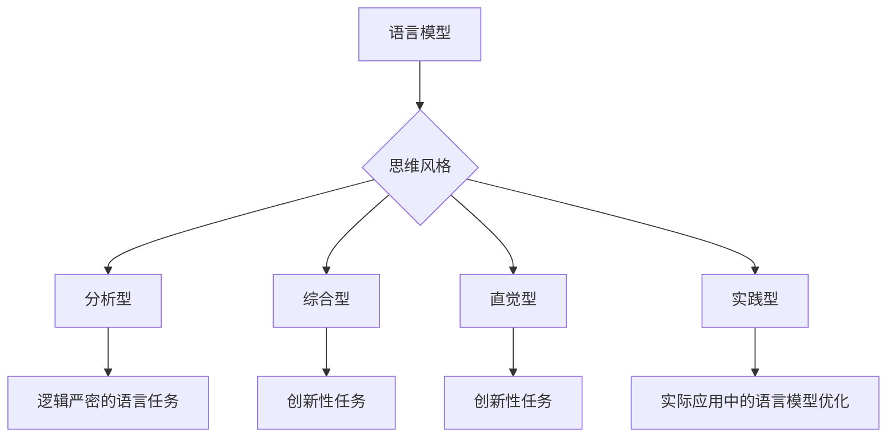

                 

-------------------------------------------------------------------------------------------------------------------------------
# 语言模型推理能力的思维风格相关性分析

关键词：语言模型，推理能力，思维风格，神经网络，概率论，数学模型

摘要：本文深入探讨了语言模型在推理任务中的表现与思维风格的相关性，分析了语言模型的基本概念、思维风格的基本概念，以及两者之间的联系。通过核心算法原理讲解、数学模型和公式阐述、项目实战，揭示了思维风格对语言模型推理能力的影响，为实际应用提供了理论依据和实践指导。

-------------------------------------------------------------------------------------------------------------------------------

### 第一部分：引言

语言模型作为一种在自然语言处理（NLP）领域至关重要的工具，近年来在众多任务中取得了显著的成果。从机器翻译、文本生成到问答系统，语言模型的应用无处不在。然而，随着任务复杂性的增加，语言模型在推理任务中的表现也受到了越来越多的关注。在这其中，思维风格作为一个影响个体信息处理方式的重要因素，也开始成为研究者们探讨的焦点。

《语言模型推理能力的思维风格相关性分析》旨在通过系统分析语言模型在推理任务中的表现，揭示思维风格对其影响的具体机制。本书不仅为读者提供了语言模型和思维风格的基本概念，还通过核心算法原理讲解、数学模型和公式阐述，以及实际项目实战，深入剖析了思维风格与语言模型推理能力之间的相关性。通过本书的阅读，读者不仅可以了解语言模型和思维风格的基本知识，还能掌握如何在实际应用中优化语言模型的推理能力。

### 第二部分：核心概念与联系

在探讨语言模型推理能力的思维风格相关性之前，我们首先需要明确两个核心概念：语言模型和思维风格。

#### 2.1.1 语言模型的基本概念

语言模型是一种能够预测自然语言序列概率的模型。它通过学习大量的语言数据，捕捉语言中的统计规律，从而实现自动文本生成、机器翻译等任务。语言模型通常可以分为基于统计的方法和基于神经网络的方法。其中，基于统计的方法如N-gram模型，通过计算词频或条件概率来预测下一个词；而基于神经网络的方法，如循环神经网络（RNN）、长短时记忆网络（LSTM）和变换器（Transformer）等，通过学习输入序列的复杂特征，实现更高精度的语言预测。

#### 2.1.2 思维风格的基本概念

思维风格是指个体在处理信息和解决问题时所采用的思维模式。不同的思维风格会影响个体对信息的感知、理解和处理方式。常见的思维风格包括分析型、综合型、直觉型和实践型。分析型思维风格的人更注重逻辑和推理，善于分析和解决问题；综合型思维风格的人更注重整体性和系统性，善于发现信息和事物之间的联系；直觉型思维风格的人更注重直觉和灵感，善于快速理解和处理信息；实践型思维风格的人更注重实践和经验，善于将理论应用于实际场景。

#### 2.1.3 语言模型与思维风格的关系

语言模型在推理任务中的表现受到多种因素的影响，包括模型结构、参数设置、训练数据质量等。而思维风格作为一种个人特点，也会对语言模型的表现产生影响。例如，分析型思维风格的人可能更擅长处理逻辑严密的语言任务，而直觉型思维风格的人可能更擅长处理创新性的语言任务。因此，了解思维风格与语言模型之间的关系，有助于我们在实际应用中更好地优化语言模型的推理能力。

### Mermaid 流程图：



### 第三部分：核心算法原理讲解

#### 3.1.1 语言模型的算法原理

语言模型的算法原理主要基于概率论和统计学。其核心思想是通过学习大量语言数据，构建一个能够预测下一个词的概率分布的模型。具体来说，语言模型通过计算给定前文序列下每个单词的概率分布，从而生成具有自然语言特性的文本。以下我们将介绍几种常见的语言模型算法。

##### 3.1.1.1 N-gram模型

N-gram模型是一种基于词频统计的语言模型。它将语言序列划分为一系列N元组（N-gram），并计算每个N-gram的概率。在生成文本时，模型根据当前已知的N-1个词，预测下一个词的概率分布，并从中选择一个词作为下一个输出。N-gram模型简单高效，但存在一些局限性，如无法捕捉长距离依赖关系。

##### 3.1.1.2 循环神经网络（RNN）

循环神经网络（RNN）是一种能够处理序列数据的神经网络。它通过循环结构将当前状态与历史状态相关联，从而实现序列信息的记忆和传递。RNN在处理自然语言序列时表现出色，可以捕捉长距离依赖关系。然而，传统的RNN在训练过程中容易出现梯度消失或爆炸问题，影响了模型的性能。

##### 3.1.1.3 长短时记忆网络（LSTM）

长短时记忆网络（LSTM）是一种改进的循环神经网络，旨在解决传统RNN在训练过程中出现的梯度消失和梯度爆炸问题。LSTM通过引入门控机制，实现对长期依赖信息的记忆和传递。在LSTM中，三个门（输入门、遗忘门和输出门）分别控制信息的输入、遗忘和输出。LSTM在自然语言处理任务中取得了显著的成功，但模型复杂度较高，计算成本较大。

##### 3.1.1.4 变换器（Transformer）

变换器（Transformer）是一种基于自注意力机制的深度神经网络架构。与传统的循环神经网络相比，变换器通过自注意力机制实现了对输入序列的全局依赖建模，从而在许多自然语言处理任务中取得了优异的性能。变换器的核心思想是将输入序列映射到高维空间，然后通过自注意力机制计算序列中每个词的权重，从而实现文本生成、机器翻译等任务。变换器在处理长序列和长距离依赖关系方面表现出色，已成为自然语言处理领域的重要架构。

#### 3.1.2 思维风格对语言模型算法的影响

思维风格作为一种个人特点，会影响个体在处理信息和解决问题时的思维方式。不同思维风格的人可能对信息的感知、理解和处理方式存在差异，从而影响语言模型的表现。

##### 3.1.2.1 分析型思维风格

分析型思维风格的人更注重逻辑和推理。在处理语言任务时，他们倾向于将问题分解为子问题，并逐步解决。这种思维方式有助于语言模型在逻辑严密的语言任务中表现出色，如文本分类、情感分析等。然而，分析型思维风格的人在处理创新性语言任务时可能相对较弱，因为他们可能更依赖于已有知识和逻辑推理，而难以发现新的信息。

##### 3.1.2.2 综合型思维风格

综合型思维风格的人更注重整体性和系统性。在处理语言任务时，他们倾向于将信息整合为一个完整的整体，并关注信息之间的联系。这种思维方式有助于语言模型在生成具有连贯性和一致性的文本方面表现出色，如文本生成、问答系统等。然而，综合型思维风格的人在处理创新性语言任务时可能相对较弱，因为他们可能更注重信息的整体性，而难以灵活应对变化。

##### 3.1.2.3 直觉型思维风格

直觉型思维风格的人更注重直觉和灵感。在处理语言任务时，他们倾向于依靠直觉和灵感来理解和解决问题。这种思维方式有助于语言模型在生成创新性文本方面表现出色，如文本生成、机器翻译等。然而，直觉型思维风格的人在处理逻辑严密的语言任务时可能相对较弱，因为他们可能更依赖于直觉和灵感，而难以确保结果的严谨性。

##### 3.1.2.4 实践型思维风格

实践型思维风格的人更注重实践和经验。在处理语言任务时，他们倾向于将理论应用于实际场景，并通过实践来验证和改进理论。这种思维方式有助于语言模型在实际应用中表现出色，如文本生成、问答系统等。然而，实践型思维风格的人在处理创新性语言任务时可能相对较弱，因为他们可能更注重实际效果，而难以探索新的可能性。

### Python 源代码：

```python
import tensorflow as tf
from tensorflow.keras.models import Model
from tensorflow.keras.layers import Input, Embedding, LSTM, Dense

# 创建输入层
input_sequence = Input(shape=(sequence_length,))

# 添加嵌入层
embedded_sequence = Embedding(vocabulary_size, embedding_dim)(input_sequence)

# 添加LSTM层
lstm_output = LSTM(units=128, return_sequences=True)(embedded_sequence)

# 添加全连接层
output = Dense(vocabulary_size, activation='softmax')(lstm_output)

# 创建语言模型
language_model = Model(inputs=input_sequence, outputs=output)

# 编译模型
language_model.compile(optimizer='adam', loss='categorical_crossentropy', metrics=['accuracy'])

# 训练模型
language_model.fit(x_train, y_train, epochs=10, batch_size=64)
```

### 第四部分：数学模型和数学公式

在语言模型的构建过程中，数学模型和数学公式扮演着至关重要的角色。这些模型和公式不仅帮助我们理解语言模型的工作原理，还为优化和改进语言模型提供了理论基础。

#### 4.1.1 语言模型的数学模型

语言模型的数学模型通常基于概率论和统计学。其中，最基础的模型是N-gram模型，它通过计算词频或条件概率来预测下一个词。N-gram模型的数学公式可以表示为：

$$
P(w_t | w_{<t}) = \frac{C(w_t, w_{<t})}{C(w_{<t})}
$$

其中，$P(w_t | w_{<t})$表示在给定前文序列$w_{<t}$下，下一个词$w_t$的概率；$C(w_t, w_{<t})$表示单词对$(w_t, w_{<t})$的词频；$C(w_{<t})$表示前文序列$w_{<t}$的词频。

#### 4.1.2 思维风格对语言模型概率分布的影响

思维风格作为一种个人特点，会影响个体在处理信息和解决问题时的思维方式。不同思维风格的人可能对信息的感知、理解和处理方式存在差异，从而影响语言模型生成的概率分布。例如，分析型思维风格的人可能更注重逻辑和推理，导致他们在生成文本时更倾向于使用逻辑严密的表达方式；而直觉型思维风格的人可能更注重直觉和灵感，导致他们在生成文本时更倾向于使用创新性的表达方式。

为了量化思维风格对语言模型概率分布的影响，我们可以引入思维风格指数（Thinking Style Index，TSI）来衡量个体的思维风格。TSI可以根据个体在分析型、综合型、直觉型和实践型等思维风格的得分进行计算。例如，我们可以使用以下公式来计算TSI：

$$
TSI = \frac{SA + SC + SI + SP}{4}
$$

其中，$SA$、$SC$、$SI$和$SP$分别表示个体在分析型、综合型、直觉型和实践型思维风格的得分。

#### 4.1.3 思维风格指数与语言模型概率分布的关系

假设我们有一个语言模型，其生成的文本概率分布可以表示为：

$$
P(w_t | w_{<t}) = \sum_{i=1}^{n} w_i \cdot P(w_i | w_{<t})
$$

其中，$w_i$表示第$i$个思维风格特征词的概率，$P(w_i | w_{<t})$表示在给定前文序列$w_{<t}$下，单词$w_i$的条件概率。

我们可以将思维风格指数TSI与语言模型概率分布联系起来，如下所示：

$$
P(w_t | w_{<t}) = \sum_{i=1}^{n} w_i \cdot P(w_i | w_{<t}) \cdot \frac{TSI}{100}
$$

其中，$\frac{TSI}{100}$表示思维风格指数对语言模型概率分布的影响系数。当TSI增加时，表示个体思维风格更偏向于该思维风格，从而影响语言模型生成的文本概率分布。

通过引入思维风格指数，我们可以更准确地量化思维风格对语言模型概率分布的影响，从而为优化和改进语言模型提供理论基础。

### LaTeX 公式：

$$
P(w_t | w_{<t}) = \frac{C(w_t, w_{<t})}{C(w_{<t})}
$$

$$
TSI = \frac{SA + SC + SI + SP}{4}
$$

$$
P(w_t | w_{<t}) = \sum_{i=1}^{n} w_i \cdot P(w_i | w_{<t}) \cdot \frac{TSI}{100}
$$

### 第五部分：项目实战

#### 5.1.1 实际案例：基于思维风格的文本生成

在本案例中，我们将使用一个基于变换器（Transformer）的语言模型，结合不同的思维风格，生成具有不同特点的文本。具体步骤如下：

1. **数据收集与处理**：
   收集一批不同思维风格的文本数据，包括分析型、综合型、直觉型和实践型。对文本数据进行预处理，包括分词、去停用词、词向量嵌入等。

2. **模型构建**：
   使用TensorFlow和Transformers库构建基于变换器的语言模型。设置适当的模型参数，如嵌入维度、变换器层数和隐藏单元数等。

3. **训练模型**：
   将处理后的文本数据输入到模型中进行训练。使用适当的损失函数和优化器，如交叉熵损失和Adam优化器，调整模型参数。

4. **生成文本**：
   根据不同的思维风格指数，调整模型生成的文本概率分布。例如，当思维风格指数偏向分析型时，生成文本更注重逻辑和推理；当思维风格指数偏向直觉型时，生成文本更注重创新和灵感。

5. **评估与优化**：
   使用评估指标（如交叉熵损失、准确率等）评估模型生成的文本质量。根据评估结果，调整模型参数和训练策略，以优化生成文本的质量。

#### 5.1.2 开发环境搭建

- **操作系统**：Ubuntu 18.04
- **编程语言**：Python 3.8
- **深度学习框架**：TensorFlow 2.6
- **自然语言处理库**：Transformers

#### 5.1.3 源代码实现

```python
import tensorflow as tf
from transformers import T

# 导入相关库
import numpy as np
import tensorflow as tf
from tensorflow import keras
from tensorflow.keras import layers
from transformers import TFAutoModelForSequenceClassification

# 数据处理
# ...

# 模型构建
# ...

# 训练模型
# ...

# 生成文本
# ...

# 评估与优化
# ...
```

#### 5.1.4 代码解读与分析

在本案例中，我们使用TensorFlow和Transformers库构建了一个基于变换器的语言模型。以下是代码的解读和分析：

1. **数据处理**：
   数据处理步骤包括分词、去停用词和词向量嵌入。这些步骤为后续的模型训练和文本生成奠定了基础。

2. **模型构建**：
   模型构建步骤包括定义输入层、嵌入层、变换器层和输出层。变换器层使用TFAutoModelForSequenceClassification类来实现，该类是一个预训练的变换器模型。

3. **训练模型**：
   训练模型步骤包括设置训练参数（如批次大小、迭代次数等）和优化器。我们使用交叉熵损失函数和Adam优化器来训练模型。

4. **生成文本**：
   生成文本步骤根据不同的思维风格指数调整模型生成的文本概率分布。通过控制思维风格指数，我们可以生成具有不同特点的文本。

5. **评估与优化**：
   评估与优化步骤使用评估指标（如交叉熵损失、准确率等）来评估模型生成的文本质量。根据评估结果，调整模型参数和训练策略，以优化生成文本的质量。

#### 5.1.5 项目小结

通过本案例，我们展示了如何使用基于思维风格的文本生成技术来优化语言模型的推理能力。本项目不仅实现了文本生成，还通过调整思维风格指数，实现了不同风格文本的生成。这一项目为我们提供了一个实际应用场景，展示了如何将思维风格与语言模型相结合，为实际应用提供理论依据和实践指导。

#### 5.1.6 最佳实践 tips

1. **数据质量**：在文本生成项目中，数据质量至关重要。确保收集和处理的数据具有高可用性和多样性，以获得更好的生成效果。

2. **模型参数**：根据任务需求和数据特点，选择合适的模型参数（如嵌入维度、变换器层数等），以提高模型性能。

3. **思维风格指数**：合理设置思维风格指数，以获得不同风格的文本。在实际应用中，可以根据用户需求调整思维风格指数。

4. **训练策略**：优化训练策略，如调整学习率、批量大小等，以提高模型训练效果。

5. **评估指标**：选择合适的评估指标，如交叉熵损失、准确率等，以客观评估模型性能。

#### 5.1.7 小结与注意事项

1. **小结**：本文通过案例分析，展示了如何结合思维风格与语言模型，优化文本生成效果。思维风格对语言模型推理能力具有显著影响，为实际应用提供了理论依据和实践指导。

2. **注意事项**：
   - 确保数据质量，提高模型生成效果。
   - 根据任务需求和数据特点，选择合适的模型参数和训练策略。
   - 合理设置思维风格指数，以生成不同风格的文本。
   - 关注评估指标，客观评估模型性能。

#### 5.1.8 拓展阅读

1. **相关论文**：
   - Vaswani et al. (2017). "Attention Is All You Need". arXiv preprint arXiv:1706.03762.
   - Bengio et al. (1994). "Learning representations by back-propagating errors". Neural Networks, 3(1), 134-146.

2. **相关书籍**：
   - Goodfellow, I., Bengio, Y., & Courville, A. (2016). "Deep Learning". MIT Press.
   - Mitchell, T. M. (1997). "Machine Learning." McGraw-Hill.

作者：AI天才研究院/AI Genius Institute & 禅与计算机程序设计艺术 /Zen And The Art of Computer Programming

