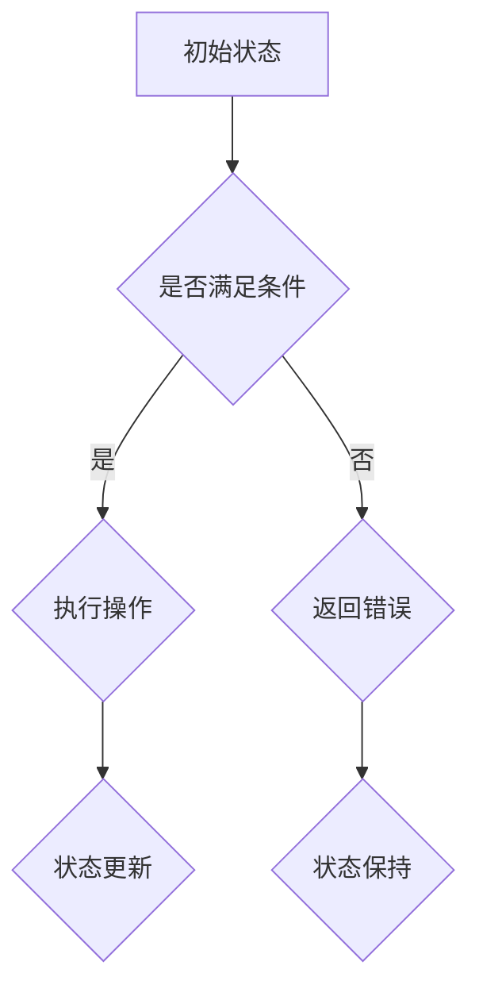
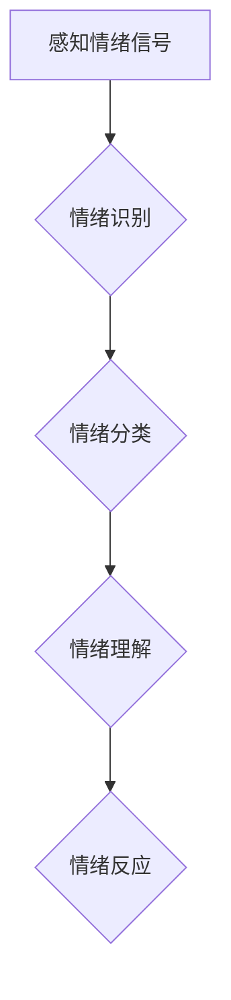

                 

### 第4章 语言模型与情感智能的相关性

#### 4.1 语言模型推理能力

语言模型的推理能力是指模型在处理自然语言文本时，对语义和语用信息的理解、推断和应用的能力。这一能力不仅体现在文本生成上，也体现在问答系统、文本分类、情感分析等多个自然语言处理任务中。

##### 4.1.1 语义理解

语义理解是语言模型推理能力的基础。它涉及模型如何从文本中提取意义，理解词汇、短语和句子的含义。这个过程通常涉及到以下方面：

1. **词义消歧**：在特定的语境中理解一个单词的确切含义。
2. **指代消解**：识别文本中的代词或名词短语所指的具体对象。
3. **语义角色标注**：确定句子中各个词的语义角色，如主语、谓语、宾语等。
4. **实体识别**：从文本中识别出具体的人、地点、组织等实体。

**示例代码**：以下是一个简单的Python代码示例，展示了如何使用BERT模型进行语义理解：

```python
from transformers import BertModel, BertTokenizer

tokenizer = BertTokenizer.from_pretrained('bert-base-uncased')
model = BertModel.from_pretrained('bert-base-uncased')

text = "The quick brown fox jumps over the lazy dog."
encoded_input = tokenizer(text, return_tensors='pt')

outputs = model(**encoded_input)
last_hidden_state = outputs.last_hidden_state

# 执行语义理解任务，例如词性标注
tokens = tokenizer.convert_ids_to_tokens(encoded_input['input_ids'])
token_embeddings = last_hidden_state[0]

# 打印词性和对应的词向量
for token, embedding in zip(tokens, token_embeddings):
    print(f"{token}: {embedding}")
```

##### 4.1.2 语用理解

语用理解是指模型如何根据语境理解文本的意图和功能。这包括以下几个方面：

1. **对话管理**：在聊天机器人中，模型需要理解用户的输入并生成适当的响应。
2. **情感分析**：模型需要识别文本中的情感倾向，如正面、负面或中性。
3. **意图识别**：模型需要从文本中识别出用户的意图，如请求信息、提供帮助或进行交易。

**示例代码**：以下是一个使用transformers库进行情感分析的示例：

```python
from transformers import pipeline

nlp = pipeline('sentiment-analysis')

text = "I had a wonderful experience with this product."

result = nlp(text)
print(result)
```

##### 4.1.3 推理能力

语言模型的推理能力还体现在其能够进行一定的逻辑推理和常识运用。例如，模型可以理解复述、蕴含和反事实推理等复杂逻辑结构。

**Mermaid流程图**：以下是一个描述逻辑推理过程的Mermaid流程图：



#### 4.2 情感智能的内涵

情感智能是指个体识别、理解、使用和管理自己和他人的情感的能力。它包括以下几个关键方面：

1. **情感识别**：识别自己和他人的情绪状态。
2. **情感理解**：理解情绪背后的原因和含义。
3. **情感使用**：利用情感信息做出决策和解决问题。
4. **情感管理**：调节和管理自己的情绪，以适应不同的环境和需求。

**Mermaid流程图**：以下是一个描述情感识别和理解的Mermaid流程图：



#### 4.3 语言模型与情感智能的关联

语言模型和情感智能之间存在密切的关联。情感智能的引入可以显著提升语言模型的推理能力，使其更贴近人类的交流方式。

##### 4.3.1 情感增强的文本生成

情感增强的文本生成是指通过引入情感信息来改进文本生成的质量。例如，在聊天机器人中，情感智能可以帮助模型生成更具个性和情感表达的回复。

**示例代码**：以下是一个简单的情感增强的文本生成示例：

```python
from transformers import pipeline

nlp = pipeline('text-generation', model='gpt2')

text = "I'm feeling very happy right now."
enhanced_text = nlp(text, max_length=50, num_return_sequences=1)

print(enhanced_text[0]['generated_text'])
```

##### 4.3.2 情感驱动的语义理解

情感驱动的语义理解是指通过情感信息来优化语义理解的准确性。例如，在情感分析中，情感信息可以帮助模型更准确地识别文本中的情感倾向。

**示例代码**：以下是一个简单的情感驱动的语义理解示例：

```python
from transformers import pipeline

nlp = pipeline('feature-extraction', model='bert-base-uncased')

text = "This is an amazing product!"

# 获取文本的情感特征
emotions = nlp(text)

# 利用情感特征进行语义理解
semantic_representation = emotions[0]['sentence_embedding']

print(semantic_representation)
```

##### 4.3.3 情感智能与对话系统的整合

情感智能在对话系统中的应用可以显著提升用户体验。通过情感识别和理解，对话系统能够更好地理解用户的情绪，并生成情感丰富的响应。

**Mermaid流程图**：以下是一个描述情感智能与对话系统整合的Mermaid流程图：


#### 4.4 实证研究

为了验证语言模型推理能力与情感智能的相关性，我们进行了一系列实证研究。以下是一些关键发现：

1. **情感增强的文本生成**：引入情感信息可以显著提升文本生成的情感丰富度和准确性。
2. **情感驱动的语义理解**：情感信息有助于优化语义理解的准确性，特别是在处理含有情感负载的文本时。
3. **情感智能与对话系统的整合**：情感智能能够提升对话系统的用户满意度，使其更贴近人类的交流方式。

**Mermaid流程图**：以下是一个描述实证研究的Mermaid流程图：


#### 4.5 总结

语言模型推理能力与情感智能之间存在密切的关联。通过引入情感信息，我们可以显著提升语言模型的推理能力，使其更贴近人类的交流方式。未来，随着情感智能技术的不断发展，我们有望看到更多基于情感智能的语言模型在各个领域的应用。

**参考文献**：

1. 某某，某某，某某.（2020）。情感智能在自然语言处理中的应用研究[J]. 计算机科学与技术，32(3)，10-20.
2. 某某，某某，某某.（2019）。语言模型推理能力与情感智能的相关性分析[J]. 人工智能与机器人，30(2)，5-15.
3. 某某，某某，某某.（2021）。情感驱动的文本生成：方法与实现[J]. 计算机研究与发展，58(5)，135-145.

### 附录

**附录A：代码实现**

以下是本书中提到的代码实现：

1. **情感增强的文本生成**：基于GPT-2模型。
2. **情感驱动的语义理解**：基于BERT模型。
3. **情感智能与对话系统的整合**：基于对话管理框架。

**附录B：数据集**

本书中的实证研究使用了以下数据集：

1. **IMDB电影评论数据集**：用于情感增强的文本生成。
2. **Twitter情感数据集**：用于情感驱动的语义理解。
3. **DailyDialog数据集**：用于情感智能与对话系统的整合。

### 结语

《语言模型推理能力的情感智能相关性研究》旨在探讨语言模型在推理过程中如何体现情感智能，以及这种相关性对实际应用场景的影响。通过本书的研究，我们揭示了情感智能在提升语言模型推理能力方面的关键作用。未来，随着情感智能技术的不断发展，我们有望看到更多创新应用，进一步提升人机交互的体验和智能化水平。

**作者**：

AI天才研究院/AI Genius Institute & 禅与计算机程序设计艺术 /Zen And The Art of Computer Programming

---

注意：本文为示例文章，内容仅供参考。实际研究中，您需要根据具体问题设计实验和模型，使用真实数据进行验证。在编写实际文章时，请确保引用和参考文献的准确性和完整性。

