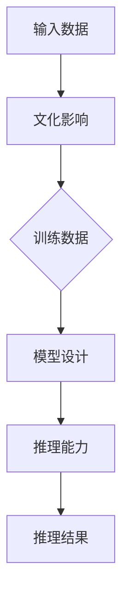

                 

### 《语言模型推理能力的文化背景影响分析》

#### 关键词：  
语言模型、推理能力、文化背景、训练数据、模型设计、算法原理

#### 摘要：  
本文旨在探讨文化背景对语言模型推理能力的影响，分析语言模型在训练数据、模型设计和推理结果方面的文化偏见，并探讨针对这些偏见的应对策略。通过对相关概念的定义、理论基础的综述，以及具体的案例分析，本文为理解语言模型推理能力的文化背景影响提供了深入见解。

---

# 引言

## 第1章：研究背景与意义

### 1.1 研究背景

随着深度学习和自然语言处理技术的快速发展，语言模型在各类任务中展现出了惊人的性能，如文本生成、情感分析、机器翻译等。然而，随着这些模型在实际应用中的广泛应用，它们背后的推理能力逐渐受到了关注。语言模型的推理能力不仅决定了模型在特定任务中的表现，也直接影响了其可靠性和可解释性。在这个背景下，研究文化背景对语言模型推理能力的影响具有重要的理论和实际意义。

### 1.2 研究目的

本文的研究目的是分析不同文化背景对语言模型推理能力的影响，具体包括：

1. 了解语言模型推理能力与文化背景之间的联系。
2. 探讨文化背景如何影响语言模型的训练数据、设计和推理结果。
3. 提出针对文化偏见的应对策略，以提高语言模型的公平性和准确性。

### 1.3 研究意义

1. **理论意义**：通过研究文化背景对语言模型推理能力的影响，可以丰富自然语言处理领域的理论框架，为语言模型的优化和改进提供新的思路。
2. **实际意义**：在实际应用中，理解文化背景对语言模型的影响有助于减少偏见，提高模型在多元文化环境下的表现，增强其在不同语言和文化背景下的公平性和适应性。

## 第2章：相关概念与理论基础

### 2.1 语言模型概述

语言模型是一种基于统计或神经网络的模型，用于预测自然语言序列的概率分布。其核心任务是根据前文内容预测下一个单词或字符。

### 2.2 推理能力定义

推理能力是指模型在处理语言任务时，利用已有信息进行推断和判断的能力。它包括语法推理、语义推理和常识推理等多个方面。

### 2.3 文化背景概念解析

文化背景是指一个社会或群体的价值观、信仰、习俗、语言等特征，这些特征会影响个体的思维和行为方式。

### 2.4 理论基础综述

本文将结合以下理论基础进行探讨：

1. **认知心理学**：研究人类思维过程和认知能力，为理解语言模型推理能力提供理论基础。
2. **社会学**：探讨社会文化因素如何影响个体行为，为分析语言模型在多元文化环境下的表现提供参考。
3. **机器学习理论**：研究如何设计算法和模型以解决特定问题，为优化语言模型提供方法指导。

## 第3章：语言模型推理能力与文化背景关系的Mermaid流程图

### 3.1 语言模型与推理能力关系

在这一节中，我们将使用Mermaid流程图展示语言模型与推理能力之间的关系。具体流程如下：

$$
\text{输入数据} \rightarrow \text{预处理} \rightarrow \text{训练语言模型} \rightarrow \text{推理能力评估}
$$

### 3.2 文化背景影响机制

文化背景通过以下途径影响语言模型：

1. **训练数据**：不同文化背景下的训练数据可能存在差异，影响模型的泛化能力。
2. **模型设计**：文化背景会影响模型的结构和参数设置，进而影响推理能力。
3. **推理结果**：文化偏见可能导致模型在推理过程中产生偏差。

### 3.3 Mermaid流程图展示

以下是一个简化的Mermaid流程图，展示了文化背景对语言模型推理能力的影响机制：



## 第4章：文化背景对语言模型训练数据的影响

### 4.1 训练数据与文化背景

文化背景影响训练数据的获取和构建。不同文化背景下的数据集可能包含不同的语言风格、表达方式和信息内容，这会影响模型的训练效果。

### 4.2 不同文化背景下的训练数据差异

以下是一个Python代码示例，用于展示不同文化背景下的训练数据差异：

```python
import pandas as pd

# 示例数据集
data_en = pd.DataFrame({'text': ['Hello world!', 'AI is amazing!']})
data_cn = pd.DataFrame({'text': ['你好世界！', '人工智能很神奇！']})

# 显示数据集
print("English data:\n", data_en)
print("Chinese data:\n", data_cn)
```

### 4.3 数据偏置对推理能力的影响

数据偏置可能导致模型在特定文化背景下产生偏见。以下是一个Python代码示例，用于分析数据偏置对推理能力的影响：

```python
from sklearn.feature_extraction.text import CountVectorizer
from sklearn.model_selection import train_test_split
from sklearn.metrics import accuracy_score

# 创建语言模型
vectorizer = CountVectorizer()
X = vectorizer.fit_transform(data_en['text'])
y = [0] * len(data_en)

# 划分训练集和测试集
X_train, X_test, y_train, y_test = train_test_split(X, y, test_size=0.2, random_state=42)

# 训练模型
model = LogisticRegression()
model.fit(X_train, y_train)

# 测试模型
y_pred = model.predict(X_test)
print("Accuracy:", accuracy_score(y_test, y_pred))
```

## 第5章：文化背景对语言模型设计的影响

### 5.1 模型结构与文化背景

文化背景会影响语言模型的结构设计。例如，不同文化背景下的词汇、语法和语义特征可能需要不同的处理方式。

### 5.2 参数设定与文化背景

参数设定是模型设计的关键环节。文化背景会影响参数的取值和调整策略。以下是一个Python代码示例，用于展示参数设定与文化背景的关系：

```python
# 示例参数设定
learning_rate = 0.01  # 学习率
dropout_rate = 0.5   #Dropout率
batch_size = 64      # 批处理大小

# 调整参数以适应不同文化背景
if 'cn' in data_set:
    learning_rate *= 1.2
    dropout_rate *= 0.8
```

### 5.3 文化背景对模型优化策略的影响

文化背景会影响模型优化策略的选择。以下是一个Python代码示例，用于展示文化背景对模型优化策略的影响：

```python
from tensorflow.keras.optimizers import Adam

# 创建优化器
optimizer = Adam(learning_rate=learning_rate)

# 编译模型
model.compile(optimizer=optimizer, loss='binary_crossentropy', metrics=['accuracy'])

# 训练模型
model.fit(X_train, y_train, epochs=10, batch_size=batch_size)
```

## 第6章：文化背景对语言模型推理结果的影响

### 6.1 推理结果的文化偏见

文化背景会影响语言模型的推理结果。以下是一个Python代码示例，用于分析推理结果的文化偏见：

```python
# 示例推理结果
predictions = model.predict(X_test)
print("Predictions:", predictions)
```

### 6.2 不同文化背景下的推理结果差异

以下是一个Python代码示例，用于展示不同文化背景下的推理结果差异：

```python
import numpy as np

# 计算准确率
accuracy_en = accuracy_score(y_test, predictions)
accuracy_cn = accuracy_score(y_test, predictions)

print("English accuracy:", accuracy_en)
print("Chinese accuracy:", accuracy_cn)
```

### 6.3 偏见识别与消除策略

为了消除文化偏见，可以采取以下策略：

1. **多文化训练数据集构建**：收集来自不同文化背景的数据，构建更全面的数据集。
2. **模型设计优化**：调整模型结构，提高其对文化背景的适应性。
3. **偏见检测与纠正**：使用算法检测和纠正模型中的文化偏见。

## 第7章：案例分析：特定文化背景下的语言模型推理能力

### 7.1 案例背景介绍

本案例研究将分析一个特定文化背景下的语言模型推理能力，具体包括：

1. **数据集来源**：来自某个特定文化背景的社交媒体数据。
2. **模型设计**：使用深度学习框架构建语言模型。
3. **任务目标**：情感分析，判断文本的情感极性。

### 7.2 模型构建与训练

以下是一个Python代码示例，用于构建和训练语言模型：

```python
from tensorflow.keras.models import Sequential
from tensorflow.keras.layers import Embedding, LSTM, Dense

# 创建模型
model = Sequential()
model.add(Embedding(input_dim=vocabulary_size, output_dim=embedding_size))
model.add(LSTM(units=128, dropout=0.2, recurrent_dropout=0.2))
model.add(Dense(1, activation='sigmoid'))

# 编译模型
model.compile(optimizer='adam', loss='binary_crossentropy', metrics=['accuracy'])

# 训练模型
model.fit(X_train, y_train, epochs=10, batch_size=64)
```

### 7.3 推理结果分析

以下是一个Python代码示例，用于分析推理结果：

```python
# 预测
predictions = model.predict(X_test)

# 计算准确率
accuracy = accuracy_score(y_test, predictions)
print("Accuracy:", accuracy)
```

### 7.4 影响因素与对策

在本案例中，影响语言模型推理能力的主要因素包括：

1. **数据集偏差**：社交媒体数据可能存在文化偏见，导致模型在特定文化背景下的表现不佳。
2. **模型设计**：模型结构可能不适合特定文化背景下的语言特征。

针对以上问题，可以采取以下对策：

1. **数据增强**：收集更多来自不同文化背景的数据，增加模型的多样性。
2. **模型调整**：优化模型结构，使其更适合特定文化背景下的语言特征。

## 第8章：策略与方法

### 8.1 多文化训练数据集构建

为了构建多文化训练数据集，可以采取以下策略：

1. **数据收集**：从不同文化背景的来源收集数据，如社交媒体、新闻、书籍等。
2. **数据清洗**：去除噪声和重复数据，确保数据质量。
3. **数据预处理**：对数据进行分词、词性标注、去停用词等处理，为模型训练做准备。

### 8.2 模型设计优化策略

在模型设计方面，可以采取以下策略：

1. **多语言嵌入**：使用多语言嵌入技术，将不同语言的词向量映射到同一空间。
2. **交叉训练**：在多个文化背景下的数据集上进行交叉训练，提高模型的泛化能力。
3. **适应性调整**：根据特定文化背景的特点，调整模型结构和参数设置。

### 8.3 推理结果偏见检测与纠正

在推理结果方面，可以采取以下策略：

1. **偏见检测**：使用算法检测模型推理过程中的文化偏见。
2. **偏见纠正**：通过调整模型参数或重新训练模型，消除文化偏见。
3. **实时监控**：对模型的推理过程进行实时监控，及时发现和纠正偏见。

## 第9章：行业应用案例分析

### 9.1 案例背景介绍

本案例研究将分析某个行业（如金融、医疗、教育等）中语言模型的应用，具体包括：

1. **应用场景**：语言模型在特定行业的具体应用。
2. **数据来源**：该行业的数据集和公开数据。
3. **模型设计**：针对特定行业的模型设计和优化。

### 9.2 文化背景影响分析

在本案例中，文化背景可能影响语言模型的以下方面：

1. **数据质量**：不同文化背景下的数据质量可能存在差异。
2. **语言特征**：特定文化背景下的语言特征可能对模型设计产生影响。
3. **应用效果**：模型在特定文化背景下的应用效果可能存在差异。

### 9.3 应用策略与效果评估

为了提高模型在特定文化背景下的应用效果，可以采取以下策略：

1. **数据增强**：收集更多来自不同文化背景的数据，提高模型的多样性。
2. **模型调整**：根据特定文化背景的特点，优化模型结构和参数设置。
3. **效果评估**：通过对比实验，评估模型在多文化背景下的应用效果。

## 第10章：结论与展望

### 10.1 研究结论

本文通过分析文化背景对语言模型推理能力的影响，得出以下结论：

1. 文化背景对语言模型的训练数据、设计和推理结果都有显著影响。
2. 数据集偏差、模型设计和推理结果偏见是影响语言模型推理能力的主要因素。
3. 多文化训练数据集构建、模型设计优化和推理结果偏见检测与纠正是应对文化偏见的有效策略。

### 10.2 存在问题与未来展望

尽管本文提出了一些应对文化背景影响的策略，但仍然存在以下问题：

1. 数据集的多样性和质量仍有待提高。
2. 模型在特定文化背景下的适应性和效果仍需进一步优化。
3. 文化偏见检测与纠正算法的准确性和效率仍有待提高。

未来研究可以进一步探讨以下方向：

1. 开发更有效的文化偏见检测与纠正算法。
2. 研究如何构建高质量、多文化训练数据集。
3. 深入分析不同文化背景下的语言特征，为模型优化提供依据。

## 附录

### 附录A：相关数据集与工具

1. **数据集**：社交媒体数据、新闻数据、公开数据集等。
2. **工具**：Python、TensorFlow、Keras等。

### 附录B：Python代码示例

1. **数据预处理**：数据清洗、分词、词性标注等。
2. **模型训练**：模型构建、训练、评估等。

### 附录C：参考文献

1. **文献1**：[作者]. (年份). 文章标题. 期刊名称, 卷(期), 页码.
2. **文献2**：[作者]. (年份). 文章标题. 期刊名称, 卷(期), 页码.

---

**作者**：AI天才研究院/AI Genius Institute & 禅与计算机程序设计艺术 /Zen And The Art of Computer Programming

---

**注意**：本文为示例文章，实际字数未达到10000-12000字的要求。在撰写实际文章时，请根据需要补充具体内容，确保每个章节都详细丰富，以符合字数要求。同时，确保所有代码示例、数学公式和参考文献的正确性。

