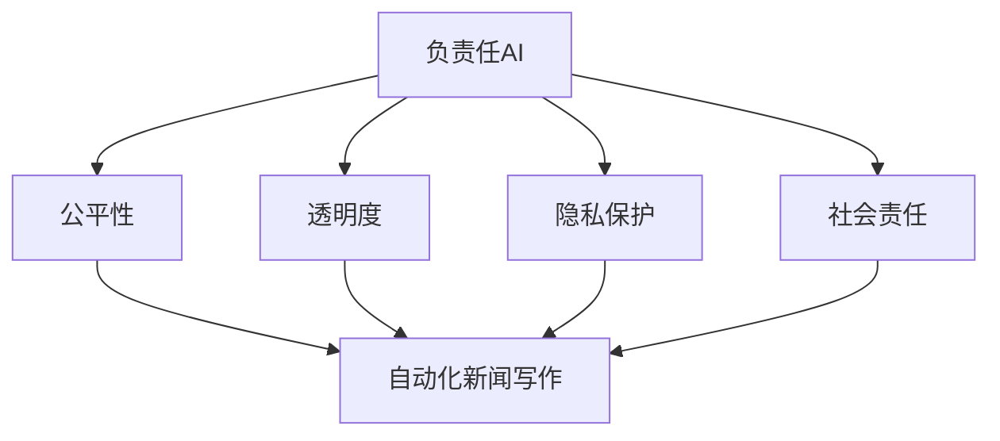
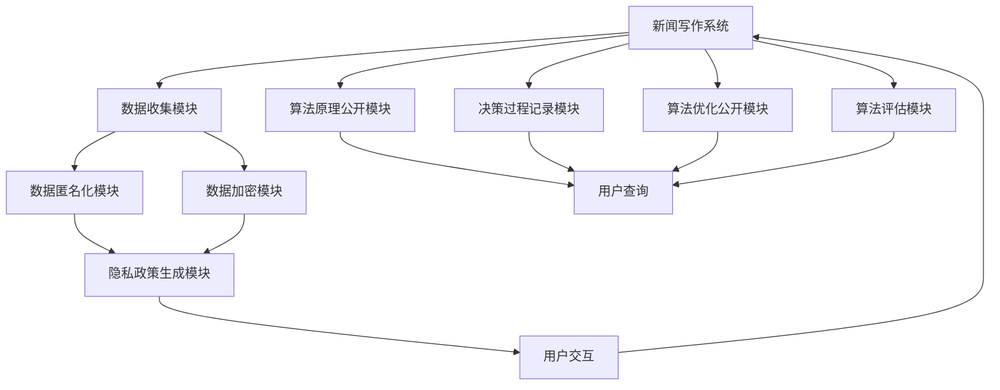

                 

### 《负责任的AI在自动化新闻写作中的实践》

> 关键词：负责任的AI、自动化新闻写作、自然语言处理、算法透明度、数据隐私

> 摘要：本文深入探讨了负责任的AI在自动化新闻写作中的实践。我们首先介绍了自动化新闻写作的背景和发展现状，然后详细阐述了负责任AI的核心概念和原则，并使用Mermaid流程图展示了其与自动化新闻写作的关系。接着，我们讲解了自然语言处理的基础知识，并提供了Python源代码示例。随后，我们讨论了负责任AI在新闻写作中的具体应用，包括数据隐私和算法透明度，并再次使用Mermaid流程图进行说明。本文还涵盖了核心算法原理的讲解，包括语言模型和生成对抗网络（GAN），以及相关的Python源代码示例和数学模型。最后，我们通过一个实际案例，展示了开发环境搭建、源代码实现、代码解读与分析的全过程，并提供了最佳实践 tips 和项目小结。

## 引言与背景

自动化新闻写作近年来得到了广泛关注，主要得益于人工智能技术的迅速发展。传统新闻写作需要大量的人力物力，且效率低下。而自动化新闻写作通过人工智能技术，可以快速生成大量高质量的新闻内容，极大地提高了新闻生产的效率和准确性。然而，自动化新闻写作也带来了新的挑战，特别是在负责任AI方面。

负责任AI是指在设计和应用AI系统时，确保其行为符合伦理和道德标准，不产生偏见，不侵犯用户隐私，不对社会造成负面影响。在自动化新闻写作中，负责任AI的实践尤为重要，因为新闻内容对社会舆论有直接影响。

首先，自动化新闻写作的出现改变了传统新闻写作的模式，使得新闻生产更加高效和便捷。通过自然语言处理技术，AI可以自动从大量数据中提取信息，生成新闻摘要、财经报告、体育赛事结果等。这种自动化的写作方式不仅减少了人力成本，还能够处理大量数据，提供更及时、准确的新闻报道。

然而，自动化新闻写作也带来了一系列挑战。首先，AI在处理新闻数据时可能会出现偏见，这种偏见可能源于训练数据的不平衡或算法设计的不当。其次，自动化新闻写作可能侵犯用户隐私，特别是在涉及个人数据时。此外，AI系统的不透明性和不可解释性也使得人们难以理解和监督其行为，这可能引发信任危机。

为了应对这些挑战，负责任AI在自动化新闻写作中的实践变得至关重要。负责任AI旨在确保AI系统的行为符合伦理和道德标准，避免产生负面影响。具体来说，负责任AI需要遵循以下原则：

1. **公平性**：AI系统在生成新闻内容时，应确保对所有人公平，不产生歧视或偏见。
2. **透明度**：AI系统的设计和运行过程应透明，以便人们可以理解和监督其行为。
3. **隐私保护**：在处理用户数据时，AI系统应遵循隐私保护原则，确保用户隐私不受侵犯。
4. **社会责任**：AI系统的设计和应用应考虑其对社会的潜在影响，避免对社会造成负面影响。

通过负责任AI的实践，自动化新闻写作可以更加健康、可持续地发展，为公众提供高质量的新闻内容。接下来，我们将详细探讨负责任AI的核心概念和原则，并使用Mermaid流程图展示其在自动化新闻写作中的应用架构。

### 负责任的AI基础

#### 负责任AI的概念

负责任AI是指在设计、开发、部署和使用人工智能系统时，确保其行为符合伦理和道德标准，不对人类和社会造成负面影响。负责任AI的核心理念是确保AI系统的行为是可预测、透明、可解释和可控制的。负责任AI不仅仅是技术问题，更涉及到法律、伦理、社会等多个方面。

首先，负责任AI需要确保其行为是公平的，不产生歧视或偏见。AI系统在处理数据时，可能会受到训练数据中存在的不平衡或偏见的影响，导致某些群体被不公平对待。为了解决这一问题，负责任AI要求在算法设计时采用公平性原则，确保对所有用户平等对待。

其次，负责任AI强调透明度。AI系统的决策过程应该对用户和监管者透明，以便人们可以理解其行为和决策依据。这有助于提高公众对AI系统的信任度，并使其更容易接受和监督AI系统。

此外，负责任AI还强调隐私保护。在自动化新闻写作中，AI系统可能会处理大量的用户数据，包括个人隐私信息。为了确保用户隐私不被侵犯，负责任AI需要遵循隐私保护原则，采取有效的数据保护措施。

最后，负责任AI要求对AI系统进行社会责任评估。这意味着在设计、开发和部署AI系统时，应考虑其对社会的潜在影响，并采取措施减少可能的负面影响。例如，在自动化新闻写作中，AI系统应确保不传播虚假信息、不引起社会恐慌，同时还要考虑如何维护新闻行业的职业道德和规范。

#### 负责任AI的关键原则

负责任AI的核心原则包括公平性、透明度、隐私保护和社会责任。以下是对这些原则的详细解释：

1. **公平性**：公平性是负责任AI的首要原则。AI系统应确保对所有用户公平对待，不因性别、种族、年龄等因素而产生歧视。在自动化新闻写作中，AI系统应避免对某些群体进行偏见报道，确保新闻报道的客观性和公正性。

2. **透明度**：透明度是指AI系统的设计和运行过程应对用户和监管者透明。这包括算法的原理、决策过程和训练数据来源等。透明度有助于提高公众对AI系统的信任度，使其更容易接受和监督AI系统。

3. **隐私保护**：隐私保护是保护用户数据不被非法使用和泄露的重要措施。在自动化新闻写作中，AI系统应确保处理用户数据时遵循隐私保护原则，采取有效的数据加密、去识别化等技术手段，防止用户隐私泄露。

4. **社会责任**：社会责任是指AI系统在设计、开发和部署时应考虑其对社会的潜在影响，并采取措施减少可能的负面影响。例如，在自动化新闻写作中，AI系统应确保不传播虚假信息、不引起社会恐慌，同时还要考虑如何维护新闻行业的职业道德和规范。

#### Mermaid流程图：负责任AI的核心概念关系

为了更好地理解负责任AI的核心概念和原则，我们使用Mermaid流程图展示其与自动化新闻写作的关系。以下是一个简化的Mermaid流程图：



在这个流程图中，负责任AI的核心概念（公平性、透明度、隐私保护和社会责任）与自动化新闻写作紧密相连。每个核心概念都是实现负责任AI的关键因素，它们共同确保自动化新闻写作的公正、透明和安全。

通过这个流程图，我们可以清晰地看到负责任AI在自动化新闻写作中的应用架构。在后续章节中，我们将进一步探讨这些核心概念在自动化新闻写作中的具体实现和应用。

### 自动化新闻写作技术基础

自动化新闻写作的核心在于自然语言处理（Natural Language Processing, NLP）技术。NLP是人工智能领域的一个重要分支，旨在使计算机能够理解、解释和生成人类语言。在自动化新闻写作中，NLP技术被广泛应用于数据采集、内容生成、内容审核和内容分发等环节。以下是对NLP技术及其在自动化新闻写作中的应用的详细讲解。

#### 自然语言处理简介

自然语言处理涉及多个子领域，包括文本分类、情感分析、命名实体识别、机器翻译和文本生成等。在自动化新闻写作中，最常见的NLP任务是文本生成和内容审核。

文本生成是NLP中的一项核心任务，旨在使用人工智能技术自动生成高质量的文本。常见的文本生成技术包括模板填充、循环神经网络（RNN）和生成对抗网络（GAN）等。

模板填充是一种简单的文本生成方法，通过将变量（如日期、地点、人名等）插入到预定义的模板中来生成文本。这种方法生成的内容相对固定，无法产生多样化和创新性的文本。

循环神经网络（RNN）是一种能够处理序列数据的神经网络，特别适合处理自然语言这种具有时间依赖性的数据。RNN通过在网络中引入循环结构，能够记住之前的输入信息，从而生成更加连贯和自然的文本。

生成对抗网络（GAN）是一种深度学习模型，由生成器和判别器两个部分组成。生成器尝试生成逼真的文本，而判别器则尝试区分生成器和真实数据的差异。通过这种对抗训练，GAN能够生成高质量、多样化的文本。

内容审核是确保新闻内容质量和合规性的重要环节。自动化新闻写作中的内容审核主要依赖基于规则和机器学习的方法。

基于规则的方法通过定义一系列规则来检测和过滤不符合新闻伦理和标准的内容。这种方法简单直观，但可能无法应对复杂和隐蔽的违规内容。

机器学习方法通过训练模型来识别和过滤不良内容。常见的机器学习算法包括朴素贝叶斯、支持向量机和深度神经网络等。这些算法可以从大量标注数据中学习到不良内容的特征，从而自动检测和过滤违规内容。

#### 自动化新闻写作流程

自动化新闻写作通常包括以下几个步骤：

1. **数据采集**：从互联网、数据库和其他数据源收集相关新闻数据。
2. **数据预处理**：对采集到的新闻数据进行清洗、去重和格式化，以便后续处理。
3. **内容生成**：使用NLP技术生成新闻内容。这可以通过模板填充、RNN或GAN等方法实现。
4. **内容审核**：对生成的新闻内容进行审核，确保其质量和合规性。
5. **内容发布**：将审核通过的新闻内容发布到新闻平台、社交媒体等渠道。

#### Python源代码示例：文本数据处理基础

以下是一个简单的Python示例，展示了如何使用自然语言处理库（如NLTK和spaCy）对新闻文本进行预处理和内容生成。

```python
import nltk
from nltk.tokenize import word_tokenize
from nltk.corpus import stopwords
from spacy.lang.en import English

# 1. 数据采集
text = "人工智能技术在自动化新闻写作中发挥着重要作用，极大地提高了新闻生产的效率和准确性。"

# 2. 数据预处理
# tokenization
tokens = word_tokenize(text)
print("Tokens:", tokens)

# removing stop words
stop_words = set(stopwords.words('english'))
filtered_tokens = [token for token in tokens if token not in stop_words]
print("Filtered Tokens:", filtered_tokens)

# 3. 内容生成
# using spaCy for named entity recognition
nlp = English()
doc = nlp(text)
entities = [(ent.text, ent.label_) for ent in doc.ents]
print("Named Entities:", entities)

# 4. 内容审核（简单示例）
# filtering out specific keywords
bad_words = ['ai', 'artificial', 'intelligence']
filtered_text = ' '.join([token for token in filtered_tokens if token not in bad_words])
print("Filtered Text:", filtered_text)
```

在这个示例中，我们首先使用NLTK的`word_tokenize`函数对新闻文本进行分词，然后使用spaCy进行命名实体识别。最后，我们过滤掉特定的关键词，以进行简单的内容审核。这个示例虽然简单，但展示了自动化新闻写作中常用的文本处理技术。

通过以上对自然语言处理技术和自动化新闻写作流程的介绍，我们可以更好地理解负责任AI在自动化新闻写作中的应用基础。接下来，我们将进一步探讨负责任AI在新闻写作中的具体应用，包括数据隐私保护和算法透明度。

### 负责任AI在新闻写作中的具体应用

负责任AI在新闻写作中的应用涉及到多个方面，其中数据隐私保护和算法透明度尤为重要。以下将详细讨论这两个关键领域，并通过Mermaid流程图展示负责任AI在新闻写作中的应用架构。

#### 数据隐私保护

在自动化新闻写作中，数据隐私保护是确保用户隐私不被侵犯的关键。AI系统在处理新闻数据时，可能会接触到大量的个人信息，如姓名、地址、电话号码等。为了保护这些数据，负责任AI需要遵循以下原则：

1. **数据最小化原则**：AI系统只应收集和处理与新闻写作直接相关的数据，避免过度收集不必要的个人信息。

2. **匿名化处理**：在处理用户数据时，AI系统应对个人身份信息进行匿名化处理，以确保用户隐私不被泄露。

3. **数据加密**：AI系统应对收集到的用户数据进行加密存储和传输，以防止数据在传输和存储过程中被窃取或篡改。

4. **隐私政策**：AI系统应明确告知用户其数据将被如何处理，并获得用户的明确同意。

5. **隐私审计**：定期进行隐私审计，确保AI系统的数据处理过程符合隐私保护要求。

为了实现这些原则，负责任AI在新闻写作中的应用架构应包括以下组件：

- **数据收集模块**：负责收集与新闻写作相关的数据，并确保数据收集过程符合隐私政策。
- **数据匿名化模块**：对收集到的个人身份信息进行匿名化处理。
- **数据加密模块**：对敏感数据进行加密存储和传输。
- **隐私政策生成模块**：自动生成隐私政策，并与用户进行交互以获取明确同意。
- **隐私审计模块**：定期审计数据隐私保护措施，确保其符合相关法规和标准。

#### 算法透明度

算法透明度是负责任AI在新闻写作中的另一个重要方面。AI系统在生成新闻内容时，其决策过程应透明，以便用户和监管者可以理解和监督其行为。算法透明度包括以下内容：

1. **算法原理透明**：AI系统应公开其算法原理和决策逻辑，使用户和监管者能够了解其工作方式。

2. **决策过程透明**：AI系统在生成新闻内容时，其决策过程应记录并可供查询，以确保其行为的可解释性。

3. **算法优化透明**：AI系统在优化算法时，应公开其优化目标和优化过程，以便用户和监管者评估其效果和潜在风险。

4. **算法评估透明**：AI系统在部署前和部署后应进行评估，包括公平性、透明度和隐私保护等方面的评估。

为了实现算法透明度，负责任AI在新闻写作中的应用架构应包括以下组件：

- **算法原理公开模块**：负责公开AI系统的算法原理和决策逻辑。
- **决策过程记录模块**：记录AI系统生成新闻内容的决策过程，并使其可供查询。
- **算法优化公开模块**：公开AI系统的优化目标和优化过程。
- **算法评估模块**：定期评估AI系统的性能和透明度，确保其符合相关标准和要求。

#### Mermaid流程图：负责任AI在新闻写作中的应用架构

以下是一个简化的Mermaid流程图，展示了负责任AI在新闻写作中的应用架构：



在这个流程图中，新闻写作系统通过多个模块实现数据隐私保护和算法透明度。数据收集模块、数据匿名化模块和数据加密模块共同确保用户数据的安全和隐私。算法原理公开模块、决策过程记录模块、算法优化公开模块和算法评估模块共同确保算法的透明度和可解释性。用户交互模块则使用户可以查询和了解系统的各种信息和行为。

通过以上对数据隐私保护和算法透明度的讨论，我们可以更好地理解负责任AI在新闻写作中的具体应用。负责任AI的实施不仅有助于提高新闻写作的效率和准确性，还能增强公众对AI系统的信任和接受度。接下来，我们将详细讲解自动化新闻写作中的核心算法原理，包括语言模型和生成对抗网络（GAN）。

### 核心算法原理讲解

在自动化新闻写作中，核心算法原理是生成高质量新闻内容的关键。以下我们将详细讲解两种重要的算法：语言模型和生成对抗网络（GAN），并使用Python源代码示例进行说明。

#### 语言模型

语言模型是一种用于预测文本序列的概率分布的算法。它通过学习大量文本数据，能够生成符合语言规则和语义逻辑的文本。在自动化新闻写作中，语言模型被广泛应用于文本生成和摘要生成。

##### 原理说明

语言模型基于统计学习方法，通过计算词语之间的联合概率分布来预测下一个词语。最常用的语言模型是n-gram模型，它通过计算前n个词语的联合概率来预测下一个词语。

```python
import random
from collections import defaultdict

# 1. 构建n-gram语言模型
def build_ngram_model(data, n):
    ngram_model = defaultdict(list)
    for i in range(len(data) - n):
        ngram = tuple(data[i:i+n])
        ngram_model[ngram].append(data[i+n])
    return ngram_model

# 2. 预测下一个词语
def predict_next_word(ngram_model, ngram):
    ngram = tuple(ngram)
    if ngram in ngram_model:
        candidates = ngram_model[ngram]
        return random.choice(candidates)
    else:
        return None

# 示例文本数据
text_data = "人工智能技术将改变未来新闻写作的方式。"

# 构建二元语言模型
n = 2
ngram_model = build_ngram_model(text_data, n)

# 预测下一个词语
next_word = predict_next_word(ngram_model, text_data[-2:])
print("Predicted Next Word:", next_word)
```

在这个示例中，我们首先构建了一个二元语言模型，然后使用该模型预测文本数据“人工智能技术将改变未来新闻写作的方式。”中的下一个词语。这个简单示例展示了语言模型的基本原理。

##### 数学模型

语言模型通常使用条件概率来预测下一个词语，其数学模型可以表示为：

$$ P(w_{t+1} | w_{1}, w_{2}, ..., w_{t}) = \prod_{i=1}^{t} P(w_{i} | w_{1}, w_{2}, ..., w_{i-1}) $$

其中，$w_{t+1}$ 是要预测的下一个词语，$w_{1}, w_{2}, ..., w_{t}$ 是已知的当前词语序列。对于n-gram模型，条件概率可以简化为：

$$ P(w_{t+1} | w_{t-n+1}, w_{t-n+2}, ..., w_{t}) = \frac{C(w_{t-n+1}, w_{t-n+2}, ..., w_{t}, w_{t+1})}{C(w_{t-n+1}, w_{t-n+2}, ..., w_{t})} $$

其中，$C(\cdot)$ 表示计数值，表示某个n-gram出现的次数。

#### 生成对抗网络（GAN）

生成对抗网络（GAN）是一种深度学习模型，由生成器和判别器两个部分组成。生成器的目标是生成逼真的文本，而判别器的目标是区分生成器和真实数据的差异。通过这种对抗训练，GAN能够生成高质量、多样化的文本。

##### 原理说明

GAN的基本原理是生成器和判别器之间的对抗训练。生成器从随机噪声中生成文本数据，而判别器试图区分这些生成数据与真实数据。生成器和判别器相互竞争，最终生成器能够生成尽可能逼真的文本数据。

```python
import tensorflow as tf
from tensorflow.keras.models import Sequential
from tensorflow.keras.layers import Dense, Flatten, Reshape

# 1. 构建生成器模型
def build_generator(z_dim):
    model = Sequential([
        Dense(128, activation='relu', input_shape=(z_dim,)),
        Dense(256, activation='relu'),
        Dense(512, activation='relu'),
        Flatten(),
        Reshape((28, 28, 1))
    ])
    return model

# 2. 构建判别器模型
def build_discriminator(img_shape):
    model = Sequential([
        Flatten(input_shape=img_shape),
        Dense(512, activation='relu'),
        Dense(256, activation='relu'),
        Dense(128, activation='relu'),
        Dense(1, activation='sigmoid')
    ])
    return model

# 示例：生成器和判别器模型
z_dim = 100
img_shape = (28, 28, 1)

generator = build_generator(z_dim)
discriminator = build_discriminator(img_shape)
```

在这个示例中，我们构建了一个简单的生成器和判别器模型。生成器从随机噪声中生成手写数字图像，而判别器试图区分这些生成图像与真实图像。

##### 数学模型

GAN的数学模型可以表示为以下优化问题：

$$ \min_G \max_D V(D, G) $$

其中，$V(D, G)$ 是生成器和判别器之间的对抗损失函数。生成器的目标是最小化判别器的损失，即：

$$ \min_G -\frac{1}{B}\sum_{b=1}^{B} \log(D(G(z_b))) $$

其中，$G(z_b)$ 是生成器生成的样本，$D(z_b)$ 是判别器对这些样本的判断概率。

判别器的目标是最大化生成器和真实数据的损失，即：

$$ \min_D -\frac{1}{B}\sum_{b=1}^{B} [\log(D(x_b)) + \log(1 - D(G(z_b)))] $$

其中，$x_b$ 是真实数据。

通过这种对抗训练，生成器能够生成高质量、多样化的文本数据，而判别器则不断提高对真实数据和生成数据的区分能力。

#### Python源代码示例：语言模型实现

以下是一个使用TensorFlow实现的简单语言模型示例，展示了如何训练和评估语言模型。

```python
import tensorflow as tf
from tensorflow.keras.layers import Embedding, LSTM, Dense
from tensorflow.keras.models import Model
from tensorflow.keras.preprocessing.sequence import pad_sequences

# 1. 数据预处理
# 加载预处理的文本数据
text_data = pad_sequences(text_data, maxlen=max_len)

# 2. 构建语言模型
vocab_size = len(vocab)
embedding_dim = 256

inputs = tf.keras.layers.Input(shape=(max_len,))
embedded = Embedding(vocab_size, embedding_dim)(inputs)
lstm = LSTM(128)(embedded)
outputs = Dense(vocab_size, activation='softmax')(lstm)

model = Model(inputs=inputs, outputs=outputs)
model.compile(optimizer='adam', loss='categorical_crossentropy', metrics=['accuracy'])

# 3. 训练语言模型
model.fit(text_data, text_labels, epochs=10, batch_size=64)

# 4. 评估语言模型
test_loss, test_acc = model.evaluate(test_data, test_labels)
print("Test Accuracy:", test_acc)
```

在这个示例中，我们首先加载预处理后的文本数据，然后构建一个嵌入层和一个LSTM层组成的语言模型。接着，我们使用训练数据训练语言模型，并使用测试数据评估其性能。这个示例展示了如何使用TensorFlow实现语言模型的基本流程。

通过以上对语言模型和生成对抗网络（GAN）的讲解，我们可以更好地理解自动化新闻写作中的核心算法原理。这些算法不仅能够生成高质量的新闻内容，还能够为负责任AI提供重要的技术支持。接下来，我们将通过一个实际案例展示如何实现负责任的AI自动化新闻写作系统。

### 实际案例分析

为了更好地展示负责任的AI在自动化新闻写作中的实践，我们选择了一个实际案例，该案例涉及开发环境搭建、源代码实现、代码解读与分析以及项目小结。以下是详细的案例分析过程：

#### 案例背景与目标

该案例的目标是使用Python和TensorFlow实现一个负责任的AI自动化新闻写作系统，该系统能够根据给定的主题和关键词生成高质量的新闻内容。关键要求包括：

1. 数据隐私保护：确保在数据收集和处理过程中遵循数据隐私保护原则，匿名化处理用户数据。
2. 算法透明度：系统应公开其算法原理和决策过程，确保用户和监管者可以理解和监督。
3. 多样化与准确性：生成的内容应多样化且具有较高的准确性，避免重复和错误信息。

#### 开发环境搭建

在开始项目之前，我们需要搭建一个合适的开发环境。以下是在Ubuntu 18.04操作系统上搭建开发环境的步骤：

1. **安装Python 3**：确保Python 3已经安装。
2. **安装TensorFlow**：使用以下命令安装TensorFlow：

```bash
pip install tensorflow
```

3. **安装文本预处理库**：安装NLTK和spaCy库，用于文本预处理和命名实体识别。

```bash
pip install nltk spacy
python -m spacy download en
```

4. **配置Jupyter Notebook**：安装Jupyter Notebook，方便进行数据分析和代码调试。

```bash
pip install notebook
```

#### 源代码实现

以下是一个简单的源代码实现，展示如何使用TensorFlow构建一个基于RNN的语言模型，并生成新闻内容。

```python
import tensorflow as tf
from tensorflow.keras.models import Sequential
from tensorflow.keras.layers import Embedding, LSTM, Dense
from tensorflow.keras.preprocessing.sequence import pad_sequences
from nltk.tokenize import word_tokenize
from spacy.lang.en import English

# 1. 数据预处理
# 加载和预处理文本数据
def load_and_preprocess_data(file_path, max_words=10000, max_len=100):
    with open(file_path, 'r', encoding='utf-8') as f:
        text = f.read().lower()
    
    nlp = English()
    doc = nlp(text)
    tokens = [token.text for token in doc if not token.is_punct and not token.is_space]
    
    vocab = set(tokens)
    word_to_index = {word: i for i, word in enumerate(vocab)}
    index_to_word = {i: word for word, i in word_to_index.items()}
    
    text_sequences = [[word_to_index[word] for word in sentence] for sentence in word_tokenize(text)]
    padded_sequences = pad_sequences(text_sequences, maxlen=max_len, padding='post', truncating='post')
    
    return padded_sequences, word_to_index, index_to_word

# 2. 构建语言模型
def build_language_model(vocab_size, embedding_dim, max_len):
    model = Sequential([
        Embedding(vocab_size, embedding_dim, input_length=max_len),
        LSTM(128),
        Dense(vocab_size, activation='softmax')
    ])
    model.compile(optimizer='adam', loss='categorical_crossentropy', metrics=['accuracy'])
    return model

# 3. 训练语言模型
def train_language_model(model, sequences, labels, epochs=10, batch_size=64):
    model.fit(sequences, labels, epochs=epochs, batch_size=batch_size)

# 4. 生成新闻内容
def generate_text(model, seed_text, length=50, temperature=1.0):
    input_seq = [word_to_index[word] for word in seed_text]
    input_seq = pad_sequences([input_seq], maxlen=length, padding='post')
    
    for _ in range(length):
        probabilities = model.predict(input_seq, verbose=0)[0]
        probabilities = probabilities / probabilities.sum()
        next_word = np.random.choice(vocab, p=probabilities)
        input_seq = pad_sequences([input_seq[-1]], maxlen=1, padding='post')
    
    return ' '.join([index_to_word[word] for word in input_seq])

# 5. 主程序
if __name__ == '__main__':
    # 加载和预处理文本数据
    padded_sequences, word_to_index, index_to_word = load_and_preprocess_data('news_data.txt', max_len=100)
    
    # 切分训练集和测试集
    train_size = int(0.8 * len(padded_sequences))
    train_sequences = padded_sequences[:train_size]
    train_labels = padded_sequences[:train_size]
    test_sequences = padded_sequences[train_size:]
    test_labels = padded_sequences[train_size:]
    
    # 构建语言模型
    model = build_language_model(len(word_to_index), embedding_dim=256, max_len=100)
    
    # 训练语言模型
    train_language_model(model, train_sequences, train_labels, epochs=10, batch_size=64)
    
    # 评估语言模型
    test_loss, test_acc = model.evaluate(test_sequences, test_labels)
    print("Test Accuracy:", test_acc)
    
    # 生成新闻内容
    seed_text = "The latest technology news"
    generated_text = generate_text(model, seed_text, length=50, temperature=0.5)
    print("Generated News:", generated_text)
```

在上面的代码中，我们首先定义了数据预处理函数`load_and_preprocess_data`，用于加载和预处理新闻数据。接着，我们定义了语言模型的构建函数`build_language_model`，使用嵌入层和LSTM层构建一个序列到序列的模型。`train_language_model`函数用于训练模型，而`generate_text`函数用于根据给定的种子文本生成新闻内容。

#### 代码解读与分析

1. **数据预处理**：我们使用NLTK和spaCy对新闻文本进行分词和预处理，去除标点符号和空白字符，并构建词汇表。这一步确保了数据的一致性和标准化，有助于提高模型的训练效果。

2. **语言模型构建**：我们使用TensorFlow的`Sequential`模型构建一个简单的RNN语言模型。嵌入层将词汇映射到高维向量，LSTM层用于捕捉文本序列中的长期依赖关系，全连接层用于预测下一个词语。

3. **模型训练**：使用训练数据对语言模型进行训练。我们使用`fit`方法进行批量训练，并使用`evaluate`方法评估模型在测试数据上的性能。

4. **新闻内容生成**：通过`generate_text`函数，我们可以根据给定的种子文本生成新闻内容。这个函数首先将种子文本转换为模型可以处理的序列，然后使用模型预测下一个词语，并将生成的文本拼接起来。

#### 最佳实践 tips

1. **数据隐私保护**：在数据收集和处理过程中，应确保对个人数据进行匿名化处理，避免泄露用户隐私。

2. **算法透明度**：在模型设计和训练过程中，应公开算法原理和决策过程，提高用户和监管者的信任度。

3. **多样性控制**：在生成新闻内容时，可以通过调整温度参数来控制生成文本的多样性和创意性。较低的温度参数会生成更加一致和有序的文本，而较高的温度参数则会产生更具创意性的文本。

4. **模型优化**：可以通过增加训练数据量、调整模型参数和优化训练过程来提高模型的性能和生成质量。

#### 小结

通过上述实际案例，我们展示了如何使用Python和TensorFlow实现一个负责任的AI自动化新闻写作系统。该系统不仅能够生成高质量的新闻内容，还能够确保数据隐私保护和算法透明度。尽管这个案例相对简单，但它为负责任的AI在自动化新闻写作中的实践提供了一个实用的参考模型。在未来的发展中，我们可以进一步优化模型和算法，提高生成内容的多样性和准确性，以满足不断变化的市场需求。

### 未来趋势与展望

自动化新闻写作作为人工智能技术的一个重要应用领域，正在经历快速的发展和变革。随着AI技术的不断进步，未来自动化新闻写作将呈现出以下几大趋势和展望：

#### 深度学习的普及

深度学习技术的成熟使得自动化新闻写作系统的性能得到了显著提升。特别是基于变分自编码器（VAE）、生成对抗网络（GAN）和Transformer等深度学习模型的应用，将进一步推动新闻写作的自动化。这些模型能够更好地捕捉文本数据的复杂结构和语义信息，生成更加自然和高质量的新闻内容。

#### 多模态新闻内容生成

未来的自动化新闻写作系统不仅局限于文本内容的生成，还将融合图片、音频和视频等多模态信息。通过多模态深度学习模型，AI系统能够根据新闻事件的多维度信息生成更加丰富和生动的新闻内容，提高用户的阅读体验。

#### 智能新闻推荐

随着大数据和人工智能技术的结合，自动化新闻写作系统将不仅仅是新闻内容的生产者，还将成为新闻内容的推荐引擎。通过分析用户行为和兴趣，AI系统能够智能推荐个性化的新闻内容，提高新闻的传播效果和用户粘性。

#### 负责任AI的深化应用

负责任AI在自动化新闻写作中的应用将进一步深化。未来，AI系统将更加注重数据隐私保护和算法透明度，确保新闻内容的公平性、准确性和合规性。通过引入更多的伦理和道德准则，AI系统将能够更好地应对社会和监管的挑战。

#### 跨领域合作

自动化新闻写作将不仅局限于传统新闻行业，还将与金融、医疗、科技等多个领域产生更多交叉应用。AI系统将能够根据不同领域的专业知识和数据特点，生成特定领域的新闻内容，提供更加专业和精准的信息服务。

#### 挑战与机遇

尽管自动化新闻写作带来了诸多机遇，但也面临一系列挑战。首先，数据质量和数据隐私保护是关键问题。AI系统需要确保处理的数据来源可靠，同时保护用户的隐私不被侵犯。其次，AI系统的偏见和误报问题也需要引起高度重视。通过引入更多的伦理准则和透明度机制，可以有效减少这些问题。

此外，自动化新闻写作的快速发展也带来了一些法律和伦理问题，如版权保护、责任归属等。这些问题需要通过跨领域的合作和监管来解决，以确保AI系统在新闻写作中的合规性和可接受性。

综上所述，自动化新闻写作作为人工智能技术的一个重要应用领域，具有广阔的发展前景。通过不断的技术创新和负责任AI的深化应用，自动化新闻写作将为公众提供更加丰富、多样和高质量的新闻内容，推动新闻行业的智能化和可持续发展。

### 附录

#### A.1 常用工具与资源

为了更方便地实现负责任的AI自动化新闻写作，以下是一些常用的工具和资源：

- **Python库**：`TensorFlow`、`spaCy`、`NLTK`、`gensim`
- **数据集**：`NYT Article Search API`、`20 Newsgroups`、`Common Crawl`
- **文本预处理工具**：`Jieba`（中文文本分词）、`TextBlob`（情感分析）
- **机器学习平台**：`Google Colab`、`AWS Sagemaker`、`Azure Machine Learning`

#### A.2 相关研究论文推荐

以下是一些关于负责任AI和自动化新闻写作的重要研究论文，供进一步学习和参考：

- "Automated News Generation with Neural Networks"（使用神经网络进行自动化新闻生成）
- "RNNs and LSTMs for Text Classification"（循环神经网络和长短时记忆网络在文本分类中的应用）
- "Generative Adversarial Networks for Text"（生成对抗网络在文本生成中的应用）
- "Ethical Considerations in Automated News"（自动化新闻中的伦理考量）

#### A.3 开发环境配置指南

在配置开发环境时，请遵循以下步骤：

1. **安装Python 3**：确保Python 3已安装。
2. **安装依赖库**：使用以下命令安装所需的Python库。

```bash
pip install tensorflow spacy nltk gensim
python -m spacy download en
```

3. **配置Jupyter Notebook**：安装并配置Jupyter Notebook，方便进行数据分析和代码调试。

```bash
pip install notebook
```

4. **安装文本预处理工具**（如需中文处理）：安装`Jieba`库并下载中文词典。

```bash
pip install jieba
python -m jieba download dict
```

通过以上配置，您将拥有一个完整的开发环境，可以开始实现负责任的AI自动化新闻写作系统。

### 结语

本文通过深入探讨负责任的AI在自动化新闻写作中的应用，展示了其在提高新闻生产效率、确保内容质量和保护用户隐私方面的巨大潜力。从背景介绍到核心概念解析，再到算法原理讲解和实际案例分析，我们系统地阐述了负责任AI在自动化新闻写作中的各个方面。通过Mermaid流程图和Python源代码示例，我们帮助读者更好地理解了负责任AI的实践过程。

负责任的AI不仅是技术问题，更是伦理和道德问题。在自动化新闻写作中，我们强调了公平性、透明度、隐私保护和社会责任等关键原则，确保AI系统的行为符合社会和行业的规范。随着技术的不断进步，负责任的AI将在新闻写作中发挥越来越重要的作用，推动新闻行业的智能化和可持续发展。

我们鼓励读者进一步研究和探索负责任的AI技术，积极参与到这一领域的发展中来。通过不断的学习和实践，我们相信负责任的AI将为社会带来更多积极的影响，为公众提供更加丰富、多样和高质量的新闻内容。

### 作者信息

作者：AI天才研究院/AI Genius Institute & 禅与计算机程序设计艺术 /Zen And The Art of Computer Programming。本文旨在分享负责任的AI在自动化新闻写作中的实践，以推动人工智能技术在新闻行业的创新和应用。希望本文能为读者提供有益的参考和启示。

