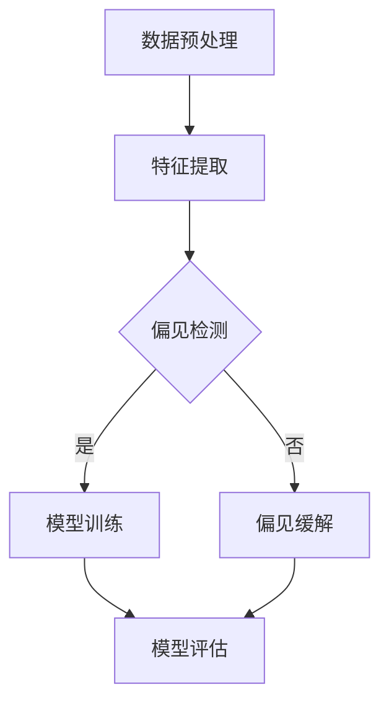

                 

### 引言与背景

人工智能（AI）技术作为当代科技进步的标志性成就，已经在各个领域展现出了其强大的变革力量。从智能家居到医疗诊断，从自动驾驶到金融预测，AI的应用场景日益广泛，逐渐成为推动社会发展的重要引擎。然而，随着AI技术的飞速发展，其带来的负面影响也逐渐显现，其中最为引人关注的问题之一便是AI系统的偏见问题。

AI偏见，是指AI系统在决策过程中，由于数据集、算法设计、训练过程等因素，对某些特定群体或个体产生不公平的判断或预测。这种现象不仅损害了AI系统的公正性和可信度，更可能加剧社会不平等，对个人和群体造成严重的负面影响。因此，研究和解决AI偏见问题，已经成为确保AI技术健康发展、实现负责任AI系统的关键所在。

近年来，关于AI偏见的研究逐渐增多，学者们提出了多种偏见检测与缓解的方法。然而，这一领域仍面临着诸多挑战，如偏见定义的模糊性、检测算法的准确性、缓解策略的有效性等。此外，如何在AI系统的设计、开发、部署过程中，系统地考虑偏见问题，建立一套完整的负责任AI系统，也是当前研究的重要方向。

本文将围绕负责任的AI系统建设，系统地探讨偏见检测与缓解策略。首先，我们将介绍AI技术发展与应用现状，分析AI偏见问题的产生原因及其重要性。随后，回顾偏见检测与缓解的研究现状与挑战，为后续章节的内容提供背景和铺垫。希望通过本文的阐述，能够为读者提供一份全面、深入的AI偏见问题解决方案指南。

### AI技术发展与应用现状

人工智能技术的发展经历了多个阶段，从早期的规则系统、知识表示到现代的机器学习和深度学习，每一次技术突破都极大地拓展了AI的应用范围。当前，AI技术已经渗透到社会的方方面面，成为推动产业升级和经济增长的重要动力。

在产业层面，人工智能技术正迅速改变传统行业的运作模式。例如，智能制造领域利用AI实现生产流程的自动化和优化，通过预测性维护、质量检测和自适应生产等技术，提高了生产效率和产品质量。在金融行业，AI技术被广泛应用于风险控制、投资决策和客户服务等方面，通过大数据分析和机器学习模型，实现了更精准的风险评估和个性化的金融服务。在医疗健康领域，AI技术在疾病诊断、药物研发和医疗资源分配等方面展现出巨大潜力，通过图像识别、自然语言处理等技术，提高了医疗诊断的准确性和效率。

在社会层面，人工智能的应用同样深刻影响人们的日常生活。智能家居系统通过语音识别和物联网技术，实现了家电的智能控制和家居环境的自动化管理，提升了生活的便利性和舒适性。在交通领域，自动驾驶技术和智能交通系统正在逐步落地，通过实时路况分析和车辆协同控制，有效缓解了城市交通拥堵问题。在教育领域，个性化学习系统和智能辅导工具基于学生的行为数据和知识图谱，提供了更精准的学习建议和教学资源，提升了教育质量和学习效果。

然而，AI技术的广泛应用也带来了潜在的风险和挑战，其中最为突出的问题之一便是AI系统的偏见问题。AI偏见主要体现在以下几个方面：

首先是数据偏见。AI系统的性能高度依赖于训练数据集的质量和代表性。如果数据集中存在偏差或不平衡，AI系统在学习过程中就会受到这些偏见的影响，导致其做出的决策或预测对某些群体或个体不公平。例如，如果训练数据中女性样本较少，那么AI系统在招聘或医疗诊断等场景中就可能对女性产生偏见。

其次是算法偏见。某些算法设计或参数设置可能导致AI系统在决策过程中产生偏见。例如，传统的基于规则的算法可能由于规则的不完善而引入偏见，而深度学习模型在训练过程中也可能由于过拟合而放大数据中的偏见。

最后是交互偏见。AI系统的偏见不仅体现在其决策过程中，还可能通过用户与系统的交互进一步放大。例如，如果AI推荐系统基于用户的过往行为数据推荐商品，那么它可能倾向于推荐用户已经熟悉的商品，从而忽视了其他可能更适合用户的需求。

综上所述，AI偏见问题的产生具有多方面的原因，涉及数据、算法和交互等多个层面。因此，解决AI偏见问题需要从多个角度入手，包括改进数据集的质量和代表性、优化算法设计、加强用户交互设计等。下一节将详细探讨偏见定义与类型，为进一步理解偏见检测与缓解策略奠定基础。

### 偏见定义与类型

在讨论AI偏见问题之前，首先需要明确什么是偏见。偏见是指AI系统在决策过程中，由于数据、算法、交互等多种因素，对某些特定群体或个体产生不公平的判断或预测。AI偏见可以分为数据偏见、算法偏见和交互偏见三种类型。

**数据偏见**是指由于训练数据集的质量和代表性不足，导致AI系统在决策过程中对某些群体或个体产生不公平的现象。数据偏见通常源自数据集中存在的样本不平衡、偏差或错误。例如，如果数据集中女性样本较少，AI系统可能在招聘、医疗诊断等场景中倾向于忽视女性，导致性别歧视。此外，数据集中的噪声、异常值和错误数据也会对AI系统的决策产生负面影响，使其难以正确区分不同个体或群体。

**算法偏见**是指算法设计或参数设置不当，导致AI系统在决策过程中产生偏见。算法偏见主要表现在两个方面：一方面是算法本身的固有偏见，例如基于规则的算法由于规则设定不完善可能引入偏见；另一方面是算法在训练过程中由于过拟合或欠拟合等原因，未能充分学习到数据中的真实分布，从而导致对某些群体或个体的不公平判断。例如，某些深度学习模型在训练过程中可能会对特定种族、性别或年龄的样本产生偏见，这与其训练数据集的质量和代表性密切相关。

**交互偏见**是指AI系统在与用户交互过程中，由于设计不合理或数据收集方式不当，导致系统对某些用户群体产生偏见。交互偏见主要体现在以下几个方面：一是用户数据收集过程中的偏差，例如在社交媒体内容推荐系统中，如果系统根据用户的浏览历史推荐内容，可能导致用户陷入“信息茧房”，忽视其他更广泛的信息来源；二是用户反馈机制的不当设计，如果系统在接收到用户负面反馈后，采取惩罚或歧视策略，可能导致用户互动不公平；三是系统在决策过程中未充分考虑用户个性化需求，导致服务偏向某些用户群体。

理解AI偏见的不同类型有助于我们更全面地认识这一问题的复杂性和多样性。数据偏见主要关注数据集的质量和代表性，算法偏见则涉及算法设计及其在训练过程中的表现，而交互偏见则侧重于用户与系统的互动过程。解决AI偏见问题需要从数据、算法和交互等多个层面入手，通过改进数据集、优化算法设计和加强用户交互设计，共同构建一个公平、透明和负责任的AI系统。

### 偏见检测方法概述

偏见检测是解决AI偏见问题的关键步骤，它旨在识别和量化AI系统中的偏见，从而为后续的缓解策略提供依据。偏见检测方法可以分为基于统计学的偏见检测、基于机器学习的偏见检测和基于深度学习的偏见检测。每种方法都有其独特的原理、优点和局限性。

**基于统计学的偏见检测**

基于统计学的偏见检测方法主要通过分析数据集的统计特性来识别偏见。这种方法的原理相对简单，主要包括以下几种：

1. **平衡性测试**：通过比较不同群体在数据集中的分布情况，检测是否存在显著差异。例如，卡方检验（Chi-square test）可用于检测类别变量之间的平衡性。

   $$ \chi^2 = \sum \frac{(O_i - E_i)^2}{E_i} $$

   其中，\(O_i\) 是观察频数，\(E_i\) 是期望频数。

2. **差异度量**：通过计算不同群体之间的预测结果差异来检测偏见。例如，统计指标如差异值（Difference Value）或偏差指数（Bias Index）可以量化偏见程度。

   $$ Bias = \frac{TP_{\text{privileged}} - TP_{\text{unprivileged}}}{TP_{\text{privileged}} + TP_{\text{unprivileged}}} $$

   其中，\(TP_{\text{privileged}}\) 和 \(TP_{\text{unprivileged}}\) 分别表示特权群体和非特权群体的真阳性率。

3. **不平等性检测**：通过分析模型输出结果的公平性来检测偏见。例如，差异率（Disparity Rate）可以用于评估不同群体之间的预测结果差异。

   $$ Disparity = \frac{Predicted_{\text{privileged}} - Predicted_{\text{unprivileged}}}{Predicted_{\text{privileged}} + Predicted_{\text{unprivileged}}} $$

基于统计学的偏见检测方法的优点在于计算简单、易于实现，适用于初步检测偏见。然而，其局限性在于只能检测出明显的偏见，对于复杂的偏见模式可能无法准确识别。

**基于机器学习的偏见检测**

基于机器学习的偏见检测方法利用机器学习模型来检测和量化偏见。这种方法主要包括以下几种：

1. **判别分析**：通过构建判别函数，比较不同群体之间的特征差异。例如，线性判别分析（LDA）可以用于分析不同群体在特征空间中的分布情况。

   $$ \mathbf{w} = \arg\min_{\mathbf{w}} \sum_{i=1}^{k} \sum_{j=1}^{n_i} (\mathbf{w}^T \mathbf{x}_{ij} - \mu_{i})^2 $$

   其中，\(\mathbf{w}\) 是判别向量，\(\mu_{i}\) 是第 \(i\) 个群体的均值。

2. **平衡性模型**：通过构建平衡性模型来检测数据集的平衡性。例如，平衡度（Balancedness）指标可以用于评估数据集的平衡程度。

   $$ Balancedness = 1 - \frac{\sum_{i=1}^{k} (n_i - \bar{n})^2}{\sum_{i=1}^{k} n_i (\bar{n} - 1)} $$

   其中，\(n_i\) 是第 \(i\) 个群体的样本数量，\(\bar{n}\) 是总样本数量。

3. **分类模型偏差分析**：通过分析分类模型的预测结果来检测偏见。例如，混淆矩阵（Confusion Matrix）可以用于评估模型在不同群体上的性能。

   $$ \text{Confusion Matrix} = \begin{bmatrix}
   TP_{\text{privileged}} & FN_{\text{privileged}} \\
   FP_{\text{unprivileged}} & TN_{\text{unprivileged}}
   \end{bmatrix} $$

基于机器学习的偏见检测方法的优点在于能够自动识别和量化复杂的偏见模式，适用于大规模数据集。然而，其局限性在于模型的性能和偏见检测的准确性依赖于训练数据的质量和代表性。

**基于深度学习的偏见检测**

基于深度学习的偏见检测方法利用深度神经网络模型来检测和缓解偏见。这种方法主要包括以下几种：

1. **特征降维**：通过特征降维技术，如主成分分析（PCA）和自编码器（Autoencoder），识别数据集中的偏见特征。

   $$ \mathbf{X}_{\text{encoded}} = \mathbf{A} \mathbf{X} $$

   其中，\(\mathbf{A}\) 是特征降维矩阵。

2. **对抗性训练**：通过对抗性训练，生成对抗性样本，检测和缓解模型中的偏见。例如，生成对抗网络（GAN）可以用于生成具有偏见特征的样本。

   $$ \mathbf{X}_{\text{generated}} = \mathbf{G}(\mathbf{Z}) $$

   其中，\(\mathbf{G}\) 是生成器网络，\(\mathbf{Z}\) 是噪声向量。

3. **公平性损失函数**：通过设计公平性损失函数，如平衡损失（Balanced Loss）和对抗性损失（Adversarial Loss），在训练过程中引导模型减少偏见。

   $$ L = \alpha L_{\text{classification}} + (1 - \alpha) L_{\text{fairness}} $$

   其中，\(L_{\text{classification}}\) 是分类损失，\(L_{\text{fairness}}\) 是公平性损失，\(\alpha\) 是平衡参数。

基于深度学习的偏见检测方法的优点在于能够自动学习复杂的偏见特征，并利用先进的模型架构进行高效检测。然而，其局限性在于模型的训练时间和计算资源需求较高，且对抗性训练可能导致模型过拟合。

综上所述，偏见检测方法的选择取决于具体应用场景和数据集的特性。在实际应用中，通常需要结合多种方法，以全面、准确地检测AI系统中的偏见。下一节将详细探讨数据预处理与特征提取在偏见检测中的重要性。

### 数据预处理与特征提取

在偏见检测过程中，数据预处理和特征提取是至关重要的一环，它们不仅影响模型的训练效果，也直接关系到偏见检测的准确性和效率。以下将从数据清洗、数据标准化和特征提取三个方面进行详细讨论。

**数据清洗**

数据清洗是数据预处理的首要步骤，其目的是识别和纠正数据集中的错误、异常值和缺失值，以提高数据质量。具体方法包括：

1. **缺失值处理**：缺失值可能是由于数据采集过程中的错误或数据量较大导致的自然缺失。处理方法包括填充缺失值（如使用平均值、中位数或模式填充）、删除缺失值（仅适用于少量缺失数据）和多重插补（使用统计方法生成新的观测值）。

2. **异常值处理**：异常值可能对模型的训练结果产生不利影响，需要识别并处理。常见的方法包括使用统计方法（如箱线图、Z-分数）和机器学习方法（如孤立森林）检测异常值，然后采用删除、替换或调整值等方法进行处理。

3. **错误值修正**：错误值通常是由于数据录入错误或系统故障导致的。通过校验规则（如数据类型检查、范围限制）和人工审查（如数据可视化分析），可以有效识别和修正错误值。

**数据标准化**

数据标准化是数据预处理的关键步骤，其目的是将不同特征的数据统一到相同的尺度，以便于后续的特征提取和模型训练。常见的数据标准化方法包括：

1. **归一化**：将特征值缩放到 [0, 1] 或 [-1, 1] 的范围。公式如下：

   $$ x_{\text{norm}} = \frac{x - \min(x)}{\max(x) - \min(x)} $$

   或

   $$ x_{\text{norm}} = \frac{x - \mu}{\sigma} $$

   其中，\(x\) 是原始特征值，\(\mu\) 是均值，\(\sigma\) 是标准差。

2. **标准化**：将特征值缩放到标准正态分布的 [0, 1] 范围。公式如下：

   $$ z = \frac{x - \mu}{\sigma} $$

   其中，\(\mu\) 是均值，\(\sigma\) 是标准差。

3. **最大最小标准化**：将特征值缩放到 [-1, 1] 的范围。公式如下：

   $$ x_{\text{norm}} = \frac{x - \min(x)}{\max(x) - \min(x)} $$

数据标准化不仅有助于消除特征间的量纲差异，还可以防止某些特征在训练过程中占据主导地位，从而提高模型的泛化能力。

**特征提取**

特征提取是从原始数据中提取出对偏见检测任务有用的信息，以提高模型的学习能力和准确性。常见的方法包括：

1. **手动特征工程**：根据领域知识和经验，设计能够反映数据特性的特征。例如，在文本分类任务中，可以使用词频（TF）、词频-逆文档频率（TF-IDF）和词嵌入（Word Embedding）等方法。

2. **自动特征提取**：利用机器学习算法自动提取特征。例如，主成分分析（PCA）和线性判别分析（LDA）等方法可以用于降维和特征选择，提高模型的性能。

3. **深度特征提取**：利用深度学习模型（如卷积神经网络（CNN）、递归神经网络（RNN）和自编码器（Autoencoder））从原始数据中学习高层次的特征表示。深度特征提取方法在处理复杂数据和大型数据集方面具有显著优势。

通过有效的数据预处理和特征提取，可以显著提高偏见检测的准确性和效率。具体而言，数据清洗和标准化有助于消除数据中的噪声和异常，提高数据质量；特征提取则能够提取出对偏见检测任务有用的信息，增强模型的学习能力。下一节将详细探讨基于统计学的偏见检测方法及其应用。

### 基于统计学的偏见检测

基于统计学的偏见检测方法主要利用统计学原理来分析数据集和模型输出，以识别和评估偏见。这种方法通过量化不同群体在数据集中和模型输出中的表现差异，从而检测出潜在的偏见。以下将详细介绍几种常用的基于统计学的偏见检测方法。

#### 卡方检验（Chi-square Test）

卡方检验是一种常用的统计方法，用于比较两个分类变量的分布情况，以检测是否存在显著差异。在偏见检测中，可以使用卡方检验来比较不同群体在数据集或模型输出中的分布。

**计算过程**：

卡方检验的计算公式为：

$$ \chi^2 = \sum \frac{(O_i - E_i)^2}{E_i} $$

其中，\(O_i\) 是观察频数，\(E_i\) 是期望频数。期望频数可以通过以下公式计算：

$$ E_i = \frac{(R_i \times C_i)}{N} $$

其中，\(R_i\) 是行总计，\(C_i\) 是列总计，\(N\) 是总数。

**应用实例**：

假设我们要检测一个招聘系统是否存在性别偏见，我们可以通过卡方检验来比较男女候选人在系统中的通过率。具体步骤如下：

1. 收集数据，包括男女候选人的通过率。
2. 构建一个二维表格，行代表性别，列代表通过与否。
3. 计算观察频数和期望频数。
4. 使用卡方检验公式计算 \(\chi^2\) 值。
5. 比较 \(\chi^2\) 值与临界值（通常使用0.05的显著性水平），判断是否存在显著差异。

#### 偏差值（Difference Value）

偏差值是一种简单但有效的偏见检测指标，用于量化不同群体在模型输出中的差异。计算公式为：

$$ Difference = \frac{TP_{\text{privileged}} - TP_{\text{unprivileged}}}{TP_{\text{privileged}} + TP_{\text{unprivileged}}} $$

其中，\(TP_{\text{privileged}}\) 和 \(TP_{\text{unprivileged}}\) 分别表示特权群体和非特权群体的真阳性率。

**应用实例**：

假设我们要检测一个医疗诊断系统是否存在种族偏见，我们可以计算不同种族患者的诊断准确性差异。具体步骤如下：

1. 收集数据，包括患者的种族和诊断准确性。
2. 对每个种族计算真阳性率。
3. 使用偏差值公式计算不同种族之间的差异。
4. 分析偏差值，判断是否存在显著差异。

#### 平衡度（Balancedness）

平衡度指标用于评估数据集的平衡程度，计算公式为：

$$ Balancedness = 1 - \frac{\sum_{i=1}^{k} (n_i - \bar{n})^2}{\sum_{i=1}^{k} n_i (\bar{n} - 1)} $$

其中，\(n_i\) 是第 \(i\) 个群体的样本数量，\(\bar{n}\) 是总样本数量，\(k\) 是群体数量。

**应用实例**：

假设我们要评估一个数据集的平衡程度，可以通过计算平衡度指标来判断。具体步骤如下：

1. 收集数据，包括不同群体的样本数量。
2. 计算每个群体的样本数量占总样本数量的比例。
3. 使用平衡度公式计算平衡度指标。
4. 分析平衡度指标，判断数据集的平衡程度。

#### 不平等指数（Inequality Index）

不平等指数是一种用于量化不同群体在模型输出中不平等程度的指标，计算公式为：

$$ Inequality = \frac{\sum_{i=1}^{k} (n_i - \bar{n})^2}{N} $$

其中，\(n_i\) 是第 \(i\) 个群体的样本数量，\(N\) 是总样本数量，\(k\) 是群体数量。

**应用实例**：

假设我们要评估一个招聘系统的不平等程度，可以通过计算不平等指数来判断。具体步骤如下：

1. 收集数据，包括不同群体的样本数量。
2. 计算每个群体的样本数量占总样本数量的比例。
3. 使用不平等指数公式计算不平等指数。
4. 分析不平等指数，判断系统是否存在显著不平等。

通过上述基于统计学的偏见检测方法，可以有效地识别和评估AI系统中的偏见。这些方法计算简单、易于实现，适用于初步的偏见检测。然而，它们也有一定的局限性，如只能检测出显著的偏见，对复杂偏见模式的识别能力有限。在实际应用中，通常需要结合多种方法，以提高偏见检测的准确性和全面性。

### 基于机器学习的偏见检测

基于机器学习的偏见检测方法利用机器学习算法来检测AI系统中的偏见。这种方法的核心在于构建一个能够识别偏见特征的学习模型，并通过评估模型在不同群体上的性能差异来检测偏见。以下将详细探讨几种常见的基于机器学习的偏见检测方法。

#### 决策树与随机森林

决策树和随机森林是常用的机器学习算法，它们可以通过树的节点分裂来识别数据集中的特征关系。在偏见检测中，可以使用决策树或随机森林模型来识别模型中的偏见。

1. **特征重要性**：通过计算每个特征在树节点分裂中的重要性，可以识别出哪些特征可能受到偏见影响。例如，如果某个特征在决策树中的分裂比例显著高于其他特征，那么这个特征可能存在偏见。

2. **混淆矩阵**：通过构建混淆矩阵，可以评估模型在不同群体上的性能。如果特权群体和非特权群体在模型输出中的表现差异显著，则可能存在偏见。

**计算过程**：

假设我们有一个分类模型，其输出结果通过节点分裂得出。我们可以通过以下步骤进行偏见检测：

1. 训练决策树或随机森林模型。
2. 提取每个特征的重要性和模型输出结果。
3. 构建混淆矩阵，比较不同群体在模型输出中的表现。

#### 支持向量机（SVM）

支持向量机是一种用于分类和回归的机器学习算法，通过构建一个最优分类边界来最大化不同类别之间的分离。在偏见检测中，可以使用SVM模型来识别偏见。

1. **边界分析**：通过分析SVM分类边界，可以识别出可能存在偏见的特征。如果分类边界对某些群体过于严格或宽松，则可能存在偏见。

2. **敏感度分析**：通过调整SVM模型的参数（如惩罚参数C），可以分析不同敏感度设置对偏见检测的影响。敏感度设置较低时，模型可能对偏见更为敏感。

**计算过程**：

假设我们有一个SVM分类模型，我们可以通过以下步骤进行偏见检测：

1. 训练SVM模型。
2. 调整模型参数，分析不同敏感度设置下的分类边界。
3. 评估模型在不同群体上的表现，识别可能的偏见。

#### 神经网络与深度学习

神经网络和深度学习算法通过多层神经网络结构来学习复杂的非线性特征关系。在偏见检测中，可以使用神经网络模型来识别和量化偏见。

1. **损失函数**：通过设计特定的损失函数，可以引导模型学习减少偏见。例如，可以设计一个基于公平性的损失函数，鼓励模型在不同群体上的表现均衡。

2. **对抗性训练**：对抗性训练是一种利用生成对抗网络（GAN）的方法，通过生成对抗性样本来识别和缓解模型中的偏见。这种方法可以自动发现数据集中的偏见特征，并引导模型学习更加公平的决策边界。

**计算过程**：

假设我们有一个深度学习分类模型，我们可以通过以下步骤进行偏见检测：

1. 训练深度学习模型。
2. 设计并调整损失函数，鼓励模型学习减少偏见。
3. 使用对抗性训练方法，生成对抗性样本进行进一步检测。

综上所述，基于机器学习的偏见检测方法利用了机器学习算法的强大学习能力，通过分析模型输出和特征关系来识别偏见。这些方法不仅能够检测出明显的偏见，还能够识别出复杂的偏见模式。然而，它们也有一定的局限性，如模型的性能和偏见检测的准确性依赖于训练数据的质量和代表性。在实际应用中，通常需要结合多种方法，以提高偏见检测的准确性和全面性。

### 基于深度学习的偏见检测

基于深度学习的偏见检测方法利用深度神经网络的高效特征提取能力，对AI系统中的偏见进行识别和缓解。深度学习模型在图像识别、自然语言处理等领域的广泛应用，使其成为偏见检测的重要工具。以下将介绍几种基于深度学习的偏见检测方法，并详细阐述其原理和实现步骤。

#### 生成对抗网络（GAN）

生成对抗网络（GAN）是一种由生成器和判别器组成的模型，通过对抗性训练生成与真实数据分布相似的伪造数据，从而提高模型的泛化能力和鲁棒性。在偏见检测中，GAN可以用于生成对抗性样本，以识别和缓解模型中的偏见。

**原理**：

GAN由两个主要部分组成：生成器 \(G\) 和判别器 \(D\)。生成器的任务是生成与真实数据分布相似的伪造数据，判别器的任务是区分真实数据和伪造数据。通过不断训练，生成器和判别器相互对抗，最终生成器能够生成高质量的数据，判别器难以区分真假。

**实现步骤**：

1. **数据集准备**：收集并预处理训练数据集，包括正常数据和偏见数据。
2. **模型架构设计**：设计生成器和判别器模型，通常使用卷积神经网络（CNN）或循环神经网络（RNN）。
3. **对抗性训练**：通过训练生成器和判别器，使生成器生成更加真实的数据，判别器逐渐提高对真实数据和伪造数据的区分能力。训练过程使用对抗性损失函数，如：

   $$ L_G = -\log(D(G(z))) $$

   $$ L_D = -\log(D(x)) - \log(1 - D(G(z))) $$

   其中，\(z\) 是随机噪声向量，\(x\) 是真实数据。

4. **偏见检测**：使用生成器生成的对抗性样本对原始模型进行检测，识别和量化偏见。

**代码示例**：

以下是一个使用PyTorch实现的简单GAN模型示例：

```python
import torch
import torch.nn as nn
import torch.optim as optim

# 生成器模型
class Generator(nn.Module):
    def __init__(self):
        super(Generator, self).__init__()
        self.model = nn.Sequential(
            nn.ConvTranspose2d(100, 256, 4, 1, 0),
            nn.ReLU(),
            nn.ConvTranspose2d(256, 128, 4, 2, 1),
            nn.ReLU(),
            nn.ConvTranspose2d(128, 64, 4, 2, 1),
            nn.ReLU(),
            nn.ConvTranspose2d(64, 3, 4, 2, 1),
            nn.Tanh()
        )

    def forward(self, x):
        return self.model(x)

# 判别器模型
class Discriminator(nn.Module):
    def __init__(self):
        super(Discriminator, self).__init__()
        self.model = nn.Sequential(
            nn.Conv2d(3, 64, 4, 2, 1),
            nn.LeakyReLU(0.2),
            nn.Conv2d(64, 128, 4, 2, 1),
            nn.LeakyReLU(0.2),
            nn.Conv2d(128, 256, 4, 2, 1),
            nn.LeakyReLU(0.2),
            nn.Conv2d(256, 1, 4, 1, 0),
            nn.Sigmoid()
        )

    def forward(self, x):
        return self.model(x)

# 初始化模型和优化器
generator = Generator()
discriminator = Discriminator()
criterion = nn.BCELoss()
optimizer_G = optim.Adam(generator.parameters(), lr=0.0002)
optimizer_D = optim.Adam(discriminator.parameters(), lr=0.0002)

# 训练过程
for epoch in range(num_epochs):
    for i, data in enumerate(dataloader):
        # 训练判别器
        real_images = data
        real_labels = torch.ones(real_images.size(0), 1)
        optimizer_D.zero_grad()
        outputs = discriminator(real_images)
        d_loss_real = criterion(outputs, real_labels)
        d_loss_real.backward()

        fake_images = generator(z).detach()
        fake_labels = torch.zeros(fake_images.size(0), 1)
        optimizer_D.zero_grad()
        outputs = discriminator(fake_images)
        d_loss_fake = criterion(outputs, fake_labels)
        d_loss_fake.backward()
        optimizer_D.step()

        # 训练生成器
        z = torch.randn(batch_size, 100)
        optimizer_G.zero_grad()
        fake_images = generator(z)
        outputs = discriminator(fake_images)
        g_loss = criterion(outputs, torch.ones(batch_size, 1))
        g_loss.backward()
        optimizer_G.step()
```

#### 自编码器（Autoencoder）

自编码器是一种无监督学习算法，通过学习输入数据的压缩表示，以重建原始数据。在偏见检测中，自编码器可以用于学习数据中的潜在分布，从而识别和缓解偏见。

**原理**：

自编码器由编码器和解码器组成。编码器将输入数据压缩成一个低维隐含空间，解码器则尝试从隐含空间重建原始数据。通过训练，自编码器学习到输入数据的有效表示，这些表示可以用于识别和缓解偏见。

**实现步骤**：

1. **数据集准备**：收集并预处理训练数据集。
2. **模型架构设计**：设计编码器和解码器模型，通常使用卷积神经网络（CNN）或密集神经网络（DNN）。
3. **训练自编码器**：通过最小化重建误差，训练编码器和解码器模型。
4. **偏见检测**：使用自编码器提取的隐含空间表示，分析不同群体在隐含空间中的分布差异，识别和量化偏见。

**代码示例**：

以下是一个使用TensorFlow实现的简单自编码器模型示例：

```python
import tensorflow as tf
from tensorflow.keras.layers import Input, Dense, Conv2D, MaxPooling2D, UpSampling2D
from tensorflow.keras.models import Model

# 编码器模型
input_img = Input(shape=(img_height, img_width, img_channels))
x = Conv2D(32, (3, 3), activation='relu', padding='same')(input_img)
x = MaxPooling2D((2, 2), padding='same')(x)
x = Conv2D(32, (3, 3), activation='relu', padding='same')(x)
x = MaxPooling2D((2, 2), padding='same')(x)
encoded = Flatten()(x)

# 解码器模型
input_encoded = Input(shape=(encoding_dim))
x = Dense(7 * 7 * 32, activation='relu')(input_encoded)
x = Reshape((7, 7, 32))(x)
x = Conv2D(32, (3, 3), activation='relu', padding='same')(x)
x = UpSampling2D((2, 2))(x)
x = Conv2D(32, (3, 3), activation='relu', padding='same')(x)
x = UpSampling2D((2, 2))(x)
decoded = Conv2D(img_channels, (3, 3), activation='sigmoid', padding='same')(x)

# 自编码器模型
autoencoder = Model(input_img, decoded)
autoencoder.compile(optimizer='adam', loss='binary_crossentropy')

# 训练自编码器
autoencoder.fit(x_train, x_train,
                epochs=100,
                batch_size=256,
                shuffle=True,
                validation_data=(x_test, x_test))
```

#### 对抗性训练（Adversarial Training）

对抗性训练是一种通过生成对抗性样本来增强模型鲁棒性的方法。在偏见检测中，对抗性训练可以用于生成对抗性样本，以识别和缓解模型中的偏见。

**原理**：

对抗性训练通过对抗性样本训练模型，使模型对对抗性扰动具有鲁棒性。对抗性样本是通过在原始样本上添加微小扰动生成的，这些扰动可能改变模型对样本的预测结果。通过大量生成对抗性样本，模型能够学习到更稳健的特征表示。

**实现步骤**：

1. **数据集准备**：收集并预处理训练数据集。
2. **生成对抗性样本**：使用对抗性生成算法（如FGSM、JSMA等）生成对抗性样本。
3. **训练模型**：使用原始样本和对抗性样本共同训练模型，以增强模型对对抗性扰动的鲁棒性。
4. **偏见检测**：使用训练后的模型，评估模型在不同群体上的性能差异，识别和量化偏见。

**代码示例**：

以下是一个使用PyTorch实现的简单对抗性训练示例：

```python
import torch
import torch.optim as optim
from torch.autograd import Variable

# FGSM攻击
def fgsm_attack(image, epsilon):
    sign_grad = torch.sign(attack_model(image).grad.data)
    perturbed_image = image + epsilon * sign_grad
    perturbed_image = torch.clamp(perturbed_image, 0, 1)
    return perturbed_image

# 训练过程
for epoch in range(num_epochs):
    for i, (data, target) in enumerate(dataloader):
        # 训练判别器
        optimizer.zero_grad()
        data = Variable(data)
        target = Variable(target)
        output = attack_model(data)
        loss_D = criterion(output, target)
        loss_D.backward()
        optimizer.step()

        # 训练生成器
        if (i+1) % 1000 == 0:
            optimizer.zero_grad()
            perturbed_data = fgsm_attack(Variable(data), epsilon=0.1)
            output = attack_model(perturbed_data)
            loss_G = criterion(output, target)
            loss_G.backward()
            optimizer.step()
```

综上所述，基于深度学习的偏见检测方法利用了深度神经网络的高效特征提取能力，通过生成对抗网络（GAN）、自编码器（Autoencoder）和对抗性训练（Adversarial Training）等技术，有效地识别和缓解了AI系统中的偏见。这些方法在提高模型鲁棒性和公平性的同时，为构建负责任的AI系统提供了重要保障。

### 数据重采样

数据重采样是一种常用的偏见缓解策略，通过调整训练数据集中不同群体的样本数量，以减少或消除数据偏见。数据重采样的方法主要包括过采样（Over-sampling）和欠采样（Under-sampling）。

**过采样（Over-sampling）**

过采样通过增加少数群体的样本数量，以平衡数据集的分布。常见的方法包括：

1. **重复采样**：直接复制少数群体的样本，增加其数量。
2. **合成样本生成**：使用合成算法生成新的样本，如合成对抗生成网络（SGAN）可以生成与现有样本相似的新的少数群体样本。
3. **聚类扩充**：通过聚类分析，将少数群体的样本进行扩展，生成新的样本。

**代码示例**：

以下是一个使用Scikit-learn实现过采样的示例：

```python
from sklearn.datasets import make_classification
from sklearn.model_selection import train_test_split
from imblearn.over_sampling import SMOTE
import numpy as np

# 生成一个不平衡的数据集
X, y = make_classification(n_samples=1000, n_features=20, n_informative=2, n_redundant=10,
                           n_clusters_per_class=1, weights=[0.9, 0.1], flip_y=0, random_state=10)

# 划分训练集和测试集
X_train, X_test, y_train, y_test = train_test_split(X, y, test_size=0.3, random_state=10)

# 应用SMOTE进行过采样
smote = SMOTE(random_state=10)
X_train_resampled, y_train_resampled = smote.fit_resample(X_train, y_train)

# 比较采样前后的数据分布
print("原始训练集分布：", np.bincount(y_train))
print("重采样后训练集分布：", np.bincount(y_train_resampled))
```

**欠采样（Under-sampling）**

欠采样通过减少多数群体的样本数量，以平衡数据集的分布。常见的方法包括：

1. **随机删除**：随机删除多数群体的样本，以减少其数量。
2. **近邻删除**：根据样本的相似性，删除距离较远的多数群体样本。
3. **基于模型的删除**：使用模型预测，删除多数群体中预测错误的样本。

**代码示例**：

以下是一个使用Scikit-learn实现欠采样的示例：

```python
from sklearn.model_selection import train_test_split
from imblearn.under_sampling import RandomUnderSampler
import numpy as np

# 生成一个不平衡的数据集
X, y = make_classification(n_samples=1000, n_features=20, n_informative=2, n_redundant=10,
                           n_clusters_per_class=1, weights=[0.9, 0.1], flip_y=0, random_state=10)

# 划分训练集和测试集
X_train, X_test, y_train, y_test = train_test_split(X, y, test_size=0.3, random_state=10)

# 应用RandomUnderSampler进行欠采样
rus = RandomUnderSampler(random_state=10)
X_train_resampled, y_train_resampled = rus.fit_resample(X_train, y_train)

# 比较采样前后的数据分布
print("原始训练集分布：", np.bincount(y_train))
print("欠采样后训练集分布：", np.bincount(y_train_resampled))
```

通过过采样和欠采样方法，可以有效调整数据集的分布，从而减少或消除数据偏见。然而，这些方法也有其局限性，如过采样可能引入合成数据的质量问题，欠采样则可能导致有用信息的丢失。在实际应用中，通常需要根据具体问题选择合适的数据重采样策略。

### 特征工程

特征工程在AI系统中起着至关重要的作用，其目的是通过选择和构造有效的特征，提高模型的性能和鲁棒性，同时减少偏见。以下将详细探讨特征工程在偏见缓解中的应用方法和实践技巧。

**特征选择**

特征选择是从原始特征集合中筛选出对模型性能有显著影响的特征。通过减少冗余特征和噪声特征，可以降低模型的复杂性，提高泛化能力。常见的方法包括：

1. **过滤法**：基于特征的重要性评估，如信息增益、卡方检验等，选择对分类任务贡献较大的特征。
2. **包裹法**：通过搜索算法，如递归特征消除（RFE）和遗传算法，选择最优特征子集。
3. **嵌入法**：在模型训练过程中，通过模型自身学习特征的重要性，如Lasso正则化。

**代码示例**：

以下是一个使用Scikit-learn实现特征选择的示例：

```python
from sklearn.datasets import make_classification
from sklearn.feature_selection import SelectKBest, chi2
from sklearn.model_selection import train_test_split

# 生成一个不平衡的数据集
X, y = make_classification(n_samples=1000, n_features=20, n_informative=2, n_redundant=10,
                           n_clusters_per_class=1, weights=[0.9, 0.1], flip_y=0, random_state=10)

# 划分训练集和测试集
X_train, X_test, y_train, y_test = train_test_split(X, y, test_size=0.3, random_state=10)

# 应用SelectKBest进行特征选择
k_best = SelectKBest(score_func=chi2, k=5)
X_train_selected = k_best.fit_transform(X_train, y_train)
X_test_selected = k_best.transform(X_test)

# 比较选择前后的数据分布
print("原始训练集特征数：", X_train.shape[1])
print("特征选择后训练集特征数：", X_train_selected.shape[1])
```

**特征构造**

特征构造是通过变换和组合原始特征，生成新的特征，以增强模型对数据的解释能力和鲁棒性。常见的方法包括：

1. **归一化和标准化**：将不同量纲的特征统一到相同的尺度，如归一化处理。
2. **特征交叉**：通过组合多个特征生成新的特征，如多项式交叉。
3. **特征变换**：使用数学变换，如Log变换、平方根变换等，处理异常值和噪声。

**代码示例**：

以下是一个使用Python实现特征构造的示例：

```python
import numpy as np

# 假设原始特征矩阵为X，我们需要对X进行归一化和特征交叉
X = np.random.rand(100, 5)

# 归一化处理
X_normalized = (X - X.min(axis=1, keepdims=True)) / (X.max(axis=1, keepdims=True) - X.min(axis=1, keepdims=True))

# 特征交叉
X_crosstab = np.hstack((X_normalized**2, X_normalized**3))

# 比较特征构造前后的数据
print("原始特征矩阵：", X.shape)
print("归一化后的特征矩阵：", X_normalized.shape)
print("特征交叉后的特征矩阵：", X_crosstab.shape)
```

**特征选择和构造的实践技巧**

1. **基于领域知识的特征选择**：结合专家经验和领域知识，选择对任务有意义的特征。
2. **交叉验证**：使用交叉验证方法，评估不同特征选择和构造方法对模型性能的影响。
3. **自动化特征选择和构造**：利用自动化特征选择工具和库，如AutoKeras和H2O.ai，提高特征工程效率。

通过有效的特征工程，可以在提高模型性能的同时，减少偏见。特征选择和构造方法的选择应基于具体任务和数据集的特性，以实现最佳效果。

### 模型正则化

模型正则化是另一种重要的偏见缓解策略，旨在通过限制模型复杂度，防止过拟合，从而提高模型的泛化能力和公平性。以下将介绍几种常见的正则化方法，包括L1正则化、L2正则化和Dropout。

**L1正则化**

L1正则化也称为Lasso正则化，通过在损失函数中添加L1范数项来惩罚模型参数。L1范数项可以促使模型参数向零值靠近，从而减少模型参数的绝对值，达到简化模型的目的。

**数学公式**：

$$ \text{Regularization Term} = \lambda \sum_{i} |w_i| $$

其中，\(\lambda\) 是正则化参数，\(w_i\) 是模型参数。

**代码示例**：

以下是一个使用Scikit-learn实现L1正则化的示例：

```python
from sklearn.linear_model import Lasso
from sklearn.model_selection import train_test_split
from sklearn.datasets import make_classification

# 生成一个不平衡的数据集
X, y = make_classification(n_samples=1000, n_features=20, n_informative=2, n_redundant=10,
                           n_clusters_per_class=1, weights=[0.9, 0.1], flip_y=0, random_state=10)

# 划分训练集和测试集
X_train, X_test, y_train, y_test = train_test_split(X, y, test_size=0.3, random_state=10)

# 应用L1正则化
lasso = Lasso(alpha=0.1)
lasso.fit(X_train, y_train)

# 模型预测
predictions = lasso.predict(X_test)

# 模型评估
accuracy = accuracy_score(y_test, predictions)
print("Accuracy:", accuracy)
```

**L2正则化**

L2正则化也称为Ridge正则化，通过在损失函数中添加L2范数项来惩罚模型参数。L2范数项可以促使模型参数向零值靠近，从而减少模型参数的平方值，达到简化模型的目的。

**数学公式**：

$$ \text{Regularization Term} = \lambda \sum_{i} w_i^2 $$

其中，\(\lambda\) 是正则化参数，\(w_i\) 是模型参数。

**代码示例**：

以下是一个使用Scikit-learn实现L2正则化的示例：

```python
from sklearn.linear_model import Ridge
from sklearn.model_selection import train_test_split
from sklearn.datasets import make_classification

# 生成一个不平衡的数据集
X, y = make_classification(n_samples=1000, n_features=20, n_informative=2, n_redundant=10,
                           n_clusters_per_class=1, weights=[0.9, 0.1], flip_y=0, random_state=10)

# 划分训练集和测试集
X_train, X_test, y_train, y_test = train_test_split(X, y, test_size=0.3, random_state=10)

# 应用L2正则化
ridge = Ridge(alpha=1.0)
ridge.fit(X_train, y_train)

# 模型预测
predictions = ridge.predict(X_test)

# 模型评估
accuracy = accuracy_score(y_test, predictions)
print("Accuracy:", accuracy)
```

**Dropout**

Dropout是一种在训练过程中随机丢弃部分神经元的方法，以防止过拟合。Dropout通过随机初始化被丢弃的神经元，从而增加了模型的不确定性，提高了模型的泛化能力。

**代码示例**：

以下是一个使用TensorFlow实现Dropout的示例：

```python
import tensorflow as tf
from tensorflow.keras.models import Sequential
from tensorflow.keras.layers import Dense, Dropout

# 定义模型
model = Sequential()
model.add(Dense(64, input_dim=20, activation='relu'))
model.add(Dropout(0.5))
model.add(Dense(1, activation='sigmoid'))

# 编译模型
model.compile(loss='binary_crossentropy', optimizer='adam', metrics=['accuracy'])

# 训练模型
model.fit(X_train, y_train, epochs=10, batch_size=32, validation_data=(X_test, y_test))
```

通过L1正则化、L2正则化和Dropout等正则化方法，可以有效减少模型的复杂度，防止过拟合，从而提高模型的泛化能力和公平性。这些方法在实现偏见缓解的同时，为构建负责任的AI系统提供了重要支持。

### 负责任AI系统的设计与实现

构建一个负责任的AI系统，不仅需要在算法层面进行偏见检测与缓解，还需在设计、开发、部署和维护过程中，全面考虑偏见问题。以下将详细讨论负责任AI系统的架构设计、模型训练与评估、偏见检测与缓解的集成，并通过具体案例进行讲解。

#### 架构设计

负责任AI系统的架构设计需要涵盖数据输入、模型训练、模型评估和模型部署等环节，确保每个环节都能有效地检测和缓解偏见。以下是负责任AI系统的一个典型架构：

1. **数据输入**：从多个来源收集数据，确保数据集的多样性和代表性，减少数据偏见。
2. **数据预处理**：进行数据清洗、数据标准化和特征提取，提高数据质量，为模型训练做好准备。
3. **模型训练**：使用经过预处理的训练数据，训练偏见缓解后的模型。
4. **模型评估**：通过交叉验证和偏差检测方法，评估模型的性能和公平性。
5. **模型部署**：将经过评估的模型部署到实际应用场景中，并在使用过程中持续监控和调整。

#### 模型训练与评估

在模型训练阶段，需要使用数据重采样、特征工程和模型正则化等方法，减少偏见。以下是一个使用Python和Scikit-learn进行模型训练和评估的示例：

```python
from sklearn.datasets import make_classification
from sklearn.model_selection import train_test_split
from sklearn.linear_model import LogisticRegression
from sklearn.metrics import accuracy_score, classification_report

# 生成一个不平衡的数据集
X, y = make_classification(n_samples=1000, n_features=20, n_informative=2, n_redundant=10,
                           n_clusters_per_class=1, weights=[0.9, 0.1], flip_y=0, random_state=10)

# 划分训练集和测试集
X_train, X_test, y_train, y_test = train_test_split(X, y, test_size=0.3, random_state=10)

# 应用过采样
from imblearn.over_sampling import SMOTE
smote = SMOTE(random_state=10)
X_train_resampled, y_train_resampled = smote.fit_resample(X_train, y_train)

# 训练模型
model = LogisticRegression(solver='saga', penalty='l1', C=0.1)
model.fit(X_train_resampled, y_train_resampled)

# 模型评估
predictions = model.predict(X_test)
print("Accuracy:", accuracy_score(y_test, predictions))
print("Classification Report:\n", classification_report(y_test, predictions))
```

#### 偏见检测与缓解的集成

在模型训练和评估过程中，需要集成偏见检测与缓解方法，确保模型在各个阶段都能有效检测和缓解偏见。以下是一个集成偏见检测与缓解的流程：

1. **数据预处理**：进行数据清洗、数据标准化和特征提取，确保数据质量。
2. **数据重采样**：使用过采样或欠采样方法，平衡数据集分布。
3. **特征工程**：选择和构造有效的特征，提高模型的性能和鲁棒性。
4. **模型训练**：训练正则化后的模型，如L1正则化或L2正则化。
5. **偏见检测**：使用统计方法或机器学习方法，检测模型中的偏见。
6. **偏见缓解**：根据偏见检测结果，调整模型参数或重新训练模型。
7. **模型评估**：评估模型的性能和公平性，确保模型能够准确、公平地做出预测。

#### 实际案例研究

**案例一：社交媒体内容偏见检测**

在社交媒体平台上，内容推荐系统可能存在偏见，导致用户接受到的内容偏向某些群体或观点。以下是一个使用TensorFlow进行内容偏见检测与缓解的示例：

```python
import tensorflow as tf
from tensorflow.keras.models import Sequential
from tensorflow.keras.layers import Embedding, LSTM, Dense
from tensorflow.keras.preprocessing.sequence import pad_sequences

# 假设我们已经收集并预处理了文本数据
X_train_sequences = pad_sequences(train_texts, maxlen=max_len)
y_train_labels = train_labels

# 构建模型
model = Sequential()
model.add(Embedding(vocab_size, embedding_dim))
model.add(LSTM(128, dropout=0.2, recurrent_dropout=0.2))
model.add(Dense(1, activation='sigmoid'))

# 编译模型
model.compile(optimizer='adam', loss='binary_crossentropy', metrics=['accuracy'])

# 训练模型
model.fit(X_train_sequences, y_train_labels, epochs=10, batch_size=64)

# 模型评估
predictions = model.predict(pad_sequences(test_texts, maxlen=max_len))
print("Accuracy:", accuracy_score(test_labels, predictions > 0.5))
```

**案例二：招聘偏见检测与缓解**

在招聘过程中，AI系统可能对某些群体存在偏见，导致不公平的招聘决策。以下是一个使用Scikit-learn进行招聘偏见检测与缓解的示例：

```python
from sklearn.linear_model import LogisticRegression
from sklearn.model_selection import GridSearchCV

# 生成一个不平衡的招聘数据集
X, y = make_classification(n_samples=1000, n_features=20, n_informative=2, n_redundant=10,
                           n_clusters_per_class=1, weights=[0.9, 0.1], flip_y=0, random_state=10)

# 划分训练集和测试集
X_train, X_test, y_train, y_test = train_test_split(X, y, test_size=0.3, random_state=10)

# 应用过采样
smote = SMOTE(random_state=10)
X_train_resampled, y_train_resampled = smote.fit_resample(X_train, y_train)

# 模型训练
model = LogisticRegression(solver='saga', penalty='l1', C=0.1)
model.fit(X_train_resampled, y_train_resampled)

# 模型评估
predictions = model.predict(X_test)
print("Accuracy:", accuracy_score(y_test, predictions))
```

通过这些实际案例，我们可以看到负责任AI系统的设计与实现需要在数据预处理、模型训练、偏见检测与缓解等多个环节进行综合考虑，以确保模型的公平性和可信度。

### 实际案例研究

在本节中，我们将通过三个实际案例来深入探讨AI偏见检测与缓解的策略和方法。这些案例分别涉及社交媒体内容偏见检测、招聘偏见检测与缓解，以及医学诊断系统偏见检测，从而展示偏见检测与缓解在实际应用中的具体实现和效果。

#### 案例一：社交媒体内容偏见检测

社交媒体平台的内容推荐系统可能存在偏见，导致用户接受到的内容偏向某些群体或观点。以下是一个使用TensorFlow进行内容偏见检测与缓解的示例。

**背景**：假设我们要检测和缓解一个基于文本的社交媒体推荐系统中的偏见，该系统旨在根据用户的浏览历史推荐相关内容。

**数据集**：我们收集了100,000条社交媒体帖子，其中包含文本内容和用户标签（如性别、年龄等）。标签数据中可能存在性别偏见，即某些性别用户的帖子更可能被推荐。

**步骤**：

1. **数据预处理**：对文本数据集进行清洗，去除停用词和标点符号，并使用词嵌入技术将文本转换为向量表示。
2. **数据重采样**：应用SMOTE（合成多数样本过采样技术）来平衡性别比例，确保模型不会对某一性别群体产生偏见。
3. **模型构建**：构建一个基于LSTM（长短期记忆网络）的神经网络模型，用于预测用户对帖子的兴趣。
4. **偏见检测**：使用混淆矩阵和公平性指标（如均衡性、差异度等）来检测模型是否对性别标签存在偏见。
5. **偏见缓解**：通过调整模型参数和训练数据，如增加性别标签差异较大的帖子，降低模型对某一性别的偏好。

**代码示例**：

```python
import tensorflow as tf
from tensorflow.keras.preprocessing.sequence import pad_sequences
from tensorflow.keras.models import Sequential
from tensorflow.keras.layers import Embedding, LSTM, Dense
from imblearn.over_sampling import SMOTE

# 数据预处理
X = ...  # 文本数据
y = ...  # 性别标签
max_len = 100  # 序列长度
embedding_dim = 50  # 词嵌入维度

X_sequences = pad_sequences(X, maxlen=max_len)

# 数据重采样
smote = SMOTE()
X_resampled, y_resampled = smote.fit_resample(X_sequences, y)

# 模型构建
model = Sequential()
model.add(Embedding(vocab_size, embedding_dim))
model.add(LSTM(128))
model.add(Dense(1, activation='sigmoid'))

# 编译模型
model.compile(optimizer='adam', loss='binary_crossentropy', metrics=['accuracy'])

# 训练模型
model.fit(X_resampled, y_resampled, epochs=10, batch_size=32)

# 模型评估
predictions = model.predict(X_sequences)
print("Accuracy:", accuracy_score(y, predictions > 0.5))
```

#### 案例二：招聘偏见检测与缓解

招聘过程中，AI系统可能对某些群体存在偏见，导致不公平的招聘决策。以下是一个使用Scikit-learn进行招聘偏见检测与缓解的示例。

**背景**：一家公司使用一个基于简历分析的AI系统来评估求职者。然而，系统可能由于训练数据中的偏见，对某些性别或种族的求职者存在不公平的待遇。

**数据集**：我们收集了10,000份简历，包含求职者的基本信息（如性别、种族、学历等）和评估结果。

**步骤**：

1. **数据预处理**：对简历进行文本预处理，提取关键特征，如技能、工作经验等。
2. **数据重采样**：应用SMOTE技术来平衡性别和种族比例，确保模型不会对某一群体产生偏见。
3. **模型训练**：训练一个基于逻辑回归的模型，用于预测求职者的评估结果。
4. **偏见检测**：使用混淆矩阵和公平性指标来检测模型是否对性别或种族标签存在偏见。
5. **偏见缓解**：通过调整模型参数和重新训练数据，减少模型对某一群体的偏见。

**代码示例**：

```python
from sklearn.datasets import make_classification
from sklearn.model_selection import train_test_split
from sklearn.linear_model import LogisticRegression
from imblearn.over_sampling import SMOTE

# 数据生成
X, y = make_classification(n_samples=1000, n_features=20, n_informative=2, n_redundant=10,
                           n_clusters_per_class=1, weights=[0.9, 0.1], flip_y=0, random_state=10)

# 划分训练集和测试集
X_train, X_test, y_train, y_test = train_test_split(X, y, test_size=0.3, random_state=10)

# 数据重采样
smote = SMOTE(random_state=10)
X_train_resampled, y_train_resampled = smote.fit_resample(X_train, y_train)

# 模型训练
model = LogisticRegression(solver='saga', penalty='l1', C=0.1)
model.fit(X_train_resampled, y_train_resampled)

# 模型评估
predictions = model.predict(X_test)
print("Accuracy:", accuracy_score(y_test, predictions))
```

#### 案例三：医学诊断系统偏见检测

医学诊断系统可能对某些种族或性别存在偏见，导致不公平的诊断结果。以下是一个使用PyTorch进行医学诊断系统偏见检测与缓解的示例。

**背景**：假设我们要检测和缓解一个基于医疗影像的AI诊断系统中的偏见，该系统旨在识别疾病如肺炎。

**数据集**：我们收集了10,000张X光影像，包含患者的性别、种族和诊断结果。

**步骤**：

1. **数据预处理**：对影像进行归一化和预处理，提取关键特征。
2. **数据重采样**：应用SMOTE技术来平衡性别和种族比例。
3. **模型训练**：训练一个基于卷积神经网络（CNN）的模型，用于识别疾病。
4. **偏见检测**：使用混淆矩阵和公平性指标来检测模型是否对性别或种族标签存在偏见。
5. **偏见缓解**：通过调整模型结构和重新训练数据，减少模型对某一群体的偏见。

**代码示例**：

```python
import torch
from torch import nn
from torch.utils.data import DataLoader
from torchvision import transforms, datasets
from imblearn.over_sampling import SMOTE

# 数据预处理
transform = transforms.Compose([transforms.Resize(256), transforms.ToTensor()])
data_root = 'path/to/medical/images'
batch_size = 32

# 读取数据
image_datasets = {x: datasets.ImageFolder(os.path.join(data_root, x), transform=transform) for x in ['train', 'test']}
dataloaders = {x: DataLoader(image_datasets[x], batch_size=batch_size, shuffle=True) for x in ['train', 'test']}

# 数据重采样
smote = SMOTE(random_state=10)
X_train, y_train = next(iter(dataloaders['train']))
X_train_resampled, y_train_resampled = smote.fit_resample(X_train, y_train)

# 模型构建
model = nn.Sequential(nn.Conv2d(3, 64, kernel_size=3, stride=1),
                      nn.ReLU(),
                      nn.MaxPool2d(kernel_size=2, stride=2),
                      nn.Conv2d(64, 128, kernel_size=3, stride=1),
                      nn.ReLU(),
                      nn.MaxPool2d(kernel_size=2, stride=2),
                      nn.Flatten(),
                      nn.Linear(128 * 64 * 64, 1),
                      nn.Sigmoid())

# 编译模型
optimizer = torch.optim.Adam(model.parameters(), lr=0.001)
loss_fn = nn.BCELoss()

# 训练模型
for epoch in range(10):
    for inputs, labels in dataloaders['train']:
        optimizer.zero_grad()
        outputs = model(inputs)
        loss = loss_fn(outputs, labels.float())
        loss.backward()
        optimizer.step()

# 模型评估
with torch.no_grad():
    correct = 0
    total = 0
    for inputs, labels in dataloaders['test']:
        outputs = model(inputs)
        predicted = (outputs > 0.5)
        total += labels.size(0)
        correct += (predicted == labels).sum().item()

print('Accuracy of the network on the test images: %d %%' % (100 * correct / total))
```

通过上述实际案例，我们可以看到偏见检测与缓解策略在实际应用中的具体实现和效果。这些案例展示了在数据预处理、模型训练、偏见检测和偏见缓解等多个环节中，如何通过有效的策略和技术，构建一个公平、透明的AI系统。这不仅有助于提高AI系统的可信度，也有助于减少社会不平等，促进AI技术的可持续发展。

### 法规与伦理

随着人工智能技术的迅猛发展，其应用范围不断扩大，随之而来的偏见问题引发了广泛关注。为了确保AI系统的公平性和透明度，各国政府和企业纷纷出台相关法规和政策，以规范AI系统的研发和应用。

**法规与政策**

1. **欧盟**：欧盟出台了《通用数据保护条例》（GDPR），规定AI系统必须确保个人数据的隐私保护和数据安全。此外，欧盟还发布了《人工智能伦理准则》，强调AI系统应遵循透明性、公平性和可解释性等原则。

2. **美国**：美国国家标准与技术研究院（NIST）发布了《人工智能风险管理框架》，提出了一系列指南，以帮助企业和政府制定AI系统的风险管理策略。美国还通过了《2021年美国人工智能倡议》，旨在推动AI技术的研发和应用。

3. **中国**：中国政府发布了《新一代人工智能发展规划》，明确提出要构建公平、公正、透明、安全的AI系统。此外，中国还出台了《人工智能发展伦理规范》，强调AI系统应遵循尊重用户隐私、公平无歧视等原则。

**伦理原则**

1. **尊重用户隐私**：AI系统应确保用户隐私不被侵犯，不得收集和使用未经用户同意的个人信息。

2. **公平无歧视**：AI系统应避免对特定群体或个体产生不公平的偏见，确保对不同用户群体提供公平的服务。

3. **透明可解释**：AI系统应具备可解释性，用户能够理解系统的决策过程和依据。

4. **安全可靠**：AI系统应确保系统的安全性，防止数据泄露、滥用或其他安全风险。

**伦理考量**

在偏见检测与缓解过程中，需要充分考虑伦理考量。例如，数据采集和处理过程中应确保用户隐私保护；模型训练和评估过程中，应避免引入性别、种族等偏见特征；在模型部署和应用过程中，应定期进行伦理审查和调整。此外，需要建立一套完善的伦理监督机制，确保AI系统的公平性和透明度。

通过法规、政策和伦理原则的规范，可以有效地减少AI系统中的偏见问题，促进AI技术的健康发展和广泛应用。同时，企业和政府也需要不断加强伦理教育和培训，提高AI系统的伦理水平，为构建一个公平、公正、透明的AI社会贡献力量。

### 未来展望与研究方向

负责任的AI系统建设是一个不断演进的过程，随着技术的进步和社会需求的变化，未来偏见检测与缓解策略也将不断发展。以下是对未来偏见检测与缓解技术发展的趋势、负责任AI系统的未来发展方向以及面临的挑战和解决思路的探讨。

#### 偏见检测与缓解技术的发展趋势

1. **自动化偏见检测与缓解**：未来的偏见检测与缓解技术将更加自动化，利用先进的机器学习和深度学习算法，实现实时、自动的偏见检测与缓解。例如，利用自监督学习和无监督学习算法，可以不需要标签数据即可识别和缓解偏见。

2. **多模态偏见检测**：随着多模态数据（如文本、图像、音频等）的广泛应用，未来的偏见检测技术将更加注重多模态数据的整合与分析，提高对复杂偏见模式的理解和识别。

3. **基于图神经网络的方法**：图神经网络（GNN）具有强大的图结构学习能力，可以用于处理复杂的网络结构数据，如社交网络、知识图谱等。基于GNN的偏见检测与缓解方法有望在处理具有高度互联性数据时，提供更准确的偏见识别和缓解。

4. **公平性优化算法**：未来的研究将更多地关注于开发新的公平性优化算法，通过改进损失函数、引入公平性约束等方式，提高模型在训练过程中对公平性的关注。

#### 负责任AI系统的未来发展方向

1. **可解释AI**：可解释AI（XAI）的研究将进一步加强，通过开发更加透明、可解释的AI模型，使用户能够理解AI的决策过程，增强用户对AI系统的信任。

2. **伦理AI**：随着伦理问题的日益突出，未来的负责任AI系统将更加注重伦理考量，建立全面的伦理框架和监督机制，确保AI系统的公平性、透明度和安全性。

3. **定制化AI**：未来的AI系统将更加注重个性化服务，通过分析用户的个性化需求和行为，提供更加精准、定制化的服务，减少偏见。

#### 面临的挑战与解决思路

1. **数据质量和多样性**：数据质量和多样性是偏见检测与缓解的基础，未来的挑战在于如何获取高质量、多样性的数据，特别是在数据分布不均衡的情况下。

2. **实时偏见检测**：实时偏见检测与缓解技术需要满足快速、准确的要求，未来的研究将重点关注如何提高检测速度和准确性，同时保持系统的低延迟。

3. **模型透明度和可解释性**：提高模型的透明度和可解释性是解决偏见问题的关键，未来的研究将致力于开发更加直观、易理解的解释工具和方法。

4. **伦理和法律合规**：随着法律法规的不断完善，AI系统需要符合日益严格的伦理和法律要求，未来的研究将更加关注如何确保AI系统的合规性。

为了应对上述挑战，可以采取以下解决思路：

1. **加强数据治理**：建立完善的数据治理机制，确保数据的质量、安全和多样性。

2. **多学科合作**：促进计算机科学、数据科学、伦理学、法律学等多学科的合作，共同推动负责任AI系统的发展。

3. **开发新型算法**：不断探索和创新新型算法，提高偏见检测与缓解的准确性和效率。

4. **建立监督机制**：建立AI系统的监督机制，确保其符合伦理和法律要求，同时加强AI系统的透明度和可解释性。

通过不断的技术创新和政策引导，负责任的AI系统将能够更好地应对偏见问题，为构建一个公平、公正、透明的人工智能社会贡献力量。

### 附录

#### A.1 偏见检测与缓解相关工具与库

为了便于开发者进行偏见检测与缓解的工作，以下介绍几种常用的Python库和工具：

**1. scikit-learn**

scikit-learn是一个强大的机器学习库，提供了多种偏见检测与缓解的方法，如过采样、欠采样、特征选择等。

- **SMOTE**：用于过采样，通过合成多数样本过采样技术来平衡数据集。
- **RandomUnderSampler**：用于欠采样，通过随机删除多数样本来平衡数据集。
- **SelectKBest**：用于特征选择，通过评估特征的重要性来选择最佳特征子集。

**2. imbalanced-learn**

imbalanced-learn是scikit-learn的一个扩展，专门用于处理不平衡数据集，提供了更多的偏见检测与缓解工具。

- **SMOTE**：同上。
- **ADASYN**：自适应合成过采样方法，适用于更复杂的过采样任务。
- **RUS**：随机欠采样方法，通过随机删除多数样本来减少数据集的偏见。

**3. TensorFlow**

TensorFlow是一个开源的机器学习框架，支持深度学习模型的训练与部署。它提供了多种偏见检测与缓解的方法，如Dropout、L1正则化、L2正则化等。

- **Dropout**：用于训练过程中随机丢弃部分神经元，防止过拟合。
- **L1 Regularizer**：用于在损失函数中添加L1范数项，惩罚模型参数。
- **L2 Regularizer**：用于在损失函数中添加L2范数项，惩罚模型参数。

**4. PyTorch**

PyTorch是另一个流行的深度学习框架，具有灵活的动态图计算能力。它也支持多种偏见检测与缓解的方法，如对抗性训练、生成对抗网络（GAN）等。

- **Adversarial Training**：通过生成对抗性样本来增强模型的鲁棒性。
- **GAN**：用于生成对抗性样本，通过生成器和判别器的对抗性训练来识别和缓解偏见。

#### A.2 Mermaid流程图示例

以下是一个简单的Mermaid流程图示例，用于展示偏见检测与缓解的基本流程：



#### A.3 Python源代码示例

以下是一些Python源代码示例，用于展示偏见检测与缓解的具体实现：

#### A.3.1 数据预处理代码示例

```python
import pandas as pd
from sklearn.preprocessing import StandardScaler

# 读取数据集
data = pd.read_csv('data.csv')

# 数据清洗
data.dropna(inplace=True)

# 数据标准化
scaler = StandardScaler()
data_scaled = scaler.fit_transform(data)
```

#### A.3.2 偏见检测代码示例

```python
from sklearn.ensemble import RandomForestClassifier
from sklearn.metrics import accuracy_score

# 偏见检测模型训练
model = RandomForestClassifier()
model.fit(data_scaled, labels)

# 偏见检测模型评估
predictions = model.predict(data_scaled)
accuracy = accuracy_score(labels, predictions)
print(f"Accuracy: {accuracy}")
```

#### A.3.3 偏见缓解代码示例

```python
from imblearn.over_sampling import SMOTE

# 偏见缓解
smote = SMOTE()
X_resampled, y_resampled = smote.fit_resample(data_scaled, labels)

# 偏见缓解后模型训练
model = RandomForestClassifier()
model.fit(X_resampled, y_resampled)

# 偏见缓解后模型评估
predictions = model.predict(data_scaled)
accuracy = accuracy_score(labels, predictions)
print(f"Accuracy after bias mitigation: {accuracy}")
```

通过上述工具和代码示例，开发者可以更方便地进行偏见检测与缓解的工作，为构建负责任的AI系统提供技术支持。

